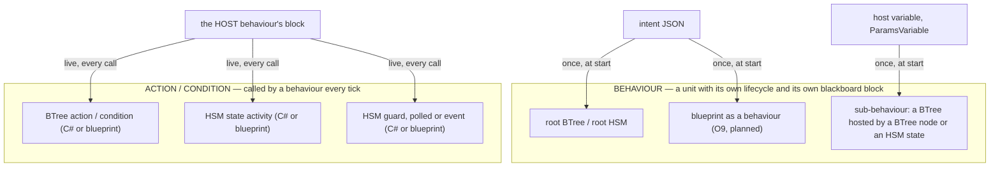
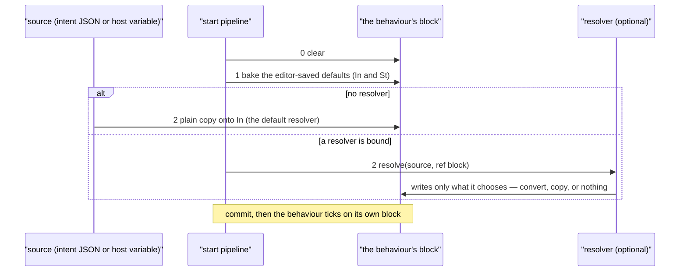
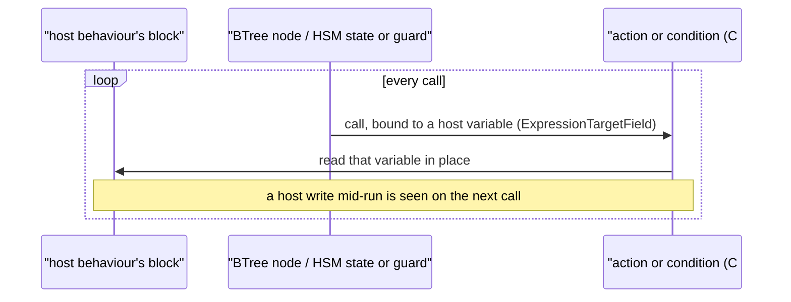
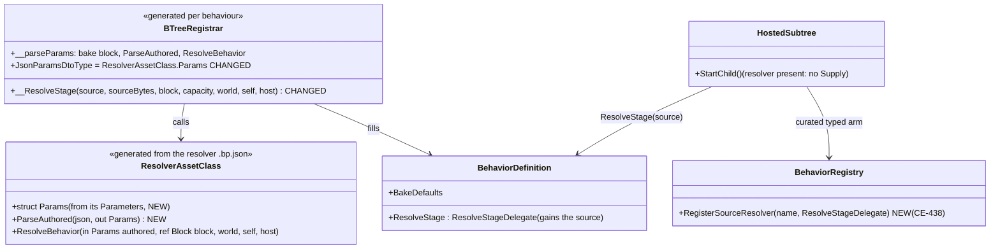
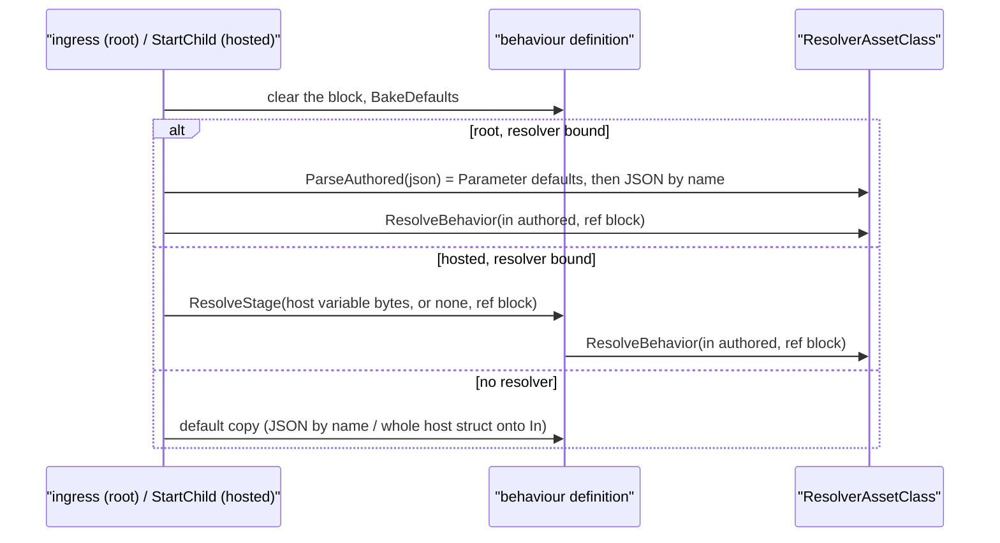
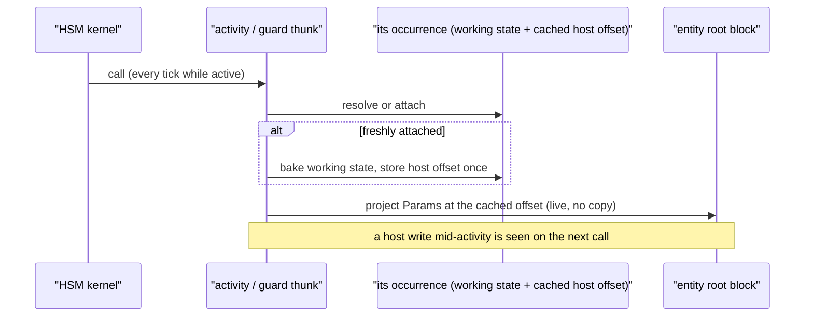
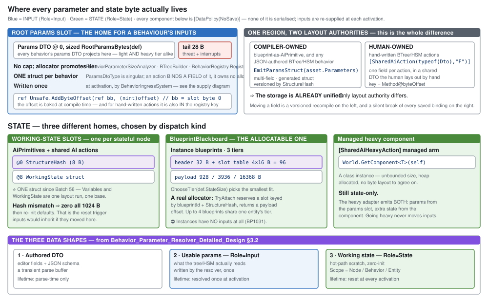
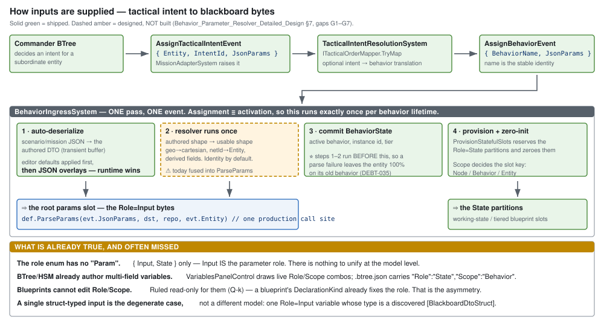
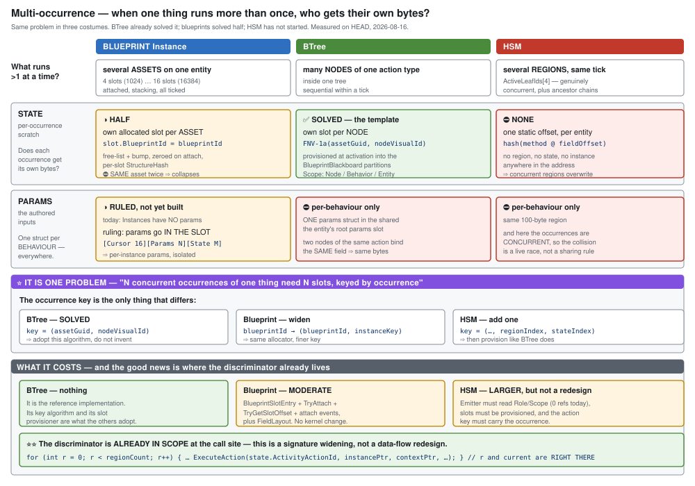

<!--STATUS
state: LIVE
updated: 2026-09-22
updated-2: 2026-09-30 — §P added: THE PARAMETER CONTRACT BY KIND (user ruling R-155). ⭐ READ §P FIRST.
current-answer: ⭐⭐⭐ §P — the contract by kind (behaviour: inputs once at start, resolver REPLACES the copy;
  action/condition: live host reference, no copy, no resolver), its as-built table §P.5, §P.6 (IHostVariableAccess retired, user 2026-09-30) and §P.7 (a blueprint's authored params — all decided 2026-09-30: Parameters + Get All Parameters, no nullables).
  The rest of the document is authoritative for parameters and storage where §P does not override it.
  See 3.1's AS BUILT 2026-09-08 (CE-235) for the two-member split of the authored DTO
  vs the blackboard layout - that is the live shape of BehaviorDefinition.
  READ 4.7 FIRST for hosted occurrences: as of 2026-09-21 (E3a) a HOSTED occurrence's params
  live in ITS OWN OCCURRENCE SLOT. As of 2026-09-22 (P4) a ROOT behaviour's params do too -
  the root params occurrence slot, keyed OccurrenceSlotKey.ComputeRootParamsKey and computed
  rather than stored - so there is no shared blackboard params region left at all.
known-rot: 4.1's params column is SUPERSEDED for HOSTED occurrences by 4.7 (E3a, 2026-09-21)
  and for ROOT occurrences by P4 (2026-09-22, DESIGN_Occurrence_Scoped_Storage.md §30.14): a
  root behaviour's params now live in the root params occurrence slot, same as a hosted
  occurrence's. Do not quote 4.1's params column as the whole live state; quote 4.7 for
  anything hosted, and §30.14 there for the root slot.
  4.5/4.5a describe CE-298 as FILED-NOT-BUILT: that is HISTORY as of 2026-09-21, see 4.7.
  (none-otherwise) - the BP1031-as-live rot was REPAIRED 2026-08-17, Batch 82; the
  section 3.2 "overlay is NOT implemented on every path" correction was REPAIRED
  2026-08-18 (it had gone false at Batch 70/74) and now sits under a HISTORY fold
known-rot: (2026-09-30, §P) §1's Scope row: Entity is REMOVED (CE-441) and Scope is not authorable (CE-435) —
  Node = a blueprint node's private memory, Behavior = the shared block copy. §3.4's host accessor is RETIRED (§P.6, user 2026-09-30).
  §0 row 2 "a blueprint has params only when Dispatch == AiPrimitive" predates §3.3's Instance params.
known-conflict: gives Scope three values; Q-b in Variable_Model_Unification rules two. RESOLVED 2026-09-30 by
  CE-441 (Entity removed) — two remain, neither authorable.
related-designs:
  - Architect_Question_75_One_Params_Pipeline_And_One_Action_Binding.md — owns the UNIFICATION of the params pipeline (one
    ParseParams factory, G1's deserialize/resolve split, the HSM blackboard struct) and of the
    action-binding carrier. It is DESIGN, not built; it depends on this document's model and
    does not change it.
  - DESIGN_Occurrence_Scoped_Storage.md — owns WHERE the bytes live and HOW an occurrence is
    addressed (the slot key, the tier components, the one FastHSM change). This document owns
    WHAT a parameter is and the rulings it must obey; it wins on any disagreement.
    ⭐ 2026-09-21: its 24-26 carry the AS-BUILT of the occurrence seam, and its 26.1 carries the
    rule that blocks 4.5 here — "storage without supply is a regression".
  - DESIGN_Resolver_World_Reach.md — owns the RESOLVE stage's reach and selection: what a
    resolver graph can read (R4), the one shape that serves all five supply paths
    (ResolveParams<TDto>), and R-149's rule that a params REGION names its own resolver.
    This document owns the bake/overlay/resolve/write ORDER; that one owns who runs the
    middle step and with what in scope.
  - EXPLAINER_Where_Parameters_And_State_Live.md — the file:line measurement record behind §2.
  - Architect_Question_34_Blueprint_Occurrence_Identity.md — blueprint Instance slot identity.
  - Architect_Question_76_One_Blackboard_Block_Per_Primitive.md — owns the BLOCK a behaviour's inputs land in
    (one block per running behaviour) and the build history of the start pipeline (§12). §P here owns the
    CONTRACT; Q76 §12.26 records the 2026-09-30 switch and its slices.
  - Architect_Question_77_Blueprint_As_A_Behaviour.md — the BUILD design for blueprint-as-a-behaviour (CE-446): its
    Parameters/resolver follow §P.2/§P.7 unchanged; its own Construction graph is its one resolver.
  - Architect_Question_33_Blueprint_Brain_Tier.md — owns blueprint-as-a-behaviour (O9, the third BrainTier);
    it inherits §P.2 unchanged.
  - Behavior_Parameter_Resolver_Detailed_Design.md — the original resolver model; its pipeline ORDER is
    amended by §P.2 (the resolver replaces stage 2, it does not follow it).
  - BTree_AiActionParameterBinding_Detailed_Design.md — owns HOW a BTree action binds its host variable (§P.3).
  - DESIGN_Hsm_Blueprint_Behaviour_Authoring.md — owns how an HSM state/guard binds a blueprint; its activation
    SEED is superseded by §P.3 (CE-444).
-->
# DESIGN — the parameter model *(AUTHORITATIVE, `2026-08-16`)*

> ⭐⭐⭐ **THIS IS THE PARAMETER STORY. Read this before touching parameters, inputs, variables or
> blackboard storage in ANY host.** Everything here is either **measured on `HEAD`** (with file:line) or
> a **dated user ruling**. ⛔ **Nothing in it is an open question.**
>
> ### ⛔ Supersedes
>
> | document | what of it |
> |---|---|
> | 📄 [`Behavior_Parameter_Resolver_Detailed_Design.md`](Behavior_Parameter_Resolver_Detailed_Design.md) *(`2026-07-13`)* | ⭐ **its model and pipeline STAND and are quoted below.** ⛔ **§7's `G1`–`G7` gap list is STALE** — four had closed by `2026-08-16` (§6) |
> | 📄 `.dev/_DONE/blueprint-scenario/BLUEPRINT-SCENARIO-DESIGN.md` §6 *(`Overrides`)* | ⛔ **SUPERSEDED as the mechanism** — Instances use the resolver, not a name→value dict (§3.3) |
> | 📄 [`PLAN_Cross_Host_Sequencing.md`](PLAN_Cross_Host_Sequencing.md) §2 (`D2`), §6 (Phase B) | ⛔ **superseded** — `W8`/`W12` dropped, `D2` dissolved |
> | 📄 [`EXPLAINER_Where_Parameters_And_State_Live.md`](EXPLAINER_Where_Parameters_And_State_Live.md) | ⭐ **kept as the measurement record + diagrams.** ⛔ **This doc wins on any disagreement** |
> | 📄 [`Architect_Question_33`](Architect_Question_33_Blueprint_Brain_Tier.md) | ⚠ **NOT part of this story — but NOT parked either.** ⛔ **CORRECTED `2026-09-19`:** this row said *"PARKED"*, which `Q33`'s own header has contradicted since `2026-08-16` *("UNPARKED — resolved jointly with the user")*. ⭐ It is **scoped out of the parameter story and COMMITTED as a follow-on** — 🔒 user, `2026-09-19`: *"I need it (using blueprint instance as root behavior) to be solved after the occurences"* ⇒ **after [`DESIGN_Occurrence_Scoped_Storage.md`](DESIGN_Occurrence_Scoped_Storage.md) `O8`; see its §12** |

---

## P. ⭐⭐⭐ THE PARAMETER CONTRACT BY KIND — **behaviours take inputs once; actions read live** *(user ruling, `2026-09-30`)*

> 🔒 **User, `2026-09-30`, verbatim:** *"actions are not behaviors, so they reference host blackboard (no param
> copy, they do not have any resolver) and respond to changes in host blackoard immediately even mid run. Hsm is
> a behavior, so it should follow the "my model" above, taking inputs only when they start."* · *"only behaviors
> have optional custom resolvers applied once on behavior start"* · on the resolver: *"I thought custom resolver
> gets the source … and copies or converts the stuff itself. So if it does not copy anything … nothing is copied"*
> → *"yes, switch to my model please. I need consistency."*
>
> ⭐⭐⭐ **This section is the CANONICAL statement of how every kind of AI unit gets its parameters.** Every other
> document that describes supply, seeding or resolvers defers to it. ⚠ It is the **TARGET**: §P.5 says what is
> already built and which item builds the rest. 📐 Ledger row `R-155`.

### P.1 Two kinds — and nothing in between


```mermaid
flowchart TD
    subgraph BEH["BEHAVIOUR — a unit with its own lifecycle and its own blackboard block"]
        R["root BTree / root HSM"]
        S["sub-behaviour: a BTree hosted by a BTree node or an HSM state"]
        BP["blueprint as a behaviour (O9, planned)"]
    end
    subgraph ACT["ACTION / CONDITION — called by a behaviour every tick"]
        A1["BTree action / condition (C# or blueprint)"]
        A2["HSM state activity (C# or blueprint)"]
        A3["HSM guard, polled or event (C# or blueprint)"]
    end
    SRC1["intent JSON"] -->|once, at start| R
    SRC2["host variable, ParamsVariable"] -->|once, at start| S
    SRC1 -->|once, at start| BP
    HB["the HOST behaviour's block"] -->|live, every call| A1
    HB -->|live, every call| A2
    HB -->|live, every call| A3
```

> ⭐ **Caption.** The split is by **lifecycle**, not by language or host: anything that STARTS and RUNS is a
> behaviour and takes its inputs at the start; anything a behaviour CALLS reads the caller's blackboard as it is at
> that call. ⛔ A blueprint is on either side depending on how it is used — a blueprint action is an action.

### P.2 A behaviour — inputs once, at start


```mermaid
sequenceDiagram
    participant Src as "source (intent JSON or host variable)"
    participant P as "start pipeline"
    participant B as "the behaviour's block"
    participant Res as "resolver (optional)"
    P->>B: 0 clear
    P->>B: 1 bake the editor-saved defaults (In and St)
    alt no resolver
        Src->>B: 2 plain copy onto In (the default resolver)
    else a resolver is bound
        P->>Res: 2 resolve(source, ref block)
        Res->>B: writes only what it chooses — convert, copy, or nothing
    end
    Note over P,B: commit, then the behaviour ticks on its own block
```

> ⭐ **Caption.** There is ONE stage 2, and the resolver **replaces** it — it is not run on top of a copy.
> ⇒ an empty resolver body leaves the block at its baked defaults.

| rule | |
|---|---|
| **source** | a ROOT behaviour: the intent's JSON, deserialised to the behaviour's authored DTO · a SUB-behaviour: the host variable its node/state names (`ParamsVariable`) — already the binary authored DTO, so there is nothing to deserialise |
| **no resolver** | the source lands on the block's `In` half. From JSON it is applied **by field name** (a field absent from the JSON keeps its baked default); from a host variable it is the **whole struct** |
| **a resolver** | receives the **source** and `ref block` (baked defaults already in). It may convert, copy, or write anything — including `St`. ⭐ The authored DTO may therefore differ from `In` (e.g. geo lat/long → cartesian) |
| **how many** | **one per behaviour** (`R-152`), named by the behaviour (`R-149`, `R-154`); hand-written C# `[BehaviorResolver]` or a blueprint resolver asset (`CE-428`) |
| **when** | **once, at start.** A re-assign or re-start runs the whole pipeline again from empty (`R-153`) |
| **after start** | the block is the behaviour's own. A host that changes its variable later does NOT reach a running sub-behaviour until it restarts |

### P.3 An action / condition — no copy, no resolver


```mermaid
sequenceDiagram
    participant H as "host behaviour's block"
    participant K as "BTree node / HSM state or guard"
    participant A as "action or condition (C# or blueprint)"
    loop every call
        K->>A: call, bound to a host variable (ExpressionTargetField)
        A->>H: read that variable in place
        Note over A,H: a host write mid-run is seen on the next call
    end
```

> ⭐ **Caption.** Nothing is copied and nothing resolves — the action works directly on its host's variable.
> ⭐ A blueprint action keeps its **own working memory** (`WorkingState`, a per-node slot — `Node` scope, kept by
> the user `2026-09-30`); only its **params** are the host's, read live.

#### P.3a ⭐ The working-memory lifecycle of an action / guard *(measured + confirmed by the user, `2026-09-30`)*

🔒 **User:** *"are they behaving almost identically to action (stateful, initialized once on first activation, retaining
their state until whole behavior is cancelled?)"* — ⭐ **yes, as measured:**

| | |
|---|---|
| **created** | on the **first** call (first activity dispatch / first guard evaluation), not at behaviour start — `OccurrenceWorkingState.ResolveOrAttach` → `freshlyAttached`; its defaults are baked ONCE there (`InitDefaultWorkingState`). ⚠ The store is sized for it at assign, so the late attach cannot run out of room |
| **every call / poll** | finds the same memory and runs the tick graph once; a guard passes on `Success` (`AiPrimitiveEmitter.EmitHsmGuardThunk`) |
| **across state exit and re-entry** | ⭐ **kept** — nothing detaches it on exit |
| **released** | on re-assign / clear of the whole behaviour (`BehaviorIngressSystem` → `DetachHostedOccurrenceSlots`), or when a hot reload changes its layout |
| **one per** | (HSM, region, the state that owns the transition, blueprint asset) — `HsmOccurrence.KeyFor`, stamped by the kernel (`HsmKernelCore.cs:724`). ⚠ So one guard asset on two transitions of the same state, or one asset used as that state's activity AND guard, share one memory |

⚠ Contrast: a BTree hosted as an HSM state's / BTree node's CHILD is reset when its host leaves it (`HostedSubtree`
deactivator, `F14`) — a sub-behaviour restarts, an action/guard keeps its memory.

### P.4 What this deliberately rules out

| ⛔ | why |
|---|---|
| a resolver on an action / condition / activity / guard | they have no authored input to convert; their params ARE host variables. ⚠ Retires the blueprint primitive's own Construction-graph resolver (`HostedParamResolvers`, `Q43`, `CE-432`'s shape ②) |
| a params COPY for an action | the action would stop seeing host changes mid-run |
| running a resolver on top of an automatic copy | two ways to fill one field; an author could not stop the copy (§P.2 caption) |
| a **reusable** resolver (a Library `Construction` graph refining a named DTO, published by name) | nothing names it: a resolver is the ONE optional stage of ONE behaviour, and `R-152` refused per-variable resolvers — its only intended use. ⛔ Retired by `CE-448` |

### P.5 As-built vs target

| rule | today | builds it |
|---|---|---|
| root behaviour, no resolver: JSON applied by name onto `In` | ✅ | — |
| root behaviour, hand-written C# resolver gets the source | ✅ | — |
| root behaviour, **blueprint resolver asset** gets the source | ✅ `CE-443` (`2026-09-30`): the JSON is parsed into the resolver's own Parameters and nothing is copied onto `In` | — |
| sub-behaviour, no resolver: whole host struct copied onto `In` | ✅ (`CE-431`) | — |
| sub-behaviour, resolver gets the host bytes | ✅ `CE-443`: the host variable is the resolver's source, no copy; a curated TYPED resolver runs from the bytes (`CE-438` closed); a JSON-shaped curated one throws, with the reason | — |
| C# action / condition reads live | ✅ BTree · ✅ HSM since `CE-444` (`2026-09-30`; the `[SharedAiAction]` HSM thunk used to seed a copy — measured, this row once said ✅ wrongly) | — |
| **blueprint action in a BTree** reads live | ✅ — and it has no resolver (`CE-445`, `2026-09-30`) | — |
| **blueprint HSM activity / guard** reads live | ✅ `CE-444` (`2026-09-30`): projected from the root block at the host offset cached in its occurrence | — |
| no action-level resolver anywhere | ✅ `CE-445` (`2026-09-30`): `HostedParamResolvers`, `IHostVariableAccess`, `HsmHostVariableAccess`, the name map and the `host` argument deleted; a Construction graph on a non-Library asset is `BP1676` | — |
| no reusable resolver | ✅ `CE-448` (`2026-09-30`): `BlueprintDefinition.Resolvers`, `BlueprintResolverEntry`, the demos `ParamResolverDemo`/`ResolverWorldReachDemo` deleted; a Library `Construction` graph without a `ResolverSubject` is `BP1676`. ⚠ `ResolveParams<T>`/`BehaviorParams.FromJson` KEPT as a public helper for hand-written `ParseParams` — measured: no production caller, only the `ParameterSupplyRails`/`HsmOccurrenceKey` tests | — |
| blueprint as a behaviour | ⛔ | `CE-446` = `O9` / [`Q33`](Architect_Question_33_Blueprint_Brain_Tier.md) |

### P.6 ✅ DECIDED `2026-09-30` — retire the host accessor (`IHostVariableAccess`)

🔒 **User, `2026-09-30`:** *"Retire it."* ✅ **DONE by `CE-445`** — it removed the interface, `HsmHostVariableAccess`, the
`HsmParamBindings` name map and the `host` parameter on every resolver signature. This reverses §3.4's `2026-08-16` ruling;
the history below is kept as the reason.


§3.4 below (user ruling `2026-08-16`) gave a HOSTED unit's resolver read-only, name-keyed access to its host's
variables. ⛔ Its only consumers were action-level resolvers, which §P.4 retires; behaviour resolvers pass `null`
today. ⭐ **Lean: retire it** — a sub-behaviour's input is exactly its bound host variable, and a child needing more
of its host should get a bigger bound struct, not a side door. ⭐ Decided as above.

📐 **Measured `2026-09-30` — how it works today, and that it is never fed.** The one implementation,
`HsmHostVariableAccess`, exists only for a blueprint activity/guard inside an HSM. It looks a name up in
`HsmParamBindings._variables`, keyed by the host HSM's `StructureHash` (read from the running instance's
`InstanceHeader.MachineId`), then by the variable name (ordinal, case-sensitive). That gives an
(offset, size) inside the host's root params slot. A read fails closed on an unknown machine or name, a size
different from `sizeof(T)`, or an out-of-bounds read. ⛔⛔ **The only writer of that map,
`HsmParamBindings.RegisterVariables`, has no production caller** — three test calls (`HsmOccurrenceKeyTests`),
and no emitter or registrar. Its doc comment says it is *"emitted from the same `packedFields`"*; that is
false. ⇒ in production every read returns `false`. And no blueprint node or curated resolver reads through
it: blueprint resolver graphs have no host-read node, and curated resolvers are root-only, so they get
`null`. ⇒ retiring it removes plumbing that is neither fed nor read.

### P.7 ✅ A blueprint's authored params — no JSON; declared Parameters; read with Get All Parameters *(`2026-09-30`)*

| question | as built (measured) | target |
|---|---|---|
| who parses the intent JSON | ✅ **generated C#, never the blueprint.** The registrar's `ParseParams` walks the JSON object by key and deserialises each variable with `System.Text.Json` (`BTreeBridgeEmitCore.cs:1497`); unknown keys are ignored, a missing key keeps its baked default | unchanged — a blueprint never sees JSON |
| what a blueprint resolver receives | the authored DTO is injected as a C# parameter, `in TAuthored authored` (`LibraryEmitter.cs:270`) — ✅ **`CE-443`:** the asset's Parameters become its `Params`; `GetVariable`/`GetAllParametersNode` read `authored.X` (`EmissionContext.ParamsVar`); `BP1011` allows Parameters on a resolver asset; writes to a Parameter stay refused (`V_ResolverPurity`). ⛔ HISTORY: before, no node read `authored` and the T40 demo read the copy | ✅ built |
| where the AUTHORED shape is declared, and its defaults | 📐 **editor-authored BTree:** nowhere separate — the authored contract IS the block's `In` struct (`BehaviorResolverShape.AuthoredTypeId`; `JsonParamsDtoType = typeof(In)`, `BTreeBridgeEmitCore.cs:500`); defaults = the Input variables' `DefaultValueJson`. **editor HSM:** no authored contract at all (`HsmBridgeEmitCore.cs:179`). **hand-written C#:** a `[BehaviorContract]` class (e.g. `Hrot.Core/MapDefinitions/Behavior/MoveToLocationParamsJsonDto.cs`, geo lat/lon) published as the `paramSchema`; no editor, no default beyond the C# initialiser; ⚠ a generated asset's own `In` outranks a contract of the same name (`BehaviorRegistry.cs:476`) ⇒ **an editor-authored behaviour cannot have an authored shape different from `In` today** | ✅ **APPROVED** — user `2026-09-30`: *"approved, use Parameters with Get All Parameters"*. **The resolver asset's PARAMETERS declare the authored shape** (with editor defaults, `DefaultValueJson`); its Variables stay the block. A behaviour WITH a resolver publishes that as its `JsonParamsDtoType`; WITHOUT one the authored shape is `In` (the default copy needs identical shapes). Lifts `BP1011` for resolver assets |
| how the graph reads them — ⭐ **consistency with every other blueprint** | 📐 AiPrimitive and Instance blueprints receive params as **declared Parameters**, read by `GetVariable` (one) or the built-in pure **`GetAllParametersNode`** (one output pin per Parameter, `Stage0_Rehydrate.cs:295`, in the palette, used by shipped `HillAssault2_*` assets). Function / Event / Macro entry nodes flatten their inputs to **one pin per field** (`Stage0_Rehydrate.cs:240`). ⛔ No blueprint today receives its inputs as ONE struct pin | ✅ **APPROVED** (same ruling): **reuse `GetVariable`/`GetAllParametersNode` on the declared Parameters** — nothing new to build or learn; the resolver's generated method maps Parameters onto `authored`. ⛔ Not an Entry struct pin: it would be the only place inputs arrive as a struct |
| a **nullable** field (`float?`) | ⛔ not designed (no `Nullable` handling in the blueprint core, compiler, editor pin types or generators, grep `2026-09-30`) | ✅ **refused** — user `2026-09-30`: *"Ok, no nullables."* *"Not given"* = the baked default, or an explicit `bool HasX` field |

### P.8 ✅ `CE-443` BUILD DESIGN — **the resolver receives the source** *(`2026-09-30`, build-state: BUILT — as built, matches the diagrams below)*

**INVENTORY** *(grep + read, `2026-09-30`; the codebase-memory graph was disconnected for most of this session, so
this list is grep-derived — ⚠ not an exhaustive graph enumeration)*: `ResolveStageDelegate` (1 declaration,
`BehaviorRegistry.cs:55`) · `BehaviorDefinition.ResolveStage` (1 producer: `BTreeBridgeEmitCore` `:1582`; 2 callers:
the emitted `ParseParams` `:1526`, `HostedSubtree.StartChild` `:240`) · `ResolverSubjectDecl.AuthoredTypeId`
(1 consumer: `LibraryEmitter.cs:270`; 1 producer: `BehaviorResolverAuthoring.cs:65`) · blueprint resolver assets
shipped: **1** (`T40Resolver.bp.json`) · curated `[BehaviorResolver]` in production: **all JSON-shaped** (the typed
`ResolveBlock` shape is test-only) · HSM resolver assets: **none** (`HsmBridgeEmitCore` has no resolver arm — out
of scope here).


```mermaid
classDiagram
    class ResolverAssetClass {
        <<generated from the resolver .bp.json>>
        +struct Params  (from its Parameters, NEW)
        +ParseAuthored(json, out Params) NEW
        +ResolveBehavior(in Params authored, ref Block block, world, self, host)
    }
    class BTreeRegistrar {
        <<generated per behaviour>>
        +__parseParams: bake block, ParseAuthored, ResolveBehavior
        +__ResolveStage(source, sourceBytes, block, capacity, world, self, host) CHANGED
        +JsonParamsDtoType = ResolverAssetClass.Params  CHANGED
    }
    class BehaviorDefinition {
        +BakeDefaults
        +ResolveStage : ResolveStageDelegate  (gains the source)
    }
    class HostedSubtree {
        +StartChild()  (resolver present: no Supply)
    }
    class BehaviorRegistry {
        +RegisterSourceResolver(name, ResolveStageDelegate) NEW  (CE-438)
    }
    BTreeRegistrar --> ResolverAssetClass : calls
    BTreeRegistrar --> BehaviorDefinition : fills
    HostedSubtree --> BehaviorDefinition : ResolveStage(source)
    HostedSubtree --> BehaviorRegistry : curated typed arm
```

> ⭐ **Caption.** The authored shape moves from "the BTree's `In` struct" to **the resolver asset's own `Params`**,
> so the resolver OWNS the shape it converts from. A behaviour with no resolver is unchanged.


```mermaid
sequenceDiagram
    participant Ing as "ingress (root) / StartChild (hosted)"
    participant Def as "behaviour definition"
    participant Res as "ResolverAssetClass"
    Ing->>Def: clear the block, BakeDefaults
    alt root, resolver bound
        Ing->>Res: ParseAuthored(json) = Parameter defaults, then JSON by name
        Ing->>Res: ResolveBehavior(in authored, ref block)
    else hosted, resolver bound
        Ing->>Def: ResolveStage(host variable bytes, or none, ref block)
        Def->>Res: ResolveBehavior(in authored, ref block)
    else no resolver
        Ing->>Def: default copy (JSON by name / whole host struct onto In)
    end
```

| decision | why |
|---|---|
| `ResolveStageDelegate` gains `(byte* source, int sourceBytes)`; `source == null` ⇒ the authored defaults | one stage, both callers — an unbound hosted child still gets the resolver's defaults |
| the hosted source must be exactly `sizeof(Params)` — else THROW | the host variable IS the authored DTO; a width mismatch can only be a wrong binding (the `CE-431` rule, moved) |
| `ResolverSubjectDecl.AuthoredTypeId` is **deleted** | its only consumer now derives `{class}.Params`; keeping it would be a second producer (`R-132`) |
| `BP1011` allows Parameters on a resolver asset; they are read-only (`in`) | §P.7 |
| a curated **typed** resolver whose `TAuthored` is unmanaged also registers a from-bytes arm (`CE-438`); a JSON-shaped one hosted still THROWS, with the reason | a JSON parse cannot consume host bytes |
| `host` (`IHostVariableAccess`) is left in the signatures | removed by `CE-445`, not here — one churn per signature |

### P.9 ✅ `CE-444` DESIGN — **HSM activities and guards read their host live** *(`2026-09-30`, build-state: BUILT — option B, as drawn)*

**INVENTORY** *(grep, `2026-09-30`)*: the activation-time params copy is emitted in **two** places —
`AiPrimitiveEmitter.EmitParamSeed` (blueprint HSM activity/guard, and the standalone `BTreeTick@0` thunk) and
`HsmActionGenerator.cs:629` (hand-written C# `[SharedAiAction]` on an HSM state). Both key the copy on
`HsmOccurrence.SeedParamsOffset` → `HsmParamBindings.SeedOffsetFor` (a dictionary). A BTree action (C# or
blueprint-composed) already projects live from `BehaviorBlock.Require(ref bb)+offset`.

| claim | code — how it IS | design — how it was MEANT to be |
|---|---|---|
| the copy happens once, at activation | ✅ `if (freshlyAttached) { *__params = … }` in both emitters | ⛔ §P.3: an action reads live |
| a thunk already pays one store+slot lookup per call | ✅ `OccurrenceWorkingState.ResolveOrAttach` (`TryGetStore` + `TryGetSlotOffset`) | — |
| a live read adds one more store+slot lookup per call | ✅ `RootParamsAccess.RootRef` = `TryGetStore` + slot scan | — |
| the host offset is constant for an occurrence's lifetime | ✅ keyed by (machine, state, site); a re-assign detaches hosted occurrences (`DetachHostedOccurrenceSlots`) | ✅ `DESIGN_Occurrence_Scoped_Storage` §28.6 |


```mermaid
sequenceDiagram
    participant K as "HSM kernel"
    participant T as "activity / guard thunk"
    participant O as "its occurrence (working state + cached host offset)"
    participant R as "entity root block"
    K->>T: call (every tick while active)
    T->>O: resolve or attach
    alt freshly attached
        T->>O: bake working state, store host offset once
    end
    T->>R: project Params at the cached offset (live, no copy)
    Note over T,R: a host write mid-activity is seen on the next call
```

> ⭐ **Caption.** The occurrence keeps only what is truly the action's own — its working state — plus the one
> number it would otherwise look up every call.

| option | per-call cost vs today | blast radius |
|---|---|---|
| **B — cache the host offset in the occurrence** ⭐ lean | +1 root lookup (store + slot), no dictionary | the occurrence payload becomes `[WorkingState][int]` instead of `[WorkingState][Params]` — demand sizing (`HostedOccurrenceDemandCalculator`) and anything that decodes occurrence params change |
| A — look the offset up every call | +1 root lookup **and** +1 dictionary lookup | none beyond the two emitters |

✅ **Decided — B.** 🔒 User, `2026-09-30`: *"storing host offset sounds good."* The HSM hot path gets one extra root lookup per
active action/guard — the price of "reads live" (§P.3). ⚠ Not measured: an absolute cached pointer (zero extra lookups) is
only safe if the occurrence allocator never moves slots — unverified, so not proposed.

✅ **As built:** `AiPrimitiveEmitter` (HSM body: `ResolveOrAttach<int, WorkingState>`, offset cached at attach, `Params` projected from
`RequireRootBytes` each call with a bounds check; standalone BTree body: `ResolveOrAttach<WorkingState>` + a live projection from
`BehaviorBlock.Require(ref bb)` at `(nint)0`) and `HsmActionGenerator` (same shape for `[SharedAiAction]`). The old `EmitParamSeed` is
deleted. Rails: `BrainTickSystemHsmArmTests.CE444_R1_APolledGuard_SeesAHostWriteMadeAfterItWasFirstEvaluated` (red under the old
copy); `O7_R37`/`O7_R38` re-homed onto the cached offset.

---

## 0. ⛔⛔ Do not re-derive these — **each was got WRONG at least once in this programme**

| the wrong conclusion | the truth | evidence |
|---|---|---|
| *"the params region is carved up per action"* | ⭐ **ONE params struct per BEHAVIOUR.** An action **binds a FIELD** of it | `BehaviorDefinition.BlackboardLayoutType` *(named `ParamsDtoType` until `CE-235`)* is singular; `[SharedAiAction(typeof(Dto),"Field")]` |
| *"blueprints keep inputs in allocated space"* | ⛔ **A blueprint has params only when `Dispatch == AiPrimitive`**, and they land in that root behaviour's own root params slot, same as any other | `asset.Parameters` has ONE emitter: `AiPrimitiveEmitter.EmitParamsStruct`. `InstanceEmitter` never emits them |
| *"a larger tier moves params"* | ⛔ **there is no heavy tier — an occurrence's params and its working state are both ordinary occurrence slots, differing only in key** | `EmitHeavySharedAiAdapter` emits **both**: params from the root params slot, "heavy" from an ordinary extra ECS component |
| *"`BP1031` means nothing supplies params"* | ⛔⛔ **RETIRED — the rail is GONE.** *(Batch 70, `Stage2_Validate.cs:168`; tracker `BP-278`)*. ⚠ It was true of `Instance` dispatch only, and that is why it went | `Stage2_Validate.cs:168` · `BP-278` |
| *"`Q-k` means blueprint variables differ"* | ⛔ **It describes a MISSING MOVE IMPLEMENTATION**, not a semantic difference | §5.2 |
| *"copy the whole occurrence-scoped region per occurrence"* | ⛔ **params area only** — interrupts/soft-advice are entity facts, in `BrainInterrupts` | §4.3 |
| *"`RegisterWorldSingleton` is a service locator"* | ⛔ **it registers a BLUEPRINT to tick as a singleton** | `BlueprintRegistry.RegisterWorldSingleton(blueprintId, tier)` |
| *"`paramIndex` is a per-node slot"* | ⛔ **the ordinal among distinct METHOD NAMES in the tree** | `TreeCompiler:155` — `GetOrAddMethodName(...)` |
| *"unreferenced ⇒ delete"* | ⛔ **search `.dev/` first** — `.claude/CLAUDE.md` | got wrong **3×** in this programme |
| *"absent in HSM ⇒ not needed"* | ⛔ **HSM is BEHIND, not scoped out** *(user ruling)* | §7 |

---

## 1. The model, in one page

| axis | values | ⛔ note |
|---|---|---|
| **`Role`** | `Input` · `State` | ⭐⭐ **There is NO "Param" role. `Input` IS the parameter role** — resolver design §3.2, verbatim |
| **`Scope`** *(State only)* | `Node` · `Behavior` · `Entity` | how widely the state is shared |
| **classification** | ⭐⭐⭐ **the SECTION it was created in** | ⛔ **no `Role`/`Scope` control on any host** (§5) |
| **ownership** | ⭐⭐⭐ **params belong to the OCCURRENCE** | not to the entity (§4) |
| **supply** | ⭐⭐ **ONE resolver pipeline, every host** | (§3) |

⭐ **True entity-wide data is an ECS component field** *(user, `2026-08-16`)* — **not** a variable
section. ⛔ **No new variable owner is needed.**

---

## 2. Storage



| region | holds | size |
|---|---|---|
| **the root params occurrence slot** | ⭐ **one params struct, for one occurrence** — keyed `OccurrenceSlotKey.ComputeRootParamsKey(BehaviorState.ActiveBehaviorHash)`, computed, never stored | up to **16 096 B** (the largest tier's payload), enforced structurally by the partition allocator |
| `BrainInterrupts` component | ⭐ **entity facts** — `ExpectedThreatLevel`, 2 interrupts | ⛔ **unrelated to params** |
| node working-state occurrence slots (`BlueprintBlackboard{256,1024,4096,16384}` tier ladder) | AiPrimitive / shared-AI **state**, keyed `{fqn}@{offset}@{slotKey}` | shares the tier's payload (row below) |
| `BlueprintBlackboard{256,1024,4096,16384}` | ⭐ **Instance state — the allocator**: header 32 + slot table (3/12/16/16)×16 + payload | **176 / 800 / 3808 / 16096 B** |
| a managed extra component | `[SharedAiHeavyAction]` managed state | unbounded |

⭐ **All are `[DataPolicy(NoScenario)]`** ⇒ nothing here is serialised; **inputs are re-supplied at every
activation.** ⇒ **the tier question is about ADDRESSING, never persistence.**

⚠ **`FieldLayout` lays parameters at `startOffset: 0`.** Safe today **only** because Instances have
none — an Instance payload **starts with the 16-byte `BlueprintLatentCursor`**. ⇒ **§3.3 changes this.**

---

## 3. Supply — one pipeline



### 3.1 The three data shapes *(resolver design §3.2)*

| shape | populated | lifetime |
|---|---|---|
| **authored DTO** | deserialized from JSON | parse-time only — a transient buffer |
| **usable params** — `Role=Input` | the **resolver** writes them *(identity ⇒ just the deserialize)* | ⭐ **resolved once at activation** |
| **working state** — `Role=State` | zero-init at provisioning | reset at activation; `Scope` decides sharing |

⭐ **One shape by default** — the authored DTO is an auto-generated mirror; two shapes only on
divergence *(geo point vs cartesian, network id vs `Entity`, derived fields)*.

#### 🔴🔴 AS MEASURED `2026-09-28` — **row 3's *"`Scope` decides sharing"* is TRUE OF ONE SCOPE OF THREE**

> 🔒 **Raised by the user, who did not believe the model:** *"I still do not understand the
> Node/Behavior/Entity scopes. I thought only real scope is 'behavior' and that the blackboard is
> born and dies with the behavior."* ⭐⭐ **Measured, and the user's model matches the CODE.** ⛔ The
> one-clause summary in the table above reads as though all three scopes work; they do not.

📐 **The key formula — `OccurrenceSlotKey.Compute`, one switch, three arms:**

| scope | what the key folds | a DECLARED `Role=State` variable with this scope |
|---|---|---|
| **`Node` = 0** ⚠ **the DEFAULT** | `assetId` + `nodeVisualId` — ⛔ **the variable NAME is not folded in at all** | 🔴🔴 **NO SLOT IS EVER PROVISIONED.** `BTreeBridgeEmitCore`'s standalone pass *(`:1055`)* reads `if (v.Scope != Behavior && v.Scope != Entity) continue;` — ⛔ **skipped, silently.** Its own comment gives the reason and it is sound: Node's key ignores the name, so a standalone variable *"has no node identity to key off"*. ⚠ **But `Node` is `0`, i.e. what a newly authored variable gets** ⇒ **the DEFAULT authoring produces nothing.** 📐 That is why all 8 shipped `Role=State` variables are `Behavior` or `Entity`: `Node` silently does not work |
| **`Behavior` = 1** | `assetId` + variable **name** | ✅ **works as documented** — one slot per asset per name, shared by every node of that assignment |
| **`Entity` = 2** | ⛔ **the variable NAME and NOTHING ELSE** | ⚠ **implemented, but not what its summary says.** ⭐ It is a **name-keyed entity-global region** — the declared counterpart of the undeclared `GetShared`/`SetShared` state — so **any two assets naming a variable identically collide by construction** *(guard: `TryAttach` refuses a key already present with a different `StructureHash`, so a TYPE mismatch is caught at attach, never prevented at authoring)*. 🔴 **And its doc — *"shared across all behaviors on an entity"* — is FALSE:** `BehaviorIngressSystem.DetachStatefulSlots:979` is a bare `foreach … TryDetach(s.SlotKey)` with **no scope filter**, so the slot dies on every behaviour switch. ⇒ the declared form and the undeclared `GetShared` form are one concept with **two different lifetimes** |

⇒ ⭐⭐⭐ **Of the three, only `Behavior` behaves as this section's table implies for a declared
variable.** ⛔ `Node` is unreachable by declaration *(and is the default)*; `Entity` works but is
name-global and does not outlive the assignment.

⚠ **`Node` scope is NOT dead** — it is how **node-bound** working state is keyed *(the node-driven
loop in the same emitter, keyed on the node's `VisualId`)*, which is the overwhelmingly common case
and is unaffected. ⛔ What does not work is **declaring** a standalone variable at that scope.

📄 **Filed:** [`CE-422`](Blueprint_Issues_Tracker.md) *(the `Entity` doc/behaviour mismatch)* and
[`CE-423`](Blueprint_Issues_Tracker.md) *(a standalone `Scope=Node` State variable is silently
skipped, and `Node` is the default)*. ⚖️ **Lean on both: the CODE is right and the VOCABULARY is
wrong** — detach-on-switch is `CE-302`'s leak fix and has teeth, and Node's key genuinely cannot
address a standalone variable. ⇒ fix the **enum's names and summaries**, and make the skipped case
a **diagnostic** instead of silence; ⛔ do not add cross-assignment persistence or a synthetic node
identity without a named consumer.

#### ✅ AS BUILT `2026-09-08` — `CE-235`: **the two shapes now have TWO MEMBERS, and the public one is the AUTHORED DTO**

> 🔒 **User ruling, `2026-09-08`:** *"nothing but the behavior implementation itself should use and touch
> the blackboard; the behavior spec from scenario or from mcp server or from wherever always comes with
> json/dto only … the blackboard DTO should never appear in any public behavior description as it is
> internal stuff."* · *"`ParamsDtoType` is then perfectly right name, just it must not be the blackboard
> param layout type."*

⛔⛔ **The rows above were RIGHT and the code did not honour them.** `BehaviorDefinition` had ONE type
member — `ParamsDtoType` — born in `TASK-FBT-032` *(`.dev/_DONE/fluent-btree/`, Phase 4)* as the
**blackboard** pointer for renderer projection. `CE-224` then wired `GET /behaviors` to it, so the endpoint
published row 2 *(usable params — **not authored**)* as if it were row 1.

| member | is | read by |
|---|---|---|
| ⭐⭐ **`JsonParamsDtoType`** *(renamed from `ParamsDtoType`)* | **row 1 — the authored DTO** | `DtoJsonSchemaExtractor` → `GET /behaviors`; the mission panel; MCP |
| 🔒 **`BlackboardLayoutType`** *(new; takes the old meaning)* | **row 2 — the blittable layout** | `BrainDiagnosticsTranslator` · `RootParamsProjection` (tier renderers) · `BlackboardReflection`/`RootParamsViewProvider` *(StructEdit)* · the ReplayBrowser predicate compiler + its two field drawers · the 60-byte size guard |

⭐⭐ **BOTH were renamed on purpose** *(user: "forcing the compiler to expose all places where it is used
so we never forget to revise its correct usage")* — the migration is a **compile error at every one of the
23 consumer files**, not a silent meaning change. 📌 It paid immediately: the sweep found **3 readers the
prior enumeration had missed** *(`PredicateCompiler.cs:317`, `PropertyPathFieldDrawer.cs:148`,
`PredicateValueFieldDrawer.cs:224`)*, and caught that the `MaxBehaviorParamByteSize` guard must read the
LAYOUT type — a JSON DTO's `Marshal.SizeOf` is meaningless there.

⭐ **Who fills each, per §3.1's own rule:**

| behaviour kind | `JsonParamsDtoType` | `BlackboardLayoutType` | shapes |
|---|---|---|---|
| **generated BTree** *(34 assets)* | the emitted `*_Blackboard` struct | **the same type** | ⭐ **one** — §3.1's identity case, made explicit |
| **generated HSM** | ⛔ none — the HSM generator emits **no struct** *(measured: `EmitBlackboardStructSource` has one caller, `BTreeJsonGenerator`)* ⇒ the schema falls back to `ManagedBlackboardVariables` | — | one, via the manifest |
| **curated, no divergence** *(`FollowRoute`)* | its `[BehaviorContract]` DTO | the blittable struct | one in practice |
| **curated, DIVERGENT** *(`MoveToLocation`, `FireAtTarget`)* | the `[BehaviorContract]` DTO | the blittable struct | ⭐ **two** — exactly §3.1's named cases |

⭐⭐⭐ **The producer is the seam that already existed:** `[BehaviorContract]` → `BehaviorSchemaDiscovery`,
which already drove the editor's parameter form and scenario id-remapping and was simply never handed to
the runtime registry. ⛔ **One producer** *(`R-132`)*: the curated registrar deliberately does **not** set
`JsonParamsDtoType`.

📐 **What the old wiring cost, measured on `FireAtTarget`:** it advertised `TargetPacked` *(a resolved
handle)* and `RoundsFired` *(a runtime OUTPUT counter)* — neither settable by a caller — and **omitted
`TargetNetworkId`, the only key that aims the weapon.** An agent following that schema could not fire.

⚠ **`JoinFormation` is a finding this exposed, not a regression:** its `[BehaviorContract]` DTO is
deliberately memberless, yet its `BlackboardLayoutType` declares `LeaderNetworkId`/`FormationTypeId` and it
registers **no resolver** ⇒ two blackboard fields nothing can ever fill. Filed on the tracker.

### 3.2 The activation sequence — **behaviours (shipped)**

```
Commander → AssignTacticalIntentEvent{Entity, IntentId, JsonParams}
          → TacticalIntentResolutionSystem → AssignBehaviorEvent{BehaviorName, JsonParams}
          → BehaviorIngressSystem:  deserialize → resolve → commit → provision
```

⭐ **Parse before commit** — a failed parse leaves the entity **100% on its old behaviour**.
⭐ Defaults are baked, **scenario JSON overlays them, runtime wins** *(architect-approved `2026-06-06`)*.

> ### ✅ RESOLVED `2026-08-18` — **the overlay now ships on EVERY path**
>
> ⚠⚠ **The `2026-08-16` correction below is HISTORY. ⛔ Do not quote it as current** — it says the
> generated path discards the incoming JSON, and **that has been false since Batch 70/74.**
> 📐 **Measured `2026-08-18`:** `BTreeBridgeEmitCore.EmitParseParamsLocal:1231` emits
> **step 1 — baked defaults**, then **step 2 — overlay**, a `switch` on `__prop.Name` over **every
> packed field** *(⛔ not only the ones carrying a default)*. `HsmBridgeEmitCore:231` mirrors it.
> ⭐ **Both tracker rows are closed:** `BP-275` *(BTree, Batch 70)* · `BP-292` *(HSM, Batch 74)*.
> ⭐ **`EmitParseParamsIfDefaults` no longer exists** — the name in the table below is itself the tell.
>
> ⇒ ⭐⭐ **"defaults baked, JSON overlays them, runtime wins" is now TRUE of the curated path AND the
> generated managed-asset path**, on both hosts.
>
> <details><summary>⛔ HISTORY — the `2026-08-16` correction, superseded</summary>
>
> > ⛔ **This document stated the overlay as universally shipped. It is not.**
> > 📄 **`DEBT-AIB-021` (P3)**, found by the Batch 68 triage: *"The generated `ParseParams` writes only
> > baked defaults from `DefaultValueJson` — **it ignores the incoming `json` argument** at entity
> > assignment time."*
> >
> > | path | overlay |
> > |---|---|
> > | **curated / hand-written `ParseParams`** *(e.g. `ParseMoveToParams`)* | ✅ **works** |
> > | 🔴 **GENERATED, managed BTree assets** *(`BTreeBridgeEmitCore.EmitParseParamsIfDefaults`)* | ⛔ **defaults only; the incoming JSON is DISCARDED** |
> >
> > ⇒ ⭐⭐ **"runtime wins" is the DESIGN and is true of the curated path; it is FALSE of the generated
> > managed-asset path.** ⚠ **`G1`'s split does not fix this by itself** — the deserializer must dispatch
> > per-variable by name. 📌 `DEBT-AIB-021` names the implementation: *"deserializing a wrapper JSON object
> > keyed by variable name and dispatching to each variable's deserializer."*
>
> </details>

### 3.3 ⭐⭐⭐ Instances use the SAME pipeline *(user ruling, `2026-08-16`)*

> *"Instances could and should reuse the param parsing and resolving."* ⇒ ⛔ **`Overrides` is NOT the
> mechanism.**

⭐⭐ **The delegate is already location-agnostic:**

```csharp
public unsafe delegate void ParseParamsDelegate(string json, byte* memory, EntityRepository world, Entity self);
```

| caller | passes as `memory` |
|---|---|
| `BehaviorIngressSystem` | byte 0 of the **root params slot** (`RootParamsAccess.RootRef`/`ResolveOrAttachRoot`) |
| ⭐ **an Instance attach** | **`slotPayload + paramsOffset`** — its own slot |

⇒ **the pipeline is reused UNCHANGED; only the pointer differs.**

| what must be built | |
|---|---|
| **slot layout** | ⭐ **`[Cursor 16][Params N][State M]`**; `StateStructBase` shifts by `N`. ⛔ **params must NOT be at 0** — that is the cursor |
| **attach carries a payload** | `AttachInstanceBlueprintEvent` today is `{Entity, BlueprintId}` — **no params field**; `AttachToEntity(...)` — **no params argument** |
| **resolve-before-commit at attach** | mirroring `BehaviorIngressSystem` |

### 3.4 ⭐⭐ The HOST CONTEXT — wired params *(user ruling, `2026-08-16`)*

⭐ **A hosted occurrence's params may be computed from its HOST's variables.** ⛔ **Not a new supply
mechanism** — the resolver does it, given one thing it lacks today: **addressing**.

> ⭐ **Ruled:** *"use that interface for host context"* — **a small interface, ONE new resolver argument.**

```csharp
/// Read-only, NAME-keyed access to the HOSTING occurrence's variables.
/// Null when the occurrence being resolved is a root behaviour — it has no host.
public interface IHostVariableAccess
{
    bool TryRead<T>(string variableName, out T value) where T : unmanaged;
    bool TryReadBytes(string variableName, Span<byte> destination, out int written);
}

public unsafe delegate void ParseParamsDelegate(
    string json, byte* memory, EntityRepository world, Entity self,
    IHostVariableAccess? host);          // ⭐ the one new argument
```

| rule | why |
|---|---|
| ⛔ **NAME-keyed, never a raw offset** | cross-asset reads are **`StructureHash`-versioned**; a name can be re-resolved, an offset cannot |
| ⛔ **READ-ONLY** | a resolver never writes its host. ⚠ **A write path here would be a second supply mechanism** *(ruling 9)* |
| **`null` for a root behaviour** | ⭐ makes *"do I have a host?"* answerable without a sentinel |
| ⭐ **fails CLOSED** | hash mismatch / absent name / type mismatch ⇒ `false`, and the resolver decides. ⛔ **Never a silent zero** |
| ⚠ **resolve-once still holds** | this reads the host **at the child's activation**, not continuously. ⛔ **Live binding stays out** — §3.1 |

📌 **If this signature ever needs a THIRD extension, bundle it into a `ResolveContext` then** — one
breaking change bought deliberately, rather than churning the delegate a third time. ⛔ **Not now.**

---

## 4. Multi-occurrence



⭐⭐⭐ **One problem in three costumes: *N concurrent occurrences need N regions, keyed by occurrence.***

### 4.1 Where each host stands

| host | what runs >1 | state | params |
|---|---|---|---|
| **BTree** | many **nodes** of one action type | ✅ **SOLVED — the template.** `FNV-1a(assetGuid, nodeVisualId)`, provisioned at activation | ⛔ per-behaviour |
| **Blueprint** | several **assets** per entity | ◑ own slot per **asset**; ⛔ **same asset twice collapses** (identity = `blueprintId`) | ◑ **ruled**: into the slot |
| **HSM** | several **regions**, same tick | ⛔ **none** — `hash(method @ fieldOffset)`, no occurrence in the address | ⛔ per-behaviour, and **concurrent** ⇒ a live race |

⭐ **Adopt BTree's key algorithm. Do not invent one.**

### 4.2 ⭐⭐ Hand-written DTO structs survive this UNCHANGED

| | |
|---|---|
| the kernel is **generic in the blackboard type** | `NodeLogicDelegate<TBlackboard, TContext>`; `Interpreter.Tick(ref blackboard, …)` — ⭐ **the CALLER supplies the instance** |
| ⭐⭐ **actions never see the blackboard** | the thunk calls `Method(ref field, ctx.Self, ctx.World)` ⇒ **the blackboard ref exists ONLY so the thunk can locate the params** |
| a DTO's offsets are **relative to the struct base** | `Method@byteOffset` bakes only the **field** offset ⇒ valid wherever the struct lives |

⇒ ⭐⭐⭐ **Give each occurrence its own params region and tick it against that.** Every
`[SharedAiAction]` thunk keeps working — **same offsets, different instance.**

### 4.3 ⛔ Carry the PARAMS AREA only — never the component *(user correction, `2026-08-16`)*

> *"params area in 128 byte behav blackboard component does not mean we copy whole component, just the
> param area! interrupts and soft advices have no relation to the params."*

⭐ **Measured: no generated thunk touches the tail.** Every production reader/writer is a **system** —
`CognitiveInterruptSystem` sets · `CognitiveCleanupSystem` clears · the brain tick's HSM arm reads ·
`RouteContextSystem:190` writes `ExpectedThreatLevel`.

| occurrence | ticked with |
|---|---|
| root behaviour | `ref component.Params` |
| hosted sub-behaviour / Instance | `ref` its own params region in its slot |

### 4.5 ⛔ HISTORY — **`CE-298` AS FILED, BEFORE `E3a` BUILT IT** *(same day)*

> ⚠⚠ **SUPERSEDED BY §4.7.** This section and §4.5a record the state on `2026-09-21` BEFORE the fix:
> the measurement that found it, and my argument for filing rather than building it. ⛔ **Do not
> quote either as the live state** — the params of a HOSTED occurrence are in its slot now.
> ⭐ Kept because §4.5a's reasoning (*"storage without supply is a regression"*) is still correct
> and is what shaped the SEED in §28.4.

#### ⛔ the pre-`E3a` measurement

🔒 **User, `2026-09-21`:** *"If there are two btrees running in parallel, each with its own params, or
two actions running from hsm regions, each having its params, they can not share same single place."*
⭐ **Correct — and §4.1 above already said so.** ⛔ **It is not fixed.**

📐 **Measured per path, `2026-09-21`:**

| path | params address | |
|---|---|---|
| BTree **bridge** per-node adapter | `BehaviorParameters[0] + baked NODE offset` *(`{fqn}@{offset}`)* | ✅ distinct nodes, distinct bytes — this is §4.1's *"SOLVED — the template"* |
| **HSM** thunks | `BehaviorParameters[0] + 0` | ⛔ **§4.1's *"live race"*, still live** |
| **standalone BTree `@0`** thunk | `BehaviorParameters[0] + 0` | ⛔ same shape |

⚠ **What `O7` DID change, so the two are not confused:** an HSM-hosted occurrence's **WORKING STATE**
now lives in its own slot, keyed by the `(region, state)` the kernel stamps. ⛔ **Params did not move.**
📌 `CE-297` *(fixed)* was a different bug — the HSM thunks were reading the kernel's `InstanceHeader`
as `Params`; the pointer is right now, **the region is not**.

⭐⭐ **§4.2's prescription stands and is the fix** — *"give each occurrence its own params region and
tick it against that"* — with the slot payload becoming `[Params N][WorkingState M]`. ⭐ Every
`[SharedAiAction]` thunk survives unchanged, exactly as §4.2 argues, because a DTO's field offsets are
relative to the struct base.

#### ⛔⛔ 4.5a — why it was FILED and not built *(the argument that produced the seed)*

📐 **Measured: nothing writes a hosted occurrence's params, and `IHostVariableAccess` has ZERO
implementers** *(it is declared-not-implemented on purpose — §3.4's `E7a`)*. ⇒ moving params into the
slot **without** the supply half gives each occurrence a **zeroed** params region, where today it at
least reads what the behaviour authored.

🔒 **That is an instance of a rule measured three times in two days** — 📄
[`DESIGN_Occurrence_Scoped_Storage.md`](DESIGN_Occurrence_Scoped_Storage.md) §26.1:
> **Before moving ANY state into an occurrence slot, name the thing that will ① PROVISION the slot and
> ② WRITE its initial contents. If either answer is "nothing", the move is a REGRESSION.**

⇒ ⭐ **`CE-298` and `E7a` land TOGETHER**, after the provisioning work that unblocks them.

### 4.6 📐 AND A BTree FACT THIS DOCUMENT SHOULD CARRY *(`2026-09-21`)*

⭐⭐ **Why §4.1's BTree row is *"SOLVED"* only for the BRIDGE.** 📐 `Interpreter.cs:655` hands an action
delegate **only `node.PayloadIndex`** — **no node identity**. ⇒ a single shared thunk **cannot** key
itself per-occurrence; the bridge solves it by emitting **one adapter per node with the key BAKED**.

⇒ ⛔ **The standalone `@0` thunk is the degenerate SINGLE-occurrence case by construction, not by
oversight** — which is what the `@0` in its registration key has always meant. ⭐ Worth stating here
because *"BTree is solved"* is true of the mechanism and **not** of every BTree code path.

### 4.7 ✅ `E3a` — **A HOSTED OCCURRENCE'S PARAMS LIVE IN ITS OWN SLOT** *(`2026-09-21`)*

⭐⭐⭐ **This SUPERSEDES §4.1's params column for anything HOSTED, and turns §4.2's ruling —
*"give each occurrence its own params region and tick it against that"* — from intent into as-built.**
📄 The mechanism is [`DESIGN_Occurrence_Scoped_Storage.md`](DESIGN_Occurrence_Scoped_Storage.md) §28.

| host | params — BEFORE `E3a` | params — NOW |
|---|---|---|
| **root behaviour** | `BrainBlackboard.BehaviorParameters`, per packed variable | ✅ **its own occurrence slot** — `OccurrenceSlotKey.ComputeRootParamsKey(BehaviorState.ActiveBehaviorHash)`, computed, never stored (`P4`, 2026-09-22) |
| **BTree bridge, per node** | `BehaviorParameters[0] + <per-variable offset>` | ⚠ **unchanged** — it was already per-site (§4.1's *"the template"*) |
| 🔴 **HSM-hosted blueprint** | `BehaviorParameters[0] + 0` — **a literal `0`, shared by every occurrence** | ✅ **its own occurrence slot**, keyed by the `(region, state)` the kernel stamps |
| 🔴 **standalone BTree `@0` thunk** | the same literal `0` | ✅ **its own occurrence slot**, asset-keyed |

⛔⛔ **The slot payload is now `[WorkingState M][Params N]`** — ⭐ **ONE slot, one key, one lookup, one
lifetime.** A second slot for params would need a second key, a second hash guard and a second detach.

⚠ **The ORDER is load-bearing and was corrected during the build** *(§28.3a there)*: params-first
shifted every reader that decodes working state at the payload base — three inspector rails caught it.
⭐ **State-first keeps them correct by construction.**

#### 🔒 THE RULING THAT FORCED IT — **and the inference of mine it overturned**

> 🔒 **User, `2026-09-21`:** *"how can we avoid moving params into the slot? the simplest case like two
> actions running in two hsm regions would overwrite the params. **Forget the fact it is not in use
> now. it will be.**"*

⛔ I had argued the move *"buys nothing measurable today"*, on the measurement that **0 of 27**
AiPrimitive goldens mutate their `Params`. ⚠ **The measurement was true; the INFERENCE was wrong** — it
reasoned from today's corpus to answer a **capability** question. ⭐ The hazard is in the **SHAPE**:
`TickCore(ref Params p, …)` permits writes.

⭐⭐⭐ **And the challenge surfaced a second failure I had missed:** even **READ-ONLY**, two **DIFFERENT**
blueprints hosted at two states of one asset each projected **their own `Params` type** over the same
bytes ⇒ a **type-punned misread**, with no validator guarding it.

#### ⚠ WHAT `E3a` DOES NOT DO — **the VALUES are still shared**

⛔ Each occurrence gets its own **copy**, seeded from the same authored variable. ⭐ **Per-site authored
VALUES are `E3b`** — `Q41-C1′`'s resolve hook, then `C2′` — both approved and unbuilt. ⇒ §3.4's
`IHostVariableAccess` is still **zero-implementer**, and this section does not change that.

⭐ **The seed and its re-supply** are §28.4 there: the slot is seeded from
the root params slot on first attach — *the exact bytes the thunk read before* — and
`BehaviorIngressSystem.DetachHostedOccurrenceSlots` drops it on re-assign so new JSON still lands.
⛔ **Without that detach the move would be a REGRESSION**, because the thunk used to read the
blackboard live.

---

### 4.4 Cost

| | |
|---|---|
| **BTree** | ⭐⭐ **no `ExtDeps` change** — delegate and interpreter are generic and never touch a blackboard component's members ⇒ swap the root-slot base expression at 3 generator emit sites, the interpreter type argument, one line in the brain tick |
| **Blueprint** | ⚠ moderate — `BlueprintSlotEntry`, `TryAttach`, `TryGetSlotOffset`, attach/detach events, `FieldLayout`. **No kernel change.** ⚠ `InstanceVersion` is **NOT free** — it is the latent-cursor staleness token |
| **HSM** | ⚠ larger, ✅ **user accepted** — ⭐ **`r` (region) and `current` (state) are ALREADY IN SCOPE at the `ExecuteAction` call site** ⇒ a signature widening + thunk regeneration, **not** a data-flow redesign. ⚠ a `FastHSM` `ExtDeps` change. ⭐ **The params-base change folds into the same seam** |

📌 **Multiple BTrees/HSMs per entity: ⛔ not as PEERS** *(root exclusivity is what preemption is defined
against — `BehaviorState.ActiveBehaviorHash` is singular)*, ✅ **yes as NESTED sub-behaviours.**

---

## 5. Authoring & UI

### 5.1 ⭐⭐⭐ Sections are the classification *(user ruling, `2026-08-16`)*

> *"can't we have same single panel (an evolution of the MyBlueprint) listing different types of vars in
> different sections… same for all asset types, showing sections relevant for the asset."*

⇒ **A variable's classification is WHERE IT WAS CREATED.** ⛔ **No `Role`/`Scope` control anywhere.**

```csharp
public sealed record MyBlueprintSectionDescriptor(
    string Id, string DisplayName, int SortOrder, string? IconKey,
    bool CanCreateItems, bool CanHaveCategories, string? CreateCommandId);
```

| | status |
|---|---|
| section descriptors + per-section create commands | ✅ shipped |
| generic panel + interface **outside** the blueprint assembly | ✅ `MyBlueprintPanel` in `NodeEditor.UI`, `IMyBlueprintModel` in `NodeEditor.Core` |
| graph-scoped section precedent | ✅ `SectionLocalVariables` |
| ⛔ variables split by kind | `BuildVariableItems()` lists **only `DeclarationKind.Variable`** |
| ⛔ BTree/HSM models | only `BlueprintMyBlueprintModel` exists |

### 5.2 ⭐ Why `Q-k` dissolves

> `Q-k`: *"for blueprints `Role`/`Scope` are read-only — **a MOVE between storage classes, not a
> toggle.** So the honest answer is not to implement the setter but to **say the surface cannot edit
> them**."*

⭐ It describes the **edit operation** — blueprints encode the role as *which list holds the
declaration*, so changing it renumbers list-relative indices and invalidates `VariableRef`s. ⇒ **a
refactor, like rename.** ⛔ **Not a semantic difference.**

⇒ ⭐⭐ **Under §5.1 there is no `Role` control to be read-only.** `Q-k` stays true and stops mattering.
📌 **Reclassification** *(moving between sections)* is **off the critical path** — rare, deliberate, and
may start as delete-and-recreate.

### 5.3 Types

⭐ **A hand-written struct is selectable as a variable's type today** — `U-8`,
`DiscoverBlackboardDtoStructTypes()` over `[BlackboardDtoStruct]`. *"Discovery IS the existence proof."*

🔴 **`S5` blocks the unification:** the **parameter** combo reads `EditorOfferableTypeIds` — **18
hardcoded primitives, no structs** — while the **variable** modal reads `SelectableTypeIds` **plus**
discovered structs. ⇒ **a variable can be struct-typed; a parameter cannot.**

---

## 6. Built vs not — measured `2026-08-16`

| | status |
|---|---|
| `Role`/`Scope` model, persisted + round-trip tested | ✅ |
| behaviour supply: intent → ingress → `ParseParams` → commit → provision | ✅ |
| defaults + scenario overlay (runtime wins) | ✅ **EVERY path** — curated **and** generated, BTree **and** HSM. ⚠ *(was CURATED-only until `BP-275`/`BP-292`; §3.2's correction is now folded as HISTORY)* |
| **`G2`** Library blueprint functions runtime-invocable ⇒ **a blueprint-authored resolver's seam** | ✅ |
| **`G5`** name-derived `ActiveBehaviorHash` · **`G6`** `AiBehaviorFactory` retired | ✅ |
| authored multi-field inputs — **BTree** (`BTreeBridgeEmitCore`, 45 `Role`/`Scope` refs) | ✅ |
| authored multi-field inputs — **HSM** | ⛔ **0 refs in either HSM emitter** |
| **`G1`** split deserialize from resolve | ⛔⛔ **CORRECTED `2026-09-28`: not ◑ — the split is DECLARED AND ENTIRELY UNADOPTED.** 📐 Graph-measured: `BehaviorParams.FromJson<TDto>(resolve)` has **`callers_total: 0`** in production. The five producers of `ParseParams` are five hand-written `[BehaviorResolver]` methods *(deserialize and resolve FUSED)*, three emitted per-variable switches *(no resolve at all)*, and — for a curated behaviour with no resolver — **nothing**, so its JSON params are silently dropped. ⇒ 📄 [`Architect_Question_75`](Architect_Question_75_One_Params_Pipeline_And_One_Action_Binding.md), `CE-416` |
| **`G3`** geo + entity-map as world singletons · **`G4`** duplicate-name guard · **`G7`** editor affordances | ⛔ |
| Instance params — **anything** | ⛔ `.Overrides` is **never read**; attach carries no payload |
| multi-occurrence — blueprint identity, HSM everything | ⛔ |
| `S5` one picker · sections split · BTree/HSM `IMyBlueprintModel` | ⛔ |

---

## 7. The rulings, dated

| date | ruling |
|---|---|
| `2026-06-06` | **architect-approved**: defaults → scenario JSON overlay, **runtime wins**, once at assignment |
| `2026-07-13` | resolver design: **`{Input, State}` only — no "Param" role**; resolve **once** at activation |
| `2026-08-15` | ⭐ *"what is not used does not mean it is existing without reason — a design doc gives answers"* |
| `2026-08-16` | ⭐⭐⭐ **Instances use the RESOLVER shape**, not `Overrides` |
| `2026-08-16` | ⭐⭐⭐ **one mental model, one UI, one implementation** — blueprint vars are not different |
| `2026-08-16` | ⭐⭐⭐ **sections are the classification** — no `Role`/`Scope` control |
| `2026-08-16` | ⭐⭐ **carry the params area only**, never the whole component |
| `2026-08-16` | ⭐⭐ **HSM multi-occurrence cost ACCEPTED** |
| `2026-08-16` | ⭐ **"entity globals" = ASSET globals**; ECS component fields are the real entity data |
| `2026-08-16` | ⛔ **on HSM, absent NEVER means unwanted** — it is behind, not scoped out |

---

## 8. Rails

| | |
|---|---|
| ⭐⭐ **one supply mechanism** | a reflection/grep rail: **exactly one** parameter-resolution path exists. ⛔ **A second `Overrides`-style applier fails it** *(ruling 9)* |
| ⭐⭐ **params are occurrence-scoped** | two occurrences of one asset on one entity ⇒ **distinct param bytes**. ⛔ **This is the test that stops the shared-region assumption returning** |
| ⭐ **no `Role`/`Scope` control** | no UI path writes `Role` or `Scope`; the section is the only classifier |
| ⭐ **cursor is not overwritten** | an Instance with params: assert the `BlueprintLatentCursor` at offset 0 is **intact** after a resolve ⇒ the `startOffset: 0` trap, caught by a test |
| ⭐ **the tail is untouched** | resolving params for a hosted occurrence must not write `ExpectedThreatLevel` or either interrupt |
| ⭐ **parse-before-commit** | a failing resolve at attach leaves the entity **without** the new Instance, as ingress already guarantees for behaviours |
| ⭐ **one offerable type list** | `S5`: the parameter combo and the variable modal return the **same set**, structs included |

---

## 9. Sequence

**`S5`** *(one picker)* → **`G4`** *(duplicate-name guard — cheapest)* → **the surgical field write** →
**Track C**, leading with **`C-sections`** → table → dialog → Watch → **`C-outline`** *(BTree/HSM models)*
→ **`G1`** *(the split — now load-bearing for blueprints too)* → **`G3`** → **the Instance params seam**
*(§3.3)* → **blueprint multi-occurrence** *(§4)* → **the HSM emitter slice** *(`Role`/`Scope`)* →
**HSM multi-occurrence** *(§4.4)*.

⛔ **Out of scope here — but SEQUENCED, not parked:** blueprint-as-brain-tier and suspendable nesting
are 📄 [`Architect_Question_33`](Architect_Question_33_Blueprint_Brain_Tier.md)'s, and
🔒 **the user committed them on `2026-09-19`:** *"I need it (using blueprint instance as root behavior)
to be solved after the occurences."* ⇒ ⭐ **they follow
[`DESIGN_Occurrence_Scoped_Storage.md`](DESIGN_Occurrence_Scoped_Storage.md) `O8`**, which is a
prerequisite and not the delivery — that design's §12 names the four remaining gaps *(tier value,
registry resolution, root tick path, preemption token)*, **none of which is storage.**
