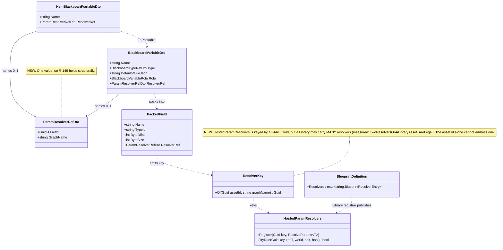
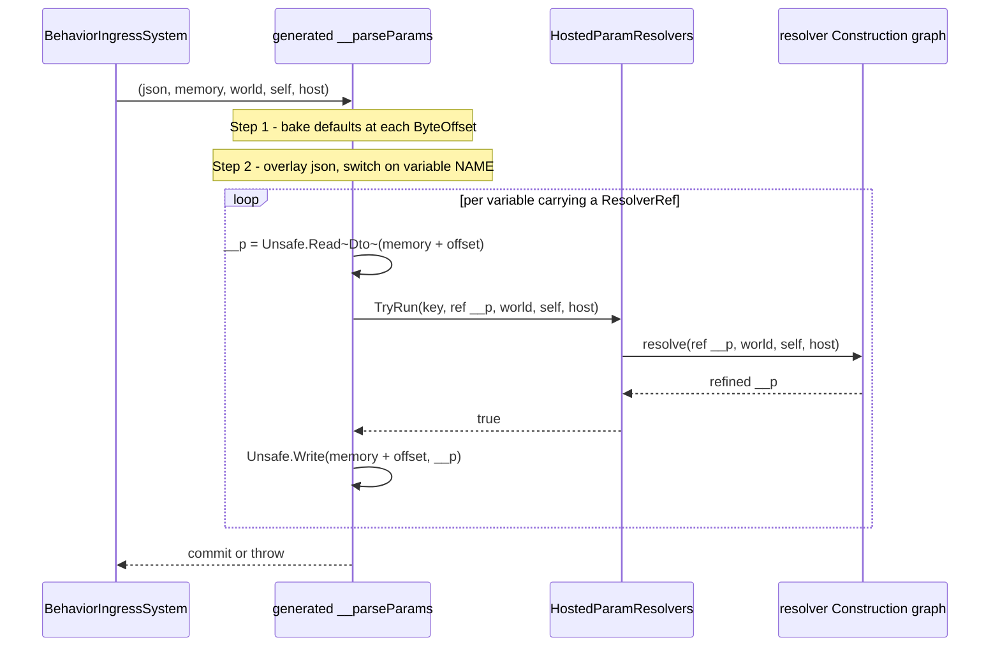
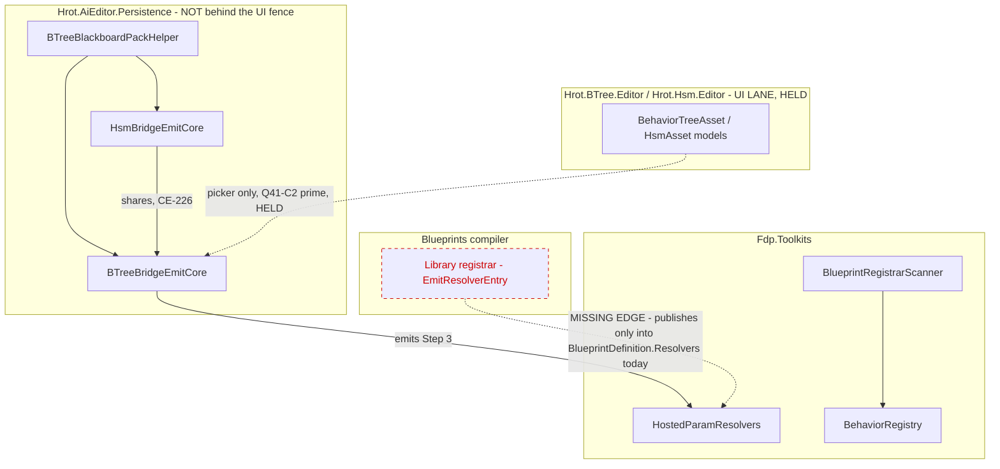

<!--STATUS
state: LIVE
updated: 2026-09-21
build-state: DESIGN
current-answer: section 4 (the decisions, each with a lean awaiting approval). Section 1 is the
  INVENTORY it rests on; section 3 holds the diagrams. NOTHING here is approved yet - section 4's
  D1 changes a key shape and needs a nod before any code.
stale-below: nothing.
known-rot: nothing.
known-conflict: nothing.
related-designs:
  - DESIGN_Resolver_World_Reach.md - owns WHAT a resolver graph is and what it can REACH (R4), the
    publishing currency (7.1) and the selection RULING (7.2). This owns the BEHAVIOUR half of that
    selection: how a blackboard params VARIABLE names one. Its 7.2a records the three-arm shape
    this design replaces.
  - Architect_Question_41_Blueprint_Driving_BTree_Params.md - owns C2', the per-VARIABLE authoring
    surface and its PICKER. This owns the DATA half only; the picker stays held with the UI lane.
  - DESIGN_Parameter_Model.md - owns the bake/overlay/resolve/write ORDER. This design adds the
    RESOLVE step to the generated bridges and must not reorder the two that precede it.
  - Architect_Question_43_Blueprint_Authored_Param_Resolver.md - owns what a resolver blueprint IS
    (A2' the Construction graph, B2 the signature, C1 purity).
  - DESIGN_Occurrence_Scoped_Storage.md - owns WHERE a resolved DTO lands and supplies the only
    IHostVariableAccess implementation (E7a), which is the `host` argument Step 3 passes on.
-->
# ⭐ `DESIGN` — **a blackboard params VARIABLE names its resolver** *(`E8c`, absorbing `E8b`)*

> ## 🔴 THE PROBLEM IN ONE MEASUREMENT
>
> 📐 `BTreeBridgeEmitCore.EmitParseParamsLocal:1236` and its HSM mirror `HsmBridgeEmitCore:313` emit a
> `__parseParams` lambda with exactly **two** steps — **bake** the authored defaults, then **overlay**
> the incoming JSON. There is no third.
>
> ⇒ ⛔ **A behaviour's params can be authored and overridden, but never REFINED.** `PlatoonHillAttack`'s
> geo-authored `[lat, lon]` still has to reach `IGeographicTransform.ToCartesian` through a **curated
> C# resolver for the WHOLE behaviour** *(`CgfCuratedBehaviorRegistrar.cs:131–138`)* — which is why a
> behaviour with one geo variable must hand-write the parse for **all** of them.

---

## 1. ⭐⭐ INVENTORY *(`R-74`)*

> ⚠ `check_index_coverage` is **not reachable through the CLI** and was not run; the graph was queried
> live through the MCP tools *(`list_projects` → `home-user-HROT`, 201 934 nodes)*. Counts below are
> what the queries returned, corroborated by grep where noted.

```
search_graph(name_pattern=".*ManagedBlackboardVariable.*|.*BlueprintRegistrarScanner.*|.*HostedOccurrence.*")  -> 22, has_more:false
search_graph(name_pattern=".*ResolveParams.*|.*HostedParamResolvers.*|.*ParamResolver.*")                      -> 12, has_more:false
search_code(pattern="__parseParams")                                                                            -> 22 results / 33 grep matches
search_code(pattern="RegisterResolver")                                                                         -> 22 results / 44 grep matches
```

| # | what exists today | where | note |
|---|---|---|---|
| ① | **`BlackboardVariableDto`** — the BTree authored variable | `BehaviorTreeAssetDto.cs:27` | ⭐ **4 of its 6 optional members already carry `[JsonIgnore(WhenWriting…)]`** ⇒ a nullable 7th moves **no golden** |
| ② | **`HsmBlackboardVariableDto`** — the HSM one, a **SEPARATE** class | `HsmAssetDto.cs:216` | ⛔ adapted to ① by `HsmBridgeEmitCore.ToPackable:442` ⇒ **two DTOs and one adapter**, not one field |
| ③ | **`PackedField(Name, TypeId, ByteOffset, ByteSize)`** — what the emitters actually read | `BTreeBlackboardPackHelper.cs:28` | ⭐ the carrier that must reach the emit site |
| ④ | **`EmitParseParamsLocal`** ×2 — bake, then overlay | `BTreeBridgeEmitCore.cs:1236` · `HsmBridgeEmitCore.cs:313` | ⭐⭐ **mirrors** *(`BP-281`)*; per packed field the site already holds `Name`, `TypeId`, `ByteOffset`, and in the lambda `world`, `self`, `host` |
| ⑤ | **`EmitManagedBlackboardVariablesArray`** — the manifest, `internal` so **both** bridges share it | `BTreeBridgeEmitCore.cs:1178`, called at `HsmBridgeEmitCore.cs:178` | ⭐⭐⭐ **the sharing PRECEDENT**: `CE-226` — *"duplicating the manifest emitter instead of sharing it would be the second producer for one slot that `R-132` forbids"* |
| ⑥ | **`ManagedBlackboardVariable(Name, Type, ByteOffset)`** | `BehaviorRegistry.cs:35` | 🔴 **its consumer-side doc is STALE** — see §5 |
| ⑦ | **`HostedParamResolvers`** — `Dictionary<Guid, object>`, `Register<T>` / `TryRun<T>` | `HostedParamResolvers.cs:34–90` | ⭐ the only `ResolveParams<T>` registry. ⛔ **keyed by a BARE Guid** — §4 `D1` turns on this |
| ⑧ | **`BehaviorRegistry.RegisterResolver(name, ParseParamsDelegate, blackboardLayoutType)`** | `BehaviorRegistry.cs:468`, 5 callers | ⛔ **whole-behaviour, keyed by BEHAVIOUR name**; only production use is `CgfCuratedBehaviorRegistrar.cs:131–138` |
| ⑨ | **`BlueprintDefinition.Resolvers`** — `BlueprintResolverEntry` keyed by **graph name within one asset** | `BlueprintDefinition.cs:57` | ⭐ where a Library asset's resolvers are published today |
| ⑩ | **`BlueprintRegistrarScanner.ComputeHostedOccurrenceDemands`** | `BlueprintRegistrarScanner.cs:180` | ⭐ the **join precedent**: a pass that reads the topology the generated registrar wrote and joins it to blueprints the same scan staged |

⭐ **Nothing named "per-variable resolver" exists.** ⛔ The `search_graph` on `.*ParamResolver.*` returns
**12 nodes, `has_more:false`**, and every one is `E6`/`R4`/`E8a` work or its rails.

---

## 2. ⛔ What this does NOT change

| | |
|---|---|
| ⛔ **the bake→overlay ORDER** | `DESIGN_Parameter_Model.md` §3.2 rules it; resolve is a **third** step, never a reorder |
| ⛔ **the curated whole-behaviour overlay** | ⑧ keeps working exactly as it does, governed by `R-132`. ⭐ This adds a finer grain **beside** it, and §4 `D2` is about not letting the two race |
| ⛔ **the PICKER** | `Q41-C2′`, held with the UI lane. This design lands **authored JSON only** |
| ⛔ **`E8a`'s blueprint half** | an asset's own `Params` needs no ref *(`DESIGN_Resolver_World_Reach.md` §11.1)* |

---

## 3. ⭐⭐⭐ The diagrams

### 3.1 Classes — ⭐ grey = exists; only the ref and one key are new



> ⭐ **Caption — what the picture shows that the prose hid.** Drawing `ResolverKey` was forced by the
> arrow into `HostedParamResolvers`: the registry takes **one Guid**, and a Library asset legitimately
> holds several resolvers, so **the asset id is not an address**. That is `D1`, and prose let the
> earlier three-arm sketch say *"`AssetId + GraphId`"* without noticing the registry cannot hold it.

### 3.2 Sequence — ⭐ Step 3, and where every argument already is



> ⭐ **Caption.** The loop body needs **no new scope**: `world`, `self` and `host` are already the
> lambda's own parameters *(`BTreeBridgeEmitCore.cs:1268`)*, and `TypeId`/`ByteOffset` are already in
> the emitter's hand per packed field. ⛔ **The throw-on-failure semantics are inherited, not added** —
> the ingress parses into a stack shadow and commits only on success, which is the same reason
> `BP1675` refuses a side-effecting resolver.

### 3.3 Modules — ⭐⭐ who emits, who registers, and **the edge that does not exist yet**



> ⭐⭐ **Caption — the dead edge is the whole cost of this slice.** A Library asset's resolvers are
> published **only** into `BlueprintDefinition.Resolvers`, keyed by graph name *(`CSharpEmitter`'s
> `EmitResolverEntry`)*. **Nothing puts them into `HostedParamResolvers`**, so a `TryRun` from a
> behaviour bridge would find nothing today. ⛔ Every other edge already exists — which is why `D1`
> (the key) is the real decision and the emit is mechanical.
>
> ⭐ **And the fence holds:** both emitters and both DTOs live in `Hrot.AiEditor.Persistence`. The only
> dashed edge into the held assemblies is the picker, which this design excludes.

---

## 4. ⭐⭐⭐ THE DECISIONS — **each with a lean; nothing built until approved**

### `D1` — what the ref NAMES, and which registry answers it

| option | ⭐ |
|---|---|
| **`D1-a`** ⭐⭐⭐ **LEAN** — the ref is `(AssetId, GraphName)`; a new `ResolverKey.Of(assetId, graphName)` derives a deterministic Guid, and the **Library registrar also registers into `HostedParamResolvers` under that key** | ⭐ it is the only arm whose types line up: a reusable resolver is typed on an **authored DTO** *(`ValidateReusableSignature:189`)* and a params variable **is** an authored DTO *(`PlatoonHillAttack.btree.json` — `Params : PlatoonHillAttackParams`)*. ⭐ `DeterministicIds.PinId` is the prior art for deriving a Guid from a formatted string. ⛔ Cost: the missing edge in §3.3 |
| **`D1-b`** a new **name-keyed** `ResolveParams` registry, so a variable can name a curated C# resolver | ⛔ **no consumer asks for it.** ⑧ already lets curated C# own the whole behaviour, and a C# author wanting one variable can register under `D1-a`'s key. ⚠ This is the arm `DESIGN_Resolver_World_Reach.md` §7.2a retired as a category error; reviving it per-variable would add a **second identity scheme** for the same thing |
| **`D1-c`** key on the **behaviour name + variable name** | ⛔ makes the resolver un-reusable across behaviours, which is the entire point of a Library resolver |

> ⭐ **The lean in one line:** ONE arm — a variable names a **resolver blueprint graph**; curated C#
> stays whole-behaviour where it already works. ⚠ **What would change it:** if a real case wants one
> variable resolved by hand-written C# *while its siblings are blueprint-resolved*, `D1-b` becomes
> necessary. 📐 **I could not find one** — searched the 30 shipped behaviour assets and the 5
> `RegisterResolver` call sites; every curated resolver today owns its whole behaviour.

### `D2` — what happens when a behaviour has **both** a curated whole-behaviour resolver and a per-variable ref

| option | ⭐ |
|---|---|
| **`D2-a`** ⭐⭐ **LEAN** — **refuse it at generation time** with a diagnostic | ⭐ `R-149`'s own logic: a region names exactly **one** resolver, and the curated overlay replaces the whole `__parseParams` including Step 3 ⇒ the two genuinely compete for one region. ⭐ Making it unrepresentable beats arbitrating it |
| **`D2-b`** curated wins silently | ⛔ **this is `R-132`'s "race, not a precedence rule"** wearing a different hat — the author gets no signal that their per-variable ref was discarded |

### `D3` — where Step 3 is emitted

⭐⭐ **LEAN: one `internal static EmitResolveLocal` in `BTreeBridgeEmitCore`, called by both bridges** —
exactly `CE-226`'s precedent for the manifest emitter (inventory ⑤), and for its stated reason.
⛔ Mirroring it into `HsmBridgeEmitCore` would be the second producer `R-132` forbids.

### `D4` — does `ManagedBlackboardVariable` need a 4th member?

⭐⭐ **LEAN: NO — and this NARROWS the plan row, which assumed yes.** 📐 Step 3 is emitted **inline**
with the offset and key baked in, so no runtime consumer needs to rediscover the ref. ⛔ Adding a
member for symmetry would put a fact in two places. ⚠ **Reopen it** only if a debugger/inspector has to
show *"this variable is resolved by X"*.

---

## 5. 🔴 A STALE DOC FOUND WHILE MEASURING — **fix it in this slice**

📐 `BehaviorRegistry.cs:239` documents `ManagedBlackboardVariables` as *"Null for non-managed or **HSM**
behaviors."* ⛔ **`HsmBridgeEmitCore.cs:178` emits the array**, through the shared emitter `CE-226`
made `internal` for exactly that purpose. ⇒ the comment predates the sharing and is now false.

⚠ Small, but it is the kind that costs a session: a reader deciding whether HSM carries a manifest gets
the wrong answer from the only place that looks authoritative. ⭐ **One-line fix, in this batch.**

---

## 6. ⭐ Acceptance *(shape only — fill in when `D1`–`D4` are approved)*

| # | |
|---|---|
| `A1` | a BTree asset with a variable carrying a `ResolverRef` emits Step 3 for **that variable only** |
| `A2` | the HSM mirror emits the **same** Step 3 from the **shared** emitter |
| `A3` | a variable with no ref emits **no** Step 3 ⇒ every existing golden is byte-identical |
| `A4` | the resolver **reaches the world** — the `R4` rail's shape, through a behaviour bridge this time |
| `A5` | `D2`'s refusal fires, with a red-proof |
| `A6` | a `ResolverRef` in JSON **round-trips** through both DTOs and `ToPackable` |
