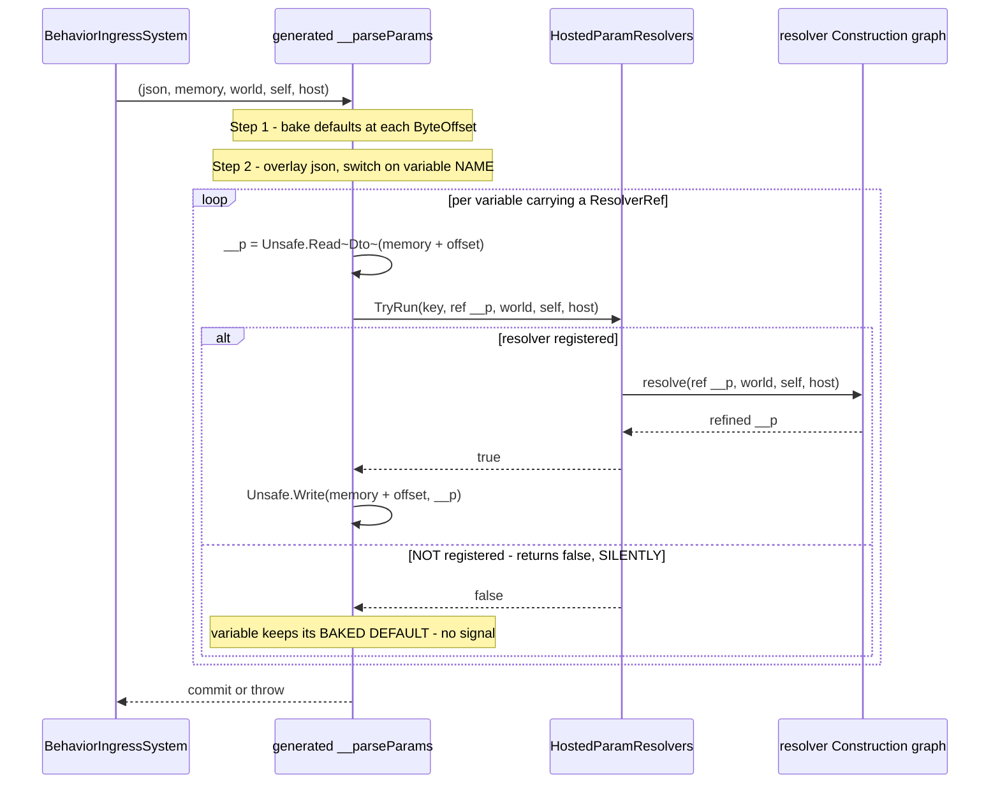
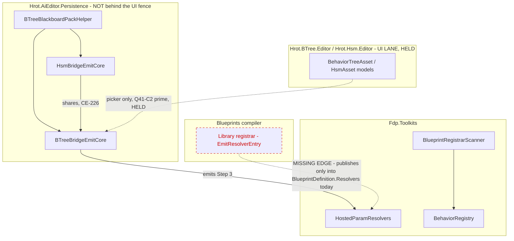

<!--STATUS
state: LIVE
updated: 2026-09-21
build-state: DESIGN
current-answer: section 4. D1-a (with its MANDATORY clause four), D2 and D3 are leans awaiting
  approval; D4 is DECIDED (yes, a 4th+5th member - PackedField is unreachable from FDP/Toolkits);
  D5 is NOT a decision but an enforcement obligation of R-149. Section 1 is the INVENTORY;
  section 3 the diagrams; section 6.1 scopes A7 by host. Read D1's fourth-clause subsection and
  the ResolverKey subsection under it before anything - both address the same silent-failure mode.
stale-below: nothing. Two leans were REVERSED in place by the second review and say so where they
  sit: D4 (was "no 4th member") and D1-a's DeterministicIds citation (unreachable across the
  netstandard2.0 wall; ResolverKey is a LINKED file on the OccurrenceSlotKey pattern).
review: reviewed twice, 2026-09-21. Round 1: the silent-TryRun path, D1's build-time
  unverifiability and clause four, load order, D5, two further stale doc comments, the
  netstandard2.0 wall, check_index_coverage. Round 2: D4 flipped to yes, ResolverKey given a home,
  D5 re-filed as enforcement, A7 scoped by host. One round-2 premise did NOT verify - a
  warn-vs-fail artifact ruling in the asset-management corpus; searched, none found (section 6.1).
stale-below: nothing.
known-rot: nothing.
known-conflict: nothing.
related-designs:
  - DESIGN_Resolver_World_Reach.md - owns WHAT a resolver graph is and what it can REACH (R4), the
    publishing currency (7.1) and the selection RULING (7.2). This owns the BEHAVIOUR half of that
    selection: how a blackboard params VARIABLE names one. Its 7.2a records the three-arm shape
    this design replaces.
  - Architect_Question_41_Blueprint_Driving_BTree_Params.md - owns C2', the per-VARIABLE authoring
    surface and its PICKER. This owns the DATA half only; the picker stays held with the UI lane.
  - DESIGN_Parameter_Model.md - owns the bake/overlay/resolve/write ORDER. This design adds the
    RESOLVE step to the generated bridges and must not reorder the two that precede it.
  - Architect_Question_43_Blueprint_Authored_Param_Resolver.md - owns what a resolver blueprint IS
    (A2' the Construction graph, B2 the signature, C1 purity).
  - DESIGN_Occurrence_Scoped_Storage.md - owns WHERE a resolved DTO lands and supplies the only
    IHostVariableAccess implementation (E7a), which is the `host` argument Step 3 passes on.
-->
# ⭐ `DESIGN` — **a blackboard params VARIABLE names its resolver** *(`E8c`, absorbing `E8b`)*

> ## 🔴 THE PROBLEM IN ONE MEASUREMENT
>
> 📐 `BTreeBridgeEmitCore.EmitParseParamsLocal:1236` and its HSM mirror `HsmBridgeEmitCore:313` emit a
> `__parseParams` lambda with exactly **two** steps — **bake** the authored defaults, then **overlay**
> the incoming JSON. There is no third.
>
> ⇒ ⛔ **A behaviour's params can be authored and overridden, but never REFINED.** `PlatoonHillAttack`'s
> geo-authored `[lat, lon]` still has to reach `IGeographicTransform.ToCartesian` through a **curated
> C# resolver for the WHOLE behaviour** *(`CgfCuratedBehaviorRegistrar.cs:131–138`)* — which is why a
> behaviour with one geo variable must hand-write the parse for **all** of them.

---

## 1. ⭐⭐ INVENTORY *(`R-74`)*

> ⭐ **`check_index_coverage` WAS run** *(it is reachable through the MCP tools; only the CLI lacks
> it)*: all **9** paths cited below report `no_recorded_issue` with `generation_matches: true`.
> ⚠ Its own caveat stands — best-effort is never proof of completeness — so every count below is
> corroborated by grep as well.

```
search_graph(name_pattern=".*ManagedBlackboardVariable.*|.*BlueprintRegistrarScanner.*|.*HostedOccurrence.*")  -> 22, has_more:false
search_graph(name_pattern=".*ResolveParams.*|.*HostedParamResolvers.*|.*ParamResolver.*")                      -> 12, has_more:false
search_code(pattern="__parseParams")                                                                            -> 22 results / 33 grep matches
search_code(pattern="RegisterResolver")                                                                         -> 22 results / 44 grep matches
```

| # | what exists today | where | note |
|---|---|---|---|
| ① | **`BlackboardVariableDto`** — the BTree authored variable | `BehaviorTreeAssetDto.cs:27` | ⭐ **4 of its 6 optional members already carry `[JsonIgnore(WhenWriting…)]`** ⇒ a nullable 7th moves **no golden** |
| ② | **`HsmBlackboardVariableDto`** — the HSM one, a **SEPARATE** class | `HsmAssetDto.cs:216` | ⛔ adapted to ① by `HsmBridgeEmitCore.ToPackable:442` ⇒ **two DTOs and one adapter**, not one field |
| ③ | **`PackedField(Name, TypeId, ByteOffset, ByteSize)`** — what the emitters actually read | `BTreeBlackboardPackHelper.cs:28` | ⭐ the carrier that must reach the emit site |
| ④ | **`EmitParseParamsLocal`** ×2 — bake, then overlay | `BTreeBridgeEmitCore.cs:1236` · `HsmBridgeEmitCore.cs:313` | ⭐⭐ **mirrors** *(`BP-281`)*; per packed field the site already holds `Name`, `TypeId`, `ByteOffset`, and in the lambda `world`, `self`, `host` |
| ⑤ | **`EmitManagedBlackboardVariablesArray`** — the manifest, `internal` so **both** bridges share it | `BTreeBridgeEmitCore.cs:1178`, called at `HsmBridgeEmitCore.cs:178` | ⭐⭐⭐ **the sharing PRECEDENT**: `CE-226` — *"duplicating the manifest emitter instead of sharing it would be the second producer for one slot that `R-132` forbids"* |
| ⑥ | **`ManagedBlackboardVariable(Name, Type, ByteOffset)`** | `BehaviorRegistry.cs:35` | 🔴 **its consumer-side doc is STALE** — see §5 |
| ⑦ | **`HostedParamResolvers`** — `Dictionary<Guid, object>`, `Register<T>` / `TryRun<T>` | `HostedParamResolvers.cs:34–90` | ⭐ the only `ResolveParams<T>` registry. ⛔ **keyed by a BARE Guid** — §4 `D1` turns on this |
| ⑧ | **`BehaviorRegistry.RegisterResolver(name, ParseParamsDelegate, blackboardLayoutType)`** | `BehaviorRegistry.cs:468`, 5 callers | ⛔ **whole-behaviour, keyed by BEHAVIOUR name**; only production use is `CgfCuratedBehaviorRegistrar.cs:131–138` |
| ⑨ | **`BlueprintDefinition.Resolvers`** — `BlueprintResolverEntry` keyed by **graph name within one asset** | `BlueprintDefinition.cs:57` | ⭐ where a Library asset's resolvers are published today |
| ⑩ | **`BlueprintRegistrarScanner.ComputeHostedOccurrenceDemands`** | `BlueprintRegistrarScanner.cs:180` | ⭐ the **join precedent**: a pass that reads the topology the generated registrar wrote and joins it to blueprints the same scan staged |

⭐ **Nothing named "per-variable resolver" exists.** ⛔ The `search_graph` on `.*ParamResolver.*` returns
**12 nodes, `has_more:false`**, and every one is `E6`/`R4`/`E8a` work or its rails.

---

## 2. ⛔ What this does NOT change

| | |
|---|---|
| ⛔ **the bake→overlay ORDER** | `DESIGN_Parameter_Model.md` §3.2 rules it; resolve is a **third** step, never a reorder |
| ⛔ **the curated whole-behaviour overlay** | ⑧ keeps working exactly as it does, governed by `R-132`. ⭐ This adds a finer grain **beside** it, and §4 `D2` is about not letting the two race |
| ⛔ **the PICKER** | `Q41-C2′`, held with the UI lane. This design lands **authored JSON only** |
| ⛔ **`E8a`'s blueprint half** | an asset's own `Params` needs no ref *(`DESIGN_Resolver_World_Reach.md` §11.1)* |

---

## 3. ⭐⭐⭐ The diagrams

### 3.1 Classes — ⭐ grey = exists; only the ref and one key are new


> ⭐ **Caption — what the picture shows that the prose hid.** Drawing `ResolverKey` was forced by the
> arrow into `HostedParamResolvers`: the registry takes **one Guid**, and a Library asset legitimately
> holds several resolvers, so **the asset id is not an address**. That is `D1`, and prose let the
> earlier three-arm sketch say *"`AssetId + GraphId`"* without noticing the registry cannot hold it.

### 3.2 Sequence — ⭐ Step 3, and where every argument already is



> ⭐ **Caption — the `else` arm is the finding, and it is why `D1` grows a fourth clause.** The loop
> body needs no new scope: `world`, `self` and `host` are already the lambda's own parameters
> *(`BTreeBridgeEmitCore.cs:1270`)*, and `TypeId`/`ByteOffset` are already in the emitter's hand.
> 🔴 **But `TryRun` returning `false` is SILENT BY DESIGN** — its own header insists *"no resolver must
> be free and silent, or every existing asset pays for a feature it does not use"*, which is **right
> for `E8a`**, where absence is the overwhelmingly common case.
>
> ⛔⛔ **`E8c` INVERTS that premise.** A variable carrying a `ResolverRef` has **named** one, so absence
> is an **error**, not the norm. 📌 Concrete failure: rename a Library resolver graph and every
> behaviour referencing it falls back to baked defaults — no diagnostic, no rail, sim running on wrong
> params. ⚠ **This is the silent-default pattern with a caller that DID hold the information.**
>
> ⚠ **An earlier version of this caption said the *"throw-on-failure semantics are inherited"*.** That
> was about the JSON **parse** throw and it is true of that; ⛔ as written it read as covering the
> missing-resolver case, where the inherited semantics are the **opposite**. Corrected `2026-09-21`.

### 3.3 Modules — ⭐⭐ who emits, who registers, and **the edge that does not exist yet**



> ⭐⭐ **Caption — the dead edge is the whole cost of this slice.** A Library asset's resolvers are
> published **only** into `BlueprintDefinition.Resolvers`, keyed by graph name *(`CSharpEmitter`'s
> `EmitResolverEntry`)*. **Nothing puts them into `HostedParamResolvers`**, so a `TryRun` from a
> behaviour bridge would find nothing today. ⛔ Every other edge already exists — which is why `D1`
> (the key) is the real decision and the emit is mechanical.
>
> ⭐ **And the fence holds:** both emitters and both DTOs live in `Hrot.AiEditor.Persistence`. The only
> dashed edge into the held assemblies is the picker, which this design excludes.

---

## 4. ⭐⭐⭐ THE DECISIONS — **each with a lean; nothing built until approved**

### `D1` — what the ref NAMES, and which registry answers it

| option | ⭐ |
|---|---|
| **`D1-a`** ⭐⭐⭐ **LEAN** — the ref is `(AssetId, GraphName)`; a new `ResolverKey.Of(assetId, graphName)` derives a deterministic Guid, and the **Library registrar also registers into `HostedParamResolvers` under that key** | ⭐ it is the only arm whose types line up: a reusable resolver is typed on an **authored DTO** *(`ValidateReusableSignature:189`)* and a params variable **is** an authored DTO *(`PlatoonHillAttack.btree.json` — `Params : PlatoonHillAttackParams`)*. ⭐ `DeterministicIds.PinId` is the prior art for deriving a Guid from a formatted string. ⛔ Cost: the missing edge in §3.3 |
| **`D1-b`** a new **name-keyed** `ResolveParams` registry, so a variable can name a curated C# resolver | ⛔ **no consumer asks for it.** ⑧ already lets curated C# own the whole behaviour, and a C# author wanting one variable can register under `D1-a`'s key. ⚠ This is the arm `DESIGN_Resolver_World_Reach.md` §7.2a retired as a category error; reviving it per-variable would add a **second identity scheme** for the same thing |
| **`D1-c`** key on the **behaviour name + variable name** | ⛔ makes the resolver un-reusable across behaviours, which is the entire point of a Library resolver |

> ⭐ **The lean in one line:** ONE arm — a variable names a **resolver blueprint graph**; curated C#
> stays whole-behaviour where it already works. ⚠ **What would change it:** if a real case wants one
> variable resolved by hand-written C# *while its siblings are blueprint-resolved*, `D1-b` becomes
> necessary. 📐 **I could not find one** — searched the 30 shipped behaviour assets and the 5
> `RegisterResolver` call sites; every curated resolver today owns its whole behaviour.

#### 🔴 `D1-a`'s FOURTH CLAUSE — **a SCAN-TIME validation pass, and it is not optional**

⛔⛔ **`D1-a`'s real cost is NOT the missing edge in §3.3 — it is that the type match becomes
UNVERIFIABLE AT BUILD TIME.** 📐 Both halves of the check exist — `ValidateReusableSignature:189` pins
the resolver's type as `graph.Inputs[0].Type.TypeId`, and `PackedField.TypeId` is the variable's —
⛔ **but they are not in the same process.** 📐 Measured: `Hrot.AiEditor.Persistence.csproj` targets
**`netstandard2.0`** and declares **no `ProjectReference` at all** *(one `PackageReference`,
`System.Text.Json`)*. ⇒ the bridge emitters **cannot see the Blueprints compiler**, so `D1-a` bakes
`(assetId, graphName)` **blindly**.

⇒ ⭐⭐⭐ **Without a fourth clause the only check left is `TryRun`'s runtime throw — which fires at
OCCURRENCE ATTACH, IN-SIM, and only when the DTO types DIFFER.** ⛔ **Same type, wrong resolver: no
signal at all.**

| ⭐ the clause | |
|---|---|
| ⭐⭐⭐ **a validation pass at `BlueprintRegistrarScanner`** *(inventory ⑩ — this design's own join precedent)* that, for every baked ref, checks ① the resolver **is registered** and ② its input `TypeId` **equals the variable's** — and **FAILS THE LOAD LOUDLY** | ⭐⭐ **one addition closes three flaws at once**: the silent-`false` path of §3.2, the unverifiable type match here, and the load-ORDER question below |
| ⭐⭐ **it also settles LOAD ORDER** | ⛔ nothing today orders the Library registrar before a behaviour referencing it attaches. ⭐ A pass that runs **after** the scan has staged everything does not care about order — which is exactly why `ComputeHostedOccurrenceDemands` is shaped that way |
| ⭐⭐⭐ **the manifest MUST carry the ref — `D4` is DECIDED, not deferred** | 📐 **Measured, and it settles it categorically: `PackedField` has ZERO references anywhere in `FDP/Toolkits/`.** `ComputeHostedOccurrenceDemands:180` works purely in runtime currency — `BlueprintRegistryStaging.Definitions`, `behaviorStaging.GetRegisteredNames/TryGetDefinition`, an action-id index. ⇒ a scan-time pass **cannot reach `PackedField` by construction**, so the manifest is the only carrier. ⚠ **An earlier revision said *"resolve this when `D1` is approved"* — that was deferring a question one grep answers; see `D4`** |

⛔ **Without this clause the slice ships a feature whose failure mode is silence** — which is the exact
defect class this programme keeps filing. ⇒ ⭐ **`D1-a` is approved-as-a-lean only WITH clause four.**

#### ⛔⛔ `ResolverKey` HAS NO HOME — **and the repo already ruled the answer TWICE**

🔴 **`D1-a` cited `DeterministicIds.PinId` as prior art, and that citation does not work.** 📐
`DeterministicIds` lives in **`Hrot.Blueprints.Core.Compiler`** *(`DeterministicIds.cs:5`)*, and
Persistence has **no project references by design** ⇒ the emitter **cannot call it**.

⭐⭐⭐ **This is not a new problem — that csproj already solves it twice with LINKED SHARED SOURCE**,
and one of the two is this programme's own work:

| linked file | why |
|---|---|
| `Fdp.Toolkits.Analyzers/Shared/BlackboardParamsExpression.cs` → `Emit\Shared\` *(`BP-306`)* | the expression spelling must match on both sides of the wall |
| ⭐⭐⭐ **`Fdp.Toolkits/Behavior/Shared/OccurrenceSlotKey.cs` → `Emit\Shared\`** — **task `A1` of this very plan** | 🔒 its own header: *"A compile-time key and a runtime key that disagree by one byte **do not fail loudly: the slot is simply never found.**"* ⚠ It also pins an **ABI enum** across three spellings, with `OccurrenceSlotKeyParityTests` as the rail |

⇒ ⭐⭐ **`ResolverKey` is a LINKED netstandard2.0-subset file on the `OccurrenceSlotKey` pattern, with a
parity rail** — ⛔ not a call into `DeterministicIds`. ⚠⚠ **And note WHY this matters beyond
mechanics:** a compile-time key that disagrees with the runtime key is **the same silence clause four
exists to kill, arriving by a second door.** ⭐ The parity rail is therefore part of the slice, not
polish.

#### ⚠ `netstandard2.0` — the wall the DTO work lands against

📐 Same measurement: `PackedField`'s own header says *"plain class for netstandard2.0 compatibility —
no record."* ⇒ ⭐ `ParamResolverRefDto` is a **plain class**, and `PackedField`'s 4-arg constructor
gains a 5th parameter, changing **every construction site**. ⚠ Minor, but it is the same wall that
produced `W1` ② — name it in the item so it is not discovered mid-build.

### `D2` — what happens when a behaviour has **both** a curated whole-behaviour resolver and a per-variable ref

| option | ⭐ |
|---|---|
| **`D2-a`** ⭐⭐ **LEAN** — **refuse it at generation time** with a diagnostic | ⭐ `R-149`'s own logic: a region names exactly **one** resolver, and the curated overlay replaces the whole `__parseParams` including Step 3 ⇒ the two genuinely compete for one region. ⭐ Making it unrepresentable beats arbitrating it |
| **`D2-b`** curated wins silently | ⛔ **this is `R-132`'s "race, not a precedence rule"** wearing a different hat — the author gets no signal that their per-variable ref was discarded |

### `D3` — where Step 3 is emitted

⭐⭐ **LEAN: one `internal static EmitResolveLocal` in `BTreeBridgeEmitCore`, called by both bridges** —
exactly `CE-226`'s precedent for the manifest emitter (inventory ⑤), and for its stated reason.
⛔ Mirroring it into `HsmBridgeEmitCore` would be the second producer `R-132` forbids.

### `D4` — does `ManagedBlackboardVariable` need a 4th member?

⭐⭐⭐ **YES. It carries the KEY and the variable's `TypeId`.** ⛔⛔ **This REVERSES this document's own
first lean, and the measurement that reverses it was available the whole time:**

| 📐 measured | |
|---|---|
| **`PackedField` has ZERO references anywhere in `FDP/Toolkits/`** | ⇒ nothing in the runtime assembly can see it |
| `ComputeHostedOccurrenceDemands:180` reads **only** `BlueprintRegistryStaging.Definitions`, `behaviorStaging.GetRegisteredNames/TryGetId/TryGetDefinition`, and an action-id index | ⇒ **runtime currency only**, and `BehaviorDefinition` is exactly where `ManagedBlackboardVariables` already lives |

⇒ ⭐⭐⭐ **`D1`'s clause four and a manifest with no ref are CONTRADICTORY**, and the earlier draft
presented both as approved-ready. ⭐ **The 4th and 5th members carry the key *and* the `TypeId`**,
because `A8` needs both to compare against the resolver's declared input type.

⚠ **The honest reading of the original lean:** *"Step 3 bakes the offset inline, so no runtime consumer
needs the ref"* was **true of Step 3** and false of the **validation pass**, which did not exist when
the lean was written. ⛔ The lean was not re-tested when clause four was added.

### `D5` — ⛔ **NOT A DECISION: an ENFORCEMENT OBLIGATION of `R-149`**

⛔⛔ **This was mis-filed as a lean awaiting approval, and that invites re-deciding settled canon.**
🔒 `R-149` already rules it **verbatim**: *"Offered only where a params region exists, ⛔ never on
`Role=State` working state."* ⭐ The whole point of a ledger row is that it is not re-litigated.

⇒ ⭐⭐ **The obligation:** `BlackboardVariableDto` carries `Role` *(Input/State)* and the ref sits on the
DTO **unconditionally**, so the restriction **cannot be expressed structurally** ⇒ the scan-time pass
enforces it, and **`A9` is its rail**. ⛔ There is nothing here to approve — only to build.

---

## 5. 🔴 THREE DOC COMMENTS TO FIX IN THIS SLICE — **one already false, two that `D1` falsifies**

| # | the comment | why it must move |
|---|---|---|
| ⑴ | `BehaviorRegistry.cs:239` — `ManagedBlackboardVariables` is *"Null for non-managed or **HSM** behaviors."* | ⛔ **already FALSE**: `HsmBridgeEmitCore.cs:178` emits the array through the shared emitter `CE-226` made `internal` for exactly that purpose. ⚠ The comment predates the sharing |
| ⑵ | `CSharpEmitter.cs:452` — *"`Register` OVERWRITES … it is **keyed by ASSET id** and re-registered by every rescan"* | ⚠ **`D1-a` falsifies the REASON, not the policy.** Under clause one the key is `ResolverKey.Of(assetId, graphName)`; overwrite-on-rescan still holds, but *"keyed by asset id"* stops being why |
| ⑶ | `BehaviorRegistry.cs:490` — the mirror sentence justifying the **opposite** duplicate policy | ⭐ same correction. ⛔ These two comments are each other's cross-reference, so fixing one alone leaves a contradiction |

⚠ ⑴ is small but it is the kind that costs a session — a reader deciding whether HSM carries a manifest
gets the wrong answer from the only place that looks authoritative. ⭐ ⑵ and ⑶ are **`D1`'s own
as-built obligation**: the duplicate-policy argument is `R-149`'s, and leaving a stale *reason* under a
correct *rule* is how the next session re-derives the wrong constraint.

---

## 6. ⭐ Acceptance *(shape only — fill in when `D1`–`D4` are approved)*

| # | |
|---|---|
| `A1` | a BTree asset with a variable carrying a `ResolverRef` emits Step 3 for **that variable only** |
| `A2` | the HSM mirror emits the **same** Step 3 from the **shared** emitter |
| `A3` | a variable with no ref emits **no** Step 3 ⇒ every existing golden is byte-identical |
| `A4` | the resolver **reaches the world** — the `R4` rail's shape, through a behaviour bridge this time |
| `A5` | `D2`'s refusal fires, with a red-proof |
| `A6` | a `ResolverRef` in JSON **round-trips** through both DTOs and `ToPackable` |
| ⭐⭐⭐ `A7` | a ref naming a **MISSING or RENAMED** resolver **fails the load with a diagnostic** — red-proved by renaming the graph. ⛔ **Closes the silent-`false` path of §3.2**, and it is the acceptance row the slice most needs. ⭐⭐ **SCOPED — see §6.1** |
| ⭐ `A10` | the **key parity rail**: the linked `ResolverKey` computes byte-identical keys on the netstandard2.0 authoring side and the net8.0 runtime side — modelled on `OccurrenceSlotKeyParityTests` |
| ⭐⭐ `A8` | a ref whose variable `TypeId` ≠ the resolver's input `TypeId` is **refused at SCAN time**, not at attach — ⛔ `TryRun`'s in-sim throw is not an acceptable last line |
| ⭐⭐ `A9` | a ref on a `Role == State` variable is **refused** *(`D5`)* |

⚠ **`A7`–`A9` all land on `D1`'s clause-four pass**, which is why that clause is not optional: without
it none of the three has anywhere to fire.

### 6.1 ⚠ `A7` — **WHICH HOSTS does "fails the load" mean?**

⭐ **The question is right:** a node holding a partial asset set must not turn a missing resolver into a
node-down. ⛔ **But I could not verify the precedent it was raised on.** 📐 **Searched
`docs/designs/mgmt-1`, `docs/designs/packs-3`, `docs/designs/cgf-1` and a regex sweep over
`docs/designs/` for a missing-vs-stale artifact policy — NONE FOUND.** ⚠ Stated plainly rather than
adopted: **do not cite a warn-vs-fail ruling until someone names the document.**

⭐⭐ **What IS measured settles the scoping anyway** — the pass runs **only where the scan runs**:

| production caller of `BlueprintRegistrarScanner.Scan` | host |
|---|---|
| `CgfBehaviorSetup.LoadFromAiAssembly:53` | ⭐ the **CGF** behaviour-setup path — i.e. exactly the hosts that tick behaviours |
| `AiHotReloadCoordinator.ApplyReload:332` · `DoLoadAndScan:483` | hot reload |
| `QuickReloadService.TriggerFromSourcesAsync:144` | the editor |

⇒ ⭐⭐ **`A7` is naturally scoped by construction: a host that never sets up behaviours never runs the
pass, so it cannot fail on a resolver it was never going to call.** ⛔ **`A7` must assert that** — a
non-behaviour host loads clean — rather than assuming it. ⚠ **If a warn-vs-fail ruling IS found later,
it overrides this paragraph**; the scoping measured here is a floor, not a policy.
