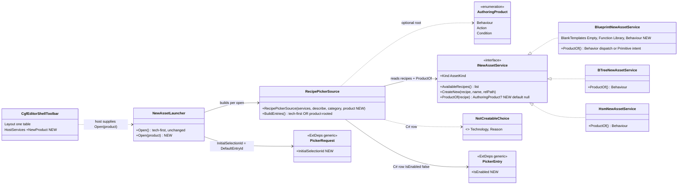
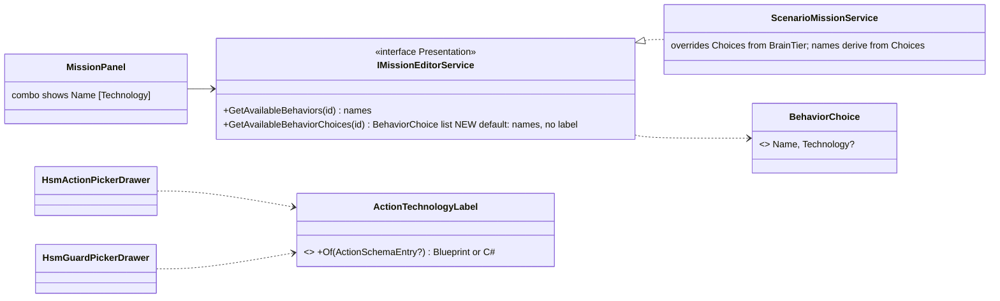
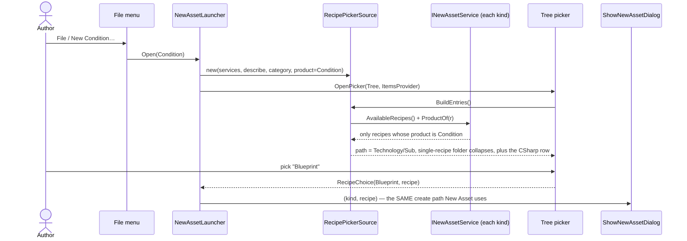
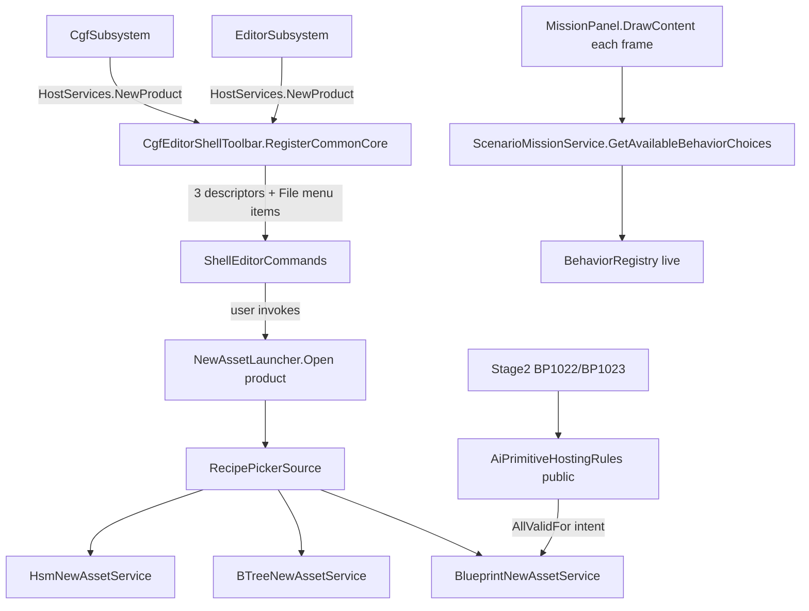

<!--STATUS
state: LIVE
updated: 2026-09-30
build-state: BUILT — CE-460, CE-461, CE-462 (2026-09-30)
current-answer: §3 (classes), §4 (sequence), §5 (modules), §6 (decisions). §1 is the inventory the design is drawn from.
stale-below: nothing.
known-rot: none.
known-conflict: UXR-40's wording vs the 2026-09-30 user ruling; the handoff's D3 reconciles them (product first, technology second, with a default).
related-designs:
  - docs/blueprints/batches/HANDOFF_E4_Product_First_Authoring.md — the FRAME this design fills in (goal, fences, leans D1–D7).
  - docs/blueprints/Architect_Question_77_Blueprint_As_A_Behaviour.md — owns the blueprint-behaviour runtime/compiler; §5.5 re-frames E4, §5.13 the first slice (CE-446).
  - docs/UX/UX_Requirements.md — UXR-40 (one New Behaviour entry), UXR-41 (assignable without restart).
  - docs/DESIGN_Cgf_Shell_Command_Toolbar_Slice.md — owns the ONE toolbar/menu table (CgfEditorShellToolbar) the new File items are added to.
  - Blueprint_Issues_Tracker.md CE-459 — the C# authoring technology, which this design shows but does not create.
-->

# DESIGN — author by PRODUCT first, technology second (E4)

**Ids:** `CE-460` (the product-first New entries + the blueprint Behaviour template) · `CE-461` (the
blueprint Action / Condition templates, §6 D7) · `CE-462` (technology labels in the behaviour and
HSM pickers).

## 1. INVENTORY

```
search_graph name_pattern=".*(NewAsset|Recipe|PickerSource|AssetTemplate).*" label=Class   → total 50, has_more:false
search_graph name_pattern=".*(NewAsset|Recipe|PickerSource).*"               label=Interface → total 3
search_code  "IActionSchemaExporter|BehaviorActionCatalog|BehaviorActionSource" (regex)    → 70 files
grep         "GetAvailableBehaviors"                                                        → 2 contracts, 3 production impls, 1 panel
```

| surface | role here | reused / changed |
|---|---|---|
| `INewAssetService` ×4 (Blueprint, BTree, Hsm, Scenario) | per-kind recipe list + create | ⭐ reused; gains `ProductOf(recipe)` (default `null`) |
| `RecipePickerSource` | recipe → tree entry | ⭐ reused; gains an optional product ROOT |
| `NewAssetLauncher` | opens the tree, routes the pick | ⭐ reused; `Open(product)` beside `Open()` |
| `CgfEditorShellToolbar.Layout` + `HostServices` | the ONE command/menu table, both hosts | ⭐ reused; three File items |
| `BlueprintNewAssetService.BlankTemplates` | blank-template rows | ⭐ reused; + `Behaviour` row (CE-460), + `Action`/`Condition` rows (CE-461) |
| `PickerTreeBuilder` (ExtDeps) | splits `Category` on `/` | ⭐ unchanged — no ExtDeps edit |
| `BTreeNodeCatalog` | BTree palette | ✅ already labels technology (category `Blueprint action` + icon) — no change |
| `BehaviorActionCatalog` → `BlueprintNodePaletteEntries` | blueprint palette | ✅ already carries `BehaviorActionSource` — no change |
| `HsmActionPickerDrawer` / `HsmGuardPickerDrawer` | HSM inspector combos | ⛔ raw FQNs, no label ⇒ CE-462 |
| `IMissionEditorService.GetAvailableBehaviors` → `MissionPanel` | behaviour assignment combo | ⛔ names only ⇒ CE-462 (D4) |

⚠ `check_index_coverage` is not reachable through the CLI; the totals rest on graph + grep agreement.

## 2. Claim table

| the design rests on | code — how it IS | design — how it was MEANT |
|---|---|---|
| a Tree picker nests to any depth | ✅ `PickerTreeBuilder.cs:43` `category.Split('/')` | ✅ handoff D1 |
| leaves keep input order, folders sort by name | ✅ `PickerTreeBuilder.cs` `Leaves.Add` / `SortFoldersRecursive` | ⛔ searched, none (behaviour of a vendored widget) |
| a minimal Behaviour blueprint = `Dispatch=Behavior` + a `Tick` Function graph | ✅ `BlueprintBehaviourDemo.bp.json` (Tick: Entry→Delay→Return) | ✅ Q77 §5.9 |
| a minimal AiPrimitive = `Primitive{Intent,Hostings}` + one Function graph | ✅ `HsmGuardDemo.bp.json` (Main: Entry→GetParameter→Return); `AiPrimitiveEmitter.cs:246` takes the first Function graph | ✅ Stage2 BP1020/1021 |
| `CreateFunctionGraph` seeds Entry→Return | ✅ `BlueprintDocumentFactory.cs` `CreateGraph` | ✅ BP-103 |
| intent → hostings is ONE table, private | ✅ `Stage2_Validate.cs:102-105` | ✅ handoff D7 |
| both hosts build New Asset from the same table | ✅ `EditorSubsystem.cs:4883`, `CgfSubsystem.cs:2804` → `RegisterCommonCore` | ✅ UXI-35 / ruling 58 |
| a behaviour's technology is on its definition | ✅ `BehaviorDefinition.BrainTier` 1/2/3 (`BehaviorConstants.cs:78-88`) | ✅ handoff D4 |

## 3. Classes



*What the picture shows that prose hid:* **no new picker and no new creation path** — every new box is a member
on an existing class; the product-first flow is the SAME launcher + source with a root.



*What it shows:* the label comes from data the system already holds — `BrainTier` for a behaviour,
`ActionSchemaEntry.IsAiPrimitive` for an action — ⛔ no second "technology of X" lookup.

## 4. Sequence — New Condition…



⭐ Picking the C# row returns a `NotCreatableChoice`; the launcher reports its reason and creates nothing.

## 5. Modules — who registers it, who calls it



*Caption:* both hosts reach the new items through the ONE table, so neither can lack them; the templates and the
validator read ONE intent → hosting rule, so what the editor mints and what the compiler accepts cannot drift.

## 6. Decisions (as built)

| | decision | rejected |
|---|---|---|
| D1 | one tree picker; product-rooted path `Technology[/Sub]`; a technology folder holding ONE recipe collapses to a leaf named by the technology | a new picker — duplicates `NewAssetLauncher` · product as a third path level under New Asset — New Asset is unchanged by ruling |
| D2 | the technology is the picker's first level, and the product's DEFAULT is pre-selected so Enter takes it: Behavior → BTree's blank template, Action/Condition → the Blueprint template (`RecipePickerSource.DefaultEntryId` → `PickerRequest.InitialSelectionId`). ⭐ Built on a new GENERIC picker feature — `InitialSelectionId` opens the default's folders, focuses its row and selects it (ExtDeps `NodeEditor.UI`; 🔒 user: *"we can change the picker widgets in extdeps, we own all the code, just it should stay generic"*). ⛔ SUPERSEDED: an earlier as-built line said no default was possible without an ExtDeps change | a separate second dialog — one more click for no information |
| D4 | `GetAvailableBehaviorChoices` beside `GetAvailableBehaviors`, **default interface member** returning unlabelled names; `ScenarioMissionService` derives names FROM choices. ⚠ The label is the **runtime** technology (`BrainTier`): a curated C# behaviour that runs as a BTree reads "BTree". ⚠ ExCon's own `MissionEditorService` is not overridden, so the ExCon host shows names unlabelled — its list comes over its own contract | changing the return type — 3 production impls + ~8 test doubles + Moq setups for a label |
| D5 | the C# row is shown DISABLED — a new generic `PickerEntry.IsEnabled`: dimmed, its description as the hover tooltip, never returned by a confirm; it points at CE-459 | hiding it — the menu would lie about what exists · a pickable row that silently does nothing |
| D7 | ✅ the recipe READS the compiler's table, now public as `AiPrimitiveHostingRules` (`IsCompatible` / `AllValidFor`), which BP1022/BP1023 also read. 🔒 User: *"No need to handoff that little class, you can do it."* ⛔ SUPERSEDED: this row said CE-461 stops here because the table was private and fenced to the behaviours lane | copying the two arrays into the editor — two implementations of one rule (ruling 9) |
