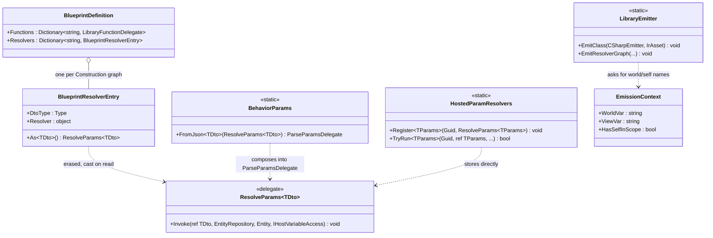
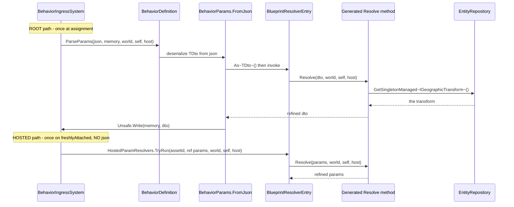
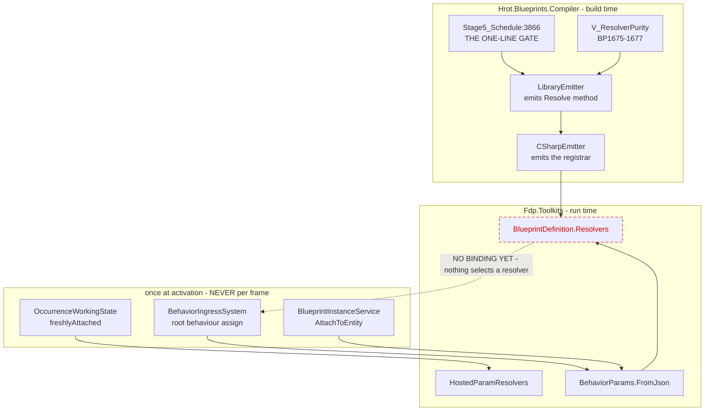

<!--STATUS
state: LIVE
updated: 2026-09-21
build-state: BUILT 2026-09-21 — see section 10 for the as-built and the two deviations.
current-answer: section 10 (AS-BUILT) first, then section 4 (the decision) and section 5
  (the diagrams). Section 7.1 settles the
  PUBLISHING CURRENCY, which Q43 section 8 deliberately left open; section 7.2 settles SELECTION
  (the params-owning region NAMES its resolver, user 2026-09-21) and carries TWO history notes -
  section 7.2a for the superseded three-arm ParamResolverRef, and the note below it for the
  superseded "rank by authorship" answer. Do NOT quote either.
stale-below: section 7.2a (the three-arm ParamResolverRef shape) and section 7.2's trailing
  HISTORY note are both SUPERSEDED and kept only for the measurements that retired them.
known-rot: nothing.
known-conflict: Behavior_Parameter_Resolver_Detailed_Design.md 8.1 rates R4 "Medium" and offers
  two shapes ("adapter-supplied service arguments, or a small read-singleton node"). This design
  picks the FIRST and explicitly REFUSES the second; section 6 says why.
related-designs:
  - Architect_Question_43_Blueprint_Authored_Param_Resolver.md - owns WHAT a resolver blueprint IS
    (A2' the Construction graph, B2 the struct signature, C1 purity). This owns what it can REACH.
  - Behavior_Parameter_Resolver_Detailed_Design.md - owns the R1-R5 decomposition; this builds R4
    and settles R5's signature.
  - DESIGN_Parameter_Model.md - owns the bake/overlay/resolve/write order and the "one supply
    mechanism" rail this must not break.
  - DESIGN_Occurrence_Scoped_Storage.md - owns WHERE a resolved DTO lands (28, 28.7) and supplies
    the only IHostVariableAccess implementation (E7a).
  - DESIGN_Per_Variable_Param_Resolver.md - owns the BEHAVIOUR half of section 7.2's selection
    ruling: how a blackboard params VARIABLE names a resolver, and the Step-3 emit in both
    bridges. This design owns the blueprint half, which needs no property at all (section 11.1).
-->
# ⭐ `DESIGN` — **what a resolver graph can REACH** *(`R4`)*

> ## 🔴 THE PROBLEM IN ONE MEASUREMENT
>
> 📐 `EmissionContext.cs:279` — **`HasSelfInScope => Dispatch != Library`.** A `Construction` graph on
> a Library asset compiles to a static method whose **only parameters are the graph's inputs**. It
> cannot see `self`, cannot reach a component, cannot read a world singleton.
>
> ⇒ ⛔ **The case that motivates the whole resolver feature is NOT EXPRESSIBLE**: `PlatoonHillAttack`'s
> params are geo-authored (`[lat, lon]`) and must go through `IGeographicTransform.ToCartesian`
> *(`Behavior_Parameter_Resolver_Detailed_Design.md` §10)*. A resolver graph today can only do
> arithmetic on the DTO it is handed.

---

## 1. ⭐⭐ INVENTORY *(`R-74`)*

| # | query | total | what it found |
|---|---|---|---|
| ① | `search_graph(name_pattern="IrOp_(Self\|GetComponent.*\|GetManaged.*\|Singleton.*\|.*Shared.*)")` | **7** | `IrOp_Self` · `IrOp_GetComponent` · `IrOp_GetComponentRO` · `IrOp_GetManagedComponentRO` · `IrOp_ReadShared` · `IrOp_WriteShared` · `IrOp_WriteSharedField` — ⛔⛔ **and ZERO singleton ops** |
| ② | `grep "GetSingletonManaged\|HasSingletonManaged"` over the whole compiler | 🔴 **0** | **no emitted blueprint code has ever read a world singleton.** §8.1 `R4`'s `2026-07-13` measurement is **still true** |
| ③ | `grep "HasSelfInScope"` | **4 consumers** | ⭐ **all four are DEBUG PROBES** *(`StatementEmitter.cs:112, 618, 1062, 1067`)*. ⇒ the flag gates **probes**, not the ops — the ops fail for a different reason *(the identifier is simply not declared)* |
| ④ | the gate itself | 🔴 **ONE LINE** | `Stage5_Schedule.cs:3866` — `if (_typed.Asset.Dispatch == AssetDispatchKind.Library) return (false, false);` |
| ⑤ | `FunctionCallContextKind` members | **5** | `None` · `Self` · `View` · `SelfAndView` · `Unspecified` ⇒ ⭐⭐ **the trailing-context MECHANISM IS BUILT** *(`P7`)*: `StatementEmitter.AppendContextArgs:1585` already appends `self` and `ViewVar` to a CLR call |
| ⑥ | where the singleton accessors live | — | 🔴 **`EntityRepository`, NOT `ISimulationView`** *(`EntityRepository.cs:1914/1959`; `ISimulationView.cs` declares none)* ⇒ any singleton read needs the `WorldVar` downcast, exactly as Instance dispatch already does |
| ⑦ | what the emitted adapter already RECEIVES | **3, all discarded** | `Snapshots/Golden/Emit/ParamResolverDemo.cs.txt:51` — `static (inputs, outputs, **view, self, time**) => …` and **none of the three reaches the method** |
| ⑧ | scope-var arms that already exist | **2** | `EmissionContext.WorldVar:188` / `ViewVar:214` — ⭐ **AiPrimitive dispatch already answers `"world"` for both**, which is precisely the shape a resolver needs |

⇒ ⭐⭐⭐ **Nothing in this design is new vocabulary.** ⑤ and ⑧ say the mechanism exists and already has
an arm shaped like the one we want; ④ says one line denies it to Library; ⑦ says the call site is
already holding the context and throwing it away.

---

## 2. ⛔ What this does NOT change

| ⛔ | |
|---|---|
| **`Function` graphs on a Library asset** | their emitted signature is **untouched** ⇒ `SmokeMathLib` and `LibraryFunctionsDemo` stay byte-identical, and `BlueprintDefinition.Functions`' adapter arity is unchanged |
| **`ResolveParams<TDto>`** | ⭐ **not widened.** §4 is designed so the emitted method *is* that signature — ⛔ a widening would be a breaking change to the five curated resolvers, which is the cost `ParseParamsDelegate`'s own header warns about |
| **resolve-once-at-activation** | `R-37`/`R-84` stand. ⛔ Nothing here makes a resolver tick |
| **purity** | `V_ResolverPurity`'s deny-list is unchanged; §4 adds READS, never writes |

---

## 3. ⭐ What binds the answer

| id | binds |
|---|---|
| **`R-37`** | resolve **once at activation** ⇒ ⛔ no `time`-dependent context *(§4's rejected row)* |
| **`R-81`** | the resolver **REFINES** ⇒ the DTO goes in and comes back |
| **`R-91`** | the hook is **per-VARIABLE** ⇒ `TDto` is *"whatever is being resolved"*, not always a whole params region |
| **ruling 9** | ⭐⭐ **one supply mechanism** — `DESIGN_Parameter_Model.md` §8's rail: *"exactly one parameter-resolution path exists"* ⇒ ⛔ **no fourth delegate shape** |
| **`Q43-C1`** | a resolver may **read** anything and **write** only its output |

---

## 4. ⭐⭐⭐ THE DECISION — **a `Construction` graph receives `ResolveParams<TDto>`, unrolled**

```
public static TDto  Resolve<name>(
    TDto                      dto,       // the graph's declared input  (Q43-D / BP1677)
    EntityRepository          world,     // singleton + component reach (inventory ⑥)
    Entity                    self,      // IrOp_Self
    IHostVariableAccess?      host)      // E7a's host variables
```

⭐⭐⭐ **That parameter list is `ResolveParams<TDto>` with the `ref` unrolled into a return value.**
⇒ the emitted method **is** the universal currency measured in `Q43` §8 — ⛔ **no adapter, no bridge, no
new delegate.** The registrar wraps it in one lambda whose body is `dto = Resolve(dto, world, self, host)`.

| ⭐ the four sub-decisions | verdict | why |
|---|---|---|
| **`D1` — ALWAYS append the context, never demand-driven** | ⭐⭐⭐ **always** | `BP1677` already fixes the signature so `Resolvers` is callable **generically**. ⛔ A demand-driven list produces N shapes and makes the table uncallable without reflection — and reflection over generated code is the shape this programme keeps filing |
| **`D2` — `EntityRepository`, not `ISimulationView`** | ⭐⭐ **`EntityRepository`** | inventory ⑥: the singleton accessors are **only** there. ⚠ It is an implicit upcast wherever `ISimulationView` is wanted, so `ViewVar` keeps working unchanged |
| **`D3` — include `host` NOW, although NOTHING supplies it on this path yet** | ⭐⭐⭐ **include it** | 🔒 **the precedent is this codebase's own**, verbatim from `ParseParamsDelegate`'s header: *"the parameter is here NOW because adding one is a breaking change to every resolver, and `E7a` should populate it without a second such change."* ⛔ Same argument, same programme, same mistake avoided twice |
| **`D4` — NO `time`** | ⛔ **excluded** | `R-37`: a resolver runs **once at activation**, so `time` is a tick concept. ⭐ Including it would invite time-dependent params that resolve once and then lie — ⛔ and it is the one member `ResolveParams<TDto>` does not carry, so excluding it keeps §4's signature EQUAL to the currency instead of merely similar |

### 4.1 ⭐ The scope vars — **reuse the AiPrimitive arm, do not invent one**

📐 Inventory ⑧: `WorldVar`/`ViewVar` already answer `"world"` for AiPrimitive dispatch. ⇒ a
`Construction` graph takes the **same** arm, because its emitted method now has a `world` parameter
for the same reason an AiPrimitive thunk does.

⚠ `HasSelfInScope` becomes *"…or this is a `Construction` graph"* — ⭐ which turns **debug probes on**
inside a resolver, correctly: `self` is now genuinely in scope.

---

## 5. ⭐⭐⭐ The diagrams

### 5.1 Classes — ⭐ **grey = already exists; only ONE box is new**



> 📌 **What the picture shows that prose hid:** ⭐⭐ **`BlueprintResolverEntry` is the ONLY new type**,
> and it exists for one reason — `BlueprintDefinition` is not generic, so a typed `ResolveParams<TDto>`
> must be erased to `object` and cast on read. ⭐ That is **not a new pattern**: `HostedParamResolvers`
> already does exactly this and throws on a mismatched cast. ⛔ The entry carries `DtoType` so a picker
> can type-filter **without** touching the delegate.

### 5.2 Sequence — ⭐ **where the world context comes from, per consumer**



> 📌 **What the picture shows that prose hid:** ⭐⭐⭐ **the two consumers differ ONLY above the
> `Entry` line.** The root path arrives through JSON and `FromJson`; the hosted path arrives with no
> JSON at all and calls the same entry directly. ⇒ **that is why `ParseParamsDelegate` cannot be the
> currency** — it demands a `json` argument the hosted path does not have — **and why
> `ResolveParams<TDto>` can.**

### 5.3 Modules — ⭐⭐ **who calls a resolver, and the DEAD EDGE**



> ⭐⭐ **UPDATED `2026-09-21`:** §7.2 gives that dashed edge a home — **the params-owning region names
> its resolver**, and for an asset's OWN `Construction` graph the registrar already holds both halves,
> so the edge becomes solid with no binding step. ⚠ The diagram still draws it dashed because **nothing
> selects a resolver in the CODE today**.
>
> 📌 **What the picture shows that prose hid — and it is the load-bearing part.** ⛔⛔ **The dashed red
> edge is the only thing standing between this design and a working feature: NOTHING SELECTS A
> RESOLVER.** `BlueprintDefinition.Resolvers` is populated by the registrar and read by nobody.
> ⭐ Every other edge is solid and already ticks. ⇒ ⚠ **`R4` makes a resolver CAPABLE; it does not make
> one RUN** — §8 says what does, and why it is deliberately a separate pass.
> ⭐ Note also that **no caller is a per-frame edge** — all three are once-at-activation, which is `R-37`
> drawn rather than asserted.

---

## 6. ⛔⛔ WHAT THIS REFUSES TO BUILD — **a "read world singleton" node**

📄 `Behavior_Parameter_Resolver_Detailed_Design.md` §8.1 `R4` offers two shapes: *"either as
adapter-supplied service arguments, or a small 'read singleton' node."* ⭐ **This design takes the
first and refuses the second**, for three measured reasons:

| ⛔ | |
|---|---|
| **the motivating case does not need it** | with `world` in scope, `FunctionCallNode`'s CLR-method mode reaches `IGeographicTransform.ToCartesian` through the **existing** `P7` trailing-context mechanism *(inventory ⑤)*. 📄 §8.2 `E3` already names that hatch as the intended route |
| **it is speculative vocabulary** | 📐 inventory ②: **zero** blueprint nodes or IR ops read a singleton today, anywhere. ⛔ A new node kind for a consumer that does not exist is the shape `CLAUDE.md`'s round-out rule flags for a nod first |
| **it would need its own type story** | a singleton is a **managed** type; `StaticTypeRegistry` is an unmanaged scalar list plus the `global::` acceptance path. ⚠ That is a real design pass, not a node |

⭐ **If it is wanted later it is additive** — nothing here forecloses it, and the `world` parameter is
exactly what such a node would read from.

---

## 7. ⭐⭐⭐ THE PUBLISHING CURRENCY — **what `Q43` §8 left open**

🔒 **User, `2026-09-21`:** *"the solution taken should fit all potential consumers (btree/hsm/blueprint/
hand written code)."*

📐 **Measured against all five supply paths:**

| consumer | how it supplies params today | does `ResolveParams<TDto>` fit? |
|---|---|---|
| **hand-written (curated)** | `BehaviorRegistry.RegisterResolver(name, ParseParamsDelegate, dtoType)` — 5 of them | ✅ via `BehaviorParams.FromJson<TDto>` |
| **BTree bridge** | emitted `__parseParams`: bake → overlay → write, ⛔ **no resolve stage** *(`BTreeBridgeEmitCore.cs:1268`)* | ✅ per **variable** — `R-91`'s granularity; `TDto` is the variable's type |
| **HSM bridge** | the same emitted shape *(`HsmBridgeEmitCore.cs:345`)* | ✅ identically |
| **Blueprint Instance** | `BlueprintDefinition.ParseParams` — *"`ParseParamsDelegate` verbatim"* *(`InstanceEmitter.cs:246`)* | ✅ via `FromJson<TDto>` |
| **hosted occurrence** | `HostedParamResolvers.TryRun<TParams>` on `freshlyAttached`, ⛔ **no JSON** | ✅ **stored directly — and this is the one `ParseParamsDelegate` CANNOT serve** |

⇒ ⭐⭐⭐ **`ResolveParams<TDto>` is the only shape that fits all five**, and every consumer **knows
`TDto`** at its call site, so type erasure in the table costs nothing.

### 7.1 ⛔ Consequence — **`LibraryFunctionDelegate` is the WRONG currency for `Resolvers`**

📐 `BlueprintDelegates.cs:33` — it carries `(inputs, outputs, ISimulationView, Entity, float)` and
**no `IHostVariableAccess`.** ⇒ a resolver published through it **silently loses `host`**, which is the
one capability `Q41-C1′`/`E7a` exist to provide. ⚠ It also pays a span round-trip the typed shape does
not, and discards `view`/`self`/`time` *(inventory ⑦)*.

| ⭐ the change | |
|---|---|
| `BlueprintDefinition.Resolvers` becomes `IReadOnlyDictionary<string, BlueprintResolverEntry>` | ⭐ `DtoType` for the picker's type filter · type-erased `Resolver` for the consumer's checked cast |
| ⛔ **`Functions` is untouched** | it is a genuinely different concept — *"call this graph by name"* — and its `LibraryFunctionDelegate` is right for it |
| ⚠ **this supersedes `Q43` §8.4's `Resolvers` row** | ⭐ shipped `2026-09-21` as provisional; the currency was explicitly deferred to this design |

### 7.2 ⭐⭐⭐ SELECTION — **the asset NAMES its resolver, so competition is UNREPRESENTABLE** *(user, `2026-09-21`)*

> 🔒 **User, verbatim:** *"blueprint graph defined resolver will likely not compete with hand written,
> how could it? resolver is per graph and someone needs to name the manually coded resolver somehow —
> how in a blueprint? maybe the property of the blueprint itself (UI picked), and if defined, then it
> is clear that this blueprint will not generate own resolver."*

⭐⭐⭐ **This replaces a precedence RULE with a structural IMPOSSIBILITY, and that is strictly better.**
📌 The codebase already prefers this move — `LibraryEmitter`'s own words about the `__loc_` prefix:
*"the prefix makes the collision unrepresentable rather than making it someone's later bug report."*

#### ⭐ The shape

> ⛔⛔ **CORRECTED `2026-09-21`, by measurement — the three-arm shape this section first proposed is
> SUPERSEDED. It lives in §7.2a; do NOT quote it.** ⭐ The RULING below is untouched: a params region
> names exactly one resolver. ⚠ What was wrong was **where the property lives** — I put it on the
> blueprint ASSET, and two of its three arms only ever resolve to a BEHAVIOUR.

**One nullable property on the thing that OWNS a params region** — and measurement says there are **two
such things, not one**:

| the region | it names its resolver… | state |
|---|---|---|
| ⭐ a blueprint asset's **generated `Params` struct** | ⛔ **it does not have to** — `Register(AssetId,…)` and `TryRun(AssetId,…)` key on one value the asset already carries | ✅ **BUILT — `E8a`**, with no property at all *(§11.1)* |
| ⭐⭐ a behaviour blackboard's **params VARIABLE** | ⭐ **a nullable ref on the variable**, because a blackboard carves **N** regions and only the variable can say *which* | ⛔ **`E8c`** — the only place the surviving arms type-check |

⇒ ⭐⭐⭐ **The rule is unchanged — one resolver per params REGION.** ⭐ What changed is that the blueprint
half needs **no property to express it**, so the property is a purely behaviour-side concern.

#### ⛔ §7.2a HISTORY — **the three-arm `ParamResolverRef`, and the measurement that retired it**

```
ParamResolverRef?            // SUPERSEDED 2026-09-21 — see the table below for what each arm measured to
  ├─ OwnGraphId  : Guid      // one of THIS asset's own Construction graphs
  ├─ AssetId + GraphId       // a reusable resolver blueprint (a Library asset's Construction graph)
  └─ CuratedName : string    // a hand-written C# resolver, by the name BehaviorRegistry already keys on
```

| arm | 📐 what it measured to | verdict |
|---|---|---|
| `OwnGraphId` | `CSharpEmitter.cs:456` emits `Register(AssetId,…)` against the thunk's `TryRun(AssetId,…)` ⇒ **one key, no binding step**; and `BP1676`'s one-per-region arm (`V_ResolverPurity.cs:160`) already makes a second own-resolver **unauthorable** | ⛔ **REDUNDANT** — the property would be a second spelling for a fact the structure states |
| `AssetId + GraphId` | `AiPrimitiveEmitter.EmitParamsStruct:151` (and `InstanceEmitter.cs:191`) build `public struct Params` **from the asset's own Parameter declarations** ⇒ always a generated per-asset type, while `ValidateReusableSignature:189` requires the Library resolver declare 1-in/1-out of the **same authored `TypeId`**. `ResolveParams<AuthoredDto>` can never register as `ResolveParams<{Class}.Params>` — `HostedParamResolvers.TryRun:74` would throw its own wrong-type error by construction | 🔴 **TYPE-IMPOSSIBLE on a blueprint.** ⭐ Its only type-compatible consumer is a blackboard variable typed on an authored DTO ⇒ **moves to `E8c`** |
| `CuratedName` | 🔴 **the sentence *"reuses the key `BehaviorRegistry.RegisterResolver(name,…)` already uses"* is the ERROR.** `BehaviorRegistry.cs:468` resolves `name` through `_nameToId` → `_definitions`, i.e. **behaviours**; the only production registrations are `CgfCuratedBehaviorRegistrar.cs:131–138`, keyed by `BehaviorNames.*` and already carrying the DTO as `blackboardLayoutType` | 🔴 **CATEGORY ERROR** — a blueprint asset naming a behaviour-keyed registry ⇒ **moves to `E8c`**, where the key is the right kind of thing |

| ⭐ what SURVIVES from the original table, unchanged | |
|---|---|
| ⭐⭐⭐ **one field, one value ⇒ two resolvers for one region CANNOT BE AUTHORED** | ⛔ no precedence rule to get wrong, no registration-order race — `R-132`'s *"bound by REGISTRATION ORDER is a race, not a precedence rule"* simply has nothing to bind here. ⭐ This is `R-149` and it is untouched |
| ⭐⭐ **the ROLE is assigned by the PROPERTY, not by the graph KIND** | ⭐⭐ this is what honours `Q43-A2′`'s *"do not define `Construction` as the resolver graph"*: `Construction` keeps meaning **"runs once at setup"**. ⚠ On the blueprint half `E8a` reached the same end **structurally** — `BP1676` permits exactly one `Construction` graph where a params region exists — so the kind never became the role |
| ⭐ **data now, picker later** | the property is **authored JSON**; the *"(UI picked)"* half is `Q41-C2′` and the UI lane is held |
| ⛔ **DROPPED: *"`CallablePeers` is the prior art for the reference shape"*** | ⚠ it was cited as precedent for a cross-asset `Guid` ref — but the arm it supported is type-impossible here, and §8 already warns the peer-CALL path is *"designed-only and non-functional."* ⭐ **An under-adopted feature is not evidence either way**; the shape `E8c` needs is the one `CgfCuratedBehaviorRegistrar` already uses |

#### ⭐⭐ Why this also DISSOLVES the binding problem for the hosted path

📐 **Measured:** `HostedParamResolvers.Register<TParams>(Guid assetId, …)` is keyed by **the hosted
blueprint's OWN asset id** — *"registers the resolve stage for a hosted blueprint, keyed by its ASSET
id."* ⇒ ⭐⭐⭐ **when the resolver is the asset's own `Construction` graph, the generated registrar
already holds both halves** and emits `Register(ownAssetId, ownResolver)` with **no binding step at
all.** ⛔ §5.3's dashed red edge disappears for exactly the case the occurrence programme cares about.

#### ⚠ The ONE open sub-question — **granularity, and it differs by what owns the region**

| owner | its params region | so the property lives on… |
|---|---|---|
| an **AiPrimitive / Instance** blueprint | **ONE** struct *(the occurrence slot, or `[Cursor][Params][State]`)* | ⭐ **the ASSET** — matching `HostedParamResolvers`' per-asset key and `Q43-B`'s *"per ASSET, not per site"* |
| a **BTree / HSM behaviour** | **N** packed variables on one blackboard | ⭐ **the VARIABLE** — `R-91` *(the hook is per-VARIABLE)* and `Q41-C2′` *(the authorable one is per VARIABLE)* |

⭐⭐ **That is not two mechanisms:** the rule is **one resolver per params REGION**, and a blueprint has
one region where a behaviour blackboard has N. ⛔ Collapsing them to per-asset would make an HSM
blackboard unresolvable per-variable, which `R-91` forbids.
⚠ **Cost to name:** the behaviour half adds a field to `HsmAssetDto`/`BehaviorTreeAssetDto`, which
moves their round-trip goldens. ⭐ The blueprint half moves none.

##### ⭐⭐⭐ What a blackboard "VARIABLE" actually IS — 📐 **measured over the 30 shipped behaviour assets, `2026-09-21`**

> 🔒 **User's question, and it is the right one:** *"i hope the 'per-variable' actually means per action
> asset or per btree asset used as the chained sub-item of the calling one (because the 'variable' there
> means the concrete parameters of some concrete called ai primitive)."* ⭐ **Substantially YES**, and the
> corpus says so in its own naming.

| 📐 measured | |
|---|---|
| ⭐⭐⭐ **a params variable IS one hosted primitive's params, and the assets NAME it that way** | `PlatoonHillAttack2.btree.json` → target field **`bpParamsCalculateSegments`** · `T39_TwoDistinctPrimitives` → **`bpParamsA`** · `T35_SharedWorkingState` → **`bpParamsSharedA`** ⇒ **`bpParams<site>` is the existing convention** |
| ⭐⭐ **a variable's TYPE can be a whole DTO struct** | `PlatoonHillAttack.btree.json` — `Params : Hrot.AI.Behaviors.Brains.PlatoonHillAttackParams`, comment: *"all nodes alias this one variable"* |
| ⛔⛔ **but site→variable is MANY-TO-ONE — this is why the granularity is the VARIABLE, not the SITE** | 📐 `PlatoonHillAttack` has **7** `ExpressionTargetField` bindings **all naming `Params`**. ⇒ per-SITE would resolve the same bytes **7×**; per-VARIABLE resolves **once**. ⭐ It is also why `Q43-B` refused a per-site resolver as *"a second selection mechanism"* |
| ⚠ **not every variable is a params region** | `HsmVariableShowcase` — `Threshold : System.Single`, `Cursor : System.Int32 (Role=State)`; `T20_MultiStateful` → `cursorA`. ⇒ ⭐ **the property is offered only where a params region exists**, never on working state |

⇒ ⭐⭐⭐ **"Variable" is simply what a params REGION is CALLED on a behaviour blackboard.** ⛔ One rule,
two spellings — because a blueprint carves one params struct and a behaviour blackboard carves N.

#### ⛔ HISTORY — **`2026-09-21`, SUPERSEDED the same day**

⚠ This section first proposed *"rank by AUTHORSHIP, not by artefact kind"* — treating a blueprint
resolver as CURATED so it would outrank an incidental generated `ParseParams`. ⛔ **That was solving a
problem this model makes unrepresentable.** 🔒 The user's question — *"how could it [compete]?"* — is
the refutation: a resolver is selected **by the region that needs one**, so there is never a second
candidate for the same slot. ⭐ **`R-132` is untouched and still governs its own case** *(a curated C#
overlay vs the BTree JSON generator's incidental `ParseParams`)* — ⛔ the blueprint resolver simply
does not join that race.

---

## 7.3 ⚠ CONSEQUENCE FOR `BP1676` — **its scope narrows, and that is a finding**

📐 `V_ResolverPurity` ships **`BP1676`: "a `Construction` graph is only supported on a Library asset."**
⭐ That was right when a resolver could only be a **separate** asset. ⛔ Under §7.2 an **AiPrimitive or
Instance asset may carry its OWN `Construction` graph** — it owns a params region, so it is precisely
the case the property is for.

| ⭐ the revised rule | |
|---|---|
| ⭐⭐ **`Construction` is legal wherever a params region exists** — Library *(a reusable named resolver)*, AiPrimitive and Instance *(its own)* | ⛔ still refused where there is nothing to resolve |
| ⭐⭐⭐ **and a `Construction` graph that NOTHING NAMES is the new `BP1676`** | ⭐ that keeps the rule's real job — *"refuse a graph nobody will ever call"* — while dropping the dispatch test that the selection property makes wrong. ⚠ **This is the honest replacement, not a relaxation** |
| ⚠ **it stays a Stage-2 error, not a warning** | a silently-uncalled resolver is the failure shape this programme keeps filing |

⛔ **`BP1676` as shipped is therefore PROVISIONAL**, like the `Resolvers` currency — both were decided
before the selection model existed. ⭐ Neither is a live defect: today **no** asset carries a
`Construction` graph except `ParamResolverDemo`, which is a Library asset and passes either rule.

---

## 8. ⛔ OUT OF SCOPE — **and named so it is not mistaken for done**

| ⛔ | |
|---|---|
| **the BINDING** | nothing yet says *"behaviour X's params are refined by resolver Y.Z"* — the dashed red edge in §5.3. ⭐ `Q43-E` answers it for a **picker**, and the UI lane is held |
| **`R4b` — a read-singleton node** | §6 |
| **populating `host` on the ROOT path** | ⭐ a root behaviour **has no host** by definition; `null` is the correct answer there and `E7a` already supplies a real instance on the hosted path |
| **per-tick parameter binding** | `R-37`, `R-84` |

---

## 9. ⭐ Acceptance

| # | shape |
|---|---|
| **A1** | a `Construction` graph's emitted method has the §4 signature, and a `Function` graph's does **not** ⇒ 📐 `SmokeMathLib` + `LibraryFunctionsDemo` goldens **byte-identical** |
| **A2** | a resolver graph containing `IrOp_Self` compiles ⇒ ⛔ **red before this change** *(CS0103, `self` undeclared)* |
| **A3** | a resolver graph calling a CLR method declared `(…, ISimulationView)` receives the view ⇒ the `P7` path works for Library |
| **A4** | `ParamResolverDemo` gains a golden sibling that **reads a world singleton through the CLR hatch** and refines the DTO from it — ⭐ the motivating case, in the corpus |
| **A5** | `BlueprintResolverEntry.As<TDto>()` **throws** on a mismatched type, mirroring `HostedParamResolvers.TryRun` ⇒ never a silent reinterpret |
| **A6** | ⭐⭐ **the red-proof:** reverting only the §4 signature reddens `A2`/`A3`/`A4` and **nothing else** |

---

## 10. ⭐⭐⭐ AS-BUILT `2026-09-21` — **`R4` is in; two deviations, both narrowing**

### 10.1 ⭐ What was built, against §9's acceptance

| # | shape | ✅ |
|---|---|---|
| **A1** | a `Construction` graph carries the §4 signature, a `Function` graph does not | ✅ `ResolverWorldReachTests.OnlyAConstructionGraph_GetsTheWorldContext` — and 📐 **43 of 45 goldens byte-identical**; only the two resolver assets moved |
| **A2** | a resolver reaches `self` | ✅ `ACallInsideAResolver_ReceivesSelfAndTheView` — emitted `HasTarget(…, self, world)` |
| **A3** | a CLR method declared `(…, ISimulationView)` receives the view | ✅ same rail |
| **A4** | a golden reads a **world singleton** through the CLR hatch | ✅ **`ResolverWorldReachDemo`** — `NetworkEntityMapOps.ResolveTarget(__t1, world)` reads `NetworkEntityMap` and the `Entity` lands in `PlatoonHillAttackParams.TargetAreaEntity`, run end-to-end in `AResolver_ReadsAWorldSingleton_AndRefinesTheDtoFromIt` |
| **A5** | `As<TDto>()` throws on a mismatch | ✅ `BlueprintAuthoredResolver_InvokeTests.AskingAResolverForTheWrongDtoType_Throws` |
| **A6** | the red-proof | ✅ **TWO, each isolating one half** — below |

### 10.2 ⭐⭐ The red-proof, in two halves — **and both fail in GENERATED code, which is the point**

| revert | what reddens |
|---|---|
| **only the `Stage5_Schedule` gate** *(restore `if (Dispatch == Library) return (false,false)`)* | 🔴 `CS7036: no argument given for the required parameter 'view' of NetworkEntityMapOps.ResolveTarget` — ⭐ the trailing context stops being appended |
| **only the emitted signature** *(drop `world`/`self` from `EmitResolverGraph`)* | 🔴 `CS0103: the name 'world' does not exist in the current context` — ⭐⭐ **literally the failure this design's problem statement names** |

⚠ **Neither red is a test assertion — both are BUILD failures of the production assembly**, because the
corpus asset itself stops compiling. ⭐ That is a stronger proof than a red rail, and it is why the
golden matters: without `ResolverWorldReachDemo` in the corpus, reverting either half would have been
silent.

### 10.3 ⚠ DEVIATION 1 — **the emitted `host` is UNANNOTATED**

📐 `IHostVariableAccess`, not `IHostVariableAccess?`. 🔴 The blueprint compiler's generated files carry
no `#nullable enable`, and a Roslyn generator's output is nullable-**oblivious** regardless of the
project setting ⇒ **`CS8669`**, measured: emitting the `?` fails the build of every asset with a
resolver.

⛔ **The other fix — adding the pragma to the file header — was REJECTED**: it moves all 45 golden
baselines for an annotation, and flips every other emitted construct from oblivious to annotated at
once, under `TreatWarningsAsErrors`, with an unmeasured blast radius. ⚠ `BTreeBridgeEmitCore` does emit
the pragma; that is a **different emitter** whose output was annotated from its first line.
⭐ Nullability is not part of delegate compatibility, so the parameter still binds to
`ResolveParams<TDto>`'s `IHostVariableAccess?` exactly.

### 10.4 ⚠ DEVIATION 2 — **`A2` is proven by a CLR call, not by a bare `IrOp_Self`**

📐 §9 `A2` says *"a resolver graph containing `IrOp_Self`"*. Measured: **there is no standalone `Self`
node** — `IrOp_Self` is produced by the component/collection ops, and most of those are side-effecting
and therefore refused by `V_ResolverPurity`. ⭐ A `FunctionCall` with
`TrailingContext = SelfAndView` requires `self` in scope for the **same** reason and fails the **same**
way (`CS0103`), so it proves the same property with a node a resolver may legally contain.

### 10.5 ⭐ Two things the build taught, both kept

| | |
|---|---|
| ⭐⭐ **`BP1677` refused an early draft of `R4`'s own rail** | the first `A2`/`A3` rail was authored `uint in → bool out`. ⛔ That is not a resolver shape, and the validator said so. ⭐ **The rail was fixed, not the rule** — a test may not quietly author a shape the product forbids |
| ⭐ **the test builder gained `WithOutput` and `PureCallReturning`** | ⚠ and the second one **wires the call into the `Return` value pin deliberately**: an unwired data node is unreachable, Stage 5 drops it, and a rail asserting on the emitted source would then pass or fail for the wrong reason |

---

## 11. ⭐⭐⭐ AS-BUILT `2026-09-21` — **`E8a`: an asset carries its OWN resolver**

> 🔒 **User:** *"e8a agreed. RegisterResolver duplicate gap as part of e8a."*

### 11.1 ⭐⭐ Why this needs NO selection property

📐 **Measured:** `HostedParamResolvers.Register` is keyed by the hosted blueprint's **own asset id**, and
`AiPrimitiveEmitter:413` already emits `TryRun(AssetId, …)` in the thunk. ⇒ when the resolver is the
asset's own `Construction` graph, **producer and consumer key on one value the asset already carries**
and there is no binding step at all. ⭐ §7.2's property is needed only for **reuse** and for the
**behaviour** side — which is why `E8` split into three.

### 11.2 🔴 THE MEASUREMENT THAT CHANGED THE SLICE — **an own-asset resolver cannot name its DTO**

📐 An AiPrimitive's params struct is **GENERATED** — `{Class}.Params`, built from the asset's own
`Parameters` by `AiPrimitiveEmitter.EmitParamsStruct`. ⛔ Its FQN embeds the BlueprintId hash, so **no
authored `TypeId` could name it** without baking the emitted class name into the asset.

⇒ ⭐⭐⭐ **`E8a` was NOT "one validator revision plus one `Register` call"**, which is how it was pitched.
The implied subject forces four changes, each of which falls out of that one fact:

| | |
|---|---|
| **`BP1676` revised** | `Construction` is legal wherever a params region exists. ⭐ The rule's real job survives verbatim — **refuse a resolver nothing will ever call** — which on a params-owning asset means one whose asset declares no parameters |
| **`BP1676` second arm** | ⭐⭐ **at most ONE `Construction` graph** on a params-owning asset: its parameters are ONE region and `R-149` gives a region exactly one resolver. ⚠ A **Library** may carry many — they are separately-named reusable resolvers |
| **`BP1677` splits** | a *reusable* resolver declares `1-in / 1-out, same type`; an *own-asset* resolver declares **nothing** |
| **`BP1675` gains ONE exemption** | ⭐⭐⭐ a `SetVariable` targeting a **PARAMETER** is allowed in an own-asset resolver, because the params region **IS its output**. ⛔ Targeting STATE is still refused, and the rail asserts **both halves** — the negative one is what keeps the exemption narrow |

⭐ The emitted method is `(ref Params p, EntityRepository world, Entity self, IHostVariableAccess host)`
— `ResolveParams<Params>` exactly — and `p` is named `p` on purpose, because
`EmissionContext.ParamsVar` already answers `"p"` for AiPrimitive dispatch, so every emitted parameter
read and write resolves against it with **no new scope-var arm**.

### 11.3 ⚠ DEVIATION — **the emitted resolver returns `NodeStatus`, and the registration discards it**

📐 A graph's `Return` node always carries a status — that is the graph vocabulary, shared with ticking
graphs — so a resolver body ends in `return NodeStatus.Success;` and a `void` method is **`CS0127`**.
⭐ A resolver has no status of its own, so the value is dropped at the registration lambda. ⛔ Forcing
`void` would mean teaching the **shared terminator emitter** about resolvers: a far wider change for a
value nobody reads.

### 11.4 ⭐⭐ The duplicate guard — **two registries, OPPOSITE policies, and the reason is measured**

| registry | policy | why |
|---|---|---|
| `BehaviorRegistry.RegisterResolver` | ⭐⭐⭐ **THROWS** | `R-149`. 📐 Every scan builds a **FRESH** staging registry *(`AiHotReloadCoordinator.cs:315`, `QuickReloadService.cs:142`)* and the live registry is written by `MergeFrom`, a separate overwrite path ⇒ a duplicate seen here can only be **two bindings in ONE scan** — an authoring error |
| `HostedParamResolvers.Register` | ⭐ **OVERWRITES** | keyed by **asset id** and re-registered by **every rescan** ⇒ a throw here would break hot reload |

⚠⚠ **Without that measurement the obvious implementation — "throw on any duplicate" — would have
broken reload.** ⭐ Both halves are railed, the second one specifically asserting `MergeFrom` still
overwrites.

### 11.4a 📌 WHAT THE SUITE CAUGHT — **`U-11`'s rail, and it was right**

📐 The first full run reddened **`ViewsAreUnreadTests.TheCompilerStagesReadNoDeclarationListDirectly`**
on two lines of `V_ResolverPurity`. ⛔ A compiler stage may not read the per-kind declaration VIEWS
directly: `U-12` deletes those three properties on the strength of *"nothing reads them any more"*, so
a direct read here would have turned that deletion into the batch that finds out.

⭐ Routed through `Declarations.Of(DeclarationKind.Parameter)` behind one `ParamsOf` helper.
⚠ **And the fix had a second half worth recording:** the first attempt put the words
*"not `asset.Parameters`"* in an explanatory COMMENT — which the rail's regex matches just as
happily as code. ⇒ the comment was reworded rather than the rail loosened.

### 11.5 ⭐ Gates

| | |
|---|---|
| golden | `OwnParamResolverDemo`, corpus **45 → 46**; movement **purely additive** *(2 new files + 1 line)*, zero existing goldens moved |
| rails | 9 — the emitted shape, the negative *"no resolver ⇒ no registration"*, `BP1676` ×3 *(none/two/Library-many)*, `BP1677`, the purity exemption **with its negative half**, and the two duplicate-policy rails |
| red-proof | neutering **only** the registration reddens exactly 2: the emission rail and that one Tier2 golden — 154 others green |
