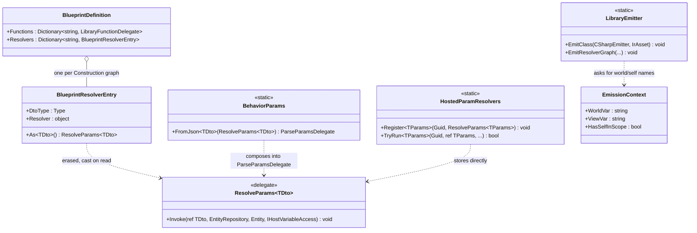
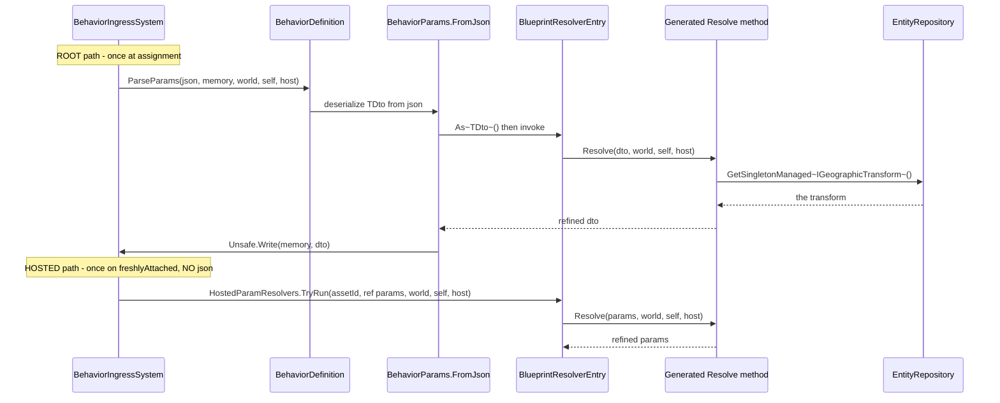
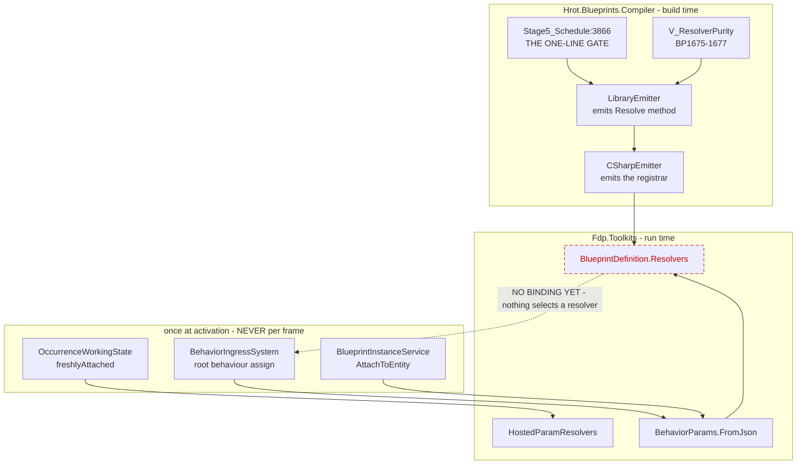

<!--STATUS
state: LIVE
updated: 2026-09-21
build-state: READY-TO-BUILD
current-answer: section 4 (the decision) and section 5 (the diagrams). Section 7 settles the
  PUBLISHING CURRENCY, which Q43 section 8 deliberately left open.
stale-below: nothing.
known-rot: nothing.
known-conflict: Behavior_Parameter_Resolver_Detailed_Design.md 8.1 rates R4 "Medium" and offers
  two shapes ("adapter-supplied service arguments, or a small read-singleton node"). This design
  picks the FIRST and explicitly REFUSES the second; section 6 says why.
related-designs:
  - Architect_Question_43_Blueprint_Authored_Param_Resolver.md - owns WHAT a resolver blueprint IS
    (A2' the Construction graph, B2 the struct signature, C1 purity). This owns what it can REACH.
  - Behavior_Parameter_Resolver_Detailed_Design.md - owns the R1-R5 decomposition; this builds R4
    and settles R5's signature.
  - DESIGN_Parameter_Model.md - owns the bake/overlay/resolve/write order and the "one supply
    mechanism" rail this must not break.
  - DESIGN_Occurrence_Scoped_Storage.md - owns WHERE a resolved DTO lands (28, 28.7) and supplies
    the only IHostVariableAccess implementation (E7a).
-->
# ⭐ `DESIGN` — **what a resolver graph can REACH** *(`R4`)*

> ## 🔴 THE PROBLEM IN ONE MEASUREMENT
>
> 📐 `EmissionContext.cs:279` — **`HasSelfInScope => Dispatch != Library`.** A `Construction` graph on
> a Library asset compiles to a static method whose **only parameters are the graph's inputs**. It
> cannot see `self`, cannot reach a component, cannot read a world singleton.
>
> ⇒ ⛔ **The case that motivates the whole resolver feature is NOT EXPRESSIBLE**: `PlatoonHillAttack`'s
> params are geo-authored (`[lat, lon]`) and must go through `IGeographicTransform.ToCartesian`
> *(`Behavior_Parameter_Resolver_Detailed_Design.md` §10)*. A resolver graph today can only do
> arithmetic on the DTO it is handed.

---

## 1. ⭐⭐ INVENTORY *(`R-74`)*

| # | query | total | what it found |
|---|---|---|---|
| ① | `search_graph(name_pattern="IrOp_(Self\|GetComponent.*\|GetManaged.*\|Singleton.*\|.*Shared.*)")` | **7** | `IrOp_Self` · `IrOp_GetComponent` · `IrOp_GetComponentRO` · `IrOp_GetManagedComponentRO` · `IrOp_ReadShared` · `IrOp_WriteShared` · `IrOp_WriteSharedField` — ⛔⛔ **and ZERO singleton ops** |
| ② | `grep "GetSingletonManaged\|HasSingletonManaged"` over the whole compiler | 🔴 **0** | **no emitted blueprint code has ever read a world singleton.** §8.1 `R4`'s `2026-07-13` measurement is **still true** |
| ③ | `grep "HasSelfInScope"` | **4 consumers** | ⭐ **all four are DEBUG PROBES** *(`StatementEmitter.cs:112, 618, 1062, 1067`)*. ⇒ the flag gates **probes**, not the ops — the ops fail for a different reason *(the identifier is simply not declared)* |
| ④ | the gate itself | 🔴 **ONE LINE** | `Stage5_Schedule.cs:3866` — `if (_typed.Asset.Dispatch == AssetDispatchKind.Library) return (false, false);` |
| ⑤ | `FunctionCallContextKind` members | **5** | `None` · `Self` · `View` · `SelfAndView` · `Unspecified` ⇒ ⭐⭐ **the trailing-context MECHANISM IS BUILT** *(`P7`)*: `StatementEmitter.AppendContextArgs:1585` already appends `self` and `ViewVar` to a CLR call |
| ⑥ | where the singleton accessors live | — | 🔴 **`EntityRepository`, NOT `ISimulationView`** *(`EntityRepository.cs:1914/1959`; `ISimulationView.cs` declares none)* ⇒ any singleton read needs the `WorldVar` downcast, exactly as Instance dispatch already does |
| ⑦ | what the emitted adapter already RECEIVES | **3, all discarded** | `Snapshots/Golden/Emit/ParamResolverDemo.cs.txt:51` — `static (inputs, outputs, **view, self, time**) => …` and **none of the three reaches the method** |
| ⑧ | scope-var arms that already exist | **2** | `EmissionContext.WorldVar:188` / `ViewVar:214` — ⭐ **AiPrimitive dispatch already answers `"world"` for both**, which is precisely the shape a resolver needs |

⇒ ⭐⭐⭐ **Nothing in this design is new vocabulary.** ⑤ and ⑧ say the mechanism exists and already has
an arm shaped like the one we want; ④ says one line denies it to Library; ⑦ says the call site is
already holding the context and throwing it away.

---

## 2. ⛔ What this does NOT change

| ⛔ | |
|---|---|
| **`Function` graphs on a Library asset** | their emitted signature is **untouched** ⇒ `SmokeMathLib` and `LibraryFunctionsDemo` stay byte-identical, and `BlueprintDefinition.Functions`' adapter arity is unchanged |
| **`ResolveParams<TDto>`** | ⭐ **not widened.** §4 is designed so the emitted method *is* that signature — ⛔ a widening would be a breaking change to the five curated resolvers, which is the cost `ParseParamsDelegate`'s own header warns about |
| **resolve-once-at-activation** | `R-37`/`R-84` stand. ⛔ Nothing here makes a resolver tick |
| **purity** | `V_ResolverPurity`'s deny-list is unchanged; §4 adds READS, never writes |

---

## 3. ⭐ What binds the answer

| id | binds |
|---|---|
| **`R-37`** | resolve **once at activation** ⇒ ⛔ no `time`-dependent context *(§4's rejected row)* |
| **`R-81`** | the resolver **REFINES** ⇒ the DTO goes in and comes back |
| **`R-91`** | the hook is **per-VARIABLE** ⇒ `TDto` is *"whatever is being resolved"*, not always a whole params region |
| **ruling 9** | ⭐⭐ **one supply mechanism** — `DESIGN_Parameter_Model.md` §8's rail: *"exactly one parameter-resolution path exists"* ⇒ ⛔ **no fourth delegate shape** |
| **`Q43-C1`** | a resolver may **read** anything and **write** only its output |

---

## 4. ⭐⭐⭐ THE DECISION — **a `Construction` graph receives `ResolveParams<TDto>`, unrolled**

```
public static TDto  Resolve<name>(
    TDto                      dto,       // the graph's declared input  (Q43-D / BP1677)
    EntityRepository          world,     // singleton + component reach (inventory ⑥)
    Entity                    self,      // IrOp_Self
    IHostVariableAccess?      host)      // E7a's host variables
```

⭐⭐⭐ **That parameter list is `ResolveParams<TDto>` with the `ref` unrolled into a return value.**
⇒ the emitted method **is** the universal currency measured in `Q43` §8 — ⛔ **no adapter, no bridge, no
new delegate.** The registrar wraps it in one lambda whose body is `dto = Resolve(dto, world, self, host)`.

| ⭐ the four sub-decisions | verdict | why |
|---|---|---|
| **`D1` — ALWAYS append the context, never demand-driven** | ⭐⭐⭐ **always** | `BP1677` already fixes the signature so `Resolvers` is callable **generically**. ⛔ A demand-driven list produces N shapes and makes the table uncallable without reflection — and reflection over generated code is the shape this programme keeps filing |
| **`D2` — `EntityRepository`, not `ISimulationView`** | ⭐⭐ **`EntityRepository`** | inventory ⑥: the singleton accessors are **only** there. ⚠ It is an implicit upcast wherever `ISimulationView` is wanted, so `ViewVar` keeps working unchanged |
| **`D3` — include `host` NOW, although NOTHING supplies it on this path yet** | ⭐⭐⭐ **include it** | 🔒 **the precedent is this codebase's own**, verbatim from `ParseParamsDelegate`'s header: *"the parameter is here NOW because adding one is a breaking change to every resolver, and `E7a` should populate it without a second such change."* ⛔ Same argument, same programme, same mistake avoided twice |
| **`D4` — NO `time`** | ⛔ **excluded** | `R-37`: a resolver runs **once at activation**, so `time` is a tick concept. ⭐ Including it would invite time-dependent params that resolve once and then lie — ⛔ and it is the one member `ResolveParams<TDto>` does not carry, so excluding it keeps §4's signature EQUAL to the currency instead of merely similar |

### 4.1 ⭐ The scope vars — **reuse the AiPrimitive arm, do not invent one**

📐 Inventory ⑧: `WorldVar`/`ViewVar` already answer `"world"` for AiPrimitive dispatch. ⇒ a
`Construction` graph takes the **same** arm, because its emitted method now has a `world` parameter
for the same reason an AiPrimitive thunk does.

⚠ `HasSelfInScope` becomes *"…or this is a `Construction` graph"* — ⭐ which turns **debug probes on**
inside a resolver, correctly: `self` is now genuinely in scope.

---

## 5. ⭐⭐⭐ The diagrams

### 5.1 Classes — ⭐ **grey = already exists; only ONE box is new**



> 📌 **What the picture shows that prose hid:** ⭐⭐ **`BlueprintResolverEntry` is the ONLY new type**,
> and it exists for one reason — `BlueprintDefinition` is not generic, so a typed `ResolveParams<TDto>`
> must be erased to `object` and cast on read. ⭐ That is **not a new pattern**: `HostedParamResolvers`
> already does exactly this and throws on a mismatched cast. ⛔ The entry carries `DtoType` so a picker
> can type-filter **without** touching the delegate.

### 5.2 Sequence — ⭐ **where the world context comes from, per consumer**



> 📌 **What the picture shows that prose hid:** ⭐⭐⭐ **the two consumers differ ONLY above the
> `Entry` line.** The root path arrives through JSON and `FromJson`; the hosted path arrives with no
> JSON at all and calls the same entry directly. ⇒ **that is why `ParseParamsDelegate` cannot be the
> currency** — it demands a `json` argument the hosted path does not have — **and why
> `ResolveParams<TDto>` can.**

### 5.3 Modules — ⭐⭐ **who calls a resolver, and the DEAD EDGE**



> 📌 **What the picture shows that prose hid — and it is the load-bearing part.** ⛔⛔ **The dashed red
> edge is the only thing standing between this design and a working feature: NOTHING SELECTS A
> RESOLVER.** `BlueprintDefinition.Resolvers` is populated by the registrar and read by nobody.
> ⭐ Every other edge is solid and already ticks. ⇒ ⚠ **`R4` makes a resolver CAPABLE; it does not make
> one RUN** — §8 says what does, and why it is deliberately a separate pass.
> ⭐ Note also that **no caller is a per-frame edge** — all three are once-at-activation, which is `R-37`
> drawn rather than asserted.

---

## 6. ⛔⛔ WHAT THIS REFUSES TO BUILD — **a "read world singleton" node**

📄 `Behavior_Parameter_Resolver_Detailed_Design.md` §8.1 `R4` offers two shapes: *"either as
adapter-supplied service arguments, or a small 'read singleton' node."* ⭐ **This design takes the
first and refuses the second**, for three measured reasons:

| ⛔ | |
|---|---|
| **the motivating case does not need it** | with `world` in scope, `FunctionCallNode`'s CLR-method mode reaches `IGeographicTransform.ToCartesian` through the **existing** `P7` trailing-context mechanism *(inventory ⑤)*. 📄 §8.2 `E3` already names that hatch as the intended route |
| **it is speculative vocabulary** | 📐 inventory ②: **zero** blueprint nodes or IR ops read a singleton today, anywhere. ⛔ A new node kind for a consumer that does not exist is the shape `CLAUDE.md`'s round-out rule flags for a nod first |
| **it would need its own type story** | a singleton is a **managed** type; `StaticTypeRegistry` is an unmanaged scalar list plus the `global::` acceptance path. ⚠ That is a real design pass, not a node |

⭐ **If it is wanted later it is additive** — nothing here forecloses it, and the `world` parameter is
exactly what such a node would read from.

---

## 7. ⭐⭐⭐ THE PUBLISHING CURRENCY — **what `Q43` §8 left open**

🔒 **User, `2026-09-21`:** *"the solution taken should fit all potential consumers (btree/hsm/blueprint/
hand written code)."*

📐 **Measured against all five supply paths:**

| consumer | how it supplies params today | does `ResolveParams<TDto>` fit? |
|---|---|---|
| **hand-written (curated)** | `BehaviorRegistry.RegisterResolver(name, ParseParamsDelegate, dtoType)` — 5 of them | ✅ via `BehaviorParams.FromJson<TDto>` |
| **BTree bridge** | emitted `__parseParams`: bake → overlay → write, ⛔ **no resolve stage** *(`BTreeBridgeEmitCore.cs:1268`)* | ✅ per **variable** — `R-91`'s granularity; `TDto` is the variable's type |
| **HSM bridge** | the same emitted shape *(`HsmBridgeEmitCore.cs:345`)* | ✅ identically |
| **Blueprint Instance** | `BlueprintDefinition.ParseParams` — *"`ParseParamsDelegate` verbatim"* *(`InstanceEmitter.cs:246`)* | ✅ via `FromJson<TDto>` |
| **hosted occurrence** | `HostedParamResolvers.TryRun<TParams>` on `freshlyAttached`, ⛔ **no JSON** | ✅ **stored directly — and this is the one `ParseParamsDelegate` CANNOT serve** |

⇒ ⭐⭐⭐ **`ResolveParams<TDto>` is the only shape that fits all five**, and every consumer **knows
`TDto`** at its call site, so type erasure in the table costs nothing.

### 7.1 ⛔ Consequence — **`LibraryFunctionDelegate` is the WRONG currency for `Resolvers`**

📐 `BlueprintDelegates.cs:33` — it carries `(inputs, outputs, ISimulationView, Entity, float)` and
**no `IHostVariableAccess`.** ⇒ a resolver published through it **silently loses `host`**, which is the
one capability `Q41-C1′`/`E7a` exist to provide. ⚠ It also pays a span round-trip the typed shape does
not, and discards `view`/`self`/`time` *(inventory ⑦)*.

| ⭐ the change | |
|---|---|
| `BlueprintDefinition.Resolvers` becomes `IReadOnlyDictionary<string, BlueprintResolverEntry>` | ⭐ `DtoType` for the picker's type filter · type-erased `Resolver` for the consumer's checked cast |
| ⛔ **`Functions` is untouched** | it is a genuinely different concept — *"call this graph by name"* — and its `LibraryFunctionDelegate` is right for it |
| ⚠ **this supersedes `Q43` §8.4's `Resolvers` row** | ⭐ shipped `2026-09-21` as provisional; the currency was explicitly deferred to this design |

### 7.2 ⛔⛔ PRECEDENCE — **is a blueprint-authored resolver CURATED or GENERATED?** *(`R-132`)*

🔒 **`R-132`, user `2026-08-23`:** *"if curated (hand-authored) exists, then no other is needed —
having automatically generated is undesired in such a case."* ⛔ And its sharper half: **two producers
for one slot bound by REGISTRATION ORDER is a race, not a precedence rule.**

📐 **`R-132`'s mechanism, measured:** `BehaviorRegistry.RegisterResolver` is reached **only** from
`CgfCuratedBehaviorRegistrar` ⇒ *"the presence of an overlay IS the signal that a human wrote a
resolver for this behaviour."*

⚠⚠ **A blueprint-authored resolver breaks that signal, and this is a NEW question `R-132` could not
have anticipated.** It is **generated code** *(a `[BlueprintRegistrar]` emits it)* produced from a
**hand-authored artefact** *(a designer drew the graph)*. ⇒ ⛔ **the C#-vs-emitted test no longer
distinguishes "a human wrote this" from "a tool did."**

| ⭐ the recommended answer — ⛔ **needs the user's nod before it is canon** | |
|---|---|
| ⭐⭐⭐ **rank by AUTHORSHIP, not by artefact kind** | ⭐ a blueprint resolver is **CURATED**: a human chose it, in a tool, for this behaviour. ⛔ What `R-132` actually refuses is a resolver **nobody asked for** — the BTree JSON generator's incidental `ParseParams`, emitted *because the asset declares a managed blackboard* |
| ⭐⭐ **so the rank is: explicit binding (C# overlay **or** blueprint) ▸ incidental generated `ParseParams`** | ⇒ ⭐ the blueprint resolver joins the **overlay** tier, not the generated one |
| ⛔⛔ **and TWO EXPLICIT bindings for one behaviour must THROW, never race** | 🔒 that is `R-132`'s own sentence applied to its successor: *"where a curated and a generated artefact can both fill a slot, curated wins **by declaration**, not by arriving first."* ⇒ **two curated ones is an authoring error and must be loud** |
| ⚠ **this is a BINDING-time rule, so it lands with the binding, not with `R4`** | ⭐ recorded here so the binding pass cannot re-derive it wrongly — ⛔ `R4` itself changes no precedence |


---

## 8. ⛔ OUT OF SCOPE — **and named so it is not mistaken for done**

| ⛔ | |
|---|---|
| **the BINDING** | nothing yet says *"behaviour X's params are refined by resolver Y.Z"* — the dashed red edge in §5.3. ⭐ `Q43-E` answers it for a **picker**, and the UI lane is held |
| **`R4b` — a read-singleton node** | §6 |
| **populating `host` on the ROOT path** | ⭐ a root behaviour **has no host** by definition; `null` is the correct answer there and `E7a` already supplies a real instance on the hosted path |
| **per-tick parameter binding** | `R-37`, `R-84` |

---

## 9. ⭐ Acceptance

| # | shape |
|---|---|
| **A1** | a `Construction` graph's emitted method has the §4 signature, and a `Function` graph's does **not** ⇒ 📐 `SmokeMathLib` + `LibraryFunctionsDemo` goldens **byte-identical** |
| **A2** | a resolver graph containing `IrOp_Self` compiles ⇒ ⛔ **red before this change** *(CS0103, `self` undeclared)* |
| **A3** | a resolver graph calling a CLR method declared `(…, ISimulationView)` receives the view ⇒ the `P7` path works for Library |
| **A4** | `ParamResolverDemo` gains a golden sibling that **reads a world singleton through the CLR hatch** and refines the DTO from it — ⭐ the motivating case, in the corpus |
| **A5** | `BlueprintResolverEntry.As<TDto>()` **throws** on a mismatched type, mirroring `HostedParamResolvers.TryRun` ⇒ never a silent reinterpret |
| **A6** | ⭐⭐ **the red-proof:** reverting only the §4 signature reddens `A2`/`A3`/`A4` and **nothing else** |
