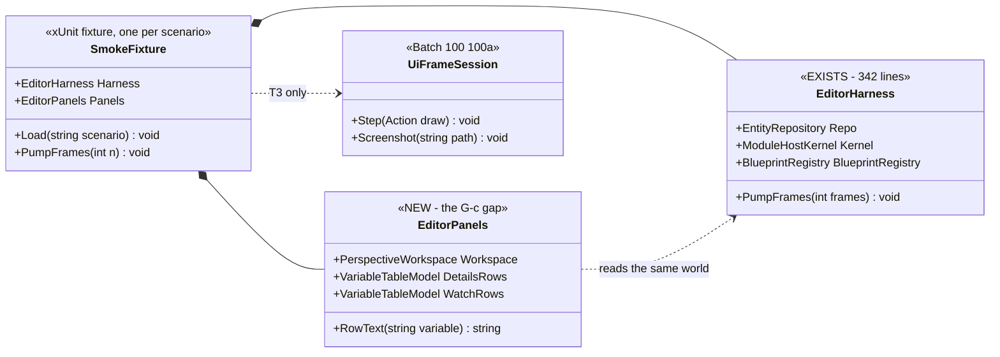
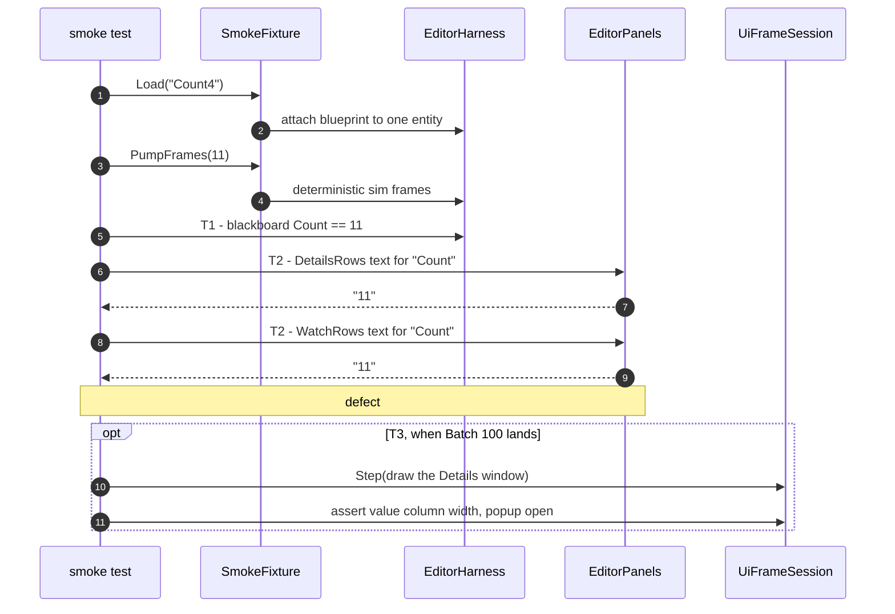

<!--STATUS
state: LIVE
build-state: READY-TO-BUILD
updated: 2026-08-20
current-answer: this whole file — what exists for user-level smoke testing, what is
  missing, and the three-tier design. Section 5 is the task breakdown.
stale-below: nothing.
known-rot: none.
known-conflict: none.
-->
# ⭐⭐⭐ DESIGN — **the SMOKE SUITE: one entity, one behaviour, "is it obviously broken?"**

> ⭐⭐ **User, `2026-08-20`:** *"running a set of simple scenarios with single entity carrying simple
> behavior (like the Count4 blueprint) and running it, watching if it does what it usually does,
> checking the panels if they show what they usually do… giving many times better and faster indication
> of 'something is wrong' than running thousands of little unit tests that never 'see' the stuff what
> the user sees."*

⭐⭐⭐ **The headline: most of this ALREADY EXISTS, it is RED, and it is NOT GATED.**

---

## 1. ⭐⭐⭐ INVENTORY — **measured `2026-08-20`, not remembered**

```
find Hrot/Runner/Hrot.ClusterRunner.Integration.Tests -name "*.cs"        → 57 files
grep -c "\[Fact\|\[Theory"                                               → 174 tests, 6 skipped
dotnet build …Integration.Tests.csproj                                   → 0 errors, 77 s
dotnet test  --filter HarnessSmoke|BlueprintKernelRun|BlueprintObserve    → ⛔ 3 pass / 9 FAIL / 3 skip
grep -rn "class .*ActionHandler" (excl Tests)                            → 9 handlers
search_graph / grep: PerspectiveWorkspaceRegistrar in EditorHarness       → ⛔ 0 hits
```

### ⭐⭐ What EXISTS — **and it is a lot more than "some headless tests"**

| asset | 📐 where | ⭐ what it gives |
|---|---|---|
| ⭐⭐⭐ **`EditorHarness`** *(342 lines)* | `Hrot.ClusterRunner.Integration.Tests/EditorHarness.cs` | ⭐⭐ **a real headless editor+sim**: `EntityRepository` · `ModuleHostKernel` · `BlueprintRegistry` · **the blueprint runtime wired through the SAME shared helper `EditorSubsystem` uses** · a deterministic `MasterSyncController` · TKB · scenario file + zone services · **`PumpFrames(n)`** |
| ⭐⭐ **`--mode ci`** | `ClusterRunner/Program.cs:127` + `Scenarios/CiSubsystem.cs` | a headless deterministic scenario run with a **process exit code** ⚠ **one scenario registered** *(`MinimalCIScenario`)* |
| ⭐⭐ **a JSON test-script engine** | `Fdp.Toolkits/Runner/Testing/` — `TestScript` · `HeadlessTestExecutor` · `ITestActionHandler` | steps *(time · action · args · repeat · interval)*, **assertions** *(min/max/exactly/approx+tolerance)*, saved results, a generated report |
| ⭐ **9 action handlers** | `Fdp.Toolkits` *(Wait · AssertAll · Tick)* · `ClusterRunner/Testing/` *(Spawn · Move · AssertPosition · ClusterOp · AssertEntityCount · AddMovingTag)* | the vocabulary is already started |
| ⭐ **6 e2e scripts** | `…Integration.Tests/TestScripts/*.json` | record/replay/checkpoint cycles |
| ⭐⭐ **`Count4.bp.json`** | `Hrot.AI.Behaviors/Assets/Blueprints/` *(and a test copy)* | ⭐ **the exact fixture the user names** |
| ⭐⭐⭐ **the FRAME RAIL** | `R-124` · Batch 100 `100a` · `tools/ui-probe/` | ⛔ **the drawn layer — new, in flight** |

### ⛔⛔ THE THREE GAPS — **and the first two are worse than the third**

| # | gap | 📐 evidence |
|---|---|---|
| ⛔⛔⛔ **G-a** | **IT IS NOT GATED.** `Hrot.ClusterRunner.Integration.Tests` appears in **no** batch gate table — not Batch 99's, not any. ⇒ ⭐⭐ **174 tests that nobody runs**, while every batch runs ~8 000 unit tests | grep of `REPORT_Batch99` §6 |
| ⛔⛔ **G-b** | **IT IS RED.** A sampled filter gives **9 failures / 15**, and the counter tests are wrong by **exactly one, every time** — `1→0`, `3→2`, `10→9` | `BlueprintKernelRunTests:61` |
| ⛔ **G-c** | **NO PANEL LAYER.** `EditorHarness` mirrors `EditorSubsystem`'s **runtime** wiring and builds **no `WindowManager`, no `PerspectiveWorkspaceRegistrar`, no `VariableTableModel`** ⇒ ⛔ **it cannot see what the user sees** | 0 hits in the harness |

> ### ⚠⚠ `G-b` IS A FINDING IN ITS OWN RIGHT — **and it must not be assumed benign**
> 📐 `BlueprintKernelRunTests.cs` and `EditorHarness.cs` were **last touched long ago** *(`877fc7c74` /
> `0ee3bb6c9`)*, while the runtime has moved through ~40 batches.
> ⭐⭐ **These tests say: "attach a counting blueprint, pump N frames, the counter is N."** ⛔ **It is
> N−1.** ⚠ **Whether that is a regression or a test that drifted is UNKNOWN — ⭐ and the fact that nobody
> can say is exactly what `G-a` costs.**
> ⛔ **Do NOT "fix" it by changing the expectation until the direction is measured** *(bisect, or read
> the splice order — 📌 the harness comments already mention a one-tick dispatch delay at `:226`)*.

---

## 2. ⭐⭐⭐ THE DESIGN — **three assertion tiers over ONE fixture**

⭐⭐ **The insight that makes this cheap:** *"what the user sees"* has **three layers**, and ⛔ **only the
top one needs pixels.**

| tier | asserts on | catches | 📌 the `2026-08-20` defects it would have caught |
|---|---|---|---|
| **T1 — BEHAVIOUR** | the blackboard after `PumpFrames(n)` | *"the sim stopped working"* | — |
| ⭐⭐⭐ **T2 — PANEL MODEL** | ⭐⭐ **the row STRINGS a panel would render** *(`VariableTableModel`)* | *"the panel shows the wrong thing"* | ✅ **#4 — the Watch reading `0`** · ✅ the `(pending)` class · ✅ every wrong-arm class |
| **T3 — DRAWN FRAME** | a real ImGui frame *(`R-124`)* | *"the panel shows nothing / is unusable"* | ✅ **#1 width** · ✅ **#2 `[x]`** · ✅ **#3 the un-drawn form** |

⭐⭐⭐ **T2 is the best value in the whole document** — ⛔ **no pixels, no Xvfb, no image drift**: it reads
the model the renderer reads, as strings. ⭐ **And it is the tier that catches the defect class this
programme keeps shipping** *(a panel wired to the wrong arm)*.





---

## 3. ⭐⭐ ONE fixture shape, reused — **what a smoke scenario IS**

⭐ **The user's own description is the spec:** *one entity · one simple behaviour · run it · check the
panels.*

| | |
|---|---|
| **the asset** | ⭐ `Count4.bp.json` — ⛔ **not a hand-built graph**: it is the asset the user actually opens |
| **the entity** | one, spawned from a TKB template the harness already registers |
| **the run** | `PumpFrames(n)` — deterministic, fixed `1/60` |
| ⭐⭐ **the assertions** | **T1** the blackboard · **T2** the Details row text **and** the Watch row text · **T3** *(later)* one frame |
| ⭐ **the report** | ⛔ **not just pass/fail** — ⭐ print the row texts, so a red says *"Watch showed `0`, Details showed `11`"* rather than *"Assert.Equal failed"* |

⭐⭐ **Add scenarios by copying the fixture**, one per behaviour family — ⛔ **do not build a DSL.**

### ⚠ xUnit or the JSON `TestScript`? — **xUnit for this, and here is why**

| | |
|---|---|
| ⭐ **JSON `TestScript`** | ⭐ **keep it** for what it already serves — **cluster/DDS/replay e2e**, where steps are timed *actions* and assertions are *numeric metrics* |
| ⭐⭐⭐ **xUnit fixture** | ⛔ **T2 asserts on OBJECTS** *(a model's row text)*, which a numeric-metric DSL cannot express without inventing a handler per panel. ⭐ And the smoke suite must be **readable as the user's sentence** |
| ⛔ **do not build both** | 📌 ruling 9 |

---

## 4. ⭐⭐⭐ WHY THIS MATTERS MORE THAN MORE UNIT TESTS — **the user is right, and it is measurable**

| 📐 | |
|---|---|
| **~8 000** unit tests run every batch | ⭐ they proved **`3852 / 0` green** through **five** batches in which the feature was dead |
| **174** integration tests exist | ⛔ **run in zero batches** |
| **5** defects found by the human on `2026-08-20` | ⭐⭐ **T2 would have caught 1, T3 would have caught 3** ⇒ ⛔ **4 of 5 without a human** |

⇒ ⭐⭐ **This is not "more testing". It is testing the layer where the defects actually are** — 📌 the same
conclusion `FINDINGS_VisualCheck_PostBatch99.md` §6 reached from the other direction.

---

## 5. ⭐⭐ THE TASKS — **in value order, and `S1` is worth more than the rest combined**

| # | task | ⭐ why here |
|---|---|---|
| ⭐⭐⭐ **`S1`** | **GATE `Hrot.ClusterRunner.Integration.Tests`** — add it to the batch gate table with its **pass/fail/skip counts**, exactly like every other suite | ⛔ **nothing else is safe while 174 tests run in no batch.** ⚠ **Expect it RED** — ⭐ that is the point |
| ⭐⭐ **`S2`** | **TRIAGE the reds.** ⛔ **Do not adjust expectations.** ⭐ For the off-by-one, establish the DIRECTION *(is the counter wrong, or the expectation?)* — bisect, or read the splice order at `EditorHarness:226` | ⚠ it may be a real regression that landed unseen |
| ⭐⭐⭐ **`S3`** | **CLOSE `G-c`: give `EditorHarness` the PANEL GRAPH** — the registrar + the windows + their `VariableTableModel`s, ⭐ **built through the same composition path production uses** *(`R-67`)*, ⛔ not a hand-assembled copy | ⭐ **this is what unlocks T2**, the highest-value tier |
| ⭐⭐ **`S4`** | **The first smoke test: `Count4`** — T1 + T2, with the row texts printed on failure | ⭐ the user's sentence, executable |
| ⭐ **`S5`** | **T3**, once Batch 100's `100a` lands — the same fixture, one rendered frame | ⛔ blocked on Batch 100 |
| ⭐ **`S6`** | **A `--mode smoke`** in the ClusterRunner that runs the suite and exits non-zero | ⭐ `--mode ci` already proves the shape; ⛔ **last — the xUnit suite is the deliverable, this is packaging** |

### ⚠ Limits — **stated up front**

| ⚠ | |
|---|---|
| ⛔ **T2 is not T3** | a model can be right while the panel draws nothing — 📌 defect #3 exactly. ⭐ **T2 does not replace the frame rail** |
| ⚠ **`S3` is the risky one** | the window graph pulls ImGui types; ⭐ **constructing them headlessly must not require a GL context** — 📐 `AiDetailsWindow`/`VariableDetailsSection` are already built in unit tests, so the shape is proven; ⛔ **verify before promising it** |
| ⚠ **deterministic ≠ fast** | 174 integration tests + a build is **~2 min**. ⭐ Fine per batch; ⛔ not per commit |
| ⛔ **this does not replace the human check** | ⭐ it replaces the **fourth consecutive** human check that finds a `[+][-]` button |
