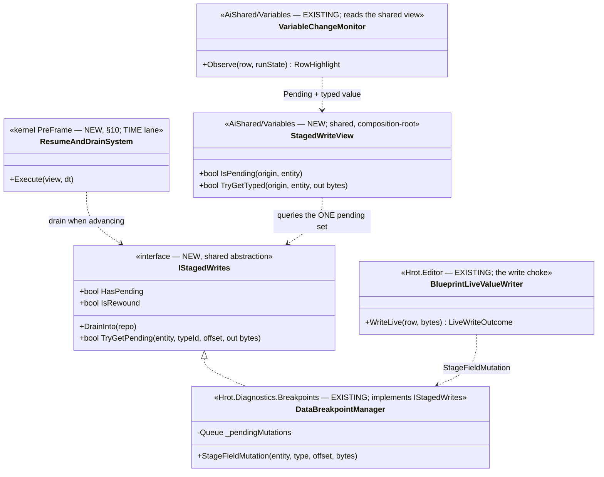
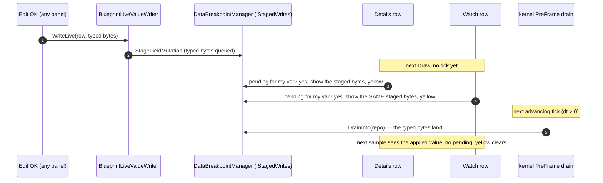

<!--STATUS
state: LIVE
build-state: BUILT
updated: 2026-08-22
current-answer: this whole file — the uniform staged-live-write model (replaces MIN's direct write),
  its drain, its shared yellow "pending" display, and the W-task lane split. BUILT + merged at
  coordinator d56e2ba3c; §6 carries the build-state note and the W5 restore-half closure.
stale-below: nothing.
known-rot: none. ✅ MIN's WriteFieldNow is now REMOVED (W3); every live edit stages and the PreFrame
  drain applies it. The one thing NOT yet done is a real editor visual-check of the yellow behaviour.
known-conflict: none. This CONSOLIDATES the drain (DESIGN_Time_Architecture §10) and the optimistic
  display (DESIGN_Variable_Details_And_Editing §4a/§6) — it references their diagrams, does not redraw.
design-basis: R-126 (one source of paused; staged writes drain from the sim tick loop — PULL) · R-130
  (yellow = a STAGED change; a directly-applied write gets no yellow) · R-120 (shared state lives in a
  store at the composition root, not in a view) · R-63 (a direct write to a rewound view is lost on
  resume — the ECB staging path is required) · DESIGN_Time_Architecture §10 (the drain) ·
  DESIGN_Variable_Details_And_Editing §4a/§6 (colours + optimistic display).
-->
# DESIGN — **the staged live write**: one mechanism, yellow while pending, drained by the tick

## 1. ⭐⭐⭐ THE MODEL — **user-ruled, `2026-08-21`**

> 🔒 **User:** *"replace with uniform mechanism."* · *"if you change var in detail panel it will not
> automatically change in watch panel until next tick. so being staged and yellow at least indicate why
> the two are different."*

⭐⭐ **ONE path for every run state:** an edit **STAGES**, the row shows it **🟡 yellow** immediately, and
the **sim tick loop DRAINS** it *(applies it to the repo)* at the next advancing tick — then the yellow
clears. ⛔ **`MIN`'s direct `_liveRepo` write is removed** *(W3)* — it was the stopgap for the missing
drain; once the drain lands, staging is uniform and honours `R-130` *(yellow is true)* and §6
*(no non-simulation write during a pause → Flight-Recorder linearity holds)*.

| run state | before | after |
|---|---|---|
| **paused / deterministic-step** | `MIN` direct-writes *(lands now, no yellow)* | ⭐ **stages → yellow → drains on the next step/resume** |
| **running** | refused | ⭐ **stages → yellow → drains next tick** *(`R-126`: running is a reason to STAGE)* |
| **breakpoint-rewound** | stages *(already)* | ⭐ unchanged; drains after the post-tick restore *(`R-63`)* |

⭐⭐⭐ **The staged state is SHARED, so the surfaces AGREE** *(user, `2026-08-21`)*: because the pending set
is one shared thing *(Lean A, §4)*, **every surface showing the variable — Details AND Watch — shows the
SAME staged value in 🟡 yellow, immediately after the edit.** ⇒ ⛔ **they do NOT diverge**; the yellow
says *"staged — the sim has not applied it yet."* When the tick drains it, both re-sample the applied
value and the yellow clears together. ⚠ **Only if the staged state could NOT be shared** would they
differ *(the edited row yellow, the other white on its last value)* — ⭐ and Lean A makes sharing free,
so **we take the shared path.**

⭐ **Three colours, one meaning each** *(§4a)*: **white** = last value, unchanged · 🔴 **red** = the SIM
changed it this tick · 🟡 **yellow** = a staged edit, not yet applied. ⛔ **A row is never red and yellow
for the same cause** — a user edit is yellow, never red.

## 2. ⭐⭐ INVENTORY — *(`R-74`; the queries, and what they settled)*

| # | query | finding |
|---|---|---|
| I1 | read `DataBreakpointManager` | ⭐ `StageFieldMutation(entity, type, offset, bytes)` enqueues a `_pendingMutations` item **carrying the typed bytes**; `DrainPendingMutations` applies them via the ECB. ⛔ `DrainPendingMutations` is **private**, 3 internal callers *(`M-41`)* |
| I2 | `grep new VariableChangeMonitor` | 🔴 **`VariableTableModel.cs:122: new()`** — **per-panel, NOT shared** ⇒ marking Details pending does NOT reach Watch. `R-120` says shared state belongs in a composition-root store |
| I3 | read `VariableChangeMonitor` | `RowHighlight(bool Changed, bool Pending)` + `MarkPending`/`ClearPending` exist, **0 production callers** *(built-but-unwired)*; the renderer already paints `PendingTint` |
| I4 | write choke | `BlueprintLiveValueWriter.WriteLive` *(`:91`)* → `LiveWriteOutcome.Landed` — the host-neutral commit point; `VariableEditCommit` calls the `WriteLiveValue` delegate |
| I5 | `DESIGN_Time_Architecture` §10 | the drain is designed: a `PreFrame` `ResumeAndDrainSystem`, gated on the `deltaTime` PARAMETER, before `Input` — via an `IStagedWrites` seam |

## 3. ⭐⭐⭐ THE UML — **the seam and the shared store** *(the drain's own diagram is §10 — not redrawn here)*

## 4. ⭐⭐⭐ THE SHARED "PENDING" SOURCE — **one fork, and my lean**

⛔ The pending/yellow state MUST be shared across panels *(§1; `R-120`)*, and it must **auto-clear when the
write lands.** Two ways:

| | ✅✅ **A — derive from the ONE staged set** *(lean)* | B — a shared `MarkPending` store |
|---|---|---|
| source of yellow | **`IStagedWrites.TryGetPending`** on `DataBreakpointManager`'s `_pendingMutations` | a new composition-root store, set by the commit |
| the typed value shown | ⭐ **the pending mutation's own payload** — one source of truth | a second cache to keep in sync |
| clears when drained | ⭐⭐ **automatically** — the mutation leaves the queue | ⛔ needs a manual clear *(event or sample-based)* |
| shared across panels | ⭐ **by construction** — one `DataBreakpointManager` | needs the store wired to every panel |
| cost | ⚠ per-row resolve `origin → (type, offset)` + a small-set query each frame | the existing `MarkPending` machinery, made shared |

⭐⭐⭐ **Lean A.** The staged mutation already carries the bytes and already leaves the queue on drain, so
yellow + the optimistic value + the auto-clear all fall out of **one** source. ⇒ ⛔ **the unwired
`MarkPending`/`ClearPending` flag is NOT wired — it is collapsed into the query** *(`R-13`: route, don't
duplicate)*. ⚠ **`R-130` in one line:** *pending ⟺ a mutation for this field sits un-drained* — a directly
applied write is never in that set, so it never yellows, exactly as ruled.

## 5. ⭐ THE `IStagedWrites` SEAM — **coordinator-defined, so both lanes build to a fixed contract**

⭐⭐ **I (coordinator) add the `IStagedWrites` interface** *(a trivial contract file in a shared/core
assembly both the kernel and `Hrot.Diagnostics.Breakpoints` reference)*, so **neither lane races the
other on its shape.** Members: `HasPending` · `IsRewound` · `DrainInto(repo)` · `TryGetPending(entity,
typeId, offset, out bytes)`. ⛔ The drain *(time lane)* consumes it; `DataBreakpointManager` *(UI lane)*
implements it; `StagedWriteView` *(UI lane)* queries it for the display.

## 6. ⭐⭐⭐ THE W-TASK LANE SPLIT — **who builds what**

| task | what | lane |
|---|---|---|
| **seam** | define `IStagedWrites` *(the contract above)* | ⭐ **coordinator** *(trivial)* |
| **`W0`** | the acceptance rail — *pause → edit → resume → the value is in the repo*, per run state | ⭐ TIME lane *(owns the net)* |
| **`W1`** | `SystemPhase.PreFrame` + the one kernel line — drain before `Input` | ⭐ TIME lane |
| **`W2`** | `ResumeAndDrainSystem` — `DrainInto` when advancing, skip while rewound *(§10, gate on the `dt` PARAMETER — `AS-10`)* | ⭐ TIME lane |
| **`W3`** | uniform staging: drop the `_isPaused`/`NotFrozen` refusal, **remove `MIN`'s `WriteFieldNow`**, stage in every writable run state | ⭐ UI lane |
| **`W4`** | the shared yellow: `DataBreakpointManager` implements `IStagedWrites`; `StagedWriteView` + `VariableChangeMonitor` derive `Pending`/typed value from it *(fork A)* | ⭐ UI lane |
| **`W5`** | ~~move the restore out of `RequestStep`/`RequestContinue`~~ → drain-removal BUILT; **restore-move CLOSED** *(below)* | ⭐ UI lane |

> ✅ **BUILD-STATE `2026-08-22` — the whole W-story is BUILT and merged** *(coordinator head `d56e2ba3c`)*.
> `W1`/`W2` *(drain)* · `W3` *(uniform staging, `MIN`'s `WriteFieldNow` removed)* · `W4` *(shared yellow)* ·
> `W5` *(the duplicate drain removed from `RequestStep`/`RequestContinue`)*. Wired at **both** manager hosts
> — `EditorSubsystem` **and** `CgfSubsystem` *(`BP-410`: the second host would have silently lost every
> staged edit; now railed as a negative)*.
>
> 🧹 **QUEUED for the next UI batch — `BP-411` resolved: REMOVE** *(user, `2026-08-22`)*: the
> greyed-OK-with-tooltip affordance is dead dead code now — every run state stages, and the only refusing
> state *(`Replay`)* denies opening the dialog outright, so no state opens the dialog with a dead OK.
> 🔒 **User:** *"the greyed ok was a nonsense from the beginning (we should not have allowed the edit
> dialog to open in the first place), ok to remove."* ⇒ delete the greyed-OK/tooltip path in
> `VariableEditModal`/`VariableEditCommit`; the existing `AfterW3_NoRunStateProducesAGreyedOkTooltip`
> tripwire stays true.
>
> ⭐⭐ **`W5`'s "move the restore" half is CLOSED, not deferred** *(coordinator, endorsing the report's §3
> lean)*: the restore is `DataBreakpointManager`'s **own** rewind bookkeeping *(`OnHit` rewound
> `_liveRepo ← _preTickSnapshot`; the resume restores `_liveRepo ← _postTickSnapshot` and unpauses)*, and
> the `PreFrame` drain **already** waits on `IStagedWrites.IsRewound` — so the restore provably runs before
> the drain **by construction**, on the first advancing frame after the unpause. Moving it into
> `ResumeAndDrainSystem` would re-introduce a `RestorePostTick()` seam member the TIME lane deliberately
> trimmed on `2026-08-21` *(`DESIGN_Time_Architecture.md` §10)* — a cross-lane change *(`R-128`)* that buys
> ordering the `IsRewound` gate already guarantees. ⇒ ⛔ **no further work; the `R-63` hazard is closed by
> the staging path + the `IsRewound` gate, not by relocating the restore.**

⛔⛔ **Sequencing:** `W1`+`W2` *(drain)* must land before `W3` flips writes to staging — **or an edit
stages and never applies.** ⇒ ⭐ **the drain goes to the time lane FIRST** *(their next batch after
T1/T2)*; the UI lane's `W3`/`W4` follow. Both meet only at `IStagedWrites` + `DataBreakpointManager` — no
shared file edited by both.

## 7. ✅ RESOLVED — **both surfaces show the SAME staged value in yellow** *(user, `2026-08-21`)*

> 🔒 **User:** *"if we can share the staged state to both views, even better, both yellow, both showing
> the same staged value, immediately after user edit."*

⭐⭐⭐ **Because Lean A shares the one staged set, we take the shared path:** the instant an edit stages,
**Details AND Watch both show the staged bytes, both yellow** — ⛔ **not** *"Details typed, Watch last
value."* A row with no staged edit stays **white** *(or 🔴 red for a sim change — never yellow)*. When the
drain lands, both re-sample the applied value and go white together. ⚠ **The earlier "they diverge until
next tick" framing is SUPERSEDED — sharing removes the divergence.**

## 8. ⭐⭐⭐ THE INTEGRATION — **one wire, and the one place the two lanes MEET**

📐 **The composition root is `EditorSubsystem`** *(measured)*: it builds `_kernel` *(`:689`)* and
`_bpManager` *(`:1108`)* in one method, **already registers a kernel system** `_bpSnapshotProvider`
*(`:1113`)*, and hands `_bpManager` to the session *(`:1119`)*. ⇒ ⭐⭐ **the drain wire is ~1 line beside
those:** `_kernel.RegisterGlobalSystem(new ResumeAndDrainSystem(_bpManager))` — `_bpManager` passed **as
`IStagedWrites`** *(after `W4` makes it one)*.

⛔⛔ **This is the ONE place the lanes truly integrate**, and it changes the merge rule for the drain:

| ⭐ | |
|---|---|
| **T-tasks `T1`–`T7`** | the time refactor — **stay on the time lane branch**, isolated *(as agreed)* |
| ⭐⭐ **the DRAIN `W1`/`W2`** | ⛔ **NOT like the T-tasks** — it is WATCH/write work, and `EditorSubsystem` *(UI lane)* must reference `ResumeAndDrainSystem` *(time lane's class)* to wire it ⇒ **when `W1`/`W2` land, the coordinator MERGES them into the integration tree** where `W4` and the wire live |
| ⭐ **the wire itself** | one line in `EditorSubsystem` — ⭐ **UI lane**, done **after** `W2` is merged in AND `W4` implements the interface |

⛔⛔⛔ **THE HAZARD — restated because it is the whole risk:** `W3` *(remove `MIN`'s direct write, stage
everything)* must land **only after the drain is live-wired.** ⇒ ⭐ **`MIN`'s `WriteFieldNow` STAYS until
the wire is in** — otherwise a paused edit stages and **never applies** *(worse than today)*. ⭐⭐ **Safe
order:** `W4` *(implement + display)* → **merge `W1`/`W2`** → **wire** → `W3` *(remove `MIN`)* → `W5`.

## 9. ⭐ DEFERRED FOLLOW-UP — **`DataBreakpointManager` conflates two responsibilities** *(low priority)*

📌 **`DEFER-1`** *(user, `2026-08-22`)* — ⛔ **not scheduled; a SPLIT, not a rename; do only if a batch is
already deep in this class.**

⚠⚠ **Correction of a false first framing** *(`2026-08-22`)*: this note first said the class is *misnamed*
— *"it is the pause manager, not the breakpoint list."* ⛔ **That was wrong, and it contradicts
[`docs/designs/breakpoints-1/DESIGN.md`](../designs/breakpoints-1/DESIGN.md) §2 because the design is
right:** 📐 measured, the class genuinely **IS** the breakpoint registry — `_breakpoints`
*(`DataBreakpointManager.cs:85`)*, `Add`/`AddBreakpoint`/`Remove`/`SetEnabled`/`AllBreakpoints`
*(`:261`–`:353`)*, the compiled component-predicates and event-scanners that DETECT hits.

⭐⭐ **The real finding — TWO jobs in one class:**

| responsibility | members | a fair name for it |
|---|---|---|
| **breakpoint registry + detection** | `_breakpoints`, `Add`/`Remove`/`SetEnabled`, compiled predicates/scanners, mounts the detection system | `DataBreakpointManager` ✓ |
| **paused-debug state + staged edits** | `_isPaused`/`_pausedTick`, `_postTickSnapshot`, `RequestStep`/`RequestContinue`/`RequestResume`, `_pendingMutations` *(the queue §4 fork A reuses)* | `DebugPauseManager` |

⇒ ⭐ **The name is not *narrow*, it is a fair name for ONE of two jobs.** ⛔ **A rename to
`DebugPauseManager` fixes nothing — it just moves which half the name hides.** ⭐⭐ **If ever addressed,
the fix is a SPLIT:** extract the pause / rewind / staged-edit machinery into its own type that **both**
the breakpoint manager and the toolbar pause depend on — breakpoints make no mutations, they are one
*way to enter* the paused state, and a toolbar pause is another.

⭐ **Regardless of any split, `_pendingMutations` living with the pause owner is CORRECT** — staged edits
must apply at the same N+1 boundary the resume restores from *(`R-63`)*, so they belong to whoever owns
resume. ⇒ ⛔ **this design's reuse of that queue *(§4 fork A)* is not in question; only the class's
double duty is.**

⚠ **Cost of the split:** touches `IDataBreakpointManager` and every call site across
`Hrot.Diagnostics.Breakpoints`, `Hrot.Blueprints.Editor`, `Hrot.Editor` — a real refactor, not churn.
⭐ **Park it.** *(The **assembly** name `Hrot.Diagnostics.Breakpoints` is fine — the substrate is genuinely
breakpoint-centric; it is only the *class* that carries a second job.)*
