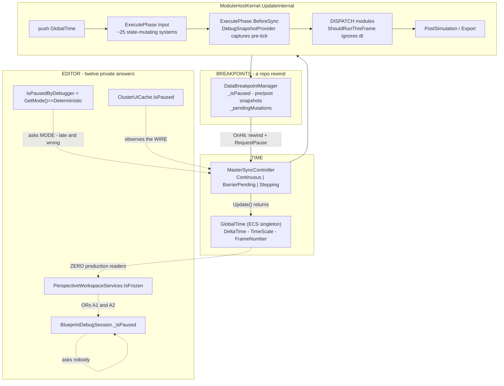
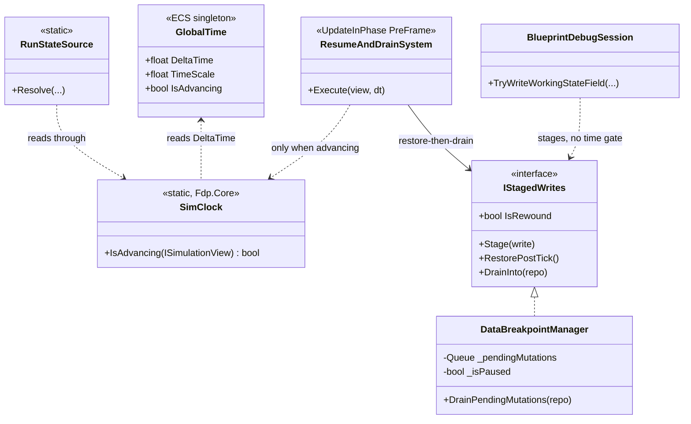
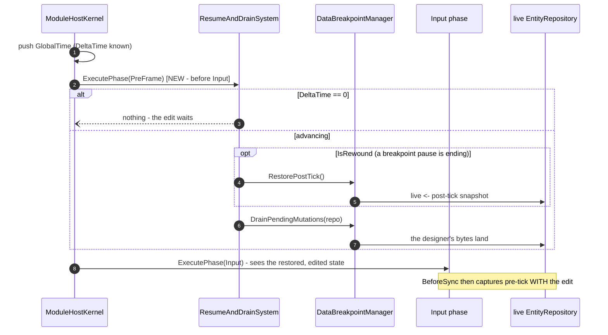
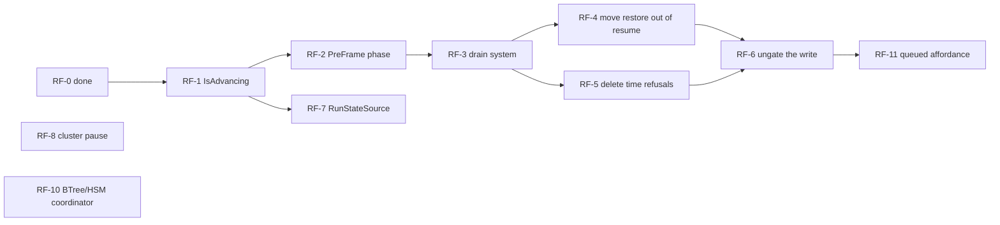

<!--STATUS
state: LIVE
build-state: READY-TO-BUILD
updated: 2026-08-21
current-answer: §3 findings · §4 the probe results · §5 the target · §6 the refactor list.
  ⭐ Dispatched as Batch 104 (RF-1, RF-2, RF-3, RF-5, RF-6). ⛔ RF-4 is NOT in it — §7.
stale-below: nothing above HISTORY.
known-rot: none. ⚠ THREE claims from this file's first edition were corrected and are marked
  CORRECTED inline — the pause barrier (§3 AS-2), the threading premise (§4 P4), and P6, whose
  first version measured the wrong layer (§4 P6'). ⛔ P6' CHANGES ITEM 104f — see §7.
known-conflict: none. Q48 §5 is the RULING and wins on intent; this file measures what it costs.
-->
# ⭐⭐⭐ Time, Pause and the Write Path — **as-is, target, and the refactors between**

> ⭐⭐ **Why:** `R-126` settled the intent — one source (the clock), the tick loop drains, running is not
> a refusal. ⛔ **This document measures what that costs.**
>
> ⭐⭐⭐ **All six probes are now RUN.** ⚠ **Three of them corrected this document's own first edition**,
> and one of those corrections changes the design — §4 `P6`.

---

## 1. ⭐⭐ INVENTORY — **the queries behind every claim** *(`R-74`)*

Graph `home-user-HROT` @ `ac7860dd8` — **175 663 nodes / 438 004 edges**.

| # | query | total |
|---|---|---|
| Q1 | `search_graph(name_pattern=".*(IsPaused\|IsFrozen\|IsStopped\|PausedBy).*")` | **91** → 12 production notions *(`Q48` §0)* |
| Q2 | `search_graph(name_pattern=".*(StageFieldMutation\|StageMutation\|DrainStaged\|PendingMutations\|ApplyStaged\|FlushStaged).*")` | **50** |
| Q3 | `trace_path("DataBreakpointManager.DrainPendingMutations", inbound, 3)` | **3** production callers |
| Q4 | `search_graph(name_pattern=".*(SetComponentFieldRaw\|SetComponentRaw\|SetManagedComponentRaw\|WriteLive\|TryWriteWorkingState\|ApplyEdit\|CommitEdit).*", label="Method")` | **37** |
| Q5 | reads in full or in the relevant part: `GlobalTime` · `MasterSyncController` · `MasterSyncTimeControllerAdapter` · `DataBreakpointManager` · `DebugSnapshotProvider` · `SystemScheduler` · `ModuleHostKernel` · `ExecutionPolicy` · `SubsystemOrchestrator` · `ClusterUiCache` · `AiTracerCoordinator` · `AiDebugSessionBase` | — |
| Q6 | ⭐⭐ **an executable rail** — `ThePauseFlagOnTheClockIsFalseWhilePausedTests`, 4 tests | ⭐ **the only claims here that are MEASURED rather than READ** |

---

## 2. ⭐⭐⭐ THE AS-IS

---

## 3. ⭐⭐⭐ FINDINGS

| # | finding | 📐 evidence | ⚠ |
|---|---|---|---|
| **`AS-1`** | ⛔⛔ **`GlobalTime.IsPaused` (`TimeScale == 0`) is FALSE while paused.** A pause never touches `TimeScale` | ⭐⭐ **RAIL** `APausedClockReportsZeroDeltaAndYetIsPausedIsFalse` | 🔴🔴 |
| **`AS-1b`** ⚠ **RESTATED TWICE** | ⛔ **NOT "two roles" — that was an overstatement, corrected `2026-08-21`.** 📐 `GlobalTime` has ONE role *(the clock's state)*, and `GetCurrentState()` populates every field that role has. ⭐⭐ **The trap is FIELD-LEVEL:** of its 9 fields, **`DeltaTime`/`UnscaledDeltaTime` describe THE STEP JUST TAKEN**, not a position the clock can be *at* — 📐 **all three `SeedState` implementations read the cumulative fields plus `TimeScale`, and NONE reads a delta.** ⇒ ⛔ **a delta is meaningful ONLY on the instance the kernel pushed this frame**; on a snapshot, a `new GlobalTime()`, or a seeded one it is zero meaning *"no information"*, ⚠ **and the type cannot distinguish that from "halted".** 📌 Same shape for `IsPaused`, which is why it looked plausible: it derives from `TimeScale`, a genuine persistent setting, so it is well-defined everywhere — ⛔ it just means *"the speed knob is at zero"*, not *"the simulation is stopped"* | ⭐⭐ **RAIL** `GetCurrentStateHardCodesTheDeltaToZero…` | 🔴 **a trap for callers.** ⭐ **The rule, not a code change: read `GlobalTime` from the LIVE WORLD, never from the controller** |
| **`AS-2`** ⚠ **CORRECTED** | ⛔ **A pause is a two-phase BARRIER.** `SwitchToDeterministic` enters `BarrierPending`, **not** `Stepping`, and `GetMode()` answers **`Continuous`** for the whole lookahead window. ⭐⭐ **But `DeltaTime` goes to zero on the FIRST frame** *("sim time is logically frozen from the moment SwitchToDeterministic() is called")* | ⭐⭐ **RAIL** `TheDeltaGoesToZeroBeforeTheModeChanges` | 🔴 **`IsPausedByDebugger` is LATE as well as wrong** — ⭐ and this **strengthens** the delta |
| **`AS-3`** | ⛔ **`BlueprintDebugSession._isPaused` asks nobody** | `:1109`, `:920` | 🔴 **the gate that refused the user** |
| **`AS-4`** | ⛔⛔ **the breakpoint pause is a repo-REWIND protocol** — `OnHit`: post ← live; **live ← pre-tick**; halt. Resume: live ← post-tick; drain; advance | `DataBreakpointManager:470-473`, `:495`, `:514` | 🔴🔴 |
| **`AS-5`** | ⛔ **one drain, three production callers, none reachable from any UI** | Q3 + grep | 🔴🔴 |
| **`AS-6`** | ⭐ **the drain system has an exact precedent** — `DebugSnapshotProvider` | source | ✅ |
| **`AS-7`** | ⭐ **cluster-wide time control already exists** — intents + `SwitchTimeModeEvent` over DDS | `MasterSyncController:112-124` | ✅ |
| **`AS-8`** | ⭐ **intra-phase ordering is expressible**, and the scheduler is **phase-generic** *(`Dictionary<SystemPhase, …>`)* | `SystemScheduler:16,46,178-203` | ✅ **adding a phase is 1 enum member + 1 kernel line** |
| **`AS-9`** ⭐ NEW | ⛔⛔ **BTree/HSM "pause" never touches time.** `AiTracerCoordinator.RequestPause/RequestContinue/RequestStepOneTick` are **virtual no-ops**, and production constructs the **BASE class** — `EditorSubsystem:750` — while holding `_bpTimeAdapter` a few lines away | grep: no subclass, no override | 🔴 📌 **`R-67` again** |

---

## 4. ⭐⭐⭐ THE PROBES — **all six run**

| probe | verdict |
|---|---|
| **`P1`** — can the restore leave `RequestStep`/`RequestContinue`? | ⭐⭐ **YES, and it must go EARLIER than `BeforeSync`.** 📐 `Input` runs **first** and holds ~25 state-mutating systems, so a rewound repo must be restored **before** it ⇒ ⭐ **a new `PreFrame` phase**, which `AS-8` makes a 2-line engine change. ⭐⭐ **And `_isPaused` must stay TRUE until the restore runs**, because it also selects `ActiveView` |
| **`P2`** — is a repo available where `RunStateSource` is built? | ✅ **YES.** `_kernel = new ModuleHostKernel(_world, …)` *(`EditorSubsystem:661`)* ⇒ **`_world` IS the kernel's live world**, in scope at `:2226`. ⛔ No new plumbing |
| **`P3`** — what is `ClusterUiCache.IsPaused` for? | ⭐ **A REMOTE OBSERVATION, not a local cache.** Fed by `SwitchTimeModeEvent` off the bus *(`:173-181`)* — there is no local object to ask. ⇒ ⛔ **do NOT delete it**; ⚠ it stores **mode**, so it inherits `AS-2` and should be renamed/refined. 📌 `R-126`'s "don't cache" is about locally-derivable state |
| **`P4`** — is there a THREADING reason anything is unwritable? | ⛔⛔ **NO.** 📐 The runner is one loop — `while (_running) { Update(dt); DrawWorldAll(); DrawUIAll(); }` *(`SubsystemOrchestrator:105-114`)*; `DataStrategy.Direct` is **`Synchronous`-only and ENFORCED** *(`ExecutionPolicy.Validate:148-157`, called at `ModuleHostKernel:246`)*; async modules run on **leased views** and play back at harvest. ⇒ ⭐⭐ **the UI writes between frames with nothing else touching the live repo** |
| **`P5`** — the BTree/HSM twins | ⛔ **`AS-9`.** Their pause is a UI flag over a no-op coordinator. ⭐ **Good news: no rewind either**, so they are the SIMPLE case once they get a write path |
| **`P6`** ⭐⭐⭐ NEW | **Do modules tick while paused?** ⛔⛔ **YES.** `ShouldRunThisFrame` **never consults `deltaTime`** — a module at ≥60 Hz runs **every frame**, with `moduleDelta == 0` *(`ModuleHostKernel:614`, `:624`, `ShouldRunThisFrame`)* |

### ⛔⛔⛔ `P6` is the one that changes the design — **and it answers the user's question**

> 🔒 **User:** *"I do not understand how comes that something can be unwritable. The only real reason
> might be threading issues…"*

⭐⭐ **`P4` says the threading answer is NO — there is no race.**

### ⚠⚠ `P6′` — **CORRECTED `2026-08-21`, same day, prompted by the user's question**

⛔ **The first version of `P6` said *"the tick never stops, so a direct write is always overwritten."*
📐 That was measured at the WRONG LAYER.** ⭐ There are two, and only one of them ignores `dt`:

| layer | guards on `dt`? | 📐 |
|---|---|---|
| **module DISPATCH** | ⛔ **NO** — a ≥60 Hz module is dispatched **every frame**, with `moduleDelta == 0` | `ShouldRunThisFrame` never reads `deltaTime` |
| ⭐⭐⭐ **the BEHAVIOUR tick systems inside it** | ✅ **YES** — `if (deltaTime <= 0f) return;` | `BlueprintTickSystem:51` · `BTreeTickSystem:55` · `HsmTickSystem:103` |

⇒ ⭐⭐⭐ **A blackboard variable written by a behaviour is NOT recomputed while paused.**
📌 **And this was already in the corpus** — `Q46` rule `2b`, the user's own `2026-08-19` specification:
*"the brain (cgf) does not tick ANY behavior when `dt=0`."* ⚠ **I re-derived it instead of reading it.**

### ⭐⭐ So the answer is PER RUN-STATE, not one rule

| state | is a direct write overwritten? | ⇒ |
|---|---|---|
| ⭐⭐ **time-paused, no rewind** *(toolbar · stepping — **the case the user hits**)* | ⛔ **NO.** Behaviours are not ticking | ⭐⭐⭐ **write DIRECT — it sticks, and it is visible IMMEDIATELY.** ⛔ No "queued" state needed |
| ⛔ **breakpoint-paused (rewound)** | ⚠ **yes, by the RESTORE** — the live repo holds pre-tick and resume overwrites it *(`AS-4`)* | ⭐ **stage** ⇒ **"queued" is REAL here** |
| ⚠ **running** *(`dt > 0` every frame)* | ⚠ **yes, by the next behaviour tick** | ⭐ **stage** ⇒ **"queued" is REAL here**, and ⛔ **an edit to a COMPUTED variable is inherently a one-tick poke** — 📌 you are editing an output |

⇒ ⭐⭐ **The old refusal sentence — *"the edit would be overwritten by the next tick"* — described a real
mechanism, but only in TWO of the three states.** ⛔ In the third — the one the designer actually uses —
it was simply wrong.

### ⭐ Which SURFACES owe the "queued" affordance — **enumerated**

📐 `search_graph(".*VariableTableModel.*")` → **4 owners**, unchanged since Batch 103's `103c`:

| surface | ⭐ verdict |
|---|---|
| ⭐⭐⭐ **`AiWatchWindow`** *(and `WatchPanelWindow`)* | 🔒 **the design already specifies it** — `Q46` rule **5**: *"a value the user typed is a SEPARATE cache on the row, distinct from the value read through the accessor."* ⇒ **the queued state IS that second cache**, and it resolves on the next `dt > 0` pulse *(rule 2)*. ⛔ **Nothing new to invent** |
| ⭐⭐ **`VariableDetailsSection`** | ⭐ **same row class, same rule 5** ⇒ it inherits the affordance for free. ⚠ **It is the surface the designer edits from**, so it is the one that must not lie |
| ⭐ **`AiVariablesWindow`** | ⚠ **`U-16` retires it** *(`R-54`)* ⇒ ⛔ **do not build the affordance here** — it would cement a duplicate |
| ⚠ **`VariableEditModal`** | ⭐ **the CONFIRMATION, not the display** — it closes on OK, so its job is one sentence *("queued; applies on the next tick")*, ⛔ not a live state |
| ⚠ **`VariablePropertiesModal`** | ⛔ **no** — it edits the DECLARATION, not the value |

⇒ ⭐⭐⭐ **One mechanism (`Q46` rule 5's typed-value cache), two surfaces that render it, one sentence in
the modal.** ⛔ **And it is only reachable in two of the three run states** — in a plain time-pause the
value simply changes.

---

## 5. ⭐⭐⭐ THE TARGET

⭐⭐⭐ **Why `PreFrame` and not `BeforeSync`:** `Input` runs first and mutates state. ⛔ Draining in
`BeforeSync` would let ~25 Input systems run against a rewound repo.

---

## 6. ⭐⭐⭐ THE REFACTORS

| # | refactor | feasibility | 📐 |
|---|---|---|---|
| **`RF-0`** ⭐ NEW | ⛔ **fix the arm that can never fire** — `EditorSubsystem`'s third `isFrozen` arm read `GetCurrentState().IsPaused` | ✅ **DONE** *(this commit)* + rails | `AS-1`, `AS-1b` |
| **`RF-1`** | **`GlobalTime.IsAdvancing => DeltaTime > 0`**, and mark `IsPaused` for retirement | ✅ **PROVEN** | one computed property |
| **`RF-2`** | **`SystemPhase.PreFrame` + one `ExecutePhase` line** | ✅ **PROVEN** | `AS-8` — the scheduler is phase-generic |
| **`RF-3`** | **`ResumeAndDrainSystem`** in `PreFrame`, gated, registered beside `DebugSnapshotProvider` | ✅ **PROVEN by precedent** | `AS-6` + `P1` |
| **`RF-4`** | **`RequestStep`/`RequestContinue` stop restoring+draining**; `_isPaused` clears in the system | ⚠ **PLAUSIBLE→LIKELY** | `P1`. ⛔ **Only 10 `_isPaused` sites in the DBM, all inside its own protocol**; every external consumer is display or per-frame |
| **`RF-5`** | **delete the time-shaped refusals** — running ⇒ stage | ✅ **PROVEN — mechanical** | `R-126` |
| **`RF-6`** | **`BlueprintDebugSession._isPaused` stops gating the write** | ✅ **PROVEN — one line** | `AS-3`; safe after `RF-3`+`RF-4` |
| **`RF-7`** | **`RunStateSource` reads the clock through** | ✅ **PROVEN** | `P2` — `_world` is right there |
| **`RF-8`** | **debugger pause publishes `PauseTimeIntent`** ⇒ cluster-wide by construction | ✅ **PROVEN** | `AS-7` |
| **`RF-9`** | ⛔ **`ClusterUiCache.IsPaused` — KEEP, refine to a mode name** | ✅ **decided** | `P3` — it observes the wire |
| **`RF-10`** | **BTree/HSM: hand the coordinator the real time controller** | ✅ **PROVEN — the caller holds it** | `AS-9` |
| **`RF-11`** | ⚠ **the "queued" affordance** — ⛔ **NARROWED by `P6′`**: needed only in the **breakpoint-paused** and **running** states; ⭐ in a plain time-pause the value simply changes | ⭐ **mechanism EXISTS** | `P6′` + 🔒 **`Q46` rule 5** — the typed-value cache on the row is already the design |

### ⭐ Order

⭐⭐ **The spine is `RF-1 → RF-2 → RF-3 → RF-4 → RF-5 → RF-6`, then `RF-11`** — that is what the designer
feels. ⭐ `RF-7`–`RF-10` are independent and can go in any batch.

---

## 7. ⭐ WHAT IS STILL NOT PROVEN — **one item, named**

⚠⚠ **`104f`'s premise MOVED after dispatch** — `P6′`. ⭐ The affordance is **narrower** than the
handoff says *(two run states, not all three)* and its **mechanism already exists** *(`Q46` rule 5)*.
⛔ **Not an invalidation** — 📌 rule 1: this is FYI for a running batch, and `104f` is *"only if
early"* anyway. ⭐ **If Batch 104 has not started, the coordinator re-stamps under rule 1a.**

⚠ **`RF-4` is LIKELY, not proven.** ⭐ What is measured: the DBM has **only 10 `_isPaused` sites**, all
inside its own protocol, and **every external consumer is display or a per-frame system** — so a
one-frame deferral is invisible **provided `_isPaused` stays true until the restore runs.**
⛔ **What is NOT measured:** whether `BlueprintDebugSession`'s **own** step machinery *(temp
breakpoints, `_nodePointer`, the recorder)* tolerates the DBM resuming a frame later than the session.
⇒ ⭐⭐ **`Q48-E`'s end-to-end rail is what settles it**, and it should be written **before** `RF-4`.

⛔ **Everything else in §6 is either PROVEN or a decision.**
