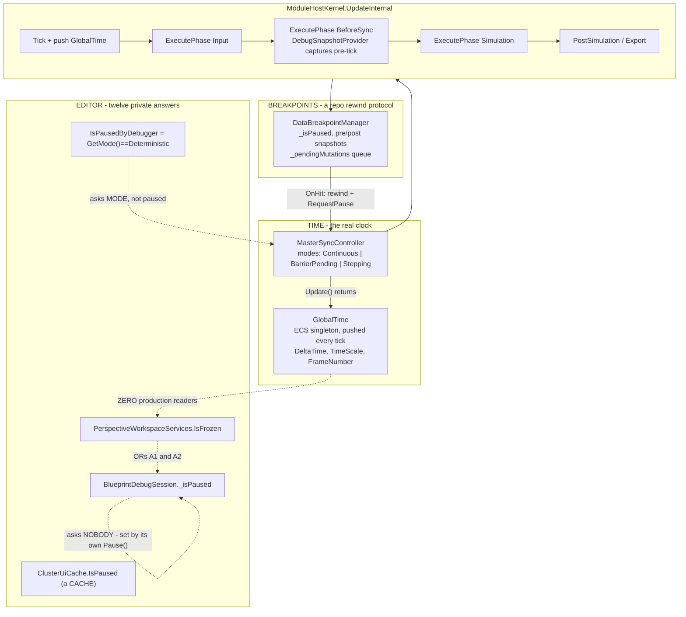
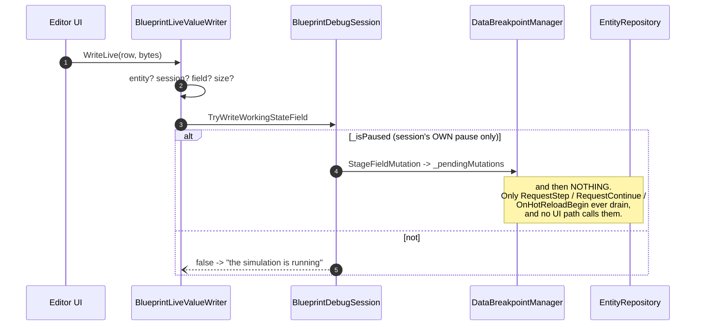
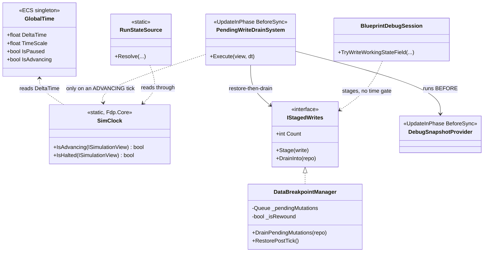
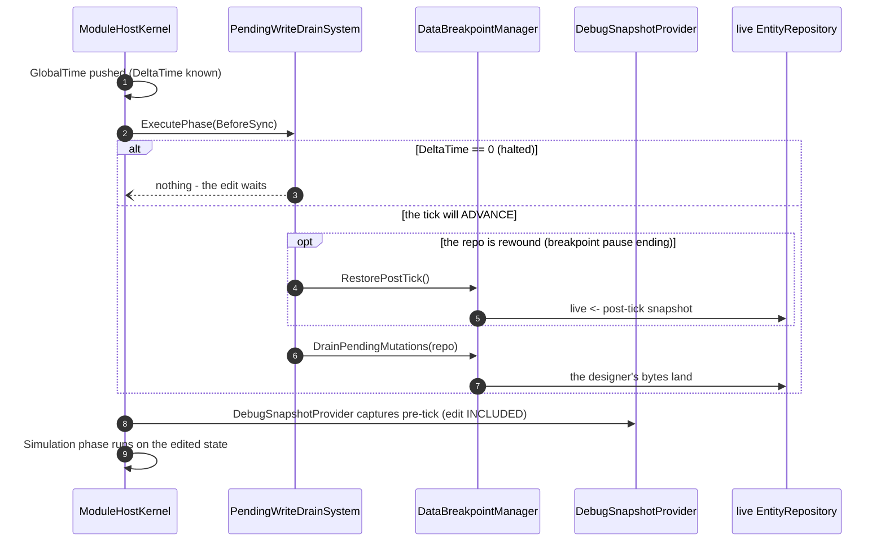
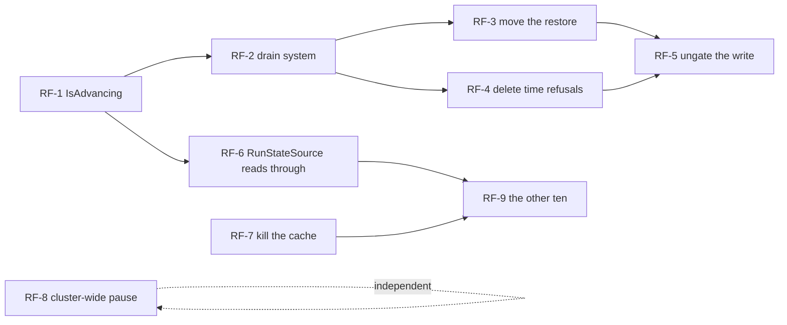

<!--STATUS
state: LIVE
build-state: DESIGN
updated: 2026-08-21
current-answer: §2 is the AS-IS (measured). §4 is the TARGET. §5 is the refactor list with
  per-item feasibility. ⛔ Stage C (the remaining feasibility probes) is NOT done — §6 says which.
stale-below: nothing.
known-rot: none.
known-conflict: none. ⚠ This document MEASURES what Q48's ruling implies; Q48 §5 is the RULING
  and wins on intent. Where a measurement here contradicts Q48's wording, §3 says so explicitly.
-->
# ⭐⭐⭐ Time, Pause and the Write Path — **as-is, target, and the refactors between**

> ⭐⭐ **Why:** `R-126` settled the *intent* — one source (the clock), the tick loop drains, running is
> not a refusal. ⛔ **This document checks what that costs**, and it found **one thing that would have
> broken the first batch on day one** *(§3, `AS-4`)*.

> ## ⛔ SCOPE OF THIS EDITION — **Stage A + a first-cut target**
> ✅ **Done here:** the as-is map, measured · the target · the refactor list · **feasibility for 6 of 9**.
> ⛔ **NOT done:** three feasibility probes that need code run, not read — **§6**.

---

## 1. ⭐⭐ INVENTORY — **the queries behind every claim** *(`R-74`)*

Graph `home-user-HROT` @ `ac7860dd8` — **175 663 nodes / 438 004 edges**.

| # | query | total |
|---|---|---|
| Q1 | `search_graph(name_pattern=".*(IsPaused\|IsFrozen\|IsStopped\|PausedBy).*")` | **91** → 12 production notions *(listed in `Q48` §0)* |
| Q2 | `search_graph(name_pattern=".*(StageFieldMutation\|StageMutation\|DrainStaged\|PendingMutations\|ApplyStaged\|FlushStaged).*")` | **50** |
| Q3 | `trace_path("DataBreakpointManager.DrainPendingMutations", inbound, depth 3)` | **3** production callers |
| Q4 | `search_graph(name_pattern=".*(SetComponentFieldRaw\|SetComponentRaw\|SetManagedComponentRaw\|WriteLive\|TryWriteWorkingState\|ApplyEdit\|CommitEdit).*", label="Method")` | **37** → **1** production repo-write triple |
| Q5 | reads: `GlobalTime.cs` · `MasterSyncController` · `MasterSyncTimeControllerAdapter` · `DataBreakpointManager` · `DebugSnapshotProvider` · `SystemScheduler` · `ModuleHostKernel` | — |

⚠ **Corroborated with grep wherever the claim is an ABSENCE** — the graph under-reports C# interface
dispatch.

---

## 2. ⭐⭐⭐ THE AS-IS — **measured**

### ⭐⭐ The write path, end to end

---

## 3. ⭐⭐⭐ FINDINGS — **`AS-4` is the one that matters**

| # | finding | 📐 evidence | ⚠ severity |
|---|---|---|---|
| **`AS-1`** | ⛔⛔ **`GlobalTime.IsPaused` is `TimeScale == 0`, and pause NEVER sets `TimeScale` to 0.** Pause = `PauseTimeIntent` → `SwitchToDeterministic` → `Stepping`, which leaves `_timeScale` untouched and sets **`DeltaTime = 0`** | `MasterSyncController.UpdateStepping` returns `BuildGlobalTime(dt=_pendingStepDelta, …)` with `TimeScale = _timeScale`; `grep` finds **ZERO production readers** of `GlobalTime.IsPaused` | 🔴🔴 **would have silently never fired** |
| **`AS-2`** | ⛔ **`IsPausedByDebugger` is a MODE, not a pause** — `GetMode() == TimeMode.Deterministic`. ⚠ **True while merely planning**, because the editor boots deterministic | `MasterSyncTimeControllerAdapter:29` | 🔴 the flag reads as safety and is not |
| **`AS-3`** | ⛔ **`BlueprintDebugSession._isPaused` asks nobody** — set only by its own `Pause()` and by a breakpoint hit | `BlueprintDebugSession:1109`, `:920` | 🔴 **the gate that refused the user** |
| **`AS-4`** | ⛔⛔⛔ **THE BREAKPOINT PAUSE IS A REPO-REWIND PROTOCOL, NOT A FLAG.** `OnHit`: post ← live; **live ← PRE-tick**; pause clock. Resume: **live ← POST-tick**; drain; resume clock | `DataBreakpointManager:470-473`, `:495`, `:514` | 🔴🔴🔴 **the drain CANNOT move on its own — the RESTORE is its partner** |
| **`AS-5`** | ⛔ **one drain, three production callers, none reachable from any UI** | Q3 + grep | 🔴🔴 the feature does not work today |
| **`AS-6`** | ⭐ **the drain system has an exact precedent** — `DebugSnapshotProvider`: `[UpdateInPhase(BeforeSync)] : IEcsModuleSystem`, gated, registered by `EditorSubsystem:1085` **and** `CgfSubsystem:566` | source | ✅ **de-risks the main new part** |
| **`AS-7`** | ⭐ **cluster-wide time control ALREADY exists** — `PauseTimeIntent`/`ResumeTimeIntent`/`StepTimeIntent` on the managed bus, drained by `MasterSyncController.Update()`; `SwitchTimeModeEvent` over DDS | `MasterSyncController:112-124`, `TimeNetworkModule` | ✅ **`Q48-5.2` is small, not a project** |
| **`AS-8`** | ⭐ **intra-phase ordering is expressible** — `SystemScheduler` topologically sorts `[UpdateBefore]`/`[UpdateAfter]` within a phase | `SystemScheduler:178-203` | ✅ |

### ⛔⛔ `AS-1` — **the correction to `R-126`, stated plainly**

🔒 **`R-126` names the source as "the clock".** ⭐ **Correct.** ⚠ **But the field that expresses it is
`DeltaTime`, NOT `TimeScale`** — and `GlobalTime.IsPaused` is spelled `TimeScale == 0`.
⇒ ⭐⭐⭐ **The user's own words were right and the existing flag is wrong**: *"the sim clock itself
(giving **dt=0** from whatever reason - deterministic stepping, or just paused the continuous run)."*
⇒ ⛔ **A refactor that pointed the twelve at `GlobalTime.IsPaused` would have shipped twelve readers of
a flag that is false while paused.** 📌 **This is the surprise this stage existed to find.**

### ⛔⛔⛔ `AS-4` — **two pause kinds, and only one of them is just a clock**

| | ⭐ TIME pause *(toolbar · stepping)* | ⛔ BREAKPOINT pause |
|---|---|---|
| repo state while paused | ⭐ **the real state** — it simply is not advancing | ⛔⛔ **the PRE-tick rewind**; the true post-tick state is in a snapshot |
| what resume must do | ⭐ **nothing but advance** | ⛔ **restore post-tick → drain → advance, IN THAT ORDER** |
| can a staged write drain from the tick loop? | ✅ **yes, trivially** | ⚠ **only if the RESTORE also moves** |

⇒ ⭐⭐⭐ **The clock unifies. The REWIND does not, and must not.**
⛔ **A batch that moved the drain to a tick system and left `RequestContinue` owning the restore would
apply the designer's edit to a repo that is about to be overwritten by the post-tick snapshot** — 📌
`R-63` all over again, from the third side.

---

## 4. ⭐⭐⭐ THE TARGET

### ⭐⭐ The target tick

⭐⭐⭐ **Three properties this buys, none of which today's design has:**

| ⭐ | |
|---|---|
| **①** | ⛔ **no resume path can forget** — nothing is raised, so nothing can be missed *(the `AS-5` failure is structurally impossible)* |
| **②** | ⭐⭐ **the restore is where the drain is** — `AS-4`'s ordering is one method, not a protocol spread across four callers |
| **③** | ⭐ **the edit is inside the pre-tick snapshot** — so a breakpoint that hits *this* tick rewinds to a state that still contains it |

---

## 5. ⭐⭐⭐ THE REFACTORS — **with feasibility, honestly graded**

| # | refactor | feasibility | 📐 basis |
|---|---|---|---|
| **`RF-1`** | ⭐⭐ **`GlobalTime.IsAdvancing => DeltaTime > 0`** *(and mark `IsPaused` for retirement)* | ✅ **PROVEN — trivial** | one computed property beside the existing one; `AS-1` |
| **`RF-2`** | ⭐⭐⭐ **`PendingWriteDrainSystem`**, `BeforeSync`, `[UpdateBefore(DebugSnapshotProvider)]`, gated, registered beside it | ✅ **PROVEN by precedent** | `AS-6` + `AS-8`; same assembly, same two registrars |
| **`RF-3`** | ⭐⭐⭐ **move the RESTORE to sit with the drain** — `RequestStep`/`RequestContinue` stop restoring+draining; they set intent, the system does the work | ⚠⚠ **PLAUSIBLE — the riskiest item** | `AS-4`. ⛔ **Probe `P1` — §6** |
| **`RF-4`** | ⭐⭐ **delete the time-shaped refusals** — `RefusedRunning`, `LiveWriteRefusal.NotFrozen`; running ⇒ stage | ✅ **PROVEN — mechanical** | `R-126`; 2 enum members, ~6 call sites, 3 rails to update |
| **`RF-5`** | ⭐ **`BlueprintDebugSession._isPaused` stops gating the write** | ✅ **PROVEN — one line** | `AS-3`. ⚠ **safe only after `RF-2`+`RF-3`** |
| **`RF-6`** | ⭐⭐ **`RunStateSource` reads the clock through** instead of two delegates | ⚠ **PLAUSIBLE** | ⛔ needs an `ISimulationView` in the editor's composition root — **probe `P2`** |
| **`RF-7`** | ⭐ **retire `ClusterUiCache.IsPaused`** *(a cache, `R-126` forbids)* | ⚠ **UNKNOWN** | ⛔ not yet read — **probe `P3`** |
| **`RF-8`** | ⭐⭐ **debugger pause publishes `PauseTimeIntent`** instead of calling the local adapter ⇒ cluster-wide by construction | ✅ **PROVEN — the transport exists** | `AS-7` |
| **`RF-9`** | ⭐ **the other ten notions read through, one at a time** | ⚠ **per-site** | ⛔ **not one refactor — ten.** Each has its own meaning; §6 |

### ⛔ Dependency order — **and it is not the order of the list**

⭐⭐ **`RF-1 → RF-2 → RF-3 → RF-4 → RF-5` is the spine**, and it is what the designer feels.
⛔ **`RF-6/7/9` are hygiene** — real, and worth doing, but **invisible**; 📌 `Q48` §6's fork.

---

## 6. ⛔⛔ WHAT STAGE C MUST STILL PROVE — **three probes, named**

| probe | question | ⭐ how to settle it |
|---|---|---|
| **`P1`** ⛔⛔ | **Can the restore move out of `RequestStep`/`RequestContinue`?** ⚠ `OnHit` rewinds and `_pausedTick`, `_pausedAt`, the recorder pointer and the temp-breakpoint machinery all key off that pause. **Is a "rewound" flag separable from `_isPaused`?** | ⭐ **read `DataBreakpointManager` in full + `BlueprintDebugSession`'s step machinery**, then **write the `Q48-E` rail against the CURRENT code and watch it fail** — ⛔ the failure mode is the specification |
| **`P2`** ⚠ | **Does the editor's composition root have an `ISimulationView` / `EntityRepository` at the point `RunStateSource` is built?** | ⭐ read `PerspectiveWorkspaceRegistrar`'s construction in `EditorSubsystem` — ⛔ if not, `RF-6` needs a delegate, not a reference, and that is a different design |
| **`P3`** ⚠ | **What is `ClusterUiCache` FOR?** ⛔ a cache may exist for a reason *(cross-node latency)* — 📌 the `.dev/` rule: unreferenced-looking is not unintentional | ⭐ read it + sweep `.dev/` and `docs/UX/` for its design record |

⚠ **Two things I deliberately did NOT do**, so nobody reads more coverage into this than it has:
⛔ **I did not read `DataBreakpointManager` in full** — ~550 lines of pause protocol, and `P1` turns on
it. ⛔ **I did not enumerate the BTree/HSM twins** *(`IAiDebugSession`, `AiTracerCoordinator`)* — they
have the same shape and are **not** covered by anything above.

---

## 7. ⭐ HOW TO CONTINUE — **the staging**

| stage | what | ⭐ cost |
|---|---|---|
| ✅ **A** | **this document** — as-is, target, refactor list, 6/9 feasibility | done |
| ⭐⭐⭐ **C1** | **probe `P1`** — the one that can still invalidate the target | ⛔ **do this next.** Everything downstream assumes it |
| ⭐ **C2** | probes `P2`, `P3` + the BTree/HSM twins | small |
| ⭐⭐ **B′** | fold the answers back in; mark this document `READY-TO-BUILD` | 📌 `R-123` — the UML must then be TRUE, not just present |
| ⭐ **D** | batch decomposition — ⭐ **spine first** *(`RF-1`,`RF-2`,`RF-3`,`RF-4`,`RF-5`)*, hygiene after | |

⭐⭐ **Recommended next move: `C1`, and START IT BY WRITING `Q48-E`'S RAIL.**
📌 The rail is the one artefact that is useful whatever `P1` answers — ⛔ **it turns §2's readings into
measurements**, and if it unexpectedly passes, the target is wrong and we find out for the price of one
test rather than one batch.
