<!--STATUS
state: LIVE
build-state: DESIGN
updated: 2026-08-21
current-answer: the whole file. §2-§6 AS-IS (measured) - §7 findings - §8 probes - §9 root cause
  - §10 target - §11 replay - §12 the regression net. The ORDER lives in PLAN_Time_System_Refactor.md.
stale-below: nothing above HISTORY.
known-rot: none. Claims corrected by later measurement are marked CORRECTED inline and keep the
  correction, not the original: AS-1b (the "two roles" claim, withdrawn), AS-2 (the pause barrier),
  P4 (the threading premise), P6' (measured the wrong layer).
known-conflict: none.
supersedes: DESIGN_Time_Control_And_Reporting.md and DESIGN_Time_And_Write_Architecture.md, merged
  into this file on 2026-08-21 at the user's request -- they were two halves of one architecture and
  cost two edits per change.
roadmap: PLAN_Time_System_Refactor.md -- the ORDER. T0 (make the integration net work) blocks
  every task derived from this document.
-->
# ⭐⭐⭐ TIME — **the whole architecture: who owns it, who changes it, who reads it, and when a write may land**

> ⛔⛔⛔ **NOTHING DERIVED FROM THIS DOCUMENT STARTS UNTIL `T0` IS GREEN** —
> 📄 **[`PLAN_Time_System_Refactor.md`](PLAN_Time_System_Refactor.md)**.
> 🔒 **User, `2026-08-21`:** *"the integration tests are the most important thing we need to make working
> before we touch any time monitoring/control related code."*

> ## ⭐⭐ ONE DOCUMENT, BECAUSE IT IS ONE ARCHITECTURE
> 🔒 **User, `2026-08-21`:** *"can the two time docs be merged into one? they are two parts of the same
> architecture. easy to update as a whole whenever something changes."*
> ⭐ **Merged.** ⛔ The split *(a "time" doc and a "write path" doc)* meant **two edits per change** and a
> cross-citation table that was pure bookkeeping — 📌 and the seam kept leaking: time-only findings lived
> in the write document because it was written first.
>
> | ⭐ how to read it | |
> |---|---|
> | **§2–§5** | ⭐⭐ **AS-IS**, measured — topology · APIs · the 4 control paths · the write path |
> | **§6–§7** | ⭐⭐⭐ **FINDINGS `AS-1`…`AS-14` and PROBES `P1`…`P8`** — **the evidence base** |
> | **§8** | ⭐ **the root cause**, stated once |
> | **§9–§10** | ⭐⭐ **the TARGET** — the read/control APIs, then the drain and the tick |
> | **§11–§13** | the bus pattern · replay · ⭐⭐⭐ **the regression net** |
> | **§14** | ⛔ what is still **not** measured |
> | 📄 **the TASKS and the ORDER** | ⛔⛔ **NOT here** — 📄 `PLAN_Time_System_Refactor.md`. ⭐ The old `TC-1`…`TC-8` and `RF-0`…`RF-11` ids live there as **`T1`…`T7`** and **`W0`…`W5`**, each with its feasibility grade |

---

## 1. ⭐⭐ INVENTORY — **every claim below comes from a query named here** *(`R-74`)*

Graph `home-user-HROT` @ `ac7860dd8`. ⭐ **Every claim below is from a read or a grep named here.**

| # | what | result |
|---|---|---|
| I1 | `search_graph(".*(IsPaused\|IsFrozen\|IsStopped\|PausedBy).*")` | **91** declarations → **12** production notions |
| I2 | `grep "TimeControllerFactory.Create\|new MasterSyncController\|new SlaveSyncController\|new SteppingTimeController\|SetTimeController"` | **the process topology — §2** |
| I3 | reads: `ITimeController` · `ISteppableTimeController` · `IEngineDebugTimeController` · `ITimeTransportFacade` · `ITimeControlGateway` · `MasterSyncController` · `SlaveSyncController` · `TimeControllerFactory` · `GlobalTime` · `ModuleHostKernel.UpdateInternal` · `ClusterMaster` · `ClusterUiCache` · the 3 transport implementations | **the API surface — §3** |
| I4 | `grep "SuspendGlobalTimePush\|SetSingletonUnmanaged(new GlobalTime"` | **4 suspend sites · 3+ singleton writers** |
| I5 | ⭐ **executable** — `ThePauseFlagOnTheClockIsFalseWhilePausedTests` *(4 tests)* | ⭐ the mode/delta claims are **measured**, not read |

---

| # | query | total |
|---|---|---|
| Q1 | `search_graph(name_pattern=".*(IsPaused\|IsFrozen\|IsStopped\|PausedBy).*")` | **91** → 12 production notions *(`Q48` §0)* |
| Q2 | `search_graph(name_pattern=".*(StageFieldMutation\|StageMutation\|DrainStaged\|PendingMutations\|ApplyStaged\|FlushStaged).*")` | **50** |
| Q3 | `trace_path("DataBreakpointManager.DrainPendingMutations", inbound, 3)` | **3** production callers |
| Q4 | `search_graph(name_pattern=".*(SetComponentFieldRaw\|SetComponentRaw\|SetManagedComponentRaw\|WriteLive\|TryWriteWorkingState\|ApplyEdit\|CommitEdit).*", label="Method")` | **37** |
| Q5 | reads in full or in the relevant part: `GlobalTime` · `MasterSyncController` · `MasterSyncTimeControllerAdapter` · `DataBreakpointManager` · `DebugSnapshotProvider` · `SystemScheduler` · `ModuleHostKernel` · `ExecutionPolicy` · `SubsystemOrchestrator` · `ClusterUiCache` · `AiTracerCoordinator` · `AiDebugSessionBase` | — |
| Q8 | `EntityRepository.Sync.cs` `SyncFrom` + `SetSingletonUnmanaged` · `ReferenceReplayLoadHandler.SetSystemsEnabled` | **5 singletons travel, `GlobalTime` NOT among them · 4 groups disabled** |
| Q7 | `grep` for `SuspendGlobalTimePush` · `SetSingletonUnmanaged(new GlobalTime` · the controllers' private fields | **4 suspend sites · 3+ singleton writers · NO retained delta** |
| Q6 | ⭐⭐ **an executable rail** — `ThePauseFlagOnTheClockIsFalseWhilePausedTests`, 4 tests | ⭐ **the only claims here that are MEASURED rather than READ** |

---

## 2. ⭐⭐⭐ AS-IS — **who owns a clock**

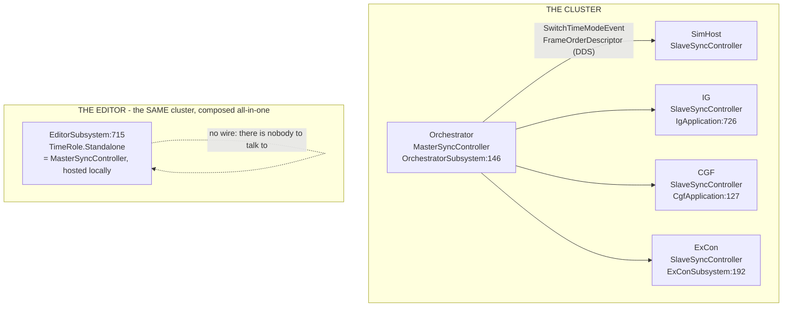

> ## ⭐⭐⭐ THE EDITOR IS NOT A SECOND MASTER — **corrected `2026-08-21` by the user**
> ⛔⛔ **My first edition called it *"a SECOND master"*. That was wrong**, and it is the same failure mode
> as *"two roles"*: a composition fact inflated into an architectural anomaly.
>
> 🔒 **User, verbatim:** *"editor IS the cluster, there is no second parallel master, it is just a
> different composition of the building blocks into an all-in-one editor system, but not changing or
> weakening any distributability rules… it is still the single concept that should exist with no
> exceptions."*
>
> | ⭐ so the rule is ONE, and it holds everywhere | |
> |---|---|
> | ⭐⭐ **exactly one time master per cluster** | ⭐ the editor **hosts that role itself** because it *is* the whole cluster, in one process |
> | ⭐⭐ **the wire is absent, not bypassed** | ⛔ **no distributability rule is weakened** — there are simply no other nodes to serve. 🔒 *"network is reserved for the cgf node if running network-distributed together with other nodes"* |
> | ⛔ **so `AS-12` is a WIRING GAP in one composition** | ⚠ **not evidence of a second concept.** ⭐ It still blocks `TC-3`, and it is still real |

> ### ⭐⭐ AND THE DESIGN PRINCIPLE THAT FOLLOWS — **build the BLOCKS, not "the editor case"**
> 🔒 **User:** *"as the cgf-editor unifications are planned for future (UX session docs), we could try to
> focus on the editor where isolated from the rest - but it might not be feasible as many parts are
> shared and they will need to be shared much more in order to be able to run the debugging on the cgf
> node (non-editor)."*
>
> ⇒ ⭐⭐⭐ **Every target API in §6 must be usable by the CGF node unchanged.** ⛔ An "editor-only" time
> read or an "editor-only" command surface would have to be built twice — 📌 and *"we need a shared X"*
> in this codebase almost always means **X exists and is under-adopted**, which is exactly what §5 found.

### ⭐ The master's own states — **and a pause is TWO-PHASE**

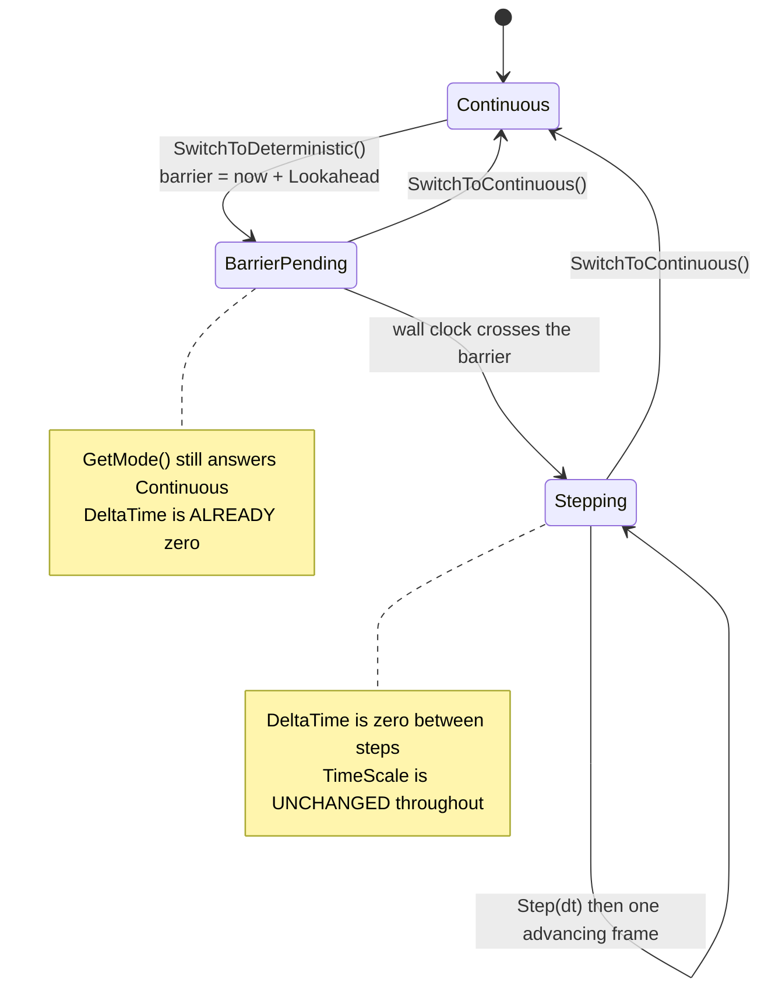

⭐⭐ **Measured by rail.** ⇒ ⛔ **`GetMode()` is late; `DeltaTime` is prompt.** 📌 `M-42`.

---

---

## 3. ⭐⭐⭐ AS-IS — **the API surfaces**

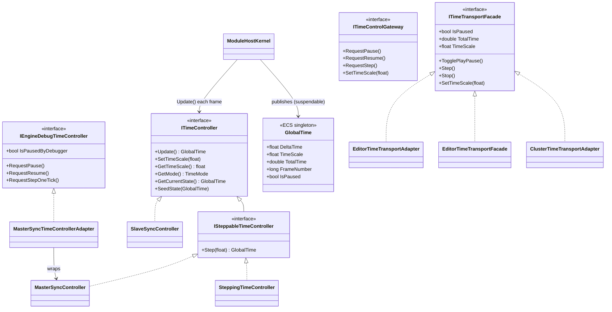

### ⛔ Five separate reporting surfaces, and they disagree

| # | surface | what it really answers | ⚠ |
|---|---|---|---|
| **①** | ⭐⭐ **`GlobalTime` on the live world** | **what the frame the simulation just ran did** | ⭐ **the only per-frame truth** — ⛔ and it had **zero production readers** until `2026-08-21` |
| **②** | `ITimeController.GetCurrentState()` | **cumulative position + settings** | ⛔ delta is **always 0** — it is a snapshot, not a reading |
| **③** | `ITimeTransportFacade.IsPaused` | **3 implementations, 2 of them byte-identical** — §4 | ⚠ editor arm reads `GetMode()` ⇒ **late by the barrier window** |
| **④** | `IEngineDebugTimeController.IsPausedByDebugger` | `GetMode() == Deterministic` | ⛔ a **MODE**, not a pause; true while merely planning |
| **⑤** | `ClusterUiCache.IsPaused` · `ClusterTimeTransportAdapter._isPaused` | **a REMOTE observation** off `SwitchTimeModeEvent` | ⭐ legitimately cached — ⚠ but **two independent caches of the same event** |

---

---

## 4. ⭐⭐⭐ AS-IS — **the control paths, and there are FOUR**

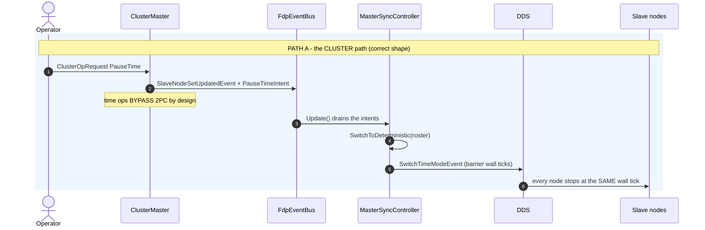

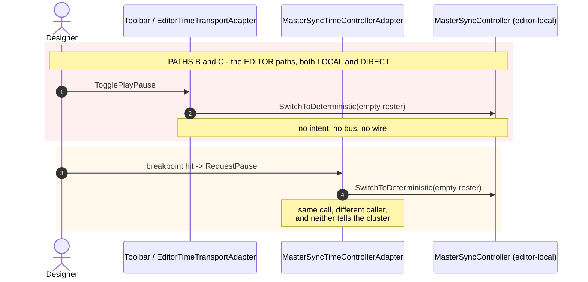

| path | who | shape | ⚠ |
|---|---|---|---|
| **A** ⭐ | ExCon / operator UI → `ITimeControlGateway` → `ClusterMaster` | ⭐⭐ **intents on the bus**, drained by the master, fanned out over DDS with a **wall-clock barrier** | ⭐ **the right shape** |
| **B** ⛔ | editor toolbar → `EditorTimeTransportAdapter` | ⛔ **direct method call** on the editor's own controller | ⛔ **bypasses the intent bus entirely** |
| **C** ⛔ | breakpoint / debugger → `IEngineDebugTimeController` | ⛔ **direct method call**, empty slave roster | ⛔ 🔒 `R-126`: this is the one that must go cluster-wide |
| **D** ⚠ | `AiTracerCoordinator.RequestPause/Continue/StepOneTick` *(BTree · HSM)* | ⛔⛔ **virtual NO-OPS** — production builds the base class *(`EditorSubsystem:750`)* | 🔴 📌 `AS-9` / `R-67` |

### ⛔⛔ `AS-11` — **a measured duplicate: `EditorTimeTransportFacade`**

📐 `diff` of `EditorTimeTransportFacade` vs `EditorTimeTransportAdapter`: **identical apart from the
name, the accessibility, and three null-guards.**

> ## ⛔⛔⛔ CORRECTED `2026-08-21` — **"only the Adapter is constructed" IS FALSE. BOTH ARE.**
> ⚠⚠ **This row previously read *"Only the Adapter is constructed (`TimeControlStatusBarSection:31`)"*
> and concluded *"the Facade is dead."*** 📐 **Measured — they are built EIGHT LINES APART in the same
> method of `EditorSubsystem.cs`:**
>
> | site | builds | feeds |
> |---|---|---|
> | `EditorSubsystem.cs:3878` → `TimeControlStatusBarSection:31` | **`EditorTimeTransportAdapter`** | ⭐ the **status bar** |
> | `EditorSubsystem.cs:3886` | **`EditorTimeTransportFacade`** | ⭐ the **main toolbar** *(`MainToolbarTimeControlSection`, BATCH-24)* |
>
> ⇒ ⭐⭐ **Neither is dead. There are TWO SURFACES, each with its own copy of one implementation.**
> ⛔ **The word "dead" was the dangerous half** — 📌 it is exactly the premise that CLAUDE.md's
> *"unreferenced is not unintentional"* rule exists to stop, and here it was not even unreferenced.

⚠ **Checked the corpus before saying so** — ⭐ **`docs/` first, then `.dev/`** *(the `2026-08-17` order;
restated by the user `2026-08-21`)*: the `.dev/` record is `.dev/main-toolbar-1/` Batch 24, which
introduced the facade for the new toolbar; ⛔ **no record explains why both survive.**

⇒ ⭐⭐⭐ **VERDICT: ROUTE, not delete.** 📌 CLAUDE.md's three-way test decides it —
**duplicate CODE** *(two implementations of one interface ⇒ route)*, ⛔ **not duplicate SURFACE**
*(status bar and main toolbar are different surfaces and BOTH stay)*, ⛔ **not dead** *(both wired)*.
⭐ **Keep the `Facade`** — it is `public` and its null-guards are strictly stronger; **delete the
`Adapter`**; **point the status bar at the `Facade`.** ⇒ **one implementation, two surfaces, no
capability lost.**

---

---

## 5. ⭐⭐⭐ AS-IS — **the WRITE path, and the breakpoint rewind**


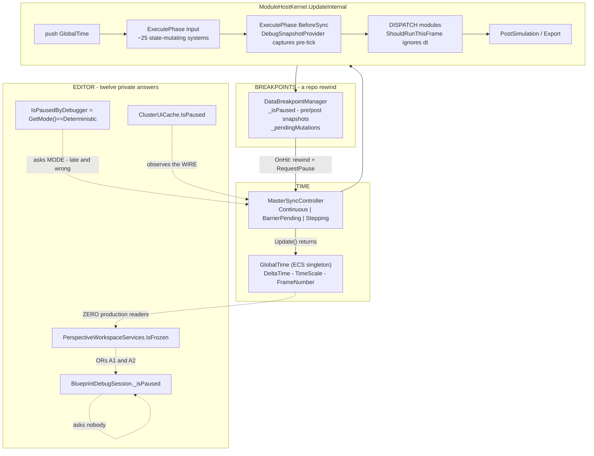

---

---

## 6. ⭐⭐⭐ FINDINGS — `AS-1` … `AS-14`

| # | finding | 📐 evidence | ⚠ |
|---|---|---|---|
| **`AS-1`** | ⛔⛔ **`GlobalTime.IsPaused` (`TimeScale == 0`) is FALSE while paused.** A pause never touches `TimeScale` | ⭐⭐ **RAIL** `APausedClockReportsZeroDeltaAndYetIsPausedIsFalse` | 🔴🔴 |
| **`AS-1b`** ⚠ **RESTATED TWICE** | ⛔ **NOT "two roles" — that was an overstatement, corrected `2026-08-21`.** 📐 `GlobalTime` has ONE role *(the clock's state)*, and `GetCurrentState()` populates every field that role has. ⭐⭐ **The trap is FIELD-LEVEL:** of its 9 fields, **`DeltaTime`/`UnscaledDeltaTime` describe THE STEP JUST TAKEN**, not a position the clock can be *at* — 📐 **all three `SeedState` implementations read the cumulative fields plus `TimeScale`, and NONE reads a delta.** ⇒ ⛔ **a delta is meaningful ONLY on the instance the kernel pushed this frame**; on a snapshot, a `new GlobalTime()`, or a seeded one it is zero meaning *"no information"*, ⚠ **and the type cannot distinguish that from "halted".** 📌 Same shape for `IsPaused`, which is why it looked plausible: it derives from `TimeScale`, a genuine persistent setting, so it is well-defined everywhere — ⛔ it just means *"the speed knob is at zero"*, not *"the simulation is stopped"* | ⭐⭐ **RAIL** `GetCurrentStateHardCodesTheDeltaToZero…` | 🔴 **a trap for callers.** ⭐ **The rule, not a code change: read `GlobalTime` from the LIVE WORLD, never from the controller** |
| **`AS-2`** ⚠ **CORRECTED** | ⛔ **A pause is a two-phase BARRIER.** `SwitchToDeterministic` enters `BarrierPending`, **not** `Stepping`, and `GetMode()` answers **`Continuous`** for the whole lookahead window. ⭐⭐ **But `DeltaTime` goes to zero on the FIRST frame** *("sim time is logically frozen from the moment SwitchToDeterministic() is called")* | ⭐⭐ **RAIL** `TheDeltaGoesToZeroBeforeTheModeChanges` | 🔴 **`IsPausedByDebugger` is LATE as well as wrong** — ⭐ and this **strengthens** the delta |
| **`AS-3`** | ⛔ **`BlueprintDebugSession._isPaused` asks nobody** | `:1109`, `:920` | 🔴 **the gate that refused the user** |
| **`AS-4`** | ⛔⛔ **the breakpoint pause is a repo-REWIND protocol** — `OnHit`: post ← live; **live ← pre-tick**; halt. Resume: live ← post-tick; drain; advance | `DataBreakpointManager:470-473`, `:495`, `:514` | 🔴🔴 |
| **`AS-5`** | ⛔ **one drain, three production callers, none reachable from any UI** | Q3 + grep | 🔴🔴 |
| **`AS-6`** | ⭐ **the drain system has an exact precedent** — `DebugSnapshotProvider` | source | ✅ |
| **`AS-7`** | ⭐ **cluster-wide time control already exists** — intents + `SwitchTimeModeEvent` over DDS | `MasterSyncController:112-124` | ✅ |
| **`AS-8`** | ⭐ **intra-phase ordering is expressible**, and the scheduler is **phase-generic** *(`Dictionary<SystemPhase, …>`)* | `SystemScheduler:16,46,178-203` | ✅ **adding a phase is 1 enum member + 1 kernel line** |
| **`AS-9`** ⭐ NEW | ⛔⛔ **BTree/HSM "pause" never touches time.** `AiTracerCoordinator.RequestPause/RequestContinue/RequestStepOneTick` are **virtual no-ops**, and production constructs the **BASE class** — `EditorSubsystem:750` — while holding `_bpTimeAdapter` a few lines away | grep: no subclass, no override | 🔴 📌 **`R-67` again** |

---

⭐ **And the findings the time-subsystem sweep added:**

| # | finding | ⚠ |
|---|---|---|
| **`AS-11`** | ✅ **RESOLVED by Batch TM-105.** ⛔ **The old claim *"only the Adapter is constructed"* was FALSE** — 📐 **both are**, eight lines apart in one method *(`EditorSubsystem:3878` Adapter → status bar, `:3886` Facade → main toolbar)* ⇒ ⭐ **two SURFACES sharing one duplicated implementation, not a dead class beside a live one.** ⇒ **ROUTE:** Facade kept *(public, stronger null-guards)*, Adapter deleted, status bar repointed *(`TM-010`)* | ✅ §4 · `TM-010` |
| **`AS-12`** | ⭐⭐⭐ **RESOLVED.** Every node puts its time controller **on the bus the intents live on**; ⛔ **the editor is the only place those are two different objects** *(registry on `_orchestrationBus`, master on `_world.Bus`)* | ⭐ **one line to fix** — §8 |
| **`AS-13`** | ⚠ **CORRECTED by Batch 104.** ⭐ `BP-378` rotted for the **FILTERED** run only *(`TimeControlIntegrationTests` runs, 4/2)*; ⛔ **the FULL single-process run still aborts** — `ClusterOpE2eScriptTests` crashes its host in 2–3 s, and `MAX_ENTITIES × 4–5 nodes` OOMs a shared host. ⭐ **43 classes are green in isolation** ⇒ a **class-at-a-time gate is real** *(quarantine flagged `TM-006`)* | ⭐⭐⭐ §13 |
| **`AS-14`** | ✅ **RESOLVED by Batch 104.** ⛔ Root cause was NOT the settle nor the harness — 📐 **the CGF node is structurally unable to ACK in PRODUCTION** *(it composes past `SharedApplicationBootstrapper` phase 6c, so it holds a `SlaveSyncController` with no translators, yet sits in the lockstep roster)* ⇒ **the master blocks forever**. ⭐ **Fixed:** `TM-002` extracts the translator registration *(shared, not copied)* + `TM-001` makes `Step` **queue-bounded-and-refuse-audibly** instead of silently dropping | ✅ **net now 9/9** — ⭐ `TM-001`+`TM-002` fixed the two reds *(6/6)*, `TM-005` added 3 rails — §13 |

---

## 7. ⭐⭐⭐ THE PROBES — `P1` … `P8`, all run

| probe | verdict |
|---|---|
| **`P1`** — can the restore leave `RequestStep`/`RequestContinue`? | ⭐⭐ **YES, and it must go EARLIER than `BeforeSync`.** 📐 `Input` runs **first** and holds ~25 state-mutating systems, so a rewound repo must be restored **before** it ⇒ ⭐ **a new `PreFrame` phase**, which `AS-8` makes a 2-line engine change. ⭐⭐ **And `_isPaused` must stay TRUE until the restore runs**, because it also selects `ActiveView` |
| **`P2`** — is a repo available where `RunStateSource` is built? | ✅ **YES.** `_kernel = new ModuleHostKernel(_world, …)` *(`EditorSubsystem:661`)* ⇒ **`_world` IS the kernel's live world**, in scope at `:2226`. ⛔ No new plumbing |
| **`P3`** — what is `ClusterUiCache.IsPaused` for? | ⭐ **A REMOTE OBSERVATION, not a local cache.** Fed by `SwitchTimeModeEvent` off the bus *(`:173-181`)* — there is no local object to ask. ⇒ ⛔ **do NOT delete it**; ⚠ it stores **mode**, so it inherits `AS-2` and should be renamed/refined. 📌 `R-126`'s "don't cache" is about locally-derivable state |
| **`P4`** — is there a THREADING reason anything is unwritable? | ⛔⛔ **NO.** 📐 The runner is one loop — `while (_running) { Update(dt); DrawWorldAll(); DrawUIAll(); }` *(`SubsystemOrchestrator:105-114`)*; `DataStrategy.Direct` is **`Synchronous`-only and ENFORCED** *(`ExecutionPolicy.Validate:148-157`, called at `ModuleHostKernel:246`)*; async modules run on **leased views** and play back at harvest. ⇒ ⭐⭐ **the UI writes between frames with nothing else touching the live repo** |
| **`P5`** — the BTree/HSM twins | ⛔ **`AS-9`.** Their pause is a UI flag over a no-op coordinator. ⭐ **Good news: no rewind either**, so they are the SIMPLE case once they get a write path |
| **`P6`** ⭐⭐⭐ NEW | **Do modules tick while paused?** ⛔⛔ **YES.** `ShouldRunThisFrame` **never consults `deltaTime`** — a module at ≥60 Hz runs **every frame**, with `moduleDelta == 0` *(`ModuleHostKernel:614`, `:624`, `ShouldRunThisFrame`)* |

### ⭐⭐ `P7` — **"aren't the controller and the world in sync?"** *(user, `2026-08-21`)*

⭐ **Fair question, and "stale" was the wrong word.** 📐 Measured — **three reasons, and only the second
is about sync:**

| # | ⭐ reason | 📐 |
|---|---|---|
| **①** ⭐⭐⭐ **decisive** | ⛔⛔ **THE CONTROLLER DOES NOT RETAIN A DELTA.** There is no `_lastDelta` field: `Update()` computes `scaledDelta` as a **local**, hands it to `BuildGlobalTime`, and nothing keeps it. ⚠ `_pendingStepDelta` is **not** "the last delta" — it is the **pending** step amount, zeroed the moment it is consumed *(`:425-427`)* | ⇒ ⭐ `GetCurrentState()` **cannot** return a real delta — **there is nothing to return.** ⛔ It is not discarding information; the delta only ever lived in the struct the kernel put in the world |
| **②** ⚠⚠ **and they genuinely CAN diverge** | ⛔ **`ModuleHostKernel.SuspendGlobalTimePush()`** *(`:131-134`, guard at `:484`)* — wired in **four** places *(`EditorSubsystem:1034`, `CgfSubsystem:428`, `CgfApplication:176`, `NodeBootstrapper:225`)* into `ReferenceReplayLoadHandler`: **suspended on `PrepareReplay`, resumed on `FinalizeReplay`** *(`:237`, `:246`, `:255`)*. ⇒ **during replay preparation the controller advances while the world's singleton is FROZEN** | ⭐⭐ **and in that window the WORLD is the one telling the truth** — because that is what systems read |
| **③** ⚠ **the singleton has more than one writer** | `TimeSystem:43,124` *(`Fdp.Core`)* · `SimHostNodeBootstrapper:212` · the CarKinem examples — ⛔ **not only the kernel** | ⇒ *"the world's `GlobalTime`"* is **whatever the host last put there**, which is exactly what every ECS system sees |

⇒ ⭐⭐⭐ **The principle is not *"the controller is stale."* It is: READ TIME FROM THE SAME PLACE THE
SIMULATION READS IT.** ⛔ A predicate that reads the controller can disagree with what the frame actually
did — ⚠ **silently, and precisely in the suspend window where nobody would look.**
📌 Same rule as Batch 96's: *a rail must take its input from the same object the UI takes it from.*

---

### ⭐⭐⭐ `P8` — **"shouldn't the CONTROLLER be the read API?"** *(user, `2026-08-21`)* — and it found a HAZARD

📐 **Two measurements first, one of which corrects `P7`'s framing:**

| # | 📐 measured | ⇒ |
|---|---|---|
| **①** | ⛔⛔ **`GlobalTime` is NOT per-view.** `EntityRepository.SyncFrom` copies **five named singletons** *(`SpatialGridData` · `EqsResultPool` · `IEqsTemplateRegistry` · `ICoverProvider` · `INavmeshProvider`)* — ⛔ **`GlobalTime` is not among them.** Snapshots and leased views carry **none** | ⭐ **there IS exactly one time per node** ⇒ ⚠ **hiding the storage behind an API is viable in principle** — my earlier "time is per-view" reasoning was wrong |
| **②** | ⭐ **modules never read it anyway** — `Tick(view, moduleDelta)` and `Execute(view, deltaTime)` **pass the delta as a PARAMETER** | ⇒ the singleton serves **main-thread readers against the live world**, not module code |

### ⭐⭐ So why not the controller? — **three reasons, none of them "it is stale"**

| ⭐ | |
|---|---|
| **①** | ⛔ **it does not retain a delta** *(`P7` ①)* ⇒ a controller-façade would have to **store** one — i.e. become a second storage, which is the thing the façade was supposed to avoid |
| **②** | ⭐⭐ **it answers a DIFFERENT QUESTION** — *"what has this node's clock done"*, not *"what did the frame the simulation just ran do"*. ⚠ In the suspend window those diverge, **and both are right about their own question** |
| **③** | ⛔ **it is not the only author** — `TimeSystem` *(`Fdp.Core`)*, `SimHostNodeBootstrapper` and the examples also write the singleton ⇒ the controller cannot be the authority over a value it does not solely produce |

⇒ ⭐⭐⭐ **The model IS "controller produces, kernel publishes, singleton is what the simulation
experienced" — and it is coherent.** ⛔ **What is missing is a NAMED READ API on the view side**, which is
why callers hand-roll `HasSingleton`/`GetSingleton`/`DeltaTime > 0` and get it wrong. 📌 That is `RF-1`
plus a small view-taking helper — ⭐ **a façade over the VIEW, never over the controller.**

### ⛔⛔⛔ AND THE HAZARD THE QUESTION FOUND — **`AS-10`**

📐 **During `PrepareReplay`:** `SetSystemsEnabled(false)` toggles **four named groups** — input, sim,
postSim, lifecycle *(`ReferenceReplayLoadHandler.SetSystemsEnabled`)* — and `SuspendGlobalTimePush()`
stops the kernel writing the singleton.

⇒ ⛔⛔ **The singleton then FREEZES AT ITS LAST VALUE, which may carry a NON-ZERO `DeltaTime`.**
⚠⚠ **So `IsAdvancing` read from the singleton answers TRUE while nothing is advancing** — ⭐ and a
`PreFrame` drain system is **in none of those four groups**, so it keeps running.

| ⭐ the fix, and it is small | |
|---|---|
| ⭐⭐⭐ **the drain gates on its `deltaTime` PARAMETER, not on the singleton** | 📐 `ExecutePhase(phase, _liveWorld, deltaTime)` hands every system the kernel's **real** per-frame delta, ⛔ and the suspension does not touch it |
| ⚠ **residual, and ACCEPTED rather than hidden** | during replay preparation the parameter still reads *advancing* ⇒ a staged edit can be drained into a world replay is about to overwrite. ⭐ **The edit is LOST, not corrupted**, and only if the designer starts a replay between editing and resuming. ⛔ **Named, not fixed** — a guard needs `_globalTimePushSuspended` exposed, which is a kernel API change this slice does not earn |

📌 **This is the second time a "which source?" question has produced a defect** — ⭐ the first was `M-42`.
⚠ **Both were found by asking where a value comes from, not by reading what it is called.**

---

### ⛔⛔⛔ `P6` is the one that changes the design — **and it answers the user's question**

> 🔒 **User:** *"I do not understand how comes that something can be unwritable. The only real reason
> might be threading issues…"*

⭐⭐ **`P4` says the threading answer is NO — there is no race.**

### ⚠⚠ `P6′` — **CORRECTED `2026-08-21`, same day, prompted by the user's question**

⛔ **The first version of `P6` said *"the tick never stops, so a direct write is always overwritten."*
📐 That was measured at the WRONG LAYER.** ⭐ There are two, and only one of them ignores `dt`:

| layer | guards on `dt`? | 📐 |
|---|---|---|
| **module DISPATCH** | ⛔ **NO** — a ≥60 Hz module is dispatched **every frame**, with `moduleDelta == 0` | `ShouldRunThisFrame` never reads `deltaTime` |
| ⭐⭐⭐ **the BEHAVIOUR tick systems inside it** | ✅ **YES** — `if (deltaTime <= 0f) return;` | `BlueprintTickSystem:51` · `BTreeTickSystem:55` · `HsmTickSystem:103` |

⇒ ⭐⭐⭐ **A blackboard variable written by a behaviour is NOT recomputed while paused.**
📌 **And this was already in the corpus** — `Q46` rule `2b`, the user's own `2026-08-19` specification:
*"the brain (cgf) does not tick ANY behavior when `dt=0`."* ⚠ **I re-derived it instead of reading it.**

### ⭐⭐ So the answer is PER RUN-STATE, not one rule

| state | is a direct write overwritten? | ⇒ |
|---|---|---|
| ⭐⭐ **time-paused, no rewind** *(toolbar · stepping — **the case the user hits**)* | ⛔ **NO.** Behaviours are not ticking | ⭐⭐⭐ **write DIRECT — it sticks, and it is visible IMMEDIATELY.** ⛔ No "queued" state needed |
| ⛔ **breakpoint-paused (rewound)** | ⚠ **yes, by the RESTORE** — the live repo holds pre-tick and resume overwrites it *(`AS-4`)* | ⭐ **stage** ⇒ **"queued" is REAL here** |
| ⚠ **running** *(`dt > 0` every frame)* | ⚠ **yes, by the next behaviour tick** | ⭐ **stage** ⇒ **"queued" is REAL here**, and ⛔ **an edit to a COMPUTED variable is inherently a one-tick poke** — 📌 you are editing an output |

⇒ ⭐⭐ **The old refusal sentence — *"the edit would be overwritten by the next tick"* — described a real
mechanism, but only in TWO of the three states.** ⛔ In the third — the one the designer actually uses —
it was simply wrong.

### ⭐ Which SURFACES owe the "queued" affordance — **enumerated**

📐 `search_graph(".*VariableTableModel.*")` → **4 owners**, unchanged since Batch 103's `103c`:

| surface | ⭐ verdict |
|---|---|
| ⭐⭐⭐ **`AiWatchWindow`** *(and `WatchPanelWindow`)* | 🔒 **the design already specifies it** — `Q46` rule **5**: *"a value the user typed is a SEPARATE cache on the row, distinct from the value read through the accessor."* ⇒ **the queued state IS that second cache**, and it resolves on the next `dt > 0` pulse *(rule 2)*. ⛔ **Nothing new to invent** |
| ⭐⭐ **`VariableDetailsSection`** | ⭐ **same row class, same rule 5** ⇒ it inherits the affordance for free. ⚠ **It is the surface the designer edits from**, so it is the one that must not lie |
| ⭐ **`AiVariablesWindow`** | ⚠ **`U-16` retires it** *(`R-54`)* ⇒ ⛔ **do not build the affordance here** — it would cement a duplicate |
| ⚠ **`VariableEditModal`** | ⭐ **the CONFIRMATION, not the display** — it closes on OK, so its job is one sentence *("queued; applies on the next tick")*, ⛔ not a live state |
| ⚠ **`VariablePropertiesModal`** | ⛔ **no** — it edits the DECLARATION, not the value |

⇒ ⭐⭐⭐ **One mechanism (`Q46` rule 5's typed-value cache), two surfaces that render it, one sentence in
the modal.** ⛔ **And it is only reachable in two of the three run states** — in a plain time-pause the
value simply changes.

---

---

## 8. ⭐⭐⭐ WHY IT PRODUCED TWELVE NOTIONS — **the root cause, stated once**

| ⭐ | |
|---|---|
| **①** | ⛔ **there is no READ API.** ① is a raw ECS singleton lookup; every consumer that wanted a *question answered* — *"is it stopped?"* — **invented its own** |
| **②** | ⛔ **the one convenience flag that exists is wrong.** `GlobalTime.IsPaused` is `TimeScale == 0`, and no pause path sets that ⇒ **everyone who tried the obvious thing got a dead flag and wrote their own** |
| **③** | ⛔ **control is not uniform.** Path A goes through intents; B, C and D call methods directly ⇒ **a state change on one path is invisible to observers of another** |
| **④** | ⚠ **two legitimate remote observations** *(⑤)* look like the same kind of thing as the four local guesses ⇒ **"do not cache" gets applied to the wrong ones** |

⇒ ⭐⭐⭐ **The twelve are not carelessness. They are what happens when a subsystem has a WRITE API and no
READ API.**

---

---

## 9. ⭐⭐⭐ TARGET — **the APIs**

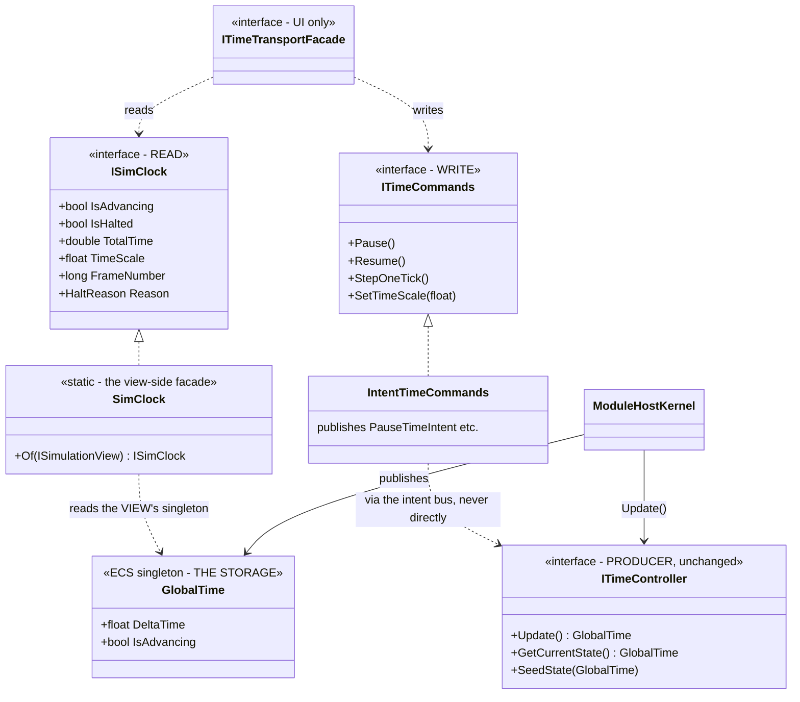

| ⭐⭐ the three-way split | |
|---|---|
| ⭐⭐⭐ **PRODUCER — `ITimeController`** | ⭐ **unchanged.** It computes this node's frame time and hands it to the kernel. ⛔ **Nobody outside the kernel calls `Update()`, and nobody asks it questions** |
| ⭐⭐⭐ **STORAGE + READ — `GlobalTime` behind `ISimClock`** | ⭐ **one named read surface**, taking an `ISimulationView` so a caller cannot accidentally ask the wrong world. ⛔ **`IsAdvancing`, never `IsPaused`** |
| ⭐⭐⭐ **CONTROL — `ITimeCommands`, intents only** | ⭐ **paths B, C and D become path A.** ⛔ No direct `SwitchToDeterministic` outside the controller ⇒ 🔒 **`R-126`'s cluster-wide debugger pause comes free**, because the intent already fans out |

### ⭐⭐⭐ 9a. THE READ SIDE, AS IT IS BUILT — **the concrete classes behind `ISimClock`**

> ⭐ §9's diagram above is the **TARGET SHAPE**. This one is the **BUILDABLE SLICE**: every box that
> already exists is drawn as existing, so a proposed class that duplicates one is visible on the same
> page. ⛔ `HaltReason` and `ITimeCommands` are deliberately absent — they are `T6` and `T4`.

| box | file | status |
|---|---|---|
| `GlobalTime` | `FDP/Engine/Fdp.Core/GlobalTime.cs` | **exists** — gains `IsAdvancing`; `IsPaused` obsoleted |
| `ISimulationView` | `FDP/Engine/Fdp.Core/Abstractions/ISimulationView.cs` | **exists, 1171 refs — UNCHANGED** |
| `EntityRepository` | `FDP/Engine/Fdp.Core/EntityRepository.cs` | **exists** |
| `ISimClock` · `SimClock` · `WorldSimClock` | `FDP/Toolkits/Fdp.Toolkits/Time/` | ⭐ **new** |
| `ITimeTransportFacade` | `Hrot/Engine/Hrot.Presentation/Facades/` | **exists, 12 refs** |
| `EditorTimeTransportFacade` | `Hrot/Subsystems/Hrot.Editor/UI/` | **exists — KEPT** |
| `EditorTimeTransportAdapter` | `Hrot/Subsystems/Hrot.Editor/UI/` | ⛔ **exists — DELETED** *(`AS-11`)* |
| `TimeControlStatusBarSection` | `Hrot/Subsystems/Hrot.Editor/UI/` | **exists — REPOINTED** |

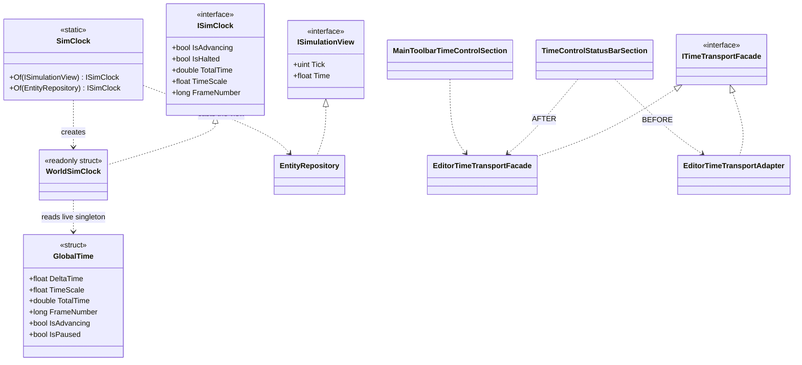

### ⭐⭐ 9a.1 THE READ SEQUENCE — **why the answer cannot be stale**

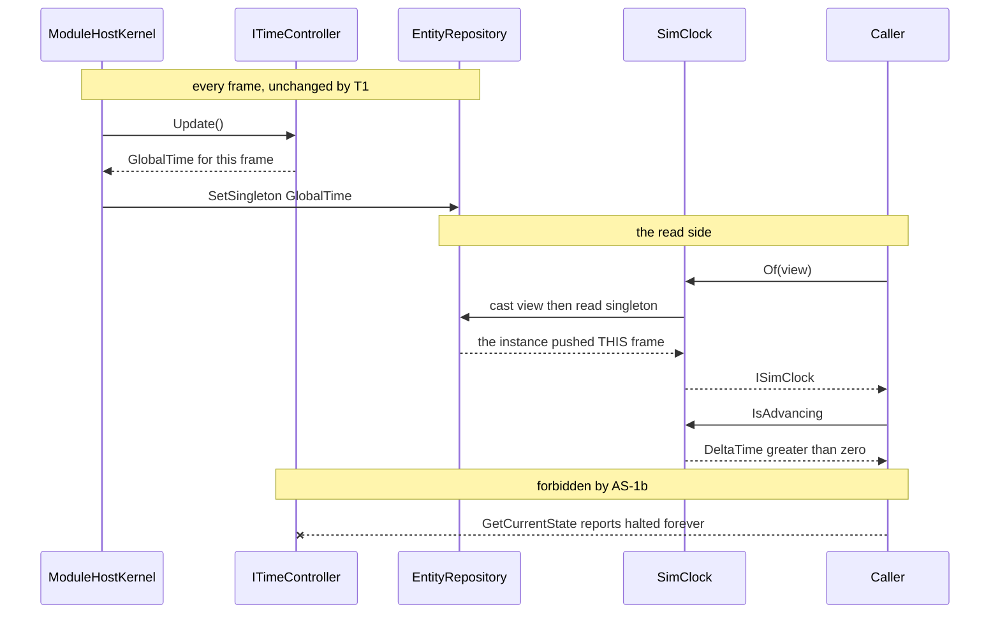

| ⛔ the two traps this shape exists to avoid | |
|---|---|
| **`M-42`** | ⭐⭐⭐ **`IsAdvancing` is `DeltaTime > 0`, NEVER `!IsPaused`.** 📌 `IsPaused` is `TimeScale == 0` and **no pause path sets `TimeScale`** ⇒ implementing the negation ships the same dead flag under a better name |
| **`AS-1b`** | ⭐⭐ **read the LIVE WORLD'S singleton**, ⛔ never `controller.GetCurrentState()` — that answers *halted* forever |

⚠ **`ISimulationView` has NO singleton accessor** *(measured: `Tick`, `Time`, components, queries,
events — that is all)*. ⛔ **It is not widened.** ⭐ **`SimClock.Of` casts internally**, on the settled
convention: 📄 **`Blueprint_Subsystem_Runtime_Detailed_Design.md` §12.2 — RESOLVED**: *"the
`var repo = (EntityRepository)view;` pattern is the engine convention, not brittle… No commentary or
hedging needed."* ⚠ **A view with no repository behind it reports `Halted`** — ⭐ stated, not silent.

---

### ⭐ `HaltReason` — **why it is stopped, not just that it is**

⭐ `Running` · `PausedByOperator` · `SteppingHeld` · `HeldByBreakpoint` · `NotPublishing` *(replay
preparation — 📌 `AS-10`)*. ⛔ **Derived, never latched.** ⚠ **This is the field that would have made
every one of the twelve notions unnecessary**: each of them existed to answer *"why"*, and `bool` could
not.

---

### 9b. ⭐⭐ TARGET — **one pause, one shape**

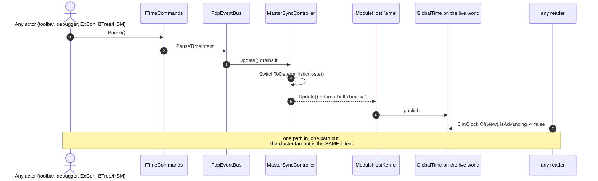

⭐⭐⭐ **The property this buys:** ⛔ **there is no way to change time that a reader cannot see**, because
there is exactly one way to change it and exactly one place it is reported.

---

---

## 10. ⭐⭐⭐ TARGET — **the WRITE side: the drain, and the tick that runs it**

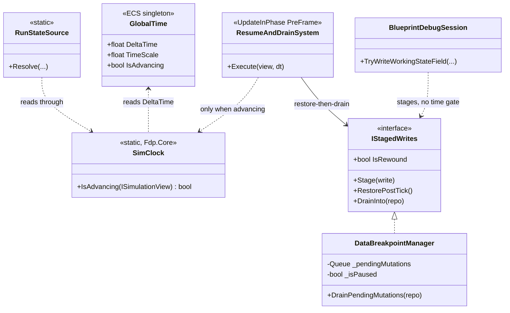

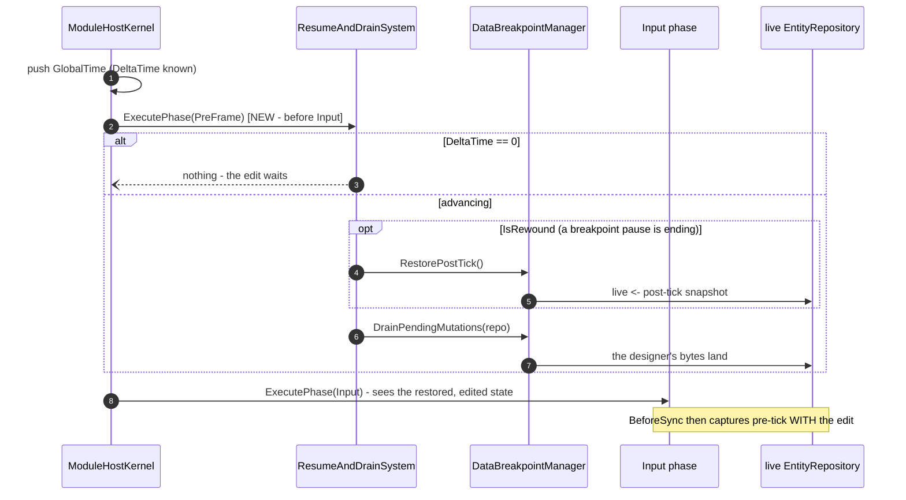

⭐⭐⭐ **Why `PreFrame` and not `BeforeSync`:** `Input` runs first and mutates state. ⛔ Draining in
`BeforeSync` would let ~25 Input systems run against a rewound repo.

---

---

## 11. ⭐⭐⭐ `AS-12` RESOLVED — **the uniform bus pattern, and the editor's one-line deviation**

### ⭐⭐⭐ `AS-12` — **RESOLVED. There IS a uniform pattern, and the editor is the only node that deviates**

> 🔒 **User, `2026-08-21`:** *"how (what bus) is PauseIntent sent now in cgf/simhost nodes? editor should
> not be different. cgf and editor will need to be almost identical to fulfil the future need of
> debugging on cgf."*
>
> ⭐⭐ **Measured, and the question was the right one.** ⛔ **My earlier "three options with a lean toward a
> bridge" is WITHDRAWN** — a bridge would have invented a mechanism **no node has.**

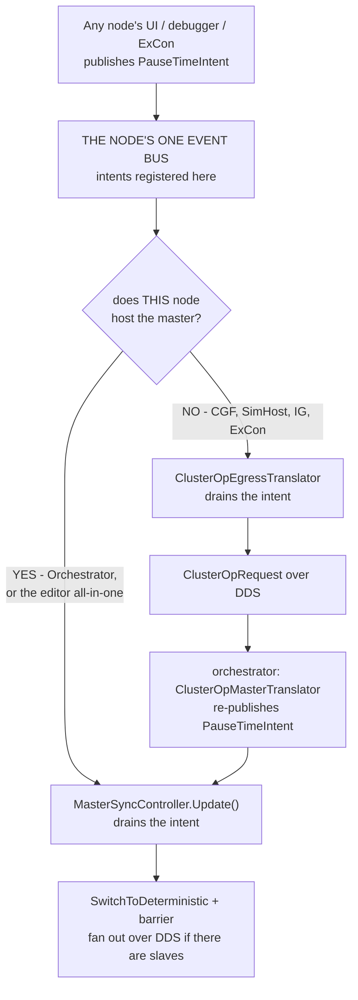

⭐⭐⭐ **ONE intent · ONE bus per node · TWO possible drainers, chosen by the node's ROLE.** 📌 That is
precisely *"a single concept, differently composed"* — ⛔ **there is no second mechanism anywhere.**

### 📐 The measurement, per node

| node | the node's bus | who **publishes** the intent | who **drains** it |
|---|---|---|---|
| ⭐ **Orchestrator** | **`_bus`** — `RegisterAll(_bus)` *(`:111`)* | `ClusterMaster` · `ClusterScenarioPanel` · the replay managers · `ClusterOpMasterTranslator` | ⭐⭐ **`MasterSyncController(_bus, …)`** *(`:146`)* — **the same bus** |
| ⭐ **CGF · SimHost · IG · ExCon** | ⭐ **`HrotNodeContext.EventBus`** *(`HrotNodeBuilder:99`)* — ⭐⭐ **and the time controller is created on it** *(`:109-110`)* | `ClusterTimeTransportAdapter` — CGF gets `_context.EventBus` *(`CgfSubsystem:731`)*, SimHost `OrchestrationEventBus` *(`:262`)* | ⭐⭐ **`ClusterOpEgressTranslator`** *(`:55`, `:63`)* → `ClusterOpRequest` over DDS. ⛔ `SlaveSyncController` drains only `AdvanceFrameIntent` — ⭐ **a slave takes its mode from the wire, by design** |
| ⛔⛔ **EDITOR** | ⛔ **`_orchestrationBus`** carries the registry *(`:686`)* … | *(nothing)* | ⛔⛔ **… but the master is on `_world.Bus`** *(`:715`)* |

⇒ ⭐⭐⭐ **The rule every other node follows: THE TIME CONTROLLER LIVES ON THE BUS THE INTENTS LIVE ON.**
⛔ **The editor is the only place those are two different objects.**

### ⭐⭐ ⇒ THE FIX — **one line, and it is "do what the Orchestrator does"**

| ⭐ | |
|---|---|
| ⭐⭐⭐ **Construct the editor's `MasterSyncController` on `_orchestrationBus`**, not `_world.Bus` | 📌 identical to `OrchestratorSubsystem:146`; ⭐ **no new mechanism, no bridge, no second registry** |
| ⭐⭐ **Then paths B, C and D publish intents like everyone else** | ⇒ `TC-3` **unblocks**, and 🔒 **the CGF node gets the same code**, which is the stated requirement |
| ⚠ **and the editor needs NO egress translator** | ⭐ it hosts the master, so it drains directly — ⛔ exactly the `YES` arm of the diagram |

### ⚠ Two smaller findings the same sweep turned up

| ⚠ | |
|---|---|
| **①** | ⛔ **CGF and SimHost hand `ClusterTimeTransportAdapter` DIFFERENT buses** — `_context.EventBus` vs `OrchestrationEventBus`. ⭐ **CGF's is correct** *(it is the bus its controller and the egress translator use)*; ⚠ **SimHost's needs checking** — ⛔ **not measured**, and it is a one-line question worth answering before `TC-3` |
| **②** | ⚠ **`HrotNodeBuilder` never calls `OrchestrationEventRegistry.RegisterAll`** on the bus it creates. ⭐ CGF's `CgfApplication:115` registers on a **different** bus (`_orchestrationBus`) ⇒ ⛔ **whether the intent types are registered on the bus that actually carries them is UNVERIFIED** — 📌 **probe it with `TC-3`, not before** |

### ⭐ `TimeSystem` *(`Fdp.Core`)* — **LEGACY, not a competing writer**

📐 `grep "new TimeSystem("` ⇒ **one non-test construction: `Fdp.Examples.Showcase`.**
⇒ ⭐⭐ **It is NOT in the HROT path.** ⛔ Correcting an earlier note of mine that listed it among the
singleton's authors: **true across the repo, false for HROT.** ⚠ In HROT the singleton has exactly
**two** writers — `ModuleHostKernel.UpdateInternal` and `SimHostNodeBootstrapper`'s seed.

---

---

## 12. ⭐⭐⭐ THE REPLAY CLOCK — **mapped, and there is NO third authority**

> ⭐⭐ **The good news first:** ⛔ **replay does not have a clock.** 📐 It is a **consumer** of the ordinary
> one plus a **frame index keyed by wall ticks.** ⇒ my earlier *"a third time authority"* caveat is
> withdrawn.

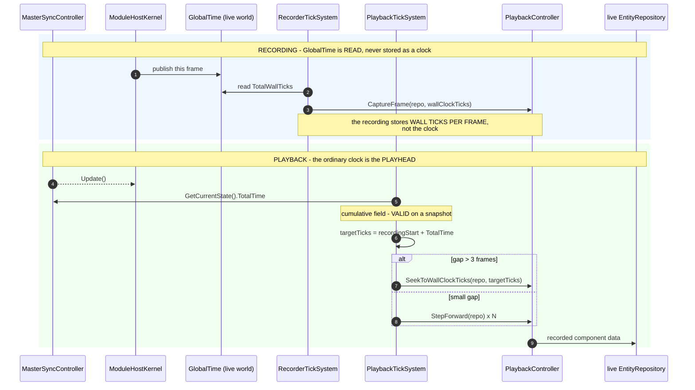

### ⭐ The four pieces, measured

| piece | what it is | ⚠ |
|---|---|---|
| ⭐⭐ **`PlaybackTickSystem`** *(`PostSimulation`)* | ⭐⭐⭐ **the playhead IS `ITimeController.GetCurrentState().TotalTime`** — a **cumulative** field, ✅ **valid on a snapshot** *(unlike the delta)*. Converts it to an absolute tick and seeks or steps | ⭐ **a correct use of `GetCurrentState()`** — worth noting, since the delta use was not |
| **`RecorderTickSystem`** | reads `GlobalTime.TotalWallTicks` to stamp each frame | ⛔ **`GlobalTime` is never RECORDED**, only read |
| **`ReplayProcessManager` · `ReplaySeekProcessManager`** | end-of-replay and seek detection, then ⭐ **`PauseTimeIntent`** — the ordinary control path | ⭐⭐ **replay is controlled by PATH A**, not a private one |
| ⚠ **`ReplayBrowserContext.SandboxRepo`** | ⛔⛔ **a bare `EntityRepository` with NO kernel and NO time controller** | ⇒ it has **no clock at all**; readers guard with `HasSingletonUnmanaged<GlobalTime>()` and fall back — 📌 which is why that guard exists |

### ⚠ Two consequences worth writing down

| ⚠ | |
|---|---|
| **①** | ⛔ **During playback the `GlobalTime` in the repo is the LIVE clock's, not the replayed frame's.** ⭐ `TotalTime` is coherent *(it IS the playhead)*, ⚠ **but `FrameNumber` and `TotalWallTicks` are live** — ⛔ **anything correlating `TotalWallTicks` with replayed data would be wrong.** 📐 Not currently done; ⭐ **stated so it stays not done** |
| **②** | ⭐⭐ **`AS-10`'s window is narrower than it looked.** The push suspension and `SetSystemsEnabled(false)` both span **`PrepareReplay` → `FinalizeReplay`** only — ⭐ a bounded **setup** window, ⛔ not the whole replay. `PlaybackTickSystem` is `PostSimulation`, so it is off during that window too and on afterwards |

---

---

## 13. ⭐⭐⭐ THE REGRESSION NET — **it EXISTS, it RUNS, and Batch 104 made it 6/6 GREEN** *(user, `2026-08-21`)*

> ✅ **UPDATE `2026-08-21` (Batch 104, TIME lane).** The net went **4/2 → 6/0** after `TM-001` + `TM-002`,
> then **9/0** with `TM-005`'s added coverage, run three times, **no flake**. ⭐ Both original reds were a
> **FIX**, not a skip. The AS-13/AS-14 subsections below are kept with their **corrections inline** — the
> `2026-08-21` measurements that seeded them, and what Batch 104 then proved.

> 🔒 **User:** *"these changes start to have very big blast radius… the cluster runner has an integration
> test suite where multiple cluster runner subsystems are instantiated in a single process and
> communicating over the network as if on different computers. We should use these to verify if the time
> control during the refactoring still works as it used before."*
>
> ⭐⭐⭐ **Correct, and better than expected — but the first thing I had to check was whether it can run
> at all**, because `BP-378` excludes this suite from every gate.

### ⭐⭐ `AS-13` — **`BP-378` rotted for the FILTERED run; the FULL run still aborts** *(corrected by Batch 104)*

> ⚠ **CORRECTION (Batch 104):** the headline below was true of the **filtered** run only. 📐 The **full**
> single-process run **aborts** — `ClusterOpE2eScriptTests` crashes its host in 2–3 s at both shas, and
> `MAX_ENTITIES (1_000_000) × 4–5 nodes` OOMs a shared host *(engine constant — deliberately NOT capped)*.
> ⭐ **43 classes pass in isolation** ⇒ a **class-at-a-time gate is the real net**; quarantining
> `ClusterOpE2eScriptTests` is flagged `TM-006` *(a finding, not a silent skip)*.

📐 **Measured `2026-08-21`, on this branch:**

```
dotnet build Hrot.ClusterRunner.Integration.Tests --no-restore      → 0 errors, 88 s
dotnet test  --no-build --filter "FullyQualifiedName~TimeControlIntegrationTests"
                                                                   → 4 passed / 2 FAILED, 38 s
```

⇒ ⛔ **No OOM. No hang.** ⭐⭐ **The net the user remembered is available TODAY**, at least per class.

> ⚠⚠ **CORRECTED `2026-08-21` by Batch 104 — the sentence that used to sit here said the full run was
> *untested*. It has now been RUN, twice, and it ABORTS:** 55/250 then a host crash; 83/250 then
> `Test host process crashed : dds_take failed: -3 (BadParameter)`; **14 `OutOfMemoryException`s at
> `EntityIndex..ctor:38`** — `int[MAX_ENTITIES]` plus two ~64 MB `NativeChunkTable` reservations, **per
> `EntityRepository`, per node, 4–5 nodes per harness**, released between classes by nothing.
> ⇒ ⛔ **`BP-378`'s FULL-run claim stands. Only the FILTERED half rotted.**
> ⭐⭐⭐ **And the crash has one name:** run class-by-class, **`ClusterOpE2eScriptTests` aborts the host on
> its own in 2–3 s, reproducibly, at both shas** — every other class completes. **43/72 fully green,
> 15.7 min for all 72.** ⇒ **a class-at-a-time gate is real** — `TM-006` / `TM-007`.

### ⭐ What it covers — **`TimeControlIntegrationTests`, 6 tests over REAL subsystems**

⭐⭐ Drives an `_orchestratorSvc` and a `_simHost` through `MockNetworkFactory` — ⭐ **a real
`ClusterOpRequest` → intent → `MasterSyncController` → DDS → slave round trip**, pumped until settled.

| ✅ | pause ⇒ sim time freezes ⇒ resume ⇒ advances |
| ✅ | multi-cycle pause/resume, every cycle |
| ✅ | ⭐⭐ **`PauseResume_SimHostKernelRestoresMasterTimeController`** — asserts the slave is still a `SlaveSyncController` in `Continuous` after each cycle |
| ✅ | second-cycle pause/step |
| ⛔ | **`PauseStepResume_SimTimeAdvancesByStepAmount`** — *"should have advanced ~3s after 3 steps; actual delta=**1.000s**"* |
| ⛔ | **`MixedSequence_PauseStepPauseStep_AllCorrect`** — *"expected ~2s advance; got **1.000s**"* |

### ⛔⛔ `AS-14` — **the two reds are ONE pre-existing defect: a STEP IS SILENTLY DROPPED** *(ROOT-CAUSED + FIXED by Batch 104)*

> ✅ **RESOLVED (Batch 104).** The hypothesis below — *"the settle is too short or the slave never ACKs in
> the harness"* — was **wrong on both counts**. 📐 The **CGF node is structurally unable to ACK in
> PRODUCTION**: `CgfSubsystem` composes through `HrotNodeBuilder`, bypassing `SharedApplicationBootstrapper`
> phase 6c, so it holds a `SlaveSyncController` with **no translators** — it never hears the pause and never
> ACKs — while the orchestrator's roster *(`OrchestratorSubsystem:303`, `ClusterMaster:327`)* still blocks
> the master on it. ⚠ *"in the harness"* pointed at the wrong place; the harness is faithful. ⭐ **Fixed:**
> `TM-002` extracts phase 6c to `SlaveTimeTranslatorRegistration.RegisterOn` *(shared by both compose paths,
> not copied)*; `TM-001` makes `Step` **queue** behind the ACK guard, **bounded** by `TimeConfig.MaxQueuedSteps`,
> and **refuse audibly** past it — never a silent discard.

📐 `MasterSyncController.Step` *(`:188-195`)*:

```csharp
if (_mode != MasterMode.Stepping) return GetCurrentState();
if (_pendingAcks.Count > 0)       return GetCurrentState();   // ⛔ the step is LOST, not queued
```

⇒ ⭐⭐⭐ **N steps produce ONE step's worth of time.** ⚠ The blocking is **documented and deliberate**
*("Blocked while the previous step's ACKs are still outstanding")* — ⛔ **but the caller gets NO signal
and the request is DISCARDED rather than queued.**

> ⭐⭐⭐ **ROOT-CAUSED `2026-08-21` by Batch 104. The two candidates named here were *"the settle is too
> short"* and *"the slave never ACKs **in the harness**"* — it is the second, and the words *in the
> harness* were wrong: the harness is faithful and the defect is PRODUCTION.**
> 📐 Roster `[1, 400]`. SimHost (1) ACKs. **CGF (400) never ACKs — and never leaves `Continuous`, so it
> never hears the pause at all** *(5 000 ms and thousands of pumped frames, three runs)*.
> ⛔ **`CgfSubsystem` builds its node through `HrotNodeBuilder` DIRECTLY**, and the three slave time
> translators are wired **only** in `SharedApplicationBootstrapper` **phase 6c**, which CGF never runs
> ⇒ the node holds a `SlaveSyncController` **with nothing connected to it**, while `OrchestratorSubsystem:303`
> and `ClusterMaster:327` both keep it in the lockstep roster.
> ⚠ **`CgfApplication` DID wire them** *(`:118-119`)* — its only caller is a unit test, so **the working
> copy was the dead one.** ⇒ **phase 6c extracted to `SlaveTimeTranslatorRegistration`, called from both**
> *(`TM-002`)*, **and the silent discard fixed independently** *(`TM-001`)* — ⛔ fixing only the wiring
> would have turned the suite green and left the trap armed for `T4`. 📐 **4/2 → 9/9.**

| ⭐ **PRE-EXISTING — the basis** | ⛔ **no production file under `FDP/…/Time/`, `Hrot.Orchestrator`, `MasterSync*`, `SlaveSync*`, `ClusterMaster` or `ModuleHostKernel` has been touched on this branch.** ⭐ Provable by construction, not by a worktree |
|---|---|

### ⭐⭐⭐ AND WHY THIS MATTERS TO THE REFACTOR — **it gets WORSE, not better**

⛔⛔ **`TC-3`/`TC-4` route the toolbar and the debugger through INTENTS.** ⚠ **Intents can be published
faster than ACKs return** ⇒ **a dropped step becomes MORE likely, not less.** ⇒ ⭐⭐ **`AS-14` is not an
unrelated red to note — it is a HAZARD the control refactor walks into**, and it should be fixed
*before* `TC-3`, or at minimum baselined and re-checked after every step of it.

> ✅ **GUARDED (Batch 104).** `TM-001`'s bounded queue is exactly what absorbs the faster intent
> publication `TC-3`/`TC-4` introduce — a step that arrives while ACKs are outstanding is now deferred and
> released one-per-frame, or refused audibly past the bound, never dropped. ⭐ The hazard is closed *before*
> `TC-3` rather than merely re-checked after it.

### ⭐⭐ ⇒ THE RULE FOR EVERY BATCH IN THIS PROGRAMME

> ⭐⭐⭐ **`TimeControlIntegrationTests` is a GATE ROW from now on**, filtered, with its **before/after
> counts**. ✅ **The baseline is now `9/0`** *(Batch 104: 6 original + `TM-005`'s 3 added)* — ⛔ **was `4/6`
> before Batch 104 fixed `AS-14`.** ⚠ **A new red is a regression the batch caused.**

---

---

## 14. ⛔ WHAT IS STILL NOT MEASURED — **named, not implied**


| ⛔ | |
|---|---|
| ~~`SlaveSyncController` internals~~ | 🔒 **ruled out of scope by the user** *(`2026-08-21`: "internals of SlaveSyncController should not be important i guess")* — ⭐ its **surface** is in §3 and that is what the design needs |
| ~~the replay clock~~ | ✅ **MAPPED — §10.** There is no third authority |
| **`TC-7`** | what each of the two remote caches is for, and whether they serve different processes |

⇒ ⭐ **Suggested next: the replay clock**, because `AS-10` already showed it interacts with the write

⚠⚠ **`104f`'s premise MOVED after dispatch** — `P6′`. ⭐ The affordance is **narrower** than the
handoff says *(two run states, not all three)* and its **mechanism already exists** *(`Q46` rule 5)*.
⛔ **Not an invalidation** — 📌 rule 1: this is FYI for a running batch, and `104f` is *"only if
early"* anyway. ⭐ **If Batch 104 has not started, the coordinator re-stamps under rule 1a.**

⚠ **`RF-4` is LIKELY, not proven.** ⭐ What is measured: the DBM has **only 10 `_isPaused` sites**, all
inside its own protocol, and **every external consumer is display or a per-frame system** — so a
one-frame deferral is invisible **provided `_isPaused` stays true until the restore runs.**
⛔ **What is NOT measured:** whether `BlueprintDebugSession`'s **own** step machinery *(temp
breakpoints, `_nodePointer`, the recorder)* tolerates the DBM resuming a frame later than the session.
⇒ ⭐⭐ **`Q48-E`'s end-to-end rail is what settles it**, and it should be written **before** `RF-4`.

---

## ⭐ WHERE THE TASKS WENT

⛔ **This document is the ARCHITECTURE and the EVIDENCE. It carries no task list** — ⭐ that is
📄 **[`PLAN_Time_System_Refactor.md`](PLAN_Time_System_Refactor.md)**, and keeping them apart is
deliberate: ⚠ **the architecture changes when a measurement changes; the order changes when a priority
changes.**

| old id *(pre-merge)* | now |
|---|---|
| `TC-1` … `TC-8` *(time subsystem)* | **`T1` … `T7`** |
| `RF-0` … `RF-11` *(write path)* | **`W0` … `W5`** *(`RF-0` is DONE — the `isFrozen` arm)* |
| ⭐⭐⭐ **and before any of them** | **`T0` — make the integration net work** |
