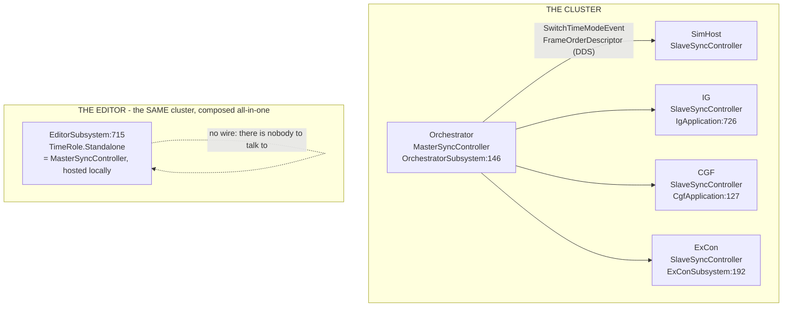
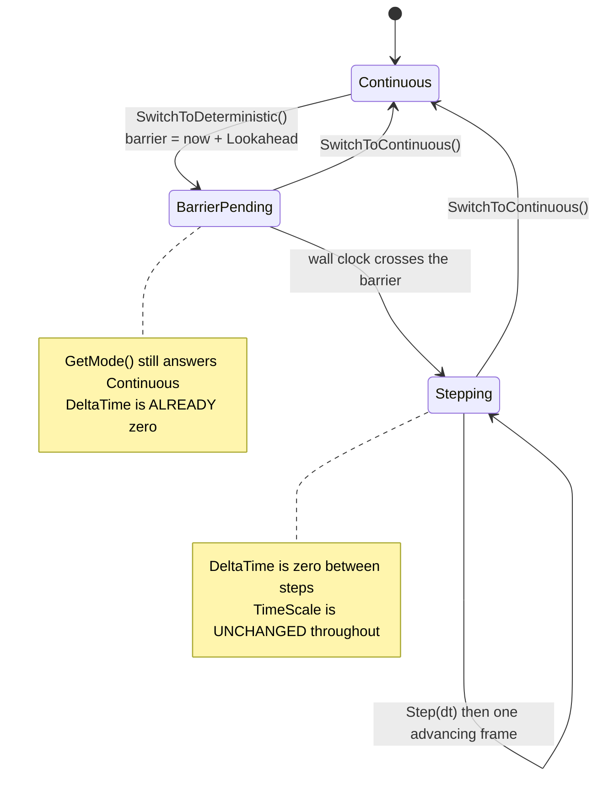
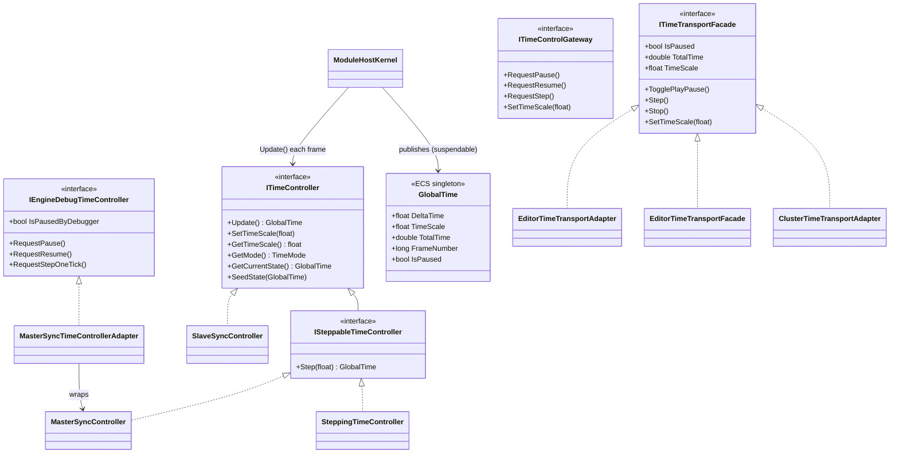
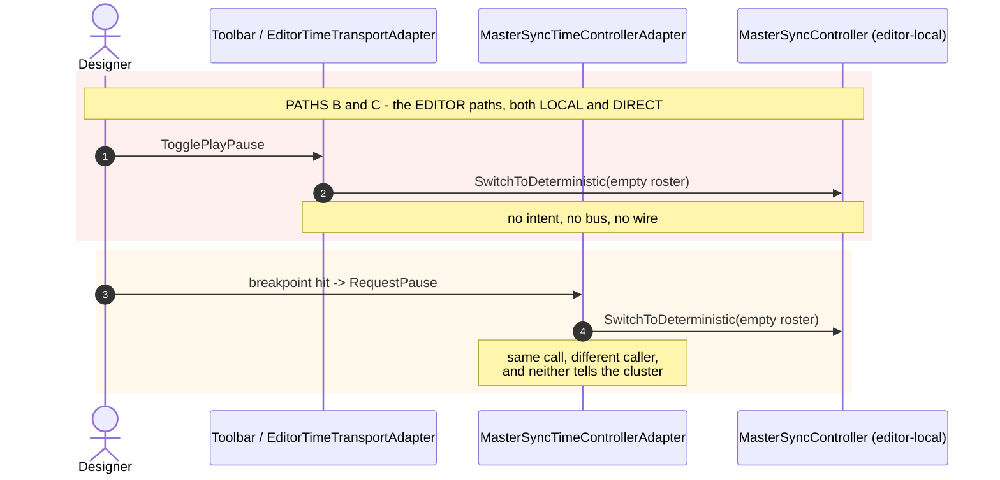
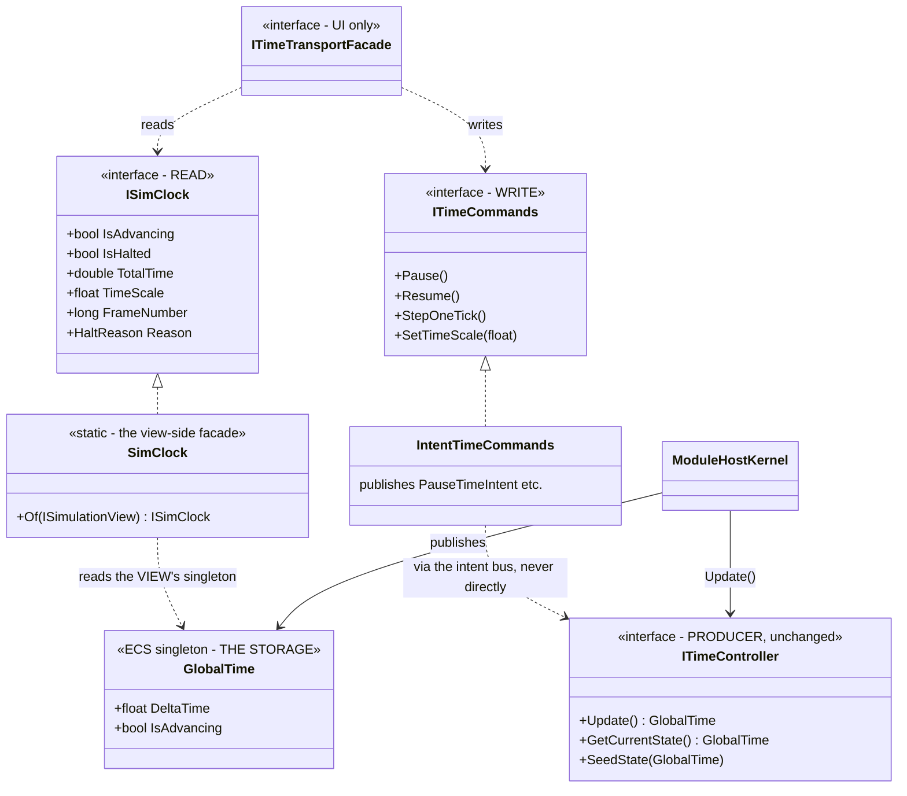
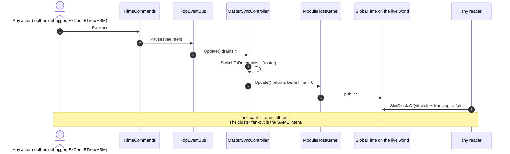
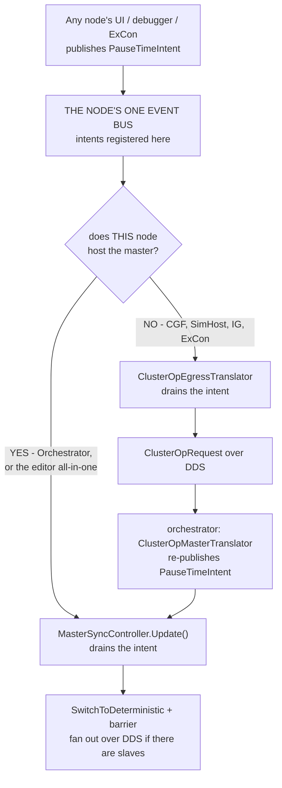
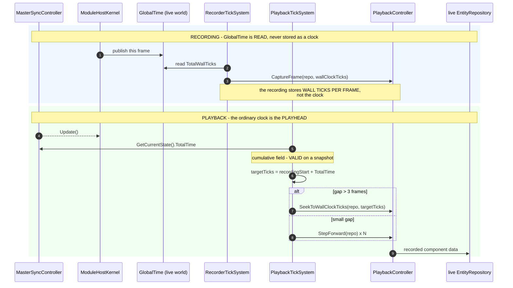

<!--STATUS
state: LIVE
build-state: DESIGN
updated: 2026-08-21
current-answer: §2–§4 AS-IS (measured) · §6–§7 TARGET · §8 refactors · §9 probes · §10 replay.
  ⭐ AS-12 RESOLVED (§9): the editor's master belongs on the bus the intents live on.
  ⭐⭐ §9b: TimeControlIntegrationTests is the regression net -- it RUNS (BP-378 rotted) and its
  baseline is 4/6. AS-14: a step is silently dropped while ACKs are outstanding.
stale-below: nothing.
known-rot: none.
known-conflict: none. ⚠ This is the TIME subsystem in full; DESIGN_Time_And_Write_Architecture.md
  is the WRITE path and cites this one for time. Where they overlap, this file is the time authority.
roadmap: PLAN_Time_System_Refactor.md -- the ORDER. TC-1..TC-8 here are T1..T7 there, and T0
  (make the integration net work) blocks all of them.
-->
# ⭐⭐⭐ Time — **control and reporting: how it works now, and how it should**

> ⛔⛔⛔ **NOTHING IN §8 STARTS UNTIL `T0` IS GREEN** — 📄 **[`PLAN_Time_System_Refactor.md`](PLAN_Time_System_Refactor.md)**.
> 🔒 **User, `2026-08-21`:** *"the integration tests are the most important thing we need to make working
> before we touch any time monitoring/control related code."*

> ⭐⭐ **Why this exists** *(user, `2026-08-21`)*: *"we need design docs with mermaids about how the time
> reporting and time control works now (and what the apis look now) and how it should be working."*
>
> ⛔ **The write-path document answers "when may bytes land".** ⭐ **This one answers "who owns time, who
> may change it, and who may ask what it is."** 📌 The 12 pause notions are a **symptom**; this is the
> subsystem that produced them.

---

## 1. ⭐⭐ INVENTORY

Graph `home-user-HROT` @ `ac7860dd8`. ⭐ **Every claim below is from a read or a grep named here.**

| # | what | result |
|---|---|---|
| I1 | `search_graph(".*(IsPaused\|IsFrozen\|IsStopped\|PausedBy).*")` | **91** declarations → **12** production notions |
| I2 | `grep "TimeControllerFactory.Create\|new MasterSyncController\|new SlaveSyncController\|new SteppingTimeController\|SetTimeController"` | **the process topology — §2** |
| I3 | reads: `ITimeController` · `ISteppableTimeController` · `IEngineDebugTimeController` · `ITimeTransportFacade` · `ITimeControlGateway` · `MasterSyncController` · `SlaveSyncController` · `TimeControllerFactory` · `GlobalTime` · `ModuleHostKernel.UpdateInternal` · `ClusterMaster` · `ClusterUiCache` · the 3 transport implementations | **the API surface — §3** |
| I4 | `grep "SuspendGlobalTimePush\|SetSingletonUnmanaged(new GlobalTime"` | **4 suspend sites · 3+ singleton writers** |
| I5 | ⭐ **executable** — `ThePauseFlagOnTheClockIsFalseWhilePausedTests` *(4 tests)* | ⭐ the mode/delta claims are **measured**, not read |

---

## 2. ⭐⭐⭐ AS-IS — **who owns a clock**



> ## ⭐⭐⭐ THE EDITOR IS NOT A SECOND MASTER — **corrected `2026-08-21` by the user**
> ⛔⛔ **My first edition called it *"a SECOND master"*. That was wrong**, and it is the same failure mode
> as *"two roles"*: a composition fact inflated into an architectural anomaly.
>
> 🔒 **User, verbatim:** *"editor IS the cluster, there is no second parallel master, it is just a
> different composition of the building blocks into an all-in-one editor system, but not changing or
> weakening any distributability rules… it is still the single concept that should exist with no
> exceptions."*
>
> | ⭐ so the rule is ONE, and it holds everywhere | |
> |---|---|
> | ⭐⭐ **exactly one time master per cluster** | ⭐ the editor **hosts that role itself** because it *is* the whole cluster, in one process |
> | ⭐⭐ **the wire is absent, not bypassed** | ⛔ **no distributability rule is weakened** — there are simply no other nodes to serve. 🔒 *"network is reserved for the cgf node if running network-distributed together with other nodes"* |
> | ⛔ **so `AS-12` is a WIRING GAP in one composition** | ⚠ **not evidence of a second concept.** ⭐ It still blocks `TC-3`, and it is still real |

> ### ⭐⭐ AND THE DESIGN PRINCIPLE THAT FOLLOWS — **build the BLOCKS, not "the editor case"**
> 🔒 **User:** *"as the cgf-editor unifications are planned for future (UX session docs), we could try to
> focus on the editor where isolated from the rest - but it might not be feasible as many parts are
> shared and they will need to be shared much more in order to be able to run the debugging on the cgf
> node (non-editor)."*
>
> ⇒ ⭐⭐⭐ **Every target API in §6 must be usable by the CGF node unchanged.** ⛔ An "editor-only" time
> read or an "editor-only" command surface would have to be built twice — 📌 and *"we need a shared X"*
> in this codebase almost always means **X exists and is under-adopted**, which is exactly what §5 found.

### ⭐ The master's own states — **and a pause is TWO-PHASE**



⭐⭐ **Measured by rail.** ⇒ ⛔ **`GetMode()` is late; `DeltaTime` is prompt.** 📌 `M-42`.

---

## 3. ⭐⭐⭐ AS-IS — **the API surfaces**



### ⛔ Five separate reporting surfaces, and they disagree

| # | surface | what it really answers | ⚠ |
|---|---|---|---|
| **①** | ⭐⭐ **`GlobalTime` on the live world** | **what the frame the simulation just ran did** | ⭐ **the only per-frame truth** — ⛔ and it had **zero production readers** until `2026-08-21` |
| **②** | `ITimeController.GetCurrentState()` | **cumulative position + settings** | ⛔ delta is **always 0** — it is a snapshot, not a reading |
| **③** | `ITimeTransportFacade.IsPaused` | **3 implementations, 2 of them byte-identical** — §4 | ⚠ editor arm reads `GetMode()` ⇒ **late by the barrier window** |
| **④** | `IEngineDebugTimeController.IsPausedByDebugger` | `GetMode() == Deterministic` | ⛔ a **MODE**, not a pause; true while merely planning |
| **⑤** | `ClusterUiCache.IsPaused` · `ClusterTimeTransportAdapter._isPaused` | **a REMOTE observation** off `SwitchTimeModeEvent` | ⭐ legitimately cached — ⚠ but **two independent caches of the same event** |

---

## 4. ⭐⭐⭐ AS-IS — **the control paths, and there are FOUR**

```mermaid
sequenceDiagram
    autonumber
    actor U as Operator
    participant CM as ClusterMaster
    participant BUS as FdpEventBus
    participant MSC as MasterSyncController
    participant DDS as DDS
    participant SL as Slave nodes

    rect rgb(238,246,255)
    Note over U,SL: PATH A - the CLUSTER path (correct shape)
    U->>CM: ClusterOpRequest PauseTime
    CM->>BUS: SlaveNodeSetUpdatedEvent + PauseTimeIntent
    Note over CM: time ops BYPASS 2PC by design
    BUS->>MSC: Update() drains the intents
    MSC->>MSC: SwitchToDeterministic(roster)
    MSC->>DDS: SwitchTimeModeEvent (barrier wall ticks)
    DDS->>SL: every node stops at the SAME wall tick
    end
```





| path | who | shape | ⚠ |
|---|---|---|---|
| **A** ⭐ | ExCon / operator UI → `ITimeControlGateway` → `ClusterMaster` | ⭐⭐ **intents on the bus**, drained by the master, fanned out over DDS with a **wall-clock barrier** | ⭐ **the right shape** |
| **B** ⛔ | editor toolbar → `EditorTimeTransportAdapter` | ⛔ **direct method call** on the editor's own controller | ⛔ **bypasses the intent bus entirely** |
| **C** ⛔ | breakpoint / debugger → `IEngineDebugTimeController` | ⛔ **direct method call**, empty slave roster | ⛔ 🔒 `R-126`: this is the one that must go cluster-wide |
| **D** ⚠ | `AiTracerCoordinator.RequestPause/Continue/StepOneTick` *(BTree · HSM)* | ⛔⛔ **virtual NO-OPS** — production builds the base class *(`EditorSubsystem:750`)* | 🔴 📌 `AS-9` / `R-67` |

### ⛔⛔ `AS-11` — **a measured duplicate: `EditorTimeTransportFacade`**

📐 `diff` of `EditorTimeTransportFacade` vs `EditorTimeTransportAdapter`: **identical apart from the
name, the accessibility, and three null-guards.** ⭐ **Only the Adapter is constructed**
*(`TimeControlStatusBarSection:31`)*.
⚠ **Checked `.dev/` before saying so** *(the `2026-08-15` rule)* — the record is `.dev/main-toolbar-1/`
Batch 24, which introduced the facade; ⛔ **no record explains why both survive.**
⇒ ⭐ **A ruling-9 duplicate. The Facade is dead** — but 📌 **the right verdict is ROUTE-OR-DELETE decided
by name**: the *public* one has the better name and the null-guards; the *internal* one is the one
wired. ⛔ **Do not delete the wrong half.**

---

## 5. ⭐⭐⭐ WHY IT PRODUCED TWELVE NOTIONS — **the root cause, stated once**

| ⭐ | |
|---|---|
| **①** | ⛔ **there is no READ API.** ① is a raw ECS singleton lookup; every consumer that wanted a *question answered* — *"is it stopped?"* — **invented its own** |
| **②** | ⛔ **the one convenience flag that exists is wrong.** `GlobalTime.IsPaused` is `TimeScale == 0`, and no pause path sets that ⇒ **everyone who tried the obvious thing got a dead flag and wrote their own** |
| **③** | ⛔ **control is not uniform.** Path A goes through intents; B, C and D call methods directly ⇒ **a state change on one path is invisible to observers of another** |
| **④** | ⚠ **two legitimate remote observations** *(⑤)* look like the same kind of thing as the four local guesses ⇒ **"do not cache" gets applied to the wrong ones** |

⇒ ⭐⭐⭐ **The twelve are not carelessness. They are what happens when a subsystem has a WRITE API and no
READ API.**

---

## 6. ⭐⭐⭐ TARGET — **the APIs**



| ⭐⭐ the three-way split | |
|---|---|
| ⭐⭐⭐ **PRODUCER — `ITimeController`** | ⭐ **unchanged.** It computes this node's frame time and hands it to the kernel. ⛔ **Nobody outside the kernel calls `Update()`, and nobody asks it questions** |
| ⭐⭐⭐ **STORAGE + READ — `GlobalTime` behind `ISimClock`** | ⭐ **one named read surface**, taking an `ISimulationView` so a caller cannot accidentally ask the wrong world. ⛔ **`IsAdvancing`, never `IsPaused`** |
| ⭐⭐⭐ **CONTROL — `ITimeCommands`, intents only** | ⭐ **paths B, C and D become path A.** ⛔ No direct `SwitchToDeterministic` outside the controller ⇒ 🔒 **`R-126`'s cluster-wide debugger pause comes free**, because the intent already fans out |

### ⭐ `HaltReason` — **why it is stopped, not just that it is**

⭐ `Running` · `PausedByOperator` · `SteppingHeld` · `HeldByBreakpoint` · `NotPublishing` *(replay
preparation — 📌 `AS-10`)*. ⛔ **Derived, never latched.** ⚠ **This is the field that would have made
every one of the twelve notions unnecessary**: each of them existed to answer *"why"*, and `bool` could
not.

---

## 7. ⭐⭐ TARGET — **one pause, one shape**



⭐⭐⭐ **The property this buys:** ⛔ **there is no way to change time that a reader cannot see**, because
there is exactly one way to change it and exactly one place it is reported.

---

## 8. ⭐⭐ THE REFACTORS *(this document's own; the write-path list is separate)*

| # | | feasibility | 📐 |
|---|---|---|---|
| **`TC-1`** | ⭐⭐ **`ISimClock` + `SimClock.Of(view)`**, and `GlobalTime.IsAdvancing` | ✅ **PROVEN** | one property + one static; 📌 `RF-1` in the write-path doc is its first half |
| **`TC-2`** | ⭐ **retire the duplicate** `EditorTimeTransportFacade`/`Adapter` → one class | ✅ **PROVEN** | `AS-11`; ⚠ keep the better name + the null-guards |
| **`TC-3`** | ⭐⭐ **`ITimeCommands`, intents only** — path B onto it | ✅ **UNBLOCKED — §9 `AS-12`** | ⭐⭐ **one line**: put the editor's master on the bus the intents live on, as every other node does |
| **`TC-4`** | ⭐⭐⭐ **path C (debugger) onto `ITimeCommands`** | ⭐ **follows `TC-3`** | ⚠⚠ **RESCOPED:** in the editor composition this is **already satisfied** — one process, one master. ⭐ **The target is the CGF NODE running distributed**, where the same command surface must fan out. 🔒 `R-126`; 📌 UX Ruling 62 |
| **`TC-5`** | ⭐ **path D — hand the BTree/HSM coordinator a real controller** | ✅ **PROVEN** | `AS-9`; the caller holds it |
| **`TC-6`** | ⭐ **`HaltReason`** | ⚠ **design owed** | needs `AS-10`'s `NotPublishing` exposed from the kernel |
| **`TC-7`** | ⚠ **collapse the two remote caches** *(`ClusterUiCache` · `ClusterTimeTransportAdapter`)* | ⚠ **UNKNOWN** | ⛔ **not probed** — they may serve different processes |
| **`TC-8`** | ⚠ **`IsPausedByDebugger` retires into `ISimClock`** | ✅ **PROVEN** | it is a `GetMode()` read with 3 call sites |

---

## 9. ⭐⭐⭐ THE TWO PROBES — **run, and one of them BLOCKS `TC-3`**

### ⭐⭐⭐ `AS-12` — **RESOLVED. There IS a uniform pattern, and the editor is the only node that deviates**

> 🔒 **User, `2026-08-21`:** *"how (what bus) is PauseIntent sent now in cgf/simhost nodes? editor should
> not be different. cgf and editor will need to be almost identical to fulfil the future need of
> debugging on cgf."*
>
> ⭐⭐ **Measured, and the question was the right one.** ⛔ **My earlier "three options with a lean toward a
> bridge" is WITHDRAWN** — a bridge would have invented a mechanism **no node has.**



⭐⭐⭐ **ONE intent · ONE bus per node · TWO possible drainers, chosen by the node's ROLE.** 📌 That is
precisely *"a single concept, differently composed"* — ⛔ **there is no second mechanism anywhere.**

### 📐 The measurement, per node

| node | the node's bus | who **publishes** the intent | who **drains** it |
|---|---|---|---|
| ⭐ **Orchestrator** | **`_bus`** — `RegisterAll(_bus)` *(`:111`)* | `ClusterMaster` · `ClusterScenarioPanel` · the replay managers · `ClusterOpMasterTranslator` | ⭐⭐ **`MasterSyncController(_bus, …)`** *(`:146`)* — **the same bus** |
| ⭐ **CGF · SimHost · IG · ExCon** | ⭐ **`HrotNodeContext.EventBus`** *(`HrotNodeBuilder:99`)* — ⭐⭐ **and the time controller is created on it** *(`:109-110`)* | `ClusterTimeTransportAdapter` — CGF gets `_context.EventBus` *(`CgfSubsystem:731`)*, SimHost `OrchestrationEventBus` *(`:262`)* | ⭐⭐ **`ClusterOpEgressTranslator`** *(`:55`, `:63`)* → `ClusterOpRequest` over DDS. ⛔ `SlaveSyncController` drains only `AdvanceFrameIntent` — ⭐ **a slave takes its mode from the wire, by design** |
| ⛔⛔ **EDITOR** | ⛔ **`_orchestrationBus`** carries the registry *(`:686`)* … | *(nothing)* | ⛔⛔ **… but the master is on `_world.Bus`** *(`:715`)* |

⇒ ⭐⭐⭐ **The rule every other node follows: THE TIME CONTROLLER LIVES ON THE BUS THE INTENTS LIVE ON.**
⛔ **The editor is the only place those are two different objects.**

### ⭐⭐ ⇒ THE FIX — **one line, and it is "do what the Orchestrator does"**

| ⭐ | |
|---|---|
| ⭐⭐⭐ **Construct the editor's `MasterSyncController` on `_orchestrationBus`**, not `_world.Bus` | 📌 identical to `OrchestratorSubsystem:146`; ⭐ **no new mechanism, no bridge, no second registry** |
| ⭐⭐ **Then paths B, C and D publish intents like everyone else** | ⇒ `TC-3` **unblocks**, and 🔒 **the CGF node gets the same code**, which is the stated requirement |
| ⚠ **and the editor needs NO egress translator** | ⭐ it hosts the master, so it drains directly — ⛔ exactly the `YES` arm of the diagram |

### ⚠ Two smaller findings the same sweep turned up

| ⚠ | |
|---|---|
| **①** | ⛔ **CGF and SimHost hand `ClusterTimeTransportAdapter` DIFFERENT buses** — `_context.EventBus` vs `OrchestrationEventBus`. ⭐ **CGF's is correct** *(it is the bus its controller and the egress translator use)*; ⚠ **SimHost's needs checking** — ⛔ **not measured**, and it is a one-line question worth answering before `TC-3` |
| **②** | ⚠ **`HrotNodeBuilder` never calls `OrchestrationEventRegistry.RegisterAll`** on the bus it creates. ⭐ CGF's `CgfApplication:115` registers on a **different** bus (`_orchestrationBus`) ⇒ ⛔ **whether the intent types are registered on the bus that actually carries them is UNVERIFIED** — 📌 **probe it with `TC-3`, not before** |

### ⭐ `TimeSystem` *(`Fdp.Core`)* — **LEGACY, not a competing writer**

📐 `grep "new TimeSystem("` ⇒ **one non-test construction: `Fdp.Examples.Showcase`.**
⇒ ⭐⭐ **It is NOT in the HROT path.** ⛔ Correcting an earlier note of mine that listed it among the
singleton's authors: **true across the repo, false for HROT.** ⚠ In HROT the singleton has exactly
**two** writers — `ModuleHostKernel.UpdateInternal` and `SimHostNodeBootstrapper`'s seed.

---

## 9b. ⭐⭐⭐ THE REGRESSION NET — **it EXISTS, it RUNS, and it is 4/6 GREEN** *(user, `2026-08-21`)*

> 🔒 **User:** *"these changes start to have very big blast radius… the cluster runner has an integration
> test suite where multiple cluster runner subsystems are instantiated in a single process and
> communicating over the network as if on different computers. We should use these to verify if the time
> control during the refactoring still works as it used before."*
>
> ⭐⭐⭐ **Correct, and better than expected — but the first thing I had to check was whether it can run
> at all**, because `BP-378` excludes this suite from every gate.

### ⭐⭐ `AS-13` — **`BP-378` HAS ROTTED: the suite runs when FILTERED**

📐 **Measured `2026-08-21`, on this branch:**

```
dotnet build Hrot.ClusterRunner.Integration.Tests --no-restore      → 0 errors, 88 s
dotnet test  --no-build --filter "FullyQualifiedName~TimeControlIntegrationTests"
                                                                   → 4 passed / 2 FAILED, 38 s
```

⇒ ⛔ **No OOM. No hang.** ⭐⭐ **The net the user remembered is available TODAY**, at least per class.
⚠ **Stated exactly:** ⛔ **I did NOT run the whole suite** — 📌 `BP-378`'s claim about the *full* run is
**untested**, and only the **filtered** run is proven.

### ⭐ What it covers — **`TimeControlIntegrationTests`, 6 tests over REAL subsystems**

⭐⭐ Drives an `_orchestratorSvc` and a `_simHost` through `MockNetworkFactory` — ⭐ **a real
`ClusterOpRequest` → intent → `MasterSyncController` → DDS → slave round trip**, pumped until settled.

| ✅ | pause ⇒ sim time freezes ⇒ resume ⇒ advances |
| ✅ | multi-cycle pause/resume, every cycle |
| ✅ | ⭐⭐ **`PauseResume_SimHostKernelRestoresMasterTimeController`** — asserts the slave is still a `SlaveSyncController` in `Continuous` after each cycle |
| ✅ | second-cycle pause/step |
| ⛔ | **`PauseStepResume_SimTimeAdvancesByStepAmount`** — *"should have advanced ~3s after 3 steps; actual delta=**1.000s**"* |
| ⛔ | **`MixedSequence_PauseStepPauseStep_AllCorrect`** — *"expected ~2s advance; got **1.000s**"* |

### ⛔⛔ `AS-14` — **the two reds are ONE pre-existing defect: a STEP IS SILENTLY DROPPED**

📐 `MasterSyncController.Step` *(`:188-195`)*:

```csharp
if (_mode != MasterMode.Stepping) return GetCurrentState();
if (_pendingAcks.Count > 0)       return GetCurrentState();   // ⛔ the step is LOST, not queued
```

⇒ ⭐⭐⭐ **N steps produce ONE step's worth of time.** ⚠ The blocking is **documented and deliberate**
*("Blocked while the previous step's ACKs are still outstanding")* — ⛔ **but the caller gets NO signal
and the request is DISCARDED rather than queued**, and the test settles between steps, so either the
settle is too short or **the slave never ACKs in the harness**. ⭐ **Root-causing it is the
implementation session's**; ⚠ **the measurement and the hypothesis are here.**

| ⭐ **PRE-EXISTING — the basis** | ⛔ **no production file under `FDP/…/Time/`, `Hrot.Orchestrator`, `MasterSync*`, `SlaveSync*`, `ClusterMaster` or `ModuleHostKernel` has been touched on this branch.** ⭐ Provable by construction, not by a worktree |
|---|---|

### ⭐⭐⭐ AND WHY THIS MATTERS TO THE REFACTOR — **it gets WORSE, not better**

⛔⛔ **`TC-3`/`TC-4` route the toolbar and the debugger through INTENTS.** ⚠ **Intents can be published
faster than ACKs return** ⇒ **a dropped step becomes MORE likely, not less.** ⇒ ⭐⭐ **`AS-14` is not an
unrelated red to note — it is a HAZARD the control refactor walks into**, and it should be fixed
*before* `TC-3`, or at minimum baselined and re-checked after every step of it.

### ⭐⭐ ⇒ THE RULE FOR EVERY BATCH IN THIS PROGRAMME

> ⭐⭐⭐ **`TimeControlIntegrationTests` is a GATE ROW from now on**, filtered, with its **before/after
> counts**. ⛔ **4/6 is the baseline.** ⚠ **A third red is a regression the batch caused**; ⭐ **a green
> on `PauseStepResume` is a FIX and must be reported as one.**

---

## 10. ⭐⭐⭐ THE REPLAY CLOCK — **mapped, and there is NO third authority**

> ⭐⭐ **The good news first:** ⛔ **replay does not have a clock.** 📐 It is a **consumer** of the ordinary
> one plus a **frame index keyed by wall ticks.** ⇒ my earlier *"a third time authority"* caveat is
> withdrawn.



### ⭐ The four pieces, measured

| piece | what it is | ⚠ |
|---|---|---|
| ⭐⭐ **`PlaybackTickSystem`** *(`PostSimulation`)* | ⭐⭐⭐ **the playhead IS `ITimeController.GetCurrentState().TotalTime`** — a **cumulative** field, ✅ **valid on a snapshot** *(unlike the delta)*. Converts it to an absolute tick and seeks or steps | ⭐ **a correct use of `GetCurrentState()`** — worth noting, since the delta use was not |
| **`RecorderTickSystem`** | reads `GlobalTime.TotalWallTicks` to stamp each frame | ⛔ **`GlobalTime` is never RECORDED**, only read |
| **`ReplayProcessManager` · `ReplaySeekProcessManager`** | end-of-replay and seek detection, then ⭐ **`PauseTimeIntent`** — the ordinary control path | ⭐⭐ **replay is controlled by PATH A**, not a private one |
| ⚠ **`ReplayBrowserContext.SandboxRepo`** | ⛔⛔ **a bare `EntityRepository` with NO kernel and NO time controller** | ⇒ it has **no clock at all**; readers guard with `HasSingletonUnmanaged<GlobalTime>()` and fall back — 📌 which is why that guard exists |

### ⚠ Two consequences worth writing down

| ⚠ | |
|---|---|
| **①** | ⛔ **During playback the `GlobalTime` in the repo is the LIVE clock's, not the replayed frame's.** ⭐ `TotalTime` is coherent *(it IS the playhead)*, ⚠ **but `FrameNumber` and `TotalWallTicks` are live** — ⛔ **anything correlating `TotalWallTicks` with replayed data would be wrong.** 📐 Not currently done; ⭐ **stated so it stays not done** |
| **②** | ⭐⭐ **`AS-10`'s window is narrower than it looked.** The push suspension and `SetSystemsEnabled(false)` both span **`PrepareReplay` → `FinalizeReplay`** only — ⭐ a bounded **setup** window, ⛔ not the whole replay. `PlaybackTickSystem` is `PostSimulation`, so it is off during that window too and on afterwards |

---

## 10. ⛔ WHAT THIS DOCUMENT STILL HAS NOT MEASURED — **named, not implied**

| ⛔ | |
|---|---|
| ~~`SlaveSyncController` internals~~ | 🔒 **ruled out of scope by the user** *(`2026-08-21`: "internals of SlaveSyncController should not be important i guess")* — ⭐ its **surface** is in §3 and that is what the design needs |
| ~~the replay clock~~ | ✅ **MAPPED — §10.** There is no third authority |
| **`TC-7`** | what each of the two remote caches is for, and whether they serve different processes |

⇒ ⭐ **Suggested next: the replay clock**, because `AS-10` already showed it interacts with the write
path and it is the only remaining authority nobody has mapped.
