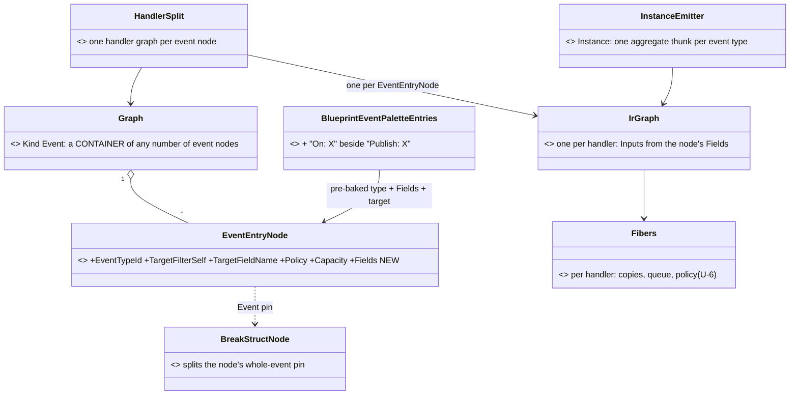
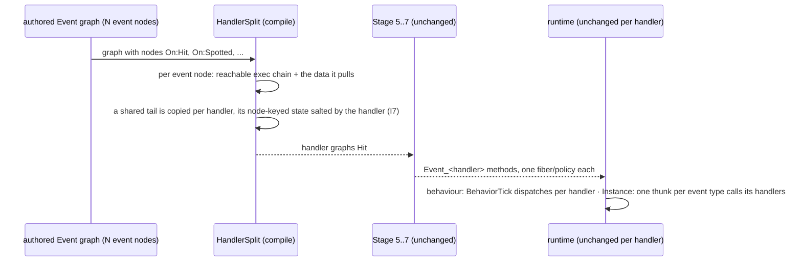
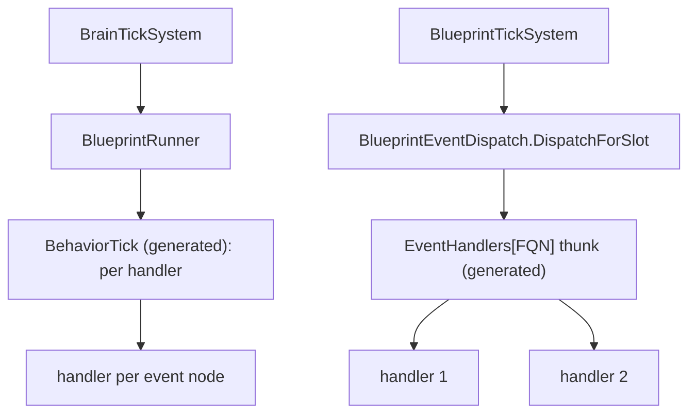
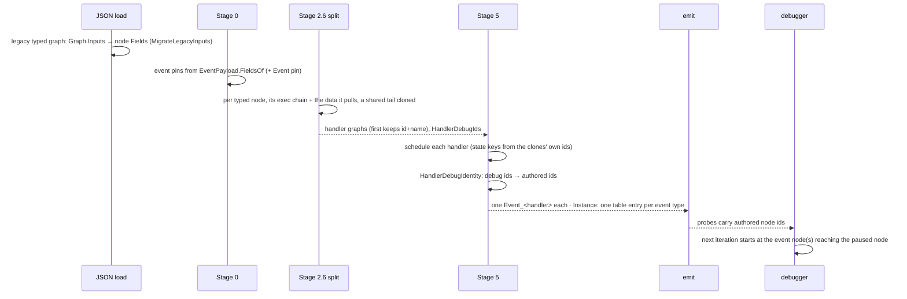

<!--STATUS
state: LIVE
updated: 2026-10-02
build-state: BUILT — E1-E6 built 2026-10-02 (CE-2010…CE-2017; batches/REPORT_Typed_Event_Nodes.md). §5 decisions
  T-1..T-8 APPROVED by the user 2026-10-02 ("approved").
current-answer: §6 (AS BUILT — the classes, the sequence, and every deviation from §3/§4). §5 is the approved decisions
  (still true). §2 is the measured inventory (its 🔴 rows I1/I4 are FIXED, §6).
stale-below: §3's class diagram is the PRE-BUILD target: superseded by §6.1 (it named no EventPayload, no Stage 2.6,
  no debug-id remap, and put the split "before Stage 5" without saying where).
known-rot: none.
known-conflict: docs/projects/relationships/Blueprint-Scripting-System.md:391 says "Each graph has exactly one entry
  node" — SUPERSEDED for Event graphs by this document (and the code never enforced it: §2 row I1).
related-designs:
  - Custom_Events_Design.md — owns bus-event pub/sub (discovery, PublishEvent, dispatch §4.6, §7). This document
    reshapes its SUBSCRIBE side (§4.5, build items 4a/4b, now closed) from "one entry per Event graph" to typed event nodes.
  - Architect_Question_14_Custom_Events_PubSub.md — owns the approved rulings (A: reflection discovery, A2: migrate
    system events, C: the entry node IS the subscription primitive, D: dispatch). Honoured; C is generalised.
  - DESIGN_Unified_Behaviour_Run.md — owns fibers and the U-6 event policies (§4a S6a/S6b). Every typed event node
    becomes one handler there, unchanged.
  - Architect_Question_23_Graph_Create_And_Switching.md — owns graph creation (Function/custom-event bodies born with
    one empty EventEntryNode). Those graph kinds keep exactly that.
-->

# Typed event nodes — any number of events handled in one graph

> 🔒 **User, 2026-10-02:** *"having one single event ONLY in a graph is very restrictive, why can't we have any number
> of events handled by one graph, just by adding typed-event nodes? (node that is configured for certain type and fire
> its exec pin when event comes, another pin to get the event data)"* · *"yes, but measure and document it first"*

## 1. Why

Today an Event graph IS one subscription: the graph carries the event's inputs (`Graph.Inputs`) and the compiler
takes the graph's first entry node. Many events therefore means many graphs, and a second event node dropped into
a graph is **silently ignored** (§2 I1).

## 2. INVENTORY *(measured 2026-10-02: codebase-memory `search_code` — 132 files, 898 matches for
`EventEntryNode|GraphKind.Event|IrGraphKind.Event|EventTypeFqn`; production sites read one by one; design corpus swept
by a read-only agent over `docs/` + `.dev/`)*

| # | fact | where |
|---|---|---|
| I1 | 🔴 the entry of an Event graph is `OfType<EventEntryNode>().FirstOrDefault()` — **a second event node is silently dropped**, no diagnostic | `Stage2_Validate.cs:434` (`V_GraphStructure.FindEntryNode`), used by `Stage5_Schedule.cs:336` |
| I2 | an Event graph's payload is GRAPH-level: `Graph.Inputs` → `IrGraph.Inputs` → the event method's parameters; the entry node's data-out pins are projected from `Graph.Inputs` | `Stage5_Schedule.cs:372`, `Stage0_Rehydrate.cs:266-279`, `NodePinSchema.cs:266` |
| I3 | event identity, Self filter, policy and capacity are copied from the ONE entry node onto the IR graph | `Stage5_Schedule.cs:408-419` |
| I4 | 🔴 an **Instance** registers handlers in a dictionary keyed by event FQN with index-initialiser syntax ⇒ two Event graphs on the same event in one asset: **the later silently overwrites the earlier** (C# indexer semantics) | `CSharpEmitter.cs:698`; corpus: the same overwrite is recorded for empty ids only (`Blueprint_Issues_Detail.md:1672`, BP-70) |
| I5 | a **behaviour** dispatches per graph inline (`__EvtId_{Graph}`), so two graphs on one event both fire | `InstanceEmitter.cs:723` (`BehaviorTick`) |
| I6 | per-handler storage (fiber record, copies, queue) and the U-6 policy are per IR graph | `Lowering/Fibers.cs`, `InstanceEmitter.EmitFiberDispatch` |
| I7 | node-identity-keyed state inside a handler: Run Behaviour site key (`SiteId` = node id), `When` memory (`_when_<8hex>_prev`), debug probes (`SourceNodeId`) | `InstanceEmitter.RunSiteField`, `WhenLowering_Instance.cs:98`, `DebugProbeInsertion.cs:24` |
| I8 | the editor palette has **"Publish: X" per discovered event, but no "On: X"** — subscribing is a generic *Event Entry* node + a typed `EventTypeId` + hand-declared inputs in the signature window | `BlueprintEventPaletteEntries.cs`, `BlueprintNodePaletteEntries.cs:106`, `BlueprintCommandSink.cs:1251`, `GraphSignatureWindow.cs:298` |
| I9 | system events (`HitEvent`, `BehaviorFinishedEvent`, … 25 in `BuiltInEngineEventCatalog`) reach the **When** node only; Q14-A2 (migrate them to reflection) is approved and not built | `BuiltInEngineEventCatalog.cs`; `Custom_Events_BUILD_TRACKER.md:12` (1f ⏸) |
| I10 | `EventEntryNode` is ALSO the entry indicator of Function, custom-event (`CustomEventDecl`) and Macro graphs | `Stage2_Validate.cs:439`, `BlueprintDocumentFactory.cs:2226`, `MacroExpander.cs:134` |
| I11 | the debugger's step-over finds "the" entry with `FirstOrDefault` | `BlueprintDebugSession.cs:1401` |
| I12 | a whole-struct value can already be split: `BreakStructNode` (baked fields → one data-out each) | `Nodes.cs:1160` |

**Design corpus** *(agent sweep, quoted)*: the only rule is `Blueprint-Scripting-System.md:391` — *"Each graph has exactly
one entry node"* (a validator description the code does not enforce, I1). Q14-C (`Architect_Question_14…:96-98`) says
*"Any number of blueprints/graphs may declare an entry for the same event type"* — about subscribers, silent on entries
per graph. No doc rules on two subscribers to one event inside one asset. ⛔ searched `docs/`+`.dev/` for an Unreal-style
multi-event graph: none found.

## 3. The target *(pre-build — ⛔ the class diagram is superseded by §6.1)*

*What it shows that prose hid:* the runtime model does not change — a handler is still one IR graph with its own fiber
storage and policy. Only the AUTHORED shape changes, and the split turns it back into handlers before scheduling.

*Who calls each frame:* behaviours through `BrainTickSystem` (I5); Instances through `BlueprintTickSystem` →
`BlueprintEventDispatch` (`BlueprintTickSystem.cs:147`), whose table is keyed by event type — so an Instance needs ONE
thunk per event type that calls every handler of that type (I4), never two entries for one key.

## 4. Slices *(one commit each, green at each)*

| # | slice | delivers |
|---|---|---|
| E1 | stop the silent drops (rails first) | a second event node in an Event graph is a diagnostic until E2 lands; two handlers on one event type in an Instance stop overwriting each other (I1, I4) |
| E2 | the split + payload on the node | `EventEntryNode.Fields` (baked like `PublishEventNode.PayloadFields`; a legacy single-entry graph migrates `Graph.Inputs` onto its node on load); `HandlerSplit` before Stage 5; shared tails salted (I7); the diagnostic from E1 lifted |
| E3 | whole-event pin | one `Event` data-out pin typed as the event struct, beside the per-field pins; split with `BreakStructNode` |
| E4 | editor subscribe UX | "On: X" palette entries per discovered event (mirror of "Publish: X"); the node's pins come from its Fields; per-node Policy/Capacity in the details panel. Closes `Custom_Events_BUILD_TRACKER` 4a/4b |
| E5 | Q14-A2 | system events discoverable for "On: X" (and the When node) from one source |
| E6 | debugger | step-over and probes per handler (I11) |

## 5. Decisions — each with a lean

✅ **APPROVED by the user, 2026-10-02:** *"approved"* — every lean below as written, slices E1–E6 in order.

| # | decision | lean | rejected — one line each |
|---|---|---|---|
| T-1 | where an event's payload is declared | ⭐ on the event NODE (`Fields`), not the graph | on the graph: one graph could then hold only one payload shape — the restriction being removed |
| T-2 | how N event nodes compile | ⭐ split into one handler graph per node before Stage 5 — everything after (fibers, policies, record/replay, dispatch) is untouched | teach Stages 5–7 multiple entries: every lowering pass and the cursor model would grow a second axis for no runtime gain |
| T-3 | two event nodes feeding ONE exec chain | ⭐ allowed (Unreal allows it); the tail is copied per handler and its node-keyed state (Run Behaviour site, `When` memory) is salted by the handler; probes keep the authored node id so the debugger still lights the right node | forbid it: re-creates the restriction one level down |
| T-4 | two nodes for the SAME event type in one asset | ⭐ allowed; both fire, each with its own policy. Instance: one aggregate thunk per type calls them in authored order | last-wins (today's Instance behaviour, I4): a silent drop |
| T-5 | graph locals | ⭐ per handler (each run owns them) | shared by the graph's handlers: two events would race on one local |
| T-6 | event data | ⭐ keep the per-field pins AND add one whole-event struct pin (`BreakStructNode` splits it) | struct pin only: every read needs an extra node |
| T-7 | which graphs may hold event nodes | ⭐ Event graphs (any number). Function / custom-event / Macro graphs keep their one empty entry indicator (I10) | the Tick graph too ("Event Tick" as a node): sound later, but it changes the behaviour's finish contract (U-8) — its own question |
| T-8 | order | ⭐ E1 now (stops two silent drops), then E2–E6; before S7 (Behaviour Task node), since it changes what an Event graph is | after S7: S7's completion fibers would be built on the old shape |

## 6. AS BUILT *(2026-10-02, CE-2010…CE-2017)*

### 6.1 Classes

```mermaid
classDiagram
  class EventEntryNode { <<EXISTS, widened>> +EventTypeId +TargetFilterSelf +TargetFieldName +Policy +Capacity +Fields +MaxCapacity }
  class EventPayload { <<NEW, static>> +IsTyped() +FieldsOf() +WholeEventPinName() +WholeEventInput +MigrateLegacyInputs() }
  class Stage2_6_SplitEventHandlers { <<NEW>> one handler graph per typed event node }
  class GraphFragmentCloner { <<EXISTS, widened>> +Clone(nodes, links, freshId) }
  class Graph { <<EXISTS, widened>> +HandlerDebugIds (compile-time) }
  class HandlerDebugIdentity { <<NEW>> rewrites a handler's debug ids }
  class InstanceEmitter { <<EXISTS, widened>> +EventHandlerGroups() +EventTableThunk() }
  class BlueprintEventPaletteEntries { <<EXISTS, widened>> +SubscribeEntries() }
  class UnifiedEventDiscovery { <<EXISTS, widened>> + system events }
  class EventEntryNodeDrawer { <<NEW>> Policy · Capacity · Self/Any }
  class BlueprintDebugSession { <<EXISTS, widened>> +EntriesReaching() }
  Stage2_6_SplitEventHandlers --> EventPayload : payload + whole-event input
  Stage2_6_SplitEventHandlers --> GraphFragmentCloner : shared tail, deterministic ids
  Stage2_6_SplitEventHandlers --> Graph : handler graphs + HandlerDebugIds
  HandlerDebugIdentity --> Graph : reads HandlerDebugIds
  BlueprintEventPaletteEntries --> UnifiedEventDiscovery
  BlueprintEventPaletteEntries --> EventEntryNode : On X bakes Fields
  EventEntryNodeDrawer --> EventEntryNode
```

### 6.2 Sequence — one authored graph to handlers, and back to the debugger

### 6.3 What was built, and where it deviates *(⭐ each a finding, argued in the report)*

| slice | built | ⚠ deviation from §3/§4 — and why |
|---|---|---|
| E1 | `BP1682` on an extra event node; Instance: one handler-table entry per event key, a `EventGroup_<first>_Thunk` for 2+ handlers | none |
| E2 | `EventEntryNode.Fields`; `EventPayload` owns "which payload" for Stage 0 + `NodePinSchema`; load-time `MigrateLegacyInputs` (not for custom-event bodies, paired by name, BP1408); `Stage2_6_SplitEventHandlers`; `BP1683` (a handler reading another event's pin) | ⭐ the split runs at **Stage 2.6** — after macro expansion (a macro may sit in a shared tail), before Stage 3 (so the orphan pass, literal synthesis and Stage 4 typing run per handler, clones included). §4 said only "before Stage 5" |
| E2 | `BP1682` kept only where one entry is the rule | ⚠ narrowed: it does NOT bind a second entry in a Function graph — a loose extra entry there was already an orphan (an existing rail relies on it); T-7 adds no rule for them |
| E3 | `Event` data-out typed `global::<FQN>` (`WholeEvent` if a field is named Event); wired ⇒ reserved handler input `__event`, the thunk passes `__ev`; size marked unreliable (runtime layout) | none — `BreakStructNode` splits it, as T-6 said |
| E4 | "On: {Event}" palette; `EventEntryNodeDrawer`; `GraphSignatureWindow` "n/a" for typed graphs; `BP1682` for a typed node outside an Event graph; `EventEntryNode.MaxCapacity` is the one home of 16 | none |
| E5 | `DiscoverSystemEvents`: catalog identity + reflected fields into `UnifiedEventDiscovery` (blittable, brain-visible, loaded) | ⚠⚠ **A2's full form is blocked by layering:** `[BlueprintEvent]` lives in `Hrot.Editor.AiShared`, which the FDP toolkit assemblies owning the system structs cannot reference. ⇒ the catalog stays the source of identity; the fields are no longer hand-listed. The When node keeps the catalog (a rail proves the two agree) |
| E6 | `Graph.HandlerDebugIds` + `HandlerDebugIdentity`: debug ids → authored; `EntriesReaching` for the next-iteration step | ⚠ the clones' back-reference is NOT `OriginNodeId` (E2's first cut): nothing in the editor reads `OriginNodeId`, and the macro precedent deliberately keeps the clone id on probes — a per-graph map applied to debug identities only gives authored probes without touching state keys |

⚠ **Found, not fixed:** some `DebugMapEntry.GraphId` are empty for every graph (`Stage5_Schedule.DebugOf` sets `default`) —
pre-existing, not this batch's.

