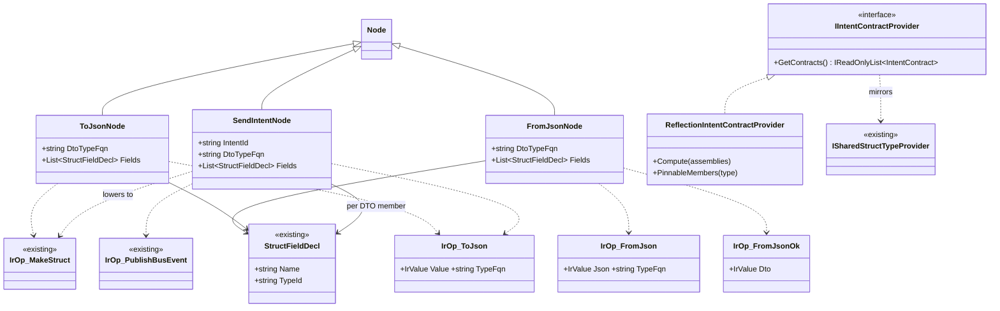
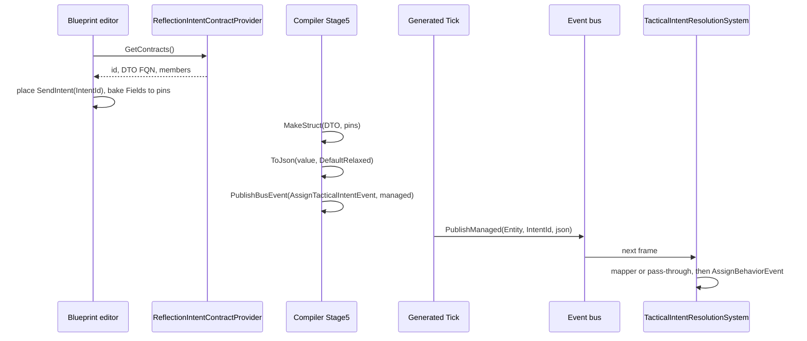
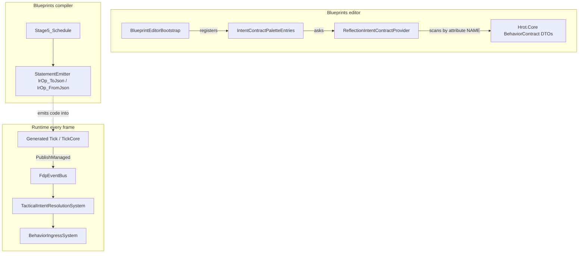

<!--STATUS
state: LIVE
updated: 2026-09-30
build-state: BUILT
current-answer: §3 (the diagrams, as built) · §4 (decisions, APPROVED 2026-09-30) · §5 (as-built deviations — read it)
stale-below: nothing; the pre-build provider shape is recorded in §5 as SUPERSEDED
known-rot: none
known-conflict: docs/blueprints/Architect_Question_6_Access_Shapes_And_Vocabulary.md Q6-C ("curated typed→JSON FunctionCall … without exposing JSON nodes") — SUPERSEDED by the user's Q78 §6 revision; this doc follows Q78
related-designs:
  - docs/blueprints/Architect_Question_78_Hill_Attack_The_Blueprint_Node_Way.md — owns WHY (§6 rows 2 and 7, §7 row 7 = CE-472); this doc owns HOW
  - docs/designs/tactical-intent/DESIGN.md — owns the intent pipeline this node feeds (AssignTacticalIntentEvent → mapper → AssignBehaviorEvent) and §4.2 "each intent has a [BehaviorContract] DTO"
  - docs/blueprints/BinaryOp_And_Boolean_Nodes_Design.md — a sibling native-node mini-design (same pin-baking/emit conventions)
-->

# Typed **Send Intent** + **To JSON / From JSON** nodes — `CE-472`

> 🔒 **User, `2026-09-30`:** *"why not typed Send Behavior Intent node taking parameters as pins, internally converting
> to Json string? … why not generic json-serializer and deserializer dto typed blueprint nodes?"* — approved as §6 rows
> 2 and 7 of [`Q78`](Architect_Question_78_Hill_Attack_The_Blueprint_Node_Way.md).

## 1. INVENTORY *(measured `2026-09-30`: codebase-memory CLI + grep, one Explore sweep)*

| what exists | where | used by this design as |
|---|---|---|
| `AssignTacticalIntentEvent { Entity, IntentId, JsonParams }` — managed class | `FDP/Toolkits/Fdp.Toolkits/Behavior/Events/AssignTacticalIntentEvent.cs:23` | ⭐ the event the node publishes (unchanged) |
| its catalog entry, `Managed: true` (the only managed entry) | `BuiltInEngineEventCatalog.cs:218-224` | ⭐ reused — `PublishManaged` path |
| `IrOp_PublishBusEvent` (+ `PublishManaged` emit) | `IrOperation.cs:306`, `StatementEmitter.cs:718-720` | ⭐ reused |
| `IrOp_MakeStruct` — `new global::T { F = __tN, … }` | `IrOperation.cs:762`, `StatementEmitter.cs:202-219` | ⭐ reused to build the DTO (object-initialiser syntax is valid for a class too) |
| `[BehaviorContract]` DTOs — **11**, e.g. `MoveToLocationParamsJsonDto`, `DefendAreaIntentDto` | `Hrot/Engine/Hrot.Core/MapDefinitions/Behavior/*.cs` | ⭐ the pin source |
| `BehaviorDefinition.JsonParamsDtoType`, filled from `[BehaviorContract]` by `BehaviorSchemaDiscovery` | `BehaviorRegistry.cs:262`, `:513`; `Hrot.Presentation/Behavior/BehaviorSchemaDiscovery.cs:76-80` | ⭐ the id → DTO catalog |
| `ISharedStructTypeProvider` — host-injected type discovery for Make/Break | `Hrot.Blueprints.Editor/NodeDrawers/ISharedStructTypeProvider.cs:12` | ⭐ the seam shape to mirror (the blueprint editor does not reference `Hrot.Core`) |
| `FdpJsonOptionsRegistry.DefaultRelaxed` — the options every behaviour parse uses | `FDP/Engine/Fdp.Core/Serialization/FdpJsonOptionsRegistry.cs:27`; `BehaviorParams.cs:97` | ⭐ the one serializer setting (write = read) |
| the stop-gap C# builders `MoveIntentJson.Build`, `HullDownIntentJson.Build` | `Hrot.AI.Behaviors/Brains/MoveIntentJson.cs:21`, `HullDownIntentJson.cs:22` | ⛔ what this replaces (`R-156`); retire with the twins (`CE-464`) |
| a generic JSON FunctionCall | ⛔ **none possible**: the call lookup matches by name, no generic instantiation (`Stage0_Rehydrate.cs:1410-1426`) | ⇒ a native node is required |

## 2. Claim table — what the design rests on

| claim | code — how it IS | design basis — how it was MEANT |
|---|---|---|
| intent ids and behaviour ids share ONE `[BehaviorContract]` catalog | ✅ `BehaviorRegistry.cs:513` registers every contract DTO | ✅ `tactical-intent/DESIGN.md` §4.2: *"the `BehaviorId` string matching the mapper's `TargetIntentId`"* |
| a mapper forwards `JsonParams` UNCHANGED | ✅ `HullDownAttackMapper.cs` (`JsonParams = jsonParams`) | ✅ `tactical-intent/DESIGN.md` §1.2 |
| ⚠ `"HullDownAttack"` has **no** contract DTO | ✅ measured: the 11 contracts do not include it; the helper serialises the internal `HullDownAttackParams` struct | ⛔ contradicts §4.2 — **a gap, not a design** ⇒ §4 decision D |
| generated code may hold a managed class in a local | ✅ `AssignTacticalIntentEvent` is already built in a local by `IrOp_PublishBusEvent` | — |
| a blueprint `System.String` value is supported | ✅ `Stage3_Normalize.cs:222` literal; ⚠ **not stored**: variables/state are unmanaged | ⇒ decision B: JSON never lands on a wire that is stored |

## 3. The design — diagrams

### 3.1 Classes

*What the picture shows that prose hid: only THREE new IR ops (`IrOp_ToJson`, `IrOp_FromJson`, `IrOp_FromJsonOk`) — everything else is
existing machinery. The DTO value never appears on a wire; it lives only between `MakeStruct` and `ToJson` inside one
node's lowering.*

### 3.2 Sequence — authoring, compiling, and one runtime send

*What it shows: the node stops at the bus. Everything after it is the unchanged tactical-intent pipeline, so the
intent-vs-behaviour remapping stays the receiver's business (`tactical-intent/DESIGN.md` motivation: senders stay
agnostic).*

### 3.3 Modules — who registers what, and who calls it

*What it shows: the only new seam is the palette provider, which scans `[BehaviorContract]` by attribute NAME because the
blueprint editor cannot reference `Hrot.Core`; at runtime nothing new is registered — the existing systems carry the event.*

## 4. Decisions — ✅ APPROVED by the user `2026-09-30` ("approved, go ahead with CE-472")

| # | decision | ⭐ lean | rejected (one line each) |
|---|---|---|---|
| **A** | what the node is keyed by | **the INTENT id** (`IntentId`), pins from the `[BehaviorContract]` DTO with that id | *keyed by behaviour* — senders must stay agnostic of the recipient's behaviour (tactical-intent motivation); the mapper forwards the JSON unchanged, so the intent's DTO IS the wire schema |
| **B** | how To/From JSON meet the DTO | **per-member pins** (`ToJson`: members in → `Json` string out; `FromJson`: `Json` in → members + `Ok` out). No DTO-typed wire | *a DTO-typed pin fed by Make Struct* — the DTOs are managed classes and Make/Break only discover `[BlackboardDtoStruct]` value types; it would need a second discovery path and a managed value on a wire |
| **C** | one shared emitter | `IrOp_ToJson` / `IrOp_FromJson`, emitting `JsonSerializer.Serialize/Deserialize<T>(…, FdpJsonOptionsRegistry.DefaultRelaxed)`; `SendIntent` lowers through `IrOp_ToJson` | *a separate serializer per node* — two options objects rot apart; `DefaultRelaxed` is what every parse already uses |
| **D** | the missing `HullDownAttack` contract | ⭐ **add `HullDownAttackIntentDto` with `[BehaviorContract]`** (members = what `HullDownIntentJson.Build` writes today) before `CE-464` uses the node | *let the node fall back to a raw JSON pin* — reintroduces the stringly path `R-156` is removing |
| **E** | `FromJson` failure | `Ok = false`, members default; never throws in a tick | *throw* — a bad payload would kill the frame |
| **F** | where each node may appear | `SendIntent`: exec node, not in a resolver (side-effecting — joins `V_ResolverPurity.SideEffectingNodeTypes`); `ToJson`/`FromJson`: pure | — |

**Scope (as planned; see §5 for what changed):** 3 node classes, 2 IR ops, Stage0 pin enrichment from baked `Fields`, Stage5
lowering, emitter cases, the provider interface + a host implementation, palette entries (one row per contract),
rails (real Roslyn compile + a JSON round-trip through `BehaviorParams.FromJson`), and decision D's DTO.

## 5. As built `2026-09-30` — deviations and measured facts

| | what | why |
|---|---|---|
| ⚠ deviation | the provider is **`IIntentContractProvider` + `ReflectionIntentContractProvider` in `Hrot.Blueprints.Editor`**, matching `[BehaviorContract]` by attribute NAME — ⛔ SUPERSEDED: *"`IContractTypeProvider`, a host implementation reading `BehaviorRegistry.JsonParamsDtoType`"* | mirrors `ReflectionSharedStructTypeProvider` exactly; no host wiring, and the registry holds the same set (`BehaviorSchemaDiscovery.AuthoredContracts` scans the same attribute) |
| ⚠ deviation | **three** IR ops, not two: `IrOp_FromJsonOk` reads the parse flag the `IrOp_FromJson` emit declares (`__fjok{n}`) | an IR statement has one result; `Ok` is a second output |
| ➕ added | compile error **`BP1680`** — a Send Intent / To JSON / From JSON node with no DTO type, or a Send Intent with no intent id | said in the compiler's language, not a `CS0246` in a generated file |
| ➕ added | pinnable members = public read/write properties + public fields, not `[JsonIgnore]`, of a primitive / `string` / enum type (enum spelled `global::`) | e.g. `MoveToLocation.PickableLocation` (`PickableGeoPoint`, `[JsonIgnore]`) is left out and keeps its default |
| 📐 measured | ⛔ a `string` **cannot** be a function-graph input or output — the Library ABI marshals I/O through `MemoryMarshal.Read/Write<T>` (`CS0453` on string) | confirms decision B from the other side: JSON lives *inside* a graph, between the node that makes it and the node that consumes it |
| ✅ decision D | `Hrot.Core/MapDefinitions/Behavior/Intents/HullDownAttackIntentDto.cs` + `BehaviorNames.HullDownAttack`; `HullDownAttackMapper` now reads both names from `BehaviorNames` | members = `HullDownAttackParams`' fields minus the receiver-owned counters; defaults = the helper's constants |

**Rails** (`Hrot.Blueprints.Tests/Compiler/CE472_IntentAndJsonNodeTests.cs`): a blueprint BEHAVIOUR ticks through the real
`BehaviorIngressSystem` + `BrainTickSystem`, its Send Intent's `AssignTacticalIntentEvent` is read off the bus, and the real
`HillAttackTankNodes.ParseHullDownAttackParams` parses it — equal to the parse of the retired `HullDownIntentJson.Build`
output · a Library round-trip (To JSON → From JSON) invoked by reflection, incl. bad/empty JSON ⇒ `Ok = false`, no throw ·
`BP1680` · the palette discovery. Coverage fixtures registered in `NodeCoverageTests`.
