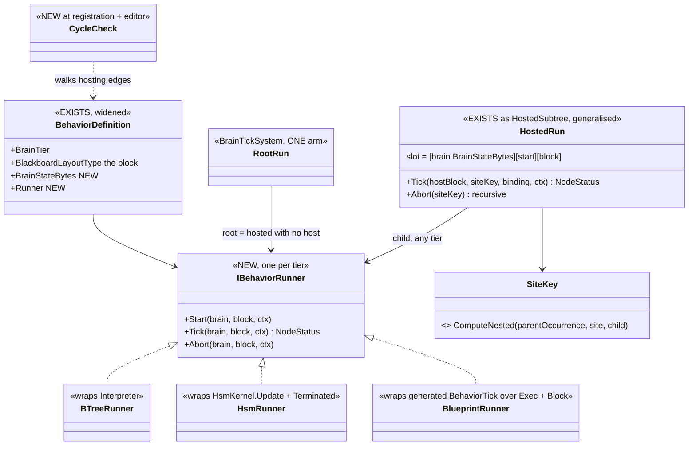
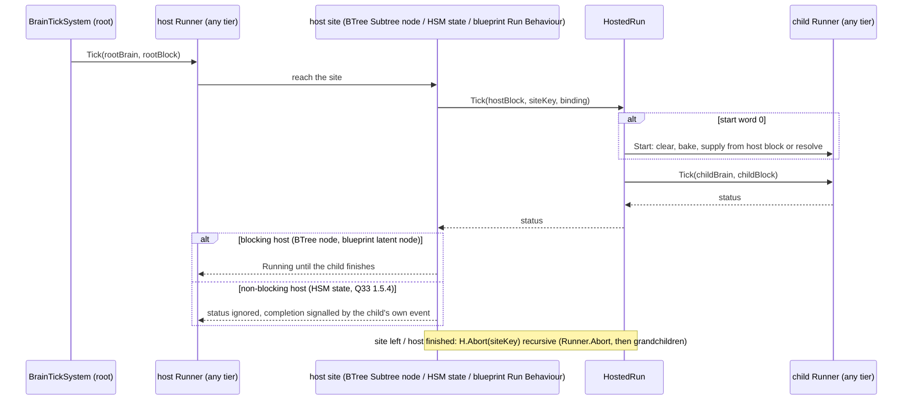
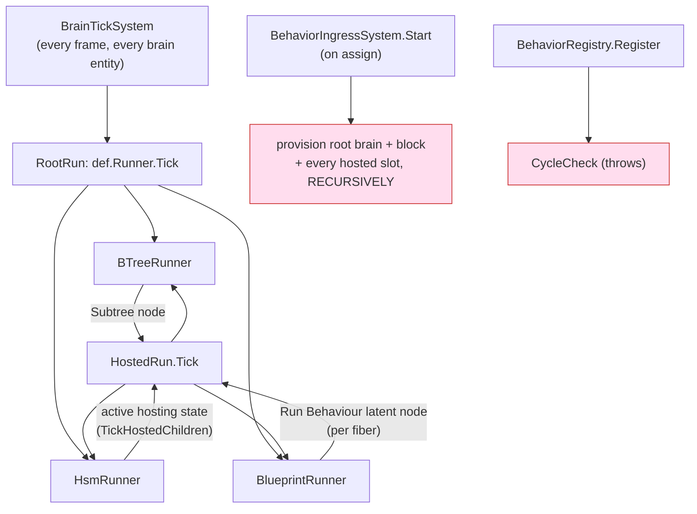

<!--STATUS
state: LIVE
updated: 2026-10-02
build-state: READY-TO-BUILD — direction approved by the user 2026-10-02 ("this enforces a true unification. great.
  Concurrency should be natively supported, and we should remove any blockers that prevent it. cycles needs
  checking."); §5 decisions APPROVED 2026-10-02 ("agreed to your leans") as revised there (U-3 dropped, U-6 revised,
  U-7 deferred, U-11 Behaviour Task node).
current-answer: §3 (the target, diagrams) and §5 (the decisions, each with a lean). §2 is the measured inventory.
stale-below: nothing yet.
known-rot: none.
known-conflict: Architect_Question_77 §3 C ("a root blueprint keeps its cursor in its root block") — SUPERSEDED here
  (§5 U-1); Q77 §5.14 points to this document.
related-designs:
  - Architect_Question_77_Blueprint_As_A_Behaviour.md — owns the blueprint behaviour (dispatch, Return = finish, own
    resolver). This document changes where its brain state lives and lets it host and be hosted.
  - Architect_Question_76_One_Blackboard_Block_Per_Primitive.md — owns R-151 (one block per running behaviour, brain
    state outside it) and §12.1 (the hosted child slot). This document applies R-151 to the blueprint and generalises §12.1.
  - Architect_Question_33_Blueprint_Brain_Tier.md — owns §1.5.4 (an HSM-hosted subtree is NON-BLOCKING, user ruling
    2026-08-16) and §1.5.5 (two suspension mechanisms, "converge when the slot shape unifies"). Both are honoured here.
  - DESIGN_Occurrence_Scoped_Storage.md — owns §32 (E5, an HSM state hosts a BTree) and the occurrence keys
    (ComputeTreeStateKey, ComputeNested). This document reuses both.
  - Architect_Question_27_Local_Variables.md — owns the per-graph local slots of a suspending graph; §4 S6 makes them
    per-fiber.
  - DESIGN_Behavior_Action_Binding.md — owns the C# binding forms; unaffected.
-->

# One way to run a behaviour — any type hosts any type, natively concurrent

> 🔒 **User, 2026-10-02:** *"unification and simplification is our goal"* · *"Custom resolver should not see the cursor
> … only the blackboard parameters needs to be exposed"* · *"would it make practical sense to run a blueprint behavior
> from a btree or hsm? I think it would"* · *"this enforces a true unification. great. Concurrency should be natively
> supported, and we should remove any blockers that prevent it. cycles needs checking."*

## 1. Why

A behaviour (BTree, HSM or blueprint) is one concept with three engines, but the runtime runs it three ways and hosts
it one way. Three things are missing:
- the blueprint keeps its execution state inside its blackboard block;
- only a BTree can be hosted;
- a blueprint can suspend at only one point at a time.

## 2. INVENTORY *(measured 2026-10-02: codebase-memory `search_graph` + grep, two read-only sweeps; file:line below)*

| # | fact | where |
|---|---|---|
| I1 | `BrainTickSystem` has three arms. They duplicate the shared work: dedup, CE-452 restart and `Finish`. They differ in the brain-state source, Paused, trace, the missing-definition policy and finish detection | `BrainTickSystem.cs:177-182, 246-344, 394-425, 501-631` |
| I2 | brain-state width: BTree `sizeof(BehaviorTreeState)`, HSM `SelectTier(blob)` (64/128/256), blueprint none. No `BehaviorDefinition` property | `RootStateAccess.cs:300`, `RootHsmAccess.cs:55-59`, `BehaviorRegistry.cs:157-175` |
| I3 | the blueprint behaviour block is `[Cursor][Params][Variables + _when_*_prev][graph locals]`; its resolver gets `ref State s` | `InstanceEmitter.cs:142-164, 508`; `WhenLowering_Instance.cs:83`; `FieldLayout.cs:74` |
| I4 | the BTree/HSM resolver signature is `(in Params authored, ref {Asset}_Block block)` | `LibraryEmitter.cs:200-224` |
| I5 | hosting: only a BTree child (`HostedChildren` requires `BTreeInterpreter`); slot `[BehaviorTreeState][start][block]` | `HostedChildren.cs:121-137`, `HostedSubtree.cs:34-48` |
| I6 | a BTree host uses the child's status; an HSM host discards it (Q33 §1.5.4, non-blocking); no `BehaviorFinishedEvent` for a child; the child shares the host's `InstanceId` | `Interpreter.cs:739-761`, `BrainTickSystem.cs:724-727, 699` |
| I7 | ⛔ **not recursive**: ingress provisions only the ROOT's slot manifest; `Reset` zeroes cursor + start word only and runs no child deactivator; a grandchild slot is never provisioned | `BehaviorIngressSystem.cs:325`, `HostedSubtree.cs:310-324` |
| I8 | ⛔ **keys fold the host ASSET, not the host occurrence** ⇒ the same grandchild under two sites collides. `ComputeNested` exists and is unused here | `OccurrenceSlotKey.cs:104-124, 168-176` |
| I9 | concurrency today: BTree Parallel with two subtree nodes ✅ (distinct site keys); HSM parallel regions ✅ | `BTreeHostedSites.cs:82-109`; `BrainTickSystem.cs:703-728` |
| I10 | ⛔ a blueprint has **ONE cursor for every graph**, and resume indices restart at 1 in each graph. 16 sites assume one suspension per payload | sweep table, e.g. `WaitLowering_Instance.cs:89,126-169`; `StatementEmitter.cs:808-861` |
| I11 | ⛔ an Event graph's method has no `instanceVersion` while its latent lowering uses it (suspected compile error, unproved) | `InstanceEmitter.cs:440-446` vs `StatementEmitter.cs:809,852` |
| I12 | ⛔ a channel/inline-action SUCCESS resumes without clearing `ResumeAt` (suspected re-run of the continuation, unproved) | `WaitLowering_Instance.cs:229-233` vs `:240,293,375` |
| I13 | ⛔ three hand-written latent-node lists (`BP1650`, `BP1101`-library, `BP2050`) miss inline actions; `MacroLatency.IsLatent` is the one detector | `Stage2_Validate.cs:2280, 665-684, 2566`; `MacroLatency.cs:38-40` |
| I14 | two suspension mechanisms: Instance cursor vs AiPrimitive `__phase` + `__waitUntilTime` | `AiPrimitiveLowering.cs:50-84`; Q33 §1.5.5 |
| I15 | cycles: an editor DFS for BTree/HSM assets only (`SubtreeCycleDetector`); ⛔ nothing for blueprints, nothing at registration, nothing for curated hosts | `SubtreeCycleDetector.cs:45-93`; `BTreeValidator.cs:92-115`; `HsmValidator.cs:516-538` |
| I16 | no Parallel/Fork node in blueprints; Sequence is sequential; fan-out of one exec pin is `BP1412` | `Nodes.cs:193`; `Stage5_Schedule.cs:837-916, 4122-4144` |

**CLAIM TABLE** (the rows the leans rest on)

| claim | code | design basis |
|---|---|---|
| brain state belongs outside the block | ✅ BTree/HSM already (I2) | ✅ R-151: *"the brain state is not part of it"* |
| the cursor is reached by name only | ✅ `StatementEmitter.cs:809-860` | — |
| a hosted subtree under an HSM does not block | ✅ `BrainTickSystem.cs:724-727` | ✅ Q33 §1.5.4 (user ruling 2026-08-16) |
| the two suspension mechanisms should converge with the slot shape | ✅ I14 | ✅ Q33 §1.5.5 |
| no design exists for blueprint concurrency | — | ⛔ searched `docs/`+`.dev/` (parallel, fork, multiple cursors, WaitAll): none. Q27 §125 names event-graph locals as "the open one" |
| a registration-time cycle check is new | ✅ I15 | ⛔ searched: none |

## 3. The target

| | BTree | HSM | blueprint |
|---|---|---|---|
| **block** (blackboard: all a resolver sees) | `{In; St}` | `{In; St}` | `{In = Params; St = Variables}` |
| **brain state** (internal, own slot) | tree cursor | HSM instance | **`Exec`: one cursor per FIBER + per-fiber locals + `When` memory** |
| **width** | `def.BrainStateBytes` for all three |||

*What the picture shows that prose hid:* root and hosted are the SAME call (`Runner.Tick`) over the SAME slot pair
(brain state, block). Only the caller differs. A host never knows its child's tier; a child never knows its host's.

*Caption:* the red boxes are what does NOT exist today: provisioning stops at the root's own manifest (I7), and
nothing checks cycles at registration (I15). The recursion edge `HostedRun → any Runner` is what makes the matrix
and nesting the same mechanism.

## 4. Slices *(one commit each, green at each; rails first where a defect is measured)*

| # | slice | delivers |
|---|---|---|
| S1 | rails first for I11–I13 | prove or refute the event-graph latent compile failure and the success-path cursor; one latent detector (`MacroLatency.IsLatent`) for all three rules |
| S2 | blueprint block / `Exec` split | block = `{In; St}`; `Exec` = cursor + locals + `When` memory in the brain-state slot; the own resolver gets `(in Params authored, ref Block block)`. Q77 §3 C superseded |
| S3 | manifest | blueprint registrar emits `JsonParamsDtoType` + `ManagedBlackboardVariables` ⇒ watch, `GET /behaviors`, inspector work with no tier branch |
| S4 | one runner contract | `IBehaviorRunner` + `BrainStateBytes`; `BrainTickSystem` collapses to one arm; per-tier quirks (Paused, trace, interrupt) move into their runner |
| S5 | the hosting matrix | slot `[brain][start][block]` from the child's definition; HSM and blueprint children; recursive provisioning and abort; nested keys via `ComputeNested`; cycle check at registration + blueprints in the editor detector |
| S6 | native concurrency in blueprints | a FIBER per top-level graph (Tick, each Event graph) and per branch of a new `Parallel` node; per-fiber cursor, locals and `When` memory; the 16 single-cursor sites (I10) rewritten against a fiber index |
| S7 | **Behaviour Task** blueprint node (U-11) | pins Start/Abort in, Started/While Running/Succeeded/Failed out; any tier as the task; each completion pin is a fiber |
| (S8) | converge AiPrimitive suspension (I14) | `__phase`/`__waitUntilTime` → the same fiber cursor (Q33 §1.5.5). Separate design question, see §6 |

### 4a. What fibers take *(S6, the largest slice — split in three)*

| step | change | measured site it removes |
|---|---|---|
| ① find the fibers at compile time | the Tick graph; each latent Event graph × its policy's N; each Task node's completion pins. Each gets a fixed index | I10 (one cursor for all graphs) |
| ② lay them out | `Exec` = one record per fiber: cursor + that fiber's locals + its `When` memory (+ the event payload for an Event fiber that suspends). Fixed size ⇒ no allocation | I3, Q27's per-graph locals, the 8-hex `When` key |
| ③ lowering by index | the cursor IR ops carry a fiber index ⇒ `x.F2.ResumeAt` instead of `s.Cursor.ResumeAt`; each graph dispatches on its OWN fiber's cursor; version check and reset per fiber | `WaitLowering_Instance.cs:89,126-169,240,293,375`, `StatementEmitter.cs:808-861` (incl. the I12 success path) |
| ④ the generated scheduler | `BehaviorTick` = dispatch events to a free fiber per policy (overflow ⇒ fault) → resume each active fiber in index order → tick Task sites, fire `While Running`, start a completion fiber when a task ends. Straight-line generated code, deterministic | `BlueprintEventDispatch.cs:42-53`, I11 |
| ⑤ abort | clear a fiber's record + abort the Task sites it started (recursively); `Finish` aborts all | U-8 |
| ⑥ the readers | debugger / inspector show a fiber list; `StructureHash` covers fiber layout and resume numbering (hot reload) | sweep rows 13, 15 |

⭐ **Instances use the same lowering** (one compiler path, no fork); their `Exec` stays inside their single payload
because an Instance is not a behaviour. ⚠ Cost: every Instance's `StructureHash` and golden moves once.
**Split:** S6a per-graph fibers (Tick + Event graphs; fixes I10–I12) · S6b event policies (U-6) · S6c Task-node
completion fibers (lands with S7).

## 5. Decisions — each with a lean

| # | decision | lean | rejected |
|---|---|---|---|
| U-1 | blueprint brain state | ⭐ out of the block (R-151 literal) | cursor in the block (Q77 §3 C): leaks into resolvers, needs its own hosting slot |
| U-2 | the run contract | ⭐ one `IBehaviorRunner` per tier on the definition; root = hosted with no host | per-pair hosting paths: up to 9 |
| U-3 | ~~blocking~~ ⛔ **DROPPED 2026-10-02** | the Behaviour Task node (U-11) makes "waiting" a matter of which pins are wired; a BTree node still reports the child's status; an HSM state stays non-blocking (Q33 §1.5.4) and gets an automatic `ChildFinished(Success/Failure)` event | — |
| U-4 | an HSM child's "finish" | ⭐ `Terminated` ⇒ Success, exactly as the root arm reads it | a new HSM status |
| U-5 | fibers | ⭐ a fixed set known at compile time (top-level graphs + `Parallel` branches), each with its own cursor, locals and `When` memory, laid out in `Exec` ⇒ no allocation | a dynamic fiber pool: allocation on the hot path |
| U-6 | an Event graph that fires while its fiber is suspended | ⭐ **author's policy on the Event node, never silent** (revised 2026-10-02 — user: *"events carry information, can't be just ignored"*): **Parallel(N)** default (one fiber per arrival, N fixed at compile time), **Restart** (newest wins), **Queue(N)**; overflow ⇒ `BehaviorFault` + log. A latent-free handler is unaffected (runs to completion per event) | ignore (Unreal `Delay` semantics: the event is lost) |
| U-7 | `Parallel` node | ⏸ **DEFERRED** (demand-driven): the Behaviour Task node already gives native concurrency. When built: one node, `All` (join) / `Any` (race, losers aborted recursively) | two nodes |
| U-8 | the behaviour finishes while fibers are live | ⭐ the Tick fiber's `Return` finishes it; every other fiber is aborted (CE-449: finish = clear) | wait for all fibers: a run that cannot end |
| U-9 | cycle checking | ⭐ at registration over the real hosting edges (throws, catches curated hosts) + the editor detector extended to blueprints | a runtime depth counter on the hot path |
| U-10 | a child's `InstanceId` | ⭐ the host's (unchanged: channels reset with the host) | its own |
| U-11 | how a blueprint hosts a behaviour | ⭐ ONE **Behaviour Task** node: in `Start`, `Abort`; out `Started` (immediately), `While Running` (every tick, latent-free — a BP2050-shaped rule), `Succeeded`/`Failed` (once, each a fiber). "Run and wait" = only the completion pins wired. Start while running ⇒ **Restart** (newest order wins) | two nodes (blocking + non-blocking) |

## 6. What this opens, not decided here

**The mission plan as a blueprint** (user, 2026-10-02: *"implement the mission plan as a simple graphical blueprint, a
sequence of individual behavior nodes (mission tasks), with branching depending on the results of the task, with
triggers"*). Today `DomainMissionPlan` is a LINEAR task list advanced by `MissionDirectorSystem` on a hard-coded
`MissionTrigger` enum (TimerElapsed / UnderAttack / HealthCritical / BehaviorFinished). A mission blueprint of Behaviour
Task nodes would retire both. ⛔ Separate design (agreed): it touches the `MissionTask` DDS messages, scenario
persistence, the ExCon mission editor (UI lane) and `MissionAdapterSystem`.

An AiPrimitive (a blueprint used as a BTree action) has the same shape as a hosted blueprint behaviour run by a
blocking host:
- params from a host binding;
- state per site;
- a status every tick.

S8 could make it **the same thing**. Conditions and guards stay separate, since they must answer in one tick
(Q33 §1.5.4). This is filed for a follow-up design, not this one.
