<!--STATUS
state: LIVE
updated: 2026-10-03
build-state: READY-TO-BUILD — direction approved by the user 2026-10-02 ("this enforces a true unification. great.
  Concurrency should be natively supported, and we should remove any blockers that prevent it. cycles needs
  checking."); §5 decisions APPROVED 2026-10-02 ("agreed to your leans") as revised there (U-3 dropped, U-6 revised,
  U-7 deferred, U-11 Behaviour Task node).
current-answer: §3 (the target, diagrams) and §5 (the decisions, each with a lean). §2 is the measured inventory. The
  per-slice "design" / "as-built" sections under §4 are the build record (latest: "S8i as-built" — utility EQS inputs keyed by template AssetId).
stale-below: nothing yet.
known-rot: none.
known-conflict: Architect_Question_77 §3 C ("a root blueprint keeps its cursor in its root block") — SUPERSEDED here
  (§5 U-1); Q77 §5.14 points to this document.
related-designs:
  - Architect_Question_77_Blueprint_As_A_Behaviour.md — owns the blueprint behaviour (dispatch, Return = finish, own
    resolver). This document changes where its brain state lives and lets it host and be hosted.
  - Architect_Question_76_One_Blackboard_Block_Per_Primitive.md — owns R-151 (one block per running behaviour, brain
    state outside it) and §12.1 (the hosted child slot). This document applies R-151 to the blueprint and generalises §12.1.
  - Architect_Question_33_Blueprint_Brain_Tier.md — owns §1.5.4 (an HSM-hosted subtree is NON-BLOCKING, user ruling
    2026-08-16) and §1.5.5 (two suspension mechanisms, "converge when the slot shape unifies"). Both are honoured here.
  - DESIGN_Occurrence_Scoped_Storage.md — owns §32 (E5, an HSM state hosts a BTree) and the occurrence keys
    (ComputeTreeStateKey, ComputeNested). This document reuses both.
  - Architect_Question_27_Local_Variables.md — owns the per-graph local slots of a suspending graph; §4 S6 makes them
    per-fiber.
  - DESIGN_Behavior_Action_Binding.md — owns the C# binding forms; unaffected.
  - Architect_Question_76_One_Blackboard_Block_Per_Primitive.md §12.28 — owns the BTree/HSM subtree pick (CE-439) whose
    child-input lookup "S8b" here routes through the registry (its IBehaviorInputsContract is retired by S8b-2).
  - DESIGN_Typed_Event_Nodes.md — owns the AUTHORED shape of Event graphs (any number of typed event nodes, split into
    one handler each before Stage 5). Each handler is one fiber graph here, unchanged.
-->

# One way to run a behaviour — any type hosts any type, natively concurrent

> 🔒 **User, 2026-10-02:** *"unification and simplification is our goal"* · *"Custom resolver should not see the cursor
> … only the blackboard parameters needs to be exposed"* · *"would it make practical sense to run a blueprint behavior
> from a btree or hsm? I think it would"* · *"this enforces a true unification. great. Concurrency should be natively
> supported, and we should remove any blockers that prevent it. cycles needs checking."*

## 1. Why

A behaviour (BTree, HSM or blueprint) is one concept with three engines, but the runtime runs it three ways and hosts
it one way. Three things are missing:
- the blueprint keeps its execution state inside its blackboard block;
- only a BTree can be hosted;
- a blueprint can suspend at only one point at a time.

## 2. INVENTORY *(measured 2026-10-02: codebase-memory `search_graph` + grep, two read-only sweeps; file:line below)*

| # | fact | where |
|---|---|---|
| I1 | `BrainTickSystem` has three arms. They duplicate the shared work: dedup, CE-452 restart and `Finish`. They differ in the brain-state source, Paused, trace, the missing-definition policy and finish detection | `BrainTickSystem.cs:177-182, 246-344, 394-425, 501-631` |
| I2 | brain-state width: BTree `sizeof(BehaviorTreeState)`, HSM `SelectTier(blob)` (64/128/256), blueprint none. No `BehaviorDefinition` property | `RootStateAccess.cs:300`, `RootHsmAccess.cs:55-59`, `BehaviorRegistry.cs:157-175` |
| I3 | the blueprint behaviour block is `[Cursor][Params][Variables + _when_*_prev][graph locals]`; its resolver gets `ref State s` | `InstanceEmitter.cs:142-164, 508`; `WhenLowering_Instance.cs:83`; `FieldLayout.cs:74` |
| I4 | the BTree/HSM resolver signature is `(in Params authored, ref {Asset}_Block block)` | `LibraryEmitter.cs:200-224` |
| I5 | hosting: only a BTree child (`HostedChildren` requires `BTreeInterpreter`); slot `[BehaviorTreeState][start][block]` | `HostedChildren.cs:121-137`, `HostedSubtree.cs:34-48` |
| I6 | a BTree host uses the child's status; an HSM host discards it (Q33 §1.5.4, non-blocking); no `BehaviorFinishedEvent` for a child; the child shares the host's `InstanceId` | `Interpreter.cs:739-761`, `BrainTickSystem.cs:724-727, 699` |
| I7 | ⛔ **not recursive**: ingress provisions only the ROOT's slot manifest; `Reset` zeroes cursor + start word only and runs no child deactivator; a grandchild slot is never provisioned | `BehaviorIngressSystem.cs:325`, `HostedSubtree.cs:310-324` |
| I8 | ⛔ **keys fold the host ASSET, not the host occurrence** ⇒ the same grandchild under two sites collides. `ComputeNested` exists and is unused here | `OccurrenceSlotKey.cs:104-124, 168-176` |
| I9 | concurrency today: BTree Parallel with two subtree nodes ✅ (distinct site keys); HSM parallel regions ✅ | `BTreeHostedSites.cs:82-109`; `BrainTickSystem.cs:703-728` |
| I10 | ⛔ a blueprint has **ONE cursor for every graph**, and resume indices restart at 1 in each graph. 16 sites assume one suspension per payload | sweep table, e.g. `WaitLowering_Instance.cs:89,126-169`; `StatementEmitter.cs:808-861` |
| I11 | ✅ **MEASURED + interim fix (S1, CE-509):** a latent node in an Event graph failed as Roslyn `CS0103 'instanceVersion'` in GENERATED code. Now refused by **BP1658**, which names the node; the rule is removed when fibers land (S6a) | `InstanceEmitter.cs:440-446` vs `StatementEmitter.cs:809,852`; rail `BlueprintBehaviourTests.S1_ALatentNodeInAnEventGraph_…` |
| I12 | ✅ **MEASURED + FIXED (S1, CE-509):** a channel/event/inline-action SUCCESS resumed without clearing the cursor, so every later pass re-ran ONLY the code after the wait (measured: 1 pass before the wait, 5 after, in 5 frames). Both lowerings (Instance `ResumeAt` and AiPrimitive `__phase`) now go through a `success` block that clears it, like Failure and Delay already did | `WaitLowering_Instance.cs`, `WaitLowering_AiPrimitive.cs`; rails `S1_AfterAChannelWaitSucceeds_…`, `AiPrimitive_ASuccessfulWait_ClearsThePhase_…` |
| I13 | ✅ **FIXED (S1, CE-509):** the three rules (`BP1650`, library `BP1101`, `BP2050`) now ask `MacroLatency.IsLatent`, so an inline action is caught. The library rule had NO test before | `Stage2_Validate.cs`; rails in `BATCH03B_…`, `Stage1To5Tests`, `V_FlowForEachValidatorTests` |
| I14 | two suspension mechanisms: Instance cursor vs AiPrimitive `__phase` + `__waitUntilTime` | `AiPrimitiveLowering.cs:50-84`; Q33 §1.5.5 |
| I15 | cycles: an editor DFS for BTree/HSM assets only (`SubtreeCycleDetector`); ⛔ nothing for blueprints, nothing at registration, nothing for curated hosts | `SubtreeCycleDetector.cs:45-93`; `BTreeValidator.cs:92-115`; `HsmValidator.cs:516-538` |
| I16 | no Parallel/Fork node in blueprints; Sequence is sequential; fan-out of one exec pin is `BP1412` | `Nodes.cs:193`; `Stage5_Schedule.cs:837-916, 4122-4144` |

**CLAIM TABLE** (the rows the leans rest on)

| claim | code | design basis |
|---|---|---|
| brain state belongs outside the block | ✅ BTree/HSM already (I2) | ✅ R-151: *"the brain state is not part of it"* |
| the cursor is reached by name only | ✅ `StatementEmitter.cs:809-860` | — |
| a hosted subtree under an HSM does not block | ✅ `BrainTickSystem.cs:724-727` | ✅ Q33 §1.5.4 (user ruling 2026-08-16) |
| the two suspension mechanisms should converge with the slot shape | ✅ I14 | ✅ Q33 §1.5.5 |
| no design exists for blueprint concurrency | — | ⛔ searched `docs/`+`.dev/` (parallel, fork, multiple cursors, WaitAll): none. Q27 §125 names event-graph locals as "the open one" |
| a registration-time cycle check is new | ✅ I15 | ⛔ searched: none |

## 3. The target

| | BTree | HSM | blueprint |
|---|---|---|---|
| **block** (blackboard: all a resolver sees) | `{In; St}` | `{In; St}` | `{In = Params; St = Variables}` |
| **brain state** (internal, own slot) | tree cursor | HSM instance | **`Exec`: one cursor per FIBER + per-fiber locals + `When` memory** |
| **width** | `def.BrainStateBytes` for all three |||

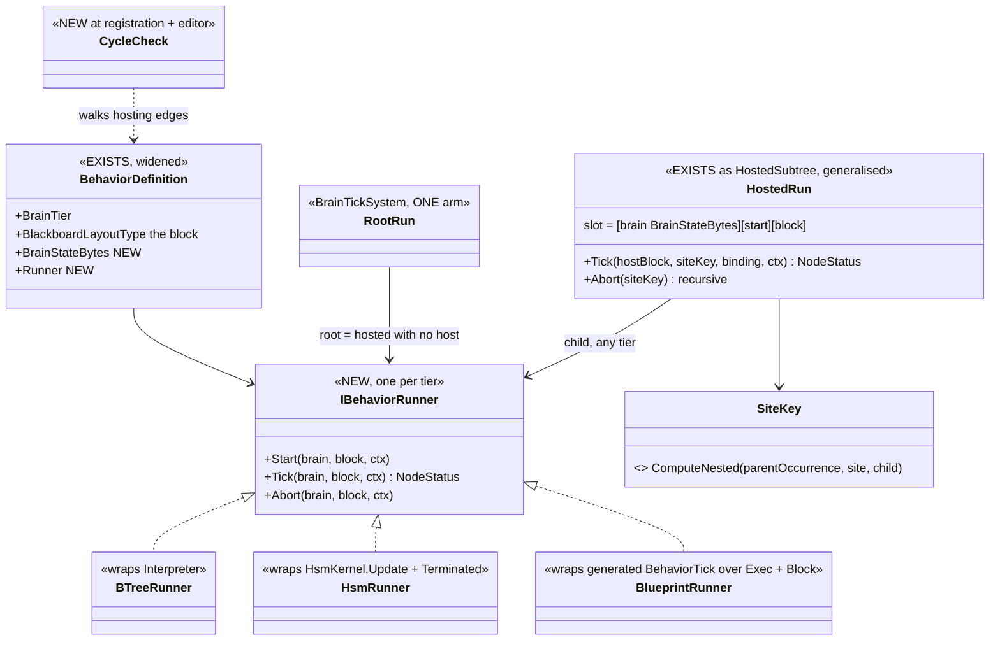
*What the picture shows that prose hid:* root and hosted are the SAME call (`Runner.Tick`) over the SAME slot pair
(brain state, block). Only the caller differs. A host never knows its child's tier; a child never knows its host's.

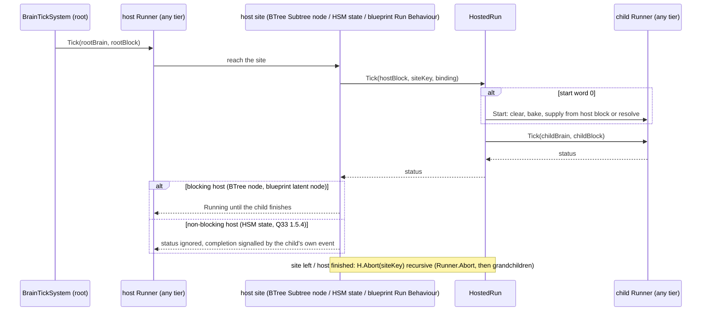

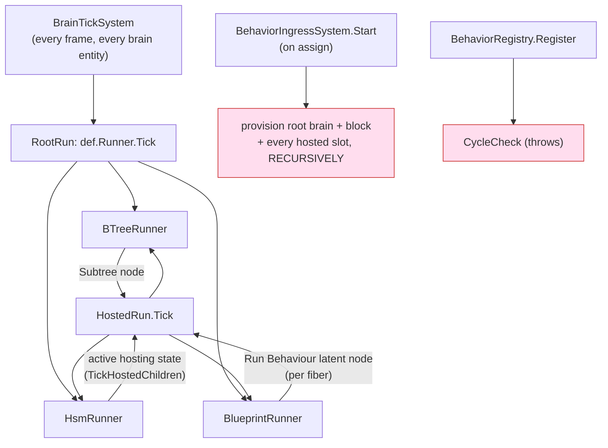
*Caption:* the red boxes are what does NOT exist today: provisioning stops at the root's own manifest (I7), and
nothing checks cycles at registration (I15). The recursion edge `HostedRun → any Runner` is what makes the matrix
and nesting the same mechanism.

## 4. Slices *(one commit each, green at each; rails first where a defect is measured)*

| # | slice | delivers |
|---|---|---|
| S1 ✅ BUILT | rails first for I11–I13 | all three PROVED, then fixed (§2 rows I11–I13) |
| S2 ✅ BUILT | blueprint block / `Exec` split | see the as-built box below |
| S3 ✅ BUILT | manifest | see the as-built box below |
| S4 ✅ BUILT | one runner contract | see the as-built box below |
| S5 | the hosting matrix | slot `[brain][start][block]` from the child's definition; HSM and blueprint children; recursive provisioning and abort; nested keys via `ComputeNested`; cycle check at registration + blueprints in the editor detector. ⭐ Split in four, see below |
| S6 | native concurrency in blueprints | a FIBER per top-level graph (Tick, each Event graph) and per branch of a new `Parallel` node; per-fiber cursor, locals and `When` memory; the 16 single-cursor sites (I10) rewritten against a fiber index |
| S7 | **Behaviour Task** blueprint node (U-11) — ⭐ design below ("S7 design"), split S7a / S7b — ✅ BOTH BUILT (CE-2019, CE-2020; "S7a as-built", "S7b as-built") | pins Start/Abort in, Started/While Running/Succeeded/Failed out; any tier as the task; each completion pin is a fiber |
| (S8) | converge AiPrimitive suspension (I14) | `__phase`/`__waitUntilTime` → the same fiber cursor (Q33 §1.5.5). Separate design question, see §6 |


### S2 as-built *(`2026-10-02`, CE-510)*

| piece | where |
|---|---|
| block = `Block { Params In @0; Vars St }`, the root PARAMS slot (`BlackboardLayoutType`) | `InstanceEmitter.EmitBehaviorStructs`; `FieldLayout.ParamsStructBase` = 0 and `St` 8-aligned for `Behavior` |
| brain state = `Exec { BlueprintLatentCursor Cursor @0; When memory; suspended locals }`, the root STATE slot | `WhenLowering_Instance` sends a behaviour's When memory to the execution-state slots; `LocalStorage` now APPENDS to them; `FieldLayout` lays them from 16 in `Exec` |
| `BehaviorDefinition.BrainStateBytes` + `BrainStateLayoutType`; `RootStateAccess.RootStateBytes` answers it for the blueprint tier; `TryGetRootBytes` / `RequireRootBytesRef` / `TryGetRootBytesInView`; `ResetState` zeroes the whole slot | `BehaviorRegistry.cs`, `RootStateAccess.cs` (part of S4's width-per-definition, done early) |
| ingress attaches the root state slot at that width; `TickBlueprint` passes `ref exec`; the delegate is `(ref byte block, ref byte exec, …)` | `BehaviorIngressSystem.cs`, `BrainTickSystem.cs`, `BlueprintBehaviorTickDelegate.cs` |
| events dispatched INLINE in `BehaviorTick` (cached type id per Event graph) | removes, for behaviours, the shared dispatcher's per-frame interface-dictionary walk (an enumerator allocation on the hot path — ⚠ still present for Instances, `BlueprintEventDispatch.cs:43`) |
| debugger: Variables read flat from `St`, `In` shown as `Params`, cursor read from the root STATE slot | `BlueprintDebugSession.CaptureLiveBehaviorState` |
| rail `BlueprintBehaviourTests.S2_TheBlockIsTheBlackboard_AndTheCursorIsTheBrainState` (no cursor anywhere in the block, `In` at 0, cursor at 0 of `Exec`, slot width = `BrainStateBytes`, resolver takes the block) — red-proved by registering `Exec` as the block | |

⚠ **Deviations, argued:**
- the own resolver is `Resolve_X(ref Block __bb, world, self)`, not `(in Params authored, ref Block block)`. The authored input
  IS `In` (one struct, Q77 §5.11, and BP1675 forbids writing it), so a second copy adds nothing. ⭐ The property the user
  asked for holds: the resolver cannot reach the brain state. A helper it calls gets a SCRATCH `Exec`.
- generated identifiers are `__bb` / `__ex`: the first build used `b` / `x` and collided with an authored input named `x`
  (`PlatoonHillAttackBp`, CS0100).

### S3 as-built *(`2026-10-02`, CE-511)*

| piece | where |
|---|---|
| the registrar sets `JsonParamsDtoType = typeof(X.Params)` (only when the asset has Parameters) and `ManagedBlackboardVariables = X.InputManifest()` | `CSharpEmitter.EmitBehaviorRegistration` |
| `InputManifest()`: one entry per Parameter, offset MEASURED on the real struct (`Unsafe.ByteOffset` on a `default(Params)`), never baked; `Array.Empty` when there are none | `InstanceEmitter.EmitBehaviorEntryPoints` |
| consequence: `RootParamsAccess.InputBytes` is now the Params extent (was the whole block); `RootParamsBytes` is unchanged (max of manifest extent and block size = block size) | no runtime edit needed |
| consequence: `GET /behaviors`, the schema extractor and the live blackboard provider now see a blueprint behaviour's Parameters through the same arm as BTree/HSM; a blueprint behaviour joins the generated-block set the editor manifest rails sweep (offsets agree with `Marshal.OffsetOf`) | `DebugApiService`, `DtoJsonSchemaExtractor`, `LiveBlackboardValueProvider` (unchanged) |
| rails `BlueprintBehaviourTests.S3_ABlueprintBehaviour_PublishesItsParamsContract_AndItsInputManifest`, `S3_AParameterlessBlueprintBehaviour_DeclaresAnEmptyManifest`, `AGeneratedBehaviourAdvertisesItsManifestTests.ABlueprintBehaviourAdvertisesItsParameters` | red-proved by dropping the two registrar lines |

⚠ The manifest lists Parameters only, as BTree/HSM manifests list Role=Input only. A blueprint's Variables (`St`) stay
visible through the blueprint debugger (`CaptureLiveBehaviorState`), not through the params inspector.

### S4 as-built *(`2026-10-02`, CE-512 (behaviors))*

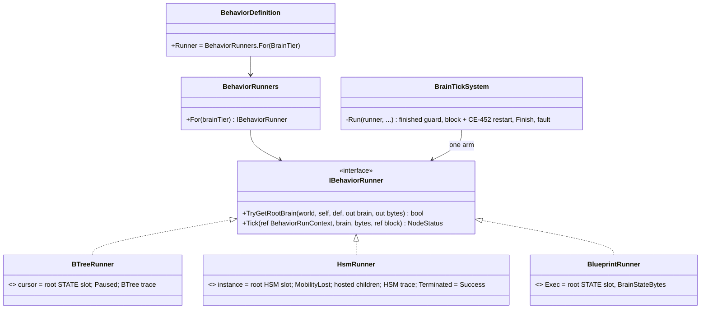
*What it shows that prose hid:* the split of ownership. Everything a tier does differently is in its runner; the system's
one arm holds only what all three share. The runners carry no fields, so all run state stays in the two recorded slots.

| piece | where |
|---|---|
| contract + context (`BehaviorRunContext`, a stack value) + tier map | `Fdp.Toolkits/Behavior/Runners/IBehaviorRunner.cs` |
| the three runners: the former arms' bodies moved over unchanged, with their trace decoders, HSM's MobilityLost interrupt and `TickHostedChildren` | `Runners/BTreeRunner.cs`, `HsmRunner.cs`, `BlueprintRunner.cs` |
| `BehaviorDefinition.Runner` (derived from `BrainTier`, never stored) | `BehaviorRegistry.cs` |
| `BrainTickSystem.Run`: finished guard → `TryGetRootBrain` → block (+ `RestartIfRelaidOut`) → `Tick` → `Finish` on a terminal status; the fault check after it is unchanged. 879 → ~380 lines | `Systems/BrainTickSystem.cs` |
| rail `BrainTickSystemMergeTests.S4_EveryTierRunsThroughItsRunner_AndRunnersHoldNoState`, red-proved by giving `BlueprintRunner` a field; the existing per-tier arm suites, including their zero-allocation tick rails, pass unchanged | |

⚠ **Deviations and findings, argued:**
- `Start`/`Abort` are NOT on the contract yet. At the root, start is ingress's reset and abort is `Finish`'s clear, and
  neither has a second caller until hosting (S5) gives them one. ⇒ they arrive with S5, against a real caller.
- ORDER: the brain is located BEFORE the block's reload restart. Before, the BTree arm checked Paused first, and the HSM arm
  restarted before looking for its instance. ⇒ a debugger-paused BTree whose block was re-laid-out by a hot reload now
  restarts instead of staying paused; an HSM entity with no instance yet is skipped before the restart check. Both are
  edge cases; neither has a rail that moved.
- the finished-run guard (was blueprint-only) now covers every tier. It is a no-op for BTree/HSM, because `Finish` already
  sets `BrainTier = 0`.
- **the two managed dictionaries in `BrainTickSystem`, checked as planned.** Neither is recorded, and neither has to be.
  `_publishedTerminalForInstanceId` only guards a same-frame second finish; a run that has finished is cleared and never
  ticks again. `_blueprintLayout` is a cache of the layout each run started with. After a seek or restore it is empty and
  re-learns the layout on the next tick, so a reload landing exactly across a restore would be missed, but nothing is
  corrupted. Left in place: the stale-entry rails (`O7_R47`) pin the first; the second is S6's to revisit when fibers
  make the brain state carry its own layout hash.

### S5 split *(`2026-10-02`, from measuring the hosting code after S4)*

📐 **Measured before splitting.** A hosted BTree child's per-node action state (e.g. `T20_MultiStateful`'s two cursor
slots) is a keyed occurrence slot whose key is baked at emit time from the child's ASSET and NODE
(`BTreeBridgeEmitCore.ComputeStatefulSlotKey`). The same child under two sites therefore shares that state, whatever its
own run slot's key is. ⇒ *"the same child under two sites does not collide"* (§7) needs the OCCURRENCE key carried down
at run time, not only nested run-slot keys.

| sub-slice | delivers | key facts |
|---|---|---|
| **S5a** ✅ BUILT (CE-513 (behaviors)) any tier as a child | the runner gains `BrainBytes(def)` + `Start(def, brain, bytes)`; the hosted slot becomes `[brain][start][block]` sized by the CHILD's runner; `HostedChildren` resolves any tier; `HostedSubtree.TickHosted` steps the child through its runner; `Reset` zeroes the child's brain | a BTree child's slot stays byte-identical (64 / 64 / 72); an HSM child's `Start` is `HsmInstanceManager.Initialize` (stamps `MachineId`); hosts = the existing BTree `Subtree` node and HSM state |
| **S5b** ✅ BUILT for BTree children (CE-2000); HSM/inline residue CE-2002 — recursion | the context carries the parent OCCURRENCE key; a depth-1 key is unchanged, a deeper one is `NestOver(parent, template)`; ingress provisions recursively from the definitions; reset/abort recurse; a hosted child's action slots nest through the same key | the root folds nothing, so every existing key stays byte-identical |
| **S5c** ✅ runtime BUILT (CE-2003); editor half with S5d — cycles | registration walks the hosting edges by child name and throws on a cycle; the editor detector covers blueprints | U-9 |
| **S5d** ✅ compiler + runtime BUILT (CE-2004); editor palette open — blueprint as a host | a blocking **Run Behaviour** latent node | compiler + editor; ⭐ it is U-11's Behaviour Task node with only the completion pins — S7 grows it in place |

#### S5a as-built *(`2026-10-02`, CE-513 (behaviors))*

| piece | where |
|---|---|
| `IBehaviorRunner.BrainBytes(def)` + `Start(def, brain, bytes)`: BTree 64 + zero; HSM `InstanceBytes(blob)` + `HsmInstanceManager.Initialize`; blueprint `BrainStateBytes` + zero. `BehaviorRunContext` now carries `InstanceId` (not the whole `BehaviorState`) | `Runners/*.cs` |
| the site slot is `[brain][start][block]`, every offset from the CHILD's runner (`BrainBytesFor` / `StartWordOffsetFor` / `BlockOffsetFor` / `SlotPayloadSizeFor`); a BTree child is byte-identical to before | `HostedSubtree.cs` |
| `TickHosted`: resolve the child's definition, `Start` it at a fresh start, step it through `runner.Tick` under the HOST's `InstanceId` (U-10), clear its brain + start word when it ends. `Reset` zeroes the child's brain at its own width | `HostedSubtree.cs` |
| `HostedChildren` resolves ANY tier with a runner (`RequireDefinition`); the BTree-interpreter accessors stay for their existing callers | `HostedChildren.cs` |
| the HSM host's "is the site bound" check asks for the definition, not a BTree interpreter | `HsmRunner.TickHostedChildren` |
| rails `HostingMatrixTests.S5a_*` (3): a BTree host runs a blueprint child (its `Exec` is the slot's first region, persists, runs under the host's `InstanceId`, its Success ends the node and the host) and an HSM child (started in the slot with its `MachineId`, stepped; a terminating machine succeeds the node). Red-proved by resolving BTree children only | real ingress + `BrainTickSystem`, no hand attach |

#### S5b step 1 as-built — nested RUN slots *(`2026-10-02`, CE-2000)*

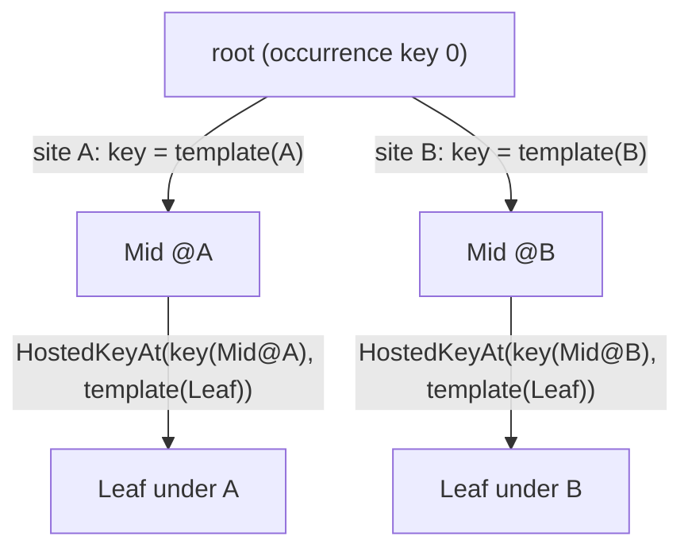
*What it shows that prose hid:* the leaf has ONE registered (template) key, but TWO occurrences. Its slot key is
derived from the path, so the two never meet. Depth 1 is unchanged (the root folds nothing).

| piece | where |
|---|---|
| `OccurrenceSlots.HostedKeyAt(parent, template)` (`OccurrenceSlotKey.ComputeHostedAt`: parent 0 ⇒ the template, else `NestOver`) | `OccurrenceSlotKey.cs`, `OccurrenceSlots.cs` |
| the occurrence key rides the context: `BTreeContext._occurrenceKey`, `BehaviorRunContext.OccurrenceKey` (0 at the root); `TickHosted` resolves the nested key and hands it to the child's run; both runners pass it into the contexts they build | `BTreeContext.cs`, `Runners/*.cs`, `HostedSubtree.cs` |
| `EffectiveSlots` appends every descendant's run slot under its nested key, recursively (depth guard `MaxNestingDepth` = 16 throws: a cycle S5c will refuse at registration); ingress provisions from that list AND sweeps against it, and a behaviour change / clear detaches it | `HostedSubtree.cs`, `BehaviorIngressSystem.cs` |
| reset is recursive: a child that is reset, started fresh or finishes takes its own hosted children with it (I7) | `HostedSubtree.ResetAt` / `ResetDescendants` |
| 🔴 **a defect that predated this work, found by the rail:** `BTreeHostedSites` keyed its site table by `blob.StructureHash`, which hashes node TYPES and child COUNTS only. Two trees of one shape (a host `Sequence(Subtree)` and its child `Sequence(Subtree)`) shared ONE map, and the last `Bind` won, so the child's site looked up the HOST's key. ⇒ keyed by the blob INSTANCE now (the interpreter hands the host its own blob; every registrar binds that instance). `HsmHostedSubtrees` got the same instance-keyed table for the runtime | `BTreeHostedSites.cs`, `HsmHostedSubtrees.cs`, `HsmRunner` |
| rails `HostingMatrixTests.S5b_TheSameChildAtTwoSites_GivesItsGrandchildTwoOccurrences` (red-proved by making `HostedKeyAt` ignore its parent) and `S5b_ResettingAChild_ResetsItsGrandchildToo` (it failed on the site-table collision before the fix) | |

#### S5d design — a blueprint behaviour HOSTS a behaviour *(`2026-10-02`, BUILT — as-built below)*

📐 **Measured basis.** An inline action (`ChannelCommandNode` with an `ActionFqn`) is already a latent call that returns a
status each frame: `Stage5_Schedule.ScheduleInlineActionNode` → `ScheduleLatentNode` (Out on Success, `OnFailure` on
Failure, Q#13) → `WaitLowering_Instance` re-invokes it in the resume check until it is not Running. ⇒ **Run Behaviour
reuses that whole path; only the call differs.**


*What it shows:* the node adds one op and one runtime entry point. The latent machinery, the hosted slot, nesting and
the cycle check all already exist.

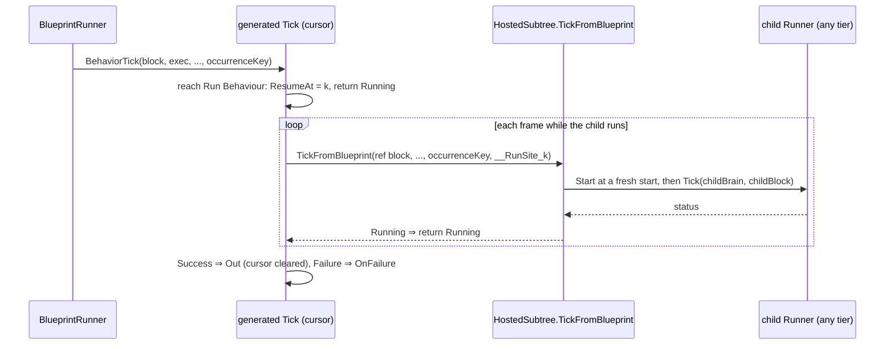

| decision | lean | why |
|---|---|---|
| where the occurrence key comes from | ⭐ a new `int occurrenceKey` parameter on `BehaviorTick` and the behaviour `Tick` | a static or an `Exec` field would be hidden state; the runner already has it (`BehaviorRunContext.OccurrenceKey`) |
| the site key | a `static readonly int` per node, computed once from `OccurrenceSlots.TreeStateKeyFor(AssetId, nodeId, AssetIdFromName(child))` | the compiler cannot call the internal hash; computing at type init costs nothing per tick |
| where it may appear | Tick graph of a `Behavior` asset only (a new diagnostic); latent ⇒ already refused in functions, Event graphs, loop bodies | an Instance has no brain tier to host from |
| input binding | none in this step: the child starts from its own defaults | the host-variable binding (`SiteBinding`) is CE-439's shape and can follow |
| abandonment | none needed yet: a blueprint leaves the node only when the child ends, or the run ends (clear detaches every slot) | S6 fibers / S7's Abort pin bring a real abandon; the recursive reset is ready for it |

#### S5d as-built *(`2026-10-02`, CE-2004)*

| piece | where |
|---|---|
| the node: `RunBehaviorNode` (kind `"RunBehavior"`, pins In / Out / OnFailure), latent (`MacroLatency`); `BP1659` refuses it outside a `Behavior` asset or with no `BehaviorName` | `Assets/Nodes.cs`, `BuiltInNodeRegistry`, `Stage2_Validate` |
| `IrOp_RunBehavior(BehaviorName, SiteId)` scheduled through `ScheduleLatentNode` exactly as an inline action | `IrOperation.cs`, `Stage5_Schedule` |
| ⭐ **one owner for "which ops suspend"**: `SuspendOps.Is`. 📐 Measured: the list was hand-written at SIX sites (`LocalStorage.CanSuspend`, two in `WaitLowering_Instance`, three in `WaitLowering_AiPrimitive`); the first S5d build missed one, and the result was *"IrTerm_Suspend reached Emit stage"* | `Lowering/SuspendOps.cs` |
| the resume check re-invokes `IrOp_InlineActionCall` OR `IrOp_RunBehavior` (the same op, re-emitted) | `WaitLowering_Instance` |
| the emitted call: `HostedSubtree.TickFromBlueprint(ref block, world, self, dt, instanceVersion, occurrenceKey, __RunSite_k)`; one `static readonly int __RunSite_k` per site from `OccurrenceSlots.TreeStateKeyFor(asset, node, child)` | `StatementEmitter`, `InstanceEmitter.RunBehaviorSites` |
| the behaviour `Tick` / `BehaviorTick` and `BlueprintBehaviorTickDelegate` gain `int occurrenceKey`; `BlueprintRunner` passes `ctx.OccurrenceKey` | `InstanceEmitter`, `BlueprintBehaviorTickDelegate.cs`, `BlueprintRunner` |
| the registrar declares each site's slot (`HostedSubtree.SiteSlot`, which `BTreeHostedSites.TreeStateSlot` now delegates to — one slot shape) and binds it after `Register` (`HostedChildren.Register`) | `CSharpEmitter.EmitBehaviorRegistration` |
| an inline action in a blueprint BEHAVIOUR keys its standalone state by `HostedKeyAt(occurrenceKey, …)` — ⇒ **the inline half of CE-2002 is closed** (the HSM half stays open) | `InlineActionLowering` |
| 🔴 **defect found by the rail, predates S5d, every host tier:** quick reload runs registrars into a STAGING registry and `MergeFrom`s it into the live one; a site binding kept the STAGING instance, so a host reloaded without its child threw *"does not resolve"* on its first hosted tick. ⇒ `MergeFrom` re-points those bindings (`HostedChildren.Repoint`) | `BehaviorRegistry.MergeFrom`, `HostedChildren.cs` |
| 🔴 **Q#13 in a behaviour Tick:** an unwired `OnFailure` emitted a plain return, which in a behaviour Tick means RUNNING (CE-446), so the wait silently retried from Entry. ⇒ it returns `Failure` there, as [`Architect_Question_13`](Architect_Question_13_WaitForChannel_Failure_Handling.md) rules (Instance graphs keep the plain return: they have no status). Covers channel waits and inline actions too | `WaitLowering_Instance.UnwiredFailure` |
| rails `BlueprintBehaviourTests.S5d_*` (3, real compile + ingress + `BrainTickSystem`): runs a BTree child three ticks, continues on its Success; a child Failure with `OnFailure` unwired fails the host; `BP1659`. `HostingMatrixTests.S5d_AHostReloadedAlone_ResolvesAChildThatIsAlreadyLive`. Red-proofs: no `Repoint` ⇒ both reload rails red; the plain return ⇒ the failure rail never finishes; no registrar bind ⇒ *"No hosted child is bound"* | |

⭐⭐ **U-11 holds: S7 GROWS THIS NODE, it does not add a second one.** U-11 rejects *"two nodes (blocking +
non-blocking)"* and says *"run and wait = only the completion pins wired"*. Run Behaviour is exactly that wiring:
`In` = `Start`, `Out` = `Succeeded`, `OnFailure` = `Failed`. ⇒ S7 adds `Abort`, `Started` and `While Running` to
`RunBehaviorNode` (and renames it to Behaviour Task, migrating the `"RunBehavior"` kind), on the same site slot, op and
runtime entry point. ⛔ A second node beside it would be two implementations of one concept.

⚠ **Not yet (editor):** the palette entry and child picker for Run Behaviour, widening the BTree/HSM pickers to every
tier, and the blueprint arm of the editor cycle detector (U-9).

#### S5c as-built — hosting cycles refused at registration *(`2026-10-02`, CE-2003)*

| piece | where |
|---|---|
| `HostedChildren.ThrowOnCycleThrough(registry, host)`: a DFS over the REAL edges (a definition's hosted slots → the child each is bound to, by name); throws naming the ring | `HostedChildren.cs` |
| it runs from BOTH events that can close a ring: a definition registering (`BehaviorRegistry.Register`, when it declares slots) and an edge binding (`HostedChildren.Register`, which finds the host that declares the slot and removes the edge before throwing) — registrar order is arbitrary | `BehaviorRegistry.cs`, `HostedChildren.cs` |
| rails `HostingMatrixTests.S5c_*` (3): a two-behaviour ring and a self-host are refused, a chain is not; red-proved by disabling the edge-side check. The production scan loads cleanly (Editor manifest suite) ⇒ no shipped asset forms a ring | |

⚠ The editor half of U-9 (the `SubtreeCycleDetector` covering blueprint assets) waits for S5d, when a blueprint can host.
Provisioning's depth guard (`MaxNestingDepth`) stays as the backstop.

#### S5b step 2 as-built — a hosted child's OWN working state *(`2026-10-02`, CE-2000)*

| piece | where |
|---|---|
| `BTreeContext.OccurrenceKey` (public) | `BTreeContext.cs` |
| the generated stateful BTree thunk resolves `OccurrenceSlots.HostedKeyAt(ctx.OccurrenceKey, __slotKey)` (unchanged at the root) | `BTreeBridgeEmitCore.AppendWorkingStateResolve` |
| the blueprint AiPrimitive standalone thunk does the same with its per-asset key | `AiPrimitiveEmitter.EmitStandaloneOccurrenceBody` |
| `EffectiveSlots` provisions a hosted child's own working-state slots under the child's occurrence key | `HostedSubtree.AppendNested` |
| ingress sizes the store for every hosted descendant's lazily-attached occurrences too (one per occurrence) | `BehaviorIngressSystem.WithDescendantDemand`, `HostedSubtree.HostedDescendants` |
| rail `HostingMatrixTests.S5b_AStatefulChildAtTwoSites_KeepsTwoWorkingStates`, red-proved by not provisioning the child's slots. 🔴 Measured before: a hosted child's own stateful node found NO slot and returned `Failure` (only the root manifest was provisioned) | |

⚠ **Deviation, argued:** a hosted child's working-state slots are NOT cleared at its START. Root working state survives
a same-behaviour re-assign (`AttachSlotsToMemory`'s idempotent arm) and the generated thunk initialises only a FRESHLY
attached slot, so zeroing would hand it a zero struct where it expects its defaults. ⇒ the same rule as the root.

⚠ **Still open (CE-2002):** an HSM child's lazily-attached occurrences key by machine + region + state
(`HsmOccurrence.KeyFor`), not nested yet, so the same HSM child at two sites shares those. *(The inline-action half —
a blueprint behaviour's inline action keyed by asset with no context — was closed by S5d.)* And the HSM `StructureHash`
is topology-only too, so two same-shape machines share a `MachineId` everywhere it is used (param bindings, occurrence
keys, kernel validation) — filed as **CE-2001**, wider than hosting.

⚠ **Not yet:** an HSM-hosts-HSM/blueprint rail (the HSM host's path is the same `TickHosted` call, but the matrix rail over
all 9 pairs belongs with S5b, when nesting is real). Authoring: the BTree `Subtree` node and HSM state pickers still list
BTree assets only. Widening them is an editor change, filed with S5d.

### 4a. What fibers take *(S6, the largest slice — split in three)*

| step | change | measured site it removes |
|---|---|---|
| ① find the fibers at compile time | the Tick graph; each latent Event graph × its policy's N; each Task node's completion pins. Each gets a fixed index | I10 (one cursor for all graphs) |
| ② lay them out | `Exec` = one record per fiber: cursor + that fiber's locals + its `When` memory (+ the event payload for an Event fiber that suspends). Fixed size ⇒ no allocation | I3, Q27's per-graph locals, the 8-hex `When` key |
| ③ lowering by index | the cursor IR ops carry a fiber index ⇒ `x.F2.ResumeAt` instead of `s.Cursor.ResumeAt`; each graph dispatches on its OWN fiber's cursor; version check and reset per fiber | `WaitLowering_Instance.cs:89,126-169,240,293,375`, `StatementEmitter.cs:808-861` (incl. the I12 success path) |
| ④ the generated scheduler | `BehaviorTick` = dispatch events to a free fiber per policy (overflow ⇒ fault) → resume each active fiber in index order → tick Task sites, fire `While Running`, start a completion fiber when a task ends. Straight-line generated code, deterministic | `BlueprintEventDispatch.cs:42-53`, I11 |
| ⑤ abort | clear a fiber's record + abort the Task sites it started (recursively); `Finish` aborts all | U-8 |
| ⑥ the readers | debugger / inspector show a fiber list; `StructureHash` covers fiber layout and resume numbering (hot reload) | sweep rows 13, 15 |

#### S6a design — one fiber per suspending graph *(`2026-10-02`, BUILT — as-built below)*

📐 **Measured basis.** Every cursor op is emitted through ONE expression, `{ExecVar}.Cursor` (`StatementEmitter`
`IrOp_CheckCursorVersion` … `IrOp_ReadCursorWaitUntilTime`). A suspending graph's locals are ALREADY per graph
(`LocalStorage.PromoteSuspendingGraphLocals`, prefix `__loc_{Graph}_`, in `IrAsset.GraphLocalSlots`, laid out by
`FieldLayout` after lowering and hashed by `StructureHashComputation`). A behaviour already dispatches its events inline in
`BehaviorTick`, allocation-free. ⇒ **a fiber is "a suspending graph with its own cursor field"; the cursor and the
saved event inputs ride `GraphLocalSlots` like the locals do.**

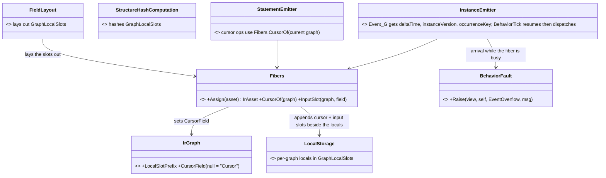
*What it shows that prose hid:* nothing new is laid out, hashed or reset by a new mechanism — the fiber's state is three
more entries in a list three existing passes already walk.

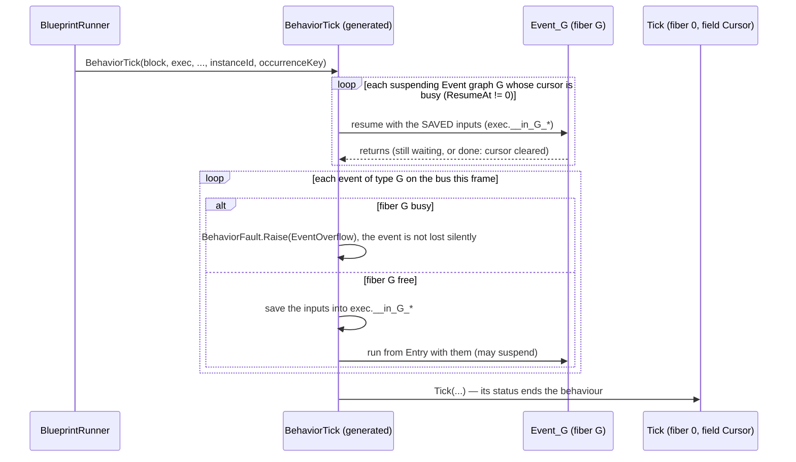
*What it shows that prose hid:* resuming BEFORE dispatching means a fiber that started this frame is not stepped twice in
one frame, and a fiber that finishes on resume frees itself for an event arriving the same frame.

| decision | lean | rejected — one line each |
|---|---|---|
| the Tick graph's cursor | ⭐ keeps the field name `Cursor` ⇒ every existing Instance and behaviour is byte-identical | renaming every cursor `F0`: moves all ~300 goldens for no behaviour change |
| scope | ⭐ **behaviours only**; `BP1658` stays for an Instance's Event graph | Instances too: their events arrive through `BlueprintEventDispatch`'s handler delegate, which has no `instanceVersion` and no per-frame resume caller — a second scheduler for a tier the programme is retiring toward behaviours |
| the policy until S6b (U-6) | ⭐ **Parallel(1)**: U-6's default with N = 1. An arrival while busy ⇒ `BehaviorFault` (`EventOverflow`) + log | ignore (U-6 rejects it); restart (a different policy, S6b) |
| order inside `BehaviorTick` | ⭐ resume busy fibers → dispatch this frame's events → Tick | dispatch first (§4a ④'s wording): a fiber started this frame would be resumed in the same frame, re-invoking a latent action twice |
| the event payload of a waiting fiber | ⭐ its graph INPUTS are saved as `__in_{G}_{field}` slots and passed back on resume — the body is unchanged (it reads parameters) | copying the whole event struct: needs its size at compile time and the body would change |
| the Event method's signature (behaviour) | ⭐ every behaviour Event method gains `deltaTime, instanceVersion, occurrenceKey`, as `Tick` has | only suspending ones: two shapes, and `Get Delta Time` in a non-suspending Event graph is already a `CS0103` today |
| `Finish` with fibers live (U-8) | ⭐ unchanged: the Tick's `Return` finishes the run and CE-449's clear zeroes the whole `Exec`, every fiber with it | — |

⚠ **Not in S6a:** Parallel(N > 1), Restart, Queue(N) and the event ring (S6b); Task-node completion fibers (S6c).

#### S6a as-built *(`2026-10-02`, CE-2005)*

| piece | where |
|---|---|
| `IrGraph.CursorField` (null = the shared `Cursor`); `Fibers.Assign` gives each suspending Event graph of a behaviour `__fib_{G}` (a `BlueprintLatentCursor`) and `__fib_{G}_in_{field}` per input, appended to `GraphLocalSlots` | `Ir/IrGraph.cs`, `Lowering/Fibers.cs`, `InstanceLowering` |
| every cursor op reads `Fibers.CursorOf(current graph)` (7 sites, one expression) | `StatementEmitter` |
| a behaviour's Event method takes `deltaTime, instanceVersion, occurrenceKey` like `Tick`; its thunk refuses an arrival while busy (`BehaviorFaultCode.EventOverflow`), saves the inputs, then calls with the saved copies; `BehaviorTick` resumes busy fibers first | `InstanceEmitter` |
| `BP1658` binds an Instance's Event graph only | `Stage2_Validate` (`V_LatentRules`) |
| `BehaviorFaultCode.EventOverflow = 5` | `BehaviorFault.cs` |
| rails `BlueprintBehaviourTests.S6a_*` (3): an Event graph runs a child across frames while the Tick keeps running, then writes the event's `Damage` it started on; a second hit while it waits faults the run with `EventOverflow`; the emitted shape. The S1 BP1658 rail now uses an Instance. Red-proofs: resuming with default inputs leaves `Got` = 0; dropping the busy check removes the fault | |

⚠ **Residue:** the AI debugger / inspector still show the Tick cursor only (§4a ⑥ — a fiber list is a reader change, with S6b).


#### S6b design — the event policies (U-6) *(`2026-10-02`, S6b-1 + S6b-2a BUILT — as-built below; S6b-2b deferred, demand-driven)*

📐 **Measured basis.** S6a's fiber state is flat named slots (`__fib_G`, `__fib_G_in_x`) plus the graph's promoted
locals (`__loc_G_x`), all addressed through `{ExecVar}.` (`EmissionContext.LocalFieldName`, `Fibers.CursorOf`). A child
hosted from an Event graph is keyed by a static per-node template (`__RunSite_N`), and an inline action by
`HostedKeyAt(occurrenceKey, StandaloneStateKeyFor(primitive))` (`InlineActionLowering`). ⇒ **N concurrent copies of one
graph need (a) N copies of its state and (b) N distinct keys for whatever it hosts.**

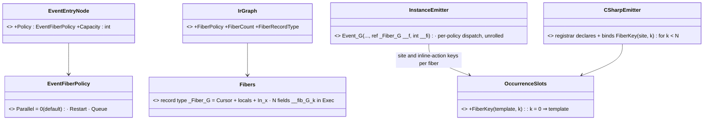
*What it shows that prose hid:* a fiber becomes ONE generated record, so "N copies" is N fields of one type and the
Event method takes `ref` to whichever copy runs. The key salt is a runtime function both the registrar and the call use,
so provisioning and resolution cannot disagree.

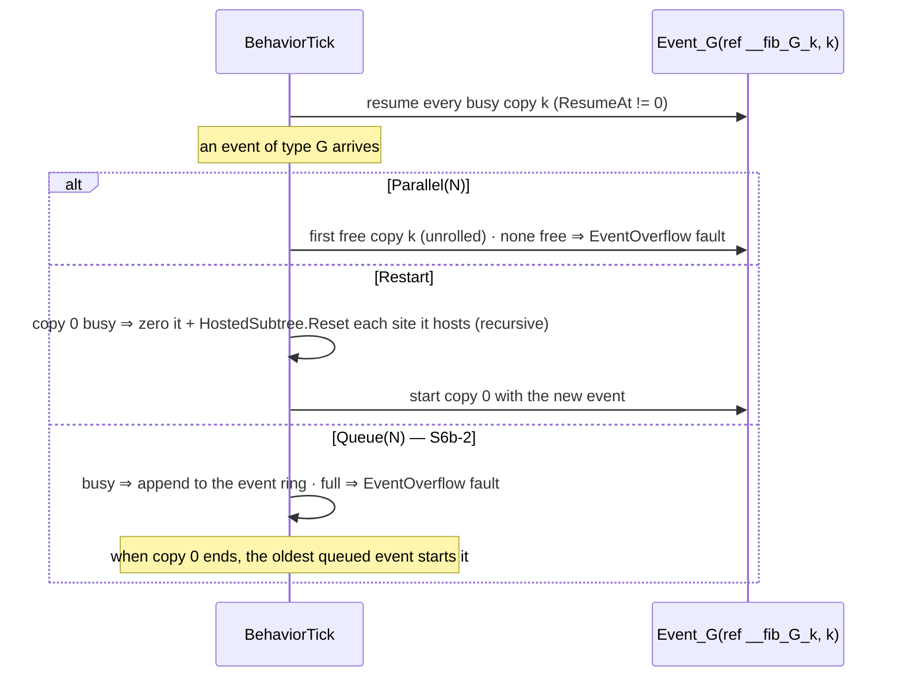

| decision | lean | rejected — one line each |
|---|---|---|
| where the policy lives | ⭐ on the Event graph's entry node (`Policy`, `Capacity`; both omitted from JSON at their defaults ⇒ every asset unchanged) | a per-asset setting: two handlers of one asset need different policies |
| default | ⭐ Parallel, Capacity 1 (= S6a's behaviour) | Parallel(4): costs 4× the record on every behaviour that never overlaps |
| N copies of state | ⭐ one generated record struct per graph, N fields of it in `Exec` | N copies of every flat slot: N× the names, and the method body would need N variants |
| keys under a copy | ⭐ salt the TEMPLATE: `FiberKey(template, k)` (copy 0 = the template) for hosted sites and inline actions; the registrar declares every copy | salting the occurrence key: provisioning computes nested keys from declared templates, so a salted occurrence is never provisioned |
| `When` memory inside an Event graph | ⚠ stays per graph (shared by its copies) | per copy: When fields are added before fibers exist; moved with S6c if a case needs it |
| limits | ⭐ `Capacity` 1..16; Restart is one copy; both checked by `BP1660` | unbounded: a fixed layout needs a compile-time N |
| **S6b-1** | ⭐ Parallel(N) + Restart | — |
| **S6b-2** | ⭐ Queue(N) with the ONE byte ring in `Exec` (user ruling above), managed events through `FdpAutoSerializer`, the checkpoint/restore rail | — |

#### S6b-1 as-built *(`2026-10-02`, CE-2006)*

| piece | where |
|---|---|
| `EventEntryNode.Policy` (`EventFiberPolicy` Parallel / Restart / Queue) + `Capacity`, both omitted from JSON at default; carried to `IrGraph.FiberPolicy` / `FiberCapacity` | `Assets/Nodes.cs`, `Stage5_Schedule` |
| ⭐ **S6a's flat fiber slots became ONE record per graph**: `_Fiber__fib_{G}` { `Cursor`, the graph's promoted locals (moved out of the shared slots), `In_{x}` }, and `Exec` holds `Copies(g)` fields `__fib_{G}_{k}`; the record size comes from `FieldLayout.RecordSize` (the same layout function) | `Lowering/Fibers.cs`, `FieldLayout.cs` |
| a fiber graph's cursor and locals are reached through `Fibers.Container` (`__f` in a fiber, `__ex` elsewhere) — the one switch both `StatementEmitter` and `EmissionContext.LocalFieldName` use | `Fibers.cs`, `StatementEmitter`, `EmissionContext` |
| the Event method takes `ref _Fiber… __f, int __fi`; Run Behaviour sites and inline actions inside it key by `OccurrenceSlots.FiberKey(template, __fi)` (copy 0 = the template ⇒ byte-identical) | `InstanceEmitter`, `StatementEmitter`, `InlineActionLowering`, `OccurrenceSlots` / `OccurrenceSlotKey.ComputeFiberKey` |
| the registrar declares and binds one site slot per copy | `CSharpEmitter.EmitBehaviorRegistration` |
| dispatch per policy, unrolled: Parallel(N) = first free copy, else `EventOverflow`; Restart = zero copy 0 + `HostedSubtree.Reset` each site it hosts, then start | `InstanceEmitter.EmitFiberDispatch` |
| `BP1681` (BP1660–1667 are reserved for macros): Capacity outside 1..16, Restart with Capacity > 1, Queue until S6b-2 | `Stage2_Validate`, `DiagnosticCodes` |
| rails `BlueprintBehaviourTests.S6b_*`: Parallel(2) runs two handlers at once, each writing the event it started on (9 then 7); Restart — only the newest event is ever written; `BP1681` ×3. Red-proofs: one copy only ⇒ the second hit faults; Restart as Parallel ⇒ faults; copies sharing one child key ⇒ the handlers interfere | |

✅ **RESOLVED `2026-10-02` — user:** *"i just need the blueprint state to be correctly saved to the recordings and
restored on replay, you are free to choose performance optimal implementation."* ⇒ ⭐ **the requirement is the
round-trip, not the storage shape**: in-flight copies keep their inputs in their records (as built); the ring is
built in S6b-2 only for Queue(N) and managed payloads. 🔒 **Proved by rail**
`BlueprintBehaviourTests.S6_AWaitingHandler_IsSavedToTheRecording_AndResumesAfterReplay` — a keyframe recorded
through the real `AsyncRecorder` mid-wait, `PlaybackController.SeekToFrame` back to it, and the restored handler
finishes and writes the event it held (red-proved by marking the blueprint storage tiers `NoReplay`). ⇒ every later
storage change (S6b-2's ring included) must keep this rail green.

⚠ *Prior state, kept for the record:* **DEVIATION from the ring ruling, argued — and OPEN for the user** *(the "Recording and replay" block below)*. The
ruling says ONE byte ring holds every pending event, *including the event a waiting fiber still holds*. As built
(S6a/S6b-1), a waiting copy keeps its event's **declared inputs** in its own fixed record instead. Why: for unmanaged
inputs the record is laid out at compile time, sits in the same recorded slot (so replay and checkpoints carry it — the
ruling's purpose), needs no offsets, free-marking or head advance, and copies only the inputs the graph reads, not the
whole event. ⭐ **Lean: keep the records for in-flight copies; the ring is still built in S6b-2 for what a record cannot
hold — Queue(N)'s waiting events and managed payloads.** ⚠ If the ruling meant "literally one storage for everything",
S6b-2 moves the in-flight inputs into the ring too (a fiber then keeps an offset); the emitted body is unchanged either
way, since it reads parameters. 📐 Measured for S6b-2: `FdpEventBus.ReadManaged<T>()` / `HasManagedEvent<T>()` exist
(no Fdp.Core change needed); `FdpAutoSerializer` takes a `BinaryWriter` only (no span API) ⇒ the "small adapter over the
ring" case.

#### S6b-2a as-built — Queue(N) *(`2026-10-02`, CE-2007)*

| piece | where |
|---|---|
| ⭐ **the queue is a fixed circular buffer of the graph's INPUTS in `Exec`** — N entries of a generated `_FiberIn…` record + `_qHead` / `_qCount` ints, laid out by `FieldLayout`, recorded with the rest of the brain state; no serialization, no allocation (user, 2026-10-02: "free to choose performance optimal implementation") | `Lowering/Fibers.cs` |
| a generated `QueueAt…(ref Exec, i)` ref accessor (a switch over the N fields) | `InstanceEmitter.EmitBehaviorStructs` |
| arrival: copy free and nothing waiting ⇒ run now; else append; full ⇒ `EventOverflow` fault | `InstanceEmitter.EmitFiberDispatch` |
| drain: after the resume loop and BEFORE this frame's arrivals (keeps order), `while` the copy is free and the line is not empty | `InstanceEmitter` (`BehaviorTick`) |
| `BP1681` no longer refuses Queue (Capacity 1..16 still bounds it) | `Stage2_Validate` |
| rails `BlueprintBehaviourTests.S6b_Queue2_RunsArrivalsInOrder_AndTheLineSurvivesReplay` (7 → 9 → 11, then a keyframe recorded with 9 and 11 waiting replays the same order) and `S6b_AFullQueue_FaultsTheRun`. Red-proofs: newest-first drain ⇒ wrong order; no fault on a full line ⇒ no fault | |

⏸ **S6b-2b deferred — demand-driven (filed as CE-2008).** 📐 Measured: Event graphs exist only on Instance assets today
(6 corpus files, all `Dispatch: Instance`), and the editor's event picker discovers `[BlueprintEvent]` STRUCTS only
(`BlueprintEventDiscovery.cs:29`), so no managed event can be authored. ⇒ managed-event handlers, the byte ring for their
payloads and the `FdpAutoSerializer` span API (user-authorised) wait for the first real case.

⚠ **Residue:** an inline action restarted by Restart keeps its lazily-attached working state (it is not a hosted site, so
`HostedSubtree.Reset` does not reach it) — the same as a Tick that restarts today; `When` memory in an Event graph is per
graph, not per copy; the editor does not show `Policy`/`Capacity` yet (no Event-graph authoring surface exists).


⭐⭐ **Recording and replay** *(user, 2026-10-02: "the event queue needs to be saved as part of the blueprint state,
serializable to recording so that replay reconstructs the queue")*. All of a blueprint's execution state lives in its
`Exec` record **inside the occurrence store**: every fiber's cursor, locals and `When` memory, every waiting fiber's copy
of its event, and the Queue(N) ring. The store components are `[DataPolicy(NoScenario)]` only
(`BlueprintBlackboard1024.cs:16`). Per `DataPolicyAttribute.cs`, that means **recorded by the Flight Recorder and
binary checkpoints, and omitted from scenario JSON**, so a replay or checkpoint restore reconstructs every fiber and
every queued event.
⛔ **Hard rules that keep this true:**
- the queue and payload copies are fixed-size and blittable;
- ⛔ **no managed side structure** (no `List`/`Dictionary` of pending events);
- ⛔ ~~an event type a waiting handler copies must be unmanaged (bus events already are)~~ — **WRONG, corrected
  2026-10-02** (user: *"the events might be managed objects"*). The bus has a managed channel (`PublishManaged`). Today a
  blueprint Event graph receives **unmanaged events only** (`BlueprintEventDispatch.cs:47`, `ReadRawByTypeId`), so a
  managed event handler is new capability that S6b must add. The rule is therefore:
  - ⭐⭐ **ONE BYTE RING inside the blueprint's brain-state slot holds EVERY pending event** *(user ruling 2026-10-02:
    "serialize to a ring byte buffer within the blackboard slot" — supersedes a per-event-type generated managed
    component, rejected by the user)*. Each record is `[eventTypeId][length][bytes][state]`:
    - an **unmanaged** event is copied in raw (a memcpy, no allocation);
    - a **managed** event is serialized into the ring by the same serializer the recorder uses for managed state
      (`FdpAutoSerializer`), written straight into the ring span; it is deserialized when its handler runs.
  - **One ring, two users:** a Queue(N) handler's waiting events, AND the event a waiting fiber is still holding (a
    fiber keeps the offset of its record). A record is marked free when its fiber ends; the ring's head advances over
    freed records, so out-of-order completion (Parallel(N)) needs no compaction.
  - **Capacity** is fixed per blueprint at compile time (derived from the declared policies, author-adjustable).
    Overflow ⇒ `BehaviorFault` + log, never a silent drop.
  - ⭐ The ring is ordinary bytes in the recorded store ⇒ **replay and checkpoints reconstruct it with no special
    handler**, managed events included.
  - ⚠ **Cost, stated honestly:** a managed event allocates when its handler deserializes it. A managed event already
    allocates when it is published, so this adds one object per handled managed event, not a per-frame cost.
    Unmanaged events stay allocation-free.
  - ⛔ rejected: holding managed references in a generated per-event-type managed component (a component per type,
    per-type fixed capacities: user, 2026-10-02 *"Come on"*); a custom serializer hook on the slot.
  - ⚠ to check in S6b: `FdpAutoSerializer` can write into a caller-supplied span without an intermediate
    `MemoryStream` (otherwise a small adapter over the ring).
- the queue layout is part of `StructureHash`.

📋 **Rail (S6b):** fill a queue, checkpoint, restore into a fresh world, tick; the same events are handled in the same order.
⚠ Pre-existing, outside this design: `BrainTickSystem` keeps two managed dictionaries (`_publishedTerminalForInstanceId`,
`_blueprintLayout`) that are not recorded. Recorded to check in S4, when that system is collapsed.

⭐ **Instances use the same lowering** (one compiler path, no fork); their `Exec` stays inside their single payload
because an Instance is not a behaviour. ⚠ Cost: every Instance's `StructureHash` and golden moves once.
**Split:** S6a per-graph fibers (Tick + Event graphs; fixes I10–I12) · S6b event policies (U-6) · S6c Task-node
completion fibers (lands with S7).

#### S7 design — the Behaviour Task node *(`2026-10-02`, frame U-11; sub-decisions decided-and-logged by the behaviours lane, user: "run autonomously … continue next to S7")*

📐 **Measured basis** *(inventory: `scripts/find.sh RunBehavior` — 35 C# sites, 0 JSON assets; codebase-memory index current)*:

| # | fact | where |
|---|---|---|
| T1 | the node is `RunBehaviorNode` (kind `"RunBehavior"`), pins In / Out / OnFailure; no shipped asset uses it | `Assets/Nodes.cs:472`, `BuiltInNodeRegistry.RunBehaviorPins`; `git grep '"RunBehavior"' -- '*.json'` empty |
| T2 | it is scheduled as a latent node: the fiber suspends at it; each frame the resume check re-invokes `IrOp_RunBehavior` (which ticks the child) and branches Running → plain return · Success → `success` block · Failure → `FailureBlock` | `Stage5_Schedule.cs:527`, `WaitLowering_Instance.cs:195-266` |
| T3 | ⛔ the editor has NO palette entry and NO drawer for it (the S5d residue) | `grep RunBehavior Hrot.Blueprints.Editor` empty |
| T4 | both production hosts own a `BehaviorRegistry` (`GetRegisteredNames()`), and both build the drawers through ONE binder | `EditorSubsystem.cs:1819`, `CgfSubsystem.cs:1518`, `AiBlueprintNodeAuthoringBinder.CreateDrawers` |
| T5 | an exec link lands on a PIN, but the scheduler walks node to node (`GetSingleExecSuccessor` returns a node) ⇒ a second exec INPUT (Abort) is invisible to it | `Stage5_Schedule` |
| T6 | 🔴 **found + FIXED (CE-2018):** both resume lowerings chained the dispatch wrongly for 3+ waits in one graph (each link's else went to `check[k+1]`), so the third wait re-entered itself forever. ⇒ S7's extra (aborted) resume labels are safe only on the fixed chain | `WaitLowering_Instance`, `WaitLowering_AiPrimitive`; rails `CE2018_*`, `AiPrimitive_ThreeWaits_*` |

**Claim table** *(the rows the leans rest on)*

| claim | code | design basis |
|---|---|---|
| S7 grows the S5d node, no second node | ✅ T1/T2 | ✅ U-11 + the S5d note above ("S7 GROWS THIS NODE") |
| "run and wait" = only completion pins wired | ✅ T2 is exactly that | ✅ U-11 verbatim |
| While Running is latent-free | — | ✅ U-11 ("latent-free — a BP2050-shaped rule") |
| an Abort needs a continuation | — | ⚠ U-11 is silent; §7's Demo_MissionPlan chains *"Abort → Retreat"* ⇒ ⭐ lean: **Abort ⇒ Failed** (D2) |
| cross-fiber abort is needed now | ⛔ no case in the corpus | ⛔ searched `docs/`+`.dev/`: only Demo_MissionPlan, which aborts from its OWN While Running |


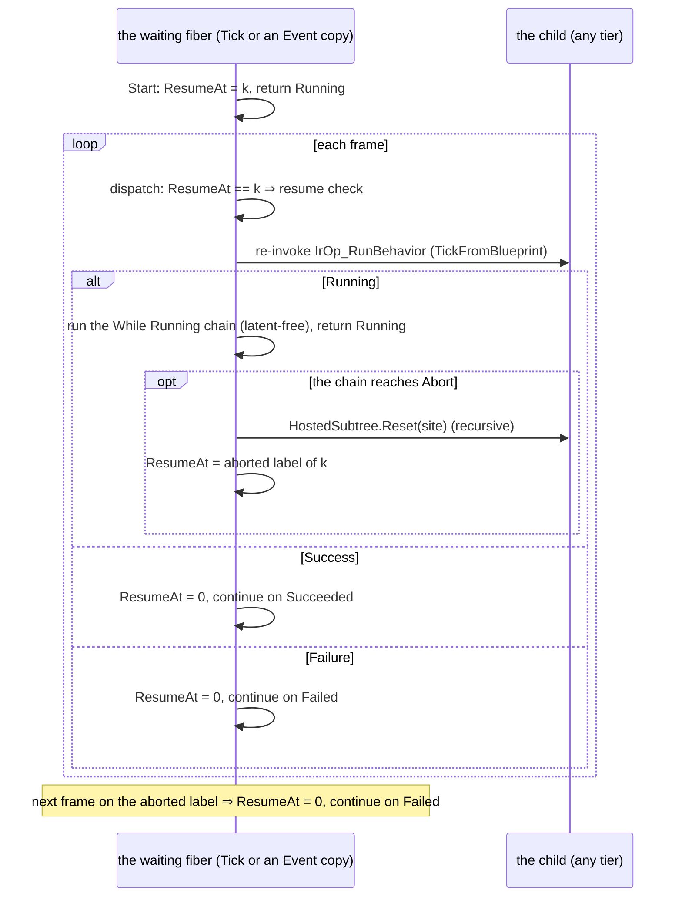

| # | decision | lean | rejected — one line each |
|---|---|---|---|
| D1 | the node's identity | ⭐ keep the class `RunBehaviorNode` (a C# rename needs Roslyn, not text, and buys nothing); kind becomes `"BehaviorTask"`, `"RunBehavior"` still reads; pins renamed to U-11's (`Start`, `Abort`, `Started`, `WhileRunning`, `Succeeded`, `Failed`), old pin names still route | a second node class: two implementations of one concept |
| D2 | what an Abort fires | ⭐ **Failed** (the task did not succeed), one frame later, on the waiting fiber | a silent stop: the demo's "Abort → Retreat" has no continuation; an `Aborted` pin: not in U-11 |
| D3 | where an Abort may come from | ⭐ S7a: **the task's own While Running chain** (the only code of the waiting fiber that runs while it waits) — `BP1685` otherwise. Cross-fiber abort (an Event handler aborting the Tick's task) is demand-driven, with S7b's driver | build it now: a per-site state machine shared across fibers, no case yet |
| D4 | how Abort reaches the scheduler (T5) | ⭐ a compile-time **abort node**: every link into an `Abort` pin is retargeted to one (Stage 2.6, per handler, after the split) | teach the scheduler entry pins: every node kind would grow an "entered by" axis |
| D5 | the aborted state | ⭐ a second resume label per task (`n + k`): the dispatch routes it to a block that clears the cursor and continues on Failed | a flag field per task: new storage, and a stale flag would fail the next Start |
| D6 | While Running | ⭐ the Running arm of the resume check jumps to the chain instead of returning; the chain's end returns (still Running, cursor unchanged). Latent nodes refused: `BP1684` | a separate generated method: needs the fiber's locals passed in, for nothing |
| D7 | `Started` | ⭐ S7a: wiring it is `BP1686` ("arrives in S7b") — it makes the task run ALONGSIDE, which needs the per-frame task driver + completion fibers (S6c) | quietly run-and-wait: Started would never fire |
| D8 | the editor | ⭐ a "Behaviour Task" palette entry + a drawer whose picker lists the host's registered behaviour names (`BehaviorRegistry.GetRegisteredNames`, passed by BOTH hosts through the shared binder) | a text box only: names are what authors cannot guess |

**Sub-slices.** **S7a** = D1–D8 (run-and-wait with While Running and self-Abort, editor). **S7b** = `Started`: the per-frame
task driver in `BehaviorTick` (tick every running task site, fire While Running, start a completion FIBER for Succeeded /
Failed), Start-while-running ⇒ Restart, and Abort from any graph. ⭐ S7b is S6c.

#### S7a as-built *(`2026-10-02`, CE-2019)*

⭐ Built as D1–D8 above; the classDiagram and sequenceDiagram are true as drawn. What the build added:

| # | as-built fact | where |
|---|---|---|
| A1 | the success continuation is **any exec-out that is not Failed / Started / While Running** — so a builder node with S5d-style pin names (`ExecOut`, `OnFailure`) still compiles (`IsNonSuccessOut`, `IsFailedPin` accept `OnFailure`) | `Nodes.cs` `RunBehaviorNode`, `Stage5_Schedule` task case |
| A2 | `RetargetAborts` runs on EVERY graph (a Tick graph's task aborts the same way), after the handler split | `Stage2_6_SplitEventHandlers.Run` |
| A3 | a While Running pin wired **straight into its own Abort** is the abort — the validator's walk does not re-enter the task through it (it would have pulled Succeeded's chain into "While Running") | `Stage2_Validate` `BehaviorTaskRules` |
| A4 | a task and its abort node map to ONE authored node; the debugger's breakpoint target keeps the task's own entry | `HandlerDebugIdentity.Targets` |
| A5 | `BehaviorTaskAbortNode` is classified side-effecting (resolver purity) and is a documented compile-time-only coverage exception | `V_ResolverPurity`, `NodeCoverageTests` |
| A6 | the palette entry is "Behaviour Task" (Latent); the drawer is registered by `CreateNodeDrawerRegistry(behaviourNames:)`, fed by BOTH hosts through `AiBlueprintNodeAuthoringBinder` services `BehaviourNames` | `BehaviorTaskNodeDrawer`, `EditorSubsystem`, `CgfSubsystem` |

Rails: `BlueprintBehaviourTests.S7a_WhileRunning_RunsEachFrameTheChildRuns_ThenSucceeded`, `…S7a_AbortFromWhileRunning_StopsTheChild_AndContinuesOnFailed`,
`…S7a_ATaskInATickGraph_AbortsToFailed`, `…S7a_ALatentNodeInWhileRunning_IsBP1684`, `…S7a_AnAbortFromOutsideItsWhileRunning_IsBP1685`,
`…S7a_WiringStarted_IsBP1686_UntilS7b`, `…S7a_AnS5dRunBehaviourAsset_MigratesToABehaviourTask`; `BehaviorTaskNodeDrawerTests` (5, incl. the
registry→drawer forwarding rail); `TheEqsBrainStartupIsSharedTests` (both hosts pass `BehaviourNames`).

#### S7b design — `Started`: a task that runs ALONGSIDE *(`2026-10-02`, CE-2020; decided-and-logged by the behaviours lane; BUILT — as-built below)*

📐 **Measured basis** — what already exists that a running-alongside task needs:

| # | fact | where |
|---|---|---|
| B-T1 | an Event fiber with policy **Restart** already does "start; if still running, reset every site it hosts and start over" | `InstanceEmitter.EmitFiberDispatch` (Restart arm) |
| B-T2 | `BehaviorTick` resumes every waiting fiber FIRST each frame, before arrivals and the Tick | `InstanceEmitter.EmitBehaviorEntryPoints` |
| B-T3 | every behaviour graph body has the frame context a fiber start needs (`view, ecb, self, time, deltaTime, instanceVersion, occurrenceKey`, `__bb`, `__ex`) | `InstanceEmitter.EmitEventMethod` / `EmitTickMethod` |
| B-T4 | deterministic deep-clone of a node set (ids derived from the original) and debug-id remap per clone already exist | `GraphFragmentCloner.Clone(…, freshId)`, `HandlerDebugIdentity` (E6) |
| B-T5 | ⇒ "per-frame task driver + completion fibers" (the S7 frame) would be a SECOND scheduler for what a fiber already is: a cursor that waits on a task, runs While Running each frame, and continues on Succeeded / Failed | S7a lowering = exactly that, inside one fiber |

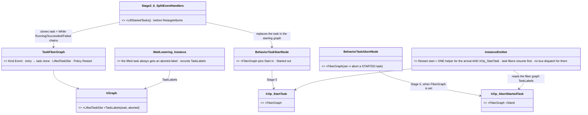

*What the picture shows that prose hid: there is no new runtime piece — the task fiber is an ordinary S6 fiber, and the
two new ops are emitted from labels the existing lowering already computes.*

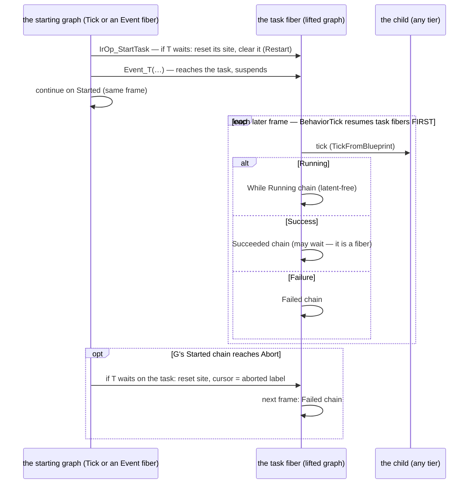

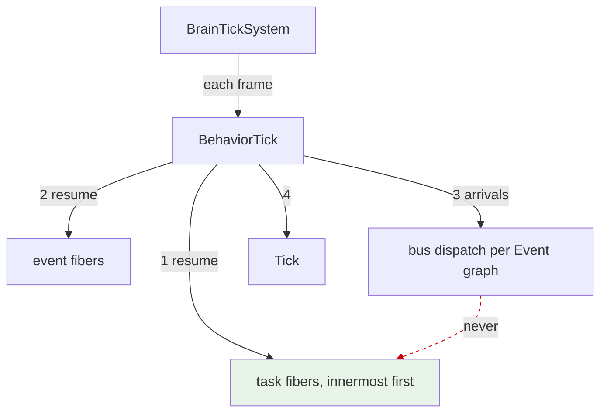

*The dead edge (red, dashed) is load-bearing: a task fiber is an Event-kind graph with NO event — it must get no
`__EvtId`, no bus dispatch and no thunk, or the generated `ResolveTypeId` would look up a type that does not exist.*

| # | decision | lean | rejected — one line each |
|---|---|---|---|
| B1 | how a Started task runs | ⭐ **LIFT** it (Stage 2.6): the task + its While Running / Succeeded / Failed chains become a compile-time task-fiber graph; in the starting graph the task becomes a start node (Start in, Started out) | a per-frame task driver + completion fibers: a second scheduler for what one fiber already does (B-T5) |
| B2 | Start while it runs | ⭐ **Restart** — the start op IS the Restart arrival (one emitter helper) | fault: a re-entered task is the normal case for an event-driven start; ignore: the newest Start would silently not happen |
| B3 | where an Abort of a Started task may come from | ⭐ its own While Running (S7a, unchanged) **and the chain after its Started pin** — the timeout shape (Started → Delay → Abort). The op aborts only while the fiber waits ON THE TASK (a task already done is not aborted). Others stay `BP1685` | any graph: a task cloned per handler has no shared identity yet — demand-driven |
| B4 | data the lifted chains read | ⭐ a pure upstream closure (no exec pins, no event node) is cloned along; any other source is **`BP1687`** ("store it in a Variable before Start") | capture the values as the fiber's inputs at Start: types are unresolved before Stage 4 — demand-driven |
| B5 | resume order | ⭐ task fibers resume FIRST, innermost first ⇒ a task started this frame first ticks its child NEXT frame, exactly as run-and-wait | after the event fibers: a task started by an event fiber this frame would also be stepped this frame |
| B6 | `BP1686` | ⭐ **retired** (number kept, `[retired]`), its rail becomes the Started rail | keep it for "Started and Succeeded both wired": that is the main use |
| B7 | the lifted originals in the starting graph | ⭐ removed by the lift (they would only be Stage 3 orphans, one `BP3010` warning each) | leave them to Stage 3: warning noise for an authored, valid graph |
| B8 | the debugger | ⭐ the task fiber's clones map to the authored ids (E6 `HandlerDebugIds`); the start node keeps the task's id | — |

#### S7b as-built *(`2026-10-02`, CE-2020)*

⭐ Built as B1–B8; the three diagrams above are true as drawn. What the build pinned down:

| # | as-built fact | where |
|---|---|---|
| C1 | the lift is a WORK-LIST over the graphs (after the handler split, before `RetargetAborts`): one Started task per pass, and a task fiber is lifted again if it starts tasks itself | `Stage2_6_SplitEventHandlers.LiftStartedTasks` |
| C2 | names and ids are derived from the task: fiber graph `{graph}_Task_0` (fiber field `__fib_{graph}Task0` after sanitising), clone ids `task-fiber:{task}:{node}`, entry `task-fiber-entry:{task}`, the starting chain's abort node `task-stop:{task}` ⇒ the same generated code on every compile | same |
| C3 | the start node keeps the task's own id and its Start / Started pin ids ⇒ the starting graph's links are untouched | same |
| C4 | `BP1687` covers TWO crossings: a non-pure value (an exec node's output, the starting event's payload), and a graph-local used by both the starting graph and the lifted chains | same |
| C5 | only lifted ORIGINALS that the starting graph no longer reaches are removed; any other orphan is still Stage 3's (with its `BP3010`) | same, `Connected` |
| C6 | `WaitLowering_Instance` always gives a task fiber's own task an aborted label and records `IrGraph.TaskLabels`; the abort op emits `if (ResumeAt == wait) { reset; ResumeAt = aborted; }` | `WaitLowering_Instance`, `InstanceEmitter.EmitTaskAbort` |
| C7 | the Restart arrival and the start op share `InstanceEmitter.EmitRestart` | `InstanceEmitter` |
| C8 | `BP1685` widened: an Abort is legal from the task's own While Running, or (Started wired) from the chain after Started — never from its Succeeded / Failed chains | `Stage2_Validate` `BehaviorTaskRules` |

⚠ **Not built (demand-driven, each refused loudly):** an Abort from another handler or graph (`BP1685`) · capturing a
starting value as the task fiber's input (`BP1687`) · passing PARAMETERS to the task's child (a Behaviour Task has no
params input yet — the child runs on its defaults; see §7's note).

Rails: `BlueprintBehaviourTests.S7b_AStartedTask_RunsAlongside_TheGraphContinuesAtOnce`, `…S7b_StartWhileRunning_RestartsTheTask`,
`…S7b_AbortFromTheStartedChain_StopsTheTask_AndTakesFailed`, `…S7b_AStartedTaskReadingTheStartingEvent_IsBP1687`,
`…S7b_AnAbortFromTheSucceededChain_IsStillBP1685`.

#### S8 design — a Behaviour Task's PARAMETERS *(`2026-10-03`, CE-2022; user: "approved" the `Params` pin, 2026-10-03; BUILT — as-built below)*

📐 **Measured basis:**

| # | fact | where |
|---|---|---|
| P-T1 | a hosted child is seeded ONCE, at its start, from a slice of the HOST's block — copied, or handed to the child's own resolver | `HostedSubtree.StartChild` + `SiteBinding` (CE-431/CE-443) |
| P-T2 | ⛔ the Behaviour Task passes NO slice: `TickFromBlueprint` hard-codes `SiteBinding.Unbound` ⇒ every child runs on its defaults | `HostedSubtree.TickFromBlueprint` |
| P-T3 | BTree and HSM hosts already bind a host variable per site (`ParamsVariable`), composed when the child is picked | `AutoManagedVariables.ComposeForSubtree` (CE-439) |
| P-T4 | a child's hosted INPUT type, per tier: blueprint = its `Params` (`JsonParamsDtoType`) · curated, no resolver = `BlackboardLayoutType` · curated typed resolver = its `TAuthored` (⛔ the registry keeps only the type-erased delegate) · BTree = its `Inputs` struct (editor catalog, `IBehaviorInputsContract`) | `CSharpEmitter.EmitBehaviorRegistration`, `CuratedBehaviorGenerator`, `BehaviorTreeAsset.InputsTypeId` |
| P-T5 | a child's start happens on its FIRST tick (the frame after the task is reached), so the source must survive until then ⇒ a host VARIABLE, not a stack value | `HostedSubtree.TickHosted` |

**Claim table**

| claim | code | design basis |
|---|---|---|
| params come from a host variable, once, at start | ✅ P-T1 | ✅ `DESIGN_Parameter_Model` §P.2 ("the host variable its node/state names") |
| the pin is only an AUTHORING form of that variable | ✅ P-T5 forces a variable anyway | ✅ §P.2 · user approval 2026-10-03 |
| one runtime mechanism for all three hosts | ✅ P-T1 serves BTree + HSM today | ✅ ruling 9 (one implementation per concept) |

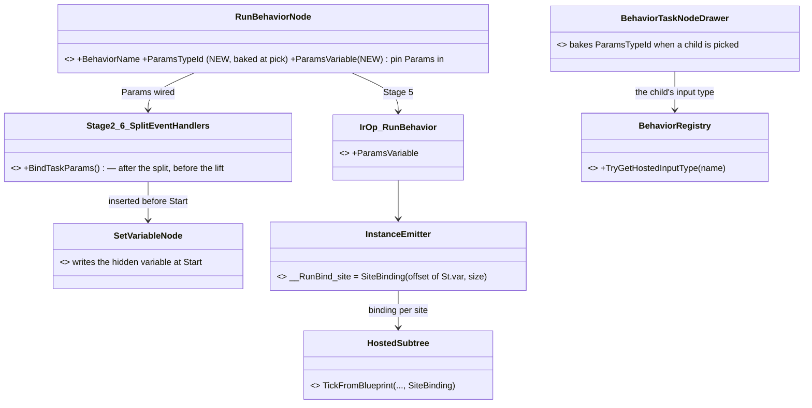

*What the picture shows that prose hid: the pin never reaches the runtime — Stage 2.6 turns it into a Set Variable of a
hidden host variable, so everything after it is the CE-431 binding BTree and HSM already use.*

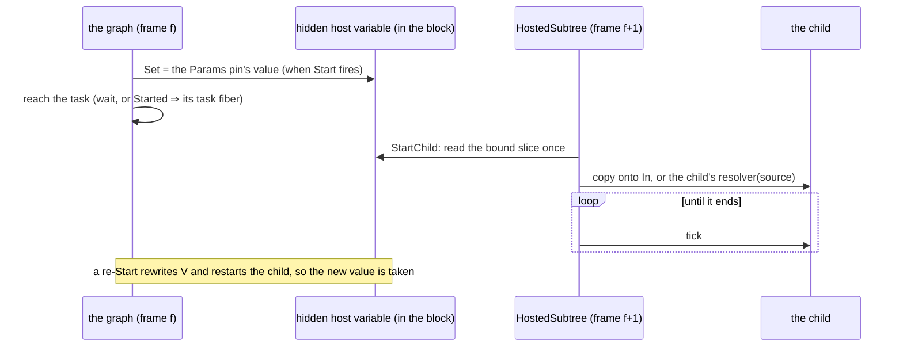

| # | decision | lean | rejected — one line each |
|---|---|---|---|
| P1 | the authoring form | ⭐ a `Params` data-IN pin typed as the child's input, projected when the node has a `ParamsTypeId` | a variable picker only (the BTree/HSM form): the user asked for a pin, and a pin takes a value computed at Start |
| P2 | where the value lives until the child starts | ⭐ a compiler-made HIDDEN variable per task (named from the task's id), written by an inserted Set Variable on the Start path (Stage 2.6, per handler — after the split, so clones get their own) | the child's slot directly: it is not allocated until its first tick |
| P3 | a task authored with `ParamsVariable` and no pin | ⭐ bound to that variable directly (the BTree/HSM form, same field name) | — |
| P4 | a Started task (S7b) | ⭐ the inserted Set stays in the STARTING graph (it is before Start), so the pin may read the starting event; the task fiber's clone keeps `ParamsVariable` | lifting the Set into the fiber: the event payload is not there (`BP1687`) |
| P5 | the child's input type, for the drawer | ⭐ `BehaviorRegistry.TryGetHostedInputType`: a typed source resolver's `TAuthored` (now recorded) · else `JsonParamsDtoType` when the child is a blueprint · else `BlackboardLayoutType`; a BTree child via the editor catalog (`IBehaviorInputsContract`) | one more per-tier switch in the editor: the registry already owns "what does this child accept" |
| P6 | a width mismatch | ⭐ `HostedSubtree.Supply` already THROWS, naming both widths; a `ParamsTypeId` that does not resolve fails as any unresolved variable type does (Stage 4) — no new code | silently truncating |

*Who calls what each frame is unchanged from S7b's module diagram: the graph's tick reaches the task, `TickFromBlueprint`
steps the child — it now passes the site's binding as its last argument.*

#### S8 as-built *(`2026-10-03`, CE-2022)*

⭐ Built as P1–P6; both diagrams above are true as drawn.

| # | as-built fact | where |
|---|---|---|
| Q1 | `RunBehaviorNode.ParamsTypeId` + `ParamsVariable` (both omitted from JSON when null); the `Params` pin is projected by the ONE pin schema both the compiler and the editor read | `Nodes.cs`, `BuiltInNodeRegistry.RunBehaviorPins(rb)` |
| Q2 | `BindTaskParams` (Stage 2.6, after the split, before the lift) adds `__TaskParams_{task}` and a Set Variable `task-params-set:{task}` on the Start path, and REPLACES the task node (node objects are shared with the caller) | `Stage2_6_SplitEventHandlers.BindTaskParams` |
| Q3 | the emitter measures each bound site's slice on the real `Block` (`__SiteBind<T>` → `__RunBind_{site}`) and passes it as `TickFromBlueprint`'s last argument; an unbound site emits exactly what it did before (no golden moves) | `InstanceEmitter`, `StatementEmitter` |
| Q4 | `BehaviorRegistry.TryGetHostedInputType`: a curated typed resolver's `TAuthored` (the curated generator now records it) · a blueprint's `Params` · else a child's `BlackboardLayoutType` | `BehaviorRegistry`, `CuratedBehaviorGenerator` |
| Q5 | the drawer bakes the type on pick and re-derives the pins with the BP-202 rule (a vanished `Params` wire is pruned, restored on undo); both hosts pass `BehaviorTaskNodeDrawer.ParamsTypeLookup(() => _behaviorRegistry)` | `BehaviorTaskNodeDrawer`, `EditorSubsystem`, `CgfSubsystem` |

⚠ **Known limits, filed as CE-2023:** ① an editor-authored **BTree** child publishes its Inputs struct only through the editor
catalog (`IBehaviorInputsContract`), which the lookup does not read yet ⇒ no `Params` pin for a BTree child; ② the binding's
width is `Unsafe.SizeOf<T>` while a child's Input width is its manifest extent / `Marshal.SizeOf` — a struct with trailing
padding or a `bool` field THROWS at start (the CE-431 rule, pre-existing for BTree hosts too); ③ §7's demos still host step
children — moving them onto `MoveToLocation` / `FireAtTarget` needs the movement and fire systems in the rail's world.

Rails: `BlueprintBehaviourTests.S8_TheParamsPin_SeedsTheChild_AtItsStart`, `…S8_AStartedTask_TakesItsParamsFromTheStartingEvent_AndARestartTakesTheNewOnes`,
`…S8_AnUnwiredParamsPin_BindsNothing`, `…S8_TheHostedInputType_IsTheChildsAuthoredInput`; `BehaviorTaskNodeDrawerTests.Picking_BakesTheChildsParamsType_AndProjectsAParamsPin_Undoably`,
`…TheRegistry_ForwardsTheParamsTypeLookup_ToTheDrawerItBuilds`; `TheEqsBrainStartupIsSharedTests` (both hosts pass the lookup).

#### S8b design — ONE answer to *"what does this child take?"* *(`2026-10-03`, CE-2024/CE-2025; user: "plan to do 1 and then 2. document it first"; BUILT — as-built below)*

📐 **Measured:** three producers answered the same question, two of them in the live editor.

| # | producer | source | covered | consumers |
|---|---|---|---|---|
| ① | `BehaviorRegistry.TryGetHostedInputType` (S8) | the runtime `BehaviorDefinition` | blueprint, curated — ⛔ BTree/HSM excluded by S8's own rule | the Behaviour Task drawer |
| ② | `IBehaviorInputsContract.InputsTypeId` (CE-439) | the editor catalogue, recomputing the name from the asset (`BTreeEmitCore.InputsStructTypeId`) | BTree only (one implementer) | the BTree + HSM subtree pickers |
| ③ | `GeneratedBehaviorSchemaCatalog` / `GeneratedBlueprintSchemaCatalog` | sibling asset files, at generation time | BTree / blueprint siblings | the generators sizing a host variable |

| claim | code | design basis |
|---|---|---|
| a generated BTree/HSM definition already carries its Inputs struct | ✅ `BTreeBridgeEmitCore.EmitRootParamsMembers` sets `JsonParamsDtoType` = the Inputs struct (CE-235/CE-437), shared by `HsmBridgeEmitCore` | ✅ Q76 §12.2b ("JsonParamsDtoType stays the Inputs struct") |
| ⇒ ①'s BTree/HSM gap is S8's RULE, not missing data | ✅ S8 read `JsonParamsDtoType` for the blueprint tier only | — |
| ② was never weighed against ① | ✅ — | ✅ Q76 §12.28's rejected list names "the HSM editor references the BTree editor", not the registry |
| ② has no availability edge over ① | ✅ `ComposeForSubtree` refuses a type that is not loaded ⇒ both need the child built | — |
| the facet pickers can reach ① without new host wiring | ✅ `AiFacetPickerServices.BehaviorRegistry` is already passed by both hosts | — |
| ③ answers at GENERATION time, where no runtime type exists | ✅ the generators run inside Roslyn | ✅ Q76 §12.28 — out of scope here |

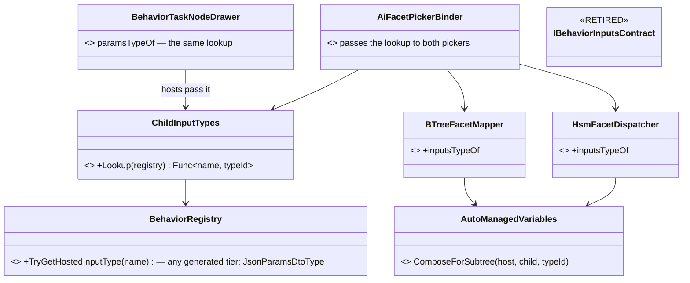

*What the picture shows that prose hid: after the change there is one arrow into the answer — every picker (BTree state,
HSM state, Behaviour Task) reaches `BehaviorRegistry` through one function; the catalogue keeps only what it is for (the
asset id and rename heal), not the type.*

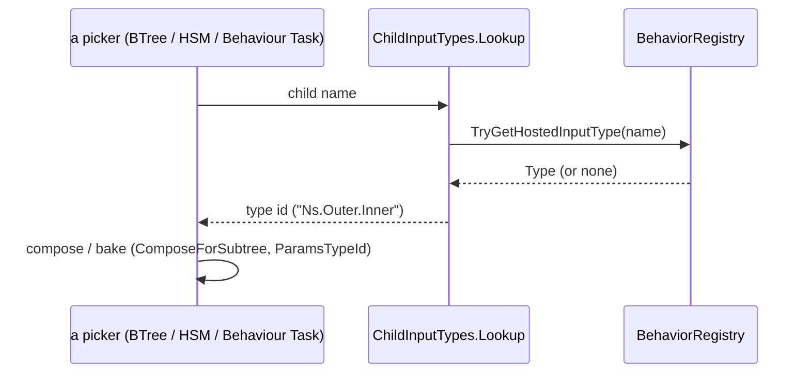

| # | decision | lean | rejected — one line each |
|---|---|---|---|
| U1 | the rule | ⭐ curated typed resolver → its `TAuthored` · else a definition WITH a manifest (BTree, HSM, blueprint — generated: authored DTO = the Inputs mirror) → `JsonParamsDtoType` · else no curated resolver → `BlackboardLayoutType` | per-tier switches: the manifest already says "generated" |
| U2 | the editor seam | ⭐ ONE `Func<string, string?>` built by `ChildInputTypes.Lookup` (in `Hrot.Editor.AiComposition`, which both binders and both hosts already reach), passed to all three pickers | the catalogue as the source: it would need per-tier answers only the registry has |
| U3 | `IBehaviorInputsContract` | ⭐ RETIRED with its one implementer's `InputsTypeId`; its two tests are re-homed onto the lookup (claims kept, source changed) | keep it beside the registry: two producers for one fact (ruling 9) |
| U4 | `BTreeEmitCore.InputsStructTypeId` | ⭐ KEPT — it is the naming rule the GENERATORS (③) and the emitted `JsonParamsDtoType` share | — |
| U5 | ③ | ⭐ out of scope (generation time); its BTree/blueprint split is a candidate for its own unification | folding it in: no runtime types exist where it runs |

Slices: **S8b-1** (CE-2024) = U1 + rails · **S8b-2** (CE-2025) = U2 + U3 + re-homed tests + the host lookup routed through
`ChildInputTypes`.

#### S8b as-built *(`2026-10-03`, CE-2024 + CE-2025)*

⭐ Built as U1–U5; the class and sequence diagrams above are true as drawn.

| # | as-built fact | where |
|---|---|---|
| V1 | the rule: a curated typed resolver's `TAuthored` · else ANY child with a manifest → `JsonParamsDtoType` (none when it has no Inputs half) · else a curated child's `BlackboardLayoutType` | `BehaviorRegistry.TryGetHostedInputType` |
| V2 | `ChildInputTypes.Lookup(Func<BehaviorRegistry?>)` reads the registry when asked (a child registered later is found) and spells a nested type with `.` | `Hrot.Editor.AiComposition/ChildInputTypes.cs` |
| V3 | the BTree mapper and HSM dispatcher take it as an optional `childInputsTypeOf`; `AiFacetPickerBinder` builds it from the `BehaviorRegistry` the hosts already pass; both hosts pass the same lookup to the Behaviour Task drawer (S8's `BehaviorTaskNodeDrawer.ParamsTypeLookup` moved here) | `BTreeFacetMapper`, `HsmFacetDispatcher`, `AiFacetPickerBinder`, `EditorSubsystem`, `CgfSubsystem` |
| V4 | `IBehaviorInputsContract` and `BehaviorTreeAsset.InputsTypeId` DELETED; the catalogue now gives only the asset id (rename heal). Its two test files keep every claim, with the lookup standing in for the registry | `BTreeFacetMapperTests`, `HsmSubtreeAuthoringTests` |

Rails: `BlueprintBehaviourTests.S8b_AGeneratedChild_AnswersWithItsInputsStruct_AndIsSeeded` (red-proved), `ChildInputTypesTests` (2),
the re-homed CE-439 picker rails, `TheEqsBrainStartupIsSharedTests` (both hosts pass `ChildInputTypes.Lookup`).

#### S8c design — ONE generated-type catalogue for every generator *(`2026-10-03`, CE-2026; user: "unify the generator catalogs too if that is possible; the more unification, the better"; this is S8b's U5 "candidate for its own unification")*

📐 **Measured.** Three source generators run on ONE compilation (`Hrot.AI.Behaviors`: `*.bp.json`, `*.btree.json`, `*.hsm.json`
are all its `AdditionalFiles`). ⛔ A generator never sees another's output in the same run, so a host variable typed as a
SIBLING's generated struct must be sized — and recognised — from the sibling's JSON.

| claim | code | design basis |
|---|---|---|
| BTree and HSM generators build the same size chain, by copy | ✅ `BTreeJsonGenerator.cs:241-246` ≡ `HsmJsonGenerator.cs:156-161` (Roslyn → blueprint `+Params` → BTree Inputs) | ✅ Q76 §12.28e |
| an HSM child's Inputs struct is not sized | ✅ `GeneratedBehaviorSchemaCatalog.Parse` reads `*.btree.json` only; an HSM publishes its Inputs through `HsmBridgeEmitCore.BlackboardOwner` + `BTreeEmitCore.InputsStructTypeId` | ⛔ searched Q76 §12.28 + this doc: no ruling excludes it — never added |
| the blueprint generator has NO catalogue | ✅ `BlueprintIncrementalGenerator.cs:124` — `StructSizeOracle` is Roslyn-only; it never reads `*.btree.json`/`*.hsm.json` | ✅ S8b table row ③ ("BTree / blueprint siblings") |
| ⇒ S8's `Params` pin bound to a GENERATED child DEGRADES its host's layout | ✅ **measured by the red rail:** the hidden variable is `global::`-typed (`RunBehaviorNode.ParamsPinTypeId`), so the registry's AN2 arm takes it with a GUESSED 4 bytes; the Roslyn-only oracle cannot correct it ⇒ `SizeReliable = false` ⇒ `CSharpEmitter.LayoutFromRuntime` drops the WHOLE host `Vars`/`Block` to Sequential with runtime offsets, and the debug map's state layout with it. It still compiles | ✅ S8b-2 made the editor offer exactly that type (`ChildInputTypes.Lookup`); W4 (`CSharpEmitter.UseExplicitLayout`) is what the guess turns off |
| ⛔ CORRECTED `2026-10-03`: the row above first read *"fails the real build with **BP1671**"* | ⛔ predicted from `Stage4_TypeResolve.cs:133` without reading `ParamsPinTypeId` — BP1671 guards only the bare dotted arm, and the hidden variable is never bare | — |
| a bare dotted id naming a sibling's generated type DOES hit BP1671 | ✅ `Stage4_TypeResolve.cs:133` → `RoslynClrSignatureResolver.TypeExists` (Roslyn only) — e.g. a variable an author types as a child's Inputs in the dotted form | ✅ BP-228 (U-7) |
| sharing the catalogue costs no new shipping edge | ✅ `Hrot.AiEditor.Persistence` has no project references and `Hrot.AI.Behaviors` already ships it as an Analyzer (with its package closure, CE-379) | ✅ the S2 note in `Hrot.Blueprints.Generators.csproj` refused that edge only because it "bought nothing" |

```mermaid
classDiagram
  class GeneratedTypeCatalog { <<NEW, replaces GeneratedBehaviorSchemaCatalog>> +Parse(bp, btree, hsm) +Blueprints +Declares(typeId) bool +SizeResolver(compilation, fieldSizes) Func~typeId, int?~ }
  class GeneratedBlueprintSchemaCatalog { <<EXISTS>> +Parse(bp) +TryResolveParamsSize() +FindByAssetId() }
  class GeneratedBehaviorSchemaCatalog { <<RETIRED, folded in>> }
  class StructSizeResolver { <<EXISTS, linked>> +MakeDelegate() +MakeFieldSizeDelegate() }
  class BTreeEmitCore { <<EXISTS, Persistence>> +InputsStructTypeId(dto) }
  class HsmBridgeEmitCore { <<EXISTS, Persistence>> +BlackboardOwner(hsm) }
  class BTreeBlackboardPackHelper { <<EXISTS, Persistence>> +Pack() }
  class BTreeJsonGenerator { <<EXISTS>> }
  class HsmJsonGenerator { <<EXISTS>> }
  class BlueprintIncrementalGenerator { <<EXISTS, gains the catalogue>> }
  class RoslynClrSignatureResolver { <<EXISTS, widened>> TypeExists = Roslyn OR catalogue.Declares }
  GeneratedTypeCatalog --> GeneratedBlueprintSchemaCatalog : blueprint Params
  GeneratedTypeCatalog --> BTreeEmitCore : the one Inputs naming rule
  GeneratedTypeCatalog --> HsmBridgeEmitCore : an HSM's Inputs view
  GeneratedTypeCatalog --> BTreeBlackboardPackHelper : the one packing
  GeneratedTypeCatalog --> StructSizeResolver : Roslyn first
  BTreeJsonGenerator --> GeneratedTypeCatalog
  HsmJsonGenerator --> GeneratedTypeCatalog
  BlueprintIncrementalGenerator --> GeneratedTypeCatalog : size oracle
  BlueprintIncrementalGenerator --> RoslynClrSignatureResolver
  RoslynClrSignatureResolver --> GeneratedTypeCatalog : Declares
```

*What the picture shows that prose hid: before, the blueprint generator had no arrow into any catalogue at all, and the
behaviour catalogue had no arrow to `HsmBridgeEmitCore` — the two gaps are the two missing edges.*

```mermaid
sequenceDiagram
  participant R as Roslyn (one compilation, Hrot.AI.Behaviors)
  participant G as any of the 3 generators (per asset)
  participant C as GeneratedTypeCatalog
  participant S as StructSizeResolver
  R->>G: asset + every *.bp.json / *.btree.json / *.hsm.json + Compilation
  G->>C: Parse(bp, btree, hsm)
  G->>C: SizeResolver(compilation)
  Note over G,C: Pack / Stage4 asks a size for typeId
  C->>S: Roslyn size (a type that already exists)
  S-->>C: null — a sibling's generated struct
  C->>C: blueprint +Params ? else BTree/HSM Inputs (packed by Pack, recursively)
  C-->>G: size
  Note over G,C: blueprint Stage4 asks TypeExists(typeId)
  G->>C: Declares(typeId) — Roslyn said no
  C-->>G: true for a sibling's Inputs / generated blueprint class
```

**Who calls it each frame:** nobody — it is BUILD-TIME only. Roslyn runs each generator once per compilation of
`Hrot.AI.Behaviors` (the one project whose `AdditionalFiles` carry all three asset kinds); each generator parses the catalogue
once per asset, as `GeneratedBehaviorSchemaCatalog` and `GeneratedBlueprintSchemaCatalog` are parsed today.

```mermaid
graph TD
  B[Hrot.AI.Behaviors build] -->|Analyzer| BG[Hrot.Blueprints.Generators]
  B -->|Analyzer| AG[Hrot.AiEditor.Generators]
  B -->|Analyzer, already shipped| P[Hrot.AiEditor.Persistence]
  AG -->|compiles| CAT[GeneratedTypeCatalog.cs + GeneratedBlueprintSchemaCatalog.cs + StructSizeResolver.cs]
  BG -.->|links the SAME files| CAT
  BG -->|NEW ProjectReference, runtime excluded| P
  AG --> P
```

*The dashed edge is the one new sharing: the same source files compiled into the blueprint generator (the S2 link
precedent), plus a compile-only reference to the Persistence assembly the build already loads.*

| # | decision | lean | rejected — one line each |
|---|---|---|---|
| C1 | one catalogue | ⭐ `GeneratedTypeCatalog` answers SIZE and EXISTENCE for every generated struct a sibling can name: blueprint `+Params`, BTree Inputs, HSM Inputs | two catalogues per generator: the copy-pasted chain is the duplicate |
| C2 | HSM Inputs | ⭐ read `*.hsm.json` through `HsmBridgeEmitCore.BlackboardOwner` — the same view the HSM generator packs its own struct with — so the name and size cannot disagree | a second HSM naming rule: two producers (R-132) |
| C3 | the blueprint generator | ⭐ links the catalogue files + a compile-only `Hrot.AiEditor.Persistence` reference; its `StructSizeOracle` and `TypeExists` both consult the catalogue | merge the generators: one generator cannot see its own output either |
| C4 | `TypeExists` | ⭐ Roslyn OR `Declares` — a sibling-emitted type is exactly what the C# compile will see (the bare dotted arm) | skip BP1671 for any unknown dotted id: re-opens BP-228 |
| C5 | the `.bp.json` parser | ⭐ `GeneratedBlueprintSchemaCatalog` stays the one generation-time `.bp.json` reader, now behind the catalogue | fold it into `BlueprintSignatureParser`: a different question (exported function I/O), its own callers |
| C6 | FDP's three `ComputeStructSize` copies | ⭐ OUT — filed as their own row (the FDP analyzer tree; `StructSizeResolver` header) | fold in here: a second assembly family and its own analyzers' rules |

Rails (red first): `BlueprintBehaviourTests.S8c_AParamsPinBoundToAGeneratedChild_KeepsTheHostsExactLayout_InTheRealGenerators`
(both generators, one driver, real Roslyn compile — red today: the host's `Vars` is Sequential); `HsmJsonGeneratorTests.S8c_AHostingStatesBinding_IsSizedFromASiblingHsmChild`
(red today: the catalogue reads no `*.hsm.json`). The existing CE-439 rails stay green unchanged.

#### S8c as-built *(`2026-10-03`, CE-2026)*

⭐ Built as C1–C6; the class, sequence and module diagrams above are true as drawn.

| # | as-built fact | where |
|---|---|---|
| W1 | `GeneratedTypeCatalog` = `Provider(context)` (the ONE wiring: every `*.bp.json`/`*.btree.json`/`*.hsm.json`, parsed once per change, not once per asset) · `Parse` · `Blueprints` · `Declares` · `SizeResolver(compilation, fieldSizes)` | `Hrot.AiEditor.Generators/GeneratedTypeCatalog.cs` |
| W2 | `GeneratedBehaviorSchemaCatalog` DELETED; the BTree and HSM generators take `siblings.Blueprints` and `siblings.SizeResolver(compilation)` — the copy-pasted chain is gone | `BTreeJsonGenerator`, `HsmJsonGenerator` |
| W3 | the blueprint generator LINKS `GeneratedTypeCatalog.cs` + `GeneratedBlueprintSchemaCatalog.cs` and references `Hrot.AiEditor.Persistence` compile-only; `StructSizeOracle = SizeResolver(…, fieldSizes: true)`; `RoslynClrSignatureResolver.TypeExists` = Roslyn OR `Declares` | `Hrot.Blueprints.Generators.csproj`, `BlueprintIncrementalGenerator`, `RoslynClrSignatureResolver` |
| W4 | ⭐ the cycle guard now WORKS: one visited-set per resolver. `GeneratedBehaviorSchemaCatalog` made a fresh set on every recursive call, so an A ⊃ B ⊃ A Inputs layout recursed until the generator's stack overflowed | `GeneratedTypeCatalog.SizeResolver` |
| W5 | the test harness grew the real-build shape: `AuthoringPath.Generate(assets, siblingFiles)` runs the blueprint + BTree + HSM generators in ONE driver | `Hrot.Blueprints.Tests/Integration/AuthoringPath.cs` |

⚠ **Finding, filed as CE-2028 (not fixed here):** an EVENT-driven host is runtime-layout whatever its variables are. An event
fiber keeps its payload in a slot typed from the event pin (`global::{Event}`), and the size oracle is consulted for
DECLARATIONS only (`Stage4_TypeResolve.ResolveFieldTypes`), never for pin/local types ⇒ the fiber record is
`SizeReliable = false` (`Fibers.cs`, `record.All(f => f.Type.SizeReliable)`) ⇒ `CSharpEmitter.LayoutFromRuntime` holds the
whole block Sequential. 📐 Measured by the control in the rail below: the same host driven from an event is Sequential even
with a Roslyn-visible params type. ⇒ S8c's exact size shows on a Tick-driven host today; an event-driven one gains it when
CE-2028 lands.

📐 **CE-2028 MEASURED (`2026-10-03`) — what fixing it would move.** Fixing it changes the event-fiber slots' sizes/offsets ⇒
`StructureHash` (`StructureHashComputation`: name|type|offset|size of every field, fiber slots included) moves for exactly
those assets.

| consequence | evidence |
|---|---|
| ⭐ **shipped corpus affected: 1 of 35** — only `Demo_MissionPlan` carries event-fiber slots | grep `_Fiber_` over `Snapshots/Golden/Emit/*.cs.txt` |
| live slots HARD-RESET once on the next tick (logged, never thrown) — the intended R-24 behaviour of any layout change | `BlueprintTickSystem.cs:128-139` · `OccurrenceWorkingState.cs:51-72` · `BrainTickSystem.cs:336-375` · ✅ `RULINGS.md` R-24 |
| a SAVED SCENARIO's non-default params (`BlueprintAssignments[].ParamsStructureHash`) stop loading and fall back to defaults | `BlueprintStateTranslator.cs:182-199` writes it, `BlueprintMaterializationSystem.cs:171-181` refuses a mismatch · ⚠ no shipped scenario carries one |
| replay `.fdp` recordings and checkpoints hold the raw tier bytes; replay readers read them at the CURRENT offsets with no hash check | `BlueprintBlackboard*` are `[DataPolicy(NoScenario)]` only · `PredicateCompiler.cs:236-254` · ⚠ pre-existing for ANY layout change — ⛔ searched `docs/`+`.dev/`, no ruling on cross-version replay of behaviour state |
| network / DDS | ✅ never carries the bytes (`DESIGN_Occurrence_Scoped_Storage.md:763`) |
| goldens | ⚠ Tier-1 goldens pin the hash and "never move undeclared" — a CE-2028 fix is a DECLARED move of the affected asset's goldens |

⚠ **Doc conflict found by the sweep:** `Architect_Question_76` (lines ~415–417) and `OccurrenceKind.cs:24-26` say slot bytes
"never reach a saved scenario or a replay"; the code and `Q37:60`/`DESIGN_Occurrence_Scoped_Storage.md:667-668` say they are
RECORDED. ⇒ the recording side is right; filed with CE-2028.

Rails: `BlueprintBehaviourTests.S8c_AParamsPinBoundToAGeneratedChild_KeepsTheHostsExactLayout_InTheRealGenerators` (Tick-driven
host + a Roslyn-visible control), `HsmJsonGeneratorTests.S8c_AHostingStatesBinding_IsSizedFromASiblingHsmChild`,
`BTreeJsonGeneratorTests.S8c_TheCatalogue_DeclaresSiblingGeneratedTypes_AndNothingElse`,
`BTreeJsonGeneratorTests.S8c_AnInputsCycle_HasNoSize_AndDoesNotOverflow`.

#### S8d design — ONE struct-layout algorithm, and it is the CLR's *(`2026-10-03`, CE-2027; user: "for sure lets unify struct size code")*

📐 **INVENTORY** — `search_graph name_pattern=.*ComputeStructSize.*|.*GetTypeSize.*|.*KnownSizes.*` (label Method/Field) + grep
`ComputeStructSize|GetTypeAlign` over `FDP/ Hrot/ Stride/` (⚠ `check_index_coverage` is not reachable through the CLI, so this
set rests on graph + grep agreeing):

| # | copy | assembly | input |
|---|---|---|---|
| 1 | `BehaviorParameterSizeAnalyzer.ComputeStructSize/GetTypeSize` | `Fdp.Toolkits.Analyzers` | Roslyn symbol |
| 2 | `BTreeActionGenerator.ComputeStructSize/GetTypeSize/TryComputeFieldOffset` | same | Roslyn symbol |
| 3 | `HsmActionGenerator` — byte-identical to 2 | same | Roslyn symbol |
| 4 | `StructSizeResolver.ComputeStructSize/GetTypeSize/ComputeSequentialSize` (+ its `KnownSizes`) | `Hrot.AiEditor.Generators`, linked into `Hrot.Blueprints.Generators` | Roslyn symbol / type id |
| 5 | `BTreeBlackboardPackHelper.KnownSizes` — a twin of 4's table | `Hrot.AiEditor.Persistence` | type id |
| 6 | `Stage2_Validate.V_VariablesAndState.ComputeStructSize` — a copy of `FieldLayout`'s record math | `Hrot.Blueprints.Compiler` | registry `SizeBytes` |
| — | ⛔ `Fbt.SourceGen.BTreeActionGenerator` (named by Batch 65's report) | — | **no longer exists** |
| — | `BlackboardBinPacker` (editor) — a whole second PACKER over runtime `System.Type`s, `Marshal.SizeOf` for structs | `Hrot.Editor.AiShared` | ⚠ filed as CE-2029, not this slice |

| claim | code | design basis |
|---|---|---|
| the duplication was deliberate | ✅ `BehaviorParameterSizeAnalyzer` header: *"Duplicated intentionally"* | ✅ `docs/projects/FDP/Toolkits/Fdp.Toolkits.Analyzers.md` "Why struct-layout math is duplicated" — ⭐ its three reasons are all about ASSEMBLY references; a linked source file adds none (`REPORT_Batch65_Track_B.md` §"What consolidating the remaining three would take" says the same and sizes it as one batch) |
| ⛔ the shared math is NOT the CLR's | ✅ **measured by `CE2027_*` truth rails** (Roslyn vs `Unsafe.SizeOf`/`Marshal.OffsetOf` on the same source): 10 of 19 cases wrong — `{int; V3}` 24 vs 16, explicit `{int@0; byte@4}` **5 vs 8**, `{byte; Ex}` **10 vs 12**, `{byte; Empty; byte}` **2 vs 3**. Cause: alignment guessed as `min(size, 8)` (a 12-byte float vector is 4-aligned), no trailing pad on explicit layout, an empty struct sized 0 | ⛔ `BATCH-03-REPORT.md:92` called `{int, Vector3}` = 24 *"correct managed sequential behavior"* — refuted by the runtime |
| an UNDER-estimate is the dangerous half | ✅ a too-small size under W4's explicit layout overlaps the next field; under the packer's explicit `[FieldOffset]` the same | ✅ `CSharpEmitter.UseExplicitLayout` header ("the oversized field would overlap its neighbour") |
| the analyzers' field OFFSET reaches no output | ✅ `SharedAiEntry.Offset/CompoundKey` are assigned and never read (`BTreeActionGenerator`/`HsmActionGenerator`, since CE-417 a′ retired the DTO-offset adapters) — it only decides BHU003 "unknown field" | ✅ CE-417 B-2 (a′) comment in `BTreeActionGenerator` |
| correcting SIZES keeps every packer correctly aligned | ✅ a CLR size is a multiple of its alignment, so the packers' own `min(size, 8)` (`BTreeBlackboardPackHelper.Pack`, `FieldLayout`) is never LESS aligned than the CLR — over-aligned is safe | ✅ `BTreeEmitCore.cs:166` states the same invariant |

```mermaid
classDiagram
  class RoslynStructLayout { <<NEW, FDP Shared/>> +TypeSize(symbol) +TypeAlign(symbol) +StructSize(symbol) +FieldOffset(symbol, name) +SequentialSize(size-align pairs) }
  class KnownTypeLayouts { <<NEW, FDP Shared/, Roslyn-free>> +TryGet(typeId) size+align +TryGetSize(typeId) }
  class BehaviorParameterSizeAnalyzer { <<EXISTS, copy deleted>> FDP_001 }
  class BTreeActionGenerator { <<EXISTS, copy deleted>> BHU003 }
  class HsmActionGenerator { <<EXISTS, copy deleted>> BHU003 }
  class StructSizeResolver { <<EXISTS, string front door only>> +Resolve +ResolveFieldSize +ResolveFieldLayout }
  class BTreeBlackboardPackHelper { <<EXISTS, table deleted>> +TryGetSize +Pack }
  class GeneratedBlueprintSchemaCatalog { <<EXISTS>> Params size from size+align pairs }
  class FieldLayout { <<EXISTS>> +RecordSize(sizes) }
  class Stage2_Validate { <<EXISTS, copy deleted>> tier budgets }
  RoslynStructLayout --> KnownTypeLayouts
  BehaviorParameterSizeAnalyzer --> RoslynStructLayout
  BTreeActionGenerator --> RoslynStructLayout
  HsmActionGenerator --> RoslynStructLayout
  StructSizeResolver --> RoslynStructLayout
  StructSizeResolver --> KnownTypeLayouts
  BTreeBlackboardPackHelper --> KnownTypeLayouts
  GeneratedBlueprintSchemaCatalog --> StructSizeResolver : ResolveFieldLayout
  GeneratedBlueprintSchemaCatalog --> RoslynStructLayout : SequentialSize
  Stage2_Validate --> FieldLayout : RecordSize
```

*What the picture shows that prose hid: every arrow into a size now ends in ONE of two boxes — the symbol algorithm or the
type-id table — and the blueprint compiler's IR layout (`FieldLayout`) stays its own model, with Stage 2 reading it instead
of a copy.*

```mermaid
graph TD
  B[Hrot.AI.Behaviors build] -->|Analyzer| AN[Fdp.Toolkits.Analyzers]
  B -->|Analyzer| AG[Hrot.AiEditor.Generators]
  B -->|Analyzer| BG[Hrot.Blueprints.Generators]
  B -->|Analyzer| P[Hrot.AiEditor.Persistence]
  AN -->|compiles| SH[Shared/RoslynStructLayout.cs + Shared/KnownTypeLayouts.cs]
  AG -.->|links| SH
  BG -.->|links| SH
  P -.->|links KnownTypeLayouts only, Roslyn-free| SH
```

*Who calls it: nobody per frame — it is BUILD-TIME only, inside the analyzers and generators Roslyn runs for
`Hrot.AI.Behaviors` (and the in-process editor compile, which reaches the packer through Persistence). The dashed edges are
the link mechanism every `Shared/` neighbour already uses.*

```mermaid
sequenceDiagram
  participant G as a generator / analyzer
  participant R as RoslynStructLayout
  participant K as KnownTypeLayouts
  G->>R: StructSize(Dto)
  loop each instance field
    R->>K: known type? (size, align)
    R->>R: else enum ⇒ underlying · struct ⇒ recurse · fixed T[N] ⇒ N × T
    R->>R: offset = AlignUp(offset, min(align, Pack))
  end
  R-->>G: AlignUp(end, maxAlign), ≥ [StructLayout Size], ≥ 1
```

| # | decision | lean | rejected — one line each |
|---|---|---|---|
| D1 | home | ⭐ `FDP/Toolkits/Fdp.Toolkits.Analyzers/Shared/` — FDP is the lower layer, and `Shared/` already holds three linked files Hrot consumes | the Hrot side (`StructSizeResolver`): FDP would then link a file out of the product tree |
| D2 | mechanism | ⭐ `<Compile Link>` — no assembly edge, no analyzer-load item | a helper assembly: the very reason the doc gave for duplicating |
| D3 | correctness | ⭐ the CLR's rules: alignment = largest field alignment capped by `Pack`/8, explicit layout padded to its alignment, `[StructLayout(Size)]` honoured, empty = 1, `fixed T[N]` = N × T | keep the old guess "to move nothing": it UNDER-sizes explicit and empty-member structs |
| D4 | the type-id table | ⭐ one `KnownTypeLayouts` with ALIGNMENT, linked into Persistence too | keep three tables: two had already drifted from a third (none carried alignment) |
| D5 | blueprint Params from schema | ⭐ (size, align) pairs via `StructSizeResolver.ResolveFieldLayout` | sizes only: cannot know a `Vector3` is 4-aligned |
| D6 | Stage 2 budgets | ⭐ `FieldLayout.RecordSize(sizes)` — identical math, one copy | leave it: a fourth copy of the IR layout rule |
| D7 | the editor's `BlackboardBinPacker` | ⭐ OUT — filed CE-2029 (a second PACKER, not a size helper) | fold in here: changes what the authoring window shows; its own slice |

Rails: `StructSizeResolverEnumTests.CE2027_TheStructSize_IsTheClrsManagedSize` (17 shapes) and
`…CE2027_AFieldOffset_IsTheClrsOffset` (9), both against the CLR — red on the moved-unchanged algorithm (10 of 19), green after D3.

#### S8d as-built *(`2026-10-03`, CE-2027)*

⭐ Built as D1–D7; the three diagrams above are true as drawn.

| # | as-built fact | where |
|---|---|---|
| X1 | `RoslynStructLayout` (TypeSize · TypeAlign · StructSize · FieldOffset · SequentialSize) and `KnownTypeLayouts` (TryGet · TryGetSize) in `FDP/Toolkits/Fdp.Toolkits.Analyzers/Shared/` | the two new files |
| X2 | the three analyzer copies DELETED (their call sites call the shared methods); `StructSizeResolver` keeps only its string front door (+ `ResolveFieldLayout`); `BTreeBlackboardPackHelper.KnownSizes` DELETED; `Stage2_Validate`'s copy routed to `FieldLayout.RecordSize(sizes)` | `BehaviorParameterSizeAnalyzer`, `BTreeActionGenerator`, `HsmActionGenerator`, `StructSizeResolver`, `BTreeBlackboardPackHelper`, `FieldLayout`, `Stage2_Validate` |
| X3 | linked into `Hrot.AiEditor.Generators` + `Hrot.Blueprints.Generators` (both files) and `Hrot.AiEditor.Persistence` (the table) | the three csproj files |
| X4 | ⭐ **measured the shipped blast radius by diffing `Hrot.AI.Behaviors`' generated sources at `2a2fea813` vs after** (`EmitCompilerGeneratedFiles`): **3 assets move, all toward the CLR** — `PlatoonHillAttack` Inputs 56 → **52** (`PlatoonHillAttackParams` = `Entity`(8, 4-aligned) + 11 floats; its own source comment says *"Total: 52 bytes"*), its CE-455 layout hash with it; `T32_ComposedGeneratedBlueprint`'s composed `EnumDemo` `Params` 0 → **1** (an empty struct), which also arms the generator's existing runtime drift check for it; `PlatoonHillAttackBp`'s `StructureHash` (its fixed-list element sizes) — emitted layout text unchanged | ⚠ one-time R-24 hard reset of those live slots on deploy, logged |
| X5 | goldens: the blueprint corpus (in-process, no oracle) did NOT move; FOUR AI goldens moved — `PlatoonHillAttack` and `T32_ComposedGeneratedBlueprint`, `.Blackboard` + `.Registrar` each, +10/−4 lines, exactly the X4 real-build diff (declared regeneration); two BTree generator tests that pinned `{int; Vector3}` = 24 re-pinned to the CLR's 16 | `BTreeJsonGeneratorTests.StructDtoVariable_*` |

Rails: the two CLR-truth theories above + `CE2027_AShippedStruct_IsSizedAsTheClrLaysItOut` (the real `PlatoonHillAttackParams`,
`HillAttackMutableState` — fixed buffers, unsizeable before —, `HillAttackRunner`, `PickableGeoPoint`, `Entity`). 31 rails, all green.

#### S8e design — the editor sizes, reads and names things the way the build does *(`2026-10-03`, CE-2028 · CE-2029 · CE-2030 · CE-2031 · CE-2032; user: "editor has to calculate and show the same way as the generators of course, unified. Keep looking for unifications like that")*

📐 **INVENTORY** (graph `search_graph` `.*Packer.*|^Pack$` · `.*SizeOf.*` + grep `SizeOf(Type|GetSizeOf|MakeGenericType(type)` ·
grep of every hand-spelled `"@"` compound key · grep `CustomEvents.FirstOrDefault|events[i].Id == guid` · the code's own
*"mirrors / keep in sync / same table"* comments):

| # | concept | copies found | the one home after S8e |
|---|---|---|---|
| A | **type-resolve-and-size** in the blueprint compiler | 3 paths: declarations (oracle), pins (registry only), graph inputs (registry only, + CE-2014's forced "unreliable") | `Stage4_TypeResolve.TryResolveSized` — CE-2028 |
| B | **blackboard layout** | 2 PACKERS: `BTreeBlackboardPackHelper.Pack` (generators) · `BlackboardBinPacker` (authoring window: `Marshal.SizeOf`, State counted in the params total) | `Pack`; the editor's packer is an adapter — CE-2029 |
| C | **runtime `SizeOf(Type)`** | 8: `ComponentBytes.SizeOf` · `DataBreakpointManager.GetEcsComponentSize` · `FixedListFormatter` · `BlueprintDebugSession` (exact) · `DtoDiagnosticMapper`/`EntityJsonDumper.GetSizeOf` · `BlackboardBinPacker.GetManagedSize` (`Marshal.SizeOf`) · the blueprint editor's two payload tables (any struct = 8) | `Fdp.Core.TypeLayout.SizeOf` — CE-2030 |
| D | **diagnostic value mapper** | `EntityJsonDumper` (editor Inspector/Watch) is a FORK of `DtoDiagnosticMapper` that missed QA-007 (FixedString as text) and CE-476 (enum `[InlineArray]` threw) | `DtoDiagnosticMapper.MapObject` — CE-2030 |
| E | **buffer-element reader** (`[InlineArray]` / `fixed T[N]`) | 3: the mapper's exact CE-476 reader · the mapper's own fixed-buffer arm (marshals: `fixed bool` widened to 4) · `ImGuiPropertyTree.ExtractBuffer` (marshals: enum throws) | `DtoDiagnosticMapper.ReadBufferElements` — CE-2030 |
| F | **custom-event lookup** "GUID first, then name" | ≥ 5: `Stage5_Schedule.FindCustomEventIndex` (the authority) · `Stage0_Rehydrate` · `NodePinSchema` (both "Mirrors…") · `BlueprintCommandSink` · `CallCustomEventNodeDrawer` | `BlueprintAsset.FindCustomEvent` — CE-2031 |
| G | **compound action key** `fqn@offset` / `fqn@offset@slotKey` | 17 hand spellings: `BTreeEmitCore` ×4 · `BTreeBridgeEmitCore` ×6 · `SharedAiBindings` ×4 · `HsmEmitCore` ×1 (its comment: the mirror "is forced" — false since Persistence LINKS `HsmActionKey`) · runtime `SharedNodeBinder` ×3 | `HsmActionKey.CompoundKeyName` (+ the stateful overload) — CE-2032 |

| claim | code | design basis |
|---|---|---|
| a State variable never joins the params region | ✅ `BTreeBlackboardPackHelper.Pack` skips `Role=State`; ⛔ `BlackboardBinPacker` counted it | ✅ `Blackboard_Authoring_Detailed_Design.md` §6.2 |
| the editor's packer must reproduce the generated layout | ✅ `BTreeJsonGeneratorTests` already cross-checks the two packers on one fixture | ✅ `BTree_AiActionParameterBinding_Detailed_Design.md:31` — "must replicate C# sequential layout exactly" |
| runtime managed size = build-time computed size | ✅ `StructSizeResolverEnumTests.CE2027_*` pin `RoslynStructLayout` against `Unsafe.SizeOf` | ✅ S8d |
| the compound-key spelling is ruled shared | ✅ Persistence and the compiler link `Shared/HsmActionKey.cs` | ✅ user, 2026-09-28: *"no duplicating the HsmActionKey formula, must be shared"* (`Hrot.AiEditor.Persistence.csproj:39`) |
| CE-2028 moves only what an oracle can size | ✅ in-process compiles (goldens) pass no oracle ⇒ `WithOracleSize` keeps them unreliable exactly as CE-2014 forced | ✅ S8c as-built CE-2028 table: 1 of 35 shipped blueprints moves |

```mermaid
classDiagram
  class TypeLayout { <<NEW, Fdp.Core>> +SizeOf(Type) +TrySizeOf(Type) }
  class DtoDiagnosticMapper { <<EXISTS, Fdp.Toolkits>> +MapObject +ReadBufferElements NEW +GetSizeOf }
  class EntityJsonDumper { <<EXISTS, fork deleted>> Dump }
  class ImGuiPropertyTree { <<EXISTS>> ExtractBuffer }
  class BlackboardBinPacker { <<EXISTS, adapter>> Pack(descriptors) }
  class BTreeBlackboardPackHelper { <<EXISTS, the packer>> +Pack }
  class ComponentBytes { <<EXISTS>> SizeOf }
  class DataBreakpointManager { <<EXISTS>> }
  class Stage4_TypeResolve { <<EXISTS>> +TryResolveSized NEW }
  class Stage5_Schedule { <<EXISTS>> BuildIrFieldsFromGraphParams }
  class BlueprintAsset { <<EXISTS>> +FindCustomEvent NEW }
  class HsmActionKey { <<EXISTS, Shared>> +CompoundKeyName(fqn, offset) +CompoundKeyName(fqn, offset, slotKey) NEW }
  EntityJsonDumper --> DtoDiagnosticMapper
  ImGuiPropertyTree --> DtoDiagnosticMapper : ReadBufferElements
  DtoDiagnosticMapper --> TypeLayout
  BlackboardBinPacker --> BTreeBlackboardPackHelper
  BlackboardBinPacker --> TypeLayout
  ComponentBytes --> TypeLayout
  DataBreakpointManager --> TypeLayout
  Stage5_Schedule --> Stage4_TypeResolve : TryResolveSized
```

*What the picture shows that prose hid: every runtime size, every buffer read and every editor layout now ends in ONE box —
and the two that were wrong (`Marshal.SizeOf`, the fork) are on the editor's side, which is why the editor and the build
could show different numbers for the same variable.*

```mermaid
sequenceDiagram
  participant W as Blackboard window (editor)
  participant BP as BlackboardBinPacker
  participant P as BTreeBlackboardPackHelper.Pack
  participant T as Fdp.Core.TypeLayout
  participant G as BTree/HSM generator (build)
  W->>BP: variables (name, CLR type, Role)
  BP->>P: DTOs + size resolver
  P->>T: SizeOf(type) per variable
  P-->>BP: params-region fields (State skipped)
  BP-->>W: offsets, sizes, total, warning
  Note over G,P: the generator calls the SAME Pack, sizes from RoslynStructLayout (= T, pinned by CE-2027)
```

**Who calls it:** the editor's Blackboard window on every draw (`BlackboardAuthoringWindow.BuildViewModel`); the Inspector /
Watch dumps on demand; the generators at build time. Nothing new is per-frame in the simulation.

| # | decision | lean | rejected — one line each |
|---|---|---|---|
| E1 | CE-2028 | ⭐ ONE resolve-and-size step for declarations, pins and graph inputs | keep CE-2014's forced flag: it throws away an exact size the build has |
| E2 | CE-2029 | ⭐ the window calls the generator's `Pack`; sizes from `TypeLayout`; State shown with its size, outside the region | fix the copy's sizes only: still a second packer free to drift |
| E3 | runtime size home | ⭐ `Fdp.Core` — every caller already references it, and `ComponentType<T>.Size` lives there | `Hrot.Diagnostics.Breakpoints` (the exact copy's home): FDP cannot reference Hrot |
| E4 | `EntityJsonDumper` | ⭐ delegate `MapObject` — the fork adds nothing the original lacks (measured by diff) | re-port the two fixes: a fork that already missed two fixes will miss the third |
| E5 | custom events | ⭐ `BlueprintAsset.FindCustomEvent` (the asset owns the list; editor and compiler both reference it) | a static helper in Stage 5: the editor cannot reach compiler stages |
| E6 | compound keys | ⭐ every spelling calls `HsmActionKey.CompoundKeyName`; the file is linked into Fdp.Toolkits for the runtime binder | a new neutral file: `HsmActionKey` already IS the ruled home |

#### S8e as-built *(`2026-10-03`, CE-2028 · CE-2029 · CE-2030 · CE-2031 · CE-2032 · CE-2033)*

✅ **Built as designed, E1–E6.** What moved from the design, and what the build added:

| item | as-built | ⚠ different from the design / why |
|---|---|---|
| A · CE-2028 | `Stage4_TypeResolve.TryResolveSized` sizes declarations, pins and graph inputs; CE-2014's forced-unreliable block in `Stage5_Schedule.BuildIrFieldsFromGraphParams` is **deleted** (subsumed) | ✅ as designed. The rail `BlueprintBehaviourTests.CE2028_AnEventDrivenHost_KeepsItsExactLayout_InTheRealGenerators` (real generators, oracle present) asserts `LayoutKind.Explicit` on the fiber host's Vars; red-proved by restoring the forced flag. **No golden moved** — in-process compiles pass no oracle, exactly the CE-2028 table's prediction |
| B · CE-2029 | `BlackboardBinPacker.Pack` is an adapter over `BTreeBlackboardPackHelper.Pack`; `BlackboardVariableDescriptor` carries `Role`; a State variable comes back with `ByteOffset = -1`, `InParamsRegion = false`, its own size | ⚠ **a reference type sizes 0**, not one pointer: `GetManagedSize` keeps the window's existing "un-sizeable degrades to 0" contract (`UnmarshalableType_DegradesToZero_DoesNotThrow`) — a reference can never sit in the blackboard. Rail `CE2029_TheEditorLaysOutTheParamsRegion_AsTheGeneratorDoes` (two bools, a byte enum, a State `long`): red-proved by restoring `Marshal.SizeOf` ⇒ `(8,8)` |
| C · CE-2030 | `Fdp.Core.TypeLayout.SizeOf/TrySizeOf` (cached `Unsafe.SizeOf`); all eight inventory sites route to it | ⚠ **the inventory was short.** A wider `Marshal.SizeOf` sweep (grep only — the graph index was not loaded) found ~30 more production sites. Two more fixed here: `VariableCreateModal.StructByteSize` (the list budget line) and `NativeArray<T>` (allocated `length × Marshal.SizeOf<T>` but indexes at `sizeof(T)` — a `char` field under-allocated). The rest are classified in **CE-2041** — they change persisted hashes, generated code or a recording format, so each needs a measurement first, like CE-2028 |
| D · CE-2030 | `EntityJsonDumper.MapObject` delegates to `DtoDiagnosticMapper.MapObject`; its fork (`MapObject`/`ReadPointer`/`GetSizeOf`) deleted | ✅ as designed |
| E · CE-2030 | `DtoDiagnosticMapper.ReadBufferElements(buffer, elementType, length)` serves the `[InlineArray]` arm, the `fixed T[N]` arm and `ImGuiPropertyTree.ExtractBuffer` | ✅. Rail `EventSerializationHelperTests.CE2030_MapObject_FixedBoolBuffer_ReadsEveryElementExactly`, red-proved by restoring the marshalling arm ⇒ `[True,False,False]` |
| F · CE-2031 | `BlueprintAsset.FindCustomEvent` / `IndexOfCustomEvent` (GUID, then ordinal name); Stage 0, Stage 2's call validation, Stage 5, `NodePinSchema`, `BlueprintCommandSink`, `CallCustomEventNodeDrawer`, `BlueprintNodeModel` route to it | ⚠ `Stage2.V_EventGraphReferences` deliberately NOT routed: it validates a GUID-only reference, and a name fallback there would change what it accepts |
| G · CE-2032 | 18 spellings → `HsmActionKey.CompoundKeyName(fqn, offset)` / new `(fqn, paramOffset, slotKey)`; `HsmActionKey.cs` linked into `Fdp.Toolkits` for the runtime `SharedNodeBinder` | ⚠ the parameter is `string?` (the call sites pass nullable FQNs; CS8604 otherwise) |
| **H · CE-2033** *(found by the FNV sweep)* | `OccurrenceSlotKey.TypeNameHash` is THE type-name hash; `StatefulBTreeActionBinder`, `BTreeBridgeEmitCore` and `HostedSubtree` route to it, and `HostedSubtree.Sized` folds it instead of `string.GetHashCode()` | 🔴 the old fold was **randomised per process** — a hosted child's `StructureHash` never matched across a restart. ASCII names hash identically to before ⇒ no baked value moves. Rails `OccurrenceSlotKeyParityTests.CE2033_R1/R2`; R2 red-proved by restoring `GetHashCode` |

```mermaid
classDiagram
  class OccurrenceSlotKey { <<EXISTS, Shared, linked into Persistence>> +TypeNameHash(string) NEW }
  class StatefulBTreeActionBinder { <<EXISTS, runtime>> ComputeTypeNameHash }
  class BTreeBridgeEmitCore { <<EXISTS, emitter>> ComputeTypeNameHash }
  class HostedSubtree { <<EXISTS, runtime>> Sized() TypeNameHash }
  StatefulBTreeActionBinder --> OccurrenceSlotKey
  BTreeBridgeEmitCore --> OccurrenceSlotKey : bakes the value
  HostedSubtree --> OccurrenceSlotKey : was string.GetHashCode
```

*What the picture shows: the hash the emitter BAKES and the hash the runtime RECOMPUTES are now one function — they had
been three, and one of them was not even deterministic.*

**Sweeps that ran beside the build** (FNV hashes, class-name sanitizers, `Marshal.SizeOf`) are filed, not built:
CE-2034 (EQS template id — **live** divergence) · CE-2035 (utility decision id) · CE-2036 (`BlueprintIdHash` ×4) ·
CE-2037 (HSM behaviour-id scheme — R-42, user decision) · CE-2038 (JSON escaped keys) · CE-2039 (four sanitizers) ·
CE-2040 (test fixture sanitizer) · CE-2041 (remaining interop sizes) · CE-2042 (animation node `StructureHash` randomised).

#### S8f design — one asset-id hash, one behaviour-id scheme *(`2026-10-03`, CE-2034 · CE-2036 · CE-2037; user: "Approved. replays are disposable, no alias needed")*

📐 **INVENTORY** — graph `search_graph name_pattern=.*(FromName|IdFromGuid|BehaviorHashOf).*` → **13** (5 production:
`BehaviorHash.FromName`, `DeterministicIdFromGuid` (2 callers, both emitters), `BlueprintWorldLibrary.BehaviorHashOf`,
`BTreeHostedSites.AssetIdFromName`, editor `AssetIdHasher.FromName`; 8 tests) · grep for the FNV offset basis AND
`ToByteArray|TryWriteBytes` over production → **5 files**: Fdp `BlueprintIdHash`, compiler `BlueprintIdHash`,
`BlueprintClassNaming.ComputeBlueprintId`, `BTreeBridgeEmitCore.DeterministicIdFromGuid`, `OccurrenceSlotKey` (slot keys — a
different identity, stays) · plus `BlueprintSignatureParser` (via `FnvHasher.Hash32`) and `EqsTemplateGenerator` (FNV over the
GUID *text*). ⚠ `check_index_coverage` is unavailable through the CLI.

| claim | code | design basis |
|---|---|---|
| an asset's id = FNV-1a over the GUID's 16 bytes | ✅ `Fdp…BlueprintIdHash.cs:17` · `EqsTemplateRegistry.cs:40` | ✅ `EQS_Design_v1.3_final.md` §17.4 *"BlueprintId = FNV-1a over the GUID's 16 bytes"* |
| the EQS generator registers under another id | ✅ `EqsTemplateGenerator.cs:42` (GUID text) ⇒ `0x76F14294` vs `0x082E6DAD` | ✅ §17.4: `FindCoverFromTarget.BlueprintId` *"matches neither hash"* |
| a behaviour's id = FNV-1a over its NAME | ✅ `BehaviorRegistry.cs:385`, `BTreeBridgeEmitCore.cs:440`, `CSharpEmitter.cs:621` | ✅ `Behavior_Architecture_Implementation_Plan.md` Phase 1b — *"replace … the generated registrar's `DeterministicIdFromGuid` with `FromName`"* |
| the JSON HSM registrar was missed | ✅ `HsmBridgeEmitCore.cs:153` | ✅ same Phase 1b |
| nothing persists a JSON HSM's id but replays | ✅ no scenario serializer touches `BehaviorState`; missions resolve by name (`MissionPlanTranslator.cs:127`) | ✅ `BehaviorHash` doc: scenarios reference behaviours by name · 🔒 user: replays disposable |

```mermaid
classDiagram
  class BlueprintIdFnv { <<NEW, Analyzers/Shared, linked>> +Compute(Guid) int }
  class BlueprintIdHash_Fdp { <<EXISTS, Fdp.Toolkits, public>> +Compute(Guid) int }
  class BlueprintIdHash_Compiler { <<EXISTS, Blueprints.Compiler>> +Compute(Guid) int }
  class BlueprintClassNaming { <<EXISTS, Persistence>> +ComputeBlueprintId(Guid) }
  class BlueprintSignatureParser { <<EXISTS>> Guid.Empty gives 0 }
  class EqsTemplateGenerator { <<EXISTS, analyzer>> was FNV over GUID text }
  class EqsTemplateRegistry { <<EXISTS>> +BlueprintIdOf(Guid) uint }
  class FindCoverFromTarget { <<EXISTS>> BlueprintId const }
  class BehaviorHash { <<EXISTS>> +FromName(string) int }
  class HsmBridgeEmitCore { <<EXISTS>> was DeterministicIdFromGuid }
  class BTreeBridgeEmitCore { <<EXISTS>> DeterministicIdFromGuid DELETED }
  BlueprintIdHash_Fdp --> BlueprintIdFnv
  BlueprintIdHash_Compiler --> BlueprintIdFnv
  BlueprintClassNaming --> BlueprintIdFnv
  BlueprintSignatureParser --> BlueprintIdHash_Compiler
  EqsTemplateGenerator --> BlueprintIdFnv
  EqsTemplateRegistry --> BlueprintIdHash_Fdp
  FindCoverFromTarget ..> EqsTemplateRegistry : const pinned by a rail
  HsmBridgeEmitCore --> BehaviorHash : emits FromName
```

*What the picture shows: two identities, each with ONE function — an asset's id hashes its GUID bytes, a behaviour's id hashes
its name — and every producer, build-time or runtime, points at one of the two.*

```mermaid
sequenceDiagram
  participant G as EqsTemplateGenerator (build)
  participant C as Blueprint compiler (build)
  participant R as EqsTemplateRegistry (startup)
  participant S as EqsSolverSystem (per frame)
  participant F as BlueprintIdFnv
  G->>F: Compute(asset GUID)
  G-->>G: staging.Add(id, definition)
  C->>F: Compute(template GUID) via BlueprintIdHash
  C-->>C: bake id into SpawnEqsSensor
  R->>F: Compute(asset GUID) via BlueprintIdHash
  S->>R: TryGetTemplate(sensor id)
  Note over G,S: all three ids are now the same number
```

**Who calls it:** the analyzer generators and the blueprint compiler at build time; `EqsTemplateRegistry.InstallDefault` at
startup; `EqsSolverSystem` per frame (lookup only); generated registrars at registration (behaviour ids). Nothing new per frame.

| # | decision | lean | rejected — one line each |
|---|---|---|---|
| F1 | one asset-id function | ⭐ `Shared/BlueprintIdFnv.cs` in the analyzer project (netstandard2.0-safe), linked into Fdp.Toolkits, the compiler and Persistence; the two public `BlueprintIdHash.Compute` stay as delegating façades | delete a public `BlueprintIdHash`: ~40 callers for no gain |
| F2 | the EQS generator | ⭐ hashes GUID bytes; its local is `template_{index}` (a negative id made `template_-123`, not an identifier) | keep the text hash and alias it in the registry: two ids for one asset |
| F3 | `FindCoverFromTarget.BlueprintId` | ⭐ the canonical literal `0x082E6DADu`, pinned to `BlueprintIdOf(AssetId)` by a rail (the `EntitiesOfForceInArea` pattern) | compute it at runtime: it is used as a `const` key |
| F4 | JSON HSM behaviour ids | ⭐ emit `BehaviorHash.FromName("name")` as the BTree bridge does; delete `DeterministicIdFromGuid` and its dead BTree local | a legacy-id alias: the user ruled replays disposable |

#### S8f as-built *(`2026-10-03`, CE-2034 · CE-2036 · CE-2037)*

✅ **Built as designed, F1–F4.** Deviations and measurements:

| item | as-built | ⚠ note |
|---|---|---|
| F1 · CE-2036 | `Fdp.Toolkits.Analyzers/Shared/BlueprintIdFnv.cs`, linked into Fdp.Toolkits, `Hrot.Blueprints.Compiler`, `Hrot.AiEditor.Persistence`; Fdp + compiler `BlueprintIdHash.Compute`, `BlueprintClassNaming.ComputeBlueprintId`, `BlueprintSignatureParser` route to it | ✅ no value moved (same bytes, same formula); the parser keeps its `Guid.Empty → 0` |
| F2 · CE-2034 | `EqsTemplateGenerator` hashes the GUID bytes; a non-GUID `AssetId` stages nothing (as `EqsTemplateRegistry.Discover` skips it); the local is `template_{index}` | ⚠ the rail `EqsTemplateGeneratorTests.T-EGN1` now asserts the id equals `EqsTemplateRegistry.BlueprintIdOf` — it used to restate the generator's own text-hash, which is how the split stayed green. Red-proved (text hash restored ⇒ red), as is F3's pin (old constant ⇒ red) |
| F3 · CE-2034 | `FindCoverFromTarget.AssetId` + `BlueprintId = 0x082E6DADu`, pinned by `EqsModuleTests.CE2034_*`; the EQS flat-terrain golden's `BlueprintId` field moves `2134518556 → 137260461` (the only change; its 8 tests pass) | ⚠ the registry's "also register under the template's own id" branch stays: generic, now inert for this template |
| F4 · CE-2037 | the JSON HSM registrar emits `BehaviorHash.FromName("name")`; `DeterministicIdFromGuid` and the dead BTree local are deleted | 📐 **10 HSM registrar goldens moved, one line each, the id expression only** (all 10 shipped JSON HSMs). Rail folded into `Hsm_SampleGuard_Bridge_Register_RegistersHsmDefinition` (the test that runs the real emitted registrar); red-proved by re-emitting the GUID id ⇒ *found 718053693*, the old golden's value. Replays recorded before this carry the old ids — 🔒 user: disposable, no alias |

#### S8g design — one utility-id hash, unescaped JSON keys, one identifier sanitizer *(`2026-10-03`, CE-2035 · CE-2038 · CE-2039 · CE-2040; user: "go autonomously as long as it is clear how")*

📐 **INVENTORY** — utility ids: grep `Fnv1a32|ComputeId|ComputeDecisionId` + the FNV sweep's pairs 4/5 → 5 copies in two forms
(generators `hash ^= c`; `In.Fnv1a32`, `UtilityDecisionCatalog/DefBuilder.ComputeId` (via `In`), `Stage5.ComputeDecisionId`
`hash ^= (byte)c`) · JSON keys: both streaming compilers (`JsonAttributeCompiler`, `JsonToRecordCompiler`) hash
`reader.ValueSpan`; registration (`HashPath`) hashes unescaped UTF-8 · sanitizers: the sanitizer sweep (graph
`search_graph .*(Sanitiz|ToIdentifier|…).*` → 161, mostly unrelated "sanitize" methods; + `IsLetterOrDigit` loop grep) → **19 sites,
4 shapes** + 2 keyword lists (`BlueprintDocumentFactory` complete, `BlackboardNameValidator` partial).

| claim | code | design basis |
|---|---|---|
| a decision's runtime id is the catalog's | ✅ `UtilityDecisionCatalog.cs:118`; Stage 5 mirrors it | ✅ `.dev/_DONE/utility-ai/batches/BATCH-07-INSTRUCTIONS.md:54` *"`UtilityDecisionCatalog.ComputeId(sdn.AssetId)`"* (mirrored only because the compiler can't reference the runtime) |
| the utility id formula is `hash ^= c` | ✅ both generators | ✅ `Utility_AI_SourceGenerator_Design_v1_1.md:147` |
| no shipped utility id is non-ASCII | ✅ asset ids are GUID strings; input names are C# identifiers | ⛔ searched, no ruling — measured only |
| a JSON key's route is its unescaped path | ✅ `JsonAttributeCompiler.HashPath` | ⛔ searched `docs/`+`.dev/`, no design names escapes — the JSON spec does |
| each sanitizer SHAPE is persisted or pinned | ✅ blueprint `…_Bp+Params` ids, auto-managed variable names, goldens | ✅ sanitizer sweep §3; `R-50` (emitted source is regenerated whole) |
| a keyword/leading-digit name never compiled | ✅ `public static class class` (CS1001); `2Fast_…_Bp` | — |

```mermaid
classDiagram
  class UtilityIdHash { <<NEW, Analyzers/Shared, linked>> +Fnv1a32(string) +DecisionId(string) +InputId(string) }
  class In { <<EXISTS, runtime>> +Fnv1a32 facade }
  class UtilityDecisionGenerator { <<EXISTS>> }
  class UtilityInputGenerator { <<EXISTS>> }
  class Stage5_Schedule { <<EXISTS>> ComputeDecisionId }
  class JsonAttributeCompiler { <<EXISTS>> +PropertyNameBytes(in reader, scratch) NEW }
  class JsonToRecordCompiler { <<EXISTS>> }
  class IdentifierSanitizer { <<NEW, Analyzers/Shared, linked>> +ReplaceInvalid +StripInvalid +PascalJoin +IsReservedKeyword }
  class Identifiers { <<NEW, Persistence, public facade>> }
  class EmitCores { <<EXISTS>> BTree HSM bridges }
  class Sanitizer { <<EXISTS, compiler>> SanitizeName }
  class BlueprintClassNaming { <<EXISTS>> SanitizeName }
  class EditorSites { <<EXISTS>> HsmAsset UtilityFluentEmitter AutoManagedVariables validators }
  In --> UtilityIdHash
  UtilityDecisionGenerator --> UtilityIdHash
  UtilityInputGenerator --> UtilityIdHash
  Stage5_Schedule --> UtilityIdHash
  JsonToRecordCompiler --> JsonAttributeCompiler : PropertyNameBytes
  EmitCores --> IdentifierSanitizer
  Sanitizer --> IdentifierSanitizer
  BlueprintClassNaming --> IdentifierSanitizer
  Identifiers --> IdentifierSanitizer
  EditorSites --> Identifiers
```

*What the picture shows: three more "one formula, many spellings" collapse to one box each — and the editor reaches the
sanitizer only through a public facade, because the shared file is internal on purpose (the netstandard2.0 wall).*

```mermaid
sequenceDiagram
  participant W as JSON writer (escapes non-ASCII)
  participant R as Utf8JsonReader
  participant C as JsonAttributeCompiler.Compile
  participant H as PropertyNameBytes
  participant T as route table (HashPath keys)
  W->>R: {"Gr\u00f6\u00dfe":1}
  R->>C: PropertyName token (escaped)
  C->>H: in reader, stack scratch
  H-->>C: unescaped UTF-8 (CopyString) or ValueSpan as-is
  C->>T: lookup FNV(context, name)
  T-->>C: the route registered for "Größe"
```

**Who calls it:** generators and the blueprint compiler at build time; the JSON compilers per patch/record (hot path — the
helper allocates nothing unless an escaped key exceeds 256 bytes); editors when they name or validate.

| # | decision | lean | rejected — one line each |
|---|---|---|---|
| G1 | CE-2035 utility ids | ⭐ `Shared/UtilityIdHash.cs` (`hash ^= c`, the designed formula) for decision AND input ids; `In.Fnv1a32` a façade | low byte everywhere: contradicts the design's formula; UTF-8: a third form, still no design basis |
| G2 | CE-2038 escaped keys | ⭐ `JsonAttributeCompiler.PropertyNameBytes(in reader, scratch)` in both compilers | unescape in `HashPath` instead: registration is already right |
| G3 | CE-2039 sanitizers | ⭐ `Shared/IdentifierSanitizer.cs` with the three shapes (+ empty/fallback parameter) — byte-identical output, goldens prove it; public `Persistence.Emit.Identifiers` for net8 editors | one rule for all: renames persisted blueprint type ids and variable names |
| G4 | the HSM split | ⭐ an HSM's class uses the strip shape, as its own `_Block`/`_Blackboard` structs already do (`Guard-Patrol` + `GuardPatrol` collided on `_Block`) | make the structs replace instead: that is the BTree path, shared |
| G5 | the guards | ⭐ a leading digit gets `_` in every shape; a reserved keyword gets `_` only where emitted BARE (the four emit-core class names) | guard every call: renames valid persisted names (`classParams`, `Getclass`) |
| G6 | keyword lists | ⭐ the complete reserved list lives in the shared file; `BlueprintDocumentFactory` and `BlackboardNameValidator` call it (the validator keeps rejecting `var`) | keep two lists: the partial one already let `lock`, `goto`, `throw` … through |
| G7 | CE-2040 | ⭐ `BlueprintTestFixture.SanitizeNameForClass` calls the compiler's `Sanitizer` | — |

#### S8g as-built *(`2026-10-03`)*

| item | as-built | ⚠ note |
|---|---|---|
| G1 · CE-2035 | `Shared/UtilityIdHash.cs` (linked into Fdp.Toolkits and the compiler); both generators, `In.Fnv1a32` (⇒ catalog, `DefBuilder`, the editor preview's input ids) and `Stage5.ComputeDecisionId` route to it | ✅ no shipped id moved (all ASCII). The generator rail `BlueprintId_MatchesFnv1a32OfAssetId` now compares against `UtilityDecisionCatalog.ComputeId` and carries a non-ASCII case; red-proved by restoring the low-byte `In.Fnv1a32` |
| G2 · CE-2038 | `JsonAttributeCompiler.PropertyNameBytes(in reader, scratch)` — a 256-byte stack scratch per compile, heap only for a longer escaped key; both compilers call it | ⚠ `in`, not `ref`: with `ref` the compiler (rightly) refuses a stack buffer beside a ref-struct reader the callee could write it into. Rail `FnvHashTests.CE2038_*` (3 cases), red-proved |
| G3 · CE-2039 | `Shared/IdentifierSanitizer.cs` (`ReplaceInvalid` / `StripInvalid` / `PascalJoin` / `IsReservedKeyword`), compiled in the analyzers and linked into Tkb.SourceGen, Persistence and the compiler; `Persistence.Emit.Identifiers` is the editors' public door. All 15 copies route to it (each method kept its name, its body is one line) | 📐 **no golden moved anywhere** (Generators 378, Blueprints 4128, Toolkits generator tests 234) — every shipped name sanitizes as before. Rail `SanitizerTests.CE2039_TheOneSanitizer_KeepsEveryShape` restates the sweep's shape table, and pins the compiler's `Sanitizer` ≡ `BlueprintClassNaming` |
| G4 · CE-2039 | `HsmEmitCore`/`HsmBridgeEmitCore` name the class with the strip shape (`bare`) | Rail `HsmJsonGeneratorTests.CE2039_AnHsmsClassAndRegistrar_UseTheStructsShape` (class, registrar, `Compile()` reference and the `_Block` struct from the same emitter the generator calls, on the shipped `HsmResolverDemo.hsm.json`); red-proved with the replace shape and no guards — as are the `SanitizerTests` rows |
| G5 · CE-2039 | digit guard in all three shapes; `bare: true` only at the four emit-core class names (`BTreeEmitCore` class, `BTreeBridgeEmitCore`/`HsmEmitCore`/`HsmBridgeEmitCore` core class) | ⚠ `SanitizerTests` pinned `"123abc" → "123abc"` — an output that was never a legal class name; now `_123abc`. Rail `CE2039_ABareKeyword_IsPrefixed` |
| G6 · CE-2039 | `BlueprintDocumentFactory` and `BlackboardNameValidator` call `Identifiers.IsReservedKeyword` (the validator keeps rejecting `var`) | ⚠ the validator is STRICTER: it now refuses `lock`, `goto`, `throw`, `try`, … — names that would have emitted invalid C# fields |
| G7 · CE-2040 | `BlueprintTestFixture.SanitizeNameForClass` calls the compiler's `Sanitizer.SanitizeName` | ✅ Blueprints 4128/0 |

#### S8h design + as-built — the interop size stops sizing managed bytes *(`2026-10-03`, CE-2041)*

📐 **INVENTORY** — grep `Marshal\.SizeOf` over production (graph `search_code` returned 0 — it does not index this text form)
→ ~30 sites, classified in the CE-2041 row. 📐 **MEASURED** (throwaway probe over every unmanaged struct in `Hrot.AI.Behaviors`,
`Fdp.Toolkits`, `Fbt.Kernel`, `Fdp.Core`): **15 of 518** differ — every blueprint `Vars`/`Block` with a bool (the blueprint emitter
injects no `[MarshalAs(I1)]`; PlatoonHillAttackBp `Block` 696 vs 648), `__List/__Buf<bool>`, a few toolkit events, `Fbt.PathResult`/
`RaycastResult`. **No working-state type differs** (the AI emitters inject `[MarshalAs(I1)]`).

| claim | code | design basis |
|---|---|---|
| a blueprint's root params slot is sized from `Marshal.SizeOf(Block)` | ✅ `CSharpEmitter.cs:629` registers `BlackboardLayoutType = typeof(…Block)`; `RootParamsAccess.RootParamsBytes` | ✅ S8e C — *"runtime managed size = build-time computed size"* (CE-2027/2030) |
| switching the generated slot sizes moves no hash | ✅ the probe: no working-state type differs | ✅ DEBT-AIB-027 — the hash folds "the struct's size"; the managed one is the struct's size |

```mermaid
classDiagram
  class TypeLayout { <<EXISTS, Fdp.Core>> +SizeOf(Type) +Read(bytes, offset, Type) NEW +ContainsReferences(Type) NEW }
  class RootParamsAccess { <<EXISTS>> RootParamsBytes InputBytes }
  class BehaviorRegistry { <<EXISTS>> capacity and overlay guards }
  class EmittedRegistrars { <<GENERATED>> StatefulSlotInfo size and hash, Params drift guard }
  class LiveBlackboardValueProvider { <<EXISTS, editor>> ProjectBytes ProjectAndFormat }
  class RawValueDecoder { <<EXISTS, editor>> Decode }
  RootParamsAccess --> TypeLayout
  BehaviorRegistry --> TypeLayout
  LiveBlackboardValueProvider --> TypeLayout
  RawValueDecoder --> TypeLayout
  EmittedRegistrars ..> TypeLayout : Unsafe.SizeOf, same answer
```

*What the picture shows: the runtime sizing, the generated registrars and the editor decoders all now ask the MANAGED layout —
the one the bytes are actually in. ⛔ What stays on `Marshal` is self-consistent interop (marshalled both ways), the flight
recorder's schema (a recording format — its owner's call), wire structs and Win32 P/Invoke.*

```mermaid
sequenceDiagram
  participant I as BehaviorIngressSystem
  participant R as RootParamsAccess
  participant T as TypeLayout
  participant W as Watch / Details (editor)
  I->>R: RootParamsBytes(def)
  R->>T: SizeOf(Block)
  T-->>R: 648 (was 696 via Marshal)
  R-->>I: slot size, tier
  W->>T: Read(rootParams, offset, varType)
  T-->>W: the value, read at managed offsets
```

**Who calls it:** ingress / brain tick / hosted-subtree provisioning (per assign or per hosted slot, not per frame for sizing);
the editor's Watch and Details on draw.

| decision | lean | rejected — one line each |
|---|---|---|
| H1 runtime region sizing | ⭐ `TypeLayout.SizeOf` in `RootParamsAccess` (×3) and `BehaviorRegistry` (×3) | inject `[MarshalAs]` into blueprint structs: patches one producer, leaves `char` and hand-written types wrong |
| H2 generated code | ⭐ emit `Unsafe.SizeOf<T>()` for slot size, hash fold and the Params drift guard (measured: no value moves) | keep `Marshal`: the drift guard compares it to the MANAGED prediction — a false throw for any bool Params |
| H3 editor decoders | ⭐ `TypeLayout.Read` (a cached `Unsafe.ReadUnaligned<T>` per type, references refused) | keep `PtrToStructure` + the bare-bool special case: still mis-reads a struct |
| H4 not now | `FixedListBufferViewProvider` (`Marshal.OffsetOf` — needs a managed offset helper), the recorder, wire types, `ComponentReflector` | — they stay in the CE-2041 row, classified |
| H5 · CE-2043 (as-built) | ⭐ `TypeLayout.OffsetOf(Type, field)` — the field's address minus the struct's, by IL `ldflda` on a local, cached: exact for any layout. 📐 **Measured: 22 of 1545 shipped struct fields have a different interop offset** (two blueprint `Vars` fields, `Fbt.PathResult`/`RaycastResult`, toolkit events). Routed: `FixedListFormatter`, `FixedListBufferViewProvider`, 🔴 `SharedStructFieldReflector` (the struct palette's SetMembers wrote at the INTEROP offset — `RaycastResult.HitPoint` 8 for 4), `BlackboardSchemaBuilder`, `SharedNodeBinder`, `FdpAutoSerializer` (fixed/inline-array fields), the replication `UnsafeLayout`/`MultiInstanceLayout`, and the blueprint emitter's runtime-layout `StateFields` (latent: no shipped blueprint takes that path). Callers that relied on `Marshal.OffsetOf` THROWING for a non-blittable type check `TypeLayout.ContainsReferences` instead | ⛔ left, CE-2044: StructEdit ×2 and FastBTree's `BTreeBuilder` (vendored, no `Fdp.Core` reference — R-48), the recorder's `ComponentLayoutHasher` (a recording format) |
| H6 · CE-2044 (as-built) | ⭐ the formula moves into `Fdp.Core/Layout/ManagedLayout.cs` (internal: `SizeOf` + exact `OffsetOf`), compiled into `Fdp.Core` behind the public `TypeLayout` and LINKED as source into the vendored `StructEdit.Core` and `Fbt.Compiler` (R-48: co-evolved source, no `Fdp.Core` reference). Routed: StructEdit's two field-offset sites (its SIZES were already managed — it mixed the two layouts), FastBTree's `BTreeBuilder` (its thunk reads `Unsafe.AddByteOffset(ref bb, offset)`, and the offset is baked into the `@offset` action key). 🔴 **Recorder:** `RecorderSystem` walked table chunk `c` as entities `c × (CHUNK / Marshal.SizeOf)` where the table uses `Unsafe.SizeOf` ⇒ new `FdpConfig.GetChunkCapacity(Type)`, the table's own formula; the manifest size, `SchemaValidator` and `ComponentLayoutHasher` read the managed layout too | ⚠ **value-neutral for every ECS component**: `ComponentType.ValidateUnmanagedLayout` already forces `[MarshalAs(I1)]` on a component's bools so the two layouts agree — ⭐ the guard is KEPT (one rule both layouts obey is the cheaper invariant); the change matters for what it never covered — a `char`, or a `bool` inside a nested struct |
| H7 · CE-2042 (as-built) | ⭐ `AnimationNodeRegistrar.ComputeStructureHash` = `ComponentLayoutHasher.ComputeHash` — the engine's existing "did this struct's layout change" hash, now on managed offsets | 🔴 it folded `string.GetHashCode()` (randomised per process) and the interop size — no two runs registered the same `StructureHash` |
| H8 · CE-2045 (as-built) | ⭐ the recorder's capture path now meets `Fdp.Core.md`'s "no heap allocation on the hot path": main thread 376 → ~72 B/frame (only the dispatch `Task`; a persistent worker thread would remove it). Reusable per-buffer stream/writer, no boxed enumerators or `yield` iterators per frame, a cached managed recorder per table type, an allocation-free wait. 📐 the "rotating" `Fdp.Core.Tests` reds were three accidental `[ComponentId]` collisions between fixtures (order-dependent in a serial run), now pinned by `TestComponentIdUniquenessTests` | ⚠ the allocation test measured ALL threads (incl. the LZ4 worker, 4.6 KB/frame by design) — it now measures the main thread, which is what "hot path" means there |


#### S8i design — a utility EQS input names its template by its AssetId *(`2026-10-03`, CE-2046; user: "do eqs defect … Autonomously")*

**The defect.** Every EQS sensor carries `EqsSensor.BlueprintId` = FNV-1a over the template AssetId's 16 bytes. The
utility input that reads a sensor's result looked for FNV-1a over a template NAME string, so it never found one.

**Claim table**

| the fix rests on | code — how it IS | design — how it was MEANT to be |
|---|---|---|
| every sensor producer keys by the GUID-bytes id | ✅ `EqsTemplateRegistry.cs:40` (`BlueprintIdOf`), `HillAttackCommanderNodes.cs:58`, `EntitiesInAreaGenerator.cs:126`, `EqsLifecycleNodes.cs:97/196` (the id arrives from the blueprint compiler's `SpawnEqsSensor`), `FindCoverFromTarget.cs:22` | ✅ EQS §6.2 *"`BlueprintId` = FNV-1a 32-bit hash of `AssetId`. This is what crosses the DDS wire"*; EQS §17.4 |
| the utility input keys by the NAME hash | ✅ `UtilityDecisionBuilderInfra.cs:87/95` | ⚠ Utility §6.6's reader sketch says *"FNV-1a-32 of the EQS template name"* — ⛔ but the same section's author-UX note says *"`AssetId` is the stable id, not the display name"*; EQS §6.2 settles it |
| no template is named `CoverQuery` / `RetreatQuery` | ✅ graph + grep: one `[EqsTemplate]` class (`FindCoverFromTarget`) plus the hand-built `EntitiesOfForceInArea` | ✅ EQS §6.6 starter list: #4 `FindCoverFromTarget` (built), #6 `FindSafeRetreatPoint` (designed, **deferred** — `.dev/_DONE/eqs-2/TASK-DETAIL.md:955`) |
| ⇒ `TakeCover`/`Flee` score 0 in production | ✅ both are `ScoringMode.WeightedProduct` (`CombatPostureDecision.cs:23/31`); a 0 consideration zeroes the product | — |
| the rails could not see it | ✅ they spawn sensors under `UtilityTestWorld.Fnv1a32("CoverQuery")` — the reader's own wrong key | — |
| the editor holds two copies of one param | ✅ `InputParamsModel.BlueprintId` (read only by the preview, set by nothing) and `.TemplateName` (read only by the emitter) | ✅ Utility Editor design: the picker is *"populated from the EQS template registry"* |

```mermaid
classDiagram
  class In {
    +EqsTopScore(string templateAssetId, InputContext) InputRef
    +EqsResultCount(string templateAssetId, InputContext) InputRef
    +EqsTemplateId(string templateAssetId) uint
  }
  class EqsTemplateRegistry {
    +BlueprintIdOf(Guid assetId)$ uint
  }
  class FindCoverFromTarget {
    +AssetId$ string
    +BlueprintId$ uint
  }
  class FindSafeRetreatPoint {
    +AssetId$ string
    +BlueprintId$ uint
  }
  class InputParamsModel {
    +TemplateAssetId string
  }
  class StandardInputs {
    +EqsTopScore(ctx) float
    -TryFindEqsChild(repo, owner, blueprintId) bool
  }
  In ..> EqsTemplateRegistry : the one id formula
  FindCoverFromTarget ..> EqsTemplateRegistry : BlueprintId pinned to it
  FindSafeRetreatPoint ..> EqsTemplateRegistry : BlueprintId pinned to it
  InputParamsModel ..> In : emitter and preview
  StandardInputs ..> In : reads InputParams.BlueprintId built here
```
*What the picture shows that prose hid: there is now ONE function from "which template" to an id, and every producer
and the consumer go through it. `FindSafeRetreatPoint` is an identity only — no `[EqsTemplate]`, no `Build` — so it is not
discovered and nothing claims it exists.*

```mermaid
sequenceDiagram
  participant Cat as UtilityDecisionCatalog.RegisterAll (generated, startup)
  participant D as CombatPostureDecision.Build
  participant I as In
  participant R as EqsTemplateRegistry
  participant Sc as UtilityScorer.Evaluate (per utility tick)
  participant S as StandardInputs.EqsTopScore
  Cat->>D: Build(b)
  D->>I: EqsTopScore(FindCoverFromTarget.AssetId)
  I->>R: BlueprintIdOf(Guid.Parse(assetId))
  R-->>I: 0x082E6DAD
  I-->>D: InputRef{BlueprintId = 0x082E6DAD}
  Note over I: a non-GUID string throws ArgumentException here, at startup
  Sc->>S: ctx.Params.BlueprintId
  S->>S: TryFindEqsChild — EqsSensor.BlueprintId == 0x082E6DAD
```

```mermaid
graph TD
  REG["UtilityDecisionCatalog.RegisterAll<br/>(generated; host startup)"] --> BUILD["Decision.Build → In.EqsTopScore(assetId)"]
  SEL["UtilitySelector node / ThreatMatrixAssignmentSystem /<br/>CommanderUtilityTickSystem (per tick)"] --> EVAL["UtilityScorer.Evaluate"]
  EVAL --> READ["StandardInputs.EqsTopScore / EqsResultCount"]
  BP["blueprint SpawnEqsSensor / EqsLifecycleNodes /<br/>HillAttackCommanderNodes"] --> SENSOR["EqsSensor.BlueprintId<br/>= BlueprintIdOf(AssetId)"]
  READ -- "matches" --> SENSOR
  ED["Utility editor: emitter + preview"] --> BUILD
```
*Who calls it: the id is computed once per decision at registration; the per-tick reader only compares two `uint`s.*

| decision | lean | rejected — one line each |
|---|---|---|
| I1 the input's argument | ⭐ the template's **AssetId** (GUID text — the string `[EqsTemplate(AssetId)]` already takes; callers write `FindCoverFromTarget.AssetId`); id = `EqsTemplateRegistry.BlueprintIdOf`, exposed as `In.EqsTemplateId`; a non-GUID throws at build | resolve a NAME through the registry at build — the registry is a per-world reflection singleton a static `Build` cannot reach, and its name is the type's full name · a `uint` overload — a second way to say it, and hand-typed ids are what CE-2034 found wrong · re-key producers by name — EQS §6.2: the AssetId crosses the wire and survives renames |
| I2 the starter pack | ⭐ `TakeCover` → `FindCoverFromTarget.AssetId`; `Flee` → `FindSafeRetreatPoint.AssetId`, an identity-only class for EQS §6.6 #6 ⇒ `Flee` still reads 0 in production until that template is built — **filed CE-2051**, not hidden | build `FindSafeRetreatPoint` now — needs a distance-FROM-threat scorer that does not exist (`DistanceScoreTest` scores nearness to the observer) and a flat-terrain golden: its own slice · drop `Flee`'s EQS consideration — changes the designed posture |
| I3 the editor | ⭐ `InputParamsModel` keeps ONE field, `TemplateAssetId`; the emitter writes it, the preview derives the id with `In.EqsTemplateId` | keep both fields — the never-set `BlueprintId` is exactly how the preview and the emitted code could disagree |
| I4 the rails | ⭐ sensors spawn under the template's own `BlueprintId`, so the starter-pack rails go through the real key | keep `Fnv1a32("CoverQuery")` — it pins the defect |

**Design docs checked:** EQS §6.2 — applies, it defines the id · EQS §17.4 — applies, the registry and the blueprint
compiler use it · EQS §6.6 — applies, names both starter templates · Utility §6.6 — its reader comment is overturned
(folded in place, marked) · Utility Editor design (template dropdown) — applies to I3 · `Utility_AI_SourceGenerator_Design`
— does not apply: the generator never sees consideration params.

#### S8i as-built *(`2026-10-03`, CE-2046)*

Built as designed — no deviation. `In.EqsTemplateId` (`Utility/Core/UtilityDecisionBuilderInfra.cs`) is the one function;
`FindSafeRetreatPoint` (`Spatial/Eqs/FindSafeRetreatPoint.cs`) is identity only. Rails: `StandardInputReaderTests.CE2046_*`
(the input's id equals the registry's; a sensor keyed the producers' way is read through the BUILT input; a name throws;
the retreat identity is canonical and undiscovered) plus the starter-pack rails, which now spawn sensors under the
templates' real ids. 🔴 Red-proof: restoring the name hash fails 8 — the 4 new rails and 4 starter-pack rails
(`Hurt_With_Cover_Available_Takes_Cover`, `NearDeath_With_Escape_Flees`, `Trace_Records_PerConsideration_Breakdown_For_Winner`,
`Wounded_Member_Vetoes_Assignment_And_Breaks_Off`). Folded into Utility §6.6 (the reader sketch marked SUPERSEDED), the
Utility Editor design §6.2 and `Fdp.Toolkits.Utility.md`. Open: CE-2051 (`FindSafeRetreatPoint` itself).

## 5. Decisions — each with a lean

| # | decision | lean | rejected |
|---|---|---|---|
| U-1 | blueprint brain state | ⭐ out of the block (R-151 literal) | cursor in the block (Q77 §3 C): leaks into resolvers, needs its own hosting slot |
| U-2 | the run contract | ⭐ one `IBehaviorRunner` per tier on the definition; root = hosted with no host | per-pair hosting paths: up to 9 |
| U-3 | ~~blocking~~ ⛔ **DROPPED 2026-10-02** | the Behaviour Task node (U-11) makes "waiting" a matter of which pins are wired; a BTree node still reports the child's status; an HSM state stays non-blocking (Q33 §1.5.4) and gets an automatic `ChildFinished(Success/Failure)` event | — |
| U-4 | an HSM child's "finish" | ⭐ `Terminated` ⇒ Success, exactly as the root arm reads it | a new HSM status |
| U-5 | fibers | ⭐ a fixed set known at compile time (top-level graphs + `Parallel` branches), each with its own cursor, locals and `When` memory, laid out in `Exec` ⇒ no allocation | a dynamic fiber pool: allocation on the hot path |
| U-6 | an Event graph that fires while its fiber is suspended | ⭐ **author's policy on the Event node, never silent** (revised 2026-10-02 — user: *"events carry information, can't be just ignored"*): **Parallel(N)** default (one fiber per arrival, N fixed at compile time), **Restart** (newest wins), **Queue(N)**; overflow ⇒ `BehaviorFault` + log. A latent-free handler is unaffected (runs to completion per event) | ignore (Unreal `Delay` semantics: the event is lost) |
| U-7 | `Parallel` node | ⏸ **DEFERRED** (demand-driven): the Behaviour Task node already gives native concurrency. When built: one node, `All` (join) / `Any` (race, losers aborted recursively) | two nodes |
| U-8 | the behaviour finishes while fibers are live | ⭐ the Tick fiber's `Return` finishes it; every other fiber is aborted (CE-449: finish = clear) | wait for all fibers: a run that cannot end |
| U-9 | cycle checking | ⭐ at registration over the real hosting edges (throws, catches curated hosts) + the editor detector extended to blueprints | a runtime depth counter on the hot path |
| U-10 | a child's `InstanceId` | ⭐ the host's (unchanged: channels reset with the host) | its own |
| U-11 | how a blueprint hosts a behaviour | ⭐ ONE **Behaviour Task** node: in `Start`, `Abort`; out `Started` (immediately), `While Running` (every tick, latent-free — a BP2050-shaped rule), `Succeeded`/`Failed` (once, each a fiber). "Run and wait" = only the completion pins wired. Start while running ⇒ **Restart** (newest order wins) | two nodes (blocking + non-blocking) |

## 6. What this opens, not decided here

**The mission plan as a blueprint** (user, 2026-10-02: *"implement the mission plan as a simple graphical blueprint, a
sequence of individual behavior nodes (mission tasks), with branching depending on the results of the task, with
triggers"*). Today `DomainMissionPlan` is a LINEAR task list advanced by `MissionDirectorSystem` on a hard-coded
`MissionTrigger` enum (TimerElapsed / UnderAttack / HealthCritical / BehaviorFinished). A mission blueprint of Behaviour
Task nodes would retire both. ⛔ Separate design (agreed): it touches the `MissionTask` DDS messages, scenario
persistence, the ExCon mission editor (UI lane) and `MissionAdapterSystem`.


An AiPrimitive (a blueprint used as a BTree action) has the same shape as a hosted blueprint behaviour run by a
blocking host:
- params from a host binding;
- state per site;
- a status every tick.

S8 could make it **the same thing**. Conditions and guards stay separate, since they must answer in one tick
(Q33 §1.5.4). This is filed for a follow-up design, not this one.

## 7. The demonstration set *(user, 2026-10-02: "create sample blueprints demonstrating the whole system with behaviors and events")*

Every demo ships as a corpus asset under `Hrot.AI.Behaviors/Assets/` (compiled by the production generator, with a golden
file) and has a **rail that runs it through the real `BrainTickSystem`**, placed in the feature's own suite (`T-1`). The
capstone also ships as a scenario and is run on a real cluster (`RUNBOOK_Cluster_Debugging_Over_Http.md`). The child
behaviours are existing curated ones (`MoveToLocation`, `FollowRoute`, `FireAtTarget`, `Idle`, `WanderMilitary`) plus small
demo children, so the demos exercise the production paths.

| demo | lands with | shows | proven by |
|---|---|---|---|
| **Demo_PatrolAndReact** (blueprint behaviour) | S1 + S6a | Tick: patrol with `Delay`s · Event graph `OnDamaged`: wait 2 s, then react — **both suspended at once** | rail: a hit arrives mid-`Delay`; the patrol and the reaction both resume correctly (red today: one shared cursor) |
| **Demo_BlockAndWatch** (blueprint behaviour) | S2 + S3 | Params + Variables in the block; its own resolver sees only the blackboard | rails: the resolver's signature has no cursor; the watch pane and `GET /behaviors` show its params |
| **Demo_HostMatrix** (3 tiny children + 3 hosts) | S4 + S5 | BTree hosts HSM · HSM hosts blueprint · blueprint hosts BTree, plus a 3-deep chain | rail: one test over all 9 host×child pairs; abort mid-run frees the whole chain; the same child under two sites does not collide |
| **cycle fixture** (test-only, not shipped) | S5 | A hosts B hosts A | rail: registration throws; the editor validator reports it |
| **Demo_EventPolicies** (blueprint behaviour) | S6b | `OnHit` Parallel(3) · `OnNewTarget` Restart · `OnRadio` Queue(4) | rail: a burst of each event type; counters show every event handled; the 4th parallel hit raises a fault, it is not dropped; ⭐ checkpoint with events queued and handlers waiting → restore → the same events are handled in the same order |
| **Demo_TaskChain** (blueprint behaviour) | S6c + S7 | Behaviour Task nodes: MoveTo ─Succeeded→ FireAtTarget ─→ Idle; Failed → Retreat | rail: each pin fires once, in order; `Abort` stops a running task and its children |
| ⭐ **Demo_MissionPlan** + scenario `scenarios/mission-demo-bp` (capstone) | after S7 | a mission as a blueprint: MoveTo → Defend (While Running: health < 30% → Abort → Retreat) → Return; an `OnDamaged` reaction running alongside | rail through the real pack + a `--mode all` cluster run over HTTP, read back per task |

⚠ Demo_MissionPlan demonstrates the CONCEPT only. Replacing `MissionDirectorSystem` / the networked mission plan is the
separate design in §6.

### §7 as-built — Demo_TaskChain + Demo_MissionPlan *(`2026-10-02`, CE-2021)*

⭐ Shipped as corpus assets in `Hrot.AI.Behaviors/Assets/Blueprints/`, compiled by the production generator (goldens
regenerated, purely additive), each with a rail through the real `BrainTickSystem` in the feature's own suite
(`BlueprintBehaviourTests.Demo_*`).

| asset | what it shows |
|---|---|
| `Demo_Advance` · `Demo_Engage` · `Demo_Retreat` · `Demo_TakeCover` | tiny blueprint behaviour children: Tick = Delay (1 · 2 · 0.5 · 1 s) → Success |
| `Demo_TaskChain` | Advance ─Succeeded→ Stage 1 → Engage ─Succeeded→ Stage 2 → Success; either Failed → ONE shared Retreat → Failure; Engage's **While Running** aborts it when `CallOff` is set |
| `Demo_MissionPlan` *(concept)* | Advance → Defend (Engage; While Running: `Health < 30` ⇒ **Abort**) → Return ⇒ Success; any Failed ⇒ Retreat ⇒ Failure. **OnHit** (`HitEvent` on self, a typed event node): Health −= 10, then Take Cover **runs alongside** (Started), restarting on each hit |

⚠ **Deviation from the §7 table, and why:** the table names the curated children (`MoveToLocation`, `FireAtTarget`, …).
⛔ A Behaviour Task has no PARAMETERS input yet, so a curated child would run on its defaults (no destination, no target).
⇒ the demos host small blueprint children; ⭐ hosting a curated child with parameters is a filed follow-up (CE-2022).
⚠ The cluster run of the capstone (`scenarios/mission-demo-bp`, `--mode all`) is NOT done here — it needs the scenario
asset and a node run; filed with the same row.

📐 **Two facts the rails had to respect** *(measured building them)*: ① a Delay reads `repo.SimulationTime`
(`BlueprintRunner.Tick`), which the plain test framer never advances — the demo rails advance it 16 ms a frame;
② a behaviour's LAST variable write and its end share one frame, and the block is cleared at the end — so the rails
pin the end by its RESULT and its TIMING (e.g. Failure 0.5 s after the abort = the Retreat ran), not by reading the
final write.

