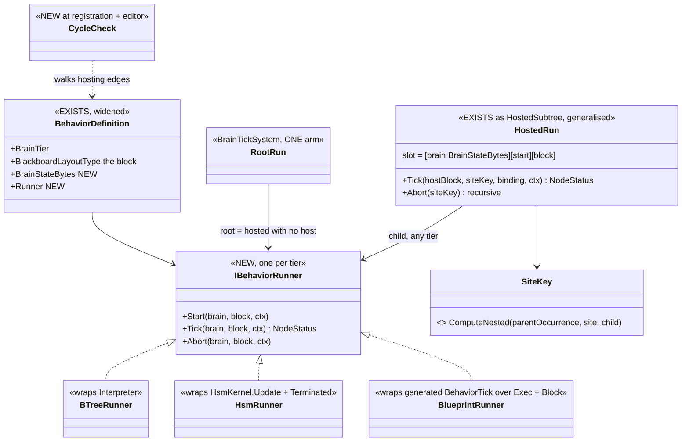
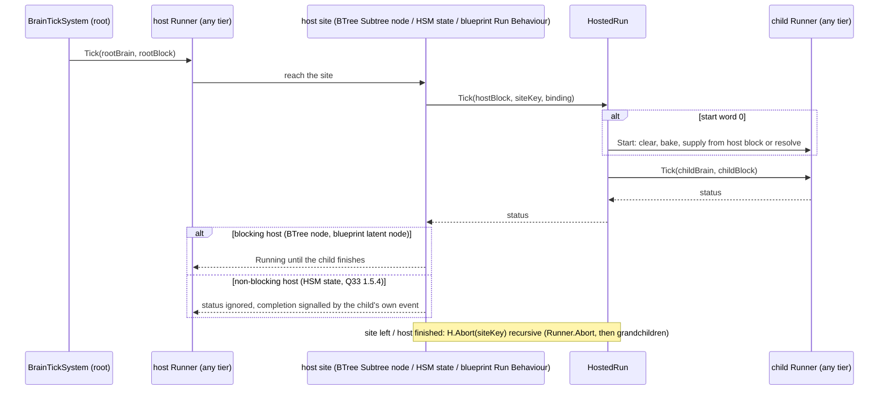
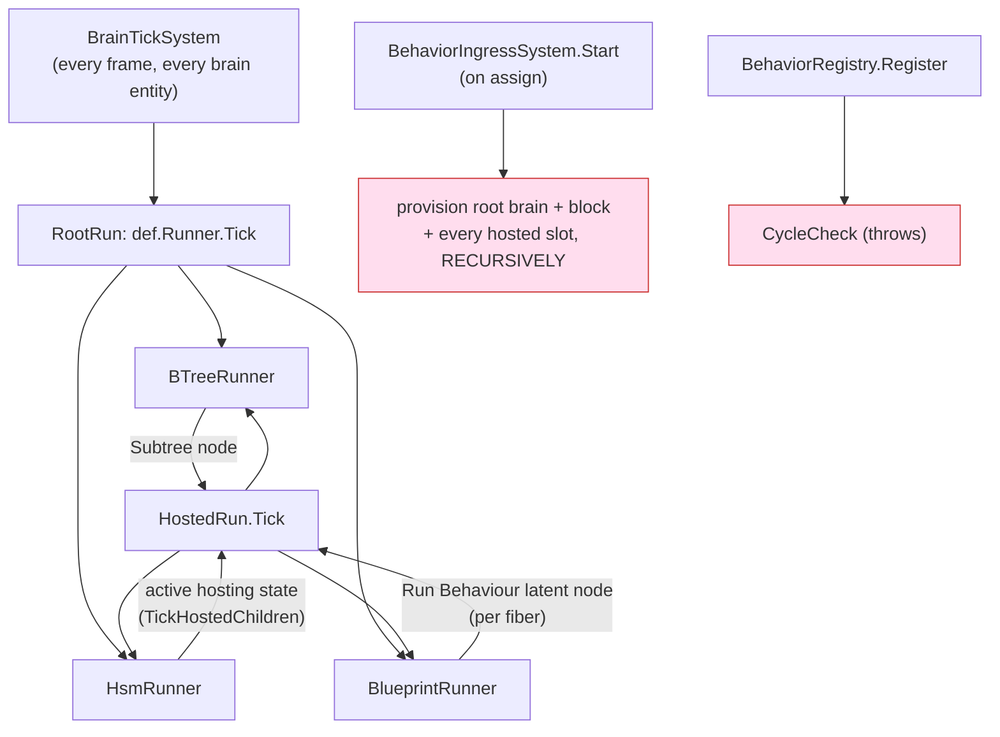
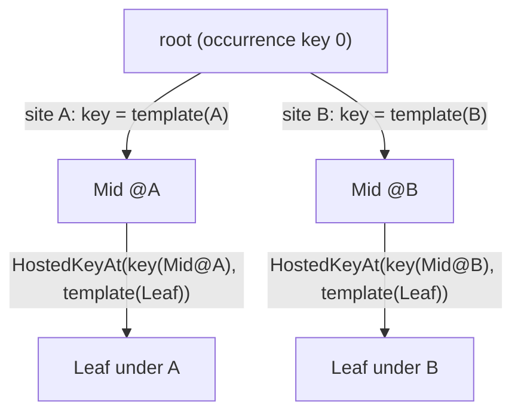
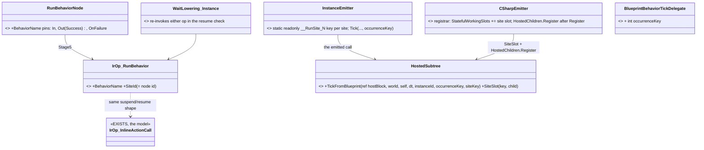
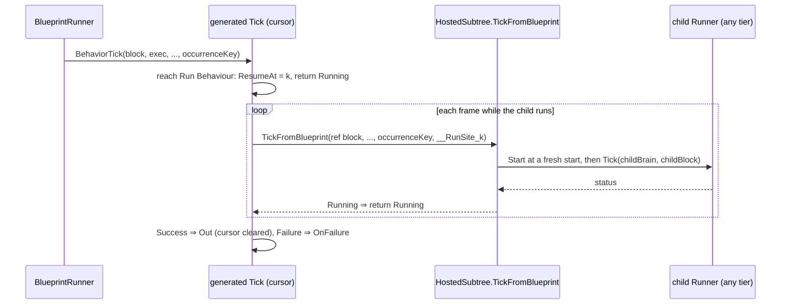
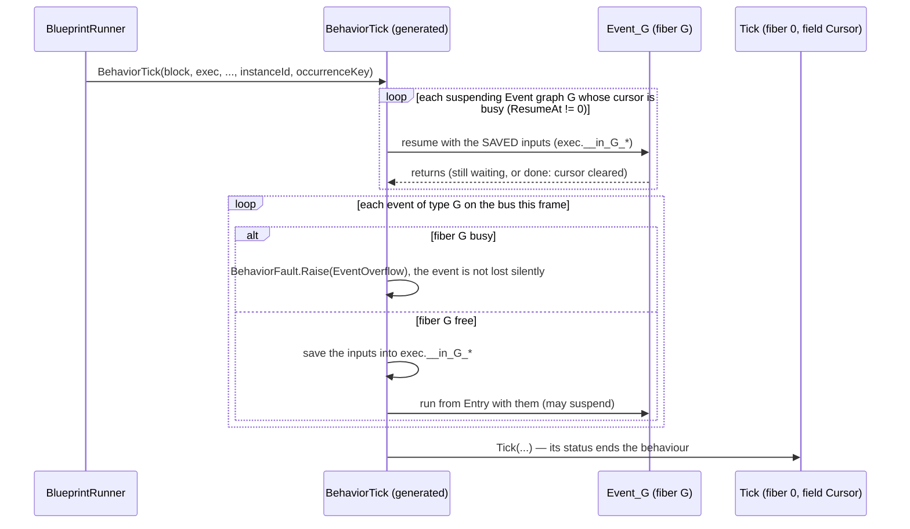
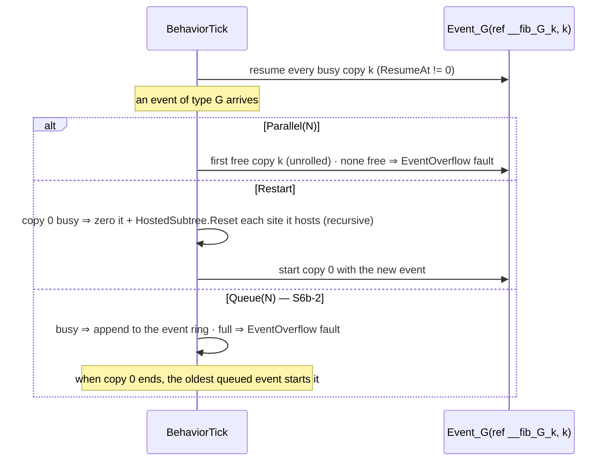
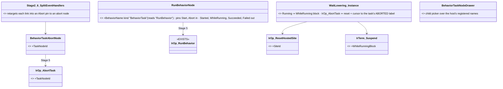
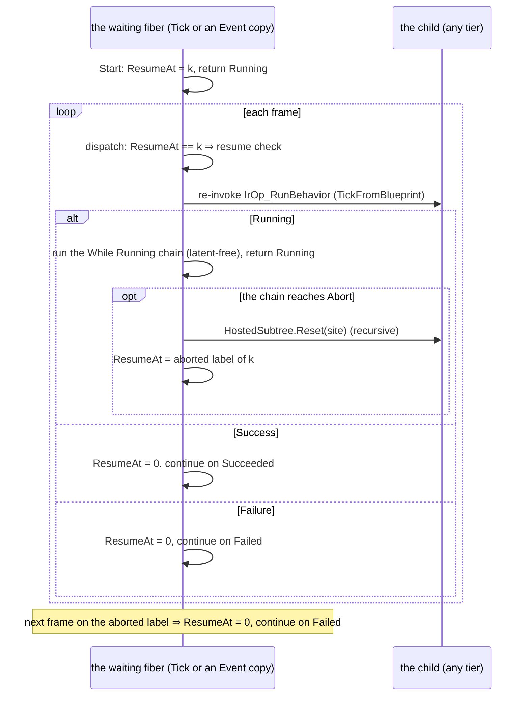

<!--STATUS
state: LIVE
updated: 2026-10-02
build-state: READY-TO-BUILD — direction approved by the user 2026-10-02 ("this enforces a true unification. great.
  Concurrency should be natively supported, and we should remove any blockers that prevent it. cycles needs
  checking."); §5 decisions APPROVED 2026-10-02 ("agreed to your leans") as revised there (U-3 dropped, U-6 revised,
  U-7 deferred, U-11 Behaviour Task node).
current-answer: §3 (the target, diagrams) and §5 (the decisions, each with a lean). §2 is the measured inventory.
stale-below: nothing yet.
known-rot: none.
known-conflict: Architect_Question_77 §3 C ("a root blueprint keeps its cursor in its root block") — SUPERSEDED here
  (§5 U-1); Q77 §5.14 points to this document.
related-designs:
  - Architect_Question_77_Blueprint_As_A_Behaviour.md — owns the blueprint behaviour (dispatch, Return = finish, own
    resolver). This document changes where its brain state lives and lets it host and be hosted.
  - Architect_Question_76_One_Blackboard_Block_Per_Primitive.md — owns R-151 (one block per running behaviour, brain
    state outside it) and §12.1 (the hosted child slot). This document applies R-151 to the blueprint and generalises §12.1.
  - Architect_Question_33_Blueprint_Brain_Tier.md — owns §1.5.4 (an HSM-hosted subtree is NON-BLOCKING, user ruling
    2026-08-16) and §1.5.5 (two suspension mechanisms, "converge when the slot shape unifies"). Both are honoured here.
  - DESIGN_Occurrence_Scoped_Storage.md — owns §32 (E5, an HSM state hosts a BTree) and the occurrence keys
    (ComputeTreeStateKey, ComputeNested). This document reuses both.
  - Architect_Question_27_Local_Variables.md — owns the per-graph local slots of a suspending graph; §4 S6 makes them
    per-fiber.
  - DESIGN_Behavior_Action_Binding.md — owns the C# binding forms; unaffected.
  - DESIGN_Typed_Event_Nodes.md — owns the AUTHORED shape of Event graphs (any number of typed event nodes, split into
    one handler each before Stage 5). Each handler is one fiber graph here, unchanged.
-->

# One way to run a behaviour — any type hosts any type, natively concurrent

> 🔒 **User, 2026-10-02:** *"unification and simplification is our goal"* · *"Custom resolver should not see the cursor
> … only the blackboard parameters needs to be exposed"* · *"would it make practical sense to run a blueprint behavior
> from a btree or hsm? I think it would"* · *"this enforces a true unification. great. Concurrency should be natively
> supported, and we should remove any blockers that prevent it. cycles needs checking."*

## 1. Why

A behaviour (BTree, HSM or blueprint) is one concept with three engines, but the runtime runs it three ways and hosts
it one way. Three things are missing:
- the blueprint keeps its execution state inside its blackboard block;
- only a BTree can be hosted;
- a blueprint can suspend at only one point at a time.

## 2. INVENTORY *(measured 2026-10-02: codebase-memory `search_graph` + grep, two read-only sweeps; file:line below)*

| # | fact | where |
|---|---|---|
| I1 | `BrainTickSystem` has three arms. They duplicate the shared work: dedup, CE-452 restart and `Finish`. They differ in the brain-state source, Paused, trace, the missing-definition policy and finish detection | `BrainTickSystem.cs:177-182, 246-344, 394-425, 501-631` |
| I2 | brain-state width: BTree `sizeof(BehaviorTreeState)`, HSM `SelectTier(blob)` (64/128/256), blueprint none. No `BehaviorDefinition` property | `RootStateAccess.cs:300`, `RootHsmAccess.cs:55-59`, `BehaviorRegistry.cs:157-175` |
| I3 | the blueprint behaviour block is `[Cursor][Params][Variables + _when_*_prev][graph locals]`; its resolver gets `ref State s` | `InstanceEmitter.cs:142-164, 508`; `WhenLowering_Instance.cs:83`; `FieldLayout.cs:74` |
| I4 | the BTree/HSM resolver signature is `(in Params authored, ref {Asset}_Block block)` | `LibraryEmitter.cs:200-224` |
| I5 | hosting: only a BTree child (`HostedChildren` requires `BTreeInterpreter`); slot `[BehaviorTreeState][start][block]` | `HostedChildren.cs:121-137`, `HostedSubtree.cs:34-48` |
| I6 | a BTree host uses the child's status; an HSM host discards it (Q33 §1.5.4, non-blocking); no `BehaviorFinishedEvent` for a child; the child shares the host's `InstanceId` | `Interpreter.cs:739-761`, `BrainTickSystem.cs:724-727, 699` |
| I7 | ⛔ **not recursive**: ingress provisions only the ROOT's slot manifest; `Reset` zeroes cursor + start word only and runs no child deactivator; a grandchild slot is never provisioned | `BehaviorIngressSystem.cs:325`, `HostedSubtree.cs:310-324` |
| I8 | ⛔ **keys fold the host ASSET, not the host occurrence** ⇒ the same grandchild under two sites collides. `ComputeNested` exists and is unused here | `OccurrenceSlotKey.cs:104-124, 168-176` |
| I9 | concurrency today: BTree Parallel with two subtree nodes ✅ (distinct site keys); HSM parallel regions ✅ | `BTreeHostedSites.cs:82-109`; `BrainTickSystem.cs:703-728` |
| I10 | ⛔ a blueprint has **ONE cursor for every graph**, and resume indices restart at 1 in each graph. 16 sites assume one suspension per payload | sweep table, e.g. `WaitLowering_Instance.cs:89,126-169`; `StatementEmitter.cs:808-861` |
| I11 | ✅ **MEASURED + interim fix (S1, CE-509):** a latent node in an Event graph failed as Roslyn `CS0103 'instanceVersion'` in GENERATED code. Now refused by **BP1658**, which names the node; the rule is removed when fibers land (S6a) | `InstanceEmitter.cs:440-446` vs `StatementEmitter.cs:809,852`; rail `BlueprintBehaviourTests.S1_ALatentNodeInAnEventGraph_…` |
| I12 | ✅ **MEASURED + FIXED (S1, CE-509):** a channel/event/inline-action SUCCESS resumed without clearing the cursor, so every later pass re-ran ONLY the code after the wait (measured: 1 pass before the wait, 5 after, in 5 frames). Both lowerings (Instance `ResumeAt` and AiPrimitive `__phase`) now go through a `success` block that clears it, like Failure and Delay already did | `WaitLowering_Instance.cs`, `WaitLowering_AiPrimitive.cs`; rails `S1_AfterAChannelWaitSucceeds_…`, `AiPrimitive_ASuccessfulWait_ClearsThePhase_…` |
| I13 | ✅ **FIXED (S1, CE-509):** the three rules (`BP1650`, library `BP1101`, `BP2050`) now ask `MacroLatency.IsLatent`, so an inline action is caught. The library rule had NO test before | `Stage2_Validate.cs`; rails in `BATCH03B_…`, `Stage1To5Tests`, `V_FlowForEachValidatorTests` |
| I14 | two suspension mechanisms: Instance cursor vs AiPrimitive `__phase` + `__waitUntilTime` | `AiPrimitiveLowering.cs:50-84`; Q33 §1.5.5 |
| I15 | cycles: an editor DFS for BTree/HSM assets only (`SubtreeCycleDetector`); ⛔ nothing for blueprints, nothing at registration, nothing for curated hosts | `SubtreeCycleDetector.cs:45-93`; `BTreeValidator.cs:92-115`; `HsmValidator.cs:516-538` |
| I16 | no Parallel/Fork node in blueprints; Sequence is sequential; fan-out of one exec pin is `BP1412` | `Nodes.cs:193`; `Stage5_Schedule.cs:837-916, 4122-4144` |

**CLAIM TABLE** (the rows the leans rest on)

| claim | code | design basis |
|---|---|---|
| brain state belongs outside the block | ✅ BTree/HSM already (I2) | ✅ R-151: *"the brain state is not part of it"* |
| the cursor is reached by name only | ✅ `StatementEmitter.cs:809-860` | — |
| a hosted subtree under an HSM does not block | ✅ `BrainTickSystem.cs:724-727` | ✅ Q33 §1.5.4 (user ruling 2026-08-16) |
| the two suspension mechanisms should converge with the slot shape | ✅ I14 | ✅ Q33 §1.5.5 |
| no design exists for blueprint concurrency | — | ⛔ searched `docs/`+`.dev/` (parallel, fork, multiple cursors, WaitAll): none. Q27 §125 names event-graph locals as "the open one" |
| a registration-time cycle check is new | ✅ I15 | ⛔ searched: none |

## 3. The target

| | BTree | HSM | blueprint |
|---|---|---|---|
| **block** (blackboard: all a resolver sees) | `{In; St}` | `{In; St}` | `{In = Params; St = Variables}` |
| **brain state** (internal, own slot) | tree cursor | HSM instance | **`Exec`: one cursor per FIBER + per-fiber locals + `When` memory** |
| **width** | `def.BrainStateBytes` for all three |||

*What the picture shows that prose hid:* root and hosted are the SAME call (`Runner.Tick`) over the SAME slot pair
(brain state, block). Only the caller differs. A host never knows its child's tier; a child never knows its host's.

*Caption:* the red boxes are what does NOT exist today: provisioning stops at the root's own manifest (I7), and
nothing checks cycles at registration (I15). The recursion edge `HostedRun → any Runner` is what makes the matrix
and nesting the same mechanism.

## 4. Slices *(one commit each, green at each; rails first where a defect is measured)*

| # | slice | delivers |
|---|---|---|
| S1 ✅ BUILT | rails first for I11–I13 | all three PROVED, then fixed (§2 rows I11–I13) |
| S2 ✅ BUILT | blueprint block / `Exec` split | see the as-built box below |
| S3 ✅ BUILT | manifest | see the as-built box below |
| S4 ✅ BUILT | one runner contract | see the as-built box below |
| S5 | the hosting matrix | slot `[brain][start][block]` from the child's definition; HSM and blueprint children; recursive provisioning and abort; nested keys via `ComputeNested`; cycle check at registration + blueprints in the editor detector. ⭐ Split in four, see below |
| S6 | native concurrency in blueprints | a FIBER per top-level graph (Tick, each Event graph) and per branch of a new `Parallel` node; per-fiber cursor, locals and `When` memory; the 16 single-cursor sites (I10) rewritten against a fiber index |
| S7 | **Behaviour Task** blueprint node (U-11) — ⭐ design below ("S7 design"), split S7a / S7b | pins Start/Abort in, Started/While Running/Succeeded/Failed out; any tier as the task; each completion pin is a fiber |
| (S8) | converge AiPrimitive suspension (I14) | `__phase`/`__waitUntilTime` → the same fiber cursor (Q33 §1.5.5). Separate design question, see §6 |

### S2 as-built *(`2026-10-02`, CE-510)*

| piece | where |
|---|---|
| block = `Block { Params In @0; Vars St }`, the root PARAMS slot (`BlackboardLayoutType`) | `InstanceEmitter.EmitBehaviorStructs`; `FieldLayout.ParamsStructBase` = 0 and `St` 8-aligned for `Behavior` |
| brain state = `Exec { BlueprintLatentCursor Cursor @0; When memory; suspended locals }`, the root STATE slot | `WhenLowering_Instance` sends a behaviour's When memory to the execution-state slots; `LocalStorage` now APPENDS to them; `FieldLayout` lays them from 16 in `Exec` |
| `BehaviorDefinition.BrainStateBytes` + `BrainStateLayoutType`; `RootStateAccess.RootStateBytes` answers it for the blueprint tier; `TryGetRootBytes` / `RequireRootBytesRef` / `TryGetRootBytesInView`; `ResetState` zeroes the whole slot | `BehaviorRegistry.cs`, `RootStateAccess.cs` (part of S4's width-per-definition, done early) |
| ingress attaches the root state slot at that width; `TickBlueprint` passes `ref exec`; the delegate is `(ref byte block, ref byte exec, …)` | `BehaviorIngressSystem.cs`, `BrainTickSystem.cs`, `BlueprintBehaviorTickDelegate.cs` |
| events dispatched INLINE in `BehaviorTick` (cached type id per Event graph) | removes, for behaviours, the shared dispatcher's per-frame interface-dictionary walk (an enumerator allocation on the hot path — ⚠ still present for Instances, `BlueprintEventDispatch.cs:43`) |
| debugger: Variables read flat from `St`, `In` shown as `Params`, cursor read from the root STATE slot | `BlueprintDebugSession.CaptureLiveBehaviorState` |
| rail `BlueprintBehaviourTests.S2_TheBlockIsTheBlackboard_AndTheCursorIsTheBrainState` (no cursor anywhere in the block, `In` at 0, cursor at 0 of `Exec`, slot width = `BrainStateBytes`, resolver takes the block) — red-proved by registering `Exec` as the block | |

⚠ **Deviations, argued:**
- the own resolver is `Resolve_X(ref Block __bb, world, self)`, not `(in Params authored, ref Block block)`. The authored input
  IS `In` (one struct, Q77 §5.11, and BP1675 forbids writing it), so a second copy adds nothing. ⭐ The property the user
  asked for holds: the resolver cannot reach the brain state. A helper it calls gets a SCRATCH `Exec`.
- generated identifiers are `__bb` / `__ex`: the first build used `b` / `x` and collided with an authored input named `x`
  (`PlatoonHillAttackBp`, CS0100).

### S3 as-built *(`2026-10-02`, CE-511)*

| piece | where |
|---|---|
| the registrar sets `JsonParamsDtoType = typeof(X.Params)` (only when the asset has Parameters) and `ManagedBlackboardVariables = X.InputManifest()` | `CSharpEmitter.EmitBehaviorRegistration` |
| `InputManifest()`: one entry per Parameter, offset MEASURED on the real struct (`Unsafe.ByteOffset` on a `default(Params)`), never baked; `Array.Empty` when there are none | `InstanceEmitter.EmitBehaviorEntryPoints` |
| consequence: `RootParamsAccess.InputBytes` is now the Params extent (was the whole block); `RootParamsBytes` is unchanged (max of manifest extent and block size = block size) | no runtime edit needed |
| consequence: `GET /behaviors`, the schema extractor and the live blackboard provider now see a blueprint behaviour's Parameters through the same arm as BTree/HSM; a blueprint behaviour joins the generated-block set the editor manifest rails sweep (offsets agree with `Marshal.OffsetOf`) | `DebugApiService`, `DtoJsonSchemaExtractor`, `LiveBlackboardValueProvider` (unchanged) |
| rails `BlueprintBehaviourTests.S3_ABlueprintBehaviour_PublishesItsParamsContract_AndItsInputManifest`, `S3_AParameterlessBlueprintBehaviour_DeclaresAnEmptyManifest`, `AGeneratedBehaviourAdvertisesItsManifestTests.ABlueprintBehaviourAdvertisesItsParameters` | red-proved by dropping the two registrar lines |

⚠ The manifest lists Parameters only, as BTree/HSM manifests list Role=Input only. A blueprint's Variables (`St`) stay
visible through the blueprint debugger (`CaptureLiveBehaviorState`), not through the params inspector.

### S4 as-built *(`2026-10-02`, CE-512 (behaviors))*

*What it shows that prose hid:* the split of ownership. Everything a tier does differently is in its runner; the system's
one arm holds only what all three share. The runners carry no fields, so all run state stays in the two recorded slots.

| piece | where |
|---|---|
| contract + context (`BehaviorRunContext`, a stack value) + tier map | `Fdp.Toolkits/Behavior/Runners/IBehaviorRunner.cs` |
| the three runners: the former arms' bodies moved over unchanged, with their trace decoders, HSM's MobilityLost interrupt and `TickHostedChildren` | `Runners/BTreeRunner.cs`, `HsmRunner.cs`, `BlueprintRunner.cs` |
| `BehaviorDefinition.Runner` (derived from `BrainTier`, never stored) | `BehaviorRegistry.cs` |
| `BrainTickSystem.Run`: finished guard → `TryGetRootBrain` → block (+ `RestartIfRelaidOut`) → `Tick` → `Finish` on a terminal status; the fault check after it is unchanged. 879 → ~380 lines | `Systems/BrainTickSystem.cs` |
| rail `BrainTickSystemMergeTests.S4_EveryTierRunsThroughItsRunner_AndRunnersHoldNoState`, red-proved by giving `BlueprintRunner` a field; the existing per-tier arm suites, including their zero-allocation tick rails, pass unchanged | |

⚠ **Deviations and findings, argued:**
- `Start`/`Abort` are NOT on the contract yet. At the root, start is ingress's reset and abort is `Finish`'s clear, and
  neither has a second caller until hosting (S5) gives them one. ⇒ they arrive with S5, against a real caller.
- ORDER: the brain is located BEFORE the block's reload restart. Before, the BTree arm checked Paused first, and the HSM arm
  restarted before looking for its instance. ⇒ a debugger-paused BTree whose block was re-laid-out by a hot reload now
  restarts instead of staying paused; an HSM entity with no instance yet is skipped before the restart check. Both are
  edge cases; neither has a rail that moved.
- the finished-run guard (was blueprint-only) now covers every tier. It is a no-op for BTree/HSM, because `Finish` already
  sets `BrainTier = 0`.
- **the two managed dictionaries in `BrainTickSystem`, checked as planned.** Neither is recorded, and neither has to be.
  `_publishedTerminalForInstanceId` only guards a same-frame second finish; a run that has finished is cleared and never
  ticks again. `_blueprintLayout` is a cache of the layout each run started with. After a seek or restore it is empty and
  re-learns the layout on the next tick, so a reload landing exactly across a restore would be missed, but nothing is
  corrupted. Left in place: the stale-entry rails (`O7_R47`) pin the first; the second is S6's to revisit when fibers
  make the brain state carry its own layout hash.

### S5 split *(`2026-10-02`, from measuring the hosting code after S4)*

📐 **Measured before splitting.** A hosted BTree child's per-node action state (e.g. `T20_MultiStateful`'s two cursor
slots) is a keyed occurrence slot whose key is baked at emit time from the child's ASSET and NODE
(`BTreeBridgeEmitCore.ComputeStatefulSlotKey`). The same child under two sites therefore shares that state, whatever its
own run slot's key is. ⇒ *"the same child under two sites does not collide"* (§7) needs the OCCURRENCE key carried down
at run time, not only nested run-slot keys.

| sub-slice | delivers | key facts |
|---|---|---|
| **S5a** ✅ BUILT (CE-513 (behaviors)) any tier as a child | the runner gains `BrainBytes(def)` + `Start(def, brain, bytes)`; the hosted slot becomes `[brain][start][block]` sized by the CHILD's runner; `HostedChildren` resolves any tier; `HostedSubtree.TickHosted` steps the child through its runner; `Reset` zeroes the child's brain | a BTree child's slot stays byte-identical (64 / 64 / 72); an HSM child's `Start` is `HsmInstanceManager.Initialize` (stamps `MachineId`); hosts = the existing BTree `Subtree` node and HSM state |
| **S5b** ✅ BUILT for BTree children (CE-2000); HSM/inline residue CE-2002 — recursion | the context carries the parent OCCURRENCE key; a depth-1 key is unchanged, a deeper one is `NestOver(parent, template)`; ingress provisions recursively from the definitions; reset/abort recurse; a hosted child's action slots nest through the same key | the root folds nothing, so every existing key stays byte-identical |
| **S5c** ✅ runtime BUILT (CE-2003); editor half with S5d — cycles | registration walks the hosting edges by child name and throws on a cycle; the editor detector covers blueprints | U-9 |
| **S5d** ✅ compiler + runtime BUILT (CE-2004); editor palette open — blueprint as a host | a blocking **Run Behaviour** latent node | compiler + editor; ⭐ it is U-11's Behaviour Task node with only the completion pins — S7 grows it in place |

#### S5a as-built *(`2026-10-02`, CE-513 (behaviors))*

| piece | where |
|---|---|
| `IBehaviorRunner.BrainBytes(def)` + `Start(def, brain, bytes)`: BTree 64 + zero; HSM `InstanceBytes(blob)` + `HsmInstanceManager.Initialize`; blueprint `BrainStateBytes` + zero. `BehaviorRunContext` now carries `InstanceId` (not the whole `BehaviorState`) | `Runners/*.cs` |
| the site slot is `[brain][start][block]`, every offset from the CHILD's runner (`BrainBytesFor` / `StartWordOffsetFor` / `BlockOffsetFor` / `SlotPayloadSizeFor`); a BTree child is byte-identical to before | `HostedSubtree.cs` |
| `TickHosted`: resolve the child's definition, `Start` it at a fresh start, step it through `runner.Tick` under the HOST's `InstanceId` (U-10), clear its brain + start word when it ends. `Reset` zeroes the child's brain at its own width | `HostedSubtree.cs` |
| `HostedChildren` resolves ANY tier with a runner (`RequireDefinition`); the BTree-interpreter accessors stay for their existing callers | `HostedChildren.cs` |
| the HSM host's "is the site bound" check asks for the definition, not a BTree interpreter | `HsmRunner.TickHostedChildren` |
| rails `HostingMatrixTests.S5a_*` (3): a BTree host runs a blueprint child (its `Exec` is the slot's first region, persists, runs under the host's `InstanceId`, its Success ends the node and the host) and an HSM child (started in the slot with its `MachineId`, stepped; a terminating machine succeeds the node). Red-proved by resolving BTree children only | real ingress + `BrainTickSystem`, no hand attach |

#### S5b step 1 as-built — nested RUN slots *(`2026-10-02`, CE-2000)*

*What it shows that prose hid:* the leaf has ONE registered (template) key, but TWO occurrences. Its slot key is
derived from the path, so the two never meet. Depth 1 is unchanged (the root folds nothing).

| piece | where |
|---|---|
| `OccurrenceSlots.HostedKeyAt(parent, template)` (`OccurrenceSlotKey.ComputeHostedAt`: parent 0 ⇒ the template, else `NestOver`) | `OccurrenceSlotKey.cs`, `OccurrenceSlots.cs` |
| the occurrence key rides the context: `BTreeContext._occurrenceKey`, `BehaviorRunContext.OccurrenceKey` (0 at the root); `TickHosted` resolves the nested key and hands it to the child's run; both runners pass it into the contexts they build | `BTreeContext.cs`, `Runners/*.cs`, `HostedSubtree.cs` |
| `EffectiveSlots` appends every descendant's run slot under its nested key, recursively (depth guard `MaxNestingDepth` = 16 throws: a cycle S5c will refuse at registration); ingress provisions from that list AND sweeps against it, and a behaviour change / clear detaches it | `HostedSubtree.cs`, `BehaviorIngressSystem.cs` |
| reset is recursive: a child that is reset, started fresh or finishes takes its own hosted children with it (I7) | `HostedSubtree.ResetAt` / `ResetDescendants` |
| 🔴 **a defect that predated this work, found by the rail:** `BTreeHostedSites` keyed its site table by `blob.StructureHash`, which hashes node TYPES and child COUNTS only. Two trees of one shape (a host `Sequence(Subtree)` and its child `Sequence(Subtree)`) shared ONE map, and the last `Bind` won, so the child's site looked up the HOST's key. ⇒ keyed by the blob INSTANCE now (the interpreter hands the host its own blob; every registrar binds that instance). `HsmHostedSubtrees` got the same instance-keyed table for the runtime | `BTreeHostedSites.cs`, `HsmHostedSubtrees.cs`, `HsmRunner` |
| rails `HostingMatrixTests.S5b_TheSameChildAtTwoSites_GivesItsGrandchildTwoOccurrences` (red-proved by making `HostedKeyAt` ignore its parent) and `S5b_ResettingAChild_ResetsItsGrandchildToo` (it failed on the site-table collision before the fix) | |

#### S5d design — a blueprint behaviour HOSTS a behaviour *(`2026-10-02`, BUILT — as-built below)*

📐 **Measured basis.** An inline action (`ChannelCommandNode` with an `ActionFqn`) is already a latent call that returns a
status each frame: `Stage5_Schedule.ScheduleInlineActionNode` → `ScheduleLatentNode` (Out on Success, `OnFailure` on
Failure, Q#13) → `WaitLowering_Instance` re-invokes it in the resume check until it is not Running. ⇒ **Run Behaviour
reuses that whole path; only the call differs.**

*What it shows:* the node adds one op and one runtime entry point. The latent machinery, the hosted slot, nesting and
the cycle check all already exist.

| decision | lean | why |
|---|---|---|
| where the occurrence key comes from | ⭐ a new `int occurrenceKey` parameter on `BehaviorTick` and the behaviour `Tick` | a static or an `Exec` field would be hidden state; the runner already has it (`BehaviorRunContext.OccurrenceKey`) |
| the site key | a `static readonly int` per node, computed once from `OccurrenceSlots.TreeStateKeyFor(AssetId, nodeId, AssetIdFromName(child))` | the compiler cannot call the internal hash; computing at type init costs nothing per tick |
| where it may appear | Tick graph of a `Behavior` asset only (a new diagnostic); latent ⇒ already refused in functions, Event graphs, loop bodies | an Instance has no brain tier to host from |
| input binding | none in this step: the child starts from its own defaults | the host-variable binding (`SiteBinding`) is CE-439's shape and can follow |
| abandonment | none needed yet: a blueprint leaves the node only when the child ends, or the run ends (clear detaches every slot) | S6 fibers / S7's Abort pin bring a real abandon; the recursive reset is ready for it |

#### S5d as-built *(`2026-10-02`, CE-2004)*

| piece | where |
|---|---|
| the node: `RunBehaviorNode` (kind `"RunBehavior"`, pins In / Out / OnFailure), latent (`MacroLatency`); `BP1659` refuses it outside a `Behavior` asset or with no `BehaviorName` | `Assets/Nodes.cs`, `BuiltInNodeRegistry`, `Stage2_Validate` |
| `IrOp_RunBehavior(BehaviorName, SiteId)` scheduled through `ScheduleLatentNode` exactly as an inline action | `IrOperation.cs`, `Stage5_Schedule` |
| ⭐ **one owner for "which ops suspend"**: `SuspendOps.Is`. 📐 Measured: the list was hand-written at SIX sites (`LocalStorage.CanSuspend`, two in `WaitLowering_Instance`, three in `WaitLowering_AiPrimitive`); the first S5d build missed one, and the result was *"IrTerm_Suspend reached Emit stage"* | `Lowering/SuspendOps.cs` |
| the resume check re-invokes `IrOp_InlineActionCall` OR `IrOp_RunBehavior` (the same op, re-emitted) | `WaitLowering_Instance` |
| the emitted call: `HostedSubtree.TickFromBlueprint(ref block, world, self, dt, instanceVersion, occurrenceKey, __RunSite_k)`; one `static readonly int __RunSite_k` per site from `OccurrenceSlots.TreeStateKeyFor(asset, node, child)` | `StatementEmitter`, `InstanceEmitter.RunBehaviorSites` |
| the behaviour `Tick` / `BehaviorTick` and `BlueprintBehaviorTickDelegate` gain `int occurrenceKey`; `BlueprintRunner` passes `ctx.OccurrenceKey` | `InstanceEmitter`, `BlueprintBehaviorTickDelegate.cs`, `BlueprintRunner` |
| the registrar declares each site's slot (`HostedSubtree.SiteSlot`, which `BTreeHostedSites.TreeStateSlot` now delegates to — one slot shape) and binds it after `Register` (`HostedChildren.Register`) | `CSharpEmitter.EmitBehaviorRegistration` |
| an inline action in a blueprint BEHAVIOUR keys its standalone state by `HostedKeyAt(occurrenceKey, …)` — ⇒ **the inline half of CE-2002 is closed** (the HSM half stays open) | `InlineActionLowering` |
| 🔴 **defect found by the rail, predates S5d, every host tier:** quick reload runs registrars into a STAGING registry and `MergeFrom`s it into the live one; a site binding kept the STAGING instance, so a host reloaded without its child threw *"does not resolve"* on its first hosted tick. ⇒ `MergeFrom` re-points those bindings (`HostedChildren.Repoint`) | `BehaviorRegistry.MergeFrom`, `HostedChildren.cs` |
| 🔴 **Q#13 in a behaviour Tick:** an unwired `OnFailure` emitted a plain return, which in a behaviour Tick means RUNNING (CE-446), so the wait silently retried from Entry. ⇒ it returns `Failure` there, as [`Architect_Question_13`](Architect_Question_13_WaitForChannel_Failure_Handling.md) rules (Instance graphs keep the plain return: they have no status). Covers channel waits and inline actions too | `WaitLowering_Instance.UnwiredFailure` |
| rails `BlueprintBehaviourTests.S5d_*` (3, real compile + ingress + `BrainTickSystem`): runs a BTree child three ticks, continues on its Success; a child Failure with `OnFailure` unwired fails the host; `BP1659`. `HostingMatrixTests.S5d_AHostReloadedAlone_ResolvesAChildThatIsAlreadyLive`. Red-proofs: no `Repoint` ⇒ both reload rails red; the plain return ⇒ the failure rail never finishes; no registrar bind ⇒ *"No hosted child is bound"* | |

⭐⭐ **U-11 holds: S7 GROWS THIS NODE, it does not add a second one.** U-11 rejects *"two nodes (blocking +
non-blocking)"* and says *"run and wait = only the completion pins wired"*. Run Behaviour is exactly that wiring:
`In` = `Start`, `Out` = `Succeeded`, `OnFailure` = `Failed`. ⇒ S7 adds `Abort`, `Started` and `While Running` to
`RunBehaviorNode` (and renames it to Behaviour Task, migrating the `"RunBehavior"` kind), on the same site slot, op and
runtime entry point. ⛔ A second node beside it would be two implementations of one concept.

⚠ **Not yet (editor):** the palette entry and child picker for Run Behaviour, widening the BTree/HSM pickers to every
tier, and the blueprint arm of the editor cycle detector (U-9).

#### S5c as-built — hosting cycles refused at registration *(`2026-10-02`, CE-2003)*

| piece | where |
|---|---|
| `HostedChildren.ThrowOnCycleThrough(registry, host)`: a DFS over the REAL edges (a definition's hosted slots → the child each is bound to, by name); throws naming the ring | `HostedChildren.cs` |
| it runs from BOTH events that can close a ring: a definition registering (`BehaviorRegistry.Register`, when it declares slots) and an edge binding (`HostedChildren.Register`, which finds the host that declares the slot and removes the edge before throwing) — registrar order is arbitrary | `BehaviorRegistry.cs`, `HostedChildren.cs` |
| rails `HostingMatrixTests.S5c_*` (3): a two-behaviour ring and a self-host are refused, a chain is not; red-proved by disabling the edge-side check. The production scan loads cleanly (Editor manifest suite) ⇒ no shipped asset forms a ring | |

⚠ The editor half of U-9 (the `SubtreeCycleDetector` covering blueprint assets) waits for S5d, when a blueprint can host.
Provisioning's depth guard (`MaxNestingDepth`) stays as the backstop.

#### S5b step 2 as-built — a hosted child's OWN working state *(`2026-10-02`, CE-2000)*

| piece | where |
|---|---|
| `BTreeContext.OccurrenceKey` (public) | `BTreeContext.cs` |
| the generated stateful BTree thunk resolves `OccurrenceSlots.HostedKeyAt(ctx.OccurrenceKey, __slotKey)` (unchanged at the root) | `BTreeBridgeEmitCore.AppendWorkingStateResolve` |
| the blueprint AiPrimitive standalone thunk does the same with its per-asset key | `AiPrimitiveEmitter.EmitStandaloneOccurrenceBody` |
| `EffectiveSlots` provisions a hosted child's own working-state slots under the child's occurrence key | `HostedSubtree.AppendNested` |
| ingress sizes the store for every hosted descendant's lazily-attached occurrences too (one per occurrence) | `BehaviorIngressSystem.WithDescendantDemand`, `HostedSubtree.HostedDescendants` |
| rail `HostingMatrixTests.S5b_AStatefulChildAtTwoSites_KeepsTwoWorkingStates`, red-proved by not provisioning the child's slots. 🔴 Measured before: a hosted child's own stateful node found NO slot and returned `Failure` (only the root manifest was provisioned) | |

⚠ **Deviation, argued:** a hosted child's working-state slots are NOT cleared at its START. Root working state survives
a same-behaviour re-assign (`AttachSlotsToMemory`'s idempotent arm) and the generated thunk initialises only a FRESHLY
attached slot, so zeroing would hand it a zero struct where it expects its defaults. ⇒ the same rule as the root.

⚠ **Still open (CE-2002):** an HSM child's lazily-attached occurrences key by machine + region + state
(`HsmOccurrence.KeyFor`), not nested yet, so the same HSM child at two sites shares those. *(The inline-action half —
a blueprint behaviour's inline action keyed by asset with no context — was closed by S5d.)* And the HSM `StructureHash`
is topology-only too, so two same-shape machines share a `MachineId` everywhere it is used (param bindings, occurrence
keys, kernel validation) — filed as **CE-2001**, wider than hosting.

⚠ **Not yet:** an HSM-hosts-HSM/blueprint rail (the HSM host's path is the same `TickHosted` call, but the matrix rail over
all 9 pairs belongs with S5b, when nesting is real). Authoring: the BTree `Subtree` node and HSM state pickers still list
BTree assets only. Widening them is an editor change, filed with S5d.

### 4a. What fibers take *(S6, the largest slice — split in three)*

| step | change | measured site it removes |
|---|---|---|
| ① find the fibers at compile time | the Tick graph; each latent Event graph × its policy's N; each Task node's completion pins. Each gets a fixed index | I10 (one cursor for all graphs) |
| ② lay them out | `Exec` = one record per fiber: cursor + that fiber's locals + its `When` memory (+ the event payload for an Event fiber that suspends). Fixed size ⇒ no allocation | I3, Q27's per-graph locals, the 8-hex `When` key |
| ③ lowering by index | the cursor IR ops carry a fiber index ⇒ `x.F2.ResumeAt` instead of `s.Cursor.ResumeAt`; each graph dispatches on its OWN fiber's cursor; version check and reset per fiber | `WaitLowering_Instance.cs:89,126-169,240,293,375`, `StatementEmitter.cs:808-861` (incl. the I12 success path) |
| ④ the generated scheduler | `BehaviorTick` = dispatch events to a free fiber per policy (overflow ⇒ fault) → resume each active fiber in index order → tick Task sites, fire `While Running`, start a completion fiber when a task ends. Straight-line generated code, deterministic | `BlueprintEventDispatch.cs:42-53`, I11 |
| ⑤ abort | clear a fiber's record + abort the Task sites it started (recursively); `Finish` aborts all | U-8 |
| ⑥ the readers | debugger / inspector show a fiber list; `StructureHash` covers fiber layout and resume numbering (hot reload) | sweep rows 13, 15 |

#### S6a design — one fiber per suspending graph *(`2026-10-02`, BUILT — as-built below)*

📐 **Measured basis.** Every cursor op is emitted through ONE expression, `{ExecVar}.Cursor` (`StatementEmitter`
`IrOp_CheckCursorVersion` … `IrOp_ReadCursorWaitUntilTime`). A suspending graph's locals are ALREADY per graph
(`LocalStorage.PromoteSuspendingGraphLocals`, prefix `__loc_{Graph}_`, in `IrAsset.GraphLocalSlots`, laid out by
`FieldLayout` after lowering and hashed by `StructureHashComputation`). A behaviour already dispatches its events inline in
`BehaviorTick`, allocation-free. ⇒ **a fiber is "a suspending graph with its own cursor field"; the cursor and the
saved event inputs ride `GraphLocalSlots` like the locals do.**

*What it shows that prose hid:* nothing new is laid out, hashed or reset by a new mechanism — the fiber's state is three
more entries in a list three existing passes already walk.

*What it shows that prose hid:* resuming BEFORE dispatching means a fiber that started this frame is not stepped twice in
one frame, and a fiber that finishes on resume frees itself for an event arriving the same frame.

| decision | lean | rejected — one line each |
|---|---|---|
| the Tick graph's cursor | ⭐ keeps the field name `Cursor` ⇒ every existing Instance and behaviour is byte-identical | renaming every cursor `F0`: moves all ~300 goldens for no behaviour change |
| scope | ⭐ **behaviours only**; `BP1658` stays for an Instance's Event graph | Instances too: their events arrive through `BlueprintEventDispatch`'s handler delegate, which has no `instanceVersion` and no per-frame resume caller — a second scheduler for a tier the programme is retiring toward behaviours |
| the policy until S6b (U-6) | ⭐ **Parallel(1)**: U-6's default with N = 1. An arrival while busy ⇒ `BehaviorFault` (`EventOverflow`) + log | ignore (U-6 rejects it); restart (a different policy, S6b) |
| order inside `BehaviorTick` | ⭐ resume busy fibers → dispatch this frame's events → Tick | dispatch first (§4a ④'s wording): a fiber started this frame would be resumed in the same frame, re-invoking a latent action twice |
| the event payload of a waiting fiber | ⭐ its graph INPUTS are saved as `__in_{G}_{field}` slots and passed back on resume — the body is unchanged (it reads parameters) | copying the whole event struct: needs its size at compile time and the body would change |
| the Event method's signature (behaviour) | ⭐ every behaviour Event method gains `deltaTime, instanceVersion, occurrenceKey`, as `Tick` has | only suspending ones: two shapes, and `Get Delta Time` in a non-suspending Event graph is already a `CS0103` today |
| `Finish` with fibers live (U-8) | ⭐ unchanged: the Tick's `Return` finishes the run and CE-449's clear zeroes the whole `Exec`, every fiber with it | — |

⚠ **Not in S6a:** Parallel(N > 1), Restart, Queue(N) and the event ring (S6b); Task-node completion fibers (S6c).

#### S6a as-built *(`2026-10-02`, CE-2005)*

| piece | where |
|---|---|
| `IrGraph.CursorField` (null = the shared `Cursor`); `Fibers.Assign` gives each suspending Event graph of a behaviour `__fib_{G}` (a `BlueprintLatentCursor`) and `__fib_{G}_in_{field}` per input, appended to `GraphLocalSlots` | `Ir/IrGraph.cs`, `Lowering/Fibers.cs`, `InstanceLowering` |
| every cursor op reads `Fibers.CursorOf(current graph)` (7 sites, one expression) | `StatementEmitter` |
| a behaviour's Event method takes `deltaTime, instanceVersion, occurrenceKey` like `Tick`; its thunk refuses an arrival while busy (`BehaviorFaultCode.EventOverflow`), saves the inputs, then calls with the saved copies; `BehaviorTick` resumes busy fibers first | `InstanceEmitter` |
| `BP1658` binds an Instance's Event graph only | `Stage2_Validate` (`V_LatentRules`) |
| `BehaviorFaultCode.EventOverflow = 5` | `BehaviorFault.cs` |
| rails `BlueprintBehaviourTests.S6a_*` (3): an Event graph runs a child across frames while the Tick keeps running, then writes the event's `Damage` it started on; a second hit while it waits faults the run with `EventOverflow`; the emitted shape. The S1 BP1658 rail now uses an Instance. Red-proofs: resuming with default inputs leaves `Got` = 0; dropping the busy check removes the fault | |

⚠ **Residue:** the AI debugger / inspector still show the Tick cursor only (§4a ⑥ — a fiber list is a reader change, with S6b).

#### S6b design — the event policies (U-6) *(`2026-10-02`, S6b-1 + S6b-2a BUILT — as-built below; S6b-2b deferred, demand-driven)*

📐 **Measured basis.** S6a's fiber state is flat named slots (`__fib_G`, `__fib_G_in_x`) plus the graph's promoted
locals (`__loc_G_x`), all addressed through `{ExecVar}.` (`EmissionContext.LocalFieldName`, `Fibers.CursorOf`). A child
hosted from an Event graph is keyed by a static per-node template (`__RunSite_N`), and an inline action by
`HostedKeyAt(occurrenceKey, StandaloneStateKeyFor(primitive))` (`InlineActionLowering`). ⇒ **N concurrent copies of one
graph need (a) N copies of its state and (b) N distinct keys for whatever it hosts.**

*What it shows that prose hid:* a fiber becomes ONE generated record, so "N copies" is N fields of one type and the
Event method takes `ref` to whichever copy runs. The key salt is a runtime function both the registrar and the call use,
so provisioning and resolution cannot disagree.

| decision | lean | rejected — one line each |
|---|---|---|
| where the policy lives | ⭐ on the Event graph's entry node (`Policy`, `Capacity`; both omitted from JSON at their defaults ⇒ every asset unchanged) | a per-asset setting: two handlers of one asset need different policies |
| default | ⭐ Parallel, Capacity 1 (= S6a's behaviour) | Parallel(4): costs 4× the record on every behaviour that never overlaps |
| N copies of state | ⭐ one generated record struct per graph, N fields of it in `Exec` | N copies of every flat slot: N× the names, and the method body would need N variants |
| keys under a copy | ⭐ salt the TEMPLATE: `FiberKey(template, k)` (copy 0 = the template) for hosted sites and inline actions; the registrar declares every copy | salting the occurrence key: provisioning computes nested keys from declared templates, so a salted occurrence is never provisioned |
| `When` memory inside an Event graph | ⚠ stays per graph (shared by its copies) | per copy: When fields are added before fibers exist; moved with S6c if a case needs it |
| limits | ⭐ `Capacity` 1..16; Restart is one copy; both checked by `BP1660` | unbounded: a fixed layout needs a compile-time N |
| **S6b-1** | ⭐ Parallel(N) + Restart | — |
| **S6b-2** | ⭐ Queue(N) with the ONE byte ring in `Exec` (user ruling above), managed events through `FdpAutoSerializer`, the checkpoint/restore rail | — |

#### S6b-1 as-built *(`2026-10-02`, CE-2006)*

| piece | where |
|---|---|
| `EventEntryNode.Policy` (`EventFiberPolicy` Parallel / Restart / Queue) + `Capacity`, both omitted from JSON at default; carried to `IrGraph.FiberPolicy` / `FiberCapacity` | `Assets/Nodes.cs`, `Stage5_Schedule` |
| ⭐ **S6a's flat fiber slots became ONE record per graph**: `_Fiber__fib_{G}` { `Cursor`, the graph's promoted locals (moved out of the shared slots), `In_{x}` }, and `Exec` holds `Copies(g)` fields `__fib_{G}_{k}`; the record size comes from `FieldLayout.RecordSize` (the same layout function) | `Lowering/Fibers.cs`, `FieldLayout.cs` |
| a fiber graph's cursor and locals are reached through `Fibers.Container` (`__f` in a fiber, `__ex` elsewhere) — the one switch both `StatementEmitter` and `EmissionContext.LocalFieldName` use | `Fibers.cs`, `StatementEmitter`, `EmissionContext` |
| the Event method takes `ref _Fiber… __f, int __fi`; Run Behaviour sites and inline actions inside it key by `OccurrenceSlots.FiberKey(template, __fi)` (copy 0 = the template ⇒ byte-identical) | `InstanceEmitter`, `StatementEmitter`, `InlineActionLowering`, `OccurrenceSlots` / `OccurrenceSlotKey.ComputeFiberKey` |
| the registrar declares and binds one site slot per copy | `CSharpEmitter.EmitBehaviorRegistration` |
| dispatch per policy, unrolled: Parallel(N) = first free copy, else `EventOverflow`; Restart = zero copy 0 + `HostedSubtree.Reset` each site it hosts, then start | `InstanceEmitter.EmitFiberDispatch` |
| `BP1681` (BP1660–1667 are reserved for macros): Capacity outside 1..16, Restart with Capacity > 1, Queue until S6b-2 | `Stage2_Validate`, `DiagnosticCodes` |
| rails `BlueprintBehaviourTests.S6b_*`: Parallel(2) runs two handlers at once, each writing the event it started on (9 then 7); Restart — only the newest event is ever written; `BP1681` ×3. Red-proofs: one copy only ⇒ the second hit faults; Restart as Parallel ⇒ faults; copies sharing one child key ⇒ the handlers interfere | |

✅ **RESOLVED `2026-10-02` — user:** *"i just need the blueprint state to be correctly saved to the recordings and
restored on replay, you are free to choose performance optimal implementation."* ⇒ ⭐ **the requirement is the
round-trip, not the storage shape**: in-flight copies keep their inputs in their records (as built); the ring is
built in S6b-2 only for Queue(N) and managed payloads. 🔒 **Proved by rail**
`BlueprintBehaviourTests.S6_AWaitingHandler_IsSavedToTheRecording_AndResumesAfterReplay` — a keyframe recorded
through the real `AsyncRecorder` mid-wait, `PlaybackController.SeekToFrame` back to it, and the restored handler
finishes and writes the event it held (red-proved by marking the blueprint storage tiers `NoReplay`). ⇒ every later
storage change (S6b-2's ring included) must keep this rail green.

⚠ *Prior state, kept for the record:* **DEVIATION from the ring ruling, argued — and OPEN for the user** *(the "Recording and replay" block below)*. The
ruling says ONE byte ring holds every pending event, *including the event a waiting fiber still holds*. As built
(S6a/S6b-1), a waiting copy keeps its event's **declared inputs** in its own fixed record instead. Why: for unmanaged
inputs the record is laid out at compile time, sits in the same recorded slot (so replay and checkpoints carry it — the
ruling's purpose), needs no offsets, free-marking or head advance, and copies only the inputs the graph reads, not the
whole event. ⭐ **Lean: keep the records for in-flight copies; the ring is still built in S6b-2 for what a record cannot
hold — Queue(N)'s waiting events and managed payloads.** ⚠ If the ruling meant "literally one storage for everything",
S6b-2 moves the in-flight inputs into the ring too (a fiber then keeps an offset); the emitted body is unchanged either
way, since it reads parameters. 📐 Measured for S6b-2: `FdpEventBus.ReadManaged<T>()` / `HasManagedEvent<T>()` exist
(no Fdp.Core change needed); `FdpAutoSerializer` takes a `BinaryWriter` only (no span API) ⇒ the "small adapter over the
ring" case.

#### S6b-2a as-built — Queue(N) *(`2026-10-02`, CE-2007)*

| piece | where |
|---|---|
| ⭐ **the queue is a fixed circular buffer of the graph's INPUTS in `Exec`** — N entries of a generated `_FiberIn…` record + `_qHead` / `_qCount` ints, laid out by `FieldLayout`, recorded with the rest of the brain state; no serialization, no allocation (user, 2026-10-02: "free to choose performance optimal implementation") | `Lowering/Fibers.cs` |
| a generated `QueueAt…(ref Exec, i)` ref accessor (a switch over the N fields) | `InstanceEmitter.EmitBehaviorStructs` |
| arrival: copy free and nothing waiting ⇒ run now; else append; full ⇒ `EventOverflow` fault | `InstanceEmitter.EmitFiberDispatch` |
| drain: after the resume loop and BEFORE this frame's arrivals (keeps order), `while` the copy is free and the line is not empty | `InstanceEmitter` (`BehaviorTick`) |
| `BP1681` no longer refuses Queue (Capacity 1..16 still bounds it) | `Stage2_Validate` |
| rails `BlueprintBehaviourTests.S6b_Queue2_RunsArrivalsInOrder_AndTheLineSurvivesReplay` (7 → 9 → 11, then a keyframe recorded with 9 and 11 waiting replays the same order) and `S6b_AFullQueue_FaultsTheRun`. Red-proofs: newest-first drain ⇒ wrong order; no fault on a full line ⇒ no fault | |

⏸ **S6b-2b deferred — demand-driven (filed as CE-2008).** 📐 Measured: Event graphs exist only on Instance assets today
(6 corpus files, all `Dispatch: Instance`), and the editor's event picker discovers `[BlueprintEvent]` STRUCTS only
(`BlueprintEventDiscovery.cs:29`), so no managed event can be authored. ⇒ managed-event handlers, the byte ring for their
payloads and the `FdpAutoSerializer` span API (user-authorised) wait for the first real case.

⚠ **Residue:** an inline action restarted by Restart keeps its lazily-attached working state (it is not a hosted site, so
`HostedSubtree.Reset` does not reach it) — the same as a Tick that restarts today; `When` memory in an Event graph is per
graph, not per copy; the editor does not show `Policy`/`Capacity` yet (no Event-graph authoring surface exists).

⭐⭐ **Recording and replay** *(user, 2026-10-02: "the event queue needs to be saved as part of the blueprint state,
serializable to recording so that replay reconstructs the queue")*. All of a blueprint's execution state lives in its
`Exec` record **inside the occurrence store**: every fiber's cursor, locals and `When` memory, every waiting fiber's copy
of its event, and the Queue(N) ring. The store components are `[DataPolicy(NoScenario)]` only
(`BlueprintBlackboard1024.cs:16`). Per `DataPolicyAttribute.cs`, that means **recorded by the Flight Recorder and
binary checkpoints, and omitted from scenario JSON**, so a replay or checkpoint restore reconstructs every fiber and
every queued event.
⛔ **Hard rules that keep this true:**
- the queue and payload copies are fixed-size and blittable;
- ⛔ **no managed side structure** (no `List`/`Dictionary` of pending events);
- ⛔ ~~an event type a waiting handler copies must be unmanaged (bus events already are)~~ — **WRONG, corrected
  2026-10-02** (user: *"the events might be managed objects"*). The bus has a managed channel (`PublishManaged`). Today a
  blueprint Event graph receives **unmanaged events only** (`BlueprintEventDispatch.cs:47`, `ReadRawByTypeId`), so a
  managed event handler is new capability that S6b must add. The rule is therefore:
  - ⭐⭐ **ONE BYTE RING inside the blueprint's brain-state slot holds EVERY pending event** *(user ruling 2026-10-02:
    "serialize to a ring byte buffer within the blackboard slot" — supersedes a per-event-type generated managed
    component, rejected by the user)*. Each record is `[eventTypeId][length][bytes][state]`:
    - an **unmanaged** event is copied in raw (a memcpy, no allocation);
    - a **managed** event is serialized into the ring by the same serializer the recorder uses for managed state
      (`FdpAutoSerializer`), written straight into the ring span; it is deserialized when its handler runs.
  - **One ring, two users:** a Queue(N) handler's waiting events, AND the event a waiting fiber is still holding (a
    fiber keeps the offset of its record). A record is marked free when its fiber ends; the ring's head advances over
    freed records, so out-of-order completion (Parallel(N)) needs no compaction.
  - **Capacity** is fixed per blueprint at compile time (derived from the declared policies, author-adjustable).
    Overflow ⇒ `BehaviorFault` + log, never a silent drop.
  - ⭐ The ring is ordinary bytes in the recorded store ⇒ **replay and checkpoints reconstruct it with no special
    handler**, managed events included.
  - ⚠ **Cost, stated honestly:** a managed event allocates when its handler deserializes it. A managed event already
    allocates when it is published, so this adds one object per handled managed event, not a per-frame cost.
    Unmanaged events stay allocation-free.
  - ⛔ rejected: holding managed references in a generated per-event-type managed component (a component per type,
    per-type fixed capacities: user, 2026-10-02 *"Come on"*); a custom serializer hook on the slot.
  - ⚠ to check in S6b: `FdpAutoSerializer` can write into a caller-supplied span without an intermediate
    `MemoryStream` (otherwise a small adapter over the ring).
- the queue layout is part of `StructureHash`.

📋 **Rail (S6b):** fill a queue, checkpoint, restore into a fresh world, tick; the same events are handled in the same order.
⚠ Pre-existing, outside this design: `BrainTickSystem` keeps two managed dictionaries (`_publishedTerminalForInstanceId`,
`_blueprintLayout`) that are not recorded. Recorded to check in S4, when that system is collapsed.

⭐ **Instances use the same lowering** (one compiler path, no fork); their `Exec` stays inside their single payload
because an Instance is not a behaviour. ⚠ Cost: every Instance's `StructureHash` and golden moves once.
**Split:** S6a per-graph fibers (Tick + Event graphs; fixes I10–I12) · S6b event policies (U-6) · S6c Task-node
completion fibers (lands with S7).

#### S7 design — the Behaviour Task node *(`2026-10-02`, frame U-11; sub-decisions decided-and-logged by the behaviours lane, user: "run autonomously … continue next to S7")*

📐 **Measured basis** *(inventory: `scripts/find.sh RunBehavior` — 35 C# sites, 0 JSON assets; codebase-memory index current)*:

| # | fact | where |
|---|---|---|
| T1 | the node is `RunBehaviorNode` (kind `"RunBehavior"`), pins In / Out / OnFailure; no shipped asset uses it | `Assets/Nodes.cs:472`, `BuiltInNodeRegistry.RunBehaviorPins`; `git grep '"RunBehavior"' -- '*.json'` empty |
| T2 | it is scheduled as a latent node: the fiber suspends at it; each frame the resume check re-invokes `IrOp_RunBehavior` (which ticks the child) and branches Running → plain return · Success → `success` block · Failure → `FailureBlock` | `Stage5_Schedule.cs:527`, `WaitLowering_Instance.cs:195-266` |
| T3 | ⛔ the editor has NO palette entry and NO drawer for it (the S5d residue) | `grep RunBehavior Hrot.Blueprints.Editor` empty |
| T4 | both production hosts own a `BehaviorRegistry` (`GetRegisteredNames()`), and both build the drawers through ONE binder | `EditorSubsystem.cs:1819`, `CgfSubsystem.cs:1518`, `AiBlueprintNodeAuthoringBinder.CreateDrawers` |
| T5 | an exec link lands on a PIN, but the scheduler walks node to node (`GetSingleExecSuccessor` returns a node) ⇒ a second exec INPUT (Abort) is invisible to it | `Stage5_Schedule` |

**Claim table** *(the rows the leans rest on)*

| claim | code | design basis |
|---|---|---|
| S7 grows the S5d node, no second node | ✅ T1/T2 | ✅ U-11 + the S5d note above ("S7 GROWS THIS NODE") |
| "run and wait" = only completion pins wired | ✅ T2 is exactly that | ✅ U-11 verbatim |
| While Running is latent-free | — | ✅ U-11 ("latent-free — a BP2050-shaped rule") |
| an Abort needs a continuation | — | ⚠ U-11 is silent; §7's Demo_MissionPlan chains *"Abort → Retreat"* ⇒ ⭐ lean: **Abort ⇒ Failed** (D2) |
| cross-fiber abort is needed now | ⛔ no case in the corpus | ⛔ searched `docs/`+`.dev/`: only Demo_MissionPlan, which aborts from its OWN While Running |

| # | decision | lean | rejected — one line each |
|---|---|---|---|
| D1 | the node's identity | ⭐ keep the class `RunBehaviorNode` (a C# rename needs Roslyn, not text, and buys nothing); kind becomes `"BehaviorTask"`, `"RunBehavior"` still reads; pins renamed to U-11's (`Start`, `Abort`, `Started`, `WhileRunning`, `Succeeded`, `Failed`), old pin names still route | a second node class: two implementations of one concept |
| D2 | what an Abort fires | ⭐ **Failed** (the task did not succeed), one frame later, on the waiting fiber | a silent stop: the demo's "Abort → Retreat" has no continuation; an `Aborted` pin: not in U-11 |
| D3 | where an Abort may come from | ⭐ S7a: **the task's own While Running chain** (the only code of the waiting fiber that runs while it waits) — `BP1685` otherwise. Cross-fiber abort (an Event handler aborting the Tick's task) is demand-driven, with S7b's driver | build it now: a per-site state machine shared across fibers, no case yet |
| D4 | how Abort reaches the scheduler (T5) | ⭐ a compile-time **abort node**: every link into an `Abort` pin is retargeted to one (Stage 2.6, per handler, after the split) | teach the scheduler entry pins: every node kind would grow an "entered by" axis |
| D5 | the aborted state | ⭐ a second resume label per task (`n + k`): the dispatch routes it to a block that clears the cursor and continues on Failed | a flag field per task: new storage, and a stale flag would fail the next Start |
| D6 | While Running | ⭐ the Running arm of the resume check jumps to the chain instead of returning; the chain's end returns (still Running, cursor unchanged). Latent nodes refused: `BP1684` | a separate generated method: needs the fiber's locals passed in, for nothing |
| D7 | `Started` | ⭐ S7a: wiring it is `BP1686` ("arrives in S7b") — it makes the task run ALONGSIDE, which needs the per-frame task driver + completion fibers (S6c) | quietly run-and-wait: Started would never fire |
| D8 | the editor | ⭐ a "Behaviour Task" palette entry + a drawer whose picker lists the host's registered behaviour names (`BehaviorRegistry.GetRegisteredNames`, passed by BOTH hosts through the shared binder) | a text box only: names are what authors cannot guess |

**Sub-slices.** **S7a** = D1–D8 (run-and-wait with While Running and self-Abort, editor). **S7b** = `Started`: the per-frame
task driver in `BehaviorTick` (tick every running task site, fire While Running, start a completion FIBER for Succeeded /
Failed), Start-while-running ⇒ Restart, and Abort from any graph. ⭐ S7b is S6c.

## 5. Decisions — each with a lean

| # | decision | lean | rejected |
|---|---|---|---|
| U-1 | blueprint brain state | ⭐ out of the block (R-151 literal) | cursor in the block (Q77 §3 C): leaks into resolvers, needs its own hosting slot |
| U-2 | the run contract | ⭐ one `IBehaviorRunner` per tier on the definition; root = hosted with no host | per-pair hosting paths: up to 9 |
| U-3 | ~~blocking~~ ⛔ **DROPPED 2026-10-02** | the Behaviour Task node (U-11) makes "waiting" a matter of which pins are wired; a BTree node still reports the child's status; an HSM state stays non-blocking (Q33 §1.5.4) and gets an automatic `ChildFinished(Success/Failure)` event | — |
| U-4 | an HSM child's "finish" | ⭐ `Terminated` ⇒ Success, exactly as the root arm reads it | a new HSM status |
| U-5 | fibers | ⭐ a fixed set known at compile time (top-level graphs + `Parallel` branches), each with its own cursor, locals and `When` memory, laid out in `Exec` ⇒ no allocation | a dynamic fiber pool: allocation on the hot path |
| U-6 | an Event graph that fires while its fiber is suspended | ⭐ **author's policy on the Event node, never silent** (revised 2026-10-02 — user: *"events carry information, can't be just ignored"*): **Parallel(N)** default (one fiber per arrival, N fixed at compile time), **Restart** (newest wins), **Queue(N)**; overflow ⇒ `BehaviorFault` + log. A latent-free handler is unaffected (runs to completion per event) | ignore (Unreal `Delay` semantics: the event is lost) |
| U-7 | `Parallel` node | ⏸ **DEFERRED** (demand-driven): the Behaviour Task node already gives native concurrency. When built: one node, `All` (join) / `Any` (race, losers aborted recursively) | two nodes |
| U-8 | the behaviour finishes while fibers are live | ⭐ the Tick fiber's `Return` finishes it; every other fiber is aborted (CE-449: finish = clear) | wait for all fibers: a run that cannot end |
| U-9 | cycle checking | ⭐ at registration over the real hosting edges (throws, catches curated hosts) + the editor detector extended to blueprints | a runtime depth counter on the hot path |
| U-10 | a child's `InstanceId` | ⭐ the host's (unchanged: channels reset with the host) | its own |
| U-11 | how a blueprint hosts a behaviour | ⭐ ONE **Behaviour Task** node: in `Start`, `Abort`; out `Started` (immediately), `While Running` (every tick, latent-free — a BP2050-shaped rule), `Succeeded`/`Failed` (once, each a fiber). "Run and wait" = only the completion pins wired. Start while running ⇒ **Restart** (newest order wins) | two nodes (blocking + non-blocking) |

## 6. What this opens, not decided here

**The mission plan as a blueprint** (user, 2026-10-02: *"implement the mission plan as a simple graphical blueprint, a
sequence of individual behavior nodes (mission tasks), with branching depending on the results of the task, with
triggers"*). Today `DomainMissionPlan` is a LINEAR task list advanced by `MissionDirectorSystem` on a hard-coded
`MissionTrigger` enum (TimerElapsed / UnderAttack / HealthCritical / BehaviorFinished). A mission blueprint of Behaviour
Task nodes would retire both. ⛔ Separate design (agreed): it touches the `MissionTask` DDS messages, scenario
persistence, the ExCon mission editor (UI lane) and `MissionAdapterSystem`.

An AiPrimitive (a blueprint used as a BTree action) has the same shape as a hosted blueprint behaviour run by a
blocking host:
- params from a host binding;
- state per site;
- a status every tick.

S8 could make it **the same thing**. Conditions and guards stay separate, since they must answer in one tick
(Q33 §1.5.4). This is filed for a follow-up design, not this one.

## 7. The demonstration set *(user, 2026-10-02: "create sample blueprints demonstrating the whole system with behaviors and events")*

Every demo ships as a corpus asset under `Hrot.AI.Behaviors/Assets/` (compiled by the production generator, with a golden
file) and has a **rail that runs it through the real `BrainTickSystem`**, placed in the feature's own suite (`T-1`). The
capstone also ships as a scenario and is run on a real cluster (`RUNBOOK_Cluster_Debugging_Over_Http.md`). The child
behaviours are existing curated ones (`MoveToLocation`, `FollowRoute`, `FireAtTarget`, `Idle`, `WanderMilitary`) plus small
demo children, so the demos exercise the production paths.

| demo | lands with | shows | proven by |
|---|---|---|---|
| **Demo_PatrolAndReact** (blueprint behaviour) | S1 + S6a | Tick: patrol with `Delay`s · Event graph `OnDamaged`: wait 2 s, then react — **both suspended at once** | rail: a hit arrives mid-`Delay`; the patrol and the reaction both resume correctly (red today: one shared cursor) |
| **Demo_BlockAndWatch** (blueprint behaviour) | S2 + S3 | Params + Variables in the block; its own resolver sees only the blackboard | rails: the resolver's signature has no cursor; the watch pane and `GET /behaviors` show its params |
| **Demo_HostMatrix** (3 tiny children + 3 hosts) | S4 + S5 | BTree hosts HSM · HSM hosts blueprint · blueprint hosts BTree, plus a 3-deep chain | rail: one test over all 9 host×child pairs; abort mid-run frees the whole chain; the same child under two sites does not collide |
| **cycle fixture** (test-only, not shipped) | S5 | A hosts B hosts A | rail: registration throws; the editor validator reports it |
| **Demo_EventPolicies** (blueprint behaviour) | S6b | `OnHit` Parallel(3) · `OnNewTarget` Restart · `OnRadio` Queue(4) | rail: a burst of each event type; counters show every event handled; the 4th parallel hit raises a fault, it is not dropped; ⭐ checkpoint with events queued and handlers waiting → restore → the same events are handled in the same order |
| **Demo_TaskChain** (blueprint behaviour) | S6c + S7 | Behaviour Task nodes: MoveTo ─Succeeded→ FireAtTarget ─→ Idle; Failed → Retreat | rail: each pin fires once, in order; `Abort` stops a running task and its children |
| ⭐ **Demo_MissionPlan** + scenario `scenarios/mission-demo-bp` (capstone) | after S7 | a mission as a blueprint: MoveTo → Defend (While Running: health < 30% → Abort → Retreat) → Return; an `OnDamaged` reaction running alongside | rail through the real pack + a `--mode all` cluster run over HTTP, read back per task |

⚠ Demo_MissionPlan demonstrates the CONCEPT only. Replacing `MissionDirectorSystem` / the networked mission plan is the
separate design in §6.
