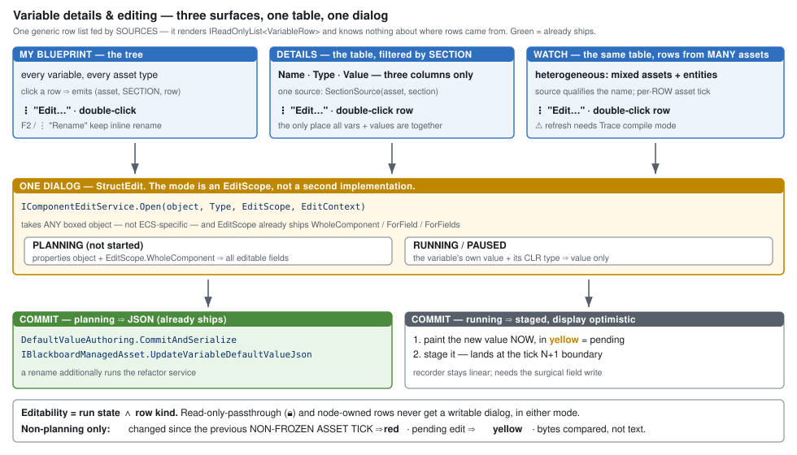

# DESIGN — variable details & editing, consistent across every asset type

> **Track C design. `2026-08-15`.** ⭐ **This is what gets built.**
> ⛔ **Supersedes** the Track C rows in [`PLAN_Remaining_Work.md`](PLAN_Remaining_Work.md) §3 and the
> panel sequencing in [`DESIGN_Variable_Details_And_Live_Values.md`](DESIGN_Variable_Details_And_Live_Values.md) §8.
> ⭐ **Additive to** `docs/blueprints/NodeEdit/D7-details-panel.md` — see §8.



---

## 1. ⭐ The model

| surface | shows | filtered by |
|---|---|---|
| **My Blueprint** | every variable, **every asset type that has variables** | nothing — it is the tree |
| **Details** | ⭐⭐ **the TABLE** | the **section** of the clicked row |
| **Watch** | the same table | the pinned set, ⭐ **grouped (§1b)** |

### ⛔⛔ Columns — **`Name` and `Value` always; `Type` is the only optional one**

⚠ **Today the control has SEVEN**: `Name` · `Type` · `Bytes` · `Value` · `Role` · `Scope` · remove.
⛔ **Bytes, Role and Scope go.** ⭐ **Everything dropped lives in the dialog.**

| column | |
|---|---|
| **`Name`** | ⛔ **mandatory** — it is the identity |
| **`Value`** | ⛔ **mandatory** — it is the point |
| **`Type`** | ⭐ **one toggle.** Default **hidden in Watch** *(monitoring — the user's own note: "not even the data type is important for monitoring")*, **shown in Details** *(authoring, where you pick types)* |

⛔⛔ **No general column-visibility framework.** ⭐ **Seven columns is what we are escaping; a
configurable system is how it grows back. One named toggle cannot drift.**
📌 **Per-variable size stays reachable in the dialog; the whole-asset total is the planning-mode budget
indicator (§5).**

⭐⭐ **Selection yields a SECTION, not a variable.** Clicking any row in *Local Variables* routes Details
to the locals-of-this-graph table with that row highlighted; clicking any row in *Variables* routes it to
the asset-scope table. ⇒ **the routing key is `(asset, section)` + a highlight.**

⛔ **The table is never replaced by a single-variable form.** It is the only place where every variable,
its type and its current value are visible together — *"resembles an automatic watch panel"* — and that
is the reason it exists.

### ⭐⭐⭐ 1a. The control is a GENERIC ROW LIST, fed by sources *(user ruling)*

> ⭐ **"the watch window must allow for selected variables from different assets."**

⛔⛔ **Therefore the table is NOT "the view of one asset".** ⭐ **It renders an
`IReadOnlyList<VariableRow>` and knows nothing about where the rows came from.**

| source | produces | homogeneous? |
|---|---|---|
| **`SectionSource(asset, section)`** — Details | every row of that section | ✔ one asset |
| **`PinnedSource(rowIds)`** — Watch | ⭐ **rows from ARBITRARY assets and entities, mixed** | ⛔ **no** |

⇒ ⭐⭐ **Every row is SELF-DESCRIBING.** The row carries its own identity and its own accessors; the
panel never reaches back to "the asset" because in Watch there is no single asset.

```
VariableRow
  Origin      : (AssetId, Entity, Section, VariablePath)   ← identity; Entity is part of it
  ShortName   : string        ← ⭐ the CONTROL qualifies it when grouping has not (below)
  TypeText    : string
  ClrType     : Type
  ReadValue   : () -> ReadOnlySpan<byte>   ← raw, for both display and change-diff
  AssetTick   : () -> uint    ← ⭐ THIS row's asset tick (§4a)
  RowKind     : Normal | ReadOnlyPassthrough | NodeOwned
  IsStale     : bool          ← asset closed / entity gone; ⭐ Watch already has this concept
```

### ⭐⭐ Qualification — ⚠ **CORRECTED: the CONTROL decides, not the source**

⛔ **An earlier draft put qualification in the source's `DisplayName`** — so every row would repeat
`PlatoonHillAttack2.Health`. 🔴 **Grouping (§1b) does it better: it HOISTS the shared part into a
header instead of rendering it N times.**

⇒ ⭐⭐ **The source supplies the SHORT name plus the origin facets. The control qualifies only what
grouping has not already hoisted** — because only the control knows the active `GroupBy`.

| situation | the `Name` cell shows |
|---|---|
| grouped by `[Asset, Entity]` | ⭐ **`Health`** — the header already says which asset and entity |
| ungrouped, heterogeneous | ⭐ **`PlatoonHillAttack2.Health`** — nothing else carries it |
| ungrouped, one asset | **`Health`** — the facet is uniform, so there is nothing to disambiguate |

⭐ **Full path in the tooltip, always.**

### ⚠ Consequences that fall out of heterogeneity

| | |
|---|---|
| ⭐ **entity is part of row identity** | the same asset on two entities has **two different values** ⇒ the key is `(AssetId, Entity, VariablePath)`, ⛔ **not `(asset, variable)`** |
| ⭐⭐ **the tick is PER ROW** | in Watch, rows tick at **different rates** — each row diffs against **its own** asset tick (§4a) ⇒ ⛔ **no panel-wide tick** |
| ⭐ **stale rows** | a Watch row outlives its asset or entity. ⭐ **`Watch.IsStale` already exists — reuse it**; a stale row shows its last value, greyed, and its dialog is refused |
| ✅ **the dialog still resolves** | the row knows its own asset and entity, so it needs no ambient context |

### ⭐⭐⭐ 1b. Grouping and folding *(user ruling)*

⭐ **`GroupBy` is an ORDERED LIST OF FACETS from `Origin`** — ⛔ **not a set of hardcoded modes.**

| the user asked for | it is |
|---|---|
| ungrouped | `[]` |
| by entity | `[Entity]` |
| by asset | `[Asset]` |
| by asset then entity | `[Asset, Entity]` |

⇒ ⭐ **All four, plus `[Section]`, plus anything later, with no new code per mode.** ⭐⭐ **Every facet is
already on the row — grouping needs NO new row data**, which is the sign the abstraction is right.

| rule | |
|---|---|
| ⭐⭐ **suppress a header whose facet is UNIFORM** | watching one asset ⇒ **no asset header appears, automatically.** ⛔ **No setting, no special mode, no pointless single group** |
| ⭐ **folding is `CollapsingHeader`** | ⛔ **not new machinery** — `VariablesPanelControl` already uses it in **three** places *(sections, Node-Owned Allocations, unbound requirements)*. ⇒ **generalise `DrawDual` into `DrawGrouped`** |
| ⭐⭐⭐ **a COLLAPSED header inherits its children's state** | 🔴 **red if any child changed this tick**, 🟡 **yellow if any is pending** ⇒ ⭐ **fold everything down and you can still see WHERE the activity is, then expand only that group.** ⛔ **Without this, folding only hides — it does not help a monitor** |
| **defaults** | Watch `[Asset, Entity]` · Details `[]` *(one section is already homogeneous)* |
| **persistence** | `GroupBy`, per-group fold state and the `Type` toggle live in the editor layout, **per panel** |

### ⭐⭐⭐ 1c. SECTIONS ARE THE CLASSIFICATION *(user ruling, `2026-08-16`)*

> ⭐ **User, verbatim:** *"do we need to move anything at all? can't we have same single panel (an
> evolution of the MyBlueprint) listing different types of vars in different sections… same for all
> asset types, showing sections relevant for the asset."*

⇒ ⭐⭐⭐ **A variable's classification is WHERE IT WAS CREATED. There is no `Role`/`Scope` control on any
asset type.** ⛔ **This deletes a concept rather than unifying two.**

**The machinery already exists — sections are data, each with its own create command:**

```csharp
public sealed record MyBlueprintSectionDescriptor(
    string Id, string DisplayName, int SortOrder, string? IconKey,
    bool CanCreateItems, bool CanHaveCategories, string? CreateCommandId);
```

⭐ And the panel is **already asset-agnostic**: `MyBlueprintPanel` lives in `NodeEditor.UI`,
`IMyBlueprintModel` in `NodeEditor.Core`. ⛔ **Nothing about it is blueprint-specific.**

| | status |
|---|---|
| section descriptors + per-section create commands | ✅ **shipped** |
| generic panel + interface, outside the blueprint assembly | ✅ **shipped** |
| a **graph-scoped** section as precedent | ✅ `SectionLocalVariables` — and it already handles the subtle case: *"Empty rather than absent… a section that appears and disappears reads as a broken feature"* |
| ⛔ **variables split by kind** | `BuildVariableItems()` lists **only `DeclarationKind.Variable`** ⇒ **Parameters and WorkingState are not shown in My Blueprint at all today** |
| ⛔ **BTree/HSM models** | only `BlueprintMyBlueprintModel` exists (plus a demo fake) — the AI editors have `VariablesPanelControl`, not this tree |

⇒ **The work is additive: split the one Variables section per kind, and give BTree/HSM their own
`IMyBlueprintModel` with their own section list.**

⭐ **Sections are the `Role × Scope` product made visible**, plus the graph-scoped one:

| section | is |
|---|---|
| **asset input vars** | `Role = Input` |
| **asset state vars** | `Role = State` |
| **asset globals** *(shared wider)* | `Role = State`, `Scope = Behavior` / `Entity` |
| **graph local vars** | ⭐ **graph-scoped** — a different index space (`IrGraph.Locals`), already its own section |

⚠ **ECS component fields are the real *entity* globals** *(user correction, `2026-08-16`)* — they have
their own model and are **not** a variable section. ⛔ **No new variable owner is needed.**

### ⭐⭐ Why `Q-k` neither needs implementing nor overturning — **it dissolves**

> `Q-k`, verbatim: *"for blueprints `Role`/`Scope` are read-only — **a MOVE between storage classes, not
> a toggle.** So the honest answer is not to implement the setter but to **say the surface cannot edit
> them**."*

⭐ `Q-k` describes the **edit operation**, not a semantic difference — blueprints encode the role as
*which list holds the declaration*, so changing it renumbers list-relative indices and invalidates
`VariableRef`s. ⇒ **a refactor, like rename.**

⇒ ⭐⭐⭐ **Under the sections model there is no `Role` control to be read-only.** `SupportsRoleScopeEditing`
stops being a question on every host. **`Q-k` stays true and stops mattering.**

📌 **Reclassifying an existing variable** *(moving it between sections)* remains possible but is
⭐ **explicitly OUT of the critical path** — it is a rare, deliberate command, and it may start life as
delete-and-recreate. ⛔ **The renumbering hazard is no longer a prerequisite for anything.**

---

## 2. ⭐⭐ The editable properties — **measured, not taken from a spec**

⛔ **Fields with no storage are REMOVED from the design.** `D7`'s **Replication** *(Replicated,
RepCondition, RepNotify)* and **Range** *(Min/Max)* have **no member on any carrier** — `VariableDecl`
has nine members, `ParameterDecl` six, `BlackboardVariableEntry` seven, and none of them is these.
⭐ **Building them would produce controls with nowhere to save.**

| property | BP `Variable` | BP `Parameter` | BTree/HSM entry | editable |
|---|---|---|---|---|
| **Name** | ✔ | ✔ | ✔ | ✔ ⚠ **must run the refactor-rename service** |
| **Type** *(`TypeId` · `IsArray` · `GenericArgs` · `Capacity` · `InitialLength`)* | ✔ | ✔ | ✔ *(`FieldType`)* | ✔ ⛔ **planning only — it moves bytes** |
| **Default value** *(`DefaultValueJson`)* | ✔ | ✔ | ✔ | ✔ — ⭐ **this is "the value"** |
| **Tooltip** | ✔ | ✔ | — | ✔ |
| **Comment** | ✔ | ✔ | ✔ | ✔ |
| **Category** | ✔ | ⛔ | ⛔ | ✔ where present |
| **IsEditable** | ✔ | ⛔ | ⛔ | ✔ |
| `IsExposedOnSpawn` | ✔ | ⛔ | ⛔ | ⚠ **persisted but nothing reads it at spawn.** ⛔ **Keep it — do not "clean it up"**; per the `.dev/` rule, unreferenced ≠ unintentional. 📐 File the gap, do not close it |
| `Id` | ✔ | ✔ | — | ⛔ identity — references resolve by it |
| `IsAutoManaged` | — | — | ✔ | ⛔ editor-owned |
| ⛔ ~~`Role` / `Scope`~~ | — | — | — | ⛔⛔ **NOT A PROPERTY AT ALL** *(ruling `2026-08-16`, §1c)* — ⭐ **the SECTION is the classification.** Not in the dialog, not a column, not editable on any host. ⇒ **`Q-k` dissolves rather than being implemented or overturned** |

⇒ ⭐⭐ **Seven editable properties, and the set DIFFERS BY DECLARATION KIND** ⇒ **the dialog is driven by
the kind, not by one fixed form.**

---

## 3. ⭐⭐⭐ One dialog, two scopes — ⭐ **and the USER picks which, not the run state**

`IComponentEditService.Open(object component, Type componentType, EditScope?, EditContext?)` takes
**any boxed object** — it is not ECS-specific — and `EditScope` already ships `WholeComponent`,
`ForField(path)` and `ForFields(...)`.

⭐⭐ **The two menu items ARE the two scopes** *(user proposal — and it simplifies the design)*:

| menu item | passed in | scope |
|---|---|---|
| ⭐ **"Edit value…"** | the variable's **own value** *(live value when running, `DefaultValueJson` when planning)* + its CLR type | **`ForField`** |
| ⭐ **"Properties…"** | a **properties object** for that declaration kind | **`WholeComponent`** |

⭐⭐⭐ **This is strictly better than my earlier draft**, where run state chose the scope *implicitly*.
⇒ **Now the user chooses the ACT, and run state only decides AVAILABILITY:**

| | planning | running / paused | replay |
|---|---|---|---|
| **"Edit value…"** | ✔ edits the **initial** value ⇒ JSON | ✔ edits the **live** value ⇒ staged | ⛔ read-only |
| **"Properties…"** | ✔ **fully editable** | ⚠ **read-only** — ⛔ you cannot retype a variable mid-run | ⛔ read-only |

⭐⭐ **Still ONE dialog implementation** — same `IEditSession` lifecycle, same OK/Cancel, same
validation, differing only by the `EditScope` argument. ⛔ **Ruling 9 holds.**

⚠ **The one genuinely new UI work:** `Type` needs a **picker** editor and `Category` a combo.
StructEdit supports custom editors; they must be registered. ⛔ **`S5` lands first** — the picker needs
**one** offerable list, and today there are two (`SelectableTypeIds` vs `EditorOfferableTypeIds`).

---

## 4. ⭐ Gestures — identical on every surface

⭐ **Two items, on BOTH the My Blueprint row and the table row** — identical everywhere.

| gesture | result |
|---|---|
| **`⋮` → "Edit value…"** · ⭐ **double-click the VALUE cell** | the value dialog *(`ForField`)* |
| **`⋮` → "Properties…"** · ⭐ **double-click the NAME cell / row** | the full attribute set *(`WholeComponent`)* |
| **F2, or `⋮` → "Rename"** | inline rename — ⭐ **kept**, and the refactor service still runs |
| single-click | selects; Details re-filters to that row's section |

⭐⭐ **Double-click disambiguates by CELL**, which is how the existing design already binds it *(name ⇒
rename, comment row ⇒ comment edit)* ⇒ **we are extending a convention, not overriding one.**
⭐ **Rename survives on F2 and in the menu**, and `Properties…` also carries `Name`, so both routes run
the refactor service.

---

## 4b. ⭐⭐ How a value is RENDERED in the cell

⭐ **One line, never wrapping, never growing the row.** ⛔ **The cell is a glance; the tooltip is the
detail; the dialog is the edit.**

| kind | cell | tooltip |
|---|---|---|
| **primitive** | ⭐ **inline, formatted** — `80`, `12.5`, `true` | only if truncated |
| **struct** | ⭐ **compact one-line summary**, elided to fit — `{X=1.0, Y=2.0, …}` | ⭐⭐ **pretty-printed, multi-line, one field per line** |
| **fixed list** *(`S4`)* | **`{Count=3: 1, 2, 3}`**, elided | pretty-printed, one element per line |
| **stale row** | last known value, **greyed** | + *"asset/entity no longer present"* |
| **before first write** *(Watch)* | ⭐ **`(pending)`** — ✅ **already designed and shipped** via `!HasEverBeenWritten` | — |
| 🔴 **cannot decode** | ⭐ **`<unreadable>`** | why — the type could not be resolved |

⛔⛔ **NEVER render raw hex as if it were the value.** ⭐ **That was `BP-01`'s user-visible symptom** —
*"the watch panel shows raw hex"* — and it came from `MarshalFromBytes` falling through to
`return bytes`. ⇒ **after `S3` the struct arm decodes; anything still undecodable says so in words.**

⭐ **The tooltip and the dialog share ONE formatter** — ⛔ a second pretty-printer for tooltips would be
ruling 9 in miniature.

---

## 4a. ⭐⭐⭐ Change highlighting — the value monitor half

⭐ **A value that changed is drawn RED for one step, then returns to normal** — the Visual Studio
debugger behaviour. ⛔ **Non-planning modes only** *(running · paused · stepping · replay)*.

### ⭐⭐⭐ The unit of change — **the asset's own tick** *(user ruling)*

> ⭐ **"a non-frozen CGF behavior tick, i.e. the asset tick/update call."**

⛔ **NOT the rendered frame. NOT the world tick.** ⭐ **The counter advances only when THAT ASSET's
tick/update actually runs, and only when it is not frozen.**

| consequence | why it is right |
|---|---|
| ⭐⭐ **paused on a breakpoint ⇒ the highlight PERSISTS** | behaviours do not tick while frozen *(`dt == 0`)*, so nothing has happened. **It clears when you actually Step** — which is precisely the VS behaviour |
| ⭐ **an asset that is not scheduled keeps its highlight** | ⛔ **correct — the value has not had a chance to change.** A world-tick counter would wrongly clear it |
| ⭐ **the counter is PER ASSET INSTANCE** | ⛔ **not global** — different behaviours tick at different rates and tiers |

| | |
|---|---|
| ⭐⭐ **compare RAW BYTES, not the formatted string** | ⛔ **a formatted value hides change** — a `float` moving in its 7th digit renders identically. **Diff the byte slice** |
| ⭐ **state to keep** | per row: `(lastValueBytes, lastChangedAssetTick)`. **Highlight while `currentAssetTick == lastChangedAssetTick`** ⇒ ⭐ **a pure predicate, therefore HEADLESSLY TESTABLE** even though the colour is not |
| ⭐ **who owns it** | ⛔ **not the breakpoint snapshots** — `_preTickSnapshot`/`_postTickSnapshot` exist only while the debugger is engaged, and the monitor must work when it is not. ⇒ **the shared row renderer owns the cache**, keyed by ⭐ **`(AssetId, Entity, VariablePath)`** *(§1a — entity is part of identity)*, covering the whole list so scrolling does not reset it |
| ⭐⭐ **the tick is PER ROW** | ⛔ **there is no panel-wide tick** — a Watch list mixes assets that tick at different rates ⇒ **each row diffs against `row.AssetTick()`** |
| ⚠ **a value that changes every tick stays highlighted** | ⭐ **correct** — VS behaves the same. ⛔ **No damping**; it would hide genuine churn |
| ⚠ **struct rows** | diff the whole slice; **the whole cell** highlights. No per-field highlighting in the table — that is the dialog's job |

### ⭐ Colours — two distinct states

| state | colour | meaning |
|---|---|---|
| **changed** | 🔴 **red**, one asset tick | ⭐ **the SIM changed it** |
| **pending** | 🟡 **yellow**, until it lands | ⭐ **YOUR optimistic edit has not been applied yet** *(§6)* — clears when the staged write lands at the N+1 boundary |
| unchanged | normal | |

⛔ **Never the same colour** — otherwise *"the sim changed this"* and *"my edit has not landed"* are
indistinguishable, which is the one thing a monitor must not do.

### 📐 Carriers — **what exists, and what must be verified**

| | |
|---|---|
| ✅ **the Watch row already carries the state** | `IBlueprintDebugSession.Watch` has **`LastValueBytes`** *(raw!)*, **`LastUpdateTick`**, `UpdateCount` and `HasEverBeenWritten`, and `WriteValue<T>(value, self, tick)` already threads a tick in ⇒ ⭐ **on the Watch side the predicate is nearly free** |
| 🔴 **but the buffer is 64 bytes** | `Watch._valueBuffer = new byte[64]` and `WriteValue` **throws above 64** ⇒ ⛔ **`MemberSlotList` (96), `WaveState` (104), `HillAttackSharedState` (136) cannot go through it.** 📐 **The shared row renderer must not inherit that limit** |
| ⚠ **`OnNewTick()` exists on the debug session** | 📐 **VERIFY whether it fires per WORLD tick or per ASSET tick** — ⛔ **the ruling needs the asset's own tick, and I have not confirmed which this is** |
| ⚠ **BTree/HSM need the equivalent** | `BTreeFacets.TickCount` exists **but `BTreeFacetMapper:170/191` sets it to `0`** ⇒ 📐 **trap #5 shape — verify it is populated before relying on it** |

---

## 5. ⭐ Run state governs everything

| | planning | running / paused | replay |
|---|---|---|---|
| Value column | the **initial** value | the **current** value | current, ⛔ **read-only** |
| ⭐ **change highlight** | ⛔ **none** | ✔ 🔴 **red, one ASSET tick** · 🟡 **yellow while pending** | ✔ 🔴 **red, one asset tick** *(no pending — no edits)* |
| dialog scope | whole properties object | value only | ⛔ **no dialog** |
| **byte-budget indicator** | ⭐ **shown** | ⛔ **hidden** | hidden |

⭐⭐ **The budget indicator is PLANNING-ONLY chrome, not part of the variable list.** It answers *"will
this layout fit?"* — a question about the layout being authored. Once the exercise runs the layout is
fixed and the number is noise. ⇒ ⛔ **it needs no per-host capability flag — the same run-state switch
the Value column already uses covers it**, and it retires the old objection that the shared control was
*"inappropriate"* to reuse.

⭐ **Editability = run state ∧ row kind.** ⛔ **Read-only-passthrough (🔒) and node-owned
(`IsAutoManaged`) rows never get a writable dialog, in either mode.**

---

## 6. ⭐ The write path

| | |
|---|---|
| **planning** | ⭐⭐ **already ships** — `DefaultValueAuthoring.Hydrate` / `OpenSession` / `CommitAndSerialize` → `IBlackboardManagedAsset.UpdateVariableDefaultValueJson(name, json)`. **Re-host it; do not rebuild it**, and retire the `InspectorWindow` "STATIC PARAMETERS" section it currently lives in so there is one home |
| **running / paused** | ⭐⭐⭐ **OPTIMISTIC DISPLAY** *(user ruling)* — **paint the new value in the cell immediately**, then **stage** through the existing `StageMutation` path, which lands at the tick **N+1** boundary. ⛔ **Do NOT write `_liveRepo` during a pause** — `Blackboard1024` is `[DataPolicy(NoSave)]`, i.e. **snapshotted and recorded**, so a non-simulation write breaks Flight Recorder linearity |
| 🔴 **prerequisite, either way** | **the surgical field write** — `SetComponentFieldRaw(entity, typeId, byteOffset, src, size)` in `Fdp.Core`. ⛔ **Today's staged write is whole-component and lands AFTER the restore, so every other field reverts a tick** — on the shared blackboard that reverts BTree and HSM state |

---

## 7. ⭐ What already ships — reuse, do not rebuild

| | |
|---|---|
| `VariablesPanelControl` | in `AiShared`, descriptor-driven, per-section budgets, **live Value column already built** *(5th column, `"—"` on no match)* ⚠ gated on a name-match against the selected entity |
| `DefaultValueAuthoring` + `UpdateVariableDefaultValueJson` | the whole planning-mode commit path |
| StructEdit — `IComponentEditService` / `IEditSession` / `EditScope` | the dialog engine and its two modes |
| Watch `"(pending)"` | *"nothing before the run"* is **already designed and built** via `!HasEverBeenWritten` |
| ⚠ **the Watch refresh gap is NOT an empty handler** | it needs **Trace** compile mode — ⛔ **Debug emits no `PinValueChanged` at all**, and `QuickReloadService:64` hardcodes `CompilerMode.Debug`. 📐 **Fix the mode, then the handler** |

---

## 8. ⭐ Relationship to `D7` — additive, not a contradiction

`D7-details-panel.md` is authoritative and routes by **target kind**. This design **adds a
`VariableSection` target** and moves `D7`'s `Variable` field list from a docked form into the dialog —
⭐ **the field list is preserved; only its host changes** *(minus the two storage-less groups, §2)*.
⛔ **`D7`'s `Variable`/`LocalVariable` single-target form is superseded by the section table + dialog.**

---

## 9. Rails

| | |
|---|---|
| ⭐⭐ **column set** | the visible set is a **subset of `{Name, Type, Value}` with `Name` and `Value` mandatory** — ⛔ **any other column fails it**, including for a heterogeneous list. ⭐ **`Type` toggles; nothing else can be added** |
| ⭐⭐ **grouping** | ⭐ **headless**: `GroupBy = [Asset, Entity]` over a mixed list ⇒ correct nesting and membership · ⭐⭐ **a uniform facet emits NO header** · **a collapsed group reports red if any child changed, yellow if any is pending** |
| ⭐ **value rendering** | a struct's cell is **one line and elided**; its tooltip is **multi-line**; ⛔ **an undecodable value renders `<unreadable>`, never hex** |
| ⭐ **two dialogs, one implementation** | *"Edit value…"* and *"Properties…"* differ **only** by the `EditScope` argument — ⛔ **a second `Open` call site fails the rail** |
| ⭐⭐⭐ **heterogeneous source** | ⭐ **feed the control rows from TWO DIFFERENT assets AND the same asset on two entities**, and assert: distinct identities · **independent** highlight state · qualified `DisplayName` from the source · a stale row renders and refuses its dialog. ⛔ **This is the test that stops the control from quietly assuming one asset** |
| ⭐⭐ **change highlight** | ⭐ **headless**: drive `(lastValueBytes, lastChangedAssetTick)` and assert the predicate — **changed ⇒ true for one ASSET tick, false on the next** · **unchanged ⇒ never** · ⛔ **planning ⇒ never** · ⭐ **format-equal but byte-different must be TRUE** *(the float-7th-digit case)* · ⭐⭐ **frozen: N world frames with NO asset tick ⇒ STILL TRUE** *(the ruling's whole point)* · ⭐ **pending and changed must be DISTINGUISHABLE states, not one flag** |
| ⭐⭐ **one dialog** | a reflection test: exactly **one** call site constructs the variable edit session |
| ⭐ **one commit path per mode** | planning writes JSON only; running stages only. ⛔ **No path writes both** |
| ⭐ **kind-driven fields** | a test per declaration kind asserting the dialog exposes **exactly** its storable set — ⛔ **a field with no backing member fails the test** |
| ⭐ **row-kind refusal** | 🔒 and node-owned rows: the dialog opens read-only or not at all — **proven by trying** |
| ⭐ **run-state matrix** | §5 as a table-driven test, including **replay ⇒ no dialog** |
| ⛔ **visual check required** | the table, the gestures and the budget-indicator switch are surfaces **no headless test can see drawn** |

---

## 10. Sequence

**`S5` (one picker)** → **the surgical field write** → ⭐ **`C-sections`** *(split the Variables section
per kind; per-section create commands)* → **`C-table`** *(Details hosts the section table)* →
**`C-dialog`** *(one dialog, two scopes, kind-driven)* → **`C-watch`** *(share the renderer; fix the
compile mode)* → ⭐ **`C-outline`** *(BTree/HSM supply their own `IMyBlueprintModel` + section list)*.

⚠ **Still open, not blocked by this design:** the `InspectorWindow` retirement order, and whether
`W7`'s suppressible-warning design changes what the table shows for a conflicted variable.

⚠ **One carry-forward from the parameter work:** row identity is `(AssetId, Entity, VariablePath)`.
⭐ **If Instance slot identity widens to `(blueprintId, instanceKey)`** — likely, once Instances take
parameters — **the row identity gains a fourth component.** 📐 **Noted, not built for.**
