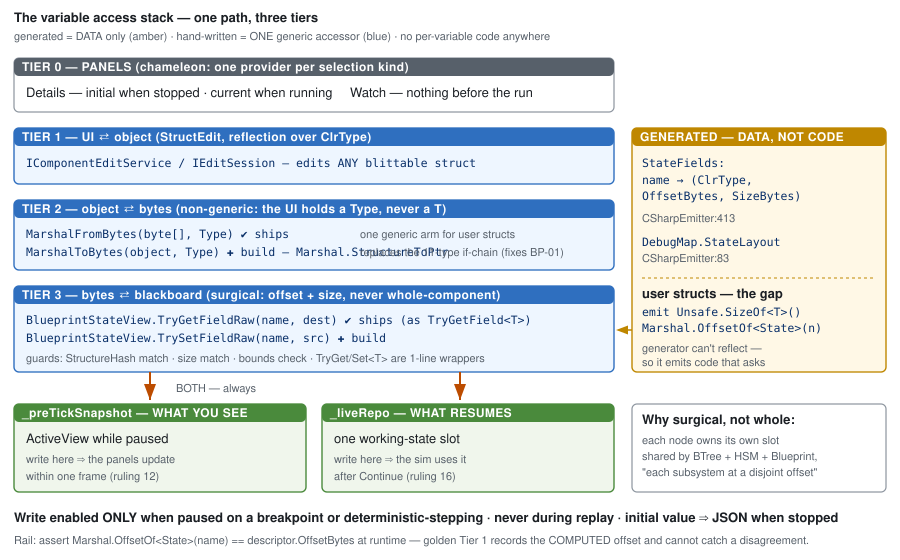

# DESIGN — the variable Details panel, live values, and the access stack

> **Coordinator, `2026-08-15`.** ⭐ **The consolidated design.** Rulings and their derivations live in
> 📄 **[`Architect_Question_32_…_ANSWERS.md`](Architect_Question_32_Variable_Details_And_Values_ANSWERS.md)**;
> **this document is what gets built.**
>
> ⛔ **Standing constraint over everything below (ruling 9):**
> ***"a clean solution — no keeping two implementations for the same concept."***

---

## 1 · The model — one cell

| kind | is | |
|---|---|---|
| `Variable` · `WorkingState` | ⭐⭐ **ONE cell — `(State, Asset)`** | same backing `VariableDecl`, same `DefaultValueJson`, **already emitted identically** |
| `Parameter` | `(Input, Asset)` | *"a genuinely different thing"* — supplied at spawn. ⛔ **not unified** |

⇒ **The panel treats `Variable` and `WorkingState` identically. Everywhere.**

---

## 2 · The access stack



### ⭐⭐⭐ The rule the whole design turns on

> **GENERATE THE DATA. HAND-WRITE ONE GENERIC ACCESSOR. NEVER GENERATE PER-VARIABLE CODE.**

This is not new — it is the convention already in the repo, made explicit:

| | generated (data) | hand-written (one, generic) |
|---|---|---|
| **ships today** | `StateFields: name → (ClrType, OffsetBytes, SizeBytes)` `CSharpEmitter:413` · `DebugMap.StateLayout` `:83` | `BlueprintStateView.TryGetField<T>` · `MarshalFromBytes(byte[], Type)` |
| **to build** | ⭐ **user-struct sizes — emit `Unsafe.SizeOf<T>()`** (§4) | `TrySetFieldRaw` · `MarshalToBytes(object, Type)` |

⛔ **`grep` finds no per-variable generated accessor anywhere. Do not introduce the first one.**

### Why the tiers are split where they are

| tier | why it exists |
|---|---|
| **1 · UI ⇄ object** | StructEdit already edits **any** blittable struct by reflection ⇒ reuse, do not rebuild |
| **2 · object ⇄ bytes** | ⭐⭐ **The UI holds a `Type` at run time, never a `T` at compile time** ⇒ the API here **must be non-generic**. `TryGetField<T>` is unreachable from a panel iterating descriptors — ⛔ **and a *generated* `SetHealth(float)` would be equally unreachable, so generating accessors does not solve this; it moves the dispatch and adds N methods** |
| **3 · bytes ⇄ blackboard** | offset + size + hash guard. ⭐ **`TryGetField<T>`/`TrySetField<T>` survive as one-line wrappers over the raw pair** ⇒ one implementation, two faces |

---

## 3 · Writes

### 3.1 When

| state | value shown | write |
|---|---|---|
| **not running** | the **initial** value | ⭐ → `DefaultValueJson` in the asset JSON |
| **running, free** | the current value | ⛔ **disabled** |
| ⭐ **paused on a breakpoint · deterministic stepping** | the current value | ✅ **enabled** |
| **replay** | the current value | ⛔ **refused, naming the reason** — a write diverges the run from the recording |

⭐ **Because writes happen only while paused, nothing else is mutating the blackboard** ⇒ no race to
design against, and ⛔ **the command buffer is not required** for this path.

### 3.2 Where — ⭐⭐ **both copies, always**

```
edit ──▶ _preTickSnapshot   (ActiveView while paused — what the panels display)
     └─▶ _liveRepo          (what the sim resumes from)
```

⭐ **Writing both makes the resume-sync direction irrelevant** — the two already agree, so it does not
matter which way `SyncFrom` runs. ⚠ **Still assert it: edit while paused → resume → the value survives.**

### 3.3 How — ⭐ **surgical, never whole-component**

⛔ **`Blackboard1024` is ONE component shared by BTree, HSM and Blueprint** — *"each subsystem projects
at a disjoint byte offset."* ⇒ **a whole-component write clobbers other subsystems' state.**

📌 *(It is not a size problem: `ByteSize == 1024` and the ECB check is `> 1024`, so it would fit. The
sharing is the reason.)*

**Every write is `(offset, size)` bounded**, through tier 3, after the `StructureHash` matches.

---

## 4 · User-defined structs

🔴 **Today only three are supported, hardcoded with hand-computed sizes** (`StaticTypeRegistry:75-81`),
and the file names its own gap: *"a general curated-struct registration mechanism … is future work."*

⭐⭐⭐ **The compiler does not know the layout either — it emits code that ASKS:**

```csharp
// CSharpEmitter:412 — already shipping, for !SizeReliable types
(int)Marshal.OffsetOf<{className}.State>("{f.Name}")
```

⇒ **The `netstandard2.0` generator cannot reflect, so it emits C# that Roslyn resolves where the type
IS loaded.** ⭐ **Generalise exactly this** — emit `Unsafe.SizeOf<TheUserStruct>()` for any struct-typed
variable instead of requiring a registry entry. ⛔ **Still data, still no accessor.**

| | |
|---|---|
| ⭐ **read/write of a user struct's VALUE** | ⛔ **needs nothing new** — at run time the CLR type is loaded, so `Marshal.PtrToStructure` / `StructureToPtr` and StructEdit's reflection cover **every** blittable struct in one arm |
| ⭐ **its SIZE/OFFSET in `State`** | **the actual gap**, and it is solved by emitting a `sizeof`, not by generating setters |

---

## 5 · The panels

| | Details | Watch |
|---|---|---|
| **is** | an **authoring** surface that also shows runtime | a **runtime** surface only |
| **before the run** | ⭐ the **initial** value, editable | ⭐⭐ **nothing** |
| **while running** | current value | current value |
| **editing** | ✅ | ✅ **same dialog, same path** |
| **structure** | ⭐ **chameleon — one provider per selection kind**, dispatched through the existing `DrawerRegistry`; ⛔ **never a `switch` in the panel** | — |

⚠ **The pre-run asymmetry is deliberate. Do not "unify" it** — ruling 9 forbids two implementations of
one concept, not two behaviours of two different concepts. **A Watch on an entity that has not spawned
has nothing to show, and printing the JSON default there would invent a "current" value.**

**Selection routing:** a **global** clicked in the outline ⇒ the globals/working-state list · a **local**
clicked ⇒ the locals **of the current graph**.

**The cell:** read-only, pretty-printed tooltip at full size. **Three-dot button *and* double-click**
open the StructEdit dialog (OK / Cancel), initialised to the current value.

---

## 6 · Rails — each one exists because something silently failed without it

| rail | catches |
|---|---|
| 🔴🔴 **`Marshal.OffsetOf<State>(name) == descriptor.OffsetBytes`, asserted at runtime for every field of every corpus asset** | ⛔ **the compiler and the CLR disagreeing on layout** — `TypeAlignment` gives `Vector3` align 8, the CLR packs at 4. ⭐⭐ **Golden Tier 1 CANNOT catch this: it records the COMPUTED offset, so both sides agree while the real field moves** |
| ⭐⭐ **marshaller pinned to `EditorOfferableTypeIds` by reflection test** | ⛔ **`BP-01`** — 7 of 18 offerable types fall through `MarshalFromBytes` to raw bytes. **Extends `U-8` from *"every offered type compiles"* to *"…and can be shown and edited"*** |
| **`StructureHash` match before any decode or write** | a stale layout reading or writing the wrong bytes |
| **size match + bounds check** | ⛔ **out-of-range is memory corruption, not a wrong value — fail loudly** |
| **edit-while-paused → resume → value survives** | the snapshot/live divergence in §3.2 |
| **`+8` header offset owned in exactly ONE place** | a header offset computed twice |

---

## 7 · Reuse ledger

| piece | |
|---|---|
| the table + its columns | ✅ **exists** — `VariablesPanelControl` |
| initial-value storage + emission | ✅ **exists for both kinds** |
| initial-value setter | ✅ interface exists; **HSM + BTree implement it, blueprint does not** |
| live-value read | ✅ column + `ILiveValueProvider`; **blueprints never supply it** |
| StructEdit dialog | ✅ **exists** |
| generic field read | ✅ `TryGetField<T>` + `MarshalFromBytes` |
| **generic field write** | ✚ `TrySetFieldRaw` + `MarshalToBytes` |
| **user-struct size registration** | ✚ emit `Unsafe.SizeOf<T>()` |
| **Watch panel edit + refresh** | ✚ — ⛔ **`HandlePinValueChanged` is an EMPTY BODY today** |

---

## 8 · Sequencing

| | |
|---|---|
| **56** | emitter/access unification — `Variable ∪ WorkingState` *(dispatched)* |
| **57** | Details hosts the shared control + selection routing |
| **58** | the value column + blueprint's `ILiveValueProvider` and `UpdateVariableDefaultValueJson` |
| **59** | StructEdit dialog (button + double-click) · the **not-running** write |
| **59b** | Watch: real refresh · editing · nothing before the run |
| **59c** | tier 2 + tier 3 write halves · user-struct sizes · **both-copies** write · the §6 rails |
| **60** | `U-16` — retire `BlueprintVariablesWindow` |
| **61** | ⭐ **the shared outline** across HSM / BTree / Blueprint — ⛔ **separate, and only after Details works for blueprints** |

---

## 9 · Open decisions

| | |
|---|---|
| ⚠ **Promote `BlueprintStateView`?** | it is documented *"for test assertions"* today. ⛔ **A production sibling would be two implementations** ⇒ ⚖️ **lean: promote it**, but it is a decision |
| ⚠ **Two struct-editing surfaces exist** | FDP-level `IComponentEditService` vs blueprint-local `IStructEditDrawer`/`DrawerRegistry`. ⚖️ **Lean: build on the FDP-level one** — ⛔ **but redundancy is NOT proven and must be measured before either is retired** |
| ⚠ **Ruling 9's true blast radius** | **three** surfaces show variables (`BlueprintVariablesWindow` · `AiShared/BlackboardAuthoringWindow` · `BTree/LiveBlackboardPanel`), and `InspectorWindow` exists **twice** ⇒ ⛔ **`U-16` alone leaves two implementations, not one** |
