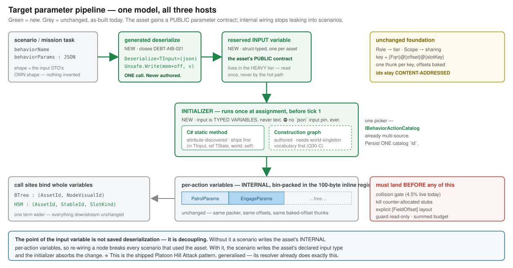

# Design — the behaviour-asset parameter & variable model

> **Written `2026-08-14`** by the cross-host variable/call design session
> (branch `claude/cross-host-variable-model-3k8cfh`).
> ⭐⭐ **Scope: ALL behaviour assets — BTree, HSM and Blueprint.** The work began as a reply to the HSM
> session's parameter questions and outgrew it; **HSM is one consumer, not the subject.**
>
> ⛔ **Design only. Nothing here is built.** ⛔ **No ids allocated** — the implementing session numbers
> its own rows.
>
> ⚠ **Provenance:** the NotebookLM architect was unavailable; the user designated this session
> architect of record, so `#28`/`#29`/`#30` carry **rulings**. They are **Claude-authored** ⇒ weaker
> provenance than the NotebookLM rounds that redirected four of the last nine batches.
> ⭐ **Every ruling names the measurement it rests on. Overturn on evidence, not authority.**

| companion | what it holds |
|---|---|
| [`PriorArt_Cross_Host_Variable_Model.md`](PriorArt_Cross_Host_Variable_Model.md) | ⭐ **the evidence** — 13 measured findings + the cross-lane impact table |
| [`Explainer_Action_Params_And_Asset_Variables.md`](Explainer_Action_Params_And_Asset_Variables.md) | **how it works TODAY** (as-built, dated) |
| [`#28`](Architect_Question_28_Cross_Host_Binding_Mechanism.md) · [`#29`](Architect_Question_29_Cross_Host_Variable_Semantics.md) · [`#30`](Architect_Question_30_Editor_Authored_Param_Preprocessing.md) | **the decisions and their rationale** |
| [`Response_To_Hsm_Parameters_And_Variables.md`](Response_To_Hsm_Parameters_And_Variables.md) | the HSM-specific reply (held) |

---

## 1. The foundation — unchanged, and everything rests on it

⭐ Full mechanics in the [explainer](Explainer_Action_Params_And_Asset_Variables.md). In one paragraph:

**An action does not own its parameters.** The asset variable is the storage; the action's DTO is a
**lens** onto a slice of it, so a write through the `ref` **is** a write to the variable — there is no
copy-back because there is no copy. `Role` picks the tier (`Input` → the 100-byte inline region,
`State` → the partition tier). `Scope` picks who shares, implemented as **what the slot key omits**.
One thunk per `{MethodFqn}@{offset}@{slotKey}` key, offsets baked as constants; the kernel never
computes an offset, it looks one up.

⛔⛔ **The one invariant nothing below may break:** ⭐ **ids stay CONTENT-ADDRESSED.** Hot reload does
`ClearAll()` → re-register from a **new assembly** and **never re-flattens the ROM**
(`AiHotReloadCoordinator:309`) ⇒ **ROM outlives the registry, and only a content-addressed id
survives that.**

---

## 2. The four extensions

### 2.1 ⭐⭐ `E-A` — the asset gets a PUBLIC parameter interface

| | |
|---|---|
| **what** | a **reserved, struct-typed input variable**, one per asset. Generated deserialize = one `Deserialize<TInput>` + one `Unsafe.Write` at its offset. The scenario JSON shape **is the DTO's own shape** |
| **why** | 🔴 **a managed asset cannot be parametrized per instance at all today** — the generated `ParseParams` ignores its `json` argument (`DEBT-AIB-021`), and HSM emits no `ParseParams` whatsoever (`PA-13`) |
| ⭐⭐ **the real argument** | **decoupling, not saved deserialization.** Without it a scenario writes the asset's *internal* per-action variables ⇒ **re-wiring a node breaks every scenario that used the asset.** With it, the scenario writes the declared input type and the initializer absorbs the change |
| **tier** | ⭐ **heavy tier, NOT the inline 100 B** — it is read once by the initializer and never by the hot path. ⭐ `Pack` already skips `Role == State`, so a declared variable outside the inline region is an established pattern |
| **type source** | today a C# struct type id, like any struct-DTO variable. ⭐ **Editor-authored later needs no model change** |
| ⚠ **rails** | the reserved name must be **REFUSED** if a user declares it — ⛔ **not silently renamed by `MakeUniqueName`** |

⭐ **This makes World A the degenerate case of World B:** a curated behaviour *is* "one input DTO at
offset 0". The two paths converge instead of staying parallel.

### 2.2 `E-B` — the initializer

| | |
|---|---|
| **what** | runs **once at assignment**, after deserialize, **before tick 1**. Reads input variables, writes derived variables / working state |
| ⭐⭐ **the reframing** | **it is not a "resolver", it is an INITIALIZER.** A resolver's input is **text**; an initializer's input is **typed variables**. ⛔ **It must never gain a `json` input pin** — the moment it can, the vocabulary grows a JSON sub-language nobody designed |
| **providers** | **(i)** a C# static method — `(in TInput, ref TState, EntityRepository, Entity)`, **no pointers, no JSON**; **(ii)** a blueprint `Construction` graph — the kind already exists and already cannot suspend |
| **selection** | ⭐⭐ **reuse `IBehaviorActionCatalog`** — already a *"unified facade over all behavior-action sources"* with `Source`, `Category`, `ValidHosts` and a **source-varying `Id`**. Adding a provider is an **enum member + a contributing catalog**, not a new picker |
| **persistence** | ⭐ **ONE string — the catalog `Id`.** `{assetId}:{graphId}` is the *third* instance of the source-varying scheme, not a new idea. `Source` is **display-only, always derived** ⇒ never two fields that must agree |
| ⚠ **rails** | the catalog needs **`TryGetById`** (it has only `GetActions()` today). ⛔ **A missing `Id` must raise a diagnostic, never resolve to "no initializer"** |

⭐ **The rule that scopes it, and it keeps `E-B` from swallowing the graph:**

> **Assignment-time and depends only on input params → the initializer.
> Depends on live world state or timing → an ordinary node.**

Platoon Hill Attack needs **both**: its resolver does impedance matching (geo→cartesian, entity
resolution) at assignment; its *per-tank distribution* must be a node, because the subordinate list
does not exist at assignment time.

### 2.3 `E-C` — the call-site identity widens

| | |
|---|---|
| **what** | `(AssetId, NodeVisualId)` → `(AssetId, StableId, SlotKind)`, `SlotKind ∈ {OnEntry, OnExit, Activity, Timer, Guard, Effect}`. A binding becomes **its own entity keyed by call site**, not fields on a node |
| **why** | a BTree node has one action; an HSM state has **four**, plus two per transition — and ⚠ **the four are already unequal** (`HsmFlattener:172–173` gives Entry/Exit an explicit-id override, `:174–175` gives Activity/Timer none). **Fields on a state would freeze that asymmetry into persistence** |
| ⭐ **cheap because** | scope is **already** in the key, and `Behavior` scope already drops the node term — **it drops a slot term just as well.** One term wider, everything downstream untouched |
| ⛔ **sequencing** | the slot key is inside the registry key and baked as a `const` ⇒ **this IS part of the key re-bake, not a separate change** |
| ⚠ **lowest-confidence ruling in the set** | it turns on whether `SlotKind` ever exceeds today's six. **If six is final, six fields is simpler and this should be overturned** |

### 2.4 `E-D` — asset-driven thunk emission for HSM

| | |
|---|---|
| **what** | the HSM twin of `EmitManagedActionThunks`: walk the asset, emit one thunk per `(method, offset)` pair |
| **why** | ⭐ HSM offsets come from **source attributes** (`[SharedAiAction(typeof(Dto),"Field")]`), so **the editor cannot request a key no attribute already declared.** ⇒ this is `HSM-016`, correctly scoped |
| **coexistence** | ⭐ **source-declared bindings stay** for hand-written library actions. **The rail is structural:** *a method carrying `[SharedAiAction]` may not also be asset-bound* — not a precedence rule |

---

## 3. ⛔ Correctness work that must land FIRST

⚠⚠ **These are not preparation. Three are live defects, and two are in the blueprint lane.**

| | work | evidence |
|---|---|---|
| **1** | 🔴 **collision gate** — duplicate ids, reserved `0`/`0xFFFF`, and a rail refusing any standalone key but `@0` | `ComputeHash` truncates FNV-1a to `ushort`; `RegisterAction` **silently overwrites**. ⭐ **At today's 78 sites: 4.5 % chance of a live collision; 49.6 % at 300.** ⭐ **Mirror `UT0103`, do not invent** |
| **2** | 🔴 **kill `HsmBridgeEmitCore`'s counter-allocated stubs** | registers no-ops at `100++`/`200++` while the flattener uses `ComputeHash(name)` ⇒ **a stub can overwrite a real action.** Independent of every ruling here |
| **3** | **explicit `[FieldOffset]` on the emitted blackboard struct** | packers use `align = min(size,8)`; measured `Marshal.OffsetOf` for a `Vector3` after a `byte` is **4**, packers say **8**. ⭐ Explicit layout makes the packer's number *become* the layout — **no oracle left to disagree with**, and it **subsumes the `bool`/`MarshalAs` rule** |
| **4** | **guard read-only projection** | guard thunks hand out a mutable `ref` during **speculative** evaluation. ⭐ **Measured free: 0 production `[SharedAiCondition]` usages.** State it as *"a speculative evaluation may not be observable"* |
| **5** | **budget summed over all bindings in an asset** | today per-DTO/per-asset only ⇒ ⭐ **a BTree parallel composite already violates it.** `Pack` already returns `totalBytes`. Fold in `BehaviorParameterSizeAnalyzer:26`'s duplicated constant |
| **6** | ⭐ **a `Vector3`-after-`byte` corpus asset** | today **no gate can see that class at all** — it is what makes #3 falsifiable |

---

## 4. ⛔ Ruled out — and why, so it is not re-litigated

| rejected | reason |
|---|---|
| **dense / allocated ids** | ⭐⭐ ROM outlives the registry; a renumber silently mis-dispatches every live entity. **Content addressing is the mechanism, not a shortcut** |
| **widening ids to `uint`** | same failure one level up — **changes every persisted ROM blob**, and buys what a compile-time gate gives free |
| **initializer name derived from the asset name** | ⛔ cannot distinguish *"no initializer"* from *"missing / misspelled"* — **a silent no-op**; breaks on rename; `BP-228` already ruled against this class |
| **authored JSON parsing** | blueprints have **no JSON vocabulary**; inventing one means drawing a parser |
| **wrapper JSON keyed by variable name** | superseded by `E-A` — it invented a convention and forced scenarios to know internal names |
| **per-field binding** | architect-rejected: the kernel projects one `ref` over a contiguous slice; scattering forces a per-tick temp + copy |
| **a discriminated union for initializer selection** | unnecessary — the catalog `Id` already varies by source, so **one string cannot express the illegal both-set state** |

---

## 5. Lanes and ownership

⭐ **Most of this is blueprint-lane work.** `Fdp.Toolkits.Analyzers` **belongs to the blueprint lane**
(user ruling, `2026-08-14`) — which resolves the one open ownership question.

| area | assembly | lane |
|---|---|---|
| collision gate · `HsmActionGenerator` | `Fdp.Toolkits.Analyzers` | ⭐ **blueprint** |
| stubs · asset-driven thunks · deserialize | `Hrot.AiEditor.Persistence` | ⭐ **blueprint/BTree** |
| packer / explicit layout | ⭐ `Hrot.Editor.AiShared` — **shared by all three hosts** | **blueprint/BTree** |
| budget rails | `Hrot.Blueprints.Compiler` + 2 others | **blueprint** |
| initializer picker + catalog | `Hrot.Blueprints.Editor` | **blueprint** |
| slot carrier · flattener asymmetry · picker | `Hrot.Hsm.Editor` · `Fhsm.Compiler` | **HSM** |

---

## 6. Build order

⭐ **Not the document order.** Steps 1–3 are **ours**, and gate everything else.

| # | | |
|---|---|---|
| **1** | ⭐⭐ **collision gate + corpus asset + `E-A`** (input variable & generated deserialize, both emitters) | independent of each other, **all headless** |
| **1b** | 🔴 **kill the counter-allocated stubs** | live hazard, no design dependency |
| **2** | **explicit `[FieldOffset]` layout** | byte-stable; step 1's corpus asset proves it |
| **3** | **guard read-only** → then the concurrent-writer rule | ⚠ the concurrency rule is **undecidable without it** |
| **4** | **FQN key unification + `E-C`'s `SlotKind`** — ⭐ **together** | one key change, one verification |
| **4b** | **initializer picker (C# provider)** | cheap; no new blueprint vocabulary |
| **5** | **`E-D`** asset-driven HSM thunks (`HSM-016`) | needs 1–4 green |
| **6** | **`E-B`** authored `Construction` initializer + world-singleton vocabulary | the largest new surface |
| **7** | **retire the standalone stride path** — ⚠ **after `U-12`** | otherwise touches `AiPrimitiveEmitter` mid store-flip |

⚠ **Live constraints:** `U-12` (the blueprint store flip) is **in flight**; the Blueprints suite is
**red on 2 pre-existing order-dependent tests** (`RESUME_START_HERE` §7x); the visual check has not run
for 14 batches ⇒ ⭐ **prefer designs whose acceptance is headless.** Every step above is.

---

## 7. Open questions — flagged, not hidden

| | |
|---|---|
| ⚠ **`SlotKind` open or closed?** | the whole `E-C` carrier ruling turns on it, and **I have no roadmap evidence.** If six slots is final, plain fields are simpler |
| ⚠ **world-singleton vocabulary is unbudgeted** | `E-B`'s authored provider **cannot express Hill Attack** without it — plus geo→cartesian and entity-from-network-id nodes, and a defined failure contract |
| ⚠ **both orchestrator emitters are dead** | called only from their own tests; `WriteOrchestratorFile` has **zero** callers, while `CompanionFileDiscovery:194` looks for the sidecar nothing writes. ⭐ **Needs a live-or-dead decision before anyone builds on Approach B** |
| ⚠ **guard blackboard fetch cost unmeasured** | fetching `BrainBlackboard` per speculative guard evaluation is what ships; **optimising it should follow a measurement, not precede one** |

---

## Change log

| Date | Change |
|---|---|
| 2026-08-14 | Created — consolidates `#28`/`#29`/`#30` into one cross-host design after the work outgrew the HSM reply. |
