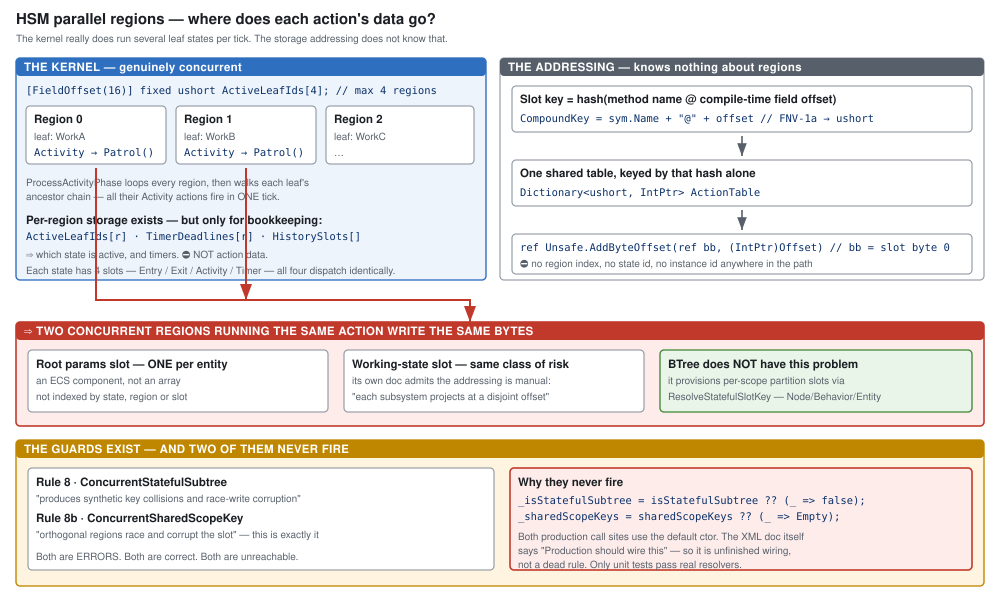

# Where parameters and state actually live — all hosts, one picture

> ## ⭐ This is the MEASUREMENT RECORD + the diagrams.
> ⛔ **The design is [`DESIGN_Parameter_Model.md`](DESIGN_Parameter_Model.md) — it wins on any
> disagreement.** Read that first; come here for the file:line evidence behind it.

> **Why this exists.** The question *"is every input variable in the 100-byte blackboard?"* has a
> one-word answer (**yes**) and a five-part explanation. This is the explanation, measured on
> `HEAD` (`2026-08-16`), not inferred.
>
> ⭐⭐ **Headline: most of the unification we were designing already exists as a design record** —
> 📄 [`Behavior_Parameter_Resolver_Detailed_Design.md`](Behavior_Parameter_Resolver_Detailed_Design.md)
> (`2026-07-13`), with a gap list `G1`–`G7`. This document does **not** redesign it; it maps it onto
> what the code does today.

---

## 1. The storage map


| region | holds | size | who writes it |
|---|---|---|---|
| **`BrainBlackboard.BehaviorParameters`** | ⭐ **every input, every host, every tier** | **100 B** — **ONE params struct for the ACTIVE BEHAVIOUR** | `BehaviorIngressSystem`, once at activation |
| `Blackboard1024.Memory` | AiPrimitive / shared-AI **state** | 1024 B, `StructureHash` @0, state @8 | the action itself, every tick |
| `BlueprintBlackboard{1024,4096,16384}` | ⭐ **Instance blueprint state — the allocatable one** | payload **928 / 3936 / 16368 B**, 4 slots | `BlueprintInstanceService.AttachToEntity` |
| a managed heavy component | `[SharedAiHeavyAction]` managed state | unbounded (a class) | the action itself |

⭐ **All four are `[DataPolicy(NoSave)]`.** Nothing here is serialised — inputs are **re-supplied at
each activation**, which is why the tier question is about *addressing*, not persistence.

### The three things people get wrong

| | |
|---|---|
| ⛔ *"blueprints keep inputs in allocated space"* | **No.** `asset.Parameters` has **one emitter in the entire compiler** — `AiPrimitiveEmitter.EmitParamsStruct`. `InstanceEmitter` never emits them, and `BP1031` refuses them outright. ⇒ **a blueprint has inputs only when it IS a BTree/HSM action**, and they land in the same 100 bytes |
| ⛔ *"going heavy moves the params"* | **No.** `EmitHeavySharedAiAdapter` emits **both**: params from `bb.BehaviorParameters`, heavy state from the component. ⭐ **The heavy tier extends STATE, never INPUT** |
| ⛔ *"the 100 bytes are carved up per action"* | **No — corrected `2026-08-16`.** It holds **ONE params struct belonging to the behaviour** (`BehaviorDefinition.ParamsDtoType`, singular). ⭐ `[SharedAiAction(typeof(Dto),"Field")]` makes an action **bind a FIELD of that struct** — actions reference the behaviour's params, they do not each own an allocation. Per-action scratch lives in the **state** area, not here. The cap is on that one struct, enforced three times, the last a runtime `throw` |

---

## 2. How inputs get supplied


⭐⭐ **`BP1031`'s *"nothing supplies them at spawn"* is true only of the `Instance` dispatch** — which
is attached via `BlueprintInstanceService`, not installed through behavior ingress. Everything
reached by `AssignBehaviorEvent` **is** supplied, and has been since before this programme started.

⇒ ⭐ **If a tactical intent installs a blueprint the way it installs a BTree/HSM behavior, the supply
path already exists and `BP1031`'s stated reason evaporates.** That is a smaller change than the rail
makes it look — but it is a *design* question (who supplies them, and when), not a rail to delete.

---

## 3. The three data shapes — and there is no "Param" role

From the resolver design §3.2, verbatim:

> **Vocabulary note.** The variable **role** enum is `{ Input, State }` — there is no separate
> "Param" role. `Input` *is* the parameter role.

| shape | authored? | populated | lifetime |
|---|---|---|---|
| **authored DTO** | ✅ yes | deserialized from JSON — a transient parse buffer | parse-time only |
| **usable params** — `Role=Input` | no | the resolver writes them (identity ⇒ just the deserialize) | resolved **once at activation** |
| **working state** — `Role=State` | no | zero-init at provisioning | **reset at activation**; `Scope` = `Node`/`Behavior`/`Entity` |

⭐ **One shape by default.** The authored DTO is an auto-generated mirror of the `Input` variables;
two shapes appear only on divergence (a `PickableGeoPoint` the designer clicks vs. the Cartesian the
tree reads). ⇒ ⭐⭐ **"a single struct-typed input" is the degenerate case of the multi-field model,
not a rival to it.**

---

## 4. One region, two layout authorities — the whole difference

| | who declares the shape | who assigns offsets | moving a field |
|---|---|---|---|
| **compiler-owned** — blueprint-as-AiPrimitive, JSON-authored behaviors | authored declarations, multi-field | `EmitParamsStruct` + `FieldLayout`, versioned by `StructureHash` | ✅ a versioned recompile |
| **human-owned** — `[SharedAiAction(typeof(Dto),"Field")]` | a hand-written DTO, one field per action | the human, by field order | ⛔ **silently breaks every saved binding** — the offset is *in* the registry key, `Method@byteOffset` |

⭐⭐ **The storage is already unified. Only the layout authority differs.** That is the real content
of the "reserved input variable" idea — and it needs **no new type-authoring machinery**: a struct
type is already selectable as a variable's type via `U-8` discovery of `[BlackboardDtoStruct]`.

⚠ **The one blocker is `S5`.** The parameter combo reads `EditorOfferableTypeIds` — **18 hardcoded
primitives, no structs** — while the variable modal reads primitives **plus** discovered structs.
⇒ **a variable can be struct-typed today; a parameter cannot.**

---

## 5. HSM parallel regions



**The kernel is genuinely concurrent.** `ActiveLeafIds[4]`, and `ProcessActivityPhase` walks every
region and every leaf's ancestor chain in one tick. Per-region storage exists — `ActiveLeafIds`,
`TimerDeadlines`, `HistorySlots` — but it holds **bookkeeping, never action data**.

🔴 **The addressing has no region in it.** The slot key is `hash(methodName @ compileTimeOffset)`,
resolved through one shared `ActionTable`, projected at a static offset in the **one**
`BrainBlackboard` the entity has. All four action slots — Entry / Exit / Activity / Timer — dispatch
identically. ⇒ **two concurrently-active regions running the same action write the same bytes.**

⭐ **BTree does not have this problem** — it provisions per-scope partition slots via
`ResolveStatefulSlotKey` over `Node`/`Behavior`/`Entity`.

### Two findings this raises

⚠ **Described, not numbered — the coordinator allocates no ids (rule 3).**

| | measured |
|---|---|
| **HSM `Role`/`Scope` have no runtime wiring** | `HsmEmitCore` + `HsmBridgeEmitCore` contain **0** `Role`/`Scope` references; `BTreeBridgeEmitCore` contains **45**. `HsmBlackboardVariableDto` persists both faithfully. ⇒ **authoring metadata the HSM runtime never reads** |
| **The two guards for exactly this collision never fire** | `HsmValidator` rules **8** (`ConcurrentStatefulSubtree`) and **8b** (`ConcurrentSharedScopeKey`) are errors with correct messages, but both depend on injected resolvers defaulting to `_ => false` / `_ => Empty`, and **both production call sites use the default ctor**. Only unit tests pass real resolvers |

⭐ **Neither is a dead rule to delete.** The XML doc says *"Production should wire this"* — this is
**unfinished wiring**, and the `.dev/` rule applies: the design record says what it is for.

---

## 5b. Instance dispatch — what it is, and why `BP1031` is not a wall

⛔ **Not a debug feature.** Three attach paths, two of them production: `BlueprintMaterializationSystem`
(`Hrot.SimHost`, `SystemPhase.Input`) resolves `InitialBlueprintsIntent` from scenario state and
pre-provisions the tier; `BlueprintEventIngressSystem` attaches/switches by event; the editor's
`RunBlueprintOnEntityCommand` is authoring convenience. Ticked by `BlueprintTickSystem`.

| | **Instance blueprint** | **BTree/HSM behavior** |
|---|---|---|
| verb | **attached** | **assigned** |
| how many per entity | ⭐ **several** — 4 slots (1024) … 16 (16384) | ⭐ **one active** |
| comes from | scenario state, at load | a command / tactical intent |
| state home | its own partition slot, keyed `blueprintId + StructureHash` | the shared 1024 / 100 B regions |
| boots to | `InitDefault` | zero-init, after the resolver writes inputs |

⇒ An Instance is **a script component bolted onto an entity**; a behavior is **what the entity is
currently doing.** That is why one stacks and the other is exclusive.

### ⭐⭐ The supply slot exists — deferred, not absent

```csharp
/// <summary>Per-variable overrides. Null/empty in MVP (see Design §6).</summary>
public Dictionary<string, object>? Overrides { get; init; }
```

📄 **`.dev/blueprint-scenario/BLUEPRINT-SCENARIO-DESIGN.md` §6** — *"Variable overrides (MVP:
assignment-only; door left open) … The format is forward-compatible so overrides drop in without a
change."* ⭐⭐⭐ **And the stated blocker:** *"**Deferred because** the authoring UX ('where is a
per-instance override edited?') is unsettled."*

⇒ ⭐⭐ **That is the UX Track C is designing right now.** The variable Details panel *is* the answer
to that question.

⭐ **Note what the design chose:** per-variable **overrides on ordinary `Variable`s** — *not* a
`Parameter` tier. So:

| host | supply seam | when |
|---|---|---|
| behavior | JSON → resolver → `Role=Input` bytes | at **activation** |
| Instance blueprint | `Overrides` → after `InitDefault`, by descriptor lookup | at **attach** |

⇒ ⭐⭐⭐ **Both reduce to *"a variable with an externally supplied initial value."*** Neither host
needs a `Parameter` tier to get it. **`BP1031` therefore reads as *"Instances express inputs as
overridable variables, not as a Parameters list"*** — the cleaner side of the one-cell model, not a wall.

### ⭐⭐ The concrete blocker on Instance parameters — **identity, not storage**

⛔ **Instances do NOT have the HSM collision.** Every attach takes its own allocated, zeroed payload
slot from a real allocator (free list + bump, per-slot `StructureHash`) ⇒ **several blueprints running
at once on one entity is already correct.** ⭐ **Blueprints and BTree are the template HSM is missing** —
not the other way round.

🔴 **But slot identity is `blueprintId` ALONE**, and attach is **idempotent** on it —
`TryFindExistingTier` ⇒ `AlreadyAttached`, a no-op:

```csharp
slot.BlueprintId = blueprintId;     // the whole identity
```

⇒ ⭐⭐⭐ **Parameterless scripts are fine; parameterised ones are not.** The moment a script takes
arguments you want **the same script twice with different arguments** — two `Patrol` instances on
different waypoints — and that is impossible **by construction** today.

⇒ **The real work in "Instance blueprints take parameters" is widening slot identity from
`blueprintId` to `(blueprintId, instanceKey)`.** ⭐ **That IS the same shape as the HSM defect** —
*one key where there should be several* — which is why the two feel like one problem. They are one
problem **at the identity layer**, and two different problems at the storage layer.

⚠ **`InstanceVersion` is not a free hook for this.** It is already load-bearing: bumped on hard reload
and compared against `BlueprintLatentCursor.InstanceVersion` to invalidate stale latent resumes — the
blueprint twin of `BehaviorState.InstanceId`.

### ⭐⭐⭐ USER RULINGS `2026-08-16` — blueprint as a behaviour

| | ruling |
|---|---|
| **blueprint IS a brain tier** | *"exactly to inherit behavior lifecycle"* |
| **latent ≠ ended** | a delay node does **not** end the behaviour ⇒ ⛔ **no brain death from a latent call.** Brain death comes only from the blueprint **exiting itself** or **external cancellation** |
| ⭐ **tiers are NOT mutually exclusive** | *"strategical HSM on top with tactical BTree or blueprint under it (running as part of an HSM state)"* ⇒ **composition is an axis, not an alternative** |

⇒ 📄 **[`Architect_Question_33_Blueprint_Brain_Tier.md`](Architect_Question_33_Blueprint_Brain_Tier.md)**
carries what these leave open. ⭐ **Two measured facts drive it:**

| | |
|---|---|
| ⭐⭐ **`BrainTier` is the ROOT interpreter** | composition is **subtree hosting** (`HsmStateDto.SubtreeAssetId`), a separate axis ⇒ *"blueprint as a tier"* and *"blueprint under an HSM state"* are **two mechanisms**, both needed |
| ⛔⛔ ~~latent REQUIRES Instance dispatch~~ | 🔴 **CORRECTED `2026-08-16` — FALSE.** `AiPrimitiveLowering` appends **`__phase` + `__waitUntilTime`** to working state for any latent graph ⇒ ⭐ **AiPrimitives CAN suspend, by a DIFFERENT mechanism** than the Instance cursor. ⚠ **Two implementations of one concept** — converge with the slot unification. 📄 `Architect_Question_33` §1.5.5 |

### ⚠ HSM's authoring model is ahead of its runtime — four places, one finding

| | measured |
|---|---|
| `SubtreeAssetId` | read **only** by `HsmValidator`; FastHSM kernel **0**, HSM emitters **0**, shipped assets **0** |
| `Role` / `Scope` | persisted, **0** references in either HSM emitter *(`BTreeBridgeEmitCore`: 45)* |
| validator rules 8 / 8b | never fire — default no-op resolvers at both production call sites |
| parallel regions | kernel runs them; the storage key has **no region in it** |

⇒ ⭐ **BTree and blueprints both provision per-scope / per-slot storage. HSM alone does not.**
⚠ **Whether these are phased or abandoned is `Q33-E` — a grep cannot answer it.**

### ⭐⭐ "HSM-over-BTree behaviours exist" — measured `2026-08-16`

⛔ **Not within one entity.** Every curated registration in `CgfCuratedBehaviorRegistrar` sets **one**
tier: `BrainTierBTree` **with** a `BTreeInterpreter`, or `BrainTierHsm` **with** an `HsmDefinition` —
⛔ **never both.** The assault behaviours (`PlatoonHillAttack2`, `HillAssault2I_Smoke`) are **BTree**.

✅ **But it EXISTS across entities, and that is probably the memory.** A commander brain does not nest a
sub-brain — it **assigns a behaviour to a different entity**:

```
Commander BTree → MissionAdapterState / TacticalIntentResolutionSystem
                → AssignBehaviorEvent { Entity, BehaviorName, JsonParams }  → the SUBORDINATE
```

⭐ `AssignBehaviorEvent` is raised **only** from that CGF mission pipeline — nothing assigns a
behaviour to *itself* as a sub-behaviour.

⇒ ⭐⭐⭐ **"Strategic on top, tactical below" ships as a COMMAND HIERARCHY across entities, not as a
nested brain within one.** The nested form is **the desired target state, not yet implemented** — which
is what `#33` is about.

### ⚠ Open, and genuinely the architect's

| | |
|---|---|
| **should intent install blueprints at all?** | merging the two lifecycles. The shipped design keeps them apart — intent assigns behaviors, scenario attaches blueprints |
| ⭐ **is a behavior "an Instance limited to one per entity"?** | ⛔ **Not as it stands.** The behavior side carries a **monotonic preemption token** (`InstanceId`, driving `ChannelArbitrationSystem` to invalidate a superseded behavior's in-flight commands), **parse-before-commit atomicity**, brain/`SimTier` coupling, and *"assignment ≡ activation, deactivation is brain death"* — the rule that makes **resolve-once** safe. ⇒ ⭐⭐ **Exclusivity is not a cardinality constraint; it is what preemption is defined against.** A unification runs the other way: **blueprint dispatch would have to GROW a preemption and atomic-swap story**, not intent shrink into it |

---

## 5c. ⭐⭐⭐ The four requirements — is any of this actually solved?

⭐ **User, `2026-08-16`, on HSM:** *"the HSM integration is in bad shape now, for long time not updated
and not actively used, blueprints and BTrees were favorised. **So if something is not present in HSM, it
is not because it is not needed, just not implemented yet.**"*
⇒ ⛔⛔ **For HSM, "absent" NEVER means "unwanted".** This is the `.dev/` rule again, sharpened: on the
HSM side even a *missing* thing carries intent. ⚠ **Do not read §1.3's four gaps as scope decisions.**

⭐ **And the hill-attack delegation is NOT the composition they want** — that is cross-entity command.
**Single-entity HSM-over-BTree/blueprint remains a live requirement.**

| # | requirement | designed? | built? |
|---|---|---|---|
| **R1** | one UI + mental model for variables across all hosts | ⚠ **partly** — `VariablesPanelControl` + `IVariablesSchemaSource` is the shared surface, and ⭐ **`BlueprintVariableSchemaSource` already implements it** | ⛔ **diverges in two places:** `SupportsRoleScopeEditing` is **false** for blueprints (`Q-k` ruled Role/Scope read-only there) and there are **two type pickers** (`S5`) |
| **R2** | multi-field authored inputs, hardcoded DTOs still legal | ✅ **YES** — resolver design §4.1: *"declare the variables… `Role=Input` for params"* | ⚠ **BTree yes** (45 refs) · **blueprint-as-AiPrimitive yes** (`EmitParamsStruct`) · ⛔ **HSM no** (0 refs) |
| **R3** | parameters for blueprint **Instances** | ⚠ **partly** — `Overrides` at the **scenario-load** seam, §6, deferred on UX | ⛔ **NO** — `.Overrides` is **never read** in production, only round-trip tests |
| **R4** | ⭐ **install a BP Instance at runtime WITH params** *(e.g. from a running master blueprint)* | ⛔⛔ **NOTHING.** `AttachInstanceBlueprintEvent { Entity, BlueprintId }` has **no params field**; `AttachToEntity(repo, registry, blueprintId, entity)` has **no params argument**; the payload boots to `InitDefault` and stops | ⛔ **no** |

### ⛔ So: no, there is no design covering all four. `R4` has none at all.

### ⭐⭐ Three decisions to resolve — these are the blockers, not the code

| | the decision |
|---|---|
| ⭐⭐⭐ **①  two supply shapes, one concept** | Behaviours supply inputs as **a params struct written into a byte region by a resolver**; Instances would supply them as **a name→value `Overrides` dict applied after `InitDefault`**. ⛔ **That is ruling 9's prohibition — two implementations of one concept.** ⇒ **unify on which shape?** ⚖️ Lean: **the resolver shape**, because it already carries defaults, scenario overlay (runtime wins) and world-context post-processing; `Overrides` carries none of that |
| ⭐⭐ **②  `Q-k` vs the unification requirement** | `Q-k` **ruled** `Role`/`Scope` read-only for blueprints — a blueprint's `DeclarationKind` fixes the role. ⚠ **The user now requires the UI and mental model be the same across hosts.** ⇒ either blueprints gain editable Role/Scope, or **the panel stops showing Role/Scope as an editable axis at all** and derives it. ⚖️ Lean: **derive, don't edit** — it is one concept with two spellings, and deriving removes the divergence without overturning `Q-k` |
| ⭐⭐ **③  what carries params on the runtime attach seam** | `R4` needs a params payload on `AttachInstanceBlueprintEvent` **and** a resolve step in `BlueprintEventIngressSystem`, mirroring `BehaviorIngressSystem`'s parse-before-commit. ⇒ **does the Instance path reuse `ParseParamsDelegate`/the resolver, or get its own?** ⚖️ Lean: **reuse**, which is the same answer as ① |

⇒ ⭐ **① and ③ are the same decision seen twice.** Answer *"Instances use the resolver shape"* and both fall
out; answer *"Instances use overrides"* and we maintain two input mechanisms forever.

### ✅✅ USER RULINGS `2026-08-16` — all three resolved

| | ruling |
|---|---|
| ⭐⭐⭐ **① + ③** | ✅ **RESOLVER SHAPE FOR INSTANCES TOO — unify on that.** *"Instances could and should reuse the param parsing and resolving."* ⇒ ⛔ **`Overrides` is NOT the mechanism**; it stays at most a serialized carrier |
| ⭐⭐ **②  `Q-k`** | ✅ **ONE model, one UI, one implementation** — *"I still don't understand how blueprint vars are different from other asset vars, my guess is they don't."* ⭐ **Correct — they don't** |

### ⭐ Why `Q-k` does NOT need overturning

> `Q-k`, verbatim: *"for blueprints `Role`/`Scope` are read-only — **a MOVE between storage classes, not
> a toggle.** So the honest answer is not to implement the setter but to **say the surface cannot edit
> them**, which lets the panel render the value as text instead of a dead control."*

| | how the role is stored | changing it is |
|---|---|---|
| **BTree / HSM** | a **field** on one list | a field write |
| **blueprint** | ⭐ **which list the declaration is in** | ⭐ **a move between lists** |

A move is genuinely harder — `VariableRef` addresses by **(kind + list-relative index)**, so moving one
declaration renumbers every later one in both lists and invalidates references. ⇒ **a refactor, like a
rename.**

⇒ ⭐⭐⭐ **`Q-k` described a MISSING IMPLEMENTATION dressed as a capability.** Its own sentence —
*"the honest answer is **not to implement** the setter"* — is a choice made **because the move was not
built**, with the alternative on the table being a **dead control that silently discarded the edit**.
⇒ ⭐ **Implement the move as a command** (the way rename already runs the refactor service),
`SupportsRoleScopeEditing` becomes `true` for blueprints, and **`Q-k` stays true throughout.**

### 🔴 What the resolver ruling COSTS — and how multiplicity is actually solved

| | multiple Instances at once |
|---|---|
| **state** | ✅ **already isolated** — each attach gets its own zeroed partition slot with its own `StructureHash` |
| **params** | 🔴 **would COLLIDE** — the resolver writes into `BrainBlackboard.BehaviorParameters`, which is **one region for the one active behaviour** |

⭐⭐ **The fix is already in the delegate's shape:**

```csharp
public unsafe delegate void ParseParamsDelegate(string json, byte* memory, EntityRepository world, Entity self);
```

`memory` is a **destination pointer**. Behaviours pass `&bb.BehaviorParameters[0]`; ⭐ **an Instance
passes `slotPayload + paramsOffset` — its own slot.** ⇒ **the pipeline is reusable UNCHANGED; only the
pointer differs**, and each instance then owns both its params and its state.

⚠ **The concrete consequence:** `FieldLayout` lays parameters at **`startOffset: 0`**, safe today only
because Instances have none — an Instance payload **starts with the 16-byte `BlueprintLatentCursor`**.
⇒ **the slot becomes `[Cursor 16][Params N][State M]` and `StateStructBase` shifts by `N`.** ⛔ **Params
at 0 would land on the cursor.**

⚠ **And this pulls `D2` back toward scope.** Different blueprints are isolated; ⭐ **the same blueprint
twice on one entity still collapses to one slot** (identity is `blueprintId` alone). Parameterless,
nobody cared — parameterised, *"install Patrol with these waypoints, and again with those"* is exactly
the case that wants two. ⇒ **treat `D2` as LIKELY IN SCOPE, not parked.**

---

## 5d. ⭐⭐ Multi-occurrence — one problem in three costumes


⭐ **User, `2026-08-16`:** *"my entity globals were actually **asset** globals… **ECS component fields
are our 'entity globals'**."* ⇒ ⛔ **No new owner is needed.** Every variable section is asset-scoped;
true entity-wide data is an ECS component and already has its own model.

### The same question, asked three ways

| | what runs >1 at a time | **state** | **params** |
|---|---|---|---|
| **Blueprint Instance** | several **assets** on one entity | ◑ **own slot per ASSET** — ⛔ **same asset twice collapses** (identity is `blueprintId`) | ◑ **ruled**: params move **into the slot** ⇒ per-instance |
| **BTree** | many **nodes** of one action type | ✅ **own slot per NODE** — `FNV-1a(assetGuid, nodeVisualId)`, provisioned at activation | ⛔ per-behaviour only — two nodes of one action bind the **same field** |
| **HSM** | several **regions**, same tick | ⛔ **none** — `hash(method @ fieldOffset)`, no region in the address | ⛔ per-behaviour only, and here the occurrences are **concurrent** ⇒ a live race |

⇒ ⭐⭐⭐ **It is ONE problem: *N concurrent occurrences of one thing need N slots, keyed by
occurrence.*** ⭐ **BTree solved it and is the template — adopt its key algorithm, do not invent one.**

### ⭐ Cost, honestly

| | |
|---|---|
| **BTree** | ✅ **nothing** — it is the reference implementation |
| **Blueprint** | ⚠ **moderate** — `BlueprintSlotEntry` + `TryAttach` + `TryGetSlotOffset` + the attach events, plus `FieldLayout` giving params a non-zero base. ⭐ **No kernel change** |
| **HSM** | ⚠ **larger, but not a redesign** — the emitter must read `Role`/`Scope` (**0** refs today), slots must be provisioned, and the action key must carry the occurrence |

⭐⭐ **The datum that sizes the HSM job:** the discriminator is **already in scope at the call site.**

```csharp
for (int r = 0; r < regionCount; r++) {          // ⭐ r  — the region
    ushort current = leafId;
    while (current != 0xFFFF) {                   // ⭐ current — the state
        ExecuteAction(state.ActivityActionId, instancePtr, contextPtr, ref cmdWriter, traceCtx);
```

⇒ ⭐ **A signature widening plus thunk regeneration — not a data-flow redesign.** ⚠ **But it is an
`ExtDeps` change** (`FastHSM` kernel), which is the most expensive *kind* of change here even when the
edit is small.

### ⭐⭐⭐ 5e. Do hand-written DTO param structs survive multi-instancing? **Yes — unchanged.**

⭐ **Why they work today:** `BehaviorState.ActiveBehaviorHash` is **singular** — exactly one behaviour is
active per entity, so the shared 100 bytes has exactly **one consumer**. ⛔ **Not luck** — it is the same
invariant preemption is defined against. BTree's multi-occurrence is about **nodes within one
behaviour** *(state)*, never about params.

🔴 **The nesting ruling breaks that invariant** — an HSM hosting a BTree/blueprint subtree means **two
assets running at once**, each wanting params.

### ⭐⭐ And the hardcoded DTO survives anyway — the region is a TYPE, not a singleton

```csharp
public delegate NodeStatus NodeLogicDelegate<TBlackboard, TContext>(ref TBlackboard blackboard, …);
```
```csharp
def.BTreeInterpreter!.Tick(ref blackboard, ref btState.State, ref context);   // the CALLER supplies it
```

| | |
|---|---|
| ⭐ the kernel is **generic in the blackboard type** | the instance arrives **by ref from the caller** |
| ⭐ `BrainBlackboard` is **just a 128-byte struct** | it happens to be registered as a component; ⛔ **nothing requires it to be the ENTITY's instance** |
| ⭐ a hand-written DTO's field offsets are **relative to the struct base** | and `Method@byteOffset` bakes only the **field** offset ⇒ **valid wherever the struct lives** |

⇒ ⭐⭐⭐ **Give a hosted occurrence its own params region inside its slot and tick it against that.**
Every `[SharedAiAction]` thunk keeps working — same offsets, different instance.

| occurrence | its params live in |
|---|---|
| **root behaviour** | the entity's `BrainBlackboard` component *(as today)* |
| **hosted sub-behaviour** | its own params region **in its slot** |
| **blueprint Instance** | its own params region in its slot *(§5c ruling)* |

⇒ ⭐⭐ **Params belong to the OCCURRENCE.** The 100-byte layout is the **shape of one occurrence's
params**, not a per-entity singleton.

### ⛔ CARRY THE PARAMS AREA ONLY — *(user correction, `2026-08-16`)*

> ⭐ **User, verbatim:** *"params area in 128 byte behav blackboard component does not mean we copy whole
> component, just the param area! interrupts and soft advices have no relation to the params."*

⛔ **My earlier lean — copy the whole 128-byte struct — was WRONG**, and the corrected version is also
the **cheaper** one. ⭐ **Measured, which is what settles it:**

| | |
|---|---|
| ⭐⭐ **NO generated thunk touches the tail** | every production reader/writer is a **system**: `CognitiveInterruptSystem` sets it · `CognitiveCleanupSystem` clears it · `HsmTickSystem:168` reads it · `RouteContextSystem:190` writes `ExpectedThreatLevel` |
| ⭐⭐⭐ **actions never see the blackboard at all** | the thunk calls `Method(ref field, ctx.Self, ctx.World)` — ⇒ **the blackboard ref exists ONLY so the thunk can locate the params** |

⇒ ⭐ **Carry a params-region type, not the component.** `BrainBlackboard` holds one at `[FieldOffset(0)]`;
interrupts and soft advice stay on the component, reached by systems via the entity, **untouched**.

| occurrence | ticked with |
|---|---|
| root behaviour | `ref component.Params` |
| hosted sub-behaviour / Instance | `ref` its own params region **in its slot** |

### ⭐ And the cost is lower than the whole-struct version

| | |
|---|---|
| ⭐⭐ **BTree: no `ExtDeps` change at all** | `NodeLogicDelegate<TBlackboard,…>` and `Interpreter<TBlackboard,…>` are **generic and never touch the blackboard's members** ⇒ **FastBTree needs nothing.** The edit is `ref bb.BehaviorParameters` → `ref bb` at the generator's three emit sites, the interpreter's type argument, and one line in `BTreeTickSystem` |
| ⭐ **HSM: folds into a change already accepted** | HSM thunks fetch `GetComponentRW<BrainBlackboard>(bridge->Self)` **themselves**, so they need the params base passed in — ⇒ **the same `ExecuteAction` signature widening that occurrence-keying already requires (§5d).** ⭐ **One seam, two problems** |

📌 **Multiple BTrees/HSMs on one entity: ⛔ not as PEERS** *(root exclusivity is load-bearing — it is what
preemption is defined against)*, ✅ **yes as NESTED sub-behaviours.**

---

## 6. What this means for `W8` / `D2`

| | |
|---|---|
| **`D2` — which `DeclarationKind`?** | ⭐ **Largely dissolved.** The resolver design already rules there is no "Param" role: `Input` *is* the parameter role, and inputs stay in the params region. `D2` reduces to *"let the compiler own the layout"* rather than *"move to the heavy tier"* |
| **inputs-in-1024** | ⛔ **not needed for the unification.** The decoupling motive is answered by generating the layout; the *size* motive survives only as an **opt-in overflow tier** |
| **the real work** | `S5` (one picker, so parameters can be struct-typed) · the `G1` split of deserialize from resolve · and for HSM, wiring `Role`/`Scope` at all |

⇒ ⭐⭐⭐ **The unification that covers all hosts while still allowing hardcoded DTOs is: one params
region, one `{Input, State}` role model, and the compiler owning the layout — with a hand-written
`[BlackboardDtoStruct]` remaining legal as a declaration's *type*.** Most of it is designed already.

---

## Sources

`FieldLayout` · `AiPrimitiveEmitter` · `InstanceEmitter` · `EmissionContext` · `Stage2_Validate`
(`BP1031`) · `BehaviorComponents` · `BehaviorConstants` · `BehaviorRegistry` · `BehaviorIngressSystem`
· `BTreeActionGenerator` · `HsmActionGenerator` · `HsmKernelCore` · `HsmValidator` ·
`BlueprintInstanceService` · `BlueprintBlackboardPartitions` · `VariableCreateModal` ·
`ParameterRowsView` · `BlackboardTypeChoiceBuilder` · `VariablesPanelControl`
📄 `Behavior_Parameter_Resolver_Detailed_Design.md` · `Blackboard_Authoring_Addendum_v3` §4
(architect-approved `2026-06-06`) · `.dev/_DONE/tactical-intent/DESIGN.md` · `DESIGN_U12_Rails.md`
