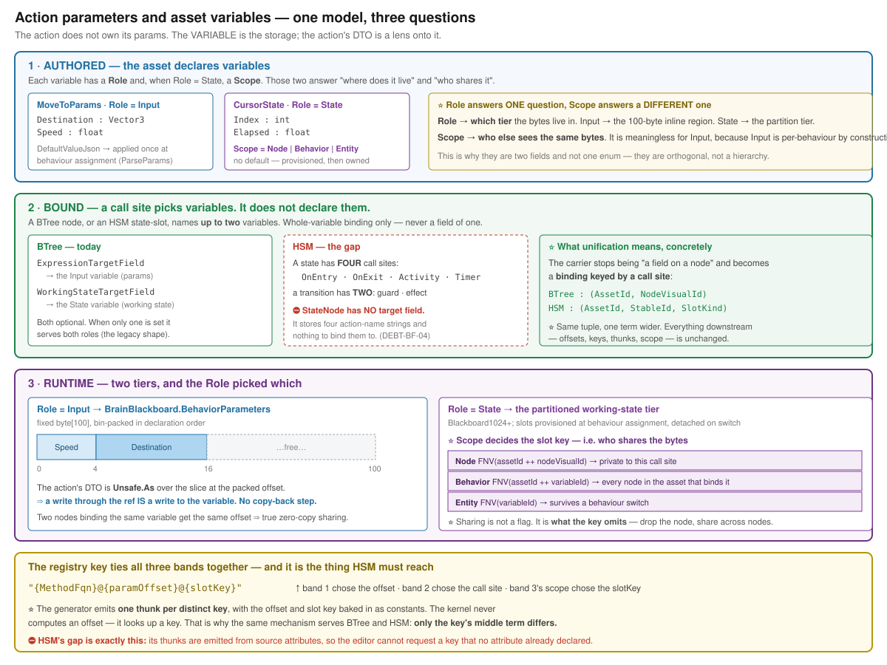

# How action parameters work — and what they have to do with asset variables

> **Written `2026-08-14`** by the cross-host design session. ⭐ **Explainer, not a design.**
> Every mechanism below is **as-built and code-verified**; the HSM sections say plainly which parts
> exist and which do not. Evidence: [`PriorArt_Cross_Host_Variable_Model.md`](PriorArt_Cross_Host_Variable_Model.md).

---

## 0. ⭐⭐ The one sentence

**An action does not own its parameters.** The **asset variable is the storage**; the action's
`Params` DTO is a **lens** onto a slice of it. *Binding* an action means **choosing which variable the
lens points at** — nothing is copied, ever.



---

## 1. What the asset declares

A variable carries a **`Role`** and, when `Role = State`, a **`Scope`**. ⭐ **They answer two
different questions** — which is why they are two fields and not one enum:

| | asks | answers |
|---|---|---|
| **`Role`** | *where do the bytes live?* | `Input` → the **100-byte inline region**. `State` → the **partitioned working-state tier** |
| **`Scope`** | *who else sees the same bytes?* | `Node` · `Behavior` · `Entity`. ⛔ **Meaningless for `Input`**, which is per-behaviour by construction |

```
MoveToParams   Role=Input                CursorState   Role=State  Scope=Node
  Destination : Vector3                    Index   : int
  Speed       : float                      Elapsed : float
```

⭐ **`Input` variables get a `DefaultValueJson`**, baked into a generated `ParseParamsDelegate` and
applied **once at behaviour assignment** (`BehaviorIngressSystem`). ⛔ **`State` variables have no
default** — their slot is *provisioned* at assignment and then owned by the action.

---

## 2. What a call site binds

⭐ **A call site names variables. It never declares them.** And it can name **two**:

| | |
|---|---|
| `ExpressionTargetField` | the **`Input`** variable — the action's params |
| `WorkingStateTargetField` | the **`State`** variable — the action's working state |

⚠ **Both optional.** When only one is set it serves both roles — the legacy shape, and the reason
`StatefulScopeVariable()` exists (`BTreeBridgeEmitCore.cs:279`): it prefers the explicit working-state
variable and falls back to the param field.

⭐⭐ **Binding is whole-variable, never per-field.** The architect rejected per-field binding because
the kernel projects params as **one `ref TValue` over a contiguous pre-packed slice**; scattering
fields would force a per-tick temp struct and a copy, which breaks zero-alloc.

---

## 3. How the bytes are reached

The editor's bin-packer lays the `Input` variables out in declaration order and hands each one a
**byte offset**. That offset is baked into a generated thunk:

```csharp
ref var dto = ref Unsafe.As<byte, MoveToParams>(
    ref Unsafe.AddByteOffset(ref bb.BehaviorParameters[0], (nint)4));   // 4 = the packer's offset
return MoveTo(ref dto, ref st, ref ctx);
```

⇒ ⭐⭐ **A write through that `ref` IS a write to the variable.** There is no copy-back step because
there was never a copy. **That is the whole of "write-back".**

⇒ ⭐ **Two call sites binding the same variable get the same offset**, so they share the bytes —
genuine zero-copy aliasing, and the reason concurrent *writers* need a validator rule.

---

## 4. ⭐ How `Scope` works — sharing is what the key OMITS

For `State` variables the slot is found by a **slot key**, and the scope decides what goes into the
hash (`BTreeBridgeEmitCore.ComputeStatefulSlotKey:222`):

| `Scope` | key | effect |
|---|---|---|
| **`Node`** | `FNV(assetId ++ nodeVisualId)` | private to this call site |
| **`Behavior`** | `FNV(assetId ++ variableId)` | ⭐ **node id dropped** ⇒ every node in the asset binding that variable shares one slot |
| **`Entity`** | `FNV(variableId)` | ⭐ **asset id dropped too** ⇒ survives a behaviour switch |

⭐⭐ **Sharing is not a flag — it is what the key leaves out.** Drop the node term, share across nodes.
Drop the asset term, share across behaviours. **That is the entire mechanism.**

---

## 5. The key that ties it together

```
"{MethodFqn}@{paramOffset}@{slotKey}"
      ↑            ↑            ↑
   which method   §3: which    §4: which working-state
                  variable      slot, per Scope
```

⭐ **The generator emits one thunk per distinct key**, offset and slot key baked in as constants.
⛔ **The kernel never computes an offset — it looks up a key.**

⚠ **And the key must be content-addressed**, because hot reload does `ClearAll()` → re-register from a
**new assembly** and **never re-flattens the ROM** (`AiHotReloadCoordinator:309`). Live entities still
hold ids hashed at flatten time. ⇒ **a dense/allocated id would renumber and silently mis-dispatch.**

---

## 6. Now — HSM

### 6.1 ✅ What already works

⭐⭐ **The mechanism is already there**, in `Fdp.Toolkits.Analyzers/HsmActionGenerator.cs`:

```csharp
CompoundKey = sym.Name + "@" + offset;               // :261
ushort id   = ComputeHash(entry.CompoundKey);        // :642  — FNV-1a → ushort
// thunk :703 (guard) / :741 (action):
var bridge = (HsmKernelBridge*)contextPtr;
var repo   = (EntityRepository)GCHandle.FromIntPtr(bridge->WorldHandle).Target!;
ref var bb = ref repo.GetComponentRW<BrainBlackboard>(bridge->Self);
ref var field = ref Unsafe.As<byte, TField>(
    ref Unsafe.AddByteOffset(ref bb.BehaviorParameters[0], (IntPtr)offset));
```

✅ Same projection as BTree. ✅ The guard fetches the blackboard from the entity through the bridge.
✅ `ComputeHash` is **char-identical** to `HsmFlattener.cs:385`, so the ids already agree.

### 6.2 ⛔ What is missing — and it is one thing, not four

| | |
|---|---|
| ⛔ **Nothing to bind to** | `StateNode` stores **four action-name strings** and **no target field** (`DEBT-BF-04`). There is no `ExpressionTargetField` on a state |
| ⛔ **Offsets come from source, not the asset** | `[SharedAiAction(typeof(Dto), "Field")]` fixes the offset at compile time. ⇒ ⭐⭐ **the editor cannot request a key that no attribute already declared** |
| 🔴 **The JSON bridge invents ids** | `HsmBridgeEmitCore.cs:119` registers no-op stubs at `100++`/`200++` while the flattener uses `ComputeHash(name)` ⇒ they never match, **and a stub can overwrite a real action** |

⇒ ⭐ **All three are the same gap**: BTree emits thunks by **walking the asset**
(`EmitManagedActionThunks`); HSM has no equivalent. **That is `HSM-016`.**

### 6.3 ⭐⭐ What "unified" actually means

**Almost nothing changes.** The call-site identity gains one term:

| | call site key |
|---|---|
| **BTree** | `(AssetId, NodeVisualId)` |
| **HSM** | `(AssetId, StableId, SlotKind)` — `SlotKind ∈ {OnEntry, OnExit, Activity, Timer, Guard, Effect}` |

Everything downstream is **untouched**:

| stays identical | why |
|---|---|
| `Role` → tier | a state-slot's params are `Input`; its working state is `State` |
| `Scope` → sharing | ⭐ `Behavior` scope already drops the node term — **it drops a state-slot term just as well** |
| offset → projection | same `AddByteOffset` |
| key → thunk | same `{MethodFqn}@{offset}@{slotKey}` |

⇒ ⭐⭐ **The HSM model is the BTree model with a wider call-site tuple.** It is not a parallel
invention, and the places it would differ are places where BTree simply never had to answer:

| HSM asks | BTree's answer | ⭐ resolution |
|---|---|---|
| *four slots per state — one binding or four?* | one action per node, so never asked | **four call sites ⇒ four bindings** |
| *state re-entered — does `Node` state reset?* | a BTree node has no "exit", so never observable | ⭐ **preserved.** The bytes already persist; re-entry is just the first place you can see it. `OnEntry` is where an author resets |
| *concurrent regions alias one variable* | parallel nodes, but not genuinely concurrent | **error on concurrent writers, allow concurrent readers** |
| *guards run speculatively — may they write?* | conditions are not speculative | ⛔ **no** — and today they can (`GetComponentRW`) |

---

## 6b. ⭐⭐ "How do I parametrize an asset from a scenario?" — the two worlds

> **The question:** *"I write JSON params into the blackboard component. But that is input to the whole
> asset instance. If a node/state calls an action needing its OWN params, where is the code that copies
> asset params into the action's params?"*
>
> ⭐⭐ **Short answer: that code does not exist, and it SHOULD not — but the code that should exist
> instead is NOT BUILT. You are not overcomplicating; you have hit a real, named gap.**

### ⭐ Why no copy step should exist

Per §1: **the action's params ARE an asset variable.** Same bytes, same address. ⇒ **binding a node to
a variable and then writing that variable IS filling the action's params.** There is nothing to
transfer. A copy step would be the bug, not the feature.

### 🔴 But there are TWO worlds, and only one of them can be parametrized today

| | **World A — curated behaviours** | **World B — editor-authored managed assets** |
|---|---|---|
| example | `MoveToLocation` · `FireAtTarget` · `PlatoonHillAttack` | a BTree/HSM asset with a managed blackboard |
| params region | ⭐ **ONE DTO at offset 0** | ⭐ **N variables bin-packed at 0, 4, 16 …** |
| who fills it | ⭐ **a HAND-WRITTEN resolver** — `CgfCuratedBehaviorRegistrar.cs:124` registers `CgfNodes.ResolveMoveToParams`, which deserializes the JSON and does `Unsafe.Write(ptr, p)` at **offset 0** | the **generated** `ParseParams` (`BTreeBridgeEmitCore.EmitParseParamsLocal:1195`) |
| runtime JSON honoured? | ✅ **yes** | ⛔⛔ **NO — the generated lambda IGNORES its `json` argument** and writes only baked `DefaultValueJson` |

**The generated code says so in as many words:**

```csharp
__parseParams = static (string json, byte* memory, EntityRepository world, Entity self) =>
{
    // NOTE: runtime per-assignment JSON override of individual managed variables
    // is not yet supported — only baked defaults are written. DEBT-AIB-021.
    { var __v = JsonSerializer.Deserialize<Threshold>("5", …); Unsafe.Write(memory + 0,  __v); }
    { var __v = JsonSerializer.Deserialize<Step>("7", …);      Unsafe.Write(memory + 4,  __v); }
};
```

⇒ ⭐⭐ **`DEBT-AIB-021` is exactly the missing piece you are looking for**, and the debt row already
sketches the fix: *"deserialize a wrapper JSON object keyed by variable name and dispatch to each
variable's deserializer."* ⭐ **That is ~30 lines in `EmitParseParamsLocal` — the offsets are already
in `packedFields`.**

### 📌 Why it was never noticed

⭐ **Every shipped scenario uses a World-A behaviour.** `scenarios/*/scenario.json` reference only
`MoveToLocation`, `FireAtTarget`, `PlatoonHillAttack` — all three hand-registered in
`CgfCuratedBehaviorRegistrar`. ⇒ **the managed-asset path has never been driven from a scenario**,
which is why the debt row could reasonably say *"the typical use-case for managed assets is authoring
fixed defaults, not per-assignment JSON."*

### 🔴 And HSM is a step worse

⛔ **`HsmBridgeEmitCore` emits NO `ParseParams` at all** — not even baked defaults.
⇒ **an HSM asset cannot be parametrized from a scenario by any route today.**

### What "instance override" means today

| level | mechanism | status |
|---|---|---|
| **asset default** | `DefaultValueJson` per variable | ✅ works (World B, baked) |
| **per-assignment override** | `behaviorParams` on the mission task → `AssignBehaviorEvent` → `ParseParams` | ⚠ **World A only** |
| **spawn-time exposure** | `IsExposedOnSpawn` on a blueprint variable | ⛔ **declared but never read at spawn** — editor-surface only |

### ⭐ What you would write, once `DEBT-AIB-021` is closed

```jsonc
// today (World A): one flat DTO, implicitly offset 0
"behaviorParams": "{\"speed\":5,\"arrivalRadius\":5}"

// after the fix (World B): keyed BY VARIABLE NAME — each dispatched to its packed offset
"behaviorParams": "{\"PatrolParams\":{\"Speed\":5},\"EngageParams\":{\"Range\":100}}"
```

⇒ ⭐⭐ **and that is the whole answer to "how do asset instance params drive a node/state":** you do
not route params *to a node*. **You write a variable, and the node that bound it sees the write** —
because they are the same bytes.

---

## 7. 📌 The one thing to keep in mind

⭐⭐ **"Parameters", "working state" and "asset variables" are not three things. They are one thing
seen through `Role` and `Scope`:**

```
asset variable ──Role──► which tier      ──Scope──► who shares it
                          │                          │
                  Input → inline 100 B         Node / Behavior / Entity
                  State → partition slot       (State only)
```

**An "action parameter" is just an `Input`-role variable that some call site pointed its DTO at.**
⇒ ⭐ **It has no separate existence, no separate storage, and no separate lifetime.** That is why the
same model can serve a BTree node, an HSM state-slot and a blueprint graph without becoming three
models — and why the HSM work is *reaching* the model rather than *extending* it.

---

## Change log

| Date | Change |
|---|---|
| 2026-08-14 | Written in answer to *"explain how action params work for HSMs and how they relate to asset variables"*. |
