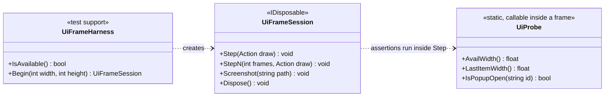
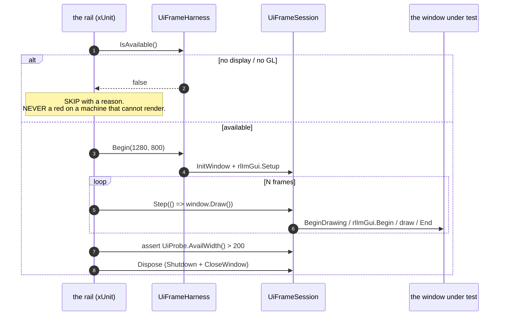

<!--STATUS
state: LIVE
build-state: READY-TO-BUILD
updated: 2026-08-20
current-answer: this whole file — the Batch 100 dispatch.
stale-below: nothing.
known-rot: none.
known-conflict: R-21 / R-62 ("no headless rail can drive ImGui") are SUPERSEDED by R-124
  for this machine. Item 100a is the proof turned into infrastructure. Every earlier batch
  report's "the draw is unrailed by construction" was correct when written.
-->
# HANDOFF — Batch 100: **the FRAME RAIL, and the five defects it can finally see**

> 📌 **Dispatched at `f4ec0209c`.** ⭐ Branch from this commit *(rule 7)*.
> ⛔⛔ **YOUR SCOPE IS FROZEN AT THIS SHA.** Documents that change after it are **FYI only**.
> ⭐ **Rule 3: allocate your own ids.** ⭐ **Rule 1b: push `chore: started batch 100 at f4ec0209c` FIRST.**
> ⭐⭐ **`R-106`: a blocked item stops THAT ITEM, never the batch. Four verdicts, one per item.**

> ## ⛔⛔⛔ READ THIS FIRST — **the method changed, not just the tasks**
> ⭐⭐ **Five batches shipped `3852 / 0` green while the feature was dead.** ⛔ Not carelessness: **every
> defect lived in the one region no rail could reach.** 📄 [`FINDINGS_VisualCheck_PostBatch99.md`](FINDINGS_VisualCheck_PostBatch99.md) §6.
> ⭐⭐⭐ **`R-124`: that premise is FALSE here — and it is PROVEN, not argued.**
> 📄 [`tools/ui-probe/README.md`](../../tools/ui-probe/README.md): the coordinator **reproduced the live
> Batch-99 defect and verified its fix** — `GetContentRegionAvail().X` **60.0 px → 305.0 px**, with
> screenshots, under `xvfb-run`, in ten minutes.
> ⇒ ⛔⛔ **`100a` COMES FIRST AND EVERYTHING ELSE IS VERIFIED THROUGH IT.** ⭐ **No fix in this batch is
> "done" on a headless assertion alone.**

## ⭐⭐⭐ THE BATCH'S DEFINITION OF DONE — **the user's own sentence, end to end**

> ⭐ Open `Count4` → click `Count` in the outline → the Details **Variables** view shows the **live**
> value → right-click → **"Edit value…"** opens a dialog **showing the number** → type → **OK** →
> the value changes → **`[x]` closes it** → right-click → **"Properties…"** **opens a visible form** →
> right-click → **"Watch this variable"** → the Watch row shows **the same live value as Details**,
> and its menu offers **no "Properties…"**.

⛔ **A green gate table that does not deliver that sentence is not a pass.** ⭐ `100a` exists so you can
tell the difference **before** it reaches the user.

---

## 1. ⭐⭐⭐ `100a` — **THE FRAME RAIL** *(design basis: `R-124`; do this FIRST)*

### ⭐ What it is

A **test-support library** that renders **real ImGui frames** under Xvfb so a rail can assert **inside**
one. ⛔ **Not a screenshot-diff harness** — 📌 `R-124`: **the strongest form needs no image comparison.**





### ⛔⛔ Non-negotiables

| ⭐ | |
|---|---|
| ⭐⭐⭐ **It must SKIP, never fail, where it cannot render** | ⛔ a dev box or CI leg without a display must not go red. ⭐ `IsAvailable()` first; **a skip prints WHY**. ⚠ **A skip that hides a real failure is worse than no rail** ⇒ ⭐ **report both counts** *(ran / skipped)* in the gate table |
| ⭐⭐ **One window per PROCESS, torn down cleanly** | ⚠ Raylib is not re-entrant — ⛔ two concurrent sessions will crash. ⭐ Serialise *(xUnit collection)*, and say so |
| ⭐ **A handful of frames, not a loop** | ⚠ software GL is slow; ⭐ 3–6 frames is enough for ImGui to settle a popup |
| ⛔ **Test-support only** | ⛔ **nothing in a production assembly may reference it** |
| ⚠ **Where it lives is YOUR call** | ⭐ it must be reachable from **`Hrot.Editor.AiShared.Tests` AND `Hrot.Blueprints.Tests`** — ⛔ do not copy it into both *(ruling 9)* |

### ⭐⭐⭐ Its acceptance — **it must REPRODUCE the defect**

⛔ **A rail that only goes green is not evidence.** ⭐ Build `100a` so that, **against the code as it is at
`f4ec0209c`**, it **FAILS** on the width — and passes after `100b`. ⭐ **State the two measured numbers in
your report** *(the coordinator measured 60.0 → 305.0 in an isolated probe; ⚠ **the real modal may differ
— report what YOU measure, do not copy my numbers**)*.

📄 **The template is `tools/ui-probe/Program.cs`** — ⭐ working, and it builds against the same
`Raylib-cs 7.0.2` / `rlImgui-cs 3.2.0` the app uses.

---

## 2. 🛠 `100b` — **the edit dialog shows the NUMBER** *(the §1 defect)*

📐 **Root cause, measured — ⛔ it is NOT a StructEdit bug.** The modal's table setup is **byte-identical**
to the working reference *(`ComponentEditWindow:144`–`:149`)*: same flags, same
`TableSetupColumn("Property", WidthFixed, 180f)` / `("Value", WidthStretch)`.
⭐⭐ **The difference is the CONTAINER**: `BeginPopupModal(..., AlwaysAutoResize)` with **no**
`SetNextWindowSize`. ⇒ a `WidthStretch` column inside an auto-resizing popup is **circular**;
`ComponentEditDrawer:253` clamps to **60 px**; `InputInt` *(`:396`)* draws a field **plus `−`/`+` step
buttons** sized as one group ⇒ ⛔ **the number has nowhere left to draw.**

| ⭐ | |
|---|---|
| **fix** | give the popup an explicit width — ⭐ `SetNextWindowSize(new Vector2(w, 0), ImGuiCond.Appearing)` is what the probe verified. ⚠ **Both modals**: `VariableEditModal:270` and `VariablePropertiesModal:169` |
| ⛔ **do NOT touch** | `ComponentEditDrawer` — ⭐ **five other production callers, all working** |
| **rail** | ⭐⭐ `100a`: **`AvailWidth()` in the value column exceeds a sane floor**, in a real frame |

---

## 3. 🛠 `100c` — **`[x]` closes the dialog** *(the §2 defect)*

📐 `VariableEditModal.Draw`:
```csharp
if (!IsOpen) { _open = false; return; }
if (!_open) { ImGui.OpenPopup(PopupId); _open = true; }   // ⛔ REOPENS what [x] just closed
```
⭐ ImGui clears `_open` on `[x]`; ⛔ **`IsOpen` is `_binder.ActiveSession != null`, which `[x]` never
touches** ⇒ the next frame reopens it.
⚠ **`VariablePropertiesModal:168` is worse** — `bool open = true;` is a **local**, passed by `ref`, and
**never read again**.

⭐ **Fix:** `[x]` must do what **Cancel** does — ⛔ end the session, not flip a flag.
⭐ **Rail:** `100a` — after a frame in which `[x]` is signalled, **`IsPopupOpen` is false on the NEXT
frame too.** ⛔ Not just the same frame.

---

## 4. 🛠 `100d` — **the Properties form is actually DRAWN** *(the §3 defect)*

📐 `BlueprintDetailsWindow`: `:50` declares · `:125` constructs · `:66` **opens** · `:53` exposes ·
⛔⛔ **and no line calls `Draw()`.** The only `.Draw()` in the file is `:291 session.Draw()`.

⛔⛔⛔ **THIS IS THE THIRD OCCURRENCE OF `BP-327`** *(Batch 87 "the modal draws"; Batch 89 "`Draw` had no
caller")*. ⚠ **Batch 99's rails asserted `IsOpen` and the commit path — both true, both useless.**

| ⭐ | |
|---|---|
| **fix** | draw it from the window's `DrawClientArea` |
| ⭐⭐⭐ **and the CLASS, not just the instance** | ⭐ a rail that, **for every registered window**, asserts **every modal it owns is reachable from its draw**. ⚠ **If a general form is not tractable in this batch, ship the specific rail and REPORT why** *(`R-106`)* — ⛔ do not fake a general one |
| **rail** | `100a`: raise the gesture, render, **`IsPopupOpen(properties)` is true** |

---

## 5. 🛠 `100e` — **the Watch shows the LIVE value** *(the §4 defect — 9th silent default)*

📐 **The row is NOT the problem.** `SectionVariableRowSource:81` and `BlackboardSectionRowSource:106`
both pass `AssetTick: () => BehaviorFrame.Current`, and `PinnedVariableRowSource.Pin` stores the row
**object unchanged** ⇒ ⭐⭐ **the pinned row is a live camera.**

⛔⛔ **`AiWatchWindow:68`–`:69` builds its `VariableTableModel` and is NEVER given a run-state source.**
Every `SetRunStateSource` call site is a **details** host *(`PerspectiveWorkspaceRegistrar:718`, `:325`,
`BlueprintDetailsWindow:163`, `AiDetailsWindow:104`, `AiVariablesWindow:105`)*.
⇒ the Watch sits at **`Planning`** ⇒ `VariableValue.ModeFor(Planning)` picks the **INITIAL** arm
*(`Q32` ruling 3)* ⇒ ⛔ it renders `DefaultValueJson` = **0**, for ever.

📌 **`CLAUDE.md` verbatim: *"a production caller that HAS a dependency must PASS it."*** ⭐ The registrar
**holds `_runState`, hands it to the details host at `:718`, and holds the `Watch` — and does not.**

| ⭐ | |
|---|---|
| **fix** | the registrar installs the run-state source on the Watch, **in the pass that already reaches it** *(`R-67` — ⛔ nothing new for `EditorSubsystem` to forget)* |
| ⭐⭐⭐ **and the CLASS — this is the 9th instance** | ⭐ **a GENERIC composition-root rail**: for **every window the registrar registers**, assert **on the CONSTRUCTED object** that every dependency the registrar **HOLDS** and the window **CAN ACCEPT** was passed. ⚠ **Enumerate the claim chain** *(`RegisterExtraWindow:600`–`:685`)*, ⛔ do not hand-list windows |
| ⚠ **a caveat worth stating** | ⛔ **it must not flag a deliberate null** *(`writeLive` on BTree/HSM is deliberately absent — `BP-364`)*. ⭐ **The rule is *"the caller HELD it and did not pass it"***, not *"the argument is null"* |

---

## 6. 🛠 `100f` — **"Properties…" leaves the Watch menu** *(the §5 defect)*

📐 `RegisterExtraWindow:635` — `if (window is IVariableTableHost tableHost) AttachEditGestures(tableHost);`
⇒ **every** table host gets **every** gesture.
📌 **User:** *"no one is interested in the other properties than the value in the Watch window."*

⭐ **Fix:** the **gesture set becomes something a host DECLARES** — ⭐⭐ **the precedent already exists**:
`VariableTableColumns.Watch` is exactly this shape for columns. ⛔ Not an `if (host is AiWatchWindow)`.

---

## 7. ⛔ WHAT MUST NOT BE BUILT

| ⛔ | why |
|---|---|
| **a golden-image / screenshot-diff suite** | 📌 `R-124`: ⭐ **measure inside the frame**; goldens drift with fonts and drivers |
| **input simulation** | ⭐ every defect here is **state → draw**; ⛔ do not let this block `100a` |
| **changes to `ComponentEditDrawer`** | ⭐ five working callers |
| **a second editability matrix · Properties as StructEdit · a per-field read-only flag** | `R-109` |
| **an `Instance`-blueprint live write · a BTree/HSM live writer** | `BP-364` · `Q32` §2.1 |
| ⛔⛔ **anything from `DESIGN_Details_Panel_View_Switching.md`** | ⭐ `R-27` gates it on the visual check, ⚠ **which this batch exists to make passable** |
| **reverting anything from Batches 94–99** | ⭐ all of it holds |

---

## 8. ⭐ GATES

⭐ **Baseline** = Batch 99's table, base sha **`f4ec0209c`**: AiShared **1706** · BTree.Editor **622** ·
Hsm.Editor **554** · Blueprints **3852 / 0 / 10 skip** · Hrot.Editor **201** · Breakpoints **143** ·
Generators **277** · Persistence **143** · NodeEditor.Core **211** · NodeEditor.UI **135** · Fhsm **300** ·
StructEdit **191 / 1** *(⚠ `BP-363`, pre-existing)* · Fdp.Presentation **146 filtered** ·
tracker **open 77 / done 230** · rulings **92/92**.

⭐ **Keep Batch 99's table shape** — the `--no-build` column, `EXIT=` unfiltered, the diff-shape golden
row, every RED confirmed pre-existing against the base sha, a clean tree after every suite run, both
quarantine counts, and the ids you allocated.

### ⭐⭐ THREE EXTRA ROWS this batch — **`100a` changes the report**

| # | report |
|---|---|
| **1** | ⭐⭐⭐ **frame-rail counts: RAN / SKIPPED**, and ⛔ **the reason for every skip.** ⚠ *"All skipped"* is a **FINDING**, not a pass |
| **2** | ⭐⭐ **the measured numbers** — the value column's available width **before** `100b` and **after**. ⛔ Do not copy the coordinator's 60.0/305.0; ⭐ **report yours** |
| **3** | ⭐ **one screenshot of the fixed Edit dialog**, committed under `docs/blueprints/img/` — ⛔ **not as a gate**, ⭐ as evidence the user can look at on a phone |

⛔⛔ **`Fdp.Toolkits.Tests` needs no coordinator run** — `DEBT-AIB-030`, the identity rotates.

---

## 9. ⭐⭐ WHY THIS BATCH IS SHAPED THIS WAY — **so you can push back if it is wrong**

⭐ The last five batches each fixed **one layer** of one dialog and each came back green.
⇒ ⛔ **this batch is not another layer** — ⭐ it is **the instrument that makes the layer visible**, plus
the five defects it can now see, ⭐⭐ **with the acceptance stated as one user sentence rather than six
independent items.**

⚠ **If `100a` proves harder than it looks** *(Raylib re-entrancy, a CI leg with no GL, a font atlas that
will not init)* — ⭐⭐ **say so early and do `100b`–`100f` with headless rails plus the manual numbers.**
⛔ **What must NOT happen is `100a` quietly becoming a rail that always skips.**
