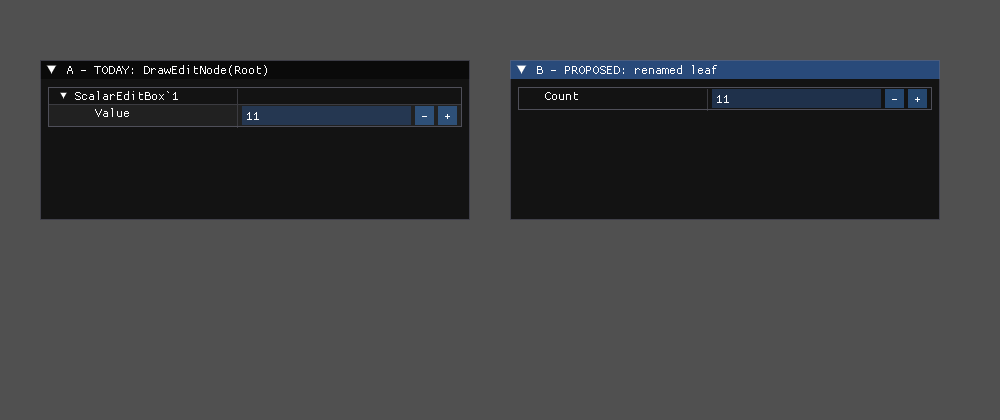

<!--STATUS
state: LIVE
build-state: READY-TO-BUILD
updated: 2026-08-20
current-answer: this whole file — the Batch 101 dispatch.
stale-below: nothing.
known-rot: none.
known-conflict: none.
-->
# HANDOFF — Batch 101: **the scalar row, and the suite nobody runs**

> 📌 **Dispatched at `6106f7047`.** ⭐ Branch from this commit *(rule 7)*.
> ⛔⛔ **YOUR SCOPE IS FROZEN AT THIS SHA.** ⭐ **Rule 3: allocate your own ids.**
> ⭐ **Rule 1b: push `chore: started batch 101 at 6106f7047` FIRST.**
> ⭐⭐ **`R-106`: a blocked item stops THAT ITEM, never the batch. Four verdicts per item.**

> ## ⭐⭐⭐ BATCH 100 WAS EXCELLENT — **and nothing here corrects it**
> ⭐ Six items, no blocks, the frame rail **failed before the fix** as its acceptance, and it **caught two
> mistakes in its own author** *(a close signal that did nothing; a window render that crashed the host)*.
> ⭐⭐ `100f` found by **enumeration** that there are **TWO** watch surfaces — ⛔ a type test would have
> shipped with one still wrong.
> ⚠ **`101a` closes a GAP, not a defect of yours:** the width rail's fixture is a **struct**, so the
> **scalar** path — the one the user actually hits — was never exercised.

---

## 1. ✅✅ `101a` — **DONE BY THE COORDINATOR. ⛔ DO NOT BUILD IT.**

> ⛔⛔ **WITHDRAWN FROM THIS BATCH** *(user, `2026-08-20`: "if it is 5 line fix then do it yourself
> please, not worth delegating")*. ⭐ **Landed on the coordinator branch before you started** — the
> ancestry check said the dispatch sha was not on your branch, and the user directed it.
>
> ⭐ **What landed:** `ScalarEditBox.IsWrapper` · `VariableEditModal.ScalarRowOrRoot` · 8 rails in
> `Hrot.Editor.AiShared.Tests/Variables/Frame/AScalarEditsAsOneNamedRowTests.cs` *(7 pure + 1 frame)* ·
> a `Xunit.SkippableFact` package reference on `AiShared.Tests` · ⚠ **and one ARGUED rail change**:
> `EveryDrawerCallSiteOpensItsTableTests` now excludes `tools/`, because a probe that ships a
> screenshot is evidence, not a production call site.
>
> ⭐ **Revert probe run:** inverting the wrapper guard reddens **2 of 8**.
> ⭐⭐ **`101b` and `101c` are UNCHANGED and are the whole batch now** — 📌 `R-106`.

<details><summary>the original item, kept for the record</summary>

### ⭐⭐⭐ `101a` — a scalar edits as one row, labelled with its own name

> ⭐⭐ **User, `2026-08-20`:** *"so what to do about the scalar editing. it starts to be tiring."*

### 📐 The coordinator MEASURED it, rendered it, and verified the fix — ⛔ do not re-derive

```
DefaultValueAuthoring.OpenSession(svc, new BlackboardVariableEntry("Count", typeof(int), …))
  ⇒ root='ScalarEditBox`1'  childCount=1  leaf='Value'  leafType=Int32
```



⭐ **Left = today** *(a collapsible `ScalarEditBox\`1` whose single child reads `Value`)*.
⭐ **Right = the fix** *(one row, `Count`, `11`)* — ⭐⭐ **rendered from the REAL session, and `Commit()`
still returned `11`.**

### ⭐⭐⭐ THE FIX — **five lines, and it touches NOTHING shared**

📐 **Two facts make it small:** `EditNode` has a **public constructor taking `name`**
*(`StructEdit.Core/EditNode.cs:20`)*, and `ComponentEditDrawer.DrawEditNode` is **public and takes any
node** *(`:52` — "renders node and all of its descendants")*.

```csharp
// in VariableEditModal, where it draws the document
var root = session.Document.Root;
if (/* this is a ScalarEditBox<T> session */ root.Children.Count == 1 && IsScalarWrapper(root.ClrType))
{
    var leaf = root.Children[0];
    drawer.DrawEditNode(new EditNode(leaf.Id, /* the VARIABLE's name */ row.ShortName,
                                     leaf.JsonPath, leaf.Kind, leaf.ClrType, leaf.Binding,
                                     leaf.Children, leaf.Metadata, leaf.IsReadOnly));
}
else drawer.DrawEditNode(root);
```

| ⛔ what does NOT change | |
|---|---|
| **`StructEdit.Core`** | ⛔ untouched — ⚠ and `BP-363` is already open there |
| **`ComponentEditDrawer`** | ⛔ untouched — ⭐ five other working callers |
| **the wrapper, `Commit`, `Unwrap`, the live-bytes arm** | ⭐ **the SAME binding object is reused**, so every commit path is unchanged — 📌 verified: the probe committed `11` |

⚠ **`ScalarEditBox` needs a public "is this my wrapper?" test** — ⭐ it already owns `EditTypeFor`/`Wrap`/
`Unwrap`, so this belongs beside them; ⛔ **not an `IsGenericType` check written at the call site.**

### ⭐⭐ And the RAIL — **on the SCALAR path, which had none**

| ⭐ | |
|---|---|
| **①** | ⭐⭐⭐ **a frame rail over a REAL `int` variable** *(⛔ not a struct — that is the whole gap)*: **exactly one row**, its label is **the variable's name**, and the value is **visible** |
| **②** | ⭐ **the commit still round-trips** — type in the frame, `Commit()`, and the scalar comes back **unwrapped**. ⚠ **This is the one that would catch a regression in `97a`'s unwrap** |
| **③** | ⭐ **the struct path still draws its tree** — ⛔ the fix must not flatten a real struct |

</details>

---

## 2. ⭐⭐⭐ `101b` — **GATE `Hrot.ClusterRunner.Integration.Tests`** *(design basis: `DESIGN_Smoke_Suite.md` `S1`; `M-35`)*

📐 **Coordinator-measured `2026-08-20`:** **57 files · 174 tests · 6 skipped · builds clean in 77 s** —
⛔⛔ **and it appears in NO batch gate table**, while ~8 000 unit tests run every batch.

⭐ **Add it to the gate table** with its pass/fail/skip counts, like every other suite.
⚠⚠ **EXPECT IT RED — that is the point, and it is not your regression.** ⛔ **Do not fix it here.**

---

## 3. ⚠⚠ `101c` — **TRIAGE the reds, and DO NOT ADJUST THE EXPECTATIONS** *(`S2`)*

📐 A sampled filter gives **3 pass / 9 FAIL / 3 skip**, and the counter tests are wrong by **exactly
one, every time**: `1→0`, `3→2`, `10→9` *(`BlueprintKernelRunTests:61`)*.

⭐ **These tests say: *"attach a counting blueprint, pump N frames, the counter is N."*** ⛔ **It is N−1.**

| ⭐ what is wanted | |
|---|---|
| ⭐⭐⭐ **THE DIRECTION** | is the **counter** wrong, or the **expectation**? ⚠ Both files were last touched ~40 batches ago *(`877fc7c74` / `0ee3bb6c9`)* while the runtime moved ⇒ ⛔ **a drifted expectation and a real regression look identical from here** |
| ⭐ **how** | ⭐ a bisect, **or** read the splice order — 📌 `EditorHarness:226` already documents a **one-tick dispatch delay**, which is a candidate and ⛔ **not a conclusion** |
| ⛔ **what must NOT happen** | ⭐⭐ **changing `Expected: 10` to `9`.** ⚠ If it turns out the expectation is right and the sim is wrong, that edit **hides a live regression for ever** |
| ⭐ **an acceptable outcome** | *"measured, it is X, here is the evidence"* — ⭐ **or** *"could not establish the direction in this batch, here is what I ruled out"* *(`R-106`)*. ⛔ **A silent green is not** |

---

## 4. ⛔ WHAT MUST NOT BE BUILT

| ⛔ | why |
|---|---|
| **changes to `StructEdit.Core` or `ComponentEditDrawer`** | ⭐ `101a` needs neither — 📌 measured |
| **removing `ScalarEditBox<T>`** | ⭐ `97a` built it for a real reason: `CreateLeafBinding` needs a MEMBER |
| **"fixing" the integration suite's reds** | `101c` — ⛔ **triage, do not repair** |
| **the panel layer for the smoke suite** *(`S3`)* · **T3 smoke** *(`S5`)* | ⭐ next batch; ⛔ this one stays small |
| **anything from `DESIGN_Details_Panel_View_Switching.md`** | `R-27` |
| **reverting anything from Batches 94–100** | ⭐ all of it holds |

---

## 5. ⭐ GATES

⭐ **Baseline** = Batch 100's table: AiShared **1706** · Blueprints **3870 / 0 / 10 skip** *(⚠ **under
Xvfb** — see below)* · BTree.Editor **622** · Hsm.Editor **554** · Hrot.Editor **201** ·
Breakpoints **143** · Generators **277** · Persistence **143** · NodeEditor.Core **211** ·
NodeEditor.UI **135** · Fhsm **300** · StructEdit **191 / 1** *(`BP-363`)* · Fdp.Presentation **146
filtered** · tracker **open 77 / done 235** · rulings **92/92**.

| ⭐ extra rows this batch | |
|---|---|
| ⭐⭐ **frame-rail RAN / SKIPPED**, with reasons | ⚠ **now including the new scalar rails** |
| ⭐⭐⭐ **`Hrot.ClusterRunner.Integration.Tests`** | ⭐ **its first appearance in a gate table** — pass / fail / skip, and **name the failing tests** |
| ⭐ **a screenshot of the scalar row** | ⛔ evidence, not a gate |

> ⚠⚠ **A PORTABILITY NOTE, so a future report's numbers are not confusing.** ⭐ **Blueprints is 3870 WITH
> a display; without one the frame rails SKIP** and it reads **3862 / 0 / 18**. ⇒ ⭐ **state which
> environment produced the number**, every time. ⛔ Neither figure is wrong; a silent switch between them
> would look like a regression.
