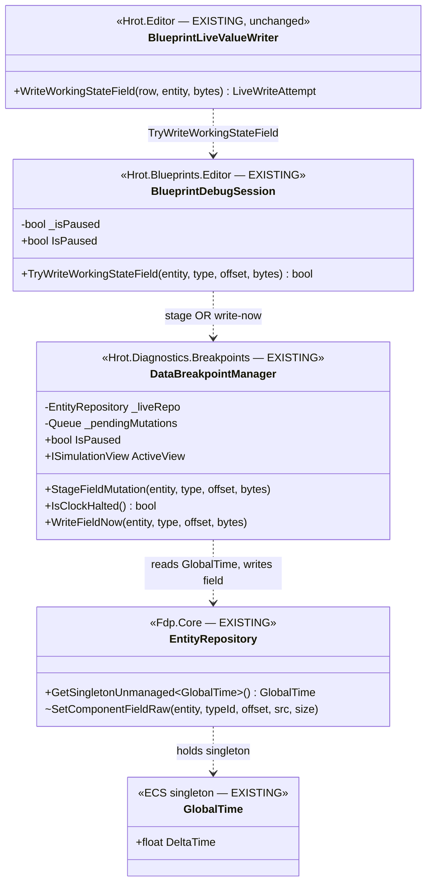
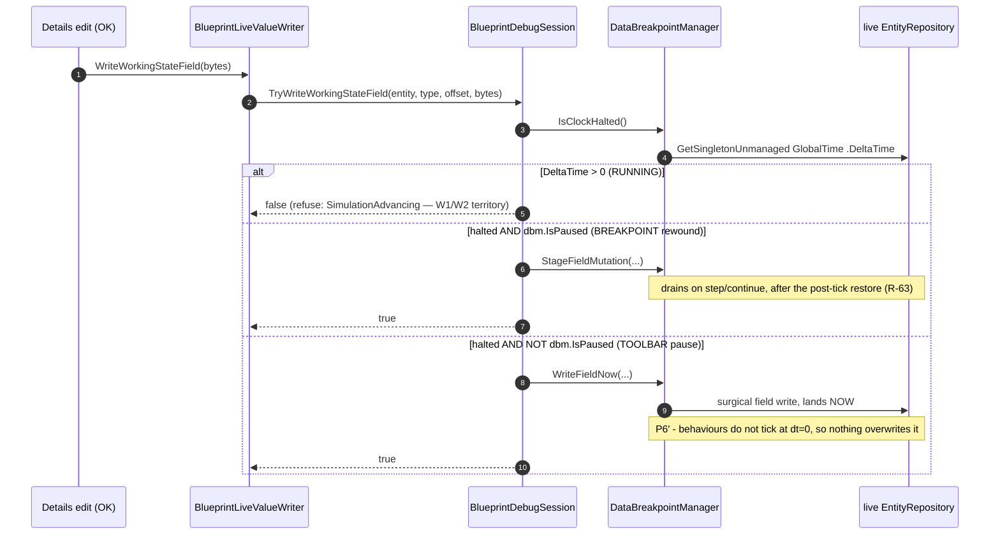

<!--STATUS
state: LIVE
build-state: READY-TO-BUILD
updated: 2026-08-21
current-answer: this whole file — the MIN dispatch for the UI/variable lane.
stale-below: nothing.
known-rot: none.
known-conflict: none. MIN is a STRICT SUBSET of R-126's target (it does NOT build the
  running-stage-drain; that is W1/W2). It touches NO time-lane file — see §6.
design-basis: Architect_Question_48 (R-126, "one source of paused; the tick loop drains"),
  DESIGN_Time_Architecture.md §1b/§5/§6/§7 (AS-3, AS-5, P4, P6′, AS-1b),
  PLAN_Time_System_Refactor.md §1b (the MIN recommendation, user-approved 2026-08-21).
-->
# HANDOFF — `MIN`: **make the toolbar-pause write LAND**

> 📌 **Dispatched at `52e12fb5b`.** ⭐ Branch from it *(rule 7)*. ⛔ **Scope FROZEN at this sha** — a
> document that changes after it is FYI only; if a later doc invalidates an item, **STOP and REPORT**,
> do not adapt *(SCOPE-IS-FROZEN rule)*.
> ⭐ **Lane: UI / variable** *(`claude/hrot-implementation-j1jvin`)*. ⭐ **ids `BP-`**, tracker areas
> `A`–`G`. ⛔ **NOT `TM-`, NOT `Area H`** — that is the time lane's partition.
> ⭐ **Rule 1b: push `chore: started MIN at 52e12fb5b` FIRST**, before any code.
> ⭐ **Rule 3: you allocate the ids.** Any `BP-###` below is a placeholder.

---

## 0. ⭐⭐⭐ WHY THIS EXISTS — **the one-sentence bug, and what already landed**

> 🔒 **User, `2026-08-21`:** *"time is paused OR debugger hit a breakpoint — in both cases the
> simulation is stopped and we can write new values."* ⇒ ⭐ **`R-126`**: one source of "paused" is the
> clock; running is not a refusal, it is a reason to stage.

📌 **The live failure:** *edit a working-state variable while paused from the toolbar → the value does
not change.*

📐 **Measured chain** *(DESIGN_Time_Architecture.md §1b)*:

| step | state | verdict |
|---|---|---|
| run state | `Paused` | ✅ correct |
| the `isFrozen` gate on the edit control | `ClockIsHalted()` | ✅ **already fixed** *(`f0b1e141b`, on your base)* — the control is enabled, OK is clickable |
| `writeLive` runs → `BlueprintLiveValueWriter.WriteWorkingStateField` | reaches the session | ✅ |
| ⛔ `BlueprintDebugSession.TryWriteWorkingStateField` | `if (!_isPaused) return false;` | 🔴 **`AS-3` — refuses.** `_isPaused` is a session-local flag; a **toolbar** pause never sets it |
| ⛔ and even if it staged | `StageFieldMutation` → `_pendingMutations` | 🔴 **`AS-5` — nothing drains it** under a toolbar pause; the drain runs only on breakpoint step/continue |

⭐ **The diagnostic half is DONE and on your base** *(honest refusal messages `ac7860dd8`/`34048498d`,
the clock-halted `isFrozen` gate `f0b1e141b`)*. ⛔ **`MIN` is the WRITE-LANDING half — the two lines that
refuse, and the arm that lets the write land.**

---

## 1. ⭐⭐ INVENTORY — *(`R-74`: the queries I ran, so the diagram below is truthful)*

| # | query | total | what it settled |
|---|---|---|---|
| I1 | `search_graph(name_pattern=".*SetComponentFieldRaw.*", label="Method")` | **5** | ⭐⭐ a **direct, immediate, byte-surgical** field writer already exists: `EntityRepository.SetComponentFieldRaw` *(`FDP/Engine/Fdp.Core/EntityRepository.cs:1720`)* — **`internal`, zero direct callers** |
| I2 | read `DataBreakpointManager.StageFieldMutation` / `DrainPendingMutations` | — | the drain reuses `IEntityCommandBuffer.SetComponentFieldRaw` *(Ruling 14, R-65-safe)* but is **deferred to the tick boundary** and **only called on resume** |
| I3 | read `DataBreakpointManager.ActiveView` `:123` | — | `_isPaused ? _preTickSnapshot : _liveRepo` ⇒ **under a toolbar pause `dbm.IsPaused` is `false`, so `ActiveView == _liveRepo`** — a direct write to `_liveRepo` IS what the UI reads back |

⇒ ⭐⭐⭐ **`MIN` wires an existing surgical writer; it does not write one.** The only question is *which*
existing immediate path lands it — §3's probe.

---

## 2. ⭐⭐⭐ THE UML — *(NO-UML-NO-BUILD rule; existing classes drawn with their files, `MIN`'s additions marked)*

⭐ **`IsClockHalted()` and `WriteFieldNow(...)` are the only NEW members.** ⛔ **No new class, no new
phase, no drain system, no kernel change.**

---

## 3. ⛔⛔⛔ `MIN` — **the change, and the ONE probe that decides its mechanism**

### 3a. The gate replacement *(`BlueprintDebugSession.TryWriteWorkingStateField`, `:920`)*

⛔ **Replace** `if (!_isPaused) return false;` **with a three-way on the CLOCK, not the session flag:**

| the clock says | `MIN` does | why |
|---|---|---|
| **advancing** *(`DeltaTime > 0`)* | ⛔ **refuse** → `false` | RUNNING is `W1`/`W2`'s job — a direct write is overwritten by the next tick |
| **halted AND `dbm.IsPaused`** *(breakpoint rewound)* | ⭐ **stage** *(today's `StageFieldMutation`)* | ⭐⭐ **`R-63`: the ECB path is REQUIRED here** — `RequestStep`/`Continue` restore `_liveRepo ← post-tick` and THEN drain; a direct write would be lost on that restore |
| **halted AND NOT `dbm.IsPaused`** *(toolbar pause)* | ⭐⭐⭐ **write NOW** *(the new `WriteFieldNow`)* | ⭐ `ActiveView == _liveRepo`, and `P6′`/`P4`: nothing recomputes or races at `dt=0`, so it sticks and shows immediately |

⭐ **`IsClockHalted()` reads `_liveRepo.GetSingletonUnmanaged<GlobalTime>().DeltaTime <= 0f`** — ⚠⚠
**`AS-1b`: read the LIVE WORLD's singleton, NEVER `GetCurrentState()`/the controller** *(which hard-codes
the delta to 0 and answers "halted" forever)*. 📌 The `Fdp.Toolkits.Tests` rail
`ThePauseFlagOnTheClockIsFalseWhilePausedTests` already pins this behaviour — do not regress it.

### 3b. ⚠⚠ THE ONE OPEN PROBE — **which immediate path does `WriteFieldNow` use? MEASURE, do not guess**

📌 The drain writes through the **ECB**, which is **applied at the tick boundary** — so the question is
whether a paused kernel *(dt=0)* still flushes it.

| candidate | mechanism | ⭐ the probe |
|---|---|---|
| **A — rely on the paused kernel** | stage into a scratch `EntityCommandBuffer` and let the next paused frame flush it *(or `ecb.Playback(_liveRepo)` now)* | ⭐ **does the kernel flush the command buffer while `dt=0`?** If yes, near-zero new code |
| **B — do not rely on the kernel** | apply straight to `_liveRepo` via the existing `EntityRepository.SetComponentFieldRaw` | ⚠ it is `internal` to `Fdp.Core` — needs `InternalsVisibleTo` **or** a thin public surgical-write on `ISimulationView`. ⛔ **Do NOT copy the write body** *(R-65: one surgical writer, not two)* |

⭐⭐ **Report which one you chose and why — that IS a deliverable of this item**, exactly as `104a` reports
its root cause. ⭐ **Prefer B if A cannot be shown to flush at `dt=0`** — B is unconditional; A depends on
a kernel behaviour that, if it changes, silently breaks the edit.

### 3c. The refusal message can now tell the truth

⭐ After `MIN`, `TryWriteWorkingStateField` returns `false` **only when the clock is advancing**. ⇒ the
`LiveWriteRefusal.NotFrozen` arm *(now genuinely "the sim is running")* may take an accurate,
actionable sentence again — e.g. rename to `SimulationAdvancing`: *"The simulation is running — pause it
(toolbar or a breakpoint) to edit a live value."* ⚠ **This reverses `ac7860dd8`'s deliberately-vague
wording, which was vague ONLY because the gate was `_isPaused`.** ⭐ Now the gate is honest, so the
sentence can be too.

---

## 4. ⭐⭐ THE ONE RAIL — **`MIN`'s probe, pinned**

⭐ **Assert:** with the clock halted from the toolbar *(dt=0, `dbm.IsPaused == false`)*, a
`WriteFieldNow` to a working-state field, read back after **N** paused frames, equals the written bytes —
and is **unchanged** across those frames *(`P6′`: no behaviour tick overwrites it)*.

| ⭐ | |
|---|---|
| ⭐⭐ **place it where it can drive real frames** | the `Fdp.Toolkits.Tests` / breakpoint test project already exercises `DataBreakpointManager` over a repo — mirror that harness; ⛔ do not build a second one |
| ⚠ **also assert the BREAKPOINT arm still stages** — not direct-writes | so `R-63`'s restore-then-drain ordering is not broken by the new branch |
| ⛔ **do NOT add a headless "toolbar pause" UI rail** | `R-21`/`R-62` — no visual checks; the rail is at the write layer, not the panel |

---

## 5. ⛔ WHAT `MIN` DOES **NOT** COVER — **say so; it is why `W1`–`W5` exist**

| case | `MIN` | owner |
|---|---|---|
| **RUNNING** *(dt>0)* | ⛔ refused — a direct write is overwritten next tick | `W1`/`W2` *(stage + a PreFrame drain)* |
| **BTree / HSM live write** | ⛔ no path exists yet | later, same lane |
| **CGF node** *(non-editor)* | ⛔ out of scope | `T3`/`T4`, **time lane** |
| **breakpoint pause beyond staging** | ✅ already works via the existing stage+drain | — |

---

## 6. ⛔⛔ LANE CHECK — **`MIN` touches NO time-lane file** *(the "no cross-lane files" rule)*

| file `MIN` edits | assembly | lane |
|---|---|---|
| `BlueprintDebugSession.cs` | `Hrot.Blueprints.Editor` | ⭐ UI/variable |
| `DataBreakpointManager.cs` | `Hrot.Diagnostics.Breakpoints` | ⭐ UI/variable |
| `BlueprintLiveValueWriter.cs` *(message, §3c)* | `Hrot.Editor` | ⭐ UI/variable |
| *(read-only)* `EntityRepository.cs` | `Fdp.Core` | shared — **read `GlobalTime`; if B needs `InternalsVisibleTo`, that is an additive attribute, not a logic change** |

⛔ **The time lane's Batch 104 touches only `MasterSyncController.cs`** — **no overlap.** ⚠ If you find
yourself editing anything under `Fdp.Toolkits/Time/`, `Hrot.Orchestrator`, `ModuleHostKernel`, or the
integration tests — **STOP and report**; that is the other lane.

---

## 7. ⭐ GATES — *(the report SUBSTITUTES for my re-run — rule 8; give me the rows)*

⭐ Baseline = **Batch 103's table**. State the environment *(Xvfb or not)* and the base sha.

| gate | note |
|---|---|
| **T0** `quick-check.sh` on the touched concept | the new rail + the two arms |
| **T1** touched projects' suites `--no-build` | `Hrot.Blueprints.Editor` tests · the breakpoint/`Fdp.Toolkits.Tests` project holding the rail |
| ⭐ `ThePauseFlagOnTheClockIsFalseWhilePausedTests` | **must stay 4/0** — `AS-1b` is load-bearing for `IsClockHalted` |
| ⚠ `DEBT-AIB-030` | `Fdp.Toolkits.Tests`' rotating flakes — confirm by `--filter`, a red there is not necessarily yours |
| **the standing integration row** | ⛔ **not yours to green** *(that is the time lane's `104a`)*; if you run it, report it unchanged at the base and do not touch it |
| `tracker-counts.py --check` · the **`BP-` ids you allocated** | rule 5 |

⭐ **Rule 4: before your final commit, pull the coordinator branch again** and read any handoff/design
file that changed — report the pull. ⭐ **Rule 1b's started-marker first.**
