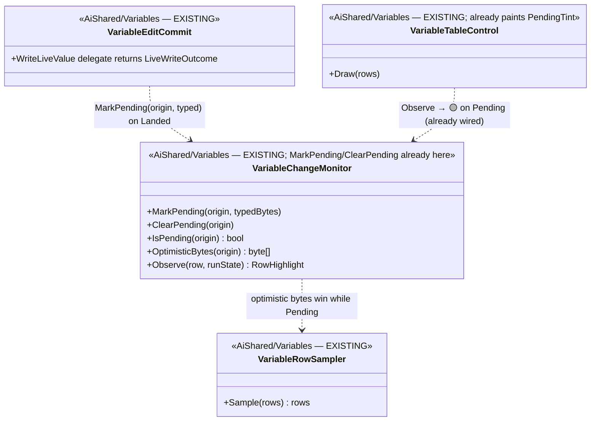

<!--STATUS
state: LIVE
build-state: READY-TO-BUILD
updated: 2026-08-21
current-answer: this whole file — the next UI/variable batch: an edit paints its value into the
  row IMMEDIATELY and yellow (optimistic display), until a regular tick confirms it. NO clock.
stale-below: nothing.
known-rot: none. REPLACES the withdrawn HANDOFF_The_Watch_Row_Refreshes_After_A_Paused_Write.md,
  whose LiveWriteFrame/re-sample-clock approach the user rejected ("nothing related to clocks").
known-conflict: ⚠ §6 of DESIGN_Variable_Details_And_Editing.md says "do NOT write _liveRepo during
  a pause (Flight Recorder linearity)"; MIN's WriteFieldNow does. That is a SEPARATE write-model
  question (§7 here), NOT resolved by this batch — this batch is display only and works either way.
design-basis: DESIGN_Variable_Details_And_Editing.md §4a (colours: 🔴 changed vs 🟡 pending, "never
  the same colour") + §6 ("OPTIMISTIC DISPLAY (user ruling): paint the new value immediately, then
  stage"); R-103 ("a user-typed value is a SEPARATE cache from the accessor value").
-->
# HANDOFF — **a staged edit shows its value immediately, in yellow**

> 📌 **Dispatched at `9c80d7aa0`.** ⭐ Branch from it *(rule 7)*. ⛔ **Scope FROZEN at this sha.**
> ⭐ **Lane: UI / variable** *(`claude/hrot-implementation-j1jvin`)*, ids **`BP-`**, tracker `A`–`G`.
> ⭐ **Rule 1b: push `chore: started <name> at 9c80d7aa0` FIRST.** ⭐ **Rule 3: you allocate the ids.**

## 0. ⭐⭐⭐ THE FINDING — **user, `2026-08-21`** *(and the correction to my first draft)*

> 🔒 *"it does not need to resample but must change immediately (to staged value) to give the user
> notification of the success — staging and showing until regular tick has been designed — staged
> changed in yellow color. nothing related to clocks."*

⛔ **My first handoff proposed a `LiveWriteFrame` re-sample clock. That was WRONG** — the user does not
want a re-sample; they want the **row to echo the value the user just typed, immediately, in YELLOW**,
until a regular tick confirms it. ⭐⭐ **This is already designed** *(§4a + §6)* — and, measured below,
**mostly already BUILT and just not wired.**

## 1. ⭐⭐⭐ THE DESIGN — **two colours, one optimistic value** *(cite, do not invent)*

| 📄 `DESIGN_Variable_Details_And_Editing.md` | |
|---|---|
| **§4a** *(`:328`)* | 🔴 **red = the SIM changed it** *(one asset tick)* · 🟡 **yellow = YOUR optimistic edit has not landed yet** · ⛔ **never the same colour** — the two must stay distinguishable |
| **§6** *(`:451`)* | ⭐⭐⭐ **OPTIMISTIC DISPLAY (user ruling): paint the new value in the cell IMMEDIATELY**, then stage; the yellow **clears when it lands** |
| **`R-103`** | ⭐⭐ **"a user-typed value is a SEPARATE cache from the accessor value"** — the optimistic value is NOT the sampled value and must not be confused with it |

## 2. ⭐⭐ INVENTORY — **the mechanism is BUILT; the wiring is missing** *(`R-74`, `R-67` shape)*

| # | query | finding |
|---|---|---|
| I1 | read `VariableChangeMonitor.cs:22,187-204` | ✅ **`RowHighlight(bool Changed, bool Pending)`** and **`MarkPending(origin)` / `ClearPending(origin)` / `IsPending(origin)`** all EXIST |
| I2 | `grep -rn "MarkPending\|ClearPending"` *(non-test)* | ⛔⛔ **ZERO production callers** — nothing ever marks a row pending. 📌 `R-67`: the capability is built and unwired |
| I3 | read `VariableTableControl.cs:172` | ✅ **the renderer ALREADY paints `PendingTint` (yellow)** on `agg.Pending` ⇒ ⭐ **the paint is wired; it just never receives a `Pending=true`** |
| I4 | `grep` for an optimistic-VALUE cache | ⛔ **absent** — there is a pending FLAG but nowhere holding the **typed bytes** to render; the sampler caches only the accessor value |

⇒ ⭐⭐⭐ **Two small gaps: (a) nobody calls `MarkPending` on commit, and (b) there is no cache of the
typed value to paint.** ⛔ **No clock, no re-sample, no new counter.**

## 3. ⭐⭐⭐ THE UML — *(existing classes with files; the two additions marked)*



```mermaid
sequenceDiagram
    autonumber
    participant U as Edit (OK)
    participant C as VariableEditCommit
    participant M as VariableChangeMonitor
    participant S as VariableRowSampler (each Draw)
    participant T as VariableTableControl

    U->>C: commit (typed bytes)
    C->>M: MarkPending(origin, typedBytes)   [on LiveWriteOutcome.Landed]
    Note over S,T: next Draw — no tick needed (dt=0)
    S->>M: IsPending? → yes ⇒ return typedBytes as the cell value
    T->>M: Observe → RowHighlight.Pending ⇒ 🟡 yellow
    Note over S,T: later — a REGULAR tick (dt>0) samples the real value
    S->>M: pulse moved ⇒ ClearPending(origin); optimistic cache dropped
    T->>M: Observe → not Pending ⇒ normal colour (confirmed)
```

## 4. ⭐⭐ THE CHANGE

| # | file | edit |
|---|---|---|
| **①** | `VariableChangeMonitor.cs` | ⭐ extend `MarkPending(origin, ReadOnlySpan<byte> typedBytes)` to STASH the typed bytes on the `Entry`; add `OptimisticBytes(origin)`. ⛔ keep it a **SEPARATE cache** *(`R-103`)* — never the accessor value |
| **②** | `VariableEditCommit.cs` | ⭐ on `LiveWriteOutcome.Landed`, call `MarkPending(row.Origin, typedBytes)` — ⭐ **the one host-neutral choke** ⇒ Blueprint/BTree/HSM inherit it. ⛔ never on a refusal |
| **③** | `VariableRowSampler.cs` | ⭐ while `IsPending(origin)`, the row's rendered value is the **optimistic bytes**, not the sampled bytes. ⚠ **the sampler keeps its existing triggers UNCHANGED** — this is an override on top, not a new trigger |
| **④** | clear | ⭐ `ClearPending` + drop the optimistic cache on the **next regular sample** *(the pulse moves — a real tick confirmed it)*. ⚠ **This is the "until regular tick" the user named** — at `dt=0` the pulse never moves, so the yellow **persists through the pause**, which is correct |

⚠ **Placement of the optimistic-value override (item ③) is the one seam to get right** — recommend the
monitor holds the bytes and the sampler consults it, but **report what you chose and why** *(the `104a`
discipline)*. ⛔ Do NOT paint by re-reading `_liveRepo` — the value shown is what the user TYPED.

## 5. ⭐ THE RAILS

| ⭐ | |
|---|---|
| ⭐⭐⭐ **the finding, pinned** | commit an edit while paused *(no pulse, no binding change)* ⇒ the row's rendered value is the typed value **immediately**, and `Observe` returns `Pending=true` |
| ⭐⭐ **it clears on the next tick** | advance the pulse once ⇒ `Pending=false` and the value is the fresh sample |
| ⭐ **red ≠ yellow** | a SIM change *(pulse moves the value with no edit)* is `Changed`, an edit is `Pending` — ⛔ never both from one cause *(§4a)* |
| ⛔ **no headless UI/colour rail** | `R-21`/`R-62` — assert the `RowHighlight` predicate and the rendered-value override, not the pixel |

## 6. ⭐ LANE CHECK — **all UI/variable**

⭐ `VariableChangeMonitor.cs` · `VariableEditCommit.cs` · `VariableRowSampler.cs` *(+ maybe
`VariableTableControl.cs`)* — **all `Hrot.Editor.AiShared/Variables`**, the frozen area this session
owns. ⛔ No time-lane file.

## 7. ⚠⚠ FOR THE COORDINATOR / USER — **a write-model contradiction this batch does NOT touch**

📌 **`DESIGN_..._Editing.md` §6 (`:451`):** *"running/paused ⇒ optimistic display, then **stage**…
⛔ **Do NOT write `_liveRepo` during a pause** — `Blackboard1024` is `[DataPolicy(NoSave)]`, so a
non-simulation write breaks Flight Recorder linearity."*
⛔ **MIN's `WriteFieldNow` writes `_liveRepo` directly during a toolbar pause.** ⇒ ⚠ **MIN and this
design ruling disagree on the WRITE**, though they agree on the DISPLAY.

⭐ **This batch is display-only and works under EITHER write model** *(the yellow clears on the next
tick regardless)*. ⛔ **The write-model choice — keep MIN's direct write, or move to staging per §6 —
is a SEPARATE decision for the user**, flagged here so it is not lost. ⚠ **Not this batch.**
