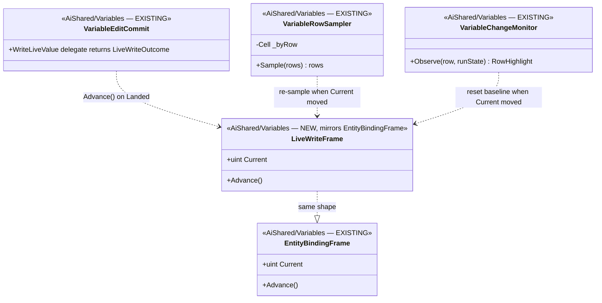
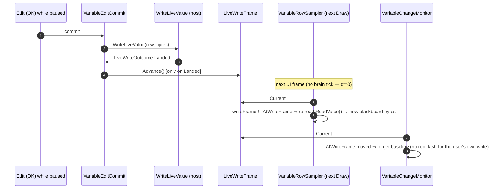

<!--STATUS
state: LIVE
build-state: READY-TO-BUILD
updated: 2026-08-21
current-answer: this whole file — the next UI/variable batch: the watch/details row re-samples
  after a live write while paused.
stale-below: nothing.
known-rot: none.
known-conflict: none.
design-basis: R-103 ("pin while running-but-PAUSED ⇒ sample IMMEDIATELY"; "a user-typed value is a
  SEPARATE cache"), R-107 + Batch 97d (the BINDING clock — the exact pattern this mirrors: fire
  regardless of run state, reset the highlight baseline), R-76 (two clocks; never per-tick).
-->
# HANDOFF — **the watch/details row refreshes after a live write while paused**

> 📌 **Dispatched at `f13b7403e`.** ⭐ Branch from it *(rule 7)*. ⛔ **Scope FROZEN at this sha.**
> ⭐ **Lane: UI / variable** *(`claude/hrot-implementation-j1jvin`)*, ids **`BP-`**, tracker `A`–`G`.
> ⭐ **Rule 1b: push `chore: started <name> at f13b7403e` FIRST.** ⭐ **Rule 3: you allocate the ids.**

## 0. ⭐⭐⭐ THE FINDING — **user, `2026-08-21`, after MIN shipped**

> 🔒 *"value write when sim paused on deterministic time step confirmed working. variable in the watch
> row not changed immediately (no re-evaluate?) but in blackboard it was changed."*

⭐ **MIN landed the write** — the blackboard IS updated. ⛔ **The watch row keeps showing the old value**
until the sim resumes. ⭐⭐ **This is a KNOWN, RULED gap, not a new bug** — and the fix is a **mirror of
the binding clock** *(Batch 97d / `R-107`)*, so this is a documented-recipe batch, not a new design.

## 1. ⭐⭐ ROOT CAUSE — **the sampler has three triggers; a paused write is none of them**

📐 `VariableRowSampler.SampleOne` *(`Hrot.Editor.AiShared/Variables/VariableRowSampler.cs:100`)* re-reads
only when:

```csharp
if (!sample.Taken || pulse != sample.AtPulse || binding != sample.AtBinding)
```

| trigger | source | under a toolbar pause *(dt=0)* |
|---|---|---|
| **pulse moved** | `row.AssetTick()` = the `BehaviorFrame` counter | ⛔ **frozen** — `BehaviorFrameSystem` is `dt>0`-gated *(`R-103`)* |
| **binding moved** | `EntityBindingFrame.Current` *(selection)* | ⛔ **unchanged** — same entity |
| **never taken** | first sight | ⛔ already taken |

⇒ ⭐⭐⭐ **A live write changes the blackboard but moves none of the three ⇒ the cached sample holds.**
📌 This is exactly what `R-103` anticipated *("pin while running-but-PAUSED ⇒ sample IMMEDIATELY")* and
what `R-107` named for selection *("R-76's SECOND CLOCK … while time is stopped it never will")* — the
write is simply the **third** event that needs its own clock.

## 2. ⭐⭐ INVENTORY — *(the queries, `R-74`)*

| # | query | finding |
|---|---|---|
| I1 | read `EntityBindingFrame.cs` | ⭐ the recipe: `static uint Current => Volatile.Read`, `Advance() => Interlocked.Increment`; bumped by `SharedEntitySelection:63`, read by `VariableRowSampler:87` + `VariableChangeMonitor:108/118` |
| I2 | read `VariableChangeMonitor:118-124` | ⭐⭐ **"THE BASELINE FOLLOWS THE BINDING"** — on a binding change it forgets the baseline *(`Seen=false`)* so the new value is **not painted as a sim change**. ⭐ the write clock mirrors this |
| I3 | read `VariableEditCommit.cs` | ⭐ the **host-neutral commit choke**: `WriteLiveValue` delegate → `LiveWriteOutcome.Landed`. Blueprint/BTree/HSM all route through it ⇒ **one bump site serves every host** |

## 3. ⭐⭐⭐ THE UML — *(mirror of the binding clock; existing classes drawn with files, additions marked)*





## 4. ⭐⭐⭐ THE CHANGE — **~15–20 lines + one static class**

| # | file | edit |
|---|---|---|
| **①** | **NEW** `AiShared/Variables/LiveWriteFrame.cs` | ⭐ copy `EntityBindingFrame` verbatim in shape *(a `static uint Current` / `Advance()`)*. ⛔ **A SEPARATE counter, not a reuse of `EntityBindingFrame`** — a write is not a selection, and conflating them would re-sample on either for both reasons |
| **②** | `VariableEditCommit.cs` | ⭐ `LiveWriteFrame.Advance()` **only when the live write returns `LiveWriteOutcome.Landed`** — ⛔ never on a refusal. ⭐ this is the one host-neutral site ⇒ BTree/HSM inherit it free |
| **③** | `VariableRowSampler.cs:100` | ⭐ add `|| writeFrame != sample.AtWriteFrame` to the condition, and store `sample.AtWriteFrame = writeFrame` in the take block *(new `Cell` field)* |
| **④** | `VariableChangeMonitor.cs:118` | ⭐ add a parallel arm: `if (entry.AtWriteFrame != writeFrame) { entry.AtWriteFrame = writeFrame; entry.Seen = false; entry.HasEverChanged = false; }` — ⛔ **the SAME "forget the baseline" the binding arm does** |

## 5. ⭐⭐ THE ONE DECISION — **should the user's own write FLASH as a change?** *(my lean: NO)*

⭐ Item ④ resets the baseline, so the written value becomes the new baseline **with no red highlight.**
⭐⭐ **My lean: keep it that way** — 📌 `R-103` *("a user-typed value is a SEPARATE cache")* and the MIN
report §4 *("the change highlight stays quiet — correct: no behaviour ticked")*. The designer typed it;
flashing "the sim changed this" is false. ⛔ **If the user wants the write to flash instead**, DROP item
④ *(one arm)* and the re-sample alone paints it red. ⚠ **Build the no-flash version; it is a one-arm
flip if they disagree.**

## 6. ⭐ THE RAILS

| ⭐ | |
|---|---|
| ⭐⭐⭐ **the finding, pinned** | with the clock halted *(dt=0, pulse frozen, binding unchanged)*, a `LiveWriteFrame.Advance()` makes `Sample` re-read and return the **new** bytes on the next call — ⛔ **a revert-probe that removes the write-frame term must redden exactly this** |
| ⭐⭐ **no false flash** | the same write, through `VariableChangeMonitor`, yields `RowHighlight.None` *(baseline reset)* — this is item ④'s rail |
| ⚠ **the binding clock still works** | a selection change still re-samples and still resets the baseline — the two clocks are independent |
| ⛔ **no headless UI rail** | `R-21`/`R-62` — the rails sit at the sampler/monitor layer, not the window |

## 7. ⭐ LANE CHECK — **all UI/variable, no time-lane file**

⭐ `LiveWriteFrame.cs` *(new)* · `VariableRowSampler.cs` · `VariableChangeMonitor.cs` · `VariableEditCommit.cs`
— **all in `Hrot.Editor.AiShared/Variables`**, the frozen area this session owns. ⛔ Nothing under
`Fdp.Toolkits/Time/`, `Hrot.Orchestrator`, `ModuleHostKernel` or the integration tests.

## 8. ⭐ GATES

⭐ Baseline = **MIN's table** *(`REPORT_MIN`)*. ⭐ **T0** `quick-check.sh` on the new rails · **T1** the
touched suites `--no-build` *(`Hrot.Editor.AiShared.Tests` + the Blueprints watch/row tests)* ·
`tracker-counts.py --check` + the `BP-` ids you allocated. ⭐ **Rule 4: pull the coordinator branch
before your final commit.**
