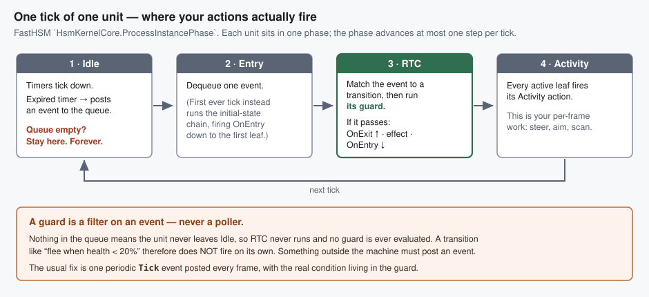
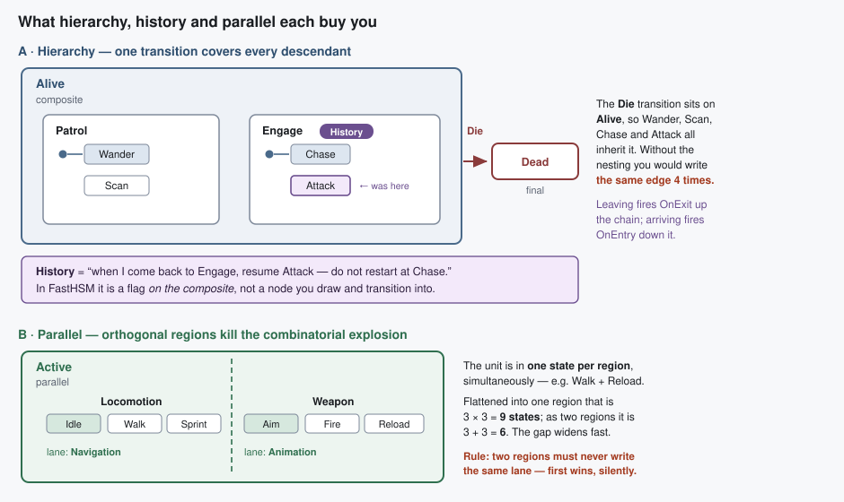

# HSM Concepts for Game AI — what FastHSM gives you, and which parts you actually need

> **Purpose:** orientation for the HSM visual-editing design session. Everything here is grounded in
> `FDP/ExtDeps/FastHSM` source, not generic UML — where the two differ, FastHSM wins and the
> difference is called out.
> **Companion:** [Hsm_Visual_Editing_Issues_Tracker.md](Hsm_Visual_Editing_Issues_Tracker.md).

---

## 1. The one-line summary

A state machine answers **“what is this unit doing right now, and what makes it switch?”**
Everything below is either a way to attach behaviour to *doing*, or a way to stop the *switching*
rules from exploding combinatorially.

---

## 2. The tick loop — read this first



### The consequence that shapes your authoring

**FastHSM is event-driven, always.** `HsmKernelCore.cs:108-117`:

```csharp
case InstancePhase.Idle:
    ProcessTimerPhase(...);                                  // timers may post events
    if (HsmEventQueue.GetCount(instancePtr, instanceSize) > 0)
        header->Phase = InstancePhase.Entry;                 // ← only then does anything happen
    break;
```

Empty queue ⇒ the unit never leaves `Idle` ⇒ RTC never runs ⇒ **no guard is ever evaluated.**

So *“transition when health drops below 20%”* is **not** expressible as a bare condition. It becomes:

| You want | You author |
|---|---|
| “when condition C” | a periodic `Tick` event + a guard testing C |
| “after N seconds” | a timer on the state (`TimerSlotIndex` → posts an event) |
| “when something happened” | a real event posted by gameplay code |

⚠ This is the single biggest mismatch with the mental model people bring from behaviour trees or
Unity's Animator, where conditions are polled for you. Here **you supply the pump.**

---

## 3. Actions — how behaviour attaches to a state

Five slots. Four on the state (`StateDef`), one on the transition (`TransitionDef`).

| Slot | Fires | Typical game use |
|---|---|---|
| `OnEntry` | once, on entering | pick a target, start an animation, claim a cover slot |
| `Activity` | **every tick**, while this is an active leaf | steer, aim, scan for enemies |
| `OnExit` | once, on leaving | holster, release the cover slot, clear the target |
| `Timer` | when the state's timer deadline elapses | “give up after 5 s”, re-scan cadence |
| transition *effect* | during the switch, between exit and entry | play a reaction, decrement ammo, post a squad message |

Ordering on a transition is fixed and worth memorising:

```
OnExit (leaf → LCA)   →   transition effect   →   OnEntry (LCA → target)
```

`LCA` = lowest common ancestor, the deepest state containing both source and target. It is what
decides how much of the hierarchy is torn down and rebuilt — and `TransitionDef.Cost` is precisely
that distance, precomputed.

---

## 4. Events and guards — your “transition conditions”

```
transition = (source, target, EventId, GuardId, ActionId, Kind)
```

- **`EventId`** — which event wakes this transition. `0` means *completion transition*.
- **`GuardId`** — a pure predicate `(instance, context, eventId) → bool`. `0` = always passes.
  **This is what you mean by “transition condition”.**
- Guards must be side-effect free — they are speculative and may be evaluated for several
  candidate transitions.

Events carry up to a 16-byte inline payload and have a priority class; interrupt-priority events
jump the queue. Queue capacity is tiny by design (1 event at 64 B, up to 5 + 1 interrupt at 256 B),
and at most **10 events are drained per tick**.

### Transition kinds

| Kind | Behaviour | Use when |
|---|---|---|
| **External** (default) | exits source, crosses LCA, enters target | ordinary switch |
| **Internal** | fires the effect only — **no** exit/entry | react without disturbing the state (e.g. `Aim` handling `AmmoChanged`) |
| **Local** | re-enters without fully exiting the composite | restart a sub-state, keep the parent's setup |

The difference is directly visible: External re-runs `OnEntry`/`OnExit`, Internal does not.

---

## 5. Hierarchy and parallel



### Why hierarchy earns its keep

One reason, and it is enough: **transitions are inherited by descendants.** Put `On(Die) → Dead` on
`Alive` and every state nested inside it is covered. Flat machines force you to draw that edge from
every single state, and to remember it every time you add one.

Secondary benefits: `OnEntry`/`OnExit` on a parent become shared setup/teardown, and the LCA rule
means switching between two siblings does *not* tear down the shared parent.

Kernel limit: **depth ≤ 16** (`StateDef.Depth` is a byte, editor rule `StateDepthExceeded`).

### Why parallel earns its keep

Orthogonal regions let a unit be in several states at once — one per region. The unit's locomotion
and its weapon handling are independent, so modelling them as one region multiplies
(3 × 3 = 9 states); as two regions it adds (3 + 3 = 6). With a third axis, 27 vs 9.

**The caveat that constrains region design.** Each state carries an `OutputLaneMask` over
`CommandLane { Animation, Navigation, Gameplay, Blackboard, Audio, VFX, Message }`. When two
concurrently-active regions write the same lane, `HsmKernelCore.ArbitrateOutputLanes` applies
**first-wins, silently** — it logs to the trace context and raises nothing. Priority-based
arbitration is marked P4/future in the kernel source. So:

> Regions must partition the actuators. One region owns Navigation, another owns Animation.
> Two regions both driving Animation is an authoring bug the runtime will not tell you about.

That is exactly why the editor has an `OutputLaneConflict` validator rule and a
`hsm.region_conflicts` canvas overlay — the editor is meant to be the thing that catches it.
(Today it cannot — see tracker **HSM-007**.)

---

## 6. History — what it means, and whether you need it

**Plain meaning:** *“when I come back to this composite, resume the sub-state I was in, instead of
restarting at the initial child.”*

The canonical game AI case is **interruption recovery**:

| | Without history | With history |
|---|---|---|
| Unit is in `Engage.Attack`, gets stunned | | |
| Stun ends, re-enter `Engage` | restarts at `Chase` — the unit walks back in from range even though it was already in melee | resumes `Attack` |

Other common uses: returning from a reaction/flinch sub-machine, resuming a patrol route at the
right leg, restoring a cover-behaviour phase after a reload.

- **Shallow** (`.History()`) — remembers the direct child only.
- **Deep** (`.DeepHistory()`) — remembers the full nested path.

### Do you need it now?

**No.** It is a refinement of an already-working machine. Nothing about “define states, transitions
and conditions” requires it. Worth knowing the concept so you recognise the symptom later — *“my
unit keeps restarting its approach after every stagger”* is a history-shaped bug.

### ⚠ The part that matters for the editor

In FastHSM, history is a **flag on the composite that owns the children**:

```csharp
var engaging = builder.State("Engaging")
    .History()                       // ← "Engaging remembers its last active child"
    .Child("Chasing",   c => c.OnEntry("StartChase").Initial())
    .Child("Attacking", a => a.Activity("Attack"));
```

`StateDef` backs this with `HistorySlotIndex` on the composite. There is **no history pseudo-state**
in this kernel — nothing to draw as a node, nothing to transition into.

The HSM editor design (`HSM_Editor_NodeEditor_Host_Design.md` §8.2) chose the opposite: UML-style
*"distinct palette entries that produce small dedicated state nodes"*, rendered as circled `H` / `H*`.
Its own §19 open question #4 flagged the choice as needing a final review. **The kernel has already
answered it.** See tracker **HSM-010**.

---

## 7. What you need, in the order you need it

| # | Concept | Needed for your stated goal? |
|---|---|---|
| 1 | States + `OnEntry`/`Activity`/`OnExit` | **yes, immediately** |
| 2 | Events + guards + transition kinds | **yes, immediately** — guards *are* your conditions |
| 3 | A `Tick` event to pump condition-only transitions | **yes** — without it nothing evaluates |
| 4 | Hierarchy (nesting + inherited transitions) | soon — the moment you repeat an edge |
| 5 | Timers | soon — “give up after N seconds” is ubiquitous |
| 6 | Final states | soon, cheap |
| 7 | Parallel regions + lane discipline | later — when the state count starts multiplying |
| 8 | History | later — interruption polish |
| 9 | Sync groups, deferred events, event priorities | later still |

---

## 8. Where the editor stands against that list

| Need | Editor today |
|---|---|
| 1 — states + actions | ✅ works; pickers wired to the live dispatcher |
| 2 — transitions + guards | ⚠ transitions draw and persist; **the event they need cannot be authored** |
| 3 — a `Tick` event | ❌ **no event authoring exists at all** (`HSM-009`) — hand-edit the JSON |
| 4 — hierarchy | ✅ containers, reparenting, LCA highlight all real |
| 5 — timers | ⚠ `TimerAction` is in the facet; no timer-duration authoring surface found |
| 6 — final states | ✅ flag + glyph |
| 7 — parallel | ⚠ authors, but validation is inert (`HSM-007`) and regions are lossy (`HSM-004/005`) |
| 8 — history | ❌ modelled as the wrong thing (`HSM-010`) |

**The critical path for your stated goal runs straight through `HSM-009`.** States and transitions
already work; what is missing is the ability to declare the events those transitions fire on.

> ⚠ Also worth knowing: **no HROT runtime code currently drives an HSM instance.** Nothing calls
> `HsmKernel.Update*` or enqueues an `HsmEvent` outside FastHSM's own tests and the blueprint
> emitter. Whatever authoring surface we design has no live consumer yet — which is freeing for the
> design, but means “does it actually run?” stays unanswered until that wiring exists.

---

## Change log

| Date | Change |
|---|---|
| 2026-08-14 | Created during the HSM design session, answering: what is history, how do actions relate to states, how do parallel and hierarchy work. |
