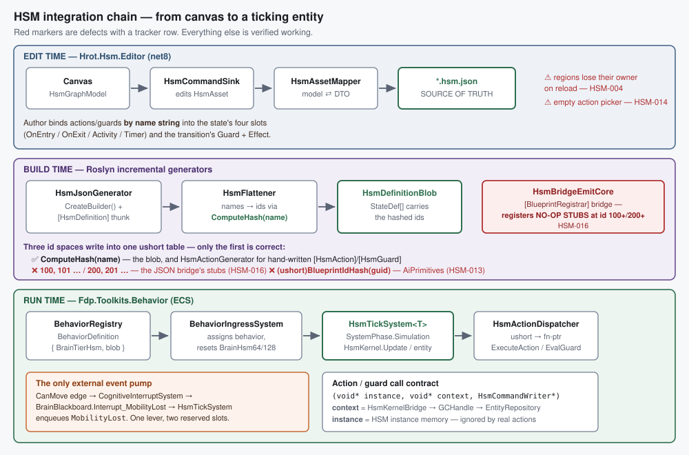

# HSM Integration Map — canvas to ticking entity

> ⭐ **READ THIS FIRST.** Orientation for anyone working on HSM visual editing. It exists so the
> chain does not have to be re-derived from source every session.
> **Every claim here was verified against source on 2026-08-14** (repo-wide search + `codebase-memory-mcp`
> graph `CALLS` queries), and each cites `file:line`. Defects are marked ⚠ with their tracker row —
> this doc says *how the system works*; the tracker says *what is broken*.
> **Companions:** [Concepts primer](Hsm_Concepts_For_Game_AI.md) (what HSM ideas mean) ·
> [Issues tracker](Hsm_Issues_Tracker.md) · [Session resume](Hsm_Design_Session_RESUME.md)

---

## 1. The chain in one picture



---

## 2. Who owns what

| Layer | Assembly | Owns |
|---|---|---|
| Kernel | `Fhsm.Kernel` | `HsmKernelCore` tick, `HsmActionDispatcher`, instance tiers, event queue |
| Compiler | `Fhsm.Compiler` | `HsmBuilder` fluent API, `HsmNormalizer`, `HsmFlattener`, `HsmEmitter` → blob |
| Editor | `Hrot.Hsm.Editor` | canvas host, `HsmAsset` model, command sink, validator, renderers, facets |
| Persistence | `Hrot.AiEditor.Persistence` | DTOs, `HsmAssetMapper`, `HsmEmitCore`, `HsmBridgeEmitCore` |
| Codegen | `Hrot.AiEditor.Generators` | `HsmJsonGenerator` — `*.hsm.json` → `.g.cs` |
| Runtime | `Fdp.Toolkits.Behavior` | `HsmTickSystem<T>`, `BehaviorIngressSystem`, `BrainHsm64/128`, `BehaviorRegistry` |
| Hand-written glue | `Fdp.Toolkits.Analyzers` | `HsmActionGenerator` → dispatcher + registrar for `[HsmAction]`/`[HsmGuard]` |

---

## 3. Stage by stage

### 3.1 Edit time

`HsmGraphModel` exposes `HsmAsset` to the NodeEdit canvas; `HsmCommandSink` translates
`GraphCommand` records into model edits; `HsmAssetMapper` maps model ⇄ DTO; the DTO serializes to
**`*.hsm.json`, which is the source of truth** (per `BTree_HSM_JSON_Persistence_Detailed_Design.md`
D1). Committed assets live under `Hrot/Subsystems/Hrot.AI.Behaviors/Assets/HSMs/`.

The author binds behaviour **by name string** into six slots:

| Carrier | Slots |
|---|---|
| `StateNode` | `OnEntryAction`, `OnExitAction`, `ActivityAction`, `TimerAction` |
| `TransitionNode` | `GuardFunction`, `ActionFunction` (effect) |

⚠ **HSM-014** — the action/guard picker only offers names the asset already contains, so on a fresh
machine it is empty. ⚠ **HSM-004 / HSM-005** — regions are lossy across save/reload and region
removal.

### 3.2 Build time

`HsmJsonGenerator` (`Hrot.AiEditor.Generators/HsmJsonGenerator.cs`) consumes each `*.hsm.json` as an
`AdditionalFile` and emits **two** sources:

1. `{Name}.g.cs` — `CreateBuilder()` + the `[HsmDefinition]` thunk, via `HsmEmitCore`.
   No `[HsmLayout]`: layout lives in the JSON.
2. `{Name}.Registrar.g.cs` — the `[BlueprintRegistrar]` self-registration bridge, via
   `HsmBridgeEmitCore.EmitBridge(dto)` (`:84-97`).

At runtime the thunk runs `HsmBuilder → Build() → Compile()`, and `HsmFlattener` turns names into
ids. **This is where identity is decided** — see §4.

### 3.3 Registration

The bridge is discovered by `AiHotReloadCoordinator.ScanForRegistrars`, which scans **only**
`[BlueprintRegistrar]` (the HR-001 constraint) and injects `BehaviorRegistry` + `BlueprintRegistryStaging`.
Signature (`HsmBridgeEmitCore:90`):

```csharp
public static void Register(BehaviorRegistry beh, BlueprintRegistryStaging staging)
```

It calls `beh.Register(id, name, new BehaviorDefinition { BrainTier = BrainTierHsm, HsmDefinition = blob })`.
`HsmActionDispatcher` is a **static** class and cannot be injected — the coordinator throws if a
registrar asks for it (`AiHotReloadCoordinator.cs:443-448`), so actions/guards are registered by
**static calls from inside `Register`**.

⚠ **HSM-016** — what the bridge registers there is wrong; see §4.2.

The parallel path for hand-written behaviour is `AiBehaviorFactory` (`Hrot.AI.Behaviors`), also
`[BlueprintRegistrar]`, which compiles blobs on a background thread and returns a lambda applied on
the main thread.

### 3.4 Assignment to an entity

`BehaviorIngressSystem` handles the behavior-assignment events. When the resolved
`BehaviorDefinition.BrainTier == BehaviorConstants.BrainTierHsm`, it calls `ResetHsmComponents(...)`
(`:742`), seeding `InstanceHeader.MachineId` from `HsmDefinition.Header.StructureHash` so
`ValidateInstance` passes on the next tick. The entity carries `BehaviorState` plus a
`BrainHsm64` or `BrainHsm128` component whose memory **starts with** the corresponding
`HsmInstance64/128` — `sizeof(T)` is how the kernel infers the tier.

### 3.5 Tick

`HsmTickSystem<T>` — `[UpdateInPhase(SystemPhase.Simulation)]`, registered in
`CognitiveRuntimeModule` for both `BrainHsm128` and `BrainHsm64`. Per entity per tick it:

1. injects `MobilityLost` if `BrainBlackboard.Interrupt_MobilityLost == 1` (`:171`) — **the only
   external event pump in the codebase**;
2. builds the `HsmKernelBridge` (`Self`, `WorldHandle`, optional `TraceContext`);
3. calls `HsmKernel.Update(def.HsmDefinition, ref component, bridge, deltaTime, …)` (`:230`);
4. optionally decodes the trace ring buffer to NLog;
5. publishes `BehaviorFinishedEvent` once when `InstanceFlags.Terminated` appears.

The kernel then runs the phase cycle `Idle → Entry → RTC → Activity → Idle`. **An empty event queue
leaves the instance in `Idle` forever** (`HsmKernelCore.cs:108-117`) — so guards only run when
something posts an event. ⚠ **HSM-009** — the editor cannot author events at all.

---

## 4. The four contracts (where every defect clusters)

### 4.1 Identity — name → `ushort`

The blob stores only `ushort` ids. `HsmFlattener.BuildActionTable` / `BuildGuardTable` derive them
from the **name string**:

```csharp
private static ushort ComputeHash(string name)          // HsmFlattener.cs:385
{
    uint hash = 2166136261;
    foreach (char c in name) { hash ^= c; hash *= 16777619; }
    return (ushort)(hash & 0xFFFF);                     // FNV-1a-32 over UTF-16 chars, low 16 bits
}
```

`HsmActionDispatcher` is a flat `Dictionary<ushort, IntPtr>`; **last writer wins**
(`RegisterAction(id, ptr) => ActionTable[id] = action`).

### 4.2 ⚠ Three id spaces write into that one table — only one is correct

| Producer | Key used | Verdict |
|---|---|---|
| `HsmFlattener` (what the blob looks up) | `ComputeHash(name)` | ✅ canonical |
| `HsmActionGenerator` — hand-written `[HsmAction]`/`[HsmGuard]` | `ComputeHash(name)` (`:517,528,630,636`) | ✅ agrees |
| `HsmBridgeEmitCore` — the JSON asset's own bridge | `100, 101, …` / `200, 201, …` | ❌ **HSM-016** |
| `CSharpEmitter` — blueprint AiPrimitive | `(ushort)BlueprintIdHash.Compute(assetId)` (`:354,356`) | ❌ **HSM-013** |

**HSM-016 in detail.** The bridge emitted for *every* editor-authored `.hsm.json` registers
**no-op stubs** under sequential placeholder ids (`HsmBridgeEmitCore:119-126, 138-145`):

```csharp
static void __hsActionStub(void* inst, void* ctx, HsmCommandWriter* w) { }
static bool __hsGuardStub (void* inst, void* ctx, ushort ev) => true;
ushort actionId = 100;   // "placeholder IDs for JSON-owned HSM thunks"
ushort guardId  = 200;
```

Two consequences: the stubs are keyed where the blob never looks (so they are pointless), **and** if
any real action's name happens to hash into `[100,199]` — or a guard's into `[200,299]` — the stub
**clobbers the real registration**, silently, order-dependently. A clobbered action becomes a no-op;
a clobbered guard becomes permanently `true`.

**Failure modes are silent by design** (`HsmActionDispatcher.cs:18-27`): a missing action id is a
no-op; a missing guard id **returns `true`**. A typo, a stale name and a mis-keyed registration are
all indistinguishable from "no guard".

### 4.3 The bridge argument — `context`, not `instance`

```csharp
void Action(void* instance, void* context, HsmCommandWriter* writer)
bool Guard (void* instance, void* context, ushort eventId)
```

- **`context`** is the `HsmKernelBridge` — `{ Entity Self; IntPtr WorldHandle; HsmTraceContext* }`.
  It must be `unmanaged`, so the world arrives as a `GCHandle` IntPtr:
  `(EntityRepository)GCHandle.FromIntPtr(bridge->WorldHandle).Target!`. **This is the useful one.**
- **`instance`** is the raw `HsmInstance64/128/256` memory. Every hand-written action **ignores it**
  (`ApcHsmActions.cs`). ⚠ **HSM-015** — the generated AiPrimitive thunk does *not*: it does
  `ref var p = ref *(Params*)instance`, reinterpreting instance bookkeeping as its parameter struct.
- **`writer`** is ignored by the shipped hand-written actions too, which write channel components
  directly through the repo. **Writer-less actions are the house pattern, not a defect.**

Guards are evaluated **speculatively** across candidate transitions in `SelectTransition`, so they
must be side-effect free.

### 4.4 Parameters — the gap

BTree binds params through `BrainBlackboard.BehaviorParameters` indexed by a per-node `paramIndex`.
**HSM has no equivalent and cannot without a ROM change:** `StateDef` is a full 32 bytes with a
single spare (`Reserved29`) and no param field; `TransitionDef` is a full 16 with none.
*"Which parameter block does this binding use"* is unrepresentable in the HSM blob — which is why
HSM-013's naming question is really the broader question of **how a parameterised action binds to a
state slot at all**. Hand-written HSM actions sidestep it entirely by taking no parameters and
reading the world.

---

## 5. Runtime features that exist only on paper

| Feature | Reality |
|---|---|
| Timers | `TimerDeadlines` is only ever written to `0`; `StateDef.TimerActionId` is never read by the kernel ⇒ **never fires** (HSM-012) |
| Lane arbitration | conflict is detected then resolved **first-wins, silently**; priority arbitration is P4/future |
| Deep history into parallel | `DrillDownToInitial` stops at a parallel state — documented kernel gap |
| `OutputLaneMask` on JSON assets | never computed — the inferrer has no production caller (HSM-007) |

---

## 6. Docs that are stale — do not trust these on the substrate

| Doc | Stale how |
|---|---|
| `AI-Behavior-Authoring.md` (2026-05-23) | Pre-JSON: describes `HsmFluentEmitter → committed .cs` as the pipeline. Its §7 registration content is still useful, but it has **zero** coverage of `Fdp.Toolkits` runtime — no `HsmTickSystem`, `BrainHsm`, or `CognitiveRuntimeModule`. |
| `BTree_HSM_Editor_State_And_Forward_Plan.md` (2026-06-12) | Says HSM *"cannot author at all"* with four `TODO` command-sink stubs. EH-01…EH-05 have since landed (HSM-011). |
| `HSM_Editor_NodeEditor_Host_Design.md` | Still the **feature/UX target**, but its substrate assumptions are superseded by the JSON DD, and §8.2's history-as-pseudo-state choice is contradicted by the kernel (HSM-010). |

---

## 7. Defect index

| Row | One line | Stage |
|---|---|---|
| HSM-001/002/003 | initial state has two sources of truth | edit |
| HSM-004/005 | regions lost on reload; region removal corrupts child indices | edit |
| HSM-006 | palette states share one name; emit resolves targets by name | edit → build |
| HSM-007/008 | `OutputLaneMask` never computed; conflict scan misses nested leaves | edit |
| HSM-009 | **no event authoring exists** | edit |
| HSM-010 | history modelled as a pseudo-state; kernel says flag-on-composite | edit |
| HSM-011 | plan doc stale | docs |
| HSM-012 | timers authored but never armed | build → run |
| HSM-013 | AiPrimitive registers under a GUID hash, blob looks up a name hash | build |
| HSM-014 | action/guard picker is circular | edit |
| HSM-015 | generated thunk reads params from instance memory | build → run |
| HSM-016 | JSON bridge registers no-op stubs at placeholder ids | build → run |

---

## Change log

| Date | Change |
|---|---|
| 2026-08-14 | Created during the HSM design session. Chain verified end to end; HSM-016 found while writing §4.2. |
