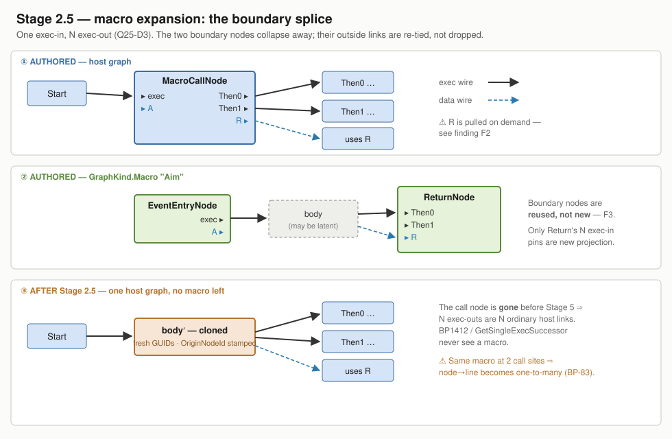

# Macros — implementation-level design (BP-79 … BP-83)

> **Q25 settled *what a macro is*. This settles *how each slice is built*.**
> [Q25](Architect_Question_25_Macros.md) answered **A1** (own `GraphKind.Macro`) · **B1** (new
> `Stage2_5_ExpandMacros`) · **C1** (asset-local now) · **D3** (one exec-in, **N ≥ 0** exec-out) ·
> **E** (six guard rails). None of that reopens here.
>
> ⚠ **Written while Batch 27 is in flight.** Per rule 6 the tracker and detail docs belong to the
> implementation session, so **nothing here is a tracker row and no IDs are allocated.** Five findings
> below are new since Q25 and need rows when BP-79 is scheduled.

📐 

---

## 0 · Corrections to what is already written down

| Where | Says | Actually |
|---|---|---|
| Q25-E, BP-79 row | `Stage5_Schedule.cs:4311-4314` — the `GraphKind → IrGraphKind` catch-all | ⚠ **now `:4492-4498`.** The hole is real and unchanged (`_ => IrGraphKind.Function`), but the coordinates are stale — the file moved under Batches 20-26 |
| Q25-A1, BP-80 row | *"its own `Input`/`Output` boundary nodes"* | ⭐ **Don't build them — see F3.** `EventEntryNode` and `ReturnNode` already project the required shapes bar one pin group |
| BP-79 row | `InstanceEmitter:81-82` picks the first `Function` graph as Tick | ✅ confirmed verbatim, and it reads **`IrGraphKind`**, so the guard belongs at the Stage 5 map, not at the emitter |

---

## 1 · Five findings Q25 does not have

### 🔴 F1 — expansion **bypasses BP1650**, the rule macros exist for

`BP1650` (*no latent node in a called Function graph*) is a **Stage 2** validator
(`Stage2_Validate.cs:2167-2186`). Stage 2.5 runs **after** it.

⇒ A macro containing `Delay`, called from a **Function** graph, puts a latent node into a function
body **after the only check that forbids it has already run.** No diagnostic; the emit is then the
exact `Func_X`-that-suspends breakage Q25 documented (single shared `Cursor`, suspend-as-`return`).

⚠ This is the B1 seam's one genuine cost, and it is not recorded anywhere. **The fix is a Stage 2
rule, not a Stage 2.5 one** — at the call site, where it is attributable to a node the designer
placed:

> **A macro whose body transitively contains a latent node may not be called from a `Function` graph.**

Reuse `V_FunctionGraphCallRules`' existing shape: it already builds `callEdges` and already walks
called graphs for latent node types. The macro version is the same two passes over macro-call edges.

### 🔴 F2 — multi-exec-out **+ a data output** is a definite-assignment hazard, not merely a wart

> ✅ **ACCEPTED 2026-08-10.** Expanded after the user asked *"why pure producers?"* — the mechanism
> below is the answer, and the emitted-local form is now verified rather than assumed.

**A data wire is not a value pushed along a wire — it is *"compute this at the point of use"*.**
`ResolveDataPin` / `ResolveNodeOutput` walk **backwards** from the consumer to the producer and emit
there. Pure and impure producers therefore resolve completely differently:

| Producer | How it resolves | Safe from any exec path? |
|---|---|---|
| **Pure** (`Add`, `Compare`, `GetVariable`) | recomputable — the expression is **re-emitted at each point of use** | ✅ yes, it is computed wherever it is read |
| **Impure** (non-pure `FunctionCall`, `CallPeerBlueprint`) | side-effecting, so it runs **exactly once**, pinned where its exec pin sits; materialised as `var __tN = …;` and cached in `_statementPinCache` (**never cleared**) — every later reader reuses that local | ⚠ **only under the premise below** |

Reusing the local is the *only* correct option for an impure producer — re-emitting would repeat the
side effect. But it rests on one stated premise (`Stage5_Schedule.cs:178-190`):

> *"the emitted TickCore body is flat (goto-based, no nested scopes), so that local remains in scope
> and definitely-assigned for any later block **reachable only through the block that declared it**."*

✅ **Verified:** `StatementEmitter` emits `var __t{idx} = <expr>;` — **declaration and assignment
together**, at the scheduling point. There is no hoisted declaration to fall back on.

**Two exec-outs break the premise exactly.** With one exec-out, everything downstream of the macro is
reachable only through the macro's body. With two:

```csharp
goto L_Then1;
L_Then0: var __t5 = SomeImpureCall();   // assigned only on this path
         goto L_Use;
L_Then1: goto L_Use;                    // __t5 never assigned
L_Use:   Log($"{__t5}");                // CS0165
```

`__t5` is **in scope** at `L_Use` (flat body, one block) but not **definitely assigned** on all paths
⇒ **`CS0165` — a hard build error in generated code.** ⚠ Loud, but it names `__t5` and points at the
**consumer**, not at the impure producer on the other path, so the designer has no route back to the
cause. Unreal tolerates the equivalent and yields a stale value; we would break the build instead.

⇒ **Rule:** when a macro declares **≥ 2 exec-outs**, every data output must be fed by a **pure**
producer chain. One exec-out keeps today's reasoning and may be impure. Checkable in Stage 2 by a
backward walk over data links from the `ReturnNode`'s data-in pins.

⭐ It is the difference between *"N exec-outs cost the **scheduler** nothing"* (Q25 verification #6,
still true) and *"N exec-outs cost the **emitter** nothing"*, which was never checked.

#### Two caveats, recorded deliberately

⚠ **The rule is conservative — it rejects safe cases.** An impure producer placed *before* the macro's
internal branch dominates both exits and **is** definitely assigned. A precise check would be
**dominance**-based, not purity-based — but dominance exists only at Stage 5, **after** expansion, so
the diagnostic would name synthesized nodes. Purity is checkable at Stage 2 on authored nodes.
⇒ **Conservative wins: a false rejection is explainable, a `CS0165` about `__t5` is not.** Same
attributability tradeoff as F1.

⭐ **The canonical case passes anyway.** Unreal's **`ForEachLoop` is exactly this D3 shape** — one
exec-in, two exec-outs (`Loop Body`, `Completed`), plus data outputs (`Array Element`, `Array Index`).
Those are fed by **pure** array reads, so the purity rule admits it.

📌 **Held in reserve, not built:** associating each data output with the exec-out it is valid on
(`Array Element` belongs to `Loop Body`) is more expressive and more faithful to real usage — but the
consumers live in the **host** graph, so *"was this read reached via exec-out k"* is again a Stage 5
reachability question. Revisit with the **D3 → D1** extension.

### ⭐ F3 — reuse the boundary nodes; only one pin group is new

| Macro boundary | Reuse | Already projects | Delta |
|---|---|---|---|
| **Input** | `EventEntryNode` | exec-out + one data-out per `Graph.Inputs`, matched to `IrOp_ReadInputArg` by name (`NodePinSchema.cs:259-281`) | extend the `Kind == Function \|\| Event` gate to include `Macro` |
| **Output** | `ReturnNode` | one data-in per `Graph.Outputs`, positional (`NodePinSchema.cs:339-355`) | ⭐ **N exec-in pins** — the only genuinely new projection |

Two consequences worth the trade:

- ✅ **D2's Details-panel signature editing works for macros on day one** — entry node → Inputs,
  return node → Outputs, exactly as [DECISIONS_Authoring_UX](DECISIONS_Authoring_UX.md) settled. A
  bespoke boundary node would need its own Details drawer and would miss BP-120's fix.
- ⚠ **Cost:** every `ReturnNode`/`EventEntryNode` rule must decide about `Macro` — `BP1601`
  (GraphHasNoReturn), `BP1602` (GraphHasNoEntry), `BP1655` (declared output unwired), `BP1657`,
  and `ReturnNode.Status` visibility (hide for `Macro`, the BP-105 precedent). **Bounded and
  greppable, and each one fails loud.** That is the right side of the trade versus a new node type
  that silently misses every existing rule.

⚠ This does **not** weaken Q25-A1. The *graph kind* stays a distinct enum member — that is what
protects tick-graph selection. Reuse is at the *node* level only.

### ⭐ F4 — `MacroCallNode` must be a distinct type carrying **exactly one field**

**Distinct type**, not `FunctionCallNode` with a macro target: every `OfType<FunctionCallNode>()` site
(the Stage 5 lowering switch, BP1650-54) then cannot see a macro. Bonus net — an unexpanded macro call
reaching Stage 5 lands in the *"unknown impure node kind → **BP4004**"* arm
(`Stage5_Schedule.cs:1947`), a second diagnostic beneath BP-79's.

**Exactly one field — `TargetGraphId`.** Everything else (pin names, types, counts, arity) is derived
by projection from the target graph.

> ⭐ **This is a structural fix for a defect that has now happened twice.** `CallablePeers` (BP-116)
> and `ArgTypes` (BP-201) are the same shape: *a property the compiler needs that the editor never
> writes*, invisible because every fixture hand-writes the JSON. A call node with no baked metadata
> **cannot** have that bug.

⚠ The one thing to resist: baking arg types onto the call node "for validation speed". That is
literally BP-201.

### ⭐ F5 — exec-outs need a **new** declaration list, not entries in `Graph.Outputs`

`Graph.Outputs` is `List<ParameterDecl>` and its **count is load-bearing arithmetic** in at least four
places — `BP1652` (`dataInPins.Count != targetGraph.Inputs.Count`), `BP1655`, BP-73's carrier fan-out
(`Outputs.Count > 1`), and `ReturnNodePins`' positional pairing. Injecting exec entries there changes
every one of those counts **silently**.

⇒ `Graph.ExecOutputs : List<ExecOutDecl>` — a new list, meaningful only for `GraphKind.Macro`,
`{ Id, Name, Tooltip }`, serialised additively. The **exec-in stays implicit** (D3 declares exactly
one), so no input-side model change at all.

---

## 2 · Data model — the complete delta

```csharp
public enum GraphKind { Function, Event, Construction, Macro }   // append only; JsonStringEnumConverter

public sealed class Graph
{
    // … unchanged …
    public List<ExecOutDecl> ExecOutputs { get; set; } = new();   // Macro only; [] elsewhere
}

public sealed class ExecOutDecl { public Guid Id; public string Name = ""; public string? Tooltip; }

public sealed class MacroCallNode : Node { public string TargetGraphId { get; set; } = ""; }
```

**That is the entire on-disk change.** Every list is additive and every existing asset round-trips
byte-identically.

---

## 3 · `Stage2_5_ExpandMacros` — the algorithm

**Fixpoint, not recursion.** Nested macros fall out on the next round and the depth cap is the round
counter — no separate mechanism.

```
for round in 1..MaxDepth:                       # MaxDepth = 16, then BP166x
    calls = host.Nodes.OfType<MacroCallNode>()
    if calls is empty: break
    for each call C:  splice(C)
else: error "macro expansion exceeded {MaxDepth} rounds"
```

Recursion is already excluded upstream by the BP1654-shaped cycle rail (BP-82), so the cap only
catches pathological depth, never a loop.

### `splice(C)` — the five rewiring rules

Let **M′** = fresh clone of the macro body, **In′**/**Out′** its boundary nodes.

| # | Kind | Rule | Edge case |
|---|---|---|---|
| 1 | exec-in | `X.out → C.execIn` becomes `X.out → succ(In′.execOut)` | `In′.execOut` unwired ⇒ empty body; the call is a **no-op**, and every exec-out continuation is unreachable ⇒ warn |
| 2 | exec-out *k* | `Z.out → Out′.execIn[k]` **+** `C.execOut[k] → Y.in` become `Z.out → Y.in` | ⚠ several `Z` may feed one `execIn[k]`; in-degree ≥ 2 at `Y` is fine — `ComputeMergePoints` (`Stage5:4269`) allocates one shared block |
| 3 | data-in *p* | consumers of `In′.dataOut[p]` re-tie to `pred(C.dataIn[p])` | `C.dataIn[p]` unwired ⇒ synthesise a `LiteralNode` from `Pin.DefaultValue`, else `ParameterDecl.DefaultValueJson`, else error |
| 4 | data-out *q* | consumers of `C.dataOut[q]` re-tie to `pred(Out′.dataIn[q])` | `Out′.dataIn[q]` unwired ⇒ **BP1655 already covers this**, reused verbatim |
| 5 | teardown | delete `C`, `In′`, `Out′`; drop their pins | ⭐ **every rewire updates `Pin.LinkedToIds` on both endpoints** — the BP-23a lesson: a stale mirror makes a node "claim wires it does not have" |

### Cloning — reuse, with two known deltas

`BlueprintClipboard.Rehydrate` (`:129-184`, shipped by BP-23a) already does the JSON deep-copy, fresh
**node and pin** GUIDs, internal link remap, and the `LinkedToIds` mirror.

1. ⚠ **Boundary links must be rewired, not dropped.** `Rehydrate:171-174` `continue`s on any link with
   an endpoint outside the fragment — precisely the links rules 1-4 need. **This is the item's actual
   work.**
2. ⚠ **Assembly direction.** `BlueprintClipboard` is in `.Editor`; Stage 2.5 is in `.Compiler`, and the
   dependency runs Editor → Compiler. **Move the remap down**, don't duplicate — BP-69 duplicated
   `ResolveCustomEventDecl` across this exact boundary and the two copies drifted.

### Provenance

Every cloned node gets `OriginNodeId` = the authored node's id. ⚠ `OriginNodeId` is a **fallback**
(`CSharpEmitter.cs:45,53` read `debug?.NodeId ?? debug?.OriginNodeId`), so the clone's own `NodeId`
wins — which is what makes one authored node yield **two `DebugMapEntry` rows at two call sites**.
That is BP-83's whole subject: **line→node stays 1:1, node→line becomes one-to-many.**

---

## 4 · Diagnostics — `BP1660+` is free

`BP1650…BP1657` are taken; `BP1658-59` reserved for function follow-ups.

| Code | Sev | Rule | Slice |
|---|---|---|---|
| `BP1660` | Error | `MacroCallNode.TargetGraphId` does not resolve to a `GraphKind.Macro` graph | BP-82 |
| `BP1661` | Error | ⭐ **F1** — macro with a transitively latent body called from a `Function` graph | BP-82 |
| `BP1662` | Error | macro call cycle, direct or mutual (BP1654's DFS over macro edges) | BP-82 |
| `BP1663` | Error | ⭐ **F2** — data output fed by an impure producer while ≥ 2 exec-outs are declared | BP-82 |
| `BP1664` | Error | macro declares a local variable | BP-82 |
| `BP1665` | Error | expansion exceeded the depth cap | BP-81 |
| `BP1666` | Error | ⭐ a `GraphKind.Macro` graph reached Stage 5 **as a compilation target** | BP-79 |
| `BP1667` | Warning | macro body is empty — the call is a no-op | BP-81 |

⚠ **`BP1666`'s wording is load-bearing.** A future macro-library asset (Q25-C2) only *declares*
macros; with no call sites they legitimately reach Stage 5 unexpanded and must be **skipped, not
errored**. Free to word right today, expensive to unpick later.

---

## 5 · Slice-by-slice

| Slice | Contents | Delegation |
|---|---|---|
| **BP-79** | `GraphKind.Macro`; `Stage5:4492-4498` catch-all → `BP1666`; tick-graph-eligibility test | 🟢 Sonnet — mechanical, but the **test** is the deliverable |
| **BP-80** | `ExecOutDecl` + `Graph.ExecOutputs`; `MacroCallNode`; extend `EventEntryNodePins`/`ReturnNodePins` (F3) **and** `Stage0_Rehydrate`'s twins together; `ReturnNode.Status` hidden for Macro; real `editor.create-macro` handler ⇒ **closes BP-77**; palette + drag | 🟠 mixed — the N-exec-in projection is novel, the rest mirrors BP-73/BP-89 |
| **BP-81** | the pass above: fixpoint, five splice rules, clone reuse, `OriginNodeId` | 🔴 **Opus — hands-on.** Rules 1-4 are novel IR-adjacent work |
| **BP-82** | `BP1660`-`BP1664`; plus the two forward-compat library rails (`BP9001` narrows to *Function* graphs, `BP5001` accepts Macro-only) | 🟢 Sonnet for BP1660/62/64, 🔴 Opus for **BP1661/BP1663** (F1/F2 — both need reachability reasoning) |
| **BP-83** | breakpoint arms at **every** expansion site; watch panel resolves the frame | 🟠 needs the debug-map shape decided first |

⚠ **BP-80 and BP-81 must not be split across sessions.** Pin projection lives in two assemblies that
must agree; every batch that moved one and not the other produced a silent shape mismatch.

---

## 6 · Testing — ⭐ **this feature is fully headless**

The recurring complaint — *"why do I need to test manually what can be tested headlessly?"* — has a
clean answer here: **nothing about macros needs a visual check except two gestures.**

| Layer | Test |
|---|---|
| Compose | build a macro + a call site **through the editor's own APIs**, not hand-written JSON — the authoring-path matrix |
| Compile | through the **real Roslyn generator**, assert **0 diagnostics** ⚠ (`.Succeeded` never invokes Roslyn) |
| **Run** | ⭐ execute and **assert a value** — the step the matrix currently stops short of |
| Splice | golden test: expanded node/link counts + `OriginNodeId` on every synthesized node |
| Negative | one asset per code `BP1660`-`BP1667`, asserting the **code**, not just failure |
| Latent | ⭐ the payoff case — *aim → `Delay 0.4` → fire* in a macro, expanded into a tick graph, **ticked to completion across frames** |
| Two-site | same macro at two call sites ⇒ **two** `DebugMapEntry` rows, same `NodeId` (BP-83) |

**Visual-only, and genuinely so:** the My Blueprint "+" gesture (BP-77) and palette drag. Two clicks,
once.

---

## 7 · ✅ All three restrictions ACCEPTED by the user, 2026-08-10

| | Decision | |
|---|---|---|
| **F2** | *"≥ 2 exec-outs ⇒ data outputs must be pure-fed"* | ✅ accepted — mechanism and both caveats recorded in §1·F2 |
| **F3** | `EventEntryNode`/`ReturnNode` reused as boundary nodes | ✅ accepted — ~5 existing Entry/Return rules must each **explicitly** decide about `Macro` |
| **F1** | latent-in-called-function checked at the **Stage 2 call site** | ✅ accepted — the error names a node the designer placed |

⇒ **Nothing in BP-79…BP-83 is blocked.** All three were decided against code in the Q23/Q24/Q25
pattern; none needed NotebookLM. They were raised for a nod because each *adds a restriction*, and
restrictions are the expensive kind to reverse.
