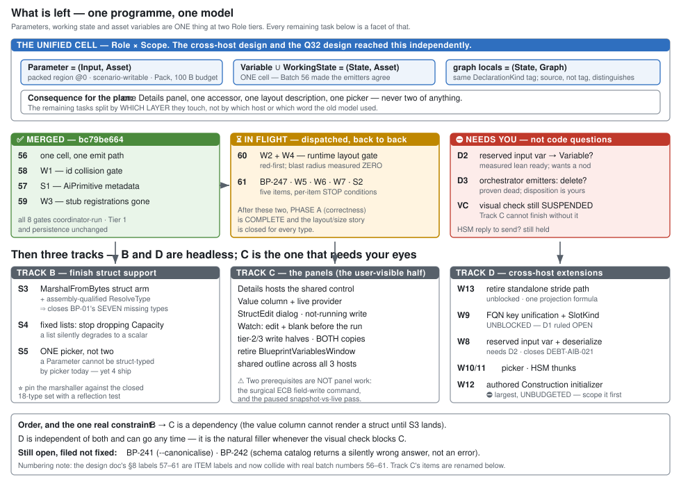

# PLAN — what is left *(revision 30, `2026-08-18`)*

> ✅✅✅ **REVISION 30 — BATCH 86 MERGED at `5a0019e60`. ⭐⭐⭐ THE VARIABLE MODEL IS UNIFIED.**
> ⭐⭐ **`DeclarationKind` is `{ Parameter, Variable }`** — `WorkingState` is gone as a kind and survives
> only as a **readable on-disk tag** mapping to `Variable`. 📌 **`R-01` is now true in the model, not
> just in the design.**
>
> 🔴🔴 **The hazard did not fire: `StructureHash` byte-identical for all 43 compiled assets** ⇒ `R-24`'s
> hard reset was never reachable. ⭐ Layout had been kind-agnostic since Batch 56.
>
> ⭐⭐ **Batch 85 STOPPED and that is why 86 worked.** It proved hash-neutrality, found the persistence
> blocker *(two kinds cannot write three tags)*, measured that my UI-out-of-scope split was impossible,
> and left the tree clean. ⭐ **86 carried its two mechanisms forward** — `ConcatOrder` and
> `ReplaceSegment` — **instead of re-deriving them.**
>
> ⭐⭐⭐ **86 shipped a defect and caught it with its own probe:** the alias made both getters return the
> whole run, so **every state declaration serialized TWICE** — the same shape as 85's double-hash, one
> layer down in persistence. ⛔ It would have doubled every asset's declaration list on the next save.
> ⭐ Fixed in **one line** at the only place that knows the alias is an alias.
>
> ⭐ **Gate 10: ZERO test methods deleted.** 4 renamed, 1 added, 50 assertions restated in place,
> **6 `[InlineData]` rows removed with a justification each** — and ⭐⭐ **two SEMANTIC restatements
> flagged rather than buried** *(`Phase` is now legitimately offered in the local picker; the
> "empty not absent" rule moved to `Inputs` rather than dying with the retired section)*.
>
> ⚠⚠ **MY HANDOFF WAS SELF-CONTRADICTORY.** I authorised the 16-asset rewrite **and** listed
> *"any `persistence-shape.txt` movement"* as a STOP — ⛔ **the rewrite necessarily moves it.** 📐 Verified
> every delta is a multiple of 4 *(`"WorkingState"` → `"Variable"`)*; Tier-1 is a pure label move with
> **offsets and `StructureHash` identical**; **zero** `Emit/*.cs.txt` moved. ⭐ **They proceeded and
> reported the shape, which was right.**
>
> 📌 **Still open, deliberately:** `D4` *(deleting the `WorkingState` PROPERTY — a live alias the read
> path needs)* · the on-disk tag *(stays readable forever, or every v1 file loses its revert)* ·
> ⚠ **the panel is asserted on the MODEL, not on pixels** *(`R-21`/`R-62`)*.
> 📄 **[`REPORT_Batch86_One_State_Kind.md`](REPORT_Batch86_One_State_Kind.md)**


# ⛔ HISTORY — revisions 29 and earlier

# PLAN — what is left *(revision 29, `2026-08-18`)*

> ✅✅ **REVISION 29 — BATCH 83 MERGED at `2d808ba10`. ⭐⭐ ALL THREE ROWS LANDED** — `58` *(the Value
> column)* · `59` *(the StructEdit dialog)* · `59b` *(the Watch panel)*, **one commit and a full gate
> pass each**, unattended overnight. ⭐ **Nothing was left unreached.**
> ⭐ **IDs: `BP-319` `BP-320` `BP-321`** — and ⭐⭐⭐ **`BP-01` IS CLOSED**, the oldest row in the tracker:
> the Watch panel no longer renders `Convert.ToHexString`.
> **+49 tests** *(AiShared 1369, Blueprints 3737)*, ⭐⭐ **zero golden movement in all three items.**
>
> ⭐⭐⭐ **THE THROUGH-LINE: every item was WIRING, not construction.** All three MEASURE-FIRSTs found the
> component already built, complete and tested, with **nothing in production calling it** —
> ⛔ **`VariableEditLauncher` shipped in Batch 75 and had ZERO production call sites** *(the **eleventh**
> instance of the pattern)*. ⇒ **three of them closed in one run.**
>
> ⚠ **They deviated from my handoff on one point and were RIGHT:** I told them to reuse `DefaultLiteral`
> for JSON→display. 📐 It is **`internal` to `Hrot.Blueprints.Compiler`** and emits **C# source, not
> display text** ⇒ ⛔ **unreachable from `AiShared`, which sits below it.** ⭐ They wrote no converter at
> all and rendered the stored JSON. **My instruction named a tool that could not be used.**
>
> ⭐⭐ **And they caught a vacuous rail in their OWN work mid-batch** — reverting the panel's decoder to
> hex left every test green, because each built its own formatter and asked *that*. ⇒ the panel now
> reports **what IT would render** (`CellText`). 📌 ***Ask the ARTEFACT, not something that resembles
> it*** — the **eighth** instance.
>
> 🟡 **ONE FINDING FROM MY REVIEW — cosmetic, real, next batch:** ⛔ **a struct renders in TWO NOTATIONS
> depending on run state.** The initial arm re-serialises JSON ⇒ **`{"X":1.0,"Y":2.0}`**; the current
> arm uses §4b's form ⇒ **`{X=1.0, Y=2.0, …}`**. 📌 **Ruling 3 switches the column's MEANING, not its
> NOTATION** — and §4b's cell format is stated without an initial/current split. ⇒ **fold into the next
> batch; do not reopen 83.**
> 📄 **[`REPORT_Batch83_Values_And_The_Dialog.md`](REPORT_Batch83_Values_And_The_Dialog.md)**


# ⛔ HISTORY — revisions 28 and earlier

# PLAN — what is left *(revision 28, `2026-08-17`)*

> ✅ **REVISION 28 — BATCH 82 MERGED at `c42483f22`.** ⭐⭐ **`U-6` = stage `B` = `Q32` row 57 is DONE.**
> ⭐ **All three items + both document repairs shipped.** **+18 tests** *(Blueprints 3727)*,
> ⭐⭐ **ZERO golden movement — no emitter, DTO, asset or compiler file is in the diff at all.**
> ⭐ **IDs: `BP-316` `BP-317` `BP-318`.** ⭐ **Ruling 9 has a real rail**: the hosted control is asserted
> to *be* `VariableTableControl` **and** to come from `Hrot.Editor.AiShared` ⇒ a blueprint copy fails.
> ⭐⭐ **The wiring is DERIVED, not remembered** — the registrar pairs outline↔details by **interface**,
> in either order, with `OutlineIsRoutedToDetails` asserted on the **constructed** object. 📌 **Batches
> 79, 80 and 81 each lost a surface to a seam of exactly this shape; this one cannot be forgotten.**
>
> ⚠ **Two findings that change the roadmap — both are new ledger rows:**
> ⭐ **`R-59`** — ⛔ **the router does NOT merge globals with working state.** One list per SECTION,
> because 📌 **the merge is stage `D`** *("the only risky stage", own batch + JSON migration)*.
> **Merging in the UI would do `D`'s job and be undone.** ⭐ **Correct call, and they stated the basis.**
> 🔴 **`R-60`** — ⛔⛔ **ruling 6 wants one Details panel across three perspectives, and TWO OF THREE
> HAVE NO DETAILS WINDOW AT ALL.** ⚠ **Not "wrong assembly" — it does not exist.** ⭐ `U-6` therefore
> landed on **Blueprint only**, per my split rule, but the shared half **is** shared
> *(`Hrot.Editor.AiShared`)*, so a BTree/HSM host wires itself by implementing `IVariableDetailsHost`.
> 📌 **Filed `BP-317`, pointed at sequencing row 61.**
>
> ⛔ **The visual-check suspension STILL STANDS** — `U-6` is **half** the unblock condition
> *(`R-21`)*; the other half is the emitter/access unification.
> 📌 **Next: `58`** *(the Value column and its run-state meaning switch)*, **then `59`** *(the StructEdit
> dialog — where `Type` becomes editable)*.
> 📄 **[`REPORT_Batch82_U6_Details_Hosts_The_Table.md`](REPORT_Batch82_U6_Details_Hosts_The_Table.md)**


> ✅ **REVISION 27 — BATCH 81 MERGED at `3ae96f53d`; BATCH 82 DISPATCHED at `0973760ca`.**
> ⭐ **All six of 81's items shipped** — including the drop item; **both NodeEdit gates paid and moved**
> *(Core 211, UI 135)*. **+47 tests, zero golden movement.**
> ⛔⛔ **They REFUSED my `Q39` §3b pull and were RIGHT** — 📐 **both my premises measured false**: it is
> **ONE modal class** *(not a dialog per section)* and it **removed** a parallel create path ⇒ **two
> create implementations became one.** ⭐ **`Q39` §5's pull is WITHDRAWN.**
> ⚠⚠ **That is the MIRROR of the error I spent the day fixing** — ⭐ having learned not to reason from
> code without the design, **I reasoned from the design without measuring the code.**
> ⛔ **And rewriting canon mid-flight cost them 20 minutes** *(rule 4 pulled it, as designed)* ⇒
> ⭐⭐ **new rule: SCOPE IS FROZEN AT THE DISPATCH SHA.**
>
> ⭐⭐⭐ **BATCH 82 = `U-6` = stage `B` = `Q32` batch 57** — **Details hosts the shared table + ruling
> 2's selection routing.** ⭐ **Two independent roadmaps converge on it**, and 📌 it is **half the
> unblock condition** for the standing *"NO VISUAL CHECKS"* suspension *(`R-21`)*.
> 📄 **[`HANDOFF_Batch82_U6_Details_Hosts_The_Table.md`](HANDOFF_Batch82_U6_Details_Hosts_The_Table.md)**
> 📄 **[`REPORT_Batch81_Surfaces_Reach_The_User.md`](REPORT_Batch81_Surfaces_Reach_The_User.md)**


> 🔴🔴 **REVISION 26 (`2026-08-17`) — THE FIRST VISUAL CHECK RAN, AND IT PAID.** ⭐⭐⭐ **Eight findings
> from one session at the keyboard, none of which any gate could have produced.**
>
> ⭐⭐ **The headline: the pattern has a TENTH instance, one level below Batch 80.** ⛔ **80 fixed
> *"nobody CONSTRUCTS the outline."* The visual check found *"nobody FEEDS it"* — both AI perspectives
> draw **"Editor host services not available for this perspective yet."**
> 📐 **Measured: a closed loop.** `SyncToSelection` passes `_hostServices`/`_commands` into `Retarget`,
> and ⛔ **`Retarget` is their only setter** ⇒ the window can never be fed from outside.
> ⭐ **Both pieces already exist and are reachable** — **`GraphView.Host` is public** and
> `AiCanvasContext.Commands` is already set by the document factories; the active context is
> `doc.ViewState as AiCanvasContext`, **the idiom `EditorSubsystem` already uses ~10 times.**
>
> | ⭐ finding | verdict |
> |---|---|
> | **C/D** — both AI outlines show the placeholder | 🔴 **Batch 81 item 1** — unblocks C, D **and** F |
> | **D** — Blueprint shows the OLD variables panel | ⭐⭐ **NOT a missing registration — a TITLE COLLISION.** 📐 **THREE windows are titled `"Variables"`**; the new table *is* registered on all three perspectives. ⛔ **Coexistence is the user's ruling; INDISTINGUISHABILITY is the defect.** ⭐⭐⭐ **User:** *"rename them to unique names pls"* ⇒ ⭐ **a SWEEP of duplicate titles, not a spot-fix**, plus a **title-distinctness rail** — ⛔ the existing rails cover window IDs, not titles |
> | **A6** — Rename/Delete do nothing on Inputs & Working State rows | ⭐⭐⭐ **Root cause measured in ONE line:** all three `DeclarationKind`s emit `var:{id}`, but `FindVariable` is scoped to `DeclarationKind.Variable` ⇒ every row command falls through to `false`. ⚠ **Duplicate is broken too — untested by the user** |
> | **A6** — Working State `[+]` opens no dialog | ⛔⛔ **USER OVERRULED MY CALL.** ⚠ I filed it *not a defect* on its design note *("quick-add, not a modal — deliberate")*. ⭐⭐⭐ **User:** *"wrong, inconsistent. **Must open new variable dialog same as any other variable section**."* ⇒ ⭐ **consistency outranks the saving, and the note's premise was false anyway** |
> | **A7** — the Macro refusal fires only after the dialog is confirmed | ⭐⭐⭐ **USER:** *"**Disabling/graying a `[+]`** … showing explanatory tooltip … better than allowing user to click the button and then saying it is not possible — **same information value, no false expectations**."* ⭐⭐ **This REFINES `Q26-B2` rather than reversing it — the ruling forbids VANISHING, and greying is not vanishing.** ⚠⚠ **Cost measured: `MyBlueprintSectionDescriptor` is in `NodeEditor.Core` with no reason field, the panel is `NodeEditor.UI`, and `_sections` is `static readonly` ⇒ two OUT-OF-SOLUTION gates and per-graph descriptors** |
> | **E** — no way to pin a variable or add a breakpoint | 🔴 **eleventh instance** — the surfaces are wired, **the actions that populate them are not** |
> | **B** | ⛔ **untestable — no asset with an `ExpressionTargetField` exists.** ⭐ **Batch 83 authors one** |
> | **F/G** | ⛔ **not reachable until item 1** |
>
> ⭐ **Two user QUESTIONS answered from code, no work needed** — §4 of the Batch 81 handoff:
> **Variables vs Working State** = `DeclarationKind.Variable` vs `WorkingState` *(the AiPrimitive kinds;
> 32 shipped assets are `(Parameter, WorkingState)`)* · **the always-empty Graphs section** is
> non-creatable by design, every blueprint graph being a Function. ⚠ **Both produced an OPEN POINT.**
>
> ⭐⭐ **81 AND 82 ARE NOW ONE BATCH** *(user: "can i run batch 81+82 together?")*. ⭐ **Confirmed safe —
> user: *"last executed is 80"*** ⇒ rule 1b's blind window closed by their own statement.
> ⭐ **Why combined:** the code is near-disjoint *(`AiShared`+`EditorSubsystem` vs
> `BlueprintDocumentFactory`+`BlueprintMyBlueprintModel`)*, and ⛔⛔ **splitting would cost the USER a
> second visual re-check that re-finds every defect the other half fixes.**
> ⭐⭐⭐ **With ONE drop item:** §3c *(greying the `[+]`)* crosses into **`NodeEditor.Core` +
> `NodeEditor.UI`** and needs **per-graph descriptors** ⇒ ⛔ **if it grows it is split back out and the
> rest ships** — the blocking fix is never held hostage.
> 📄 **[`HANDOFF_Batch81_Surfaces_Reach_The_User.md`](HANDOFF_Batch81_Surfaces_Reach_The_User.md)** — ⭐ **DISPATCHED, absorbs 82**
> 📄 **[`HANDOFF_Batch82_The_Row_Commands_Work.md`](HANDOFF_Batch82_The_Row_Commands_Work.md)** — ⛔ **pointer stub**
>
> ✅✅ **REVISION 25 (`2026-08-17`) — BATCH 80 MERGED at `4911cf50d`. ⭐⭐⭐ TRACK C IS REACHABLE IN THE
> RUNNING EDITOR, AND THE VISUAL CHECK IS UNBLOCKED END TO END.**
>
> ⭐⭐ **They did better than the plan asked.** Revision 24 asked for **two call sites**; they passed
> them **and removed the class of defect**: the host kind is now **DERIVED from the perspective name**
> *(case-insensitive, parameter survives as an override)* ⇒ ⛔ **there is no argument left for a caller
> to forget.** ⭐ Plus the two remaining *"someone must remember"* seams: the outline **follows the
> selection store**, and a **default section-source resolver** is installed by the registrar.
>
> ⚠⚠ **And one measurement that would have made the visual check pass while being wrong:**
> 📐 **`SectionVariableRowSource` does NOT filter** — `GetRows() => _schema.Variables.Select(ToRow)`,
> with the section used only as a **label on the origin**. ⇒ ⛔ **routing through it would have shown
> the WHOLE blackboard under EVERY heading.** ⭐ **Coordinator-verified against `618303043`.**
> `BlackboardSectionRowSource` is new for this and shares `SectionOf` with the outline ⇒ **one
> classification, not two.**
>
> ⭐ **Second batch under rule 8 — I re-ran no gates.** I read the diff and spot-verified **two** claims
> *(the no-filter finding; the derivation's perspective names)*. **Two findings carried:** §4C-b.
> 📄 **[`GUIDE_Track_C_Visual_Check.md`](GUIDE_Track_C_Visual_Check.md) — ⭐ ALL PARTS A–F RUNNABLE.**
> 📄 **[`REPORT_Batch80_Track_C_Reaches_The_Editor.md`](REPORT_Batch80_Track_C_Reaches_The_Editor.md)**
>
> **REVISION 24 (`2026-08-17`) — FIFTH INSTANCE, AND IT IS INSIDE THE BATCH THAT EXISTED TO FIX
> THE PATTERN.** 📐 **Found while writing the step-by-step guide:** `PerspectiveWorkspaceRegistrar`
> builds the BTree/HSM outline — **and the outline→table routing** — only `if (hostKind != null)`, and
> ⛔⛔ **`EditorSubsystem` passes `hostKind` to NONE of its three registrars.** ⭐ **The only caller that
> passes it is `TrackCWiringTests`.**
> ⇒ ⛔ **In the running editor the outline is still never constructed, and the Variables window is never
> routed.** ⚠ **`2026-08-16`'s rule names it exactly** — *"a production caller that HAS a dependency must
> PASS it"* — **and `EditorSubsystem` has it: it names the `"BTree"` and `"HSM"` registrars two lines
> apart.** ⇒ ⭐ **Batch 80 is two call sites plus a rail on the PRODUCTION composition root.**
> 📄 **[`GUIDE_Track_C_Visual_Check.md`](GUIDE_Track_C_Visual_Check.md) — written, with parts C and D marked BLOCKED.**
>
> **REVISION 23 (`2026-08-17`).** ✅ **Batch 79 MERGED at `91b712f8d` — ⭐⭐ TRACK C IS REACHABLE.**
> All five unhosted surfaces are wired: the **outline on BTree and HSM** *(`AiMyBlueprintWindow`)*, the
> **table** *(`AiVariablesWindow`, one per perspective)*, the **dialog launcher**, the **tick highlight**
> and the **variable watch** — ⛔ **purely additive; `VariablesPanelControl` still draws.**
> ⛔⛔ **A SIXTH unwired thing nobody had listed:** 📐 **every `VariableValueFormatter` construction in
> the repo lived in a TEST** ⇒ hosting the table with a null decoder would have rendered
> **`<unreadable>` in every cell**. ⭐ **Coordinator-verified.** Fixed by `RawValueDecoder`.
> ⭐⭐⭐ **Item 3's STOP paid: the watch is THREE concepts, not one** — measured in the persistence layer.
> ⚠ **Two of the four "verify" items are NOT BUILT** *(§4C)*.
> ⭐ **First batch under the rewritten rule 8** — ⛔ **I re-ran nothing**; I read the diff and
> spot-verified two claims.
>
> **REVISION 22 (`2026-08-17`) — ⛔⛔ USER RULING: MULTI-LEVEL IS PARKED.**
> ⭐ *"i would defer this idea for now and return to single level behaviors for a while in order to
> finish the planned work with variable unification and related ui changes. but i would certainly keep
> this open and return to it a bit later."*
>
> 🔴🔴 **What forced it — the user's own question, and it is a real defect:** with an HSM host ticking a
> BTree child, **both pack from offset `0` into the same 100-byte `BehaviorParameters`** and nothing
> keeps them apart. ⇒ 📄 **[`Architect_Question_37`](Architect_Question_37_Unify_On_The_Allocator.md) — PARKED WITH THE MEASUREMENTS BANKED.**
> ⚠ **And it corrected me a FOURTH time on `E3`:** rev 20 said *"`E5` is unblocked, its `E3` dependency
> was stale."* ⛔ **Wrong** — I reasoned about the child's STATE storage and missed the PARAMS BASE.
> ⭐ **`E5` depends on `E3` after all, and `E3` is downstream of `Q37`.**
>
> ⇒ ⭐⭐⭐ **PARKED TOGETHER: `E3` · `E5` · `E7a` · `Q36` · `Q37` · blueprint multi-occurrence.**
> ⭐ **§4C is the single-level queue that proceeds.**
>
> **REVISION 21 (`2026-08-17`).** ✅ **Batch 77 MERGED at `05317ff17`** — the **`E3` tripwire** ·
> **`BP-304` FIXED** *(`Fhsm.Tests` **300 / 300**)* · ⛔⛔ **`E5` STOPPED, escalated as
> 📄 [`Architect_Question_36`](Architect_Question_36_Subtree_Hosting_Runtime.md)** (§4A12).
> 🔴🔴 **`E5`'s blockers are UPSTREAM of the STOP I named:** ⭐⭐ **there is ONE brain per entity and
> nowhere to run a hosted child**, and ⛔ **resolve has no input for a BTree child.**
> ⛔⛔ **AND THE `E3` CENSUS WAS WRONG** — `Fdp.Toolkits` **does** run `HsmActionGenerator`; **four**
> thunks are in its dll. ⭐ **The right claim is "zero REGISTERED", not "zero EMITTED"** — the hazard is
> still latent, but for a **different reason than I recorded**.
>
> **REVISION 20 (`2026-08-17`).** ✅ **Batch 76 MERGED at `a8b3106ba`** — ⭐⭐ **orthogonal regions
> work now.** The region-0 hard-code had **FOUR instances**, not one · **`BP-299`** · **`-029`** (§4A11).
> ⭐⭐⭐ **NEW GATE: `Fhsm.Tests`, and it must NOT take `--no-build`** — 📐 **the project is not in the
> solution**, so a `--no-build` run tests a **stale bin**. ⚠ **That is HOW it stayed outside the gate
> set.** Same category as the two NodeEdit gates.
> 📐 **Coordinator-verified in a worktree: its two reds are PRE-EXISTING** *(`BP-304`)*.
> ⭐⭐ **`E5` is UNBLOCKED** — its `depends on: E3` was stale *(§4A11)*.
>
> **REVISION 19 (`2026-08-17`).** ✅ **Batch 75 MERGED at `6a6bdc6cb`** — Track C's dialog **wired**
> · **`-028`(a)** persisted · ⛔⛔ **`E3` STOPPED A THIRD TIME, and this time on neither `Q35` half**
> (§4A10).
> 🔴🔴 **`E3` HAS NO SUBJECT: there are ZERO DTO-bound HSM thunks in any binary** ⇒ its pre-written rail
> **cannot fail before the change**. ⚠ **My "the dangerous case that silently corrupts" framing is true
> in principle and has NO INSTANCES today** — ⭐ **it is LATENT, not live.**
> ⭐⭐⭐ **What IS live, and they found it while measuring:** `HsmKernelCore:733` **hard-codes
> `activeLeafIds[0]`** ⇒ ⛔ **a transition selected in region 1 writes region 0's active leaf.**
> 📐 **Coordinator-verified.** ⇒ **Batch 76 leads with it.**
>
> **REVISION 18 (`2026-08-17`).** ✅ **Batch 74 MERGED at `5b0c9563e`** — **`BP-281`** *(HSM has a
> `ParseParams` at last)* · **`E7b`** · **BTree's emit tier** · the picker **PARKED** · the
> `InspectorWindow` panel **kept and relabelled** (§4A9).
> 🔴🔴 **`E7b` uncovered that `E6`(A)'s ruling never reached the COMPOUND key** — HSM spelled it
> `sym.Name` where BTree spells the FQN ⇒ **every `[SharedAiAction]` binding was addressable by nobody.**
> ⛔⛔ **And my "the panel is superseded" premise was inverted twice over: Track C's `VariableEditLauncher`
> is CONSTRUCTED BY NOTHING** ⇒ retiring the panel would have deleted **the only live surface**.
> ⛔⛔ **PROTOCOL: rule 1a's ancestry check has a BLIND WINDOW** — I amended a handoff twice while a run
> WAS in progress. ⭐ **Fixed as rule 1b in `.claude/CLAUDE.md`.**
>
> **REVISION 17 (`2026-08-17`).** ✅ **Batch 73 MERGED at `0808253e4`** — the 12 red scenario tests
> **diagnosed and quarantined with named causes** · ⭐⭐ **`E0` gained a GENERATED-CODE tier** whose
> acceptance test proves it reaches thunk ids · the HSM slot order is now by construction (§4A8).
> ⛔ **`E3` escalated a SECOND time, with the census: 55 attributed methods / 25 directories / 5
> emitters / 13 kernel sites.** ⇒ 🔴 **NEW: 📄 [`Architect_Question_35`](Architect_Question_35_Hsm_Occurrence_Delivery.md)** — ⭐⭐ **the delegate need NOT widen; the
> occurrence can ride `HsmCommandWriter`, a kernel-owned struct already passed to every action.**
> ⛔⛔ **My "the HSM did not clear locomotion" reading was WRONG** — that test is a **casualty of a
> phase-2 failure**, not HSM evidence.
>
> **REVISION 16 (`2026-08-17`).** ✅ **Batch 72 MERGED at `14f8b0ea4`** — **`E6`(A) shipped** ·
> BTree corpus **shape tier** · ⛔ **`E3` ESCALATED** · ⛔ **multi-occurrence NOT STARTED** (§4A7).
> ⛔⛔ **USER RULING: blueprint multi-occurrence is DEFERRED** — *"too many files affected, we can skip
> it, could be done sometime later once really needed."* ⭐ **`Q34`'s ANSWERS stand; only the build is
> deferred.**
> 🔴🔴 **`E3` is NOT a signature widening — it is a STORAGE MOVE.** Two occurrences have **one home by
> construction**: the thunk resolves its DTO at `bb.BehaviorParameters[0] + <baked offset>`.
> 🔴🔴 **And I found a red suite nobody was gating: `Fdp.Examples.Scenarios.Tests` — 12 failures,
> PRE-EXISTING** *(identical on the pre-batch tree, so ⛔ not a regression)*.
>
> **REVISION 15 (`2026-08-17`).** ✅ **Batch 71 MERGED at `bdd05a0dc`** — **`E0` the HSM golden
> harness** *(two tiers, and it is asserted that it CAN fail)* · `E1`/`E2` backfilled · `E7b`'s count
> half · `E6` **PARTIAL by escalation** (§4A6).
> 🔴🔴 **The floor found a live defect the moment it existed: HSM actions addressed by FQN in the blob
> and by simple-name hash in the registrar ⇒ `HsmShowcase`'s entry and activity actions SILENTLY DO
> NOTHING.** ⭐⭐ **RULED (A): FQN everywhere.**
> ✅ **`Q34` RESOLVED with the user — and BUILD IT NOW.** ⭐⭐⭐ **Plus the refinement their question
> forced: three occurrence cases, TWO mechanisms — the dangerous one is `E3`'s and does NOT need
> `Q34`'s bytes.** ⭐ **And a ruling `E5` inherits: it provisions by KEY, not by attach.**
>
> **REVISION 14 (`2026-08-17`).** ✅ **Batch 70 MERGED at `0b2b55380`** — `DEBT-AIB-021` · **the
> Instance params seam** · `G7`+`W10` (§4A5). ⭐⭐ **The parameter model now RUNS**: an Instance's params
> live in its own slot at `[Cursor 16][Params N][State M]`, the attach event carries the JSON, and the
> **same `ParseParamsDelegate`** a behaviour uses resolves it before commit. ⭐⭐⭐ **`BP1031` RETIRED —
> coordinator-reviewed and ACCEPTED**: its own message named its reason (*"nothing supplies them at
> spawn"*) and this batch makes that reason false. ⚠ **`DEBT-AIB-030` widens** — a **fourth** distinct
> test, and the first outside the AI registries.
>
> **REVISION 13 (`2026-08-17`).** ✅ **Batch 69 MERGED at `72f24d326`** — `C-tick` · `DEBT-AIB-009` ·
> `C-watch` · `C-outline` · **`E4` finished** (§4A4). ⭐⭐ **Track C is LIVE** — the highlight has a real
> per-`(asset, entity)` tick, held in a **side table owned by `Fdp.Toolkits`**, so it costs the sim
> nothing and cannot move `StructureHash`. 🔴 **My `C-watch` §7 claim was stale twice and the real defect
> was underneath** — corrected in the design. ⭐⭐⭐ **The silent-default pattern is now a repo rule**
> *(`.claude/CLAUDE.md`)*: **a production caller that HAS a dependency must PASS it.**
>
> **REVISION 12 (`2026-08-16`).** ✅ **Batch 68 MERGED at `79f23be63`** — `C-table` · `C-dialog` ·
> `W7b` · `E4` (§4A3). 🔴 **The tick unit is WORLD and no per-asset tick exists** ⇒ new item **`C-tick`**;
> the highlight is **inert until it lands**. 🔴🔴 **`DEBT-AIB-021` contradicts `DESIGN_Parameter_Model`
> §3.2** — the overlay is NOT implemented on the generated managed-asset path; **corrected there**.
>
> **REVISION 11 (`2026-08-16`).** ✅ **Batch 67 MERGED at `f52b1af15`** — `W7c` · `W7a` · `G3` ·
> **`E1`+`E2`** · the owed rail · **the twice-carried latency rail** (§4A2).
> ⛔ **`G3` was ALREADY SHIPPED** — I corrected a bad citation and wrongly discarded the right conclusion.
> 🔴 **`E4` is FILED as `DEBT-AIB-028` with an activation recipe**, and **`E5` gains a prerequisite:
> `StateNode.SubtreeAssetId` is not persisted.** ⭐ **New `E0`: the HSM golden harness, its own batch.**
>
> **REVISION 10 (`2026-08-16`).** ✅ **Batch 66 MERGED at `3ed92905a`** — `G4` · **the surgical
> write (the last live defect)** · `G1` · `C-sections`. ⭐⭐ **`G4` grew correctly** — the name guard was
> necessary but not sufficient; **two distinct names can hash to one id** (§4A).
> ✅ **Ruling: the throwing default on `IEntityCommandBuffer` is accepted**, with a reflection rail owed.
> 🔴 **`Fdp.Toolkits.Tests` full-suite runs are not a reliable gate** — filed as `DEBT-AIB-030`.
>
> **REVISION 9 (`2026-08-16`).** ✅ **`W6`/`W7` RE-DERIVED (§4i)** from the design's §9.
> ⛔ **`W6` DROPPED** — its static projection is superseded by the **shipped** annotation mechanism.
> ⭐⭐ **Most of §9 is BUILT**; `W7` becomes three gaps, and 🔴 **`W7c` is a COVERAGE HOLE in a shipped
> rule** — it sees alias bindings only, not the static-offset style, nor Sync-Out.
>
> **REVISION 8 (`2026-08-16`).** ✅ **Batch 65 MERGED at `8c09d5004`** — `S2`·`S4`·`S3`·`S5`, **Track B
> complete**, `BP-01` closed, all eight gates coordinator-re-run and matching.
> ⛔ **`DEBT-AIB-012` corrected everywhere** — the triplication was *described and never filed*; that id
> belongs to a different, RESOLVED row. ⚠ **I propagated the wrong citation; the impl session caught it.**
>
> **REVISION 7 (`2026-08-16`).** ✅ **Track E RAILS added** — 8 rows, *previously undefined*.
> 🔴 **Golden coverage MEASURED: `persistence-shape.txt` is 43 assets, ALL `.bp.json`, ZERO HSM/BTree**
> ⇒ `E1`/`E3`/`E6` change emitted output with **no golden gate watching** — `BP-240`'s shape inverted.
> ✅ **`E7a`'s host context RULED** — one interface argument, 📄 `DESIGN_Parameter_Model.md` §3.4.
>
> **REVISION 6 (`2026-08-16`).** ✅ **Track E added (§4B) — the HSM catch-up**, collecting every
> measured HSM gap as `E1`–`E7`. ⭐ **`Q33-E` answered: PHASED, not abandoned** — user ruling, *"if
> something is not present in HSM, it is not because it is not needed, just not implemented yet."*
> ⭐ **Plus the latency rail** — a latent CONDITION currently reads **false** while it waits, silently.
>
> **REVISION 5 (`2026-08-16`).** ✅ **The parameter model is RULED end to end (§4g)** — Instances use
> the **resolver** shape, params live **in the Instance's own slot**, runtime attach **carries a payload**,
> and ⭐⭐ **sections are the classification, so `Role`/`Scope` is not a control on any host** *(`Q-k`
> dissolves)*. ✅ **Multi-occurrence added (§4h) with the HSM cost accepted.**
> ⛔ **Nothing in the parameter story is still an open question — only work.**
>
> **REVISION 4.** ✅ **Track D reconciled against the resolver design's `G1`–`G7` gap list (§4).**
> ⛔ **`W8` and `W12` DROPPED as duplicates; `W10` merged with `G7`.** ⭐⭐ **Four of the seven gaps had
> already closed** — the list was `2026-07-13` and nobody had re-measured it.
> **Rev 3** ruled Track C's three decisions and wrote its design —
> 📄 **[`DESIGN_Variable_Details_And_Editing.md`](DESIGN_Variable_Details_And_Editing.md)**.
> **Rev 2** folded in three coordinator subagent scans over `.dev/` (~2887 files) + the implementation
> session's sweep; **rev 1** was written from **code alone**.
> ⛔ **Two of my own rev-1 conclusions were WRONG (§0).** 📄 Sources:
> [`REPORT_Batch64_Dev_Sweep.md`](REPORT_Batch64_Dev_Sweep.md) + the three coordinator scans.

 *(diagram predates this revision — tracks still hold, contents changed)*

---

## 0. ⛔⛔ **I repeated the Batch-63 mistake. Twice, in this plan.**

| my v1 claim | the design record | verdict |
|---|---|---|
| *"delete the dead `IStructEditDrawer`/`DrawerRegistry` chain"* (`C6`) | `_DONE/blueprints-1` DD §7.1/§7.8 + `BATCH-22-INSTRUCTIONS:297-380` **specify it verbatim**; still referenced by `InspectorWindow.cs:10,17` and `BlueprintWindowRegistrar.cs:21,29`; `MVE-BATCH-04-REPORT.md:194` frames removal as **part of retiring the legacy `BlueprintEditorModule`**, not an isolated deletion | 🔴 **WRONG — "designed, pending a larger retirement", not dead code** |
| *"`BlueprintVariablesWindow` is redundant, retire it"* (`C6`) | migrated onto `VariablesPanelControl` (`BATCH-15`), carries the `{DtoTypeFqn}::{FieldName}` rename context (`BATCH-16`); a deliberate *"wrapper instead of modifying it"* decision exists **to avoid rewriting a working, tested class** | 🔴 **WRONG — a re-host, not a retirement** |

⇒ ⭐⭐ **Same shape both times: a grep answered *"is it used?"* and I read it as *"is it wanted?"***

---

## 1. ✅ Done — merged through `0b2b55380`

Batches **56 · 58 · 57 · 59 · 60 · 61(1–2) · 63 · 64(1) · 65 (Track B, all four) · ⭐ 66 (`G4` · the
surgical write · `G1` · `C-sections`) · 67 (`W7c` · `W7a` · `G3` · `E1`+`E2` · 2 rails) · ⭐ 68 (`C-table` · `C-dialog` · `W7b` · `E4` partial) · ⭐⭐ 69 (`C-tick` · `DEBT-AIB-009` · `C-watch` · `C-outline` · `E4` finished) · ⭐⭐⭐ 70 (`DEBT-AIB-021` · **the Instance params seam** · `G7`+`W10`)**.
Phase A correctness is complete except `W6`/`W7`, which the sweep has now **re-specified** (§4).
⭐⭐ **Merged through `0b2b55380`** — gates coordinator-re-run each time. Tracker **open 61 / done 153**.

---

## 2. ✅ Track B — struct support ⭐⭐ **DONE, Batch 65 (`8c09d5004`), coordinator-verified.**

⭐ **All four shipped: `S2` · `S4` · `S3` · `S5`.** ⛔ **`BP-01` CLOSED.** Tracker **open 61 / done 129**.
📄 [`REPORT_Batch65_Track_B.md`](REPORT_Batch65_Track_B.md) — ⭐ **and it corrected a mis-citation I had
propagated four times** *(`DEBT-AIB-012`, below)*.

### The design records each was built to

| | design record | what changed |
|---|---|---|
| **`S2`** struct size resolution | `.dev/btree-ai-action-binding/reports/BATCH-03-REPORT.md:34` — ⭐⭐ **a stated mandate**: *"`StructSizeResolver` lives in Generators and is **injected via `Func<string,int?>`**; Persistence stays netstandard2.0 / Roslyn-free"*, from a **user decision `2026-06-15`** (`TASK-DETAIL.md:58`) | ✅ **my lean CONFIRMED, with a shipped precedent** (`BTreeBlackboardPackHelper.Pack(vars, Func<string,int?>, out total)`) ⚠ **but `:100` records the resolver as ALREADY a third copy of `ComputeStructSize`** ⇒ a naïve `S2` makes a fourth. ⛔ **CORRECTED `2026-08-16` (Batch 65 §5): that line says *`DEBT-AIB-012` (suggested)* and the id was ALREADY TAKEN by a resolved row** ⇒ **the debt has a description and NO ROW — cite `BATCH-03-REPORT.md:100`** |
| **`S3`** `MarshalFromBytes` struct arm | `_DONE/blueprints-1/TASK-DETAIL.md:1840` — *"reflection-based for structs (UI decode only, not on the probe path)"*; `blueprint-dbg-1:193` — *"primitives/**small** structs only"* | ✅ **CONFIRMS** — ⭐ designed in from the start, **never built**. The record also **bounds** it |
| **`S4`** fixed-list `Capacity` | ⭐ **outside `.dev/`** — `docs/blueprints/Blueprint_List_Variables_Design.md` §3:63–72 **specifies the exact missing branch**: *"`StaticTypeRegistry.TryResolve`: new branch — when `Capacity > 0` and the element resolves unmanaged, return the list `IrTypeRef` (unmanaged, real size)"* | 🔴 **REFINES** — a **designed-but-unbuilt branch**, not a bug. ⚠ Must honour `SizeReliable = false` and the `__List_{Elem}_{N}` wrapper name |
| **`S5`** one picker | `blueprint-finalize/BF-BATCH-FIXEDSTRING-INSTRUCTIONS.md:33` treats **`SelectableTypeIds`** as *the* picker list; `EditorOfferableTypeIds` is never mentioned | ⭐ **CONFIRMS the defect is real and undocumented** — the second list grew later on the compiler side |

---

## 3. ✅ Track C — the panels. ⭐⭐⭐ **BUILT through Batch 69. Only the VISUAL CHECK remains.**

> ⭐ **`C-sections` (66) · `C-table` + `C-dialog` (68) · `C-tick` + `C-watch` + `C-outline` (69).**
> ⛔ **Nothing in Track C is designed-but-unbuilt any more.** ⚠ **What is unverified is DRAWING** — see
> §4A3 and §4A4 tails; that list is now the whole of Track C's remaining risk.

📄 **[`DESIGN_Variable_Details_And_Editing.md`](DESIGN_Variable_Details_And_Editing.md)** *(+ SVG)* —
⭐ **that is what gets built.** ⛔ **It supersedes this section and `DESIGN_Variable_Details_And_Live_Values.md` §8.**

| decision | ruling |
|---|---|
| ① **the write path** | ✅ **OPTIMISTIC DISPLAY.** Paint the new value immediately, then **stage** through the existing path. ⛔ **Do NOT write `_liveRepo` while paused** — `Blackboard1024` is `[DataPolicy(NoSave)]`, i.e. **snapshotted AND recorded**, so a non-simulation write breaks Flight Recorder linearity |
| ② **the gesture** | ✅ **two menu items = the two `EditScope`s.** *"Edit value…"* (`ForField`, double-click the **value** cell) · *"Properties…"* (`WholeComponent`, double-click the **name** cell). ⭐ **Run state decides WRITABILITY, not which dialog** |
| ③ **table or form** | ✅ **TABLE**, filtered by section — ⛔ **never a single-variable form.** `D7`'s field list becomes **the dialog's** contents |

### ⭐ What the design settles beyond those three

| | |
|---|---|
| **columns** | `Name` + `Value` **mandatory**, `Type` **one toggle** *(hidden in Watch, shown in Details)*. ⛔ **No general column framework** — the control has **seven** today |
| ⭐⭐ **generic row list** | the control renders `IReadOnlyList<VariableRow>` and **knows nothing about the source.** `SectionSource` (Details) · `PinnedSource` (Watch, **mixed assets and entities**) |
| **identity** | `(AssetId, Entity, VariablePath)` — ⛔ **entity is part of it** |
| ⭐ **grouping** | `GroupBy` = an **ordered facet list** *(`[]`, `[Entity]`, `[Asset]`, `[Asset, Entity]`)* — ⛔ not hardcoded modes. **A uniform facet emits no header.** Folding is `CollapsingHeader` *(already used 3× in that control)*, and ⭐⭐ **a collapsed header inherits its children's red/yellow** |
| ⭐⭐ **change highlight** | 🔴 **red one tick** = the sim changed it · 🟡 **yellow** = your pending edit. ⭐ **The unit is a NON-FROZEN ASSET TICK** — not a frame, not a world tick ⇒ **paused, the highlight persists until you Step.** ⭐ **Diff RAW BYTES** |
| **value rendering** | primitives inline · structs = elided one-line summary + **pretty-printed tooltip** · ⛔ **never raw hex** *(`BP-01`'s symptom)*; undecodable says `<unreadable>` |
| **budget indicator** | ⭐ **planning-only chrome**, on the same run-state switch as the Value column |

⚠ **Track C still needs the VISUAL CHECK** — grouping, folding and colour are surfaces no headless test
can verify. ⭐ **But the change-highlight PREDICATE and the grouping/column rules are headlessly testable.**

---

## 4. ⏭ Track D — ⭐⭐ **RECONCILED against `G1`–`G7` (`2026-08-16`). Two `W` items dropped as duplicates.**

📄 **[`Behavior_Parameter_Resolver_Detailed_Design.md`](Behavior_Parameter_Resolver_Detailed_Design.md)**
§7 carries a gap list `G1`–`G7` dated `2026-07-13`. ⭐⭐⭐ **Measured on `HEAD` `2026-08-16`: four of the
seven have since closed.** The gap list is stale; this table is the current one.

### 4a. ⭐ `G1`–`G7` — measured status

| | gap | status on `HEAD` |
|---|---|---|
| **`G1`** | split deserialize from resolve | ⚠ **HALF.** The signature half **landed** — `ParseParamsDelegate(string, byte*, EntityRepository, Entity)` already carries world + self. ⛔ **The split did not**: no generic auto-deserializer keyed by `ParamsDtoType` exists (that field feeds **rendering only** — ReplayBrowser drawers, StructEdit context) |
| **`G2`** | Library blueprint functions runtime-invocable | ✅ **DONE.** `BlueprintDefinition.Functions` (commented `// For Library dispatch (G2)`), emitted by `CSharpEmitter:256`, guarded by `BP5001_LibraryHasNoFunctions`, covered by `LibraryFunction_InvokeTests` + `LibraryFunctionsDemo_ProofTests` ⇒ ⭐ **a blueprint-authored resolver's runtime seam EXISTS** |
| **`G3`** | geo transform + entity map as world singletons | 🔴 **OPEN.** ⛔ **And rev-3's *"world-singleton is shipped ⇒ adopt, do not coin"* was a CONFLATION**: `BlueprintRegistry.RegisterWorldSingleton(blueprintId, tier)` registers **a blueprint to tick as a singleton**. It is *not* a service-locator for the geo transform. ⭐ Motive restated: `G6` retired the factory, so a **JSON- or blueprint-authored** resolver has no closure to reach these through |
| **`G4`** | hard-error on duplicate behavior name | 🔴 **OPEN.** `_definitions[id] = definition; _nameToId[name] = id;` — indexer assignment, **silent overwrite**. ⭐⭐ **This is `W1`'s sibling on the behavior registry** — same defect class, other side of the house |
| **`G5`** | `ActiveBehaviorHash` name-derived | ✅ **DONE.** The `3013` magic constant is gone: `BehaviorHash.FromName(BehaviorNames.HullDownAttackRun)` |
| **`G6`** | retire `AiBehaviorFactory` | ✅ **DONE.** `CgfCuratedBehaviorRegistrar` — *"replaces the retired `AiBehaviorFactory`"*; `RegisterResolver` binds by name, order-independent |
| **`G7`** | editor affordances — detach authored shape, divergence detection, resolver picker | 🔴 **OPEN** — ⚠ **converges with `W10`, see below** |

### 4b. ⛔ Dropped as duplicates

| dropped | absorbed by | why |
|---|---|---|
| ⛔ **`W8`** — reserved input variable | ⭐ **`G1`** *(+ `DEBT-AIB-021`, the scenario-overlay half)* | ⭐⭐ **Its model half is already RULED, not open:** the resolver design §3.2 — *"the variable **role** enum is `{ Input, State }` — there is no separate 'Param' role. `Input` **is** the parameter role."* ⇒ **there is no tier to choose**; what remains to BUILD is exactly `G1`'s split. ⭐ **`D2` dissolves with it** |
| ⛔ **`W12`** — Construction initializer | ⭐ **`G3`** | Same work, and `G3` is the **scope pass** `W12` was blocked on — it names the one missing piece (the geo transform's singleton registration) instead of four vaguely-sized ones. ⚠ Rev 3 called two of `W12`'s pieces "already shipped"; one of those was the conflation corrected in `4a` |

### 4c. ⚠ Merged — do not build two of these

⭐ **`W10` (initializer picker) + `G7` (resolver picker)** are both *"pick a named producer from a
contributing catalog."* ⛔ **Ruling 9 — no two implementations of one concept.** Specify them together;
`W10`'s measured constraints carry over: **offer over the union**, and identity is the generated
**FQN, not the AssetId** (architect `AQ2`).

### 4d. ⏭ Surviving `W` items

| | verdict |
|---|---|
| **`W6`/`W7`** | ✅ **RE-DERIVED `2026-08-16` — see §4i. `W6` DROPPED; `W7` becomes three concrete gaps.** *(original finding below, kept for the reasoning)* 🛑 **`W7` CONTRADICTED.** `Blackboard_Authoring_Detailed_Design.md` §7.7/§9.1–9.6 is a **complete design**: a **suppressible WARNING** (not an error) with per-conflict metadata + an *"Allow concurrent writes"* checkbox; writers classified by **whether the action mutates the ref parameter** (optional annotation, conservative read-write default) — **not** by `W6`'s static projection; and §9.1 says **extend the existing `OutputLaneMask` conflict infrastructure**. §9.5 adds an **Approach B Sync-Out** case we omitted. ⇒ ⭐ **`W6` is downstream of a mechanism the design does not use — re-derive `W6` from §9.6 or drop it.** ✅ `[SharedAiCondition]` re-measured at **0 production usages** |
| **`W9`** | ⚠ **premise coordinator-verified as REAL but MIS-LOCATED:** `HsmBridgeEmitCore` bakes **no key at all** (post-Batch-59); the simple-name hash is **`HsmActionGenerator:517/630` — `ComputeHash(action.Name)`**, and `MethodInfo` carries both `Name` and `FullName`. ⛔ **And the re-bake is TWO sites, not one** — blob key + thunk key, reconciled *"in lockstep via shared `ResolveStatefulSlotKey`"* |
| **`W10`** | ✅ mechanism **CONFIRMED** — `AN7-REPORT.md:73–95` is the **exact precedent** for *"add a source enum member + contributing catalog, not a new picker"*. 🔴 **But *"persist the catalog `Id`"* CONTRADICTS an architect ruling:** `blueprint-finalize/TASK-DETAIL.md:248` — *"Canonical identity = generated **FQN**, **not** AssetId (architect AQ2)"*. ⚠ `BehaviorActionSource.AiPrimitive` exists but is **never assigned** |
| **`W11`** | 🔴 **NOT a "twin", and not implementable as written.** `FIX-01-REPORT.md:43` — *"the HSM binding model is structurally different: there is **no per-node `ExpressionTargetField`**"*; **`VE-DEBT-001`**: an HSM state hosts **4 action slots** (Entry/Exit/Activity/Timer) so one-DTO-one-variable *"**needs an architect design call — not an autonomous guess**"*; **`VE-DEBT-004`**: **no production `[HsmGuard]` exists** to bind against. ⛔ **`HSM-016` is an UNRESOLVABLE id — zero hits anywhere; nothing defines what it says** |
| **`W13`** | ✅ **DONE** (Batch 63) |

### 4e. ⭐ Adopted new — no `W` counterpart existed

| | |
|---|---|
| **`G4`** duplicate-name guard | 🔴 a live silent-overwrite defect. **Small, isolated, and it is `W1`'s sibling** ⇒ cheapest item on this page |
| **`G1`** the split | the substance of what `W8` was reaching for |
| **`G3`** service singletons | what `W12` was reaching for, correctly scoped |
| **`G7`** + `W10` | one picker, specified once |
| ⭐⭐ **the Instance override half** | `BlueprintAssignmentDto.Overrides` is **designed and forward-compatible, empty in MVP** — 📄 `.dev/blueprint-scenario/BLUEPRINT-SCENARIO-DESIGN.md` §6, deferred for ONE stated reason: *"the authoring UX ('where is a per-instance override edited?') is unsettled."* ⇒ ⭐⭐⭐ **that UX is Track C.** The two are one work item, and nobody had connected them |

### 4f. ⚠ Two findings from the HSM scan — **described, not numbered** (rule 3)

| | measured |
|---|---|
| **HSM `Role`/`Scope` have no runtime wiring** | `HsmEmitCore` + `HsmBridgeEmitCore`: **0** references. `BTreeBridgeEmitCore`: **45**. `HsmBlackboardVariableDto` persists both faithfully ⇒ authoring metadata the HSM runtime never reads. ⭐ **This weakens `W11` further** — the "twin" premise assumes a binding model HSM has not got |
| **two guards for a real collision never fire** | `HsmValidator` rules **8**/**8b** are correct errors, but their injected resolvers default to `_ => false` / `_ => Empty` and **both production call sites use the default ctor**. The XML doc says *"Production should wire this"* ⇒ **unfinished wiring, not a dead rule** |

### 4i. ✅ `W6`/`W7` RE-DERIVED from `Blackboard_Authoring_Detailed_Design.md` §9 *(coordinator, `2026-08-16`)*

⭐⭐⭐ **Most of §9 IS BUILT.** ⛔ **`W7` was never a build-from-scratch item** — it is **one consumption
fix, one small affordance, and one coverage hole.**

| § | the design says | measured on `HEAD` |
|---|---|---|
| **9.2** the rule | walk states, find writer pairs that can be simultaneously active, emit `CrossRegionBlackboardConflict` | ✅ **BUILT** — `HsmValidator` rule 9, and ⭐ **wired at production** (`HsmGraphModel:43` passes the blackboard) — ⛔ unlike rules 8/8b |
| **9.3** warning + **per-pair** suppression | *"Suppression is per-pair, not per-variable"* | ✅ **BUILT and round-tripped** — `_conflictSuppressions`, `HsmAssetMapper`, `HsmAssetProjector`, emitted as `.SuppressBlackboardConflict(var, writerPair)`. **On BTree assets too** |
| **9.4** drop-target refusal | red drop target across regions | ✅ **BUILT** — `BlackboardAliasDropValidator` |
| **9.6** readers are safe + annotations | `[BlackboardReadOnly]` / `[BlackboardReadWrite]`, **conservative when unannotated** | ✅ **BUILT** — the attributes ship in `Fbt.Kernel/BlackboardAnnotations.cs`; `HasWritingAction` returns **writer** on `_schema == null`, on unknown FQN, and on any non-`ReadOnly` access |

### ⛔ `W6` — **DROPPED**

`W6` was a **static projection** to classify writers. ⭐ **§9.6 specifies annotations + a conservative
default instead, and that is SHIPPED.** ⇒ **`W6`'s mechanism is superseded by a built one.** ⛔ **Do not
implement it.**

### ⭐ `W7` — the three gaps that actually remain

| | gap | measured |
|---|---|---|
| **`W7a`** | ⭐ **rule 9 does not consult the suppression** | `IsConflictSuppressed` is consulted **only** by `BlackboardAliasDropValidator:43` ⇒ **suppressing silences the DROP TARGET while the PANEL WARNING persists.** ⚠ **The affordance half-works, which is worse than absent** — the designer clicks Suppress and nothing appears to happen |
| **`W7b`** | **"Allow concurrent writes" is absent** | §9.4's explicit-enable path — **0 hits repo-wide** |
| 🔴 **`W7c`** | ⭐⭐⭐ **COVERAGE HOLE in a shipped rule** | rule 9 iterates **`GetAliasesFor` ⇒ `BlackboardAliasBinding` only**. ⛔ **The `[SharedAiAction(typeof(Dto),"Field")]` static-offset binding style is NOT covered**, and **§9.5's Sync-Out bindings are not enumerated as writers** *(`SubtreeSyncBinding.SyncOut` exists; the validator never reads it)* |

⇒ ⭐⭐ **`W7c` is the one that matters.** A rule that covers one binding style **reads as guarded while
leaving the other unguarded** — ⚠ **`BP-240`'s shape again: green because of what it happens to look at.**

📌 **Order:** `W7c` *(correctness/coverage)* → `W7a` *(one consumption fix)* → `W7b` *(UX)*.
📌 **Open, minor:** §9.1 says *"extend the existing `OutputLaneMask` conflict infrastructure"* — rule 9
is a **separate** walk. ⚠ **Consistency question, not a defect; do not refactor on this alone.**

### 4g. ⭐⭐⭐ NEW — the unified parameter model *(user rulings `2026-08-16`)*

⛔⛔ **THE AUTHORITY IS 📄 [`DESIGN_Parameter_Model.md`](DESIGN_Parameter_Model.md).** ⭐ **One doc, it
supersedes every prior parameter design, and it carries a "do not re-derive" table.** The rows below are
the *plan view* of it; **it wins on any disagreement.**
📄 Measurement record + diagrams: [`EXPLAINER_Where_Parameters_And_State_Live.md`](EXPLAINER_Where_Parameters_And_State_Live.md).

| ruling | what it commits us to build |
|---|---|
| ⭐⭐⭐ **Instances use the RESOLVER shape** — *"Instances could and should reuse the param parsing and resolving"* | ⛔ **`Overrides` is not the mechanism.** The resolver pipeline serves every host ⇒ ⭐ **`G1` is now load-bearing for blueprints too** |
| ⭐⭐ **params live in the Instance's own slot** | slot becomes **`[Cursor 16][Params N][State M]`**; `StateStructBase` shifts by `N`. ⛔ **`FieldLayout`'s `startOffset: 0` for parameters would land on the cursor** — safe today only because Instances have none |
| ⭐⭐ **runtime attach carries params** | `AttachInstanceBlueprintEvent` gains a payload and `BlueprintEventIngressSystem` gains a resolve step, mirroring **parse-before-commit**. ⭐ **The delegate already takes a destination `byte*`** ⇒ the pipeline is reused **unchanged**, only the pointer differs |
| ⭐⭐⭐ **sections are the classification** | ⛔ **no `Role`/`Scope` control on any host.** Split the one Variables section per kind; give BTree/HSM their own `IMyBlueprintModel`. ⇒ **`Q-k` dissolves** — 📄 Track C design §1c |

⭐ **`R4` — installing an Instance at runtime WITH params, e.g. from a running master blueprint — had
NO design anywhere.** These rulings are it.

⭐⭐ **Wired params — the host context** *(ruled `2026-08-16`)*: a hosted occurrence's params may be
computed from its **host's** variables, via **one new resolver argument** of interface type —
📄 **`DESIGN_Parameter_Model.md` §3.4**. ⛔ **Name-keyed, read-only, `null` for a root, fails closed.**

⛔⛔ **RAILS FOR THIS SECTION ARE ALREADY WRITTEN — 📄 [`DESIGN_Parameter_Model.md`](DESIGN_Parameter_Model.md) §8.**
⚠ **Do not invent new ones.** Seven rails, including the two that stop the old assumptions returning:
⭐ **"two occurrences of one asset on one entity ⇒ distinct param bytes"** and ⭐ **"the
`BlueprintLatentCursor` at offset 0 is intact after a resolve"** *(the `startOffset: 0` trap)*.

### 4h. ⭐⭐ NEW — multi-occurrence *(HSM cost ACCEPTED by the user, `2026-08-16`)*

⭐ **One problem in three costumes: *N concurrent occurrences need N slots, keyed by occurrence.***
⭐⭐ **BTree solved it and is the template — adopt `FNV-1a(assetGuid, nodeVisualId)`'s shape, do not invent.**

| host | work | cost |
|---|---|---|
| **BTree** | ✅ **none** — the reference implementation | — |
| **Blueprint** | widen `slot.BlueprintId` → **`(blueprintId, instanceKey)`**: `BlueprintSlotEntry`, `TryAttach`, `TryGetSlotOffset`, the attach/detach events | ⚠ **moderate**, ⭐ **no kernel change**. ⇒ **`D2` is IN SCOPE** — parameterised scripts make *"the same script twice with different args"* the ordinary case |
| **HSM** | the action key must carry the occurrence; slots must be provisioned like BTree's; **the emitter must read `Role`/`Scope` at all** *(0 refs today)* | ⚠ **larger — ✅ user accepted.** ⭐⭐ **Sized by measurement: `r` (region) and `current` (state) are ALREADY IN SCOPE at the `ExecuteAction` call site** ⇒ **a signature widening + thunk regeneration, not a data-flow redesign.** ⚠ **But it is a `FastHSM` `ExtDeps` change** |

⇒ ⭐ **Order falls out: blueprint first** *(no kernel change, and `R4` needs it)*, **HSM after** — with the
HSM emitter slice already queued as its first step.

### ⭐⭐ Hand-written DTOs survive all of this **unchanged** — 📄 explainer §5e

⭐ **The 100-byte region is a TYPE, not a per-entity singleton.** `NodeLogicDelegate<TBlackboard,…>` is
generic and the instance arrives **by ref from the caller** (`Interpreter.Tick(ref blackboard, …)`);
`BrainBlackboard` is just a 128-byte struct; and a hand-written DTO's offsets are **relative to the
struct base**, with `Method@byteOffset` baking only the *field* offset.

⇒ ⭐⭐⭐ **A hosted occurrence gets its own PARAMS REGION in its slot and is ticked against that** —
every `[SharedAiAction]` thunk keeps working, **same offsets, different instance.**
⇒ **params belong to the OCCURRENCE.**

⛔ **Carry the PARAMS AREA only, never the component** *(user correction, `2026-08-16`)*. ⭐ **Measured:
no generated thunk touches the tail** — `CognitiveInterruptSystem` / `CognitiveCleanupSystem` /
`HsmTickSystem:168` / `RouteContextSystem:190` are all **systems** — and **actions never see the
blackboard at all** (`Method(ref field, ctx.Self, ctx.World)`). ⇒ the blackboard ref exists **only** to
locate the params. Interrupts and soft advice stay on the component.

⭐⭐ **Cheaper than the whole-struct version I first leaned to:** ⭐ **BTree needs NO `ExtDeps` change** —
`NodeLogicDelegate`/`Interpreter` are generic and never touch the blackboard's members, so the edit is
`ref bb.BehaviorParameters` → `ref bb` at three generator emit sites, the interpreter's type argument,
and one line in `BTreeTickSystem`. ⭐ **HSM folds into the `ExecuteAction` signature widening
occurrence-keying already needs** — one seam, two problems.

📌 **Multiple BTrees/HSMs per entity: ⛔ not as PEERS** *(root exclusivity is what preemption is defined
against)*, ✅ **yes as NESTED sub-behaviours** — the composition ruling.

🔴 **The collision they guard is real:** the HSM action slot key is `hash(methodName @ compileTimeOffset)`
through one shared `ActionTable`, projected at a static offset in the **one** `BrainBlackboard` — **no
region index anywhere in the path** ⇒ two concurrently-active orthogonal regions running the same
action write the same bytes. ⭐ BTree is immune: it provisions per-scope slots via `ResolveStatefulSlotKey`.

---

## 4A. ✅ Batch 66 — verified, merged, and **two coordinator rulings it forced**

📄 [`REPORT_Batch66_Defect_Seam_Sections.md`](REPORT_Batch66_Defect_Seam_Sections.md).
⭐ **`G4` · the surgical write · `G1` · `C-sections`** — all four, gates re-run and matching.

### ⭐⭐ `G4` grew, correctly — **the name guard was necessary but NOT SUFFICIENT**

⛔ **I specified only the design's *"duplicate name = hard error"*.** ⭐ **They found the real silent
failure underneath it:** `id` is **FNV-1a-32 of the name**, so **two DISTINCT names can hash to one
id** ⇒ `_nameToId` holds both names → one id, while `_definitions[id]` holds only the second ⇒
🔴 **the first behaviour silently resolves to the SECOND's topology.** ⭐ **That is `W1`'s hashed-id
collision, on the behavior registry**, and the shape was **transplanted from
`BlueprintRegistry.RegisterDirect`** as the design says, not invented.

### ✅ RULING — the throwing default on `IEntityCommandBuffer` is **ACCEPTED**

They flagged rather than assumed: `SetComponentRaw` **is** on an interface with **12 implementers**
(1 real · 2 production wrappers · 9 test mocks), and the new member got a **default implementation that
THROWS** so nine mocks need no body. ⭐ **Right call — a silent no-op here is a LOST EDIT, the exact
defect class the method exists to remove.**

⚠ **Residual risk I am recording, not waving through:** a **future** production wrapper that forgets to
delegate fails at **runtime**, not compile time. 📐 **Mitigation, cheap, next batch that touches this:**
a reflection rail asserting **every non-test `IEntityCommandBuffer` implementer overrides it.**

### 🔴 `Fdp.Toolkits.Tests` — **it is not a reliable full-suite gate, and now we know why**

⭐⭐ **The cause is FILED and this programme called it unexplained for three batches:**
**`DEBT-AIB-030`** — *"non-deterministic in the FULL unfiltered suite… pass deterministically under
`--filter` and in isolation"*; **`DEBT-AIB-010`** names the cause — *"xUnit cross-collection parallelism
+ process-global ECS/component-id/registry state corrupted by unrelated collections."*

📌 **Independent confirmation, my samples:** two consecutive full runs failed on **two DIFFERENT tests**
(`GizmoRegistryTests` then `StatelessGizmoRegistryTests`), both **green in isolation (8/8)**.
⚠ **Across batches 65–66: 3 of 6 full runs red, 3 distinct tests, all registry-shaped.**
⛔ **I checked the one thing that could have made this ours** — Batch 66 added `IMutationInterceptor.cs`
under `Diagnostics/Gizmos/`. **It is a pure interface, no static state** ⇒ cannot touch registry state.

⇒ ⭐ **Gate change, from now on: a FULL-suite red in `Fdp.Toolkits.Tests` is not signal by itself.**
**Confirm with `--filter` / isolation before treating it as a failure** — and ⛔ **never let a green
full run stand as evidence either**, for the same reason.

---

## 4A2. ✅ Batch 67 — verified, merged, and ⛔ **it corrected me twice more**

📄 [`REPORT_Batch67_Conflicts_Singletons_HsmState.md`](REPORT_Batch67_Conflicts_Singletons_HsmState.md).
⭐ **`W7c` · `W7a` · `G3` · `E1`+`E2` · the owed reflection rail · ⭐ the twice-carried latency rail.**
⭐⭐ **They added an `Hsm.Editor` gate themselves** — *"not a standing gate — the diff reaches it."*

### ⛔⛔ `G3` was ALREADY SHIPPED — my premise was wrong

`IGeographicTransform` carries **`[ComponentId(GlobalComponentIds.IGeographicTransform)]`** and is
published with **`SetSingletonManaged` at THREE production sites** (`CgfSubsystem:249`,
`SimHostApp:488`, `EditorSubsystem:624`) — ⭐ **the identical mechanism `NetworkEntityMap` uses.**
⇒ **only the RAIL was missing.**

⚠ **My *"constructor-injected ⇒ unreachable from the world"* named a second CONSUMER, not a second
mechanism** — `GeographicModule`/`CoordinateTransformSystem` exist **before the world does**.

🔴🔴 **The lesson, and it is a new shape:** rev-3 said *"world-singleton is shipped ⇒ adopt, do not
coin."* I found its **citation** wrong (`RegisterWorldSingleton` registers a blueprint to tick) and
⛔ **discarded the CONCLUSION along with it** — which was right all along, via a third mechanism I had
not found. ⇒ ⭐⭐ **Correcting a bad citation is not grounds for reversing the claim it was attached to.**

📌 **They also caught their own test passing VACUOUSLY** — `PickableGeoPoint` serialises as a
**`[lat, lon]` array**, so an object-shaped fixture deserialised to zeros and `0 != 14` satisfied a weak
assertion. ⭐ **Fixture corrected to pin the real converted value.**

### ✅ The corpus decision — **(b), accepted, with the follow-up promoted**

⭐⭐ **Their reframing is right and I had it too small:** ⛔ **(a) is not *"add some HSM assets"* — there
is NO HSM golden harness at all**: no corpus, no shape file, no structure-hash gate.
⇒ ⭐ **Building one is a batch of its own — and it is the same batch that gives `E3`–`E7` their
regression floor.** 📌 **Promoted to a Track E prerequisite (§4B).**

### ⭐⭐⭐ `W7c`'s boundary uncovered a FILED row that is Track E's own

⛔ **§9.5's Sync-Out half is out of scope because `StateNode.SubtreeAssetId` is NOT PERSISTED** — and
that is **`DEBT-AIB-028`**, which already contains **my `E4` verbatim** plus an activation recipe:

> *"(a) `StateNode.SubtreeAssetId` is a NEW field, **not persisted to JSON**… (b) `_isStatefulSubtree`
> defaults to `_ => false` and **production never supplies a real resolver**; (c) the production
> `HsmAssetValidator` entry point **isn't threaded** to pass the resolver. Activation needs: persist the
> HSM subtree reference, a `BehaviorTreeAsset.HasAnyStatefulNode()` + HSM equivalent, wire
> `id => catalog.TryFind(id,out a) && a.HasAnyStatefulNode()` through the production validator ctor."*

⇒ ⭐⭐ **Fourth time the `.dev/` corpus already held the answer.** 📌 **`DEBT-AIB-029`** adds: the check
walks **DIRECT children only** — a stateful subtree nested deeper is undetected.

---

## 4A3. ✅ Batch 68 — ⭐⭐ **and it found a contradiction in MY authoritative design**

📄 [`REPORT_Batch68_Track_C_Table_And_Dialog.md`](REPORT_Batch68_Track_C_Table_And_Dialog.md).
⭐ **`C-table` · `C-dialog` · `W7b` · `E4`.** Gates re-run, snapshots unchanged, tracker **61 / 143**.

### 🔴🔴 The tick unit is **WORLD**, and there is **no per-asset tick anywhere**

📐 Measured chain: `BlueprintDebugSession:1543` → `_view.Tick` → `ISimulationView.Tick`
*("current simulation tick (frame number)")* → `EntityRepository.SimulationTick`. ⇒ **per WORLD.**
🔴 **And nothing stamps a per-instance counter** — `BlueprintTickSystem` calls `def.Tick(...)` and
stamps none. ⇒ **the ruling's unit does not exist.**

⭐⭐ **They refused to wire the world tick, and were right:** under it red would clear whenever any frame
advanced — **including while paused**, the exact case the ruling exists for. **Instead `AssetTick` is a
per-row NULLABLE delegate**; `null` ⇒ **no highlight, not even recorded** — ⭐ **inert, never wrong**, and
asserted so it reads as a decision. ⭐ **The predicate is complete and tested** *(100 repaints, 100 world
frames, zero asset ticks ⇒ still red)*.

⇒ 🔴 **NEW ITEM — `C-tick`: a per-`(asset, entity)` tick counter.** ⛔ **The change highlight is INERT
until it exists.** ⭐ **When it does, it is passed to `SectionSource` and nothing else changes.**

### 🔴🔴 `DEBT-AIB-021` **contradicts `DESIGN_Parameter_Model.md` §3.2** — corrected there

> *"The generated `ParseParams` writes only baked defaults… **it ignores the incoming `json` argument**."*

⇒ ⭐⭐ **"scenario JSON overlays, runtime wins" is TRUE of the curated path and FALSE of the GENERATED
managed-asset path.** ⛔ **My design stated it as universally shipped.** ⚠ **`G1`'s split does not fix
it** — the deserializer must dispatch per-variable by name.

### ⭐ Track C's ground truth, and a count correction

| | |
|---|---|
| 🔴 **`DEBT-AIB-009`** | the render path takes `_actionSchemaExporter` and **neither production constructor supplies it** ⇒ ⭐⭐ **the same shape as `E4`: a value column over a schema nothing supplies.** ⛔ **Read before `C-watch`** |
| ⚠ **count** | **18 open `DEBT-AIB`, not my ~22** *(30 ids, 12 resolved; `-007` is explicitly not ours)* |
| ⭐ **`E4` is PARTLY done** | `-028`(b)+(c) shipped. ⛔ **`sharedScopeKeys` is threaded but left at its default** ⇒ **rule 8b still cannot fire.** `-028`(a) — persisting `SubtreeAssetId` — remains `E5`'s prerequisite |

⭐ **Four `DEBT-AIB` rows have now paid for themselves**: `-012`, `-030`, `-028`, `-021`.

### ⚠ What the suspended visual check leaves unverified

**The table DRAWING** *(header order, an empty group as a header not a gap, elision at real widths, the
red/yellow tints)* · **the gestures** *(value-cell vs name-cell double-click, the `⋮` menu, F2)* ·
**the budget indicator**. ⛔ **Written and headlessly reasoned; nothing has seen them drawn.**

---

## 4A4. ✅ Batch 69 — ⭐⭐ **the table is LIVE, and a rail I wrote was VACUOUS**

📄 [`REPORT_Batch69_Tick_Schema_Watch_Outline.md`](REPORT_Batch69_Tick_Schema_Watch_Outline.md).
⭐ **`C-tick` · `DEBT-AIB-009` · `C-watch` · `C-outline` · `E4` finished.** Gates re-run by me,
snapshots unchanged, tracker **61 / 148**. Rows `BP-270`–`BP-274`.

### ⭐⭐ `C-tick` — **a SIDE TABLE, not a field**

| the three placements rejected | why |
|---|---|
| `BlueprintSlotEntry.InstanceVersion` | it is the **latent-cursor staleness token**. ⛔ **Two meanings on one field is the trap this programme keeps finding** |
| a NEW field on `BlueprintSlotEntry` | the entry is **exactly 16 bytes with a documented budget** ⇒ growing it shrinks payload in **every** tier, **and** enters the recorded frame — for a counter **no simulation code reads** |
| `BlueprintBlackboardHeader.Reserved` | **wrong granularity** — per entity-tier, but one entity hosts many slots |

⇒ ⭐⭐ **editor telemetry belongs outside the simulation layout.** 📌 **That choice is what makes
"`StructureHash` unchanged" STRUCTURAL rather than lucky** — the item adds no byte to any persisted or
snapshotted shape. ⚠ **Opt-in, default OFF, refcounted** so closing one panel does not disable another;
allocation-free on the steady path, asserted.

⭐ **Frozen comes free and there is no fifth definition of it:** all four stamps sit inside
`BlueprintTickSystem.Execute`, which opens `if (deltaTime <= 0f) return;`.
🔴 **The frozen rail could not even be WRITTEN before this item** — `AssetTick` was `null` on every row.
⚠ **BTree/HSM rows stay `null` (inert)** — the allowed partial; those hosts need their own stamp point.

### 🔴🔴 My `C-watch` design claim was stale TWICE — and the real defect was underneath

| I wrote | measured |
|---|---|
| *"`QuickReloadService:64` hardcodes `CompilerMode.Debug`"* | ⛔ **false** — it reads `asset.EditorMetadata.CompilerMode` |
| *"Debug emits no `PinValueChanged`"* | ✅ true — **and `AddWatch` already requested `Trace`** |
| 🔴 **the actual defect** | the request was guarded on `!_debugMaps.ContainsKey(assetId)` ⇒ **set a breakpoint first and the asset HAS a map**, so adding a watch requested **nothing**: `(pending)` forever, ⛔ **indistinguishable from "it has not changed"** |

⇒ ⭐ **Corrected in `DESIGN_Variable_Details_And_Editing.md` §7.** 📌 **Same shape as `G3` (§4A2): my
citation was wrong AND the thing behind it was worse than I described** — twice now, in the opposite
direction from Batch 63's lesson.

### ⭐⭐⭐ The silent-default pattern — **now a repo rule**

> **Their verdict, adopted verbatim:** *"what distinguishes the three from the harmless majority is not
> the default — it is that the caller HELD the value and did not pass it."*

⛔ **Not "ban optional dependencies"** *(every one was deliberately optional)* · ⛔ **not a generic
detector** *(one was written and thrown away — it flags dozens of correct defaults)*.
⇒ ⭐ **The control is a forwarding rail PER DEPENDENCY, asserted on the CONSTRUCTED OBJECT.**
📌 **The first `DEBT-AIB-009` rail was VACUOUS** — it scanned the caller's IL for the type, which the
registrar mentions **in its own signature** whether or not it forwards. ⭐ **Ask the object, not the
call site** — Batch 68's `C-dialog` probe taught the same thing one level down.
📄 **Filed in `.claude/CLAUDE.md`.**

### ⚠ Still unverified — the visual check, now cumulative

**Batch 68's list** *(table drawing, gestures, budget indicator)* **plus:** the **greying** of a stale
Watch row · pin/unpin gestures · the `Type` column hidden **on screen** · the outline **drawing**,
its header order and per-section **"+"**. ⭐ **The MEANING is asserted throughout** — which rows exist,
which section each lands in, what is highlighted, what refuses a dialog.

---

## 4A5. ✅ Batch 70 — ⭐⭐⭐ **the parameter model RUNS, and a rule had to be retired to let it**

📄 [`REPORT_Batch70_Parameter_Seam.md`](REPORT_Batch70_Parameter_Seam.md).
⭐ **`DEBT-AIB-021` · the Instance params seam · `G7`+`W10`.** Gates re-run by me, `StructureHash` and
`persistence-shape` **unchanged**, tracker **61 / 153**. Rows `BP-275`–`BP-279`.

### ⭐⭐⭐ `BP1031` RETIRED — **I reviewed the diff and I ACCEPT it**

> The rule refused an Instance that declared parameters, **fatally**, and its own message carried its
> reason: *"nothing supplies them at spawn."*

⭐⭐ **This batch makes that reason false** — the attach event carries the JSON,
`BlueprintDefinition.ParseParams` resolves it through the **same delegate the behaviour path uses**, and
the payload reserves the bytes. ⛔ **Leaving it standing would have shipped the seam UNREACHABLE** — a
producer with no consumer, the *"inert rule"* shape this programme keeps filing.

| ⭐ what makes the retirement sound, not convenient | |
|---|---|
| **kept DEFINED** | on `BP1024`'s precedent, so the number is never reused |
| ⭐ **listed `RETIRED` in the coverage ratchet** | it cannot silently fall out of the diagnostic set |
| ⭐⭐ **the positive test INVERTED, not deleted** | `Instance_WithParams_NoLongerEmitsBP1031`, and it asserts **no error of any code** — stronger than the row it replaces, because it proves the asset actually compiles |

⚠ **It was not in my handoff.** ⭐ **They reported it as a blocking premise AND decided it, which is the
right call when the decision is inside the item** — the alternative was not *"seam without retirement"*
but *"no seam"*. 📌 **Two documents already knew `BP1031` was load-bearing and NEITHER said to retire
it** — my design's §0 list and this plan's §7 tail both mention it in passing.

### ⭐⭐ `DEBT-AIB-021` was **two** defects and a third guard

| | |
|---|---|
| **(a)** | the emitted lambda discarded the incoming `json` — **the defect the row describes** |
| ⭐⭐ **(b)** | the **emit guard** `defaults.Count == 0 ⇒ return false` ⇒ **an asset with no defaults emitted NO resolver at all**. ⛔ **Fixing (a) alone would have left those assets exactly as broken** |
| ⭐ **(c), found by building it** | the `JsonSerializerOptions` field had **the same guard one level up** ⇒ fixing (b) broke the whole generated corpus with `CS0103`. **Same defect, different scope** |

⭐⭐⭐ **And a test had written defect (b) down as INTENT** — `ManagedAsset_NoVariableHasDefault_*`
asserted `ParseParams` is **absent**. ⇒ 📌 **a test asserting the absence of a feature is
indistinguishable from a test asserting a bug; only the design record separates them.** ⚠ **This is
the `2026-08-15` `.dev/` lesson arriving from the opposite direction** — there the record rescued a
thing that looked dead; here it condemned a thing that looked deliberate.

### 🔴🔴 Two rails were weak — ⭐ **"ask the artefact, not the thing that produced it", third time**

| the rail | why it could not fail |
|---|---|
| the emitter held **its own `=> 16`** | reverting the layout base to `0` left the emitted `ParamsOffset` at **16** — declaration and layout describing **different memory**, rail still green. ⇒ it now asks `FieldLayout.ParamsStructBase` |
| the cursor rail called `ParseParams` **by hand at `def.ParamsOffset`** | ⛔ **it read its expected value out of the field under test.** ⇒ it now drives the **real attach path**, against a stamped cursor pattern *(a plain `Clear()` would leave both cases indistinguishable — zeroes either way)* |

📌 **The series:** Batch 68 counted methods instead of call sites · Batch 69 scanned a signature instead
of the constructed object · Batch 70 read an expectation out of the field under test. ⭐ **One rule.**

### ⭐ The rest, briefly

| | |
|---|---|
| ⭐⭐ **`G7`+`W10`: ONE catalog, and it is ASSERTED** | *"a resolver and an initializer differ in what CONSUMES the value, never in what produces it."* `OneCatalogServesBothCallers` compares the two offer lists **and requires the offer to be non-empty** ⇒ ⛔ **it cannot pass by two empty lists agreeing** |
| ⭐ **identity pinned twice** | the stored string is the **generated FQN** *(architect `AQ2`)*, and a second rail **computes** it from `LibraryEmitter`'s formula rather than pasting it |
| ⭐ **a dangling producer is KEPT and reported** | ⛔ not silently cleared — *"resetting turns a broken reference into a plausible-looking deliberate choice"* |
| ⚠ **17 generated-source snapshots moved** | 📐 **I verified the diff: purely additive, ZERO removed lines** — two constants per Instance (`ParamsOffset = 16`, `ParamsSize => 0`). ⛔ **No offset moved, no field entered `State`** |
| ⭐ **`ReadManaged` is non-consuming within a frame** | the STOP did not fire — `Read()` returns `_front`, cleared only by `Swap()` ⇒ Replace's drain-twice survives. **Attach + Replace became classes; Remove stayed a struct** |

### ⚠ `DEBT-AIB-030` widens — **a fourth test, and the first OUTSIDE the AI registries**

📐 **My run: `StatelessGizmoRegistryTests.SC_GZ022_2_Register_UnregisteredType_Throws` failed in the
full unfiltered suite, passed in isolation and under `--filter`.** Counts varied **2 → 1 → 1** across
three runs of an unchanged tree. ⛔ **Nothing in this batch touches gizmos.**
⇒ ⭐⭐ **the cause is process-global registry state generally, not the behaviour/blueprint registries
specifically.** 📌 **Record it on the row; the mitigation is unchanged.**

---

## 4A6. ✅ Batch 71 — ⭐⭐⭐ **the floor exists, and it found a live defect within one commit**

📄 [`REPORT_Batch71_Hsm_Golden_Harness.md`](REPORT_Batch71_Hsm_Golden_Harness.md).
⭐ **`E0` · `E1`/`E2` backfill · `E7b` (count half) · `E6` PARTIAL.** Gates re-run by me; ⭐ **the
BLUEPRINT golden set is untouched — no file under `Hrot.Blueprints.Tests` moved at all.** Tracker
**61 / 157**. Rows `BP-280`–`BP-283`.

### 🔴🔴 THE FINDING — **`E6` is not the defect the plan describes.** ⭐⭐ RULED **(A): FQN everywhere**

📐 **Three sites, not two.** `HsmActionGenerator` hashes the **simple** name at both its sites; ⭐ but
**`Fhsm.Compiler.HsmFlattener` hashes whatever string the ASSET stored** — and `HsmEmitCore` stores the
**FQN** (`.OnEntry("Hrot.AI.Behaviors.CgfHsmNodes.StubIdle")`).

> ⇒ ⛔⛔ **the blob addresses `16038` while the registrar registers `32291`, so
> `HsmActionDispatcher.ExecuteAction` is a `TryGetValue` MISS.** ⭐⭐ **`HsmShowcase`'s entry and
> activity actions silently do nothing — today, with no collision anywhere.** ⚠ **`W3`'s
> allocated-but-bound-by-nothing shape, in the live path.**

| option | fixes the miss | kills the collision | breaks |
|---|---|---|---|
| ⭐⭐ **(A) FQN everywhere** | ✅ | ✅ | **4 call sites** in `FDP/Examples` *(coordinator-verified: `ApcHsmSetup.cs:66,70` · `UrbanCombatNewScenario.cs:631,635`)* |
| ⛔ **(B) simple name everywhere** | ✅ | ⛔ **no** | nothing |

⭐⭐⭐ **RULING `2026-08-17` (coordinator): (A).** ⛔ **(B) leaves `W9`/`E6` unfixed AND would make the
persisted asset store a simple name** — reintroducing the exact collision `W9` named, in the file
format. ⚠ **Four call sites in EXAMPLE projects is the cheapest breakage on the page**, and it is
visible at compile time. 📌 **Escalating rather than deciding was correct** — the key string reaches
outside Track E, which is plan-level by definition.

⭐ **What landed regardless, and is the precondition for either choice:** **`HsmActionKey` — one home
for the id.** Seven sites that each spelled out the FNV-1a now call it; the private duplicate is gone.
⭐⭐ **Plus `HsmActionIdAgreementTests`, which encodes the whole measurement** ⇒ **the decision is made
against a measurement, not a memory.** ⚠ **Invert those tests when (A) lands.**

### ⭐⭐ `E0` — what makes it a real gate

| | |
|---|---|
| ⭐⭐⭐ **it is asserted that it CAN fail** | `BothTiersRedden_WhenAnAssetChanges` mutates a corpus asset in memory. ⛔ **A new green gate proves nothing** — this was the STOP and it held |
| ⭐ **two tiers, and the asymmetry is the argument** | the shape file says *an asset changed*; only stored text says **which line**. ⛔ **An id change — `E6`'s whole subject — is not in the asset at all**, so the shape tier could never see it |
| 🔴 **the shipped corpus is TWO assets and NEITHER has a managed blackboard** | ⇒ `E1`/`E2` had **nothing to be backfilled into**. ⭐ **Seeded `HsmVariableShowcase`** *(Input + State@Behavior + State@Entity)* **and `HsmOrthogonalRegions`** *(`E3`'s subject — ⭐ the gate exists BEFORE the fix)* |
| ⭐ **corpus, not fixtures** | the production generator compiles them ⇒ **the solution build is a second gate on their validity** |
| ⭐⭐ **generalising over asset kind cost NOTHING** | `AiAssetKind` = three delegates ⇒ **BTree's 26 ungated assets are a REGISTRATION, not a rewrite** — ⭐ **a line item now, not a leftover** |
| ⚠ **one ordering is deterministic by accident** | `HsmBridgeEmitCore` iterates `Dictionary<int,…>.Values`; insert-only dictionaries enumerate in insertion order **in practice, not by guarantee**. 📌 **Flagged, not changed** — fixing it inside item 1 would have moved the baseline it was creating |

### ⭐ Two more things the floor exposed

| | |
|---|---|
| 🔴 **an HSM `Role=Input` variable reaches NO emitted output** | ⛔ **there is no HSM counterpart to the BTree bridge's `ParseParams`** ⇒ `DEBT-AIB-021`'s fix has nothing to fix on this host. ⭐ **Asserted as a GAP and named as one** *(Batch 70's rule: invert it, do not delete it)*. Filed **`BP-281`** |
| ⚠ **`E7b`'s runtime half is blocked, and NOT on `E3`** | 📐 **`ExpressionTargetField` is emitted NOWHERE** — 0 occurrences in either HSM emitter ⇒ **it never reaches the blob, so there are no bytes to assert.** ⭐ **My `E3` guess was wrong**; the block is "the field is not emitted at all", which is a bigger piece |

---

## 4A7. ✅ Batch 72 — ⭐ **`E6` shipped; `E3` turned out to be a different, larger thing**

📄 [`REPORT_Batch72_Occurrence_Identity.md`](REPORT_Batch72_Occurrence_Identity.md).
Gates re-run by me. ⭐ **Blueprint golden set untouched.** Tracker **61 / 161**. Rows `BP-284`–`BP-287`.

### ⛔⛔ USER RULING `2026-08-17` — **blueprint multi-occurrence is DEFERRED**

> ⭐⭐ **Verbatim:** *"the layout changing multi instance blueprint change not done, too many files
> affected, we can skip it - could be done sometime later once really needed."*

| | |
|---|---|
| ⭐⭐⭐ **`Q34`'s ANSWERS STAND** | `A` widen to 20 B · `A` caller-supplied `InstanceKey` · `A` 3-arg lookup = key `0`. ⛔ **A future session re-opens the BUILD, never the DECISION** |
| ⭐⭐ **and the deferral is COHERENT with what `Q34` §7 established** | this case is **REFUSED today (`AlreadyAttached`), not corrupted** ⇒ ⭐ **it buys a capability, not a correctness fix.** ⛔ **The dangerous occurrence case is `E3`'s, and it is unaffected by this deferral** |
| ⭐ **the edit surface is MEASURED, so re-dispatch costs nothing** | **187 `TryGetSlotOffset` call sites all stay correct** *(⭐ `Q34-C` doing its job)*; the real surface is ~10 files — `BlueprintSlotEntry` + `SlotEntrySize` · three tier `const`s + doc comments · `Initialize`/`Migrate`/`TryAttach` · the events · **`TryFindExistingTier` and `DetachFromEntity` PER KEY** · every payload-size assertion *(928/3936/16368 → 912/3904/16032)* |
| ⭐ **carry forward as the headline** | ⛔ **`AlreadyAttached`-per-key is not a detail** — leave it and the whole capability passes vacuously |

### 🔴🔴 `E3` ESCALATED — **my "signature widening" was wrong, twice over**

| my premise | measured |
|---|---|
| ⭐ *"`r` and `current` are already in scope"* | ✅ **true** — `slotIndex`, `stateId` in `HsmKernelCore` |
| ⛔⛔ *"a signature widening, not a data-flow redesign"* | 🔴 **false** |

1. 🔴 **The thunk cannot RECEIVE the occurrence** — `HsmActionDispatcher` dispatches through
   `delegate*<void*,void*,HsmCommandWriter*,void>`, and every registered id is a **static function
   pointer chosen at build time**. ⛔ **Regions are a runtime notion.**
2. 🔴🔴 **And there is nowhere for a second occurrence's bytes to live** — the generated thunk resolves
   its DTO at **`bb.BehaviorParameters[0] + <baked offset>`**, a fixed offset into the entity's
   **single 100-byte `BrainBlackboard`**. ⇒ ⭐⭐ **two occurrences have ONE HOME BY CONSTRUCTION.**

⇒ ⭐⭐⭐ **`E3` = a STORAGE MOVE + the delegate widening.** Per-occurrence bytes must come from the
partition allocator under `ComputeStatefulSlotKey(assetId, Scope.Node, occurrence, variableId)` —
⭐ **exactly the route `Q34` §7 rules for `E5`**, which means **one mechanism serves both**. ⚠ Spans
`Fhsm.Kernel`, the analyzer's thunk emission and the allocator ⇒ **`ExtDeps`**.
📌 **The design ANTICIPATED the `ExtDeps` change** *(§4.4, user-accepted)*; ⛔ **what it got wrong — and
I repeated — was the SIZE.**

⭐ **Landed instead:** three tests asserting the gap **with the mechanism named**, one reading the
analyzer's source rather than restating the rule. ⚠ **Invert them when `E3` lands.**

### 🔴🔴 A red suite nobody was gating — **`Fdp.Examples.Scenarios.Tests`, 12 failures, PRE-EXISTING**

📐 **Measured by me, both sides:** 12 failures on `HEAD` and ⭐ **the identical 12 on the pre-batch tree
`5d01a5c2a`** ⇒ ⛔ **NOT a Batch-72 regression.** ⚠ **They ran `Fdp.Examples.UrbanCombat.Tests` (29/29)
and not this one** — a reasonable pick, and the hole is mine for never listing it.

⭐⭐ **Why it is Track E evidence, not noise:** `ComponentDamage_Phase4_LocomotionCleared_ByHSM` —
*"the HSM did not clear locomotion"* — is **exactly the symptom of an HSM action silently not firing**,
which is the defect `E6` just fixed. ⛔ **And it is STILL red after `E6`** ⇒ either a second cause or
the fix does not reach these scenarios. 📌 **Diagnosis is Batch 73's item 1**, and the suite joins the
gate set either way.

### ⭐ Item 1 and item 4, briefly

| | |
|---|---|
| ⭐ **`E6`(A) shipped** | registrar ids and blob ids **agree for every corpus asset**, asserted against the **real compiled blob** on one side and the **running generated registrar** on the other · 4 example call sites moved · ⭐ **STOP swept clean** |
| ⛔ **premise: "the HSM emit baseline moves"** | **false** — the emitted `.g.cs` carries action **STRINGS**; the **ids** are computed at runtime by `HsmFlattener` and by the **analyzer's** registrar, ⭐⭐ **neither of which `E0`'s emit tier covers.** ⇒ 🔴 **a real coverage limit of `E0`, and it is why `E6` was invisible** |
| 🔴 **a rail of mine was vacuous — fourth time in five batches** | the first draft derived the registrar side as `FNV(FullName)`, **its own rule**, so reverting the analyzer left it green. ⭐ **Now it runs the generated registrar and reads `HsmActionDispatcher`'s tables.** 📌 68 counted methods · 69 scanned a signature · 70 read an expectation out of the field under test · **72 recomputed the rule under test** |
| ⚠ **and item 1 caused a real regression, caught by the gate** | a fixture varied `[HsmAction(Name=…)]` while every method stayed `Method{i}` ⇒ under (A) **every fixture collapsed to ONE id**, so the collision tests would have been testing the fixture. ⭐ **Their miss, stated plainly; the sweep looked for consumers that ADDRESS by name, not tests that ASSERT the old key** |
| ⚠ **item 4 is HALF, and they corrected their own claim** | *"three delegates ⇒ a registration, not a rewrite"* holds for **canonicalize** *(26 assets baselined)* ⛔ **not for emit**: `BTreeJsonGenerator` needs a Roslyn `Compilation` for `structSizeResolver` **and** `BTreeDeactivatorScanner.Scan` ⇒ **the emit tier needs a `CSharpGeneratorDriver` harness.** ⭐ **The reason is asserted, with HSM as the contrast** |

---

## 4A8. ✅ Batch 73 — ⭐⭐ **the floor learned to see generated code; my scenario hypothesis was wrong**

📄 [`REPORT_Batch73_Red_Suite_And_Generated_Floor.md`](REPORT_Batch73_Red_Suite_And_Generated_Floor.md).
⭐ **Items 1, 2, 4 landed; `E3` escalated a second time — as §3 of the handoff pre-authorised.**
Gates re-run by me; blueprint golden set untouched. Tracker **61 / 165**. Rows `BP-288`–`BP-291`.

### ⛔⛔ My hypothesis about the red suite was WRONG — ⭐ **and the harness could not have told me**

> I read `ComponentDamage_Phase4_LocomotionCleared_ByHSM` as *"the HSM did not clear locomotion"* ⇒
> `E6`'s symptom. 🔴 **It is not.**

📐 **The scenario throws at PHASE 2 (tick 21) and `ExitWith(1)` ends the run** ⇒ **tick 25 never
happens and phase 4 is never evaluated.** ⇒ ⭐⭐ **the test is a CASUALTY of phase 2, not evidence of an
HSM defect** — and it was so before `E6` too.

⚠ **First: the harness could not say WHY.** `ScenarioSubsystem` caught the failure and called
**`ExitWith(1)` — the same code for every phase** ⇒ a red could only report *"exit 1"*.
⛔⛔ **A red that names no cause trains everyone to ignore the gate.** ⭐ **They fixed the harness first**
*(`LastFailure` retained and surfaced)*, which produced both diagnoses in **one run each**.

| cluster | measured message | attributed |
|---|---|---|
| `ComponentDamageScenarioTests` **× 5** | *"Phase 2 FAILED tick=21: health=100 still at max=100 after hit at tick 20"* | **damage / event pipeline** |
| `DistributedTankScenarioPhaseATests` **× 7** | *"Phase B3 FAILED tick=25: ghost not promoted in time"* | **DDS replication / ghost promotion** |

⇒ ⭐ **0 fixed, 12 quarantined — correctly**, per the STOP: both causes are outside this programme.
⭐⭐ **Each skip carries the phase, the measured message, the attributed subsystem and the note that
they are identical on `5d01a5c`.** ⇒ **the suite is in the gate set at `56 / 68, 12 skipped`.**

📌 **The lesson for me:** ⛔ **I attributed a failure from its NAME.** ⭐ The name said `_ByHSM`; the
mechanism said phase 2. ⚠ **Same shape as reading "is it used?" for "is it wanted?"** — a label is not
a measurement.

### ⭐⭐⭐ The generated-code tier — **the acceptance test passes**

| | |
|---|---|
| ⭐⭐ **it reddens when `E6` is reverted** | `TheGeneratedRegistrarIsUnchanged` fails at **line 18**, the `RegisterAction` id line: baseline **`16038`** (FQN), simple-name key would emit **`32291`**. ⭐ **A second test derives that id independently of the generated text**, so the two sides cannot agree by construction |
| ⭐ **determinism across two processes** | not just in one |
| ⛔ **BTree's emit tier still NOT reached, and the reason is named** | `BTreeJsonGenerator` builds `structSizeResolver` from the **semantic model** and runs `BTreeDeactivatorScanner.Scan` over **real method bodies** ⇒ a synthesized compilation emits **fallback output — a baseline of what production never produces.** ⭐⭐ **It needs the REAL solution compilation** |

### 🔴🔴 `E3` — escalated again, **with the census, and it changes the question**

| surface | count |
|---|---|
| `[HsmAction]`/`[HsmGuard]` methods | **55**, across **25 directories** — incl. **FastHSM's own demos/tests** and **both `FDP/Examples` projects** |
| kernel `ExecuteAction`/`EvaluateGuard` call sites | **13** |
| ⭐⭐ emitters producing the fixed `delegate*` shape | **FIVE** — incl. ⚠ **`CSharpEmitter`: the BLUEPRINT side registers HSM thunks too** |

⇒ 🔴 **widening the delegate is an ABI break reaching every one of those.**
⭐⭐⭐ **But it need not widen — 📄 [`Architect_Question_35`](Architect_Question_35_Hsm_Occurrence_Delivery.md), raised `2026-08-17`.** 📐 **Measured: `contextPtr` is
OUR `HsmKernelBridge` (not `ExtDeps`) but the kernel sees it as an opaque `void*`; `HsmCommandWriter`
is a KERNEL struct already passed to every action** ⇒ ⭐⭐ **the kernel can put `(regionSlotIndex,
stateId)` there with no signature change anywhere.** ⚠ **Guards are unserved — and measurably free:
`VE-DEBT-004`, no production `[HsmGuard]` exists.**

---

## 4A9. ✅ Batch 74 — ⭐⭐ **HSM's runtime caught up, and two of my premises inverted**

📄 [`REPORT_Batch74_Hsm_Runtime_Catchup.md`](REPORT_Batch74_Hsm_Runtime_Catchup.md).
⭐ **All four items plus both amendments.** Gates re-run by me; **blueprint golden set untouched**;
tracker **61 / 170**. Rows `BP-292`–`BP-296`.

### ⛔⛔ PROTOCOL — **rule 1a's ancestry check has a blind window.** ⭐ Fixed as **rule 1b**

📐 They ff-merged the dispatch and **built three items locally with nothing pushed**, so
`origin/<impl-branch>` still pointed at the previous batch and my check said *"not started"* — **twice,
while a run was in progress.** ⚠ **No damage, but that was LUCK**: the same commit's design doc
un-pulled `BP-281`, and they had reached the other amendment independently.
⇒ ⭐⭐ **Both fixes adopted** — the implementation session pushes a `started at <sha>` marker before
writing code; ⛔ **and the ancestry check is CORROBORATION, not proof — I ask.**

### 🔴🔴 The finding — **`E6`(A) never reached the COMPOUND key**

| generator | compound key |
|---|---|
| ⭐ `BTreeActionGenerator` *(`:334`/`:385`/`:444`)* | `ContainingType + "." + Name + "@" + offset` — **the FQN** |
| ⛔ `HsmActionGenerator` *(`:261`/`:308`/`:365`)* | **`sym.Name`** — the SIMPLE name |

⇒ ⛔⛔ **An HSM asset stores its action as an FQN, so a simple-name compound key could never be
addressed** — ⭐ **the same silent `TryGetValue` miss as `E6`, one layer down**, and **nothing on the
asset side had ever produced a compound key at all.** 📌 **Batch 72 fixed the plain key and did not
sweep the compound one; this was that sweep.** ⭐ One home now: `HsmActionKey.CompoundKeyName`.

⚠ **No byte assertion, and the boundary is named:** 📐 **no shipped assembly generates a compound-key
thunk** — the four production `[SharedAiAction]` methods live in `Fdp.Toolkits`, which does not run
`HsmActionGenerator`. ⇒ **the binding is addressable; the bytes wait on the thunk being generated where
the method lives.**

### ⛔⛔ Item 4 — **my premise was inverted, and worse than I thought**

| | measured |
|---|---|
| ⭐⭐ **`.dev/` answered first** | `BATCH-BB1B-REPORT.md:103` **designs** the panel as the authoring surface for a bound variable's `DefaultValueJson`; `BATCH-BB1B-REVIEW.md:21` files the unwired accessor as a **defect** — ⭐ **since fixed**, so the panel runs |
| 🔴🔴 **and its "replacement" does NOT** | **Track C's `VariableEditLauncher` is constructed by NOTHING** — the table's `⋮` menu is unwired ⇒ ⛔ **retiring the panel would have deleted the ONLY LIVE surface and left the replacement unreachable** |
| ⭐⭐ **ruling 9 was already satisfied** | Batch 68 routed the panel through `DefaultValueAuthoring.OpenSession` ⇒ **one implementation, two entry points**, pinned by `ExactlyOneCallSite_OpensAVariableEditSession` |
| ⭐ **what shipped instead** | the XML-doc line · the label is now **`DEFAULT VALUE — {var}`** *(measured free — no test asserted the string)* · **a gap rail asserting both halves**, to invert when the menu lands |

### ⭐⭐⭐ Three surfaces with no caller — **that is a pattern, not three accidents**

| surface | built | state |
|---|---|---|
| `ProducerPicker` / `ProducerCatalog` | Batch 70 *(mine)* | ⭐ **PARKED** — `ThePickerIsInert_UntilTheResolverRuntimeExists` **fails the moment anyone constructs one** ⇒ wiring becomes the reminder to build the consumer |
| `VariableEditLauncher` | Batch 68 | 🔴 **OPEN — Batch 75 wires it** |
| the `ExpressionTargetField` runtime | *inherited* | ✅ **fixed this batch (`E7b`)** |

### ⭐ `BP-281`, and the answer to the guards question

⭐⭐ **They did NOT reproduce `-021`'s defects (b)/(c) — and avoiding them needed a different fix than
the obvious one.** 📐 *"They were TWO conditions that disagreed"* ⇒ ⛔ **copying the BTree bridge's
guards — even the FIXED ones — would have reproduced the SPLIT on a second host, because the split is
structural, not textual.** ⭐ **The packed field list is computed ONCE and consumed by all three
emissions.**
⭐ **And the destination confirmed §2 of the storage design:** `BehaviorParameters` sits at
`[FieldOffset(0)]`, so `memory + packedOffset` **is** `bb.BehaviorParameters[0] + offset` — the region
the HSM thunks already read. ⛔ **Nothing waited on `E3`.**

⚠ **A fifth vacuous rail**, found by probe: `Contains("__paramJsonOpts")` was satisfied by the emitted
**body** even with the field **declaration** gone. ⭐ Now asserts the declaration **and** the compile
harness takes the options field from the emitter.
⚠ **`DEBT-AIB-030`: sixth distinct test, and red in BOTH samples for the first time** — still green in
isolation, for its class, and for all 187 `Gizmos` tests. ⛔ **Not signal.**

---

## 4A10. ✅ Batch 75 — ⭐⭐⭐ **`E3` has no subject, and the live defect is elsewhere**

📄 [`REPORT_Batch75_E3_Occurrence_Storage.md`](REPORT_Batch75_E3_Occurrence_Storage.md).
⭐ **Rule 1b honoured on its first outing** — started-marker `4ab9483`, pushed before any code.
Gates re-run by me; **goldens untouched, blueprint and HSM alike**; tracker **63 / 172**.
Rows `BP-297`–`BP-300`.

### ⛔⛔ `E3` STOPPED — ⭐ **and neither `Q35` ruling is the problem**

📐 **Exhaustive measurement:**

| | |
|---|---|
| ⭐ **the only DTO-bound HSM shape** | `[SharedAiAction]`/`[SharedAiCondition]`. ⛔ **A plain `[HsmAction]` takes `(void*, void*, HsmCommandWriter*)` and resolves NO DTO at all** |
| 🔴 **the four production `[SharedAi*]` methods live in `Fdp.Toolkits`** | ⛔ **which does NOT run `HsmActionGenerator`** |
| 🔴 **the ONLY assembly that runs it** — `Hrot.AI.Behaviors` | its sole HSM action is **`CgfHsmNodes.StubIdle`**, DTO-free, body empty |

⇒ ⛔⛔ **ZERO DTO-bound HSM thunks exist in any binary.** ⭐⭐ **The pre-written rail cannot fail before
the change** — `HsmOrthogonalRegions`' two regions both run `StubIdle`, so **there are no bytes to
collide.**

⭐⭐⭐ **And they refused to land the kernel half alone** — *"a delivery mechanism with no consumer, and
with the baked-offset path still in place, TWO mechanisms"* ⇒ ⛔ **exactly what `Q35-C` forbids and what
the `2026-08-17` user ruling forbids.** ⭐ **Correct on both counts.**

⚠ **My framing needs correcting for the third time.** `E3` was *"a signature widening"* (wrong, Batch
72), then *"the dangerous case that silently corrupts"* — ⭐ **true in principle, but it has NO
INSTANCES.** ⇒ **`E3` is LATENT. Priced as latent, it is not the top of the queue.**

⭐ **And the blocker is one I had already written down without connecting it:** Batch 74's named boundary
*(“no shipped assembly generates a compound-key thunk — it must be generated where the method lives”)*
**is the same blocker.** ⇒ ⭐⭐ **`E3` and `E7b`'s bytes wait on ONE decision** *(below)*.

### ⭐⭐⭐ What IS live — **`ExecuteTransition` hard-codes region 0.** 📐 **I verified it**

```csharp
// HsmKernelCore:513 — SelectTransition scans ALL regions and returns one
ExecuteTransition(definition, instancePtr, instanceSize, selectedTransition.Value,
                  activeLeafIds, regionCount, contextPtr, ref cmdWriter, traceCtx);
// HsmKernelCore:733 — and then, unconditionally:
activeLeafIds[0] = finalLeafId;
```

⇒ ⛔⛔ **a transition selected in region 1 writes region 0's active leaf.** ⭐ `ExecuteTransition`
receives `regionCount` but **no region index**. ⚠ **Harmless at `regionCount == 1`, which is why nothing
caught it** — ⛔ **and it means the orthogonal-region model is broken UNDER `E3`, not by it.**
📌 **Unfiled before this batch.** ⇒ ⭐⭐ **Batch 76 leads with it.**

### ⭐⭐ Item 2 — the wiring found that **the value dialog would have opened EMPTY**

📐 `ScopeFor` built its path in **variable space** (`"Health"`) while `FilterNode` matches
**`node.JsonPath`** (`"$.Health"`) ⇒ ⛔ **nothing matched, `ApplyScope` fell through to an empty `"$"`
SelectionRoot.** ⭐⭐ **Invisible because nothing ever CONSTRUCTED the launcher** — ⭐ **that is the
argument for wiring a finished-looking pair even when both halves have tests.**

⚠ **A SIXTH vacuous rail, and the subtlest yet:** `IncludedPaths[0] == "Health"` **read its expectation
out of the argument it had just passed in**, and stayed green because ⭐ **a scope that selects NOTHING
still has exactly one included path.** 📌 **They tried child-count first and both cases were 0** — a
field-scoped document's root IS the field; an empty scope's root is `"$"`. ⭐ **Two different documents,
identical counts.**

### ⭐ Item 3 — `-028`(a), and `E4`'s missing half arrived

✅ **Rules 8/8b now fire on a DISK-LOADED asset** — ⭐ but the rail failed first, and the cause was not
the field: 🔴 **a region with no `InitialChild` is ORPHANED on load.** 📐 The JSON region list carries
**no parent reference**, so ownership is re-derived from `region.InitialChild?.Parent` ⇒ **no initial
child ⇒ no owner ⇒ `RegionNodes.Count < 2` ⇒ both rules skip the composite, silently.**
🛠 **Filed `BP-299`** — ⭐ the fix is a **persistence-shape** change, not a test.
⚠ **And `DEBT-AIB-029` is promoted from theoretical to REAL**: with the field round-tripping, **a
designer can author a nested host and SAVE it**, and rule 8's direct-children-only walk stays silent.

⭐ **`DEBT-AIB-030`: the identity of the red ROTATES between runs** *(`SC_GZ004_2` here, `SC_GZ022_2`
last batch)* ⇒ ⭐⭐ **the strongest evidence yet that it is scheduling, not code.** Seven distinct tests.

---

## 4A11. ✅ Batch 76 — ⭐⭐⭐ **one defect, four instances; and a gate that was lying**

📄 [`REPORT_Batch76_Orthogonal_Regions.md`](REPORT_Batch76_Orthogonal_Regions.md).
⭐ Rule 1b honoured *(marker `60791f3`)*. Gates re-run by me; **goldens untouched**; tracker **63 / 176**.
Rows `BP-301`–`BP-304`.

### ⭐⭐⭐ The region-0 hard-code had **FOUR** instances

> I asked about **two** neighbours *(history restore, the terminal check)*. ⭐ **The answer was worse
> than either.**

| site | verdict |
|---|---|
| `ExecuteTransition` → `activeLeafIds[0]` | ⛔ the one I found |
| ⛔ **`SaveHistory(…, activeLeafIds[0])`** | **SAME SHAPE** — recorded a **bystander region's** leaf as the exiting state's history |
| ⛔ **`RestoreHistory` → `SetActiveLeafId(…, 0, …)`** | **SAME SHAPE at ALL THREE exits** *(deep · shallow-found · shallow-fallback)* |
| ⛔ **`RestoreDeepHistory`** | propagated the hard-coded `0` into every nested restore |
| ✅ **the terminal-state check** | ⭐ **does NOT have it** — it reads a local, not a slot |

⭐⭐ **The index was already known and simply dropped** — `SelectTransition`'s loop is
`for (r = 0; r < regionCount; r++)` and the winner is chosen inside it. ⭐ Now returned via
`out int regionIndex`, **assigned at the same statement as `bestTransition`**, so the two cannot
disagree. ⛔ **Not re-derived at the call site** *(a second home for a fact the selector already holds)*.
⭐ **Global transitions keep region 0**, matching their existing convention.

⭐ **The rail discovers the owning slot rather than hard-coding it, and asserts BOTH halves** — the mover
moved **and** every bystander is untouched. ⛔ *"Either alone passes a wrong fix."*
⭐ **No shipped behaviour changes**: at `regionCount == 1` the selecting region **is** slot 0.

### ⭐⭐⭐ NEW GATE — **`Fhsm.Tests`, and `--no-build` makes it LIE**

📐 `grep -c "Fhsm.Tests" IOS-IG-SimHost.sln` → **0**. ⇒ ⛔⛔ **`dotnet build <sln> -t:Rebuild` never
builds it, so `--no-build` runs whatever was left in `bin` from an earlier session.** ⭐ **Their first
run reported a false regression against a stale `Fhsm.Kernel.dll`.**
⇒ ⭐⭐ **Same category as the two NodeEdit gates, for the same reason: out of solution ⇒ the gate must
build.** ⚠ **And it is HOW the suite stayed outside the gate set at all.**

📐 **I verified the two reds in a worktree at `6a6bdc6`: identical, 296/298 before vs 298/300 after** ⇒
⭐ **pre-existing, correctly NOT adopted** *(`BP-304`)*. One carries its own in-file explanation
*(`SetTraceBuffer` removed in `behav-diag-1`)*; the other is unexplained.

### ⭐⭐ `E5` is UNBLOCKED — **its dependency on `E3` was stale**

📐 **Measured:** `SubtreeAssetId` is still read by **nothing** in the kernel or the emitters, and
`E4`, `-028`(a) and `-029` are all now done. ⭐⭐ **E5 provisions at STATE ENTRY, where region and state
are in scope** ⇒ ⛔ **it does not need `E3`'s delivery mechanism at all**; it needs the **storage route**,
which already ships *(`ComputeStatefulSlotKey` + `BlueprintBlackboardPartitions`)*.
⚠ **Honest limit to assert:** a hosted subtree's **own actions** still resolve DTOs at baked offsets ⇒
**the `E3` hazard is inherited** — ⭐ **and it has zero instances, exactly as `E3` does.**

### ⭐ Two smaller things

| | |
|---|---|
| **`BP-299`** | 🛠 `RegionNodeDto.OwnerStableId`, asked of the **model** rather than derived from the initial child. ⭐ **The old derivation stays as FALLBACK and is not dead code** — without it *"every asset saved before this field loses its region dividers on the first load."* ⭐ The back-compat rail **strips the field from serialised JSON** rather than hand-building a DTO the mapper would never emit |
| **`-029`** | ⭐⭐⭐ **the region index still comes from the DIRECT CHILD and is carried down** — ⛔ reading `RegionIndex` off a deep descendant is **the wrong space**: inside a nested parallel composite it means the INNER composite's region. ⭐ **The cycle question splits**: the state-tree walk cannot cycle *(a visited set guards a malformed model, not depth)*; ⛔ **the real one — asset `A` hosts `B` hosts `A` — is a walk over ASSETS and belongs to whoever builds hosting for real.** Named, not half-handled |

⚠ **Third batch running where an expected-golden-movement prediction of mine did not hold** — ⭐ **the
`hsm-persistence-shape` golden hashes the checked-in `.hsm.json` files, so a new DTO field appears only
when an asset is next SAVED**, not at build time. 📌 **Fold that into how I write the expectation.**

---

## 4A12. ✅ Batch 77 — ⭐⭐⭐ **`E5` stopped upstream of my STOP, and my census was wrong**

📄 [`REPORT_Batch77_Subtree_Hosting.md`](REPORT_Batch77_Subtree_Hosting.md).
⭐ Rule 1b honoured *(marker `49efe83`)*. Gates re-run by me — ⭐ **FastHSM 300 / 300, Generators 268**;
tracker **65 / 178**. Rows `BP-305`–`BP-308` · **`Q36`**.

### ⛔⛔ `E5` STOPPED — 📄 **[`Architect_Question_36`](Architect_Question_36_Subtree_Hosting_Runtime.md)**

⭐ **My ground-truth table was right on everything it covered** — ⛔ **and it did not cover the two steps
`E5` takes FIRST:**

| | measured |
|---|---|
| ⛔⛔ ① **ONE BRAIN PER ENTITY** | `BehaviorState { int ActiveBehaviorHash; uint InstanceId; byte BrainTier; }` — **one** hash, **one** tier, and `BTreeTickSystem:83` / `HsmTickSystem:158` both key off it ⇒ ⭐⭐ **a hosting state has nowhere to RUN the child.** `Q34` §7 answers **storage**, ⛔ **not which brain ticks it** |
| ⛔ ② **resolve has no input for a BTree child** | HSM registers under `DeterministicIdFromGuid(assetId)`, BTree under `BehaviorHash.FromName(name)`, and `BehaviorRegistry` has **no asset-id index at all** ⇒ ⭐ **an HSM child resolves from a Guid by accident; a BTree child cannot resolve** — **and HSM + BTree on one entity is the case `E5` exists for** |
| ⭐⭐⭐ ⑤ **the shipped route is by NAME** | `BehaviorTreeBlob.SubtreeAssetIds` is a **`string[]` of NAMES** *(the field name misleads)*; `BTreeEmitCore:836` emits `p.SubtreeName` |
| ⚠ ⑥ **and Batch 75 persisted only half that pair** | `BTreeSubtreePayload` carries **Guid + Name + IsResolved**; `StateNode` carries **the Guid alone.** ⭐ **Mine** — at the time nothing read it, so nothing said which half resolves |

⭐⭐ **Their leans, which I endorse:** `Q36-A` = **B, the HOST ticks the child inline** *(the only option
that keeps one brain per entity; ⛔ `C`, swapping `ActiveBehaviorHash`, is ruled out by `Q33` §1.5.4 —
a hosted subtree does not block its state's transitions)* · `Q36-B` = **A, mirror the BTree pair** —
add `SubtreeName` beside the Guid, **one mechanism with the shipped BTree subtree path**.
📐 **I verified `B` is feasible cross-host:** `def.BTreeInterpreter.Tick(ref blackboard, ref state, ref
context)` is a plain call the host can make, with the child's state living in its partition slot.

### ⛔⛔ The `E3` census was WRONG — ⭐ **and the conclusion survives for a different reason**

📐 **`Fdp.Toolkits.csproj:57-59` references the analyzer with `OutputItemType="Analyzer"`** ⇒ the
generator **does** run there, and a fresh rebuild puts **four** thunks in `Fdp.Toolkits.dll`.

| | |
|---|---|
| ⭐⭐ **the right claim** | *"zero **REGISTERED**"*, ⛔ **not** *"zero **EMITTED**"* |
| ⭐ **why they are inert — TWO reasons, both recorded** | nothing calls `Fdp.Toolkits.Generated.HsmActionRegistrar.RegisterAll()`, **and all four sit at offset `0`.** ⚠ **They carry the attribute for the BTREE host** — the HSM thunk is incidental, because both generators key on the same attribute |
| ⭐ **so the hazard is still latent** | ⛔ **but *"manufacture no subject"* was moot: a subject exists, simply unregistered** |

⭐⭐ **The tripwire shipped anyway, and better than specified:** the project set is **DERIVED** from the
analyzer `ProjectReference` *(nine found ⇒ a new project is covered the day it is created)* · **Roslyn,
not grep** · a **named baseline with per-entry exemption reasons**, not a count · ⭐ **BOTH directions**
*(an addition reddens, a disappearance reddens)* · ⭐⭐ **a set-non-empty guard** *(⛔ a scan over an
empty set passes forever)* · and ⭐ **shown to fail on REAL code**, with a message that points at `Q35`
and reads *"not a ban"*.

### ⭐⭐ `BP-304` — **both reds had ONE cause, including the one I called unexplained**

⭐⭐⭐ **`SetTraceBuffer` was removed in `behav-diag-1`** ⇒ **nothing writes an `HsmTraceBuffer`**, so
every assertion whose observable is a trace record is unreachable. 📌 **`InfiniteLoop_Detected_And_Stops`
failed at `Assert.True(traceData.Length > 0)` — one assertion BEFORE it could say anything about the
fail-safe.** ⭐ **The RTC fail-safe itself works and always did** ⇒ ⛔ **Batch 76 was never implicated.**
⛔⛔ **And a third test was passing VACUOUSLY** — `OutputLane_NoConflict_Passes` asserted *no* conflict
record against a buffer nothing writes to. ⭐ **Seventh instance of that shape, and it was never red, so
nobody looked.**
⭐ **Fixed as named gaps, not skips** — each ends `Assert.Empty(traceBuffer…)`, so it **reddens the day
the `HsmTraceContext` rewrite lands.** ⚠ **The "(DEBT)" the in-file comment pointed at was NEVER FILED**;
`BP-304` is now that record.

### ⚠ Two findings filed, not adopted

| | |
|---|---|
| **`BP-306`** | ⛔ **`BTreeActionGenerator` emits NON-COMPILING code the moment `Hrot.AI.Behaviors` gains its first `[SharedAiAction]`** *(`CS1666`)* — and `Fdp.Toolkits` compiles the same shape fine ⇒ **assembly-dependent.** ⭐⭐ **It means the one generator-bearing assembly this programme owns cannot host a shared AI action today** |
| **`BP-307`** | ⛔ **`Fhsm.Tests.csproj:25` points an analyzer `ProjectReference` at `Fhsm.SourceGen`, which DOES NOT EXIST** — MSBuild skips it and succeeds ⇒ ⭐⭐ **the suite's `SourceGen/*` tests exercise a HAND-WRITTEN stub, not generator output.** ⚠ **Same family as `BP-304`** |

---

## 4C. ⭐⭐⭐ **THE SINGLE-LEVEL QUEUE** — what actually remains *(user ruling, `2026-08-17`)*

⛔⛔ **Everything multi-level is PARKED** *(header)*. ⭐ **This section is the whole of what proceeds.**

### ✅ What is FINISHED

| track | |
|---|---|
| **Track B** — struct support | ✅ `S2` · `S3` · `S4` · `S5`; `BP-01` closed |
| **Track D** — the `G`-list and the `W` items | ✅ **ALL CLOSED.** `G1`–`G7` · `W7a`/`W7b`/`W7c` · `W9`(=`E6`) · `W10`(+`G7`) · `W13`; `W6`/`W8`/`W12` dropped as duplicates or superseded; `W11` re-scoped into `E7a`/`E7b` |
| **the parameter model** | ✅ the Instance params seam · `DEBT-AIB-021` · **`BP-281`** *(HSM finally has a `ParseParams`)* · `BP1031` retired |
| **Track C** — the panels | ✅ **BUILT end to end**: `C-sections` · `C-table` · `C-dialog` · `C-tick` · `C-watch` · `C-outline`, and Batch 77 **wired the launcher** |
| **Track E, the single-level half** | ✅ `E1` · `E2` · `E4` · `E6`(A) · `E7b`'s count + emission · `E0`'s three golden tiers · the orthogonal-region fix · `BP-299` · `-028`(a) · `-029` |

### ⭐⭐⭐ SEQUENCE — **ruled by the user, `2026-08-17`**

> ⭐ **Verbatim:** *"wiring as batch 79 once the 78 finishes, visual check once all is wired."*

| # | | |
|---|---|---|
| **78** | ⏭ **RUNNING** *(started at `b068b089a`)* | `BP-306` · `BP-307` · the `DEBT-AIB` pricing sweep |
| **79** | ⭐⭐ **THE WIRING BATCH** | host the five unreachable Track C surfaces. 📄 **[`CHECKLIST_Track_C_Visual_Verification.md`](CHECKLIST_Track_C_Visual_Verification.md) §2 IS its acceptance list** — ⛔ **do not re-derive the feature set** |
| **then** | ⭐ **the VISUAL CHECK** | ⛔ **only once everything is wired** — 📄 checklist §1 + §2, and the **step-by-step guide** is written then, not before |

⚠ **Four items in the checklist are marked "verify" rather than claimed** — `GroupBy`/fold/`Type`-toggle
persistence · the `⋮` menu contents · the budget indicator in planning mode · its disappearance when
running. ⭐ **Batch 79 should resolve them from code**, so the visual session confirms rather than
discovers.

### ⏭ What REMAINS at single level

| | item | note |
|---|---|---|
| 🔴🔴 **0** | ⭐⭐⭐ **WIRE TRACK C INTO THE EDITOR — the finding of `2026-08-17`** | 📐 **Coordinator-measured while preparing the checklist: FIVE of seven Track C deliverables are built, tested and HOSTED BY NOTHING.** `VariableTableControl` is referenced only inside its own folder · `BlackboardMyBlueprintModel` is **constructed by nothing** · `AiWatchWindow` draws its **own** `Name/Enabled/Hits` table and uses neither `PinnedSource` nor the row renderer. ⛔⛔ **A visual check today would show the OLD `VariablesPanelControl`.** ⭐ 📄 **[`CHECKLIST_Track_C_Visual_Verification.md`](CHECKLIST_Track_C_Visual_Verification.md) §2 is the acceptance list** |
| 🔴 **1** | **the Track C VISUAL CHECK** — ⚠ **AFTER item 0** | ⛔⛔ **the single largest unverified surface in the programme** — cumulative across batches **68–70 and 77**: the table drawing · the gestures *(value-cell vs name-cell, the `⋮` menu, F2)* · the budget indicator · Watch **greying** and pin/unpin · the `Type` column hidden on screen · the outline drawing and its per-section `[+]` · the relabelled `DEFAULT VALUE — {var}` panel. ⭐ **No headless test can do it; it needs a human at the editor** |
| ⭐⭐ **2** | **`BP-306`** — `BTreeActionGenerator` emits **non-compiling** code | 📐 `CS1666` the moment `Hrot.AI.Behaviors` gains its first `[SharedAiAction]`; `Fdp.Toolkits` compiles the same shape fine ⇒ **assembly-dependent.** ⭐⭐ **It means the one generator-bearing assembly this programme owns cannot host a shared AI action today** |
| ⭐ **3** | **`BP-307`** — a gate testing a hand-written stub | `Fhsm.Tests.csproj:25` points an analyzer `ProjectReference` at **`Fhsm.SourceGen`, which does not exist**; MSBuild skips it and succeeds ⇒ the `SourceGen/*` tests exercise `Helpers/GeneratedRegistrarStub.cs`. ⚠ **Same family as `BP-304`** |
| ⭐ **4** | **the producer picker's RUNTIME** | ⛔ the picker is **parked as inert** because `R1`/`R2`/`R4` *(the Library-function resolver seam — resolver design §8.1)* **do not exist.** ⭐ **Building them is single-level parameter work**, and it is what makes `G7`+`W10` real rather than shelved |
| ⚠ **5** | **the `DEBT-AIB` partition tail** | ⭐ **closed since the partition was drawn: `009` · `021` · `028` · `029`.** ⚠ **~14 rows remain unpriced** — `001` `002` `008` `011` *(parameter seam)* · `003` `004` `005` `025` *(parameter model)* · `022` `031` *(Track E)* · `010` `023` `024` `030` *(neither)*. 📌 **A pricing sweep is its own small item** |
| 📌 **6** | **compiler-side singles, long-standing** | **`BP-233`** *(a fourth "can this suspend?" copy, incomplete)* · **`BP-234`** *(editing a suspending graph's locals silently re-initialises its blackboard)* · **`BP-200`** · **`BP-128`** *(fold `Graph Signature` into a context-sensitive `Details` — ⭐ UI, and adjacent to the variable panel)* |
| ⚠ **7** | **`DEBT-AIB-030`** — the `Fdp.Toolkits.Tests` race | ⭐ **seven distinct tests, and the identity ROTATES between runs** *(strongest evidence yet that it is xUnit scheduling over process-global registry state)*. ⛔ **Not signal; mitigation unchanged** |
| ⚠ **8** | **the 12 quarantined scenario tests** | ⛔ **out of programme** — damage/event pipeline ×5, DDS ghost promotion ×7, each with a measured cause |

### ✅ Batch 79 — **Track C is reachable**, and three things it surfaced

| | |
|---|---|
| ⭐⭐⭐ **the sixth unwired thing** | 📐 **zero production constructions of `VariableValueFormatter`** — every one was a test's inline lambda. ⇒ ⛔⛔ **wiring the table without noticing would have shipped a panel that draws `<unreadable>` in every cell** — *the exact shape the batch existed to remove, reintroduced by the fix.* ⭐ **`RawValueDecoder`**: primitives · **enums by NAME** · blittable structs · ⚠ **undersized input FAILS rather than partially reads** · ⭐ **`bool` special-cased** *(`Marshal.SizeOf(bool)` is 4; the blackboard packs 1 via the emitter's `[MarshalAs(I1)]`)* |
| ⭐⭐⭐ **the watch is THREE concepts** | ⛔ **my hint that `Watch.IsStale` implied one entity was an inference and did not survive.** 📐 **The persistence layer already keeps them apart:** `DebugSessionPersistence.Save(nodeBreakpoints, watches, dbmBreakpoints, path)` — a **breakpoint watch** *(a condition that FIRES)* · a **blueprint PIN watch** *(`WatchEntry{AssetId, GraphId, PinId, …}`)* · a **pinned variable** *(an OBSERVED IDENTITY that cannot fire)*. ⇒ ⭐ **the window gained a second labelled section; the breakpoint list is untouched.** ⛔ **Unifying them is a design question, not wiring** |
| ⭐⭐ **the join lives in the REGISTRAR** | ⛔ **not left to the host** — *"a surface the host must remember to attach is exactly how five of these became unreachable."* ⭐ **And the negative arm is a rail**: the Blueprint perspective gets **no** second outline, so a registrar handing one to everybody fails |

### 🔴 Two of the four "verify" items are **NOT BUILT** — ⭐ *settled from code, so the visual check confirms rather than discovers*

| # | verdict |
|---|---|
| 🔴 **2.7** — `GroupBy`/fold/`Type` **persistence** | ⛔ **NOT BUILT.** `GroupBy` is a plain settable property · fold is ImGui's own `imgui.ini` state, **not** the editor layout · `ShowType` is **ctor-time with no toggle UI at all**. ⚠⚠ **And its own doc comment CLAIMS *"Persisted per panel in the editor layout"*** — ⭐ **coordinator-verified at `VariableTableModel.cs:78`.** ⛔ **A doc asserting an unbuilt feature is worse than the gap**, because it reads as done |
| 🔴 **2.40 / 2.41** — the **budget indicator** | ⭐ values-editable-in-planning and live-values-when-running are **BUILT**; ⛔ **the budget indicator is NOT.** 📐 **Zero occurrences of `RunState`/`IsRunning` in that window** ⇒ **the old `BlackboardAuthoringWindow` budget draws MID-RUN too** |
| ⭐ **2.26** — the `⋮` menu | **BUILT, minus Rename** — ⭐ **and absent BY DESIGN**: a `VariableRow` is an observation with no asset handle, schema source or undo recorder. **Rename belongs to the OUTLINE**, which holds the asset |

### ✅ Batch 80 — **Track C reaches the RUNNING editor** *(merged `4911cf50d`)*

| | |
|---|---|
| ⭐⭐⭐ **the class of defect removed, not just the instance** | ⛔ the plan asked for **two call sites**; they also made the host kind **DERIVED** from the perspective name ⇒ **no argument left to forget.** ⚠ **The rails now assert the DEFAULT path** — a registrar built exactly as the composition root builds one: **no `hostKind`, no resolver, no `Retarget`** |
| ⭐⭐ **two more "someone must remember" seams closed** | the outline **follows the selection store** *(as `BlackboardAuthoringWindow` always has)* · the registrar installs a **default section-source resolver**. ⛔ Batch 79 left both to a host that never did them |
| ⚠⚠ **the no-filter finding** | 📐 **`SectionVariableRowSource.GetRows()` returns `_schema.Variables` WHOLESALE**, section used only as a label ⇒ **the whole blackboard under every heading.** ⭐ **Coordinator-verified.** `BlackboardSectionRowSource` shares `SectionOf` with the outline ⇒ **one classification** |
| ⭐ **`(pending)`, not `<unreadable>`** | authoring time has no entity ⇒ `HasEverBeenWritten = false`. ⛔ **A decode failure that never happened would send a designer hunting a bug in their type.** ⚠ **The guide's `D4`–`D8` now say: start the sim** |

#### §4C-b — ⭐ **two findings carried from Batch 80's diff** *(both small, neither blocking)*

| # | finding | ⭐ what it costs |
|---|---|---|
| ⚠ **b1** | 📐 **A displaced doc comment.** `HostKindOf` was inserted **between `SetSectionSourceResolver`'s `<summary>` and the method itself** ⇒ `HostKindOf` now carries **TWO summary blocks** *(the first describing the resolver)*, and **`SetSectionSourceResolver` has none.** `PerspectiveWorkspaceRegistrar.cs:314–331` | ⭐ **one-line move.** ⛔ IntelliSense shows the wrong doc on both members |
| ⚠ **b2** | ⭐ **The rail asserts the DEFAULT PATH, not literally `EditorSubsystem`.** Nothing pins that production still *names* its perspectives `"BTree"` / `"HSM"` — a rename would null the derivation silently | ⚠ **Low risk, double-covered**: both call sites *also* pass `hostKind` explicitly. ⛔ **Not worth a batch alone** — fold into the next one that touches the file |

### ⏭ Batch 83 — **queued, not written**: *the Watch can be populated, and part B becomes testable*

| | |
|---|---|
| 🔴 **the eleventh instance** | 📐 `AiWatchWindow.Pinned` is a `PinnedVariableRowSource` exposed as a property, and ⛔ **no production caller adds to it.** ⭐ **User:** *"'No watch entries', 'No pinned variables'. **No way to add breakpoint or pin a variable**."* ⇒ **the surfaces are wired; the ACTIONS that populate them are not** |
| ⭐ **author a test asset** | ⛔ **Guide part B is untestable** — ⭐ **User:** *"no idea what node has `ExpressionTargetField`… if you need me to test it, you need to author an asset which has it."* ⚠ **Fair — do not send the user hunting.** ⭐ Ship a small asset whose node carries one |

### ⭐⭐ OPEN POINTS — **recorded, not scheduled** *(user, `2026-08-17`)*

| ⭐⭐⭐ **`Q39` — the `Variable`/`WorkingState` unification is UNFINISHED INFRASTRUCTURE** | 📄 **[`Architect_Question_39`](Architect_Question_39_Merge_Variables_And_Working_State.md)** — ⭐ **REWRITTEN `2026-08-17`**: I framed it as *"should the UI merge the sections"*; ⛔⛔ **the user rejected that — it is infrastructure.** ⭐⭐⭐ **`Variable_Model_Unification.md` §2, verbatim: *"`WorkingState` and `Variables` occupy the SAME cell… **Two names, one concept**, held apart only by a diagnostic."*** 📐 **Identical `(Role=State, Scope=Asset)`; only `Dispatch` differs, and *"the tag carries no information `Dispatch` did not already carry."*** ⇒ 🔴 **Stages `A` and `C` shipped; `B` and `D` did NOT.** ⛔ **`U-9` was built INVERSE of the plan — the tagged type is the VIEW, the three lists are still the STORAGE** ⇒ ⭐⭐ **that is exactly why the UI shows three sections.** ⭐ **Fix = stage `B`** *(remove `BlueprintMyBlueprintModel`'s parallel path — editor only)* **then stage `D`** *(one tagged list; JSON migration; `StructureHash`-gated)*. ⚠⚠ **`D` must mark SYNTHESIZED fields (`__phase`, `__waitUntilTime`) or they surface in the authoring UI**, and must take an explicit decision on **shared state** *(61 refs, 8 assets, declared nowhere)*. ⛔ **Cross-host: `Role` IS shared (`BlackboardVariableRole`) — my "coincidence" answer was WRONG; only `Scope` differs (`{Asset,Graph}` = visibility vs `{Node,Behavior,Entity}` = slot sharing, `Q-b`)** |
| ⚠ **the AiPrimitive-only sections show on EVERY blueprint** | 📐 **Inputs** *(`Parameter`)* and **Working State** *(`WorkingState`)* render on blueprints that are not AiPrimitives — ⭐ **which is exactly why the user asked how they differ from "Variables."** ⛔ **Not a bug**: they exist because 32 shipped assets declared them invisibly. ⚠ **A classification-visibility question ⇒ `Q38`** |
| ⚠ **the "Graphs" section is structurally always empty** | 📐 `new(SectionGraphs, "Graphs", 0, null, false, false, null)` — non-creatable, and every blueprint graph is classified a **Function**. ⛔ **"No rush removals"** — ⭐ **duplicate SURFACE, belongs with `BP-128`/`Q38`** |

| | |
|---|---|
| ⭐⭐⭐ **`Q38` — ONE mode-switching Details panel** | 📄 **[`Architect_Question_38`](Architect_Question_38_One_Details_Panel.md)**. ⭐ **User:** *"we have too many specialized windows like Detail, Inspector, VariablePanelControl, Runtime Inspectors - i think they all should somehow merge into a single Detail panel which could switch its mode."* 📐 **Measured: 50 `ManagedWindow` subclasses; at least SIX answer "tell me about the thing I selected."** ⭐⭐ **It ABSORBS `BP-128`** *(fold `Graph Signature` into a context-sensitive Details)* — ⛔ **do not resolve `BP-128` alone.** ⚠ **Prerequisite: Track C wired AND visually checked** — ⛔ *"do not merge surfaces nobody has seen"* |
| ⭐ **`VariablesPanelControl` — KEEP for now** | ⭐ **User:** *"keep for now, but we need to rethink it later - find a way how to integrate it."* ⇒ ⛔⛔ **Batch 79 is PURELY ADDITIVE**: the BTree/HSM outline joins the perspective, **nothing retires** |

### ⛔ PARKED — reopen deliberately, ⭐ **all the design work is banked**

| | where |
|---|---|
| **`Q37`** — unify all params on the allocator | 📄 [`Architect_Question_37`](Architect_Question_37_Unify_On_The_Allocator.md) — ⭐ **measurements banked; reopen BEFORE `E3`/`E5`** |
| **`Q36`** — what runs a hosted subtree | 📄 [`Architect_Question_36`](Architect_Question_36_Subtree_Hosting_Runtime.md) — ⭐ `Q36-A` = **B** and the third brain-tier value are **already approved**; `Q36-B` = **A** *(mirror the BTree pair)* |
| **`E3` · `E5` · `E7a`** | ⭐ `Q35` **resolved**; `DESIGN_Hsm_Storage_Model.md` written; the `E3` **tripwire** is live so the latent hazard announces itself |
| **blueprint multi-occurrence** | 📄 [`Architect_Question_34`](Architect_Question_34_Blueprint_Occurrence_Identity.md) — answers stand, edit surface measured *(§4A7)* |

---

## 4B. ⏭ Track E — ⭐⭐⭐ **HSM catch-up** *(the gaps, collected)*

> ⛔⛔ **USER RULING `2026-08-16`:** *"the HSM integration is in bad shape now, for long time not updated
> and not actively used, blueprints and BTrees were favorised. **So if something is not present in HSM,
> it is not because it is not needed, just not implemented yet.**"*
> ⇒ ⭐ **Every row below is WORK, not a scope decision.** ⛔ **`Q33-E` is answered: PHASED, not abandoned.**
> ✅ **User accepted the multi-occurrence cost** *(`2026-08-16`)*.

⭐ **The pattern, stated once:** HSM's **authoring model is ahead of its runtime** in four places. BTree
and blueprints both provision per-occurrence storage; **HSM alone does not.** ⇒ **BTree is the template
throughout — adopt, do not invent.**

| | item | measured gap | depends on |
|---|---|---|---|
| ~~`E1`~~ | ✅ **DONE (Batch 67)** — emitter consumes `Role`/`Scope` | `HsmEmitCore` + `HsmBridgeEmitCore`: **0** refs; `BTreeBridgeEmitCore`: **45**. `HsmBlackboardVariableDto` persists both faithfully ⇒ **HSM has NO authored variables at runtime at all** | — ⭐ **the entry point; everything else assumes it** |
| ~~`E2`~~ | ✅ **DONE (Batch 67)** — slot provisioning, BTree-style | adopt `ComputeStatefulSlotKey` + `BlueprintBlackboardPartitions` — ⭐ **the same allocator Instances and the BTree bridge already share** | `E1` |
| **`E3`** | ⭐⭐ **occurrence in the action key** — 🔴🔴 **RE-MEASURED Batch 72: this is a STORAGE MOVE, not a signature widening.** The thunk dispatches through a `delegate*` whose id is a **static function pointer chosen at build time**, and it resolves its DTO at `bb.BehaviorParameters[0] + <baked offset>` in the entity's **single 100-byte `BrainBlackboard`** ⇒ ⛔ **two occurrences have one home by construction.** ⭐ Per-occurrence bytes must come from the partition allocator under `ComputeStatefulSlotKey(…, Scope.Node, …)` — ⭐⭐ **the same route `Q34` §7 rules for `E5`.** *(original entry:)* | `hash(method @ fieldOffset)` has **no region/state in it** ⇒ concurrent regions running one action **write the same bytes**. ⭐ **`r` and `current` are ALREADY IN SCOPE at the `ExecuteAction` call site** ⇒ a signature widening, not a redesign. ⭐ **the params-base change (§4h) folds into this same seam** | `E2` ⚠ **`FastHSM` `ExtDeps` change** |
| ~~`E4`~~ | ✅ **DONE — (b)+(c) Batch 68, `sharedScopeKeys` Batch 69.** ⚠ **Rules 8/8b still will not fire on assets LOADED FROM DISK** until `-028`(a) persists `StateNode.SubtreeAssetId` — ⭐ **expected, and it is `E5`'s prerequisite, not an `E4` gap.** *(original entry:)* ⚠ **wire `HsmValidator` rules 8 / 8b** — ⭐⭐⭐ **FILED as `DEBT-AIB-028`, WITH AN ACTIVATION RECIPE** *(found Batch 67)*: *"(b) `_isStatefulSubtree` defaults to `_ => false` and production never supplies a real resolver; (c) the production `HsmAssetValidator` entry point isn't threaded… wire `id => catalog.TryFind(id,out a) && a.HasAnyStatefulNode()` through the production validator ctor."* ⇒ ⛔ **do not re-derive it** | correct errors, but injected resolvers default to `_ => false` / `_ => Empty` and **both production call sites use the default ctor** ⇒ never fire. XML doc says *"Production should wire this"* | ⭐ **do BEFORE `E5`** — the guard should be honest before the runtime makes the hazard real |
| **`E5`** | ⭐⭐ **subtree hosting runtime** — 🔴 **NEW PREREQUISITE (Batch 67): `StateNode.SubtreeAssetId` is NOT PERSISTED.** `DEBT-AIB-028`(a): *"a NEW field, not persisted to JSON, and no real HSM asset sets it."* ⇒ **persist it FIRST.** 📌 `DEBT-AIB-029`: the check walks **DIRECT children only** — deeper nesting undetected | `SubtreeAssetId` is read **only** by `HsmValidator`; FastHSM kernel **0**, HSM emitters **0**, shipped assets **0**. ⇒ ⭐⭐⭐ **serves TWO rulings at once** — HSM-over-BTree composition **and** the latent sub-behaviour decision *(`#33` §1.5.4: `C`, subtree not action)* | `E3`, `E4` |
| **`E6`** | **`W9`** — simple-name hash | `HsmActionGenerator:517/630` — `ComputeHash(action.Name)`; `MethodInfo` carries `FullName` too. ⚠ **TWO re-bake sites**, reconciled *"in lockstep via shared `ResolveStatefulSlotKey`"* | independent |
| **`E7a`** | ⭐ **wired params — host context on the resolver** | ⛔ **RE-SCOPED `2026-08-16`; no longer needs a design call.** ⭐⭐ **Neither host has input wiring** — a BTree node binds a **field of the behaviour's params struct**, whose value **the resolver wrote at activation** ⇒ *"resolver fills, nodes read"* is already universal. **A resolver already has `world` + `self` and can reach any component; what is missing is ADDRESSING** — it cannot name *"my parent's `TargetPos`"*. ⇒ **pass a host context (variable accessor) alongside `world, self`**, ⚠ **by NAME, never raw offset** (`StructureHash`-versioned). ⛔ **Not a second supply mechanism** *(ruling 9)* | `E5` |
| **`E7b`** | **the OUTPUT binding** | ⛔ **`ExpressionTargetField` is an OUTPUT binding** — *"blackboard field that receives the expression **result** of `ActionFunction`"* — and **both hosts already have it** (BTree per node, HSM per transition). `FIX-01-REPORT:43`'s *"no per-node"* meant **per-node**. ⇒ wire it at runtime + fix `CountNodesReferencingVariable` returning `0` ⇒ ⚠ **references through it are UNCOUNTED today** | independent |
| ~~`E7`~~ | ⛔ **the old "HSM binding model" item is DISSOLVED** | ⭐ **`VE-DEBT-001`'s *"needs an architect design call"* is DISCHARGED** — it was the **four-slot / one-DTO** question, and **the subtree ruling removed it: a subtree is HOSTED, not slotted.** 📌 Still true and unrelated: **`VE-DEBT-004`** — no production `[HsmGuard]` exists; **`HSM-016`** is an unresolvable id, zero hits anywhere | — |

### 🔴 `E0` — **the HSM golden harness is a PREREQUISITE, and a batch of its own** *(Batch 67 ruling)*

⛔ **The corpus decision was (b): unit-test-only cover, accepted.** ⭐⭐ **Their reframing, which I had
too small:** *(a) is not "add some HSM assets" — there is **no HSM golden harness at all**: no corpus,
no shape file, no structure-hash gate.* ⇒ ⭐ **Build it as its own batch, and it gives `E3`–`E7` their
regression floor.** 📌 **Backfill `E1`/`E2` into it when it lands** — they shipped under unit tests only,
and this line is where that is written down.

### ⭐ Sequence within Track E

✅ ~~`E1`~~ → ✅ ~~`E2`~~ → ⭐ **`E0`** *(the harness)* → **`E4`** *(recipe filed)* → **`E3`** → **`E5`** *(persist `SubtreeAssetId` first)* → **`E7a`** *(wired params —
needs `E5`'s host)* → **`E6`** · **`E7b`** *(both independent, any time)*.

⚠ **`E1` is already in the main order** (after `G3`) because the parameter story needs it. **The rest of
Track E follows the parameter work**, not interleaved with it.
⭐⭐ **Nothing in Track E now needs a design call.** `E7` was the one item that did, and
📄 [`Architect_Question_33`](Architect_Question_33_Blueprint_Brain_Tier.md) §1.5.8 dissolved it.

### ⛔⛔ Track E RAILS — **"done" was undefined for every row until now**

⚠ **Add these to the batch that builds each item.** ⭐ **`E3`'s is the one that matters most** — it is
the direct inverse of the defect.

| | rail |
|---|---|
| **`E1`** | an HSM asset declaring a `Role=State` variable **emits a slot-manifest entry**; the key matches **BTree's algorithm for the same inputs** ⇒ ⛔ **a second key algorithm fails the rail** |
| **`E2`** | an HSM behaviour with **N** state variables gets **N slots at activation**, each **zeroed** — assert through the production ingress path, not a hand-built manifest |
| **`E3`** | ⭐⭐⭐ **two concurrently-active orthogonal regions running the SAME action write DIFFERENT bytes.** ⛔ **Today they write the same ones** — this test fails before the change and passes after |
| **`E4`** | an asset that trips rule **8** / **8b** produces the error **through the production constructor** (`new HsmValidator()`), ⛔ **not only with hand-injected resolvers** — that is exactly what is wrong today |
| **`E5`** | a state hosting a subtree: **entry** provisions + resolves · **tick** re-enters · **exit** invalidates the cursor · **completion** raises the event. ⭐ **Plus: a LATENT child suspends and resumes across ticks** |
| **`E6`** | two actions with the **same simple name in different types** get **distinct ids**, and ⚠ **both re-bake sites agree** *(blob key + thunk key)* |
| **`E7a`** | a child resolver **reads the host's variable by NAME**; ⭐ **a `StructureHash` mismatch fails CLOSED** *(returns `false`, never a silent zero)* |
| **`E7b`** | `CountNodesReferencingVariable` is **non-zero** for a field bound through `ExpressionTargetField` |

### 🔴🔴 Track E has **NO golden coverage** — measured `2026-08-16`

⛔ **`persistence-shape.txt` is 43 assets, ALL `.bp.json`. `grep -ci "hsm\|btree"` ⇒ 0.**

⇒ ⭐⭐⭐ **The golden corpus does not cover HSM or BTree at all**, so `E1`, `E3` and `E6` change emitted
output and **no golden gate would notice.** ⚠ **This is `BP-240`'s shape inverted** — *the gate is green
because the corpus does not contain the thing*, not because the code is right.

| item | emitted-output impact | guarded by |
|---|---|---|
| `E1` · `E3` · `E6` | ⭐ **HSM emitted output CHANGES** *(new manifests / new keys / new ids)* | ⛔ **unit tests only** |
| `E5` | ⭐ **byte-identical for the corpus** — **0 shipped `.hsm.json` set `SubtreeAssetId`** ⇒ purely additive | additive |
| ~~**Instance params seam**~~ (§4g) | ✅ **SHIPPED Batch 70, and byte-identical as predicted** — 296 Instance assets, **0** with parameters. ⚠ **`BP1031` is now RETIRED**, so *"0 declare parameters"* is a fact about the corpus, ⛔ **no longer a rule keeping it so** | 📄 **`DESIGN_Parameter_Model.md` §8 rails** |
| `E7a` · `E7b` | signature / editor only — **no emitted-output change** | unit tests |

⇒ ⚠ **A decision the first Track-E batch must state, not assume:** *extend the corpus to HSM/BTree
assets, or accept unit-test-only cover and say so in the report.* ⛔ **Do not let it pass silently.**

### ⛔ Not HSM-only, but discovered here — **the latency rail**

🔴 **Nothing forbids a latent node in an AiPrimitive.** `V_DispatchKindCompatibility` checks
intent-vs-hosting (`BP1022`/`BP1023`) and event graphs (`BP1025`) — **nothing about latency** — and
`BTreeEvaluate` emits `return TickCore(…) == NodeStatus.Success;` ⇒ ⭐⭐ **`Running` maps to `false`**,
so **a latent CONDITION silently reads false while it waits**, then flips true later with `__phase`
left mid-sequence. ⛔ **Silent wrong behaviour, not an error.**

⭐ **The rule: latency is legal iff the hosting can RE-ENTER.**

| intent → hosting | |
|---|---|
| ⛔ `Condition` → `BTreeCondition`, `HsmGuard` | **never legal** — a condition must answer *this tick* |
| ✅ `Action` → `BTreeAction` | `NodeStatus.Running` |
| ✅ `Action` → HSM **Activity / subtree host** | re-entered every tick |
| ⛔ `Action` → HSM **Entry / Exit / Timer** | one-shot ⇒ **a silent hang** |

⭐⭐ **A third dimension on a validator that already exists**, and ⭐ **the detector is already built** —
`MacroLatency.IsLatent` / `FindTransitivelyLatentNode`, used today by `BP1661`. ⇒ **the rule is
missing, not the analysis.** 📌 **Filed, not numbered** (rule 3).

---

## 5. ✅ The two prerequisites — **one is solved, one is a live defect**

| | verdict |
|---|---|
| ✅ **the paused snapshot-vs-live pass** | ⛔ **STRIKE — my concern was wrong.** `universal-breakpoints-DESIGN.md` §8.4 designs against it and it **shipped**: an edit while paused is **staged, not written**; on Step/Continue the manager **restores `_liveRepo` from `_postTickSnapshot` FIRST, then drains** — coordinator-verified at `DataBreakpointManager:495-498` and `:514-517`. **The rewind cannot discard the edit.** Cost: a named **1-tick latency compromise** |
| 🔴🔴 **the surgical ECB field write** | ⭐ **Ruling 14 already rules it in and names the signature** — `SetComponentFieldRaw(Entity, int typeId, int byteOffset, void* src, int size)` in `Fdp.Core`. ⭐⭐ **And it is now a FIX, not an improvement:** `StageMutation:530` takes a **whole component**, `DrainPendingMutations:548-575` writes it with `SetComponentRaw` **(no offset)** *after* the restore ⇒ **every other field of that component is reverted post-tick → pre-tick.** On the shared `Blackboard1024`, **editing one blueprint variable reverts a tick of BTree and HSM state.** ⚠ **The payload's exact origin is unverified — that is the red-first test** |
| ⛔ **correction to v1** | my `MaxComponentSize` argument was **already retracted** in the ANSWERS doc — the check is `>` and the blackboard is exactly 1024, so **it fits**. **The reason is sharing, not size** |

---

## 6. ✅ The three Track C decisions — ALL RULED `2026-08-15`. Kept for the reasoning.

| | the conflict |
|---|---|
| **① `C5` — write both copies, or stage?** | 🛑 **Three records rule AGAINST writing the live copy while paused.** `Slice2_Candidates.md:325-360`: the paused edit *"does **not** mutate `_liveRepo`"* — queued, restored-then-drained at the **N+1 boundary** — justified by **Flight Recorder linearity** and **`DataPolicy` divergence**; `BTree_Editor_..._Design.md:869` gates live edit behind a **"Make Editable" toggle + confirmation banner**; `Blackboard_Authoring_DD:1340` calls live-edit *"orthogonal to this DD"*, Slice 3. ⇒ **Rulings 12 (immediacy) and 16 (both copies) contradict this.** ⚠ **Honest caveats:** that file is titled *"Candidates"* (a proposal menu, not a dispatched design) and reasons about **ECS component** breakpoints, whereas `C5` targets **blackboard variables** |
| **② `C3` — the gesture** | ⛔ **No record of a three-dot or double-click "edit value" gesture**, the `⋮` menu is enumerated **exhaustively without one**, and **double-click is already bound to inline rename**. ⇒ **the requested gestures collide with shipped bindings** |
| **③ `C1`/`C7` — table or form?** | **D7 (authoritative) routes variables as a per-variable FORM with a `Default` row**; the plan says **one TABLE with a Value column**. ⇒ **which shape wins?** |

⭐ **Everything else is now ruled.** `D1` answered · `D2` likely **dissolved** by the existing
`BlackboardVariableRole` carrier · `D3` disposition still open but harmless.

---

## 7. ⭐ Order *(revised `2026-08-16`)*

⭐⭐ **DONE: Track B + `S5` (65) · `G4` · surgical write · `G1` · `C-sections` (66) · `W7c` · `W7a` ·
`G3` · `E1`+`E2` · latency rail (67) · `C-table` · `C-dialog` · `W7b` (68) · `C-tick` · `DEBT-AIB-009` ·
`C-watch` · `C-outline` · `E4` (69).**
⛔⛔ **TRACKS B, C AND D ARE ALL CLOSED** — the `G`-list included. ⇒ ⭐⭐ **everything remaining is
Track E, plus one item waiting on the user:**

| ⭐ next | what | why now |
|---|---|---|
| ⭐⭐⭐ **`E5`** — subtree hosting runtime | ✅ **UNBLOCKED** *(§4A11: the `E3` dependency was stale)* — `SubtreeAssetId` persists, `E4`/`-028`(a)/`-029` are done, and hosting provisions at **state entry** where the key's inputs are in scope | ⭐⭐ **the item that serves the user's stated goal** — HSM + BTree/blueprint on one entity. 📄 `Q33` §1.5.4 · `Q34` §7 *(provision by KEY, never via `AttachToEntity`)* |
| ⭐⭐ **an `E3` TRIPWIRE** | ⛔ **do not manufacture a subject for `E3`** — ⭐ **assert that no DTO-bound HSM action exists in a generator-bearing assembly while `E3` is unbuilt** | ⭐⭐⭐ **turns a latent hazard nobody can see into a build failure the day it becomes real** — the pattern this programme has converged on |
| ⭐ **`BP-304`** — the two `Fhsm.Tests` reds | one explains itself *(`SetTraceBuffer` removed in `behav-diag-1`)*; ⚠ **the other is unexplained** | ⭐ now inside the gate set, so it must be diagnosed or quarantined **with a named cause** |
| ⏭ **then** `E7a` *(needs `E5`'s host)* | | |
| ⏭ 🔴 **`E3` — LATENT, demand-driven** | ⛔ **zero DTO-bound HSM thunks exist** ⇒ ⭐ **it waits for a real one to be authored.** `Q35` stays resolved; the rulings are ready the day it becomes live | ⚠ **the same blocker as `E7b`'s bytes** |
| ⛔⛔ **DEFERRED by the user** | **blueprint multi-occurrence** — 📄 [`Architect_Question_34`](Architect_Question_34_Blueprint_Occurrence_Identity.md) | ⭐ answers stand, build deferred |
| ⛔ **PARKED, asserted inert** | the **producer picker** | ⭐ no authoring surface without its consumer |
| ⚠ **the Track C VISUAL CHECK** | cumulative across batches 68–70 | ⛔ **no headless test can do it** — it needs a human at the editor. §4A3/§4A4 hold the list |

✅ **DONE this round:** the parameter seam · **`G7`+`W10`** *(the last `G`-row)* · **`E0`** the golden
floor · `E1`/`E2` backfilled · `E7b`'s count half · **`E6`(A)**, a live defect · BTree's shape tier.

📌 **`W9` is `E6`; `W11` re-scoped into `E7a` + `E7b`; `W6` DROPPED; `W8`/`W12` were duplicates.**

📌 **The latency rail (§4B tail) is independent** — compiler-side, and it guards a **silent wrong
answer**, so it can land any time after Track B.

✅ **The HSM emitter slice (`E1`) SHIPPED in Batch 67** — kept here for the reasoning that queued it:
`HsmEmitCore`/`HsmBridgeEmitCore` read **0** `Role`/`Scope` against `BTreeBridgeEmitCore`'s **45**, so
*"multi-field editor-authored inputs for BTree **and HSM**"* could not work on HSM at all.

📌 Still filed, not fixed: **`BP-241`** · **`BP-242`** · the **`Fdp.Toolkits.Tests` race**.

### ⛔ Parked — 📄 [`Architect_Question_33_Blueprint_Brain_Tier.md`](Architect_Question_33_Blueprint_Brain_Tier.md)

⭐ **Blueprint as a brain tier + suspendable sub-behaviours.** ⛔ **NOT relayed** — the user ruled there
is no architect for it: *"we need to resolve that ourselves, together."* **Parked behind the parameter
story** by user instruction, minus the HSM-emitter slice above.

| | |
|---|---|
| ✅ **safe to park** | `Q33-D`'s widening is **runtime-only** — the slot table is `[DataPolicy(NoSave)]` and the scenario format is already a per-assignment list ⇒ **a later change, not a migration** |
| ⚠ **one carry-forward** | ⭐ **Track C's row identity `(AssetId, Entity, VariablePath)` gains a fourth component if `D2` ever happens.** Note it in the design; **do not build for it** |
| 🔴 **the finding that drives it** | **latent REQUIRES Instance dispatch** — `StateStructBase` is 8 (AiPrimitive) vs 16 (Instance), and the 16 **is** the `BlueprintLatentCursor` ⇒ **a blueprint hosted as an action node cannot suspend** |
