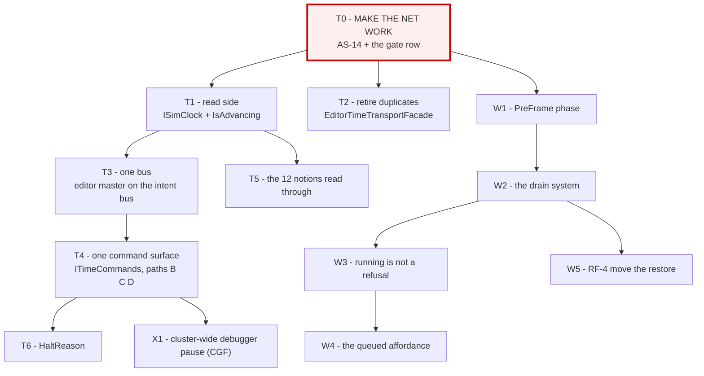

<!--STATUS
state: LIVE
build-state: DESIGN
updated: 2026-08-21
current-answer: §2 is the task list. §1 is the gate that blocks all of it.
stale-below: nothing.
known-rot: none.
known-conflict: none. This file is the ROADMAP; DESIGN_Time_Architecture.md is the detail.
-->
# ⭐⭐⭐ PLAN — **the time-system unification/refactor: every task, in order**

> 🔒 **User, `2026-08-21`:** *"the integration tests are the most important thing we need to make working
> before we touch any time monitoring/control related code… let's put that as the beginning of all the
> tasks belonging to the time system unification/refactor."*
>
> ⛔⛔ **`T0` BLOCKS EVERYTHING BELOW IT.** ⭐ No task in §2 starts until `T0` is green and its numbers are
> the published baseline.

## 0. ⭐⭐ WHERE THE KNOWLEDGE LIVES — **two documents, and they do not overlap**

🔒 **User, `2026-08-21`:** *"can the two time docs be merged into one? they are two parts of the same
architecture."* ⭐ **Merged on `2026-08-21`** — ⛔ the old `DESIGN_Time_Control_And_Reporting.md` and
`DESIGN_Time_And_Write_Architecture.md` **no longer exist.**

| document | holds | ⭐ changes when |
|---|---|---|
| 📄 **[`DESIGN_Time_Architecture.md`](DESIGN_Time_Architecture.md)** | ⭐⭐ **the ARCHITECTURE and the EVIDENCE** — topology · APIs · the 4 control paths · the write path · `AS-1`…`AS-14` · `P1`…`P8` · the target · replay · the regression net | ⭐ **a MEASUREMENT changes** |
| 📄 **this file** | ⭐⭐ **the ORDER** — every task, its old id, its feasibility, and `T0` | ⭐ **a PRIORITY changes** |
| 📄 **[`Architect_Question_48_…`](Architect_Question_48_What_Stopped_Means_And_Who_Drains.md)** | the **ruling** *(`R-126`)* | ⛔ intent only — a user decision |

⭐⭐ **That split is deliberate and is the only one left.** ⛔ **Do not re-derive a finding here** — cite
its `AS-`/`P-` id.

---

## 1. ⛔⛔⛔ `T0` — **MAKE THE INTEGRATION NET WORK. NOTHING ELSE STARTS FIRST.**

📄 `Hrot/Runner/Hrot.ClusterRunner.Integration.Tests/TimeControlIntegrationTests.cs` — ⭐⭐ **real
orchestrator + real SimHost over `MockNetworkFactory`**: a full `ClusterOpRequest → intent →
MasterSyncController → DDS → slave` round trip.

### 📐 Measured `2026-08-21`, on the coordinator branch

```
dotnet build Hrot.ClusterRunner.Integration.Tests --no-restore   → 0 errors, 88 s
dotnet test  --no-build --filter "~TimeControlIntegrationTests"  → 4 passed / 2 FAILED, 38 s
```

⭐⭐ **`BP-378` HAS ROTTED — no OOM, no hang.** ⚠ **Only the FILTERED run is proven**; ⛔ the full suite is
still untested.

| # | `T0` sub-task | ⭐ |
|---|---|---|
| **`T0.1`** | ⭐⭐⭐ **Fix `AS-14`** — `MasterSyncController.Step:188-195` returns early when `_pendingAcks.Count > 0`, so **a step requested while ACKs are outstanding is DISCARDED, not queued, and the caller is not told.** 📐 3 steps ⇒ 1 s. ⚠ **Decide: QUEUE it, or REFUSE it audibly** — ⛔ silently dropping is what makes 2 tests red | ⛔ **the blocker** |
| **`T0.2`** | ⚠ **Establish whether the FULL suite runs** — ⛔ `BP-378`'s remaining half. ⭐ If it OOMs, **say at what and cap the harness**; the per-class run already works, so a class-at-a-time gate is an acceptable fallback | ⭐ |
| **`T0.3`** | ⭐⭐ **Make `TimeControlIntegrationTests` a STANDING GATE ROW** in every batch of this programme, with before/after counts | ⭐⭐ |
| **`T0.4`** | ⭐ **Add the coverage the net is missing** — ⛔ measured gaps: **no `SetTimeScale` test · no editor-composition test · no breakpoint-pause test.** ⚠ The net covers the *cluster* path only | ⭐ |

> ⭐⭐⭐ **`T0` EXIT CRITERION:** `TimeControlIntegrationTests` **6/6 green**, run twice, and the row is in
> the gate table. ⛔ **Until then no task below may touch a production file in the time stack.**

---

## 2. ⭐⭐⭐ THE TASK LIST



### ⭐ `A` — the TIME subsystem *(detail: `DESIGN_Time_Architecture.md` §9 + §11)*

| id | task | was | feasibility |
|---|---|---|---|
| **`T1`** | **`ISimClock` + `SimClock.Of(view)` + `GlobalTime.IsAdvancing`**; `IsPaused` marked obsolete | `TC-1`/`RF-1` | ✅ **PROVEN** |
| **`T2`** | **retire the duplicate** `EditorTimeTransportFacade` ⇄ `EditorTimeTransportAdapter` *(identical but for name/accessibility/null-guards; only the Adapter is constructed)* | `TC-2`/`AS-11` | ✅ **PROVEN** |
| **`T3`** | ⭐⭐ **put the editor's `MasterSyncController` on the bus the intents live on** *(`_orchestrationBus`)* — ⭐ **"do what the Orchestrator does"** | `TC-3`/`AS-12` | ✅ **one line** ⚠ + 2 sub-checks below |
| **`T3a`** | ⚠ **verify SimHost's `ClusterTimeTransportAdapter` bus** — CGF uses `_context.EventBus`, SimHost `OrchestrationEventBus`; ⛔ **they disagree and only CGF's is proven right** | new | ⚠ **1 line to check** |
| **`T3b`** | ⚠ **verify the intent types are REGISTERED on the bus that carries them** — ⛔ `HrotNodeBuilder` never calls `OrchestrationEventRegistry.RegisterAll` on the bus it creates | new | ⚠ **would make a toolbar silently do nothing** |
| **`T4`** | ⭐⭐ **`ITimeCommands` — intents only.** Paths **B** *(toolbar)*, **C** *(debugger)* and **D** *(BTree/HSM)* stop calling `SwitchToDeterministic` directly | `TC-3`/`TC-4` | ⭐ after `T3` |
| **`T4d`** | ⭐ **path D: hand `AiTracerCoordinator` a real controller** — ⛔ its `RequestPause/Continue/StepOneTick` are **virtual no-ops** and production builds the base class | `TC-5`/`AS-9` | ✅ **PROVEN** — `R-67` |
| **`T5`** | **the remaining pause notions read through `ISimClock`** — ⛔ **not one refactor, ten**, one site at a time | `TC-8`/`RF-9` | ⚠ per-site |
| **`T6`** | ⭐ **`HaltReason`** — *why* it is stopped, not just that it is *(`Running` · `PausedByOperator` · `SteppingHeld` · `HeldByBreakpoint` · `NotPublishing`)* | `TC-6` | ⚠ needs `AS-10`'s `NotPublishing` exposed |
| **`T7`** | ⚠ **the two remote caches** *(`ClusterUiCache` · `ClusterTimeTransportAdapter`)* — ⛔ **KEEP both** *(they observe the wire)*; ⭐ decide whether they collapse | `TC-7` | ⚠ **UNMEASURED** |

### ⭐ `W` — the WRITE path *(detail: `DESIGN_Time_Architecture.md` §5 + §10)*

| id | task | was | feasibility |
|---|---|---|---|
| **`W0`** | ⭐⭐⭐ **`Q48-E`'s end-to-end rail, written FIRST and RED** — *pause → edit → resume → the value is in the repository*, per pause kind | `104a` | ⭐ the acceptance criterion |
| **`W1`** | **`SystemPhase.PreFrame` + one kernel line** — ⛔ the drain must precede `Input` *(~25 state-mutating systems)* | `RF-2` | ✅ **PROVEN** *(scheduler is phase-generic)* |
| **`W2`** | ⭐⭐ **the drain system**, mirroring `DebugSnapshotProvider`; ⛔ **gate on the `deltaTime` PARAMETER** *(`AS-10`)*; ⛔ skip while the DBM holds a rewind | `RF-3` | ✅ **PROVEN by precedent** |
| **`W3`** | ⭐⭐⭐ **running is not a refusal** — delete `RefusedRunning` and `LiveWriteRefusal.NotFrozen`; drop the session's `_isPaused` write gate. ⭐ **Keep** `NoSelectedEntity` · `FieldNotResolvable` · **`SizeMismatch`** *(`Q32` §2.1's corruption gate)* | `RF-5`/`RF-6` | ✅ **mechanical** |
| **`W4`** | ⭐ **the "queued" affordance** — ⛔ **only two of three run states need it** *(`P6′`)*; ⭐ the mechanism exists: **`Q46` rule 5's typed-value cache**. ⛔ **NOT on `AiVariablesWindow`** *(`U-16` retires it)* | `RF-11` | ⭐ mechanism exists |
| **`W5`** | ⚠ **move the RESTORE out of `RequestStep`/`RequestContinue`** | `RF-4` | ⚠⚠ **LIKELY, not proven** — ⛔ `W0`'s rail settles it |

### ⭐ `X` — later, and explicitly not now

| id | task | 🔒 |
|---|---|---|
| **`X1`** | **cluster-wide debugger pause on the CGF node** | 🔒 *"not now"* — 📌 UX Ruling 62; ⭐ **in the editor it is already satisfied** *(one process, one master)* |
| **`X2`** | **CGF ⇄ editor unification** so debugging runs on the non-editor node | 📄 UX session docs |

---

## 3. ⛔⛔ THE TWO LANDMINES — **carry these into every batch**

| ⛔ | |
|---|---|
| **`M-42`** | **`GlobalTime.IsPaused` is `TimeScale == 0`, and no pause path sets it** ⇒ **FALSE while paused.** ⭐ The predicate is **`DeltaTime`** |
| **`AS-1b`** | **the delta is meaningful ONLY on the instance the kernel pushed this frame.** ⛔ Through `GetCurrentState()` it answers *"halted"* forever — ⭐ **read the live world's singleton** |

⭐ Both pinned by `Fdp.Toolkits.Tests` ▸ `ThePauseFlagOnTheClockIsFalseWhilePausedTests` *(4/4)*.

---

## 4. ⭐ SEQUENCING RULE

> ⭐⭐⭐ **`T0` → then `T1`+`T2`+`W0` in one batch** *(all proven, all independent)* → **`T3`+`T3a`+`T3b`**
> → **`W1`+`W2`** → **`W3`+`W4`** → **`T4`+`T4d`** → **`T5`/`T6`/`W5`** → **`X`**.
>
> ⚠⚠ **`AS-14` gets WORSE under `T4`**: intents can be published faster than ACKs return, so a dropped
> step becomes **more** likely. ⛔ **That is why `T0.1` is a blocker and not a nice-to-have.**
