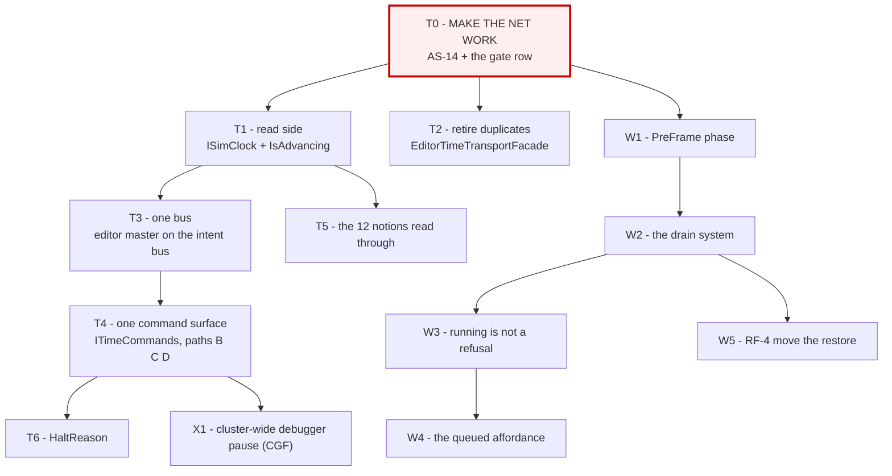

<!--STATUS
state: LIVE
build-state: DESIGN
updated: 2026-08-21
current-answer: §1b is the NECESSITY ANALYSIS and the recommendation (MIN first).
  §2 is the task list. §1 is the gate that blocks the big work.
stale-below: nothing.
known-rot: none.
known-conflict: none. This file is the ROADMAP; DESIGN_Time_Architecture.md is the detail.
-->
# ⭐⭐⭐ PLAN — **the time-system unification/refactor: every task, in order**

> 🔒 **User, `2026-08-21`:** *"the integration tests are the most important thing we need to make working
> before we touch any time monitoring/control related code… let's put that as the beginning of all the
> tasks belonging to the time system unification/refactor."*
>
> ⛔⛔ **`T0` BLOCKS EVERYTHING BELOW IT.** ⭐ No task in §2 starts until `T0` is green and its numbers are
> the published baseline.

## 0. ⭐⭐ WHERE THE KNOWLEDGE LIVES — **two documents, and they do not overlap**

🔒 **User, `2026-08-21`:** *"can the two time docs be merged into one? they are two parts of the same
architecture."* ⭐ **Merged on `2026-08-21`** — ⛔ the old `DESIGN_Time_Control_And_Reporting.md` and
`DESIGN_Time_And_Write_Architecture.md` **no longer exist.**

| document | holds | ⭐ changes when |
|---|---|---|
| 📄 **[`DESIGN_Time_Architecture.md`](DESIGN_Time_Architecture.md)** | ⭐⭐ **the ARCHITECTURE and the EVIDENCE** — topology · APIs · the 4 control paths · the write path · `AS-1`…`AS-14` · `P1`…`P8` · the target · replay · the regression net | ⭐ **a MEASUREMENT changes** |
| 📄 **this file** | ⭐⭐ **the ORDER** — every task, its old id, its feasibility, and `T0` | ⭐ **a PRIORITY changes** |
| 📄 **[`Architect_Question_48_…`](Architect_Question_48_What_Stopped_Means_And_Who_Drains.md)** | the **ruling** *(`R-126`)* | ⛔ intent only — a user decision |

⭐⭐ **That split is deliberate and is the only one left.** ⛔ **Do not re-derive a finding here** — cite
its `AS-`/`P-` id.

---

## 1. ⛔⛔⛔ `T0` — **MAKE THE INTEGRATION NET WORK. NOTHING ELSE STARTS FIRST.**

📄 `Hrot/Runner/Hrot.ClusterRunner.Integration.Tests/TimeControlIntegrationTests.cs` — ⭐⭐ **real
orchestrator + real SimHost over `MockNetworkFactory`**: a full `ClusterOpRequest → intent →
MasterSyncController → DDS → slave` round trip.

### 📐 Measured `2026-08-21`, on the coordinator branch

```
dotnet build Hrot.ClusterRunner.Integration.Tests --no-restore   → 0 errors, 88 s
dotnet test  --no-build --filter "~TimeControlIntegrationTests"  → 4 passed / 2 FAILED, 38 s
```

⭐⭐ **`BP-378` HAS ROTTED — no OOM, no hang.** ⚠ **Only the FILTERED run is proven**; ⛔ the full suite is
still untested.

| # | `T0` sub-task | ⭐ |
|---|---|---|
| **`T0.1`** | ⭐⭐⭐ **Fix `AS-14`** — `MasterSyncController.Step:188-195` returns early when `_pendingAcks.Count > 0`, so **a step requested while ACKs are outstanding is DISCARDED, not queued, and the caller is not told.** 📐 3 steps ⇒ 1 s. ⚠ **Decide: QUEUE it, or REFUSE it audibly** — ⛔ silently dropping is what makes 2 tests red | ⛔ **the blocker** |
| **`T0.2`** | ⚠ **Establish whether the FULL suite runs** — ⛔ `BP-378`'s remaining half. ⭐ If it OOMs, **say at what and cap the harness**; the per-class run already works, so a class-at-a-time gate is an acceptable fallback | ⭐ |
| **`T0.3`** | ⭐⭐ **Make `TimeControlIntegrationTests` a STANDING GATE ROW** in every batch of this programme, with before/after counts | ⭐⭐ |
| **`T0.4`** | ⭐ **Add the coverage the net is missing** — ⛔ measured gaps: **no `SetTimeScale` test · no editor-composition test · no breakpoint-pause test.** ⚠ The net covers the *cluster* path only | ⭐ |

> ⭐⭐⭐ **`T0` EXIT CRITERION:** `TimeControlIntegrationTests` **6/6 green**, run twice, and the row is in
> the gate table. ⛔ **Until then no task below may touch a production file in the time stack.**

---

## 1b. ⭐⭐⭐ HOW MUCH OF THIS IS ACTUALLY NECESSARY? — **the honest answer** *(user, `2026-08-21`)*

> 🔒 **User:** *"heretic question: how much is the time refactor necessary?"* ⭐⭐ **Mostly it is not**, and
> the plan should say so rather than defend itself.

### ⭐ Separate the USER'S BUG from the ARCHITECTURE

📌 **The live failure** is one sentence: *edit a variable while paused → the value does not change.*
📐 **Measured chain:** run state = `Paused` ✅ → `writeLive` runs ✅ → `TryWriteWorkingStateField`
**refuses on `_isPaused`** ⛔ *(`AS-3`)*, and even if it staged, **nothing drains** *(`AS-5`)*.

| ⭐ what the bug needs | ⛔ what it does NOT need |
|---|---|
| drop the session's write gate *(`W3`)* | ⛔ `T1` `ISimClock` · `T2` the duplicate · `T3`/`T4` the bus and `ITimeCommands` · `T5` the ten notions · `T6` `HaltReason` · `T7` the caches |
| **and a way for the value to land** | ⛔ **and possibly not `W1`/`W2` either** — see `MIN` |

### ⭐⭐⭐ `MIN` — **the minimal path, and it is ~10 lines**

📐 **Two measurements make a much smaller fix legitimate for the case the user actually hits:**

| 📐 | |
|---|---|
| **`P4`** | ⛔ **no threading race** — the runner is one loop; `Direct` strategy is `Synchronous`-only and enforced |
| **`P6′`** | ⛔⛔ **behaviours do NOT tick at `dt == 0`** — `BlueprintTickSystem:51` · `BTreeTickSystem:55` · `HsmTickSystem:103` |

⇒ ⭐⭐⭐ **In a plain TIME pause with no breakpoint rewind, a DIRECT write sticks and is visible
immediately.** ⇒ **`MIN` = `W3` + a direct-write arm guarded by `clock halted && !dbm.IsPaused`.**
⛔ **No `PreFrame` phase. No drain system. No kernel change.** ⇒ ⚠ **and `T0` matters far less**, because
almost no time-stack code is touched.

| ⚠ `MIN`'s one open probe | ⭐ does a direct write while toolbar-paused actually survive to the next frame? ⛔ **Testable in one rail** — and it is the only thing standing between the user and a working edit |
|---|---|

### ⛔ WHAT `MIN` DOES **NOT** COVER — **and this is why the rest exists**

| case | ⛔ `MIN` |
|---|---|
| **RUNNING** *(dt > 0)* | ⛔ a direct write is overwritten by the next behaviour tick ⇒ **needs staging + a drain** *(`W1`/`W2`)* |
| **BREAKPOINT-paused** *(rewound)* | ⛔ a direct write is overwritten by the post-tick restore ⇒ **needs the drain, and `W5`** |
| **BTree / HSM** | ⛔ no live-write path at all yet |
| **CGF node** | ⛔ 🔒 the stated future requirement — **`T3`/`T4` are for that, not for the editor** |

### ⭐⭐ ⇒ THE RECOMMENDATION

| ⭐ | |
|---|---|
| **①** | ⭐⭐⭐ **Do `MIN` first**, as a small fix with one rail. ⭐ **It is the thing that has failed the visual check five times** |
| **②** | ⭐⭐ **Then `T0`** — the net — because it is cheap, it found a real defect *(`AS-14`)* already, and it is the precondition for anything bigger |
| **③** | ⚠ **Then decide whether `W1`/`W2` are worth it** — ⭐ they buy the RUNNING and BREAKPOINT cases; ⛔ **if nobody needs to edit a value while the sim runs, they may never be worth a kernel phase** |
| **④** | ⛔ **`T1`–`T7` are HYGIENE.** ⭐ Real *(twelve notions, a dead flag, a duplicate class)*, ⚠ **but invisible to the user** — 📌 schedule them against the CGF-unification need, **not against this bug** |

⚠⚠ **Stated plainly so the plan cannot quietly justify itself:** ⛔ **the twelve pause notions have never
produced a user-visible defect on their own.** ⭐ What produced the defect was **`AS-3` + `AS-5`** — one
gate and one missing drain. 📌 **The inventory work was worth it because it found `M-42`, `AS-14` and
`AS-10`** — ⛔ **not because twelve is an inherently intolerable number.**

---

## 2. ⭐⭐⭐ THE TASK LIST



### ⭐ `A` — the TIME subsystem *(detail: `DESIGN_Time_Architecture.md` §9 + §11)*

| id | task | was | feasibility |
|---|---|---|---|
| **`T1`** | **`ISimClock` + `SimClock.Of(view)` + `GlobalTime.IsAdvancing`**; `IsPaused` marked obsolete | `TC-1`/`RF-1` | ✅ **PROVEN** |
| **`T2`** | **retire the duplicate** `EditorTimeTransportFacade` ⇄ `EditorTimeTransportAdapter` *(identical but for name/accessibility/null-guards; only the Adapter is constructed)* | `TC-2`/`AS-11` | ✅ **PROVEN** |
| **`T3`** | ⭐⭐ **put the editor's `MasterSyncController` on the bus the intents live on** *(`_orchestrationBus`)* — ⭐ **"do what the Orchestrator does"** | `TC-3`/`AS-12` | ✅ **one line** ⚠ + 2 sub-checks below |
| **`T3a`** | ⚠ **verify SimHost's `ClusterTimeTransportAdapter` bus** — CGF uses `_context.EventBus`, SimHost `OrchestrationEventBus`; ⛔ **they disagree and only CGF's is proven right** | new | ⚠ **1 line to check** |
| **`T3b`** | ⚠ **verify the intent types are REGISTERED on the bus that carries them** — ⛔ `HrotNodeBuilder` never calls `OrchestrationEventRegistry.RegisterAll` on the bus it creates | new | ⚠ **would make a toolbar silently do nothing** |
| **`T4`** | ⭐⭐ **`ITimeCommands` — intents only.** Paths **B** *(toolbar)*, **C** *(debugger)* and **D** *(BTree/HSM)* stop calling `SwitchToDeterministic` directly | `TC-3`/`TC-4` | ⭐ after `T3` |
| **`T4d`** | ⭐ **path D: hand `AiTracerCoordinator` a real controller** — ⛔ its `RequestPause/Continue/StepOneTick` are **virtual no-ops** and production builds the base class | `TC-5`/`AS-9` | ✅ **PROVEN** — `R-67` |
| **`T5`** | **the remaining pause notions read through `ISimClock`** — ⛔ **not one refactor, ten**, one site at a time | `TC-8`/`RF-9` | ⚠ per-site |
| **`T6`** | ⭐ **`HaltReason`** — *why* it is stopped, not just that it is *(`Running` · `PausedByOperator` · `SteppingHeld` · `HeldByBreakpoint` · `NotPublishing`)* | `TC-6` | ⚠ needs `AS-10`'s `NotPublishing` exposed |
| **`T7`** | ⚠ **the two remote caches** *(`ClusterUiCache` · `ClusterTimeTransportAdapter`)* — ⛔ **KEEP both** *(they observe the wire)*; ⭐ decide whether they collapse | `TC-7` | ⚠ **UNMEASURED** |

### ⭐ `W` — the WRITE path *(detail: `DESIGN_Time_Architecture.md` §5 + §10)*

| id | task | was | feasibility |
|---|---|---|---|
| **`W0`** | ⭐⭐⭐ **`Q48-E`'s end-to-end rail, written FIRST and RED** — *pause → edit → resume → the value is in the repository*, per pause kind | `104a` | ⭐ the acceptance criterion |
| **`W1`** | **`SystemPhase.PreFrame` + one kernel line** — ⛔ the drain must precede `Input` *(~25 state-mutating systems)* | `RF-2` | ✅ **PROVEN** *(scheduler is phase-generic)* |
| **`W2`** | ⭐⭐ **the drain system**, mirroring `DebugSnapshotProvider`; ⛔ **gate on the `deltaTime` PARAMETER** *(`AS-10`)*; ⛔ skip while the DBM holds a rewind | `RF-3` | ✅ **PROVEN by precedent** |
| **`W3`** | ⭐⭐⭐ **running is not a refusal** — delete `RefusedRunning` and `LiveWriteRefusal.NotFrozen`; drop the session's `_isPaused` write gate. ⭐ **Keep** `NoSelectedEntity` · `FieldNotResolvable` · **`SizeMismatch`** *(`Q32` §2.1's corruption gate)* | `RF-5`/`RF-6` | ✅ **mechanical** |
| **`W4`** | ⭐ **the "queued" affordance** — ⛔ **only two of three run states need it** *(`P6′`)*; ⭐ the mechanism exists: **`Q46` rule 5's typed-value cache**. ⛔ **NOT on `AiVariablesWindow`** *(`U-16` retires it)* | `RF-11` | ⭐ mechanism exists |
| **`W5`** | ⚠ **move the RESTORE out of `RequestStep`/`RequestContinue`** | `RF-4` | ⚠⚠ **LIKELY, not proven** — ⛔ `W0`'s rail settles it |

### ⭐ `X` — later, and explicitly not now

| id | task | 🔒 |
|---|---|---|
| **`X1`** | **cluster-wide debugger pause on the CGF node** | 🔒 *"not now"* — 📌 UX Ruling 62; ⭐ **in the editor it is already satisfied** *(one process, one master)* |
| **`X2`** | **CGF ⇄ editor unification** so debugging runs on the non-editor node | 📄 UX session docs |

---

## 3. ⛔⛔ THE TWO LANDMINES — **carry these into every batch**

| ⛔ | |
|---|---|
| **`M-42`** | **`GlobalTime.IsPaused` is `TimeScale == 0`, and no pause path sets it** ⇒ **FALSE while paused.** ⭐ The predicate is **`DeltaTime`** |
| **`AS-1b`** | **the delta is meaningful ONLY on the instance the kernel pushed this frame.** ⛔ Through `GetCurrentState()` it answers *"halted"* forever — ⭐ **read the live world's singleton** |

⭐ Both pinned by `Fdp.Toolkits.Tests` ▸ `ThePauseFlagOnTheClockIsFalseWhilePausedTests` *(4/4)*.

---

## 4. ⭐ SEQUENCING RULE

> ⭐⭐⭐ **`T0` → then `T1`+`T2`+`W0` in one batch** *(all proven, all independent)* → **`T3`+`T3a`+`T3b`**
> → **`W1`+`W2`** → **`W3`+`W4`** → **`T4`+`T4d`** → **`T5`/`T6`/`W5`** → **`X`**.
>
> ⚠⚠ **`AS-14` gets WORSE under `T4`**: intents can be published faster than ACKs return, so a dropped
> step becomes **more** likely. ⛔ **That is why `T0.1` is a blocker and not a nice-to-have.**

---

## 5. ⭐⭐⭐ CAN THIS RUN IN PARALLEL WITH THE UI/DETAILS REFACTOR? *(user, `2026-08-21`)*

> ⭐⭐ **Yes — the CODE separates cleanly. ⛔ The PROCESS does not, yet.** Three amendments are needed and
> one of them **needs the user's explicit nod**.

### ⭐ ① THE CODE — **measured, and the overlap is near zero**

| lane | touches |
|---|---|
| ⭐ **TIME lane** *(`T0`, then `T1`…`T7`)* | `FDP/Toolkits/Fdp.Toolkits/Time/` · `Hrot.Orchestrator` · `ModuleHostKernel` · `Hrot.ClusterRunner.Integration.Tests` |
| ⭐ **UI lane** *(`Q38` `L0`…`L6`)* | `Hrot.Editor.AiShared/Windows` · `Blueprints.Editor` · `BTree.Editor` · `Hsm.Editor` — **selection stores, bridges, the view registry** |
| ⇒ | ⭐⭐⭐ **different assemblies. No shared production file.** |

⛔⛔ **THE ONE EXCEPTION — `MIN` IS NOT IN THE TIME LANE.** 📐 It edits `BlueprintDebugSession`,
`BlueprintLiveValueWriter` and `VariableEditCommit` — ⭐ **variable-edit code, the UI lane's files.**
⇒ ⭐⭐ **`MIN` ships with the UI session**, not the time one.

### ⛔ ② THE PROCESS — **three real conflicts**

| ⛔ | ⭐ the amendment |
|---|---|
| **the TRACKER** — one 985-line file, areas `A`–`G`; ⚠ **both lanes would append rows** 📌 and id collisions have already bitten this programme **three times** | ⭐⭐ **partition it: the time lane writes ONLY to a new `Area H — Time & clock`.** ⇒ different regions of one file **merge cleanly** |
| **ID ALLOCATION** — rule 3 says each session numbers its own rows; ⛔ **two sessions drawing from `BP-` collide by construction** | ⭐⭐⭐ **a PREFIX per lane** — `BP-` stays with the UI/variable lane, the time lane uses **`TM-`**. ⛔ **Structural, not coordination** |
| **the LANE TABLE** — `.claude/CLAUDE.md` names **one** implementation branch | ⭐ **add the second branch by name**, and say which lane each owns |

### ✅✅ ③ THE FREEZE — **RULED `2026-08-21`: APPROVED**

🔒 **User, verbatim:** *"the freeze was about the variable model, time lane is fine. approved."*
⇒ ⭐⭐⭐ **The carve-out is now in `.claude/CLAUDE.md`** beside the freeze itself, with the three
two-lane rules *(`TM-` ids · tracker `Area H` · no cross-lane files)*.

#### ⛔ The original question, kept for the record

🔒 **The standing ruling, verbatim:** *"cross host it is. one single implem session (the one we are
using) will be implementing for all hosts, **no other session will implement until this is all done**."*

| ⭐ my reading | |
|---|---|
| ⭐⭐ **the freeze protects the UNIFIED VARIABLE MODEL** — variables, working state, the blackboard panel, `Hrot.Editor.AiShared` | ⇒ ⭐ **the TIME lane is outside it** *(engine, orchestrator, kernel, integration tests)* |
| ⛔ **but the words say "no other session will implement"**, without an area carve-out | ⇒ ⚠⚠ **this needs the user to say "the freeze is about the variable model; a time-lane session is fine"** — ⛔ **I will not read the carve-out into it myself** |

### ✅ ⇒ THE APPROVED SPLIT

| lane | first batch | ⭐ |
|---|---|---|
| ⭐⭐⭐ **UI lane** *(the existing session, `claude/hrot-implementation-j1jvin`)* | **`MIN`** *(the ~10-line fix + one rail)*, then **`Q38` `L0`** | ⭐ it owns the frozen area already; ⭐⭐ **`MIN` is the thing that has failed five visual checks** |
| ⭐⭐ **TIME lane** *(a NEW session/branch)* | **`T0`** — Batch 104 as dispatched | ⭐ self-contained; ⛔ **its only production edit is `AS-14`** |

⚠ **Coordination cost, stated honestly:** ⭐ **two lanes double the merge and review load on this
session**, and ⛔ **the protocol has never run two.** ⭐ The split above is chosen to minimise that — one
lane is a **single self-contained batch** with one production file, so if the process strains, **the time
lane is the one to pause.**
