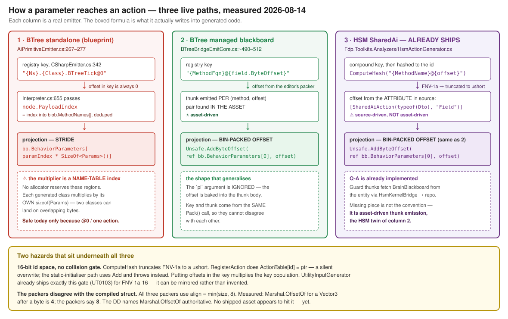

# Prior art — the cross-host variable & call model

> **Session:** cross-host variable model, branch `claude/cross-host-variable-model-3k8cfh`
> (reset onto `claude/blueprint-authoring-status-gm0akp` @ `db4e4f0`).
> **Date:** `2026-08-14`. **Status:** ⛔ **prior-art sweep only — no design in this document.**
> **Method:** every row below was read out of the code or measured. Nothing is inherited from
> `BOOTSTRAP_Cross_Host_Variable_Model.md` §4 or from the HSM session's §1 without re-checking.

---

## 1. ⭐⭐ The headline: four things that change the questions

| | finding | why it matters |
|---|---|---|
| **PA-1** | ⭐⭐ **`Q-A` is not a proposal — it already ships.** `HsmActionGenerator` builds `CompoundKey = "{MethodName}@{offset}"` (`:261`, `:308`, `:365`), hashes it (`:642`), and registers a thunk that projects the DTO at that offset (`:703`, `:741`) | the HSM session can stop asking *whether* the convention works and start asking *why their path does not reach it* |
| **PA-2** | ⛔ **but the OFFSET SOURCE differs, and that is the real answer to `Q-A`** | BTree's offset comes from the **asset** (the editor's packer); HSM SharedAi's comes from an **attribute in source**. The editor cannot pick an offset HSM has not already declared |
| **PA-3** | 🔴 **the id space is 16-bit with no collision gate** — and putting offsets in the key multiplies the key population | this is the one thing that could make `Q-A` unsafe at scale, and it is invisible today |
| **PA-4** | 🔴 **measured: the bin-packers disagree with the compiled struct** for any type whose size exceeds its natural alignment | `Marshal.OffsetOf` is *declared* authoritative; three packers compute something else |



---

## 2. ⭐ Prior art the HSM session asked for and did not find

> *Their ask #4: "a pointer to anything already designed for HSM that we have not found."*

| what | where | what it already does |
|---|---|---|
| ⭐⭐ **`HsmActionGenerator`** | `FDP/Toolkits/Fdp.Toolkits.Analyzers/HsmActionGenerator.cs` | emits HSM **guard and action** thunks that project a DTO at a bin-packed byte offset out of `BrainBlackboard`. **Not mentioned anywhere in the bootstrap doc** |
| ⭐ **the guard blackboard fetch** | same file, `EmitSharedAiGuardThunk` (~690) | `contextPtr` → `HsmKernelBridge*` → `WorldHandle` → `EntityRepository` → `GetComponentRW<BrainBlackboard>(bridge->Self)`. ⇒ **`Q-C1` describes what is already built** |
| ⭐ **`BlackboardVariableEntry`** | `Hrot/Editor/Hrot.Editor.AiShared/Blackboard/` | the **shared** variable record carrying `Role` + `Scope`, consumed by the HSM editor, the BTree editor **and** the Blueprint editor. ⇒ the cross-host variable model **already exists at the editor layer** |
| ⭐ **`HsmOrchestratorEmitter`** | `Hrot/Subsystems/AI/Hrot.Hsm.Editor/Emit/` | HSM→BTree **alias bindings**: one `[HsmAction]` per (variable, sub-tree) pair. The HSM twin of `BTreeOrchestratorEmitter`. ⚠ **see PA-8 — it is never called** |
| ⭐ **`BlackboardAliasBinding`** + `GetAliasesFor` | `HsmAsset.cs:203`, `BehaviorTreeAsset.cs:427` | the alias model is **already shared** by both hosts |
| ⭐⭐ **a shipped FNV-1a-16 collision gate** | `UtilityInputGenerator.cs:173` + `SharedUtilityDiagnostics.UT0103_HashCollision` | exactly the gate PA-3 needs. **Mirror it; do not invent one** |

---

## 3. Corrections — bootstrap §4 and the HSM doc §1

### 3.1 To the bootstrap's §4

| their claim | verdict |
|---|---|
| *"`CSharpEmitter.cs:342` … offset HARDCODED to 0"* | ✅ **confirmed verbatim** |
| *"**TWO** projection formulas coexist"* | ⚠ **undercount — there are THREE.** The third is `HsmActionGenerator.cs:703,741`, already on the HSM side, already using the offset form |
| *"`Q-A` is really: does HSM adopt the offset form"* | ⛔ **superseded.** HSM already emits the offset form. The open question is **who computes the offset** — source attribute or asset (PA-2) |
| *"the stride form … does it have any remaining caller?"* | ⭐ **worse than it reads — see PA-5.** The stride multiplier is not a parameter slot at all |
| *"`Marshal.OffsetOf` authoritative … now checkable via `U-1` Tier 1"* | ✅ right, and ⭐ **PA-4 is a concrete case for it to check** |

### 3.2 To the HSM doc's §1

| # | verdict |
|---|---|
| 1 (role × scope) | ✅ **right, and the carrier is shared already** — `BlackboardVariableEntry` in `Hrot.Editor.AiShared`, used by all three editors. ⚠ but blueprints store `DeclarationKind`, not `Role`/`Scope` (§4 below) |
| 2, 3 (whole-DTO binding; per-field rejected) | ✅ right **for the BTree managed path** — ⚠ **but `[SharedAiAction(typeof(Dto), "FieldName")]` binds a FIELD.** In shipped use the "slot struct" wraps exactly one field, so it degenerates to whole-DTO; the mechanism itself is per-field |
| 5 (Approach A aliasing) | ✅ right |
| 6 (Approach B is Subtree-only) | ⚠ **and inert** — both orchestrator emitters are dead (PA-8) |
| 9 (`{MethodFqn}@{offset}`) | ✅ right for BTree (`BTreeBridgeEmitCore.cs:488,544`; stateful `…@{slotKey}` at `:622,829`). ⭐ **HSM's own is `{MethodName}@{offset}` — SIMPLE name, not FQN** (`HsmActionGenerator.cs:261`) ⇒ **collision-prone across types; worth unifying on the FQN form** |
| 11 (*"BTree owns layout"*) | ✅ confirmed |
| 12 (bin-packer advisory, `Marshal.OffsetOf` authoritative, `bool` needs `[MarshalAs(I1)]`) | ✅ documented **and honoured** — both `BTreeEmitCore.cs:112` and `AiPrimitiveEmitter.cs:104` emit the attribute. ⛔ **but the same class of drift exists un-handled for `Vector3` — PA-4** |

---

## 4. ⭐ Where the shared model actually stops

Not three-way. It is **2 + 1**, and the seam is the *layer*, not the host.

| layer | BTree | HSM | Blueprint |
|---|---|---|---|
| **editor** | `BlackboardVariableEntry` (`Role` × `Scope`) | **same record** | **same record** |
| **persisted asset** | `BlackboardVariableDto` (`Role` × `Scope`) | `HsmAssetDto` + same DTO | ⛔ **`ParameterDecl` / `VariableDecl` under `DeclarationKind`** |
| **compiler IR** | packed offsets | — (absent) | `VariableRef(VariableKind, int)` |

- `DeclarationKind` = `Parameter · WorkingState · Variable`; `VariableKind` = `Unresolved · Variable · WorkingState · Parameter`.
  ⚠ **Different member orders** — ✅ but bridged by a **total, name-to-name** mapping in
  `DeclarationRefs.cs:23–36`, not an ordinal cast. Verified both directions.
- ⭐ **Graph locals are tagged `DeclarationKind.Variable`** (`Stage4:23`, `Stage5:122`) — the *same* tag as
  asset variables. ⇒ **`DeclarationKind` does not carry the local/asset distinction**; only the source
  collection does, and resolution is **by `Guid` identity, not name** (`Q27-C1` shadowing).
  📐 **Directly relevant to `Q-E1`:** if HSM wants per-state-slot scoping, `DeclarationKind` is the wrong axis — `Scope` is.
- ⭐ **Cross-kind uniqueness** is `MakeUniqueName(asset.Declarations.Select(d => d.Name), …)` — over the three
  declaration lists **only**.

---

## 5. Events — what is and is not inherited

| | |
|---|---|
| ✅ **the type is shared** | `EventDispatcherDecl.Parameters` and `CustomEventDecl.Parameters` are both `List<ParameterDecl>` — **the same `ParameterDecl`** as `BlueprintAsset.Parameters` |
| ⛔ **the rails are not** | event params are **outside `Declarations`**, so they inherit **none** of: the cross-kind uniqueness rail, `Role`/`Scope`, or the Stage-2 type rail (`Stage2_Validate.cs:397–413` iterates `Declarations.Of(...)` only) |
| ⛔ **and not the budget rail** | `BP1200`/`BP1201` size the `Parameter` and `WorkingState` declaration sets; event payloads are not sized at all |
| ⭐ **events have their own name space** | `MakeUniqueName(asset.CustomEvents.Select(e => e.Name), …)` — separate from `Declarations` |

⇒ 📐 **The §5.4 question has a crisp form:** an event parameter is *structurally* a `Parameter` and
*procedurally* nothing. Either move it into `Declarations` and get four rails for free, or say
explicitly what it is instead.

---

## 6. 🔴 Measured defects — for whoever owns them

⛔ **No ids allocated — the owning session numbers these.**

| | finding | evidence |
|---|---|---|
| **PA-5** | 🔴 **the stride form's multiplier is the METHOD-NAME TABLE INDEX, not a param slot.** `Interpreter.cs:655` passes `node.PayloadIndex`; `NodeDefinition.cs:28` says that indexes `MethodNames[]`; `TreeCompiler.cs:212 GetOrAddMethodName` **dedups by name**. Each generated class multiplies it by its **own** `sizeof(Params)`. ⇒ **no allocator reserves these regions; two classes can overlap.** Safe today only because every standalone key is `@0` | measured |
| **PA-6** | 🔴 **`HSM-016` is an active corruption hazard, not a missing feature.** `HsmBridgeEmitCore.cs:119–124,139–143` registers no-op stubs at `actionId = 100++` / `guardId = 200++`, while `HsmFlattener` sets `OnEntryActionId = ComputeHash(name)`. A stub at 100..N **can overwrite a real action** whose hash lands there | measured |
| **PA-7** | 🔴 **no collision gate on a 16-bit id space.** `ComputeHash` = FNV-1a-32 → `(ushort)(hash & 0xFFFF)`, **char-identical** in `HsmFlattener.cs:385` and `HsmActionGenerator.cs:802` (~10 copies repo-wide). `RegisterAction` does `ActionTable[id] = ptr` (**silent overwrite**); the static-initialiser path uses `Add` (**throws**). Two failure modes, one hazard | measured |
| **PA-8** | 🔴 **both orchestrator emitters are dead outside tests.** `HsmOrchestratorEmitter.Emit` / `BTreeOrchestratorEmitter.Emit` are called **only** from their own test files; `WriteOrchestratorFile` has **zero** callers. ⚠ **`CompanionFileDiscovery.cs:194,208` looks for the sidecar that nothing writes.** ⇒ Approach B is implemented, unit-tested and **never runs** — a green that says nothing | measured |
| **PA-9** | ⚠ **latent: the orchestrator would not compile if it were ever written.** It emits `[HsmAction(Name=…)]` on a **BTree-shaped** method (`ref bb, ref state, ref ctx, int`). `HsmActionGenerator.GetMethodInfo` does **not filter by signature**, and `GenerateRegistrar` casts every `[HsmAction]` to `delegate*<void*,void*,HsmCommandWriter*,void>`. Masked only by PA-8 | read |
| **PA-10** | 🔴 **measured layout drift.** ⚠ **See `PA-14` — it is FIVE implementations, not three, and the golden gate is blind to it.** All three packers use `align = min(size, 8)` (`BlackboardBinPacker.cs:102`, `BTreeBlackboardPackHelper.cs:22`, `HsmActionGenerator.GetTypeAlign`). For `struct S { byte B; Vector3 V; }` this yields **8**; `Marshal.OffsetOf<S>("V")` returns **4** *(measured on .NET 8)*. The DD names `Marshal.OffsetOf` authoritative and requires the packer to *"replicate C# sequential layout exactly"*. `Vector3` is in every packer's `KnownSizes` — i.e. an expected variable type. ⛔ **`BlackboardBinPackerTests.cs:131,145–151` asserts the 8**, so the convention is deliberate and tested — against the wrong oracle | **measured, see below** |
| **PA-11** | ⚠ **`HsmFlattener` has a third id path and it is asymmetric.** `:172–173` allow an explicit `EntryActionId`/`ExitActionId` override; `:174–175` (**Activity**, **Timer**) have none. `actionTable[name]` is a **raw indexer** — `KeyNotFoundException` on an uncollected name. 📐 relevant to `Q-B` |
| **PA-12** | ⚠ **`Q-F` confirmed: the budget assumes one-at-a-time.** `BP1200` sizes **one asset's** `Parameter` set ≤ 100; `BehaviorRegistry.cs:200` and `BehaviorParameterSizeAnalyzer.cs:64` each size **one DTO** ≤ 100 — and the analyzer **re-declares the constant locally** (`:26`) instead of referencing `BehaviorConstants`. **Nothing sums across simultaneously-live bindings.** Fine for one BTree leaf; not for orthogonal HSM regions |

### PA-13 — 🔴 the most user-facing gap: a managed asset CANNOT be parametrized per instance

| | |
|---|---|
| ⛔ **the generated `ParseParams` ignores its `json` argument** | `BTreeBridgeEmitCore.EmitParseParamsLocal:1195` emits a lambda that writes **only** baked `DefaultValueJson` values, at their packed offsets. The emitted comment says so: *"runtime per-assignment JSON override of individual managed variables is not yet supported … `DEBT-AIB-021`"* |
| ✅ **curated behaviours DO honour it** | `CgfCuratedBehaviorRegistrar.cs:124` registers hand-written resolvers (`CgfNodes.ResolveMoveToParams`) that deserialize the JSON and `Unsafe.Write(ptr, p)` — ⚠ **at offset 0, one DTO per behaviour** |
| 🔴 **HSM has no `ParseParams` at all** | `HsmBridgeEmitCore` emits none — **not even baked defaults** ⇒ an HSM asset cannot be parametrized from a scenario by any route |
| 📌 **why it was never noticed** | ⭐ **every shipped scenario uses a curated behaviour** — `scenarios/*/scenario.json` name only `MoveToLocation`, `FireAtTarget`, `PlatoonHillAttack`. **The managed-asset path has never been driven from a scenario** |
| ⚠ **`IsExposedOnSpawn`** | declared on blueprint variables; ⛔ **never read at spawn** — editor-surface only |

⭐⭐ **The fix is small and already sketched in the debt row:** deserialize a wrapper JSON object keyed
by **variable name** and dispatch each to its packed offset — **the offsets are already in
`packedFields`.** ⇒ **~30 lines in `EmitParseParamsLocal`.**

⛔ **Lane: blueprint/BTree** (`Hrot.AiEditor.Persistence`), plus an HSM-side twin that does not exist.

### PA-14 — 🔴🔴 the layout defect is WIDER than PA-10, and the golden gate is BLIND to it

⭐ **Found by the blueprint session's review `2026-08-14`; verified independently here.**

| | |
|---|---|
| ⛔ **a FIFTH layout implementation** | ⭐ **`Hrot.Blueprints.Compiler/Compiler/Lowering/FieldLayout.cs:46`** — `TypeAlignment => t.SizeBytes switch { 1=>1, 2=>2, <=4=>4, _=>8 }`. `Vector3` registered at **12** (`StaticTypeRegistry:40,102`) ⇒ align **8**; emitted `Sequential` ⇒ CLR packs at **4**. ⭐ **PA-8 undercounted — the sweep missed this assembly entirely** |
| ⛔ **the escape hatch is keyed on the WRONG PREDICATE** | `CSharpEmitter.cs:412` uses runtime layout only when `asset.Variables.Any(f => !f.Type.SizeReliable)`. ⭐⭐ **`Vector3` has a RELIABLE SIZE (12) and an UNRELIABLE ALIGNMENT.** Q#14 separated size-reliability; ⛔ **alignment-reliability was never separated**, so the hatch cannot fire for this class |
| 🔴🔴 **the golden corpus CANNOT SEE IT** | `GoldenCorpus.cs:268` records **`f.Offset`** — the **computed** number, not the actual one. ⇒ ⭐⭐ **a `Vector3`-after-`byte` corpus asset makes the shape PRESENT but not VISIBLE:** Tier 1 records `@8` before and `@8` after, while the real field sits at `4` |

⇒ ⛔⛔ **This refutes the design's original step-3 safety argument** (*"byte-stable; the corpus asset
proves it"*). ⭐ **The required gate is a RUNTIME one:** `Marshal.OffsetOf<T>(name) == f.Offset` over
every corpus asset and every emitted field — it **reddens today, before any change**, and retires the
mis-keyed predicate. 📌 **`BP-240`'s shape a third time — green because of which SIDE the gate reads.**

### PA-10 — the measurement

```
Unsafe.SizeOf<Vector3>  = 12
Marshal.OffsetOf(S, V)  = 4     <-- packers compute min(12, 8) = 8
Marshal.OffsetOf(S2, D) = 8     <-- packers compute min(8, 8)  = 8   (agrees)
```

⭐ The rule is right whenever `size ≤ 8`. It is wrong for **any type whose size exceeds its natural
alignment** — `Vector3` (12/4) is the reachable case; `Vector4`/`Quaternion` (16/4) are worse.
📌 **Not yet observed in a shipped asset** — it needs a `Vector3` variable preceded by a field ending
off an 8-byte boundary. ⇒ **a `U-1` Tier-1 corpus entry with exactly that shape would settle it.**

---

## 6b. ⭐⭐ Cross-lane impact — this is NOT an HSM programme

⚠⚠ **The "cross-host" framing hides who actually owns the work.** ⭐ **Most of §6 lands in the
blueprint/BTree lane regardless of what the HSM session decides.**

| finding | file | assembly | ⭐ owning lane | live today? |
|---|---|---|---|---|
| **PA-5** stride path has no allocator | `AiPrimitiveEmitter.cs` · `CSharpEmitter.cs` | `Hrot.Blueprints.Compiler` | ⭐ **blueprint** | latent (`@0` only) |
| **PA-6** counter-allocated stubs overwrite | `HsmBridgeEmitCore.cs` | `Hrot.AiEditor.Persistence` | ⭐ **blueprint/BTree** — it is `BTreeBridgeEmitCore`'s sibling | 🔴 **yes** |
| **PA-7** no collision gate | `HsmActionGenerator.cs` · `HsmFlattener.cs` | `Fdp.Toolkits.Analyzers` · `Fhsm.Compiler` | ⭐ **blueprint** — ✅ settled `2026-08-14` | 🔴 **yes (~4.5 %)** |
| **PA-8** dead orchestrators | `HsmOrchestratorEmitter.cs` **and** `BTreeOrchestratorEmitter.cs` | `Hrot.Hsm.Editor` · `Hrot.BTree.Editor` | ⭐ **both lanes** | yes (inert) |
| **PA-9** orchestrator would not compile | as PA-8 + `HsmActionGenerator` | — | ⭐ **both + the unowned third** | latent |
| **PA-10** `Vector3` layout drift | ⭐ **`BlackboardBinPacker.cs`** | ⭐⭐ **`Hrot.Editor.AiShared` — shared by ALL THREE hosts** | ⭐ **blueprint/BTree** | latent |
| **PA-12** budget is per-DTO | `Stage2_Validate` · `BehaviorRegistry` · `BehaviorParameterSizeAnalyzer` | three assemblies | ⭐ **blueprint** | 🔴 **yes — BTree parallel composites have this NOW** |
| **PA-11** flattener slot asymmetry | `HsmFlattener.cs` | `Fhsm.Compiler` | ⭐ **HSM** | yes |
| 🔴 **PA-13** managed assets ignore per-assignment JSON | `BTreeBridgeEmitCore.cs` (+ absent in `HsmBridgeEmitCore`) | `Hrot.AiEditor.Persistence` | ⭐ **blueprint/BTree** | 🔴 **yes — blocks scenario-driven authoring outright** |

⇒ ⭐⭐ **Three of the eight are live defects in the blueprint/BTree lane that the HSM session merely
surfaced.** ⛔ **PA-12 in particular is not hypothetical and not HSM-specific:** a BTree parallel
composite runs several leaves with params live in the same 100 B, and nothing sums them.

✅ **`Fdp.Toolkits.Analyzers` OWNERSHIP SETTLED `2026-08-14`** (user ruling): it **belongs to the
blueprint lane**. It holds `HsmActionGenerator` — the file that answers `Q-A` — and
`BehaviorParameterSizeAnalyzer`. ⭐ **The last open ownership question in this document is closed.**

---

## 7. What this changes about the agenda

| bootstrap §5 said | prior art says |
|---|---|
| §5.1 *"answer `Q-A` first"* | ✅ **still first, but it is now a 3-line answer plus PA-2/PA-3**, not an investigation |
| §5.2 *"one model or three?"* | ⭐ **already one at the editor layer** (`BlackboardVariableEntry`). The real seam is **asset/compiler**, and it is **2 + 1** |
| §5.3 *"is the HSM adapter a third emitter?"* | ⭐ **there is already a third emitter** (`HsmActionGenerator`) **and a fourth** (`HsmOrchestratorEmitter`, dead). The question is consolidation, not creation |
| §5.4 events | ⭐ **sharper than expected** — the type is already shared, only the rails are missing |

⛔ **Live constraints unchanged:** `U-12` (store flip) in flight; the Blueprints suite is **red on 2
pre-existing order-dependent tests** (§7x — PDB finalizer); the visual check has not run for 14 batches
⇒ **prefer headless acceptance.**

---

## Change log

| Date | Change |
|---|---|
| 2026-08-14 | Created — prior-art sweep before any design work. |
