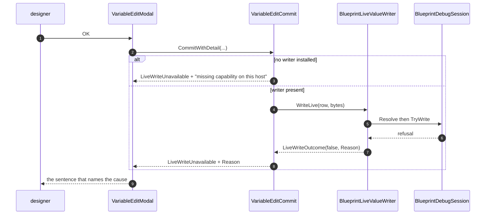

<!--STATUS
state: LIVE
updated: 2026-08-21
current-answer: this whole file — what Batch 102 built, measured and found.
stale-below: nothing.
known-rot: none.
known-conflict: none.
-->
# ⭐⭐⭐ REPORT — Batch 102 · **the Instance write, the named refusal, the cold first frame, the first smoke test**

> **Scope frozen at** `15445c4b8` · **branch** `claude/hrot-implementation-j1jvin` · **started at**
> `c4f44ff`
> ⭐ **Nothing landed on the coordinator branch during this run** — re-checked before the final commit
> *(rule 4)*.

| item | verdict | one line |
|---|---|---|
| **`102a`** | ✅ **done** | a paused edit lands on an `Instance` blueprint — **the contract changed, not the arithmetic** |
| **`102b`** | ✅ **done** | five refusals stop arriving as one `false`; **the host's sentence reaches the dialog** |
| **`102c`** | ✅ **done** | the harness's first pumped frame was **always `dt = 0`** — the last hop is in the TIME CONTROLLER |
| **`102d`** | ✅ **done** | the smoke suite exists, **in its own project, gated**, and **it found something on its first run** |

⭐ **IDs I allocated:** `BP-381` · `BP-382` · `BP-383` · `BP-384` · `BP-385`. ⭐ `BP-379` **closed**.

---

## 1. ⭐⭐⭐ `102a` — **the refusal was an UNBUILT CAPABILITY, not a safety property**

> 🔴 **User:** *"what is correct about not being able to write into a live blackboard of instance when
> simulation is paused?"* ⭐⭐ **Nothing.** 📌 `M-36` carries the coordinator's retraction — it called the
> refusal *"correct"* in **three consecutive handoffs**.

📐 **The READ has resolved that address all along** *(it is what displayed the user's number)*; ⛔ only
the write refused.

### ⚠⚠ The old rail's REASONING was sound and its CONCLUSION was not

`TryWriteWorkingStateField` applied the `AiPrimitive` `+8` working-state header **unconditionally**.

| dispatch kind | where a field lives | that header |
|---|---|---|
| `AiPrimitive` | flat `Blackboard1024`, `8 + fieldOffset` | ⭐ **correct** |
| `Instance` | `payloadOffset + fieldOffset`, slot chosen by the partition allocator, block opens with a **16-byte `BlueprintLatentCursor`** | ⛔⛔ **8 bytes past every field** |

⇒ ⭐ answering under **that** contract really would have corrupted memory — 📌 `Q32` §2.1: *"an
out-of-range offset is MEMORY CORRUPTION, not a wrong value"*, and on a **partitioned** blackboard the
neighbour is **another blueprint's field**.

### 🛠 So the CONTRACT changed, not the arithmetic

⛔ **The hack that was rejected:** returning `payloadOffset + offset − 8` so the writer's unconditional
`+8` cancels. ⭐ **A lie encoded as arithmetic** — correct only while nobody reads the number.

```
WorkingStateFieldRef.RawOffsetBytes  →  ComponentOffsetBytes     (component-absolute)
```

⭐⭐ **Renamed deliberately**, so the compiler forced **every reader** to be revisited rather than
silently reinterpreting a number that had changed meaning.

| ⭐ and the arms MIRROR the read | |
|---|---|
| component pick | the read's own, across the three tiers |
| slot maths | **one** new `TryGetInstancePayloadOffset` — ⭐ `ReadInstanceState` now calls it too |
| the header | applied **only** in the `AiPrimitive` arm, where the layout is known |

### ⭐⭐ And a second defect fell out: **the write path never checked the layout's identity**

📐 `CaptureAiPrimitiveState:1395` refuses to **display** a field when `storedHash != def.StructureHash`.
⛔ The resolve/write path compared nothing ⇒ ⭐⭐ **the designer would be shown NOTHING while the write
happily proceeded.** *(`BP-382`.)*

> ### ⚠⚠ Adding that check **REDDENED FOUR EXISTING RAILS** — and that is the finding
> 📐 The live-write harness handed the session `new EntityRepository()` and a fabricated `Entity(7,1)`
> **that existed in no world at all**, and every rail passed — ⛔ because the resolver trusted the field
> table without ever looking at the entity. ⭐ The harness now builds a real entity carrying a real
> `Blackboard1024` stamped with the definition's hash *(non-zero on purpose: a zero-initialised
> blackboard matches a zero hash **by accident**)*.

### ⭐ Rails — **each failed first**

| rail | what it pins |
|---|---|
| `TheInstanceWriteLandsInTheSlotTests` *(4, new)* | ⭐⭐ attaches through the **production** `BlueprintAttachService` ⇒ the slot offset is **the allocator's**. ⛔ A hand-picked offset would prove the arithmetic against itself |
| `AStaleLayout_ResolvesToNothing` *(new)* | resolve **and** write refuse a recompiled layout |
| `TheHeaderIsAppliedExactlyOnce` *(re-expressed)* | the property is identical; **the owner moved** |
| `AnInstanceEntityWithNoBlackboardComponent_StillResolvesToNothing` *(INVERTED)* | ⭐ argued in its own doc comment: the old rail carried the claim *"answering would corrupt memory"*, which `102a` made false by changing the contract |

---

## 2. ⭐⭐⭐ `102b` — **a missing capability and a correct gate looked IDENTICAL**

⛔ Five causes arrived as one bare `false`, and the dialog said:

> *"no live writer is installed for this host, **or** it refused the write"*

⭐⭐⭐ **That "or" is the mechanism by which `102a`'s defect survived six batches**, and it cost a whole
measurement session plus three handoffs' worth of a wrong conclusion.



| ⭐ decision | why |
|---|---|
| the **SENTENCE** crosses the seam, ⛔ not the enum | `IBlueprintDebugSession` lives **above** `Hrot.Editor.AiShared`; that assembly must not enumerate causes it cannot see |
| the delegate's **return type** changed | ⇒ ⭐ the compiler found **all nine** call sites |
| the missing-writer case names **itself** | *"a missing capability on this host, not a property of the variable"* — ⚠ which is exactly BTree's and HSM's deliberate state today |

⭐ **Railed through the PRODUCTION dialog**, not on the message property: four causes, four **distinct**
strings, plus an assertion that the old "or" sentence never returns. 📌 `M-22` — *"'is it connected?' is
not 'does anything flow?'"*: the message must survive the delegate, the commit, the binder and the modal,
and each of those is a place it used to be dropped.

---

## 3. ⭐⭐⭐ `102c` — **the last hop was in the TIME CONTROLLER**

⭐ Batch 101 proved *"pump #1 ⇒ `dt=0` ⇒ frozen"* and that a late entity in a warm world loses nothing.
⚠ It did not trace **why**. Here it is:

| # | what happens on the harness's FIRST pumped frame | |
|---|---|---|
| ⓪ | `SwitchToDeterministic` **does not enter `Stepping`** — it arms a FUTURE BARRIER and sets `MasterMode.BarrierPending` | `MasterSyncController:253` |
| ① | `Step(0.005f)` → `if (_mode != MasterMode.Stepping) return GetCurrentState();` | ⛔ **a SILENT no-op** — nothing accumulates into `_pendingStepDelta` |
| ② | `Kernel.Update()` → `UpdateBarrierPending` crosses the barrier *(`LookaheadWallTicks = 0`)*, switches to `Stepping`, **returns `BuildGlobalTime(0.0f, 0.0f)`** | ⛔ **an explicit zero** |
| ③ | `BlueprintTickSystem:51` — `if (deltaTime <= 0f) return;` | ⇒ ⭐⭐ **every behaviour tick lost one frame at startup** |

🛠 `EditorHarness.CrossTheDeterministicBarrier()` enters Stepping **at construction**, driven through the
time controller alone — ⭐ crossing a barrier is a **controller state transition**, ⛔ not a simulation
frame, so **no system runs with a zero `dt`**. ⚠ It **throws** rather than returning if the barrier never
falls: a harness silently stuck in `BarrierPending` is precisely the failure this closes, and finding it
once already cost a batch.

⛔ **The eight expectations are UNCHANGED** *(📌 Batch 101's instruction)*.

| measured, per-class in isolation | before | after |
|---|---|---|
| `BlueprintKernelRunTests` | **5 red** | ⭐ **6 green** *(incl. a new `TheHarnessIsStepping_BeforeAnythingPumps`)* |
| `BlueprintObserveTests` | **4 red** | ⚠ **1 red** |
| `SimTimeSyncIntegrationTests` | — | ⭐ **6 / 6** — nothing depended on the cold start |
| `EditorSubsystemBootTests` | — | ⭐ **10 / 10** |

⭐ **The new rail fails ONE HOP FROM THE CAUSE** — *"the harness is still BarrierPending"* — instead of
*"expected 1, actual 0"*, which is what cost Batch 101 a triage.

> ### ⚠ The remaining red is **PRE-EXISTING and unrelated to `dt`**
> `CaptureLiveState_WithoutDebugMap_ReturnsSnapshotWithEmptyFields`. 📐 **Confirmed by re-running with
> the fix un-applied**, where it fails **identically**. Its premise *("no debug map ⇒ empty fields")* is
> false because the resolver falls back to `def.StateFields`. ⛔ It is one of **Batch 101's three
> untriaged reds**, which this batch must not touch.

---

## 4. ⭐⭐⭐ `102d` — **the smoke suite, and it found something on its first run**

⭐ **`Hrot/Runner/Hrot.Smoke.Tests`** — its own `.csproj`, in the solution, **in the gate table below**.

⛔ **Not a corner of `Hrot.ClusterRunner.Integration.Tests`** *(`BP-378`: that project does not finish)*.
It **references** that project for `EditorHarness` — ⭐ reused, ⛔ never copied *(ruling 9)*. ⚠ Referencing
brings the assembly, **not its tests**: the gate row below is **4**, not 178.

| ⭐ nothing is hand-built | |
|---|---|
| the asset | the shipped **`Count4.bp.json`**, read from the repository — ⛔ not a copy, so it cannot rot while the suite stays green |
| the definition | the **source-generated** one, registered through `BlueprintRegistrarScanner` |
| the panels | `PerspectiveWorkspaceServices.CreateRegistrar` + `RegisterExtraWindow` — ⭐ the same helper and the same connect-the-outline pass production uses |

| tier | what it asserts |
|---|---|
| **T1** *(3 cases)* | the blackboard. ⚠ `Count4` is `Count += 11` then `Delay(1s)` ⇒ ⭐ it exercises the **latent cursor**, so a broken resume shows as **22** or **0** rather than passing quietly |
| ⭐⭐⭐ **T2** *(1)* | the row **TEXT** the Details table and the Watch would render — compared **to each other** and to the blackboard. ⛔ **No pixels** |
| **T3** | ⛔ not this batch |

### ⭐⭐⭐ WHAT T2 CAUGHT, ON ITS FIRST RUN

```
blackboard=11, Details showed "0", Watch showed "0"
```

⛔ **Not `(pending)`. Not an exception. A plausible number.** 📐 Both panels push the run state into their
model **from inside `Draw`** *(`VariableDetailsSection:157`; `AiWatchWindow.SyncRunState`, made public by
Batch 100e for exactly this reason)* ⇒ a headless reader that skips it sees `RunState = Planning`, renders
the **INITIAL** arm, and reports the declaration's `DefaultValueJson`.

⭐ The fixture now drives **the same public method the frame drives**, and says so *(`M-29`)* — ⛔ it does
not set `model.RunState` behind the panel's back. ⚠ **Filed as `BP-385`**, because the general question —
*should `Build()` sync from the source itself?* — has a blast radius across every table host and is **not
a rush change**.

### ⚠⚠ THE LIMIT OF THIS TIER, STATED PLAINLY

📌 `R-67`: *"a rail that builds its own composition root cannot see a composition-root defect."* ⭐ The
windows, registrar, row sources, live provider and formatter are **production types** — ⛔ **but the
ARGUMENTS are chosen by the fixture**, because `EditorSubsystem` cannot be constructed headless. ⇒ a
service the real root **holds and forgets to pass** is invisible from here, and that is the shape that has
bitten this programme **nine times**. ⭐ `TheCompositionRootHandsBlueprintALiveWriter` and the generic
forwarding rails remain what covers it; ⛔ **this does not replace them.**

### ⭐ Diagram check *(obligation ③)* — `DESIGN_Smoke_Suite.md` carries **4 classes** and **1 sequence**

| box | built as | why |
|---|---|---|
| `SmokeFixture` · `EditorHarness` · `EditorPanels` | ⭐ **as drawn** | — |
| ⛔ `EditorPanels.Workspace : PerspectiveWorkspace` | **`PerspectiveWorkspaceRegistrar`** | 📌 `R-121`'s extraction is explicitly OUT of this batch, and the registrar is what production actually holds ⇒ ⭐ the deviation makes the diagram **more** true |
| ⚠ one `DetailsRows` | **`BlueprintDetailsWindow.Variables.Model`** | `registrar.AiDetails` is `null` on Blueprint **by construction** *(`HostKindOf("Blueprint") == null`)* — ⛔ not a defect |
| ⛔ `UiFrameSession` | **unreferenced** | the design marks it *T3 only* |

⭐ **The sequence diagram is followed exactly**: load → attach → pump → T1 → Details text → Watch text.

---

## 5. ⭐⭐ REVERT PROBES — **every one reddened, every one un-applied by the INVERSE edit**

⛔ Never `git checkout --`.

| # | probe | result |
|---|---|---|
| ① | give the `Instance` address the `AiPrimitive` header | ⭐ **2 red** — the two address rails; ⛔ the freeze-gate and fail-closed rails stayed green, correctly *(they are address-independent)* |
| ② | disable the `StructureHash` identity gate | ⭐ **1 red** — `AStaleLayout_ResolvesToNothing` |
| ③ | make the modal ignore the host's sentence | ⭐ **1 red** — `EachRefusalReachesTheDesignerAsItsOwnSentence` |
| ④ | `liveValueProvider: null` in the smoke fixture | ⭐ **T2 red** — both panels `(pending)` |
| ⑤ | un-apply `102c`'s barrier crossing | ⭐ **T1 red at `frames: 1`**, and **5 + 4 red** across the two integration classes |

---

## 6. ⭐⭐ GATES — **run ONCE, at the end**

⭐ Base for every figure: **`15445c4b8`**. Unfiltered unless a row says otherwise.
⚠⚠ **ENVIRONMENT STATED** for Blueprints, per the portability note.

| gate | `--no-build`? | result | Δ baseline |
|---|---|---|---|
| solution build | — | **0 errors** | — |
| **AiShared** *(Xvfb)* | ✅ | **1720 / 0 / 0** | ⚠ **0** — see the note below |
| **Blueprints** *(Xvfb)* | ✅ | **3877 / 0 / 10 skip** | **+7** |
| **Blueprints** *(NO display)* | ✅ | **3869 / 0 / 18 skip** | **+7** — ⭐ same tree, both true |
| **BTree.Editor** | ✅ | **622 / 0 / 0** | **0** |
| **Hsm.Editor** | ✅ | **554 / 0 / 0** | **0** |
| **Hrot.Editor** | ✅ | **201 / 0 / 0** | **0** |
| **Breakpoints** | ✅ | **143 / 0 / 0** | **0** |
| **Generators** | ✅ | **277 / 0 / 0** | **0** |
| **Persistence** | ✅ | **143 / 0 / 0** | **0** |
| ⛔ **NodeEditor.Core** | ⛔ **NO** *(out of solution)* | **211 / 0 / 0** | **0** |
| ⛔ **NodeEditor.UI** | ⛔ **NO** | **135 / 0 / 0** | **0** |
| ⛔ **Fhsm** | ⛔ **NO** | **300 / 0 / 0** | **0** |
| ⛔ **StructEdit** | ⛔ **NO** | ⚠ **191 / 1 / 0** | **0** — `BP-363`, named: `Build_CircularReference_CircularFieldIsUnsupported` |
| **Fdp.Presentation** | ✅ | **146 / 0 / 0** *(`BP-337` filter)* | **0** |
| **Fdp.Toolkits** | ✅ | **1964 / 0 / 0** | ⚠ `DEBT-AIB-030` — green this run, ⛔ **not a clearance** |
| ⭐⭐⭐ **`Hrot.Smoke.Tests`** *(NEW)* | ✅ | **4 / 0 / 0** | ⭐ **first appearance** |
| ⛔ `Hrot.ClusterRunner.Integration.Tests` | — | **OUT of the table** *(`BP-378`)* | — per-class only, §3 |
| `tracker-counts.py --check` | — | **OK — open 80 / done 240 (+1 refuted)** | done **+5** |
| `rulings-check.py` | — | **92 / 92 verified** | **0** |
| `design-digest.py --check` | — | **OK** *(53 documents; every buildable design carries both diagrams)* | — |

> ### ⚠ THE ONE Δ THAT NEEDS EXPLAINING — **AiShared 1714 → 1720**
> ⛔ **It is not mine.** 📐 `git grep -c` of `[Fact|Theory|InlineData]` under `Hrot.Editor.AiShared.Tests`:
> **`6106f7047` → 1635** · **`15445c4b8` → 1649** · **`HEAD` → 1649.** ⇒ ⭐ the inventory at the base and
> at HEAD is **identical**, and the growth happened between **Batch 101's base** and **this batch's base**
> *(Batch 101's own `101a` rails, landing in the coordinator's merge)*. ⇒ ⭐⭐ **the handoff's 1714 was
> measured PRE-MERGE; 1720 is the base figure and my Δ is 0.**

### ⭐ Blueprints **+7**, as a diff shape

**+5 new** *(4 Instance rails + `AStaleLayout_ResolvesToNothing`)* · **+2** from `102b`'s two rails ·
**±0** from the re-expressed Theory *(same three `InlineData` cases, renamed)*.

### ⭐⭐ FRAME-RAIL COUNTS: **RAN / SKIPPED**

| environment | ran | skipped |
|---|---|---|
| ⭐ **under `xvfb-run`** | **8** | **0** |
| ⚠ `DISPLAY` unset | **0** | **8** — each printing *"no DISPLAY — run under `xvfb-run …`"* |

### ⭐ Golden movement · tree · quarantine

⛔ **ZERO golden files and ZERO asset `.json` changed.** ⭐ Production source changed in **five** files
*(the offset contract, the resolver, the writer, the composition root's one argument, the harness)* — ⭐
**purely additive at the contract level except the deliberate rename**, which is the point of the rename.
⭐ Working tree **clean** after every suite run. ⭐ Quarantine: Blueprints **10 → 10** *(with a display)*,
**18 → 18** *(without)*; ⛔ **no new skip**.

---

## 7. ⛔ WHAT THIS BATCH DID NOT DO

⭐ Untouched, as the handoff fenced: reviving the 174 *(`S1″`)* · the `EntityRepository` accumulation ·
**T3** smoke · the `PerspectiveWorkspace` extraction *(`R-121`)* · anything from
`DESIGN_Details_Panel_View_Switching.md` *(`R-27`)* · **Batch 101's three untriaged reds** · and nothing
from 94–101 was reverted.

## 8. ⚠ ONE THING I GOT WRONG, AND HOW IT WAS CAUGHT

⭐ `102a` moved the header's owner and **left a rail asserting the old owner** —
`TheStagedOffsetIsTheLayoutsOffsetPlusTheHeader`, **3 red**. ⛔ **The filtered runs I used while building
could not see it**; the **full** Blueprints gate did. ⇒ ⭐ that is the honest cost of `M-37`'s fast tier,
and the reason the full table is non-negotiable. ⭐ The rail is **re-expressed, not deleted**: it now
asserts the same property from the writer's side — *the writer stages the offset it was given and adds
nothing of its own* — **and explicitly not the old behaviour**, so a writer that quietly re-applied a
header still reddens it.
