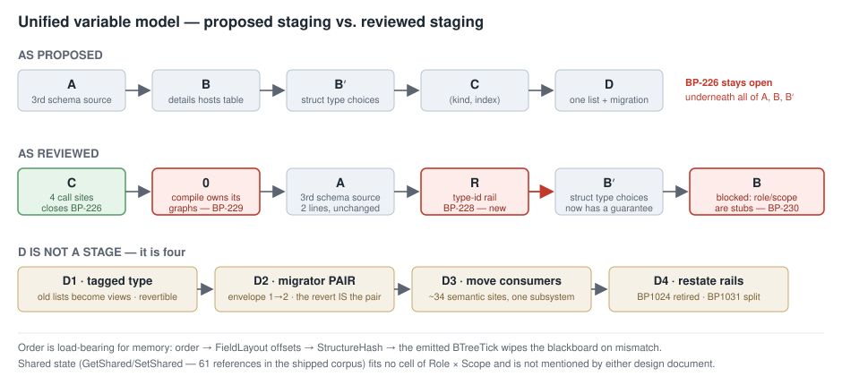

# REVIEW — the unified variable model

> **Implementation session, Batch 38.** Assessment of
> [Variable_Model_Unification.md](Variable_Model_Unification.md) and
> [Variable_Editing_UI.md](Variable_Editing_UI.md), commissioned by
> [HANDOFF_Batch38](HANDOFF_Batch38_Unified_Variable_Design_Review.md).
>
> ⭐ **No feature code was written.** Every measurement below came from throwaway xunit probes and
> greps; the probes were deleted. **Gates unchanged at both ends** (§9).

---

## 0. ⭐ Verdict

> **Build it — with four named changes and a re-ordered plan.**

The `Role` × `Scope` model is **sound**, and stage **C** is much smaller and much more valuable than
the plan gives it credit for. But the plan's centre of gravity is wrong in two ways:

| | |
|---|---|
| ⭐⭐ **C should be FIRST, not third** | it is **4 call sites**, compiler-only, needs nothing from D, and closes `BP-226` — the live ambiguity that makes D dangerous. Doing it last means carrying that ambiguity through the whole programme |
| 🔴 **B rests on a surface that is inert for blueprints** | the shared table's `Role`/`Scope` editors and its reference counter are **no-op stubs** on the Blueprint side. Stage B as written ships a picture, not an editor |
| 🔴 **B′ has no resolvability guarantee to preserve** | the compiler does not *resolve* struct type ids at all — it **passes any dotted string through verbatim**. `Totally.Made.Up.Type` compiles with **zero diagnostics** |
| ⭐ **A stage 0 is missing, and it is not the one §3.7 guessed** | compiling **mutates the caller's `Graph` objects** — proven, not inferred |

⛔ **D is not a stage.** It is a programme; §4.4 proposes the split.



---

## 1. 🔴 Blockers, ranked

| # | finding | blocks | evidence |
|---|---|---|---|
| **R1** 🔴🔴 | **There is no type-resolution guarantee for struct-typed variables — any dotted string compiles.** `Totally.Made.Up.Type` ⇒ `SUCCEEDED=True`, `DIAGS=[]`, emits `public global::Totally.Made.Up.Type Threat;` | **B′** | §2 C1 |
| **R2** 🔴 | **The shared table's `Role`/`Scope` editors are no-ops for blueprints**, and `CountNodesReferencingVariable` returns a **hardcoded `0`** | **B**, and Batch 39's §3.3 | §2 C5 |
| **R3** 🔴 | **`IVariablesSchemaSource.UpdateVariableScope` takes `WorkingStateScope`** — the shared contract cannot carry a blueprint two-valued scope. Q-b and stage B contradict each other | **B**, **D** | §6 Q-b |
| **R4** 🔴 | **`Compile` mutates the caller's live `Graph` objects** — the macro splice removes the caller's `MacroCallNode`. Not "shallow copy": a write-through | **stage 0** | §2 C7 |
| **R5** 🟠 | **Shared state (`GetShared`/`SetShared`) fits no cell** and is not mentioned once. **61 references in the shipped corpus** | model completeness | §3 |
| **R6** 🟠 | **The three order lists are unmaintained on remove/rename, and order feeds `StructureHash`** ⇒ a migration that reorders wipes every deployed blackboard | **D** | §5.2 |
| **R7** 🟠 | **D is a programme.** One list + a tag + a migrator pair + three rails + every consumer | **D** | §4.4 |

⭐ **R1 and R4 are the two that change the plan.** R2/R3 change what stage B can honestly claim.

---

## 2. The eight claims, re-measured

| # | verdict | what I found |
|---|---|---|
| **C1** | ⚠ **HALF TRUE — and the false half is a blocker** | ✅ FQN compiles clean with correct `Marshal.OffsetOf`/`Unsafe.SizeOf`; short name ⇒ `BP1500`; `TryResolve` False for both. ⛔ **But the mechanism is not "resolved by FQN" — it is *unvalidated pass-through of any dotted string*.** See R1 |
| **C2** | ✅ **CONFIRMED** | `DetailsTarget.Variable(VariableId)` and `LocalVariable(FunctionId, LocalId)` both exist (`IDetailsViewProvider.cs:76,81`); the only `IDetailsViewProvider` implementation in the repo is NodeEdit's own demo |
| **C3** | ✅ **CONFIRMED, by compile** | Instance + `WorkingState` ⇒ `BP1031`; AiPrimitive + `Variables` ⇒ `BP1024`. Both refuse at Stage 2, before lowering |
| **C4** | ✅ **CONFIRMED** | `IsEditable`/`IsExposedOnSpawn`: the compiler holds only the two property declarations and one doc comment. The only other readers are the editor's duplicate/copy paths. **No spawn path exists at all** |
| **C5** | ⛔ **FALSE where it matters** | The columns may render, but `BlueprintVariableSchemaSource` implements them as stubs — and says so: *"S3-1: Blueprint variables do not use role/scope; no-op implementations."* `CountNodesReferencingVariable(name) => 0`. See R2 |
| **C6** | ✅ **CONFIRMED** | `BlueprintJsonServices.cs:36` stamps `DocumentMeta(HrotDocumentTypes.Blueprint, 1)`; `ScenarioMigrationModule` is the pattern, migrator pairs included |
| **C7** | ⚠ **UNDERSTATED — it is worse than claimed** | Not merely aliasing: **the splice writes through into the caller's object.** After `Compile`, the caller's own `Graph` no longer contains its `MacroCallNode`. See R4 |
| **C8** | ✅ **CONFIRMED** | AiPrimitive with **both** `Parameters` and `WorkingState` compiles clean — the one legal pair — and `VarFieldName` has no `Parameters` arm, so a `Parameters` index ≥ `WorkingState.Count` falls through to `__var_{index}` |

### ⭐ C1 in full — the finding the claim was one step short of

```
TryResolve('Hrot.AI.Behaviors.StructDemoData') = False
--- TypeId='Hrot.AI.Behaviors.StructDemoData'  SUCCEEDED=True   DIAGS=[]
--- TypeId='StructDemoData'                    SUCCEEDED=False  DIAGS=[BP1500]
--- BOGUS  'Hrot.AI.Behaviors.NoSuchStructAtAll' SUCCEEDED=True DIAGS=[]
--- BOGUS  'Totally.Made.Up.Type'                SUCCEEDED=True DIAGS=[]
        public global::Totally.Made.Up.Type Threat;
```

⇒ The rule is **purely syntactic**: *contains a dot ⇒ trusted verbatim; no dot ⇒ `BP1500`.*

| consequence | |
|---|---|
| ⛔ **`BP-87`'s durable property cannot be preserved by a list union** | *"every offered type is guaranteed resolvable"* has **no compiler-side check to lean on** for the struct half |
| ⛔ **The lock the design asks for would pass on a fabricated type** | *"assert END-TO-END COMPILATION, not `TryResolve`"* — but compilation **succeeds**. Only Roslyn catches it, i.e. the solution build |
| 🔴 **A moved or mistyped struct FQN is a `CS0246` in generated code with no BP diagnostic** | ⭐ **exactly the shape of the `__var_-1` defect** — the blueprint compiles, the solution does not, and nothing names the variable |

⇒ **B′ needs a compiler-side rail before it needs a picker.** Filed as a row (§8).

---

## 3. Does every declaration fit exactly one cell?

| today | cell | fits |
|---|---|---|
| `Parameters` | (Input, Asset) | ✅ |
| `WorkingState` | (State, Asset) | ✅ |
| `Variables` | (State, Asset) | ✅ — **same cell**, deliberately |
| `Graph.LocalVariables` | (State, Graph) | ✅ |
| `Graph.Inputs` | (Input, Graph) | ⛔ ruled out — and the ruling holds (§6) |

### ⭐ Two things fit NO cell, and one of them ships

| | |
|---|---|
| 🟠 **Shared state** — `GetSharedNode`/`SetSharedNode` | entity-scoped, **name-keyed**, resolved at **runtime** (`BlueprintSharedState.TryGetShared`), and **declared nowhere in the asset**. ⭐ **61 references across 8 shipped assets** (`"state"` ×58, `"rally"` ×3). To a designer this is a variable; to the model it does not exist. **The design does not mention it once** |
| 📌 **Synthesized fields** — `__phase`, `__waitUntilTime`, `_when_*_prev` | injected into `WorkingState` *during lowering*. They are (State, Asset) but were never declared. Under D they need a `Synthesized` marker or they surface in the authoring UI |

⚠ **This does not sink the model** — but a "unified variable model" that omits the one storage class
six shipped assets actually use should say so out loud, in the document, as a deliberate exclusion.

### ⭐ The (State, Asset) collision is reversible — state that, it matters for C6

`Variables` and `WorkingState` land in the same cell, so the down-migrator C6 demands looks lossy.
**It is not:** `BP1024`/`BP1031` make the choice a function of `Dispatch` (AiPrimitive ⇒ `WorkingState`,
Instance ⇒ `Variables`), enforced at Stage 2. ⇒ **the pair is a bijection and the roll-back is writable.**

⚠ **The flip side:** for that cell the tag carries **no information `Dispatch` did not already carry**.
D's benefit is *one list*, not *the tag tells you the storage*. Worth saying plainly, because the
model document implies the second.

---

## 4. The stages

### 4.1 Is **A** really editor-only? ⭐ **Yes — and it is two lines**

`BlueprintVariableSchemaSource` is constructed at exactly **two sites, both in
`BlueprintVariablesWindow.cs` (`:238`, `:239`)**. Nothing else consumes the `bool isParams`
constructor. ✅ **A is editor-only, trivial, trivially revertible.**

⚠ **One thing the design misses:** the three kinds are **mutually exclusive by dispatch** — an
AiPrimitive has `Parameters`+`WorkingState`, an Instance has `Variables`, and `BP1024`/`BP1031` refuse
the mixtures. A three-way enum is right, but the window must offer only the kinds legal for the
asset's dispatch or it invites authoring a `BP1024`.

### 4.2 ⭐⭐ Is **C** independent of **D**? — **Yes, completely. And the ordering claim is wrong because of it**

The kind does not need a tag on the declaration: **`FindVariableIndex` already knows which list
matched.** Returning `(kind, index)` is a change of return type at the point of a search that already
has the answer.

| the whole blast radius of C | |
|---|---|
| `FindVariableIndex` real callers | **2** — `Stage5:1217`, `Stage5:2548` |
| `VarFieldName` real callers | **2** — `StatementEmitter:59`, `:63` |
| `IrOp_ReadVariable`/`IrOp_WriteVariable` | **13 mentions total**, doc comments included |

⇒ ⭐⭐ **C is the smallest stage, is compiler-only, closes an open row, and is a strict prerequisite
for nothing.** Leaving it third means `BP-226`'s ambiguity is live underneath A, B and B′ — including
underneath any picker that widens what can be targeted.

📐 **Recommendation: C moves to first.**

### 4.3 Is **B′** separable from **B**? — **Yes, but it is blocked**

B′ (the type-choice record union) touches no panel routing. ⛔ **But R1 means B′ cannot ship as
specified**: a list union that offers FQNs offers types nothing validates. **B′ needs a rail first.**

### 4.4 Is **D** one stage? — ⛔ **No. It is at least four**

| | |
|---|---|
| **D1** | the tagged declaration type + both projections, **model only, no consumer moved** — old lists become computed views |
| **D2** | the migrator **pair** + envelope bump 1→2, with existing assets round-tripping |
| **D3** | consumers moved off the old views, in dependency order (§5.1) |
| **D4** | the rails restated (`BP1024` retired, `BP1031` split, `BP1011` re-stated as a capability boundary) and the old views deleted |

⚠ **D1 is the only one that can be reverted cheaply.** Once D2 has written v2 files, revert means
running the down-migrator — which is why C6's insistence on a pair is not a nicety.

### 4.5 Revert-goes-red per stage

| | |
|---|---|
| A · B · B′ · C | ✅ independently revertible — no persisted format changes |
| **D2** | ⛔ **not revertible by `git revert`.** Reverting the code leaves v2 files on disk that the reverted reader cannot open. **The down-migrator is the revert**, and it must be written and tested *in the same batch* |

---

## 5. The sweeps the design documents did not do

### 5.1 ⭐ Consumer census — **71 non-test sites, and ~34 of them are not mechanical**

| bucket | sites | **semantic** | what makes them semantic |
|---|---|---|---|
| **Compiler stages** | 24 | **15** | `BP1024`/`BP1031` themselves · three separate `ComputeStructSize` budgets · `Stage5:80-82`, where each list is paired **positionally with its OWN order list** · `FindVariableIndex` |
| **Lowering** *(IrAsset)* | 10 | **10 — all** | ⭐ `FieldLayout` gives each list **its own byte-offset space** (`0` / `8` / `16`) because they are three different emitted structs · `StructureHash` traverses them in a fixed order · `AiPrimitiveLowering`/`WhenLowering` **append synthesized fields after Stage 2's gate** |
| **Emit** *(IrAsset)* | 15 | **8** | `VarFieldName` vs `ParamFieldName` — the split IS `BP-226` · `struct Params` + `struct WorkingState` vs the single `struct State` are emitted per-list, structurally |
| **Editor** | 45 | **1 file / 24 lines** | `BlueprintVariablesWindow` is built end-to-end around `bool _isParams`; not a line fix, a rewrite |
| **Debug / inspector** | 0 | 0 | ⭐ insulated — see §5.3 |
| **Generators** | **0** | 0 | the only hits were Roslyn's `IMethodSymbol.Parameters` |
| **Tests** | ~46 files | — | 44 in `Hrot.Blueprints.Tests`, 2 in `Hrot.Diagnostics.Breakpoints.Tests` (descriptors only) |

⛔ **Nothing outside `Hrot.Blueprints.*` reads these lists.** That is the census's best news: the blast
radius is one subsystem.

⭐ **New finding the census turned up:** `MakeUniqueName` (`BlueprintDocumentFactory:786,1312,1567`)
checks uniqueness **within `asset.Variables` only**. A `Parameter` and a `Variable` may both be named
`Health` today, silently. **One list forces that decision** — and `FindVariableIndex`'s name fallback
means the collision is already reachable. Filed (§8).

### 5.2 ⭐ The three order lists — the design does not mention them, and they bite twice

| | |
|---|---|
| **What they are** | `ParameterOrder` · `WorkingStateOrder` · `VariableOrder`, each a `List<Guid>` consumed by `Stage5.GetOrdered` |
| ✅ **Robust to junk** | `GetOrdered` skips ids it does not know and appends unlisted fields sorted by `Id` — a stale entry is harmless |
| 🔴 **But they are not maintained** | `BlueprintVariableSchemaSource.RemoveVariable`/`RenameVariable` touch **neither** order list. Only `AddVariable`/`MoveVariable` do. A deleted variable leaves its id behind forever |
| ⚠ **`ToDictionary(f => f.Id)`** | two declarations sharing an id crash the compiler rather than diagnosing |
| 🔴🔴 **Order is load-bearing for memory** | order → `BuildIrFields` → `FieldLayout` offsets → **`StructureHash`** → the emitted `BTreeTick` wipes the blackboard on mismatch. ⇒ **any migration that changes relative field order resets every deployed entity's persisted state.** The design must state that merging three order lists preserves order *within* each group, or accept a global wipe |

### 5.3 Debug / inspector surface — ✅ **already insulated**

`BlueprintFieldDescriptor(Name, ClrType, OffsetBytes, SizeBytes, CategoryOrEmpty)` and its debug-map
sibling `StateLayoutField` **carry no notion of which list a field came from** — they are keyed by name
and offset, built downstream of the flatten-to-`IrField` step. `DebugMapBuilder` has **zero** direct
references to the three lists. ⇒ **D needs no change here at all.**

📌 The debug-map `SchemaVersion` is `"1.1"` and is **not asserted by value** anywhere — a soft version,
not a gate.

### 5.4 Comparison fixtures — ✅ **not a risk**

`BlueprintComparisonSanitizer` walks the DOM **generically** and alphabetically sorts every key; it
never names `Parameters`/`WorkingState`/`Variables`. **3 fixtures.** Its two byte-identity tests
(`Sanitize_RunTenTimes…`, `Sanitize_ShuffledInput…`) compare **its own output against its own output**,
so a new property is carried through both sides.

### 5.5 ⭐ Round-trip — **the design (and my own census sweep) over-read this. It is NOT a barrier**

All seven round-trip tests are the same three lines:

```csharp
var j1 = Serialize(asset);  var j2 = Serialize(Deserialize(j1));  Assert.Equal(j1, j2);
```

⇒ ⭐ **That asserts serializer IDEMPOTENCE, not identity with anything on disk.** Two new properties
preserve it automatically as long as they round-trip. **No shipped `.bp.json` is compared byte-wise to
its re-serialization anywhere.**

⚠ **What is still true:** re-saving any asset after D2 rewrites its file (`JsonStringEnumConverter`,
no global `DefaultIgnoreCondition`, PascalCase preserved). ⇒ **the envelope bump 1→2 and the migrator
pair are still right** — for versioning honesty, not because a test forces them. That distinction
matters: it means **D2 can be scheduled on its merits rather than as a test-fixing exercise.**

### 5.6 `Dispatch: 1` (`BP-227`)

⚠ **Not measured.** Four assets carry a numeric `Dispatch`; whether a migrator that rewrites the same
file normalises or preserves that spelling is unanswered, and it needs answering **before** D2 runs
over the corpus. Listed in §8.

### 5.7 ⭐ Is a stage 0 missing? — **Yes, and not the one the handoff guessed**

§3.7 supposed the shallow copy was a prerequisite *for writing asset lists during compilation*. **The
real problem is already live and needs no future stage to trigger it:**

```
[macro splice] caller host.Nodes 3 -> 3
[macro splice] caller still has the MacroCallNode: False      ← the caller's own Graph was rewritten
[macro splice] asset.Graphs[1] SAME OBJECT as caller's host: True
```

⇒ **Compiling an asset expands its macro calls in the caller's own object.**

| how bad is it today | |
|---|---|
| ⭐ **Not currently reachable in production** | the only production compile path is `BlueprintIncrementalGenerator`, which parses `.bp.json` **AdditionalTexts** into a fresh asset per compile. The one path that would hand `Compile` a live document — `QuickReloadService.TriggerAsync` — has **no production caller**: every reference to it is a test |
| ⚠ **But it is a loaded gun** | the service exists and is constructor-injected. The day it is wired to a hotkey, compiling silently expands the designer's macro calls in the open document — and `Stage0`'s pin rehydration is *already* documented as escaping on purpose, so "the compiler does not touch your asset" is not an invariant anyone can rely on |

📐 **Stage 0 = give `Compile` an owned deep copy of the graphs it rewrites** (or make Stage 2.5 copy
before splicing). Small, compiler-only, and it removes the one hazard that would otherwise sit under
every later stage. ⭐ **This answers the handoff's stated gap: the coordinator could not establish
whether a production path hands `Compile` a live asset. It does not — today, and only because the
service that would is unreachable.**

---

## 6. The §5 rulings, pressure-tested

| ruling | verdict |
|---|---|
| **`Graph.Inputs` OUT** | ✅ **holds.** They are `ParameterDecl` read through `IrOp_ReadInputArg` and emitted as method parameters. Nothing treats one as storage |
| **`Scope` = two values** | ⚠ **the reasoning holds; the plan does not.** `WorkingStateScope{Node,Behavior,Entity}` is indeed a different axis. ⛔ **But `IVariablesSchemaSource.UpdateVariableScope(string, WorkingStateScope)` is the shared contract stage B reuses** — it cannot carry a blueprint scope. Either the shared interface gains a second scope concept, or blueprints do not edit scope through that table. **The two documents assume both.** (R3) |
| **Instance gets no `Input` channel** | ✅ **holds.** `IsExposedOnSpawn` is inert and **no spawn path exists** — nothing would consume it |
| **One table, `Scope` a column** | ⚠ conditional on R3 |
| **struct picker = list union, FQNs only** | ⛔ **premise broken.** See R1. The union is still the right *shape*; what is missing is anything to validate it against |

---

## 7. What must be decided before this becomes tasks

| must decide FIRST | why |
|---|---|
| ⭐ **What validates a struct type id** | R1. A registry entry? A Roslyn-backed check in the generator? An allow-list from `[BlackboardDtoStruct]` discovery? **B′ cannot be specified until this is answered** |
| ⭐ **Whether blueprints edit `Role`/`Scope` through the shared table at all** | R3. If yes, the shared contract changes and two more gates move |
| ⭐ **Whether shared state joins the model** | R5. Cheap to answer, expensive to retrofit |
| **Whether D2 may reorder fields** | R6. Decides whether the migration wipes deployed blackboards |

| can decide later | |
|---|---|
| the `Role`/`Scope` enum names and JSON spelling | D1 |
| whether `IsEditable`/`IsExposedOnSpawn` survive the merge | inert either way (C4) |
| the details-panel layout | B |

---

## 8. ⭐ What I could NOT establish

| | |
|---|---|
| **Whether the shared table renders `Role`/`Scope` columns *for a blueprint asset*** | I confirmed the blueprint-side handlers are stubs, which is the load-bearing half. **Whether the columns are drawn-but-dead or hidden entirely, I did not check** — it needs the UI on screen, and there is no ImGui in this container |
| ⛔ **Anything visual.** | The visual check has now not been done for **five** batches |
| **Whether any *other* repo consumer outside this solution reads blueprint JSON** | I searched this repository only |

---

---

## 9. Rows filed

| row | |
|---|---|
| **BP-228** 🔴 | **A struct type id is unvalidated pass-through.** Any dotted string compiles with zero diagnostics and emits `global::{whatever}` ⇒ `CS0246` in generated code naming no variable. **Blocks B′** |
| **BP-229** 🔴 | **`Compile` mutates the caller's `Graph` objects** — the macro splice removes the caller's `MacroCallNode` in place. Not reachable in production today only because `QuickReloadService` has no caller |
| **BP-230** 🔴 | **`BlueprintVariableSchemaSource`'s `Role`/`Scope`/reference-count members are stubs** — `CountNodesReferencingVariable => 0`, the two `Update…` methods empty. **Trap #5: reports success while doing nothing** |
| **BP-231** 🟠 | **`RemoveVariable`/`RenameVariable` do not maintain the order lists** — a deleted variable's id stays in `ParameterOrder`/`WorkingStateOrder` forever. Benign today (`GetOrdered` skips unknown ids); load-bearing once order is merged |
| **BP-232** 🟠 | **`MakeUniqueName` checks `asset.Variables` only** — a `Parameter` and a `Variable` may share a name, and `FindVariableIndex`'s name fallback makes the collision reachable |
| **BP-233** 🟠 | **`BP1650`'s latency list omits `ChannelCommandNode` with `ActionFqn`** — a **fourth** copy of the "can this suspend?" predicate, and a called Function graph containing an inline action reaches Emit with an unlowered `IrTerm_Suspend` (a throw, not a diagnostic) |

---

## 10. Gates

| | start | end |
|---|---|---|
| Solution build | **0 errors**, 69 warnings | **0 errors** |
| Blueprints suite | **3243** / 0 failed / 10 skipped | **3243** / 0 failed / 10 skipped |

⭐ **No product code was changed by this batch** — `git status` at the end shows only this document, its
diagram, and the tracker. All probes were deleted.

⚠ **Honest note on the warning count.** The closing build reported **35** warnings, not 69, because it
was **incremental** — only the test project recompiled after the probe was deleted, so the other
projects' warnings were not re-emitted. **No compiled file changed in this batch**, so the count cannot
have moved; the 35 is a build-output artifact and not a delta. Recording it rather than quietly
printing "69".

---

## 11. 📌 Note for whoever picks up Batch 39

Its **§1 (Q27-A3 suspension-surviving storage)** and **§2 (the dangling-reference rail)** were built,
tested and gate-green before this batch replaced them, then reset off the branch when the review took
Batch 38's slot.

> ⛔⛔ **COORDINATOR CORRECTION `2026-08-13` — `2c1638b` and `bec149d` ARE NOT RECOVERABLE FROM THE
> REMOTE, and the cherry-pick recipe below does not work.** Verified after the force-push:
> `git cat-file -t` fails for both · `git rev-parse` fails for both · `git fetch origin <sha>` fails
> for both · `git ls-remote origin` shows **one** implementation ref (the force-pushed one) and
> **zero tags** · `git fsck` finds one dangling commit, `02fb66db`, which is neither of them.
> ⇒ ⭐ **The only place they can still exist is the implementation session's own local clone
> (reflog / object store). They must be pushed to a ref from there before that container is
> reclaimed.** ⚠ **Until that happens, treat this work as LOST and Batch 39 §1/§2 as unbuilt.**

⭐ **The assessment itself stands:** both are compiler-only and touch **none** of the surfaces this
review says are in flux, so `RESUME_START_HERE`'s *"may be pulled forward"* holds — ⭐ **pull them
forward, rebuilt if necessary.** `BP-233` came out of that work and **is recorded**, so the finding
survived even though the commits did not.
