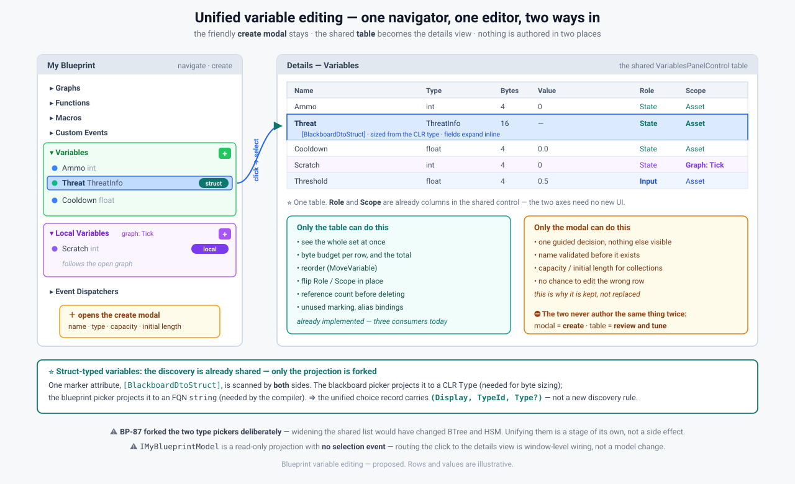

# Unified variable editing UI — the vision

> **Coordinator, 2026-08-13.** Companion to
> [Variable_Model_Unification.md](Variable_Model_Unification.md), which covers the *model*. This one
> covers **what the designer sees**. ⭐ **The user's proposal — table as the details view of the
> Variables section, selection following the click — is endorsed**; this records it, the reasons, and
> what has to change.
>
> 📌 **Input to Q28.** ⛔ **Not an implementation task yet** — see the banner below.

> ⏳ **AWAITING INDEPENDENT REVIEW — [Batch 38](HANDOFF_Batch38_Unified_Variable_Design_Review.md).**
> ⚠ **Nothing here is actionable yet.** The implementation session is assessing feasibility, hunting
> gaps and testing the staging. ⭐ **Every measured claim in this document is a hypothesis until they
> confirm it** — and they have corrected this coordinator in every batch since 29.



---

## 1. The shape — one navigator, one editor, two ways in

| | role | what it is today |
|---|---|---|
| **My Blueprint** | ⭐ **navigate and create** | `BlueprintMyBlueprintModel` sections + `VariableCreateModal` |
| **Details** | ⭐ **review and tune** | ⛔ **not wired to variables at all** — the table lives in a separate window |

⛔ **Nothing is authored in two places.** The modal *creates*; the table *edits*. That division is what
keeps this from becoming a third parallel implementation.

---

## 2. Why both, rather than one

⚠ **They are not duplicates.** Each does something the other structurally cannot:

| only the **table** | only the **modal** |
|---|---|
| the whole set at once | one guided decision, nothing else on screen |
| **byte budget** per row and in total | name validated *before* the variable exists |
| reorder (`MoveVariable`) | **capacity / initial length** for collections |
| flip `Role` / `Scope` in place | no chance to edit the wrong row |
| ⭐ **reference count before deleting** (`CountNodesReferencingVariable`) | |
| unused marking, alias bindings | |

⇒ ⭐ **Replacing the modal with the table would lose guided creation; replacing the table with the
modal would lose the byte budget and the whole-set view.** Keep both, on one model.

---

## 3. The selection flow — the user's proposal

```
click a variable in My Blueprint
        └─▶ Details panel shows the variables TABLE
                └─▶ with the selection moved to the clicked row
```

⭐ **Why this is the right shape:** it matches the convention the canvas already uses — `INodeModel.Kind`
is documented as *"used by catalog lookups and **Details panel routing**"*. ⇒ **Selection routes to
Details** is an established rule here, not a new one; My Blueprint is simply a second selection source.

⚠ **What it costs:** `IMyBlueprintModel` is a **read-only projection** — `Sections`, `GetItems`,
`Changed`, and **no selection or activation event**. ⇒ the click-to-details wiring lives in
`BlueprintMyBlueprintWindow`, not the model. 📐 **Whether the panel already surfaces selection to its
host is the one thing to check first** — if not, that is a small `NodeEditor.Core` addition and it
moves two gates (NodeEdit Core, UI).

⭐ **The section stays the navigator even so.** A designer scanning for *"where is `Threat` declared"*
wants the tree, not a table — and locals must stay grouped under the graph that owns them.

---

## 4. ⭐ Struct-typed variables — already discovered, only the projection is forked

**Requirement:** a hardcoded struct must be usable as a variable, exactly as in WorkingState.

✅ **The discovery rule is already shared.** One marker attribute, `[BlackboardDtoStruct]`, is scanned
by **both** sides:

| consumer | projects to | why that shape |
|---|---|---|
| `BlackboardTypeChoiceBuilder` *(AiShared)* | `VariableTypeChoice(Display, Type)` — **CLR `Type`** | the table needs it for **byte sizing** |
| `ISharedStructTypeProvider` *(Blueprints)* | **FQN `string`** | the compiler resolves types by `TypeId` |
| `BlackboardFieldClassifier` | the predicate itself | one definition of "is a shared struct" |

⇒ ⭐ **The unified choice record carries `(Display, TypeId, Type?)`.** Both projections are needed and
neither is wrong; today they are simply built twice from one rule.

### ⚠ But the two *pickers* were forked on purpose, and that is the hard part

| | |
|---|---|
| `BlackboardTypeHelper.DefaultKnownTypeNames` | shared by blueprints, BTree and HSM · primitives **+ structs** |
| `BlueprintTypeChoices` | blueprint-local · a projection of `StaticTypeRegistry.EditorOfferableTypeIds` · **17 types, no structs** |

⭐ **`BP-87` split them deliberately**, and the reason is recorded in the file: widening the shared list
to fix a blueprint problem *"would change the BTree and HSM blackboard pickers too."* ⚠ And `BP-87`'s
durable half is that the blueprint list is a projection of the **compiler's own registry**, so every
offered type is guaranteed resolvable — a property a merged list must not lose.

⇒ ⛔ **Do not merge the two lists.** ⭐ **Merge the *shape*:** one choice record, two contributors —
`StaticTypeRegistry.EditorOfferableTypeIds` for primitives, `[BlackboardDtoStruct]` discovery for
structs — with **the resolvability lock (`BP87_TypePickerTests`) extended to cover the struct half.**
📐 A struct offered to a blueprint variable must resolve in the compiler; **whether it does today is
unverified and is the first thing to measure.**

---

## 5. 📌 The one thing [Batch 39](HANDOFF_Batch39_Finish_Local_Variables.md) must do differently

⚠ As drafted, its Local Variables section is a **third** implementation. ⇒ **One instruction:**

> ⭐ **Implement the locals source as an `IVariablesSchemaSource`**, and have the My Blueprint section
> project it. **Same UI as ruled** — canvas-following section, always present, `[+]` where applicable
> — but it lands *inside* the unified path instead of beside it.

📌 It also gets `CountNodesReferencingVariable` for free, which is exactly what its §3.3
delete-while-referenced needs. ⛔ **Batch 39 is postponed** until Batch 38's review returns.

---

## 6. Where this sits in the staged plan

| stage *(from [the model doc](Variable_Model_Unification.md) §4)* | what the designer notices |
|---|---|
| **A** — `Variables` becomes a third `IVariablesSchemaSource` | nothing yet |
| **B** — Details shows the table; My Blueprint routes selection into it | ⭐ **this document's picture** |
| **B′** — unify the type-choice record so structs are offerable | ⭐ **struct-typed variables** |
| **C** — `(kind, index)` in the compiler | nothing |
| **D** — one declaration list with `Role`/`Scope` | the `Role`/`Scope` columns become authoritative |

⭐ **The UI lands at B, before the model change** — and that is deliberate: the table already renders
`Role` and `Scope` columns, so the unified *view* can ship while the model still has four lists behind
an adapter. **The designer sees the unified picture before the risky migration, not after.**

---

## 7. ✅ ANSWERED — architect ruling, `2026-08-13`

> ⚠ **Provenance: Claude ruling, delegated by the user** — same standing as `Q27-D`.
> ⛔ **NotebookLM was not consulted.** ⭐ **Both measurable questions were measured.**

### Q-e · Does the Details panel host non-node content? → ⭐⭐ **It is already designed for exactly this**

`NodeEditor.Core/Interfaces/IDetailsViewProvider.cs` — `DetailsTarget` is an open hierarchy:

```csharp
SingleNode · MultipleNodes · Comment · Asset · Function · Macro · CustomEvent · EventDispatcher
Variable(string VariableId)
LocalVariable(string FunctionId, string LocalId)     // ⭐ already there
```

⭐⭐ **`LocalVariable` is keyed by `(FunctionId, LocalId)`** — the contract already models a local as
*belonging to a graph*, which is precisely the canvas-following section §3 proposes. **The routing key
does not need inventing; it was designed in.**

⚠ **What is actually missing:** ⛔ **no Blueprint type implements `IDetailsViewProvider` at all.** The
only implementations in the repo are NodeEdit's own `DemoNodeDetailsProvider`, `DetailsPanel` and
`DetailsViewRegistry`. ⇒ ⭐ **The work is "register a provider", not "extend the contract"** — and none
of it moves the two NodeEdit gates.

### Q-f · One table, or one per scope? → ⭐ **One**, with `Scope` as a column

And the reason is now stronger than taste: ⭐ **`DetailsTarget` already distinguishes `Variable` from
`LocalVariable`, so the *selection* is scope-aware before the table sees it.** The table does not need
splitting to know what was clicked — it needs a column and grouping. ⛔ A table per scope would
re-create exactly the panel sprawl this work exists to remove.

### Q-g · Does the modal gain `Role`/`Scope`? → ✅ **Yes, defaulted, and shown only where meaningful**

⭐ **The precedent already exists in the shared control:**
`VariableViewModel.ShowScopeSelector => Role == BlackboardVariableRole.State` — Scope is **hidden for
Inputs** because it has no meaning there. **Mirror that rule in the modal** rather than inventing a
second one. Creating an `Input` must not require creating a `State` and flipping it afterwards.

### Q-h · Does a struct-typed blueprint variable compile? → ⭐⭐ **VERIFIED: YES, and it already works**

**Coordinator-probed on the merged tree:**

```
TryResolve('Hrot.AI.Behaviors.StructDemoData') = False      ← NOT via the registry
TryResolve('StructDemoData')                   = False

Compile, Instance asset, Variables += { Threat : Hrot.AI.Behaviors.StructDemoData }
  SUCCEEDED = True   DIAGS = []
  public global::Hrot.AI.Behaviors.StructDemoData Threat;
  new BlueprintFieldDescriptor("Threat", typeof(...StructDemoData),
      Marshal.OffsetOf<State>("Threat"), Unsafe.SizeOf<...StructDemoData>(), "")

Compile, same but TypeId = "StructDemoData"  (short name)
  SUCCEEDED = False  DIAGS = [BP1500]
```

⇒ ⭐ **Struct-typed variables are a solved compiler problem** — resolved by **fully-qualified name**
through a path that is not `EditorOfferableTypeIds`, complete with correct offset and size in the field
descriptor. **The gap is picker-only.**

⇒ ⭐ **The fix is a list union and nothing else:**
`BlueprintTypeChoices` ∪ `ISharedStructTypeProvider.GetSharedStructTypeFqns()` — and the latter
**already returns FQNs**, which is exactly the form that works.

⚠⚠ **Two conditions, both load-bearing:**

| | |
|---|---|
| ⛔ **The picker must offer the FQN, never the short name** | a short name compiles to **`BP1500`**, and a picker that offers an uncompilable type is `BP-87`'s original defect verbatim |
| ⭐ **Extend `BP87_TypePickerTests`' resolvability lock over the struct half** | its whole purpose is *"every offered id resolves"*. ⚠ **Note the lock must assert END-TO-END COMPILATION, not `TryResolve`** — `TryResolve` returns **False** for a type that compiles fine, so a lock written against the registry would reject every struct |
