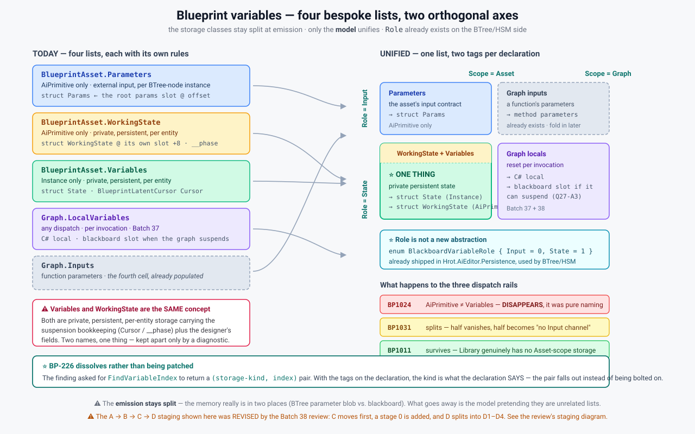

# Variable model unification — the vision, and how it maps to today

> **Coordinator, 2026-08-13**, at the user's request. ⭐ **The question is not *whether* to unify —
> that is ruled — but *how* to do it without breaking things.** Everything below is verified against
> code; the one speculative item is marked.
>
> 📌 **Input to Q28.** ⛔ **Not an implementation task yet** — see the banner below.

> ✅ **REVIEWED — [Batch 38](REVIEW_Unified_Variable_Design.md), `2026-08-13`. Verdict: build it, with
> four named changes and a re-ordered plan.** ⭐ **This document has been updated to match.**
>
> ⛔⛔ **Two of its measured claims were WRONG and the corrections are inline below:**
> **`C1`** — a struct type id is *unvalidated pass-through*, not FQN resolution (**`BP-228`**) ·
> **`C5`** — the shared table's `Role`/`Scope` editors and its reference counter are **stubs** on the
> Blueprint side (**`BP-230`**). ⚠ **Anything quoting this document from before `2026-08-13` is stale.**



---

## 1. The whole idea in one line

⭐ **Four bespoke lists are two orthogonal tags: `Role` ∈ {`Input`, `State`} × `Scope` ∈ {`Asset`, `Graph`}.**

⚠ **The model unifies; the emission does not** — the memory genuinely lives in two places (the BTree
parameter blob vs. blackboard), so `Params` and `State`/`WorkingState` stay separate structs. What goes
away is the *model* pretending they are unrelated.

---

## 2. The mapping — today → unified

| today | Role | Scope | emits to | dispatch |
|---|---|---|---|---|
| `BlueprintAsset.Parameters` | `Input` | `Asset` | `struct Params` ← `bb.BehaviorParameters[paramIndex]` | AiPrimitive |
| `BlueprintAsset.WorkingState` | `State` | `Asset` | `struct WorkingState` @ `Blackboard1024`+8 · `__phase` | AiPrimitive |
| `BlueprintAsset.Variables` | `State` | `Asset` | `struct State` · `BlueprintLatentCursor Cursor` | Instance |
| `Graph.LocalVariables` | `State` | `Graph` | C# local · blackboard slot when it can suspend | any (⛔ not `Macro`) |
| *(`Graph.Inputs`)* | *`Input`* | *`Graph`* | *method parameters* | *any — optional, §6* |

⇒ ⭐ **`WorkingState` and `Variables` occupy the SAME cell.** Both are private, persistent, per-entity
storage carrying the suspension bookkeeping (`Cursor` / `__phase`) plus the designer's fields. **Two
names, one concept**, held apart only by a diagnostic.

### ⚠ Two things fit NO cell — added `2026-08-13` from the review

| | |
|---|---|
| 🟠 **Shared state** (`GetShared`/`SetShared`) | entity-scoped, **name-keyed, resolved at RUNTIME, declared nowhere in the asset** — and **61 references across 8 shipped assets**. ⛔ **This document originally did not mention it once.** To a designer it *is* a variable. 📐 **It is a DELIBERATE EXCLUSION, not an oversight — but the decision must be taken explicitly** (review §7) |
| 📌 **Synthesized fields** — `__phase`, `__waitUntilTime`, `_when_*_prev` | injected into `WorkingState` **during lowering**, after Stage 2's gate. They are `(State, Asset)` but were never declared ⇒ under **D** they need a `Synthesized` marker or they surface in the authoring UI |

### ⚠ And the collision is a bijection — which limits what the tag buys

`BP1024`/`BP1031` make the `Variables`-vs-`WorkingState` choice a **function of `Dispatch`**, enforced
at Stage 2. ⇒ ✅ **the down-migrator `Q-d` demands is writable** — the pair is reversible, not lossy.
⚠ **But for that cell the tag carries no information `Dispatch` did not already carry.** ⭐ **D's
benefit is *one list*, not *the tag tells you the storage*** — this document originally implied the
second.

### ⭐ `Role` is not a new abstraction — it already ships

```csharp
// Hrot.AiEditor.Persistence/BlackboardVariableEnums.cs — used by BTree/HSM today
public enum BlackboardVariableRole { Input = 0, State = 1 }
public enum WorkingStateScope      { Node = 0, Behavior = 1, Entity = 2 }
```

⇒ **This is not designing a model. It is Blueprints keeping a bespoke three-list shape while the
shared side already carries role + scope.**

---

## 3. What it does to the rails

| | fate |
|---|---|
| ⛔ **`BP1024`** *"AiPrimitive uses parameters and workingState, not variables"* | ⭐ **disappears** — it only ever said *"call it `WorkingState`"* |
| ⚠ **`BP1031`** *"Instance uses variables, not parameters/workingState"* | **splits**: the `WorkingState` half vanishes; the `Parameters` half becomes *"Instance has no `Input` channel"* |
| ✅ **`BP1011`** *"Library must not declare member variables"* | **survives, better stated** — a Library compiles to static methods with **no per-entity storage at all**. ⭐ A capability boundary, not a naming rule |

📌 **Library keeps locals.** `LibraryEmitter.EmitGraphBody` already emits them (`:127`), and `BP1101`
forbids latent nodes in a Library ⇒ it can never suspend ⇒ its locals are **always** plain C# locals.
**No exception, and no hole in `Q27-A3`.**

### ⭐ And `BP-226` dissolves instead of being patched

[The finding](FINDING_Variable_Index_Space.md) asked for `FindVariableIndex` to return a
`(storage-kind, index)` pair so the ambiguity becomes unexpressible. ⇒ **With the tags on the
declaration, the kind is what the declaration SAYS.** The pair falls out; it is not bolted on.

---

## 4. How to do it safely — ⭐ **RE-ORDERED by the review**

> ⛔ **The A → B → C → D order below the line is SUPERSEDED.** The review measured C's blast radius
> and found the ordering principle backwards for it. **This is the plan.**

| | stage | touches | revert |
|---|---|---|---|
| **0** 🆕 | ⭐ **give `Compile` an owned copy of the graphs it rewrites** — `BP-229`: the macro splice writes **through** into the caller's `Graph`. Not reachable in production *today*, and only because `QuickReloadService` has no caller | compiler only | ✅ |
| **C** ⬆️ | ⭐⭐ **MOVED TO FIRST.** `FindVariableIndex` → `(kind, index)`; `VarFieldName` switches — **closes `BP-226`** | compiler only · ⭐ **4 real call sites** | ✅ type change |
| **A** | `Variables` becomes a third `IVariablesSchemaSource`; ⚠ **kill the `bool isParams`** | editor only · **2 construction sites** | ✅ trivial |
| **B** | Details hosts the table; My Blueprint routes selection into it | editor only | ✅ |
| **B′** | the type-choice union so structs are offerable | ⛔ **BLOCKED on `BP-228`** | — |
| **D1** | the tagged declaration type + both projections; **old lists become computed views, no consumer moved** | model only | ✅ |
| **D2** | migrator **pair** + envelope bump 1 → 2 | ⚠ **persisted format** | ⛔ **the down-migrator IS the revert** |
| **D3** | consumers moved off the old views, in dependency order | ~34 semantic sites | ⚠ |
| **D4** | rails restated, old views deleted | compiler | ✅ |

### ⭐⭐ Why C moves first — the review's strongest finding

**The kind needs no tag on the declaration: `FindVariableIndex` already knows which list matched.**
Returning `(kind, index)` is a *return-type change at a search that already has the answer.*

| C's entire blast radius | |
|---|---|
| `FindVariableIndex` real callers | **2** — `Stage5:1217`, `:2548` |
| `VarFieldName` real callers | **2** — `StatementEmitter:59`, `:63` |

⇒ **C is the smallest stage, is compiler-only, and is a prerequisite for nothing.** Leaving it third
kept `BP-226`'s live ambiguity underneath every other stage — **including under any picker that widens
what can be targeted.**

### ⛔ D was never one stage

One list + a tag + a migrator pair + three rails + ~34 semantic consumers. ⚠ **Only `D1` reverts
cheaply**: once `D2` has written v2 files, reverting the code leaves files the reverted reader cannot
open — ⭐ **which is exactly why `Q-d`'s insistence on a migrator PAIR is load-bearing, not a nicety.**

### 📌 What the review cleared

| | |
|---|---|
| ✅ **Round-trip is NOT a barrier** | all seven tests assert `Serialize(Deserialize(j1)) == j1` — **serializer idempotence, not identity with any file on disk.** ⇒ **`D2` can be scheduled on its merits, not as a test-fixing exercise** |
| ✅ **Debug / inspector is insulated** | `BlueprintFieldDescriptor` and `StateLayoutField` are keyed by name+offset, built downstream of the flatten step. **`D` needs no change there** |
| ✅ **Comparison fixtures are safe** | the sanitizer walks the DOM generically and never names the three lists |
| ✅ **The blast radius is ONE subsystem** | ⛔ nothing outside `Hrot.Blueprints.*` reads these lists — **generators: zero** |
| 🔴 **But order is load-bearing for MEMORY** | order → `FieldLayout` offsets → **`StructureHash`** → the emitted tick **wipes the blackboard on mismatch.** ⇒ **any migration that changes relative field order resets every deployed entity's persisted state.** `D2` must preserve order within each group, or accept a global wipe |

---

<details>
<summary>⛔ Superseded — the original A → B → C → D plan, kept for the record</summary>

⭐ **The ordering principle: everything that does not touch the asset format lands first**, so by the
time the migration runs, the machinery is already unified and test-locked and the migration is the
**only** variable. ⚠ **True in general; wrong for C, which needs nothing from D and closes a live row.**

| | stage | touches | revert |
|---|---|---|---|
| **A** | `Variables` becomes a third `IVariablesSchemaSource`; ⚠ **kill the `bool isParams`** for a three-way kind | editor only | ✅ trivial |
| **B** | My Blueprint's Variables section projects **that** source instead of its own | editor only | ✅ |
| **C** | `FindVariableIndex` → `(kind, index)`; `VarFieldName` switches on it — ⭐ **closes `BP-226`** | compiler only | ✅ type change, not logic |
| **D** | one declaration list with `Role`/`Scope`; `BP1024`/`BP1031` restated | model + ⚠ **JSON migration** | ⚠ the only risky stage |

</details>

### The machinery to reuse — it exists and is already multi-consumer

```
Hrot.Editor.AiShared/Blackboard/VariablesPanelControl.cs
    interface IVariablesSchemaSource
        Variables · AddVariable · RemoveVariable(s) · RenameVariable · MoveVariable
        GetRefactorKey · CountNodesReferencingVariable
        UpdateVariableRole · UpdateVariableScope · aliasing
```

| | |
|---|---|
| ✅ **Already three implementations** | `BTreeHsmSchemaSource` (shared with BTree/HSM), `BlueprintVariableSchemaSource`, test mocks |
| ✅ **Blueprint already plugs in** | `Parameters` **and** `WorkingState` flow through it today |
| ⛔ **`Variables` does NOT** | it has a separate path via `BlueprintMyBlueprintModel` → `MyBlueprintItem`. ⭐ **That is the parallel implementation to remove** |
| ⚠ **`bool isParams`** | a **two-way flag for a three-way choice** — ⭐ **`BP-224`'s exact shape**, which already has a row. Fix it in stage A |
| ⛔ ~~**`CountNodesReferencingVariable`** — exactly what delete-while-referenced needs~~ | 🔴 **FALSE, corrected `2026-08-13` (`BP-230`).** The Blueprint implementation is `CountNodesReferencingVariable(name) => 0`, and both `Update…` methods are **empty bodies**, commented *"Blueprint variables do not use role/scope; no-op implementations."* ⭐ **Trap #5.** ⇒ **it must be IMPLEMENTED before anything leans on it** |

⇒ ⭐ **The direction is to make `Variables` a third schema source — NOT to teach My Blueprint about
`WorkingState`.** The shared control is the richer, already-shared machinery; the My Blueprint path is
the bespoke one.

⚠⚠ **But stage B cannot ship an EDITOR until `BP-230` is fixed** — only a picture. And ⭐ **`R3`: the
shared contract's `UpdateVariableScope(string, WorkingStateScope)` cannot carry a blueprint two-valued
scope.** ⇒ either the shared interface gains a second scope concept **or blueprints do not edit scope
through that table** — 📐 **decide before B, because the two design documents assumed both.**

---

## 5. 📌 The one thing [Batch 39](HANDOFF_Batch39_Finish_Local_Variables.md) must do differently

⚠ As drafted, its **Local Variables** section is a **third** implementation — precisely what this
document exists to prevent. ⇒ **One instruction:**

> ⭐ **Implement the locals source as an `IVariablesSchemaSource`**, and have the My Blueprint section
> project it. **Same UI as ruled** — a canvas-following section with `[+]` — but **stage B absorbs it
> for free** instead of stage B having to undo it.

⛔ **Batch 39 is postponed** until [Batch 38's review](HANDOFF_Batch38_Unified_Variable_Design_Review.md) returns.

---

## 6. ✅ ANSWERED — architect ruling, `2026-08-13`

> ⚠ **Provenance: Claude ruling, delegated by the user** — the same standing as `Q27-D`.
> ⛔ **NotebookLM was not consulted; do not cite this as an engine-architect ruling.**
> ⭐ **Every answer below that could be measured, was.**

### Q-a · Is `Graph.Inputs` in or out? → ⛔ **OUT**

**Verified reason, not a preference:** `Graph.Inputs` is `ParameterDecl`, and it emits as **method
parameters** — *passed*, not *stored*. It has no byte budget, no default value, no storage class, and
no per-entity lifetime. ⇒ **Folding it in would put a non-storage thing into a storage model** and make
`Scope = Graph` mean two different things depending on `Role`.

⭐ **Keep the 2×2 as the conceptual map; implement only the three storage cells.** The fourth cell is
real and is where function parameters *conceptually* sit — that is worth knowing and not worth building.

### Q-b · Does `Scope` need more than two values? → ⛔ **No. `Asset` and `Graph`, and stop there**

The BTree side's `WorkingStateScope { Node, Behavior, Entity }` is about **blackboard slot sharing
across nodes** — a different axis from *"who can name this variable."* ⚠ **Reusing the enum would
import three values with no blueprint meaning.** ⇒ a **separate two-valued scope**, named so it cannot
be confused with the blackboard one.

### Q-c · Does `Instance` get an `Input` channel? → ⛔ **Not now — represent the gap, do not fill it**

✅ **Measured:** `IsExposedOnSpawn` and `IsEditable` have **no compiler-side reader** — the only hits in
`Hrot.Blueprints.Compiler` are the property declarations and one doc comment. They are inert.

⇒ ⭐ **Unification should make the hole visible — Instance simply has no `(Input, Asset)` cell
populated — and stop.** Filling it is a *spawn-parameter feature* with its own runtime work
(who supplies the values, when, and through what). ⛔ **Do not smuggle it in as a side effect of a
model refactor.**

### Q-d · Where does stage D's migration run? → ✅ **The hook already exists and has been used**

| | verified |
|---|---|
| `BlueprintJsonServices.Serialize` | already stamps `JsonEnvelope.Write(dom, new DocumentMeta(HrotDocumentTypes.Blueprint, 1))` ⇒ ⭐ **blueprints are already versioned documents, at v1** |
| `Fdp.Core/Serialization/Migrations/` | `IJsonDocumentMigrator`, `MigrationContext`, `MigrationRegistry`, read-only + persistent adapters |
| `ScenarioMigrationModule` | the registration pattern to copy — `CurrentVersion = 2`, `RegisterDocType`, and ⚠ **migrator PAIRS**: `V1ToV2_EntityInfo_AddTags` **and** `V2ToV1_EntityInfo_RemoveTags` |
| `Hrot.Orchestrator` | already ships `DocumentMeta(OrchestratorContext, 2)` ⇒ **a version bump has precedent in this repo** |
| `Hrot.ClusterRunner/Migration/MigrateMode.cs` | a migrate CLI mode exists, using `JsonEnvelope.Peek`/`Read` |

⇒ ⭐ **Stage D bumps the Blueprint envelope 1 → 2 and registers a migrator pair, mirroring
`ScenarioMigrationModule`.** ⚠ **The repo's convention is BOTH directions** — write the down-migrator
too, or stage D is the first document type that cannot be rolled back.
