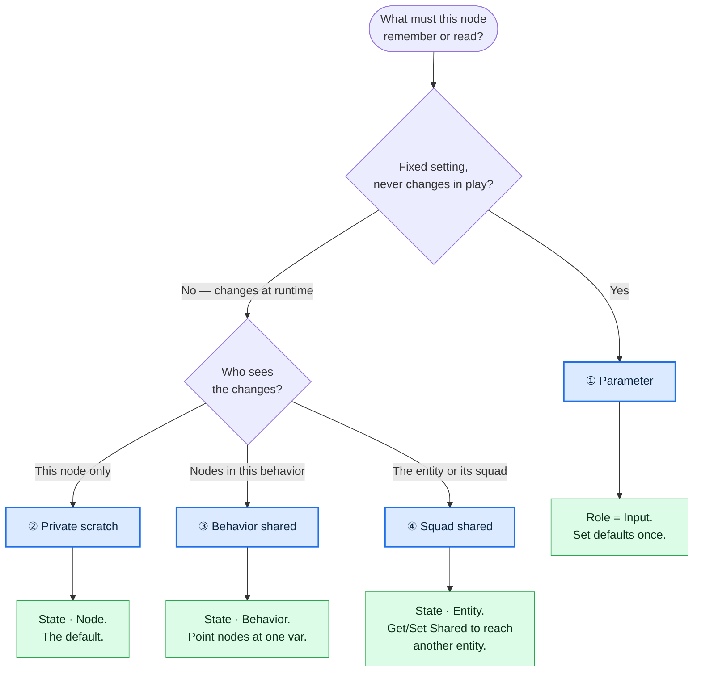

# Behavior Variables — Designer Quickstart

> **Who this is for:** anyone authoring BTree / blueprint behaviors who is *not* thinking about
> bytes, slots, or hashing — you just want your node to remember something, or share it. It answers
> one question: **"What kind of memory does my node need, and how do I set it up?"**
> **Related (deeper, for engineers):** `Blueprint_SharedState_GetShared_Design.md`,
> `BTree_AiActionParameterBinding_Detailed_Design.md`. You should not need those to use the system.

---

## Start here: describe what you want, in plain words

Every piece of data a node uses falls into one of **four kinds**. You don't pick "Role" and "Scope"
directly — you decide *what the data is for*, and that tells you the settings. Follow the tree:



---

## The four kinds, at a glance

| # | Name | You want… | Think of it as | Set | Example |
|---|------|-----------|----------------|-----|---------|
| **①** | **Parameter** | a value you **configure once** and never change while playing | a **knob / setting** | Role **Input** | "Fire when enemies ≥ **3**" · "Move at **4 m/s**" |
| **②** | **Private scratch** | scratch memory **only this node** keeps between ticks | this node's **notepad** | Role **State**, Scope **Node** *(default)* | a local retry counter · a cooldown timer |
| **③** | **Behavior shared** | memory **several nodes in one behavior** read/write together | a **whiteboard** for this behavior | Role **State**, Scope **Behavior** | two nodes advancing the same cursor / plan |
| **④** | **Squad shared** | memory the **entity** keeps across behavior switches, or that its **squad** reads | the **squad board** | Role **State**, Scope **Entity** | a rally count subordinates read from the commander |

> **"Squad" here = a commander and its subordinate roster** (the command hierarchy), not a generic
> list of entities. Kind ④ also covers plain entity-persistent state — memory that survives the
> entity switching behaviors, even when nobody else reads it.

**Rule of thumb:** start at ① and only move down when you actually need sharing. Most nodes never
leave ① or ②. Sharing (③ ④) is powerful but means "someone else can change this too" — reach for it
deliberately.

---

## Single value or a bundle?

A variable can hold **one value** (a number, a position, an on/off flag) or a **bundle of related
values** (a small *struct* — e.g. `{ RallyCount, LastRallyTime }`). Pick a bundle when several values
belong together and travel together. In the **Add variable** dropdown you'll see the basic types
(`int`, `float`, `Vector3`, …) *and* any bundle types the project defines — pick whichever matches
what you're storing.

---

## How each kind looks in the editor

- **① Parameter** — Add a variable, set its **Role** to *Input*, and bind it as the node's
  parameters. Its starting values are editable in the Inspector's **Static Parameters** panel
  (applied once when the behavior is assigned, then left alone).
- **② Private scratch** — When you drop a composed node it already gets a private memory variable
  (Role *State*, Scope *Node*). You usually don't touch it.
- **③ Behavior shared** — Change that memory variable's **Scope** to *Behavior* (the dropdown in the
  Blackboard Variables panel), then point the other nodes' memory at the **same** variable. Now they
  share one copy.
- **④ Squad shared** — Set **Scope** to *Entity*. The copy now lives on the entity and survives
  switching behaviors. For a subordinate to read its *commander's* copy, use a **Get Shared** node
  and hand it the target entity.

---

## One honest caveat (we're working on it)

There are currently **two doors to the same room** for kind ④: you can either set a node's memory
**Scope = Entity**, *or* drop explicit **Get Shared / Set Shared** nodes that name a shared slot.
They use the same underlying storage. For now:

- Use **Scope = Entity** when the sharing is *within* one entity (across its behaviors).
- Use **Get Shared / Set Shared** when a blueprint needs to **explicitly read/write a named shared
  slot**, especially **another entity's** (e.g. a subordinate reading its commander's plan).

Unifying these into a single, obvious concept is a known UX goal — if this trips you up, that's the
system's fault, not yours.

---

## Cheat sheet

```
Fixed setting?  ────────────────────► ① Parameter        (Role Input)
Changes, only this node?  ──────────► ② Private scratch  (State · Node)     ← default
Changes, shared in this behavior?  ─► ③ Behavior shared  (State · Behavior)
Changes, shared with the squad?  ───► ④ Squad shared     (State · Entity + Get/Set Shared)
```

*Start at ①. Move down only when you truly need someone else to see the data.*
