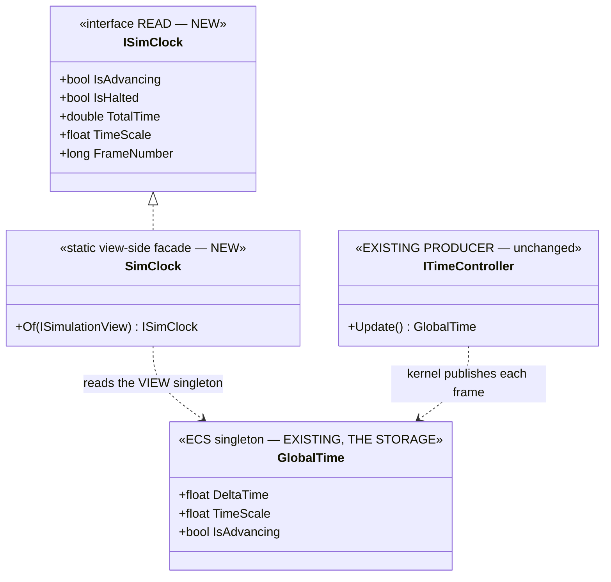
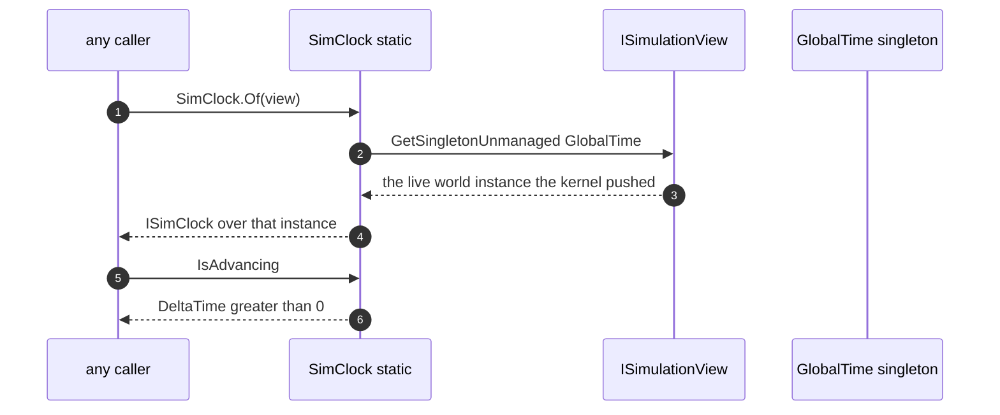

<!--STATUS
state: LIVE
build-state: READY-TO-BUILD
updated: 2026-08-21
current-answer: this whole file — the TIME lane's next batch after T0/Batch 104: T1 (the ISimClock
  read facade) + T2 (retire the EditorTimeTransportFacade duplicate). Both PROVEN, both independent.
stale-below: nothing.
known-rot: none.
known-conflict: none. This batch does NOT touch the write path (W-tasks). ⚠ R-130 (2026-08-21) shifted
  the write model to STAGED — the W-tasks need a design refresh before dispatch; T1/T2 are unaffected
  (time-read side + a duplicate retirement).
design-basis: DESIGN_Time_Architecture.md §9 (the three-way split; "STORAGE+READ = GlobalTime behind
  ISimClock; IsAdvancing, never IsPaused") + AS-11/§4 (the EditorTimeTransportFacade duplicate).
  Landmines: M-42 (GlobalTime.IsPaused is TimeScale==0, false while paused) + AS-1b (read the VIEW's
  singleton, never GetCurrentState()).
-->
# HANDOFF — TIME lane · **T1 (the read facade) + T2 (retire the duplicate)**

> 📌 **Dispatched at `9f1e27801`** *(coordinator head)*. ⭐ **TIME lane** — branch
> **`claude/time-system-refactor-batch-104-gp617x`**, ids **`TM-`**, tracker **`Area H` ONLY**.
> ⭐⭐⭐ **Rule 7, the two-lane form:** ⛔ **do NOT branch fresh from the coordinator** — that would lose
> Batch 104. ⭐ **CONTINUE on your own branch and MERGE the coordinator branch in for canon:**
> `git fetch origin && git merge origin/claude/blueprint-authoring-status-gm0akp` — 📐 **verified
> CLEAN** *(only the tracker overlaps, Area H vs A–G, and it auto-merges)*.
> ⭐ **Rule 1b: push `chore: started TM T1/T2 at 9f1e27801` FIRST.** ⭐ **Rule 3: you allocate the `TM-` ids.**

## 0. ⭐⭐ WHY THESE TWO — **the sequencing, and why they are safe now**

📄 **`PLAN_Time_System_Refactor.md` §4:** `T0 → T1+T2+W0 → T3 → W1+W2 → …`. ⭐ **T0 is done** *(Batch 104,
the net is 9/0)*. ⭐⭐ **T1 and T2 are the two PROVEN, independent foundations** *(§2 feasibility: both ✅)*.

⚠⚠ **W0 is deliberately NOT in this batch.** 📌 `R-130` *(user, `2026-08-21`)*: *"yellow = a staged-change
indicator … make it yellow when really staged"* ⇒ the write model is now **STAGED**, which reframes the
whole `W`-path *(and puts `MIN`'s direct write at odds with §6)*. ⛔ **The `W`-tasks need a design refresh
before dispatch; T1/T2 do not touch them** — they are the time-READ side and a duplicate retirement.

## 1. ⭐⭐ INVENTORY — *(`R-74` / `R-129`: enumerate, and read §9 before coding)*

| # | query | finding |
|---|---|---|
| I1 | `search_graph(name_pattern=".*ISimClock.*")` | ⭐ **does it exist yet?** If absent, `T1` creates it; if a stub exists, extend it *(report which)* |
| I2 | `search_graph(name_pattern=".*(IsPaused\|IsAdvancing).*", label="Property")` | ⭐ the sites `T1` marks obsolete / re-points — ⛔ enumerate, do not guess the count |
| I3 | `grep -rn "new EditorTimeTransportFacade\|new EditorTimeTransportAdapter"` | 📐 **measured:** only `EditorTimeTransportAdapter` is constructed *(`TimeControlStatusBarSection:31`)*; the **Facade** has no constructor call ⇒ `T2` retires it |

## 2. ⛔⛔⛔ `T1` — **`ISimClock`: one named READ surface** *(design: §9)*

📌 **§9's three-way split:** PRODUCER (`ITimeController`, unchanged) · **STORAGE+READ (`GlobalTime` behind
`ISimClock`)** · CONTROL (`ITimeCommands`, later). ⭐ **`T1` builds only the middle one.**





| ⭐ obligation | |
|---|---|
| **①** | ⭐⭐⭐ **`GlobalTime.IsAdvancing`** = `DeltaTime > 0f` — 📌 `M-42`: **`IsPaused` (`TimeScale == 0`) is FALSE while paused**, so mark `IsPaused` `[Obsolete]` and never derive from it |
| **②** | ⭐⭐ **`SimClock.Of(ISimulationView)` reads the VIEW's singleton** — ⛔⛔ `AS-1b`: **NEVER** `ITimeController.GetCurrentState()`, which hard-codes its delta to 0 and answers *"halted"* for ever |
| **③** | ⭐ **`IsHalted` = `!IsAdvancing`**; `TotalTime`/`TimeScale`/`FrameNumber` pass through the singleton |
| **④** | ⚠ **`HaltReason Reason` is `T6`, NOT this batch** — leave it off `ISimClock` for now, or a `Running`/`Halted` two-value placeholder; ⛔ do not build the full enum |
| **⑤** | ⭐ **do NOT re-point the 12 pause notions yet** — that is `T5`. `T1` only ADDS the surface and obsoletes `IsPaused` |

⭐ **Pinned by `Fdp.Toolkits.Tests ▸ ThePauseFlagOnTheClockIsFalseWhilePausedTests` (must stay 4/0)** —
it already proves `M-42`/`AS-1b`; `IsAdvancing` must agree with it.

## 3. ⭐⭐ `T2` — **retire `EditorTimeTransportFacade`** *(design: AS-11 / §4)*

📐 `EditorTimeTransportFacade` ⇄ `EditorTimeTransportAdapter` are **identical but for name, accessibility
and three null-guards**, and **only the Adapter is constructed** *(`TimeControlStatusBarSection:31`)*.

| ⭐ | |
|---|---|
| **①** | ⭐ **delete `EditorTimeTransportFacade`** — ⚠ first confirm by `search_graph`/grep it has **no** constructor call and no other reference *(a test double is not a production use)* |
| **②** | ⛔ if the Adapter lacks a guard the Facade had, **move the guard, do not keep the class** *(`R-65`: one implementation)* |
| **③** | ⭐ **report the reference count you measured** before deleting *(`R-129`: enumerate, don't assume)* |

## 4. ⛔ NOT IN THIS BATCH

⛔ `T3`/`T3a`/`T3b` *(the bus)* · `T4`+ *(control/intents)* · `T5` *(re-point the notions)* · `T6`
*(`HaltReason`)* · `T7` *(the caches)* · ⛔⛔ **all `W`-tasks** *(the write path — `R-130` reframed it)*.

## 5. ⭐ GATES

⭐ Baseline = **Batch 104's table** *(`REPORT_Batch104`)*. ⭐⭐ **The STANDING integration row** *(`TM-003`)*:
```
dotnet test Hrot/Runner/Hrot.ClusterRunner.Integration.Tests/... --no-build \
            --filter "FullyQualifiedName~TimeControlIntegrationTests"
```
⭐ **must stay `9/0`** — a new red is a regression this batch caused. ⭐ `Fdp.Toolkits.Tests ▸
ThePauseFlagOnTheClockIsFalseWhilePaused` **4/0**. ⚠ `DEBT-AIB-030`: the rotating flakes are confirmed by
`--filter`, not by the whole-suite number. ⭐ `tracker-counts.py --check` + the **`TM-` ids you allocated**
*(Area H only)*. ⭐ **Rule 4: merge the coordinator branch again before your final commit.**

---

## ⭐⭐⭐ RECONCILIATION — **BUILT BEFORE THIS HANDOFF ARRIVED, and `T2` came out INVERTED**

⚠ **Timing, stated plainly:** the time lane was told to self-direct *(user, `2026-08-21`: "continue
without the coordinator… you are the time lane only")* and had already shipped `T1`+`T2` as
**Batch TM-105** *(`b59248d8`)* when this handoff was imported. ⛔ **No rule-1b marker was pushed for
it** — there was no dispatch to mark. 📄 **[`BATCH_TM105_Read_Side_And_Transport_Merge.md`](BATCH_TM105_Read_Side_And_Transport_Merge.md)**.

### ✅ Where the built work MATCHES this handoff

| obligation | built |
|---|---|
| `T1` ① `IsAdvancing = DeltaTime > 0`, `IsPaused` obsoleted | ✅ — and the rail `IsAdvancing_IsNotTheNegationOfIsPaused_OnAPausedClock` fails if anyone derives one from the other |
| `T1` ② read the VIEW's singleton, never `GetCurrentState()` | ✅ |
| `T1` ③ `IsHalted` + pass-throughs | ✅ |
| `T1` ④ **no `HaltReason`** | ✅ — ⛔ **and not the two-value placeholder either**: a `Reason` that always answers `Running`/`Halted` adds nothing `IsAdvancing` does not already say, and is the silent-default pattern |
| `T1` ⑤ do NOT re-point the twelve notions | ✅ — the first site is identified and **deliberately left** *(`TM-012`)* |
| `T2` ② move the guard, do not keep two classes | ✅ **satisfied — by the opposite route**, see below |
| `T2` ③ report the measured reference count before deleting | ✅ **and it overturned the premise** |

### ⛔⛔ Where it DIVERGES — **`T2` ①: this handoff says delete the FACADE. The opposite shipped.**

📌 **This handoff's premise** *(§1 `I3`, and §3)*: *"only `EditorTimeTransportAdapter` is constructed…
the **Facade** has no constructor call ⇒ `T2` retires it."*

📐 **Measured — the premise is FALSE. BOTH are constructed, eight lines apart in one method:**

| site | builds | feeds |
|---|---|---|
| `EditorSubsystem.cs:3878` → `TimeControlStatusBarSection:31` | **`EditorTimeTransportAdapter`** | the **status bar** |
| `EditorSubsystem.cs:3886` | **`EditorTimeTransportFacade`** | the **main toolbar** *(`MainToolbarTimeControlSection`, BATCH-24)* |

⇒ ⭐⭐⭐ **Deleting the Facade would have deleted the main toolbar's time controls.**

⭐⭐ **What shipped instead, and why it still satisfies the handoff's intent:** the Facade is `public`
and carries the null-guards; the Adapter is `internal` and lacks them. ⇒ **keep the Facade, delete the
Adapter, repoint the status bar** — which is obligation ② *("move the guard, do not keep the class")*
reached from the other side, with **one implementation and both surfaces intact**.

⭐ **`AS-11` and its summary row are corrected in the design** *(`DESIGN_Time_Architecture.md` §4 + §6)*
— 📌 the false call-site claim originated there and was inherited by this handoff.

### ⚠ One more: **`SimClock.Of(ISimulationView)` is not implementable as this handoff's diagram draws it**

📐 The sequence shows `V->>G: GetSingletonUnmanaged GlobalTime` **on the view**. ⛔ **`ISimulationView`
has no singleton accessor at all** *(measured: `Tick`, `Time`, components, queries, events, command
buffer — that is the whole interface)*, and it has **1171 references**, so widening it is not a small
change. ⇒ ⭐ **`SimClock.Of` casts to `EntityRepository` internally**, on the convention settled in
📄 `Blueprint_Subsystem_Runtime_Detailed_Design.md` §12.2 *("the engine convention, not brittle…
no hedging needed")*. ⭐ **The corrected shape is in `DESIGN_Time_Architecture.md` §9a/§9a.1**, where it
survives this batch.
