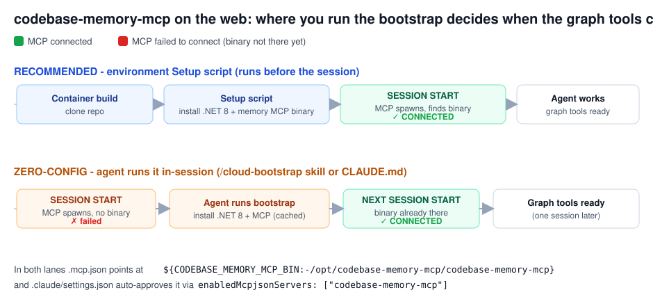

# codebase-memory-mcp in Anthropic-cloud (Claude Code on the web) sessions

Goal: give cloud sessions the same `codebase-memory-mcp` graph tools you use in
VS Code on Windows, plus the **.NET 8 SDK** to build/test the solution.



## TL;DR

| Piece | File | What it does |
|---|---|---|
| MCP declaration | `.mcp.json` | `command: ${CODEBASE_MEMORY_MCP_BIN:-/opt/codebase-memory-mcp/codebase-memory-mcp}` - one entry works on Windows **and** Linux |
| Auto-approve | `.claude/settings.json` | `enabledMcpjsonServers: ["codebase-memory-mcp"]` - no interactive approval on the web |
| Installer | `scripts/cloud-bootstrap.sh` | idempotently installs .NET 8 SDK + the static Linux MCP binary |
| Agent instruction | `.claude/skills/cloud-bootstrap/SKILL.md` | `/cloud-bootstrap` - the agent runs the script |
| Auto pointer | `.claude/CLAUDE.md` | tells the agent to bootstrap if the tools are missing |

## The one thing that matters: run the bootstrap BEFORE the session

MCP servers in `.mcp.json` are spawned **when the session starts**, before any
hook or agent action. So the binary must already be on disk at session start.

- **Recommended - environment Setup script.** A setup script runs as root
  **before Claude Code launches**, but it is attached to the *environment*, not
  the repo - **your repository is not checked out at a known path yet**, so a
  command like `bash scripts/cloud-bootstrap.sh` fails with `No such file or
  directory` (exit 127). The setup script must be **self-contained**. Paste the
  **contents of** [`scripts/cloud-setup.sh`](../scripts/cloud-setup.sh) into the
  **Setup script** field (Environment settings -> Setup script). It installs
  .NET 8 + the MCP binary to fixed absolute paths, so `codebase-memory-mcp`
  connects on **session #1**. (Result is cached for later sessions.)

- **Zero-config fallback - in-session.** Do nothing in the environment. At the
  start of a session say `/cloud-bootstrap` (runs `scripts/cloud-bootstrap.sh`,
  which *can* use repo files because the repo is checked out in-session). The
  binary installs and is cached, but the MCP tools only light up on the **next**
  session (MCP servers spawn at session start, before the agent can install
  anything). Fine for `dotnet` (usable immediately); a one-session lag for the
  graph tools.

> Why two scripts? `cloud-setup.sh` is self-contained for the pre-session Setup
> field (no repo access); `cloud-bootstrap.sh` additionally indexes the repo and
> is meant to run in-session where `$CLAUDE_PROJECT_DIR` exists. Both install the
> same .NET 8 SDK and the same MCP binary from the same official sources.

## Network policy

The MCP binary is downloaded from `github.com/DeusData/codebase-memory-mcp/releases`
and .NET from `dot.net`. The environment's network policy must allow those:

| Policy | .NET install | MCP download | Result |
|---|---|---|---|
| Full | yes | yes | works |
| Trusted (GitHub + common registries allowed) | usually | usually | works if github.com releases are allowed |
| No egress | no | no | use a committed binary instead (see below) |

Switch **Trusted -> Full** if the download is blocked.

## Windows / VS Code (your existing setup) - one-time change

`.mcp.json` now resolves the binary from `CODEBASE_MEMORY_MCP_BIN`, falling back to
the Linux path. On each Windows machine, set the env var once to your local `.exe`:

```powershell
# PowerShell, per user (adjust the path/version to your machine)
setx CODEBASE_MEMORY_MCP_BIN "C:\Users\<you>\.vscode\extensions\tunakite03.codebase-memory-mcp-0.5.22\bin\win32-x64\codebase-memory-mcp.exe"
```

Then restart VS Code. (This also fixes the old hard-coded path, which only matched
one of your machines.) Cursor keeps using its own `.cursor/mcp.json` - unchanged.

## Verify in a cloud session

```bash
dotnet --version                 # 8.x
/opt/codebase-memory-mcp/codebase-memory-mcp --version
```
In Claude Code, `/mcp` (or the tools list) should show `codebase-memory-mcp` as
connected. Then follow the graph-first workflow in `.claude/CLAUDE.md`.

## Updating the MCP binary

The installer always pulls the latest release. To refresh an already-installed
binary in a cached container:
```bash
CBM_FORCE=1 bash scripts/cloud-bootstrap.sh
```

## Alternative: no-egress environments (commit the binary)

If you must run with no GitHub egress, download
`codebase-memory-mcp-linux-amd64-portable.tar.gz` on any machine, extract the
`codebase-memory-mcp` binary, commit it to e.g. `.claude/tools/linux-x64/`, and set
`.mcp.json` default (or `CODEBASE_MEMORY_MCP_BIN`) to that committed path. It is
then present immediately after clone - no download, connects on session #1, works
under any policy. Trade-off: a binary blob in git and manual version bumps.
