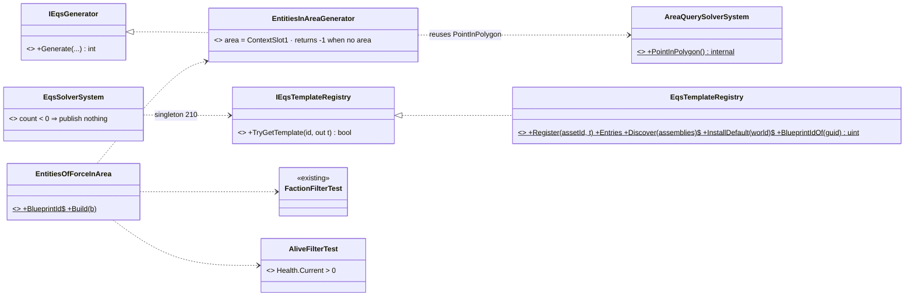
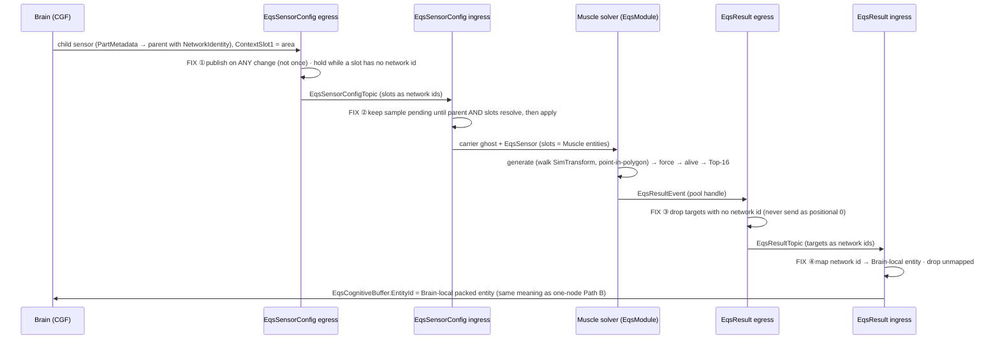
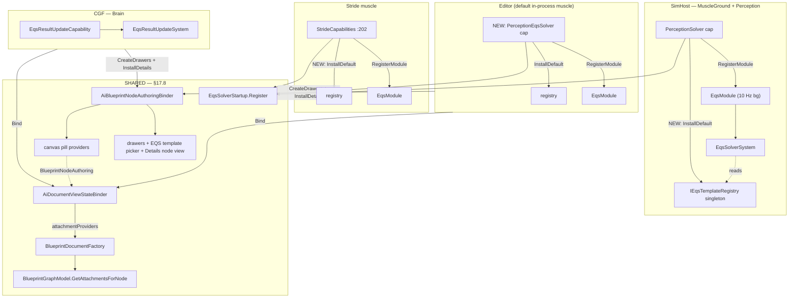

<!--STATUS
state: LIVE
updated: 2026-10-03
build-state: BUILT (§17 — the area query inside EQS 1.3) · §18 — the AreaQuery pipeline RETIRED (2026-10-01)
current-answer: §1–§15 are the v1.3 intent. §16 is the MEASURED as-built state (2026-09-30) and what the
  unification with AreaQuery needs — read it before quoting any "is live / is wired" claim from §6 or §14.
stale-below: nothing is superseded, but §6.4 (hot reload) and §6.6 (starter pack of 8) describe intent that was
  never built — see §16.
known-rot: §6.1 "registrar ... with RegisterAll" and §6.4 "AiHotReloadCoordinator ... registrars invoked" — the
  generated registrar registers a BlueprintDefinition, not the template, and the coordinator has no EQS code (§16).
known-conflict: Architect_Question_6_Access_Shapes_And_Vocabulary.md Q6-D (keep area query separate) — overtaken by
  the user's 2026-09-30 decision to unify into EQS 1.3 (R-156).
related-designs:
  - docs/blueprints/DESIGN_Behaviour_Fault_And_Teardown.md — owns WHEN a behaviour's child sensor dies (at its behaviour
    instance's end), how LocalChildIndex is chosen (allocated + reused, never disposed — descriptor rules), the lifetime in the
    epoch, and the `Suspended` flag (CE-485, CE-486 — approved as `Active`, polarity flipped); the races it fixes are its §2.
    Its §3a is the as-built of this design's wire half: a child sensor ends by a Suspended config (the Muscle carrier
    stays; the solver publishes nothing and drops its eval state), and a ScoreDelta sensor's first answer of an epoch
    is never suppressed (this design's §17.6 "bump Epoch for a guaranteed-new answer" — the solver now honours it).
  - docs/designs/hill-attack/DESIGN.md — owns the doctrine and the AreaQuery pipeline (Phase 1), the one live consumer.
  - docs/blueprints/DESIGN_Hill_Attack_Eqs_Migration.md — the §17.6 recipe APPLIED to both hill-attack commanders (CE-478): the
    shared Brain-side child-sensor lifecycle (EqsChildSensor) and the SpawnEqsSensor placeholder-handle fix.
  - docs/blueprints/Architect_Question_78_Hill_Attack_The_Blueprint_Node_Way.md — §5.3 measured the two systems; the
    blueprint hill attack is the consumer waiting for the unification.
  - docs/blueprints/batches/HANDOFF_EQS_Unification.md — the frame for the unification work (draft).
  - docs/projects/FDP/Toolkits/Fdp.Toolkits.Spatial.Eqs.md — the toolkit reference; already calls AreaQuery "legacy".
  - docs/PROGRAMME_Cgf_Equals_Editor_Gap_Map.md — the cgf==editor roadmap; §17.8 closes one of its gaps (Blueprint node
    Details on CGF).
  - docs/blueprints/batches/HANDOFF_AreaQuery_Retirement_And_Cluster_Ai_Debug.md — the frame for §18 (part A).
  - docs/blueprints/DESIGN_Cluster_Ai_Debug_Surface.md — part B of the same handoff (CE-476); owns nothing here.
  - docs/DESIGN_Ownership_Groups_And_Grants.md — §5.8 owns WHICH node solves a child sensor (R-179, CE-3002): the Brain
    names it in `EqsSensorConfigTopic.SolverNodeId` (least-loaded Perception node, once per sensor), every node records it
    as the owner of result part n, and only that node builds a carrier. This design owns the solve itself.
-->
# EQS (Environment Query System) — Design v1.3

Consolidated design from the brainstorming sessions between the project owner and Claude, incorporating responses from the engine architect.

This document describes the EQS system for the Stride3D stage of the engine and forward into the final stage with a proprietary C++ Recast-based navmesh.

**v1.3 changes:** Implementation-level corrections from architect review. `EqsResultEvent` clarified as a small unmanaged event carrying a handle into a shared native pool (mirroring the existing area-query pattern), not the result list directly. `EqsCognitiveBuffer` storage pattern documented with the C# 12 `[InlineArray]` defensive-copy trap. 512-component-slot extension confirmed as part of the broader EntityHeader SoA migration.

**v1.2 changes:** Wire protocol fully aligned with the engine's autonomous-perception pattern: `EqsSensor` is a Brain-authored component replicated downward to Muscle (configuration), and result delivery is by discrete `EqsResultEvent` translated to DDS, applied on Brain into an `EqsCognitiveBuffer` component. Migration is confirmed as non-destructive; Q12 closed. Tactical tags resolved as standard tag components (component ID space extending to 512); EntityHeader question closed.

**v1.1 changes:** Sensor lifecycle reframed around standard entity lifecycle (no bespoke heartbeat/TTL).

---

## 1. Goals and scope

EQS is the AI's standing-query system for understanding the spatial and tactical state of the world. It enables AAA-grade behaviors such as cover seeking, flanking, threat avoidance, formation positioning, and reactive tactical decisions.

EQS upgrades the engine's current minimalistic `AreaQuerySolverSystem` (which only finds entities inside polygons) into a full system supporting:

- **Entity queries** — "find nearest enemies matching predicates."
- **Positional queries** — "find best cover position", "find flanking point", etc.
- **Path-aware queries** — reachability and path cost as scoring tests.
- **Volumetric/3D queries** — needed for flying and naval agents.
- **(Future) Influence-map queries** — threat fields, team-avoidance fields.

Target entity scale: 10k agents in the final stage; significantly less in the Stride3D middle stage.

Supported agent types: humanoid infantry (highest fidelity), ground vehicles, flying, and naval.

---

## 2. Core mental model: the EQS Sensor

The fundamental abstraction is a **standing query** attached to an entity (or to a squad's virtual entity for squad-wide queries). A sensor:

- Is declared as an `EqsSensor` ECS component.
- References a query template by stable `BlueprintId`.
- Carries runtime parameters (radius, faction filter, etc.).
- Is re-evaluated by the Muscle-side solver at a configured refresh rate.
- Has its result cached on the Brain side and read synchronously by BTree/HSM nodes.

Brain code never deals with request IDs, polling, or async completion. Adding the `EqsSensor` component subscribes the entity to the query; removing it cancels. The Brain consumes the cached result via simple synchronous reads.

One-shot queries are expressible as a sensor with `RefreshOnce: true`, but they are not the primary pattern.

---

## 3. Architecture overview

Four logical layers spanning the Brain/Muscle boundary:

| Layer | Node | Responsibility |
|---|---|---|
| 1. Sensor declarations | Brain | `EqsSensor` components, runtime parameters, refresh policy, priority |
| 2. Cognitive buffer + reader | Brain | `EqsCognitiveBuffer` component populated from result events, synchronous reader API for BTrees |
| 3. Solver service | Muscle | Schedules, runs generators + tests, produces ranked results, emits `EqsResultEvent` on meaningful change |
| 4. Tactical world | Muscle | Spatial grid, navmesh, cover DB, LOS service — also consumed by Perception |

Communication across the Brain/Muscle boundary uses the existing CycloneDDS layer with `[DdsManaged] List<T>` for variable-size payloads.

### 3.1 Boundary protocol

The boundary protocol mirrors the engine's autonomous-perception pipeline (`PerceptionReceptor` for configuration, `SensorTrackStateEvent` for results), explicitly endorsed by the engine architect as the pattern to follow.

**Brain → Muscle (configuration via component replication).**

The Brain creates an `EqsSensor` component on the authoritative entity. An `EqsSensorConfigEgressTranslator` monitors these components on the Brain and, using `SmartEgressUtil` for dirty-tracking, publishes to an `EqsSensorConfig` DDS topic when the component changes (created, deleted, or its parameter struct is mutated). On the Muscle side, `EqsSensorConfigIngressTranslator` receives the sample and applies (or removes) the `EqsSensor` component on the local ghost entity.

Once the component exists on the Muscle entity, the solver's component iteration finds it on the next tick. No bespoke "subscribe" message exists; addition/removal/modification of the component is the subscription mechanism. Component mutations (parameter changes) increment the component's `Epoch` field; the solver compares against its `EpochSnapshot` to detect changes and reset evaluation state accordingly.

**Muscle → Brain (results via discrete events).**

Results are not replicated as a continuously-dirty component, because that would saturate bandwidth at 10–30Hz across 5–10k agents. Instead, the Muscle pattern is event-driven:

1. The Muscle solver maintains the per-sensor evaluation state and result locally (the `SensorEvalState` and ranked candidate buffer).
2. When a sensor completes evaluation and the publish policy determines its result is meaningfully changed (TopChanged / ScoreDelta / AlwaysPush), the solver writes the ranked list into a shared unmanaged native pool (`EqsResultPool`, sized for `MaxConcurrentInFlightResults` × `TopK=16` entries) and obtains a `EqsResultHandle`.
3. The solver emits a small unmanaged `EqsResultEvent { SensorNetworkId, Epoch, RefreshTick, ResultHandle, EntryCount }` on Muscle's `FdpEventBus`. This event is strictly unmanaged — satisfying the `Publish<T> where T : unmanaged` constraint — and carries no list data directly.
4. `EqsResultEventEgressTranslator` consumes the event, dereferences the pool entry, constructs the `[DdsManaged] List<EqsResultEntry>` payload for DDS, and publishes an `EqsResult` DDS message with Reliable/TransientLocal QoS. Only state-changes hit the wire.
5. On the Brain, `EqsResultIngressTranslator` reads the DDS sample and bridges it onto the local Brain event bus.
6. `EqsResultUpdateSystem` consumes the bridged event and writes the new ranked list into an `EqsCognitiveBuffer` component on the observer entity. The buffer stores the most recent top-K result and the simulation time of last update.
7. BTree/HSM nodes read from the `EqsCognitiveBuffer` synchronously via the reader API (`GetTop`, `GetRanked`, `IsReady`, `IsFresh`).

This mirrors the existing area-query pattern (`AreaQueryRequestEvent` references an `EqsTargetPool` slot, not the entries directly). The translator boundary is also where the unmanaged-to-managed transition cleanly happens: managed `List<T>` lives only on the DDS side of the translator, never on the ECS event bus.

If a future use case needs to publish the list directly from C# code (e.g., a tool or test harness), `Bus.PublishManaged<T>()` and `ReadManagedEvents<T>()` are available as an explicit opt-in into the managed event stream. The default path remains unmanaged + handle.

**Trade-off rationale.** A simpler alternative is to replicate an `EqsSensorResult` component continuously, treating EQS as configuration in both directions. This is appropriate only for low-frequency or one-shot sensors where component dirty-tracking is cheap. At the scale we target (thousands of agents with 10Hz refresh and meaningful-change publishing), the event-driven path is the established pattern. The infrastructure to do both should exist; the default path is event-driven.

### 3.2 Result delivery policy

Each query template declares a publish policy that controls when Muscle sends an updated result to Brain:

- `AlwaysPush` — send on every refresh.
- `TopChanged` — send when the top entry's identity (entity ID or top-K signature) changes.
- `ScoreDelta(threshold)` — send when any top-K score has shifted by more than the threshold.
- `Hybrid(priorityBand)` — high-priority sensors push every refresh; low-priority push on change only. The default for sensors at `Priority.Critical`.

Policies are overridable per-sensor at subscription time.

---

## 4. Result shape

### 4.1 Two flavours of result entry

Entity-shaped (for entity queries):

```csharp
public readonly struct EqsEntityResult
{
  public readonly long NetworkId;      // resolves to local entity on Brain
  public readonly float Score;         // normalized [0..1]
  public readonly ushort Flags;        // see standard flag bits
  public readonly ushort FlagsMeaningful;  // which flag bits this template actually populated
}
```

Position-shaped (for positional queries):

```csharp
public readonly struct EqsPositionResult
{
  public readonly Vector3 WorldPosition;     // candidates are world-space-fixed once generated
  public readonly float Score;
  public readonly long AssociatedEntity;     // optional — e.g., cover edge entity; 0 for pure point
  public readonly ushort Flags;
  public readonly ushort FlagsMeaningful;
  public readonly ushort Meta;               // generator-specific (e.g., packed cover direction)
}
```

### 4.2 Standard flag-bit assignments

16 bits per result, with a parallel `FlagsMeaningful` bitset indicating which bits were actually computed by the template's tests. A bit not in `FlagsMeaningful` must not be read.

| Bit | Meaning | Set by test |
|---|---|---|
| 0 | `HasLOSToContext0` | LineOfSight (context 0) |
| 1 | `HasLOSToContext1` | LineOfSight (context 1) |
| 2 | `HasLOSToContext2` | LineOfSight (context 2) |
| 3 | `NavmeshReachable` | NavmeshReachable |
| 4 | `IsInCover` | CoverQuality > threshold |
| 5 | `IsExposedFromKnownThreat` | ThreatExposure > threshold |
| 6 | `IsPreferredSide` | DotProduct from forward |
| 7 | `WasFreshThisRefresh` | Solver lifecycle |
| 8-15 | Reserved | — |

Context slots are query-template-defined runtime references (typically self, target, leader/squad-mate). Up to 3 LOS contexts simultaneously.

### 4.3 Size limits

- Top-K capped at **16** per sensor (mirrors `EqsTargetPool` capacity).
- Per-result entry: 20-24 bytes.
- Typical sensor refresh result: 80-300 bytes on the wire.

---

## 5. The query template

### 5.1 Canonical struct

```csharp
public readonly struct EqsQueryTemplate
{
  public readonly int BlueprintId;             // FNV-1a hash of AssetId GUID
  public readonly ulong ContentHash;           // hash of (generators + tests + scoring); for future memoization
  public readonly string DebugName;            // diagnostics only; not in hashes

  public readonly ResultShape ResultShape;
  public readonly byte TopK;                   // 1..16
  public readonly ScoringMode ScoringMode;     // WeightedSum | WeightedProduct
  public readonly PublishPolicy PublishPolicy;
  public readonly byte MaxAccurateRaycastsPerRefresh;

  public readonly EqsGenerator[] Generators;
  public readonly EqsTest[] Tests;             // ordered by phase
  public readonly ushort FlagsPopulatedMask;
}
```

### 5.2 Tests and phases

Tests are run in four explicit phases in this order:

1. `FilterCheap` — fast filters (faction, dis-type, distance, FOV cone). Reject candidates that fail.
2. `FilterExpensive` — slow filters (navmesh reachability, accurate-LOS used as a hard filter).
3. `ScoreCheap` — fast scoring tests (distance falloff, dot-product, cheap-LOS).
4. `ScoreExpensive` — slow scoring tests (cover-quality with raycasts, path cost, accurate-LOS for fine scoring).

Between phases 2 and 3 the solver performs **top-K reduction** if the candidate count exceeds a threshold, so that expensive phases only run on viable candidates.

Each test declares its phase explicitly. The solver does not infer cheap/expensive ordering from cost hints; the author specifies it.

```csharp
public readonly struct EqsTest
{
  public readonly EqsTestKind Kind;            // LineOfSight, Distance, ...
  public readonly EqsTestPhase Phase;          // FilterCheap | FilterExpensive | ScoreCheap | ScoreExpensive
  public readonly EqsTestRole Role;            // Filter | Score
  public readonly TestParameters Params;       // packed 16-byte struct, discriminated by Kind
  public readonly float Weight;                // ignored if Role == Filter
  public readonly EqsScoringCurve Curve;       // Linear | InverseLinear | Threshold | Bell | Step
  public readonly byte FlagBit;                // which standard flag this test populates; 0 = none
}
```

### 5.3 Test composition

UE-EQS style — no formal AND/OR grouping:

- `Filter` tests reject candidates that fail. Run first in cheapness order to prune.
- `Score` tests contribute their weighted score to the final ranking.
- OR-semantics are expressed by giving multiple tests scoring weight rather than filter status.

### 5.4 Standard test kinds

- `Distance`, `DotProduct`, `Faction`, `DisType`, `Tag`
- `LineOfSight` (cheap / accurate mode)
- `NavmeshReachable`, `PathCost`
- `ThreatExposure`, `CoverQuality`
- `Custom` — pluggable `IEqsTest` for project-specific tests

### 5.5 Standard generator kinds

Generators produce candidates. Composable — a template can have multiple, with results concatenated.

- `Self` — single candidate at entity position
- `Donut`, `Grid`, `Cone` — geometric sampling around a context point
- `EntitiesInArea`, `EntitiesInRadius` — entity-shaped generators
- `NavmeshSamples` — points on the navmesh
- `CoverPoints` — points from the cover database
- `OffsetFromContext` — fixed offset from a context entity

Generators self-limit via a `MaxCandidates` parameter (defaults per kind). The solver enforces a global `MaxCandidatesPerSensor` ceiling (default 256).

### 5.6 Build() purity

The `Build(IEqsTemplateBuilder b)` method that constructs a template must be deterministic and pure. It must not read runtime state, global singletons, the current scenario, or non-deterministic APIs.

Runtime variation is expressed via **sensor parameters** (the parameter struct on the `EqsSensor` component), never via templates that look at the world.

Enforced by:

- A new `Fdp.Toolkits.Analyzers` diagnostic that flags `[EqsTemplate]` methods referencing forbidden state.
- Source generator enforcement that `Build()` is `static` and takes only `IEqsTemplateBuilder`.

---

## 6. Authoring

### 6.1 Three authoring paths, one registry

| Path | Format | Compilation |
|---|---|---|
| Hand-written C# | `[EqsTemplate(AssetId="...")]` class | Small Roslyn source generator scans for `[EqsTemplate]`, emits a centralized `[BlueprintRegistrar]` static class with `RegisterAll`. |
| Hand-edited `.bp.json` | JSON file in blueprint directory | `BlueprintIncrementalGenerator` reads JSON, emits equivalent C# class with same registrar. |
| Visual (future) | `GraphEditorWindow` saves to `.bp.json` | Identical to JSON path. |

All three converge on identical compiled `EqsQueryTemplate` structs in the registry, keyed by `BlueprintId`.

### 6.2 Stable identity

- Every template has an `AssetId` GUID.
- For C# templates: GUID lives in the `[EqsTemplate(AssetId=...)]` attribute. Developer generates a fresh GUID via editor snippet tool.
- For `.bp.json` templates: GUID lives in the JSON file. Editor (or hand-editor) creates and maintains.
- `BlueprintId` = FNV-1a 32-bit hash of `AssetId`. This is what crosses the DDS wire.
- Class renames, namespace moves, and category reassignments never change the GUID. Subscriptions survive refactoring.

### 6.3 Collision detection

Asset-ID collisions are detected at runtime registration. `BlueprintRegistryStaging.Register` throws `InvalidOperationException` on duplicate IDs. The exception is caught by `AiHotReloadCoordinator`, which aborts the swap and fires `OnReloadFailed`. Live simulation continues on the previous valid registry.

### 6.4 Hot reload

Inherited from the engine's existing pattern:

- `AiHotReloadCoordinator` watches the AI assembly for changes.
- New ALC loaded, registrars invoked, templates compared by `StructureHash` and `ParamHash`.
- **Soft reload** (only `ParamHash` changed): live sensors continue, pick up new parameters on next tick.
- **Hard reset** (`StructureHash` changed): live sensors using this template have their iterator state wiped and start fresh on next tick.
- Build failures or missing test/generator types abort the reload; live ALC continues unchanged.

### 6.5 Hand-written C# template form

```csharp
[EqsTemplate(
  AssetId = "a3f2-7c19-4e8b-9d4a",
  DisplayName = "Find cover from target",
  Category = "Tactical/Cover")]
public sealed class FindCoverFromTargetTemplate : IEqsTemplateDefinition
{
  public static void Build(IEqsTemplateBuilder b) => b
    .ResultShape(ResultShape.Position)
    .TopK(5)
    .ScoringMode(ScoringMode.WeightedSum)
    .PublishPolicy(PublishPolicy.ScoreDelta(0.05f))
    .MaxAccurateRaycasts(8)

    .Generator(Gen.CoverPoints(radius: 15f, fromContext: Ctx.Self))

    .Test(Tst.Faction(filterAgainst: FactionFilter.Enemy)
      .AsFilter()
      .Phase(EqsTestPhase.FilterCheap))

    .Test(Tst.NavmeshReachable(fromContext: Ctx.Self)
      .AsFilter()
      .Phase(EqsTestPhase.FilterExpensive)
      .Flag(StdFlag.NavmeshReachable))

    .Test(Tst.Distance(fromContext: Ctx.Self, falloffMeters: 15f)
      .AsScoring(weight: 0.3f, curve: Curve.InverseLinear)
      .Phase(EqsTestPhase.ScoreCheap))

    .Test(Tst.CoverQuality(fromContext: Ctx.Target)
      .AsScoring(weight: 0.7f, curve: Curve.Linear)
      .Phase(EqsTestPhase.ScoreCheap))

    .Test(Tst.LineOfSight(fromContext: Ctx.Target, mode: LosMode.Accurate, failIfVisible: true)
      .AsFilter()
      .Phase(EqsTestPhase.FilterExpensive)
      .Flag(StdFlag.HasLOSToContext1));
}
```

### 6.6 Starter pack

Eight templates ship as hand-written C# classes in `Engine.Eqs.Templates.StarterPack`:

1. `FindNearestEnemy` — entity query, distance-scored with FOV filter
2. `FindNearestAlly` — same shape, different faction
3. `FindThreatsInView` — multi-entity query with accurate-LOS filter
4. `FindCoverFromTarget` — positional, cover database + LOS-from-target filter
5. `FindFlankingPosition` — positional, angle-from-target scoring
6. `FindSafeRetreatPoint` — positional, distance-from-threats + reachability
7. `FindAllyForFormation` — entity query, role + distance scoring
8. `FindOpenFiringPosition` — positional, LOS-to-target + cover-from-other-threats

They serve as documentation-by-example and as runtime test fixtures.

---

## 7. The solver

### 7.1 Module declaration

```csharp
public sealed class EqsSolverModule : IModule
{
  public ExecutionPolicy Policy => ExecutionPolicy.SlowBackground(
    frequencyHz: deploymentConfig.EqsHz,         // default 10; convoys with Perception
    maxExpectedRuntimeMs: deploymentConfig.EqsMaxRuntimeMs);  // default ~2x soft budget

  public BitMask256 GetRequiredComponents() =>
    BitMask256.Of<EqsSensor>() |
    BitMask256.Of<EntityHeader>() |
    BitMask256.Of<SimTransform>() |
    BitMask256.Of<TacticalTags>() |
    BitMask256.Of<TargetMemory>() |
    BitMask256.Of<SpatialHashGrid>();

  public void Tick(ISimulationView view) { /* see below */ }
}
```

The kernel handles: dispatching the tick to `ThreadPool` via `Task.Run`, providing a snapshot via `ISimulationView`, joining the snapshot convoy with Perception (when frequencies match), racing the tick against `MaxExpectedRuntimeMs` with circuit-breaker safety.

### 7.2 Deployment knobs

- `EqsHz` — solver tick rate. Default 10 (convoys with Perception).
- `EqsBudgetMs` — soft wall-clock budget per tick. Default 4.0.
- `EqsMaxRuntimeMs` — hard kernel cap. Default ~2x `EqsBudgetMs`.
- `MaxCandidatesPerSensor` — global ceiling on candidates per sensor. Default 256.
- `MaxAccurateRaycastsPerSolverTick` — share of the 4096 global raycast cap reserved for EQS. Default 2048 (50% of cap).
- `EqsConvoyMate` — which module to align with for snapshot sharing. Default Perception.

### 7.3 Tick flow

```
Tick(view):
  EnqueueEligibleSensors(view, view.Time)
  bands = AllocateBudgetBands(EqsBudgetMs)
  // [Critical 50%, Normal 35%, Low 15%], slack rolls forward
  foreach band in bands:
    DrainBand(view, band)
  PublishCompletedResults(view, view.Time)
```

### 7.4 Per-sensor state machine

Critical architectural rule: **the solver never blocks on async results**. The snapshot pool reclaims memory the moment `Tick` returns. Any work that requires waiting (accurate-LOS raycasts) must save state and resume on a later tick.

```csharp
public enum SensorEvalPhase : byte
{
  NotStarted,
  GeneratingCandidates,
  FilterCheap,
  FilterExpensive_AwaitingRaycasts,
  FilterExpensive,
  TopKReduce,
  ScoreCheap,
  ScoreExpensive_AwaitingRaycasts,
  ScoreExpensive,
  Finalizing,
  Complete
}

public struct SensorEvalState  // lives on the EqsSensor component
{
  public SensorEvalPhase Phase;
  public ushort CandidateCount;
  public ushort NextCandidateIndex;          // QueryTimeSliced continuation
  public byte NextTestIndex;                 // which test in the current phase
  public RaycastBatchId PendingRaycasts;     // 0 if none in flight
  public uint EpochSnapshot;                 // matches sensor.epoch at start; mismatch cancels
  public SimTick StartedAtTick;
  public SimTick LastProgressTick;
}
```

The `_AwaitingRaycasts` phases are pure polling states. The solver submits raycast request events at the end of one tick, then on subsequent ticks polls the raycast result ring buffer for completion. Sensors in `_AwaitingRaycasts` that find results ready transition to the next phase and continue evaluation. Sensors that don't return early.

Consequence: a fully-accurate-LOS query has a **minimum latency of approximately 3 solver ticks (~300ms at 10Hz)** from creation or invalidation to first result. This is acceptable given sensors are explicitly designed for 200ms+ staleness tolerance. High-urgency queries can use cheap-LOS to get sub-tick latency at the cost of accuracy.

### 7.5 Budget bands

Three priority bands with proportional budget allocation:

- Critical: ~50% of soft budget. Unused slack rolls to Normal.
- Normal: ~35% (+ rolled slack). Unused rolls to Low.
- Low: ~15% (+ rolled slack).

Within a band, FIFO with age tiebreak. No cross-instance cost prediction in v1.

### 7.6 Time-slicing within a phase

Uses `EntityRepository.QueryTimeSliced` with `TimeSliceMetric.WallClockTime` and a per-sensor `IteratorState`. The enumerator interrupts between candidates when the band's allocated budget is exhausted, saving `NextCandidateIndex`. Next solver tick resumes from where it left off.

Hard kernel cap (`MaxExpectedRuntimeMs`) is the safety net for true hangs — circuit-breaker, automatic logging. Normal budget overruns are graceful yield, not errors.

### 7.7 Raycast submission

Naively publish `RaycastRequestEvent`s via `IEntityCommandBuffer`. The `RaycastSolverSystem` aggregates across all submitters and parallelizes via `Parallel.For`. No batching needed on the solver side.

Solver respects two raycast caps:

- Global: 4096 rays in flight (`PhysicsConstants.RaycastBatchCapacity`).
- EQS share: `MaxAccurateRaycastsPerSolverTick` (default 2048).

When EQS hits its share for a tick, additional accurate-LOS tests defer to the next tick; the sensor stays in `_AwaitingRaycasts` and `FlagsMeaningful` reflects what was actually evaluated.

---

## 8. Brain-side reader API

BTree and HSM nodes read sensor results synchronously from the `EqsCognitiveBuffer` component, with no awareness of event delivery or DDS plumbing. The buffer is per-entity and holds the most recent top-K result for each active sensor on that entity, indexed by a local sensor handle.

```csharp
// Returns true if a result is available. False until the first EqsResultEvent has been applied.
bool IsReady(EqsCognitiveBuffer buffer, SensorHandle h)

// Returns top result, or false if not ready
bool GetTop(EqsCognitiveBuffer buffer, SensorHandle h, out EqsResult result)

// Returns the full ranked list (read-only span, no allocation)
bool GetRanked(EqsCognitiveBuffer buffer, SensorHandle h, out ReadOnlySpan<EqsResult> results)

// True if the cached result is fresh enough (uses sim time)
bool IsFresh(EqsCognitiveBuffer buffer, SensorHandle h, float maxAgeSeconds)
```

BTrees handle the "not ready yet" case explicitly. A `WaitForSensor` decorator node is provided that returns `Running` until first result lands, for behaviors that must gate on sensor data.

Squad-level queries follow the same API; they live on the squad's virtual entity (a regular entity in the ECS), and squad-member BTrees read its `EqsCognitiveBuffer`.

The buffer survives entity migration along with the rest of the entity's components — when migration occurs, the new authoritative Muscle picks up producing results into the same buffer, and BTrees observing the buffer see continuous (possibly briefly stale) results without any "not ready" gap.

### 8.1 Storage layout and the `[InlineArray]` mutation trap

`EqsCognitiveBuffer` holds the top-K results as a fixed-size inline array, following the engine's existing pattern for components like `MissionPlanQueue` and `PassengerBuffer` (C# 12 `[InlineArray(16)]`). This keeps the buffer zero-allocation and cache-friendly.

**Implementation trap:** the C# compiler emits an `ldobj` defensive copy when you index directly into an `[InlineArray]` field through a `ref` struct. Writing through the field index silently writes to a JIT temporary and the mutation is lost. `EqsResultUpdateSystem` and any other write path must cast to `Span<EqsResult>` first before assigning entries:

```csharp
// WRONG — silent mutation loss:
buffer.Results[i] = newResult;

// RIGHT — cast to span, then index:
Span<EqsResult> results = buffer.Results;
results[i] = newResult;
```

This trap applies anywhere the buffer is mutated. Reader paths (`GetTop`, `GetRanked`) only read and are safe either way, but should still go through a `ReadOnlySpan<EqsResult>` for symmetry and to avoid accidentally introducing the mutation pattern later.

---

## 9. Visibility (LOS) — cheap vs accurate

Two modes, selectable per `LineOfSight` test in the query template.

### 9.1 Cheap LOS

Baked occluder grid (2D or 2.5D, e.g. 2m cells flagged with occluder height ranges). Bresenham-like trace from observer to candidate.

- Target cost: ~1μs per check.
- Precision: coarse; misses thin walls or doorways.
- Pre-baked from Stride geometry at scenario load; patched when world geometry changes.

### 9.2 Accurate LOS

Uses the existing `RaycastSolverSystem` against real 3D geometry. Cross-tick polling per the state machine.

- Target cost: ~10-100μs per ray (parallel-batched by the raycast solver).
- Precision: matches gameplay raycasts; consistent with what agents and projectiles see.
- Subject to the EQS raycast cap.

### 9.3 Two-pass strategy

Templates that need accurate verification typically use **both** modes:

1. Cheap LOS in `FilterCheap` or `ScoreCheap` to prune obviously bad candidates.
2. Top-K reduction after `FilterExpensive`.
3. Accurate LOS in `ScoreExpensive` on the small surviving set.

This is the AAA pattern and naturally maps onto the four phases.

---

## 10. Tactical world (Layer 4)

The data sources the solver consults. Most of these exist independent of EQS and are also consumed by Perception, animation, and pathfinding.

### 10.1 Spatial hash grid

Unchanged from current engine. Used for broad-phase entity lookups.

### 10.2 Navmesh

Behind an `INavmeshProvider` interface:

```
bool IsWalkable(Vector3 point)
Vector3 ProjectToNavmesh(Vector3 point, float maxDistance)
void SampleNavmeshPoints(BoundingVolume volume, float density, ICandidateSink sink)
bool PathExists(Vector3 a, Vector3 b, float maxCost)
float PathCost(Vector3 a, Vector3 b)
```

- **Stride3D stage:** DotRecast implementation. Hard dependency is fine for this stage.
- **Final stage:** custom C++ Recast-based, P/Invoked. Same query primitives; `INavmeshProvider` is the abstraction boundary.

### 10.3 Cover database

Behind an `ICoverProvider` interface. Stores cover points with annotated direction, height, quality.

- **Stride3D stage:** manually authored. Designer-placed cover markers.
- **Final stage:** auto-computed from navmesh and raycasts at scenario load. Updated incrementally when navmesh patches change.

### 10.4 LOS service

Implements both cheap (occluder grid trace) and accurate (raycast subsystem) modes behind a uniform interface.

### 10.5 Tactical position annotations

Designer-authored hints (sniper perches, choke points, ambush zones) attached to map data. Optional generator inputs.

---

## 11. Sensor lifecycle

Sensor lifecycle is governed entirely by the lifecycle of the entity that owns the `EqsSensor` component. The engine's existing patterns handle all relevant scenarios without EQS-specific plumbing.

### 11.1 Component-driven lifecycle

The `EqsSensor` is a component on a networked entity, replicated via standard DDS translators. Adding the component subscribes the sensor; removing it cancels. No bespoke subscribe/unsubscribe messages exist.

### 11.2 Reaping on the solver tick

Each solver tick filters the work queue against the live snapshot at tick start. Sensors whose owning entity no longer exists, or no longer has the `EqsSensor` component, are silently dropped. In-flight raycast IDs they submitted are abandoned; the raycast ring buffer overwrites naturally.

### 11.3 Brain crash, ungraceful disconnect, or normal entity destruction

All handled by the same engine mechanism: CycloneDDS detects writer loss (or the writer publishes a normal destroy command); `EntityMaster` transitions to a non-alive state; `EntityMasterIngressTranslator` publishes `DestroyEntityCommand`; the ghost entity is destroyed, which cascades to its `EqsSensor` component. The work-queue filter then drops the sensor on the next tick. No TTL/heartbeat at the EQS layer.

### 11.4 Entity migration between authoritative writers

Entity migration is implemented as a non-destructive authority handoff, not as delete+respawn. The `EqsSensor` component and its companion `EqsCognitiveBuffer` survive the migration along with the rest of the entity's state. From the Brain side, BTrees continue reading the cognitive buffer uninterrupted. The previous Muscle's solver state for the sensor is discarded; the new authoritative Muscle picks up evaluation from scratch on its next tick. Brain-side BTrees see a brief result staleness across the handoff window, then continuous fresh results from the new owner.

### 11.5 Behavior interrupts mid-evaluation

The sensor's `EpochSnapshot` is compared at the start of each tick against the live `sensor.Epoch`. Mismatch (parameters changed via component mutation, which propagates via standard DDS dirty-tracking) causes the iterator state to reset. If the BTree removes the sensor entirely (behavior switch), the component is gone and the work-queue filter handles it on the next tick.

### 11.6 Cognitive buffer on Brain side

The Brain-side result store is the `EqsCognitiveBuffer` component on the observer entity. It is populated by `EqsResultUpdateSystem` consuming `EqsResultEvent`s bridged in from DDS. When the owning entity is destroyed locally, the buffer is reclaimed as a normal ECS component along with the rest of the entity's state. BTrees reading from a sensor whose entity has been destroyed simply observe `IsReady = false` (because the buffer no longer exists) and handle it the same way as a sensor that has not yet completed its first refresh.

---

## 12. Identical-evaluation sharing (deferred to v2)

Multiple sensors with identical `(BlueprintId, parameters, context)` tuples could share solver evaluation. This is deferred to v2:

- The existing blueprint runtime doesn't memoize across instances (each entity ticks its own BTree state independently); EQS matches this convention.
- The `ContentHash` field is reserved on `EqsQueryTemplate` for future use by a group-by-hash optimization.
- All APIs are designed such that sharing can be added later without changes to authoring, subscription, or result delivery.

---

## 13. Open architect questions

- **Q8 (answered):** No existing identical-evaluation sharing pattern. EQS matches convention by also not sharing in v1.
- **Q11 (answered):** No bespoke TTL/heartbeat pattern at component level — engine handles crash recovery natively via `EntityMaster` DDS instance lifecycle. EQS sensors live on networked entities and inherit this automatically.
- **Q12 (answered):** Entity migration is non-destructive. The `EqsSensor` and `EqsCognitiveBuffer` survive migration; the new authoritative Muscle picks up evaluation cleanly.
- **Tactical tags (resolved):** the component ID space is being extended from 256 to 512 as part of the engine's `EntityHeader` SoA migration (replacing the 96-byte AoS header with a 64-byte `BitMask512` hot array + 128-byte `EntityMetadataCold` array for AVX2-friendly bandwidth). Tactical tags will be implemented as standard tag components consuming slots in the upper half of this expanded space. The `Tag` test uses normal component-mask filtering. No EntityHeader changes needed at the EQS layer; EQS simply consumes whatever component slots the migration makes available.

All open questions resolved at the design level. Implementation may surface follow-up details but the architecture is closed.

---

## 14. Implementation phasing

Suggested order for incremental implementation, each phase testable end-to-end:

1. **Foundations:** `EqsSensor` component (Brain side, replicated to Muscle via `EqsSensorConfig` topic), `EqsResultPool` shared native array on Muscle, `EqsResultEvent` unmanaged event carrying pool handles, `EqsCognitiveBuffer` component on Brain (with `[InlineArray(16)]` storage and span-cast write helpers), `EqsResultUpdateSystem` populating the buffer from bridged events. Solver stubbed (emits a fixed empty-result event on a timer to validate the round-trip). BTree integration via a `WaitForSensor` decorator. Confirm wire protocol end-to-end against the perception pattern — managed/unmanaged boundary at the egress translator, span-cast on the cognitive buffer write path.
2. **Entity-shaped queries with cheap tests:** Generators (Self, EntitiesInRadius), tests (Distance, Faction, DotProduct), cheap-LOS using existing infrastructure. Three or four starter templates working end-to-end on simple kinematic agents.
3. **Positional queries with cheap LOS:** Generators (Donut, Grid, OffsetFromContext), positional result shape, cover/navmesh stubs. Cover database manually authored.
4. **Navmesh integration via DotRecast:** `INavmeshProvider`, `NavmeshReachable` and `PathCost` tests, `NavmeshSamples` generator.
5. **Accurate LOS and the state machine:** Cross-tick raycast polling, `_AwaitingRaycasts` phases, raycast cap enforcement. All remaining starter-pack templates working.
6. **Hot-reload + authoring:** Roslyn source generator emitting `[BlueprintRegistrar]`, `Fdp.Toolkits.Analyzers` purity analyzer, soft/hard reload classification. Hand-edit a template, save, see sensors update live.
7. **Per-template diagnostics:** Cost tracking, refresh-rate observability, dropped-by-budget counters. Plumb into existing diagnostic system.
8. **v2 optimizations:** Identical-evaluation sharing, leased subscriptions for distributed deployment.

---

## 15. Glossary

| Term | Meaning |
|---|---|
| EQS | Environment Query System — the system this document describes |
| Sensor | A standing query attached to an entity (the `EqsSensor` component) |
| Template | Definition of *what* to query (generators + tests + scoring), addressed by `BlueprintId` |
| BlueprintId | 32-bit FNV-1a hash of the template's `AssetId` GUID; stable across renames |
| Candidate | A possible result (entity handle or world-space point) being evaluated by tests |
| Top-K | The first K candidates by final score, where K is template-defined (≤16) |
| Generator | A test-template stage that produces candidates from world state |
| Test | A stage that filters or scores candidates |
| Phase | One of FilterCheap / FilterExpensive / ScoreCheap / ScoreExpensive |
| Context slot | A runtime entity reference used by tests (typically Self, Target, Leader) |
| Snapshot | A consistent view of ECS state provided to the solver via `ISimulationView` |
| Convoy | Snapshot sharing across modules running at the same frequency |
| Soft reload | Hot-reload that only changes parameters; live sensors keep state |
| Hard reset | Hot-reload that changes structure; live sensors wipe state |

---

## 16. As-built state and the AreaQuery unification — measured `2026-09-30`

⭐ **Why this section exists.** §1 says EQS *"upgrades the engine's current minimalistic `AreaQuerySolverSystem`"*.
That never happened: two pipelines with separate solvers exist (`EqsModule.cs:17-19`). The user ruled on
`2026-09-30` to unify them into EQS 1.3 (`R-156`). This section holds what the measurement found. ⛔ It is a state
record: re-measure before you build on it.

### 16.1 What is already there — reuse, do not rebuild

| piece | where | state |
|---|---|---|
| solver pipeline (generate → filter → Top-K → score → pool → event) | `EqsSolverSystem.cs:84-290` | ✅ complete |
| Brain-side buffer write, local + DDS paths | `EqsResultUpdateSystem.cs` Path A / Path B | ✅ complete |
| DDS wiring | `SimHostAuxiliaryTranslatorPack.cs:67-68` (Brain arm), `:92-93` (Muscle arm) — beside AreaQuery's `:64-65`, `:89-90` | ✅ symmetric with AreaQuery |
| force filter | `FactionFilterTest` (bitmask `1 << ForceId`) | ✅ reusable as-is |
| BTree nodes | `EqsLifecycleNodes`: `Action_MaintainEqsSensor`, `Action_WaitForSensor`, `Action_SpawnEqsSensorChild` | ✅ exist |
| blueprint nodes | `SpawnEqsSensorNode`, `ReadEqsResultNode`, `When` EQS triggers (`Nodes.cs:455-486`) | ✅ exist — ⚠ see 16.2 H6 |
| snapshot carries the registry | `EntityRepository.Sync.cs:118` syncs singleton id 210 | ✅ |

### 16.2 What blocks it — each with its evidence

| # | finding | evidence |
|---|---|---|
| **H1** | ⛔ **no production registry** (`CE-465`): every `IEqsTemplateRegistry` install is in a test, so every sensor gets the empty stub. The `[EqsTemplate]` generator emits a `BlueprintDefinition` (name + hash), and **drops the template itself** | `EqsSolverSystem.cs:143-158`; `EqsTemplateGenerator.cs:75-88` |
| **H2** | ⛔ **hot reload does not exist** — `AiHotReloadCoordinator` has no EQS code; `EqsModule.cs:21` says otherwise | `CE-465` |
| **H3** | 🔴 **two different spatial grids.** EQS generators read `SpatialGridData` = CarKinem's grid, **only entities with `PhysicsCollider`**, only where `SpatialHashSystem` runs. AreaQuery reads the perception grid = **every entity with `SimTransform`**. An area generator on `SpatialGridData` would silently drop collider-less targets | `SpatialHashSystem.cs:54-57`; `LocalGridBuilderSystem.cs:94`; `EntitiesInRadiusGenerator.cs:19` |
| **H4** | ⚠ the perception grid is deliberately **not** a singleton — it is handed by constructor to `CognitiveSpatialModule`'s systems; `EqsModule` is a separate background module, so reading it from there races its rebuild | `PerceptionGridProvider.cs:23-29` |
| **H5** | ⚠ **a child sensor whose parent has no `NetworkIdentity` returns NOTHING** — not even the empty event — so a waiter hangs until its timeout | `EqsSolverSystem.cs:100-101` |
| **H6** | ⛔ the blueprint `SpawnEqsSensor` emits **no context slots** — so a graph cannot pass the area entity. It also always makes a `PartMetadata` child (⇒ H5) and has no update/despawn | `StatementEmitter.cs:1233-1257` |
| **H7** | ⚠ the **editor** host registers AreaQuery (`EditorCapabilities.cs:211`, `EditorSubsystem.cs:1513`) but **not `EqsModule`**. Retiring AreaQuery without adding it drops area queries there (`R-141`: just register it) | `grep "new EqsModule"` — SimHost + Stride only |
| **H8** | ⭐ **Top-K 16 vs AreaQuery's 64 costs the one consumer nothing:** a wave assigns at most one target per tank, and a roster holds 16 (`UnitRoster.Capacity`). ⚠ It is still a generic cap (§4.3 accepted 16 by design) | `UnitRoster.cs:32`; `HillAttackCommanderNodes.cs:374` |
| **H9** | ⚠ **order is not parity.** AreaQuery returns grid order; EQS sorts by `Score` (0 for all without a scoring test). The doctrine picks targets by `index % count`, so *which* tank fires at *which* target can change. Parity is set-parity; the outcome rail is `hill-attack-close` | `EqsSolverSystem.cs:286`; `HillAttackCommanderNodes.cs:374` |
| **H10** | ⚠ AreaQuery also filters **wrecks** (`Health.Current <= 0`) — the area template needs that filter too | `AreaQuerySolverSystem.cs:159-163` |
| **H12** | 🔴 **the Brain never maps result entities back to local entities.** Egress turns each local entity into a network id; the Brain ingress hands `data.Results` straight to the bus, and `EqsResultUpdateSystem` Path A copies `EntityId` into the buffer as-is. ⇒ in the Muscle→Brain split the buffer holds **network ids**; on one node (Path B) it holds **packed local entities**. Same field, two meanings. §4.1 intends *"`NetworkId` — resolves to local entity on Brain"*; AreaQuery does it (`AreaQueryTranslators.cs:422-424`). ⚠ Never exercised: every distributed EQS rail uses positional results (`EntityId = 0`, `EqsDistributedTests.cs:48`, `EqsRoundTripTests.cs:82`) | `EqsResultEventEgressTranslator.cs` (local→net); `EqsResultIngressTranslator.cs` (no reverse); `EqsResultUpdateSystem.cs` Path A |
| **H13** | ⚠ a target the Muscle cannot map to a network id is sent as `EntityId = 0`, which the Brain reads as a **positional** candidate. AreaQuery **skips** such targets (`AreaQueryTranslators.cs:308`) | `EqsResultEventEgressTranslator.cs` (`TryGetNetworkId` result ignored) |
| **H14** | ⚠ context slots cross the wire as network ids and are resolved **once per config sample** (`EqsSensorConfigIngressTranslator` `ResolveSlot` → `Entity.Null` when not yet mapped). An area entity that reaches the Muscle after the sensor stays `Null` until the next epoch bump ⇒ an empty result that reads as *"area clear"*. The generator must tell *"no area"* from *"no targets"* | `EqsSensorConfigIngressTranslator.cs` `ResolveSlot` |
| **H11** | ⚠ the invariant rail `HillAttackIntegrationTests` hand-wires `AreaQuerySolverSystem` into its tick loop, so it must be rewired and **cannot alone prove "unchanged"** — the live cluster run must | `HillAttackIntegrationTests.cs:185-229` |

### 16.2a The node split — **same as AreaQuery, and it must stay that way** *(user, `2026-09-30`)*

> 🔒 *"the area query is distributed, calculated on muscle node, evaluated on brain node; same split expected from
> EQS 1.3"*

| | AreaQuery | EQS 1.3 |
|---|---|---|
| Brain → Muscle | `AreaQueryRequestEvent` → `DdsAreaQueryRequest` (area as network id) | `EqsSensor` → `EqsSensorConfigTopic` (`TransientLocal`, context slots as network ids) |
| computed on Muscle | `AreaQuerySolverSystem` in `CognitiveSpatialModule` | `EqsSolverSystem` in `EqsModule` — same `Perception` role (`SimHostNodeBootstrapper.cs:312-314`) |
| Muscle → Brain | `DdsAreaQueryResponse` — targets as network ids, **mapped back** to local entities | `EqsResultTopic` — ⛔ **not mapped back** (H12) |
| read on Brain | `AreaQueryBatchData` ring + `EqsTargetPool` | `EqsCognitiveBuffer` on the sensor entity |

⇒ the split exists in both, over the same translator pack. ⭐ **The area generator runs on the Muscle** and needs the
area entity (its `EditablePolyline` + `SimTransform`) and the targets' `EntityInfo` there — ✅ the same data
AreaQuery's Muscle solver already reads, so no new replication. ⛔ **H12 must be fixed before any entity-shaped EQS
result is used across nodes**, and the parity rail must run split, not only in one process.

### 16.3 AreaQuery's full footprint *(what retirement removes)*

`search_graph(".*AreaQuery.*", Class)` → **21**. Production: `AreaQueryEvents`, `AreaQueryBatchData` (+`EqsTargetPool`),
`AreaQueryBatchHelper`, `AreaQuerySolverSystem`, `AreaQueryResultMaterializationSystem`, four translators + two DDS
messages (a **wire-contract** removal, `AllDescriptors.cs`), two ImGui singleton renderers, registrations in SimHost /
Stride / editor / `StrideNodeBootstrapper`. Callers (**behaviours lane**): `HillAttackCommanderNodes` (5 methods),
`TargetPoolOps`, `AreaQueryBatchOps`, **four `HillAssault2_*.bp.json` blueprints** and `PlatoonHillAttack.btree.json`.
Tests: **17** files mention it.
⚠ **Updated `2026-10-01` (behaviours lane, `CE-477`):** `TargetPoolOps` and the four `HillAssault2_*` blueprints are
**deleted** (the twins retired). The callers left are `HillAttackCommanderNodes` (+ `PlatoonHillAttack.btree.json`) and
`AreaQueryBatchOps`, which the blueprint `PlatoonHillAttackBp` (`CE-464`) calls — so a blueprint migration is now one asset.
⭐ **Updated again `2026-10-01` (`CE-478`): BOTH callers are migrated** to the `EntitiesOfForceInArea` sensor
([`DESIGN_Hill_Attack_Eqs_Migration.md`](../../blueprints/DESIGN_Hill_Attack_Eqs_Migration.md)) and `AreaQueryBatchOps` is
deleted ⇒ **the AreaQuery pipeline has no behaviour caller left**; retiring it removes registrations, translators, the two DDS
messages and its own rails (`AreaQuery*Tests`, `HillAttackIntegrationTests.SC_HA015_6`).
⭐ **Done `2026-10-01` — see §18.**

---

## 17. The area query inside EQS 1.3 — design *(`2026-09-30`, build-state: BUILT — as-built in §17.7)*

🔒 **User, `2026-09-30`:** *"just integrate area query into eqs and leave old area query as it is … the behavior lane
still works with it"* · *"every parent has network identity"* · *"slow walk is ok for now"* · *"getting the split right
is critical, the area query feature must work properly at least as the old one does"* · *"new EQS must be properly
usable in blueprint"* · *"a test comparing the old (still working) area query with EQS1.3 … across hosts"*.

⇒ **Scope:** add the capability to EQS, make EQS live, fix the split, make it reachable from blueprints, prove parity
across hosts. ⛔ **Out of scope:** callers (`HillAttackCommanderNodes`, `AreaQueryBatchOps`, `HillAssault2_*`) and
retiring AreaQuery — both pipelines keep running side by side.

### 17.1 Classes — what is new, what is reused



*What the picture shows that prose hid:* the area capability is **one generator + two filters**, and the polygon test is
**the old solver's own function** — parity by construction, not by re-derivation. The force filter already existed.

### 17.2 The split — one sensor, Brain to Muscle and back



*What the picture shows that prose hid:* the four fixes sit **one per translator**, each the mirror of what the AreaQuery
translators already do (`AreaQueryTranslators.cs:86, :181, :308, :422`). ② is what *"report the entity if it is there"*
needs: a sample that arrives before the area or the parent exists is no longer lost.

### 17.3 Who registers and who ticks, per host



*What the picture shows that prose hid:* before this change **no host** had a registry (so every sensor returned the
empty stub), and the **editor** ran AreaQuery but no EQS solver at all.

### 17.4 Blueprint reachability — three defects, all in the pin schema path

| defect | fix |
|---|---|
| blueprints save pin-less and rebuild from `BuiltInNodeRegistry`, which lists **exec pins only** for `SpawnEqsSensor` and **nothing** for `ReadEqsResult` ⇒ after save + load every data pin and every link to it is gone | full static pin schemas for both nodes, mirroring the palette |
| `SpawnEqsSensor` has **no context-slot pins** ⇒ a graph cannot name the area | `ContextSlot0/1/2` (`Fdp.Core.Entity`) pins → IR → emitted `EqsSensor` |
| the editor's template picker is created **empty** (`EditorSubsystem.cs:1807`) | filled from `EqsTemplateRegistry.Discover` |

⭐ **Identity.** `BlueprintId = FNV-1a over the GUID's 16 bytes` (`Fdp.Toolkit.Blueprints.BlueprintIdHash`) — the
hash the blueprint compiler already bakes. The registry keys every `[EqsTemplate]` by it, so a blueprint and a C#
caller reach the same template. ⚠ The registry also registers a template under its own `BlueprintId` when that differs.
⭐ **As-built `2026-10-03` (`CE-2034`/`CE-2036`):** the `[EqsTemplate]` generator now stages under this same id (it hashed
the GUID's *text*, so its `BlueprintDefinition` sat under an id nothing looked up), and `FindCoverFromTarget.BlueprintId` is
the canonical `0x082E6DADu`, pinned by a rail (it was a hand-typed `0x7F3A2B1C` that matched no hash). The one formula is
`Shared/BlueprintIdFnv.cs`, linked into every producer — 📄 `docs/blueprints/DESIGN_Unified_Behaviour_Run.md` "S8f".
~~`FindCoverFromTarget.BlueprintId` is a hand-typed constant that matches neither hash~~ — SUPERSEDED by the line above.

### 17.5 Parity — what "the same as AreaQuery" means, measured

| aspect | AreaQuery | EQS `EntitiesOfForceInArea` |
|---|---|---|
| candidate set | perception grid = `Query().With<SimTransform>()` | the same query, walked directly (no grid) |
| inside test | `PointInPolygon`, points relative to the area's `SimTransform` | **the same function** |
| force | `EntityInfo.ForceId == force` | `FactionFilterTest`, mask `1 << force` |
| wrecks | `Health.Current <= 0` rejected | `AliveFilterTest` — same rule |
| cap | 256 candidates, 64 results | 256 candidates, **16 results** — enough for a 16-slot roster (§16 H8) |
| order | grid order | not guaranteed — ⭐ parity is **set** parity |
| reach | ⛔ only **x, y ∈ [0, 1000) m** — its broad phase is the perception grid (200 × 200 × 5 m, anchored at the origin; programmers' guide: *"footprint 1000 m × 1000 m — not perceived"*); `SpatialHashGrid.Add` skips anything outside. Found by the parity matrix `2026-09-30` | ⭐ everywhere — the generator walks the entities |
| area missing / no polygon | ⚠ answers **READY with 0 targets** (`AreaQuerySolverSystem.PublishEmptyResult`) — a consumer reads that as *"area clear"*. *(Corrected `2026-09-30`: this row used to say "drops the request", measured false.)* | generator returns `-1` ⇒ solver publishes **nothing**, the reader keeps waiting — a **designed** difference |

⭐ **The proof** is the parity matrix in `EqsDistributedTests` — real CGF Brain + real SimHost Muscle over DDS. Each step
changes the Muscle's world, waits for EQS to settle on the expected set, then asks the old AreaQuery at that moment; both
must return the **same network ids**:

| rail | scenarios |
|---|---|
| T-DIS4 | one area · inside / outside / friendly / wrecked · a target leaves |
| T-DIS6 | runtime changes in sequence: a target enters · dies inside · a friendly turns hostile · a hostile turns friendly · a target is deleted · a target leaves · **the area moves** |
| T-DIS7 | a concave **L** (a target in the notch: inside the bounding box, outside the polygon) · a triangle · a target exactly on an edge (parity, not a side) · **three sensors live at once** — two children of one commander on different areas, one of a second commander asking for the other force |
| T-DIS8 | 20 targets ⇒ old returns all 20; EQS returns exactly 16, all from the old set — the designed cap (§16 H8) |
| T-DIS9 | area with no polygon ⇒ old: READY, 0 targets; EQS: nothing. Then the polygon arrives ⇒ both agree |
| T-DIS10 | targets at x = 1510 and x = −190 ⇒ EQS sees them, the old query does not (its grid footprint). ⚠ The old half pins a known limit of a pipeline left as it is |

⭐ **Verdict:** inside the old query's footprint, the two agree in every scenario above. They differ in exactly three, all listed in the table: more than 16 targets, an area with no polygon, and anything outside `[0, 1000)` m — where EQS is the one that is right.

### 17.6 Migration recipe for the callers *(behaviours lane — not done here, by the user's ruling)*

| AreaQuery call | EQS 1.3 equivalent |
|---|---|
| `RequestAreaQuery(world, self, area, force)` | spawn a child sensor once: `PartMetadata{Parent=self, InstanceId=k}` + `EntitiesOfForceInArea.SensorFor(area, force)` + `EqsCognitiveBuffer` (blueprint: `SpawnEqsSensor`, template *EntitiesOfForceInArea*, `FactionFilter = 1 << force`, `ContextSlot1 = area`) |
| `GetAreaQueryResult(...).IsReady` / `TargetCount` | `EqsCognitiveBuffer.IsReady` / `Count` (blueprint: `ReadEqsResult` → `IsReady`, `ResultCount`) |
| `GetTargetFromPool(handle, i)` | `buffer.GetSpanRO()[i].EntityId` — a **local** entity on the reading node (blueprint: `ReadEqsResult` `ResultIndex` → `Entity`) |
| a fresh answer per wave (free + re-request) | the sensor re-evaluates at 10 Hz; for a guaranteed-new answer bump `Epoch` (any parameter change now reaches the Muscle) and wait for `LastUpdateTick` to advance |
| `FreeAreaQuerySlot` | destroy the child sensor entity (its config is disposed; the Muscle carrier goes with it) |
| ⚠ 5 s timeout ⇒ Failure | keep it: with no area on the Muscle the sensor publishes **nothing** (§17.5), so a timeout still means "no answer", never "area clear" |

### 17.7 As-built *(`2026-09-30`)* — what the build found that the design above did not know

⭐ The classes, sequence and module diagrams above are TRUE as built. Two **pre-existing** defects in the split sat
underneath them and were fixed because the cross-host rail could not pass without them:

| found by | defect | fix |
|---|---|---|
| T-DIS5 red: Muscle carrier stayed at epoch 1 | 🔴 `EqsSensorConfigIngressTranslator` cached the carrier as the handle `cmd.CreateEntity()` returned — an **ECB placeholder**, valid only inside that playback. Every later update and dispose of a child sensor on the Muscle went to a dead handle ⇒ **a child sensor's parameters never changed after its first sample, and a disposed sensor's carrier was never destroyed.** This, not only the publish-once egress, is why T-DIS2 needed remove/re-add | carriers are resolved from the WORLD (`TryFindCarrier`); a created carrier waits for playback (`_awaitingPlayback`) instead of being duplicated |
| T-DIS4 red: forces reverted to Neutral within 60 frames on BOTH nodes | 🔴 `EntityInfoIngressTranslator.ProcessSample` applied a sample **before** checking authority ⇒ the owner took back its own stale loopback sample, then republished that stale value. ⇒ **no runtime force change on an owning node ever replicated** (the old AreaQuery was affected equally) | the owner no longer applies incoming `EntityInfo` (the file's own "loopback prevention" intent). ⚠ Only where authority is TRACKED (`NetworkAuthority` present): `HasAuthority` is true for an entity with no `NetworkAuthority`, which includes a ghost still being created — that one must take its `EntityInfo` or it never promotes (`MiniExConIntegrationTests`, caught on the first attempt) |
| full `Hrot.SimHost.Tests` run: 9 unrelated classes red | 🔴 the test type `PreviewTestPos` declared `[ComponentId(210)]` — **production's `IEqsTemplateRegistry` id**; the registry is process-global, so once a SimHost boot installed an EQS registry the second registrant threw *"Component ID collision"*. Same shape as the documented `EpisodeTestPos`/215 case | moved to `507` (top of the space, where test components live) |

| deviation from §17.1–17.4 | why |
|---|---|
| the generator lives in `Hrot.SimHost/Systems/EntitiesInAreaGenerator.cs`, not `Fdp.Toolkits` | `EditablePolyline` is in `Hrot.Core`; the generator sits beside the solver whose `PointInPolygon` it reuses |
| a golden scenario was added (`EntitiesOfForceInArea.flat.golden.json`) | `RegisteredTemplates_AllHaveAGoldenScenario` requires one per template. ⭐ It runs the real solver on a plain world, NOT `EditorHarness` (see below) |
| ⚠ not fixed — `(ForceId)(int)eForceIdentifier` in the `EntityInfo` ingress | `FORCE_NEUTRAL` = 3 arrives as `ForceId` 3 (the enum stops at 2) and `FORCE_UNKNOWN` = 0 as `Neutral`. Out of this scope; recorded here |
| ⚠ not fixed — 31 EQS rails red on the base commit | they run on `EditorHarness`, which registers its own `EqsModule` but pumps a clock switched to deterministic mode; e.g. `EqsCombatNodesTests` fails on *"LocomotionChannel is not registered"*. Pre-existing (base `196c7f7c9`), unrelated to templates |

**Rails** *(all new, red-proofed where the fix is not self-evidencing)*:
`EqsDistributedTests` T-DIS4 (cross-host parity, and again after a target leaves) · T-DIS5 (a parameter change
reaches the Muscle) · `EqsModuleTests` (canonical id, production install, one-world parity, no-area ⇒ nothing) ·
`SpawnEqsSensorLoweringTests` (pin-less reload keeps every pin and the saved link into `ContextSlot1`; unwired slots
emit a default entity) · `EqsFlatTerrainGoldenTests.EntitiesOfForceInArea_FlatTerrain_MatchesGolden`.

### 17.8 The Brain part is ONE implementation on the editor AND CGF *(`2026-09-30`)*

> 🔒 **User:** *"the EQS brain part must be a shared code including the startup code for editor and CGF alike"* ·
> *"anything like 'which only the editor provides' sounds suspicious, as CGF == editor in most features, unification
> and sharing desired"*.

| piece | before | after |
|---|---|---|
| result ingestion (`EqsResultUpdateSystem`) | ✅ already one class, `EqsResultUpdateCapability`, in both plans | unchanged |
| Brain DDS translators | CGF via the NED aux pack; the editor is always offline (`OfflineNetworkFactory`) and runs its own muscle, so it needs none | unchanged — a role fact, not a host fork |
| 🔴 Blueprint node drawers + the `SpawnEqsSensor` **template picker** + the Details **node view** | editor only (picker filled inline by §17.4); **CGF had none** — a blueprint opened on CGF had no node Details, so no EQS template could be picked | ⭐ `Hrot.Editor.AiComposition.AiBlueprintNodeAuthoringBinder` — `CreateDrawers` (template discovery inside) + `InstallDetails` (active Blueprint PULLED from the document manager). **Both hosts call both.** The editor's inline code and its `_blueprintActiveAsset` copy are deleted |
| solver startup (template registry + `EqsModule`) | three hand-written copies (SimHost, Stride, editor) | ⭐ `Hrot.SimHost.EqsSolverStartup.Register` — the capability classes stay per host (keys pinned by rails), each calls this |
| 🔴 Blueprint **canvas pills** — the `SpawnEqsSensor` template badge, the `When` condition summary, the `ReadEqsResult` pill, the cross-asset `🔗` badge *(When design §9)* | the editor built the providers into a local nobody read; CGF built none; and `BlueprintGraphModel` never implemented `IGraphModel`'s attachment members ⇒ **no pill rendered on either host** | ⭐ `CreateDrawers` also builds the providers (same template list as the picker; peer names from a cached scan) → `AiDocumentHostServices.BlueprintNodeAuthoring` → the shared `AiDocumentViewStateBinder` → `BlueprintDocumentFactory` → `BlueprintGraphModel`. **Both hosts pass it.** Pills are **pulled** per node per frame (the Details picker mutates the node without a rebuild) and refreshed in place, so ids are stable |

⭐ Same pattern and home as `CE-340`/`CE-343`/`CE-347` (`DESIGN_Occurrence_Scoped_Storage.md` §32.18–32.21): a gap on
one host is closed by ONE shared binder, never by a copy.

⭐ **Pills are derived, not authored.** `BlueprintCommandSink` accepts `RemoveAttachments`/`AddAttachment` as explicit
no-ops: a Delete over a selection that includes a pill still deletes its nodes (a failing inner command would abort the
batch), and the pill goes with its host node. ⚠ **Not fixed — the `When` firing pulse.** `WhenFiringPulseRenderer` is
already built inside `BlueprintDocumentFactory` on both hosts (so the editor's `CreateCanvasRenderers()` local was a
duplicate and is deleted), but **nothing calls its `OnNodeFired`** — When design §9.5 says the host feeds it from the
debug session's node-executed callback. It draws nothing on either host until that feed exists.

**Rails:** `TheEqsBrainStartupIsSharedTests` (`Hrot.Editor.Tests` — both hosts call the binder and no host builds the
pieces itself; every solver host calls the shared startup; the picker lists every runtime template) ·
`EqsAuthoringOnBothHostsTests` (ClusterRunner — the CONSTRUCTED editor and CGF both hold the `SpawnEqsSensor` drawer, 
the same template list, and the same pill providers naming the area template) · pills:
`WhenNodeEditorWiringTests.CanvasPill*` (the model: template name, a picker edit without a rebuild, When stacking, pills
leave with their node) · `BlueprintDocumentFactoryTests` (the factory hands them to the model) ·
`AiDocumentViewStateBinderTests.ABlueprintCanvas_ShowsThePillsOfTheHostsNodeAuthoring` (a real opened canvas through the
shared binder) · `TheEqsBrainStartupIsSharedTests` (both hosts pass the authoring; peer names are a cached scan).

---

## 18. The AreaQuery pipeline — RETIRED *(`2026-10-01`, build-state: BUILT)*

> Frame: [`HANDOFF_AreaQuery_Retirement_And_Cluster_Ai_Debug.md`](../../blueprints/batches/HANDOFF_AreaQuery_Retirement_And_Cluster_Ai_Debug.md)
> §A. Precondition met: no behaviour caller left (§16.3, `CE-478`).

**INVENTORY** — `search_graph(".*AreaQuery.*")` → 12 production types + `search_graph(".*EqsTargetPool.*")` → 1; grep for the
reference sites (the graph under-reports call sites): 42 files.

```mermaid
graph TD
    subgraph Before["before — two area-query paths"]
        B1["Brain: AreaQueryBatchHelper.Request"] -->|"AreaQueryRequestEvent"| B2["AreaQueryBrainEgressTranslator"]
        B2 -->|"DDS AreaQueryRequestBatch (93)"| B3["AreaQueryMuscleIngressTranslator"]
        B3 --> B4["CognitiveSpatialModule → AreaQuerySolverSystem (perception grid 0..1000 m)"]
        B4 -->|"AreaQueryResultEvent"| B5["AreaQueryMuscleEgressTranslator"]
        B5 -->|"DDS AreaQueryResponseBatch (94)"| B6["AreaQueryBrainIngressTranslator → AreaQueryBatchData + EqsTargetPool"]
        B6 --> B7["AreaQueryResultMaterializationSystem"]
    end
    subgraph After["after — one"]
        A1["Brain: EqsSensor (child of commander)"] -->|"EqsSensorConfig (95)"| A2["EqsModule → EqsSolverSystem → EntitiesInAreaGenerator (+PointInPolygon)"]
        A2 -->|"EqsResult (96)"| A3["EqsResultUpdateSystem → EqsCognitiveBuffer"]
    end
    style Before stroke-dasharray: 5 5
```


*What the picture shows that prose hid:* the old path was SEVEN pieces across two nodes and two topics to answer the question
the new path answers with the sensor pipeline that already carries every other EQS query. `CognitiveSpatialModule` stays —
it is perception (grid, vision, LOS); only its solver call went.

| decision | as built |
|---|---|
| **A-D1** parity rails | ⭐ every scenario kept as an EQS-only rail with the expected set **written down** — the set both pipelines agreed on when last compared (§17.5, 10/10 twice). `EqsDistributedTests` T-DIS4, T-DIS6…10; `EqsModuleTests` `AreaTemplate_ReportsTheLiveHostilesInside` + two re-homed solver scenarios (polygon local to the area origin; a polygon with no target ⇒ READY, empty). The edge point of T-DIS7 is written as OUTSIDE — the ray-cast is strict |
| **A-D2** the two DDS messages | ⛔ **removed — a wire-contract change.** `AreaQueryRequestBatch` / `AreaQueryResponseBatch` and descriptor ordinals **93 / 94** are gone; `AllDescriptors.cs` keeps a "retired, never reuse" comment. A peer on an older build would publish topics nobody reads; ⚠ none is deployed that we know of |
| **A-D3** `EqsTargetPool` | ⛔ removed — no EQS reader (`search_graph`: 1 type, its only readers were the AreaQuery systems and a renderer). ⚠ Its id **203** and `AreaQueryBatchData`'s **202** stay in `GlobalComponentIds` — `Fdp.Core` is a STOP path for this batch; they are now unused and must not be reused |
| **A-D4** the 0..1000 m blind spot | gone with the solver. The perception grid itself stays (`LocalGridBuilderSystem`, `VisionBroadphaseSystem`) |
| `PointInPolygon` | moved verbatim into `EntitiesInAreaGenerator` — its one remaining caller |
| `CognitiveSpatialModule(liveWorld, …)` | the `liveWorld` parameter was only for the solver ⇒ removed (8 call sites) |
| editor `PerceptionAreaQueries` capability | it registered only the old materialiser ⇒ deleted, from both plan arms |

⚠ **Names that survive, deliberately:** the behaviours lane's doctrine methods `Action_RequestAreaQuery` /
`Condition_IsAreaQueryResolved` / `Deactivate_RequestAreaQuery` (and the BTree asset that binds them by FQN) now drive the EQS
sensor (`CE-478`); renaming them is a behaviours-lane change touching `PlatoonHillAttack.btree.json` and `Hrot.IG.Tests`.

