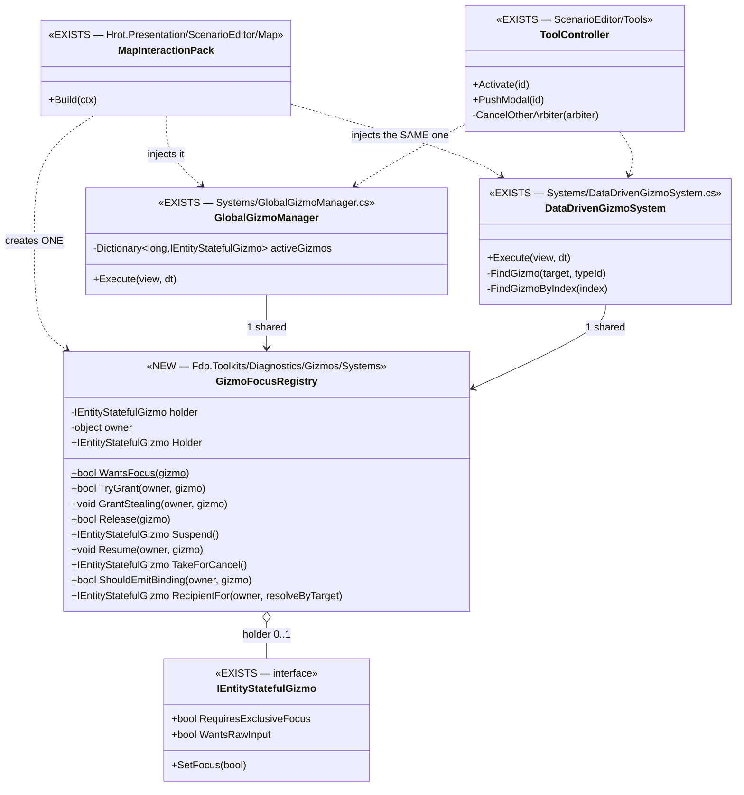
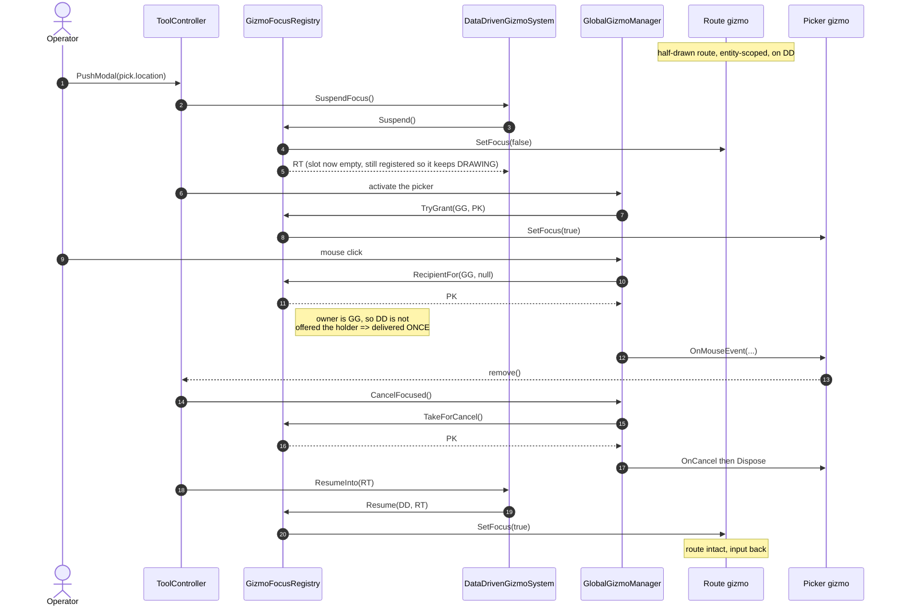

<!--STATUS
state: LIVE
updated: 2026-09-09
current-answer: §6 is the intent and still stands. ⚠ READ §6.4 FIRST — it records that §6.2's
  single registry was NEVER ADOPTED INTO FDP, and what FDP actually has instead (§6.2a).
known-rot: §13's closing line ("port the same GizmoInteractionManager into FDP and rewire
  DataDrivenGizmoSystem over it") and §9's "DataDrivenGizmoSystem shrinks dramatically" describe a
  port that DID NOT HAPPEN. ⛔ Do not quote either as a description of the code.
-->

# Gizmo Input & Focus — Design Document

**Subject:** FDP / HROT GizmoMap — backend-driven interactive tools over a stateless dumb terminal
**Status:** Design proposal, derived from FDP 152 design talk
**Scope:** `GizmoMap.Contracts`, `GizmoMap.Network`, `GizmoMap.Presentation`, `Fdp.Toolkit.Diagnostics.Gizmos`, plus `GizmoMap.Example` reference implementation

---

## 1. Context

GizmoMap is the diagnostic visualisation layer used across all FDP subsystems (IG, SimHost, ExCon, CGF, ClusterRunner). The presentation layer ("dumb terminal") is **the same generic component** running in every viewport — it differs only in which subsystem's primitive stream it is currently bound to (perspective switching by `NodeId` / `PickStreamId`).

Today, the terminal is too smart: it hardcodes that `MouseButton.Left == Commit`, `Escape == Cancel`, and uses `DebugLayer` (a visibility mask) as if it were a Z-order. We need backend-driven interactive tools — for example an *entity rotator* that tracks the mouse and updates entity heading on click, or a *polygon vertex editor* that drags vertices — without leaking any semantic decisions into the terminal.

This document describes the final architecture: a strict immediate-mode pipeline where the terminal blindly reflects hardware events declared by data on the wire, and all interaction semantics, focus, and lifecycle live on the backend in a fully **ECS-agnostic** core.

## 2. Goals & non-goals

### Goals

- **Stateless dumb terminal.** No semantic interpretation of HW events. No domain awareness. No business rules.
- **Backend-driven semantics.** Each tool decides what a click, drag, or keypress means.
- **ECS-agnosticism.** The interaction core works in `GizmoMap.Example` (no ECS) identically to how it works in the FDP backend. ECS becomes a thin adapter, not a foundation.
- **Strong typing at the FSM boundary.** Tools never pattern-match an `actionId` integer; they receive typed events with typed enums.
- **Idiomatic C# lifecycles.** Constructors establish invariants, `IDisposable` tears them down. No two-phase init, no pooling boilerplate.
- **Generic across subsystems.** Same terminal, same primitives, same transport — every subsystem produces its own gizmo stream and the terminal retunes itself for the active perspective.

### Non-goals

- Bandwidth-optimal HW event compression — the existing 64-byte primitive and the existing DDS batch are reused with field repurposing; no struct grows.
- Reproducing every behavior of the legacy `GizmoInteractionProxyTool` — the parts that hardcoded semantic interpretation are explicitly being removed.

## 3. Guiding principles

1. **Unidirectional, immediate-mode data flow.**
   Backend emits primitives → terminal renders & reflects HW → backend FSM consumes events → goto top.
   The terminal reconstructs the UI from scratch every frame from `DebugPrimitivesBatch`. There is no retained state in the terminal that the backend has to "abort" or "reset".

2. **Data declares intent. Code does not.**
   When a backend tool wants raw HW events, it emits a non-visual meta-primitive (`InputCaptureBinding`). When it wants the events to stop, it stops emitting that primitive. No RPC, no handshake, no negotiation.

3. **Two kinds of focus, two mechanisms.**
   - *Spatial focus* (shared) is resolved by hit-testing on the terminal — pure data, no backend coordination.
   - *Logical focus* (exclusive) is arbitrated on the backend by a single registry — the terminal never sees a conflict.

4. **Multiplexing belongs to transport. Demultiplexing happens at ingress.**
   The wire format packs many event kinds into one DDS batch. The ingress translator unpacks them into strongly typed local events before they ever reach a state machine.

5. **The gizmo declares; the host enforces.**
   A gizmo says "I want exclusive focus" via a property. It does not acquire locks, does not emit capture primitives itself, does not know about the registry. The hosting manager does all of that.

## 4. Layered architecture

```
┌──────────────────────────────────────────────────────────────────┐
│                         Backend (per subsystem)                  │
│                                                                  │
│   ┌──────────────────────────────────────────────────────┐       │
│   │      Stateful gizmos (FSMs, ECS-free or ECS-bound)   │       │
│   │      EntityRotatorGizmo, VertexEditGizmo, ...        │       │
│   └────────────▲─────────────────────────────────┬───────┘       │
│                │ typed events                    │ primitives    │
│   ┌────────────┴─────────────────────────────────▼───────┐       │
│   │      GizmoInteractionManager  (ECS-agnostic core)    │       │
│   │  • registry by AnchorId   • exclusive-focus lock     │       │
│   │  • emits InputCaptureBinding on tools' behalf        │       │
│   │  • IGizmoSource.Emit                                 │       │
│   └────────────▲─────────────────────────────────┬───────┘       │
│                │                                 │               │
│   ┌────────────┴────────────┐        ┌───────────▼──────────┐    │
│   │ Ingress translator      │        │ Egress / draw buffer │    │
│   │ DDS batch → typed events│        │ DebugPrimitivesBatch │    │
│   └────────────▲────────────┘        └──────────┬───────────┘    │
└────────────────┼───────────────────────────────────┼─────────────┘
                 │  GizmoInteractionBatch (DDS)      │  primitives
┌────────────────┼───────────────────────────────────▼─────────────┐
│                │      Dumb terminal (presentation, generic)      │
│                │                                                 │
│   ┌────────────┴────────────────────────────────────────────┐    │
│   │ DebugGizmoLayer / equivalent                            │    │
│   │  • render primitives                                    │    │
│   │  • spatial hit-test (reverse iteration)                 │    │
│   │  • reflect raw HW when InputCaptureBinding is present   │    │
│   │  • zero domain knowledge                                │    │
│   └─────────────────────────────────────────────────────────┘    │
└──────────────────────────────────────────────────────────────────┘
```

The same terminal runs in IG, ExCon, ClusterRunner viewer, etc. Perspective switching just routes a different `NodeId`'s primitive stream into the same component. Each subsystem produces its own stream; the cluster runner's terminal retunes itself when the operator changes perspective.

## 5. Data contracts

### 5.1 New primitive: `InputCaptureBinding`

A non-visual meta-primitive declaring that the bound token wants raw hardware events streamed to it. Modeled on the existing `ContextMenuBinding` so it fits the 64-byte `DebugPrimitive` footprint without growth.

```csharp
public enum DebugPrimitiveShape : byte
{
    // ... existing shapes
    SpatialAnchor       = 10,
    ContextMenuBinding  = 11,
    InputCaptureBinding = 12, // NEW
}
```

Field re-use within the existing payload union:

| Field            | Meaning when `Shape == InputCaptureBinding`              |
|------------------|----------------------------------------------------------|
| `InspNetworkId`  | `AnchorId` of the target (entity / domain object / tool) |
| `SubElementId`   | Specific handle id (0 for the whole tool)                |
| `ConditionMask`  | `1` = Exclusive, `0` = Shared                            |

Factory:

```csharp
public static DebugPrimitive MakeInputCaptureBinding(
    long networkId, uint subElementId, bool exclusive)
{
    var p = default(DebugPrimitive);
    p.Shape          = DebugPrimitiveShape.InputCaptureBinding;
    p.InspNetworkId  = networkId;
    p.SubElementId   = subElementId;
    p.ConditionMask  = exclusive ? 1u : 0u;
    return p;
}
```

### 5.2 Transport: `GizmoInteractionBatch`

Reused as-is in size. We add one event kind and reinterpret two fields when that kind is set.

```csharp
public enum GizmoInteractionEventKind : byte
{
    Started     = 0,
    DragUpdate  = 1,
    Commit      = 2,
    Cancel      = 3,
    MenuAction  = 4,
    RawInput    = 5, // NEW
}
```

When `Kind == RawInput`:

| Field              | Meaning                                                       |
|--------------------|---------------------------------------------------------------|
| `ActionId`         | `(int)MapMouseButton` or `(int)MapKeyboardKey`                |
| `Space` (byte)     | bit 7: `1` = mouse, `0` = keyboard; bit 0: `1` = pressed, `0` = released |
| `WorldX/Y/Z`       | Pointer position in **world space** (terminal unprojects)     |
| `PickAnchorId` / `PickSubElementId` | route the payload to a specific token        |

**Coordinate space rule.** The backend never sees screen pixels. It has no awareness of `MapCamera` zoom/offset/target. The terminal always unprojects via `Raylib.GetScreenToWorld2D` (or equivalent) before packing. The existing `CoordinateSpace` enum on the batch qualifies the data when needed.

### 5.3 Local typed events (backend bus)

The transport multiplexing exists for bandwidth. The bus does not. Ingress translates the wire batch into strongly typed events:

```csharp
[EventId(8056)]
public struct GizmoMouseEvent
{
    public PickToken Token;
    public MapMouseButton Button;
    public bool IsPressed;       // false = released
    public Vector3 WorldPos;
}

[EventId(8057)]
public struct GizmoKeyEvent
{
    public PickToken Token;
    public MapKeyboardKey Key;
    public bool IsPressed;
}
```

Plus the existing `GizmoDragUpdateEvent`, `GizmoInteractionCommitEvent`, `GizmoInteractionCancelEvent`, `GizmoMenuActionEvent`.

## 6. Focus arbitration

This is the part that took the longest to converge. The final answer is: **two distinct mechanisms, never mixed.**

### 6.1 Spatial focus (shared) — resolved on the terminal

For interactive handles like polygon vertices: each backend gizmo emits standard visual primitives (e.g. `Box2D`) carrying its own `GizmoPickToken` (entity `AnchorId` + handle `SubElementId`). The terminal hit-tests these on click.

**Z-order rule.** Backend gizmos do not assign meaningful `ZIndex` values — they cannot coordinate to know who should be "on top." Instead:

> The terminal iterates the primitive buffer **in reverse** when hit-testing.

In an immediate-mode pipeline, the last primitive submitted is drawn last and therefore appears topmost. Reverse iteration matches that visually: the first primitive that passes the spatial intersection test in reverse order wins. Submission order alone is the deterministic resolution.

**Important:** `DebugPrimitive.DebugLayer` is a **visibility mask**, not a depth sort key. The current code that compares `prim.DebugLayer > best.DebugLayer` to resolve hit-test priority is wrong and is removed.

Multiple gizmos with overlapping handles need no coordination — only the one whose token shows up in the resulting `Started` event reacts.

### 6.2 Logical focus (exclusive) — arbitrated on the backend

For top-level tools that intercept *everything* (Escape, clicks in empty space, etc.), spatial hit-testing cannot help. If two tools simultaneously emitted `InputCaptureBinding(Exclusive=true)`, the terminal would have no honest way to choose.

We prevent that situation entirely on the backend:

```csharp
public sealed class ActiveGlobalGizmo
{
    public IStatefulGizmo? ActiveInstance { get; set; }
}
```

This registry lives **inside the `GizmoInteractionManager`** (see §8), not in the ECS. It is transient, never serialized, never replicated. A managed reference is fine — the manager knows its own tools' references; nobody else cares.

Rule: **only the holder of the registry slot may emit `InputCaptureBinding(Exclusive=true)`.** Because the manager (not the gizmo) emits the primitive, the gizmo doesn't even know the registry exists — it just declares `RequiresExclusiveFocus => true` and the manager handles the rest.

### 6.2a ⛔⛔ AS-BUILT DIVERGENCE — **§6.2's single registry was never adopted into FDP** *(measured `2026-09-09`)*

⚠⚠ **§6.2 and §9 describe a port that did not happen.** Measured while investigating the `UXI-07`
two-arbiter defect:

| the design says | what FDP actually has |
|---|---|
| §6.2 — *"only the holder of the registry slot may emit `InputCaptureBinding(Exclusive=true)`"*, one `ActiveGlobalGizmo` slot inside **one** `GizmoInteractionManager` | ⛔ **`ActiveGlobalGizmo` does not exist — 0 occurrences repo-wide.** `GizmoInteractionManager` exists in **`GizmoMap.Example` ONLY** (9 mentions, all in the example project). ⇒ **the reference implementation was written and never ported** |
| §9 — *"In FDP, `DataDrivenGizmoSystem` shrinks dramatically. It becomes a lifecycle bridge plus an event router"* | 🔴 **It did not shrink. It owns its OWN `_focusedGizmo`** — ~40 touches, **four grant sites** (`:91`, `:291` grant-if-null, and **`:452` which STEALS**: `if ((gizmo.RequiresExclusiveFocus \|\| gizmo.WantsRawInput) && _focusedGizmo != gizmo) { _focusedGizmo?.SetFocus(false); … }`), ~8 release sites |
| §6.2 — one arbiter | 🔴 **TWO.** `GlobalGizmoManager` has a **second** `_focusedGizmo` (14 touches, grant at `:66`). Neither knows about the other; both are handed the same `FdpEventBus` by `MapInteractionPack` |

⭐ **The CONTRACT half of this design WAS adopted** — `IGizmoInteractionHandler` / `IStatefulGizmo`
are shared and implemented widely (`Fdp.Presentation` pickers, `Hrot.ScenarioEditor` gizmos,
`TuningConsoleGizmo`, `LayerControlGizmo`). ⛔ **It is specifically the ARBITER half that was left
behind**, which is the *"the seam exists and is under-adopted"* shape this repo keeps producing.

🔴 **Consequence, and it is the root of `UXI-07`:** *"at most one exclusive focus per subsystem"* is
**not true by construction** anywhere in FDP. `ToolController.CancelOtherArbiter` currently makes it
true by **convention** — it cancels the other arbiter before arming. ⚠ **That is a workaround, not the
fix**, and it holds only for tools that go through the controller.

⚠ **A second, separate finding — the field is OVERLOADED, which is why the port is not mechanical.**
`DataDrivenGizmoSystem._focusedGizmo` carries **two unrelated meanings**: (a) *who holds exclusive
focus* — §6.2's concern — and (b) *who receives an event whose token does not resolve*, the
`_focusedGizmo ?? FindGizmo(evt.Token…)` fallback at `:465, :473, :481, :509, :517` (drag, commit,
cancel, mouse, key). ⛔ **§6.2's registry replaces only (a).** Meaning (b) has **no design record** —
searched `docs/` and `.dev/`, none found — so adopting the registry requires a decision about the
routing fallback that this document never made. ⇒ ~12 touch points, not 4.

⭐ **Gateability, measured:** `Fdp.Toolkits.Tests` `Diagnostics.Gizmos` subset is **190/190 green on
3 consecutive runs** ⇒ ⛔ **`DEBT-AIB-030`'s rotating flake does NOT affect this subset**; a change
here can be gated honestly. *(That is a statement about this subset only, not the whole assembly.)*

> ⛔⛔ **SUPERSEDED — the last paragraph above ("the field is OVERLOADED… two unrelated meanings").**
> Measured `2026-09-09`: meaning (b) is **not** a fallback for an unresolvable token. `GlobalGizmoManager.Execute`
> **never reads `evt.Token`** and delivers raw input to the holder unconditionally, and
> `MakeInputCaptureBinding` never stamps a `GizmoTypeId`, so raw-input tokens carry `GizmoTypeId == 0`
> and `FindGizmo` can essentially never match for them. ⇒ **the two arbiters run the SAME rule**; there
> is one meaning — *"the focus holder receives un-anchored input"* — and `_focusedGizmo ?? FindGizmo(...)`
> is that rule with an entity-scoped second arm. 📄 [`Architect_Question_68`](../../blueprints/Architect_Question_68_Gizmo_Focus_Registry.md) §4c.

### 6.2b ✅ THE APPROVED RESOLUTION — **`GizmoFocusRegistry`, ONE INSTANCE, shared** *(`R-144`, `2026-09-09`)*

> 🔒 **User, `2026-09-09`:** *"68 most recent leans approved"* ⇒ 68-A YES · 68-B A · 68-C **C2** · 68-D now.

⛔ **C1 — porting `GizmoInteractionManager` from `GizmoMap.Example` — was REJECTED**, because it bundles
the focus fix with a **keying** fix (`AnchorId` is documented network-stable and is stamped with an ECS
`Entity.Index`) whose cross-node blast radius is unmeasured. That is `CE-259h`, and the registry below is
deliberately **keying-agnostic** so it does not wait on it. ⇒ §13's *"port it into FDP"* line stays rotted.

#### ⭐⭐⭐ The two facts that shape the API, both measured

| # | fact | why it decides something |
|---|---|---|
| ① | 🔴 **ONE INSTANCE, not one class.** `MapInteractionPack.cs:92-99` is the **single** production composition root of both arbiters, and its own comment already names the defect: *"globalManager and dataDriven each guard exclusivity only within themselves while sharing `bus`, so two 'exclusive' tools can hold focus at once."* | ⛔ Giving each arbiter its own registry instance changes the code layout and **fixes nothing** — `ToolController.CancelOtherArbiter`, the convention workaround, would still be load-bearing |
| ② | 🔴🔴 **A shared slot creates a DOUBLE-DELIVERY hazard that does not exist today.** Both arbiters run in `PostSimulation` over the **same** bus and each routes to *its own* holder. Share the slot naively and **both** route to it ⇒ every mouse/key/drag event delivered **twice** | ⇒ ⭐ **the registry stores `(holder, owner)`.** The **slot** is shared, so exclusivity is true by construction; **routing and binding emission stay with the OWNING arbiter**, so nothing is delivered or emitted twice |

#### ⭐ The eleven behaviours the field carries today — the enumeration the API is derived from

📐 `grep -n "_focusedGizmo" DataDrivenGizmoSystem.cs` → **47 lines**; `GlobalGizmoManager.cs` → 14.

| # | behaviour | sites |
|---|---|---|
| ① | grant **if the slot is empty** | `DDGS:91`, `:355` · `GGM:66` |
| ② | release **if this gizmo holds it** | `DDGS:106, :685, :705, :720` · `GGM:83` |
| ③ | ⭐ **STEAL on interaction start** — displace whoever holds it | `DDGS:516-520` — ⛔ **the one site with no `GlobalGizmoManager` counterpart** |
| ④ | suspend *(`SetFocus(false)`, no dispose)* | `DDGS:132` · `GGM:111` |
| ⑤ | resume | `DDGS:155` · `GGM:126` |
| ⑥ | take-for-cancel | `DDGS:169` · `GGM:154` |
| ⑦ | sweep *(cancel every interactive tool)* | `DDGS:192` · `GGM:177` |
| ⑧ | **emit `InputCaptureBinding` for the holder** | `DDGS:395, :438, :470` *(three draw loops)* · `GGM:216` |
| ⑨ | ⭐⭐ **`RecipientFor` — holder FIRST, target lookup second** | `DDGS:529, :537, :545, :573, :581` · `GGM:229-246` *(holder only; the second arm is absent, which is the same rule with nothing to fall through to)* |
| ⑩ | the predicate `RequiresExclusiveFocus \|\| WantsRawInput`, written **~14 times** | everywhere above |
| ⑪ | ⛔ **index-routed events do NOT consult focus** — `FindGizmoByIndex` at `DDGS:554, :566`, and a comment at `:608` states the split | ⇒ `GizmoMenuActionEvent` / `GizmoStructUpdateEvent` are **out of scope** |

#### ⭐⭐ Class diagram — **existing boxes are marked, so a duplicate would be visible**



⭐⭐ **What the diagram makes visible:** the multiplicity is **`1` shared**, not `1` each — and that
single edge is the whole of 68-A. ⛔ Two `GizmoFocusRegistry` instances would satisfy every method
signature here and fix nothing.

#### ⭐⭐ Sequence — **the case that used to be broken: a picker interrupting a tool on the OTHER arbiter**



#### ⚠ The hazard this introduces, stated before it is built

⛔ **Sharing the slot means the two arbiters can no longer BOTH hold focus.** That is the defect being
fixed — but it is a **behaviour change**, and the honest question is whether anything relied on it
*(e.g. a permanent global gizmo with `WantsRawInput` coexisting with an entity-scoped tool)*.
⭐ **The adjudicator is the T-1 baseline, measured before any edit: 376 rails green** —
`Fdp.Toolkits.Tests` `Diagnostics.Gizmos` **190** · `Hrot.Presentation.Tests` Tools+Gizmos **65** ·
`Hrot.Editor.Tests` Adapters+Viewport **67** · `Hrot.IG.Tests` Gizmo **54**. ⇒ ⭐ **a red after the
change is attributable**, which is the whole point of running them first (`R-142`).

#### ✅ AS-BUILT — **built `2026-09-09`, and where it deviated from the drawing above**

⭐ Obligation ⑤: the design carries the truth, not the report.

| | |
|---|---|
| ✅ **built as drawn** | `GizmoFocusRegistry` in `Fdp.Toolkits/Diagnostics/Gizmos/Systems/` · both arbiters delegate — **`_focusedGizmo` is now 0 occurrences in both files** *(was 14 + 47)* · `MapInteractionPack.cs:99` creates ONE and passes it to both |
| ⚠ **DEVIATION ①, and it matters** | ⭐ The first cut had `RecipientFor` return **`null`** for a non-owning arbiter. ⛔ **That would also have suppressed that arbiter's TARGET LOOKUP** — a change to the SPATIAL routing path, the one path §4c never compared and which this unit explicitly scopes out. ⇒ **as built, a non-owning arbiter is denied the HOLDER but still runs its own target lookup**, which is exactly today's behaviour. ⭐ No double delivery results: a target lookup only ever resolves that arbiter's OWN gizmos |
| ⚠ **DEVIATION ②** | ⭐ Both arbiters' **sweeps** (`CancelInteractiveTools`) now release only a holder **they** granted. ⛔ Not in the original drawing, and necessary: with the slot shared, an unguarded sweep would reach into the other arbiter's holder — which it does not own and cannot dispose |
| ⭐ **`ToolController.CancelOtherArbiter` was KEPT** | ⛔ **Deliberately not deleted.** It is now belt-and-braces rather than the load-bearing mechanism, and `R-137` *(unification may not cost a capability)* plus this repo's *"prefer routing to deleting"* both say a still-correct path is not removed in the same unit that makes it redundant. ⚠ Its removal is a separate, measurable question |

#### 📐 GATES — measured, `2026-09-09`

| gate | before | after |
|---|---|---|
| `Fdp.Toolkits.Tests` `~Diagnostics.Gizmos` | **190/190** | ✅ **204/204** *(+14 new `GizmoFocusRegistryTests`)* |
| `Hrot.Editor.Tests` `~Adapter\|~ViewportInteraction` | **67/67** | ✅ **69/69** *(+2)* |
| `Hrot.Presentation.Tests` `~Tools\|~Gizmos` | **65/65** | ✅ **65/65** |
| `Hrot.IG.Tests` `~Gizmo` | **54/54** | ✅ **54/54** |
| build | — | ✅ `Fdp.Toolkits` · `Hrot.Presentation` · `Hrot.CGF` · `Hrot.ReplayBrowser` · `Hrot.IG` — **0 errors each** ⚠ every test run above was gated on `0 Error(s)`, never read off a stale binary |

⭐⭐ **Two inverse-edit RED-PROOFS, because a green suite proves nothing about a NEW invariant:**

| the inverse edit | what reddened |
|---|---|
| drop `focus: focus` from `DataDrivenGizmoSystem`'s construction in `MapInteractionPack` | ✅ **exactly 2** — `ThePackGivesBothArbitersTheSameFocusSlot` and `TwoAdaptersBypassingTheControllerCannotBothHoldFocus`. ⛔ The other 28 stayed green, which is the point: **nothing that existed before this change can see the defect** |
| make `RecipientFor` ignore the owner *(the double-delivery regression)* | ✅ **exactly 2** — `TheHolderIsOfferedOnlyToTheArbiterThatGrantedIt` and `ANonOwningArbiterStillRunsItsTargetLookup` |

#### ⛔⛔ WHAT THE REGISTRY IS **NOT** — **no editor-observable behaviour change** *(measured `2026-09-09`, and it CORRECTS a claim I made)*

⚠⚠ **I told the operator the six-gizmo fix (`CE-259k`) was needed *"to test today's registry"*, on the
reasoning that the registry is only observable on controller-BYPASSING paths and those were the pickers.
🔴 **That reasoning was wrong, and measuring it is what showed it.**

📐 **Enumerated — every exclusive-focus arming path reachable from the editor:**

| path | goes through `ToolController`? |
|---|---|
| toolbar / `ActivateEditorToolEvent` → `ToolActivationDrainSystem` | ✅ |
| context menu *(Edit Shape · Edit Route · Rotate)* | ✅ `SelectEntity` then `ActivateTool` |
| the PICKERS *(`EditorMapPickAdapter`, `CanvasMapPickAdapter`, `ReplayBrowserSubsystem`)* | ✅ **converted in 4b** — `PickerToolHost` → `PushModal` |
| `ScenarioSpawnAdapter` *(Place / Draw Area / Draw Route)* | ✅ `StartAreaAuthoringMode` calls `_tools.Activate(PlaceArea)` — `:268` |
| `EditorZoneAdapter` *(obstacles)* · IG's `MapCommandController` | ✅ **converted in 4a** — both are arm bodies returning `ToolActivationOutcome` |
| `layerControlGizmo` *(all hosts)* | ⛔ registered directly — ⭐ but **permanent/modeless**, never takes the slot |

⇒ 🔒 **`CancelOtherArbiter` already makes exclusivity hold on every path an operator can reach.**
⇒ ⭐⭐ **The registry changes the MECHANISM, not the BEHAVIOUR:** the invariant becomes true **by
construction** instead of by a convention that only covers callers who remember to use the controller,
and the three suspend/resume methods stop existing twice. ⛔ **There is no editor gesture that
distinguishes before from after.**

| ⭐ what this means, stated so nobody over- or under-sells it | |
|---|---|
| ⛔ **do NOT write a manual test for 68-A** | there is nothing to see. Its guarantee is against a FUTURE bypass and against the duplication — both structural, both covered by `GizmoFocusRegistryTests` + the forwarding rail |
| ✅ **`CE-259k` was still worth doing on its own merits** | it revived **three dead toolbar tools** *(Measure, Draw Area, Draw Route)*, confirmed by the operator. ⚠ **But that is not the reason I gave for it** — the honest reason is that they were broken |
| ⭐⭐ **what IS manually testable is step 4b (`PushModal`)** | *suspend* vs *destroy* is a real behaviour change and it IS visible: the tool underneath stays drawn and comes back |
| 🔒 **the generic lesson** | ⛔ *"this change needs a manual test"* deserves the same claim table as any other lean. 📐 One `grep` over the arming paths would have shown there was nothing to observe — **I asserted it instead of measuring it** |

#### ⛔ Explicitly NOT in this unit

| | |
|---|---|
| `CE-259h` — the `AnchorId`/`Entity` keying violation | the registry is keying-agnostic and does not wait on it |
| `IgApplication._activeSequenceGizmo` | fire-and-forget remote area/route authoring; needs `Activate`, not `PushModal` |
| ⛔ **the SPATIAL routing path** | §4c compared only RAW INPUT between the two arbiters. **The spatial path was never compared** ⇒ nothing beyond the focus slot is collapsed here |

### 6.2c 🔴🔴 AS-BUILT DEFECT — **an EXCLUSIVE gizmo that does not want RAW INPUT is DEAF** *(`CE-259k`, measured `2026-09-09` BY RUNNING THE EDITOR)*

> 🔒 **Found by the user in minutes, with the whole ~8 000-rail suite green.** 📌 The `T-1`/`R-142` tally
> gains another row: **six** production gizmos were affected and **not one rail could see it.**

#### ⭐⭐ The mechanism — a pincer, and either half alone would be survivable

| # | measured | source |
|---|---|---|
| ① | raw HW events reach the capture token **only** when the binding sets bit `2` | `DebugGizmoLayer.cs:126` — `if ((prim.ConditionMask & 2u) != 0) routeRawInput = true;` |
| ② | ⭐⭐ **an EXCLUSIVE binding SUPPRESSES spatial hit-testing** for every primitive not anchored to the capture id | `DebugGizmoLayer.cs:428` — `if (exclusiveAnchorId.HasValue && anchorId != exclusiveAnchorId.Value) continue;` |
| ③ | ⇒ 🔴 **`exclusive && !raw` receives NOTHING on either path** | ①+② |
| ④ | ⛔ **and it still DRAWS**, because `UpdateAndDraw` is unconditional | `GlobalGizmoManager.Execute` step 1 |

⇒ ⭐⭐⭐ **The symptom is *"the tool renders and ignores my clicks"*, never a crash or a log line** — which
is precisely why it survived. 📌 The operator's words: *"Draw Area and Draw Route show a blue circle
lagging behind the cursor and click does not start drawing anything… and can't be cancelled"* — ⚠ **Escape
fails too, because Escape is a raw KEY event.**

#### 📐 The six, and why the report's PASS/FAIL split is the proof

| gizmo | excl | raw | predicted | ⭐ operator observed |
|---|---|---|---|---|
| `MeasureGizmo` | ✅ | ⛔ | deaf | ✅ **deaf** |
| `PointSequenceGizmo` *(Draw Area + Draw Route)* | ✅ | ⛔ | deaf | ✅ **deaf** |
| `ObstaclePlacementGizmo` · `ModalBoxSelectionGizmo` · `FdpLocationPickerGizmo` · `EntityPickerGizmo` | ✅ | ⛔ | deaf | ⚠ not reached |
| `EntityPlacementGizmo` | ✅ | ✅ | works | ✅ **worked** |
| `EntityRotatorGizmo` | ✅ | ✅ | works | ✅ **worked** |
| `EntityDragGizmo` | ⛔ | — | never captures ⇒ normal spatial | ✅ **worked** |

⭐⭐ **All six observations predicted by one mechanism** — ⛔ that, not the plausibility of the story, is
why this is recorded as measured rather than as a hypothesis.

#### 🔒 The DESIGN says the second bit should not exist

> **§5.1, verbatim:** *"A non-visual meta-primitive declaring that the bound token **wants raw hardware
> events streamed to it**."* — and its field table gives **ONE** flag: `ConditionMask: 1 = Exclusive,
> 0 = Shared`.

⇒ ⭐⭐⭐ **In the design, EMITTING the binding IS the request for raw input**, and `exclusive` says only
whether the capture is exclusive or shared. ⛔ **The `wantsRawInput` bit is an AS-BUILT ADDITION with no
design record**, and it now gates the very thing the primitive exists to declare. ⚠ **That is the root
cause; the six gizmos are its victims, not its authors.**

#### ✅ What was done, and what was deliberately NOT

| | |
|---|---|
| ✅ **`CE-259k` — all six now declare `WantsRawInput => true`** | ⭐ correct **per gizmo on its own evidence**: each implements its entire behaviour in `OnMouseEvent`/`OnKeyEvent` while `OnInteractionStarted`/`OnCommit` are **empty stubs**. ⭐⭐ It is also correct under EITHER reading of §5.1, so it cannot be invalidated by `CE-259l` |
| ✅ **a rail, because six one-line fixes do not stop a seventh** | `NoExclusiveFocusGizmoForgetsToAskForRawInput` — a SOURCE SCAN over every `*Gizmo.cs` in `FDP/` and `Hrot/`, with an explicit `spatiallyRouted` allow-list. ⭐ Inverse-edit red-proofed. ⛔ A source scan **on purpose**: the failure is an OMISSION, and these gizmos share no constructor to instantiate reflectively |
| ⛔ **`CE-259l` — should the `wantsRawInput` bit exist AT ALL?** | ⚠ **NOT decided here.** Removing it *(or making `exclusive` imply raw)* is the one-implementation fix and matches §5.1 — but it changes the **terminal contract** for every gizmo in FDP, and it is not what an operator is blocked on. ⇒ its own question, its own measurement |

#### ⚠ What this cost, stated plainly

⛔ **`UXI-07`'s own step 4b was never reachable in the editor** — `FdpLocationPickerGizmo` and
`EntityPickerGizmo` are both in the deaf set, so the suspend/resume capability shipped, gated and green
could not have been exercised by hand. ⇒ ⭐⭐ **the `T3`/"run the real thing" tier is not optional for this
subsystem**, and a manual test plan for it must check `WantsRawInput` against the terminal **before** it
claims a test is runnable.

### 6.3 What the terminal does NOT do

- It does **not** decide which `InputCaptureBinding` "wins" if multiple appear. Backend ensures only one exclusive request exists per frame; if a buggy backend sends two, the terminal may pick the last one — that's a backend bug, not terminal logic.
- It does **not** hardcode `Left == Commit`, `Right == Cancel`, `Escape == Cancel`. Those are removed from `GizmoInteractionProxyTool`. The backend FSM evaluates raw events and decides what they mean.

## 7. Backend interfaces

### 7.1 The interaction-handler contract (common to all stateful gizmos)

```csharp
public interface IGizmoInteractionHandler
{
    bool RequiresExclusiveFocus { get; }

    // Spatial / shared interactions (originating from a hit-test on the terminal)
    void OnInteractionStarted(Vector3 worldPos);
    void OnDragUpdate(Vector3 worldPos);
    void OnCommit(Vector3 worldPos);
    void OnCancel();

    // Semantic actions (e.g. context-menu items)
    void OnMenuAction(int actionId);

    // Raw HW events delivered while exclusive capture is held
    void OnMouseEvent(MapMouseButton button, bool isPressed, Vector3 worldPos);
    void OnKeyEvent(MapKeyboardKey key, bool isPressed);
}
```

**Why these specific shapes:**
- *Specialized methods, not a chameleon `OnInteraction(kind, payload)`.* Forcing the FSM to `switch(kind)` and unpack a multiplexed payload bleeds the transport into the domain.
- *`OnMouseEvent(button, isPressed, worldPos)` not `OnMouseButtonPressed/Released`.* The button is already strongly typed; bundling pressed/released avoids interface bloat.
- *`worldPos`, never `screenPos`.* The backend has no `MapCamera` to project against.
- *`RequiresExclusiveFocus` is a property, not a method call or an event.* The host inspects it once and acts.

### 7.2 Producer & lifecycle interfaces

```csharp
// Pure ECS-free producer. Standalone tools, GizmoMap.Example, test harnesses.
public interface IGizmoSource
{
    void Emit(float deltaTime, IGizmoDrawBuilder draw);
}

// Global stateful gizmo. No entity binding. No ISimulationView in hot path.
public interface IStatefulGizmo : IGizmoInteractionHandler, IDisposable
{
    void UpdateAndDraw(float deltaTime, IDebugDrawBuilder drawBuilder);
}

// Entity-bound stateful gizmo. Specialised; lives in the FDP adapter layer.
public interface IEntityStatefulGizmo : IGizmoInteractionHandler, IDisposable
{
    void UpdateAndDraw(float deltaTime, IDebugDrawBuilder drawBuilder);
}

// Stateless variants — pure functions over current state.
public interface IStatelessGizmo
{
    void Draw(ISimulationView view, IDebugDrawBuilder drawBuilder);
}

public interface IEntityStatelessGizmo
{
    void Draw(ISimulationView view, Entity entity, IDebugDrawBuilder drawBuilder);
}
```

**Why no `OnInitialize` / `OnTeardown`:**
Two-phase init creates temporal coupling and breaks invariants — the FSM can be observed half-built. We use the constructor for setup and `IDisposable` for teardown. No factory pooling either: gizmo construction is not a hot path, and Gen0 GC is built for exactly this kind of transient object.

**Why no `ISimulationView` parameter on `UpdateAndDraw`:**
Stateful gizmos already received it in the constructor and cached it. Passing it every frame is parameter bloat. Stateless gizmos do receive it per-call because they have no state to hold it in.

## 8. The ECS-agnostic core: `GizmoInteractionManager`

This is the single owner of the interaction model. It lives in `GizmoMap.Contracts` (or an equivalent core library) with **zero ECS dependency**.

```csharp
public sealed class GizmoInteractionManager : IGizmoSource
{
    private readonly Dictionary<long, IStatefulGizmo> _activeTools = new();
    private IStatefulGizmo? _exclusiveFocusHolder;

    public void AddTool(long anchorId, IStatefulGizmo tool)
    {
        _activeTools[anchorId] = tool;
        if (tool.RequiresExclusiveFocus && _exclusiveFocusHolder == null)
            _exclusiveFocusHolder = tool;
    }

    public void RemoveTool(long anchorId)
    {
        if (_activeTools.Remove(anchorId, out var tool))
        {
            if (_exclusiveFocusHolder == tool) _exclusiveFocusHolder = null;
            tool.Dispose();
        }
    }

    public void DispatchEvent(GizmoPickToken token,
                              GizmoInteractionEventKind kind,
                              Vector3 worldPos,
                              int actionId,
                              byte stateFlags)
    {
        // O(1) lookup by token.AnchorId, then specialised method on the matched tool.
        // No global event filtering inside FSMs.
    }

    public void Emit(float deltaTime, IGizmoDrawBuilder draw)
    {
        foreach (var (anchorId, tool) in _activeTools)
        {
            tool.UpdateAndDraw(deltaTime, draw);

            // The MANAGER emits the capture binding, not the gizmo.
            if (tool == _exclusiveFocusHolder)
                draw.EmitRaw(DebugPrimitive.MakeInputCaptureBinding(
                    networkId: anchorId, subElementId: 0, exclusive: true));
        }
    }
}
```

Responsibilities:
- Own the tool registry, keyed by 64-bit `AnchorId` (network id, semantic id, anything stable — never an ECS handle).
- Own the exclusive-focus lock.
- **Emit `InputCaptureBinding` on the tool's behalf** when the tool declares it needs exclusive capture.
- O(1) push-based dispatch of typed events to the matching tool, so individual FSMs never need `if (evt.Token != mine) continue` filtering.

The manager exposes itself as an `IGizmoSource` so the host loop just calls `manager.Emit(dt, draw)` once per frame.

## 9. ECS adapter (when ECS is the host)

In FDP, `DataDrivenGizmoSystem` shrinks dramatically. It becomes a lifecycle bridge plus an event router:

- On `ConstructionOrder` for an entity matching a gizmo registry rule: resolve the entity's network id, `new MyGizmo(view, entity)`, `manager.AddTool(networkId, gizmo)`.
- On `DestructionOrder`: `manager.RemoveTool(networkId)` (which calls `Dispose`).
- Each frame, read typed events (`GizmoMouseEvent`, `GizmoKeyEvent`, `GizmoDragUpdateEvent`, `GizmoInteractionCommitEvent`, …) from the bus and forward each to `manager.DispatchEvent`.

`GizmoInteractionIngressSystem` translates the DDS batch into typed local events using bit flags from the `Space` byte to discriminate mouse vs. keyboard and pressed vs. released.

`StatelessGizmoSystem` similarly demotes to a thin bridge.

The ECS adapter contains **no** focus logic, **no** capture-binding emission, and **no** event multiplexing.

### 9.1 Tool entities (a convenient ECS pattern, not a requirement)

For transient tools like the rotator, hosting the gizmo on a small dedicated "tool entity" that exists for the duration of the interaction is convenient: when the FSM decides the interaction is over, it issues `DestroyEntity(toolEntity)` and the standard `DestructionOrder` path triggers `RemoveTool` → `Dispose`. No special teardown plumbing.

But this is purely an ECS-host convenience. Non-ECS hosts call `RemoveTool` directly. A gizmo never `cares` whether it lives on a tool entity, on a domain entity, or on no entity at all.

## 10. End-to-end flows

### 10.1 Spatial drag (polygon vertex editor)

```
1. VertexEditGizmo emits, every frame, a Box2D for each vertex with
   AnchorId = polygonId, SubElementId = vertexIndex+1, Color = idle.
2. User clicks. Terminal hit-tests in reverse buffer order, finds the topmost
   Box2D with non-zero SubElementId, builds a GizmoPickToken, sends a
   GizmoInteractionBatch{Kind=Started, Token, WorldXYZ}.
3. Ingress turns it into a GizmoInteractionStartedEvent. Manager dispatches
   to the gizmo registered under polygonId. Gizmo updates its "active vertex"
   field, switches color of that handle to red.
4. While active, gizmo also emits InputCaptureBinding(Shared) for that token.
   (Or, equivalently, the manager emits it on the gizmo's behalf if the
   gizmo declares shared focus — see implementation note below.)
5. User drags. Terminal sends DragUpdate events with new world coords.
   Manager dispatches OnDragUpdate(worldPos). Gizmo updates vertex position.
6. User releases. Terminal sends Commit. Gizmo clears active vertex,
   stops emitting capture binding. Terminal sees absence next frame and
   reverts to ordinary spatial hit-testing. No RPC, no abort.
```

Note: shared capture is the simpler path — the example may keep the gizmo in charge of emitting the shared `InputCaptureBinding` and reserve manager-driven emission for the exclusive case only. The contract works either way.

### 10.2 Exclusive logical capture (entity rotator)

```
1. Operator right-clicks tank → "Rotate". Backend: new EntityRotatorGizmo(view, tank);
   manager.AddTool(rotatorAnchorId, gizmo). RequiresExclusiveFocus = true.
2. Each frame, manager calls gizmo.UpdateAndDraw, which draws a yellow arrow
   from tank center toward the current heading. Manager emits
   InputCaptureBinding(Exclusive=true, AnchorId=rotatorAnchorId).
3. Terminal sees the exclusive binding, suspends spatial hit-testing,
   streams every mouse move and key as RawInput addressed to that token.
4. Mouse moves: ingress publishes GizmoMouseEvent (or DragUpdate) → manager
   → gizmo.OnMouseEvent / OnDragUpdate. Gizmo recomputes yaw from
   atan2(worldPos.Y - target.Y, worldPos.X - target.X), updates internal field.
5. Left mouse RELEASED: gizmo.OnMouseEvent(Left, isPressed=false, _).
   Gizmo writes the new yaw onto the target's SimTransform, then calls
   manager.RemoveTool(rotatorAnchorId) (ECS-hosted: destroys tool entity instead).
6. Manager disposes the gizmo and releases the exclusive lock.
   Next frame the capture binding is gone; terminal resumes normal behavior.
7. Right click or Escape pressed: same teardown, no rotation written.
```

The terminal in step 6/7 had no idea what Left/Right/Escape "meant". It only reflected them. The gizmo decided.

## 11. Worked example: `EntityRotatorGizmo`

```csharp
public class EntityRotatorGizmo : IEntityStatefulGizmo
{
    public bool RequiresExclusiveFocus => true;

    private readonly ISimulationView _view;
    private readonly Entity _targetEntity;
    private float _currentYawRad;

    public EntityRotatorGizmo(ISimulationView view, Entity targetEntity)
    {
        _view = view;
        _targetEntity = targetEntity;

        ref readonly var initialTf = ref _view.GetComponentRO<SimTransform>(_targetEntity);
        _currentYawRad = initialTf.Rotation.Yaw;
    }

    public void UpdateAndDraw(float deltaTime, IDebugDrawBuilder draw)
    {
        if (!_view.IsAlive(_targetEntity)) { /* request removal */ return; }

        ref readonly var tf = ref _view.GetComponentRO<SimTransform>(_targetEntity);
        var tip = new Vector3(
            tf.Position.X + MathF.Cos(_currentYawRad) * 30f,
            tf.Position.Y + MathF.Sin(_currentYawRad) * 30f,
            tf.Position.Z);

        draw.DrawArrow(tf.Position, tip, Rgba32.Yellow, headSize: 3f);
    }

    public void OnDragUpdate(Vector3 worldPos)
    {
        ref readonly var tf = ref _view.GetComponentRO<SimTransform>(_targetEntity);
        var dx = worldPos.X - tf.Position.X;
        var dy = worldPos.Y - tf.Position.Y;
        _currentYawRad = MathF.Atan2(dy, dx);
    }

    public void OnMouseEvent(MapMouseButton button, bool isPressed, Vector3 worldPos)
    {
        if (button == MapMouseButton.Left && !isPressed)
        {
            ref var tf = ref ((EntityRepository)_view).GetComponentRW<SimTransform>(_targetEntity);
            tf.Rotation = SimMath.FromYaw(_currentYawRad);
            RequestSelfRemoval();   // → ECS: DestroyEntity(toolEntity); pure: manager.RemoveTool(..)
        }
        else if (button == MapMouseButton.Right && isPressed)
        {
            RequestSelfRemoval();   // cancel
        }
    }

    public void OnKeyEvent(MapKeyboardKey key, bool isPressed)
    {
        if (key == MapKeyboardKey.Escape && isPressed)
            RequestSelfRemoval();
    }

    public void OnInteractionStarted(Vector3 worldPos) { }
    public void OnCommit(Vector3 worldPos)             { }
    public void OnCancel()                             { }
    public void OnMenuAction(int actionId)             { }

    public void Dispose() { /* nothing — manager already released the focus lock */ }
}
```

Things this code is *not* doing, intentionally:
- Not setting `ActiveGlobalGizmo` itself.
- Not emitting `InputCaptureBinding` itself.
- Not filtering events by token.
- Not implementing `OnInitialize` / `OnTeardown`.
- Not mapping `actionId` integers.

## 12. Required changes to current FDP code

1. **Remove hardcoded semantics** from `GizmoInteractionProxyTool` — drop `MouseButton.Left → Commit`, `Right/Escape → Cancel`. Keep only the generic drag-and-drop reflection it already does for hit-testable handles.
2. **Fix terminal hit-test priority.** Replace `prim.DebugLayer > best.DebugLayer` comparison in `DebugGizmoLayer.HandleInput` with reverse iteration over the buffer. Stop using `DebugLayer` as a Z-order.
3. **Add primitive shape** `InputCaptureBinding = 12` and the corresponding factory.
4. **Extend `GizmoInteractionEventKind`** with `RawInput = 5`. Define the `Space`-byte bit-packing for mouse/keyboard and pressed/released.
5. **Add local typed events** `GizmoMouseEvent`, `GizmoKeyEvent`. Update `GizmoInteractionIngressSystem.Translate` to publish them on `RawInput` payloads.
6. **Refactor `IStatefulGizmo`** to:
   - drop `OnInitialize`, `OnTeardown`, `CreateUndoRecord`,
   - add `RequiresExclusiveFocus`,
   - add the typed handlers (`OnMouseEvent`, `OnKeyEvent`, `OnDragUpdate`, etc.),
   - drop `ISimulationView` / `Entity` from `UpdateAndDraw`,
   - extend `IDisposable`.
7. **Split** `IStatefulGizmo` (global) from `IEntityStatefulGizmo` (entity-bound). Same for stateless variants.
8. **Extract `GizmoInteractionManager`** into the ECS-free core. Move the `ActiveGlobalGizmo` registry inside it (delete the ECS singleton).
9. **Demote `DataDrivenGizmoSystem`** and `StatelessGizmoSystem` to thin lifecycle bridges over the manager. They map `ConstructionOrder/DestructionOrder` to `AddTool/RemoveTool` and forward typed events to `DispatchEvent`.
10. **Drop pooling.** Remove `IBehaviorGizmoFactory.Rent/Return`. Use plain `new` and `Dispose`.

## 13. Reference implementation order (in `GizmoMap.Example`)

The example is a non-ECS test bed for the architecture. Implement in this order:

1. Extend `DebugPrimitiveShape` and `GizmoInteractionEventKind` in `GizmoMap.Contracts` / `GizmoMap.Network`.
2. Update `DebugGizmoLayer.HandleInput`: reverse-iteration hit-test, scan for `InputCaptureBinding`, raw-event reflection. Update `onInteraction` delegate to carry `actionId` (so we can pass key/button codes through without enlarging the DDS struct in the demo).
3. Build `GizmoInteractionManager` (pure C#) with `AddTool`, `RemoveTool`, `DispatchEvent`, `Emit`.
4. Implement `EntityRotatorGizmo` and `VertexEditGizmoProjector` as standalone classes, each in its own file, each implementing `IStatefulGizmo` (or `IGizmoInteractionHandler` + a plain emit hook for the demo). Two polygons get their own `VertexEditGizmoProjector` instances — they multiplex purely through tokens and need no shared coordination.
5. `DemoSceneGenerator` becomes the host: holds a `GizmoInteractionManager`, populates it with the two polygon editors at startup, and exposes a `TriggerRotator()` method that constructs and registers a rotator on demand.

When this works end-to-end in the example, port the same `GizmoInteractionManager` and interface set into FDP and rewire `DataDrivenGizmoSystem` over it.

> ⛔⛔ **KNOWN ROT — the sentence above describes a port that DID NOT HAPPEN** *(measured `2026-09-09`, see **§6.2a**)*. The **interface set** was ported; the **`GizmoInteractionManager` was not**, and `DataDrivenGizmoSystem` was never rewired over it — it grew its own focus field instead, and `GlobalGizmoManager` grew a second one. ⚠ Do not read this line as a description of the code.

## 14. Open questions / deferred

- *Visual feedback for "I have focus".* A focused gizmo can simply branch its `UpdateAndDraw` on its internal state and emit primitives in a different color. The contract does not need a `bool HasFocus` flag because the gizmo always knows: shared focus = its own active-vertex field is set; exclusive focus = it is alive (the manager wouldn't be ticking it otherwise).
- *Filter mask on `InputCaptureBinding`.* The conversation considered a bitmask in `ConditionMask` to declare "I only want mouse moves, not keys." For now, `ConditionMask` is the exclusive flag; further filter bits can be added later in unused space without breaking the 64-byte footprint.
- *`MapCanvas` tool stack.* The frontend keeps its tool stack for routing, but stripped of business logic — the proxy tool remains as a generic input capturer that pops itself when the backend stops emitting the capture binding. No semantic decisions in the stack.
- *Multiple subsystems emitting capture simultaneously.* Each subsystem has its own backend manager and its own primitive stream. The terminal only listens to one stream at a time (active perspective). So inter-subsystem conflicts cannot reach the terminal; perspective switching does the equivalent of a hard reset of input capture.

---

**Summary of the central idea.** The terminal is an immediate-mode mirror; the backend describes what it wants, frame by frame, in a 64-byte primitive language. Focus is either spatial (resolved by where the cursor is, on the terminal) or logical (resolved by who holds the registry slot, on the backend). Gizmos are plain C# state machines with constructors and `Dispose`. The ECS, when present, is a lifecycle adapter — not the architecture.
