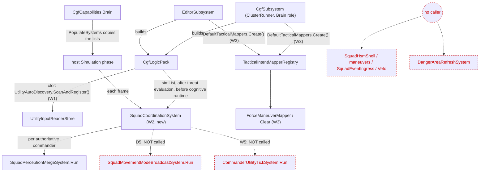
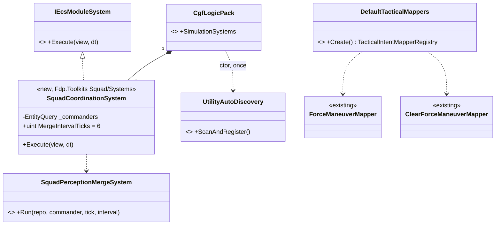
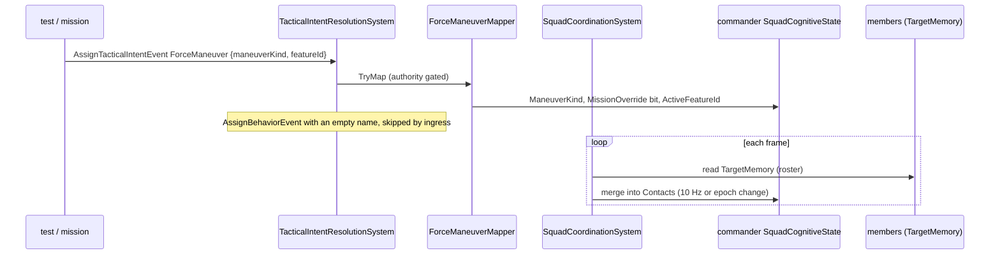

<!--STATUS
state: LIVE
updated: 2026-10-02
build-state: BUILT (W1–W4, 2026-10-02); D2/D3/D5 open as CE-507, awaiting the user's decision (§5)
current-answer: §2 (diagrams) and §5 (decisions)
stale-below: none
known-rot: Squad_Coordination_Design_v1_1.md and Hrot.SquadCoordination.md describe the layer as "fully implemented" — true of the code, never of its use (§1)
related-designs:
  - docs/designs/group-maneuvers/Squad_Coordination_Design_v1_1.md — owns WHAT the squad layer is (primitives, maneuvers, authority-by-weight); this doc owns only WHERE it runs
  - docs/designs/utility-ai/Utility_AI_Design_v1_1.md — owns the scorer and its §7 integration nodes; this doc adds the missing runtime bootstrap (input registration) both tiers need
  - docs/projects/Hrot/Subsystems/Hrot.SquadCoordination.md — the as-built API reference of the squad library
-->

# Squad coordination — the wiring (`CE-454`)

> **Problem.** The squad layer is built and unit-tested, but **no node runs it** (`CE-454`). Measuring it found that the
> **Utility AI runtime underneath it is not wired either**. So "register the squad systems" is not one step but two
> layers deep.

## 1. INVENTORY (`search_graph`, `2026-10-02`)

| query | total | result |
|---|---|---|
| `name_pattern=".*Squad.*"`, Class | 31 (non-test: 18) | six "systems" — **plain `Run(repo, commander, …)` classes, none is an `IEcsModuleSystem`**. The only production-live piece is `SquadCognitiveState`, provisioned on commanders by `SquadStateProvisioning` from `UnitHierarchySystem.cs:160` and `GenesisMaterializationSystem.cs:200` |
| `name_pattern=".*Maneuver.*"`, Class | 16 | six maneuver configurations, `ForceManeuverMapper`/`ClearForceManeuverMapper`, `ManeuverSelectStarterDecision`. **None has a production caller** |
| `name_pattern=".*Utility.*(System\|Tick\|Registrar\|Discovery\|Provision).*"`, Class | 5 | **there is no Utility tick, provisioning or bootstrap system in the repo.** `UtilityAutoDiscovery.ScanAndRegister` exists, and the analyzer emits a `[UtilityRegistrar] UtilityInputRegistrar` into `Fdp.Toolkits`, but **no production code calls it** (grep: 0 callers outside tests) |

| measured fact | where |
|---|---|
| `UtilityResultBuffer`, `MovementModeIntent`, `DangerAreaSensor` are **registered only in tests** | grep `RegisterComponent<…>`; `HrotSharedComponentRegistry.cs:185` registers `SquadCognitiveState` only |
| a successful `ForceManeuver` map publishes `AssignBehaviorEvent{BehaviorName=""}` | `ForceManeuverMapper.cs:43`, `TacticalIntentResolutionSystem.cs:125` |
| ⇒ that event is **skipped**, not a clear: ingress `TryGetId("")` fails | `BehaviorIngressSystem.cs:107` |
| the mapper registry is **built twice**, once per host, with the same two mappers | `CgfSubsystem.cs:918-920`, `EditorSubsystem.cs:1519-1525` |
| brain systems take the tick from `view.Tick` | `ThreatEvaluationSystem.cs:45` |
| ⛔ `MovementModeIntent` has **no consumer** (Muscle never reads it), and its id **264 is allocated twice** (also `FakeCrowdAgentState`). So are `DangerAreaSensor` (262) and `DangerAreaCognitiveBuffer` (263) | grep: 0 readers outside `Squad/`; `GlobalComponentIds.cs:525-531`; filed as `QA-037` (backend lane) |
| ✅ the CGF brain holds members' `TargetMemory` (threat evaluation boosts it there), so the merge has data | `CgfThreatEvaluationSystem.cs:16` |

## 2. The diagrams

### 2.1 Modules — who registers what, and who calls it each frame

*What the picture shows that the prose hid:* the squad layer reaches a frame only through **one** new system inside
the pack that **both** hosts already run. The red, dashed boxes stay unreached after this item: maneuver
**execution** has no caller in any design-named host (§5 D2). The movement-mode broadcast stays unreached because its component collides (`QA-037`) and has no reader (§5 D5).

### 2.2 Classes

*What the picture shows that the prose hid:* every box is **existing** except two, a system and a factory, both of
which only route existing code. Nothing duplicates a squad algorithm.

### 2.3 Sequence — the proof path (W4)

## 3. Slices

| slice | change | rail |
|---|---|---|
| **W1** | `CgfLogicPack` ctor calls `UtilityAutoDiscovery.ScanAndRegister()`. It is idempotent and fills `StandardInputs` + `SquadInputs`. ⛔ **No new component registration**: the merge needs only `SquadCognitiveState`, `UnitRoster` and `TargetMemory`, all already registered; the others collide (`QA-037`) | after constructing the pack, every `SquadInputIds` id has a reader |
| **W2** | `SquadCoordinationSystem`: a cached query `With<SquadCognitiveState>().With<UnitRoster>()`; per commander, skip unless `HasAuthority<SquadCognitiveState>`; then `Merge.Run(view.Tick)`. **Zero allocation per frame** | the frame rail: the merge happens through the real pack; a zero-alloc rail |
| **W3** | `DefaultTacticalMappers.Create()` (beside the existing mappers in `Hrot.AI.Behaviors`) returns `DefendArea`, `HullDownAttack`, `ForceManeuver` and `ClearForceManeuver`. **Both hosts** call it instead of building their own list | both hosts' registries resolve all four intent ids |
| **W4** | proof: commander + 2 subordinates through the **real `CgfLogicPack` system list** → publish `ForceManeuver` → `ManeuverKind` set and override bit held; the pool merged from the members' `TargetMemory` | the integration rail; red-proved by dropping the system from the pack |

### 3.1 As-built (`2026-10-02`)

| slice | where | rail |
|---|---|---|
| W1 | `CgfLogicPack` ctor, one line | ⚠ **no dedicated rail.** `UtilityInputReaderStore.TryGet` is `internal`, and the one-shot `ScanAndRegister` cannot be re-armed after a test `Clear()`s the store, so a rail would depend on test order |
| W2 | `Fdp.Toolkits/Squad/Systems/SquadCoordinationSystem.cs`; the pack's sim list after `CgfThreatEvaluationSystem`. ⚠ The design said "after `TacticalIntentResolution`"; it is later so that the merge reads freshly boosted `TargetMemory` before behaviours run | `SquadCoordinationSystemTests` (merge, gate, zero-alloc), red-proved |
| W3 | `Hrot.AI.Behaviors/Mappers/DefaultTacticalMappers.cs`. ⚠ Not in `Hrot.CGF`: the existing mappers live in `Hrot.AI.Behaviors`, which both hosts already reference. Both harnesses (`EditorHarness`, `SimHostInstance`) use it too | covered by W4, red-proved |
| W4 | `CgfLogicPackTests.CE454_TheSquadLayerRunsThroughTheRealCgfPack` | red-proved twice (system out of the pack; mapper out of the list) |

## 4. Rejected

- **Six `IEcsModuleSystem` wrappers, one per squad system.** That is six queries over one commander set, and the
  ordering between them would become kernel-registration order. One driver keeps the order where the design states it.
- **Put the driver in `Hrot.CGF`.** It touches only toolkit types, so it belongs beside the systems it calls
  (`Fdp.Toolkits/Squad/Systems`), the same as `ThreatEvaluationSystem`.
- **Register `ForceManeuverMapper` in each host's list.** That is a third copy of a list that already exists twice
  (`CgfSubsystem`, `EditorSubsystem`).

## 5. Decisions — **the user's**, each with a lean

| # | question | lean | what changes the lean |
|---|---|---|---|
| **D1** | Is the Utility runtime bootstrap (W1) in `CE-454`'s scope? | ✅ **yes, the bootstrap only.** Squad inputs cannot read without it, and it is one idempotent call | if Utility wiring should be its own item, split W1 out unchanged |
| **D2** | Maneuver **execution** — run `SquadHsmShell` + `PhaseEvent`s + veto per commander | ⛔ **not in `CE-454`.** Design §7 makes the squad HSM a **behaviour authored on the commander** (shell = library, HSM = orchestrator), not a system. Members obey a role only via a Utility consideration (`AssignedRole`), and **no member-tier Utility decision runs anywhere**. ⇒ a new item: "a shipped squad-maneuver behaviour + member role consumption" | if you want a system-driven fixed maneuver (a hard-coded shell per `ManeuverKind`), it can be W5. But that duplicates the authoring path the design chose |
| **D3** | Run `CommanderUtilityTickSystem` (autonomous `ManeuverSelect`) | ⛔ **not yet.** Every starter consideration reads the **active danger area**, and the only provider is `FakeDangerAreaProvider` (navmesh extraction is a dependency, design §11). Run without a feature, it would rewrite `ManeuverKind` from all-zero scores at 10 Hz | when a real danger-area provider lands, W6 = provision `UtilityResultBuffer` on commanders + call it |
| **D5** | Movement-mode broadcast (`MovementModeIntent`) | ⛔ **not wired.** Its id collides (`QA-037`) and Muscle has no reader, so wiring it would write a value nobody reads, into a contested slot | after `QA-037` re-numbers it **and** a Muscle consumer exists |
| **D4** | The tracker lean's "**shipped scenario** whose commander runs a maneuver end to end" | ⚠ **only meetable after D2.** `CE-454` proves the wiring with an integration rail through the real pack (W4) | — |
