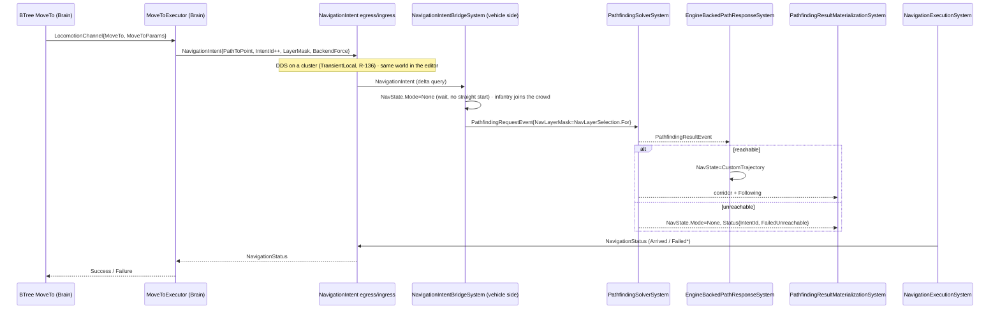
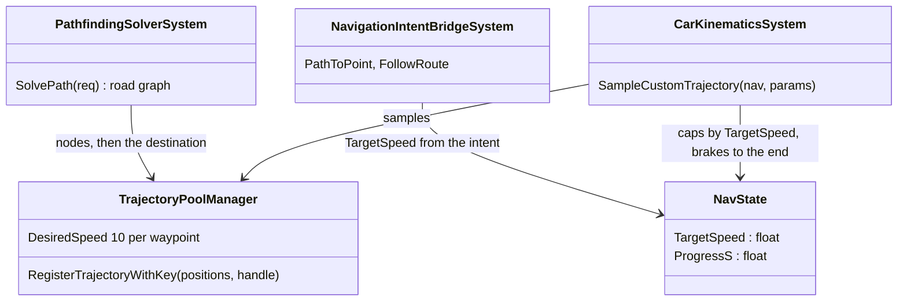
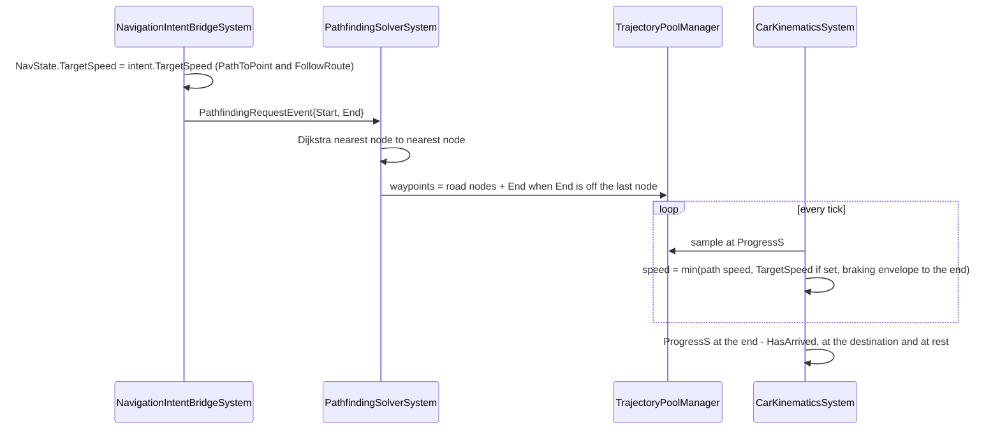
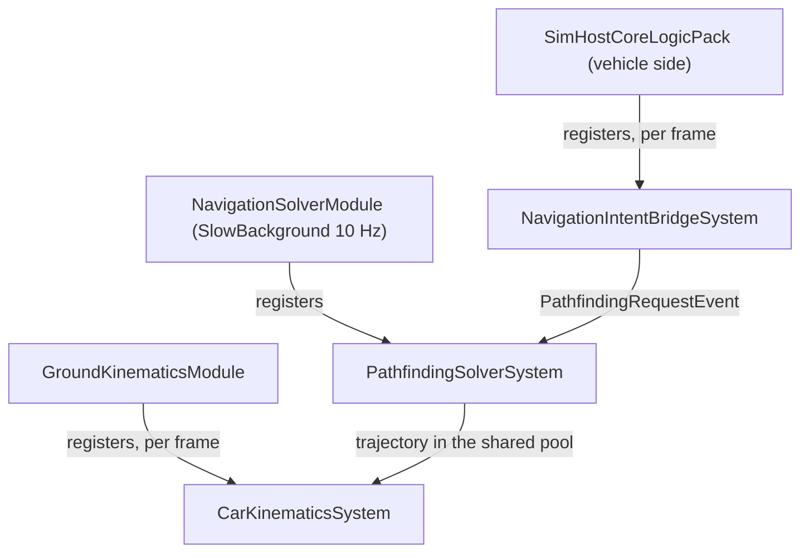
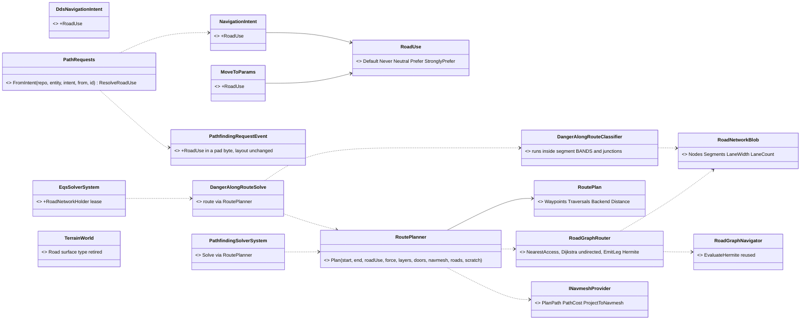
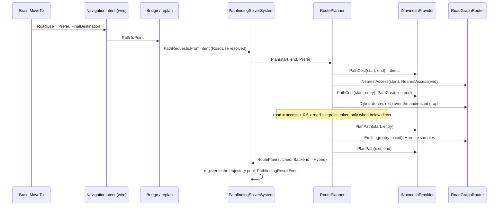
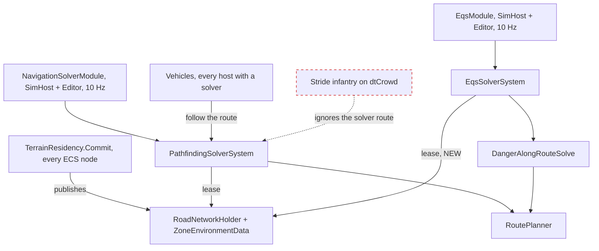
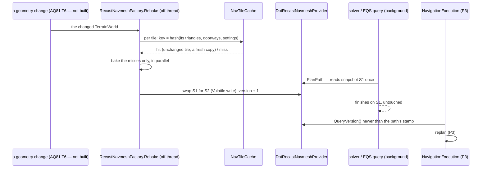
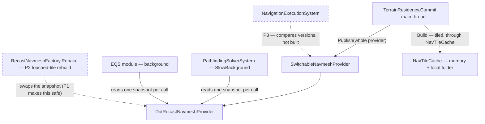

<!--STATUS
state: LIVE
updated: 2026-10-08 (§14 P2 as built: tiled bake + tile cache + touched-tile rebuild, CE-3111/CE-1029 · §15 allocation, R-220 · §14 runtime navmesh change, R-218 — P1 snapshot built) · 2026-10-03 (CE-3026 — MoveTo is a PathToPoint intent planned on the vehicle side on every host; CE-2059/2060 — the path ends at the destination, driven at the requested speed)
current-answer: §5.2a (CE-3128 — the road network as a chosen layer, DESIGN 2026-10-08, R-230/R-231); §3.1's AS-BUILT block (the command path and its sequenceDiagram) and §7.1's AS-BUILT note; §14 (runtime
  navmesh change, rewritten 2026-10-08, R-218; "P2 as built" for the tiled bake and the tile cache); the rest is the architectural contract.
stale-below: §3.1's ASCII flow and §7.1's pseudo-code key a MoveTo on ActiveAction/ActionInstanceId riding the intent —
  the as-built keys it on NavigationIntent.Mode == PathToPoint + IntentId (the Brain's channel never leaves the Brain).
known-rot: the top banner supersedes any Y-up wording (CE-3011).
related-designs:
  - ../../DESIGN_Utility_AI_Demo_Scenarios.md §10.7 — owns the danger-along-route sensor; §5.2a D7 here moves its classifier onto the
    road graph and its route onto the shared RoutePlanner (CE-3128 ④)
  - ../../DESIGN_Terrain_World.md §2 — owns the world file; §5.2a D8 retires its `surface: road` polygons (CE-3128 ⑤)
  - ../../DESIGN_Uniform_Gizmo_Membership.md §10 — RoadNetworkGizmo, which becomes the only drawing of a road
  - ../../DESIGN_Building_Interiors.md — authors the doors behind TraversalKind.Door (door area on navmesh polygons, B5/B6);
    §3j 5c is the STATE half of §14 (the door-aware query filter)
  - ../../blueprints/Architect_Question_81_SimHost_Test_Terrain_World.md — T6: placed static obstacles are baked by rebuilding
    the affected tiles — the GEOMETRY half of §14 (P2)
  - ../../blueprints/Architect_Question_71_Terrain_Zones_And_The_Asset_Build.md — R7: the per-node tile cache (P2's cache)
  - docs/DESIGN_Terrain_World.md — owns the terrain world, the Recast bake per terrain and W6 (which hosts compose the solver); §6a owns the allocation contract (R-220) of the path queries here.
  - docs/designs/brain-death/BD1-DESIGN.md — owns the Brain lifecycle; §1.1 is why MoveToExecutor.OnExit's STOP must reach the
    Muscle (the egress publishes a Mode None with an IntentId since CE-3026).
-->
# Navigation Subsystem — Architectural Design

> ⭐⭐ **COORDINATE CONTRACT — `2026-10-03` (`CE-3011`, R-182):** every navigation API in this document —
> `INavmeshProvider`, `NavWaypoint`, `IVolumetricPathProvider`/`FlyProfile` (altitude = **Z**), the fakes and the test
> navmaps — is **engine space, Z-up** (X east, Y north, Z up). ⛔ Any Y-up wording below is SUPERSEDED. The Recast Y-up
> swizzle lives only INSIDE `DotRecastNavmeshProvider` / `TerrainWorldGeometrySource`, and at the Stride boundary.
> 📄 [`DESIGN_Terrain_World.md`](../../DESIGN_Terrain_World.md) §7.1 W7.

> **Status.** **Canonical architectural contract.** This is the single
> altitude statement of the navigation subsystem's Brain ↔ Muscle (+
> optional NavigationSolver) interface, and the entry point for
> navigation work. It is not the implementation specification — two
> detailed-design documents carry that. New team members should read
> this document first to understand the shape of the system, then
> dive into whichever DD covers their area.
>
> **Implementation lives in two detailed-design documents:**
> - **DD-Fake-Nav** — initial implementations of `INavmeshProvider`,
>   `IDtCrowdProvider`, `IVolumetricPathProvider`, and `IPathRegistry`
>   as fake/mock backends that process state deterministically without
>   DotRecast, dtCrowd, or any 3D rendering. Includes the diagnostic
>   ImGui window and JSON snapshot export. To be replaced by real
>   backends (separate docs) when those libraries land.
> - **DD-Tests-Nav** — three-layer test strategy: unit tests for the
>   fakes, system tests for each Muscle/Brain system, and the twelve
>   integration scenarios that prove the assembled mechanism. Uses
>   the fakes from DD-Fake-Nav as the runtime for all integration
>   tests.
>
> **Audience:** Anyone new to the navigation architecture (primary).
> Cross-team reviewers evaluating the architecture without needing
> full DD detail.
>
> **Reads alongside:** EQS Design (the `INavmeshProvider` interface
> originated there), Animation Control Mini Design + DD-1 (the
> locomotion-input seam, root-motion future work), Blueprint Subsystem
> Architecture (the Channel Command Catalog where `MoveTo` surfaces
> as a designer-facing block).

---

## 1. Scope & deferral

The navigation subsystem decides how cognitive movement intentions (a Brain BTree node firing `Action_MoveTo`) become physical entity motion (the entity's `SimTransform` advancing through the world over time). It spans path planning, corridor following, local avoidance, and the seam to the animation system for traversal montages (jumps, climbs, doors).

**Stage targets.** The design is Stride3D-buildable now and accommodates the final voxelized-patchable Recast stage at the API surface. Implementations of the navmesh provider, crowd manager, and volumetric pather are abstracted behind interfaces; the initial release ships *fake* implementations (DD-Fake-Nav) so AI behavior development is unblocked before DotRecast or dtCrowd integration lands. Real backend implementations are separate later docs.

**Agent kinds.** The interfaces cover Humanoid infantry, Wheeled vehicles, Tracked vehicles, Naval surface craft, and Flying agents. All five are supported at fake-backend fidelity; real-backend implementations land in this order: Humanoid → Wheeled / Tracked → Naval → Flying.

**Deferred** (each its own follow-up doc):
- Formations and squad cohesion
- Flow fields for large groups
- Threat-aware path cost (perception integration)
- Navmesh-patch propagation runtime (the API hooks are in place; final-stage impl deferred)
- Root-motion authority flip (Animation DD-1 future-work; navigation contracts unchanged)
- Submarine depth control
- Flying-agent local steering / collision avoidance

**Out of scope** (other designs own these):
- The animation runtime itself (DD-1 through DD-5 own it)
- EQS revisions to add `NavLayerMask` — small mechanical follow-up doc, mandatory but trivial
- Per-vehicle-class kinematics (existing `CarKinematicsSystem` handles wheeled and tracked; naval kinematics is a vehicle-team concern)

## 2. Topology — deployment modes

The engine supports three deployment topologies for navigation, all sharing identical API contracts. The differences are purely in *which process hosts the `NavigationSolverModule`*. DDS handles loopback transparently when sender and receiver are co-located.

The `NavigationSolverModule` is a regular `ModuleHost` module — installable into whichever node makes sense for the deployment. Where it lives changes which event-bus path the path request/response flows along, but no other contract.

| Mode | Brain | Muscle + NavigationSolver | Use |
|---|---|---|---|
| **Default (collocated)** | own node | Muscle hosts `NavigationSolverModule` | Most scenarios. Common case. |
| **Scale-out** | own node | Muscle on one node; `NavigationSolverModule` on a separate `NavigationSolver` node | Rare. Used when the path solver workload is heavy enough to need its own machine. |
| **All-in-one** | one process | one process (Brain + Muscle + NavigationSolver) | Editor, headless tests, the integration tests in DD-Tests-Nav |

**The crucial implication for path request/response traffic:**

In the **default** and **all-in-one** modes, `PathfindingRequestEvent` and the resulting `PathResponseEvent` flow on the **local `FdpEventBus` within the Muscle process** — no DDS hop. The `PathRequestEgressTranslator` and `PathResponseIngressTranslator` exist in the codebase but are not registered (or registered as no-ops) when the solver lives in the same process as the requester.

In **scale-out** mode, the translator pair is registered and the request/response cross DDS as `PathRequestBatch` / `PathResponseBatch` topics. The wire format is identical to what the in-process event carried; the translators are pure bridges.

**The Brain ↔ Muscle wire** (`NavigationIntent`, `NavigationStatus`, optionally `NavigationCorridorPreview`, optionally `NavigationPathDetailsResponseEvent`) crosses DDS only in the **default** and **scale-out** modes where Brain runs in a separate process. In **all-in-one** mode the wire is local FdpEventBus events too — the egress/ingress translator pairs are not registered, and everything flows in-process. The all-in-one editor and integration tests therefore run with **no DDS traffic whatsoever** — purely local-bus delivery for every navigation message.

The same pattern as the existing `SimHost Internal/External` feature switch (architecture doc Ch.X.A/B) applies here: one set of contracts, transport selected at deployment time. The contracts (`NavigationIntent`/`Status` shapes, `PathfindingRequestEvent` shape, etc.) are identical in all three modes; only translator registration differs.

This document specifies the **default collocated** topology as the contract baseline; the other two modes are progressive collapses or expansions, with no API differences.

**Summary of DDS use by mode:**

| Wire | Default (collocated) | Scale-out | All-in-one |
|---|---|---|---|
| Brain ↔ Muscle (Intent/Status/etc.) | DDS | DDS | local bus |
| Muscle ↔ Solver (PathRequest/Response) | local bus | DDS | local bus |
| Muscle ↔ Brain (PathDetailsResponse event) | DDS | DDS | local bus |

## 3. The end-to-end pipeline

The complete flow from "BTree wants to go somewhere" to "entity arrives at destination" follows a strict separation of concerns: **Brain issues high-level intent and observes a verdict; Muscle handles every detail of path planning, following, replanning, and animation.** The Brain ↔ Solver wire does not exist — the Solver is the Muscle's tool, addressed through the Muscle's local event bus in the common case.

Three key invariants this pipeline preserves:

1. **Brain owns cognition, Muscle owns physical execution.** Brain expresses what should happen ("go to X", "plan a route to Y") and reacts to verdicts ("arrived", "failed"). Muscle owns path geometry, corridor following, replans-within-budget, and animation bridging. Brain never sees waypoints unless it explicitly opts in.
2. **The Muscle stays single-writer for spatial descriptors.** dtCrowd writes `SimVelocity` for crowd-managed agents; `CarKinematicsSystem` writes it for vehicles; both are Muscle-side, no contention. The `CrowdAgent` tag is the structural ECS filter that routes entities to the right writer.
3. **The `RouteHandle` is the through-line identifier.** When Brain wants to introspect or refer back to a path, it allocates a nonzero `int` handle, sends it via `NavigationIntent`, and both Brain (in `BrainPathRegistry`) and Muscle (in its `TrajectoryPoolManager`) key the path's data by the same value. For pure fire-and-forget `MoveTo`, Brain passes `RouteHandle = 0` and never sees a handle.

### 3.1 Default flow — `MoveTo` (fire-and-forget)

> ⭐⭐ **AS-BUILT — `2026-10-03` (`CE-3026`): ONE path for a `MoveTo` on every host.** The ASCII flow below is the
> original intent shape (the action id riding the intent). ⭐ As built, the Brain's `LocomotionChannel` **never leaves
> the Brain node** (R-180), and the Brain→Muscle command is the replicated **`NavigationIntent`** component, whose
> `Mode` says how to move:
>
> | `NavigationMode` | meaning on the vehicle side |
> |---|---|
> | `DirectPoint` | ⭐ **straight** to the point — no planning (flee, debug click, test hooks) |
> | `PathToPoint` *(new, wire `NAV_PATH_TO_POINT = 5`)* | ⭐ **plan first**; drive the planned path; **no path ⇒ `FailedUnreachable`, the vehicle stops** — ⛔ never a straight fallback |
>
> 🔴 **Why it changed:** `NavigationIntentBridgeSystem` used to plan a `MoveTo` by reading the Brain's channel
> directly. That works only where Brain and Muscle share one world (the editor); on a cluster the channel never
> arrives, the intent said `DirectPoint`, and SimHost drove a tank straight through a building (live run
> `2026-10-03`, `tt-nav-los`). ⭐ Now the editor and a cluster run the **same** code; only the transport differs.
> The intent also carries `LayerMask` + `BackendForce` (new on the wire) and `Flags`/`MaxReplans`/`ReverseAllowed`
> (sent, previously dropped by the ingress, as were `RouteHandle` and the `RoadGraph` mode).
>
> ⭐ **The STOP crosses the wire too.** `MoveToExecutor.OnExit` writes `Mode None` with a new `IntentId` (BD1-DESIGN §1.1);
> the egress used to skip every `Mode None`, so on a cluster the vehicle kept driving after the Brain finished or aborted.
> It now skips only the never-commanded default (`IntentId 0`).



*What the picture shows that the prose hid:* the Brain's channel stops at `MoveToExecutor` — nothing on the vehicle side
reads it for a `MoveTo`, which is what makes the editor and the cluster identical. A node with no path solver (Stride's
vehicles, which plan in `VehicleNavigationIntentSystem`) publishes a request nobody answers and plans itself.

> ⭐⭐ **DESIGN + AS-BUILT — `2026-10-03` (`CE-2059`, `CE-2060`, behaviors lane, user-approved): a planned path ENDS AT
> THE DESTINATION and is DRIVEN AT THE REQUESTED SPEED.** 📐 Measured live (`--mode all`, `scenarios/mission-demo-bp`, no
> terrain ⇒ the road graph): the Return leg reported `Arrived` 14.8 m from its destination (the road node nearest it),
> the Advance leg overshot its end node by 11 m, and both drove 10 m/s against a requested 5.







*What the pictures show that prose hid:* the speed the Brain asked for already reaches the vehicle side
(`NavState.TargetSpeed`) — only the trajectory sampler ignored it; no wire field is needed.

| decision | lean | rejected — one line each |
|---|---|---|
| where the path ends | ⭐ append `req.End` after the last road node (straight connector), as the old `DirectPoint` drove the whole way | judge `Arrived` by `ArrivalRadius` against `FinalDestination` — a FollowRoute's trajectory has no meaningful `FinalDestination`, and the vehicle would still stop at the node · a navmesh-planned connector — that is §5.2's full Hybrid splice, not built ("Phase-1"), and there is no navmesh here |
| how speed reaches the path | ⭐ the sampler caps the path speed by `NavState.TargetSpeed` (0 = uncapped) | carry a speed on `PathfindingRequestEvent` — a wire field on the scale-out `PathRequestBatch` for something the vehicle side already holds |
| FollowRoute's `TargetSpeed` | ⭐ the bridge copies `intent.TargetSpeed` (the `FollowPath` speed, 0 = uncapped) | leave it — a FollowRoute would be capped by whatever the PREVIOUS move left there |
| the overshoot | ⭐ the same braking envelope `Direct` mode uses, against the distance left on the trajectory | stop dead at the end — what overshot 11 m |

**Design docs checked:** this document §5.2 (road route when both ends are near the network; "navmesh → road → navmesh"
splice when mixed) — applies, the route is meant to reach the requested point · §3.1 AS-BUILT (CE-3026) — applies, the
`PathToPoint` contract is unchanged · `FDP/Docs/projects/toolkits/FDP.Toolkit.CarKinem.md` §"Speed Controller" — applies,
the braking envelope's basis · `docs/DESIGN_Terrain_World.md` §8 — does not change (terrain only feeds the navmesh backend).

> ⭐ **AS-BUILT `2026-10-03`:** as designed — `PathfindingSolverSystem.SolvePath` (connector when > 0.5 m off the last node,
> `TotalDistanceMeters` includes it), `CarKinematicsSystem.SampleCustomTrajectory` (cap, then the braking envelope with a
> 0.5 m/s crawl floor so the end is still reached), `NavigationIntentBridgeSystem` FollowRoute copies `TargetSpeed`. Measured
> residue: a path driven at 10 m/s comes to rest 4.3 m past its end — inside the 5 m arrival radius, the same standard as
> Direct mode (controller lag). Rails in `PathfindingSolverSystemTests` and `CarKinematicsSystemTests` (`CE2059_*`, `CE2060_*`).
>
> ⚠ **DEVIATION found by the live run — arrival is now confirmed by POSITION.** `ProgressS` is DEAD-RECKONED (`+= speed·dt`),
> so the Return leg's turn-around counted as progress and the tank "arrived" 23 m short of home. Two changes in
> `CarKinematicsSystem`: ① only motion ALONG the path counts (`speed·dt·max(0, fwd·tangent)`); ② at progress-end, a vehicle
> outside `ArrivalRadius` (2 m when unset) HOMES on the end point, braking by the real distance; braking also uses the larger
> of path-remaining and straight-line distance. Rail `CarKinematicsSystemTests.CE2059_AVehicleThatMustTurnAround_*` (red: at
> rest 9.7 m from the end). ⛔ NOT fixed here, the follower's steering law: it steers along the path TANGENT at `ProgressS`,
> not toward the path, so a sideways offset is never corrected (the rail ends 8 m off to the side before homing) and a vehicle
> facing exactly against the path gets zero steer (pure pursuit at 180°). That is `CE-3029`'s follower (`backend`).

The simplest and most common case: a BTree wants the entity to go somewhere and only cares about whether it arrived.

> **Diagram convention.** The arrows labeled `DDS` below assume the **default collocated** topology where Brain is a separate process. In **all-in-one** mode (editor, headless tests, integration tests) every such arrow is a local `FdpEventBus` event in the single process — *no DDS traffic anywhere*. In **scale-out** mode the Muscle↔Solver hop additionally crosses DDS. The control flow and component writes are the same in all three modes; only the transport differs.

```
Brain                                  Muscle (with collocated NavigationSolverModule)
─────                                  ──────────────────────────────────────────────
BTree node Action_MoveTo(dest, params)
  writes NavigationIntent {
    ActiveAction = MoveTo,
    MoveToParams { Destination, ... },
    RouteHandle = 0,
    ActionInstanceId
  }
  NavigationIntentEgressTranslator ─────[DDS in default/scale-out;
                                          local bus in all-in-one]────►
                                                                NavigationIntentIngressTranslator
                                                                
                                                                LocomotionDispatcherSystem
                                                                  → NavigationIntentBridgeSystem
                                                                
                                                                NavigationIntentBridgeSystem
                                                                  publishes PathfindingRequestEvent
                                                                  on the LOCAL FdpEventBus
                                                                  (no DDS — solver is in this process)
                                                                
                                                                PathfindingSolverSystem (same process)
                                                                  (SlowBackground 10Hz, snapshotted)
                                                                  multi-modal route by MobilityProfile
                                                                  + BackendForce
                                                                  writes waypoints to local
                                                                  TrajectoryPoolManager under
                                                                  Muscle-internal handle
                                                                  publishes PathResponseEvent on
                                                                  local bus
                                                                
                                                                NavigationCorridorMuscle
                                                                  populated with handle, segments,
                                                                  current index, etc.
                                                                
                                                                CrowdAgentUpdateSystem / kinematics
                                                                  drive SimVelocity → SimTransform
                                                                
                                                                NavigationExecutionSystem
                                                                  watches frustration, advances
                                                                  ProgressS, updates NavigationStatus
                                                                
                                                                OffMeshLinkDetectionSystem
                                                                  [zero-frame suppression]
                                                                  handles traversal montages
                                                                
                                                                On arrival or failure:
                                                                  writes NavigationStatus { Result = ... }
  ◄────[DDS or local bus per topology]────  NavigationStatusEgressTranslator

Brain BTree observes NavigationStatus.Result:
  Arrived               → BTree Success
  FailedBlocked         → BTree Failure  (Muscle exhausted MaxReplans internally)
  FailedUnreachable     → BTree Failure  (no path existed)
```

In the **scale-out** topology where the `NavigationSolverModule` is on its own node, the `PathfindingRequestEvent` is bridged across DDS via `PathRequestEgressTranslator` (Muscle side) and `PathResponseIngressTranslator` (Muscle side, ingress). The Brain-facing flow above is unchanged — only the Muscle↔Solver hop changes transport.

### 3.2 `PlanRoute` flow (Brain wants the verdict and the handle, doesn't move yet)

```
BTree node Action_PlanRoute(dest, params, handle = brainAllocator.Allocate(entity))
  writes NavigationIntent {
    ActiveAction = PlanRoute,
    PlanRouteParams { Destination, Flags, ... },
    RouteHandle = handle,
    ActionInstanceId
  }
  stashes handle in blackboard

Muscle:
  NavigationIntentBridgeSystem sees PlanRoute (not MoveTo) intent
  publishes PathfindingRequestEvent { RouteHandle = handle, ... }
  receives PathResponseEvent
  registers waypoints in TrajectoryPoolManager keyed by handle
  writes NavigationStatus { Result = PathFound, RouteHandle = handle }
    (or Result = NoPath if unreachable)
  if PlanRouteParams.Flags.IncludeFullPathDetails was set:
    fires NavigationPathDetailsResponseEvent (Muscle → Brain via egress translator;
                                              DDS in default/scale-out, local bus in all-in-one)
  → does NOT start following — that requires a separate FollowPath intent

Brain BTree:
  observes NavigationStatus.Result == PathFound → BTree Success
  later: Action_FollowPath(handle) writes a new intent { ActiveAction = FollowPath, RouteHandle = handle }
         Muscle looks up the cached path and starts following — same following flow as MoveTo from here
```

### 3.3 On-demand pull and auto-refresh

```
BTree node Action_FetchPathDetails(handle, blocking = true)
  writes NavigationIntent { ActiveAction = FetchPathDetails, RouteHandle = handle, ... }

Muscle:
  looks up RouteHandle in TrajectoryPoolManager
  fires NavigationPathDetailsResponseEvent { RouteHandle, Waypoints[], IsAutoRefresh = false }

Brain:
  NavigationPathDetailsIngressTranslator catches the sample
    (from DDS in default/scale-out; from local bus in all-in-one)
  republishes on local Brain bus
  NavigationPathDetailsUpdateSystem materializes waypoints into
    NavigationPathDetailsBuffer component (BrainPathRegistry's storage)
  fires NavigationPathDetailsArrivedEvent on Brain bus
    (typed event consumable by WhenNode in Blueprints)

BTree Action_FetchPathDetails:
  blocking = true:  returns Running until BrainPathRegistry.IsCached(handle); then Success
  blocking = false: returns Success immediately; BTree author handles arrival via WhenNode
```

**Auto-refresh on replan** (when `Flags.AutoSendPathOnReplan` set on the originating MoveTo/PlanRoute): Muscle, on each silent replan, additionally fires `NavigationPathDetailsResponseEvent` with `IsAutoRefresh = true`. Brain's cache stays fresh without explicit fetch.

### 3.4 Replan flow (Muscle-internal, Brain observes the verdict)

```
Muscle: NavigationExecutionSystem detects frustration (low SimVelocity for FrustrationTickLimit ticks)
        writes NavigationStatus.Phase = Stuck (transient)
        if ReplanCount < MoveToParams.MaxReplans AND elapsed < MoveToParams.ReplanTimeBudget:
          re-publishes PathfindingRequestEvent (locally, same RouteHandle)
          Solver returns new waypoints; Muscle replaces TrajectoryPoolManager entry in place
          increments NavigationStatus.ReplanCount → propagates to Brain
          if AutoSendPathOnReplan flag set: fires NavigationPathDetailsResponseEvent (auto-refresh)
          fires PathReplannedEvent (Muscle→Brain; transport per topology)
          resumes following
        else:
          writes NavigationStatus { Result = FailedBlocked, LastFailureReason = ... }
          Brain observes hard failure for the first time

Brain BTree (only at hard failure):
  observes NavigationStatus.Result = FailedBlocked
  policy decision (BTree-author choice): retry with alternate destination?
                                          alert squad? fall back to a different behavior?
```

Critically: Brain **never publishes a path request**. It writes `NavigationIntent` and observes `NavigationStatus`. The Solver is Muscle's tool.

## 4. CQRS contract — components

The navigation subsystem uses six component categories (matching the engine's standard CQRS shape, plus a few opt-in additions):

- **Brain-owned, replicated to Muscle** — Brain writes, replicates downward: `NavigationIntent` carries the movement command and an optional `RouteHandle`. Tiny (~52 B) because all path data lives on Muscle.
- **Muscle-owned, replicated to Brain** — Muscle writes, replicates upward: `NavigationStatus` carries the verdict, phase, replan count, ETA, and an optional `RouteHandle` echo. Tiny (~16 B).
- **Muscle-owned, conditional, replicated to Brain** — optional, present only when Brain opts in: `NavigationCorridorPreview` carries N=8 lookahead waypoints. Absent component = zero replication traffic (DDS or local-bus, depending on topology).
- **Muscle-owned, Muscle-internal** — Muscle reads, no replication: `NavigationCorridorMuscle` holds Muscle's working state (the `TrajectoryPoolManager` handle, current segment index, segment count, navmesh version at plan).
- **Brain-owned, Brain-internal** — populated by ingress from `NavigationPathDetailsResponseEvent`: `NavigationPathDetailsBuffer` carries full waypoints when Brain has explicitly fetched them. Backing storage for `BrainPathRegistry`.
- **Solver-owned, transient** — `PathfindingRequest` and `PathResult` live only during in-flight queries.

`NavigationIntent` is exempt from the 96-byte `MaxChannelSizeBytes` channel budget that applies to `LocomotionChannel` proper. The intent is ~52 B and would fit in a channel, but the exemption is preserved for forward compatibility.

### 4.1 Brain-owned

```csharp
// Brain writes, replicates downward to Muscle.
// ~52 B. Brain doesn't
// carry waypoint data.
struct NavigationIntent {
    // header (existing channel base fields, 16 B)
    uint   ActionInstanceId;
    uint   BehaviorInstanceId;
    uint   DispatchedInstanceId;
    ushort ActiveAction;          // ActionIdMoveTo | PlanRoute | FollowPath |
                                  // FetchPathDetails | ReleasePath | Flee |
                                  // FollowRoute | JoinFormation
    byte   Status;                // channel base
    // [32B] action-specific params blob (MoveToParams / PlanRouteParams /
    //       FollowPathParams / FetchPathDetailsParams / ReleasePathParams / ...)
    int    RouteHandle;           // 0 = Brain not providing a handle;
                                  // >0 = Brain-assigned, used as key in
                                  //      Muscle's TrajectoryPoolManager
    // total: ~52 B
}

// Brain-side cache buffer, populated on-demand by
// NavigationPathDetailsUpdateSystem from a NavigationPathDetailsResponseEvent.
// Not replicated; lives only on Brain.
struct NavigationPathDetailsBuffer {
    int    RouteHandle;
    byte   LastObservedReplanCount;     // for stale-detection (§5.4)
    uint   NavmeshVersionAtPlan;
    float  TotalDistanceMeters;
    byte   PrimaryBackend;              // 0=Navmesh, 1=RoadGraph, 2=Spliced
    byte   WaypointCount;               // 0..MaxBrainCachedWaypoints
    // [InlineArray<NavWaypoint, MaxBrainCachedWaypoints>] Waypoints
    // MaxBrainCachedWaypoints default 64 — see §5.4
}
```

### 4.2 Muscle-owned (replicated)

```csharp
// Muscle writes, replicates upward to Brain. Carries the verdict
// for PlanRoute and the RouteHandle echo.
// ~16 B.
struct NavigationStatus {
    byte   Result;                  // InProgress | Arrived | FailedBlocked |
                                    // FailedUnreachable | FailedNoLayer |
                                    // FailedInvalidHandle | PathFound | NoPath
    byte   Phase;                   // Idle | Planning | Following | Stuck
    byte   LastFailureReason;       // None | Blocked | Unreachable | NoLayer |
                                    // Timeout | NavmeshUnavailable | TraversalFailed
    byte   ReplanCount;             // increments on each Muscle-side replan;
                                    // doubles as cache-invalidation signal (§5.4)
    int    RouteHandle;             // echoes the intent's handle when relevant;
                                    // for PathFound this is THE result Brain stashes
    float  EstimatedTimeRemaining;  // seconds; 0 when Phase != Following
    // total: 16 B
}

// Muscle writes, conditionally replicates upward. Component is
// present on an entity only when StreamCorridorPreview was set in the
// originating intent. SmartEgress dirty-gated by PreviewVersion.
struct NavigationCorridorPreview {
    // [InlineArray<PreviewWaypoint, 8>] Waypoints
    byte   WaypointCount;             // 0..8; <8 only on final window
    ushort GlobalSegmentStart;        // index in the full path of Waypoints[0]
    ushort PreviewVersion;            // bumps on window slide or replan
    // total: 16 + 8*16 = 144 B per entity that opted in. Zero per entity that
    // didn't (component absent).
}

struct PreviewWaypoint {              // 16 B — slimmer than NavWaypoint
    Vector3 Position;                 // 12 — full 3D
    byte    TraversalKind;            //  1
    byte    SurfaceType;              //  1 — exposed for tactical reasoning
    ushort  _reserved;                //  2
}
```

### 4.3 Muscle-owned (internal)

```csharp
// Muscle's working state; no replication.
// (the path data lives here, not on Brain).
struct NavigationCorridorMuscle {
    int    LocalRouteHandle;          // into Muscle's TrajectoryPoolManager
    uint   NavmeshVersionAtPlan;
    ushort CurrentSegmentIndex;       // global index in the full path
    ushort TotalSegmentCount;
    float  TotalDistanceMeters;
    float  ProgressS;                 // arc-length progress
    byte   MobilityProfile;
    byte   PrimaryBackend;            // 0=Navmesh, 1=RoadGraph, 2=Spliced
    byte   Flags;                     // bit 0: StreamCorridorPreview
                                      // bit 1: AutoSendPathOnReplan
                                      // bit 2: BrainExpressedInterest
                                      //   (set when Brain provided RouteHandle != 0
                                      //    AND requested details — used to gate
                                      //    auto-refresh)
    // ... bookkeeping
}
```

### 4.4 Solver-owned (transient)

```csharp
struct PathfindingRequest {
    long    RequestId;            // (entityIndex << 32) | world.GlobalVersion
    int     RouteHandle;          // Brain-assigned handle (passed through Muscle)
                                  //   0 means Muscle internally allocates
    Vector2 Start;                // 2D ground-plane request (XY)
    Vector2 End;
    ushort  NavLayerMask;         // Infantry/Vehicle/Naval flags
    byte    MobilityProfile;      // Wheeled=0, Tracked=1, Infantry=2,
                                  //   Naval=3, Flying=4
    byte    BackendForce;         // 0=Auto, 1=Navmesh, 2=RoadGraph, 3=Hybrid
    float   MaxCost;              // cost budget; 0 = unbounded
    uint    NavmeshVersionAtRequest;  // stub-constant initially
    // No RequestDeadlineTick: compute-and-discard pattern preserved.
}

struct PathResult {
    long     RequestId;
    int      RouteHandle;          // echoed back; allocator chooses if was 0
    bool     IsReachable;
    float    TotalDistanceMeters;
    uint     NavmeshVersionAtPlan;
    byte     FailureReason;        // None | Unreachable | NoLayerPath |
                                   //   Timeout | NavmeshUnavailable
    byte     PrimaryBackend;       // which planner produced this
    // wire shape when DDS-bridged (scale-out mode only):
    //   [DdsManaged] List<NavWaypoint> Waypoints
    // in-process (default mode): waypoints handed off by reference via the
    //   solver's local TrajectoryPoolManager
}
```

### 4.5 `NavWaypoint` shape

```csharp
struct NavWaypoint {                      // 24 B (with natural alignment)
    Vector3 Position;                     // 12 — full 3D
    byte    TraversalKind;                //  1 — see §4.6
    byte    SurfaceType;                  //  1 — see §4.6
    ushort  LayerMask;                    //  2 — navmesh layer of this segment
    float   SegmentLengthMeters;          //  4 — for ETA calculation
    // 4 bytes padding for natural alignment
}
```

`Vector3` chosen uniformly per. Ground agents leave Z = ground-projected elevation set by the solver during corridor build. Flying agents use full 3D. Submarine support (deferred) gets depth = negative Z trivially.

The asymmetry between **request** and **execution data** is preserved:
- `MoveToParams.Destination` / `PlanRouteParams.Destination` is `Vector2` — a 2D ground request.
- Waypoints in `NavigationCorridorMuscle`, `NavigationCorridorPreview`, and `NavigationPathDetailsBuffer` are `Vector3` — 3D resolved by solver.

### 4.6 `TraversalKind` and `SurfaceType` enums

Both live in core navigation contracts (likely `NavigationComponents.cs` alongside `KinematicsMode` and `NavigationResult`).

```csharp
enum TraversalKind : byte {
    Walk         = 0,   // default — pull through normal corridor following
    Jump         = 1,   // small-gap horizontal jump
    JumpDown     = 2,   // drop down off a ledge
    JumpAcross   = 3,   // long horizontal jump across a gap
    Climb        = 4,   // ladder / wall climb
    Door         = 5,   // interact with door (animation-mediated)
    // Future: Vault, Slide, Mantle, Swim
}

enum SurfaceType : byte {
    Default      = 0,   // generic / unknown
    Grass        = 1,
    Concrete     = 2,
    Mud          = 3,
    Water        = 4,
    Metal        = 5,
    Wood         = 6,
    Snow         = 7,
    // Extensible; consumed by AnimationRuntimeBridgeSystem for footstep/gait selection.
}
```

`TraversalKind` derived by the solver from navmesh off-mesh-link `userId`. **Animation runtime resolves `TraversalKind → MontageId`** via `CharacterAnimationDefDto` (per) — navigation never knows about specific montage assets.

## 5. Path query: Muscle ↔ Solver

The path query is **entirely Muscle-side**. Brain never publishes a path request, never receives a path response. The Solver is the Muscle's tool. Brain only sees the result indirectly via `NavigationStatus`.

### 5.1 Request flow

`NavigationIntentBridgeSystem` (on Muscle) is the publisher of path requests. When it receives a new intent (`ActionInstanceId` changed):

```
on intent.ActiveAction:
  MoveTo, PlanRoute:
    construct PathfindingRequest from intent + entity state:
      RequestId    := generate                        // existing engine pattern
      RouteHandle  := intent.RouteHandle              // 0 if Brain doesn't care
      Start        := entity.SimTransform.XY
      End          := intent.MoveToParams.Destination (or .PlanRouteParams.Destination)
      NavLayerMask := intent.params.NavLayerMask
      MobilityProfile := entity.NavAgentProfile.MobilityProfile
      BackendForce := intent.params.BackendForce
      MaxCost      := intent.params.MaxCost
    publish PathfindingRequestEvent on LOCAL Muscle bus (no DDS in default mode)

  FollowPath, FetchPathDetails, ReleasePath:
    handled directly without invoking the solver (§7)
```

### 5.2 Solver

> ⭐⭐ **USER RULING, `2026-10-08` (backend, R-230) — the navmesh and the road net are PARALLEL, and using the road net is the
> actor's per-use-case choice.** 🔒 *"Navmesh should be also where roadnet is, independently on it. Not all vehicles/people want
> to respect road net. Roadnet cost can affect whether actor wants to use it for navigation (sometimes actor want use roadnet,
> sometimes no - per use case - sneaking along wall or hard terrain vs comfortable transporting over distance using fast road
> net)."* · earlier: *"If navigation should prefer routes over navmesh, it will try to get to the route net using navmesh, then
> travel along road net until close to target, then use navmesh to drive to target."*
> ⇒ the navmesh is baked over road areas too (roads are never carved out of it); the road graph is a second, independent layer
> in the terrain (`terrain.json` `roadNetworks`). ⇒ the backend choice below is made PER REQUEST from a road-net cost the actor
> sets (a sneaking unit: never; a convoy over distance: strongly prefer), not by geometry alone; the splice (navmesh → road →
> navmesh) is the "prefer" case. ⚠ Today's Auto heuristic (`PathfindingSolverSystem.cs:197`) picks by distance to the network
> only, and Hybrid is Phase-1 (road graph end to end + straight connector) — both are what this ruling corrects (`CE-3128`).


`PathfindingSolverSystem` (in `NavigationSolverModule`, `ExecutionPolicy.SlowBackground(10Hz)`, snapshotted) consumes the events:

```
multi-modal backend selection [inside the solver]:
  pick backend by:
    MobilityProfile (Wheeled/Tracked/Naval/Flying/Infantry)
    BackendForce (Auto/Navmesh/RoadGraph/Hybrid)
    heuristic when Auto:
      if start & end both within R of road network → RoadGraph
      if mixed → splice (navmesh → road → navmesh) — "Hybrid"
      else → Navmesh
    Flying → IVolumetricPathProvider, no navmesh involved
  
  registers full path into Muscle's TrajectoryPoolManager:
    key: RouteHandle (from request; if 0, solver allocates a Muscle-private handle)
    value: waypoint list + per-waypoint TraversalKind/SurfaceType/LayerMask
  
  publishes PathResponseEvent on LOCAL Muscle bus
```

**Scale-out topology only:** when the `NavigationSolverModule` is on its own node, the `PathRequestEgressTranslator` and `PathResponseIngressTranslator` bridge the request/response across DDS. The wire format is `PathRequestBatch` / `PathResponseBatch` with `[DdsManaged] List<NavWaypoint>` for variable-length result data.

### 5.2a The road network as a chosen layer — `CE-3128` *(DESIGN `2026-10-08`, backend; ✅ D1–D9 APPROVED by the user `2026-10-08` — "Leans ok."; `build-state: BUILT` — as-built below the build slices)*

> 🔒 **R-230** (above) rules the WHAT: two parallel layers; the actor chooses road use per use case; "prefer" = navmesh → road →
> navmesh. 🔒 **R-231**, user `2026-10-08`: *"4 and 5 approved, write the CE-3128 design"* — ④ the danger-along-route sensor
> classifies against the road GRAPH, ⑤ the world file's `surface: road` polygons retire (the graph with widths is the road).

#### INVENTORY *(codebase-memory CLI `search_graph` + grep, `2026-10-08`)*

| query | result |
|---|---|
| `search_graph .*RoadGraph.*` / `.*RoadNetwork.*` (production) | `RoadGraphNavigator` (Hermite eval + a 4-phase demo follower that never leaves its segment) · `RoadNetworkBlob`/`Builder`/`Holder`/`Json`/`Loader` · `ZoneEnvironmentData.RoadNetwork` · `RoadNetworkGizmo` · `NavigationBackend.NavRoadGraph` · `KinematicsMode.RoadGraph` |
| `search_graph .*Hybrid.*` | `NavigationBackend.Hybrid` + `PathfindingSolverSystem.SolveHybrid` only — a re-tag of the road-only solve (`:376`) |
| `grep "new PathfindingRequestEvent"` | **5** publishers: the bridge's `PathToPoint` (`NavigationIntentBridgeSystem.cs:367`) and `PlanRoute` (`:275`), the replan (`NavigationExecutionSystem.cs:270` — ⚠ drops `BackendForce` and the intent's layer mask), `PathfindingActionNode.cs:50`, the scale-out DDS ingress (`PathfindingTranslators.cs:280`) |
| `search_graph .*DangerAlongRoute.*` | `DangerAlongRouteClassifier` (road POLYGONS, `:116`) · `DangerAlongRouteSolve` (re-plans the unit's route on the NAVMESH only, `:63`) — called by `EqsSolverSystem` (`EqsModule`, SlowBackground 10 Hz) |
| `grep TerrainSurfaceType.Road` | **3** readers: the world parser, the danger classifier, `TerrainWorldGizmo` (grey fill). ⛔ No navmesh cost, no speed effect — the bake drops water cells only (`TerrainWorldMesh.cs:88`) |
| `NavAgentProfile` production writers | **0** (only a Stride harness) — AQ67 B/C; ⇒ a default keyed on `MobilityProfile` would never fire |
| crowd (`DotRecastDtCrowdProvider`) | Stride nodes only — there an infantry agent steers to `FinalDestination` itself and ignores the solver's route |
| shipped road data | ⛔ no terrain declares `roadNetworks`; road POLYGONS on test-town (Main St y 190–210, Cross St x 190–210) and basic-desert (Track y 290–300); `sample_road.json` lists every segment ONE way while the solver relaxes start→end only |

#### Classes



*What the picture shows that prose hid:* the route is planned in ONE place for two callers — the vehicle's solver and the danger
sensor — so the sensor watches the route the unit will actually drive; and every request is built from the intent in ONE place
(`PathRequests`), which is what keeps `RoadUse` from being dropped the way the replan drops `BackendForce` today.

#### Sequence — a convoy told to `MoveTo` with `RoadUse = Prefer`



*What it shows:* the cost comparison comes BEFORE any leg is planned, from `PathCost` (no waypoints) — only the winner is
materialised; `Never` skips the road half entirely, so a sneaking unit pays nothing for the road graph existing.

#### Modules — who calls the planner each frame



*What it shows:* the dashed edge is the one host family where a road route is NOT followed — a Stride infantry crowd agent
re-plans to the destination itself. Vehicles everywhere and SimHost infantry follow the solver's route.

#### Decisions *(leans — for the user)*

| # | ⭐ lean | rejected (one line each) |
|---|---|---|
| **D1** | **`RoadUse` per request**, a byte enum: `Default`, `Never` (sneak), `Neutral` (×1.0), `Prefer` (×0.5), `StronglyPrefer` (×0.25 — convoy). On `MoveToParams`/`PlanRouteParams` → `NavigationIntent` → the wire intent → `PathfindingRequestEvent` (a pad byte, layout unchanged) → `DdsPathRequest`. `Default` resolves on the vehicle side: a vehicle (`VehicleState`) → `Prefer`, anything else → `Neutral` | a float cost on the wire — not a nameable tactic, and the factor table belongs in one place; a default keyed on `MobilityProfile` — it has 0 production writers (AQ67) |
| **D2** | **ONE planner, `RoutePlanner`**, pure over (navmesh, road blob, doors), used by the path solver AND the danger solve. It replaces `SelectBackend`'s distance heuristic, `SolvePath` and the Phase-1 `SolveHybrid` | keep the danger solve's own navmesh re-plan — once roads are used it would watch a route the unit does not drive |
| **D3** | **The road is taken on COST, not geometry**: direct = `PathCost(start, end)`; road = `PathCost(start, entry) + f·road + PathCost(exit, end)` with entry/exit the nearest points ON the network (projection over all segments, within 500 m, entering mid-segment); take the road iff cheaper. `BackendForce = NavRoadGraph` still forces it; `Never` never computes it. Result backend: `Navmesh` / `Hybrid` (spliced) / `NavRoadGraph` (forced) | the both-ends-within-500 m heuristic — R-230 makes it the actor's choice; K entry candidates — v1 takes the nearest, revisit on a measured bad route |
| **D4** | **The road leg follows the curve**: 8 Hermite samples per segment (as `RoadNetworkGizmo`), walked in travel direction, on the centre line; Z from `ProjectToNavmesh`, 0 without a navmesh. A road-only map (no navmesh) keeps straight access legs (today's CE-2059 connector) | node-to-node polyline — cuts every curve (the follower already cuts corners, CE-3029); a lane offset — no traffic model asks for it yet |
| **D5** | **Segments are two-way in planning** | honour start→end — every `sample_road.json` lists one direction only, so routes would come out unreachable; no one-way road is authored anywhere (a `oneWay` flag can come with the first) |
| **D6** | **Every request is built by `PathRequests.FromIntent`** — the bridge and the replan (which today drops `BackendForce` and the intent's layer mask: fixed by the same move) | add `RoadUse` to each of the five publishers by hand — the replan is the proof that hand-copying drops fields |
| **D7** ④ | **The danger classifier reads the GRAPH**: a run inside a segment's BAND (distance to the centre line ≤ `LaneWidth·LaneCount/2`) for ≤ 40 m is a `StreetCrossing`; inside a JUNCTION (a node with ≥ 3 incident segments, radius = its widest band) it is an `Intersection`; driving ALONG a road is a long run, not a crossing (unchanged rule). `FeatureId` = hash(segment or junction index, exit on the 10 m grid). The blob comes by LEASE from the node's `RoadNetworkHolder`, which `EqsSolverSystem` now receives (its host holds it — a forwarding rail, the silent-default rule) | read `ZoneEnvironmentData` from the solver's snapshot — a background module must lease the blob (the C6 use-after-free, `PathfindingSolverSystem.cs:131`) |
| **D8** ⑤ | **`surface: road` retires**: `TerrainSurfaceType.Road` goes, the world parser REJECTS `surface: road` naming `roadNetworks` instead (it fails loudly by policy), `TerrainWorldGizmo` loses its road fill (`RoadNetworkGizmo` draws the band). test-town gets `roads.json` (5 nodes, 4 segments, 4 × 5 m lanes = the 20 m polygons), basic-desert its Track (2 × 5 m); both `terrain.json` declare `roadNetworks` | keep the polygons as drawing-only — two shapes for one road would drift (two producers, R-132) |
| **D9** | **Stride infantry stays out of scope**: a crowd agent targets the destination itself; handing it the corridor is a follow-up | route crowd agents through the solver now — a Stride lane change, not this item |

⚠ **What changes on screen:** vehicle demos on test-town (and basic-desert) will start using the roads once the graph lands
(`Prefer` by default) — their live checks are re-run as part of the build. Infantry defaults to `Neutral` (×1.0), where the road
wins only when walking direct is genuinely longer, so `ua-danger-crossing`'s walk keeps its route.

#### Build slices

| # | slice | rails *(the feature's own suites first)* |
|---|---|---|
| S1 | `RoadUse` + `PathRequests.FromIntent` + wire field; replan carries `BackendForce`/layer/`RoadUse` | `NavigationIntentBridgeSystem` + replan suites: a field set on the intent reaches the request on BOTH paths |
| S2 | `RoadGraphRouter` + `RoutePlanner`; the solver delegates (zero per-request scratch allocation: reused buffers sized to the graph, R-220) | `PathfindingSolverSystem` suite: Never stays off, Prefer splices, forced RoadGraph, two-way segment, mid-segment entry, curve-following leg |
| S3 | test-town + basic-desert `roads.json`; `surface: road` retired (parser, enum, gizmo, geojson) | terrain world parser suite; the shipped-terrain rail |
| S4 | the danger classifier on the graph; the solve via `RoutePlanner`; `EqsSolverSystem` gets the holder | `DangerAlongRouteClassifierTests` rewritten on a graph; `DangerAreaSensorSystemTests`; a forwarding rail on the constructed solver |
| S5 | live: a test-town vehicle with `Prefer` drives Main Street, with `Never` cuts across; `ua-danger-crossing` still PASSes; the vehicle `ua-*` demos re-run | T3, backgrounded |

⚠ **Not decided here, filed with the build:** exposing `RoadUse` in the AUTHORED move nodes and blueprint blocks is the behaviors
lane's surface (`Hrot.AI.Behaviors`) — the engine default makes it optional for the common case.

#### As-built *(`2026-10-08`)* — three deviations, each argued

| # | as built | ⚠ deviation from the decision above, and why |
|---|---|---|
| ① D1 | `RoadUse { Unspecified, Never, Neutral, Prefer, StronglyPrefer }` rides in **bits 5–7 of `Flags`** on `MoveToParams` and `NavigationIntent` (properties over the byte; `NavigationConstants.FlagShiftRoadUse`), as a field on `PlanRouteParams` (a pad byte) and on `PathfindingRequestEvent` (its former `_pad1`) | ⚠ not a new field on the params, the intent or the wire: `MoveToParams` is AT its 32-byte channel limit, and `Flags` already rides params → intent → wire → ingress unchanged — **no struct or IDL change**. ⚠ The default member is `Unspecified`, not `Default`/`Auto`: the enum is generated into IDL, where `default` is a keyword and enum members share one scope with `NavigationBackend.Auto` (both measured as idlc errors) |
| ② D1 | the default is keyed on the locomotion CLASS (`VehicleParams.Class != Pedestrian`, else a bare `VehicleState`) — `PathRequests.IsVehicle` | ⚠ not "has `VehicleState`": SimHost infantry carries `VehicleState` too (CarKinem moves it — `NavLayerSelection`'s own finding), so that test would have made every soldier prefer roads |
| ③ D7 | `TerrainResidency` publishes its `RoadNetworkHolder` as a managed WORLD SINGLETON (`GlobalComponentIds.RoadNetworkHolder = 343`, `NoScenario | NoReplay`); `RoadNetworkSource.Live(world)` reads it; `EqsModule.ForTerrainHost` hands that source to `EqsSolverSystem.RoadSource` | ⚠ not a constructor dependency threaded through the host capabilities: the composition path (`EqsInfrastructureCapability`) holds no holder, and the singleton is the same "has data" shape as `TerrainWorldSource.Live` |

Also as built: `RoadGraphRouter` (nearest access by arc-length projection over all segments; two-way Dijkstra from virtual
entry/exit points; Hermite legs) and `RoutePlanner` (cost choice; a leg shorter than `ShortMoveMeters` (0.5 m) costs 0, because a
real navmesh reports no path between coincident points). ⚠ **A whole MOVE shorter than 0.5 m is the two points as asked**, on any
map, before any cost is taken. 📌 Found by the S5 live run: in `ua-danger-crossing` the rifleman holds inside the street's band, so
`Cross` first sends it to a near handle where it already stands. The navmesh cost of that move was "no path", and the point merge
in `RoadGraphRouter.Append` collapsed it to one point. Either way the move failed every tick and the unit crept across at about
0.03 m/s without arriving. The pre-CE-3128 navmesh solve had returned the two points. Rail:
`CE3128_RealNavmesh_AMoveToWhereTheUnitStands_IsATwoPointRoute`. **With no navmesh the road graph remains the only planner** (as before), so a `Never` order
there is unreachable. `DdsPathRequest` (the scale-out solver node's wire) still carries only `MobilityProfile` — it already
dropped `BackendForce` and the layer; `RoadUse` joins that known gap (`CE-3129`). Rails: `PathfindingSolverBackendSelectionTests`
`CE3128_*` (the actor's choice, two-way, mid-segment entry, curve, the replan carrying the order, the default by class),
`PathfindingAutoSelectionIntegrationTests` `CE3128_*` (a real Recast mesh), `DangerAlongRouteClassifierTests` /
`DangerAreaSensorSystemTests` on the graph, `TerrainWorldTests.CE3128_SurfaceRoad_IsRetired…`,
`TerrainDefinitionTests.CE3128_ShippedTerrains_DeclareALoadableRoadGraph`.

### 5.3 Response materialization

The Muscle-side consumer of `PathResponseEvent`:

```
PathResponseEvent handler (Muscle-internal system):
  look up the originating entity by RequestId/RouteHandle
  if Result.IsReachable:
    write NavigationCorridorMuscle {
      LocalRouteHandle = RouteHandle,
      NavmeshVersionAtPlan = result.NavmeshVersionAtPlan,
      CurrentSegmentIndex = 0,
      TotalSegmentCount = waypointCount,
      ...
    }
    if intent.ActiveAction == MoveTo:
      transition NavState.Mode based on MobilityProfile + Backend → start following
      write NavigationStatus { Result = InProgress, Phase = Following, ... }
      fire MoveStartedEvent
    else if intent.ActiveAction == PlanRoute:
      do NOT start following; await separate FollowPath intent
      write NavigationStatus { Result = PathFound, RouteHandle, Phase = Idle }
      if intent.PlanRouteParams.Flags.IncludeFullPathDetails set:
        fire NavigationPathDetailsResponseEvent (Muscle → Brain;
                                                  DDS in default/scale-out, local in all-in-one)
  else:
    write NavigationStatus { Result = (PlanRoute ? NoPath : FailedUnreachable),
                              LastFailureReason = result.FailureReason }
```

### 5.4 Cache invalidation via `ReplanCount`

Brain's `BrainPathRegistry` cache uses `NavigationStatus.ReplanCount` as the stale-detection signal:

- Each cached entry stores `LastObservedReplanCount`.
- On `TryGetWaypoints(handle)`: look up entity's current `NavigationStatus.ReplanCount`; if it doesn't match the cached `LastObservedReplanCount`, the cache is stale.
- Stale entries return `false` from `TryGetWaypoints` (strict policy).
- BTree author must explicitly issue `Action_FetchPathDetails` to refresh, OR have set `Flags.AutoSendPathOnReplan` originally so refreshes arrived automatically.

When a `NavigationPathDetailsResponseEvent` arrives (whether from explicit fetch or from auto-refresh), the Brain-side ingress writes the new waypoints and updates `LastObservedReplanCount = current_status.ReplanCount`. Cache becomes fresh again.

## 6. Brain-side execution

The Brain side is intentionally simple. Brain has two responsibilities only: write intent at the start, observe status at the end.

### 6.1 `MoveToExecutor` (Brain) — the dispatch path

`MoveToExecutor` is a thin dispatcher per BTree action. The lifecycle is essentially:

```
on Action_MoveTo / Action_PlanRoute / Action_FollowPath / Action_FetchPathDetails /
   Action_ReleasePath invocation:
  
  write NavigationIntent {
    ActiveAction = (the action),
    <action params>,
    RouteHandle = (allocated or carried from blackboard, or 0 for fire-and-forget),
    ActionInstanceId = increment
  }
  
  if action is blocking (e.g. MoveTo, FollowPath, FetchPathDetails with blocking=true):
    return BTree Running
    on each subsequent tick:
      observe NavigationStatus.Result:
        InProgress / Planning:        → BTree Running
        Arrived:                       → emit MoveCompletedEvent(Arrived); BTree Success
        PathFound:                     → BTree Success (stash NavigationStatus.RouteHandle if needed)
        FailedBlocked:                 → emit MoveCompletedEvent(FailedBlocked); BTree Failure
        FailedUnreachable / NoPath:    → emit MoveCompletedEvent(...); BTree Failure
        FailedInvalidHandle:           → BTree Failure (invalid handle in intent)
      
      for FetchPathDetails specifically:
        also poll BrainPathRegistry.IsCached(intent.RouteHandle):
          true → BTree Success (waypoints are in the buffer)
  else:                              // non-blocking variant
    return BTree Success immediately
    BTree author uses WhenNode for any reactive follow-up
```

No corridor windowing, no waypoint reads, no replan logic on Brain. The Brain's job is *intent emission and verdict observation*.

### 6.2 The `IPathRegistry` interface

`IPathRegistry` is exposed on both Brain and Muscle (separate concrete implementations). BTree code that wants to peek at path waypoints — when Brain has explicitly fetched them — reads through the registry.

```csharp
public interface IPathRegistry {
    bool      IsCached(int routeHandle);
    bool      TryGetSummary(int routeHandle, out PathSummary summary);
    bool      TryGetWaypoints(int routeHandle, Span<NavWaypoint> dest, out int count);
    bool      TryGetWaypointsSlice(int routeHandle, int startSegment, int maxCount,
                                   Span<NavWaypoint> dest, out int actualCount);
}

public struct PathSummary {
    public int     RouteHandle;
    public float   TotalDistanceMeters;
    public int     WaypointCount;
    public uint    NavmeshVersionAtPlan;
    public byte    PrimaryBackend;     // 0=Navmesh, 1=RoadGraph, 2=Spliced
    public byte    Flags;              // bit 0: HasOffMeshLinks
}
```

**Implementations:**

- **`MusclePathRegistry`** — thin adapter over Muscle's `TrajectoryPoolManager` (which is dictionary-backed per architect). Authoritative. O(1) lookup by `RouteHandle`.

- **`BrainPathRegistry`** — dictionary-backed cache (default cap 32 entries; LRU eviction; explicit `Action_ReleasePath` evicts) of `NavigationPathDetailsBuffer` components. Populated only when Brain has explicitly fetched (or auto-received) the path. **Strict cache-miss policy**: returns `false` if not cached or if the entity's current `NavigationStatus.ReplanCount` doesn't match the cached `LastObservedReplanCount`. No implicit fetch on miss.

- **All-in-one mode**: both interfaces resolve to a shared implementation backed by the single in-process `TrajectoryPoolManager`. BTree code calling `IPathRegistry.TryGetWaypoints` doesn't observe a difference between modes.

### 6.3 Brain-side handle allocator

```csharp
public static class NavigationHandleAllocator {
    public static int Allocate(Entity brainEntity) {
        // composition: ((entityIndex & 0xFFFFFF) << 8) | (rolling_counter & 0xFF)
        // always returns > 0; 0 is reserved for "Brain not providing a handle"
    }
}
```

Per-entity rolling counter (256 outstanding handles per entity max, comfortably above any realistic usage). The entity-index folding makes cross-entity collisions impossible. BTree authors don't typically call this directly — the BTree action node wrappers (e.g. `Action_PlanRoute`) call it under the hood and pass the handle into the intent and into the blackboard.

## 7. Muscle-side execution

### 7.1 `NavigationIntentBridgeSystem` — routing by entity kind

`KinematicsMode` enum (byte, on `NavState`) extended:

```csharp
enum KinematicsMode : byte {
    None              = 0,
    DirectPoint       = 1,    // existing
    RoadGraph         = 2,    // existing
    CustomTrajectory  = 3,    // existing
    Crowd             = 4,    // NEW — entity driven by dtCrowd
    Naval             = 5,    // NEW — surface-water vehicles
    Flying            = 6,    // NEW — volumetric-pathed agents
    // future: Submarine, Amphibious, ...
}
```

`NavState.Mode` is set by `NavigationIntentBridgeSystem` based on the routing decision below.

> ⛔ **`CE-498` (`2026-10-01`) — the bridge must see an intent written while the entity is still CONSTRUCTING.** It reads through a DELTA query ("components changed since my last scan"). With the query's default lifecycle filter (Active only), an intent written before activation was never applied: becoming Active changes no component version, so the delta never revisited the entity — a spawn-then-move order never moved (measured: `NavState.Mode` stayed `None`). ⭐ The bridge now includes `Constructing` entities; motion still starts at activation (the kinematics run on Active entities only). ⚠ **Open:** the same blind spot exists for a GHOST promoted to Active with an intent already present, and for any delta-query system that assumes activation re-dirties components (15 production delta-query users) — whether activation should bump versions is an engine decision, not made here.

> ⭐ **AS-BUILT `2026-10-03` (`CE-3026`):** the bridge keys a `MoveTo` on **`NavigationIntent.Mode == PathToPoint`
> and a new `IntentId`**, not on the Brain's `ActionInstanceId` (see §3.1). Every kind publishes the path request; an
> infantry agent (no `VehicleState`) on a crowd host also joins the crowd (retried every tick until the crowd exists —
> STR-D21 F6). `NavState` is NOT required for `PathToPoint` (crowd infantry has none). The other channel actions
> below (`PlanRoute`/`FollowPath`/`FetchPathDetails`/`ReleasePath`) still read the channel and are dormant — no
> production writer yet (§13.6).

```
on ActionInstanceId mismatch (new intent):
  switch (intent.ActiveAction):
    MoveTo:
      switch entity's MobilityProfile (from VehicleParametersDto on TKB → ECS):
        Infantry:
          NavState.Mode := Crowd
          if not has<CrowdAgent>: ECB.AddComponent
          dtCrowd.RegisterOrUpdateAgent(entity, target=NavigationCorridorMuscle.Waypoints[0].Position,
                                       radius=Width/2, maxSpeed=MaxSpeedFwd, ...)
        Wheeled | Tracked:
          ensure no CrowdAgent tag
          NavState.Mode := DirectPoint | RoadGraph | (spliced — see below)
          (CarKinematicsSystem takes over via existing path)
        Naval:
          ensure no CrowdAgent
          NavState.Mode := Naval
          (CarKinematicsSystem-shaped integration; surface kinematics — impl TBD)
        Flying:
          ensure no CrowdAgent
          NavState.Mode := Flying
          (volumetric kinematics — impl deferred, §9)
    FollowRoute:
      ensure no CrowdAgent (scripted, no avoidance)
      NavState.Mode := CustomTrajectory
      NavState.TrajectoryId := intent payload trajectory id
    Flee:
      Infantry: as MoveTo/Crowd with dynamic re-target each tick
      Vehicles: existing FleeExecutor path, NavState.Mode := DirectPoint
    JoinFormation:
      [deferred — formations section]
```

For spliced vehicle routes (navmesh + road-graph), the solver returns a per-segment hint encoded in `NavWaypoint.LayerMask` / `TraversalKind`. Muscle's `CarKinematicsSystem` switches between `DirectPoint`-style following and `RoadGraph` segment progression as `SegmentIndex` advances. **[Resolved within solver]** — the executor on Muscle reads waypoint metadata; no per-segment intent rewrite from Brain.

### 7.2 dtCrowd integration

- **Service:** `IDtCrowdProvider` singleton, lifecycle = scenario load/unload, parallel to `INavmeshProvider`. Host module implements `IDisposable` for teardown.
- **Agent admission:** all humanoid entities tagged `CrowdAgent` at TKB-injection time (`AnimationTkbTranslator` or sibling) — even idle [all-in is Detour default]
- **Velocity authorship:** `CrowdAgentUpdateSystem` writes `SimVelocity` for tagged entities each tick — **except when `NavigationStatus.Phase == AwaitingTraversal`** (see §7.2.2 below)
- **Kinematics exclusion:** `LinearKinematicsSystem` and `CarKinematicsSystem` query `.Without<CrowdAgent>()` — already filter-clean per existing pattern
- **Phase placement:**
  ```
  Simulation:
    LocomotionDispatcherSystem        (existing)
    NavigationIntentBridgeSystem      (existing, extended)
    OffMeshLinkDetectionSystem        (NEW, [UpdateBefore(CrowdAgentUpdateSystem)])
                                         — writes Phase=AwaitingTraversal pre-velocity-write
                                         — see §7.2.2 for sequence
    CrowdAgentUpdateSystem            (NEW — early Simulation)
    NavigationExecutionSystem         (existing — Simulation, frustration watchdog
                                              and ProgressS advance — reads velocity)
    AnimationRuntimeBridgeSystem      (DD-1 — mid Simulation, reads SimVelocity)
  PostSimulation:
    LinearKinematicsSystem            (existing, .Without<CrowdAgent>)
    CarKinematicsSystem               (existing, .Without<CrowdAgent>)
    SpatialHashSystem                 (existing)
    TransformSyncSystem               (existing)
  ```

Note: explicit `[UpdateBefore]` / `[UpdateAfter]` attributes are the engine idiom for cross-system ordering — preferred over relying on registration order. Applied to all newly-introduced systems in this design where ordering is correctness-critical.

#### 7.2.1 `CrowdAgentUpdateSystem` — pseudo

```
foreach entity in query.With<CrowdAgent, SimVelocity, NavigationStatus>():
    if entity.NavigationStatus.Phase == AwaitingTraversal:
        continue                                    // suppress velocity write
                                                    // entity is mid-montage; animation owns
                                                    // SimTransform via the (future) root-motion
                                                    // path or kinematic teleport via the
                                                    // off-mesh-link endpoints.
    dtCrowd.UpdateAgent(entity, ...)
    SimVelocity := dtCrowd.GetAgentVelocity(entity)
```

#### 7.2.2 Off-mesh traversal sequence

Triggered when `OffMeshLinkDetectionSystem` (NEW, early `Simulation`, `[UpdateBefore(CrowdAgentUpdateSystem)]`) observes the agent within the link-approach lookahead distance of a segment with `TraversalKind != Walk`:

```
Tick T (OffMeshLinkDetectionSystem, early Simulation):
    1. write NavigationStatus.Phase = AwaitingTraversal           (same-tick)
    2. write NavigationStatus.CurrentTraversalKind = K+1.TraversalKind
    3. write AnimationChannel.PlayMontage with TraversalKind discriminant
       (AnimationDispatcherSystem will pick this up next tick — 1-frame latency
        on montage start is acceptable)
    4. ECB.Remove<CrowdAgent>(entity)                              (defers to BeforeSync flush)
    5. emit OffMeshTraversalStartedEvent { Target, TraversalKind, LinkWorldPos }

Tick T (continued, after OffMeshLinkDetectionSystem):
    CrowdAgentUpdateSystem reads Phase == AwaitingTraversal → continue (no velocity write).
    Zero-frame latency suppression — no visual slide.
    
    BeforeSync (end of tick T): ECB flushes; CrowdAgent tag removed.

Tick T+1:
    AnimationDispatcherSystem picks up the new PlayMontage intent, OnEnter the executor.
    Animation runtime begins the montage; SimTransform driven by montage endpoints
    (or root-motion in future; initially the montage is authored against the off-mesh-link
    endpoint positions so the visual lands correctly).
    CrowdAgentUpdateSystem now filters this entity out entirely via .Without<CrowdAgent>().

Tick T+M (MontageEndedEvent fires for the traversal montage):
    NavigationExecutionSystem (or a small sibling Muscle-local handler) observes the event:
    1. case MontageEndedEvent.EndReason:
         NaturalEnd | BlendedOutByNext:
             write NavigationStatus.Phase = Following
             write NavigationStatus.CurrentTraversalKind = None
             ECB.Add<CrowdAgent>(entity)
             dtCrowd.RegisterOrUpdateAgent(entity, target=segment K+2.Position)
             advance SegmentIndex past the traversal segment
             emit OffMeshTraversalEndedEvent { Target, TraversalKind, Success=true }
         Failed | Interrupted:
             write NavigationStatus.Phase = Stuck
             write NavigationStatus.Result = FailedBlocked
             emit OffMeshTraversalEndedEvent { Target, TraversalKind, Success=false }
             (Brain MoveToExecutor observes FailedBlocked, decides replan or fail — §6.1)

Tick T+M+1:
    CrowdAgentUpdateSystem sees Phase == Following → resumes velocity authorship.
    BeforeSync: ECB flushes; CrowdAgent tag re-added (if it was removed).
    dtCrowd target already set to next walkable waypoint.
```

**Critical correctness note**: the suppression only works if `CrowdAgentUpdateSystem` reads a `Phase` that was set *before* it ran this tick. Resolved via a dedicated `OffMeshLinkDetectionSystem`:

- `OffMeshLinkDetectionSystem` is a new, single-responsibility system in `SystemPhase.Simulation`.
- Pinned ordering: `[UpdateBefore(typeof(CrowdAgentUpdateSystem))]`.
- Single responsibility: read `ProgressS`, look ahead in `NavigationCorridorMuscle` for the next non-`Walk` `TraversalKind`, and (if approaching it within a configurable look-ahead distance) write `Phase = AwaitingTraversal`, `CurrentTraversalKind`, and the `AnimationChannel.PlayMontage` intent.
- Suppression takes effect **same-tick**: `Phase` is written, then `CrowdAgentUpdateSystem` runs, observes `AwaitingTraversal`, early-outs. Zero-frame latency, no visual slide.

`NavigationExecutionSystem` retains its **existing** responsibility — frustration watchdog (`SimVelocity` vs threshold) and `ProgressS` advancement. Because frustration reads post-integration velocity, `NavigationExecutionSystem` must still run after kinematics — its existing `Simulation` slot is correct. The split cleanly separates cognitive triggers (link approach, runs early) from physics watchdog (frustration, runs late).

### 7.3 `NavigationExecutionSystem` — solver-agnostic

Pre-existing system, gains nothing new beyond reading `NavigationCorridorMuscle` to update `SegmentIndex` and `ProgressS`. Frustration watchdog already universal.

## 8. Multi-layer navmesh

### 8.1 `INavmeshProvider` — amended in place

```csharp
interface INavmeshProvider {
    bool      IsWalkable(Vector2 point, ushort layerMask);
    Vector3   ProjectToNavmesh(Vector2 point, float maxDist, ushort layerMask);
    void      SampleNavmeshPoints(BoundingVolume v, float density, ushort layerMask, ICandidateSink sink);
    bool      PathExists(Vector2 a, Vector2 b, ushort layerMask, float maxCost);
    float     PathCost(Vector2 a, Vector2 b, ushort layerMask);
    uint      QueryVersion(BoundingBox2D bounds, ushort layerMask);  // stub-constant initially
}
```

Interface amended in place: no `INavmeshProvider2` façade. EQS template authors who use the existing single-layer signatures get a one-time mechanical migration adding the `layerMask` parameter (default = entity's `NavAgentProfile.PreferredLayerMask`). EQS migration is mechanical and tracked in the EQS follow-up doc.

### 8.2 Layers

```csharp
[Flags] enum NavLayerMask : ushort {
    None     = 0,
    Infantry = 1,
    Vehicle  = 2,
    Naval    = 4,
    // future expansion: Amphibious = Infantry | Naval, etc.
}
```

**Per-layer separate navmesh**: each `NavLayerMask` value bakes a fundamentally separate navmesh with different rasterization parameters (radius, slope, step height). Infantry bake: 0.3 m radius, 60° max slope. Vehicle bake: **1.8 m** radius (the widest hull's half-width — `CE-3027`, `2026-10-03`; ⛔ SUPERSEDED: 1.5 m, narrower than a 3.6 m-wide hull), 20° max slope, 0.1 m step. Naval bake: water-surface polygons only.

`INavmeshProvider` implementation maintains an internal lookup table `{ NavLayerMask → dtNavMesh }` and dispatches queries against the right mesh per `layerMask` argument. The API surface stays unified — only baking diverges.

`NavLayerMask` is a flag mask to support queries like "reachable on either Infantry OR Naval layers" for amphibious agents in the future. Initial callers always pass exactly one bit set.

Baking pipeline is **outside this design's scope** — TBD when DotRecast integration lands. Doc carries the layer-mask contract; baking tool work is a separate ticket.

### 8.3 `NavAgentProfile` component

```csharp
struct NavAgentProfile {
    ushort PreferredLayerMask;     // from VehicleParametersDto-derived TKB extension
    float  AgentRadius;
    float  AgentHeight;
    float  MaxSlope;
    float  MaxStepHeight;
}
```

EQS `NavmeshReachable`/`PathCost` default `layerMask` from `ctx.Self`'s `NavAgentProfile.PreferredLayerMask`.

> ⛔ **§8.3 SUPERSEDED for layer selection, `2026-10-08` (`CE-3112`, backend).** `NavAgentProfile` was never stamped in production
> (Q67 §3C), so the rule fell back on "a `VehicleState` entity is a vehicle" (`CE-3025`) — and SimHost infantry carries
> `VehicleState`, so every soldier planned on the 1.8 m vehicle mesh. 🔒 **User:** *"we could have navmeshes in baked in several
> variants (profiles for different parameters ranges - soldier, usual vehicle...), and based on the true entity params (from TKB)
> to map to the exiting supported profile"* · *"Approved, go with class mapping"*. ⭐ **As built:** `NavLayerSelection.For` maps the
> TKB locomotion class already on the entity (`VehicleParams.Class`, copied from `VehicleParametersDto`) onto the FIXED baked layers:
> `Pedestrian` ⇒ Infantry, any other class ⇒ Vehicle; an explicit layer on the order still wins (the hook for a runtime change —
> prone, caves). The class decides, not the size: a soldier opens doors and climbs stairs, a vehicle does neither. ⛔ No runtime
> per-entity profile component is stamped (the user: *"this feels a bit like an overkill for this stage of the engine"*); the
> `NavAgentProfile` read stays only for callers that set it explicitly. The human TKB templates carry `VehicleClass = Pedestrian`.

### 8.4 EQS revision (separate doc, mentioned here for completeness)

Mandatory but mechanical: add `NavLayerMask` parameter to `NavmeshReachable` and `PathCost` tests. Default = entity's `PreferredLayerMask`. Backwards-compatible at the BTree-author level if default is auto-supplied.

## 9. Flying agents — `IVolumetricPathProvider`

```csharp
interface IVolumetricPathProvider {
    bool   IsFlyable(Vector3 point);
    bool   PathExists(Vector3 a, Vector3 b, FlyProfile profile, float maxCost);
    int    Plan(Vector3 a, Vector3 b, FlyProfile profile, Span<Vector3> output);
    uint   QueryVersion(BoundingBox3D bounds);
}
```

- Implementation deferred.
- **Folded into existing `PathRequestBatch`**: `MobilityProfile = 4 = Flying` discriminant routes the request inside `PathfindingSolverSystem` to `IVolumetricPathProvider` instead of `INavmeshProvider`. No new DDS topic.
- `PathfindingRequest` already carries `RelativeVector3`-encoded `Start`/`End` (effectively 3D) — XY components used by ground planners, full 3D used by `IVolumetricPathProvider`. No wire-format change needed.
- The `NavWaypoint` shape on the response carries `Vector3 Position` uniformly for all agent kinds — see §4.5. Flying corridors use full 3D; ground/naval agents have Z = ground-projected elevation set by the solver. No per-mobility branching needed on Muscle.
- Flying agents are **not** `CrowdAgent`-tagged. `NavState.Mode = Flying`. Air steering / avoidance is a separate later design.

## 10. Naval agents

- Initial implementation: ships `NavLayer.Naval` and bakes a surface navmesh through `INavmeshProvider`.
- Surface boats use `CarKinematicsSystem`-style integration (no crowd) — they're vehicles in a different layer.
- Submarine depth control: deferred.

## 11. Animation seam

A common misconception about a navigation/animation interface is that navigation should "drive" animation — that the path planner emits a stream of "play this animation" requests as the agent moves through the world. That mental model leads to a bloated contract.

The actual seam in this design is much narrower. Three distinct interactions exist:

**Continuous locomotion** — zero new contract. The Muscle's `AnimationRuntimeBridgeSystem` (DD-1 §10) reads `SimTransform` and `SimVelocity` each tick and calls `IAnimationBackend.UpdateLocomotionInputs(handle, horizV, vertV, isGrounded)`. The backend's blend space interprets the velocity vector and selects walk/run/sprint blends accordingly. Navigation writes velocity (via dtCrowd or kinematics); animation reads it. Nothing else.

**Discrete traversal** — the off-mesh-link case. When `OffMeshLinkDetectionSystem` (§7.2) observes the agent approaching a `TraversalKind != Walk` segment, it writes `AnimationChannel.PlayMontage` with the `TraversalKind` as a discriminant (a small integer encoded into the params blob). The animation runtime owns the `TraversalKind → MontageId` lookup, resolving it via the entity's `CharacterAnimationDefDto` (DD-4). Navigation never knows about specific montage assets like `"anim_vault_low"` — it only emits the abstract intent "play whatever montage handles JumpAcross for this entity class."

**Surface-type animation hint** — each `NavWaypoint` carries a `SurfaceType` byte. `AnimationRuntimeBridgeSystem` consumes the current segment's `SurfaceType` to drive footstep/gait variant blending (different footstep sounds and subtle gait differences on grass vs. concrete vs. mud). Per-waypoint placement (vs. a separate component) lets the animation bridge anticipate terrain changes and blend gaits as the agent crosses segment boundaries, naturally synchronized with `ProgressS`.

**Stance interaction** — Brain writes `StanceIntent` (Standing/Crouched/Prone) per the DD-1 design. Naval and Vehicle paths ignore it. The Humanoid path reads `StanceStatus.Current` and applies a multiplier to `MaxMoveSpeed` when registering the dtCrowd agent — default ratios: Standing=1.0, Crouched=0.5, Prone=0.2, TKB-configurable per entity class.

This narrow seam is the load-bearing simplification of the design. Navigation and animation are coupled only through `SimVelocity` (continuous), `AnimationChannel.PlayMontage` (discrete events), and a couple of byte-sized hints on the corridor. Everything else stays in its own subsystem.

## 12. Engine Event Catalog entries

| Event | Target field | Brain-visible | QoS | Notes |
|---|---|---|---|---|
| `MoveStartedEvent { Target, ActionInstanceId, TotalDistance, EstDuration, BackendKind }` | Target | Yes | Reliable | Fired by `MoveToExecutor` on `Following` entry |
| `MoveCompletedEvent { Target, ActionInstanceId, Reason }` | Target | Yes | Reliable | `Reason ∈ {Arrived, Unreachable, FailedBlocked, NoLayer, Preempted}` |
| `PathReplannedEvent { Target, ReplanCount, Reason }` | Target | Yes | Reliable | Muscle-published when replanning internally; bridged to Brain via the engine event catalog (DDS in default/scale-out, local bus in all-in-one) |
| `OffMeshTraversalStartedEvent { Target, TraversalKind, LinkWorldPos }` | Target | Yes | Reliable | Muscle-published, bridged to Brain |
| `OffMeshTraversalEndedEvent { Target, TraversalKind, Success }` | Target | Yes | Reliable | Muscle-published, bridged to Brain |
| `MoveBlockedEvent { Target, BlockedDurationSec, NearestObstacleEntity }` | Target | Yes | Reliable | Throttled — fires once per blocking episode; emitted from `NavigationExecutionSystem` when `FrustrationTicks > N/2` (early warning) |
| `WaypointReachedEvent { Target, WaypointIndex, RemainingCount }` | Target | **No** (Muscle-local) | BestEffort | Cosmetic — VFX trigger; never crosses network |
| `NavigationPathDetailsArrivedEvent { Target, RouteHandle, IsAutoRefresh }` | Target | Yes | Reliable | Fires on Brain bus after `NavigationPathDetailsResponseEvent` materializes into `BrainPathRegistry`. `IsAutoRefresh = true` when triggered by `AutoSendPathOnReplan`. |

All registered in `EngineEventCatalog` per DD-3 §4 pattern. Brain consumers reach via `WhenNode(EventFired)`. `TargetFieldName = "Target"` auto-filter to Self.

## 13. Authoring surfaces

### 13.1 Action param blobs (32 B each)

`Destination` is **deliberately 2D** in all action params even though the resolved corridor (held by Muscle in `NavigationCorridorMuscle` and the Muscle-side `TrajectoryPoolManager`) carries `Vector3` waypoints. This is the request/execution asymmetry the architect explicitly endorsed: the channel command initiates a 2D ground request, the background solver resolves the 3D topology, and the resulting waypoints (held on Muscle, optionally streamed to Brain via `NavigationCorridorPreview` or `NavigationPathDetailsResponseEvent`) carry 3D positions.

```csharp
struct MoveToParams {                     // 32 B — for ActionIdMoveTo
    Vector2 Destination;                  //  8 — 2D ground request; solver resolves Z
    float   ArrivalRadius;                //  4
    float   MaxMoveSpeed;                 //  4
    float   ReplanTimeBudget;             //  4 — Muscle's internal replan budget
    ushort  NavLayerMask;                 //  2
    byte    BackendForce;                 //  1  // 0=Auto, 1=Navmesh, 2=RoadGraph, 3=Hybrid
    byte    Flags;                        //  1  // bit 0: AllowReplan
                                          //     // bit 1: FailOnBlocked
                                          //     // bit 2: ReverseAllowed
                                          //     // bit 3: StreamCorridorPreview (default off)
                                          //     // bit 4: AutoSendPathOnReplan (default off,
                                          //     //        only meaningful if RouteHandle != 0)
    byte    MaxReplans;                   //  1
    fixed byte _reserved[7];              //  7  // explicit padding to 32B
}

struct PlanRouteParams {                  // 32 B — for ActionIdPlanRoute
    Vector2 Destination;                  //  8
    float   MaxCost;                      //  4 — cost budget; 0 = unbounded
    ushort  NavLayerMask;                 //  2
    byte    BackendForce;                 //  1
    byte    Flags;                        //  1  // bit 0: IncludeFullPathDetails (auto-send
                                          //     //        the initial path via
                                          //     //        NavigationPathDetailsResponseEvent)
                                          //     // bit 1: AutoSendPathOnReplan
                                          //     //        (replan auto-refresh)
                                          //     // bit 2: ReverseAllowed (carried to FollowPath)
    fixed byte _reserved[16];             // 16
}

struct FollowPathParams {                 // 32 B — for ActionIdFollowPath
                                          // RouteHandle comes from NavigationIntent header
    float   MaxMoveSpeed;                 //  4
    float   ReplanTimeBudget;             //  4
    byte    BackendForce;                 //  1
    byte    Flags;                        //  1  // bit 0: AllowReplan, bit 1: FailOnBlocked,
                                          //     // bit 2: ReverseAllowed, bit 3: StreamCorridorPreview,
                                          //     // bit 4: AutoSendPathOnReplan
    byte    MaxReplans;                   //  1
    byte    _pad;                         //  1
    fixed byte _reserved[20];             // 20
}

struct FetchPathDetailsParams {           // 32 B — for ActionIdFetchPathDetails
                                          // RouteHandle comes from NavigationIntent header
    byte    Flags;                        //  1  // bit 0: Blocking (action waits for response)
    fixed byte _reserved[31];             // 31
}

struct ReleasePathParams {                // 32 B — for ActionIdReleasePath
                                          // RouteHandle comes from NavigationIntent header
                                          // No additional payload needed; release is cache-only,
                                          // does NOT stop a currently-following entity
    fixed byte _reserved[32];             // 32
}
```

Flying agents pass their XY ground projection in `Destination`; altitude is resolved by `IVolumetricPathProvider` based on the agent's `FlyProfile` and corridor topology. Submarine agents (deferred) likewise pass XY surface coordinates with depth resolved at solver tier.

### 13.2 BTree action surface

The full nav-related BTree action set:

```csharp
// Mode 1 — Fire-and-forget MoveTo (the most common case)
Action_MoveTo(Vector2 destination, MoveToParams params, int routeHandle = 0)
  // routeHandle = 0: Brain not interested in introspection (default)
  // routeHandle != 0: Brain wants to be able to fetch details / track this path later
  // BTree result: Success on Arrived, Failure on Unreachable / FailedBlocked

// Mode 2 — Plan-then-commit workflow (rare; tactical AI / route comparison)
Action_PlanRoute(Vector2 destination, PlanRouteParams params, int routeHandle)
  // routeHandle required; BTree author calls NavigationHandleAllocator.Allocate(self)
  // BTree result: Success on PathFound (handle now usable), Failure on NoPath

Action_FollowPath(int routeHandle, FollowPathParams params)
  // Muscle looks up routeHandle in its TrajectoryPoolManager, starts following
  // BTree result: Success on Arrived, Failure on FailedBlocked / FailedInvalidHandle

Action_FetchPathDetails(int routeHandle, bool blocking = true)
  // Pulls full waypoints to Brain's BrainPathRegistry
  // blocking = true:  BTree Running until BrainPathRegistry.IsCached(handle); then Success
  // blocking = false: BTree Success immediately; consume via WhenNode(NavigationPathDetailsArrivedEvent)

Action_ReleasePath(int routeHandle)
  // Brain signals it no longer needs this path's data cached
  // Muscle frees pool entry, Brain evicts cache
  // Does NOT stop a currently-following entity
  // BTree result: Success (idempotent)

// Other actions (existing, unchanged)
Action_Flee(Entity threat, FleeParams params)
Action_FollowRoute(int trajectoryId, FollowRouteParams params)    // scripted spline, no dtCrowd
Action_JoinFormation(...)                                          // deferred to formations doc
```

`NavigationHandleAllocator.Allocate(self)` is exposed in the BTree blackboard helpers.

### 13.3 Brain-side path access (read API)

BTree code that wants to peek at path waypoints — when they've been fetched — uses:

```csharp
// Injected ECS singleton
IPathRegistry brainPathRegistry;

// Strict cache-miss policy
if (brainPathRegistry.TryGetWaypoints(handle, dest, out int count)) {
    // waypoints are fresh and in dest[0..count]
} else {
    // cache miss or stale; BTree must Action_FetchPathDetails first
}

// Summary without full waypoints (lighter)
brainPathRegistry.TryGetSummary(handle, out PathSummary summary);
```

In all-in-one mode, the same call resolves directly against the shared in-process `TrajectoryPoolManager` — no replication, no DDS round-trip. BTree code is identical in both modes.

### 13.4 Optional reactive surfaces

- **`NavigationCorridorPreview` component** (present only when `Flags.StreamCorridorPreview` set on the intent): read via `WhenNode(ValueChanged)` on `PreviewVersion`, or polled. Gives Brain a sliding lookahead window of N=8 upcoming waypoints.
- **`NavigationPathDetailsArrivedEvent`** typed event: fires when waypoints have been materialized into `BrainPathRegistry`. Reactive consumers use `WhenNode(EventFired)`. Useful for non-blocking `FetchPathDetails` and for `AutoSendPathOnReplan` auto-refresh notifications.
- **`WhenNode(ValueChanged)`** on `NavigationStatus.Result` for non-blocking reactions to verdict changes.
- **`WhenNode(EventFired)`** on any of the §12 events.

### 13.5 Blueprint Channel Command Catalog entries

- `ChannelCommand(Locomotion/MoveTo)` with TKB-driven layer-mask filter
- `ChannelCommand(Locomotion/PlanRoute)` — emits handle allocation under the hood
- `ChannelCommand(Locomotion/FollowPath)` with a handle input pin
- `ChannelCommand(Locomotion/FetchPathDetails)` with blocking-toggle property
- `ChannelCommand(Locomotion/ReleasePath)` with a handle input pin
- `WaitForChannel(LocomotionChannel)` — existing, blocks until `Status = Success/Failure`

### 13.6 `LocomotionChannel` action surface (post-rationalization)

| ActionId | Status | Notes |
|---|---|---|
| `ActionIdMoveTo` | Kept | New `MoveToParams` (§13.2) |
| `ActionIdPlanRoute` | **New** | New `PlanRouteParams`; Brain-allocated `RouteHandle` |
| `ActionIdFollowPath` | **New** | New `FollowPathParams`; `RouteHandle` required |
| `ActionIdFetchPathDetails` | **New** | New `FetchPathDetailsParams`; `RouteHandle` required |
| `ActionIdReleasePath` | **New** | New `ReleasePathParams`; `RouteHandle` required |
| `ActionIdFollowRoute` | Kept | Scripted spline, no dtCrowd |
| `ActionIdFlee` | Kept | 8-byte `Entity` threat handle |
| `ActionIdJoinFormation` | Kept (deferred design) | Will surface in formations doc |
| `ActionIdFollowRoadGraph` | **Removed** | Subsumed by `MoveTo` with `BackendForce = RoadGraph` |

## 14. Runtime navmesh change — patch propagation *(rewritten `2026-10-08`, approved)*

> 🔒 **User, `2026-10-08`:** *"So we cant write to the navmesh at all? No changes ever at runtime? We will need to one day. How
> can we make it possible, prepare for that?"* → **"Approved"** — runtime navmesh change: P1 snapshot now, P2 tiles with
> CE-1029, P3 replan in 5d (R-218).

⭐ **The navmesh CAN change at runtime — never IN PLACE under a query.** Two kinds of change, two mechanisms:

| change | examples | mechanism | state |
|---|---|---|---|
| **STATE on fixed geometry** | a door, smoke, a danger cost, a pre-baked bridge up/down | the **query filter** judges by the state at query time — ⭐ the CALLER's `DoorStates`, built from the view it runs on (R-219: a background solver sees its own snapshot's doors) — the polygons were baked with their own area id | ✅ doors (`DoorAwareQueryFilter`, Building Interiors §3j 5c + 5b′) |
| **GEOMETRY** | a breached wall, a crater, a collapsed or placed building (AQ81 T6) | **copy-on-write**: rebuild off-thread, **swap one immutable snapshot** atomically; in-flight queries finish on the old one | ⭐ P1 snapshot ✅ · P2 tiles + cache ✅ (`2026-10-08`) |

```mermaid
classDiagram
    direction LR
    class INavmeshProvider { <<existing>> PlanPath · PathExists · PathCost · QueryVersion() }
    class SwitchableNavmeshProvider { <<existing>> Publish(provider) — whole-provider swap at terrain commit, generation in QueryVersion }
    class DotRecastNavmeshProvider { <<existing>> Volatile Snapshot NEW (P1) · Rebake = build a new snapshot, swap }
    class NavmeshSnapshot { <<NEW P1, immutable>> per layer: DtNavMesh + filter + door polys · Version }
    class DoorAwareQueryFilter { <<existing, 5c>> STATE changes: reads live door state }
    class RecastNavmeshFactory { <<existing, P2>> Build(world) · Rebake(provider, world) — FineAreas = building footprints + doorways }
    class RecastNavmeshBaker { <<existing, TILED in P2>> 24 m tiles on an origin-anchored grid · infantry over a building 0.15 m, else 0.3 m · parallel }
    class NavTileCache { <<NEW P2>> memory + local folder · key = layer, tile x/z, hash of the tile's inputs · stores BYTES }
    class PathReplanCheck { <<P3, with 5d>> a path whose stamped version is older than the region's ⇒ replan }
    INavmeshProvider <|.. SwitchableNavmeshProvider
    INavmeshProvider <|.. DotRecastNavmeshProvider
    SwitchableNavmeshProvider o-- DotRecastNavmeshProvider
    DotRecastNavmeshProvider --> NavmeshSnapshot : one field, swapped whole
    NavmeshSnapshot *-- DoorAwareQueryFilter : one per layer
    RecastNavmeshFactory --> RecastNavmeshBaker : bakes through
    RecastNavmeshBaker --> NavTileCache : unchanged tiles come from
    RecastNavmeshFactory ..> DotRecastNavmeshProvider : Rebake = a NEW snapshot
    PathReplanCheck ..> INavmeshProvider : QueryVersion
```


*What it shows that prose hid:* a query reads ONE snapshot field once and uses only that object, so a swap can never be seen
half-done — the same reason the whole-provider `Publish` at terrain load is already safe. ⭐ **P2 has no separate tile
rebuilder**: the touched-tile rebuild IS a bake through the cache (an unchanged tile's key is unchanged ⇒ a hit), and it only
ever PRODUCES a snapshot; nothing writes into one. ⛔ SUPERSEDED: the first draft's `NavmeshTileRebuilder` class.




*Dashed = not reached today:* `RecastNavmeshFactory.Rebake` has no production caller — no runtime geometry change exists yet
(AQ81 T6 is its first caller) — and is proven by a rail. The load path goes through the cache on every node that bakes
(SimHost, editor). Nothing compares path versions yet — 📐 re-measured `2026-10-08`: `NavmeshVersionAtPlan` is stamped and
carried by the path registries, no production reader; Building Interiors 5d-4 built P3's DOOR half (replan when a door ahead
locks, §3j), not the version check.

| step | what | when | why then |
|---|---|---|---|
| **P1** | the provider's per-layer state becomes ONE immutable `NavmeshSnapshot` behind a `Volatile` field; every query reads it once; `Rebake` builds a new one and swaps | ✅ built `2026-10-08` | the seam every later change goes through; closes the race `Rebake`'s own comment admitted — 📐 **red-proved**: the rail `P1_RebakeWhileOtherThreadsQuery_NeverSeesAHalfSwappedMesh_AndTheVersionMoves` against the pre-P1 provider gives 1493 bad answers in one run (queries seeing no mesh, *"Collection was modified"*); green with P1 |
| **P2** | tiled bake + per-tile cache; the touched-tile rebuild is a bake through the cache | ✅ built `2026-10-08` with **CE-1029** + **CE-3111** — see *P2 as built* below | the same change gave parallel bake, a disk cache and real-width doors |
| **P3** | replan when the navmesh version moved under a path (regional versions when P2 has regions) | with **Building Interiors 5d** | a door change needs it too; the stamps already ride every path |

⭐ **P2 spike — measured `2026-10-08` (CE-3111, user: *"Approved, start with the spike"*).** Real doors (0.8–0.9 m) bake only
at 0.15 m cells (CE-3111's table); 0.15 m everywhere costs 2–3.5× the bake. The question was whether ONE Detour navmesh may
hold tiles of DIFFERENT cell sizes. 📐 Rail `TiledBakeSpikeTests.CE3111_Spike_TilesOfDifferentCellSizes_JoinIntoOneNavmesh_AndPathsCrossTheBorders`
(a 10 × 8 m room with one 0.9 m door; 12 m tiles; tiled `RcConfig` + `RcBuilder.BuildTile` + `DtNavMesh.AddTile`):

| bake | tiles | through the 0.9 m door | open path across a coarse→fine border (12 m straight) |
|---|---|---|---|
| all 0.3 m | 25 | ⛔ none | — |
| all 0.15 m | 25 | ✅ 15.0 m | — |
| **mixed** — 0.15 m where the tile overlaps a building footprint | **4 fine + 21 coarse** | ✅ **15.0 m** | ✅ **12.00 m** — no detour |

⇒ ⭐ **yes**: the tile's WORLD size is fixed (`DtNavMeshParams.tileWidth`), its cell count is not (`tileCells = tileMetres / cs`);
Detour links tiles by their portal edges, so a fine tile and a coarse tile join. The fine set is chosen per tile from the
terrain (building footprints) — no new authoring. (Measured on the shipped terrains in *P2 as built*, below.)

⭐⭐ **P2 as built — `2026-10-08` (CE-3111 · CE-1029 · R-218 P2; user: *"Approved, go ahead with all steps"*).**

| piece | as built |
|---|---|
| the grid | 24 m tiles, anchored at the WORLD ORIGIN (absolute tile x/z in each tile's header; `DtNavMeshParams.orig = 0`) — a tile means the same square in every bake (Q71 R7). 24 m is a multiple of both cells (32 m, the first draft, is not: 106.7 cells at 0.3 m) |
| the cell | INFANTRY tiles within 1 m of a building footprint or a doorway: 0.15 m; every other tile, and the whole vehicle layer: 0.3 m (`RecastNavmeshFactory.FineAreas`). Region thresholds are in m², so both cells drop the same islands |
| a tile's height | its OWN triangles, padded, snapped to the 0.2 m lattice — neighbours quantise alike, and a far hill never changes a tile's key |
| the cache | `NavTileCache`: key = layer + tile x/z + SHA-256 of everything the bake reads (its triangles incl. border, the doorway volumes over it, the layer params, the cell, `BakeFormat`); stores BYTES (Detour writes links into a tile's polygons when it is added to a mesh — `DtPoly.firstLink` — so one tile object can never sit in two snapshots); an EMPTY tile is cached too; disk = `<local app data>/Hrot/navtiles/<layer>/<x>_<z>_<hash>.navtile` (or `HROT_NAVTILE_CACHE`, `off` = memory only), temp-file + rename |
| rebuild | `RecastNavmeshFactory.Rebake(provider, world)` = bake through the cache, swap one snapshot (`DotRecastNavmeshProvider.Rebake(meshes, world, doorways)`, door-aware) |

| 📐 measured (infantry + vehicle, this container) | before: one 0.3 m tile | tiled 24 m, no cache | reload from the cache |
|---|---|---|---|
| bt-range | 0.8 s | 0.5 s (162 tiles, 2 fine) | 0.05 s, 0 baked |
| test-town | 2.6 s | 1.2 s (576 tiles) | 0.18 s, 0 baked |
| basic-desert | 8.1 s | 2.8 s (1352 tiles) | 0.30 s, 0 baked |

12 m tiles: 0.8 / 1.5 / 4.9 s; 30 m: 0.4 / 2.1 / 3.8 s — 24 m is the best of the three overall. ⇒ the tiled bake is FASTER than
the single tile even with fine interiors (parallel), and a reload bakes nothing. Rails: `RecastNavmeshFactoryTests` —
`CE3111_RealWidthDoors_…`, `CE1029_ASecondLoad_BakesNoTile_…`, `R218P2_Rebake_BakesOnlyTheTilesAChangeTouched_…`; House A's
doors are real 0.9 m again (`Stage5d_BtRangeHouseA_…`). bt-doors live 6/6: the route changed, and the mover's drift off
its path ran through the wall until `CE-3115` made it steer back onto the path (Building Interiors §3j). The straight path now takes a vertex only
where the AREA changes (`AREA_CROSSINGS`; ⛔ SUPERSEDED `ALL_CROSSINGS`: the fine tiles cut a corner into 10 cm segments).
⚠ Not done: the disk folder is never pruned (each changed tile leaves its old file) — `CE-3114`.

| rejected | the one fact |
|---|---|
| in-place edits (`SetPolyFlags`, tile replace) under a lock | every query pays the lock; a second concurrency model on the shared mesh (CE-2122) |
| DotRecast TileCache obstacles | AQ81 T6 rejected them — boxes/cylinders only, a 2nd mechanism beside the asset build; package not referenced |
| whole-map rebake per change | grows with the map; unmeasured (CE-1029: no bake time ever logged) — tiles fix it structurally |

⛔ **Corrected claims of the original §14** *(it said "API surface in place")*: `QueryVersion(bounds, layerMask)` was never
built — the as-built is `QueryVersion()` with no region; "`MoveToExecutor` replan-on-version-mismatch logic in place" — **no
such logic exists** (measured). Both are P3's work. Patch-propagation DDS shape: still deferred — each navigation node rebuilds
from the SAME terrain change (AQ81 T6's asset op), so no mesh crosses the wire.

## ⛔ HISTORY — §14 as first written

> - API surface in place: `INavmeshProvider.QueryVersion(bounds, layerMask)` → returns constant `1` initially · `PathResult.NavmeshVersionAtPlan` carried but never differs initially · `NavigationStatus.NavmeshVersionObserved` carried but never differs initially · `MoveToExecutor` replan-on-version-mismatch logic in place but never fires initially
> - Final stage: `INavmeshProvider` implementation maintains regional version vectors; patches bump regional versions; `QueryVersion` becomes meaningful. No Brain-side code changes required.

## 15. Performance & budgeting

- **`PathfindingSolverSystem`:** `SlowBackground(10Hz)`, budget bands [Critical 50% / Normal 35% / Low 15%] mirroring EQS §6. Snapshot-on-demand, `EventAccumulator` integration for missed-frame events.
- **`PathfindingBatchData` capacity:** raised from 64 to **256**. `NativeArray` of lightweight structs; memory is practically free. Headroom prevents silent modulo-overwrites during mass replans (e.g., navmesh patch invalidating many corridors at once in the final stage). Exhaustion behavior remains as-is (silent overwrite); no formal failure state needed at 256 slots.
- **`CrowdAgentUpdateSystem`:** synchronous in-tick (`ExecutionPolicy.Synchronous`, `DataStrategy.Direct`). dtCrowd agent slot pool sized at startup from TKB humanoid count + headroom (default 2x).
- **DDS bandwidth — Brain↔Muscle (DDS only in default + scale-out modes; in-process in all-in-one):**
  - `NavigationIntent`: ~52 B per intent. Replicated only on `ActionInstanceId` change → effectively bandwidth-zero when no new commands are being issued. Typical sustained traffic: tens of bytes/sec per active mover.
  - `NavigationStatus`: 16 B per status sample. Replicated via `SmartEgressUtil` dirty-flag on `Result`/`Phase`/`ReplanCount` changes — typically a few transitions per move (Started → Arrived/Failed; replans bump `ReplanCount`). Tens of bytes per move per entity.
  - `NavigationCorridorPreview` (opt-in only): 144 B per entity that opted in. Replicated when `PreviewVersion` bumps (window slide / replan). For 100 entities with preview enabled, sliding ~every 1.5 s, ~10 KB/s aggregate.
  - `NavigationPathDetailsResponseEvent` (one-shot or auto-refresh): variable, depending on path length. Typical 5-50 KB per event. Bandwidth dominated by how many BTrees opt into details, not by entity count.
  - Aggregate for 1000 active movers with default-config (no opt-ins): ~5 KB/s. Negligible.
  - **In all-in-one mode**: zero DDS traffic — all of the above flows on local FdpEventBus.

- **DDS bandwidth — Muscle↔Solver (only DDS in scale-out mode; in-process otherwise):**
  - `PathRequestBatch` / `PathResponseBatch`: dominated by `[DdsManaged] List<NavWaypoint>` in responses. In the default collocated topology this traffic doesn't hit the wire.

- ⭐ **Allocation (R-220, `2026-10-08`):** the provider's queries allocate nothing of their own per call once warm: per-thread scratch, the snapshot's layers walked as arrays, a per-thread working door filter, and a reusable nearest-polygon search. DotRecast's A* node pool still allocates one list per visited node, about 0.5 KB per short path; the rail pins us to exactly that. 📄 Owning section: [`DESIGN_Terrain_World.md`](../../DESIGN_Terrain_World.md) §6a.
- **`MoveToExecutor` per-tick cost (Brain):** O(1) per active mover — read `NavigationStatus.Result`, branch on it, return BTree state. No window sliding required.

## 16. Hot reload

- **`VehicleParametersDto` and its TKB-companion descriptors:** existing TKB hot-reload pipeline. New fields (radius/agent-height for dtCrowd) follow standard `ANIM00x`-style validators [DD-4 pattern].
- **Compiled navmesh data:** not hot-reloadable. Scenario reload required for navmesh changes.
- **`IDtCrowdProvider` lifecycle around scenario reload:** the `IEcsModule` hosting the crowd systems implements `IDisposable`. On scenario unload, the orchestrator tears down the active execution topology and calls `Dispose()`, which clears the `dtCrowd` agent table and releases the native `dtCrowd` instance. New scenario load creates a fresh provider. Entities re-register on first `NavigationIntentBridgeSystem` tick of the new scenario.

## 17. Migration from current POC

| Element | Status |
|---|---|
| `LocomotionChannel` + dispatcher | **Keep** — unchanged |
| `NavigationIntent`/`NavigationStatus` | **Keep, extend** — see §4.1/§4.2 for field set. Per-action params blob, optional `RouteHandle`, no inline corridor. |
| `MoveToExecutor` (Brain) | **Keep, simplify** — now a thin BTree dispatcher (§6.1), no corridor windowing |
| `FollowRouteExecutor`, `FleeExecutor`, `JoinFormationExecutor` | **Keep** for new action params; underlying behavior unchanged |
| `FollowRoadGraphExecutor` | **Remove** — collapsed into `MoveToExecutor` with `Backend = ForcedRoadGraph` |
| `PathfindingSolverSystem` (Dijkstra over RoadNetworkBlob) | **Keep, extend** — multi-modal backend selection |
| `RoadGraphNavigator` | **Keep** — used by spliced planner |
| `RoadNetworkBlob` | **Keep** |
| `TrajectoryPoolManager` (Muscle-side) | **Keep** — dictionary-backed; supports Brain-assigned handles |
| `PathfindingBatchData` | **Keep, resize** to 256 (§15) |
| `NavigationExecutionSystem` | **Keep** — already solver-agnostic |
| `NavigationIntentBridgeSystem` | **Keep, extend** — now also publishes path requests on Muscle's local bus |
| `PathfindingRequestEvent` / `PathResponseEvent` publishers | **Muscle-side** — Muscle's `NavigationIntentBridgeSystem` publishes the request locally; Solver responds locally |
| `PathRequestEgressTranslator` (scale-out only) | **New** — Muscle→DDS, registered only when solver is on a different node |
| `PathResponseIngressTranslator` (scale-out only) | **New** — Muscle←DDS, mirror of above |
| `INavmeshProvider` | **Amended in place** — `NavLayerMask` added to all queries |
| `IDtCrowdProvider` | **New** |
| `IPathRegistry` interface + `MusclePathRegistry` + `BrainPathRegistry` | **New** |
| `CrowdAgent` tag, `CrowdAgentUpdateSystem` | **New** |
| `NavAgentProfile` component | **New** |
| `NavigationCorridorMuscle` component | **New** — Muscle-internal, no replication |
| `NavigationCorridorPreview` component | **New, opt-in** — Muscle-owned, replicates up when present |
| `NavigationPathDetailsBuffer` component (Brain) | **New** — populated by ingress from `NavigationPathDetailsResponseEvent` |
| `NavigationHandleAllocator` (Brain-side static) | **New** |
| Engine Event Catalog entries (§12) including `NavigationPathDetailsArrivedEvent` | **New** |
| `IVolumetricPathProvider` | **New (interface only)** |
| `TraversalKind` enum, `NavWaypoint` struct | **New** |
| `OffMeshLinkDetectionSystem` | **New** — `[UpdateBefore(CrowdAgentUpdateSystem)]`, early `Simulation`, writes `Phase=AwaitingTraversal` and emits `PlayMontage` for off-mesh segments |

## 18. Implementation strategy — fakes first

Because DotRecast, dtCrowd, and any volumetric pather are not available during the initial implementation phase, the entire navigation subsystem is being built and proven against **fake implementations** of the three provider interfaces. The fakes are not throwaway test scaffolding — they are first-class shippable code with their own detailed-design document (DD-Fake-Nav) and their own diagnostic ImGui window for developer use.

The strategy mirrors the animation subsystem's approach (DD-Fake / FakeAnimationBackend), where the fake remains in the codebase indefinitely and continues to be useful for headless tests, AAR replay debugging, and unblocking AI behavior authoring even after the real Stride backend is in place.

**Three fake providers cover the three interfaces:**

- `FakeNavmeshProvider` replaces DotRecast. Backed by a polygonal `NavTestMap` data structure with per-layer adjacency, off-mesh links, and a test API for blocking polygons and bumping versions (simulating dynamic navmesh patches). All `INavmeshProvider` queries — `IsWalkable`, `ProjectToNavmesh`, `PathExists`, `PathCost`, `SampleNavmeshPoints`, `QueryVersion`, plus the solver-side `PlanPath` — implemented over polygon graph A*.

- `FakeDtCrowdProvider` replaces the dtCrowd port. Backed by per-agent ECS state holding position, velocity, target, and parameters. Each tick: compute desired velocity toward target, apply simple O(N²) separation forces against neighbors, clamp acceleration and speed. Deterministic by construction.

- `FakeVolumetricPathProvider` replaces the future volumetric pather. Backed by no-fly-zone boxes loaded from the same `NavTestMap`. Plans straight-line 3D paths, falling back to a coarse 3D grid A* if no-fly zones intersect.

All three share a single `NavTestMap` data source so the three views of the world stay consistent. The map can be authored as JSON (canonical, version-controlled, shareable fixtures) or constructed in-code via a fluent DSL (quick test setup).

**Diagnostic visibility.** ⛔⛔ **REMOVED `2026-09-09` — see the note below.** ~~The `FakeNavigationInspectorWindow` (DD-Fake-Nav §7) is an ImGui window registered through the engine's standard `IWindowRegistrar` pattern, with three tabs (Navmesh / Crowd / Volumetric) showing live state for the loaded map and every active agent. It exports a JSON snapshot to clipboard for bug reports and diff-based debugging. The same window remains available after the real backends land — at that point it operates on the real backends' state (or stays hidden if the real backends don't expose equivalent introspection).~~

> ⛔⛔⛔ **SUPERSEDED `2026-09-09` — THE WINDOW IS DELETED.** 🔒 **User ruling, verbatim:** *"remove
> fake_nav_inspector"*, after being shown what it actually contained.
>
> 📐 **Measured before removal:** three of its four tabs were literal `"(not yet implemented)"` stubs
> *(Crowd, Volumetric, Paths' table)*; the only real content was the backend label and a
> corridor-preview waypoint table. ⛔⛔ **And its Navmesh tab matched only `EngineBackedNavmeshProvider`
> and `FakeNavmeshProvider`, falling through to `"No navmesh provider registered"` for anything else** —
> so on a host running `DotRecastNavmeshProvider` *(the Stride mode-2 node, which bakes a real navmesh:
> 49 Vehicle polys / 108 Infantry, measured `2026-09-09`)* **it reported the opposite of the truth.**
>
> ⚠ **This paragraph's own escape hatch — *"or stays hidden if the real backends don't expose equivalent
> introspection"* — anticipated exactly this case and chose HIDING.** ⭐ The ruling goes further and
> deletes, on the argument that a diagnostic which states something false is worse than an absent one.
>
> ⚠ **Left in place, deliberately:** `NavigationSnapshotBuilder` *(`Fdp.Toolkits/Navigation/`)*, which
> backed the window's "Snapshot JSON" button. 📐 After this removal its only remaining callers are its
> own tests in `Fdp.Toolkits.Tests`. ⛔ **NOT deleted** — different lane, and *"unreferenced is not
> unintentional"*: it is a headless-safe JSON dump of navigation state that any future diagnostic can
> reuse. ⇒ **flagged, not swept.**

**The integration tests run against the fakes.** DD-Tests-Nav specifies twelve integration scenarios (simple corridor, L-bend follow, two-layer routing, off-mesh jump, replan on patch, replan with auto-refresh, crowd avoidance, unreachable failure, frustration watchdog, flying routing, naval layer, plus the `PlanRoute`/`FollowPath`/`FetchPathDetails` BTree workflow) that exercise the assembled Brain ↔ Muscle ↔ Solver pipeline end-to-end with the fakes as the runtime. Each scenario uses a canonical `NavTestMap` fixture and asserts on observable outcomes (events fired, final positions, status field values, `BrainPathRegistry` cache state). When a future real-backend lands, the same scenarios become regression tests by swapping the `NavigationFakesModule` for a `NavigationRealBackendsModule` with identical lifecycle.

**Migration path to real backends.** The fakes implement the interfaces; the real backends will implement the same interfaces. The only swap point is the module registration — `NavigationFakesModule` becomes `NavigationDotRecastModule` (or whatever the real Recast wrapper is called), with the rest of the navigation subsystem untouched. Behavior parity is best-effort but not contractual; the fakes are not an authoritative oracle. Tests verify mechanism correctness, not behavioral identity with the real backends.

## 19. Deferred (not blocking the design)

- Formations, squad cohesion, flow fields (separate doc).
- Threat-aware path cost (separate doc).
- Patch-propagation impl (final stage; API hooks in place — §14).
- Flying steering (separate doc).
- Submarine depth control.
- Root-motion authority flip (DD-1 future-work).
- FollowRoute / Flee / JoinFormation executor polish — revisit if usage patterns shift.

## 20. Roadmap (rough, behind feature flag)

Two-phase strategy. **Phase A** delivers the navigation mechanism running against fake backends — sufficient for AI behavior development and integration testing. **Phase B** swaps in real backends when DotRecast, dtCrowd, and similar are available, behind the same interfaces. Phase B is gated on third-party availability.

### Phase A — fakes-first, end-to-end mechanism

Each step is independently shippable behind a feature flag. The order is chosen so the test suite (DD-Tests-Nav §6) can be extended at each step, and integration scenarios can land progressively.

1. **`NavLayerMask` + amended `INavmeshProvider` interface** + EQS migration (mechanical interface update; no impl yet).
2. **`NavigationIntent` layout** — per-action params blob, optional `RouteHandle`, no inline corridor. `NavigationStatus` enrichment (`RouteHandle` echo, `PathFound`/`NoPath` results). Existing POC executors continue to work; new action IDs (`PlanRoute`, `FollowPath`, `FetchPathDetails`, `ReleasePath`) added but not yet wired.
3. **Muscle-side path query** — `NavigationIntentBridgeSystem` publishes `PathfindingRequestEvent` on Muscle's local bus (default mode). `PathResponseEvent` handler on Muscle materializes `NavigationCorridorMuscle`.
4. **`FakeNavmeshProvider`** (DD-Fake-Nav §3) + the `NavTestMap` data format and JSON loader (DD-Fake-Nav §6). First fake-backend navmesh queries pass; scenarios S1 (corridor) and S2 (L-bend) become runnable.
5. **`FakeDtCrowdProvider`** (DD-Fake-Nav §4) + `IDtCrowdProvider` interface pinned + `CrowdAgent` tag + `CrowdAgentUpdateSystem` + kinematics-system `.Without<CrowdAgent>` filters. Humanoid crowd avoidance works; scenario S6 (crowd) becomes runnable.
6. **Multi-modal planner** in `PathfindingSolverSystem` (navmesh + road-graph splice via `MobilityProfile` + `BackendForce`). Scenario S3 (two layers) becomes runnable.
7. **`TraversalKind` + `OffMeshLinkDetectionSystem` + off-mesh montage path.** Connects to existing animation infra. Scenario S4 (off-mesh jump) becomes runnable. This step validates the zero-frame-latency suppression mechanism.
8. **Engine Event Catalog entries** (§12) including `NavigationPathDetailsArrivedEvent`. Brain-side `WhenNode(EventFired)` authoring works. Brain BTrees can react to navigation events.
9. **`IPathRegistry` + `BrainPathRegistry` + `NavigationPathDetailsResponseEvent`** — Brain-side cache, the on-demand pull path. `Action_FetchPathDetails` (blocking + non-blocking modes). Scenario S12 (`FetchPathDetails` flow) becomes runnable.
10. **`Action_PlanRoute` + `Action_FollowPath` + `Action_ReleasePath` BTree action surface** — full Mode-2 plan-then-commit workflow. Scenario S11 (`PlanRoute`→`FollowPath`) becomes runnable.
11. **Replan flow** — Muscle's `NavigationExecutionSystem` internally re-publishes path requests on `FailedBlocked`; `ReplanCount` and `ReplanTimeBudget` exhaustion; `PathReplannedEvent`. Scenarios S5 (replan on patch) and S7 (unreachable) become runnable. Scenario S8 (frustration) also passes.
12. **`NavigationCorridorPreview` opt-in component** + `Flags.StreamCorridorPreview` plumbing. BTree authors can opt-in for upcoming-leg reasoning. Scenario S2 gains a sibling assertion variant.
13. **`Flags.AutoSendPathOnReplan`** — auto-refresh path on Muscle-side replans. Scenario S5b (auto-refresh) becomes runnable.
14. **`FakeVolumetricPathProvider`** (DD-Fake-Nav §5) + `PathfindingRequest` `MobilityProfile = Flying` branching. Scenario S9 (flying) becomes runnable.
15. **Naval layer in `FakeNavmeshProvider`** + Naval entity templates. Scenario S10 (naval) becomes runnable.
16. **Diagnostic ImGui window** (DD-Fake-Nav §7). Four-tab inspector (Navmesh / Crowd / Volumetric / Paths) with JSON snapshot export. Not gating any test scenario; developer convenience.

At the end of Phase A, all twelve integration scenarios pass, the diagnostic window is functional, and AI behavior authors can write and test BTrees against the full navigation contract — including the rare-but-supported Mode-2 plan-then-commit workflow.

### Phase B — real backends (deferred, gated on third-party availability)

Each Phase B item is a separate detailed-design document:

- **DD-DotRecast-Nav** — `DotRecastNavmeshProvider` (real `INavmeshProvider` impl). Navmesh baking from Stride geometry. Per-layer bake parameters.
- **DD-DtCrowd-Nav** — real `IDtCrowdProvider` over a P/Invoked dtCrowd. ORCA neighbor avoidance, funnel string-pull along corridors.
- **DD-VolumetricPather-Nav** — real volumetric pather; air-steering specifics.
- **DD-PatchPropagation-Nav** — navmesh-patch DDS topic, regional version vectors, eager-react Brain-side invalidation.

Phase B can run in parallel with Phase A's later steps if third-party integration starts before Phase A ends.

### Deferred to follow-up designs (each its own doc, independent of Phase A/B)

- Formations & squad cohesion
- Flow fields for large groups
- Threat-aware path cost (perception integration)
- Submarine depth control
- Root-motion authority flip (DD-1 future-work; navigation contracts unchanged)

---

*End. Two companion DDs: DD-Fake-Nav (implementation strategy for the fake backends and the diagnostic window) and DD-Tests-Nav (three-layer test strategy and the twelve integration scenarios).*
