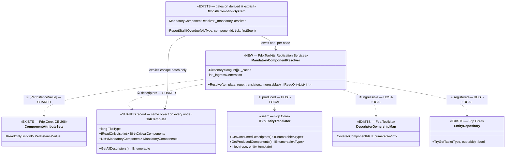
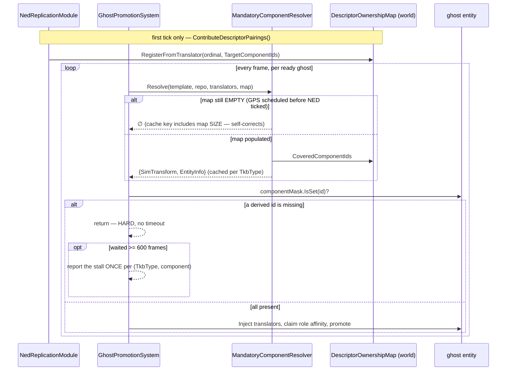

<!--STATUS
state: LIVE
updated: 2026-09-13
current-answer: the whole document is the TKB design and is BUILT. §6.5b is the section added on
  2026-08-30 and is the one to read before composing a node's translator list — it states the
  consequence of §6.1's registration guard, which the rest of the document leaves implicit.
  ⭐⭐⭐ §6.6 / §6.6a / §6.6b (added 2026-09-13) ARE THE OTHERS TO READ BEFORE TOUCHING THE FILE PATH OR
  EITHER COMPONENT LIST. §6.6 states the principle (a TKB file describes DESCRIPTORS, so both component
  lists arrive EMPTY from a file); §6.6a is the DESIGN that derives both without any per-entity-class
  vocabulary; §6.6b is the AS-BUILT for the mandatory half, with the class + sequence UML.
  ⚠⚠ STALE-BELOW inside §6.6: it says the mandatory half is "NOT derivable at all (the catalogues
  disagree)". SUPERSEDED — the user ruled that disagreement is DRIFT, not policy, and CE-265 shipped the
  derivation. Do not quote §6.6's "not derivable" sentence as current.
  ⚠ Also stale: every reference to TkbComponentConventions — it and its loader call are DELETED (CE-266);
  birth-criticality is now [BirthCritical] on the component type.
stale-below: §6.6's "NOT derivable at all" verdict on MandatoryComponents, and all references to
  TkbComponentConventions (deleted 2026-09-13). §6.6a's "filled at ITkbDatabase.Register" prescription —
  neither half was built that way; see §6.6b's DEVIATION and §6.6a's own AS-BUILT block.
related-designs:
  - ../../DESIGN_Entity_Genesis_End_To_End.md — ⭐ THE LANDING PAGE. Owns the END-TO-END STAGE SEQUENCE
    (request → spawn → grant → ghost → promotion → takeover → Active) and nothing else; every stage
    routes back to its owner, including this one. Read it FIRST if you do not already know where in
    the genesis path your question sits.
  - ../../DESIGN_Role_Affinity_Ownership.md — owns what BirthCriticalComponents MEANS (the creator's
    birthright, the role tables, why no role may own one). This document owns where the list comes from.
known-rot: §6.5's closing sentence ("an IG node would include BIG-specific translators; a SimHost
  node would not") reads as if per-node LIST curation were the intended narrowing lever. It is not;
  §6.5b corrects that reading. Do not quote that sentence without §6.5b.
-->
# DESIGN: Transient Knowledge Base (TKB) — File-Driven Blueprint Registry

**Workstream:** tkb-1  
**Status:** Draft (as authored) — ⭐ **BUILT**; see the STATUS block and §6.5b  
**Input documents:** `.dev/tkb-1/tkb-design-ideas.md`, `.dev/tkb-1/design-talk.md`

---

## 1. Overview

The **Transient Knowledge Base (TKB)** is the cluster-wide, engine-agnostic blueprint registry that
defines every entity type that can be instantiated in a simulation. The current codebase uses a
hardcoded `NedTkbCatalog.RegisterAll()` call at startup. This workstream replaces that with a
file-driven pipeline where:

- TKB is **authored as JSON files on disk** (one file per entity), version-controlled in Git.
- TKB is **staged to each node's local directory** by an out-of-band file sync mechanism (not the
  orchestrator state machine — this was an explicit architectural decision documented in the design
  talk).
- Each node **loads its own selective view** of the TKB via a memory-resident `ITkbDatabase`
  singleton — selectively because each engine registers only the descriptor types it knows about.
- TKB is **loaded before scenario content** during `PrepareLive` / `PrepareEdit` transitions.
- TKB **survives `Idle`** and is reloaded only when TkbName or file timestamp changes.

### 1.1 What This Workstream Does NOT Cover

- **TKB file distribution** — out-of-band file sync. Not the orchestrator's responsibility.
- **TKB Editor** — conceptual outline in Phase 9 only; not implemented this workstream.
- **Physics / AI domain logic** — only the infrastructure for descriptor-to-ECS projection.

---

## 2. Architectural Principles

The TKB enforces hard separation of concerns across five bounded contexts:

| Context | Responsibility |
|---|---|
| **Domain Schema** | Pure C# DTOs annotated with `[TkbDescriptor]` and field attributes |
| **Storage (Authoring)** | Raw JSON files, one per entity; or ZIP archive for runtime |
| **In-Memory Registry** | `TkbTemplate` + `ITkbDatabase`: O(1) lookup by `TkbType` or name |
| **Deserialization** | `TkbDeserializer` + `TkbDescriptorRegistry`: zero-reflection, source-generated |
| **ECS Projection** | `ITkbEntityTranslator` implementations: N descriptors -> M ECS components |

Key invariants:

1. **DTOs are pure POCOs.** No `[MessagePackObject]`, no ECS base classes, no transport markers.
2. **One JSON file = one entity = one `TkbTemplate`.** No merged DOM at runtime.
3. **Engines load selectively.** Each engine registers only descriptors it compiled against.
   Unknown descriptors are silently skipped during ingestion with zero allocation.
4. **ZIP is strictly read-only at runtime.** `ZipTkbProvider` opens archives with
   `ZipArchiveMode.Read` only. `WriteEntityFile` and `DeleteEntityFile` throw
   `NotSupportedException`. Packing a raw directory into a transport ZIP is an out-of-band
   CI/CD build step, never a runtime VFS operation.
5. **TKB is engine-agnostic.** `TkbTemplate` holds descriptor POCOs; ECS projection is a
   downstream concern performed by `ITkbEntityTranslator` implementations.

---

## 3. Phases

### Phase 1: Domain Schema & Attributes

**Goal:** Define the attribute and DTO vocabulary that all TKB descriptor POCOs use.

#### 1.1 `[TkbDescriptor]` Attribute

A pure semantic marker applied to a class or struct, binding it to a hierarchical descriptor name
that matches the JSON property name:

```csharp
[AttributeUsage(AttributeTargets.Class | AttributeTargets.Struct,
                Inherited = false, AllowMultiple = false)]
public sealed class TkbDescriptorAttribute : Attribute
{
    public string HierarchicalName { get; }
    public TkbDescriptorAttribute(string hierarchicalName) { ... }
}
```

Naming rules:
- Every descriptor except `TkbMaster` **must** carry a domain prefix: `Gen.`, `CGFX.`, `BIG.`, etc.
- `HierarchicalName` is the user-perspective name as it appears in JSON. The C# class name is
  decoupled from it — refactoring the class does not break data binding.
- The `#PartId` postfix is **not** part of `HierarchicalName`; it is a runtime index.

#### 1.2 Field-Level Attributes

Relational markers for the TKB Editor's picker UI and cross-entity validation:

```csharp
[AttributeUsage(AttributeTargets.Field | AttributeTargets.Property)]
public sealed class WeaponRefAttribute : Attribute { }

[AttributeUsage(AttributeTargets.Field | AttributeTargets.Property)]
public sealed class AmmoRefAttribute : Attribute { }

[AttributeUsage(AttributeTargets.Field | AttributeTargets.Property)]
public sealed class ModelRefAttribute : Attribute { }
```

`[EditRange]`, `[EditUnit]`, `[EditDisplayName]`, `[ReadOnly]` are reused from the existing
`StructEdit` / ConfigEditor stack.

#### 1.3 Concrete DTOs

All POCOs placed in `Fdp.Toolkit.Tkb.Domain` (or a HROT-layer namespace for HROT-specific
descriptors). None inherit from ECS base types. None carry `[MessagePackObject]`.

| DTO | Descriptor Name | Key Fields |
|---|---|---|
| `TkbMasterDto` | `"TkbMaster"` | `CustomName`, `DisType` |
| `VehicleParametersDto` | `"Gen.VehicleParameters"` | `Mass`, `Length`, `Width`, `MaxSpeedFwd`, `MaxSpeedRev`, `MaxAccel` |
| `WeaponCapabilitiesDto` | `"Gen.WeaponCapabilities"` | `EffectiveRange`, `RateOfFire`, `MagazineCapacity` |
| `AmmoWeaponBallisticsDto` | `"Gen.AmmoWeaponBallistics"` | `[WeaponRef] WeaponGuid`, `MuzzleSpeed`, `Damage` |

`TkbMasterDto` is the only descriptor without a domain prefix; it is mandatory on all entities.

**Sample JSON entity** (`Platform/Vehicle/Military/MBT/M1_Abrams.json`):
```json
{
  "$guid": 100,
  "TkbMaster": { "CustomName": "M1 Abrams", "DisType": "1.1.225.1.1.1.0" },
  "Gen.VehicleParameters": {
    "Mass": 61000.0, "Length": 7.93, "Width": 3.66,
    "MaxSpeedFwd": 20.0, "MaxSpeedRev": 12.0, "MaxAccel": 2.5
  },
  "_EditorMetadata": { "LastModifiedBy": "AuthoringTool" }
}
```

The `_EditorMetadata` block starts with `_` (non-letter), so the parser skips it with zero
allocation at runtime. Multi-instance descriptors use `#PartId` postfixes:
```json
{
  "$guid": 3001,
  "TkbMaster": { "CustomName": "120mm APFSDS", "DisType": "2.2.225.2.1.1.0" },
  "Gen.AmmoWeaponBallistics#1": { "WeaponGuid": 2001, "MuzzleSpeed": 1500.0, "Damage": 600.0 },
  "Gen.AmmoWeaponBallistics#2": { "WeaponGuid": 2005, "MuzzleSpeed": 1450.0, "Damage": 550.0 }
}
```

---

### Phase 2: VFS and Transport Tier

**Goal:** Provide an `ITkbStorageStrategy` abstraction that hides whether the TKB lives in a raw
directory or a ZIP archive.

#### 2.1 Core Types

```csharp
// One entity file yielded by the VFS. The JsonStream must be consumed (or disposed)
// before the enumerator is advanced — this bounds memory to one file at a time.
public readonly record struct TkbEntityFile(
    string CategoryPath,   // Forward-slash relative dir, e.g. "Platform/Vehicle/Military/MBT"
    string FileName,       // Name without extension, e.g. "Merkava Mk4"
    Stream JsonStream);    // Open stream positioned at start of JSON content

public interface ITkbStorageStrategy : IDisposable
{
    IEnumerable<TkbEntityFile> EnumerateEntityFiles();
    void WriteEntityFile(string relativeFilePath, string jsonContent);
    void DeleteEntityFile(string relativeFilePath);
}
```

#### 2.2 `RawDirectoryTkbProvider`

- Backed by a directory on disk.
- `EnumerateEntityFiles()`: recursively enumerates `*.json`; for each, computes `CategoryPath`
  from the relative directory path (forward slashes); opens a `FileStream`; yields; closes on
  next iteration.
- `WriteEntityFile`: creates missing intermediate directories; sparse write (only touched files
  change — Git-friendly diffs).
- Used for: authoring (TKB Editor writes here), debug/dev runs with raw folder layout.

#### 2.3 `ZipTkbProvider`

- Backed by a ZIP archive (`System.IO.Compression.ZipArchive`), opened with `ZipArchiveMode.Read`.
- **Strictly read-only.** `WriteEntityFile` and `DeleteEntityFile` throw `NotSupportedException`.
  Packing a raw directory into a transport ZIP is an explicit, out-of-band CI/CD build step; it
  is never performed at runtime through the VFS interface. This eliminates ZIP central-directory
  repack latency and the need for a write mutex entirely.
- Read path: iterate `_archive.Entries`; skip non-`.json` and directory entries; derive
  `CategoryPath` from the directory portion of `FullName` (replace backslashes with forward
  slashes, strip trailing slash); `FileName` = entry name without extension; yield decompression
  stream via `entry.Open()`.
- Used for: runtime ingestion from pre-staged ZIP in the node's local staging area.

#### 2.4 `TkbUnifiedLoader`

Thin factory that picks the right strategy from the source path:

```csharp
public sealed class TkbUnifiedLoader : IDisposable
{
    public TkbUnifiedLoader(string sourcePath)
    {
        if (File.Exists(sourcePath) &&
            sourcePath.EndsWith(".zip", StringComparison.OrdinalIgnoreCase))
            _strategy = new ZipTkbProvider(sourcePath, readOnly: true);
        else if (Directory.Exists(sourcePath))
            _strategy = new RawDirectoryTkbProvider(sourcePath);
        else
            throw new ArgumentException($"Invalid TKB source path: {sourcePath}");
    }

    public IEnumerable<TkbEntityFile> EnumerateEntityFiles()
        => _strategy.EnumerateEntityFiles();

    public void Dispose() => _strategy.Dispose();
}
```

Consumers code against `TkbUnifiedLoader` and are unaware of the underlying medium.

---

### Phase 3: In-Memory Registry Refactoring

**Goal:** Refactor `TkbTemplate` from a delegate-bag to a pure descriptor-bag. Extend
`ITkbDatabase` with the methods needed by the file-driven pipeline.

#### 3.1 `TkbTemplate` Refactoring

**Current state:** `TkbTemplate` has a `List<Action<EntityRepository, Entity, bool>> _applicators`
that was added by callers doing runtime component injection. This must be replaced.

**New contract:**

```csharp
public sealed class TkbTemplate
{
    public long TkbType { get; }
    public string Name { get; }
    public string CategoryPath { get; }           // NEW — relative folder path from VFS

    // NEW — replaces _applicators
    // Composite key (DescriptorClrType, PartId) -> boxed DTO instance
    private readonly Dictionary<(Type, int), object> _descriptors = new();

    public TkbTemplate(string name, long tkbType, string categoryPath = "") { ... }

    public void AddDescriptor<T>(T descriptor, int partId = 0) where T : notnull { ... }

    public T? GetDescriptor<T>(int partId = 0) where T : class { ... }

    public bool TryGetDescriptor<T>(int partId, out T descriptor) where T : struct { ... }

    public bool HasDescriptor<T>(int partId = 0) { ... }

    public IEnumerable<(Type Type, int PartId, object Data)> GetAllDescriptors() { ... }

    // Retained from existing contract — still used by GhostPromotionSystem readiness check:
    public List<MandatoryComponent> MandatoryComponents { get; } = new();
    public List<ChildBlueprintDefinition> ChildBlueprints { get; } = new();
    public DISEntityType DisType { get; set; }
}
```

The `_applicators` list and the `ApplyTo(EntityRepository, Entity, bool)` method are removed.
All callers of `ApplyTo` must migrate to `ITkbEntityTranslator.Inject()` (Phase 6).

#### 3.2 `ITkbDatabase` Extensions

Add to `FDP/Engine/Fdp.Core/Abstractions/ITkbDatabase.cs`:

```csharp
// Clear all registered templates (for differential reload).
void Clear();

// Enumerate templates under a category path prefix (for editor tree building).
// Enforces directory boundary semantics (see Phase 3.3).
IEnumerable<TkbTemplate> GetEntitiesByCategory(string categoryPath);

// The name of the TKB most recently loaded by TkbLoadClusterStateHandler.
// Null when using the hardcoded fallback (NedTkbCatalog).
// Set by the handler upon successful VFS ingestion; read by the save pipeline
// to stamp the active TkbName into every saved ScenarioHeaderDto.
string? ActiveTkbName { get; set; }
```

#### 3.3 `TkbDatabase` Implementation

- Add `Clear()`: clear both `_byName` and `_byType` dictionaries.
- Add `GetEntitiesByCategory(string)`: filter `_byType.Values` enforcing **directory boundary
  semantics** — a raw `StartsWith` is structurally incorrect for VFS paths. The query
  `"Platform/Vehicle"` must NOT match `"Platform/Vehicle_Heavy/MBT"`. The match condition is:
  ```csharp
  t.CategoryPath.Equals(categoryPath, OrdinalIgnoreCase)
  || t.CategoryPath.StartsWith(categoryPath + "/", OrdinalIgnoreCase)
  || string.IsNullOrEmpty(categoryPath)
  ```
  Consider an `ILookup<string, TkbTemplate>` if the editor needs frequent enumeration.
- Add `ActiveTkbName` property: auto-implemented `string?`, default null.

---

### Phase 4: Streaming Deserialization Pipeline

**Goal:** Implement `TkbDeserializer` that processes `TkbEntityFile` streams from the VFS and
registers `TkbTemplate` objects into `ITkbDatabase`. Strict memory guarantees.

#### 4.1 Memory Contract

- **One `JsonDocument` alive per file.** Created, used, and disposed before the next file is opened.
- **No LOH allocation for descriptor keys.** Use `ReadOnlySpan<char>` for `#PartId` splitting and
  `Dictionary.AlternateLookup<ReadOnlySpan<char>>` to query `TkbDescriptorRegistry`.
- **Unknown descriptors cost nothing.** `JsonDocument` does not parse sub-trees that are not
  accessed; skipping an unknown descriptor walks a pointer only.

#### 4.2 `TkbDeserializer`

```csharp
public sealed class TkbDeserializer
{
    // Obtains the AlternateLookup once at construction — Dictionary must use
    // StringComparer.OrdinalIgnoreCase to support Span-based keys.
    private readonly Dictionary<string, TkbDescriptorParserThunk>.AlternateLookup<ReadOnlySpan<char>>
        _parsers = TkbDescriptorRegistry.GetAlternateLookup();

    public void ParseAndRegister(TkbEntityFile file, ITkbDatabase db)
    {
        using var doc = JsonDocument.Parse(file.JsonStream);
        var root = doc.RootElement;

        if (!root.TryGetProperty("$guid", out var guidProp))
            throw new TkbFormatException($"Entity '{file.FileName}' is missing $guid.");
        long tkbId = guidProp.GetInt64();

        var template = new TkbTemplate(file.FileName, tkbId, file.CategoryPath);

        foreach (var prop in root.EnumerateObject())
        {
            ReadOnlySpan<char> name = prop.Name;

            // Skip reserved metadata (non-letter first char) and the $guid field.
            if (name.IsEmpty || !char.IsLetter(name[0])) continue;

            // Zero-alloc split on '#': "Gen.AmmoWeaponBallistics#2" -> ("Gen.AmmoWeaponBallistics", 2)
            int hashIdx = name.IndexOf('#');
            ReadOnlySpan<char> key    = hashIdx < 0 ? name : name[..hashIdx];
            int                partId = hashIdx < 0 ? 0    : int.Parse(name[(hashIdx + 1)..]);

            if (_parsers.TryGetValue(key, out var thunk))
                thunk(template, partId, prop.Value);
            // else: engine does not know this descriptor — skip silently, zero allocation.
        }

        db.Register(template);
    }
}
```

---

### Phase 5: Tkb.SourceGen — Roslyn Source Generator

**Goal:** Eliminate runtime reflection from the deserialization hot path. A new Roslyn source
generator scans assemblies at compile time and emits `TkbDescriptorRegistry` population code
via `[ModuleInitializer]`.

#### 5.1 `TkbDescriptorRegistry`

```csharp
public delegate void TkbDescriptorParserThunk(
    TkbTemplate entity, int partId, System.Text.Json.JsonElement jsonElement);

public static class TkbDescriptorRegistry
{
    private static readonly Dictionary<string, TkbDescriptorParserThunk> _parsers
        = new(StringComparer.OrdinalIgnoreCase);

    public static void RegisterParser(string hierarchicalName, TkbDescriptorParserThunk parser)
        => _parsers[hierarchicalName] = parser;

    // Returns the AlternateLookup so TkbDeserializer can query by ReadOnlySpan<char>.
    public static Dictionary<string, TkbDescriptorParserThunk>.AlternateLookup<ReadOnlySpan<char>>
        GetAlternateLookup() => _parsers.GetAlternateLookup<ReadOnlySpan<char>>();
}
```

#### 5.2 Generator Project: `Tkb.SourceGen`

New project: `FDP/Toolkits/Fdp.Toolkit.Tkb.SourceGen/Tkb.SourceGen.csproj`  
Mirrors the `Fbt.SourceGen` / `Fhsm.SourceGen` pattern exactly:

```xml
<Project Sdk="Microsoft.NET.Sdk">
  <PropertyGroup>
    <TargetFramework>netstandard2.0</TargetFramework>
    <LangVersion>latest</LangVersion>
    <IsRoslynComponent>true</IsRoslynComponent>
    <EnforceExtendedAnalyzerRules>true</EnforceExtendedAnalyzerRules>
    <NoWarn>CS8632</NoWarn>
  </PropertyGroup>
  <ItemGroup>
    <PackageReference Include="Microsoft.CodeAnalysis.CSharp" Version="4.8.0" PrivateAssets="all" />
    <PackageReference Include="Microsoft.CodeAnalysis.Analyzers" Version="3.3.4" PrivateAssets="all" />
  </ItemGroup>
</Project>
```

Consumed by other projects as an analyzer reference:
```xml
<ProjectReference Include="..\..\Fdp.Toolkit.Tkb.SourceGen\Tkb.SourceGen.csproj"
                  OutputItemType="Analyzer"
                  ReferenceOutputAssembly="false" />
```

#### 5.3 Generator Logic: `TkbDescriptorGenerator`

`[Generator] public class TkbDescriptorGenerator : IIncrementalGenerator`

Pipeline:
1. Syntax provider predicate: `TypeDeclarationSyntax` nodes with `AttributeLists.Count > 0`.
2. Transform: resolve the type symbol; check whether any attribute's fully qualified name
   matches `"Fdp.Toolkit.Tkb.Attributes.TkbDescriptorAttribute"` (no project reference needed —
   check by string, same pattern as `Fhsm.SourceGen` checks `SharedAiConditionAttribute`).
3. For each match: collect `HierarchicalName` constructor argument and the fully qualified type name.
4. `Execute`: emit one `__TkbDescriptors_{AssemblyName}.g.cs` per assembly, containing a
   `[ModuleInitializer]` method that calls `TkbDescriptorRegistry.RegisterParser(...)` for each
   discovered type.

#### 5.4 Example Generated Code

```csharp
// Auto-generated by Tkb.SourceGen — DO NOT EDIT
internal static class __TkbDescriptors_MyAssembly
{
    [System.Runtime.CompilerServices.ModuleInitializer]
    internal static void Register()
    {
        TkbDescriptorRegistry.RegisterParser(
            "Gen.VehicleParameters",
            static (template, partId, jsonElement) =>
            {
                var dto = jsonElement.Deserialize<VehicleParametersDto>(
                    FdpJsonOptionsRegistry.DefaultRelaxed)!;
                template.AddDescriptor(dto, partId);
            });

        TkbDescriptorRegistry.RegisterParser(
            "Gen.AmmoWeaponBallistics",
            static (template, partId, jsonElement) =>
            {
                var dto = jsonElement.Deserialize<AmmoWeaponBallisticsDto>(
                    FdpJsonOptionsRegistry.DefaultRelaxed)!;
                template.AddDescriptor(dto, partId);
            });
        // ...one entry per [TkbDescriptor]-decorated type in this assembly
    }
}
```

The thunk only stores the descriptor (`AddDescriptor`). ECS projection is Phase 6.

---

### Phase 6: ECS Projection & Translators

**Goal:** Define the `ITkbEntityTranslator` interface and update `GhostPromotionSystem` to use
translators instead of `template.ApplyTo()`. Register `ITkbDatabase` as an ECS world singleton.

#### 6.1 `ITkbEntityTranslator` Interface

Located in `FDP/Engine/Fdp.Core/Abstractions/` or `FDP/Toolkits/Fdp.Toolkits/Tkb/`:

```csharp
/// <summary>
/// Custom translator that handles N TKB descriptors -> M ECS components (N:M mapping).
/// Mirrors the IEntityScenarioTranslator pattern for scenario serialization.
/// </summary>
public interface ITkbEntityTranslator
{
    /// <summary>
    /// Returns the CLR types of TKB descriptor DTOs this translator consumes.
    /// Used by the pipeline to track which descriptors have been projected.
    /// </summary>
    IEnumerable<Type> GetConsumedDescriptors();

    /// <summary>
    /// Projects data from the TKB template into ECS components on the entity.
    /// MUST call repo.IsComponentTypeRegistered<T>() before AddComponent<T>().
    /// </summary>
    void Inject(EntityRepository repo, Entity entity, TkbTemplate template);
}
```

Key constraint: every `Inject` implementation **must** guard each ECS component allocation with
`repo.IsComponentTypeRegistered<T>()`. Silent no-op on silent failures is an anti-pattern that
hides schema mismatches. The guard makes the bypass explicit.

#### 6.2 Example: `VehicleKinematicsTkbTranslator`

Located in the CarKinem or equivalent assembly. Demonstrates 1:4 (N:M) translation:

```csharp
public sealed class VehicleKinematicsTkbTranslator : ITkbEntityTranslator
{
    public IEnumerable<Type> GetConsumedDescriptors()
    {
        yield return typeof(VehicleParametersDto);
    }

    public void Inject(EntityRepository repo, Entity entity, TkbTemplate template)
    {
        var dto = template.GetDescriptor<VehicleParametersDto>();
        if (dto == null) return;

        if (repo.IsComponentTypeRegistered<VehicleParams>())
            repo.AddComponent(entity, new VehicleParams
            {
                Length = dto.Length, Width = dto.Width,
                MaxSpeedFwd = dto.MaxSpeedFwd, MaxAccel = dto.MaxAccel,
                WheelBase = dto.Length * 0.6f
            });

        if (repo.IsComponentTypeRegistered<VehicleState>())
            repo.AddComponent(entity, new VehicleState { Speed = 0, SteerAngle = 0 });

        if (repo.IsComponentTypeRegistered<NavState>())
            repo.AddComponent(entity, new NavState { Mode = KinematicsMode.None });

        if (repo.IsComponentTypeRegistered<PhysicsCollider>())
            repo.AddComponent(entity, new PhysicsCollider
            {
                Radius = Math.Max(dto.Length, dto.Width) / 2f, CollisionLayer = 1
            });
    }
}
```

#### 6.3 `ApplyTo` Callsite Audit and Full Migration

**Current state:** `TkbTemplate.ApplyTo()` is called by at minimum three systems:
- `GhostPromotionSystem` — ghost readiness/promotion path
- `NetworkSpawningSystem` — network-driven entity spawning
- `BlueprintApplicationSystem` — blueprint-driven entity instantiation

**All three must be migrated before the `ApplyTo` method is deleted (Phase 3, TKB-006). The
build must not compile if any reference to `TkbTemplate.ApplyTo()` remains in the codebase.**

Migration pattern: replace every `template.ApplyTo(...)` call with the translator loop:

```csharp
foreach (var translator in _translators)
    translator.Inject(repo, entity, template);
```

`ITkbEntityTranslator` instances are passed into each system via constructor injection (same
pattern as `IEntityScenarioTranslator` in the scenario serialization stack). The translator list
is identical for all three systems within the same node — they share the same
composition-root-injected `IReadOnlyList<ITkbEntityTranslator>`.

#### 6.4 `ITkbDatabase` as ECS World Singleton

`GhostPromotionSystem` needs access to `ITkbDatabase` to resolve `TkbIdentity.TkbType` to a
`TkbTemplate`. Register it during `RegisterDomainComponents()`:

```csharp
// In RegisterDomainComponents():
world.SetSingletonManaged<ITkbDatabase>(tkbDb);
```

**Verified pattern:** `IgNodeBootstrapper.RegisterDomainComponents()` already calls
`world.SetSingletonManaged<ITkbDatabase>(tkb)`. The same pattern must be applied in the SimHost
and CGF bootstrappers.

#### 6.5 Composition Root: Translator Aggregation

Domain-specific translators live in isolated assemblies (e.g., `CarKinem`, `Hrot.Core`). They
must be aggregated at the composition root — `SharedApplicationBootstrapper` or
`HrotNodeBuilder` — and passed down together to every system that replaced `ApplyTo`.

```csharp
// In the composition root (per node role):
var translators = new List<ITkbEntityTranslator>
{
    new VehicleKinematicsTkbTranslator(),
    // add per-node domain translators here
};
var translatorList = translators.AsReadOnly();

// Pass the same list to all three migration targets:
var ghostPromotion      = new GhostPromotionSystem(world, tkbDb, translatorList);
var networkSpawning     = new NetworkSpawningSystem(..., translatorList);
var blueprintApplicator = new BlueprintApplicationSystem(..., translatorList);
```

This ensures a single point of truth for which translators are active on a given node type. An
IG node would include BIG-specific translators; a SimHost node would not.

⚠⚠ **Read §6.5b before acting on that last sentence.**

#### 6.5b ⭐⭐⭐ THE LIST IS NOT THE NARROWING LEVER — **the REGISTRATION SET is** *(added `2026-08-30`)*

> 📌 **Added because a session got this exactly backwards.** It found a host passing **no** translators,
> read §6.5's closing sentence as licence — *"per-node lists, so an empty one may be deliberate"* — and
> filed the omission as *"possibly intentional Brain-node narrowing."* ⛔ **Wrong.** The correcting
> question came from the user: *"how is the component creation gated — TKB can hardly instantiate an ECS
> component that is not registered on CGF (because subsystems register just what they need)?"*

⭐⭐ **§6.1's guard is not merely defensive; it is the composition mechanism.** Every write in every
translator is **double-gated**:

| gate | asks | expressed by |
|---|---|---|
| **①** | *does this TYPE carry the data?* | `template.GetDescriptor<TDto>() == null ⇒ return` — the **TKB author's** decision |
| **②** | *does THIS HOST want the component?* | `repo.IsComponentTypeRegistered<TComponent>()` — the **host composition root's** decision |

📐 **Verified `2026-08-30` across all nine production implementations** — `SpatialCore`,
`VehicleKinematics`, `Combat`, `Perception`, `Behavior`, `Presentation`, `Animation`, `AiDiagnostics`,
`InfantryVehicleStateStrip`. ⚠ The guard is load-bearing: `EntityRepository` **throws**
`InvalidOperationException("Component type … is not registered")` on an unregistered write.

⇒ 🔒🔒 **A translator whose components a host never registered is ALREADY a no-op on that host.**

##### ⭐ So the rule, stated plainly

| ⭐ do | ⛔ don't |
|---|---|
| give every node its **full projection set** | ⛔ hand a node a short list to make it materialise less |
| express *"this host does not want X"* by **not registering X** | ⛔ express it by omitting X's translator |
| pass the **same instance** to `NetworkSpawningSystem`, `BlueprintApplicationSystem` and `GhostPromotionSystem` *(§6.3)* | ⛔ let the three drift apart |

⭐⭐ **Why registration is the better lever:** not registering a component is **one** decision, in the
host's component registry, and any code that then tries to write it **throws** — a loud, single-site
failure. Omitting a translator is a decision taken at a composition root and **fails silently for every
entity that host ever spawns**, with the entity still looking spawned *(it keeps `NetworkIdentity`,
`NetworkOwnership`, `TkbIdentity` and its DIS header)*.

⛔⛔ **An EMPTY list is never a curation choice** — it disables gates ① and ② together. On a node that
spawns, it means *"born with an identity but no type."*

⚠ **What §6.5's closing sentence actually means:** per-node variation is *allowed* — a node may **add**
translators no other node has *(`AiDiagnosticsTkbTranslator` on SimHost, `InfantryVehicleStateStrip` on
Stride)*. ⛔ It does **not** mean a node should **subtract** translators to avoid components; gate ② does
that for free.

##### 📌 The instance this section exists for

📐 `2026-08-30`, filed as **`CE-138`**: CGF — which
[`Hrot-Simulation-Pipeline.md`](../../projects/relationships/Hrot-Simulation-Pipeline.md) §2 names the
*"entity spawning authority"*, and whose §4.3 step reads **"Apply TKB template components"** — passes
translators on **none** of the three seams. Rails:
`Hrot.SimHost.Tests/TkbTranslatorSpawnParityRails.cs`.

---

#### 6.6 ⭐⭐⭐ WHAT A TKB FILE CANNOT SAY — **the two COMPONENT lists are not descriptor-shaped** *(added `2026-09-13`)*

> 🔒 **The question that produced this section** *(user, `2026-09-13`)*: *"There are mandatory components
> and birth critical components lists in tkb template. Are you saying they are not needed in the file
> because they can be derived using some hardcoded rules? Meaning we do not need to add anything to the
> file data?"*

📐 **The measured shape of the gap.** `TkbDeserializer.ParseAndRegister` reads `$guid` and then treats
**every** JSON property as a **descriptor key**, dispatching it to a `TkbDescriptorRegistry` parser thunk —
and ⛔ **silently skipping anything it does not recognise** *(§4.2)*. Meanwhile `TkbTemplate` carries two
**component** lists, both `List<int>` of component ids:

| list | what it means | who fills it today |
|---|---|---|
| `MandatoryComponents` | *"do not PROMOTE the ghost until these are present"* — the promotion gate | ⛔ **only the programmatic builders** |
| `BirthCriticalComponents` | *"the CREATOR must OWN these at birth"* — `DESIGN_Role_Affinity_Ownership.md` §3.1 | ⛔ **only the programmatic builders** |

⇒ ⭐⭐ **A file-loaded template gets BOTH lists EMPTY**, because neither is descriptor-shaped and the file
format has no way to express either one.

##### ⭐ The answer, and the two halves differ — **that is the whole content of this section**

| | ⭐ birth-critical | ⛔ mandatory |
|---|---|---|
| **does it vary per template?** | ⛔ **no** — 📐 all 8 production sites declare `SimTransform` and nothing else: `BdcTkbBuilder.cs:44` *(every vehicle)* · `BdcTkbCatalog.cs:247` *(area)* · `:255` *(route)* · `UrbanCombatTkbCatalog` ×5 | ✅ **yes** — 📐 `NedTkbBuilder.DefineVehicle` declares `EntityInfo`+`SimTransform` **hard**; `UrbanCombatTkbCatalog`'s five templates carry the **same descriptors** and declare **none** |
| **can a rule derive it?** | ✅ **yes — apply it unconditionally** | 🔴 **not as the catalogues stand.** They DISAGREE for identically-shaped templates ⇒ no predicate over the file reproduces it. ⚠⚠ **But that does not prove per-template policy was INTENDED** — 📐 `HrotEnvironment.CreateTkb()` registers **both** catalogues into **one** database *(`:35`, `:39`)*, so the disagreement is live in one cluster and no design record says which side is right. ⇒ **the prior question is whether it is meant to vary at all** |
| **what if the rule is wrong?** | ⭐ nothing: the create leg intersects with the entity's **live component mask**, so naming a component it never receives contributes no bits | 🔴 **a ghost that NEVER PROMOTES** — a hard requirement that never arrives is `return`, every frame, forever |
| **so** | ✅ **convention, applied in the app layer** — `TkbComponentConventions.ApplyTo`, called by `TkbLoadClusterStateHandler` | ⛔ **left empty, and FILED as `CE-265`** — it needs a design answer, not a guess |

##### ⛔⛔ WHY BIRTH-CRITICAL IS **NOT** DERIVED FROM A DESCRIPTOR — *(the instinct that was wrong)*

⭐ It looks derivable: `SpatialCoreTkbTranslator.cs:24` stamps `SimTransform` **only** for templates
carrying `TkbMasterDto`, so *"has `TkbMasterDto`"* seems to be the predicate. 🔴 **It is not**, because
`SimTransform` reaches an entity by **two** routes:

1. that translator, **and**
2. `NetworkSpawningSystem`'s `cmd.InitialTransform`, available to **any** template.

📌 Route 2 is how the **area** and **route** templates get a position — they carry **no `TkbMasterDto` at
all**, and `BdcTkbCatalog.cs:243-246` declares birth-criticality for them anyway, saying so in its own
comment. ⇒ ⛔ **a `HasDescriptor` predicate would MISS exactly those two**, which is the one direction
that is unsafe.

##### ⚠ WHEN A FILE FIELD *WOULD* BE THE RIGHT ANSWER, and what it costs

⭐ The moment a template legitimately needs a **different** answer from its neighbours — which is already
true of `MandatoryComponents`. ⛔ But it is a real schema change, not a field:

| | |
|---|---|
| ids come from `[ComponentId]`; `ComponentTypeRegistry` is keyed by **`Type`** | ⇒ a file naming components as STRINGS needs a **name→Type** map built by reflection *(the scan `RecordingExportService.cs:815-850` already does)* |
| 🔴 the deserializer **silently skips** unknown keys | ⇒ a typo'd component name vanishes **without a word**, and the failure surfaces as an entity that does not move, on the production path only ⇒ **loud load-time validation is part of the change**, not an extra *(cf. `CE-119`)* |
| ⭐ parser thunks are **app-registerable** | ⇒ a HROT-specific key need **not** enter `Fdp.Toolkits`. ⚠ The real cost is handing content authors a correctness-critical engine invariant |

##### 📐 HOW THE 15 HARDCODED TEMPLATES ACTUALLY DIFFER — *(enumerated via the graph, `2026-09-13`)*

⭐ Three producers, and **the differences are mostly DRIFT, not content**:

| | `NedTkbCatalog` — 8, via `NedTkbBuilder` | `UrbanCombatTkbCatalog` — 5, hand-built | `TacGraphic_Area`/`_Route` — 2, hand-built |
|---|---|---|---|
| construction | ⭐ **fluent builder** | `new TkbTemplate` + `AddDescriptor` | bare `new TkbTemplate` |
| `TkbMasterDto` | ✅ | ✅ | ⛔ **none** |
| **mandatory** | ✅ `EntityInfo`+`SimTransform` **hard** | 🔴 **none** | ⛔ none |
| **birth-critical** | ✅ `SimTransform` | ✅ `SimTransform` | ✅ `SimTransform` |
| **`DisType`** | ✅ all 8 | 🔴 **none** ⇒ falls back to `0` | ⛔ none |
| visual | `VisualDefinitionDto` | `StrideRenderModelDefDto` | ⛔ |
| combat | + `WeaponCapabilitiesDto` | 🔴 no `WeaponCapabilitiesDto` | ⛔ |

⭐⭐ **Only the VISUAL row is real content.** `StrideNodeShell.cs:264` states it: the Ned catalogue carries no
Stride-specific descriptors, so a Stride node renders nothing for its templates — that is why both
catalogues exist. ⛔ **Mandatory, `DisType` and `WeaponCapabilitiesDto` are drift**, and the mechanism is
visible: `DefineVehicle` **BUNDLES** the invariants *(`TkbMasterDto` + the mandatory pair +
birth-critical, one method)*, while the hand-built path re-decides per template — and five of them decided
differently.

⇒ ⭐⭐⭐ **Unification is NOT merging the catalogues** *(the content legitimately differs)*. It is
**"every hardcoded template goes through the builder, and the builder's bundle is the same one the file
loader applies."** Today there are **three** producers of that decision; `R-132` says there should be one.

##### 🔴🔴 WHERE MANDATORY COMPONENTS COME FROM — **exactly ONE place, and it is not the file, the translators, or a convention**

⛔⛔ **A relayed architect answer** *(`2026-09-13`)* **claimed three sources. Verified against source, one is
right, one is half right, and the load-bearing one is INVENTED:**

| the claim | verdict |
|---|---|
| *"`TkbIdentity` is always implicitly hard-mandatory, enforced at ghost promotion"* | ✅ **TRUE and STRUCTURAL** — `GhostPromotionSystem.cs:280-282` builds `_readyGhostQuery` as `.With<TkbIdentity>().WithLifecycle(Ghost)`, so an entity without it is never a promotion candidate at all |
| *"programmatic catalogues declare them explicitly — e.g. `NedTkbBuilder` **or `UrbanCombatTkbCatalog`**"* | ⚠ **HALF.** True of `NedTkbBuilder` *(`BdcTkbBuilder.cs:36,38`)*; ⛔ **`UrbanCombatTkbCatalog` declares NONE** — it is cited as an example of the very thing it does not do. ⚠ It also calls them *"birth-critical structural components … added with `AddMandatoryComponent`"*, conflating the two separate lists |
| 🔴 *"translators derive and populate mandatory component requirements at load time"* | ⛔⛔ **FALSE — the mechanism does not exist.** `ITkbEntityTranslator` has exactly **two** members: `GetConsumedDescriptors()` and `Inject(repo, **entity**, template)` ⇒ it adds components to an ENTITY at spawn/promote time, and has no way to add a requirement to a TEMPLATE. 📐 Repo-wide there are **7** `AddMandatoryComponent` occurrences and **ZERO** are in a translator. ⚠ And the ordering forbids it anyway: `GhostPromotionSystem` checks the mandatory list **before** the translator loop runs |

⇒ 📐 **The complete, measured answer: `NedTkbBuilder.DefineVehicle` (`:36,:38`) and `AsComposite`
(`:293`). That is all.** Three call sites, one file, one builder method family. ⛔ Not files, not
translators, not conventions.

##### ⭐⭐⭐ BUT THE ARCHITECT'S *CONCLUSION* IS RIGHT, FOR A REASON IT DID NOT STATE — **the list is HOST-DEPENDENT**

🔴🔴 **Measured: `GhostPromotionSystem.cs:211` tests `compGP.IsSet(req.ComponentTypeId)` with NO
registration guard.** ⇒ a **hard** requirement naming a component the local host never registers can never
become true, so that host's ghosts **abort promotion every frame, forever, silently.**

⇒ ⭐⭐ **That settles where mandatory requirements may NOT live: a shared TKB FILE.** A file is one artefact
synced to every node, and *"which components must be present"* differs per host because *"which components
this host registers"* differs per host *(§6.5b's registration set — the same asymmetry)*. ⛔ Authoring them
in the file would ship one node's answer to all of them.

⚠ **What the architect described as existing is therefore the right TARGET, and it needs one new
interface member**: a translator can say which descriptors it CONSUMES, but nothing tells you which
components it PRODUCES — that is knowable only by running `Inject`. ⭐ Add
`GetProducedComponents()` beside `GetConsumedDescriptors()`.

#### 6.6a 🔒 THE GROUNDED DESIGN — **derive BOTH lists with NO entity-class vocabulary anywhere** *(user ruling, `2026-09-13`)*

> 🔒 **User, verbatim:** *"for the file loading path, no DefineVehicle and similar helper are needed… These
> are only good to build the 'default' TKB when file load path is not in use. I would like to avoid the
> hosts to hardcode anything per entity class (so hosts do not basically need to know that entity IS a
> vehicle, the components the entity have makes the entity a vehicle (movable and navigable etc.)"*

✅ **Both halves of that are confirmed by the code.** `DefineVehicle` and its `With…` siblings are pure
AUTHORING helpers for the programmatic catalogue — the file path never touches them, and a template loaded
from a file is a bag of descriptors with no "kind". ⇒ ⛔ **any rule keyed on *"is this a vehicle"* — such as
the `TkbMasterDto ⇒ vehicle bundle` this section first proposed — is a per-class hardcode and is
WITHDRAWN.**

##### ⛔⛔ TWO EARLIER SKETCHES IN THIS SECTION WERE WRONG. BOTH ARE SUPERSEDED, AND THE SECOND ONE IS INSTRUCTIVE

| sketch | why it fails |
|---|---|
| `mandatory = produced(translators)` | ⛔ backwards — a translator that PRODUCES a component is the reason you might not need to WAIT for it |
| `mandatory = produced ∧ "stamps a default" (the !HasComponent guard)` | 🔴 **the guard does not discriminate.** 📐 Measured over all 8 production translators: **~25 of ~30** produced components carry `!repo.HasComponent<T>(entity)` — it is an IDEMPOTENCY guard, present on `TargetMemory`, `BrainBlackboard`, `NavState`, `WeaponState` and everything else. ⇒ it selects nearly everything, and only **2** components are actually mandatory |

##### 📐 WHAT ACTUALLY SEPARATES THE TWO MANDATORY COMPONENTS FROM THE ~25 THAT ARE NOT

| component | the translator's stamped value | per-instance? |
|---|---|---|
| ⭐ `SimTransform` | `new SimTransform()` — **zeroed and meaningless** | ✅ the real value comes from `SpawnEntityCommand.InitialTransform` or the wire |
| ⭐ `EntityInfo` | `new EntityInfo { ForceId = dto.Faction }` — a template default | ✅ **but faction is authored PER SPAWN**, so the template default must not beat it |
| ⛔ `VehicleParams` · `Health` · `PerceptionReceptor` · `WeaponState` | derived from the descriptor | ⛔ identical on every instance of the template |
| ⛔ `VehicleState` · `NavState` · `TargetMemory` · `BrainBlackboard` · the channels | empty runtime state | ⛔ legitimately starts empty |

⇒ 🔒 **THE DISCRIMINATOR: a component is mandatory exactly when its AUTHORITATIVE value is PER-INSTANCE —
authored at spawn or replicated in — so the template's default would silently win.** ⛔ That is a property
of the COMPONENT, not of the entity, the template, or a "kind".

##### ⭐⭐⭐ THE DESIGN — **one mechanism, both lists, and it is the house pattern already**

⭐ Per-component-type metadata already travels as an **attribute**: `[ComponentId]`
*(`ComponentIdAttribute.cs:30`, mandatory since auto-assignment was removed)* and `[DataPolicy]`
*(`DataPolicyAttribute.cs:79`)*. ⇒ declare both properties the same way:

| attribute, on the COMPONENT TYPE | replaces |
|---|---|
| `[BirthCritical]` — *"the creator must own this at birth"* | the constant in `TkbComponentConventions`, **and** `TkbTemplate.BirthCriticalComponents` itself |
| `[PerInstanceValue]` — *"the authoritative value is authored or replicated, never the template default"* | the hand-written `AddMandatoryComponent` calls |

```
birthCritical = componentsWith[BirthCritical]                         // no template, no host, no class
mandatory     = componentsWith[PerInstanceValue]
              ∩ ⋃ produced(t)  for host translators t whose consumed
                               descriptors this template carries       // "will this entity have it?"
              ∩ componentsThisHostRegisters                            // the deadlock guard
```

⭐ **`GetProducedComponents()` is still needed — but as the TEMPLATE FILTER, not the discriminator.** ⛔
Requiring a component this template will never produce is the deadlock; requiring one the host does not
register is the same deadlock *(`GhostPromotionSystem.cs:211` has no registration guard)*.

| ⭐ what this buys | |
|---|---|
| ⭐⭐⭐ **no host knows what a vehicle is** | the rule reads only component attributes, the template's descriptors, and this host's own translator + registry sets |
| ⭐⭐ **the file path needs NOTHING** | no field, no names-as-strings, no validation — the file stays pure descriptors, which is §6.6's principle |
| ⭐⭐ **identical on both paths** | the programmatic catalogue gets the same derivation, so the `NedTkbBuilder` / `UrbanCombat` drift becomes unrepresentable rather than merely fixed |
| ⭐ **host asymmetry is handled by construction** | each node derives from ITS translator list, which is what `§6.5b` already says the registration set is for |
| ⭐ **`TkbTemplate.BirthCriticalComponents` can be DELETED** | 📐 measured: **one** production read — `RoleAffinityPolicy.cs:189`. Everything else is the setter, tests, or comments |

##### ⛔⛔ A QUESTION THIS DESIGN DOES **NOT** RAISE — **"should every entity always have a `SimTransform`?"** *(asked `2026-09-13`)*

> 🔒 **User:** *"we could theoretically have entities not having position, for example for Global Weather the
> SimTransform means nothing; also some child entities … might not need SimTransform; the question is
> whether keeping SimTransform as something every entity ALWAYS has (like a GameObject in Unity 3d) is an
> acceptable compromise making everything simpler."*

⭐⭐⭐ **The derivation does not need it answered.** `birthCritical = componentsWith[BirthCritical]` means
*"IF this entity has one, its creator owns it at birth"* — and the create leg intersects with the entity's
**live component mask**, so a positionless entity simply never gets the bit. ⇒ ⛔ **universality is
orthogonal to the simplification; do not couple the two decisions.**

📐 **And measured, the answer to the question on its own merits is NO:**

| | |
|---|---|
| 🔴🔴 **`SimTransform` PRESENCE is the engine's *"is this spatial?"* predicate** | 📐 **42 production `.With<SimTransform>()` query filters across 37 files** — `SpatialHashSystem`, `LocalGridBuilderSystem`, `VisionBroadphaseSystem`, `BallisticsSystem`, `TerrainQuerySubmitSystem`, `MapCullingSystem`, `PhysicsBodyLifecycleSystem`, the egress translators … ⇒ universality silently WIDENS all 42 |
| ⛔ **the concrete failure** | `LocalGridBuilderSystem.cs:94` / `SpatialHashSystem` insert every matched entity into the spatial structure ⇒ a Global-Weather entity would become a **perception, EQS and ballistics candidate sitting at (0,0,0)** |
| ⚠ **why Unity gets away with it** | a Unity `Transform` doubles as the **scene-graph node** — it has a structural job beyond *"I am somewhere"*. Here it has none; presence is **pure semantics**, and that is exactly what universality would destroy |
| ⭐ **memory is NOT the argument** | `SimTransform` is `Vector3 + Quaternion` = **28 bytes** |
| ⭐⭐ **the codebase already has the right home for positionless global data** | `SetSingleton` / `SetSingletonManaged` — world-level storage that is **not an entity at all** *(`ZoneEnvironmentData`, `TerrainQueryBatchData`, `INavmeshProvider`, `ActivePerspective`)*. ⇒ **Global Weather is a SINGLETON, not a positionless entity** |
| ⭐ **positionless CHILDREN are already anticipated** | `AuthorityExtensions.cs:23-29` resolves authority through `PartMetadata.ParentEntity`, so a child with no `SimTransform` already inherits its parent's answer |

⇒ ⭐ **Keep presence meaningful.** If some future entity kind genuinely needs a guaranteed transform, that is
a per-template AUTHORING decision *(add the descriptor)*, ⛔ never an engine-wide invariant.

##### ✅✅✅ RULED `2026-09-13` — **the attribute is the SOURCE OF TRUTH; the template's list becomes a DERIVED READ-ONLY CACHE**

> 🔒 **User, verbatim:** *"we can add TKB record override any time later. so if it can be derived or defined
> via component attribute and it works for all todays or imaginable future use cases, the tkb in-memory
> record can be just a readonly cache."*

⭐⭐ **This resolves the "component property vs TKB-type property" question without choosing sides, and it is
better than either option offered.** The user's earlier objection — *"birthcritical does not seem to me to be
a property of a component, rather tkb type"* — is right about the SEMANTICS *(the effective set is per
type)*; the attribute is right about the SOURCE *(whether a component can start empty is a component fact)*.
⇒ ⭐ **the record keeps the per-type field, and that field is DERIVED rather than AUTHORED.**

| ⭐ the shape | |
|---|---|
| **source of truth** | `[BirthCritical]` on the component TYPE — same house pattern as `[ComponentId]` *(`ComponentIdAttribute.cs:30`)* and `[DataPolicy]` *(`DataPolicyAttribute.cs:79`)* |
| ⭐⭐⭐ **population point** | 📐 **`ITkbDatabase.Register(TkbTemplate)` is the SINGLE choke point** *(measured: `TkbDatabase.cs:20`; every producer goes through it — `TkbDeserializer.cs:54`, `BdcTkbBuilder.cs:45`, `BdcTkbCatalog.cs:248,256`, `UrbanCombatTkbCatalog` ×5, and the `FDP/Examples` setups)*. ⇒ fill the cache there and **no path can skip it**, file or programmatic |
| **the field** | `TkbTemplate.BirthCriticalComponents` becomes `IReadOnlyList<int>`; `AddBirthCriticalComponent<T>()` goes away |
| ⭐⭐ **why keep the field at all** | ⛔ it is currently identical for every template, so it is *technically* a global constant — ⭐ **but it is the SEAM where the deferred TKB-record override lands.** Keeping it means that override changes only HOW the cache is filled, with **zero call-site churn**; and `RoleAffinityPolicy.cs:189`'s hot-path read is unchanged |
| ⚠ **the override is DEFERRED, not rejected** | 🔒 *"we can add TKB record override any time later."* ⇒ ⛔ do not build it now, and ⛔ do not design the file syntax for it now |

⭐ **What this SUPERSEDES, including work shipped earlier the same day:** `TkbComponentConventions`'
birth-critical half and its call from `TkbLoadClusterStateHandler` *(`CE-259az`)* become **redundant** — the
choke point is one level deeper and covers the programmatic catalogues too, which the app-layer convention
never did. ⚠ **That is a strictly better outcome, not a regression**: the convention fixed the file path;
this fixes the *invariant*. ⭐ It also collapses a second producer — `HrotRoleComponentSets`
*(`:BirthCriticalComponents`)* hand-lists `SimTransform` as well, so today **three** places assert one fact.

📐 **Blast radius, measured:** `Fdp.Core` *(new attribute, field becomes read-only)* · population in
`TkbDatabase.Register` · **one** production read stays as-is *(`RoleAffinityPolicy.cs:189`)* · **8** authoring
sites deleted · `TkbComponentConventions` + its loader call deleted · `HrotRoleComponentSets` derives instead
of listing · rails to update in `TkbTemplateTests`, `HrotEnvironmentTests`, `TkbLoadClusterStateHandlerTests`,
`RoleAffinityPolicyTests`, `RoleAffinityPromoteRails`, `RoleAffinitySpawnRails`, `HrotRoleComponentSetsTests`.

##### ✅✅✅ …AND THE SAME APPLIES TO **MANDATORY** — **the blocker was `IsHard`, not the derivation** *(user challenge, `2026-09-13`)*

> 🔒 **User:** *"why mandatory stays open? can't it be derived making the tkb in memory record read only same
> as birth critical field"*

⛔⛔ **CORRECTED — it was called open for a reason that does not hold.** This section treated *"over-declaring
is fatal"* as intrinsic to `MandatoryComponents`. 📐 It is intrinsic to **HARD** requirements only:
`GhostPromotionSystem.cs:215-219` — a hard requirement that never arrives is `return` forever, ⭐ **but a
SOFT one waits `SoftTimeoutFrames` and then proceeds without the component.** The soft mode has existed all
along *(`MandatoryComponent.IsHard` / `SoftTimeoutFrames`, a single consumer, already exercised at
`SimHostInstance.cs:1001` with `isHard: false, softTimeoutFrames: 10`)*.

⇒ ⭐⭐⭐ **Mandatory derives exactly like birth-critical, and BOTH records become read-only caches filled at
the same choke point:**

```
[BirthCritical]      on a component ⇒ template.BirthCriticalComponents   (derived, read-only)
[PerInstanceValue]  on a component ⇒ template.MandatoryComponents       (derived, read-only, SOFT)
                                      both filled in ITkbDatabase.Register
```

##### ⛔⛔⛔ SOFT-BY-DESIGN IS REJECTED — **the requirement is HARD and EXACTLY DERIVED** *(user ruling, `2026-09-13`)*

> 🔒 **User, verbatim:** *"i do not want to wait 10 frames by design - this looks like an emergency
> (hopefully avoidable) case which i do not want to promote to usual case, i need all configured that no
> extra 10 frames needed. Soft sounds like allowing for 10 frames latency by design. i do not like it."*

✅ **Correct, and the soft proposal above is WITHDRAWN.** `SoftTimeoutFrames` is a **recovery** path for a
producer that failed; using it as the normal path makes every entity pay latency for a case that should
never happen. ⇒ ⭐ **hard requirements, and the derivation must be EXACT.**

⭐⭐⭐ **It CAN be exact, and `GetProducedComponents()` is the filter — measured, it reproduces today's correct
set on all 15 templates:**

```
mandatory = componentsWith[PerInstanceValue]
          ∩ ⋃ produced(t)  for host translators t whose consumed descriptors
                           this template carries
          ∩ componentsThisHostRegisters                    // HARD, no timeout
```

| template shape | descriptors | ⇒ produced ∩ `[PerInstanceValue]` | today's hand-written value |
|---|---|---|---|
| NED vehicles | `TkbMasterDto` *(→ `SpatialCore` → `SimTransform`)* + `BehaviorProfileDto`/`VisualDefinitionDto` *(→ `EntityInfo`)* | `{SimTransform, EntityInfo}` | ✅ **exactly** `EntityInfo`+`SimTransform` hard |
| `UrbanCombat` ×5 | same two descriptor families | `{SimTransform, EntityInfo}` | 🔴 **none** — the drift this fixes |
| `TacGraphic_Area`/`_Route` | ⛔ **no descriptors at all** | **∅** | ✅ none |

⇒ ⭐⭐ **`GetProducedComponents()` returns to being a PREREQUISITE, not an optimisation** — and it is the
thing that makes HARD safe.

##### 🔒 WHY HARD CANNOT HANG ON THE HAPPY PATH — **arrival is guaranteed by SYMMETRY**

⭐ The creator ran **the same translator set over the same template**, so it HAS the component; its egress
publishes every owned component it has *(`EntityInfoEgressTranslator.cs:104-118`,
`GeoSpatialEgressTranslator`)*; the receiver's ingress writes it. ⇒ **a component this template produces on
one host is produced on every host that composes the same translators** — so requiring it cannot deadlock.

| ⚠ the residual risk, named | |
|---|---|
| a **creator** host that does not register the component never publishes it ⇒ a receiver waits forever | ⭐ **THIS is where `SoftTimeoutFrames` belongs — as the emergency escape, never the design.** 🔒 The user's own framing: *"an emergency (hopefully avoidable) case which i do not want to promote to usual case"* |
| ⛔ it deserves a LOUD diagnostic, not a silent timeout | a ghost still un-promoted after `N` frames is a **configuration error**, and `GhostPromotionSystem` says nothing today |

##### ⭐⭐ THE FOURTH INTERSECTION — **what this host can INGRESS** *(user ruling, `2026-09-13`)*

⛔⛔ **An earlier version of this section said `[PerInstanceValue]` must mean *"arrives over the wire"*. That
is WITHDRAWN — it smuggled a NETWORK fact onto a component type in `Fdp.Core`,** which is what §2.3 exists to
prevent.

⭐ **The attribute states the network-agnostic fact**: *"this component's authoritative initial value is
PER-INSTANCE — the template cannot know it."* ⭐ The wire is merely **how it arrives when there is one**; a
networkless node has no ghosts, so the mandatory gate never runs there at all.

📐 **The case that forces the separation.** `SpatialCoreTkbTranslator` produces **both** `SimTransform` and
`SimVelocity`, and `SpawnEntityCommand` carries `InitialTransform` **and** `InitialVelocity` ⇒ both are
genuinely per-instance and both would carry the attribute. 🔴 **But the wire carries `WorldPos` and the
ingress writes `NetworkVelocity`, not `SimVelocity`** ⇒ a hard requirement on `SimVelocity` would **never be
satisfied**. ⇒ ⛔ it must be excluded for the RIGHT reason — *nothing ingresses it* — ⛔ **not** by
mislabelling the component as "not per-instance".

⇒ ⭐⭐⭐ **so the derivation takes a fourth intersection, and the seam ALREADY EXISTS** *(the seam law again —
it was under-adopted, not missing)*:

```
mandatory = componentsWith[PerInstanceValue]                   // Fdp.Core, network-agnostic
          ∩ ⋃ produced(t)  for host translators t whose consumed descriptors
                           this template carries                // "will this entity have it?"
          ∩ componentsThisHostCanINGRESS                        // ⭐ DescriptorOwnershipMap
          ∩ componentsThisHostRegisters                         // the deadlock guard
                                                                // HARD, no timeout
```

| ⭐ the ingress set, measured | |
|---|---|
| **it is already built and already populated** | `DescriptorOwnershipMap` holds `_descriptorToComponentIds`, filled by `RegisterFromTranslator(t.DescriptorOrdinal, t.TargetComponentIds)` — `NedReplicationModule.cs:472,475` and `AttributeInterpreterProvider.cs:101` |
| ⚠ **one small addition** | it exposes `GetComponentIdsForDescriptor(ordinal)`; the derivation wants the **union over all registered translators**. That accessor does not exist yet |
| ⭐⭐ **per HOST and per STACK, which is exactly right here** | NED fills it from NED translators, BDC differently, an offline node not at all ⇒ each node derives what IT can actually receive |
| 🔒 **and this does NOT contradict §2.3** | §2.3 forbids keying **OWNERSHIP** on `DescriptorOwnershipMap`, because ownership must mean the same thing on every stack and offline. ⛔ **Mandatory is the opposite kind of question** — it asks *"what will arrive over THIS wire"*, which is meaningless without one. ⇒ the network-keyed input belongs here and nowhere in P3 |

⇒ 📐 **Today that yields exactly `SimTransform` and `EntityInfo`** — which is precisely the hand-written list
on NED vehicles, and precisely what `UrbanCombat` drifted out of.

##### ✅✅✅ AS-BUILT — **the BIRTH-CRITICAL half shipped `2026-09-13`** *(`CE-266`, obligation ⑤)*

| | |
|---|---|
| 🆕 `Fdp.Core/BirthCriticalAttribute.cs` · `PerInstanceValueAttribute.cs` | both attributes, **both documented in full** — the test, the two failures each prevents, and for `[PerInstanceValue]` the addition rule. ⚠ The second has **no consumer yet**; it ships now so the vocabulary lands in one change |
| 🆕 `Fdp.Core/ComponentAttributeSets.cs` | the resolver — one cached reflection pass over loaded assemblies, mirroring `RecordingExportService.cs:815-824`'s existing `[ComponentId]` scan |
| ✏ `SimTransform` | `[BirthCritical]` + `[PerInstanceValue]` · `SimVelocity` and `EntityInfo` → `[PerInstanceValue]` only |
| ✏ `TkbTemplate.BirthCriticalComponents` | `List<int>` → **`IReadOnlyList<int>`, derived**; `AddBirthCriticalComponent<T>()` **deleted** |
| ⛔ **deleted** | 8 authoring sites · `TkbComponentConventions` + its `TkbLoadClusterStateHandler` call · `HrotRoleComponentSets`' hand-written `SimTransform` |
| 📐 gates | `Fdp.Core.Tests` 6/6 *(new)* · `Fdp.Toolkits.Tests` `RoleAffinity`+`TkbTemplate` 32/32 · `Hrot.Core.Tests` 153/155 · `Hrot.SimHost.Tests` 950/955 — the 4 reds all pre-existing. **2 inverse-edit red-proofs** |

🔴 **DEVIATION — the cache is a COMPUTED PROPERTY, not a field filled in `Register`.** §6.6a above prescribes
filling it at `ITkbDatabase.Register`, argued as *"the single choke point no path can skip"*. 📐 While
building, the simpler form proved strictly stronger: `BirthCriticalComponents` returns
`ComponentAttributeSets.BirthCritical` directly, so **there is no filling step to skip and no `Register`
change at all**. ⭐ The user's framing survives exactly — the record is a read-only cache — and the deferred
per-type override still lands on this one property.

⭐ **One addition the design did not ask for:** the resolver **THROWS** when either attribute sits on a type
with no `[ComponentId]`. ⛔ The existing scan it mirrors uses a bare `catch { continue; }`; copying that here
would turn an authoring slip into an entity that silently never moves.

##### ⭐⭐ WHICH COMPONENTS GET `[PerInstanceValue]`, AND THE RULE FOR ADDING A FOURTH

📐 **Three, on measured evidence — the components production actually authors per instance:**

| component | evidence | ⇒ mandatory? |
|---|---|---|
| `SimTransform` | `SpawnEntityCommand.InitialTransform` *(typed field)* · `ScenarioSpawnAdapter.cs:206,317,390` · `SimHostApp.cs:820` | ✅ |
| `EntityInfo` | `ScenarioSpawnAdapter.cs:189` · child spawns in `CreateEntityRequestSystem` | ✅ |
| `SimVelocity` | `SpawnEntityCommand.InitialVelocity` · `ScenarioSpawnAdapter.cs:210` | ⛔ **the INGRESS intersection drops it** — the wire writes `NetworkVelocity` |

⇒ ⭐ **the effective mandatory set is TWO**, matching today's hand-written NED pair exactly.

⛔⛔ **AND THE SCENARIO PATH IS NOT EVIDENCE, which is the trap.**
`StagingEntityExtractor.ExtractEntityComponents` walks **every registered table** and takes whatever is
present, minus an exclusion mask ⇒ on a scenario load *almost every* component's value is per-instance
*(a damaged tank restores its `Health`)*. 🔴 Deriving the attribute from *"what gets authored per
instance"* would attribute nearly everything. ⭐ **The distinction that resolves it:**

| | leg | arrives |
|---|---|---|
| `InitialComponents` | **create** | synchronously, **before anything runs** ⇒ no gate is ever needed |
| the mandatory list | **promote** | asynchronously over the wire, **after the ghost exists** ⇒ the only thing a gate can be about |

##### ⛔⛔ THE ADDITION RULE — **"unconditional egress" was WRONG; it is "GUARANTEED BASELINE"** *(user correction, `2026-09-13`)*

> 🔒 **User:** *"sending state on change is what actually happens and what makes sense to eliminate
> redundant traffic. almost nothing is sent unconditionally."*

✅ **Correct, and an earlier version of this rule said "unconditional for owned entities" — WITHDRAWN.**
📐 Change-driven egress is the norm here and is deliberate. ⭐ **The property a hard requirement actually
needs is a guaranteed FIRST publish for a newly spawned entity**, and this codebase already provides it by
**two** different mechanisms plus a backstop:

| mechanism | evidence |
|---|---|
| ⭐ **`SmartEgressUtil`'s "Guaranteed First Publish"** — its own headline feature: *"tracks whether a descriptor has ever been sent for a newly spawned entity (`!state.LastPublishedTickMap.ContainsKey`)"* | covers `EntityInfo`, `EntityMaster`, `EntityMission`, `WeaponState` |
| ⭐ **the zeroed shadow** — `GeoSpatialEgressTranslator` deliberately does NOT use SmartEgress *(too costly at 60 Hz)*; it diffs `SimTransform` against a `NetworkTransform` shadow **seeded to zeros**, and its own comment calls that *"a BEHAVIOURAL REQUIREMENT, not a detail … Zeros force a first publish"* | covers `SimTransform`. ⚠ Even an entity spawned at the origin publishes, because the zeroed shadow's rotation is `(0,0,0,0)`, not identity, so the rotation comparison fires |
| ⭐ **the heartbeat** — `REFRESH_INTERVAL = 600` *(10 s at 60 Hz)* | the eventual-consistency backstop for dropped UDP |

⇒ 🔒 **THE RULE:** a component may carry `[PerInstanceValue]` **only if its descriptor's egress guarantees a
baseline sample for a newly spawned entity.** ⛔ Change-driven thereafter is expected and correct.
⚠ **The shape that would break it:** a purely diff-driven egress whose shadow is seeded from the live value
— the first comparison says *"unchanged"*, no baseline is sent, and a hard requirement waits for the
heartbeat or forever. 📌 That is exactly the trap `GeoSpatialEgressTranslator` documents having avoided.

⛔ **HISTORY — the question this replaced:** whether `[BirthCritical]` contradicts the `2026-09-01` ruling
*"TKB should define what components are birth critical"*. ⭐ It does not: the TKB record still defines it,
the record is just no longer hand-authored. 📄 `CE-265`.

##### 🔒 THE PRINCIPLE, STATED ONCE

> ⭐⭐⭐ **A TKB file describes an entity's DESCRIPTORS. The component lists are statements about what
> those descriptors — and the spawn request — will PRODUCE, so they belong to whoever knows the
> translators: the application.** ⛔ Put a convention in the app layer while the answer is uniform; add a
> file field the moment it genuinely varies, and pay for the validation when you do.

⚠ **Superseded in its IMPLEMENTATION, not in its content** — `TkbComponentConventions` and its
`TkbLoadClusterStateHandler` call are **deleted** (`CE-266`); the principle now lands one level deeper, on the
component type itself and in `MandatoryComponentResolver`. See §6.6b.

#### 6.6b ✅✅✅ AS-BUILT — **the MANDATORY half shipped `2026-09-13`** *(`CE-265`, obligation ⑤)*

⭐⭐⭐ **What the picture shows that the prose cannot: WHERE each of the four inputs comes from, and that
three of them are HOST-LOCAL while only one is shared.** That asymmetry is the entire reason this list could
never live on `TkbTemplate` or in a TKB file.



*Caption: only `ComponentAttributeSets` and the template's descriptor bag are node-independent. ⇒ the result
is a per-node answer and **has no home on the shared record** — the fact §6.6 stated about a TKB FILE, one
level down.*



*Caption: the `alt` on an empty map is the ordering hazard — `GhostPromotionSystem` and the module that fills
the map are registered by different composition roots, so the derivation must survive running first. Prose
could state "the map is populated at startup" without ever asking **by whom, relative to this system**.*

##### 📐 WHAT SHIPPED

| | |
|---|---|
| ✏ `ITkbEntityTranslator` | **`GetProducedComponents()`** added — 2 members → 3. ⛔ **No default implementation**, deliberately: a defaulted `Array.Empty` would let a new translator silently narrow every derived gate on its host *(the SILENT-DEFAULT pattern)*. Implemented on **all 9 production translators** + 2 test doubles; the compiler enumerated them |
| 🆕 `Fdp.Toolkits/Replication/Services/MandatoryComponentResolver.cs` | the four-way intersection, cached per `TkbType` |
| ✏ `GhostPromotionSystem` | gates on **derived ∪ explicit**; derived entries are always HARD. ⭐ **Needed no new constructor argument** — `AttributeInterpreterProvider.GetDescriptorMap(repo)` already exposes the world's map, and `Translators` was already resolved |
| 🆕 the STALL DIAGNOSTIC | `ReportStallIfOverdue` — after `600` frames, ONCE per (TKB type, component), naming the component that never came. ⛔ **Not a timeout**; the ghost keeps waiting. This is §6.6a's *"it deserves a LOUD diagnostic, not a silent timeout"*, which this system previously had **nothing** of |
| ⛔ **deleted** | `NedTkbBuilder.DefineVehicle`'s `AddMandatoryComponent<EntityInfo>` + `<SimTransform>`, and `AsComposite`'s *"ensure `EntityInfo` is mandatory"* existence check — all three reproduced by the derivation |
| ✏ `TkbTemplate.MandatoryComponents` | **kept**, re-documented as the AUTHORING ESCAPE HATCH for components no translator produces *(managed state such as `ActiveMissionPlan`, a host-specific network gate)*. ⛔ Its header now forbids restating a derived requirement |

##### 🔴 DEVIATION — **NOT a read-only field on `TkbTemplate`, and NOT filled at `ITkbDatabase.Register`**

📐 §6.6a prescribed *"both records become read-only caches filled at the same choke point"*. ⛔ **Measured
while building: that is not buildable for this half, and the reason is the design's own central fact.**

| | |
|---|---|
| ⛔ **`TkbDatabase.Register` has ZERO host context** | 📐 `TkbDatabase.cs:20-32` is two dictionary writes. It has no translator list, no `EntityRepository`, no `DescriptorOwnershipMap` — and **three of the four inputs are exactly those** |
| ⛔ **a `TkbTemplate` is a SHARED record** | the same object serves CGF, SimHost, IG and the editor. A host-local answer stored on it is wrong for every other reader ⇒ the storage location itself would reintroduce the drift |
| ✅ **birth-critical was different, and that is why it worked** | its answer is identical on every node, so a static derived property was not merely adequate but strictly simpler *(it ended up needing no `Register` change at all)* |

⇒ ⭐⭐ **The user's ruling survives in substance:** the set is DERIVED rather than authored, and no producer
can drift from another. ⛔ What changed is that the cache lives with the CONSUMER, because the answer is the
consumer's, not the record's. ⭐ The deferred per-type override still has a home — `MandatoryComponents` is
the seam it lands on, now documented as such.

##### ⚠ THREE MEASURED FACTS THE NEXT SESSION WILL OTHERWISE RE-DERIVE WRONG

| | |
|---|---|
| ⭐⭐⭐ **the union accessor ALREADY EXISTED** | `DescriptorOwnershipMap.CoveredComponentIds` *(`:173`)*. 📌 `CE-265`'s own scoping note said it *"needs a UNION accessor"* — **wrong**; the seam law again, 25th measured instance. ⛔ Read the class before adding to it |
| 🔴🔴 **DIRECTION MUST NOT BE FILTERED** | 📐 in `Hrot.Network.NED`, **ZERO** translators under `Replication/Map/Ingress/` declare `TargetComponentIds` — `IDescriptorTranslator` defaults it to empty and only the EGRESS side overrides. ⇒ an *"ingress-only"* filter yields **∅** and collapses the whole derivation. `GeoSpatialEgressTranslator._targetIds` is the **only** pairing `SimTransform` has |
| ⭐⭐ **`SimVelocity` is excluded by an ACCIDENT OF OVERLOAD, so rail it** | it reaches the map only through `RegisterMapping(long, int[])`, which fills `_descriptorToComponentIds` but **not** the reverse `_componentIdToDescriptors` that `CoveredComponentIds` reads. ⚠ The distinction is genuine *(that call is an AUTHORITY block, not a wire pairing)*, ⛔ but it is nowhere stated as an invariant — a future tidy-up that "fixed" `RegisterMapping` to fill both would create a hard requirement for a component nothing ingresses. 📌 Pinned by `SimVelocity_IsPerInstanceAndProduced_YetExcluded_BecauseNothingIngressesIt` |

##### ⚠ THE RESIDUAL RISK, NAMED

⭐ A hard requirement cannot hang on the happy path *(§6.6a, "arrival is guaranteed by SYMMETRY")*.
⛔ **The one shape that still can:** a CREATOR host that does not register the component never publishes it,
so a receiver that does register it waits forever. ⇒ that is a cluster configuration error, and it is now
**reported** rather than absorbed — `600` frames, once per pair, naming the component. ⛔ It is still not
promoted, deliberately: 🔒 *"soft sounds like allowing for 10 frames latency by design. i do not like it."*

---

### Phase 7: Node-Side Integration (TkbLoadClusterStateHandler)

**Goal:** Implement the cluster state handler that intercepts `PrepareLive` and `PrepareEdit`,
checks the differential cache, and ingests the TKB from local staging.

#### 7.1 Key Design Decision: No Orchestrator Prefetch

TKB file distribution is NOT handled by the orchestrator state machine. This was an explicit
architectural reversal documented in the design-talk:

> "Removing the orchestrator prefetch is the correct architectural decision. Tightly coupling the
> orchestrator's state machine to the distribution of specific domain assets is an anti-pattern.
> Asset synchronization belongs in a dedicated, out-of-band delivery pipeline."

The node **assumes the TKB artifact (`.zip` or raw directory) is already present in its local
staging area** before `PrepareLive` / `PrepareEdit` arrives. No orchestrator file push occurs.

#### 7.2 `TkbLoadClusterStateHandler`

Located in `Hrot/Subsystems/Hrot.SimHost/Orchestration/Handlers/` (or HROT-common layer):

```csharp
public sealed class TkbLoadClusterStateHandler : IClusterStateHandler
{
    private readonly ITkbDatabase _tkbDb;
    private readonly string _localTkbStagingRoot;

    private string? _lastLoadedTkbName;
    private DateTime _lastLoadedTimestamp;

    public TkbLoadClusterStateHandler(ITkbDatabase tkbDb, string localStagingRoot)
    {
        _tkbDb = tkbDb ?? throw new ArgumentNullException(nameof(tkbDb));
        _localTkbStagingRoot = Path.Combine(localStagingRoot, "TKB");
    }

    public bool CanHandle(NodeOpType operation) =>
        operation == NodeOpType.PrepareLive || operation == NodeOpType.PrepareEdit;

    public Task<object?> PrepareAsync(ExecuteNodeOpIntent intent, CancellationToken ct)
    {
        // Read TkbName from the node's own local scenario file, not from the wire payload.
        string? requestedTkb = ExtractTkbNameFromLocalScenario(_localTkbStagingRoot);

        if (string.IsNullOrWhiteSpace(requestedTkb))
        {
            // No TkbName in local scenario -> use hardcoded fallback catalog.
            // NedTkbCatalog.RegisterAll() is called only if the db is empty.
            if (!_tkbDb.GetAll().Any())
                NedTkbCatalog.RegisterAll((TkbDatabase)_tkbDb);
            return Task.FromResult<object?>(null);
        }

        string localPath = Path.Combine(_localTkbStagingRoot, $"{requestedTkb}.zip");

        // Differential cache check using file modification time.
        DateTime currentFileTime = File.Exists(localPath)
            ? File.GetLastWriteTimeUtc(localPath)
            : DateTime.MinValue;

        if (_lastLoadedTkbName == requestedTkb && _lastLoadedTimestamp == currentFileTime)
            return Task.FromResult<object?>(null); // Cache hit.

        if (!File.Exists(localPath))
            throw new FileNotFoundException(
                $"[TkbLoad] TKB artifact not found at '{localPath}'. " +
                "Ensure the TKB file is staged before transitioning to Live/Edit.");

        _tkbDb.Clear();
        using var loader = new TkbUnifiedLoader(localPath);
        var deserializer = new TkbDeserializer();
        foreach (var entityFile in loader.EnumerateEntityFiles())
            deserializer.ParseAndRegister(entityFile, _tkbDb);

        _lastLoadedTkbName = requestedTkb;
        _lastLoadedTimestamp = currentFileTime;
        _tkbDb.ActiveTkbName = requestedTkb;  // expose for save pipeline

        FdpLog<TkbLoadClusterStateHandler>.Info(
            "[TkbLoad] Loaded TKB '{0}' ({1} entities).",
            requestedTkb, _tkbDb.GetAll().Count());

        return Task.FromResult<object?>(null);
    }

    public void Commit(ExecuteNodeOpIntent intent, EntityRepository? repo) { }

    // Abort is no-op: TKB survives Idle and is cached across transitions.
    public void Abort(ExecuteNodeOpIntent intent, EntityRepository? repo) { }

    private static string? ExtractTkbNameFromLocalScenario(string localStagingRoot)
    {
        // Peek the TkbName from the node's own locally staged scenario header file
        // using a forward-only Utf8JsonReader — no JsonDocument, no DOM allocation.
        string headerPath = Path.Combine(localStagingRoot, "ScenarioHeader.json");
        if (!File.Exists(headerPath)) return null;
        var bytes = File.ReadAllBytes(headerPath);
        var reader = new Utf8JsonReader(bytes);
        while (reader.Read())
        {
            if (reader.TokenType == JsonTokenType.PropertyName &&
                reader.ValueTextEquals("TkbName"))
            {
                reader.Read();
                return reader.TokenType == JsonTokenType.String
                    ? reader.GetString()
                    : null;
            }
        }
        return null;
    }
}
```

#### 7.3 TkbName Resolution — Node Reads Its Own Local Scenario

The `TkbLoadClusterStateHandler` does NOT read `TkbName` from the orchestrator's wire payload.
The orchestrator is kept ignorant of TKB domain logic. Instead, the handler calls
`ExtractTkbNameFromLocalScenario(localStagingRoot)` which peeks the node's own locally staged
scenario header file with a forward-only `Utf8JsonReader` (zero DOM, zero string allocation
beyond the result). If the local scenario file is absent or has no `TkbName`, the fallback
catalog is used.

If the local TKB staging file is missing and the scenario requires a specific TKB, the node
throws `FileNotFoundException` and aborts its own transition. Because all nodes run the same
check independently, a missing TKB artifact naturally halts the cluster without any
orchestrator-level asset tracking.

#### 7.4 Differential Cache Semantics

- Cache key: `(TkbName, File.GetLastWriteTimeUtc(zipPath))`.
- Cache hit: skip `_tkbDb.Clear()` and re-ingestion entirely. TKB already in memory.
- Cache miss (name changed OR file timestamp changed): call `_tkbDb.Clear()` then re-ingest.
- On success: sets `_tkbDb.ActiveTkbName = requestedTkb` for the save pipeline.
- `Abort()` is a no-op — TKB survives `Idle` state and is not rolled back on abort.

---

### Phase 8: Scenario Header, Save Pipeline & Bootstrapper Wiring

**Goal:** Extend the scenario envelope with `TkbName`; wire the save pipeline so that the active
TKB name is persisted into saved scenarios; implement the orchestrator sanity check; wire the
load handler and translator aggregation into the bootstrapper.

#### 8.1 `ScenarioHeaderDto` Extension

Add to `Hrot/Engine/Hrot.Core/Scenario/Map/ScenarioHeaderDto.cs`:

```csharp
public sealed class ScenarioHeaderDto
{
    public string? SubsystemType { get; set; }
    public string? SchemaVersion { get; set; }
    public string? TkbName { get; set; }   // NEW — null means "no opinion"
}
```

#### 8.2 Save Pipeline: Stamping the Active TKB Name

**Problem:** if the save pipeline does not persist `TkbName`, newly authored or re-saved
scenarios will lose the TKB requirement, degrading the cluster to the fallback catalog on the
next load.

**Solution — three-point wiring:**

1. **`ITkbDatabase.ActiveTkbName`** (defined in Phase 3.2) — set by `TkbLoadClusterStateHandler`
   on every successful VFS ingestion. Null when using the `NedTkbCatalog` fallback.

2. **`ScenarioHeader` record** (used by `ScenarioSerializer.Serialize`) — extend to accept
   `TkbName`:  
   ```csharp
   public record ScenarioHeader(
       string SubsystemType, string SchemaVersion,
       string? TkbName);  // NEW
   ```

3. **`ScenarioFileService.SaveScenario()`** (or the equivalent save entry point) — must query
   `ITkbDatabase.ActiveTkbName` and pass it into the header when calling the serializer:
   ```csharp
   var header = new ScenarioHeader(
       SubsystemType: _subsystemType,
       SchemaVersion: CurrentSchemaVersion,
       TkbName: _tkbDb.ActiveTkbName);   // from ITkbDatabase singleton
   scenarioSerializer.Serialize(scenarioData, header, ...);
   ```

With this wiring in place, every scenario file saved from an active session will carry the
correct `TkbName`. Because all distributed partial scenario files are saved by nodes that share
the same active TKB, they will naturally agree on `TkbName`, making orchestrator consensus
validation straightforward.

#### 8.3 Orchestrator Consensus Check (Sanity Gate Only)

The orchestrator's `AssetPrefetchProcessManager` (or the equivalent scenario staging component)
performs a **read-only sanity check** when staging files for a transition. It does NOT embed
`TkbName` into any wire payload — nodes resolve their own TKB requirement from their local
scenario copy (see Phase 7.3).

**Algorithm:**
1. For each staged scenario file, open a forward-only `Utf8JsonReader` (no `JsonDocument`).
   Read until `"TkbName"` is found in the header section; extract the string value; stop
   reading. Total allocation: one string per file.
2. Collect all non-null, non-empty values.
3. **Consensus rule:** all non-empty values must be equal. If any two differ, immediately abort
   the `TransitionState` operation and log a fatal error naming both conflicting values and
   their source files. The cluster halts before any node begins `PrepareLive`.
4. If consensus passes (or all values are null): proceed with the transition. The orchestrator
   does nothing further with the `TkbName`. It is not embedded in `NodeTransitionPayloadDto`
   or any other wire structure.

#### 8.4 `NodeBootstrapper.BuildOrchestration()` Handler Registration

**Critical ordering:** `TkbLoadClusterStateHandler` must be registered **before**
`HrotScenarioLoadHandler`. Handlers execute in registration order. TKB must be fully loaded in
memory before the scenario parser creates entity creation requests that look up `TkbTemplate`
blueprints.

```csharp
// Inside NodeBootstrapper.BuildOrchestration()
// (translatorList is built at composition root — see Phase 6.5)

// ...existing handlers (ReferenceArchiveHandler, ReferenceCheckpointHandler, etc.)...

// NEW: Register TKB loader FIRST, before any scenario loaders.
if (tkbDb != null)
{
    clusterSlave.RegisterHandler(
        new TkbLoadClusterStateHandler(tkbDb, localTempRoot));
}

// Existing: scenario handlers registered AFTER TKB loader.
if (scenarioSerializer != null)
{
    clusterSlave.RegisterHandler(
        new HrotScenarioLoadHandler(scenarioSerializer, scenarioLoader, zoneService,
            scenarioExtractor, scenarioSource, scenarioIdAllocator,
            world: world, controller: controller, storageDirectory: localTempRoot));
    // ... HrotEditLoadHandler, ReferenceEpisodeLoadHandler ...
}
```

The `tkbDb` and `translatorList` parameters are threaded through `BuildOrchestration()` from
the composition root where `HrotEnvironment.CreateTkb()` is called.

---

### Phase 9: TKB Editor (Conceptual — Not Implemented This Workstream)

The TKB Editor is a separate WPF application (not a mode of the existing ConfigEditor). It
provides a 3-pane layout: Entity Tree | Descriptor List | Descriptor Editor.

**Reuses from ConfigEditor stack:**
- `JsonDomDeserializer` — reading existing entity files
- `SchemaLoaderService` (adapted) — loading descriptor schemas
- `DomValidator` — validating descriptor values
- `EditHistoryService` — undo/redo
- `DomNodeFactory` — creating new descriptor instances

**New components** (not in scope this workstream):
- New shell and navigation VM
- Per-entity isolated DOMs (no global merged DOM)
- `ITkbStorageStrategy`-backed persistence (raw directory for authoring)
- Focused descriptor editor VMs

Editor implementation is deferred to a separate workstream.

---

## 4. Dependency Notes

| New Component | Recommended Location |
|---|---|
| `[TkbDescriptor]`, `[WeaponRef]`, etc. | `FDP/Toolkits/Fdp.Toolkits/Tkb/Attributes/` |
| `TkbEntityFile`, `ITkbStorageStrategy`, providers | `FDP/Toolkits/Fdp.Toolkits/Tkb/Vfs/` |
| `TkbUnifiedLoader` | `FDP/Toolkits/Fdp.Toolkits/Tkb/Vfs/` |
| `TkbDeserializer` | `FDP/Toolkits/Fdp.Toolkits/Tkb/` |
| `TkbDescriptorRegistry` | `FDP/Toolkits/Fdp.Toolkits/Tkb/` |
| `Tkb.SourceGen` project | `FDP/Toolkits/Fdp.Toolkit.Tkb.SourceGen/` |
| `ITkbEntityTranslator` | `FDP/Engine/Fdp.Core/Abstractions/` |
| Concrete DTOs (`VehicleParametersDto`, etc.) | `FDP/Toolkits/Fdp.Toolkits/Tkb/Domain/` or HROT layer |
| `VehicleKinematicsTkbTranslator` | CarKinem assembly or `Hrot.Core` |
| `TkbLoadClusterStateHandler` | `Hrot/Subsystems/Hrot.SimHost/Orchestration/Handlers/` |

`Tkb.SourceGen` must be `netstandard2.0`. It must NOT reference `Fdp.Core` or any FDP runtime
assemblies directly — it recognizes `[TkbDescriptor]` by fully qualified string name only, same
as `Fhsm.SourceGen` recognizes `SharedAiConditionAttribute`.

---

## 5. Critical Implementation Constraints

1. **Zero-alloc `#PartId` parsing:** Use `ReadOnlySpan<char>`, `IndexOf('#')`, `int.Parse(span)`,
   and `Dictionary.AlternateLookup<ReadOnlySpan<char>>` in `TkbDeserializer`. No `Substring` on
   the hot path.

2. **`ZipTkbProvider` is read-only:** `ZipArchiveMode.Read` only. `WriteEntityFile` and
   `DeleteEntityFile` throw `NotSupportedException`. ZIP creation is a CI/CD build step.

3. **`IsComponentTypeRegistered<T>()` guard:** Every `ITkbEntityTranslator.Inject` implementation
   must call this before `AddComponent<T>`. Never rely on silent no-op.

4. **Orchestrator is TKB-ignorant:** The orchestrator performs a `Utf8JsonReader`-based sanity
   check for `TkbName` consensus across staged files, but does NOT embed `TkbName` into any
   wire payload. Nodes resolve their own TKB requirement from their local scenario file.

5. **No orchestrator TKB prefetch:** File sync is out-of-band. Node assumes local ZIP present.

6. **`TkbLoadClusterStateHandler` registered FIRST:** Before `HrotScenarioLoadHandler` on the
   `ClusterSlave`.

7. **Ghost shell allocation:** `EntityMasterIngressTranslator` / `NetworkSpawningSystem` stamps
   `TkbIdentity` and `GhostStateTracker` at entity shell creation. `GhostPromotionSystem` later
   evaluates readiness and runs translators.

8. **`ITkbDatabase` as ECS singleton:** `world.SetSingletonManaged<ITkbDatabase>(tkb)` in
   `RegisterDomainComponents()` of each bootstrapper (SimHost, IG, CGF) that runs
   `GhostPromotionSystem`.

9. **`NedTkbCatalog` fallback:** If the local scenario file has no `TkbName` (or is absent),
   use the hardcoded fallback catalog. Do NOT double-register if already populated.

10. **`ApplyTo` fully removed:** The build must not compile with any reference to
    `TkbTemplate.ApplyTo()`. `GhostPromotionSystem`, `NetworkSpawningSystem`, and
    `BlueprintApplicationSystem` all migrate to the translator loop in the same batch.

11. **Directory boundary semantics:** `GetEntitiesByCategory("Platform/Vehicle")` must NOT match
    `"Platform/Vehicle_Heavy/MBT"`. Match requires exact path or a trailing `/` separator.

12. **`ActiveTkbName` drives the save pipeline:** After successful VFS ingestion,
    `_tkbDb.ActiveTkbName` is set. `ScenarioFileService` reads this value and embeds it in the
    `ScenarioHeader` when serializing. This is the sole mechanism by which the TKB requirement
    is persisted into scenario files.

---

## 6. Overall Success Conditions

The TKB refactor is considered complete and correct when ALL of the following hold:

**Domain Schema Purity**
- All descriptor DTOs are pure POCOs: no ECS base classes, no `[MessagePackObject]`, no
  `EntityRepository` references.
- C# class names are fully decoupled from JSON keys; renaming a DTO class does not break
  deserialization as long as `[TkbDescriptor("...")]` is unchanged.
- `[TkbDescriptor]` constructor throws `ArgumentException` if the name contains `#` or is null/empty.

**Storage and Transport Abstraction**
- One JSON file = one entity = one `TkbTemplate`. No merged DOM at runtime.
- `RawDirectoryTkbProvider` supports read AND write (authoring path).
- `ZipTkbProvider` is read-only; `WriteEntityFile` / `DeleteEntityFile` throw
  `NotSupportedException`. No write mutex exists.
- Consumers of `TkbUnifiedLoader` cannot tell whether the source is a directory or a ZIP.

**Zero-Allocation Streaming Ingestion**
- Exactly one `JsonDocument` is alive at any moment during ingestion (confirmed by a
  memory-profiling test over 10,000 entities asserting zero LOH allocations).
- `TkbDescriptorRegistry` is populated at app startup by `[ModuleInitializer]`-emitted code;
  no runtime reflection or `GetAssemblies()` scanning occurs.
- `#PartId` splitting uses `ReadOnlySpan<char>` and `Dictionary.AlternateLookup<ReadOnlySpan<char>>`
  with zero `string.Substring` calls on the hot path.
- Unknown descriptors are silently skipped with zero allocation.

**Decoupled ECS Projection**
- `TkbTemplate` contains no ECS applicator delegates; `ApplyTo()` does not exist.
- The build fails if any reference to `TkbTemplate.ApplyTo()` exists anywhere in the solution.
- `GhostPromotionSystem`, `NetworkSpawningSystem`, and `BlueprintApplicationSystem` all accept
  `IReadOnlyList<ITkbEntityTranslator>` via constructor and execute the translator loop.
- Every `ITkbEntityTranslator.Inject` guards each `AddComponent<T>` with
  `IsComponentTypeRegistered<T>()`.

**Category Path Correctness**
- `GetEntitiesByCategory("Platform/Vehicle")` returns entities in `"Platform/Vehicle"` and
  `"Platform/Vehicle/MBT"` but NOT entities in `"Platform/Vehicle_Heavy"`.

**Cluster Orchestration and Lifecycle**
- `TkbLoadClusterStateHandler` is wired before `HrotScenarioLoadHandler` in the bootstrapper.
- The differential cache correctly prevents re-ingestion when `TkbName` and ZIP timestamp are
  unchanged across two consecutive `PrepareLive` calls.
- `TkbLoadClusterStateHandler` reads `TkbName` from the node's own local scenario file (not
  from the intent payload).
- The orchestrator's consensus check uses `Utf8JsonReader` only; it aborts on conflict and does
  NOT embed `TkbName` into `NodeTransitionPayloadDto` or any other wire structure.

**Save Pipeline**
- After a successful TKB load, `ITkbDatabase.ActiveTkbName` returns the loaded TKB name.
- A scenario saved during an active session contains `"TkbName"` in `ScenarioHeaderDto` with
  the correct value (integration test: load TKB "Sample_v1", save scenario, open saved file,
  assert `ScenarioHeaderDto.TkbName == "Sample_v1"`).
- When the fallback `NedTkbCatalog` is used, `ActiveTkbName` is null and saved scenarios
  omit or null-out the `TkbName` field.
