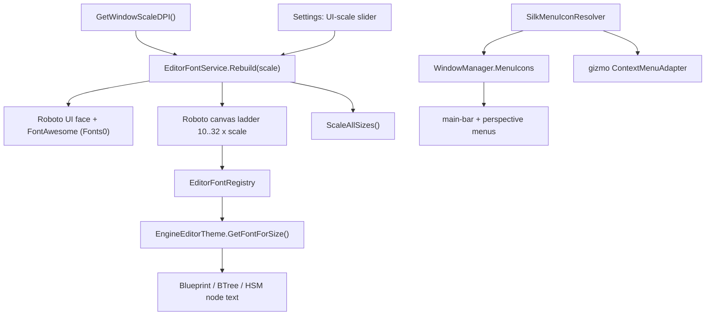

# Editor Fonts, DPI Scaling & Colored Menu Icons

Branch: `claude/editor-font-scaling-dpi-tawnwp` · 3 commits · applies to `clusterrunner -m editor`

## What & why

The editor (raylib-cs + Dear ImGui) rendered all UI with ImGui's built-in **13 px
ProggyClean bitmap** font — tiny and rough on hi-res monitors — and the node canvases
(Blueprint / BTree / HSM) had only that one bitmap face to scale, so zoomed-out text
was unreadable. This work replaces the font pipeline and adds colored menu icons.

| Area | Before | After |
|---|---|---|
| Chrome (menus, panels) | ProggyClean 13 px, no DPI | **Roboto**, DPI-scaled, `ScaleAllSizes` |
| Canvas (node text) | single 13 px bitmap upscaled | **ladder** of baked Roboto faces, picked per zoom |
| Unicode | ASCII/Latin-1 → `?` | Latin-ext + **Cyrillic** + Greek + Vietnamese |
| Icons in text | none | **FontAwesome 6** merged onto the UI font |
| Scaling control | none | **auto DPI × user UI-scale slider** (persisted) |
| Menu icons | text only | **full-color silk icons**, aligned gutter |
| Silk atlas filter | point (blocky upscale) | **bilinear** (smooth) |

## Architecture



- **Runtime rescale** (slider) can't rebuild the atlas mid-frame, so it queues a rebuild
  that the render loop drains at the frame boundary (`ApplyPendingRebuild`).
- **Canvas font selection**: "smallest baked size ≥ target, else largest" — avoids upscaling blur.
- **Menu icon vocabulary** stays editor-owned (`SilkIconProvider`); the shared menu
  renderers only know a `MenuIconResolver` delegate (no layering violation).

## Files changed

**Fonts / DPI**
| File | Change |
|---|---|
| `FDP/Data/Fonts/fa-solid-900.ttf` (+ `.LICENSE.txt`) | new asset — Font Awesome 6 Free Solid (SIL OFL 1.1) |
| `Fdp.Presentation/ImGui/Fonts/EditorFontService.cs` | new — bake/merge/DPI/rebuild/ScaleAllSizes |
| `Fdp.Presentation/ImGui/Fonts/EditorFontRegistry.cs` | new — ambient default-font + canvas ladder |
| `Fdp.Presentation/ImGui/Fonts/IconsFontAwesome6.cs` | new — FA glyph constants |
| `Fdp.Presentation/ImGui/Fonts/EmbeddedFontResources.cs` | + `GetFontAwesomeSolidTtfBytes()` |
| `Hrot.ClusterRunner/Presentation/RaylibPresentationShell.cs` | HighDPI flag, bake fonts, **bilinear** icon atlas |
| `Hrot.ClusterRunner/Presentation/{IPresentationShell,LocalWindowController}.cs` · `Program.cs` | expose service, apply persisted scale, drain rebuilds |
| `Hrot.Editor.AiShared/Adapters/EngineEditorTheme.cs` | resolve canvas font from the registry |

**Menus / icons**
| File | Change |
|---|---|
| `GizmoMap.Presentation/UI/MenuIconRenderer.cs` | new — `MenuIconResolver` delegate + aligned-gutter helper |
| `GizmoMap.Presentation/UI/ImGuiMenuRenderer.cs` | icon-aware `DrawMenus` overload |
| `GizmoMap.Presentation/UI/ContextMenuAdapter.cs` | reads JSON `"icon"`, `IconResolver` property |
| `GizmoMap.Presentation/Layers/DebugGizmoLayer.cs` · `Fdp.Presentation/Vis2D/Layers/DebugGizmoLayer.cs` | forward the context-menu resolver |
| `Fdp.Presentation/ImGui/WindowManager/WindowManager.cs` | `MenuIcons` resolver, perspective + host-menu icons, **UI-scale Settings modal**, persist `UiScale` |
| `Fdp.Presentation/ImGui/WindowManager/GlobalMenuRegistry.cs` | `MenuItemNode.Icon` |
| `Hrot.Editor.AiShared/Adapters/SilkMenuIconResolver.cs` | new — semantic-key → silk sprite (raw-coord fallback) |
| `Hrot.Editor/EditorSubsystem.cs` | inject the resolver in `RegisterWindows` |

## Testing on Windows

```bat
run_Editor.bat          REM or: clusterrunner -m editor --no-wait
```

Check:
1. **Chrome is Roboto and larger** on a hi-DPI display (not the old blocky bitmap).
2. **Settings ▸ "UI Scale & Fonts…"** — presets (100–200 %) + slider. Change it; fonts &
   spacing rebake live. Value persists across restarts.
3. **Menus** — Perspective (BTree/HSM/Blueprint icons), Windows (folder), Settings (wrench),
   Help/About (info). Labels stay aligned whether or not a row has an icon.
4. **Node canvases** — zoom in/out; titles/pins stay crisp instead of turning to mush.
5. **Unicode** — Cyrillic / accented text renders (no `?`).

### Persistence & config

| What | Where |
|---|---|
| UI-scale multiplier | `UiScale` in `fdp_windows.json` (next to the exe) |
| Window layout / ImGui | `%LocalAppData%\HROT\imgui.ini` |

## Using the new pieces

- **FontAwesome in a label**: `ImGui.Button(IconsFontAwesome6.FloppyDisk + " Save")`.
- **A menu icon**: set `Icon` (DTO/`MenuItemNode`) or `"icon"` (gizmo JSON) to a semantic key
  from `SilkIconProvider` (e.g. `"shell/save"`, `"asset/btree"`, `"folder"`, `"status/info"`),
  or a raw atlas coordinate (`"v11"`). The resolver + gutter do the rest.

## Known limitations / follow-ups

- **Gizmo combat-verb menus** (Move/Engage/Stop/Rotate…) resolve icons but have **no keys
  assigned** — needs a few new `SilkIconProvider` entries (no icon-cell manifest exists, so
  they must be picked visually). Intentionally deferred.
- **Bilinear ≠ more detail**: silk cells are 16 px; smooth at menu size, *soft* (not sharp)
  at large sizes like the 2-line node picker. Truly crisp large icons need a higher-res
  source (SVG / bigger atlas) — separate effort.
- **Color emoji**: not feasible in this stack (stb rasterizer is monochrome; would need the
  FreeType ImGui backend). Monochrome FA glyphs are supported.
- **NodeEdit demo** still uses its old Arial pipeline (vendored specimen; not wired to the service).

## Verification

- Builds clean end-to-end (`Fdp.Presentation`, `GizmoMap.Presentation`, `Hrot.Editor`,
  `Hrot.ClusterRunner`; 0 warnings/errors).
- Tests green: EditorFontRegistry policy, FontAwesome/Roboto resource bytes, WindowManager (139),
  GizmoMap.Presentation (19), EngineEditorTheme (19).
- Headless (xvfb + software GL) render checks confirmed: DPI-scaled Roboto, FA icons, Unicode,
  the canvas ladder, and the real `ImGuiMenuRenderer` menu path with colored aligned icons.
- Pre-existing headless Vis2D gizmo NPEs (`ctx.Resources` null) are unrelated — they fail
  identically on clean `HEAD`.
