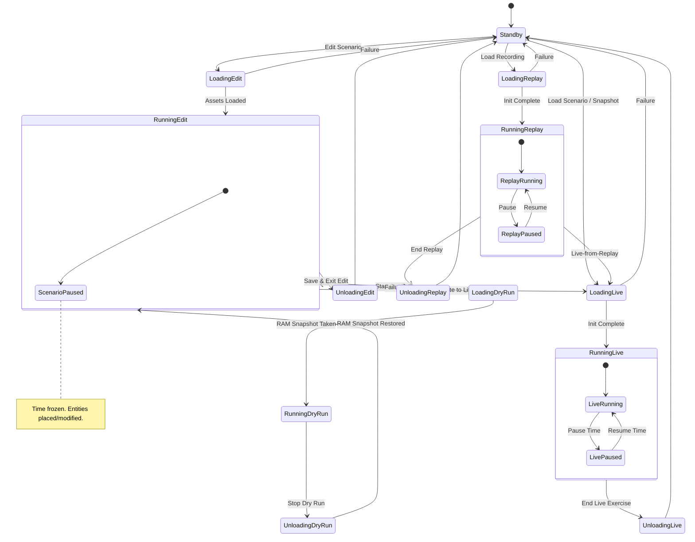
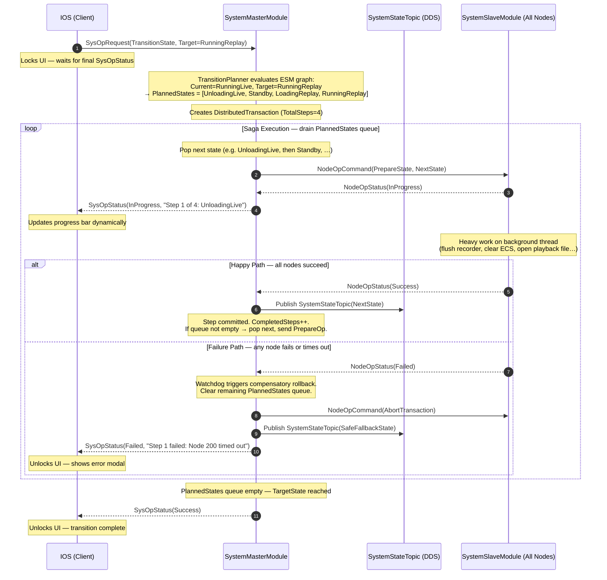
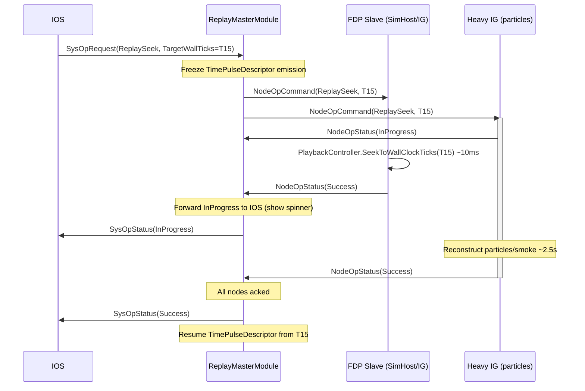
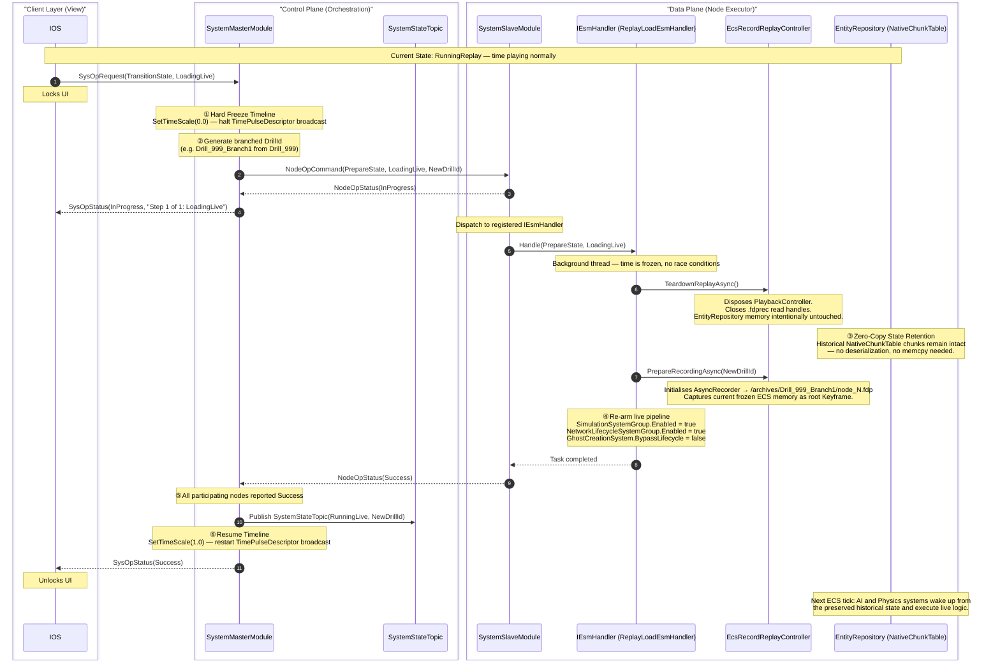
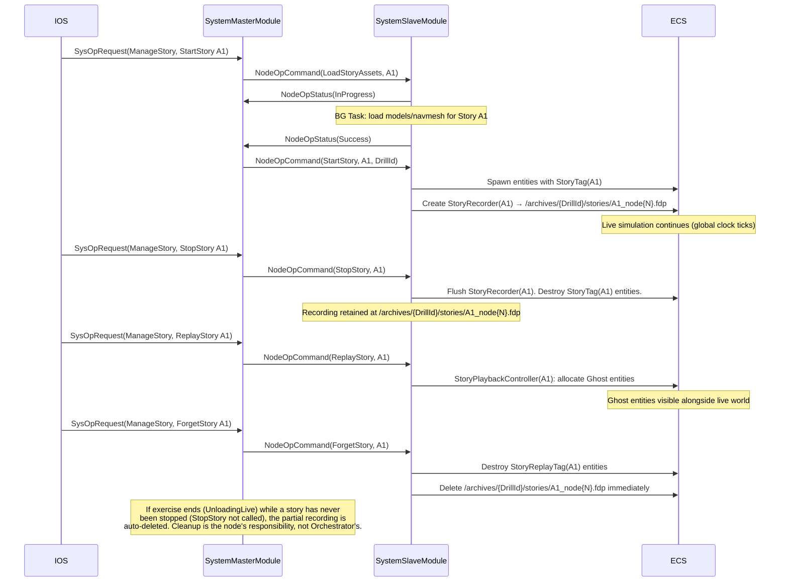
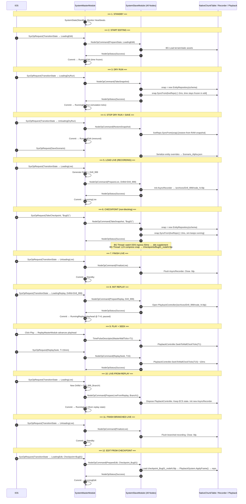

# Distributed Exercise Management System — Architecture Design

> **Document scope:** Architectural design for implementing the Exercise State Machine (ESM),
> distributed recording/replay, checkpoints, dry runs, stories, battlespaces, node health
> monitoring, and archive management across the Bagira/FDP platform.
>
> Based on the [design-talk.md](./design-talk.md) conversation; cross-referenced against the
> existing codebase as of March 2026.

---

## Table of Contents

1. [System Overview](#1-system-overview)
2. [DDS Message Schema — bdc-sst-orchestration](#2-dds-message-schema)
3. [Exercise State Machine (ESM)](#3-exercise-state-machine)
4. [SysOp / Two-Phase Commit (2PC) Orchestration Pattern](#4-sysop--two-phase-commit-orchestration-pattern)
5. [SystemMasterModule](#5-systemmastermodule)
   - [5.5 Transition Planner (Macro-Transitions)](#55-transition-planner-macro-transitions)
   - [5.6 Time Control Architecture](#56-time-control-architecture)
   - [5.6.5 Deterministic Mode Switching — DistributedTimeCoordinator and Future Barrier](#565-deterministic-mode-switching--distributedtimecoordinator-and-future-barrier)
6. [SystemSlaveModule](#6-systemslavemodule)
   - [6.6 Time Slave Integration (SlaveTimeController + Kernel Adapter)](#66-time-slave-integration)
7. [Node Health Monitoring (Heartbeat & BIT)](#7-node-health-monitoring)
8. [Replay Subsystem](#8-replay-subsystem)
   - [8.11 Live-from-Replay Temporal Interlock](#811-live-from-replay-temporal-interlock)
9. [Checkpoints & Dry Runs](#9-checkpoints--dry-runs)
10. [Stories — Multi-Tenant Micro-Scenarios](#10-stories--multi-tenant-micro-scenarios)
11. [Battlespaces](#11-battlespaces)
12. [Archive Export / Import](#12-archive-export--import)
13. [Deterministic Batch Runs](#13-deterministic-batch-runs)
14. [Key 12-Step Exercise Sequence Flow](#14-key-12-step-exercise-sequence-flow)
15. [Required Code Changes Summary](#15-required-code-changes-summary)

---

## 1. System Overview

### 1.1 Node Roles

```
┌─────────────────────────────────────────────────────────────────────────────┐
│                         BAGIRA DISTRIBUTED PLATFORM                         │
│                                                                             │
│  ┌──────────────┐  ┌──────────────┐  ┌──────────────┐  ┌──────────────┐ │
│  │     IOS      │  │  SimHost     │  │  IG          │  │ Orchestrator │ │
│  │  (Control)   │  │ (Simulation) │  │ (Visualise)  │  │  (Master)    │ │
│  │              │  │              │  │              │  │              │ │
│  │  SysOpReq ──►│  │ ◄─NodeOpCmd  │  │ ◄─NodeOpCmd  │  │ NodeOpCmd──► │ │
│  │ ◄─SysOpUpd   │  │  NodeOpSts──►│  │  NodeOpSts──►│  │◄─NodeOpSts  │ │
│  │  Heartbeat──►│  │  Heartbeat──►│  │  Heartbeat──►│  │  (all nodes) │ │
│  └──────────────┘  └──────────────┘  └──────────────┘  └──────┬───────┘ │
│         │                  ▲                  ▲                │          │
│         └──────────────────┴──────────────────┴────────────────┘          │
│                                                                             │
│  Orchestrator (Bagira.Orchestrator, subsystem of Bagira.Runner):            │
│  ┌──────────────────────────────────────────────────────────────────────┐  │
│  │ SystemMasterModule │ ESM State Machine │ Transaction Mgr │ Watchdog  │  │
│  │ OrchestratorContextTopic (TransientLocal) — late-joiner context      │  │
│  └──────────────────────────────────────────────────────────────────────┘  │
│                                                                             │
│  ─────────────────────────── CycloneDDS Bus ──────────────────────────── │
└─────────────────────────────────────────────────────────────────────────────┘
```

### 1.2 Control Planes

| Plane | Direction | Topic |
|-------|-----------|-------|
| Control Plane — Request | IOS → Master | `SysOpRequest` |
| Control Plane — Response | Master → IOS | `SysOpStatus` |
| Command Plane — Command | Master → All Nodes | `NodeOpCommand` |
| Command Plane — Status | All Nodes → Master | `NodeOpStatus` |
| Health Plane | Each Node → All | `NodeHeartbeat` |
| State Plane | Master → All (persistent) | `SystemStateTopic` |
| Context Plane | Orchestrator → All (persistent) | `OrchestratorContextTopic` |
| Time Plane | Time Master → All | `TimePulseDescriptor` (existing) |
| Time Mode Plane | `DistributedTimeCoordinator` → All | `SwitchTimeModeEvent` (new — internal to time toolkit, see §5.6.5) |

---

## 2. DDS Message Schema

**IDL file:** `bdc-sst-orchestration`  
**C# namespace:** `Bagira.BDC.SSTD.Orchestration`  
**Project:** `Bagira.DDS.DataModel`

### 2.1 Enumerations

```csharp
// ─── Exercise State Machine States ───────────────────────────────────────────
public enum ESMState : int
{
    Standby           = 0,

    // Editing flow
    LoadingEdit       = 10,
    RunningEdit       = 11,
    UnloadingEdit     = 12,

    // Dry-run sub-loop (inside editing)
    LoadingDryRun     = 20,
    RunningDryRun     = 21,
    UnloadingDryRun   = 22,

    // Live simulation flow
    LoadingLive       = 30,
    RunningLive       = 31,
    UnloadingLive     = 32,

    // Replay flow
    LoadingReplay     = 40,
    RunningReplay     = 41,
    UnloadingReplay   = 42,

    // Error / degraded
    Degraded          = 99,
}

// ─── SysOp types (IOS → Master) ──────────────────────────────────────────────
public enum SysOpType : int
{
    TransitionState   = 1,   // Load/Unload/switch ESM states
    SaveScenario      = 2,   // Serialize scenario JSON
    LoadBattlespace   = 3,   // Load high-res terrain area
    TakeCheckpoint    = 4,   // Fast RAM snapshot
    CollectCheckpoint = 5,   // Gather checkpoint files to archive
    ExportArchive     = 6,   // Export drill recordings to cold storage
    ImportArchive     = 7,   // Import recordings from cold storage
    ManageStory       = 8,   // Start/Stop/Eval/Forget micro-scenario
    ReplaySeek        = 9,   // Jump replay to a specific wall-clock time
    PauseTime         = 10,
    ResumeTime        = 11,
}

// ─── Node operation types (Master → Nodes) ───────────────────────────────────
public enum NodeOpType : int
{
    PrepareState     = 1,
    CommitState      = 2,
    AbortTransaction = 3,
    TakeSnapshot     = 4,   // Non-blocking: node calls SyncFrom, passes buf to async thread
    RestoreSnapshot  = 5,
    PrepareBattlespace   = 7,
    CommitBattlespace    = 8,
    PrepareLive          = 9,
    FinalizeLive         = 10,
    PrepareReplay        = 11,
    FinalizeReplay       = 12,
    ReplaySeek           = 13,
    UploadChunk          = 14,  // Token-bucket archive upload
    StartStory           = 20,
    StopStory            = 21,
    ReplayStory          = 22,
    ForgetStory          = 23,
    LoadStoryAssets      = 24,
}

public enum OpStatus : int
{
    Pending    = 0,
    InProgress = 1,
    Success    = 2,
    Failure    = 3,
    Rejected   = 4,
}
```

### 2.2 DDS Topics

```csharp
// ─── Persistent system state (late-joiner safe) ──────────────────────────────
[DdsTopic("SystemState")]
[DdsIdlFile("bdc-sst-orchestration")]
[DdsQos(Reliability  = DdsReliability.Reliable,
        Durability   = DdsDurability.TransientLocal,
        HistoryKind  = DdsHistoryKind.KeepLast,
        HistoryDepth = 1)]
public partial struct SystemStateTopic
{
    public ESMState CurrentState;
    public Guid     DrillId;          // Unique key per exercise run
    public long     StateStartWallTicks;  // wall-clock start of current state
    public int      TransactionEpoch; // Increments on each successful transition
}

// ─── IOS → Master ────────────────────────────────────────────────────────────
[DdsTopic("SysOpRequest")]
[DdsIdlFile("bdc-sst-orchestration")]
[DdsQos(Reliability = DdsReliability.Reliable, Durability = DdsDurability.Volatile)]
public partial struct SysOpRequest
{
    public Guid       RequestId;
    public SysOpType  OperationType;
    public string     PayloadJson;   // Operation-specific params (nullable)
}

// ─── Master → IOS ────────────────────────────────────────────────────────────
[DdsTopic("SysOpStatus")]
[DdsIdlFile("bdc-sst-orchestration")]
[DdsQos(Reliability = DdsReliability.Reliable, Durability = DdsDurability.Volatile)]
public partial struct SysOpStatus
{
    public Guid      RequestId;
    public OpStatus  Status;
    public int       ErrorCode;
    public string    ResultJson;
}

// ─── Master → All Nodes ──────────────────────────────────────────────────────
[DdsTopic("NodeOpCommand")]
[DdsIdlFile("bdc-sst-orchestration")]
[DdsQos(Reliability = DdsReliability.Reliable, Durability = DdsDurability.Volatile)]
public partial struct NodeOpCommand
{
    public Guid        TransactionId;
    public NodeOpType  Operation;
    public string      PayloadJson;
}

// ─── All Nodes → Master ──────────────────────────────────────────────────────
[DdsTopic("NodeOpStatus")]
[DdsIdlFile("bdc-sst-orchestration")]
[DdsQos(Reliability = DdsReliability.Reliable, Durability = DdsDurability.Volatile)]
public partial struct NodeOpStatus
{
    public Guid      TransactionId;
    public int       NodeId;
    public OpStatus  Status;
    public bool      IsParticipating;  // false = node opted out, Master skips it
    public int       ErrorCode;
    public string    ResultJson;
}

// ─── Health / BIT (all nodes, autonomous 1 Hz) ───────────────────────────────
[DdsTopic("NodeHeartbeat")]
[DdsIdlFile("bdc-sst-orchestration")]
[DdsQos(Reliability  = DdsReliability.BestEffort,
        Durability   = DdsDurability.TransientLocal,
        HistoryKind  = DdsHistoryKind.KeepLast,
        HistoryDepth = 1)]
public partial struct NodeHeartbeat
{
    [DdsKey]
    public int     NodeId;
    public string  SubsystemName;
    public ESMState LocalEsmState;       // What the node thinks the ESM state is
    public long    WallTicksUtc;
    public float   CpuUsagePercent;
    public long    RamUsedBytes;
    public bool    SimTickAdvancing;     // false if ECS main loop is stalled
    public string  SubsystemsJson;       // JSON dict: { "Recorder": "Healthy", ... }
}

// ─── Late-joiner / exercise context (Orchestrator → All, TransientLocal) ──────
// Published/updated by the Orchestrator whenever the exercise context changes.
// Late-joining nodes read this once to catch up on what exercise is running.
[DdsTopic("OrchestratorContext")]
[DdsIdlFile("bdc-sst-orchestration")]
[DdsQos(Reliability  = DdsReliability.Reliable,
        Durability   = DdsDurability.TransientLocal,
        HistoryKind  = DdsHistoryKind.KeepLast,
        HistoryDepth = 1)]
public partial struct OrchestratorContextTopic
{
    public ESMState CurrentState;
    public Guid     DrillId;
    public int      TransactionEpoch;
    public string   ScenarioId;           // Which scenario is loaded (nullable)
    public string   ArchiveBasePath;      // Where recordings are stored
    public string   RequiredNodeIdsJson;  // JSON int[] — which NodeIds are expected
    public long     StateStartWallTicks;
}

// ─── Replay-specific time pulse (Orchestrator → All, during RunningReplay) ───
// NOTE: During RunningReplay the ReplayMasterModule seeds MasterTimeController
// with the recording epoch (StartWallTicks = recording.StartWallTicks) and sets
// an appropriate TimeScale, then calls MasterTimeController.Update() normally.
// MasterTimeController publishes TimePulseDescriptor at 1 Hz (or on SetTimeScale).
// Slaves run SlaveTimeController PLL as usual — SimTimeSnapshot carries seconds
// elapsed since recording epoch.  No new DDS topic is needed; the consumer may
// check SystemStateTopic.CurrentState == RunningReplay to interpret TotalTime as
// recording-relative seconds rather than live simulation time.
```

---

## 3. Exercise State Machine

```
┌──────────────────────────────────────────────────────────────────────────────┐
│                         EXERCISE STATE MACHINE (ESM)                         │
└──────────────────────────────────────────────────────────────────────────────┘

                      ┌──────────┐
                      │ Standby  │◄─────────────────────────────────┐
                      └────┬─────┘                                   │
            ┌──────────────┼──────────────┐                          │
            │              │              │                          │
      Load  │        Load  │       Load   │                          │
      Edit  ▼        Live  ▼       Rplay  ▼                          │
    ┌────────────┐  ┌─────────────┐  ┌────────────────┐             │
    │LoadingEdit │  │ LoadingLive │  │ LoadingReplay  │             │
    └─────┬──────┘  └──────┬──────┘  └───────┬────────┘             │
          │                │                  │                      │
          ▼                ▼                  ▼                      │
    ┌────────────┐  ┌─────────────┐  ┌────────────────┐             │
    │RunningEdit │  │ RunningLive │  │ RunningReplay  │             │
    └──┬──────┬──┘  └──┬──────┬───┘  └──┬──────┬──────┘             │
       │      │        │  ▲   │         │  ▲   │                    │
  Start│      │Unload  │  │   │Unload   │  │   │Unload             │
  DryRun      │Edit    │Pause │Live     │ Pause│Replay             │
       │      │        │  │   │         │  │   │                    │
       ▼      │        ▼  │   ▼         ▼  │   ▼                    │
  ┌──────────┐│   ┌──────────────┐  ┌──────────────────┐           │
  │LoadingDR ││   │UnloadingLive │  │UnloadingReplay   │           │
  └────┬─────┘│   └──────┬───────┘  └──────────┬───────┘           │
       │      │          │                      │                    │
       ▼      │          └──────────────────────┴────────────────────┘
  ┌───────────┐                         (→ Standby)
  │RunningDR  │  ("DryRun")
  └────┬──────┘
       │ Stop DryRun
       ▼
  ┌────────────────┐
  │UnloadingDryRun │
  └────────┬───────┘
           │ RAM snapshot restored
           └──────────────────────► RunningEdit
```

### 3.1 Valid State Transitions

```
Standby            → LoadingEdit, LoadingLive, LoadingReplay
LoadingEdit        → RunningEdit, Standby (failure)
RunningEdit        → LoadingDryRun, LoadingLive, UnloadingEdit
LoadingDryRun      → RunningDryRun, RunningEdit (failure)
RunningDryRun      → UnloadingDryRun
UnloadingDryRun    → RunningEdit
UnloadingEdit      → Standby
LoadingLive        → RunningLive, Standby (failure)
RunningLive        → UnloadingLive
UnloadingLive      → Standby
LoadingReplay      → RunningReplay, Standby (failure)
RunningReplay      → UnloadingReplay, LoadingLive (Live-from-Replay)
UnloadingReplay    → Standby
Any                → Degraded (health failure)
```

> **Asset caching across Standby:** When transitioning through Standby back to a new
> `LoadingX` state, nodes MUST NOT force a full asset reload. Assets loaded in RAM are
> retained; only assets that differ between old and new scenario are unloaded/reloaded.
> This means `RunningEdit → LoadingLive` (via direct or via Standby) avoids re-scanning
> files that are already resident.

> **Mermaid version** (copy into a Mermaid renderer):



---

## 4. SysOp / Two-Phase Commit Orchestration Pattern

The entire distributed coordination uses a **Two-Phase Commit (2PC)** pattern:

```
IOS              Master                     All Slave Nodes
 │                 │                               │
 │ SysOpRequest    │                               │
 ├────────────────►│                               │
 │                 │── validates state ─┐          │
 │                 │◄──────────────────┘          │
 │                 │                               │
 │                 │  NodeOpCommand(PREPARE)       │
 │                 ├──────────────────────────────►│
 │                 │                               │── bg Task ──►
 │                 │  NodeOpStatus(InProgress)     │
 │                 │◄──────────────────────────────┤
 │ SysOpStatus     │                               │── heavy work...
 │ (InProgress) ◄──┤                               │
 │                 │  NodeOpStatus(Success)        │◄── bg Task done
 │                 │◄──────────────────────────────┤
 │                 │  (all nodes acked)            │
 │                 │                               │
 │                 │  NodeOpCommand(COMMIT)        │
 │                 ├──────────────────────────────►│
 │                 │── updates SystemStateTopic    │
 │ SysOpStatus     │                               │
 │ (Success) ◄─────┤                               │
 │                 │                               │
```

### 4.1 Failure Path (Abort)

```
 │                 │   NodeOpStatus(Failure)       │
 │                 │◄──────────────────────────────┤
 │                 │                               │
 │                 │  NodeOpCommand(ABORT)         │
 │                 ├──────────────────────────────►│── drop StagedAssetPayload
 │ SysOpStatus     │                               │
 │ (Failure) ◄─────┤                               │
```

### 4.2 Transaction Epoch (Split-Brain Recovery)

`SystemStateTopic.TransactionEpoch` is incremented on every successful commit.  
A node that "missed" a commit detects this on the next heartbeat cycle by comparing
its local epoch against the published epoch. It self-heals if it completed the
Prepare phase; otherwise it transitions to `Degraded`.

---

## 5. SystemMasterModule

**Location:** `Bagira.Orchestrator/SystemMasterModule.cs` (new — lives in a dedicated
`Bagira.Orchestrator` project, registered as a subsystem of `Bagira.Runner`).
`Bagira.Runner` is just a shell; `Bagira.Orchestrator` runs as a separate process.

> **Late-joiner support:** On every ESM state transition the Orchestrator publishes an
> updated `OrchestratorContextTopic` (TransientLocal, HistoryDepth=1). Any node that
> joins after the transition reads the latest sample immediately and executes its internal
> join procedure (load assets, sync state, etc.).

### 5.1 Responsibilities
- Owns the **ESM** — sole writer of `SystemStateTopic`
- Manages the **Node Roster** via `NodeHeartbeat` consumption
- Executes **2PC transactions** without blocking the main ECS loop
- Generates new `DrillId` GUID when entering any non-Standby session
- Provides **`SysOpRequest`** validation and rejection logic

### 5.2 Internal Data Structures

```csharp
// ─── Active distributed transaction ──────────────────────────────────────────
class DistributedTransaction
{
    public Guid       TransactionId;
    public Guid       OriginRequestId;     // back-ref to SysOpRequest
    public NodeOpType PrepareOp;
    public NodeOpType CommitOp;

    // ── Macro-transition support (see §5.5) ──────────────────────────────────
    // PlannedStates is populated by the TransitionPlanner for every request,
    // even single-step ones (queue length 1 = simple transition).
    // TargetEsmState is the ultimate goal; current step is PlannedStates.Peek().
    public ESMState         TargetEsmState;     // final goal
    public Queue<ESMState>  PlannedStates;      // ordered intermediate states
    public int              TotalSteps;         // snapshot of initial queue length — for "Step X of Y"
    public int              CompletedSteps;     // incremented each time a step commits

    public HashSet<int> PendingNodes;      // cloned from ActiveNodes at T=0
    public float      ElapsedSeconds;
    public float      TimeoutSeconds;      // configurable, default 30s
    public bool       AllowPartialSuccess; // e.g. non-critical loggers
}

// ─── Node health profile ──────────────────────────────────────────────────────
class NodeHealthProfile
{
    public int     NodeId;
    public string  SubsystemName;
    public ESMState LastReportedState;
    public float   SecondsSinceLastHeartbeat;
    public bool    IsCritical;   // if true and goes offline → fault the ESM
}
```

### 5.3 Tick() Logic (runs every ECS frame at BeforeSync phase)

```
┌─ TICK ──────────────────────────────────────────────────────────────────┐
│                                                                          │
│  1. Consume NodeHeartbeat DDS queue                                      │
│     ├─ Update NodeHealthProfile.SecondsSinceLastHeartbeat = 0            │
│     └─ Detect missed heartbeats (> 5s) → prune or fault                  │
│                                                                          │
│  2. Consume SysOpRequest DDS queue (from IOS)                            │
│     ├─ Hand request to TransitionPlanner → generates PlannedStates queue │
│     └─ If valid path found → spawn DistributedTransaction, begin Phase 1 │
│        (see §5.5 for Transition Planner details)                         │
│                                                                          │
│  3. Consume NodeOpStatus DDS queue (from slave nodes)                    │
│     ├─ Match by TransactionId                                            │
│     ├─ InProgress: forward as SysOpStatus(InProgress, "Step X of Y")    │
│     │              to IOS so the UI can show a progress bar              │
│     ├─ Success / IsParticipating=false: remove from PendingNodes         │
│     └─ Failure: abort transaction, clear PlannedStates queue,            │
│                 publish SystemStateTopic(SafeFallbackState),             │
│                 send SysOpStatus(Failure) to IOS                         │
│                                                                          │
│  4. For each active transaction                                           │
│     ├─ Increment ElapsedSeconds                                          │
│     ├─ If timeout → abort (treat as Failure)                             │
│     └─ If PendingNodes.Count == 0 → COMMIT current step:                 │
│         ├─ Publish NodeOpCommand(CommitOp)                               │
│         ├─ Write SystemStateTopic (current queue head state)              │
│         ├─ transaction.PlannedStates.Dequeue(); CompletedSteps++         │
│         ├─ If PlannedStates is EMPTY → publish SysOpStatus(Success)      │
│         │   to IOS and close transaction                                 │
│         └─ Else → pop next state, reset PendingNodes, send next          │
│                  NodeOpCommand(PrepareOp, nextState) — chain continues   │
│                                                                          │
└──────────────────────────────────────────────────────────────────────────┘
```

### 5.4 DrillId Generation

```
Whenever transitioning OUT of Standby (to LoadingEdit, LoadingLive, LoadingReplay):
  _currentDrillId = Guid.NewGuid()

The DrillId is embedded in:
  - SystemStateTopic
  - NodeOpCommand payload JSON  (so nodes can name their .fdp files correctly)
  - AsyncRecorder filePath:  /archives/{DrillId}/node_{NodeId}.fdp
```

---

### 5.5 Transition Planner (Macro-Transitions)

The `SystemMasterModule` acts as a **Process Manager**: every `SysOpRequest(TransitionState,
TargetState)` from the IOS is given to an internal **`TransitionPlanner`** that treats
the ESM as a directed graph and calculates the shortest valid path to the requested target
state.  The result is always a `Queue<ESMState>` that is loaded into `DistributedTransaction.PlannedStates`.

A simple, direct single-step request (e.g. `Standby → LoadingEdit`) is just a queue of
length 1.  A "wild" multi-step request (e.g. `RunningLive → RunningReplay`) produces a
longer queue.  The Tick() execution loop is completely agnostic to queue length: it pops
one state, runs the standard two-phase commit, and chains to the next entry when all nodes
ACK success.

**Key benefits of this unified design:**
- **Dumb IOS:** the client fires a single `SysOpRequest` naming only the desired final
  state and receives `SysOpStatus(InProgress, "Step X of Y: …")` progress updates
  autonomously.  It requires zero knowledge of ESM graph rules.
- **DRY execution path:** timeouts, watchdog monitoring, and distributed rollback are
  written exactly once in `DistributedTransaction` regardless of queue length.
- **Open/Closed for trajectories:** adding a new mandatory intermediate state to the ESM
  later only requires updating the graph definition inside `TransitionPlanner`; all client
  code and the 2PC loop are unchanged.
- **Compensatory rollback:** if a node fails at step N, the Master aborts the remaining
  queue, publishes `SystemStateTopic(SafeFallbackState)`, and sends `SysOpStatus(Failed)`
  with a human-readable description.

**Example paths resolved by the planner:**

| Current State | TargetState | Planned Queue |
|---------------|-------------|---------------|
| `Standby` | `LoadingEdit` | `[LoadingEdit]` |
| `RunningLive` | `RunningReplay` | `[UnloadingLive, Standby, LoadingReplay, RunningReplay]` |
| `RunningEdit` | `RunningLive` | `[UnloadingEdit, Standby, LoadingLive, RunningLive]` |
| `RunningReplay` | `RunningEdit` | `[UnloadingReplay, Standby, LoadingEdit, RunningEdit]` |

> **Transition hints:** the `SysOpRequest.PayloadJson` may carry optional metadata (e.g.
> `"DrillId"`, `"ScenarioId"`, `"TargetWallTicks"`) that the planner threads through the
> `NodeOpCommand` payloads for each step.  This lets the IOS say "go to RunningReplay
> of drill 999, seek to T+15 min" in a single request without embedding sequencing logic
> in the client.

#### 5.5.1 Sequence Diagram — Complex (Wild) Transition

The following diagram illustrates the IOS firing a wild `RunningLive → RunningReplay`
request.  The Master resolves the 4-step trajectory internally; the IOS only monitors
`SysOpStatus` progress updates.



---

### 5.6 Time Control Architecture

The `SystemMasterModule` is the **Time Authority** for the distributed cluster.  All time
logic is encapsulated behind an `ITimeController` interface, enabling hot-swapping between
real-time and deterministic stepping modes without disrupting the rest of the system.

#### 5.6.1 `ITimeController` Interface

```csharp
// Location: FDP/Toolkits/FDP.Toolkit.Time/ITimeController.cs  (new)
public interface ITimeController
{
    GlobalTime Update();                    // Advance internal clock, return current state
    void       SetTimeScale(float scale);   // 0.0 = pause, 1.0 = realtime, 2.0 = fast-fwd
    GlobalTime GetCurrentState();           // Non-advancing read
    void       SeedState(GlobalTime seed);  // Abrupt reset — bypasses PLL / error filters
}
```

#### 5.6.2 `SwitchableTimeController` Proxy

A `SwitchableTimeController` wraps an active `ITimeController` instance.  The `ModuleHostKernel`
holds a stable reference to the proxy; the underlying strategy can be hot-swapped at any
frame-perfect moment without any other code being aware of the change.

The proxy exposes a single dedicated swap method, `SwitchTo()`, which is **never** called
directly by `SystemMasterModule` or `SystemSlaveModule` — it is called exclusively by the
`DistributedTimeCoordinator` (Master node) and `SlaveTimeModeListener` (Slave nodes) at
exactly the correct Barrier Frame (see §5.6.5):

```csharp
public class SwitchableTimeController : ITimeController
{
    private ITimeController _activeController;

    public SwitchableTimeController(ITimeController initial)
    {
        _activeController = initial ?? throw new ArgumentNullException(nameof(initial));
    }

    /// <summary>
    /// The only public API specific to this class.
    /// Called by the coordinator layer when the Future Barrier frame is reached.
    /// Gracefully transfers the exact current GlobalTime state to the new strategy.
    /// </summary>
    public void SwitchTo(ITimeController newController)
    {
        if (newController == null) throw new ArgumentNullException(nameof(newController));
        if (_activeController == newController) return;

        var currentState = _activeController.GetCurrentState();
        newController.SeedState(currentState);
        _activeController = newController;
    }

    public ITimeController ActiveController => _activeController;

    // ─── ITimeController Proxy — all calls forwarded to active strategy ─────
    public GlobalTime Update()                  => _activeController.Update();
    public void       SetTimeScale(float scale) => _activeController.SetTimeScale(scale);
    public float      GetTimeScale()            => _activeController.GetTimeScale();
    public TimeMode   GetMode()                 => _activeController.GetMode();
    public GlobalTime GetCurrentState()         => _activeController.GetCurrentState();
    public void       SeedState(GlobalTime s)   => _activeController.SeedState(s);
    public void       Dispose()                 => _activeController.Dispose();
}
```

> **Key design rule:** `SwitchableTimeController` knows nothing about DDS, future barriers,
> or the ESM.  It is a pure Proxy + Strategy implementation.  Network synchronisation of
> the swap is fully handled by the coordinator layer described in §5.6.5.

#### 5.6.3 Master-Side Time Strategies

| Strategy | Used When | Behaviour |
|----------|-----------|-----------|
| `MasterTimeController` | `RunningLive`, `RunningReplay`, `RunningDryRun` | Driven by `Stopwatch`; publishes `TimePulseDescriptor` at 1 Hz and on every `SetTimeScale()` call |
| `SteppedMasterController` | Deterministic / debug mode | Halts real-time progression; publishes `FrameOrderDescriptor` per logical tick; waits for `FrameAckDescriptor` before advancing |

During `RunningReplay`, `MasterTimeController` is seeded with the recording epoch via
`SeedState()` so that `GlobalTime.TotalTime` measures seconds from the start of the
recording (see §8.3).

#### 5.6.4 Abrupt Reset (Jump-To-Time Interlock)

Discontinuous operations (seeking during replay, branching live-from-replay) require a
strict **Control-Plane / Data-Plane interlock** to prevent the distributed cluster from
diverging at different timestamps:

```
Master receives jump/seek request
  │
  ├─ 1. Hard freeze: SetTimeScale(0.0), halt TimePulseDescriptor broadcast
  │
  ├─ 2. SeedState(targetTime) on local MasterTimeController
  │      (establishes the new reference epoch before any node is commanded)
  │
  ├─ 3. Broadcast NodeOpCommand(ReplaySeek / PrepareState, targetTime)
  │
  ├─ 4. Wait for NodeOpStatus(Success) from ALL participating nodes
  │      (slaves call SlaveTimeController.SeedState() — bypassing PLL error
  │       filters — then execute their heavy data reconstruction)
  │
  └─ 5. Resume: SetTimeScale(savedScale), restart TimePulseDescriptor
         (time only flows once every node has confirmed it is temporally coherent)
```

> **Why explicit SeedState bypass matters:**  
> The `SlaveTimeController` PLL uses a `JitterFilter` to distinguish network jitter from
> intentional magnitude jumps.  A 15-minute seek looks like a catastrophic clock error to
> the PLL.  `SeedState()` provides a dedicated path that bypasses the filter entirely,
> guaranteeing instant deterministic snap without any slew interpolation artefacts.

#### 5.6.5 Deterministic Mode Switching — `DistributedTimeCoordinator` and Future Barrier

Switching between continuous real-time and deterministic lockstep is **completely
independent of the ESM**.  It is available at any point while the simulation is in a
*running* state (`RunningLive`, `RunningReplay`, `RunningDryRun`).  Because a standard
2PC `SysOp` round-trip would cause different nodes to swap at slightly different simulation
frames (destroying determinism), the switch is instead coordinated via a lightweight
**Future Barrier** on the dedicated **Time Plane**.

**Why 2PC SysOp cannot be used here:**  
Network latency means Node A might receive a `NodeOpCommand(SwitchMode)` at Frame 100 and
Node B at Frame 102.  If each node swaps its controller on receipt, determinism is instantly
destroyed.  Blocking the main simulation thread to wait for ACKs is equally unacceptable.

**The Future Barrier approach:**

```
Request arrives at DistributedTimeCoordinator (Master node)
  │
  ├─ 1. If sim clock is currently running (TimeScale > 0):
  │       Call SetTimeScale(0.0) on the active ITimeController to pause first.
  │       (The coordinator owns time — it pauses before negotiating the barrier.)
  │
  ├─ 2. Read current ECS frame counter (e.g. Frame 100).
  │      Add lookahead: BarrierFrame = 100 + N  (e.g. N=10 → BarrierFrame = 110).
  │
  ├─ 3. Publish SwitchTimeModeEvent { TargetMode, BarrierFrame } over DDS
  │       (via BlitEventTranslator<SwitchTimeModeEvent> — zero-allocation raw memcpy)
  │
  └─ 4. Continue simulating normally until local frame counter reaches BarrierFrame.
         On that exact tick → call _switchableTime.SwitchTo(new SteppedMasterController(...))
         Restore saved TimeScale.

On each Slave node — SlaveTimeModeListener:
  ├─ Receives SwitchTimeModeEvent from DDS.
  ├─ Continues simulating normally.
  └─ When local frame counter reaches BarrierFrame → call _switchableTime.SwitchTo(...)
     Because all nodes derive their frame counter from the same master clock, the swap
     occurs at the identical simulation instant on every node simultaneously.
```

**`SwitchTimeModeEvent` DDS message:**

```csharp
// Location: FDP/Toolkits/FDP.Toolkit.Time/Messages/TimeMessages.cs  (addition)
// Transport: BlitEventTranslator<SwitchTimeModeEvent> via FdpEventBus → CycloneDDS
// Visibility: internal to the time toolkit — not part of the public orchestration API.
[DdsTopic("SwitchTimeModeEvent")]
[DdsIdlFile("bdc-time")]
[DdsQos(Reliability = DdsReliability.Reliable, Durability = DdsDurability.Volatile)]
public struct SwitchTimeModeEvent
{
    public TimeMode TargetMode;     // Continuous | Deterministic
    public ulong    BarrierFrame;   // ECS global frame counter at which to swap
    public float    FixedDelta;     // Only used when TargetMode = Deterministic
}

public enum TimeMode : int
{
    Continuous    = 0,   // Real-time PLL (SlaveTimeController)
    Deterministic = 1,   // Lockstep fixed-delta (SteppedSlaveController)
}
```

**Architectural boundaries — who calls what:**

| Layer | Component | Responsibility |
|-------|-----------|----------------|
| Pure math | `SlaveTimeController`, `SteppedSlaveController`, `MasterTimeController`, `SteppedMasterController` | Calculate `DeltaTime` only; no swap logic |
| Proxy | `SwitchableTimeController` | Hold active strategy; `SwitchTo()` transfers state to new strategy |
| Coordinator | `DistributedTimeCoordinator` (Master), `SlaveTimeModeListener` (Slave) | Compute barrier frame; publish / receive `SwitchTimeModeEvent`; call `SwitchTo()` at the right frame |
| ESM / domain | `SystemMasterModule`, `SystemSlaveModule`, physics, AI | Completely unaware of time-mode switching; just read `GlobalTime.DeltaTime` |

---

## 6. SystemSlaveModule

**Location:** `Bagira.SimHost/Modules/Orchestration/SystemSlaveModule.cs` (new)  
Also instantiated inside `Bagira.IG` and any other FDP node.

**IOS variant:** `Bagira.IOS` uses a **lightweight slave** — it has no ECS / FDP world,
so `SystemSlaveModule` must support a no-ECS mode.  The IOS slave still registers with
the Orchestrator (via heartbeat), participates in SysOps (replies `NodeOpStatus`), and
reacts to ESM state changes; it just skips any `IEsmHandler` that touches an
`EntityRepository`.

### 6.1 Responsibilities
- Listens to `NodeOpCommand` and dispatches to **registered ESM handlers**
- Manages idempotency (drops duplicate `TransactionId` commands)
- Publishes autonomous `NodeHeartbeat` at 1 Hz (wall-clock, independent of sim time)
- Bridges background async Task results back to the synchronous ECS loop
- Publishes `NodeOpStatus` responses

### 6.2 ESM Handler Registration

```csharp
public interface IEsmHandler
{
    // Returns true if this handler participates in the given operation
    bool CanHandle(NodeOpType op);

    // Called on background thread. Must not touch EntityRepository.
    // Returns null on success, error string on failure.
    Task<string?> PrepareAsync(NodeOpCommand cmd, CancellationToken ct);

    // Called on main thread at BeforeSync phase after all nodes Prepare-acked.
    void Commit(NodeOpCommand cmd, EntityRepository repo);

    // Called on main thread at BeforeSync phase if transaction is aborted.
    void Abort(NodeOpCommand cmd, EntityRepository repo);
}
```

Example handlers in `Bagira.SimHost`:
- `LiveLoadEsmHandler` — loads scenario assets, initialises `AsyncRecorder`
- `ReplayLoadEsmHandler` — opens `PlaybackController`
- `EditLoadEsmHandler` — loads static terrain, disables physics systems
- `CheckpointEsmHandler` — on TakeSnapshot: calls `destRepo.SyncFrom(liveRepo)` on
  main thread (no pause), then hands `destRepo` to background task for compression
- `BattlespaceEsmHandler` — manages staged terrain loading

### 6.3 Main Thread Command Queue

Because `NodeOpCommand` arrives on the DDS network thread, and ECS mutations must
happen at `BeforeSync`, the slave uses an internal pending-action queue:

```
Network Thread             SystemSlaveModule.Tick() (BeforeSync)
     │                                  │
     │  receives NodeOpCommand          │
     ├──► enqueue PendingMainThreadAction │
     │                                  │
     │                                  ├──► dequeue PendingMainThreadAction
     │                                  ├──► call handler.Commit(cmd, repo)
     │                                  └──► publish NodeOpStatus(Success)
```

### 6.4 Heartbeat Timer

```csharp
// SystemSlaveModule owns a Stopwatch (NOT sim time based)
private readonly Stopwatch _heartbeatTimer = Stopwatch.StartNew();

// In Tick():
if (_heartbeatTimer.Elapsed.TotalSeconds >= 1.0)
{
    _heartbeatTimer.Restart();
    _ddsWriter.Publish(new NodeHeartbeat
    {
        NodeId            = _config.NodeId,
        SubsystemName     = _config.Name,
        LocalEsmState     = _localEsmState,
        WallTicksUtc      = DateTime.UtcNow.Ticks,
        CpuUsagePercent   = GetCpuPercent(),
        RamUsedBytes      = GC.GetTotalMemory(false) + _unmanagedBytesUsed,
        SimTickAdvancing  = _lastTickVersion != _repo.GlobalVersion,
        SubsystemsJson    = BuildSubsystemsJson(),
    });
    _lastTickVersion = _repo.GlobalVersion;
}
```

### 6.5 ESM State Change Notifications (Internal)

Whenever `SystemSlaveModule` commits a new ESM state (after receiving a
`NodeOpCommand(CommitState, targetState)`), it raises an **internal `FdpEventBus`
event** — no new `IModule` interface hook is needed.

```csharp
// New internal event — published via FdpEventBus (not over DDS)
public struct EsmStateChangedEvent
{
    public ESMState Previous;
    public ESMState Next;
}

// In SystemSlaveModule, after commit:
_eventBus.Publish(new EsmStateChangedEvent { Previous = prev, Next = _localEsmState });
```

Any system that needs to react to ESM transitions (e.g. RecorderSystem,
PhysicsSystem) subscribes:

```csharp
_eventBus.Subscribe<EsmStateChangedEvent>(OnEsmStateChanged);
```

This decouples modules from the orchestration system entirely.

---

### 6.6 Time Slave Integration — `SlaveTimeController` and `ModuleHostKernel` Adapter

The `SystemSlaveModule` is deliberately ECS-agnostic and must not inject `GlobalTime`
directly into the `EntityRepository`.  Time injection is the responsibility of the
`ModuleHostKernel`, enforcing the Single Responsibility Principle:

```
┌───────────────────────────────────────────────────────────────────────────┐
│  MAIN UPDATE LOOP — ModuleHostKernel.Tick()                               │
│                                                                           │
│  1. _slaveTime.Update()                                                   │
│     └─ SlaveTimeController runs PLL against latest TimePulseDescriptor    │
│        → produces GlobalTime { TotalTime, TotalWallTicks, TimeScale }     │
│                                                                           │
│  2. _liveWorld.SetSingletonUnmanaged(globalTime)                          │
│     └─ Blasts GlobalTime into ECS as an unmanaged singleton               │
│        → single source of truth for physics, AI, recording                │
│                                                                           │
│  3. _scheduler.Execute(deltaTime)                                         │
│     └─ All domain modules read World.GetSingletonUnmanaged<GlobalTime>()  │
│        — none of them know about DDS, SlaveTimeController, or ESM         │
└───────────────────────────────────────────────────────────────────────────┘
```

#### 6.6.1 `SlaveTimeController` — Phase-Locked Loop (PLL)

The slave uses a `SlaveTimeController` with an internal PLL to synchronise its virtual
clock to the master's `TimePulseDescriptor` between pulses, eliminating network jitter:

```
Incoming TimePulseDescriptor (1 Hz):
  MasterWallTicks = T_master
  SimTimeSnapshot = S_master  (seconds from recording epoch, or live elapsed time)
  TimeScale       = 1.0

PLL error = S_master - SlaveLocalTime.TotalTime
  │
  ├─ Within JitterFilter.Threshold (e.g. ±200 ms):
  │    Slew: gradually correct local clock toward master over N frames
  │    → smooth visual interpolation, no pops
  │
  └─ Beyond JitterFilter.Threshold (large network gap or intentional seek):
       Hard snap safety threshold triggers — or SeedState() is called explicitly
       for intentional jumps (see §5.6.4)
```

`SeedState()` provides the explicit path for all orchestrated jumps.  The PLL filter is
bypassed so the clock teleports to the target time without any slew lag.

#### 6.6.2 Continuous vs Deterministic Slave Modes

| Slave Mode | Controller | Source of Time Signal |
|------------|------------|-----------------------|
| Real-time | `SlaveTimeController` (PLL) | `TimePulseDescriptor` from Master |
| Deterministic | `SteppedSlaveController` | `FrameOrderDescriptor`; publishes `FrameAckDescriptor` before advancing |

Switching between modes is **independent of the ESM**.  It is available at any point
while the simulation is in a running state and is triggered entirely within the time
toolkit via the **Future Barrier** mechanism (see §5.6.5).

On a slave node, the `SlaveTimeModeListener` subscribes to `SwitchTimeModeEvent` over DDS.
When the event arrives, it waits silently until the local ECS frame counter reaches the
aggreed `BarrierFrame`, then calls `_switchableTime.SwitchTo(new SteppedSlaveController(...))`
(or back to `SlaveTimeController` for continuous mode).  `SystemSlaveModule` is completely
unaware of this — it never calls `SwitchTo()` directly.

---

## 7. Node Health Monitoring

```
┌─────────────────────────────────────────────────────────────────────────┐
│  HEALTH MONITORING FLOW                                                  │
│                                                                          │
│  Each Node                   Master (SystemMasterModule)                 │
│    │                                │                                   │
│    │  NodeHeartbeat (1 Hz BestEffort)│                                   │
│    ├──────────────────────────────► │                                   │
│    │                                │── update NodeHealthProfile         │
│    │                                │── reset SecondsSinceLastHeartbeat  │
│    :   (silence > 5s)               │                                   │
│                                     │── SecondsSinceLastHB > 5          │
│                                     │                                   │
│                                     │ if node.IsCritical:               │
│                                     │   → publish SystemState(Degraded)│
│                                     │   → publish SysOpStatus(Failure)  │
│                                     │     to any active SysOp           │
│                                     │ else:                             │
│                                     │   → prune from ActiveNodes        │
│                                     │   → log warning                   │
└─────────────────────────────────────────────────────────────────────────┘
```

### 7.1 Node Criticality

Nodes are classified in the system configuration (`config.json`):

```json
{
  "nodes": [
    { "nodeId": 100, "name": "SimHost",  "critical": true  },
    { "nodeId": 200, "name": "IG",       "critical": true  },
    { "nodeId": 300, "name": "IOS",      "critical": false },
    { "nodeId": 400, "name": "DataLogger","critical": false }
  ]
}
```

---

## 8. Replay Subsystem

### 8.1 Components

| Component | Location | Role |
|-----------|----------|------|
| `ReplayMasterModule` | `Bagira.Orchestrator` (Time Master node) | Drives the replay playhead by seeding `MasterTimeController` with the recording epoch; controls speed via `SetTimeScale()`; publishes the existing `TimePulseDescriptor` — no new DDS topic needed |
| `IRecordReplayController` | `FDP/Kernel/Fdp.Kernel/Orchestration/` (new) | Generic abstraction over any recording/playback subsystem; ECS-based and custom-module controllers implement this |
| `EcsRecordReplayController` | `Bagira.SimHost/Modules/Orchestration/` (new) | FDP ECS adapter; wraps `AsyncRecorder` + `PlaybackController`; registered with `SystemSlaveModule` as one of potentially several `IRecordReplayController` instances |
| `ReplayLoadEsmHandler` | Each FDP node (`Bagira.SimHost`, `Bagira.IG`) | `IEsmHandler` for `PrepareReplay` / `FinalizeReplay`; disables sim groups; toggles `GhostCreationSystem.BypassLifecycle`; creates and owns `EcsRecordReplayController` |
| `NetworkLifecycleSystemGroup` | `FDP/ModuleHost/ModuleHost.Core/Scheduling/` (new) | Concrete `ISystemGroup` with `bool Enabled` toggle; encapsulates `LifecycleSystem`, `GhostPromotionSystem`, `NetworkGatewaySystem` so the orchestrator can disable all three with one O(1) assignment |

### 8.2 Integration with Existing PlaybackController

The existing `PlaybackController` (in `FDP/Kernel/Fdp.Kernel/FlightRecorder/PlaybackController.cs`)
already provides `SeekToFrame()` and `SeekToTick()`. However:

> ⚠️ **Gap 1:** Frame headers currently store only `(ulong)repo.GlobalVersion` (ECS tick) and
> frame type byte.  A `long WallClockTicks` (UTC ticks at capture time) must be added to both
> `RecorderSystem.RecordDeltaFrame` / `RecordKeyframe` and the `FrameMetadata` struct used
> by `PlaybackController.BuildFrameIndex()`.
>
> ⚠️ **Gap 2:** The existing `SeekToTick(EntityRepository, ulong)` does a **linear forward
> scan**.  `SeekToWallClockTicks` needs a proper binary search over `_frameIndex`.
>
> ⚠️ **Gap 3:** `GlobalTime` does not currently expose `TotalWallTicks`.  Both
> `MasterTimeController` and `SlaveTimeController` must populate a new `long TotalWallTicks`
> field so that `EcsRecordReplayController.ProcessPlaybackTick` has a clock value to pass to
> `SeekToWallClockTicks`.

After fixing those gaps, the `PlaybackController` gains `SeekToWallClockTicks(EntityRepository, long wallTicks)`, and `GlobalTime` exposes `TotalWallTicks` for PLL-derived seeking.

### 8.3 ReplayMasterModule Internals

The `ReplayMasterModule` reuses the existing `MasterTimeController` rather than maintaining
a raw independent wall-clock counter.  On entering `RunningReplay` it seeds the controller
with the recording epoch so that `TotalTime` measures seconds from the start of the recording:

```
┌─ REPLAY MASTER: Entering RunningReplay ──────────────────────────────────┐
│  // Seed master clock to start of recording (or seek target).            │
│  // recording.StartWallTicks read from .fdp global header.               │
│  _masterTime.SeedState(new GlobalTime                                    │
│  {                                                                        │
│      TotalTime      = 0.0,                  // seconds from epoch start  │
│      TimeScale      = _playbackSpeed,       // 1.0 = realtime            │
│      StartWallTicks = recording.StartWallTicks,                          │
│  });                                                                      │
└──────────────────────────────────────────────────────────────────────────┘

┌─ REPLAY MASTER TICK (BeforeSync phase) ──────────────────────────────────┐
│  // Speed changes are a single call; pulse is sent immediately:          │
│  //   _masterTime.SetTimeScale(0.0f)  // pause                           │
│  //   _masterTime.SetTimeScale(2.0f)  // 2× fast-forward                 │
│                                                                           │
│  GlobalTime time = _masterTime.Update();                                 │
│  // MasterTimeController automatically publishes TimePulseDescriptor     │
│  // at 1 Hz (and on every SetTimeScale call), carrying:                  │
│  //   MasterWallTicks  = Stopwatch.GetTimestamp()                        │
│  //   SimTimeSnapshot  = time.TotalTime  (seconds from recording epoch)  │
│  //   TimeScale        = current playback speed                          │
│                                                                           │
│  // For heavy seeks: SetTimeScale(0) BEFORE issuing ReplaySeek NodeOp;  │
│  // restore saved speed AFTER all nodes report NodeOpStatus(Success).    │
└────────────────────────────────────────────────────────────────────────────┘
```

### 8.4 ReplaySlaveModule Internals

Rather than consuming `TimePulseDescriptor` once per frame (which would lag by one pulse
interval), the slave reads its PLL-synchronized local clock maintained by
`SlaveTimeController`, giving zero-latency visual synchronization between pulses:

```
┌─ REPLAY SLAVE TICK (BeforeSync phase) ────────────────────────────────────┐
│  // SlaveTimeController.Update() has already run in this BeforeSync pass; │
│  // GlobalTime.TotalTime is PLL-adjusted seconds from the recording epoch. │
│  // (Gap: GlobalTime.TotalWallTicks needs to be exposed from               │
│  //  SlaveTimeController._virtualWallTicks — see §15.2)                   │
│                                                                            │
│  GlobalTime time = _kernel.CurrentTime;                                   │
│                                                                            │
│  foreach (var controller in _replayControllers)                           │
│      controller.ProcessPlaybackTick(time);                                │
│      // EcsRecordReplayController internally calls:                       │
│      //   Strategy A (small gap): StepForward() loop until wallTicks ok  │
│      //   Strategy B (large gap): SeekToWallClockTicks() keyframe anchor  │
└─────────────────────────────────────────────────────────────────────────────┘
```

> **Why PLL rather than direct pulse consumption?**  Consuming `TimePulseDescriptor` once
> per frame puts the slave at least one pulse-interval (1 Hz default) behind the master.
> The PLL predicts master time locally between pulses, giving millisecond-accurate
> synchronization independent of network jitter.  Fast-forward, slow-motion, and 0× pause
> are handled entirely by the existing `TimeScale` math in `GlobalTime` — no replay-specific
> network messages are needed.

### 8.5 Disabling the Simulation During Replay

Pipeline isolation is implemented in two layers because the codebase uses two distinct
scheduling architectures:

**Layer 1 — Fdp.Kernel system groups (ECS simulation computation)**  
`SimulationSystemGroup` and `PostSimulationSystemGroup` are Fdp.Kernel `SystemGroup`
subclasses that inherit `ComponentSystem.Enabled` (line 48, `ComponentSystem.cs`).  Flipping
this boolean is O(1) with zero registration churn:

```csharp
// In ReplayLoadEsmHandler.Commit() — main thread, BeforeSync phase
_simulationGroup.Enabled     = false;   // AI, kinematics stop
_postSimulationGroup.Enabled = false;   // physics integration stops

// On TeardownReplayAsync() (e.g. Live-from-Replay transition):
_simulationGroup.Enabled     = true;
_postSimulationGroup.Enabled = true;
// Both groups restart from the injected historical ECS state on the very next tick.
```

**Layer 2 — ModuleHost `IModuleSystem` ELM systems (entity lifecycle)**  
`LifecycleSystem`, `GhostPromotionSystem`, and `NetworkGatewaySystem` are `IModuleSystem`
instances registered with `SystemScheduler`.  `IModuleSystem` has no `Enabled` property.
Instead, these are encapsulated in a new `NetworkLifecycleSystemGroup` — a concrete
`ISystemGroup` implementation with a `bool Enabled` field.  `SystemScheduler.ExecuteGroup`
iterates `group.GetSystems()`; when `Enabled = false` the group simply skips all iterations:

```csharp
// At composition root (SimHostApp.OnLoad)
var networkLifecycleGroup = new NetworkLifecycleSystemGroup();
networkLifecycleGroup.AddSystem(lifecycleSystem);
networkLifecycleGroup.AddSystem(ghostPromotionSystem);
networkLifecycleGroup.AddSystem(networkGatewaySystem);
_scheduler.RegisterSystem(networkLifecycleGroup);   // registers as one IModuleSystem

var slaveModule = new SystemSlaveModule(networkLifecycleGroup, ...); // injected

// In ReplayLoadEsmHandler.Commit():
_networkLifecycleGroup.Enabled = false;

// In TeardownReplayAsync():
_networkLifecycleGroup.Enabled = true;
```

**Ghost creation bypass — bound to the entire `RunningReplay` state**  
`GhostCreationSystem.BypassLifecycle` is set `true` on entry to `RunningReplay` and held
`true` until the ESM exits that state.  Making this consistent across both seek and
continuous playback is critical: if ELM were re-enabled between seeks, entities in-flight
over DDS would stall in `Constructing` waiting for ACKs from a node that is only replaying
recorded data, not executing live handshake logic.

```csharp
// In ReplayLoadEsmHandler.Commit():
_ghostCreationSystem.BypassLifecycle = true;

// In TeardownReplayAsync():
_ghostCreationSystem.BypassLifecycle = false;
```

> **Why `GhostCreationSystem.BypassLifecycle` is safe to toggle globally:**  
> `GhostCreationSystem.CreateGhost()` is called **only** by ingress translators, which by
> definition only handle remote/unowned entities.  Locally owned entity creation goes through
> `NetworkSpawningSystem → EntityLifecycleModule`, a separate code path that is unaffected
> by this property.  During replay, locally owned entities are restored by
> `PlaybackController` chunk blasting — `NetworkSpawningSystem` is never invoked.

### 8.6 Heavy Seek (SysOp-coordinated)

Because seeking may take seconds on non-FDP nodes (volumetric IG, particle systems),
seeking is treated as a full `SysOpRequest(ReplaySeek)`:



---

### 8.7 `IRecordReplayController` Interface

Every recording/playback subsystem (ECS-based or custom) exposes this interface to the
`SystemSlaveModule`.  The orchestrator calls lifecycle methods; each implementation manages
its own storage medium and internal state.

```csharp
// Location: FDP/Kernel/Fdp.Kernel/Orchestration/IRecordReplayController.cs
public interface IRecordReplayController
{
    // ─── Recording lifecycle ────────────────────────────────────────────────

    /// Called during LoadingLive. Opens output file, validates storage path.
    Task PrepareRecordingAsync(Guid drillId, string storageDirectory);

    /// Called during UnloadingLive. Flushes buffers, writes .meta.json manifest.
    Task FinalizeRecordingAsync();

    // ─── Replay lifecycle ────────────────────────────────────────────────────

    /// Called during LoadingReplay. Opens .fdp, validates schema manifest,
    /// pre-allocates decompression buffers.  All slow I/O happens here so
    /// ProcessPlaybackTick stays allocation-free on the hot path.
    Task PrepareReplayAsync(Guid drillId, string storageDirectory);

    /// Heavy, orchestrated jump (Two-Phase Commit ReplaySeek SysOp).
    /// Must not return until the module's internal state fully reflects the
    /// requested wall-clock position.  May run for seconds on heavy nodes.
    Task SeekToTimeAsync(long targetWallClockTicks);

    /// Lightweight per-frame catch-up for continuous playback.
    /// Called every BeforeSync; must complete within one frame budget (~16 ms).
    /// Implementation decides internally: sequential delta apply (small gap)
    /// or keyframe anchor + delta replay (large gap).
    void ProcessPlaybackTick(GlobalTime currentTime);

    /// Called during UnloadingReplay or before a Live-from-Replay branch.
    Task TeardownReplayAsync();
}
```

> **Design rules:**
> - All lifecycle methods return `Task` so `SystemSlaveModule` aggregates controllers via `Task.WhenAll`.
> - `ProcessPlaybackTick` is synchronous and on the hot path; heavy seeks go through `SeekToTimeAsync`.
> - Custom non-ECS modules (e.g. a legacy physics engine or IG particle system) implement `IRecordReplayController` directly and manage their own disk I/O and state injection.

---

### 8.8 `EcsRecordReplayController`

The FDP ECS implementation of `IRecordReplayController`.  Bridges the generic orchestration
API to the low-level `AsyncRecorder` + `PlaybackController`.

**Recording phase**

```csharp
// PrepareRecordingAsync
_recorder = new AsyncRecorder($"{storageDir}/{drillId}/node_{nodeId}.fdp");
_recorder.MinRecordableId = FdpConfig.SYSTEM_ID_RANGE;  // skip system entities

// Hot path — called from within ExportSystemGroup every frame
void ProcessRecordTick(EntityRepository repo, uint prevTick)
{
    if (++_framesSinceKeyframe >= KEYFRAME_INTERVAL)   // e.g. every 60 frames
    {
        _recorder.CaptureKeyframe(repo);
        _framesSinceKeyframe = 0;
    }
    else
    {
        _recorder.CaptureFrame(repo, prevTick);
        // Zero-allocation: raw memcpy to front-buffer; LZ4 compression on BG worker
    }
}

// FinalizeRecordingAsync → _recorder.Dispose()
// Blocks until BG worker finishes; writes .meta.json schema manifest
```

**Replay phase — initialization (`PrepareReplayAsync`)**

```csharp
_playback = new PlaybackController($"{storageDir}/{drillId}/node_{nodeId}.fdp");
// SchemaValidator.Validate() runs inside ctor.
// Throws InvalidDataException if struct layouts have drifted since recording.
```

**Replay phase — continuous playback (`ProcessPlaybackTick`)**  
Dual-strategy implementation to handle micro-lag and extreme time-scale differences without corrupting delta chains:

```
Strategy A — Sequential catch-up (small gap, e.g. node dropped 1–3 frames):
  while (nextFrameWallTicks(repo) <= targetWallTicks)
      _playback.StepForward(repo)
  // All deltas are applied in-memory; intermediate frames are never rendered.
  // Result: node catches up and presents the correct historical state.

Strategy B — Keyframe anchor (large gap, e.g. TimeScale >= 4× or multi-second lag):
  _playback.SeekToWallClockTicks(repo, targetWallTicks);
  // → binary search _frameIndex for closest preceding keyframe
  //   (gap: FrameMetadata.WallClockTicks field must be added — see §15.2)
  // → blast keyframe chunks directly into NativeChunkTable (memcpy)
  // → apply at most ~59 delta frames (guaranteed by KEYFRAME_INTERVAL = 60)
  // → completes in ~5–15 ms regardless of timeline jump magnitude
```

**Replay phase — heavy seek (`SeekToTimeAsync`)**

```csharp
public Task SeekToTimeAsync(long targetWallClockTicks) =>
    Task.Run(() => _playback.SeekToWallClockTicks(_repo, targetWallClockTicks));
// Wrapping as Task lets SystemSlaveModule fan-out via Task.WhenAll.
```

**Live-from-Replay transition** — `TeardownReplayAsync` disposes `PlaybackController` but leaves `EntityRepository` intact at the historical state.  `PrepareRecordingAsync` then opens a new `AsyncRecorder` for the branched DrillId path; on the next tick the live simulation groups resume from that injected state.

---

### 8.9 Node-Local Fan-Out/Fan-In (Scatter-Gather)

A single node may host both `EcsRecordReplayController` (seek: ~5 ms) and one or more
custom module controllers (seek: potentially seconds).  `NodeOpStatus` is a per-**node**
contract, so `SystemSlaveModule` must not report `Success` until every local controller
has fully converged:

```csharp
// Inside SystemSlaveModule command dispatcher — NodeOpCommand(ReplaySeek, targetTicks)

// 1. Immediately satisfy Master watchdog
_ddsWriter.Publish(new NodeOpStatus { TransactionId = cmd.TransactionId,
                                       NodeId = _nodeId,
                                       Status = OpStatus.InProgress });

// 2. Fan-out: start all controllers concurrently
var seekTasks = _replayControllers
    .Select(c => c.SeekToTimeAsync(cmd.PayloadAs<long>()))
    .ToArray();

ActiveNodeOperation.BackgroundTask = Task.WhenAll(seekTasks);

// 3. Fan-in — checked inside Tick() on main thread:
if (ActiveNodeOperation.BackgroundTask.IsCompleted)
{
    var status = ActiveNodeOperation.BackgroundTask.IsFaulted
        ? OpStatus.Failure : OpStatus.Success;
    _ddsWriter.Publish(new NodeOpStatus { ..., Status = status });
    ActiveNodeOperation = null;
}
```

Only when `Task.WhenAll` resolves (i.e. the **slowest** local controller finishes) does the
node report `Success`.  The Master then restores the saved `TimeScale` on
`MasterTimeController` once **all** nodes in the roster have reported `Success`.

---

### 8.10 Distributed Entity Lifecycle During Replay

**Authoritative nodes (own the recorded entities)**  
`EcsRecordReplayController.ProcessPlaybackTick` blasts `FrameMetadata` chunks directly into
`NativeChunkTable`.  `EntityHeader.LifecycleState` is part of the recorded chunk, so
entities instantly materialise as `Active`; the ELM pipeline is never invoked.  On a
discontinuous jump, the preceding keyframe contains the correct entity set; incremental
destruction / creation logs in delta frames are applied automatically by `PlaybackSystem.ApplyFrame()`.

**Unowned nodes (ghost entities populated via DDS egress)**  
No egress code changes are needed: the `ExportSystemGroup` egress translators
(`CycloneEgressSystem`) see the restored `Active` entities on the very next frame after a
seek and immediately flood DDS as they do in live mode.

On unowned nodes (e.g. an IG whose only copy of entity state comes from the network),
`GhostCreationSystem.BypassLifecycle = true` (set at `RunningReplay` entry, see §8.5)
causes `CreateGhost()` to place new arrivals directly into `EntityLifecycle.Active`,
bypassing `Ghost → Constructing → Active`.  `NetworkLifecycleSystemGroup.Enabled = false`
ensures `LifecycleSystem`, `GhostPromotionSystem`, and `NetworkGatewaySystem` never run.

**Heavy seek — clear and resync strategy**  
During a `ReplaySeek` SysOp (§8.6), unowned nodes purge their ghost world before
authoritative nodes flood the network:

```
1. Receive NodeOpCommand(ReplaySeek, targetWallClockTicks)
2. Iterate NetworkEntityMap; call repo.DestroyEntity(e) for all ghost entities
   (ELM teardown disabled → no DestructionOrder DDS round-trip required)
3. Publish NodeOpStatus(InProgress) immediately
4. Authoritative nodes seek, then CycloneEgressSystem floods DDS with restored state
5. Ingress translators call GhostCreationSystem.CreateGhost() with BypassLifecycle=true
   → entities materialise Active instantly, no distributed ACK handshake
6. This node publishes NodeOpStatus(Success) once local purge + seek completes
```

---

### 8.11 Live-from-Replay Temporal Interlock

When an operator transitions from `RunningReplay` to `RunningLive` ("Take Control"), the
Master must **hard-freeze the simulation time before any node is commanded to swap
pipelines**.  If the time pulse continued while nodes were tearing down the
`PlaybackController` and initialising the `AsyncRecorder`, each node would branch at a
slightly different timestamp depending on its disk I/O latency, destroying determinism.

The complete sequence is:



**Key architectural guarantees enforced by this sequence:**
- **Temporal determinism:** time is frozen at step ①; no ECS mutations occur while disk
  adapters are being swapped in nodes running at different IO speeds.
- **Zero-allocation branch:** `EcsRecordReplayController` does not touch the
  `EntityRepository` during `TeardownReplayAsync()`.  The historical world state is
  preserved in-place in unmanaged 64 KB `NativeChunkTable` blocks.
- **Clean domain separation:** AI, physics, and network systems are entirely unaware of
  the branch.  `GlobalTime.DeltaTime` is simply zero for the duration; when the time
  pulse resumes, domain modules wake up and execute from the injected historical state.

---

## 9. Checkpoints & Dry Runs

### 9.1 Checkpoint (Non-Blocking Snapshot Protocol)

A checkpoint is a full clone of the `EntityRepository` taken **without pausing the
simulation**. The snapshot uses the same `EntityRepository.SyncFrom()` mechanism as
`DoubleBufferProvider.Update()` — no new API is needed in the kernel.

```
┌─ NON-BLOCKING SNAPSHOT PROTOCOL ─────────────────────────────────────────────┐
│                                                                               │
│  1. Orchestrator sends NodeOpCommand(TakeSnapshot, CheckpointId)             │
│                                                                               │
│  2. MAIN THREAD (BeforeSync) — immediately on receipt:                       │
│     ├─ var snap = new EntityRepository(liveRepo.Schema)                      │
│     ├─ snap.SyncFrom(liveRepo)     // unmanaged: NativeChunkTable memcpy     │
│     │                              // managed:   FdpAutoSerializer.DeepClone │
│     │                              // Takes ~2ms; simulation keeps running  │
│     └─ reply NodeOpStatus(Success)                                           │
│                                                                               │
│  3. BACKGROUND THREAD starts watching DDS ingress for ~50 ms                 │
│     ├─ Captures any in-flight DDS messages that had not yet been applied     │
│     │  to the ECS at snapshot time                                           │
│     └─ Writes: /archives/{DrillId}/checkpoints/{CheckpointId}_node{N}.dds   │
│                                                                               │
│  4. BACKGROUND THREAD serialises + LZ4-compresses snap                       │
│     └─ Writes: /archives/{DrillId}/checkpoints/{CheckpointId}_node{N}.fdp   │
│                                                                               │
│  RESTORE:                                                                    │
│  1. Load .fdp → PlaybackSystem.ApplyFrame() → repo (ECS snapshot)           │
│  2. Load .dds supplement → replay captured DDS messages into repo            │
│  3. Result: causally-consistent state without any pause                      │
│                                                                               │
└───────────────────────────────────────────────────────────────────────────────┘
```

> **Backing implementation:** `EntityRepository.SyncFrom()` in `EntityRepository.Sync.cs`
> already handles unmanaged component tables (fast `NativeChunkTable` memcpy) and
> managed tables (deep clone via `FdpAutoSerializer.DeepClone()` when
> `ComponentTypeRegistry.NeedsClone(typeId)` is true). This is identical to what
> `DoubleBufferProvider.Update()` does; no new snapshot API is needed.

### 9.2 Dry Run vs Named Checkpoint

| Feature | Dry Run Checkpoint | Named Checkpoint |
|---------|-------------------|------------------|
| Trigger | `LoadingDryRun` transition | Explicit `SysOpRequest(TakeCheckpoint)` |
| Storage | RAM only (`EntityRepository` in memory) | RAM + async disk (.fdp + .dds supplement) |
| Restore | Auto on `UnloadingDryRun` | Manual via IOS |
| DrillId context | In-progress edit session | Linked to current DrillId |
| Purpose | Quick scenario preview | Bug capture, session recovery |

---

## 10. Stories — Multi-Tenant Micro-Scenarios

### 10.1 ECS Components (NEW — FDP.Toolkit)

```csharp
// Added to FDP.Toolkit.Behavior (or Bagira.IG/Bagira.SimHost component registry)

[ComponentId(GlobalComponentIds.StoryTag)]        // NEW id needed
public struct StoryTag
{
    public Guid StoryId;
}

[ComponentId(GlobalComponentIds.StoryReplayTag)]  // NEW id needed
public struct StoryReplayTag
{
    public Guid StoryId;
    public int  OriginalEntityId;   // For debug/inspection
}
```

### 10.2 Architecture

```
┌───────────────────────────────────────────────────────────────────────────┐
│  LIVE SIMULATION (RunningLive)                                             │
│                                                                            │
│  Global ECS World                                                          │
│  ┌─────────────────────────────────────────────────────────────────────┐  │
│  │  Entity 1  (global terrain NPC — no StoryTag)                       │  │
│  │  Entity 2  (global terrain NPC — no StoryTag)                       │  │
│  │  Entity 10 [StoryTag: A1]  tank in Story A1                        │  │
│  │  Entity 11 [StoryTag: A1]  missile from Story A1 → chases E10     │  │
│  │  Entity 20 [StoryTag: B7]  helicopter in Story B7                  │  │
│  └─────────────────────────────────────────────────────────────────────┘  │
│                                                                            │
│  StoryRecorder(A1) → filters Query().With<StoryTag(A1)>()                 │
│  StoryRecorder(B7) → filters Query().With<StoryTag(B7)>()                 │
│  GlobalRecorder    → records everything (or everything above MinId)       │
└───────────────────────────────────────────────────────────────────────────┘
```

### 10.3 Filtered AsyncRecorder

The current `AsyncRecorder` uses `RecorderSystem.MinRecordableId` as the only filter.
A new `EntityQuery`-based predicate must be added:

```csharp
// RecorderSystem.cs addition
public Predicate<int>? EntityFilter { get; set; } = null;
// In RecordDeltaFrame: skip entity if Filter != null && !Filter(entityId)

// Story recorder setup:
var storyFilter = new StoryEntityFilter(storyId, repo);
storyRecorder.RecorderSystem.EntityFilter = storyFilter.Matches;
```

### 10.4 StoryPlaybackController — Entity Remapping

Global replay blasts raw `NativeChunkTable` memory (`memcpy`). This is safe because
global replay **owns the entire ECS** during `RunningReplay`.

Story replay is different: the global world is still **live**. We cannot overwrite
live entity memory. Instead:

```
Recording File: entity 10 → Position, Rotation, Damage
                entity 11 → Position, TargetId=10

StoryPlaybackController:
  1. Allocate new Ghost Entity 8000 → copy data for recorded entity 10
  2. Allocate new Ghost Entity 8001 → copy data for recorded entity 11
  3. Byte-patch entity 8001's TargetId field: 10 → 8000
     (using ComponentPatchMap for the missile component struct)
  4. Add StoryReplayTag to 8000, 8001

AI/Physics systems: skip any entity with StoryReplayTag
```

### 10.5 ComponentPatchMap (Entity Reference Patching)

```csharp
// Populated at startup by ComponentTypeRegistry.Register<T>()
class ComponentPatchMap
{
    public int    ComponentTypeId;
    public int[]  EntityFieldByteOffsets; // byte offsets of Entity fields within struct
}

// Registry scans struct fields using runtime reflection + Marshal.OffsetOf()
// at component registration time (startup only — no source generator needed).
//
// For MANAGED (class) ECS components: if the managed type contains Entity-typed
// fields, it must implement IEntityRefPatchable; otherwise registration throws
// NotSupportedException to catch incompatible types early.
//
// Example (unmanaged struct):
//   typeof(MissileComponent).GetFields()
//     .Where(f => f.FieldType == typeof(Entity))
//     .Select(f => (int)Marshal.OffsetOf<MissileComponent>(f.Name))
```

### 10.6 Story Lifecycle Sequence



---

## 11. Battlespaces

A **battlespace** is a named high-resolution area in the world, defined by a 2D polygon
of `GeoPosition` vertices. Loading its high-res terrain/navmesh may take seconds.

### 11.1 Staged Loading (2PC)

```
Phase 1 — PREPARE:
  NodeOpCommand(PrepareBattlespace, { id, bounds, dataPath })
  Node: Background Task loads NavMesh + high-res terrain into StagedAssetPayload
        (completely disconnected from active pointers)
  Node: reply NodeOpStatus(Success) when loaded

Phase 2 — COMMIT:
  NodeOpCommand(CommitBattlespace, { id })
  Node: At BeforeSync, push local ECS event CmdSwapBattlespace { id }
  Next Frame: PhysicsSystem and RenderSystem consume CmdSwapBattlespace,
              swap active pointer from old to new terrain
  (Old terrain pointer released for GC / NativeMemoryAllocator.Free)

ABORT (if any node fails Prepare):
  NodeOpCommand(AbortTransaction, txId)
  Node: Free StagedAssetPayload — no ECS mutation occurred
```

### 11.2 Battlespace DDS Message

```csharp
// In bdc-sst-orchestration IDL or a dedicated bdc-sst-terrain IDL
[DdsStruct]
public struct BattlespaceSpec
{
    public string     BattlespaceId;
    public GeoPosition[] Bounds;       // 2D polygon vertices
    public string     DataPath;        // Path to high-res terrain data
}
```

---

## 12. Archive Export / Import

### 12.1 Token-Bucket Upload

To prevent 50+ nodes saturating the network simultaneously:

```
Master Queue: [Node-100, Node-200, Node-300, ..., Node-N]
Token Budget: N_concurrent = config.ArchiveUploadConcurrency (default: 3)

while (Queue not empty && ActiveUploads < N_concurrent):
    node = Queue.Dequeue()
    send NodeOpCommand(UploadChunk, { destination, drillId })
    ActiveUploads++

on NodeOpStatus(node, Success):
    ActiveUploads--
    continue above loop

on NodeOpStatus(node, Failure/Timeout):
    log partial failure for node
    ActiveUploads--
    continue — don't halt entire export for one bad node
```

### 12.2 Recording Folder Structure

```
/archives/
└── {DrillId}/
    ├── node_100_SimHost.fdp
    ├── node_100_SimHost.fdp.meta.json
    ├── node_200_IG.fdp
    ├── node_200_IG.fdp.meta.json
    ├── checkpoints/
    │   ├── {CheckpointId}_node_100.fdp
    │   └── {CheckpointId}_node_200.fdp
    └── drill_manifest.json       ← DrillId, timestamp, node list, ESM log
```

### 12.3 Import Payload

```json
// SysOpRequest.PayloadJson for ImportArchive
{
  "DrillId": "...",
  "SourcePath": "\\\\nas\\cold-storage\\...",
  "NodeMapping": {
    "node_100_SimHost.fdp": 100,
    "node_200_IG.fdp": 200
  }
}
```

---

## 13. Deterministic Batch Runs

Existing infrastructure (`SteppedMasterController`, `SteppedSlaveController`,
`FrameOrderDescriptor`, `FrameAckDescriptor`) supports this.

### 13.1 Integration with SysOp

The `SystemMasterModule` **intercepts** all heavy `SysOpRequests` during deterministic
mode by signalling the `SteppedMasterController` to **halt frame emission**.

```
SysOp Intercept (Control Plane Superiority):
  1. SysOpRequest arrives (e.g., LoadBattlespace)
  2. SystemMasterModule → SteppedMasterController.HaltEmission()
  3. Slaves complete their current frame and freeze (no more FrameOrder received)
  4. 2PC executes safely (no concurrent ECS mutations)
  5. On success/abort → SteppedMasterController.ResumeEmission()
  6. Deterministic stepping resumes from next frame
```

### 13.2 LoadingLive with Deterministic Mode

```json
// SysOpRequest.PayloadJson
{
  "TargetState": "LoadingLive",
  "ScenarioId": "Desert_01",
  "TimeMode": "Deterministic",
  "FixedDeltaSeconds": 0.016667
}
```

---

## 14. Key 12-Step Exercise Sequence Flow

Below is the full IOS → Master → Slaves sequence for the canonical exercise scenario
described in the design talk.



---

## 15. Required Code Changes Summary

### 15.1 New Files

| File | Project | Description |
|------|---------|-------------|
| `Bagira.DDS.DataModel/Orchestration/OrchestrationMessages.cs` | `Bagira.DDS.DataModel` | All new DDS topics from §2 (incl. `OrchestratorContextTopic`) |
| `Bagira.Orchestrator/SystemMasterModule.cs` | `Bagira.Orchestrator` (new project) | Master orchestrator — runs as separate process via `Bagira.Runner` |
| `Bagira.Orchestrator/TransitionPlanner.cs` | `Bagira.Orchestrator` | Resolves any `TargetState` into a `Queue<ESMState>` via directed ESM graph search (§5.5) |
| `Bagira.Orchestrator/ReplayMasterModule.cs` | `Bagira.Orchestrator` | Replay playhead controller |
| `Bagira.IG/Modules/Orchestration/SystemSlaveModule.cs` | `Bagira.IG` | IG slave (FDP mode) |
| `Bagira.SimHost/Modules/Orchestration/SystemSlaveModule.cs` | `Bagira.SimHost` | SimHost slave (FDP mode) |
| `Bagira.IOS/Orchestration/IosSystemSlaveModule.cs` | `Bagira.IOS` | IOS slave (no-ECS lightweight variant) |
| `FDP/Kernel/Fdp.Kernel/FlightRecorder/StoryPlaybackController.cs` | `Fdp.Kernel` | Story entity-remapping playback |
| `FDP/Kernel/Fdp.Kernel/Orchestration/ComponentPatchMap.cs` | `Fdp.Kernel` | Entity ref offset patching (runtime reflection, no source generator) |
| `FDP/ModuleHost/ModuleHost.Core/Abstractions/IEsmHandler.cs` | `ModuleHost.Core` | ESM handler interface |
| `FDP/Toolkits/FDP.Toolkit.Time/ITimeController.cs` | `FDP.Toolkit.Time` | `ITimeController` interface: `Update()`, `SetTimeScale()`, `GetMode()`, `SeedState()` (§5.6.1) |
| `FDP/Toolkits/FDP.Toolkit.Time/SwitchableTimeController.cs` | `FDP.Toolkit.Time` | Proxy wrapper; public API is `SwitchTo(ITimeController)`; called only by coordinator layer (§5.6.2) |
| `FDP/Toolkits/FDP.Toolkit.Time/DistributedTimeCoordinator.cs` | `FDP.Toolkit.Time` | Master-side coordinator: computes BarrierFrame, publishes `SwitchTimeModeEvent`, calls `SwitchTo()` at barrier (§5.6.5) |
| `FDP/Toolkits/FDP.Toolkit.Time/SlaveTimeModeListener.cs` | `FDP.Toolkit.Time` | Slave-side listener: receives `SwitchTimeModeEvent`, waits for BarrierFrame, calls `SwitchTo()` (§5.6.5) |
| `FDP/Kernel/Fdp.Kernel/Events/EsmStateChangedEvent.cs` | `Fdp.Kernel` | Internal FdpEventBus event for ESM transitions |
| `FDP/Kernel/Fdp.Kernel/Orchestration/IRecordReplayController.cs` | `Fdp.Kernel` | Generic recording/playback abstraction (§8.7); implemented by ECS and custom controllers |
| `Bagira.SimHost/Modules/Orchestration/EcsRecordReplayController.cs` | `Bagira.SimHost` | FDP ECS adapter (§8.8); wraps `AsyncRecorder` + `PlaybackController`; registered with `SystemSlaveModule` |
| `FDP/ModuleHost/ModuleHost.Core/Scheduling/NetworkLifecycleSystemGroup.cs` | `ModuleHost.Core` | Concrete `ISystemGroup` with `bool Enabled` toggle (§8.5); encapsulates ELM systems so orchestrator can disable all with one call |
| `Bagira.SimHost/Modules/Orchestration/Handlers/LiveLoadEsmHandler.cs` | `Bagira.SimHost` | Scenario load + recorder init |
| `Bagira.SimHost/Modules/Orchestration/Handlers/ReplayLoadEsmHandler.cs` | `Bagira.SimHost` | PlaybackController init |
| `Bagira.SimHost/Modules/Orchestration/Handlers/CheckpointEsmHandler.cs` | `Bagira.SimHost` | Non-blocking SyncFrom snapshot handler |
| `Bagira.SimHost/Modules/Orchestration/Handlers/BattlespaceEsmHandler.cs` | `Bagira.SimHost` | Staged terrain loader |

### 15.2 Modified Files

| File | Change |
|------|--------|
| `FDP/Kernel/Fdp.Kernel/FlightRecorder/RecorderSystem.cs` | Add `EntityFilter` predicate + UTC wall-clock tick (`long WallClockTicks`) to frame header alongside existing `ulong Tick` (ECS global version) |
| `FDP/Kernel/Fdp.Kernel/FlightRecorder/AsyncRecorder.cs` | Thread `EntityFilter` through to `RecorderSystem` |
| `FDP/Kernel/Fdp.Kernel/FlightRecorder/PlaybackController.cs` | Add `WallClockTicks` to `FrameMetadata`; add `SeekToWallClockTicks(EntityRepository, long)` using binary search through `_frameIndex`; upgrade existing `SeekToTick` linear scan to binary search |
| `FDP/Kernel/Fdp.Kernel/GlobalTime.cs` | Add `long TotalWallTicks` field populated by both `MasterTimeController` (absolute `Stopwatch` ticks offset from recording epoch) and `SlaveTimeController` (`_virtualWallTicks` exposed via this field); needed by `EcsRecordReplayController.ProcessPlaybackTick` |
| `FDP/Toolkits/FDP.Toolkit.Replication/Systems/GhostCreationSystem.cs` | Add `public bool BypassLifecycle { get; set; }` property; in `CreateGhost()` conditionally set `EntityLifecycle.Active` rather than `Ghost` when `BypassLifecycle = true` |
| `FDP/Toolkits/FDP.Toolkit.Time/Messages/TimeMessages.cs` | Document replay use of `TimePulseDescriptor.MasterWallTicks` and `SimTimeSnapshot` as recording-epoch-relative values |
| `FDP/Toolkits/FDP.Toolkit.Time/MasterTimeController.cs` | Add `SeedState(GlobalTime)` path; publish `TimePulseDescriptor` immediately on `SeedState()` and `SetTimeScale()` calls; wrap with `SwitchableTimeController` at composition root |
| `FDP/Toolkits/FDP.Toolkit.Time/SlaveTimeController.cs` | Add `SeedState(GlobalTime)` that bypasses `JitterFilter` for instantaneous clock teleport (§5.6.4, §6.6.1); add `JitterFilter` threshold-based slew logic for normal PLL operation; expose `_virtualWallTicks` as `GlobalTime.TotalWallTicks` |
| `Bagira.DDS.DataModel/Runner/SubsystemStatusAnnounce.cs` | No change — startup-only (separate `NodeHeartbeat` topic added) |
| `Bagira.SimHost/SimHostApp.cs` | Register `SystemSlaveModule`; no longer owns master (Orchestrator is separate) |
| `Bagira.IG/IgApplication.cs` | Register `SystemSlaveModule` |
| `Bagira.Runner/Services/WaitingRoomCoordinator.cs` | Integrate ESM Standby entry after waiting room completes; launch Orchestrator subprocess |

### 15.3 Batch Implementation Order

```
Batch 1: DDS Message Schema + ESM enums
         → OrchestrationMessages.cs, ESMState enum, SystemStateTopic

Batch 2: SystemMasterModule + SystemSlaveModule skeleton (no handlers yet)
         → NodeHeartbeat loop, SysOpRequest/Status publish, NodeOpCommand dispatch,
           basic Test: Standby → LoadingEdit → RunningEdit dummy transition
         → TransitionPlanner: directed ESM graph, path resolution, macro-transitions
           Test: wild request RunningLive → RunningReplay produces correct queue
         → ITimeController interface + SwitchableTimeController proxy (SwitchTo() API)
         → DistributedTimeCoordinator (Master): BarrierFrame lookahead, SwitchTimeModeEvent publish, SwitchTo() at barrier
         → SlaveTimeModeListener (Slave): receives SwitchTimeModeEvent, waits for BarrierFrame, calls SwitchTo()
         → SwitchTimeModeEvent DDS struct + BlitEventTranslator wiring; TimeMode enum
         → MasterTimeController.SeedState(), SlaveTimeController.SeedState() + JitterFilter
           Test: SeedState() bypasses PLL; SetTimeScale(0) freezes TimePulseDescriptor

Batch 3: Wall-clock timestamps in FlightRecorder + GlobalTime
         → RecorderSystem: add long WallClockTicks to frame header
         → FrameMetadata: add WallClockTicks field; update BuildFrameIndex()
         → PlaybackController: add SeekToWallClockTicks(); upgrade SeekToTick to binary search
         → GlobalTime: add long TotalWallTicks field
         → MasterTimeController + SlaveTimeController: populate TotalWallTicks
         → Unit tests + schema version bump

Batch 4: Snapshot handler (non-blocking)
         → CheckpointEsmHandler using EntityRepository.SyncFrom()
           (reuse existing DoubleBufferProvider pattern — no new kernel API)
         → DDS supplement file for in-flight messages
         → Dry Run flow (SyncFrom + liveRepo.SyncFrom(snap) for restore)

Batch 5: Live + Replay ESM Handlers
         → IRecordReplayController interface (§8.7)
         → EcsRecordReplayController (§8.8)
         → NetworkLifecycleSystemGroup with Enabled toggle (§8.5 Layer 2)
         → GhostCreationSystem.BypassLifecycle property (§8.5)
         → LiveLoadEsmHandler (AsyncRecorder with DrillId paths)
         → ReplayLoadEsmHandler: system group disabling, BypassLifecycle, EcsRecordReplayController wiring
         → SystemSlaveModule fan-out/fan-in Task.WhenAll for IRecordReplayController (§8.9)
         → Full 8-12 step integration test

Batch 6: Stories + ComponentPatchMap
         → StoryTag, StoryReplayTag
         → Filtered AsyncRecorder
         → StoryPlaybackController + Entity Remapping

Batch 7: Battlespace + Archive
         → BattlespaceEsmHandler (staged loading)
         → Token-bucket archive export/import
```
