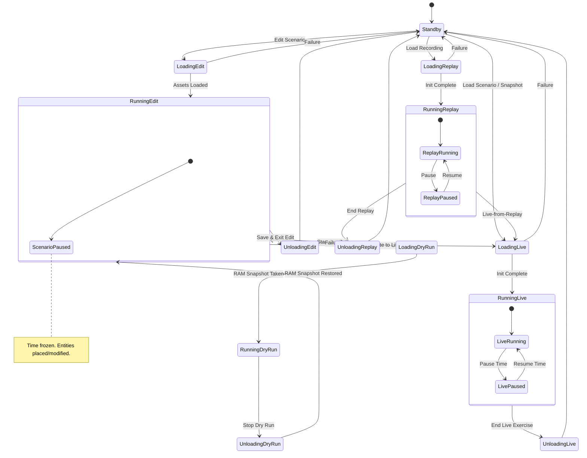
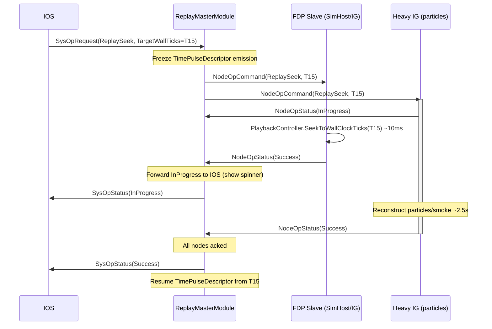
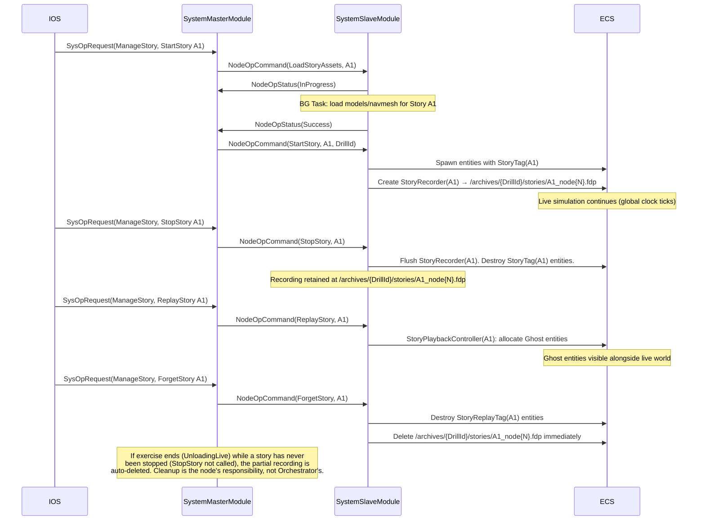
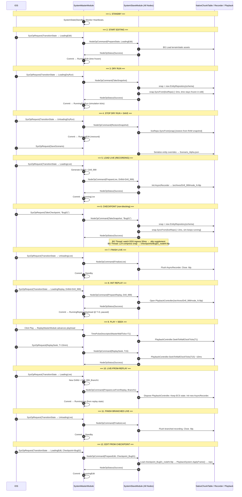

# Distributed Exercise Management System — Architecture Design

> **Document scope:** Architectural design for implementing the Exercise State Machine (ESM),
> distributed recording/replay, checkpoints, dry runs, stories, battlespaces, node health
> monitoring, and archive management across the Bagira/FDP platform.
>
> Based on the [design-talk.md](./design-talk.md) conversation; cross-referenced against the
> existing codebase as of March 2026.

---

## Table of Contents

1. [System Overview](#1-system-overview)
2. [DDS Message Schema — bdc-sst-orchestration](#2-dds-message-schema)
3. [Exercise State Machine (ESM)](#3-exercise-state-machine)
4. [SysOp / Two-Phase Commit (2PC) Orchestration Pattern](#4-sysop--two-phase-commit-orchestration-pattern)
5. [SystemMasterModule](#5-systemmastermodule)
6. [SystemSlaveModule](#6-systemslavemodule)
7. [Node Health Monitoring (Heartbeat & BIT)](#7-node-health-monitoring)
8. [Replay Subsystem](#8-replay-subsystem)
9. [Checkpoints & Dry Runs](#9-checkpoints--dry-runs)
10. [Stories — Multi-Tenant Micro-Scenarios](#10-stories--multi-tenant-micro-scenarios)
11. [Battlespaces](#11-battlespaces)
12. [Archive Export / Import](#12-archive-export--import)
13. [Deterministic Batch Runs](#13-deterministic-batch-runs)
14. [Key 12-Step Exercise Sequence Flow](#14-key-12-step-exercise-sequence-flow)
15. [Required Code Changes Summary](#15-required-code-changes-summary)

---

## 1. System Overview

### 1.1 Node Roles

```
┌─────────────────────────────────────────────────────────────────────────────┐
│                         BAGIRA DISTRIBUTED PLATFORM                         │
│                                                                             │
│  ┌──────────────┐  ┌──────────────┐  ┌──────────────┐  ┌──────────────┐ │
│  │     IOS      │  │  SimHost     │  │  IG          │  │ Orchestrator │ │
│  │  (Control)   │  │ (Simulation) │  │ (Visualise)  │  │  (Master)    │ │
│  │              │  │              │  │              │  │              │ │
│  │  SysOpReq ──►│  │ ◄─NodeOpCmd  │  │ ◄─NodeOpCmd  │  │ NodeOpCmd──► │ │
│  │ ◄─SysOpUpd   │  │  NodeOpSts──►│  │  NodeOpSts──►│  │◄─NodeOpSts  │ │
│  │  Heartbeat──►│  │  Heartbeat──►│  │  Heartbeat──►│  │  (all nodes) │ │
│  └──────────────┘  └──────────────┘  └──────────────┘  └──────┬───────┘ │
│         │                  ▲                  ▲                │          │
│         └──────────────────┴──────────────────┴────────────────┘          │
│                                                                             │
│  Orchestrator (Bagira.Orchestrator, subsystem of Bagira.Runner):            │
│  ┌──────────────────────────────────────────────────────────────────────┐  │
│  │ SystemMasterModule │ ESM State Machine │ Transaction Mgr │ Watchdog  │  │
│  │ OrchestratorContextTopic (TransientLocal) — late-joiner context      │  │
│  └──────────────────────────────────────────────────────────────────────┘  │
│                                                                             │
│  ─────────────────────────── CycloneDDS Bus ──────────────────────────── │
└─────────────────────────────────────────────────────────────────────────────┘
```

### 1.2 Control Planes

| Plane | Direction | Topic |
|-------|-----------|-------|
| Control Plane — Request | IOS → Master | `SysOpRequest` |
| Control Plane — Response | Master → IOS | `SysOpStatus` |
| Command Plane — Command | Master → All Nodes | `NodeOpCommand` |
| Command Plane — Status | All Nodes → Master | `NodeOpStatus` |
| Health Plane | Each Node → All | `NodeHeartbeat` |
| State Plane | Master → All (persistent) | `SystemStateTopic` |
| Context Plane | Orchestrator → All (persistent) | `OrchestratorContextTopic` |
| Time Plane | Time Master → All | `TimePulseDescriptor` (existing) |

---

## 2. DDS Message Schema

**IDL file:** `bdc-sst-orchestration`  
**C# namespace:** `Bagira.BDC.SSTD.Orchestration`  
**Project:** `Bagira.DDS.DataModel`

### 2.1 Enumerations

```csharp
// ─── Exercise State Machine States ───────────────────────────────────────────
public enum ESMState : int
{
    Standby           = 0,

    // Editing flow
    LoadingEdit       = 10,
    RunningEdit       = 11,
    UnloadingEdit     = 12,

    // Dry-run sub-loop (inside editing)
    LoadingDryRun     = 20,
    RunningDryRun     = 21,
    UnloadingDryRun   = 22,

    // Live simulation flow
    LoadingLive       = 30,
    RunningLive       = 31,
    UnloadingLive     = 32,

    // Replay flow
    LoadingReplay     = 40,
    RunningReplay     = 41,
    UnloadingReplay   = 42,

    // Error / degraded
    Degraded          = 99,
}

// ─── SysOp types (IOS → Master) ──────────────────────────────────────────────
public enum SysOpType : int
{
    TransitionState   = 1,   // Load/Unload/switch ESM states
    SaveScenario      = 2,   // Serialize scenario JSON
    LoadBattlespace   = 3,   // Load high-res terrain area
    TakeCheckpoint    = 4,   // Fast RAM snapshot
    CollectCheckpoint = 5,   // Gather checkpoint files to archive
    ExportArchive     = 6,   // Export drill recordings to cold storage
    ImportArchive     = 7,   // Import recordings from cold storage
    ManageStory       = 8,   // Start/Stop/Eval/Forget micro-scenario
    ReplaySeek        = 9,   // Jump replay to a specific wall-clock time
    PauseTime         = 10,
    ResumeTime        = 11,
}

// ─── Node operation types (Master → Nodes) ───────────────────────────────────
public enum NodeOpType : int
{
    PrepareState     = 1,
    CommitState      = 2,
    AbortTransaction = 3,
    TakeSnapshot     = 4,   // Non-blocking: node calls SyncFrom, passes buf to async thread
    RestoreSnapshot  = 5,
    PrepareBattlespace   = 7,
    CommitBattlespace    = 8,
    PrepareLive          = 9,
    FinalizeLive         = 10,
    PrepareReplay        = 11,
    FinalizeReplay       = 12,
    ReplaySeek           = 13,
    UploadChunk          = 14,  // Token-bucket archive upload
    StartStory           = 20,
    StopStory            = 21,
    ReplayStory          = 22,
    ForgetStory          = 23,
    LoadStoryAssets      = 24,
}

public enum OpStatus : int
{
    Pending    = 0,
    InProgress = 1,
    Success    = 2,
    Failure    = 3,
    Rejected   = 4,
}
```

### 2.2 DDS Topics

```csharp
// ─── Persistent system state (late-joiner safe) ──────────────────────────────
[DdsTopic("SystemState")]
[DdsIdlFile("bdc-sst-orchestration")]
[DdsQos(Reliability  = DdsReliability.Reliable,
        Durability   = DdsDurability.TransientLocal,
        HistoryKind  = DdsHistoryKind.KeepLast,
        HistoryDepth = 1)]
public partial struct SystemStateTopic
{
    public ESMState CurrentState;
    public Guid     DrillId;          // Unique key per exercise run
    public long     StateStartWallTicks;  // wall-clock start of current state
    public int      TransactionEpoch; // Increments on each successful transition
}

// ─── IOS → Master ────────────────────────────────────────────────────────────
[DdsTopic("SysOpRequest")]
[DdsIdlFile("bdc-sst-orchestration")]
[DdsQos(Reliability = DdsReliability.Reliable, Durability = DdsDurability.Volatile)]
public partial struct SysOpRequest
{
    public Guid       RequestId;
    public SysOpType  OperationType;
    public string     PayloadJson;   // Operation-specific params (nullable)
}

// ─── Master → IOS ────────────────────────────────────────────────────────────
[DdsTopic("SysOpStatus")]
[DdsIdlFile("bdc-sst-orchestration")]
[DdsQos(Reliability = DdsReliability.Reliable, Durability = DdsDurability.Volatile)]
public partial struct SysOpStatus
{
    public Guid      RequestId;
    public OpStatus  Status;
    public int       ErrorCode;
    public string    ResultJson;
}

// ─── Master → All Nodes ──────────────────────────────────────────────────────
[DdsTopic("NodeOpCommand")]
[DdsIdlFile("bdc-sst-orchestration")]
[DdsQos(Reliability = DdsReliability.Reliable, Durability = DdsDurability.Volatile)]
public partial struct NodeOpCommand
{
    public Guid        TransactionId;
    public NodeOpType  Operation;
    public string      PayloadJson;
}

// ─── All Nodes → Master ──────────────────────────────────────────────────────
[DdsTopic("NodeOpStatus")]
[DdsIdlFile("bdc-sst-orchestration")]
[DdsQos(Reliability = DdsReliability.Reliable, Durability = DdsDurability.Volatile)]
public partial struct NodeOpStatus
{
    public Guid      TransactionId;
    public int       NodeId;
    public OpStatus  Status;
    public bool      IsParticipating;  // false = node opted out, Master skips it
    public int       ErrorCode;
    public string    ResultJson;
}

// ─── Health / BIT (all nodes, autonomous 1 Hz) ───────────────────────────────
[DdsTopic("NodeHeartbeat")]
[DdsIdlFile("bdc-sst-orchestration")]
[DdsQos(Reliability  = DdsReliability.BestEffort,
        Durability   = DdsDurability.TransientLocal,
        HistoryKind  = DdsHistoryKind.KeepLast,
        HistoryDepth = 1)]
public partial struct NodeHeartbeat
{
    [DdsKey]
    public int     NodeId;
    public string  SubsystemName;
    public ESMState LocalEsmState;       // What the node thinks the ESM state is
    public long    WallTicksUtc;
    public float   CpuUsagePercent;
    public long    RamUsedBytes;
    public bool    SimTickAdvancing;     // false if ECS main loop is stalled
    public string  SubsystemsJson;       // JSON dict: { "Recorder": "Healthy", ... }
}

// ─── Late-joiner / exercise context (Orchestrator → All, TransientLocal) ──────
// Published/updated by the Orchestrator whenever the exercise context changes.
// Late-joining nodes read this once to catch up on what exercise is running.
[DdsTopic("OrchestratorContext")]
[DdsIdlFile("bdc-sst-orchestration")]
[DdsQos(Reliability  = DdsReliability.Reliable,
        Durability   = DdsDurability.TransientLocal,
        HistoryKind  = DdsHistoryKind.KeepLast,
        HistoryDepth = 1)]
public partial struct OrchestratorContextTopic
{
    public ESMState CurrentState;
    public Guid     DrillId;
    public int      TransactionEpoch;
    public string   ScenarioId;           // Which scenario is loaded (nullable)
    public string   ArchiveBasePath;      // Where recordings are stored
    public string   RequiredNodeIdsJson;  // JSON int[] — which NodeIds are expected
    public long     StateStartWallTicks;
}

// ─── Replay-specific time pulse (Orchestrator → All, during RunningReplay) ───
// NOTE: ReplayTimePulse reuses the existing TimePulseDescriptor DDS topic
// but is driven by ReplayMasterModule's playhead instead of the normal
// MasterTimeController. No new topic is needed; the consumer must check
// SystemStateTopic.CurrentState == RunningReplay to interpret it correctly.
```

---

## 3. Exercise State Machine

```
┌──────────────────────────────────────────────────────────────────────────────┐
│                         EXERCISE STATE MACHINE (ESM)                         │
└──────────────────────────────────────────────────────────────────────────────┘

                      ┌──────────┐
                      │ Standby  │◄─────────────────────────────────┐
                      └────┬─────┘                                   │
            ┌──────────────┼──────────────┐                          │
            │              │              │                          │
      Load  │        Load  │       Load   │                          │
      Edit  ▼        Live  ▼       Rplay  ▼                          │
    ┌────────────┐  ┌─────────────┐  ┌────────────────┐             │
    │LoadingEdit │  │ LoadingLive │  │ LoadingReplay  │             │
    └─────┬──────┘  └──────┬──────┘  └───────┬────────┘             │
          │                │                  │                      │
          ▼                ▼                  ▼                      │
    ┌────────────┐  ┌─────────────┐  ┌────────────────┐             │
    │RunningEdit │  │ RunningLive │  │ RunningReplay  │             │
    └──┬──────┬──┘  └──┬──────┬───┘  └──┬──────┬──────┘             │
       │      │        │  ▲   │         │  ▲   │                    │
  Start│      │Unload  │  │   │Unload   │  │   │Unload             │
  DryRun      │Edit    │Pause │Live     │ Pause│Replay             │
       │      │        │  │   │         │  │   │                    │
       ▼      │        ▼  │   ▼         ▼  │   ▼                    │
  ┌──────────┐│   ┌──────────────┐  ┌──────────────────┐           │
  │LoadingDR ││   │UnloadingLive │  │UnloadingReplay   │           │
  └────┬─────┘│   └──────┬───────┘  └──────────┬───────┘           │
       │      │          │                      │                    │
       ▼      │          └──────────────────────┴────────────────────┘
  ┌───────────┐                         (→ Standby)
  │RunningDR  │  ("DryRun")
  └────┬──────┘
       │ Stop DryRun
       ▼
  ┌────────────────┐
  │UnloadingDryRun │
  └────────┬───────┘
           │ RAM snapshot restored
           └──────────────────────► RunningEdit
```

### 3.1 Valid State Transitions

```
Standby            → LoadingEdit, LoadingLive, LoadingReplay
LoadingEdit        → RunningEdit, Standby (failure)
RunningEdit        → LoadingDryRun, LoadingLive, UnloadingEdit
LoadingDryRun      → RunningDryRun, RunningEdit (failure)
RunningDryRun      → UnloadingDryRun
UnloadingDryRun    → RunningEdit
UnloadingEdit      → Standby
LoadingLive        → RunningLive, Standby (failure)
RunningLive        → UnloadingLive
UnloadingLive      → Standby
LoadingReplay      → RunningReplay, Standby (failure)
RunningReplay      → UnloadingReplay, LoadingLive (Live-from-Replay)
UnloadingReplay    → Standby
Any                → Degraded (health failure)
```

> **Asset caching across Standby:** When transitioning through Standby back to a new
> `LoadingX` state, nodes MUST NOT force a full asset reload. Assets loaded in RAM are
> retained; only assets that differ between old and new scenario are unloaded/reloaded.
> This means `RunningEdit → LoadingLive` (via direct or via Standby) avoids re-scanning
> files that are already resident.

> **Mermaid version** (copy into a Mermaid renderer):



---

## 4. SysOp / Two-Phase Commit Orchestration Pattern

The entire distributed coordination uses a **Two-Phase Commit (2PC)** pattern:

```
IOS              Master                     All Slave Nodes
 │                 │                               │
 │ SysOpRequest    │                               │
 ├────────────────►│                               │
 │                 │── validates state ─┐          │
 │                 │◄──────────────────┘          │
 │                 │                               │
 │                 │  NodeOpCommand(PREPARE)       │
 │                 ├──────────────────────────────►│
 │                 │                               │── bg Task ──►
 │                 │  NodeOpStatus(InProgress)     │
 │                 │◄──────────────────────────────┤
 │ SysOpStatus     │                               │── heavy work...
 │ (InProgress) ◄──┤                               │
 │                 │  NodeOpStatus(Success)        │◄── bg Task done
 │                 │◄──────────────────────────────┤
 │                 │  (all nodes acked)            │
 │                 │                               │
 │                 │  NodeOpCommand(COMMIT)        │
 │                 ├──────────────────────────────►│
 │                 │── updates SystemStateTopic    │
 │ SysOpStatus     │                               │
 │ (Success) ◄─────┤                               │
 │                 │                               │
```

### 4.1 Failure Path (Abort)

```
 │                 │   NodeOpStatus(Failure)       │
 │                 │◄──────────────────────────────┤
 │                 │                               │
 │                 │  NodeOpCommand(ABORT)         │
 │                 ├──────────────────────────────►│── drop StagedAssetPayload
 │ SysOpStatus     │                               │
 │ (Failure) ◄─────┤                               │
```

### 4.2 Transaction Epoch (Split-Brain Recovery)

`SystemStateTopic.TransactionEpoch` is incremented on every successful commit.  
A node that "missed" a commit detects this on the next heartbeat cycle by comparing
its local epoch against the published epoch. It self-heals if it completed the
Prepare phase; otherwise it transitions to `Degraded`.

---

## 5. SystemMasterModule

**Location:** `Bagira.Orchestrator/SystemMasterModule.cs` (new — lives in a dedicated
`Bagira.Orchestrator` project, registered as a subsystem of `Bagira.Runner`).
`Bagira.Runner` is just a shell; `Bagira.Orchestrator` runs as a separate process.

> **Late-joiner support:** On every ESM state transition the Orchestrator publishes an
> updated `OrchestratorContextTopic` (TransientLocal, HistoryDepth=1). Any node that
> joins after the transition reads the latest sample immediately and executes its internal
> join procedure (load assets, sync state, etc.).

### 5.1 Responsibilities
- Owns the **ESM** — sole writer of `SystemStateTopic`
- Manages the **Node Roster** via `NodeHeartbeat` consumption
- Executes **2PC transactions** without blocking the main ECS loop
- Generates new `DrillId` GUID when entering any non-Standby session
- Provides **`SysOpRequest`** validation and rejection logic

### 5.2 Internal Data Structures

```csharp
// ─── Active distributed transaction ──────────────────────────────────────────
class DistributedTransaction
{
    public Guid       TransactionId;
    public Guid       OriginRequestId;     // back-ref to SysOpRequest
    public NodeOpType PrepareOp;
    public NodeOpType CommitOp;
    public ESMState   TargetEsmState;
    public HashSet<int> PendingNodes;      // cloned from ActiveNodes at T=0
    public float      ElapsedSeconds;
    public float      TimeoutSeconds;      // configurable, default 30s
    public bool       AllowPartialSuccess; // e.g. non-critical loggers
}

// ─── Node health profile ──────────────────────────────────────────────────────
class NodeHealthProfile
{
    public int     NodeId;
    public string  SubsystemName;
    public ESMState LastReportedState;
    public float   SecondsSinceLastHeartbeat;
    public bool    IsCritical;   // if true and goes offline → fault the ESM
}
```

### 5.3 Tick() Logic (runs every ECS frame at BeforeSync phase)

```
┌─ TICK ──────────────────────────────────────────────────────────────────┐
│                                                                          │
│  1. Consume NodeHeartbeat DDS queue                                      │
│     ├─ Update NodeHealthProfile.SecondsSinceLastHeartbeat = 0            │
│     └─ Detect missed heartbeats (> 5s) → prune or fault                  │
│                                                                          │
│  2. Consume SysOpRequest DDS queue (from IOS)                            │
│     ├─ Validate against current ESMState (reject if invalid)             │
│     └─ If valid → spawn DistributedTransaction, begin Phase 1            │
│                                                                          │
│  3. Consume NodeOpStatus DDS queue (from slave nodes)                    │
│     ├─ Match by TransactionId                                            │
│     ├─ InProgress: forward as SysOpStatus(InProgress) to IOS            │
│     ├─ Success / IsParticipating=false: remove from PendingNodes         │
│     └─ Failure: abort transaction, send SysOpStatus(Failure) to IOS     │
│                                                                          │
│  4. For each active transaction                                           │
│     ├─ Increment ElapsedSeconds                                          │
│     ├─ If timeout → abort                                                │
│     └─ If PendingNodes.Count == 0 → execute COMMIT:                      │
│         ├─ Publish NodeOpCommand(CommitOp)                               │
│         ├─ Write SystemStateTopic                                         │
│         └─ Publish SysOpStatus(Success) to IOS                           │
│                                                                          │
└──────────────────────────────────────────────────────────────────────────┘
```

### 5.4 DrillId Generation

```
Whenever transitioning OUT of Standby (to LoadingEdit, LoadingLive, LoadingReplay):
  _currentDrillId = Guid.NewGuid()

The DrillId is embedded in:
  - SystemStateTopic
  - NodeOpCommand payload JSON  (so nodes can name their .fdp files correctly)
  - AsyncRecorder filePath:  /archives/{DrillId}/node_{NodeId}.fdp
```

---

## 6. SystemSlaveModule

**Location:** `Bagira.SimHost/Modules/Orchestration/SystemSlaveModule.cs` (new)  
Also instantiated inside `Bagira.IG` and any other FDP node.

**IOS variant:** `Bagira.IOS` uses a **lightweight slave** — it has no ECS / FDP world,
so `SystemSlaveModule` must support a no-ECS mode.  The IOS slave still registers with
the Orchestrator (via heartbeat), participates in SysOps (replies `NodeOpStatus`), and
reacts to ESM state changes; it just skips any `IEsmHandler` that touches an
`EntityRepository`.

### 6.1 Responsibilities
- Listens to `NodeOpCommand` and dispatches to **registered ESM handlers**
- Manages idempotency (drops duplicate `TransactionId` commands)
- Publishes autonomous `NodeHeartbeat` at 1 Hz (wall-clock, independent of sim time)
- Bridges background async Task results back to the synchronous ECS loop
- Publishes `NodeOpStatus` responses

### 6.2 ESM Handler Registration

```csharp
public interface IEsmHandler
{
    // Returns true if this handler participates in the given operation
    bool CanHandle(NodeOpType op);

    // Called on background thread. Must not touch EntityRepository.
    // Returns null on success, error string on failure.
    Task<string?> PrepareAsync(NodeOpCommand cmd, CancellationToken ct);

    // Called on main thread at BeforeSync phase after all nodes Prepare-acked.
    void Commit(NodeOpCommand cmd, EntityRepository repo);

    // Called on main thread at BeforeSync phase if transaction is aborted.
    void Abort(NodeOpCommand cmd, EntityRepository repo);
}
```

Example handlers in `Bagira.SimHost`:
- `LiveLoadEsmHandler` — loads scenario assets, initialises `AsyncRecorder`
- `ReplayLoadEsmHandler` — opens `PlaybackController`
- `EditLoadEsmHandler` — loads static terrain, disables physics systems
- `CheckpointEsmHandler` — on TakeSnapshot: calls `destRepo.SyncFrom(liveRepo)` on
  main thread (no pause), then hands `destRepo` to background task for compression
- `BattlespaceEsmHandler` — manages staged terrain loading

### 6.3 Main Thread Command Queue

Because `NodeOpCommand` arrives on the DDS network thread, and ECS mutations must
happen at `BeforeSync`, the slave uses an internal pending-action queue:

```
Network Thread             SystemSlaveModule.Tick() (BeforeSync)
     │                                  │
     │  receives NodeOpCommand          │
     ├──► enqueue PendingMainThreadAction │
     │                                  │
     │                                  ├──► dequeue PendingMainThreadAction
     │                                  ├──► call handler.Commit(cmd, repo)
     │                                  └──► publish NodeOpStatus(Success)
```

### 6.4 Heartbeat Timer

```csharp
// SystemSlaveModule owns a Stopwatch (NOT sim time based)
private readonly Stopwatch _heartbeatTimer = Stopwatch.StartNew();

// In Tick():
if (_heartbeatTimer.Elapsed.TotalSeconds >= 1.0)
{
    _heartbeatTimer.Restart();
    _ddsWriter.Publish(new NodeHeartbeat
    {
        NodeId            = _config.NodeId,
        SubsystemName     = _config.Name,
        LocalEsmState     = _localEsmState,
        WallTicksUtc      = DateTime.UtcNow.Ticks,
        CpuUsagePercent   = GetCpuPercent(),
        RamUsedBytes      = GC.GetTotalMemory(false) + _unmanagedBytesUsed,
        SimTickAdvancing  = _lastTickVersion != _repo.GlobalVersion,
        SubsystemsJson    = BuildSubsystemsJson(),
    });
    _lastTickVersion = _repo.GlobalVersion;
}
```

### 6.5 ESM State Change Notifications (Internal)

Whenever `SystemSlaveModule` commits a new ESM state (after receiving a
`NodeOpCommand(CommitState, targetState)`), it raises an **internal `FdpEventBus`
event** — no new `IModule` interface hook is needed.

```csharp
// New internal event — published via FdpEventBus (not over DDS)
public struct EsmStateChangedEvent
{
    public ESMState Previous;
    public ESMState Next;
}

// In SystemSlaveModule, after commit:
_eventBus.Publish(new EsmStateChangedEvent { Previous = prev, Next = _localEsmState });
```

Any system that needs to react to ESM transitions (e.g. RecorderSystem,
PhysicsSystem) subscribes:

```csharp
_eventBus.Subscribe<EsmStateChangedEvent>(OnEsmStateChanged);
```

This decouples modules from the orchestration system entirely.

---

## 7. Node Health Monitoring

```
┌─────────────────────────────────────────────────────────────────────────┐
│  HEALTH MONITORING FLOW                                                  │
│                                                                          │
│  Each Node                   Master (SystemMasterModule)                 │
│    │                                │                                   │
│    │  NodeHeartbeat (1 Hz BestEffort)│                                   │
│    ├──────────────────────────────► │                                   │
│    │                                │── update NodeHealthProfile         │
│    │                                │── reset SecondsSinceLastHeartbeat  │
│    :   (silence > 5s)               │                                   │
│                                     │── SecondsSinceLastHB > 5          │
│                                     │                                   │
│                                     │ if node.IsCritical:               │
│                                     │   → publish SystemState(Degraded)│
│                                     │   → publish SysOpStatus(Failure)  │
│                                     │     to any active SysOp           │
│                                     │ else:                             │
│                                     │   → prune from ActiveNodes        │
│                                     │   → log warning                   │
└─────────────────────────────────────────────────────────────────────────┘
```

### 7.1 Node Criticality

Nodes are classified in the system configuration (`config.json`):

```json
{
  "nodes": [
    { "nodeId": 100, "name": "SimHost",  "critical": true  },
    { "nodeId": 200, "name": "IG",       "critical": true  },
    { "nodeId": 300, "name": "IOS",      "critical": false },
    { "nodeId": 400, "name": "DataLogger","critical": false }
  ]
}
```

---

## 8. Replay Subsystem

### 8.1 Components

| Component | Location | Role |
|-----------|----------|------|
| `ReplayMasterModule` | SimHost (Time Master node) | Drives the replay playhead; republishes `TimePulseDescriptor` with playhead wall-ticks |
| `ReplaySlaveModule` | Each FDP node | Consumes `TimePulseDescriptor`, calls `PlaybackController.SeekToFrame()`, disables simulation |

### 8.2 Integration with Existing PlaybackController

The existing `PlaybackController` (in `FDP/Kernel/Fdp.Kernel/FlightRecorder/PlaybackController.cs`)
already provides `SeekToFrame()` and `SeekToTick()`. However:

> ⚠️ **Gap:** Frame headers currently store only `repo.GlobalVersion` (ECS tick), not wall-clock
> time. See [Gap Analysis](./GAP-ANALYSIS.md#gap-1-wall-clock-timestamps-in-frame-headers).

After fixing that gap, the `PlaybackController` gains `SeekToWallClockTicks(long wallTicks)`.

### 8.3 ReplayMasterModule Internals

```
┌─ REPLAY MASTER TICK (BeforeSync phase) ──────────────────────────────────┐
│                                                                            │
│  _replayWallTicks += (long)(realDeltaSec * _playbackSpeed * TimeSpan      │
│                                            .TicksPerSecond)               │
│                                                                            │
│  if (_replayPaused) return;                                               │
│                                                                            │
│  Publish TimePulseDescriptor {                                             │
│      MasterWallTicks    = _replayWallTicks,  // ← playhead position       │
│      SimTimeSnapshot    = _replaySimSeconds,                               │
│      TimeScale          = _playbackSpeed,                                  │
│      SequenceId         = _seqId++,                                        │
│  }                                                                         │
└────────────────────────────────────────────────────────────────────────────┘
```

### 8.4 ReplaySlaveModule Internals

```
┌─ REPLAY SLAVE TICK (BeforeSync phase) ────────────────────────────────────┐
│                                                                             │
│  Read TimePulseDescriptor from DDS                                         │
│  if (pulse.SequenceId == _lastSeqId) return; // no new pulse               │
│                                                                             │
│  _playbackController.SeekToWallClockTicks(pulse.MasterWallTicks, _repo)   │
│      // Internally: binary search FrameIndex for nearest tick,             │
│      //             apply keyframe if needed, fast-forward deltas          │
│                                                                             │
│  _lastSeqId = pulse.SequenceId;                                            │
└─────────────────────────────────────────────────────────────────────────────┘
```

### 8.5 Disabling the Simulation During Replay

`ReplaySlaveModule` implements `IEsmHandler` for `PrepareReplay`. During commit it sets a
flag that causes the `ModuleHostKernel`'s scheduler to skip all modules tagged
`[SkipDuringReplay]`. The `ReplaySlaveModule` itself runs at `SystemPhase.BeforeSync`.

### 8.6 Heavy Seek (SysOp-coordinated)

Because seeking may take seconds on non-FDP nodes (volumetric IG, particle systems),
seeking is treated as a full `SysOpRequest(ReplaySeek)`:



---

## 9. Checkpoints & Dry Runs

### 9.1 Checkpoint (Non-Blocking Snapshot Protocol)

A checkpoint is a full clone of the `EntityRepository` taken **without pausing the
simulation**. The snapshot uses the same `EntityRepository.SyncFrom()` mechanism as
`DoubleBufferProvider.Update()` — no new API is needed in the kernel.

```
┌─ NON-BLOCKING SNAPSHOT PROTOCOL ─────────────────────────────────────────────┐
│                                                                               │
│  1. Orchestrator sends NodeOpCommand(TakeSnapshot, CheckpointId)             │
│                                                                               │
│  2. MAIN THREAD (BeforeSync) — immediately on receipt:                       │
│     ├─ var snap = new EntityRepository(liveRepo.Schema)                      │
│     ├─ snap.SyncFrom(liveRepo)     // unmanaged: NativeChunkTable memcpy     │
│     │                              // managed:   FdpAutoSerializer.DeepClone │
│     │                              // Takes ~2ms; simulation keeps running  │
│     └─ reply NodeOpStatus(Success)                                           │
│                                                                               │
│  3. BACKGROUND THREAD starts watching DDS ingress for ~50 ms                 │
│     ├─ Captures any in-flight DDS messages that had not yet been applied     │
│     │  to the ECS at snapshot time                                           │
│     └─ Writes: /archives/{DrillId}/checkpoints/{CheckpointId}_node{N}.dds   │
│                                                                               │
│  4. BACKGROUND THREAD serialises + LZ4-compresses snap                       │
│     └─ Writes: /archives/{DrillId}/checkpoints/{CheckpointId}_node{N}.fdp   │
│                                                                               │
│  RESTORE:                                                                    │
│  1. Load .fdp → PlaybackSystem.ApplyFrame() → repo (ECS snapshot)           │
│  2. Load .dds supplement → replay captured DDS messages into repo            │
│  3. Result: causally-consistent state without any pause                      │
│                                                                               │
└───────────────────────────────────────────────────────────────────────────────┘
```

> **Backing implementation:** `EntityRepository.SyncFrom()` in `EntityRepository.Sync.cs`
> already handles unmanaged component tables (fast `NativeChunkTable` memcpy) and
> managed tables (deep clone via `FdpAutoSerializer.DeepClone()` when
> `ComponentTypeRegistry.NeedsClone(typeId)` is true). This is identical to what
> `DoubleBufferProvider.Update()` does; no new snapshot API is needed.

### 9.2 Dry Run vs Named Checkpoint

| Feature | Dry Run Checkpoint | Named Checkpoint |
|---------|-------------------|------------------|
| Trigger | `LoadingDryRun` transition | Explicit `SysOpRequest(TakeCheckpoint)` |
| Storage | RAM only (`EntityRepository` in memory) | RAM + async disk (.fdp + .dds supplement) |
| Restore | Auto on `UnloadingDryRun` | Manual via IOS |
| DrillId context | In-progress edit session | Linked to current DrillId |
| Purpose | Quick scenario preview | Bug capture, session recovery |

---

## 10. Stories — Multi-Tenant Micro-Scenarios

### 10.1 ECS Components (NEW — FDP.Toolkit)

```csharp
// Added to FDP.Toolkit.Behavior (or Bagira.IG/Bagira.SimHost component registry)

[ComponentId(GlobalComponentIds.StoryTag)]        // NEW id needed
public struct StoryTag
{
    public Guid StoryId;
}

[ComponentId(GlobalComponentIds.StoryReplayTag)]  // NEW id needed
public struct StoryReplayTag
{
    public Guid StoryId;
    public int  OriginalEntityId;   // For debug/inspection
}
```

### 10.2 Architecture

```
┌───────────────────────────────────────────────────────────────────────────┐
│  LIVE SIMULATION (RunningLive)                                             │
│                                                                            │
│  Global ECS World                                                          │
│  ┌─────────────────────────────────────────────────────────────────────┐  │
│  │  Entity 1  (global terrain NPC — no StoryTag)                       │  │
│  │  Entity 2  (global terrain NPC — no StoryTag)                       │  │
│  │  Entity 10 [StoryTag: A1]  tank in Story A1                        │  │
│  │  Entity 11 [StoryTag: A1]  missile from Story A1 → chases E10     │  │
│  │  Entity 20 [StoryTag: B7]  helicopter in Story B7                  │  │
│  └─────────────────────────────────────────────────────────────────────┘  │
│                                                                            │
│  StoryRecorder(A1) → filters Query().With<StoryTag(A1)>()                 │
│  StoryRecorder(B7) → filters Query().With<StoryTag(B7)>()                 │
│  GlobalRecorder    → records everything (or everything above MinId)       │
└───────────────────────────────────────────────────────────────────────────┘
```

### 10.3 Filtered AsyncRecorder

The current `AsyncRecorder` uses `RecorderSystem.MinRecordableId` as the only filter.
A new `EntityQuery`-based predicate must be added:

```csharp
// RecorderSystem.cs addition
public Predicate<int>? EntityFilter { get; set; } = null;
// In RecordDeltaFrame: skip entity if Filter != null && !Filter(entityId)

// Story recorder setup:
var storyFilter = new StoryEntityFilter(storyId, repo);
storyRecorder.RecorderSystem.EntityFilter = storyFilter.Matches;
```

### 10.4 StoryPlaybackController — Entity Remapping

Global replay blasts raw `NativeChunkTable` memory (`memcpy`). This is safe because
global replay **owns the entire ECS** during `RunningReplay`.

Story replay is different: the global world is still **live**. We cannot overwrite
live entity memory. Instead:

```
Recording File: entity 10 → Position, Rotation, Damage
                entity 11 → Position, TargetId=10

StoryPlaybackController:
  1. Allocate new Ghost Entity 8000 → copy data for recorded entity 10
  2. Allocate new Ghost Entity 8001 → copy data for recorded entity 11
  3. Byte-patch entity 8001's TargetId field: 10 → 8000
     (using ComponentPatchMap for the missile component struct)
  4. Add StoryReplayTag to 8000, 8001

AI/Physics systems: skip any entity with StoryReplayTag
```

### 10.5 ComponentPatchMap (Entity Reference Patching)

```csharp
// Populated at startup by ComponentTypeRegistry.Register<T>()
class ComponentPatchMap
{
    public int    ComponentTypeId;
    public int[]  EntityFieldByteOffsets; // byte offsets of Entity fields within struct
}

// Registry scans struct fields using runtime reflection + Marshal.OffsetOf()
// at component registration time (startup only — no source generator needed).
//
// For MANAGED (class) ECS components: if the managed type contains Entity-typed
// fields, it must implement IEntityRefPatchable; otherwise registration throws
// NotSupportedException to catch incompatible types early.
//
// Example (unmanaged struct):
//   typeof(MissileComponent).GetFields()
//     .Where(f => f.FieldType == typeof(Entity))
//     .Select(f => (int)Marshal.OffsetOf<MissileComponent>(f.Name))
```

### 10.6 Story Lifecycle Sequence



---

## 11. Battlespaces

A **battlespace** is a named high-resolution area in the world, defined by a 2D polygon
of `GeoPosition` vertices. Loading its high-res terrain/navmesh may take seconds.

### 11.1 Staged Loading (2PC)

```
Phase 1 — PREPARE:
  NodeOpCommand(PrepareBattlespace, { id, bounds, dataPath })
  Node: Background Task loads NavMesh + high-res terrain into StagedAssetPayload
        (completely disconnected from active pointers)
  Node: reply NodeOpStatus(Success) when loaded

Phase 2 — COMMIT:
  NodeOpCommand(CommitBattlespace, { id })
  Node: At BeforeSync, push local ECS event CmdSwapBattlespace { id }
  Next Frame: PhysicsSystem and RenderSystem consume CmdSwapBattlespace,
              swap active pointer from old to new terrain
  (Old terrain pointer released for GC / NativeMemoryAllocator.Free)

ABORT (if any node fails Prepare):
  NodeOpCommand(AbortTransaction, txId)
  Node: Free StagedAssetPayload — no ECS mutation occurred
```

### 11.2 Battlespace DDS Message

```csharp
// In bdc-sst-orchestration IDL or a dedicated bdc-sst-terrain IDL
[DdsStruct]
public struct BattlespaceSpec
{
    public string     BattlespaceId;
    public GeoPosition[] Bounds;       // 2D polygon vertices
    public string     DataPath;        // Path to high-res terrain data
}
```

---

## 12. Archive Export / Import

### 12.1 Token-Bucket Upload

To prevent 50+ nodes saturating the network simultaneously:

```
Master Queue: [Node-100, Node-200, Node-300, ..., Node-N]
Token Budget: N_concurrent = config.ArchiveUploadConcurrency (default: 3)

while (Queue not empty && ActiveUploads < N_concurrent):
    node = Queue.Dequeue()
    send NodeOpCommand(UploadChunk, { destination, drillId })
    ActiveUploads++

on NodeOpStatus(node, Success):
    ActiveUploads--
    continue above loop

on NodeOpStatus(node, Failure/Timeout):
    log partial failure for node
    ActiveUploads--
    continue — don't halt entire export for one bad node
```

### 12.2 Recording Folder Structure

```
/archives/
└── {DrillId}/
    ├── node_100_SimHost.fdp
    ├── node_100_SimHost.fdp.meta.json
    ├── node_200_IG.fdp
    ├── node_200_IG.fdp.meta.json
    ├── checkpoints/
    │   ├── {CheckpointId}_node_100.fdp
    │   └── {CheckpointId}_node_200.fdp
    └── drill_manifest.json       ← DrillId, timestamp, node list, ESM log
```

### 12.3 Import Payload

```json
// SysOpRequest.PayloadJson for ImportArchive
{
  "DrillId": "...",
  "SourcePath": "\\\\nas\\cold-storage\\...",
  "NodeMapping": {
    "node_100_SimHost.fdp": 100,
    "node_200_IG.fdp": 200
  }
}
```

---

## 13. Deterministic Batch Runs

Existing infrastructure (`SteppedMasterController`, `SteppedSlaveController`,
`FrameOrderDescriptor`, `FrameAckDescriptor`) supports this.

### 13.1 Integration with SysOp

The `SystemMasterModule` **intercepts** all heavy `SysOpRequests` during deterministic
mode by signalling the `SteppedMasterController` to **halt frame emission**.

```
SysOp Intercept (Control Plane Superiority):
  1. SysOpRequest arrives (e.g., LoadBattlespace)
  2. SystemMasterModule → SteppedMasterController.HaltEmission()
  3. Slaves complete their current frame and freeze (no more FrameOrder received)
  4. 2PC executes safely (no concurrent ECS mutations)
  5. On success/abort → SteppedMasterController.ResumeEmission()
  6. Deterministic stepping resumes from next frame
```

### 13.2 LoadingLive with Deterministic Mode

```json
// SysOpRequest.PayloadJson
{
  "TargetState": "LoadingLive",
  "ScenarioId": "Desert_01",
  "TimeMode": "Deterministic",
  "FixedDeltaSeconds": 0.016667
}
```

---

## 14. Key 12-Step Exercise Sequence Flow

Below is the full IOS → Master → Slaves sequence for the canonical exercise scenario
described in the design talk.



---

## 15. Required Code Changes Summary

### 15.1 New Files

| File | Project | Description |
|------|---------|-------------|
| `Bagira.DDS.DataModel/Orchestration/OrchestrationMessages.cs` | `Bagira.DDS.DataModel` | All new DDS topics from §2 (incl. `OrchestratorContextTopic`) |
| `Bagira.Orchestrator/SystemMasterModule.cs` | `Bagira.Orchestrator` (new project) | Master orchestrator — runs as separate process via `Bagira.Runner` |
| `Bagira.Orchestrator/ReplayMasterModule.cs` | `Bagira.Orchestrator` | Replay playhead controller |
| `Bagira.IG/Modules/Orchestration/SystemSlaveModule.cs` | `Bagira.IG` | IG slave (FDP mode) |
| `Bagira.SimHost/Modules/Orchestration/SystemSlaveModule.cs` | `Bagira.SimHost` | SimHost slave (FDP mode) |
| `Bagira.IOS/Orchestration/IosSystemSlaveModule.cs` | `Bagira.IOS` | IOS slave (no-ECS lightweight variant) |
| `FDP/Kernel/Fdp.Kernel/FlightRecorder/StoryPlaybackController.cs` | `Fdp.Kernel` | Story entity-remapping playback |
| `FDP/Kernel/Fdp.Kernel/Orchestration/ComponentPatchMap.cs` | `Fdp.Kernel` | Entity ref offset patching (runtime reflection, no source generator) |
| `FDP/ModuleHost/ModuleHost.Core/Abstractions/IEsmHandler.cs` | `ModuleHost.Core` | ESM handler interface |
| `FDP/Kernel/Fdp.Kernel/Events/EsmStateChangedEvent.cs` | `Fdp.Kernel` | Internal FdpEventBus event for ESM transitions |
| `Bagira.SimHost/Modules/Orchestration/Handlers/LiveLoadEsmHandler.cs` | `Bagira.SimHost` | Scenario load + recorder init |
| `Bagira.SimHost/Modules/Orchestration/Handlers/ReplayLoadEsmHandler.cs` | `Bagira.SimHost` | PlaybackController init |
| `Bagira.SimHost/Modules/Orchestration/Handlers/CheckpointEsmHandler.cs` | `Bagira.SimHost` | Non-blocking SyncFrom snapshot handler |
| `Bagira.SimHost/Modules/Orchestration/Handlers/BattlespaceEsmHandler.cs` | `Bagira.SimHost` | Staged terrain loader |

### 15.2 Modified Files

| File | Change |
|------|--------|
| `FDP/Kernel/Fdp.Kernel/FlightRecorder/RecorderSystem.cs` | Add `EntityFilter` predicate + wall-clock tick to frame header |
| `FDP/Kernel/Fdp.Kernel/FlightRecorder/AsyncRecorder.cs` | Thread `EntityFilter` through to `RecorderSystem` |
| `FDP/Kernel/Fdp.Kernel/FlightRecorder/PlaybackController.cs` | Add `SeekToWallClockTicks()` using wall-clock frame index + binary search |
| `FDP/Toolkits/FDP.Toolkit.Time/Messages/TimeMessages.cs` | Document replay use of `TimePulseDescriptor.MasterWallTicks` |
| `Bagira.DDS.DataModel/Runner/SubsystemStatusAnnounce.cs` | No change — startup-only (separate `NodeHeartbeat` topic added) |
| `Bagira.SimHost/SimHostApp.cs` | Register `SystemSlaveModule`; no longer owns master (Orchestrator is separate) |
| `Bagira.IG/IgApplication.cs` | Register `SystemSlaveModule` |
| `Bagira.Runner/Services/WaitingRoomCoordinator.cs` | Integrate ESM Standby entry after waiting room completes; launch Orchestrator subprocess |

### 15.3 Batch Implementation Order

```
Batch 1: DDS Message Schema + ESM enums
         → OrchestrationMessages.cs, ESMState enum, SystemStateTopic

Batch 2: SystemMasterModule + SystemSlaveModule skeleton (no handlers yet)
         → NodeHeartbeat loop, SysOpRequest/Status publish, NodeOpCommand dispatch,
           basic Test: Standby → LoadingEdit → RunningEdit dummy transition

Batch 3: Wall-clock timestamps in FlightRecorder
         → RecorderSystem frame header change, PlaybackController.SeekToWallClockTicks()
         → Unit tests + schema version bump

Batch 4: Snapshot handler (non-blocking)
         → CheckpointEsmHandler using EntityRepository.SyncFrom()
           (reuse existing DoubleBufferProvider pattern — no new kernel API)
         → DDS supplement file for in-flight messages
         → Dry Run flow (SyncFrom + liveRepo.SyncFrom(snap) for restore)

Batch 5: Live + Replay ESM Handlers
         → LiveLoadEsmHandler (AsyncRecorder with DrillId paths)
         → ReplayLoadEsmHandler + ReplaySlaveModule
         → Full 8-12 step integration test

Batch 6: Stories + ComponentPatchMap
         → StoryTag, StoryReplayTag
         → Filtered AsyncRecorder
         → StoryPlaybackController + Entity Remapping

Batch 7: Battlespace + Archive
         → BattlespaceEsmHandler (staged loading)
         → Token-bucket archive export/import
```
