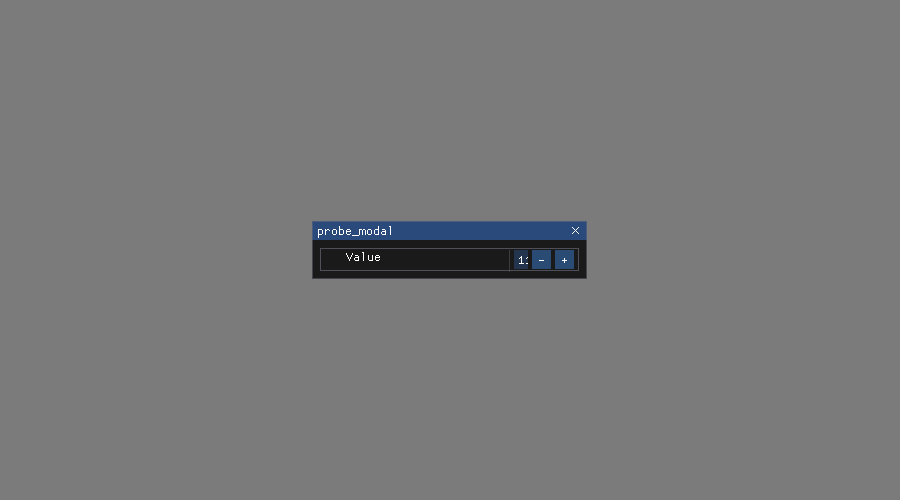
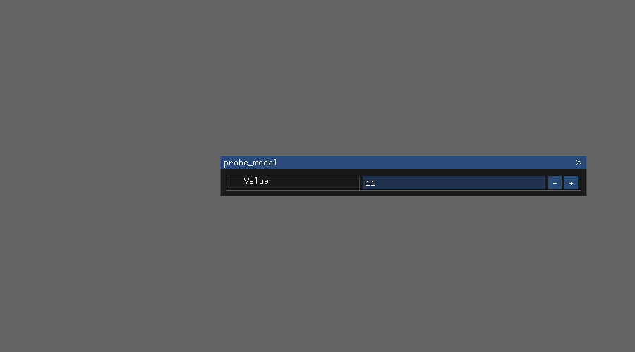

<!--STATUS
state: LIVE
build-state: DESIGN
updated: 2026-08-20
current-answer: this file — the PROOF that the ImGui layer is railable here, and the recipe.
stale-below: nothing.
known-rot: none.
known-conflict: R-21 / R-62 say "no headless rail can drive ImGui". This probe DISPROVES
  the premise on this machine. R-124 records the supersession; the two rulings stay in the
  ledger with their correction, because everything built under them was correct AT THE TIME.
-->
# ⭐⭐⭐ UI PROBE — **the ImGui layer IS railable. Proof, and the recipe.**

📌 **Why this exists.** Five consecutive batches shipped green (`3852 / 0`) while the feature was dead,
because **every defect lived in the one region no rail could reach** — a popup width, an ignored `ref`
flag, a missing `Draw()` call. 📄 [`FINDINGS_VisualCheck_PostBatch99.md`](../../docs/blueprints/FINDINGS_VisualCheck_PostBatch99.md) §6.

⭐⭐ **The premise was wrong.** The stack is **Raylib-cs 7.0.2 + rlImgui-cs 3.2.0**, this machine has
**Xvfb + Mesa software GL**, and Raylib ships `TakeScreenshot`. ⇒ ⛔ **a real frame can be rendered,
measured and photographed in CI.**

---

## ⭐ What the probe proved — **the actual Batch-99 defect, reproduced and fixed**

| | `GetContentRegionAvail().X` | screenshot |
|---|---|---|
| ⛔ **the defect** — `AlwaysAutoResize` popup + a `WidthStretch` column | **60.0 px** *(the clamp floor)* — `InputInt`'s `−`/`+` step buttons consume it, the number is clipped away |  |
| ✅ **the fix** — one `SetNextWindowSize(new Vector2(520, 0), ImGuiCond.Appearing)` | **305.0 px** — the value renders |  |

⭐⭐⭐ **Root-caused, fixed and VERIFIED without a human opening the editor.**

---

## ⭐ The recipe

```bash
cd tools/ui-probe
dotnet build -c Release
xvfb-run -a -s "-screen 0 1280x800x24" dotnet bin/Release/net8.0/rlprobe.dll
# writes probe.png next to the binary
```

⚠ Software GL is slow, ⛔ not a problem: a rail renders **a handful of frames**, not a game loop.

---

## ⭐⭐ Three kinds of assertion this unlocks — **in increasing strength**

| ⭐ | assertion | catches |
|---|---|---|
| **①** | ⭐⭐ **MEASURE inside a real frame** — `GetContentRegionAvail()`, `GetItemRectSize()`, `IsPopupOpen(id)` | ⛔ the width defect · ⛔ *"the modal is open but nobody draws it"* · ⛔ the `[x]` that reopens |
| **②** | ⭐ **pixel-region asserts** on the screenshot — *"the value column is not blank"* | layout collapses in general |
| **③** | ⚠ **golden-image diff** | ⛔ **use sparingly** — font/driver drift makes these brittle; ⭐ prefer ① |

⭐⭐⭐ **① is the big one, and it needs no image comparison at all** — ⛔ it is an ordinary assertion that
happens to run inside a rendered frame.

## ⛔ What it still does NOT do

⛔ **It does not simulate a human.** ⭐ It does not have to: the failures are **state → draw**, so a rail
puts the app in a state **programmatically** *(open the asset, select the variable, raise the gesture)*
and then renders. ⚠ **Input simulation is a separate, later question** — do not let it block ①.
